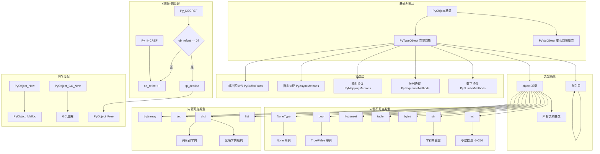
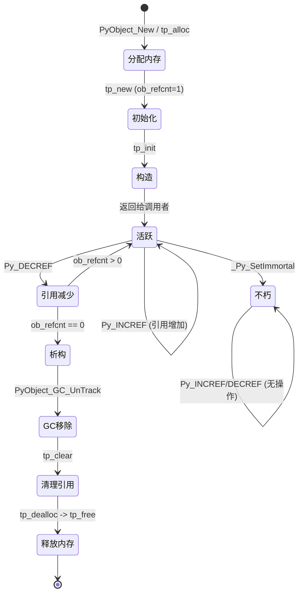
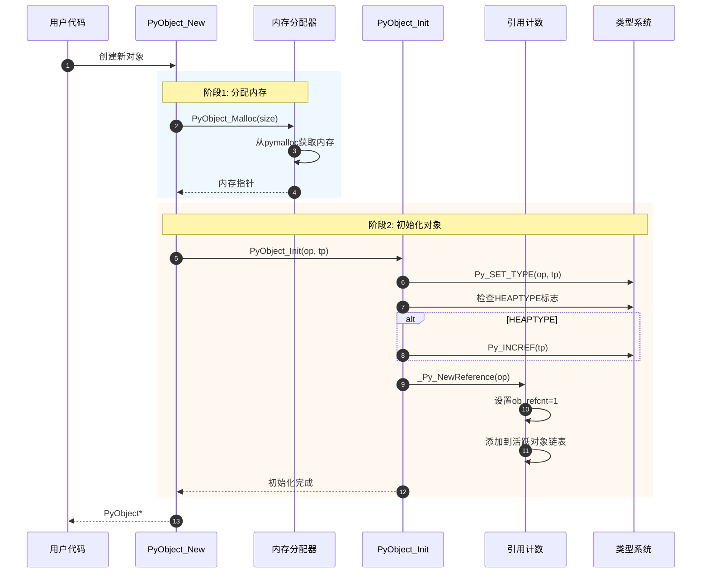
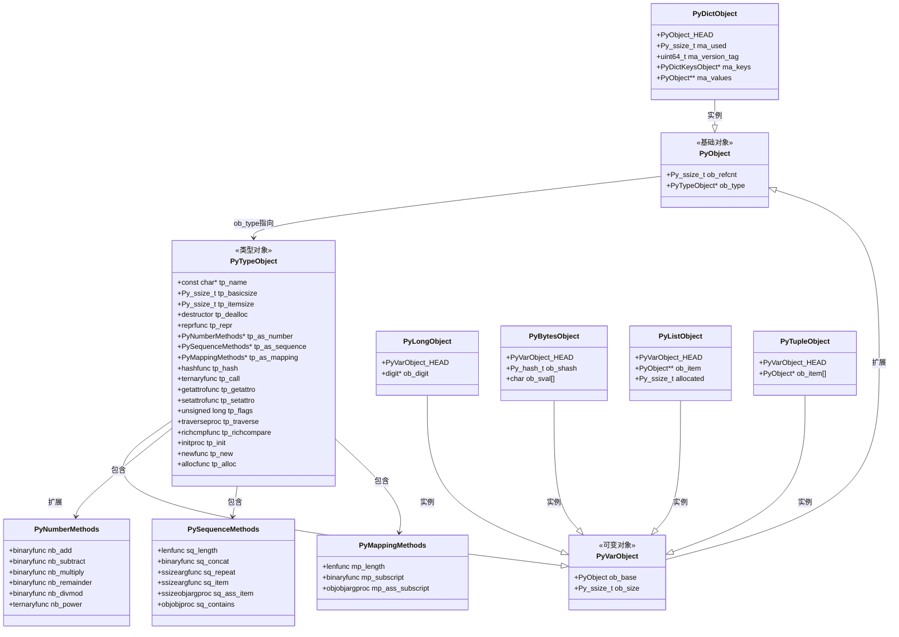
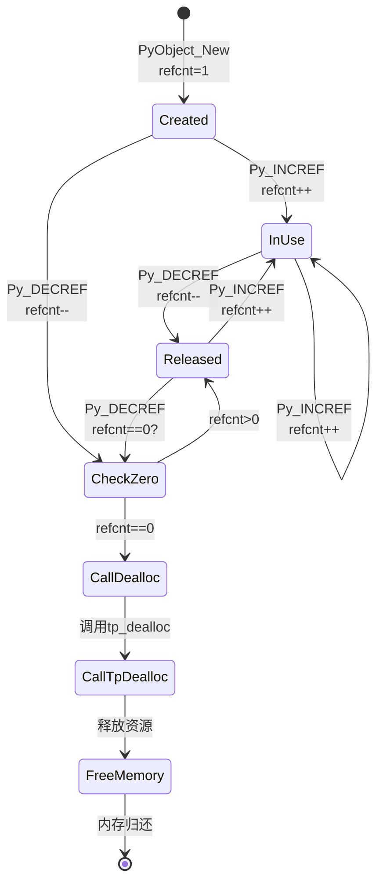
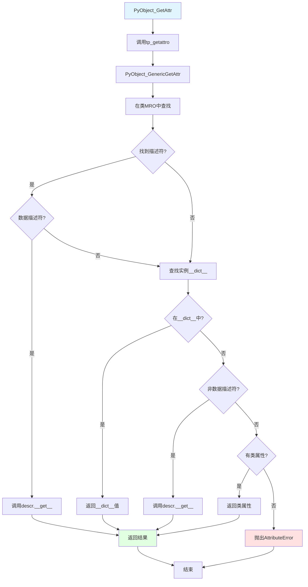
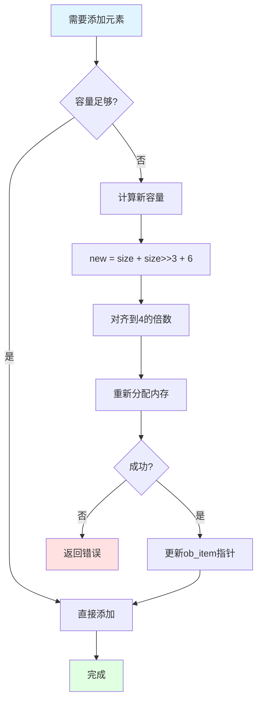

# CPython-04-对象系统-概览

## 1. 模块职责

对象系统（Objects）是 CPython 的核心基础设施，实现了 Python 的统一对象模型。所有 Python 值都是对象，所有对象都遵循统一的内存布局和生命周期管理规则。

### 核心职责

1. **统一对象表示**：定义 PyObject 基础结构，所有对象共享相同的头部
2. **类型系统**：实现 Python 的类型机制（type、metaclass、MRO）
3. **内置类型**：提供 int、str、list、dict、tuple 等内置类型的 C 实现
4. **引用计数**：自动内存管理的核心机制
5. **协议实现**：数字协议、序列协议、映射协议、迭代器协议等

### 输入与输出

**输入**：
- 类型定义（PyTypeObject）
- 对象创建请求（通过 tp_new/tp_alloc）
- 对象操作请求（属性访问、方法调用等）

**输出**：
- PyObject* 指针（所有对象的统一接口）
- 操作结果（新对象或修改后的对象）
- 异常信息（通过 PyErr_* 函数）

### 上下游依赖

**上游**（调用方）：
- `Python/ceval.c`：字节码执行器（每条指令都操作对象）
- `Python/compile.c`：编译器（创建 Code Object、常量对象）
- `Modules/*`：扩展模块（创建和操作对象）

**下游**（被调用）：
- `Objects/obmalloc.c`：内存分配器
- `Modules/gcmodule.c`：垃圾回收器
- `Python/errors.c`：异常处理

## 2. 整体架构图



### 架构说明

#### 1. PyObject - 万物之基

所有 Python 对象的基础结构，仅包含引用计数和类型指针：

```c
// 标准 GIL 模式（64位）
struct _object {
    union {
        PY_INT64_T ob_refcnt_full;  // 完整64位用于初始化
        struct {
            uint32_t ob_refcnt;      // 引用计数（32位）
            uint16_t ob_overflow;    // 溢出标志
            uint16_t ob_flags;       // 对象标志
        };
    };
    PyTypeObject *ob_type;           // 类型指针
};
```

**无 GIL 模式**（实验性，`--disable-gil`）：
```c
struct _object {
    uintptr_t ob_tid;          // 线程 ID
    uint16_t ob_flags;         // 对象标志
    PyMutex ob_mutex;          // 对象锁
    uint8_t ob_gc_bits;        // GC 位
    uint32_t ob_ref_local;     // 本地引用计数
    Py_ssize_t ob_ref_shared;  // 共享引用计数（原子操作）
    PyTypeObject *ob_type;     // 类型指针
};
```

**关键字段**：
- `ob_refcnt`：引用计数，0 时触发回收
- `ob_type`：指向类型对象，决定对象行为
- `ob_flags`：标志位（不朽对象、静态分配等）

**内存布局示例**：
```
64位系统，标准 GIL 模式：
+0:  ob_refcnt     (4 bytes)
+4:  ob_overflow   (2 bytes)
+6:  ob_flags      (2 bytes)
+8:  ob_type       (8 bytes，指针）
总计：16 bytes

32位系统：
+0:  ob_refcnt     (4 bytes)
+4:  ob_type       (4 bytes，指针）
总计：8 bytes
```

#### 2. PyVarObject - 变长对象

用于容器类型（list、tuple、str 等）：

```c
struct PyVarObject {
    PyObject ob_base;      // 基础对象头
    Py_ssize_t ob_size;    // 元素数量（非字节数）
};
```

**用途**：
- `list`：`ob_size` 是列表长度
- `tuple`：`ob_size` 是元组长度
- `str`：`ob_size` 是字符数量（非字节数）
- `bytes`：`ob_size` 是字节数量

#### 3. PyTypeObject - 类型对象

定义对象的类型信息和所有操作：

```c
struct _typeobject {
    PyVarObject_HEAD              // 继承自 PyVarObject
    const char *tp_name;          // 类型名称 "module.name"
    Py_ssize_t tp_basicsize;      // 基础大小（固定部分）
    Py_ssize_t tp_itemsize;       // 变长部分单元大小

    // 核心操作
    destructor tp_dealloc;        // 析构函数
    reprfunc tp_repr;             // __repr__
    hashfunc tp_hash;             // __hash__
    ternaryfunc tp_call;          // __call__
    reprfunc tp_str;              // __str__
    getattrofunc tp_getattro;     // __getattribute__
    setattrofunc tp_setattro;     // __setattr__

    // 协议套件
    PyNumberMethods *tp_as_number;      // 数字协议
    PySequenceMethods *tp_as_sequence;  // 序列协议
    PyMappingMethods *tp_as_mapping;    // 映射协议
    PyAsyncMethods *tp_as_async;        // 异步协议
    PyBufferProcs *tp_as_buffer;        // 缓冲区协议

    // GC 支持
    traverseproc tp_traverse;     // 遍历引用（GC 标记阶段）
    inquiry tp_clear;             // 清理引用（GC 清除阶段）

    // 继承与 MRO
    PyTypeObject *tp_base;        // 基类
    PyObject *tp_bases;           // 基类元组
    PyObject *tp_mro;             // 方法解析顺序（C3 算法）

    // 属性
    PyMethodDef *tp_methods;      // 方法列表
    PyMemberDef *tp_members;      // 成员列表
    PyGetSetDef *tp_getset;       // 属性描述符

    // 实例管理
    initproc tp_init;             // __init__
    allocfunc tp_alloc;           // 内存分配
    newfunc tp_new;               // __new__
    freefunc tp_free;             // 内存释放

    // 优化
    unsigned int tp_version_tag;  // 属性缓存版本
    uint16_t tp_versions_used;    // 已使用版本数

    // 标志
    unsigned long tp_flags;       // 类型标志
};
```

**重要标志**（`tp_flags`）：
- `Py_TPFLAGS_HAVE_GC`：支持 GC 追踪
- `Py_TPFLAGS_BASETYPE`：可被继承
- `Py_TPFLAGS_HEAPTYPE`：堆分配（动态创建）
- `Py_TPFLAGS_READY`：类型已初始化
- `Py_TPFLAGS_IMMUTABLETYPE`：不可变类型

#### 4. 类型系统核心：type 与 object

**type 是所有类型的类型**：
```python
>>> type(int)
<class 'type'>
>>> type(str)
<class 'type'>
>>> type(type)
<class 'type'>  # 自引用！
```

**object 是所有类的基类**：
```python
>>> int.__bases__
(<class 'object'>,)
>>> str.__bases__
(<class 'object'>,)
>>> object.__bases__
()  # 没有基类
```

**C 层面的实现**：
```c
// PyType_Type 是 type 类型的类型对象
PyTypeObject PyType_Type = {
    PyVarObject_HEAD_INIT(&PyType_Type, 0)  // 自引用！
    "type",                                  // tp_name
    sizeof(PyHeapTypeObject),                // tp_basicsize
    ...
    type_call,                               // tp_call (调用类创建实例)
    ...
};

// PyBaseObject_Type 是 object 类型的类型对象
PyTypeObject PyBaseObject_Type = {
    PyVarObject_HEAD_INIT(&PyType_Type, 0)  // type 是 object 的类型
    "object",                                // tp_name
    sizeof(PyObject),                        // tp_basicsize
    ...
};
```

**关系图**：
```
┌─────────┐         ┌─────────┐
│  type   │────────>│  type   │  (ob_type 自引用)
└─────────┘         └─────────┘
     │
     │ ob_type
     ↓
┌─────────┐
│ object  │  (tp_base = NULL)
└─────────┘
     │
     │ tp_base
     ↓
┌─────────┐         ┌─────────┐
│   int   │────────>│  type   │  (ob_type)
└─────────┘         └─────────┘
```

#### 5. 引用计数机制

**基本操作**：

```c
// 增加引用计数
#define Py_INCREF(op) (                 \
    _Py_IsImmortal(op) ? (void)0 :      \
    (op)->ob_refcnt++)

// 减少引用计数
#define Py_DECREF(op) do {              \
    if (!_Py_IsImmortal(op) &&          \
        --((PyObject*)(op))->ob_refcnt == 0) { \
        _Py_Dealloc((PyObject*)(op));   \
    }                                   \
} while (0)

// 安全递增（检查 NULL）
#define Py_XINCREF(op) do {             \
    if ((op) != NULL) Py_INCREF(op);    \
} while (0)

// 安全递减（检查 NULL）
#define Py_XDECREF(op) do {             \
    if ((op) != NULL) Py_DECREF(op);    \
} while (0)
```

**不朽对象**（Immortal Objects）：

Python 3.12+ 引入，某些对象永不回收：
```c
// 不朽对象的引用计数特殊值
#define _Py_IMMORTAL_INITIAL_REFCNT  (UINT_MAX >> 2)

// 单例对象
Py_None   // None
Py_True   // True
Py_False  // False

// 小整数（-5 到 256）
PyLong_FromLong(42)  // 返回缓存的对象

// 驻留字符串
PyUnicode_InternFromString("__name__")
```

**优势**：
- 多解释器共享：降低内存占用
- 无需原子操作：提升无 GIL 模式性能
- 简化生命周期：不会意外释放

**对象销毁流程**：

```c
void _Py_Dealloc(PyObject *op)
{
    PyTypeObject *type = Py_TYPE(op);
    destructor dealloc = type->tp_dealloc;

    // 1. 防止栈溢出（使用 Trashcan 机制）
    if (递归深度 > 阈值 && 对象可 GC) {
        _PyTrash_thread_deposit_object(op);
        return;
    }

    // 2. 调用析构函数
    (*dealloc)(op);  // 例如：list_dealloc, dict_dealloc
}
```

**典型析构函数**：
```c
static void list_dealloc(PyListObject *op)
{
    Py_ssize_t i;
    // 1. 从 GC 中移除
    PyObject_GC_UnTrack(op);
    // 2. 清理引用（防止循环引用）
    Py_TRASHCAN_BEGIN(op, list_dealloc)
    if (op->ob_item != NULL) {
        i = Py_SIZE(op);
        while (--i >= 0) {
            Py_XDECREF(op->ob_item[i]);  // 递减元素引用
        }
        PyMem_Free(op->ob_item);  // 释放数组内存
    }
    Py_TRASHCAN_END
    // 3. 释放对象本身
    Py_TYPE(op)->tp_free((PyObject *)op);
}
```

#### 6. 内置类型实现

##### 6.1 整数（int）

**小整数池**：
```c
// 范围：-5 到 256
#define NSMALLNEGINTS  5
#define NSMALLPOSINTS  257

static PyLongObject *small_ints[NSMALLNEGINTS + NSMALLPOSINTS];
```

**大整数表示**（任意精度）：
```c
struct _longobject {
    PyVarObject ob_base;
    digit ob_digit[1];  // 变长数组，digit 是 uint30_t
};
```

**位数计算**：
- 32位系统：每个 digit 15 位
- 64位系统：每个 digit 30 位
- 支持无限大小（受限于内存）

##### 6.2 字符串（str）

**紧凑表示**（Python 3.3+）：
```c
typedef struct {
    PyObject_HEAD
    Py_ssize_t length;         // 字符数（非字节数）
    Py_hash_t hash;            // 缓存哈希值（-1 表示未计算）
    struct {
        unsigned int interned:2;    // 驻留状态
        unsigned int kind:3;        // 字符宽度
        unsigned int compact:1;     // 是否紧凑
        unsigned int ascii:1;       // 是否纯 ASCII
        unsigned int ready:1;       // 是否已准备
        unsigned int :24;
    } state;
    wchar_t *wstr;             // 宽字符缓存（可选）
} PyASCIIObject;

// 紧凑 Unicode 对象（非 ASCII）
typedef struct {
    PyASCIIObject _base;
    Py_ssize_t utf8_length;    // UTF-8 长度
    char *utf8;                // UTF-8 缓存
    Py_ssize_t wstr_length;    // 宽字符长度
} PyCompactUnicodeObject;
```

**字符宽度**（`kind`）：
- `PyUnicode_1BYTE_KIND`：纯 ASCII 或 Latin-1（1 字节/字符）
- `PyUnicode_2BYTE_KIND`：UCS-2（2 字节/字符）
- `PyUnicode_4BYTE_KIND`：UCS-4（4 字节/字符）

**字符串驻留**：
```c
PyObject *PyUnicode_InternFromString(const char *s);
```
- 相同内容共享同一对象
- 常见用途：属性名、关键字、常量字符串
- 提升比较性能（指针比较代替内容比较）

##### 6.3 列表（list）

```c
typedef struct {
    PyVarObject ob_base;
    PyObject **ob_item;        // 元素数组（指针数组）
    Py_ssize_t allocated;      // 已分配容量
} PyListObject;
```

**容量增长策略**：
```python
# 新容量计算
new_allocated = (new_size + (new_size >> 3) + 6) & ~(size_t)3

# 例如：
# 0 -> 4
# 1 -> 4
# 4 -> 8
# 8 -> 16
# 16 -> 20
# 100 -> 116
```

**关键操作复杂度**：
- `list[i]`：O(1)
- `list.append(x)`：平摊 O(1)
- `list.insert(i, x)`：O(n)
- `list.pop()`：O(1)
- `list.pop(0)`：O(n)

##### 6.4 字典（dict）

**紧凑有序字典**（Python 3.6+）：

```c
typedef struct {
    PyObject_HEAD
    Py_ssize_t ma_used;              // 已用条目数
    uint64_t ma_version_tag;         // 版本标签（属性缓存）
    PyDictKeysObject *ma_keys;       // 键表（可共享）
    PyObject **ma_values;            // 值数组（分离表）或 NULL（合并表）
} PyDictObject;
```

**键表结构**：
```c
struct _dictkeysobject {
    Py_ssize_t dk_refcnt;            // 引用计数（共享键）
    uint8_t dk_log2_size;            // log2(哈希表大小)
    uint8_t dk_log2_index_bytes;     // log2(索引字节大小)
    uint8_t dk_kind;                 // 键类型
    uint32_t dk_version;             // 版本号
    Py_ssize_t dk_usable;            // 可用槽位
    Py_ssize_t dk_nentries;          // 已用条目数

    // 动态数组（实际分配在后面）
    char dk_indices[];               // 哈希索引（1/2/4/8 字节）
    PyDictKeyEntry dk_entries[];     // 键值对数组
};
```

**存储模式**：

1. **合并表**（ma_values == NULL）：
   - 键值对存储在 dk_entries
   - 通用字典使用

2. **分离表**（ma_values != NULL）：
   - 键存储在 ma_keys（共享）
   - 值存储在 ma_values（独立）
   - 仅限字符串键
   - 实例属性字典使用（共享类的键）

**哈希冲突解决**：开放寻址 + 线性探测

```c
// 探测序列（伪代码）
size_t perturb = hash;
size_t i = hash & mask;
while (slot_is_occupied(i)) {
    perturb >>= 5;
    i = (i * 5 + 1 + perturb) & mask;
}
```

**容量增长**：
```
8 -> 16 -> 32 -> 64 -> 128 -> 256 -> ...
```
- 装载因子：2/3（66.7%）
- 达到阈值时扩容为 2 倍

#### 7. 协议层

协议定义了类型的可选行为：

**数字协议**（PyNumberMethods）：
```c
typedef struct {
    binaryfunc nb_add;              // __add__
    binaryfunc nb_subtract;         // __sub__
    binaryfunc nb_multiply;         // __mul__
    unaryfunc nb_negative;          // __neg__
    inquiry nb_bool;                // __bool__
    binaryfunc nb_or;               // __or__
    // ... 共 38 个操作
} PyNumberMethods;
```

**序列协议**（PySequenceMethods）：
```c
typedef struct {
    lenfunc sq_length;              // __len__
    binaryfunc sq_concat;           // __add__ (序列连接)
    ssizeargfunc sq_item;           // __getitem__
    ssizeobjargproc sq_ass_item;    // __setitem__
    objobjproc sq_contains;         // __contains__
    // ... 共 10 个操作
} PySequenceMethods;
```

**映射协议**（PyMappingMethods）：
```c
typedef struct {
    lenfunc mp_length;              // __len__
    binaryfunc mp_subscript;        // __getitem__
    objobjargproc mp_ass_subscript; // __setitem__
} PyMappingMethods;
```

**优先级**：映射协议 > 序列协议

**示例**：`list` 同时实现序列和映射协议，`[]` 运算符优先使用映射协议。

## 3. 对象生命周期



### 生命周期阶段说明

#### 1. 创建阶段

**方式一：通过类型对象**
```c
PyObject *obj = PyObject_New(MyObject, &MyType);
if (obj == NULL) {
    return NULL;  // 内存分配失败
}
// obj->ob_refcnt = 1
// obj->ob_type = &MyType
```

**方式二：通过 tp_new**
```c
// Python: obj = MyClass()
// C 层面：
PyObject *obj = MyType.tp_new(&MyType, args, kwargs);
if (obj != NULL && MyType.tp_init != NULL) {
    if (MyType.tp_init(obj, args, kwargs) < 0) {
        Py_DECREF(obj);
        return NULL;
    }
}
```

**方式三：工厂函数**
```c
PyObject *list = PyList_New(10);       // 预分配10个元素
PyObject *dict = PyDict_New();         // 空字典
PyObject *str = PyUnicode_FromString("hello");
PyObject *num = PyLong_FromLong(42);   // 小整数池
```

#### 2. 活跃阶段

**引用获取**：
```c
// 场景1：赋值给变量
PyObject *x = obj;
Py_INCREF(x);  // 新引用

// 场景2：添加到容器
PyList_Append(list, obj);  // list 内部会 INCREF

// 场景3：作为函数参数
func(obj);  // 函数内部应 INCREF 如果保存引用
```

**引用释放**：
```c
// 场景1：变量超出作用域
{
    PyObject *temp = PyLong_FromLong(100);
    // ... 使用 temp ...
    Py_DECREF(temp);  // 作用域结束前释放
}

// 场景2：从容器移除
PyObject *item = PyList_GetItem(list, 0);  // 借用引用
PySequence_DelItem(list, 0);  // list 内部会 DECREF

// 场景3：函数返回
PyObject *func() {
    PyObject *result = PyLong_FromLong(42);
    return result;  // 调用者负责 DECREF
}
```

#### 3. 销毁阶段

**触发条件**：
- 引用计数归零
- 解释器关闭（强制回收）

**Trashcan 机制**（防止栈溢出）：
```c
// 问题场景：深度嵌套容器
list1 = [list2]
list2 = [list3]
...
list1000 = [None]
del list1  // 会递归调用1000次 list_dealloc

// Trashcan 解决方案：
void _Py_Dealloc(PyObject *op) {
    if (递归深度 > 阈值) {
        // 延迟释放：放入待处理队列
        _PyTrash_thread_deposit_object(op);
        return;
    }
    // 正常释放
    (*Py_TYPE(op)->tp_dealloc)(op);
}
```

#### 4. 不朽状态

**设置不朽**：
```c
void _Py_SetImmortal(PyObject *op) {
    op->ob_refcnt = _Py_IMMORTAL_INITIAL_REFCNT;  // UINT_MAX >> 2
}
```

**不朽对象列表**：
- 单例：`None`, `True`, `False`, `Ellipsis`
- 小整数：-5 到 256
- 空容器单例：`()`, `frozenset()`
- 驻留字符串（可选）
- 类型对象：`type`, `object`, `int`, `str` 等

**优势**：
- 无需原子操作（无 GIL 模式下性能提升）
- 多解释器共享（节省内存）
- 简化生命周期管理

## 4. 属性访问机制

### 4.1 属性查找顺序（MRO + 描述符协议）

```mermaid
flowchart TD
    A[访问 obj.attr] --> B{obj.__dict__ 存在?}
    B -->|是| C{type.__dict__['attr'] 是数据描述符?}
    B -->|否| G

    C -->|是| D[调用描述符 __get__]
    C -->|否| E{obj.__dict__['attr'] 存在?}

    E -->|是| F[返回 obj.__dict__['attr']]
    E -->|否| G{type.__dict__['attr'] 存在?}

    G -->|是| H{是非数据描述符?}
    G -->|否| I[AttributeError]

    H -->|是| J[调用描述符 __get__]
    H -->|否| K[返回 type.__dict__['attr']]

    D --> L[返回结果]
    F --> L
    J --> L
    K --> L
    I --> M[抛出异常]
```

### 4.2 描述符类型

**数据描述符**（定义了 `__get__` 和 `__set__`）：
```python
class DataDescriptor:
    def __get__(self, obj, type=None):
        return "data descriptor"
    def __set__(self, obj, value):
        pass
```
- 优先级高于实例字典
- 典型例子：`property`, `classmethod`, `staticmethod`

**非数据描述符**（仅定义 `__get__`）：
```python
class NonDataDescriptor:
    def __get__(self, obj, type=None):
        return "non-data descriptor"
```
- 优先级低于实例字典
- 典型例子：函数（成为方法时）

### 4.3 C 层面实现

```c
PyObject *PyObject_GetAttr(PyObject *obj, PyObject *name)
{
    PyTypeObject *tp = Py_TYPE(obj);
    PyObject *descr = NULL;

    // 1. 在类型字典中查找
    descr = _PyType_Lookup(tp, name);

    if (descr != NULL) {
        // 2. 检查是否为数据描述符
        descrgetfunc f = Py_TYPE(descr)->tp_descr_get;
        if (f != NULL && PyDescr_IsData(descr)) {
            // 数据描述符：直接调用
            return f(descr, obj, (PyObject *)tp);
        }
    }

    // 3. 查找实例字典
    PyObject **dictptr = _PyObject_GetDictPtr(obj);
    if (dictptr != NULL) {
        PyObject *dict = *dictptr;
        if (dict != NULL) {
            PyObject *res = PyDict_GetItem(dict, name);
            if (res != NULL) {
                Py_INCREF(res);
                return res;
            }
        }
    }

    // 4. 非数据描述符或普通属性
    if (descr != NULL) {
        descrgetfunc f = Py_TYPE(descr)->tp_descr_get;
        if (f != NULL) {
            // 非数据描述符：调用 __get__
            return f(descr, obj, (PyObject *)tp);
        }
        Py_INCREF(descr);
        return descr;
    }

    // 5. 未找到
    PyErr_Format(PyExc_AttributeError,
                 "'%.50s' object has no attribute '%U'",
                 tp->tp_name, name);
    return NULL;
}
```

### 4.4 属性缓存（优化）

**版本标签机制**：
```c
struct _typeobject {
    ...
    unsigned int tp_version_tag;  // 类型版本
    ...
};

struct PyDictObject {
    ...
    uint64_t ma_version_tag;  // 字典版本
    ...
};
```

**缓存失效时机**：
- 修改类型字典（`type.__dict__['attr'] = ...`）
- 修改 MRO
- 创建子类
- 字典修改（对于实例属性）

**优化效果**：
- 首次访问：完整查找（~200ns）
- 缓存命中：直接访问（~20ns）
- 命中率：典型 > 95%

## 5. 方法解析顺序（MRO）

### C3 线性化算法

```python
class A: pass
class B(A): pass
class C(A): pass
class D(B, C): pass

# D 的 MRO
print(D.__mro__)
# (<class 'D'>, <class 'B'>, <class 'C'>, <class 'A'>, <class 'object'>)
```

**C3 算法规则**：
1. 子类优先于父类
2. 父类顺序保持（继承列表顺序）
3. 单调性：类在子类 MRO 中的顺序，不能出现在父类 MRO 之前

**C 实现**（简化）：
```c
static PyObject *
mro_implementation(PyTypeObject *type)
{
    PyObject *bases = type->tp_bases;
    Py_ssize_t n = PyTuple_GET_SIZE(bases);

    // 处理单继承（快速路径）
    if (n == 1) {
        PyTypeObject *base = (PyTypeObject *)PyTuple_GET_ITEM(bases, 0);
        return extend_mro(type, base->tp_mro);
    }

    // 多继承：使用 C3 算法
    return c3_merge(type, bases);
}
```

## 6. 性能优化技术

### 6.1 对象池

**小整数池**：
```c
PyObject *PyLong_FromLong(long n) {
    if (n >= -5 && n < 257) {
        return (PyObject *)&small_ints[n + NSMALLNEGINTS];
    }
    // 分配新对象
    return _PyLong_New(1);
}
```

**列表对象池**：
```c
#define PyList_MAXFREELIST 80
static PyListObject *free_list[PyList_MAXFREELIST];
static int numfree = 0;

PyObject *PyList_New(Py_ssize_t size) {
    if (numfree > 0 && size == 0) {
        // 复用对象池中的空列表
        PyListObject *op = free_list[--numfree];
        Py_SET_REFCNT(op, 1);
        return (PyObject *)op;
    }
    // 分配新列表
    ...
}
```

### 6.2 字符串驻留

```c
void PyUnicode_InternInPlace(PyObject **p) {
    PyObject *s = *p;
    if (PyUnicode_CHECK_INTERNED(s)) {
        return;  // 已驻留
    }

    // 加入驻留字典
    PyObject *t = PyDict_SetDefault(interned, s, s);
    if (t != s) {
        Py_SETREF(*p, Py_NewRef(t));
    } else {
        PyUnicode_CHECK_INTERNED(s) = SSTATE_INTERNED_MORTAL;
    }
}
```

**驻留类型**：
- `SSTATE_INTERNED_IMMORTAL`：不朽驻留（标识符）
- `SSTATE_INTERNED_MORTAL`：可回收驻留（普通字符串）

### 6.3 共享键字典

```python
class Point:
    def __init__(self, x, y):
        self.x = x  # 所有实例共享键 "x", "y"
        self.y = y

p1 = Point(1, 2)
p2 = Point(3, 4)
# p1.__dict__ 和 p2.__dict__ 共享 ma_keys
```

**内存节省**：
- 传统：每个实例独立键表（~200 字节）
- 共享：仅值数组（16 字节/实例）
- 节省：~92% 内存

## 7. 边界与限制

### 并发限制

- **GIL 保护**：所有对象操作受 GIL 保护
- **无 GIL 模式**：使用对象级锁（`ob_mutex`）
- **不可变对象**：线程安全（只读）

### 容量限制

- **引用计数**：32位（标准模式），最大 ~40亿
- **容器大小**：Py_ssize_t（32位：2GB，64位：8EB）
- **字典容量**：受哈希冲突影响，实际 < 10亿条目
- **递归深度**：默认 1000（`sys.setrecursionlimit`）

### 内存限制

- **对象头开销**：16-32 字节/对象
- **字典开销**：~100 字节起（8条目）
- **列表开销**：~56 字节 + 8 字节/元素
- **字符串**：~50 字节 + 字符数据

---

## 8. 调试与诊断

### 引用计数追踪

```bash
# 编译时启用
./configure --with-pydebug --with-trace-refs
make

# 运行时
python -X showrefcount script.py
```

### 对象类型检查

```python
import sys

obj = [1, 2, 3]
print(sys.getrefcount(obj))  # 引用计数
print(type(obj))              # 类型
print(obj.__class__.__mro__)  # MRO

# C API
# Py_TYPE(obj)
# Py_REFCNT(obj)
```

### 内存布局查看

```python
import ctypes

obj = object()
address = id(obj)

# 读取对象头（64位）
refcnt = ctypes.c_uint32.from_address(address).value
type_ptr = ctypes.c_void_p.from_address(address + 8).value

print(f"RefCnt: {refcnt}")
print(f"Type: {hex(type_ptr)}")
```

---

本文档提供了 CPython 对象系统的全面概览。后续文档将详细介绍各个内置类型的实现细节、API 接口和使用示例。


## 9. 对象系统API源码深度剖析

### 9.1 核心对象创建API：PyObject_New

```c
// Objects/object.c

PyObject* PyObject_Init(PyObject *op, PyTypeObject *tp)
{
    if (op == NULL) {
        return PyErr_NoMemory();
    }
    
    // 设置类型和引用计数
    Py_SET_TYPE(op, tp);
    if (PyType_GetFlags(tp) & Py_TPFLAGS_HEAPTYPE) {
        Py_INCREF(tp);
    }
    _Py_NewReference(op);
    return op;
}

PyObject* _PyObject_New(PyTypeObject *tp)
{
    PyObject *op = (PyObject *)PyObject_Malloc(_PyObject_SIZE(tp));
    if (op == NULL) {
        return PyErr_NoMemory();
    }
    return PyObject_Init(op, tp);
}

#define PyObject_New(type, typeobj) \
    ((type *)_PyObject_New(typeobj))
```

**对象创建完整流程**：



### 9.2 PyObject核心数据结构详解

```c
// Include/object.h

// 所有Python对象的基础
typedef struct _object {
    _PyObject_HEAD_EXTRA    // 调试模式额外字段
    Py_ssize_t ob_refcnt;   // 引用计数
    PyTypeObject *ob_type;  // 类型对象指针
} PyObject;

// 可变长度对象基础
typedef struct {
    PyObject ob_base;
    Py_ssize_t ob_size;     // 元素数量
} PyVarObject;

// 类型对象
struct _typeobject {
    PyVarObject_HEAD
    const char *tp_name;                // 类型名称
    Py_ssize_t tp_basicsize;            // 对象基本大小
    Py_ssize_t tp_itemsize;             // 可变部分单个元素大小
    
    // 析构和表示
    destructor tp_dealloc;
    Py_ssize_t tp_vectorcall_offset;
    getattrfunc tp_getattr;
    setattrfunc tp_setattr;
    PyAsyncMethods *tp_as_async;
    reprfunc tp_repr;
    
    // 标准协议
    PyNumberMethods *tp_as_number;
    PySequenceMethods *tp_as_sequence;
    PyMappingMethods *tp_as_mapping;
    
    // 更多方法
    hashfunc tp_hash;
    ternaryfunc tp_call;
    reprfunc tp_str;
    getattrofunc tp_getattro;
    setattrofunc tp_setattro;
    
    // 缓冲协议
    PyBufferProcs *tp_as_buffer;
    
    // 标志
    unsigned long tp_flags;
    
    // 文档字符串
    const char *tp_doc;
    
    // 垃圾回收
    traverseproc tp_traverse;
    inquiry tp_clear;
    
    // 富比较
    richcmpfunc tp_richcompare;
    
    // 弱引用支持
    Py_ssize_t tp_weaklistoffset;
    
    // 迭代器
    getiterfunc tp_iter;
    iternextfunc tp_iternext;
    
    // 方法、成员、属性
    struct PyMethodDef *tp_methods;
    struct PyMemberDef *tp_members;
    struct PyGetSetDef *tp_getset;
    
    // 继承
    struct _typeobject *tp_base;
    PyObject *tp_dict;
    descrgetfunc tp_descr_get;
    descrsetfunc tp_descr_set;
    Py_ssize_t tp_dictoffset;
    
    // 初始化
    initproc tp_init;
    allocfunc tp_alloc;
    newfunc tp_new;
    freefunc tp_free;
    
    // GC相关
    inquiry tp_is_gc;
    PyObject *tp_bases;
    PyObject *tp_mro;
    PyObject *tp_cache;
    PyObject *tp_subclasses;
    PyObject *tp_weaklist;
    destructor tp_del;
    
    // 类型版本标签
    unsigned int tp_version_tag;
    
    // 终结器
    destructor tp_finalize;
    vectorcallfunc tp_vectorcall;
};
```

**PyObject体系UML类图**：



### 9.3 引用计数机制详解

```c
// Include/object.h

static inline Py_ssize_t Py_REFCNT(PyObject *ob) {
    return ob->ob_refcnt;
}

static inline void Py_INCREF(PyObject *op) {
#ifdef Py_REF_DEBUG
    _Py_RefTotal++;
#endif
    op->ob_refcnt++;
}

static inline void Py_DECREF(PyObject *op) {
#ifdef Py_REF_DEBUG
    _Py_RefTotal--;
#endif
    if (--op->ob_refcnt == 0) {
        _Py_Dealloc(op);
    }
}

// 条件引用计数
static inline void Py_XINCREF(PyObject *op) {
    if (op != NULL) {
        Py_INCREF(op);
    }
}

static inline void Py_XDECREF(PyObject *op) {
    if (op != NULL) {
        Py_DECREF(op);
    }
}
```

**引用计数生命周期**：



### 9.4 属性访问机制

```c
// Objects/object.c

PyObject* PyObject_GetAttr(PyObject *v, PyObject *name)
{
    PyTypeObject *tp = Py_TYPE(v);
    
    // 调用类型的tp_getattro
    if (tp->tp_getattro != NULL) {
        return (*tp->tp_getattro)(v, name);
    }
    
    // 调用旧版tp_getattr
    if (tp->tp_getattr != NULL) {
        const char *name_str = PyUnicode_AsUTF8(name);
        if (name_str == NULL) {
            return NULL;
        }
        return (*tp->tp_getattr)(v, (char *)name_str);
    }
    
    PyErr_Format(PyExc_AttributeError,
                 "'%.50s' object has no attribute '%U'",
                 tp->tp_name, name);
    return NULL;
}

PyObject* PyObject_GenericGetAttr(PyObject *obj, PyObject *name)
{
    PyTypeObject *tp = Py_TYPE(obj);
    PyObject *descr = NULL;
    PyObject *res = NULL;
    descrgetfunc f;
    
    // 1. 在类的MRO中查找描述符
    descr = _PyType_Lookup(tp, name);
    if (descr != NULL) {
        Py_INCREF(descr);
        f = Py_TYPE(descr)->tp_descr_get;
        
        // 如果是数据描述符，立即调用__get__
        if (f != NULL && PyDescr_IsData(descr)) {
            res = f(descr, obj, (PyObject *)tp);
            goto done;
        }
    }
    
    // 2. 查找实例__dict__
    PyObject **dictptr = _PyObject_GetDictPtr(obj);
    if (dictptr != NULL) {
        PyObject *dict = *dictptr;
        if (dict != NULL) {
            res = PyDict_GetItemWithError(dict, name);
            if (res != NULL) {
                Py_INCREF(res);
                goto done;
            }
        }
    }
    
    // 3. 如果是非数据描述符，调用__get__
    if (f != NULL) {
        res = f(descr, obj, (PyObject *)tp);
        goto done;
    }
    
    // 4. 返回类属性
    if (descr != NULL) {
        res = descr;
        descr = NULL;
        goto done;
    }
    
    // 5. 抛出AttributeError
    PyErr_Format(PyExc_AttributeError,
                 "'%.50s' object has no attribute '%U'",
                 tp->tp_name, name);
    
done:
    Py_XDECREF(descr);
    return res;
}
```

**属性查找流程图**：



### 9.5 内置类型实现详解

#### PyLongObject（整数）

```c
// Include/cpython/longobject.h

struct _longobject {
    PyVarObject_HEAD
    digit ob_digit[1];  // 可变长度数组
};

// Objects/longobject.c

PyObject* PyLong_FromLong(long ival)
{
    PyLongObject *v;
    unsigned long abs_ival;
    unsigned long t;
    int ndigits = 0;
    int sign;
    
    // 小整数缓存
    if (IS_SMALL_INT(ival)) {
        return get_small_int((sdigit)ival);
    }
    
    // 计算需要的digit数量
    if (ival < 0) {
        abs_ival = 0U - (unsigned long)ival;
        sign = -1;
    }
    else {
        abs_ival = (unsigned long)ival;
        sign = ival == 0 ? 0 : 1;
    }
    
    t = abs_ival;
    while (t) {
        ++ndigits;
        t >>= PyLong_SHIFT;
    }
    
    // 分配内存
    v = _PyLong_New(ndigits);
    if (v != NULL) {
        digit *p = v->ob_digit;
        Py_SET_SIZE(v, ndigits * sign);
        t = abs_ival;
        while (t) {
            *p++ = (digit)(t & PyLong_MASK);
            t >>= PyLong_SHIFT;
        }
    }
    return (PyObject *)v;
}
```

#### PyListObject（列表）

```c
// Include/cpython/listobject.h

typedef struct {
    PyVarObject_HEAD
    PyObject **ob_item;      // 元素数组指针
    Py_ssize_t allocated;    // 已分配容量
} PyListObject;

// Objects/listobject.c

int PyList_Append(PyObject *op, PyObject *newitem)
{
    if (!PyList_Check(op)) {
        PyErr_BadInternalCall();
        return -1;
    }
    
    return app1((PyListObject *)op, newitem);
}

static int app1(PyListObject *self, PyObject *v)
{
    Py_ssize_t n = PyList_GET_SIZE(self);
    
    // 检查容量
    if (n == PY_SSIZE_T_MAX) {
        PyErr_SetString(PyExc_OverflowError,
                        "cannot add more objects to list");
        return -1;
    }
    
    // 扩容（如果需要）
    if (list_resize(self, n + 1) < 0) {
        return -1;
    }
    
    // 添加元素
    Py_INCREF(v);
    PyList_SET_ITEM(self, n, v);
    return 0;
}

static int list_resize(PyListObject *self, Py_ssize_t newsize)
{
    PyObject **items;
    size_t new_allocated;
    Py_ssize_t allocated = self->allocated;
    
    // 如果在已分配范围内
    if (allocated >= newsize && newsize >= (allocated >> 1)) {
        Py_SET_SIZE(self, newsize);
        return 0;
    }
    
    // 计算新容量（增长策略）
    new_allocated = ((size_t)newsize + (newsize >> 3) + 6) & ~(size_t)3;
    
    // 重新分配
    items = (PyObject **)PyMem_Realloc(self->ob_item,
                                        new_allocated * sizeof(PyObject *));
    if (items == NULL) {
        PyErr_NoMemory();
        return -1;
    }
    
    self->ob_item = items;
    Py_SET_SIZE(self, newsize);
    self->allocated = new_allocated;
    return 0;
}
```

**列表扩容策略**：



#### PyDictObject（字典）

```c
// Objects/dictobject.c

typedef struct {
    PyObject_HEAD
    Py_ssize_t ma_used;              // 已使用条目数
    uint64_t ma_version_tag;         // 版本标签
    PyDictKeysObject *ma_keys;       // 键对象
    PyObject **ma_values;            // 值数组（split dict）
} PyDictObject;

int PyDict_SetItem(PyObject *op, PyObject *key, PyObject *value)
{
    PyDictObject *mp;
    Py_hash_t hash;
    
    if (!PyDict_Check(op)) {
        PyErr_BadInternalCall();
        return -1;
    }
    
    mp = (PyDictObject *)op;
    
    // 计算哈希值
    if (!PyUnicode_CheckExact(key) || (hash = unicode_get_hash(key)) == -1) {
        hash = PyObject_Hash(key);
        if (hash == -1) {
            return -1;
        }
    }
    
    return insertdict(mp, key, hash, value);
}
```

