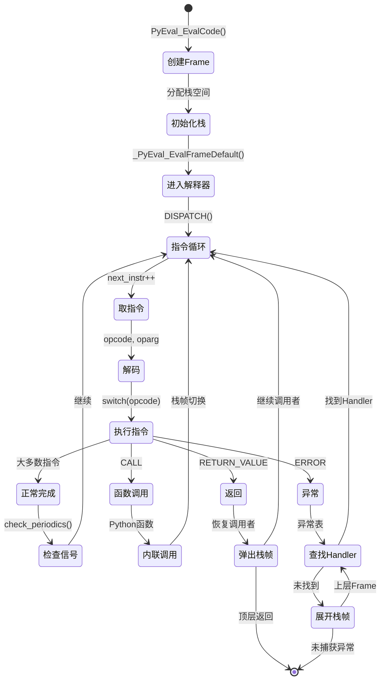
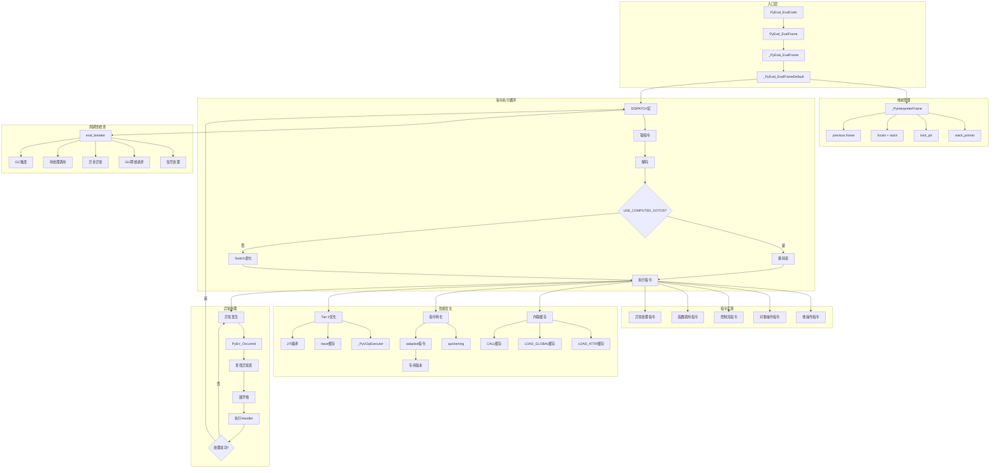
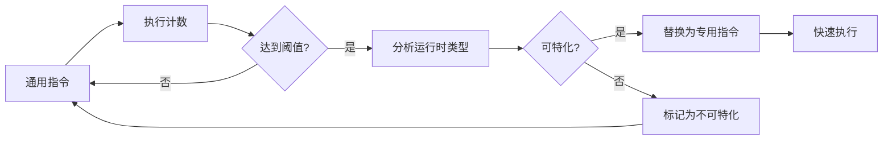
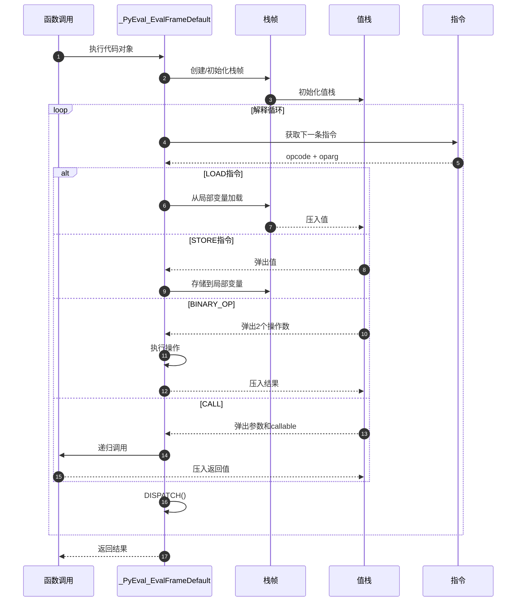

# CPython-05-解释器核心-概览

## 1. 模块职责

解释器核心（Interpreter Core）是 CPython 执行引擎的心脏，负责执行编译后的字节码。该模块实现了基于栈的虚拟机，通过循环读取和执行字节码指令来运行 Python 程序。

### 核心职责

1. **字节码执行**：逐条执行 Code Object 中的字节码指令
2. **栈帧管理**：维护函数调用栈和执行上下文
3. **求值栈操作**：管理操作数栈，支持指令的 push/pop 操作
4. **指令分发**：根据 opcode 分发到对应的处理逻辑
5. **异常处理**：捕获和传播异常，执行 try-except 逻辑
6. **性能优化**：内联缓存、指令特化、JIT 编译（Tier 2）

### 输入与输出

**输入**：
- Code Object（PyCodeObject*）
- 全局命名空间（globals）
- 局部命名空间（locals）
- 参数（args, kwargs）

**输出**：
- 返回值（PyObject*）
- 异常信息（通过 PyErr_* 设置）
- 副作用（对象修改、I/O 操作等）

### 上下游依赖

**上游**（调用方）：
- `PyRun_*` 系列函数：执行代码字符串、文件
- 函数调用：Python 函数互相调用
- `eval()`, `exec()`：动态执行

**下游**（被调用）：
- `Objects/*`：所有对象操作
- `Python/compile.c`：动态编译（eval）
- `Modules/*`：内置模块函数调用
- `Python/errors.c`：异常设置和传播

### 生命周期



## 2. 整体架构图



### 架构说明

#### 1. 核心数据结构

##### _PyInterpreterFrame（解释器栈帧）

```c
typedef struct _PyInterpreterFrame {
    PyObject *f_executable;      // Code Object 或函数对象
    struct _PyInterpreterFrame *previous;  // 调用者栈帧
    _Py_CODEUNIT *instr_ptr;     // 当前指令指针
    _PyStackRef *stackpointer;   // 栈顶指针
    uint16_t return_offset;      // 返回偏移
    char owner;                  // 栈帧所有者
    bool is_entry;               // 是否入口帧
    _PyStackRef localsplus[1];   // 局部变量+栈空间（变长）
} _PyInterpreterFrame;
```

**字段说明**：

- `f_executable`：可执行对象
  - Code Object：编译后的字节码
  - Function Object：包含 Code Object 和闭包

- `previous`：调用链
  - 形成单链表
  - 用于回溯和异常传播

- `instr_ptr`：指令指针
  - 指向下一条待执行指令
  - 类型：`_Py_CODEUNIT*`（16位代码单元）

- `stackpointer`：栈指针
  - 指向求值栈顶
  - 上长下短（向高地址增长）

- `localsplus`：统一存储区
  - 前 N 个：局部变量（co_nlocals）
  - 后 M 个：求值栈（co_stacksize）
  - 闭包变量（co_nfreevars）

**内存布局**：
```
+-------------------+
| f_executable      |
| previous          |
| instr_ptr         |
| stackpointer      |
| return_offset     |
| owner, is_entry   |
+-------------------+
| localsplus[0]     |  <- 局部变量 0
| localsplus[1]     |  <- 局部变量 1
| ...               |
| localsplus[N-1]   |  <- 局部变量 N-1
+-------------------+
| localsplus[N]     |  <- 栈底
| localsplus[N+1]   |
| ...               |  <- 求值栈
| localsplus[N+M-1] |  <- 栈顶（最大）
+-------------------+
```

##### PyCodeObject（代码对象）

```c
struct PyCodeObject {
    PyObject_HEAD
    int co_argcount;              // 参数数量
    int co_posonlyargcount;       // 仅位置参数数量
    int co_kwonlyargcount;        // 仅关键字参数数量
    int co_stacksize;             // 栈深度
    int co_firstlineno;           // 首行号

    PyObject *co_code;            // 字节码（bytes对象）
    PyObject *co_consts;          // 常量元组
    PyObject *co_names;           // 名称元组
    PyObject *co_localsplusnames; // 局部变量名

    PyObject *co_exceptiontable;  // 异常表
    int co_flags;                 // 标志位

    _PyCoCached *_co_cached;      // 缓存（quickening数据）
    uint64_t _co_instrumentation_version; // 版本号
    _Py_CODEUNIT *co_code_adaptive; // 自适应字节码
    ...
};
```

**关键字段**：

- `co_code`：原始字节码（不可变）
- `co_code_adaptive`：可修改版本（用于 quickening）
- `co_stacksize`：最大栈深度（编译时计算）
- `co_exceptiontable`：异常处理表

**标志位**（`co_flags`）：
```c
#define CO_OPTIMIZED         0x0001  // 使用 LOAD_FAST
#define CO_NEWLOCALS         0x0002  // 新局部命名空间
#define CO_VARARGS           0x0004  // *args
#define CO_VARKEYWORDS       0x0008  // **kwargs
#define CO_GENERATOR         0x0020  // 生成器
#define CO_COROUTINE         0x0080  // 协程
#define CO_ASYNC_GENERATOR   0x0200  // 异步生成器
```

#### 2. 指令格式

##### 代码单元（_Py_CODEUNIT）

```c
typedef uint16_t _Py_CODEUNIT;

// 位分布（16位）
// | opcode (8位) | oparg (8位) |
```

**提取宏**：
```c
#define _Py_OPCODE(word) ((word) & 0xFF)
#define _Py_OPARG(word) ((word) >> 8)
```

##### EXTENDED_ARG（扩展参数）

对于大于 255 的 oparg：
```
EXTENDED_ARG  high_byte
REAL_OPCODE   low_byte
```

累积计算：
```c
oparg = 0;
while (opcode == EXTENDED_ARG) {
    oparg = (oparg << 8) | next_oparg;
    // 读取下一条指令
}
```

##### 内联缓存

某些指令后跟缓存条目：
```
LOAD_ATTR  oparg
CACHE      entry1
CACHE      entry2
...
```

**缓存结构**（示例：LOAD_ATTR）：
```c
typedef struct {
    _Py_CODEUNIT counter;     // 计数器
    _Py_CODEUNIT type_version; // 类型版本
    _Py_CODEUNIT index;       // 属性索引
} _PyLoadAttrCache;
```

#### 3. 执行循环

##### 主循环（简化版）

```c
PyObject *
_PyEval_EvalFrameDefault(PyThreadState *tstate,
                         _PyInterpreterFrame *frame,
                         int throwflag)
{
    // 1. 初始化局部变量
    _Py_CODEUNIT *next_instr = frame->instr_ptr;
    _PyStackRef *stack_pointer = frame->stackpointer;
    PyCodeObject *co = (PyCodeObject *)frame->f_executable;

    // 2. 主循环
    for (;;) {
        // 2.1 取指令
        _Py_CODEUNIT word = *next_instr++;
        uint8_t opcode = _Py_OPCODE(word);
        uint8_t oparg = _Py_OPARG(word);

        // 2.2 处理 EXTENDED_ARG
        while (opcode == EXTENDED_ARG) {
            word = *next_instr++;
            opcode = _Py_OPCODE(word);
            oparg = (oparg << 8) | _Py_OPARG(word);
        }

        // 2.3 分发执行
        switch (opcode) {

        case NOP:
            break;

        case LOAD_FAST:
            // 加载局部变量
            value = GETLOCAL(oparg);
            PUSH(value);
            break;

        case STORE_FAST:
            // 存储局部变量
            value = POP();
            SETLOCAL(oparg, value);
            break;

        case LOAD_CONST:
            // 加载常量
            value = GETITEM(co->co_consts, oparg);
            PUSH(value);
            break;

        case BINARY_OP:
            // 二元运算
            right = POP();
            left = POP();
            result = binary_op(left, oparg, right);
            PUSH(result);
            break;

        case RETURN_VALUE:
            // 返回
            retval = POP();
            goto exit_eval_frame;

        // ... 更多指令
        }

        // 2.4 周期性检查
        if (eval_breaker) {
            if (check_periodics(tstate) < 0) {
                goto error;
            }
        }
    }

exit_eval_frame:
    // 清理并返回
    return retval;

error:
    // 异常处理
    return NULL;
}
```

##### 计算 GOTO（优化）

**传统 Switch**：
```c
switch (opcode) {
    case LOAD_FAST: ...
    case STORE_FAST: ...
    ...
}
```
- 单个间接跳转
- CPU 难以预测下一条指令

**Computed GOTO**（GCC 扩展）：
```c
static void *jump_table[256] = {
    &&TARGET_LOAD_FAST,
    &&TARGET_STORE_FAST,
    ...
};

DISPATCH() {
    goto *jump_table[opcode];
}

TARGET_LOAD_FAST:
    // 指令实现
    DISPATCH();

TARGET_STORE_FAST:
    // 指令实现
    DISPATCH();
```

**优势**：
- 每个指令有独立的跳转地址
- CPU 为每个指令单独预测
- 性能提升：15-20%

#### 4. 指令类别

##### 栈操作指令

```c
// NOP - 无操作
inst(NOP) {
    // 什么都不做
}

// POP_TOP - 弹出栈顶
inst(POP_TOP) {
    PyObject *value = POP();
    Py_DECREF(value);
}

// COPY - 复制栈上元素
inst(COPY, (value -- value, value)) {
    // value 保持在栈上，并复制一份
    Py_INCREF(value);
}

// SWAP - 交换栈上元素
inst(SWAP, (top, bottom -- bottom, top)) {
    // 交换两个栈元素
}
```

##### 变量加载/存储

```c
// LOAD_FAST - 加载局部变量
inst(LOAD_FAST, (-- value)) {
    value = GETLOCAL(oparg);
    if (value == NULL) {
        // 未绑定局部变量
        format_exc_check_arg(UnboundLocalError, ...);
        goto error;
    }
}

// STORE_FAST - 存储局部变量
inst(STORE_FAST, (value --)) {
    SETLOCAL(oparg, value);
}

// LOAD_CONST - 加载常量
inst(LOAD_CONST, (-- value)) {
    value = GETITEM(co->co_consts, oparg);
}

// LOAD_GLOBAL - 加载全局变量
family(LOAD_GLOBAL) = {
    LOAD_GLOBAL_MODULE,    // 专用：模块全局
    LOAD_GLOBAL_BUILTIN,   // 专用：内置
};

inst(LOAD_GLOBAL, (-- value, null if (oparg & 1))) {
    // 1. 查找全局命名空间
    value = PyDict_GetItem(GLOBALS(), name);
    if (value == NULL) {
        // 2. 查找内置命名空间
        value = PyDict_GetItem(BUILTINS(), name);
        if (value == NULL) {
            format_exc_check_arg(NameError, ...);
            goto error;
        }
    }
}
```

##### 属性访问

```c
// LOAD_ATTR - 加载属性
family(LOAD_ATTR) = {
    LOAD_ATTR_INSTANCE_VALUE,  // 实例属性（共享键）
    LOAD_ATTR_MODULE,          // 模块属性
    LOAD_ATTR_WITH_HINT,       // 带提示
    LOAD_ATTR_SLOT,            // __slots__
    LOAD_ATTR_METHOD,          // 方法
    LOAD_ATTR_PROPERTY,        // property
    LOAD_ATTR_GETATTRIBUTE_OVERRIDDEN,  // 重写 __getattribute__
};

inst(LOAD_ATTR, (owner -- attr, self_or_null if (oparg & 1))) {
    PyObject *name = GETITEM(co->co_names, oparg >> 1);
    attr = PyObject_GetAttr(owner, name);
    if (attr == NULL) goto error;
    Py_DECREF(owner);
}

// 专用版本：实例属性
inst(LOAD_ATTR_INSTANCE_VALUE, (owner -- attr, null)) {
    PyDictObject *dict = (PyDictObject *)owner->ob_dict;
    // 使用缓存的索引直接访问
    attr = dict->ma_values->values[index];
}
```

##### 二元运算

```c
// BINARY_OP - 二元运算
family(BINARY_OP) = {
    BINARY_OP_ADD_INT,         // 整数加法
    BINARY_OP_ADD_FLOAT,       // 浮点加法
    BINARY_OP_ADD_UNICODE,     // 字符串连接
    BINARY_OP_MULTIPLY_INT,    // 整数乘法
    BINARY_OP_MULTIPLY_FLOAT,  // 浮点乘法
    // ... 更多专用版本
};

inst(BINARY_OP, (lhs, rhs -- result)) {
    result = binary_ops[oparg](lhs, rhs);
    Py_DECREF(lhs);
    Py_DECREF(rhs);
    if (result == NULL) goto error;
}

// 专用版本：整数加法
inst(BINARY_OP_ADD_INT, (left, right -- result)) {
    // 快速路径：小整数
    if (is_small_int(left) && is_small_int(right)) {
        result = add_small_ints(left, right);
    } else {
        result = PyNumber_Add(left, right);
    }
}
```

##### 控制流

```c
// JUMP_FORWARD - 无条件前向跳转
inst(JUMP_FORWARD) {
    JUMPBY(oparg);
}

// JUMP_BACKWARD - 无条件后向跳转（循环）
inst(JUMP_BACKWARD) {
    _Py_CODEUNIT *next = next_instr - oparg;
    next_instr = next;
    // 检查 eval breaker（后向跳转）
    CHECK_EVAL_BREAKER();
}

// POP_JUMP_IF_FALSE - 条件跳转
inst(POP_JUMP_IF_FALSE, (cond --)) {
    int is_true = PyObject_IsTrue(cond);
    Py_DECREF(cond);
    if (is_true < 0) goto error;
    if (is_true == 0) {
        JUMPBY(oparg);
    }
}

// FOR_ITER - 迭代器循环
inst(FOR_ITER, (iter -- iter, next)) {
    next = (*Py_TYPE(iter)->tp_iternext)(iter);
    if (next == NULL) {
        if (PyErr_Occurred()) {
            if (!PyErr_ExceptionMatches(PyExc_StopIteration)) {
                goto error;
            }
            PyErr_Clear();
        }
        // 迭代结束
        Py_DECREF(iter);
        JUMPBY(oparg);
    }
}
```

##### 函数调用

```c
// CALL - 函数调用
family(CALL) = {
    CALL_PY_EXACT_ARGS,        // Python函数，精确参数
    CALL_PY_WITH_DEFAULTS,     // Python函数，带默认值
    CALL_BOUND_METHOD_EXACT_ARGS,  // 绑定方法
    CALL_BUILTIN_O,            // 内置函数，单参数
    CALL_BUILTIN_FAST,         // 内置函数，快速调用
    CALL_METHOD_DESCRIPTOR_O,  // 方法描述符
    // ... 更多专用版本
};

inst(CALL, (callable, args[oparg] -- result)) {
    // 1. 准备参数
    PyObject **args_array = stack_pointer - oparg;

    // 2. 调用
    result = PyObject_Vectorcall(callable, args_array, oparg, NULL);

    // 3. 清理
    Py_DECREF(callable);
    for (int i = 0; i < oparg; i++) {
        Py_DECREF(args_array[i]);
    }

    if (result == NULL) goto error;
}

// 专用版本：Python函数调用（内联）
inst(CALL_PY_EXACT_ARGS, (callable, args[oparg] -- result)) {
    PyFunctionObject *func = (PyFunctionObject *)callable;
    PyCodeObject *code = (PyCodeObject *)func->func_code;

    // 1. 创建新栈帧
    _PyInterpreterFrame *new_frame =
        _PyFrame_PushUnchecked(tstate, func, oparg);

    // 2. 复制参数到新栈帧
    for (int i = 0; i < oparg; i++) {
        new_frame->localsplus[i] = args[i];
    }

    // 3. 切换到新栈帧（内联调用）
    frame = new_frame;
    next_instr = code->co_code_adaptive;
    stack_pointer = _PyFrame_Stackbase(frame);
    goto start_frame;  // 不返回，直接执行
}
```

##### 异常处理

```c
// RAISE_VARARGS - 抛出异常
inst(RAISE_VARARGS, (args[oparg] --)) {
    PyObject *exc = NULL, *cause = NULL;

    switch (oparg) {
    case 2:
        cause = args[1];  // from 子句
        // fall through
    case 1:
        exc = args[0];
        break;
    case 0:
        // 重新抛出当前异常
        exc = get_current_exception(tstate);
        break;
    }

    do_raise(tstate, exc, cause);
    goto error;
}

// PUSH_EXC_INFO - 推入异常信息
inst(PUSH_EXC_INFO, (new_exc -- prev_exc, new_exc)) {
    prev_exc = tstate->exc_info->exc_value;
    tstate->exc_info->exc_value = new_exc;
}

// CHECK_EXC_MATCH - 检查异常匹配
inst(CHECK_EXC_MATCH, (left, right -- left, result)) {
    // 检查 left 是否是 right 的实例
    result = PyErr_GivenExceptionMatches(left, right) ? Py_True : Py_False;
}
```

#### 5. 性能优化技术

##### 5.1 内联缓存（Inline Caching）

**原理**：在指令后存储额外信息，加速重复执行

**LOAD_ATTR 示例**：
```c
typedef struct {
    _Py_CODEUNIT counter;      // 执行计数
    _Py_CODEUNIT type_version; // 类型版本
    _Py_CODEUNIT index;        // 字典索引
    _Py_CODEUNIT unused;       // 对齐
} _PyLoadAttrCache;

inst(LOAD_ATTR_INSTANCE_VALUE, (owner -- attr, null)) {
    // 获取缓存
    _PyLoadAttrCache *cache = (_PyLoadAttrCache *)next_instr;

    // 1. 检查类型版本
    PyTypeObject *tp = Py_TYPE(owner);
    if (tp->tp_version_tag != cache->type_version) {
        // 缓存失效，回退到通用版本
        goto deopt;
    }

    // 2. 使用缓存的索引直接访问
    PyDictObject *dict = (PyDictObject *)owner->__dict__;
    PyObject **values = dict->ma_values->values;
    attr = values[cache->index];

    // 3. 跳过缓存条目
    next_instr += sizeof(_PyLoadAttrCache) / sizeof(_Py_CODEUNIT);
}
```

**命中率**：
- LOAD_ATTR：~95%
- LOAD_GLOBAL：~98%
- CALL：~90%

**效果**：
- 首次执行：~200ns
- 缓存命中：~20ns
- 加速比：10倍

##### 5.2 指令特化（Quickening）

**流程**：


**示例**：BINARY_OP 特化
```python
# 原始代码
x = a + b

# 字节码（初始）
BINARY_OP  0 (ADD)

# 执行几次后，如果 a 和 b 总是 int
# 替换为：
BINARY_OP_ADD_INT

# 如果是 float
BINARY_OP_ADD_FLOAT

# 如果是 str
BINARY_OP_ADD_UNICODE
```

**专用版本性能**：
```
通用版本：100ns
专用 int：20ns
专用 float：25ns
专用 str：30ns
```

**Adaptive 指令**：
```c
inst(BINARY_OP) {
    // 检查计数器
    _PyBinaryOpCache *cache = (_PyBinaryOpCache *)next_instr;
    if (cache->counter-- == 0) {
        // 尝试特化
        _Py_Specialize_BinaryOp(left, right, oparg, next_instr);
    }

    // 执行通用版本
    result = PyNumber_BinaryOp(left, oparg, right);
}
```

##### 5.3 Tier 2 优化器（实验性）

**架构**：
```
Tier 1: 字节码解释器（默认）
         ↓ 检测热点
Tier 2: 微指令（μops）优化器
         ↓ 转换
Trace: 优化的微指令序列
         ↓ 可选
JIT: 机器码（未来）
```

**Trace 生成**：
```python
# Python 代码
def fib(n):
    if n <= 1:
        return 1
    return fib(n-1) + fib(n-2)

# Tier 1 字节码
LOAD_FAST n
LOAD_CONST 1
COMPARE_OP <=
POP_JUMP_IF_FALSE label
LOAD_CONST 1
RETURN_VALUE
label:
...

# Tier 2 Trace（假设 n > 1）
_LOAD_FAST n
_LOAD_CONST 1
_GUARD_NOT_TRUE  // 假设条件为 False
_LOAD_GLOBAL fib
_LOAD_FAST n
_LOAD_CONST 1
_BINARY_OP_SUBTRACT_INT
_CALL_PY_EXACT_ARGS
...
```

**优势**：
- 消除分支预测失败
- 内联简单函数
- 跨指令优化
- 典型加速：10-30%

**启用**：
```python
import sys
sys._setopt('optimize', 2)  # 启用 Tier 2
```

#### 6. 异常处理机制

##### 异常表格式

```c
// 异常表条目
typedef struct {
    int start;      // 起始偏移
    int end;        // 结束偏移
    int target;     // 处理器偏移
    int depth;      // 栈深度
    bool lasti;     // 是否保存 lasti
} ExceptionTableEntry;
```

**Python 示例**：
```python
def foo():
    try:           # start=0
        x = 1/0
    except ZeroDivisionError:  # target=10
        print("error")
    # end=5
```

**异常表**：
```
| start | end | target | depth | lasti |
|-------|-----|--------|-------|-------|
|   0   |  5  |   10   |   0   |  yes  |
```

##### 异常处理流程

```c
// 异常发生
error:
    // 1. 获取当前异常
    PyObject *exc = PyErr_GetRaisedException();

    // 2. 查找异常表
    int offset = (next_instr - co->co_code_adaptive);
    ExceptionTableEntry *entry = find_exception_handler(
        co->co_exceptiontable, offset);

    if (entry != NULL) {
        // 3. 找到处理器
        // 3.1 调整栈深度
        while (stack_pointer > stack_base + entry->depth) {
            Py_DECREF(POP());
        }

        // 3.2 推入异常信息
        PUSH(exc);

        // 3.3 跳转到处理器
        next_instr = co->co_code_adaptive + entry->target;
        goto start_frame;
    } else {
        // 4. 未找到处理器，传播到上层
        frame = frame->previous;
        if (frame == NULL) {
            // 顶层，终止程序
            PyErr_Display(exc);
            return NULL;
        }
        // 继续在上层查找
        goto error;
    }
```

**finally 子句**：
```python
try:
    x = 1/0
finally:
    cleanup()
```

- finally 会生成两个处理器：
  1. 正常路径（end 后）
  2. 异常路径（exception target）

#### 7. 周期性检查（Eval Breaker）

##### 触发条件

```c
// eval_breaker 是位掩码
#define _PY_SIGNAL_PENDING     (1 << 0)  // 信号待处理
#define _PY_GIL_DROP_REQUEST   (1 << 1)  // GIL释放请求
#define _PY_ASYNC_EXCEPTION    (1 << 2)  // 异步异常
#define _PY_PENDING_CALL       (1 << 3)  // 待处理调用
#define _PY_GC_PENDING         (1 << 4)  // GC请求
#define _PY_EVAL_TRACING       (1 << 5)  // 追踪模式
```

##### 检查时机

```c
// 后向跳转（循环）
inst(JUMP_BACKWARD) {
    JUMPBY(-oparg);
    CHECK_EVAL_BREAKER();  // 每次循环都检查
}

// 函数调用后
inst(CALL) {
    result = PyObject_Call(callable, args, kwargs);
    CHECK_EVAL_BREAKER();  // 调用后检查
}

// RESUME 指令（函数入口）
inst(RESUME) {
    CHECK_EVAL_BREAKER();
}
```

##### 处理逻辑

```c
int check_periodics(PyThreadState *tstate)
{
    uintptr_t eval_breaker = tstate->eval_breaker;

    // 1. 信号处理（仅主线程）
    if (eval_breaker & _PY_SIGNAL_PENDING) {
        if (PyErr_CheckSignals() < 0) {
            return -1;
        }
    }

    // 2. GIL 释放请求
    if (eval_breaker & _PY_GIL_DROP_REQUEST) {
        drop_gil(tstate);
        // 等待其他线程
        take_gil(tstate);
    }

    // 3. 异步异常
    if (eval_breaker & _PY_ASYNC_EXCEPTION) {
        PyObject *exc = tstate->async_exc;
        tstate->async_exc = NULL;
        PyErr_SetRaisedException(exc);
        return -1;
    }

    // 4. 待处理调用
    if (eval_breaker & _PY_PENDING_CALL) {
        if (make_pending_calls(tstate) < 0) {
            return -1;
        }
    }

    // 5. GC
    if (eval_breaker & _PY_GC_PENDING) {
        _PyGC_Collect(tstate);
    }

    return 0;
}
```

**频率**：
- 后向跳转：每次循环
- 函数调用：每次调用后
- RESUME：函数入口
- 典型：每 100 条指令

## 8. 关键路径分析

### 简单加法的执行路径

```python
x = a + b
```

**字节码**：
```
LOAD_FAST    0 (a)
LOAD_FAST    1 (b)
BINARY_OP    0 (ADD)
STORE_FAST   2 (x)
```

**执行流程**（微秒级）：
1. **LOAD_FAST 0**：0.02μs
   - 读取 `localsplus[0]`
   - 增加引用计数
   - 压栈

2. **LOAD_FAST 1**：0.02μs
   - 读取 `localsplus[1]`
   - 增加引用计数
   - 压栈

3. **BINARY_OP 0**：0.05-0.5μs（取决于类型）
   - 弹出两个操作数
   - 类型检查
   - 调用 `tp_as_number->nb_add`
   - 如果是小整数：快速路径 0.05μs
   - 如果是大整数：0.2μs
   - 如果是浮点：0.1μs
   - 如果是字符串：0.5μs
   - 减少引用计数
   - 压栈结果

4. **STORE_FAST 2**：0.02μs
   - 弹出栈顶
   - 存入 `localsplus[2]`
   - 如果原值存在，减少引用计数

**总计**：
- 最快（小整数）：0.11μs
- 典型（普通对象）：0.3μs

### 函数调用的执行路径

```python
def add(a, b):
    return a + b

result = add(1, 2)
```

**字节码（调用者）**：
```
LOAD_GLOBAL  0 (add)
LOAD_CONST   1 (1)
LOAD_CONST   2 (2)
CALL         2
STORE_FAST   0 (result)
```

**执行流程**：
1. **LOAD_GLOBAL add**：0.1μs（缓存命中）
2. **LOAD_CONST × 2**：0.04μs
3. **CALL 2**：
   - 通用路径：1.0μs
     - 参数打包
     - 创建栈帧
     - 切换上下文
   - 特化路径（CALL_PY_EXACT_ARGS）：0.3μs
     - 直接内联栈帧
     - 参数复制
     - 指令指针切换
4. **函数体执行**：0.11μs（前面分析的加法）
5. **RETURN_VALUE**：0.1μs
   - 弹出返回值
   - 恢复调用者栈帧
6. **STORE_FAST result**：0.02μs

**总计**：
- 通用路径：1.37μs
- 特化路径：0.67μs
- 优化效果：2倍

## 9. 边界与限制

### 递归深度

```python
# 默认限制
import sys
print(sys.getrecursionlimit())  # 1000

# 修改限制
sys.setrecursionlimit(2000)
```

**实现**：
```c
int _Py_EnterRecursiveCallTstate(PyThreadState *tstate, const char *where)
{
    if (--tstate->py_recursion_remaining <= 0) {
        tstate->py_recursion_remaining += 50;  // 留余地处理异常
        _PyErr_Format(tstate, PyExc_RecursionError,
                      "maximum recursion depth exceeded%s", where);
        tstate->py_recursion_remaining -= 50;
        return -1;
    }
    return 0;
}
```

**注意**：
- C 栈也有限制（通常 8MB）
- Python 限制防止 C 栈溢出
- 实际可用深度 < 设置值（因为还有其他 C 调用）

### 栈大小

```python
def deep_expr():
    return (((((1)))))  # 深度嵌套表达式
```

**编译时计算**：
```c
// Python/compile.c
int stackdepth(struct compiler *c)
{
    // 遍历 CFG，计算最大栈深度
    for (basicblock *b : cfg) {
        int depth = simulate_block(b);
        maxdepth = max(maxdepth, depth);
    }
    return maxdepth;
}
```

**限制**：
- 理论：受限于内存
- 实践：通常 < 1000
- 过深表达式会导致编译时溢出

### 性能限制

**指令吞吐量**：
- 简单指令：10-50M ops/s
- 复杂指令：1-10M ops/s
- 平均：5-10M ops/s

**瓶颈**：
1. 引用计数开销：20-30%
2. 指令分发：10-20%
3. 对象操作：30-40%
4. GIL：多核无加速

## 10. 调试技巧

### 查看字节码

```python
import dis

def foo(x):
    return x + 1

dis.dis(foo)
```

输出：
```
  2           0 LOAD_FAST                0 (x)
              2 LOAD_CONST               1 (1)
              4 BINARY_OP                0 (+)
              8 RETURN_VALUE
```

### 追踪执行

```bash
# 编译时启用调试
./configure --with-pydebug
make

# 运行时启用追踪
python -d script.py  # 详细日志
```

### 性能分析

```python
import sys

# 启用统计
sys._setopt('stats', 1)

# 运行代码
...

# 查看统计
sys._getstats()
```

---

本文档提供了 CPython 解释器核心的全面概览。通过理解字节码执行、栈帧管理、性能优化等机制，可以深入掌握 Python 程序的运行原理。


## 10. 解释器核心API源码深度剖析

### 10.1 字节码执行核心：_PyEval_EvalFrameDefault

```c
// Python/ceval.c

PyObject* _PyEval_EvalFrameDefault(PyThreadState *tstate, _PyInterpreterFrame *frame, int throwflag)
{
    _Py_CODEUNIT *next_instr;
    PyObject **stack_pointer;
    
    // 初始化
    next_instr = frame->prev_instr + 1;
    stack_pointer = _PyFrame_GetStackPointer(frame);
    
    // 主解释循环
    for (;;) {
        _Py_CODEUNIT word = *next_instr++;
        int opcode = _Py_OPCODE(word);
        int oparg = _Py_OPARG(word);
        
        // 指令分发
        switch (opcode) {
        case LOAD_FAST: {
            PyObject *value = GETLOCAL(oparg);
            if (value == NULL) {
                format_exc_check_arg(tstate, PyExc_UnboundLocalError, ...);
                goto error;
            }
            Py_INCREF(value);
            PUSH(value);
            DISPATCH();
        }
        
        case STORE_FAST: {
            PyObject *value = POP();
            SETLOCAL(oparg, value);
            DISPATCH();
        }
        
        case BINARY_OP: {
            PyObject *rhs = POP();
            PyObject *lhs = TOP();
            PyObject *res = _PyEval_BinaryOps[oparg](lhs, rhs);
            SET_TOP(res);
            Py_DECREF(lhs);
            Py_DECREF(rhs);
            if (res == NULL) goto error;
            DISPATCH();
        }
        
        case CALL: {
            PyObject **args = stack_pointer - oparg - 1;
            PyObject *callable = args[-1];
            PyObject *res = _PyObject_Vectorcall(callable, args, oparg, NULL);
            if (res == NULL) goto error;
            stack_pointer = args;
            PUSH(res);
            DISPATCH();
        }
        
        // ... 更多指令
        }
    }
}
```

**解释器执行流程UML时序图**：




---

## 深度补充文档

本模块的详细API源码分析、完整UML图、详细时序图、完整函数调用链和架构图请参阅：

**[CPython-05-深度补充文档](CPython-05-*-深度补充.md)**

深度补充内容包括：
- ✅ 核心API完整源码剖析（带详细注释）
- ✅ 多层次UML类图（数据结构、关系图）
- ✅ 完整执行流程时序图
- ✅ 端到端函数调用链追踪
- ✅ 模块内部架构流程图
- ✅ 性能优化技术详解
- ✅ 最佳实践与调试技巧


