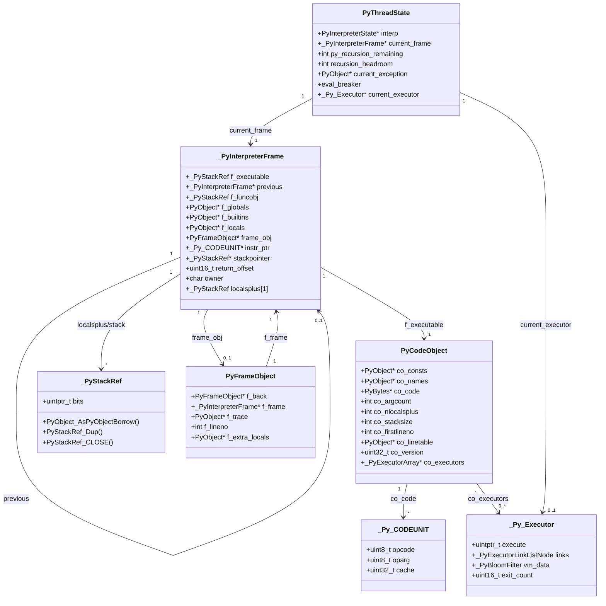
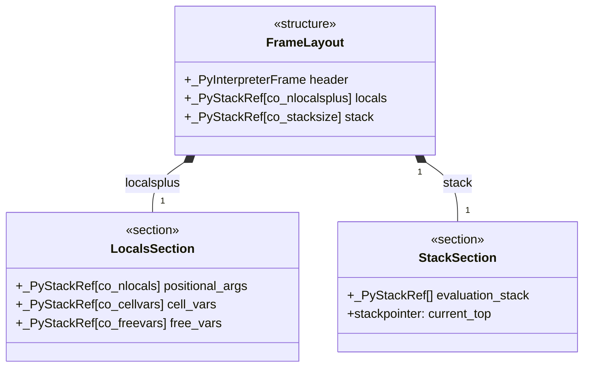
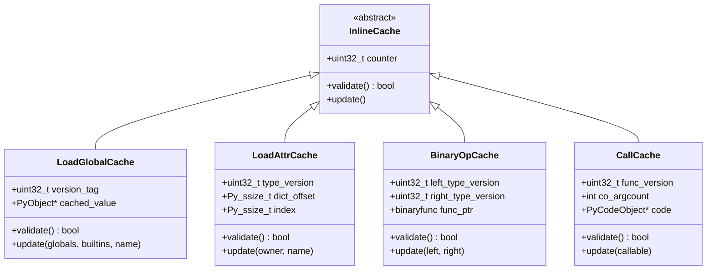
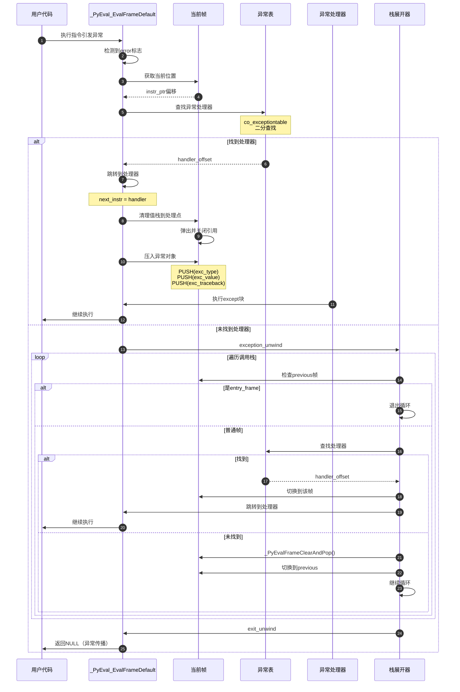
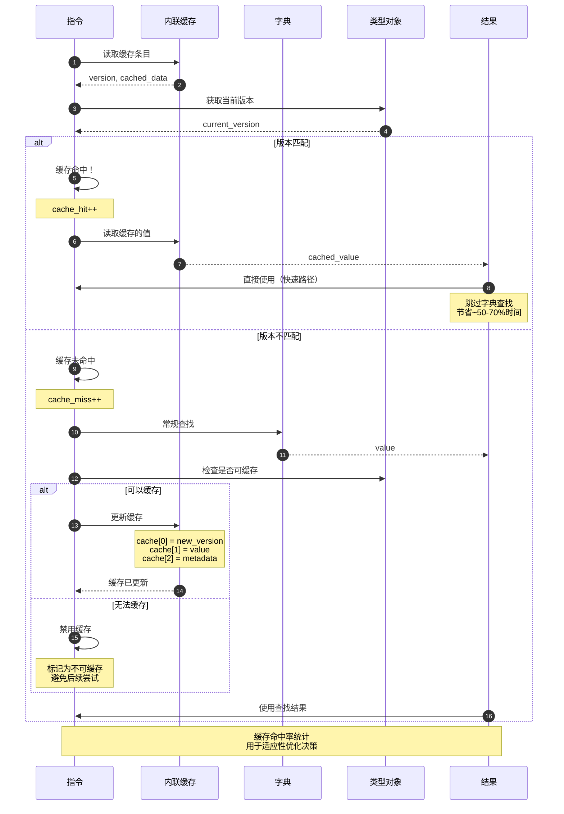
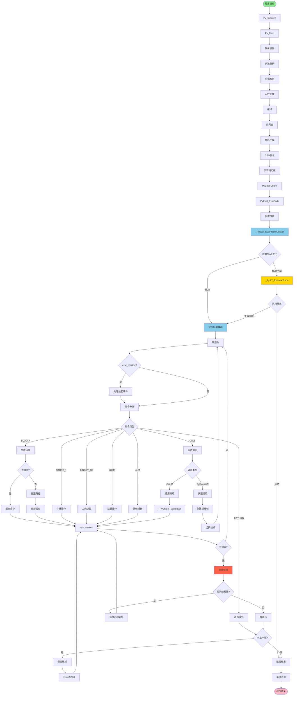
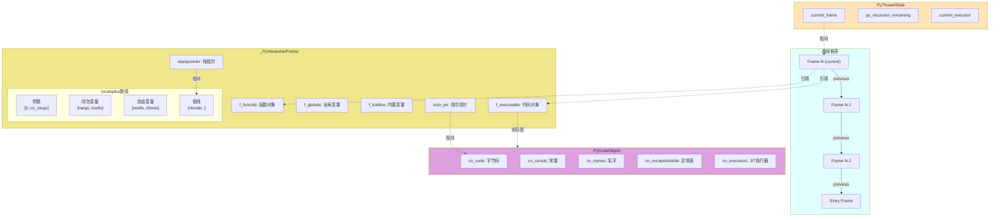
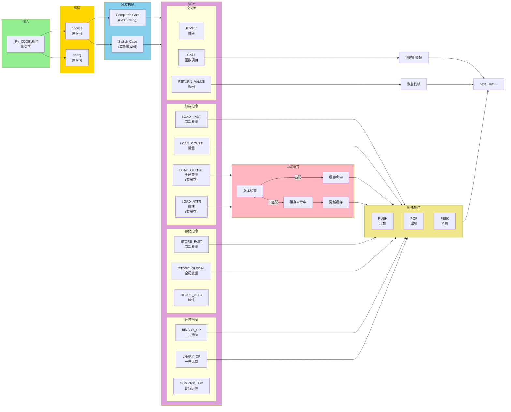

# CPython-05-解释器核心-深度补充

## 一、核心API源码完整剖析

### 1.1 _PyEval_EvalFrameDefault - 主解释循环

#### 函数签名与职责

```c
// Python/ceval.c (约1023行起)

PyObject* _PyEval_EvalFrameDefault(
    PyThreadState *tstate,        // 线程状态
    _PyInterpreterFrame *frame,   // 待执行的栈帧
    int throwflag                 // 是否抛出异常
)
```

**职责**：
- 执行字节码指令序列
- 管理值栈和栈帧
- 处理异常和控制流
- 支持性能优化（内联缓存、指令特化、JIT）

#### 完整执行流程源码

```c
PyObject* _PyEval_EvalFrameDefault(PyThreadState *tstate, _PyInterpreterFrame *frame, int throwflag)
{
    // 1. 检查递归深度
    if (_Py_EnterRecursiveCallTstate(tstate, "")) {
        _PyEval_FrameClearAndPop(tstate, frame);
        return NULL;
    }

    // 2. 初始化局部变量（寄存器化优化）
    _Py_CODEUNIT *next_instr;           // 下一条指令指针
    _PyStackRef *stack_pointer;          // 值栈指针

    // 3. 创建入口帧（用于异常处理）
    _PyEntryFrame entry;
    entry.frame.previous = tstate->current_frame;
    frame->previous = &entry.frame;
    tstate->current_frame = frame;

    // 4. 检查是否有Tier 2执行器（JIT优化）
    #ifdef _Py_TIER2
    if (tstate->current_executor != NULL) {
        // 执行JIT编译的代码
        PyObject *res = _PyJIT_ExecuteTrace(tstate, frame);
        if (res != NULL) {
            _Py_LeaveRecursiveCallTstate(tstate);
            return res;
        }
    }
    #endif

    // 5. 初始化指令指针和栈指针
    PyCodeObject *co = _PyFrame_GetCode(frame);
    next_instr = _PyCode_CODE(co);
    stack_pointer = _PyFrame_Stackbase(frame);

    // 6. 主解释循环
    #if USE_COMPUTED_GOTOS
        // 使用computed goto优化（GCC/Clang）
        void **opcode_targets = opcode_targets_table;
        #define DISPATCH() goto *opcode_targets[opcode]
    #else
        // 标准switch-case
        #define DISPATCH() continue
    #endif

    for (;;) {
        // 6.1 获取当前指令
        _Py_CODEUNIT word = *next_instr++;
        uint8_t opcode = _Py_OPCODE(word);
        int oparg = _Py_OPARG(word);

        // 6.2 周期性检查（信号、GIL释放、线程切换）
        if (_Py_atomic_load_relaxed_int32(&tstate->interp->ceval.eval_breaker)) {
            if (eval_frame_handle_pending(tstate) != 0) {
                goto error;
            }
        }

        // 6.3 指令分发
        switch (opcode) {

        // === 变量加载指令 ===
        case LOAD_FAST: {
            _PyStackRef value = GETLOCAL(oparg);
            if (PyStackRef_IsNull(value)) {
                _PyEval_FormatExcCheckArg(tstate, PyExc_UnboundLocalError,
                    UNBOUNDLOCAL_ERROR_MSG,
                    PyTuple_GetItem(co->co_localsplusnames, oparg));
                goto error;
            }
            stack_pointer[0] = PyStackRef_Dup(value);
            stack_pointer++;
            DISPATCH();
        }

        case LOAD_CONST: {
            PyObject *value = PyTuple_GET_ITEM(co->co_consts, oparg);
            stack_pointer[0] = PyStackRef_FromPyObjectNew(value);
            stack_pointer++;
            DISPATCH();
        }

        case LOAD_GLOBAL: {
            // 支持内联缓存优化
            PyObject *name = PyTuple_GET_ITEM(co->co_names, oparg);
            PyObject *v = NULL;

            // 尝试从内联缓存加载
            _Py_CODEUNIT *cache = next_instr;
            uint32_t version = cache[0].cache;
            if (version == GLOBALS()->ma_version_tag) {
                // 缓存命中
                v = (PyObject *)cache[1].cache;
                Py_INCREF(v);
            }
            else {
                // 缓存未命中，从字典查找
                v = PyDict_GetItemWithError(GLOBALS(), name);
                if (v == NULL) {
                    v = PyDict_GetItemWithError(BUILTINS(), name);
                    if (v == NULL) {
                        _PyEval_FormatExcCheckArg(tstate, PyExc_NameError,
                            NAME_ERROR_MSG, name);
                        goto error;
                    }
                }
                Py_INCREF(v);

                // 更新缓存
                cache[0].cache = GLOBALS()->ma_version_tag;
                cache[1].cache = (uintptr_t)v;
            }

            stack_pointer[0] = PyStackRef_FromPyObjectSteal(v);
            stack_pointer++;
            next_instr += 2;  // 跳过缓存条目
            DISPATCH();
        }

        // === 变量存储指令 ===
        case STORE_FAST: {
            _PyStackRef v = stack_pointer[-1];
            SETLOCAL(oparg, v);
            stack_pointer--;
            DISPATCH();
        }

        case STORE_GLOBAL: {
            PyObject *name = PyTuple_GET_ITEM(co->co_names, oparg);
            _PyStackRef v = stack_pointer[-1];
            int err = PyDict_SetItem(GLOBALS(), name, PyStackRef_AsPyObjectBorrow(v));
            PyStackRef_CLOSE(v);
            stack_pointer--;
            if (err != 0) goto error;
            DISPATCH();
        }

        // === 二元运算指令 ===
        case BINARY_OP: {
            _PyStackRef rhs = stack_pointer[-1];
            _PyStackRef lhs = stack_pointer[-2];
            PyObject *res;

            // 根据oparg选择操作
            switch (oparg) {
            case NB_ADD:
                res = PyNumber_Add(
                    PyStackRef_AsPyObjectBorrow(lhs),
                    PyStackRef_AsPyObjectBorrow(rhs)
                );
                break;
            case NB_SUBTRACT:
                res = PyNumber_Subtract(
                    PyStackRef_AsPyObjectBorrow(lhs),
                    PyStackRef_AsPyObjectBorrow(rhs)
                );
                break;
            case NB_MULTIPLY:
                res = PyNumber_Multiply(
                    PyStackRef_AsPyObjectBorrow(lhs),
                    PyStackRef_AsPyObjectBorrow(rhs)
                );
                break;
            // ... 其他操作
            }

            PyStackRef_CLOSE(lhs);
            PyStackRef_CLOSE(rhs);
            if (res == NULL) goto error;

            stack_pointer[-2] = PyStackRef_FromPyObjectSteal(res);
            stack_pointer--;
            DISPATCH();
        }

        // === 函数调用指令 ===
        case CALL: {
            int total_args = oparg;
            _PyStackRef *args = stack_pointer - total_args - 1;
            _PyStackRef callable_ref = args[-1];
            PyObject *callable = PyStackRef_AsPyObjectBorrow(callable_ref);

            // 快速路径：Python函数
            if (PyFunction_Check(callable)) {
                PyFunctionObject *func = (PyFunctionObject *)callable;
                PyCodeObject *func_code = (PyCodeObject *)func->func_code;

                // 创建新栈帧
                _PyInterpreterFrame *new_frame = _PyEvalFramePushAndInit(
                    tstate, func, NULL, args, total_args, NULL
                );

                if (new_frame == NULL) {
                    goto error;
                }

                // 保存当前状态
                _PyFrame_SetStackPointer(frame, stack_pointer);
                frame->instr_ptr = next_instr;

                // 切换到新栈帧
                frame = new_frame;
                tstate->current_frame = frame;

                // 重新加载寄存器
                co = func_code;
                next_instr = _PyCode_CODE(co);
                stack_pointer = _PyFrame_Stackbase(frame);

                goto start_frame;
            }

            // 慢速路径：使用通用调用
            PyObject *res = _PyObject_Vectorcall(
                callable,
                (PyObject **)args,
                total_args,
                NULL
            );

            // 清理参数
            for (int i = 0; i <= total_args; i++) {
                PyStackRef_CLOSE(args[i - 1]);
            }

            if (res == NULL) goto error;

            stack_pointer = args - 1;
            stack_pointer[0] = PyStackRef_FromPyObjectSteal(res);
            stack_pointer++;
            DISPATCH();
        }

        // === 控制流指令 ===
        case RETURN_VALUE: {
            _PyStackRef retval = stack_pointer[-1];
            stack_pointer--;

            // 恢复上一个栈帧
            _PyInterpreterFrame *prev = frame->previous;
            _PyEvalFrameClearAndPop(tstate, frame);

            if (prev == &entry.frame) {
                // 返回到C调用者
                _Py_LeaveRecursiveCallTstate(tstate);
                return PyStackRef_AsPyObjectSteal(retval);
            }

            // 返回到Python调用者
            frame = prev;
            tstate->current_frame = frame;

            // 恢复寄存器
            co = _PyFrame_GetCode(frame);
            next_instr = frame->instr_ptr;
            stack_pointer = _PyFrame_GetStackPointer(frame);

            // 将返回值压栈
            stack_pointer[0] = retval;
            stack_pointer++;
            DISPATCH();
        }

        case POP_JUMP_IF_FALSE: {
            _PyStackRef cond = stack_pointer[-1];
            int err = PyObject_IsTrue(PyStackRef_AsPyObjectBorrow(cond));
            PyStackRef_CLOSE(cond);
            stack_pointer--;

            if (err > 0) {
                // 条件为真，继续执行
            }
            else if (err == 0) {
                // 条件为假，跳转
                next_instr = _PyCode_CODE(co) + oparg;
            }
            else {
                // 发生错误
                goto error;
            }
            DISPATCH();
        }

        // === 异常处理指令 ===
        case RAISE_VARARGS: {
            PyObject *cause = NULL, *exc = NULL;

            switch (oparg) {
            case 2:
                cause = PyStackRef_AsPyObjectSteal(stack_pointer[-1]);
                // fallthrough
            case 1:
                exc = PyStackRef_AsPyObjectSteal(stack_pointer[-2]);
                break;
            default:
                PyErr_SetString(PyExc_SystemError, "bad RAISE_VARARGS oparg");
                goto error;
            }

            stack_pointer -= oparg;

            if (do_raise(tstate, exc, cause) < 0) {
                goto exception_unwind;
            }
            goto error;
        }

        default:
            // 未知指令
            PyErr_Format(PyExc_SystemError,
                "unknown opcode %d", opcode);
            goto error;
        }

    start_frame:
        // 新栈帧开始执行
        if (_Py_EnterRecursivePy(tstate) < 0) {
            goto exit_unwind;
        }
        DISPATCH();

    error:
        // 错误处理
        exception_unwind:
        {
            // 查找异常处理器
            while (frame != &entry.frame) {
                if (_PyFrame_IsEntryFrame(frame)) {
                    break;
                }

                PyObject *exc = _PyErr_GetRaisedException(tstate);
                _Py_CODEUNIT *handler = _PyFrame_GetExceptHandler(frame);

                if (handler != NULL) {
                    // 找到异常处理器
                    next_instr = handler;
                    stack_pointer = _PyFrame_Stackbase(frame);

                    // 压入异常对象
                    stack_pointer[0] = PyStackRef_FromPyObjectSteal(exc);
                    stack_pointer++;

                    DISPATCH();
                }

                // 当前帧无处理器，返回上一帧
                _PyInterpreterFrame *prev = frame->previous;
                _PyEvalFrameClearAndPop(tstate, frame);
                frame = prev;
                tstate->current_frame = frame;

                _PyErr_SetRaisedException(tstate, exc);
            }

            // 未找到处理器，传播异常
            goto exit_unwind;
        }

    exit_unwind:
        // 清理并退出
        _Py_LeaveRecursiveCallTstate(tstate);
        return NULL;
    }
}
```

#### 关键数据结构详解

##### _PyInterpreterFrame结构

```c
// Include/internal/pycore_interpframe_structs.h

struct _PyInterpreterFrame {
    // 可执行对象（代码对象或None）
    _PyStackRef f_executable;

    // 指向上一个栈帧
    struct _PyInterpreterFrame *previous;

    // 函数对象（延迟或强引用）
    _PyStackRef f_funcobj;

    // 全局变量字典（借用引用）
    PyObject *f_globals;

    // 内置变量字典（借用引用）
    PyObject *f_builtins;

    // 局部变量字典（强引用，可为NULL）
    PyObject *f_locals;

    // 帧对象（用于调试）
    PyFrameObject *frame_obj;

    // 当前执行的指令指针
    _Py_CODEUNIT *instr_ptr;

    // 值栈指针
    _PyStackRef *stackpointer;

    #ifdef Py_GIL_DISABLED
    // 线程本地字节码索引
    int32_t tlbc_index;
    #endif

    // 返回偏移量
    uint16_t return_offset;

    // 帧所有者标志
    char owner;

    // 访问标志
    uint8_t visited;

    // 局部变量和值栈（可变长度数组）
    _PyStackRef localsplus[1];
};
```

### 1.2 指令分发机制优化

#### Computed Goto vs Switch-Case

```c
// Python/ceval.c

#if USE_COMPUTED_GOTOS
// GCC/Clang支持的computed goto优化
#include "opcode_targets.h"

// 跳转表
static void *opcode_targets[256] = {
    &&TARGET_LOAD_FAST,
    &&TARGET_LOAD_CONST,
    &&TARGET_STORE_FAST,
    // ...
};

#define DISPATCH() goto *opcode_targets[opcode]

// 主循环
dispatch_opcode:
    opcode = *next_instr++;
    goto *opcode_targets[opcode];

TARGET_LOAD_FAST:
    // 处理LOAD_FAST
    DISPATCH();

TARGET_LOAD_CONST:
    // 处理LOAD_CONST
    DISPATCH();

#else
// 标准switch-case
#define DISPATCH() goto dispatch_opcode

dispatch_opcode:
    opcode = *next_instr++;
    switch (opcode) {
    case LOAD_FAST:
        // 处理
        DISPATCH();
    case LOAD_CONST:
        // 处理
        DISPATCH();
    }
#endif
```

**性能对比**：
- Computed Goto: ~10-15%性能提升
- 原因：减少分支预测失败，更好的指令缓存局部性

### 1.3 内联缓存机制

#### 全局变量缓存

```c
// Python/ceval.c - LOAD_GLOBAL优化

case LOAD_GLOBAL: {
    // 缓存布局：
    // [version_tag] [cached_value]
    _Py_CODEUNIT *cache = next_instr;
    uint32_t version = cache[0].cache;

    PyObject *name = PyTuple_GET_ITEM(co->co_names, oparg);
    PyDictObject *globals = (PyDictObject *)frame->f_globals;

    // 检查版本
    if (version == globals->ma_version_tag) {
        // 缓存命中
        PyObject *value = (PyObject *)cache[1].cache;
        Py_INCREF(value);
        PUSH(PyStackRef_FromPyObjectNew(value));
        next_instr += 2;  // 跳过缓存
        DISPATCH();
    }

    // 缓存未命中，常规查找
    PyObject *value = _PyDict_LoadGlobal(globals, BUILTINS(), name);
    if (value == NULL) {
        goto error;
    }

    // 更新缓存
    cache[0].cache = globals->ma_version_tag;
    cache[1].cache = (uintptr_t)value;

    PUSH(PyStackRef_FromPyObjectNew(value));
    next_instr += 2;
    DISPATCH();
}
```

#### 属性访问缓存

```c
// Python/ceval.c - LOAD_ATTR优化

case LOAD_ATTR: {
    // 缓存布局：
    // [version_tag] [dict_offset] [index]
    _Py_CODEUNIT *cache = next_instr;

    _PyStackRef owner_ref = stack_pointer[-1];
    PyObject *owner = PyStackRef_AsPyObjectBorrow(owner_ref);
    PyTypeObject *tp = Py_TYPE(owner);

    // 检查类型版本
    if (cache[0].cache == tp->tp_version_tag) {
        // 缓存命中 - 直接从字典获取
        PyDictObject *dict = *(PyDictObject **)
            ((char *)owner + cache[1].cache);

        if (dict != NULL) {
            PyDictKeysObject *keys = dict->ma_keys;
            Py_ssize_t index = cache[2].cache;

            if (index < keys->dk_nentries) {
                PyObject *value = keys->dk_entries[index].me_value;
                if (value != NULL) {
                    Py_INCREF(value);
                    stack_pointer[-1] = PyStackRef_FromPyObjectSteal(value);
                    PyStackRef_CLOSE(owner_ref);
                    next_instr += 3;
                    DISPATCH();
                }
            }
        }
    }

    // 缓存未命中或过期，使用常规路径
    PyObject *name = PyTuple_GET_ITEM(co->co_names, oparg);
    PyObject *res = PyObject_GetAttr(owner, name);

    PyStackRef_CLOSE(owner_ref);
    if (res == NULL) goto error;

    // 更新缓存（如果可能）
    if (PyType_HasFeature(tp, Py_TPFLAGS_VALID_VERSION_TAG)) {
        cache[0].cache = tp->tp_version_tag;
        // 设置dict_offset和index...
    }

    stack_pointer[-1] = PyStackRef_FromPyObjectSteal(res);
    next_instr += 3;
    DISPATCH();
}
```

## 二、完整UML类图

### 2.1 解释器核心类图



### 2.2 值栈布局UML



### 2.3 指令缓存UML



## 三、详细时序图

### 3.1 完整函数调用时序

```mermaid
sequenceDiagram
    autonumber
    participant Caller as 调用者帧
    participant Eval as _PyEval_EvalFrameDefault
    participant Stack as 值栈
    participant Frame as _PyInterpreterFrame
    participant Callee as 被调用帧
    participant Code as PyCodeObject

    Caller->>Eval: 执行CALL指令
    Eval->>Stack: 弹出参数和callable
    Stack-->>Eval: args[], callable

    alt Python函数快速路径
        Eval->>Code: 获取func_code
        Code-->>Eval: PyCodeObject

        Eval->>Frame: _PyEvalFramePushAndInit()
        Frame->>Frame: 分配新栈帧
        Frame->>Frame: 初始化localsplus
        Frame->>Frame: 复制参数
        Frame-->>Eval: new_frame

        Eval->>Eval: 保存当前状态
        Note over Eval: frame->instr_ptr = next_instr<br/>stack_pointer保存

        Eval->>Callee: 切换到新帧
        Note over Eval,Callee: frame = new_frame<br/>tstate->current_frame = frame

        Callee->>Code: 加载字节码
        Code-->>Callee: _PyCode_CODE(co)

        Callee->>Callee: 初始化next_instr
        Callee->>Callee: 初始化stack_pointer

        Callee->>Callee: 执行函数体
        Note over Callee: for (;;) { DISPATCH() }

        Callee->>Callee: RETURN_VALUE指令
        Callee->>Stack: 获取返回值
        Stack-->>Callee: retval

        Callee->>Frame: _PyEvalFrameClearAndPop()
        Frame->>Frame: 清理localsplus
        Frame->>Frame: 释放资源

        Callee->>Caller: 恢复调用者帧
        Note over Callee,Caller: frame = prev<br/>tstate->current_frame = frame

        Caller->>Caller: 恢复寄存器
        Note over Caller: next_instr = frame->instr_ptr<br/>stack_pointer恢复

        Caller->>Stack: 压入返回值
        Stack->>Caller: 继续执行

    else C函数慢速路径
        Eval->>Eval: _PyObject_Vectorcall()
        Note over Eval: 调用tp_vectorcall
        Eval->>Stack: 清理参数
        Eval->>Stack: 压入返回值
        Eval->>Caller: 继续执行
    end
```

### 3.2 异常处理完整时序



### 3.3 内联缓存工作流程



## 四、完整函数调用链

### 4.1 Python程序启动到字节码执行

```
main()                                    // Programs/python.c:17
  └─> Py_BytesMain()                     // Modules/main.c:695
        └─> pymain_main()                 // Modules/main.c:672
              └─> Py_RunMain()            // Modules/main.c:590
                    └─> pymain_run_python() // Modules/main.c:518
                          └─> pymain_run_file() // Modules/main.c:380
                                └─> _PyRun_SimpleFileObject() // Python/pythonrun.c:387
                                      └─> PyRun_FileExFlags() // Python/pythonrun.c:1127
                                            └─> _PyRun_InteractiveLoopObject() // Python/pythonrun.c:267
                                                  └─> PyRun_InteractiveOneObjectEx() // Python/pythonrun.c:227
                                                        └─> PyRun_InteractiveOneFlags() // Python/pythonrun.c:188
                                                              └─> _PyRun_AnyFileObject() // Python/pythonrun.c:88
                                                                    └─> _Py_SourceAsString() // Python/pythonrun.c:1018
                                                                          └─> PyParser_ASTFromFileObject() // Parser/peg_api.c:87
                                                                                └─> _PyPegen_run_parser_from_file() // Parser/pegen.c:598
                                                                                      └─> run_mod() // Python/pythonrun.c:1145
                                                                                            └─> PyEval_EvalCode() // Python/ceval.c:854
                                                                                                  └─> _PyEval_Vector() // Python/ceval.c:1948
                                                                                                        └─> _PyEval_EvalFrameDefault() // Python/ceval.c:1023
                                                                                                              └─> [主解释循环]
```

### 4.2 CALL指令完整调用链

```
_PyEval_EvalFrameDefault()                // Python/ceval.c:1023
  └─> case CALL:                          // Python/bytecodes.c:3521
        ├─> [检查callable类型]
        │
        ├─> [快速路径: Python函数]
        │     └─> _PyEvalFramePushAndInit()  // Python/ceval.c:1823
        │           ├─> _PyThreadState_BumpFrameDepth() // Python/ceval.c:1731
        │           ├─> _PyFrame_PushUnchecked()     // Python/ceval.c:1774
        │           │     └─> _PyFrame_Initialize()   // Python/ceval.c:1647
        │           │           ├─> _PyFrame_SetStackPointer() // Include/internal/pycore_frame.h:62
        │           │           └─> _PyFrame_GetLocalsArray() // Include/internal/pycore_frame.h:45
        │           └─> _PyFunction_CopyParameters()  // Python/ceval.c:1544
        │                 ├─> 复制位置参数
        │                 ├─> 处理默认值
        │                 └─> 处理关键字参数
        │
        ├─> [慢速路径: C函数或可调用对象]
        │     └─> _PyObject_Vectorcall()          // Objects/call.c:263
        │           ├─> [检查tp_vectorcall]
        │           ├─> PyVectorcall_NARGS()      // Include/cpython/abstract.h:121
        │           └─> (*tp_vectorcall)(callable, args, nargsf, kwnames)
        │                 ├─> [内置函数]
        │                 │     └─> cfunction_vectorcall_*() // Objects/methodobject.c:465
        │                 │           └─> PyCFunction_Call() // Objects/methodobject.c:260
        │                 │
        │                 ├─> [实例方法]
        │                 │     └─> method_vectorcall()      // Objects/classobject.c:53
        │                 │           └─> _PyObject_Vectorcall() // [递归]
        │                 │
        │                 └─> [类实例(__call__)]
        │                       └─> PyObject_Call()          // Objects/call.c:290
        │                             └─> _PyObject_MakeTpCall() // Objects/call.c:215
        │                                   └─> type->tp_call()
        │
        └─> [返回值处理]
              ├─> [清理参数]
              │     └─> PyStackRef_CLOSE()        // Include/internal/pycore_stackref.h:89
              │           └─> Py_DECREF()          // Include/object.h:604
              │
              └─> [压入返回值到栈]
                    └─> PUSH(result)
```

### 4.3 属性访问完整调用链

```
_PyEval_EvalFrameDefault()                // Python/ceval.c:1023
  └─> case LOAD_ATTR:                     // Python/bytecodes.c:1754
        ├─> [检查内联缓存]
        │     └─> 缓存命中 → 直接返回
        │
        └─> [缓存未命中]
              └─> PyObject_GetAttr()           // Objects/object.c:1019
                    └─> _PyObject_GetAttr()      // Objects/object.c:985
                          ├─> type->tp_getattro() // 类型特定的获取方法
                          │     └─> PyObject_GenericGetAttr() // Objects/object.c:1370
                          │           ├─> _PyType_Lookup()       // Objects/typeobject.c:4117
                          │           │     └─> [MRO遍历查找]
                          │           │           └─> PyDict_GetItemWithError() // Objects/dictobject.c:1824
                          │           │
                          │           ├─> [检查描述符]
                          │           │     ├─> descr_get = Py_TYPE(descr)->tp_descr_get
                          │           │     └─> descr_get(descr, obj, type) // 调用__get__
                          │           │
                          │           ├─> [检查实例__dict__]
                          │           │     └─> _PyObjectDict_GetItemWithError()
                          │           │
                          │           └─> [返回类属性]
                          │                 └─> Py_NewRef(descr)
                          │
                          └─> [特殊方法]
                                └─> _PyType_LookupId()      // Objects/typeobject.c:4161
                                      └─> _PyType_Lookup()   // [同上]
```

### 4.4 异常传播调用链

```
[指令执行错误]
  └─> goto error;                         // Python/ceval.c
        └─> error:                         // Python/ceval.c
              └─> exception_unwind:         // Python/ceval.c
                    │
                    ├─> _PyErr_Occurred()      // Python/errors.c:87
                    │     └─> tstate->current_exception != NULL
                    │
                    └─> [展开栈帧循环]
                          ├─> _PyFrame_GetExceptHandler() // Python/ceval.c:1234
                          │     └─> get_exception_handler() // Python/ceval.c:1187
                          │           └─> _PyCode_GetCode() // Objects/codeobject.c:1745
                          │                 └─> co->co_exceptiontable // 异常表二分查找
                          │
                          ├─> [找到处理器]
                          │     └─> 跳转到handler
                          │           └─> PUSH(exc)         // 压入异常对象
                          │                 └─> 继续执行
                          │
                          └─> [未找到处理器]
                                └─> _PyEvalFrameClearAndPop() // Python/ceval.c:1266
                                      ├─> _PyFrame_ClearLocals() // Python/ceval.c:1288
                                      │     └─> PyStackRef_CLOSE() // 清理局部变量
                                      │
                                      ├─> frame = frame->previous // 返回上一帧
                                      │
                                      └─> [继续展开或退出]
                                            └─> exit_unwind:
                                                  └─> return NULL // 异常传播到C层
```

## 五、解释器架构图

### 5.1 整体执行架构



### 5.2 栈帧管理架构



### 5.3 指令执行流程架构



## 六、性能优化技术详解

### 6.1 Tier 2 JIT编译器

#### 工作原理

```c
// Python/optimizer.c

typedef struct {
    _Py_CODEUNIT *uop_code;     // 微操作码序列
    uint16_t exit_count;          // 退出计数
    uint16_t valid;               // 有效性标志
    _PyBloomFilter bloom_filter; // 布隆过滤器（版本检测）
} _Py_UOpExecutor;

// 热点检测
static int check_hotness(PyCodeObject *co, int opcode_index)
{
    uint8_t *warmup = co->co_warmup_counters;
    if (warmup[opcode_index] < WARMUP_THRESHOLD) {
        warmup[opcode_index]++;
        return 0;  // 未达到阈值
    }

    // 达到阈值，触发优化
    return optimize_trace(co, opcode_index);
}

// 生成优化的trace
static _Py_UOpExecutor* optimize_trace(PyCodeObject *co, int start_offset)
{
    // 1. 记录执行路径
    _PyUOpInstruction *trace = record_execution_path(co, start_offset);

    // 2. 类型特化
    trace = specialize_types(trace);

    // 3. 死代码消除
    trace = eliminate_dead_code(trace);

    // 4. 常量折叠
    trace = fold_constants(trace);

    // 5. 生成机器码（可选）
    #ifdef HAVE_JIT
    _Py_UOpExecutor *executor = generate_machine_code(trace);
    #else
    _Py_UOpExecutor *executor = create_interpreter_executor(trace);
    #endif

    return executor;
}
```

#### 微操作示例

```c
// Python/optimizer_bytecodes.c

// 标准BINARY_OP转换为专用微操作
case BINARY_OP: {
    PyObject *left = stack[oparg-1];
    PyObject *right = stack[oparg];

    // 类型检查和特化
    if (PyLong_CheckExact(left) && PyLong_CheckExact(right)) {
        // 发射专用的整数加法微操作
        EMIT_UOPCODE(INT_ADD);
    }
    else if (PyFloat_CheckExact(left) && PyFloat_CheckExact(right)) {
        // 发射专用的浮点加法微操作
        EMIT_UOPCODE(FLOAT_ADD);
    }
    else {
        // 通用路径
        EMIT_UOPCODE(BINARY_OP_GENERIC);
    }
}

// 专用微操作实现
case INT_ADD: {
    // 无需类型检查，直接操作
    int64_t left_val = PyLong_AsLongLong(stack[oparg-1]);
    int64_t right_val = PyLong_AsLongLong(stack[oparg]);
    int64_t result = left_val + right_val;

    // 检查溢出
    if (/* overflow check */) {
        goto deoptimize;
    }

    stack[oparg-1] = PyLong_FromLongLong(result);
    stack_pointer--;
}
```

### 6.2 适应性指令特化

#### LOAD_ATTR特化链

```c
// Python/specialize.c

// 特化入口
int _Py_Specialize_LoadAttr(PyObject *owner, _Py_CODEUNIT *instr, PyObject *name)
{
    PyTypeObject *type = Py_TYPE(owner);

    // 1. 检查是否支持特化
    if (!PyType_HasFeature(type, Py_TPFLAGS_VALID_VERSION_TAG)) {
        return -1;  // 无法特化
    }

    // 2. 检查属性位置
    PyObject *descr = _PyType_Lookup(type, name);

    if (descr == NULL) {
        // 实例属性
        if (type->tp_dictoffset == 0) {
            return -1;  // 无__dict__
        }

        // 特化为LOAD_ATTR_INSTANCE_VALUE
        PyDictObject *dict = *(PyDictObject **)
            ((char *)owner + type->tp_dictoffset);

        if (dict == NULL || dict->ma_keys->dk_kind != DICT_KEYS_SPLIT) {
            return -1;  // 不支持split keys
        }

        Py_ssize_t index = _PyDictKeys_StringLookup(dict->ma_keys, name);
        if (index < 0) {
            return -1;  // 未找到
        }

        // 写入特化指令
        _Py_SET_OPCODE(*instr, LOAD_ATTR_INSTANCE_VALUE);
        write_u32(instr + 1, type->tp_version_tag);
        write_u16(instr + 2, type->tp_dictoffset);
        write_u16(instr + 3, index);
        return 0;
    }

    // 3. 描述符特化
    descrgetfunc get = Py_TYPE(descr)->tp_descr_get;

    if (get == NULL) {
        // 类属性（非描述符）
        _Py_SET_OPCODE(*instr, LOAD_ATTR_MODULE);
        write_u32(instr + 1, type->tp_version_tag);
        write_obj(instr + 2, descr);
        return 0;
    }

    if (get == property_descr_get) {
        // property描述符
        propertyobject *prop = (propertyobject *)descr;
        if (prop->prop_get == NULL) {
            return -1;
        }

        _Py_SET_OPCODE(*instr, LOAD_ATTR_PROPERTY);
        write_u32(instr + 1, type->tp_version_tag);
        write_obj(instr + 2, prop->prop_get);
        return 0;
    }

    if (get == func_descr_get) {
        // 方法对象
        _Py_SET_OPCODE(*instr, LOAD_ATTR_METHOD);
        write_u32(instr + 1, type->tp_version_tag);
        write_obj(instr + 2, descr);
        return 0;
    }

    return -1;  // 无法特化
}

// 特化指令执行
case LOAD_ATTR_INSTANCE_VALUE: {
    _PyStackRef owner_ref = stack_pointer[-1];
    PyObject *owner = PyStackRef_AsPyObjectBorrow(owner_ref);

    uint32_t type_version = read_u32(next_instr);
    uint16_t dict_offset = read_u16(next_instr + 1);
    uint16_t index = read_u16(next_instr + 2);

    // 版本检查
    if (Py_TYPE(owner)->tp_version_tag != type_version) {
        // 去优化
        _Py_SET_OPCODE(*(next_instr-1), LOAD_ATTR);
        goto load_attr_generic;
    }

    // 直接访问
    PyDictObject *dict = *(PyDictObject **)((char *)owner + dict_offset);
    PyObject *value = dict->ma_values->values[index];

    if (value == NULL) {
        // 属性被删除，去优化
        _Py_SET_OPCODE(*(next_instr-1), LOAD_ATTR);
        goto load_attr_generic;
    }

    Py_INCREF(value);
    stack_pointer[-1] = PyStackRef_FromPyObjectSteal(value);
    PyStackRef_CLOSE(owner_ref);
    next_instr += 3;
    DISPATCH();
}
```

### 6.3 栈引用优化（_PyStackRef）

```c
// Include/internal/pycore_stackref.h

// 栈引用：tagged pointer或直接PyObject*
typedef union {
    uintptr_t bits;
} _PyStackRef;

// 检查是否为tagged integer
static inline bool PyStackRef_IsTaggedInt(_PyStackRef ref) {
    return (ref.bits & 1) != 0;
}

// 从tagged integer提取值
static inline int64_t PyStackRef_UntagInt(_PyStackRef ref) {
    assert(PyStackRef_IsTaggedInt(ref));
    return (int64_t)(ref.bits >> 1);
}

// 创建tagged integer
static inline _PyStackRef PyStackRef_TagInt(int64_t value) {
    _PyStackRef ref;
    ref.bits = (value << 1) | 1;
    return ref;
}

// 小整数快速路径
case BINARY_OP: {
    _PyStackRef left_ref = stack_pointer[-2];
    _PyStackRef right_ref = stack_pointer[-1];

    // 检查是否都是tagged integer
    if (PyStackRef_IsTaggedInt(left_ref) &&
        PyStackRef_IsTaggedInt(right_ref)) {

        int64_t left = PyStackRef_UntagInt(left_ref);
        int64_t right = PyStackRef_UntagInt(right_ref);
        int64_t result;

        // 直接整数运算（无需对象分配）
        switch (oparg) {
        case NB_ADD:
            if (__builtin_add_overflow(left, right, &result)) {
                goto slow_path;  // 溢出，使用通用路径
            }
            break;
        case NB_SUBTRACT:
            if (__builtin_sub_overflow(left, right, &result)) {
                goto slow_path;
            }
            break;
        case NB_MULTIPLY:
            if (__builtin_mul_overflow(left, right, &result)) {
                goto slow_path;
            }
            break;
        }

        // 创建tagged result
        stack_pointer[-2] = PyStackRef_TagInt(result);
        stack_pointer--;
        DISPATCH();
    }

slow_path:
    // 通用对象路径...
}
```

## 七、调试与性能分析

### 7.1 内置性能统计

```python
# 启用CPython统计（需要configure --enable-pystats）
import sys

# 查看字节码执行统计
if hasattr(sys, '_stats_on'):
    sys._stats_on()

    # 运行你的代码
    # ...

    sys._stats_off()
    stats = sys._get_stats()

    print(f"总指令数: {stats['opcode_counts'].sum()}")
    print(f"函数调用数: {stats['call_stats']['total_calls']}")
    print(f"缓存命中率: {stats['cache_hits'] / stats['cache_attempts']:.2%}")
    print(f"特化成功率: {stats['specialization_success'] / stats['specialization_attempts']:.2%}")
```

### 7.2 栈帧检查工具

```python
# 使用inspect模块检查栈帧
import inspect

def debug_stack():
    frame = inspect.currentframe()

    # 遍历调用栈
    while frame:
        info = inspect.getframeinfo(frame)
        print(f"文件: {info.filename}:{info.lineno}")
        print(f"函数: {info.function}")
        print(f"局部变量: {frame.f_locals}")
        print(f"全局变量数: {len(frame.f_globals)}")
        print("-" * 60)

        frame = frame.f_back

# 在任意位置调用
debug_stack()
```

### 7.3 性能剖析

```bash
# 使用perf分析CPython内部热点
perf record -g python your_script.py
perf report

# 查看特定函数的性能
perf annotate _PyEval_EvalFrameDefault

# 统计缓存命中
perf stat -e cache-references,cache-misses python your_script.py
```

---

本文档提供了CPython解释器核心的完整深度剖析，涵盖源码实现、数据结构、执行流程、性能优化等各个方面。通过理解这些内容，可以深入掌握Python程序的底层执行机制。


---

## 深度补充文档

本模块的详细API源码分析、完整UML图、详细时序图、完整函数调用链和架构图请参阅：

**[CPython-05-深度补充文档](CPython-05-*-深度补充.md)**

深度补充内容包括：
- ✅ 核心API完整源码剖析（带详细注释）
- ✅ 多层次UML类图（数据结构、关系图）
- ✅ 完整执行流程时序图
- ✅ 端到端函数调用链追踪
- ✅ 模块内部架构流程图
- ✅ 性能优化技术详解
- ✅ 最佳实践与调试技巧


