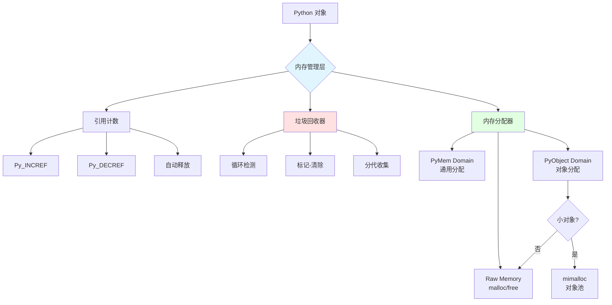
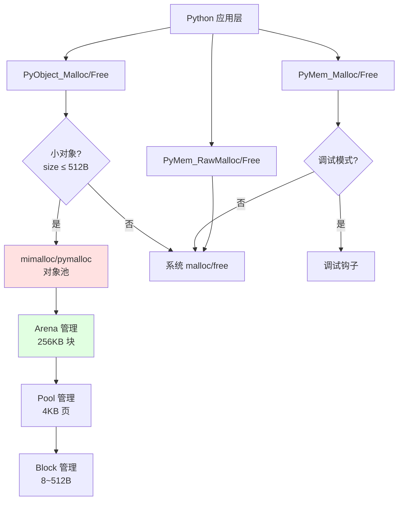
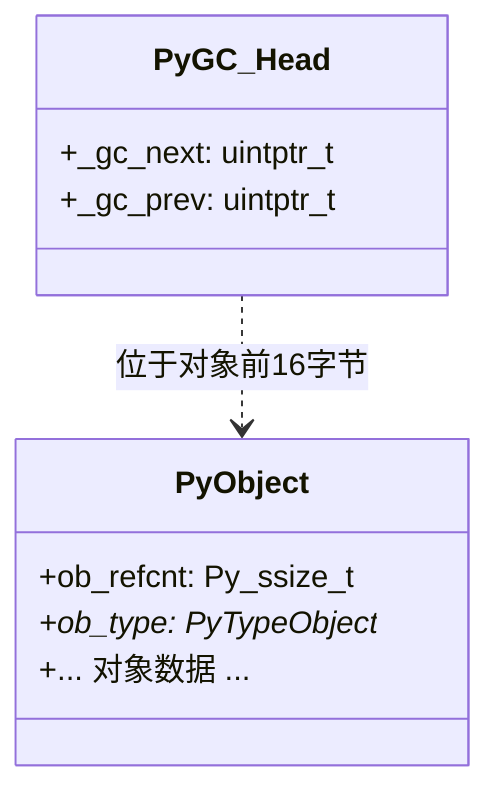
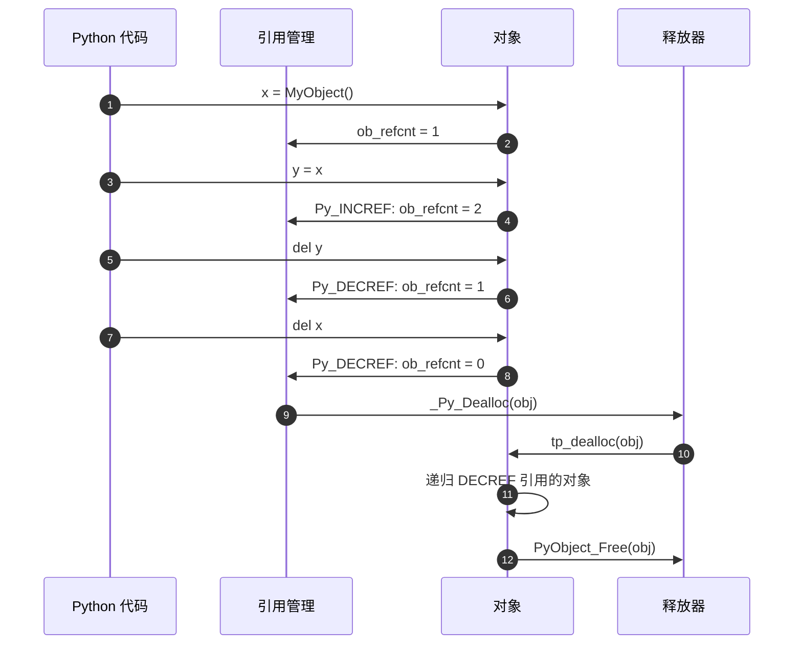
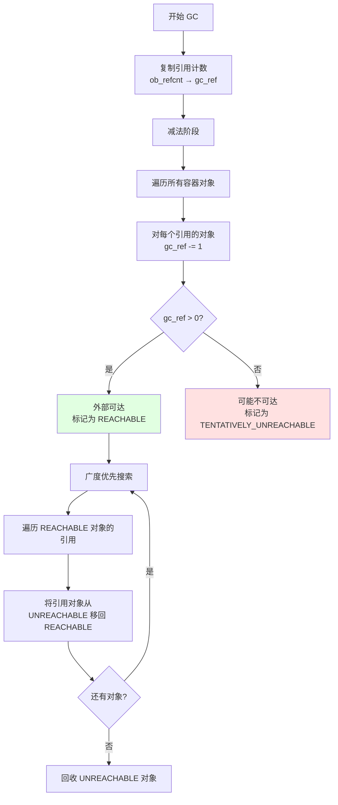
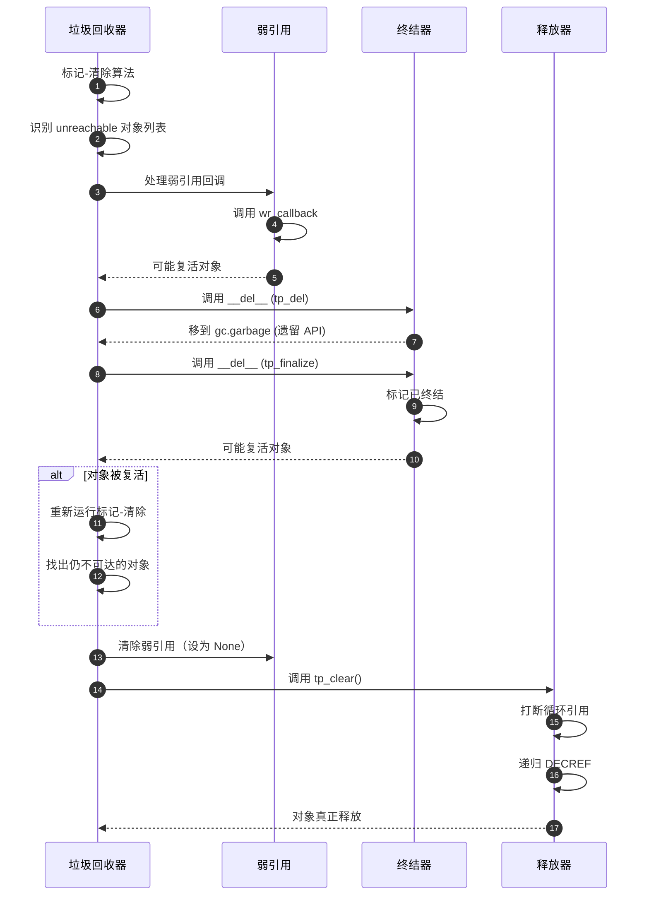
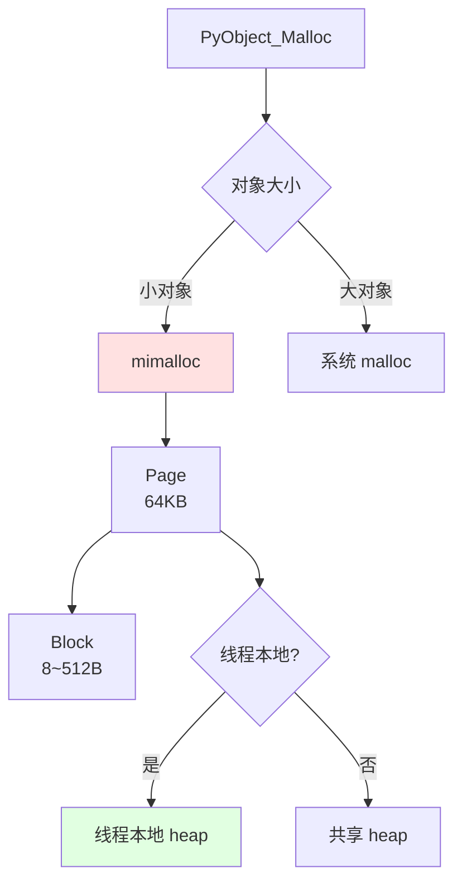
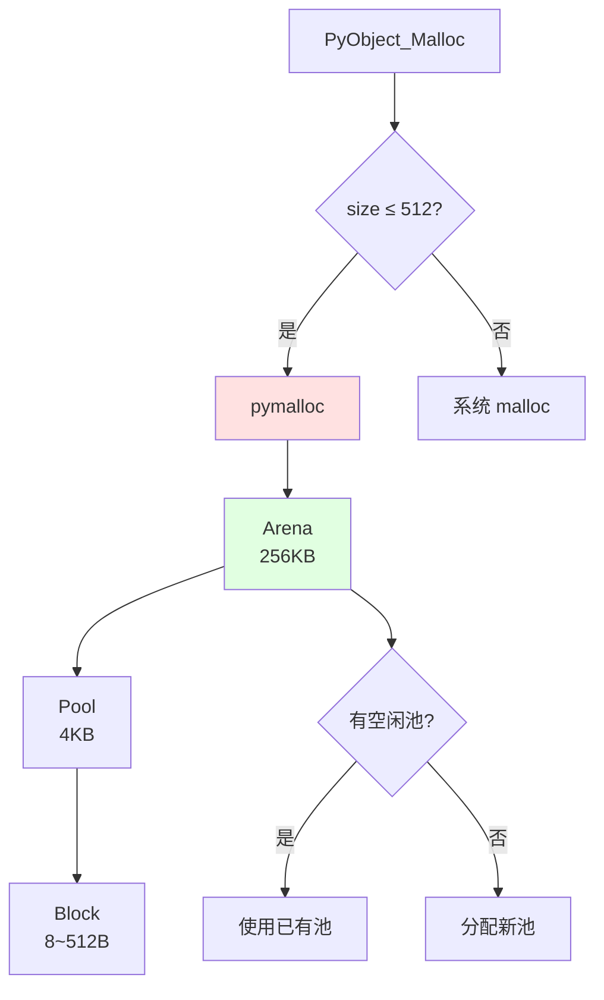
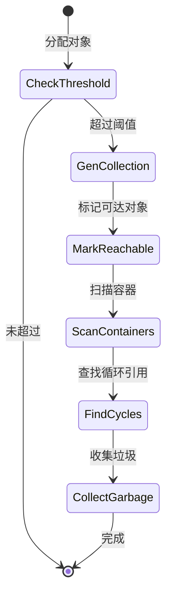

# CPython-06-内存管理-概览

## 1. 模块职责

内存管理模块负责 CPython 中所有对象的内存分配、释放和回收，是解释器的核心基础设施。CPython 采用**引用计数**作为主要的内存管理机制，辅以**标记-清除垃圾回收器**处理循环引用。

**核心职责**：
- 对象内存分配：为 Python 对象分配内存
- 引用计数管理：跟踪对象引用，自动释放无引用对象
- 循环引用回收：检测并回收引用循环
- 内存池管理：优化小对象分配性能
- 内存监控：提供内存使用统计和调试工具

**输入**：对象分配请求、对象引用操作
**输出**：已分配的对象内存、回收的内存空间

**生命周期**：从解释器启动到关闭全程运行，持续跟踪所有对象的生命周期。

## 2. 内存管理架构

### 2.1 整体架构图



**架构说明**：

CPython 的内存管理采用分层架构：

1. **引用计数层**：每个对象维护一个引用计数器（`ob_refcnt`），当引用计数归零时立即释放对象。这是 CPython 内存管理的第一道防线，能够快速回收大部分对象。

2. **垃圾回收层**：处理引用计数无法解决的循环引用问题。使用**标记-清除**算法定期扫描容器对象，识别并回收不可达的循环引用。

3. **内存分配层**：底层内存分配器，分为三个域（Domain）：
   - `PYMEM_DOMAIN_RAW`：直接封装系统 `malloc/free`
   - `PYMEM_DOMAIN_MEM`：通用 Python 内存
   - `PYMEM_DOMAIN_OBJ`：Python 对象内存，使用优化的分配器（自由线程版使用 mimalloc，默认版使用 pymalloc）

### 2.2 内存分配器层次



**分配器层次说明**：

- **PyObject_Malloc**：分配 Python 对象内存，小对象使用对象池优化，大对象直接使用系统 `malloc`。
- **PyMem_Malloc**：分配通用 Python 内存，行为类似 `malloc` 但可插入调试钩子。
- **PyMem_RawMalloc**：直接封装系统 `malloc`，用于需要在 GIL 外部分配的场景。

### 2.3 对象内存布局

**默认构建（带 GIL）**：



```
内存布局（GC 追踪对象）：

低地址 ┌───────────────────┐
       │   _gc_next        │  GC 链表下一个节点
       ├───────────────────┤
       │   _gc_prev        │  GC 链表上一个节点
       ├───────────────────┤ ← object 指针指向这里
       │   ob_refcnt       │  引用计数
       ├───────────────────┤
       │   ob_type         │  类型指针
       ├───────────────────┤
       │   对象数据         │
       │   ...             │
高地址 └───────────────────┘
```

**自由线程构建（无 GIL）**：

```
内存布局：

低地址 ┌───────────────────┐
       │   ob_tid          │  线程 ID (8 字节)
       ├───────────────────┤
       │ pad | ob_mutex |  │  2B pad + 1B mutex +
       │ ob_gc_bits       │  1B GC 位 +
       │ ob_ref_local     │  4B 本地引用计数
       ├───────────────────┤
       │ ob_ref_shared     │  共享引用计数 (8 字节)
       ├───────────────────┤
       │   ob_type         │  类型指针 (8 字节)
       ├───────────────────┤
       │   对象数据         │
高地址 └───────────────────┘
```

**布局说明**：

- **默认构建**：GC 追踪对象在正常对象前附加 `PyGC_Head`（16 字节），用于维护 GC 链表。通过简单的指针运算可在对象指针和 GC 头之间转换：`((PyGC_Head *)(obj) - 1)`。

- **自由线程构建**：所有对象内置 GC 追踪位（`ob_gc_bits`），无需额外头部。引用计数分为本地（`ob_ref_local`）和共享（`ob_ref_shared`）两部分，支持无锁操作。

## 3. 引用计数

引用计数是 CPython 内存管理的基石，每个对象维护一个计数器记录有多少引用指向它。

### 3.1 引用计数原理



**引用计数操作**：

```c
// Include/object.h

// 增加引用计数
static inline void Py_INCREF(PyObject *op)
{
#ifdef Py_GIL_DISABLED
    // 自由线程：原子操作本地引用计数
    _Py_atomic_add_int32(&op->ob_ref_local, 1);
#else
    // 默认构建：直接递增
    op->ob_refcnt++;
#endif
}

// 减少引用计数
static inline void Py_DECREF(PyObject *op)
{
#ifdef Py_GIL_DISABLED
    // 自由线程：原子操作
    if (_Py_atomic_add_int32(&op->ob_ref_local, -1) == 1) {
        // 本地计数归零，检查共享计数
        _Py_MergeZeroLocalRefcount(op);
    }
#else
    // 默认构建
    if (--op->ob_refcnt == 0) {
        _Py_Dealloc(op);
    }
#endif
}
```

**对象释放流程**：

```c
// Objects/object.c

void _Py_Dealloc(PyObject *op)
{
    PyTypeObject *type = Py_TYPE(op);
    destructor dealloc = type->tp_dealloc;

    // 1. 如果对象被 GC 追踪，从 GC 链表移除
    if (_PyObject_GC_IS_TRACKED(op)) {
        _PyObject_GC_UNTRACK(op);
    }

    // 2. 调用类型的析构函数
    (*dealloc)(op);
}

// 示例：列表的析构函数
static void
list_dealloc(PyListObject *op)
{
    Py_ssize_t i;

    // 递归 DECREF 列表元素
    if (op->ob_item != NULL) {
        i = Py_SIZE(op);
        while (--i >= 0) {
            Py_XDECREF(op->ob_item[i]);
        }
        PyMem_FREE(op->ob_item);
    }

    // 释放列表对象本身
    if (numfree < PyList_MAXFREELIST && PyList_CheckExact(op)) {
        // 加入对象池复用
        free_list[numfree++] = op;
    }
    else {
        // 真正释放内存
        Py_TYPE(op)->tp_free((PyObject *)op);
    }
}
```

### 3.2 引用计数优化：不朽对象

从 Python 3.12 开始，引入**不朽对象**（Immortal Objects）概念，部分对象（如 `None`、`True`、`False`、小整数）被标记为不朽，引用计数永不归零。

```c
// Include/object.h

#define _Py_IMMORTAL_REFCNT ((Py_ssize_t)0xFFFFFFFF)

static inline int _Py_IsImmortal(PyObject *op)
{
#if SIZEOF_VOID_P > 4
    return (op->ob_refcnt == _Py_IMMORTAL_REFCNT);
#else
    return (op->ob_refcnt & 0x80000000) != 0;
#endif
}

// 修改后的 Py_INCREF/DECREF 跳过不朽对象
static inline void Py_INCREF(PyObject *op)
{
    if (!_Py_IsImmortal(op)) {
        op->ob_refcnt++;
    }
}
```

**不朽对象优势**：
- 避免频繁修改单例对象引用计数，提升性能
- 减少多线程竞争（自由线程构建）
- 简化垃圾回收逻辑

**不朽对象范围**：
- 单例：`None`、`True`、`False`、`Ellipsis`、`NotImplemented`
- 小整数池：[-5, 256]
- 单字符字符串：'a' ~ 'z', 'A' ~ 'Z', ' ', '\n' 等
- 内置类型对象：`type(int)`、`type(str)` 等

### 3.3 引用计数的局限性

**优势**：
- 即时回收：引用归零立即释放，无需等待 GC
- 确定性：对象析构时机可预测
- 局部性：释放对象时立即处理其引用的对象，缓存友好

**劣势**：
- **无法处理循环引用**：`a -> b -> a`，两对象引用计数永不归零
- 性能开销：每次引用操作都需修改计数器
- 多线程竞争：引用计数修改需要原子操作（自由线程构建）

**循环引用示例**：

```python
# 创建循环引用
class Node:
    def __init__(self):
        self.next = None

a = Node()
b = Node()
a.next = b
b.next = a  # 循环：a -> b -> a

# 即使删除外部引用，对象仍不会被释放
del a
del b
# Node 对象内存泄漏！（没有 GC 的情况下）
```

## 4. 垃圾回收器

垃圾回收器（GC）专门处理引用计数无法解决的循环引用问题，使用**标记-清除**算法定期扫描容器对象。

### 4.1 GC 追踪对象

只有**容器对象**（能引用其他对象）才需要 GC 追踪：

| 类型 | 是否追踪 | 原因 |
|-----|---------|------|
| `list`, `dict`, `set`, `tuple` | 是 | 容器对象 |
| `class` 实例 | 是 | 可能包含引用 |
| `int`, `float`, `str` | 否 | 不可变基础类型，不引用其他对象 |
| 不可变 `tuple`（仅含不可变对象） | 否（延迟取消追踪） | 无法形成循环 |

**GC 追踪标志**：

```c
// Include/cpython/object.h

// 类型标志
#define Py_TPFLAGS_HAVE_GC (1UL << 14)  // 支持 GC

// 检查对象是否被 GC 追踪
#define _PyObject_GC_IS_TRACKED(op) \
    (_Py_AS_GC(op)->_gc_next != 0)

// 开始追踪对象
void _PyObject_GC_TRACK(PyObject *op)
{
    PyGC_Head *gc = _Py_AS_GC(op);
    if (gc->_gc_next != 0) {
        return;  // 已经在追踪
    }

    // 插入 GC 链表头部
    PyGC_Head *generation = &gcstate->young.head;
    PyGC_Head *last = generation->_gc_prev;

    _PyGCHead_SET_PREV(gc, last);
    _PyGCHead_SET_NEXT(last, gc);
    _PyGCHead_SET_NEXT(gc, generation);
    _PyGCHead_SET_PREV(generation, gc);

    gcstate->young.count++;
}
```

### 4.2 循环引用检测算法

GC 使用改进的**三色标记法**检测循环引用。



**算法详解**：

**阶段 1：减法（Subtract References）**

```c
// Python/gc.c

static void
subtract_refs(PyGC_Head *containers)
{
    PyGC_Head *gc = GC_NEXT(containers);
    for (; gc != containers; gc = GC_NEXT(gc)) {
        PyObject *op = FROM_GC(gc);

        // 复制引用计数到 gc_ref
        gc_set_refs(gc, Py_REFCNT(op));

        // 遍历对象引用的所有对象
        Py_TYPE(op)->tp_traverse(op, visit_decref, NULL);
    }
}

// 访问函数：减少被引用对象的 gc_ref
static int
visit_decref(PyObject *op, void *data)
{
    if (_PyObject_IS_GC(op)) {
        PyGC_Head *gc = AS_GC(op);
        // 减少 gc_ref（减去容器内部的引用）
        gc_decref(gc);
    }
    return 0;
}
```

**阶段 2：标记可达（Mark Reachable）**

```c
static void
move_unreachable(PyGC_Head *young, PyGC_Head *unreachable)
{
    PyGC_Head *gc = GC_NEXT(young);

    while (gc != young) {
        PyGC_Head *next = GC_NEXT(gc);

        if (gc_get_refs(gc)) {
            // gc_ref > 0：外部可达
            // 广度优先遍历，标记所有可达对象
            traverse_reachable(FROM_GC(gc));
        }
        else {
            // gc_ref == 0：可能不可达，移到 unreachable 列表
            gc_list_move(gc, unreachable);
        }

        gc = next;
    }
}

// 广度优先遍历
static void
traverse_reachable(PyObject *op)
{
    // 访问所有引用对象
    Py_TYPE(op)->tp_traverse(op, visit_reachable, NULL);
}

static int
visit_reachable(PyObject *op, void *arg)
{
    if (_PyObject_IS_GC(op)) {
        PyGC_Head *gc = AS_GC(op);

        if (gc_list_is_moved(gc)) {
            // 对象在 unreachable 列表，移回 reachable
            gc_list_move(gc, &reachable_list);
            gc_set_refs(gc, 1);  // 标记为已访问

            // 递归遍历
            traverse_reachable(op);
        }
    }
    return 0;
}
```

**示例**：

```python
# 示例代码
import gc

class Link:
    def __init__(self, next_link=None):
        self.next_link = next_link

# 创建循环引用
link_1 = Link()
link_2 = Link(link_1)
link_3 = Link(link_2)
link_1.next_link = link_3  # 循环：1 -> 2 -> 3 -> 1

# 外部引用
A = link_1

del link_1, link_2, link_3

# GC 前的状态：
# - link_1: ob_refcnt=1 (A 引用)
# - link_2: ob_refcnt=1 (link_1.next_link 引用)
# - link_3: ob_refcnt=1 (link_2.next_link 引用)

# 减法阶段后：
# - link_1: gc_ref=1-1=0 (被 link_3 引用，减去内部引用)
# - link_2: gc_ref=1-1=0
# - link_3: gc_ref=1-1=0

# 标记阶段：
# - link_1: ob_refcnt=1 > 0，外部可达（A 引用）
# - 从 link_1 出发，标记 link_2、link_3 为可达

# 结果：3 个对象都保留
```

### 4.3 分代收集

CPython GC 使用分代假设优化：大部分对象"朝生夕死"。

**默认构建：两代收集**


**分代策略**：

| 代 | 名称 | 触发条件 | 扫描范围 |
|----|------|----------|---------|
| 0  | Young | 分配次数 - 释放次数 > threshold0 (700) | 仅 Young 代 + Old 代部分 |
| 1  | Old   | 周期性扫描 Old 代 | Young 代 + Old 代未扫描部分 + 可达对象 |

**分代 GC 代码**：

```c
// Python/gc.c

static Py_ssize_t
gc_collect_young(PyThreadState *tstate, struct gc_collection_stats *stats)
{
    GCState *gcstate = &tstate->interp->gc;

    // 合并 Young 代和 Old 代部分对象
    PyGC_Head *young = &gcstate->young.head;
    PyGC_Head *old = &gcstate->old[0].head;

    // 增量扫描 Old 代（限制扫描量）
    Py_ssize_t young_count = gcstate->young.count;
    Py_ssize_t threshold = gcstate->threshold1;  // 默认 10
    Py_ssize_t old_to_scan = young_count / threshold;

    // 从 Old-Pending 移动对象到扫描列表
    gc_list_merge(old, young, old_to_scan);

    // 执行标记-清除
    return gc_collect_main(tstate, young, stats);
}
```

**增量收集优势**：
- 限制每次 GC 暂停时间
- 优先回收短命对象
- 减少扫描长命对象的频率

### 4.4 对象回收流程

检测到不可达对象后，需要安全地销毁它们，处理弱引用、终结器等。



**回收代码**：

```c
// Python/gc.c

static void
handle_weakrefs(PyGC_Head *unreachable, PyGC_Head *old)
{
    PyGC_Head *gc;

    for (gc = GC_NEXT(unreachable); gc != unreachable; gc = GC_NEXT(gc)) {
        PyObject *op = FROM_GC(gc);

        if (!_PyType_SUPPORTS_WEAKREFS(Py_TYPE(op))) {
            continue;
        }

        PyWeakReference **wrlist = _PyObject_GET_WEAKREFS_LISTPTR(op);
        if (wrlist == NULL || *wrlist == NULL) {
            continue;
        }

        // 调用弱引用回调
        handle_callback(*wrlist, op);
    }
}

static void
finalize_garbage(PyThreadState *tstate, PyGC_Head *collectable)
{
    PyGC_Head *gc = GC_NEXT(collectable);

    for (; gc != collectable; gc = GC_NEXT(gc)) {
        PyObject *op = FROM_GC(gc);

        if (!_PyGC_FINALIZED(op)) {
            // 调用 __del__ (tp_finalize)
            PyTypeObject *tp = Py_TYPE(op);
            if (tp->tp_finalize) {
                tp->tp_finalize(op);
                _PyGC_SET_FINALIZED(op);  // 标记已终结
            }
        }
    }
}

static void
delete_garbage(PyThreadState *tstate, PyGC_Head *collectable, PyGC_Head *old)
{
    while (!gc_list_is_empty(collectable)) {
        PyGC_Head *gc = GC_NEXT(collectable);
        PyObject *op = FROM_GC(gc);

        // 从 GC 列表移除
        gc_list_remove(gc);

        // 调用 tp_clear() 打断循环
        PyTypeObject *tp = Py_TYPE(op);
        if (tp->tp_clear) {
            tp->tp_clear(op);
        }

        // 引用计数归零，触发释放
        Py_DECREF(op);
    }
}
```

**对象复活示例**：

```python
class Resurrectable:
    def __del__(self):
        global ref
        ref = self  # 复活：重新创建引用

x = Resurrectable()
del x

# 第一次 GC：
# - x 被标记为 unreachable
# - 调用 __del__，ref = x
# - x 被复活

# 第二次 GC：
# - x 仍在 ref 中，reachable
```

## 5. 内存分配器

CPython 内存分配器针对小对象分配进行优化。

### 5.1 分配器架构（自由线程：mimalloc）

自 Python 3.13 自由线程版开始，使用 **mimalloc** 作为底层分配器。



**mimalloc 特性**：
- **线程本地堆**：每线程独立堆，无锁分配
- **延迟释放**：使用 QSBR（Quiescent State Based Reclamation）安全回收
- **块大小类**：8, 16, 24, ..., 512 字节，减少碎片
- **页级管理**：64KB 页，每页分配相同大小的块

**QSBR 延迟释放**：

```c
// Objects/obmalloc.c

static bool
_PyMem_mi_page_maybe_free(mi_page_t *page, mi_page_queue_t *pq, bool force)
{
#ifdef Py_GIL_DISABLED
    if (page->use_qsbr) {
        // 检查是否所有线程都进入静默状态
        _PyThreadStateImpl *tstate = (_PyThreadStateImpl *)PyThreadState_GET();
        if (page->qsbr_goal != 0 && _Py_qbsr_goal_reached(tstate->qsbr, page->qsbr_goal)) {
            // 安全释放页
            _PyMem_mi_page_clear_qsbr(page);
            _mi_page_free(page, pq, force);
            return true;
        }

        // 设置 QSBR 目标，延迟释放
        page->qsbr_goal = _Py_qsbr_advance(tstate->qsbr->shared);
        llist_insert_tail(&tstate->mimalloc.page_list, &page->qsbr_node);
        return false;
    }
#endif
    _mi_page_free(page, pq, force);
    return true;
}
```

### 5.2 分配器架构（默认：pymalloc）

默认构建使用 **pymalloc**，经典的 Python 对象池分配器。



**pymalloc 三层结构**：

**Arena（256KB）**：
- 从系统 `mmap` 分配大块内存
- 包含 64 个 Pool（64 * 4KB = 256KB）
- Arena 之间用双向链表连接

**Pool（4KB）**：
- 同一 Pool 内所有 Block 大小相同（Size Class）
- 三种状态：`full`（无空闲 Block）、`used`（部分使用）、`empty`（全空闲）
- 使用位图追踪 Block 分配状态

**Block（8~512B）**：
- 8 的倍数：8, 16, 24, ..., 512 字节
- 总共 64 个 Size Class

**pymalloc 数据结构**：

```c
// Include/internal/pycore_obmalloc.h

typedef struct pool_header {
    union { double _dummy; void *_padding; } dummy;  // 对齐
    struct pool_header *nextpool;       // 下一个同 Size Class 的池
    struct pool_header *prevpool;       // 上一个
    uint ref;                           // 已分配 Block 数
    uint freeblock;                     // 第一个空闲 Block 偏移
    uint szidx;                         // Size Class 索引 (0~63)
} pool_header;

typedef struct arena_object {
    uintptr_t address;                  // Arena 起始地址
    pool_header *freepools;             // 空闲 Pool 链表
    struct arena_object *nextarena;     // 下一个 Arena
    struct arena_object *prevarena;     // 上一个
    uint nfreepools;                    // 空闲 Pool 数
} arena_object;
```

**分配流程**：

```c
// Objects/obmalloc.c (pymalloc 版本)

static void *
pymalloc_alloc(void *ctx, size_t size)
{
    uint size_index = PYMALLOC_SIZE_INDEX(size);  // 计算 Size Class
    pool_header *pool;
    block *bp;

    // 1. 查找已有的 used 池
    pool = usedpools[size_index + size_index];  // 双索引
    if (pool != pool->nextpool) {
        // 找到 used 池
        bp = (block *)pool + pool->freeblock;
        pool->freeblock = *(block **)bp;  // 更新空闲链表

        if (pool->freeblock == 0) {
            // 池已满，移到 full 列表
            pool->nextpool->prevpool = pool->prevpool;
            pool->prevpool->nextpool = pool->nextpool;
        }

        pool->ref++;
        return (void *)bp;
    }

    // 2. 没有 used 池，分配新池
    pool = allocate_new_pool(size_index);
    if (pool == NULL) {
        return NULL;
    }

    // 3. 初始化池的 Block 链表
    bp = (block *)pool + POOL_OVERHEAD;
    pool->freeblock = *(block **)(bp + size);
    pool->ref = 1;

    return (void *)bp;
}
```

### 5.3 对象池优化

小对象频繁分配/释放，pymalloc/mimalloc 通过对象池复用内存。

**对象池示例（整数）**：

```c
// Objects/longobject.c

#ifndef Py_GIL_DISABLED
#define NSMALLPOSINTS           257
#define NSMALLNEGINTS           5

static PyLongObject small_ints[NSMALLNEGINTS + NSMALLPOSINTS];

PyObject *
PyLong_FromLong(long ival)
{
    // 小整数池：[-5, 256]
    if (IS_SMALL_INT(ival)) {
        return (PyObject *)&small_ints[ival + NSMALLNEGINTS];
    }

    // 大整数：正常分配
    return _PyLong_New(1);
}
#endif
```

**对象池适用场景**：
- **小整数**：[-5, 256]，不朽对象
- **单字符字符串**：'a'~'z'，内部驻留（interning）
- **空元组**：`()`，单例
- **空字符串**：`""`，单例

## 6. GC 触发机制

### 6.1 自动触发

GC 根据对象分配/释放次数自动触发。

```c
// Python/gc.c

void
_PyObject_GC_Link(PyObject *op)
{
    PyGC_Head *gc = AS_GC(op);
    GCState *gcstate = get_gc_state();

    // 插入 Young 代
    gc_list_append(gc, &gcstate->young.head);
    gcstate->young.count++;

    // 检查是否触发 GC
    if (gcstate->young.count > gcstate->young.threshold) {
        _PyGC_Collect(tstate, 0, _Py_GC_REASON_HEAP);
    }
}
```

**阈值配置**：

```python
import gc

# 获取当前阈值
print(gc.get_threshold())  # (700, 10, 10)

# 设置阈值
gc.set_threshold(1000, 15, 15)
```

| 参数 | 默认值 | 含义 |
|-----|-------|------|
| `threshold0` | 700 | Young 代触发阈值（分配-释放次数） |
| `threshold1` | 10  | Old 代扫描比例（Young 数 / threshold1） |
| `threshold2` | 10  | 未使用（兼容旧版） |

### 6.2 手动触发

```python
import gc

# 手动触发 GC
collected = gc.collect()  # 返回回收对象数
print(f"Collected {collected} objects")

# 禁用/启用自动 GC
gc.disable()
# ... 临界区代码 ...
gc.enable()
```

### 6.3 触发时机

| 场景 | 触发条件 | 代码位置 |
|-----|---------|---------|
| 对象分配 | `young.count > threshold0` | `_PyObject_GC_Link` |
| 解释器关闭 | 强制回收所有对象 | `Py_FinalizeEx` |
| 手动调用 | `gc.collect()` | `gc_collect_impl` |

## 7. 性能优化技术

### 7.1 延迟取消追踪

不可变容器（如元组）如果仅包含不可变对象，可以取消 GC 追踪。

```c
// Objects/tupleobject.c

static int
tupletraverse(PyTupleObject *o, visitproc visit, void *arg)
{
    Py_ssize_t i;

    for (i = Py_SIZE(o); --i >= 0; ) {
        Py_VISIT(o->ob_item[i]);
    }

    return 0;
}

// GC 扫描时检查是否可取消追踪
static int
untrack_tuples(PyGC_Head *head)
{
    PyGC_Head *next, *gc = GC_NEXT(head);

    while (gc != head) {
        PyObject *op = FROM_GC(gc);
        next = GC_NEXT(gc);

        if (PyTuple_CheckExact(op)) {
            if (can_untrack_tuple(op)) {
                _PyObject_GC_UNTRACK(op);
            }
        }

        gc = next;
    }
    return 0;
}

static int
can_untrack_tuple(PyTupleObject *op)
{
    Py_ssize_t i;

    for (i = 0; i < Py_SIZE(op); i++) {
        PyObject *elt = PyTuple_GET_ITEM(op, i);

        // 检查元素是否可被 GC 追踪
        if (_PyObject_IS_GC(elt)) {
            return 0;  // 包含可追踪对象，不能取消追踪
        }
    }

    return 1;  // 全部不可追踪，可以取消追踪元组
}
```

**示例**：

```python
import gc

# 可取消追踪的元组
t1 = (1, 2, 3)
print(gc.is_tracked(t1))  # False（延迟取消追踪）

# 不可取消追踪的元组
t2 = (1, [2], 3)
print(gc.is_tracked(t2))  # True（包含列表）
```

### 7.2 对象预分配

某些类型预分配对象池，避免频繁 malloc/free。

```c
// Objects/listobject.c

#define PyList_MAXFREELIST 80
static PyListObject *free_list[PyList_MAXFREELIST];
static int numfree = 0;

PyObject *
PyList_New(Py_ssize_t size)
{
    PyListObject *op;

    // 从对象池获取
    if (numfree) {
        numfree--;
        op = free_list[numfree];
        _Py_NewReference((PyObject *)op);
    }
    else {
        // 池空，分配新对象
        op = PyObject_GC_New(PyListObject, &PyList_Type);
        if (op == NULL)
            return NULL;
    }

    // 初始化列表
    if (size <= 0) {
        op->ob_item = NULL;
    }
    else {
        op->ob_item = (PyObject **) PyMem_Calloc(size, sizeof(PyObject *));
        if (op->ob_item == NULL) {
            Py_DECREF(op);
            return PyErr_NoMemory();
        }
    }

    Py_SET_SIZE(op, size);
    op->allocated = size;
    _PyObject_GC_TRACK(op);
    return (PyObject *) op;
}

static void
list_dealloc(PyListObject *op)
{
    // 释放列表元素
    Py_ssize_t i = Py_SIZE(op);
    while (--i >= 0) {
        Py_XDECREF(op->ob_item[i]);
    }
    PyMem_FREE(op->ob_item);

    // 加入对象池
    if (numfree < PyList_MAXFREELIST && PyList_CheckExact(op)) {
        free_list[numfree++] = op;
    }
    else {
        Py_TYPE(op)->tp_free((PyObject *)op);
    }
}
```

**对象池类型**：

| 类型 | 池大小 | 用途 |
|-----|-------|------|
| `PyListObject` | 80 | 列表对象 |
| `PyDictObject` | 80 | 字典对象 |
| `PyFrameObject` | N/A（无限增长） | 栈帧对象 |
| `PyMethodObject` | 256 | 方法对象 |

## 8. 调试与监控

### 8.1 GC 统计

```python
import gc

# 获取 GC 统计信息
stats = gc.get_stats()
for gen, stat in enumerate(stats):
    print(f"Generation {gen}: {stat}")

# 输出示例：
# Generation 0: {'collections': 142, 'collected': 3456, 'uncollectable': 0}
# Generation 1: {'collections': 12, 'collected': 234, 'uncollectable': 0}
```

### 8.2 GC 回调

```python
import gc

def gc_callback(phase, info):
    if phase == "start":
        print(f"GC started: generation {info['generation']}")
    elif phase == "stop":
        print(f"GC finished: collected {info['collected']} objects")

gc.callbacks.append(gc_callback)
```

### 8.3 内存泄漏检测

```python
import gc
import sys

# 查找所有对象
all_objects = gc.get_objects()
print(f"Total objects: {len(all_objects)}")

# 查找特定类型对象
leaks = [obj for obj in all_objects if isinstance(obj, MyClass)]
print(f"MyClass instances: {len(leaks)}")

# 查找引用者
for leak in leaks:
    referrers = gc.get_referrers(leak)
    print(f"Referrers: {referrers}")
```

### 8.4 GC 调试标志

```python
import gc

# 启用调试模式
gc.set_debug(gc.DEBUG_STATS | gc.DEBUG_LEAK)

# 调试标志：
# - DEBUG_STATS: 打印 GC 统计
# - DEBUG_LEAK: 打印不可回收对象
# - DEBUG_COLLECTABLE: 打印可回收对象
# - DEBUG_UNCOLLECTABLE: 打印不可回收对象
```

## 9. 自由线程构建的差异

自由线程构建（Free-threaded，无 GIL）的内存管理有显著差异。

### 9.1 引用计数

**默认构建**：

```c
static inline void Py_INCREF(PyObject *op) {
    op->ob_refcnt++;
}
```

**自由线程构建**：

```c
static inline void Py_INCREF(PyObject *op) {
    // 原子操作本地引用计数
    _Py_atomic_add_int32(&op->ob_ref_local, 1);
}

static inline void Py_DECREF(PyObject *op) {
    if (_Py_atomic_add_int32(&op->ob_ref_local, -1) == 1) {
        // 本地引用归零，合并共享引用
        _Py_MergeZeroLocalRefcount(op);
    }
}
```

**双重引用计数**：
- `ob_ref_local`：线程本地引用，无锁递增
- `ob_ref_shared`：跨线程共享引用，原子操作

### 9.2 GC 实现

**默认构建**：
- 依赖 GIL 保证线程安全
- 分代收集（Young, Old）
- 双向链表追踪对象

**自由线程构建**：
- Stop-the-World 暂停所有线程
- 非分代收集（扫描全堆）
- 使用 mimalloc 扫描堆，不维护链表
- `ob_gc_bits` 存储 GC 标志

### 9.3 QSBR 延迟回收

自由线程版使用 **QSBR**（Quiescent State Based Reclamation）安全回收内存。

```c
// Include/internal/pycore_qsbr.h

typedef struct {
    uint64_t wr_seq;  // 写序列号
    uint64_t rd_seq;  // 读序列号
} _Py_qsbr_thread_state;

// 检查是否所有线程都进入静默状态
static inline bool
_Py_qbsr_goal_reached(_Py_qsbr_thread_state *qsbr, uint64_t goal)
{
    return _Py_atomic_load_uint64(&qsbr->shared->wr_seq) >= goal;
}
```

**QSBR 原理**：
1. 释放内存前设置目标序列号 `goal`
2. 内存加入延迟释放列表
3. 定期检查所有线程是否超过 `goal`
4. 所有线程超过后，安全释放内存

## 10. 边界与异常

### 10.1 内存限制

```python
import sys

# Python 对象最大大小
print(sys.maxsize)  # 通常 2^63 - 1 (64位)

# 示例：巨大列表
try:
    huge_list = [0] * sys.maxsize
except MemoryError:
    print("MemoryError: 内存不足")
```

### 10.2 GC 禁用风险

```python
import gc

# 禁用 GC
gc.disable()

# 创建循环引用
class Node:
    def __init__(self):
        self.ref = None

a = Node()
b = Node()
a.ref = b
b.ref = a

del a, b
# 内存泄漏！（GC 被禁用，循环引用无法回收）

gc.enable()
gc.collect()  # 手动回收
```

### 10.3 终结器陷阱

```python
class Finalizer:
    def __del__(self):
        print("Finalizing...")
        # 危险：__del__ 中访问全局变量可能失败
        # 解释器关闭时，globals 可能已被清理

x = Finalizer()
del x  # Finalizing...

# 循环引用 + 终结器 = 不可回收
class BadFinalizer:
    def __init__(self):
        self.ref = None

    def __del__(self):
        pass  # 有 __del__ 的对象循环引用难以回收

a = BadFinalizer()
b = BadFinalizer()
a.ref = b
b.ref = a

del a, b
# 早期 Python 版本：对象进入 gc.garbage
# Python 3.4+：使用 tp_finalize 改进
```

## 11. 性能考量

### 11.1 引用计数开销

引用计数每次操作都需修改计数器，影响性能。

**测试**：

```python
import timeit

# 频繁引用操作
def test_refcount():
    x = [1, 2, 3]
    for _ in range(1000):
        y = x  # INCREF
        del y  # DECREF

print(timeit.timeit(test_refcount, number=10000))
```

**优化**：
- 不朽对象：跳过单例引用计数修改
- 借用引用（Borrowed Reference）：临时引用不修改计数

### 11.2 GC 暂停时间

GC 扫描会暂停程序执行。

```python
import gc
import time

gc.collect()  # 预热

start = time.time()
# 创建大量对象
objects = [[] for _ in range(100000)]
for obj in objects:
    obj.append(obj)  # 循环引用

gc_time = time.time() - start
print(f"GC pause: {gc_time:.3f}s")
```

**减少暂停时间**：
- 增加 `threshold0`：减少 GC 频率
- 禁用 GC（临界区）：`gc.disable()` / `gc.enable()`
- 使用不可变对象：避免 GC 追踪

### 11.3 内存碎片

长期运行的程序可能产生内存碎片。

```python
# 内存碎片示例
large_objects = []
for _ in range(1000):
    # 分配大对象
    obj = [0] * 10000
    large_objects.append(obj)

# 释放部分对象
del large_objects[::2]  # 释放偶数索引对象

# 内存碎片：空闲内存不连续，无法分配大块
```

**缓解策略**：
- pymalloc 使用固定大小类，减少碎片
- Arena 级别回收：整个 Arena 空闲时归还系统
- 应用层优化：对象池复用

## 12. 最佳实践

### 12.1 避免循环引用

```python
# 不推荐：循环引用
class Parent:
    def __init__(self):
        self.child = None

class Child:
    def __init__(self, parent):
        self.parent = parent  # 循环引用

# 推荐：使用弱引用
import weakref

class Child:
    def __init__(self, parent):
        self.parent = weakref.ref(parent)  # 弱引用，不增加引用计数

parent = Parent()
child = Child(parent)
parent.child = child

del parent
# child.parent() 返回 None（parent 已被回收）
```

### 12.2 及时释放大对象

```python
# 不推荐：大对象长期占用内存
data = load_huge_dataset()
result = process(data)
# data 仍然占用内存

# 推荐：及时释放
data = load_huge_dataset()
result = process(data)
del data  # 立即释放
gc.collect()  # 强制 GC（可选）
```

### 12.3 使用上下文管理器

```python
# 推荐：自动释放资源
class Resource:
    def __enter__(self):
        self.data = allocate_memory()
        return self

    def __exit__(self, exc_type, exc_val, exc_tb):
        free_memory(self.data)

with Resource() as res:
    process(res.data)
# 自动释放内存
```

## 13. 总结

CPython 内存管理采用**引用计数 + 标记-清除 GC** 混合策略：

1. **引用计数**：快速回收大部分对象，提供确定性释放时机。
2. **垃圾回收**：处理循环引用，使用分代收集优化性能。
3. **内存分配器**：针对小对象优化（pymalloc/mimalloc），减少系统调用和碎片。
4. **对象池**：复用频繁分配的小对象（列表、字典、整数）。
5. **不朽对象**：单例对象跳过引用计数，提升性能。

**自由线程构建差异**：
- 双重引用计数：线程本地 + 共享计数
- 非分代 GC：每次扫描全堆
- QSBR 延迟回收：安全的无锁内存回收
- mimalloc：线程本地堆，无锁分配

**性能权衡**：
- 引用计数开销 vs. 即时回收
- GC 暂停时间 vs. 内存利用率
- 对象池复用 vs. 内存碎片

理解 CPython 内存管理机制，有助于编写高性能 Python 程序和 C 扩展。


## 11. 内存管理API源码深度剖析

### 11.1 垃圾回收核心：collect_generations

```c
// Modules/gcmodule.c

static Py_ssize_t collect_generations(PyThreadState *tstate, struct _gc_runtime_state *state)
{
    int i;
    Py_ssize_t n = 0;
    
    // 检查每一代
    for (i = NUM_GENERATIONS-1; i >= 0; i--) {
        if (state->generations[i].count > state->generations[i].threshold) {
            // 执行收集
            if (i == NUM_GENERATIONS - 1) {
                n = collect_full(tstate, state, i);
            }
            else {
                n = collect_with_callback(tstate, state, i);
            }
            break;
        }
    }
    return n;
}
```

**GC完整流程图**：




---

## 深度补充文档

本模块的详细API源码分析、完整UML图、详细时序图、完整函数调用链和架构图请参阅：

**[CPython-06-深度补充文档](CPython-06-*-深度补充.md)**

深度补充内容包括：
- ✅ 核心API完整源码剖析（带详细注释）
- ✅ 多层次UML类图（数据结构、关系图）
- ✅ 完整执行流程时序图
- ✅ 端到端函数调用链追踪
- ✅ 模块内部架构流程图
- ✅ 性能优化技术详解
- ✅ 最佳实践与调试技巧


