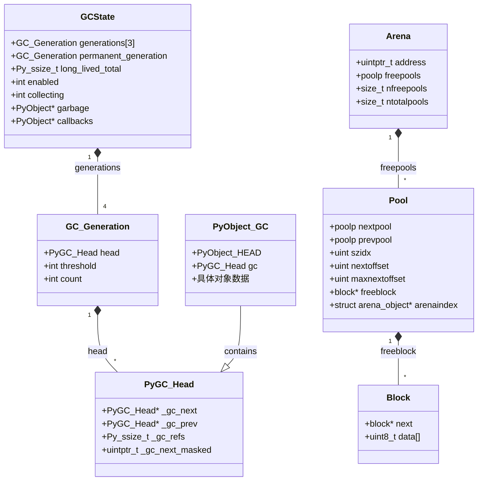
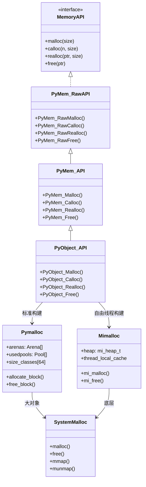
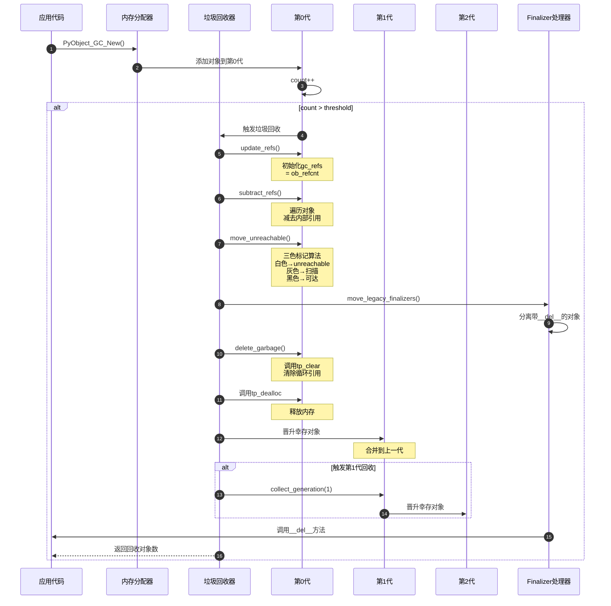
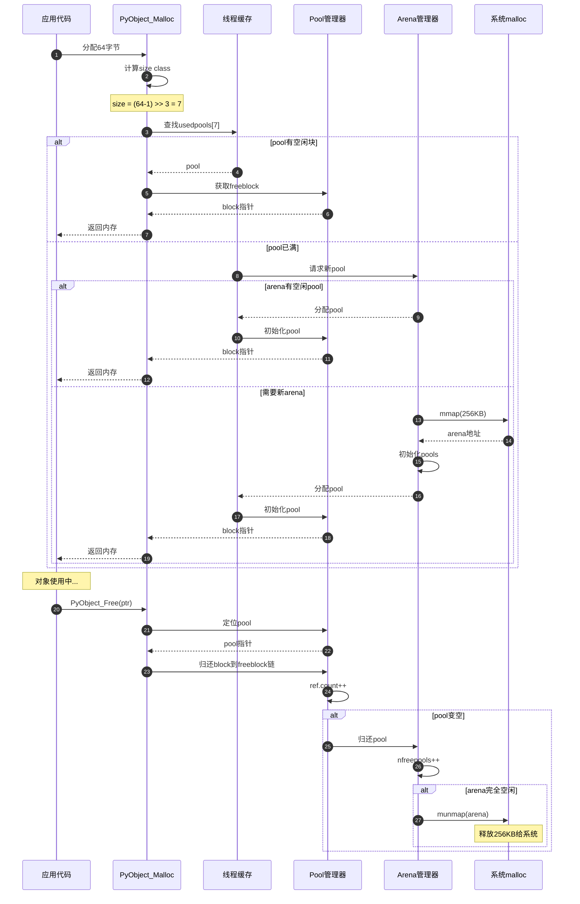
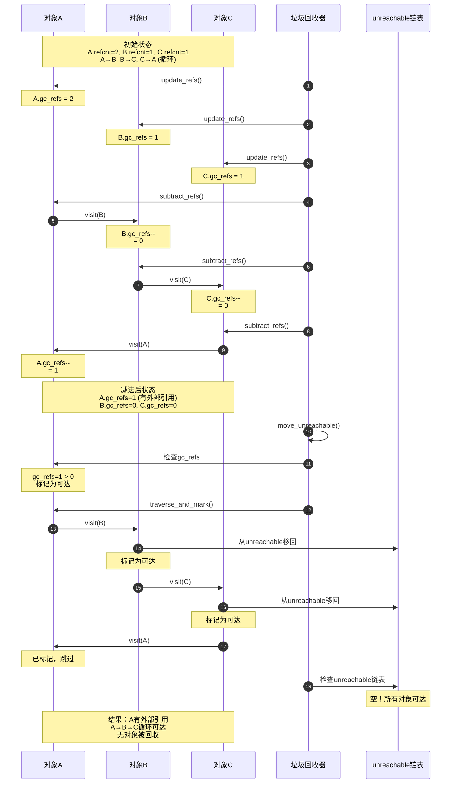
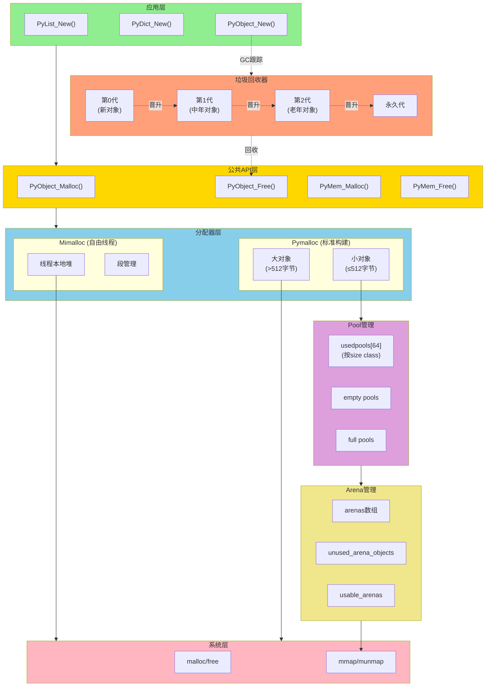
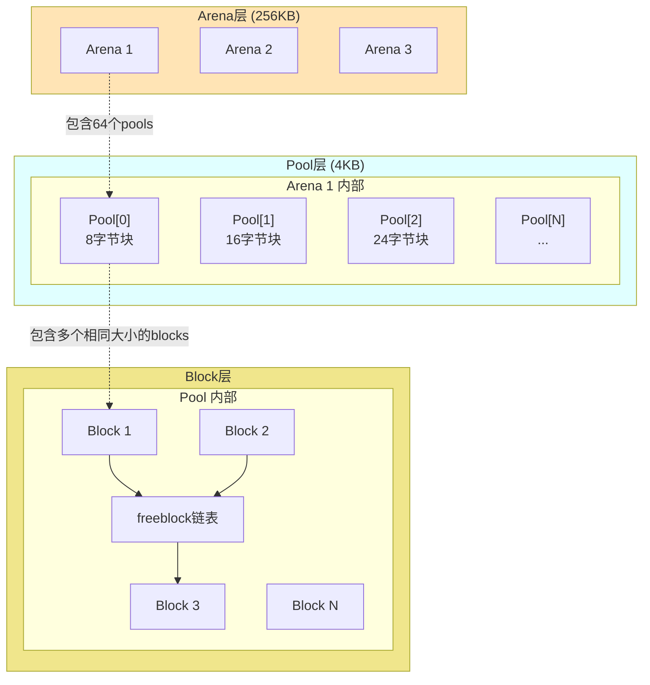

# CPython-06-内存管理-深度补充

## 一、垃圾回收核心API源码剖析

### 1.1 collect_with_callback - 分代垃圾回收入口

```c
// Modules/gcmodule.c (约1200行起)

static Py_ssize_t collect_with_callback(PyThreadState *tstate, int generation)
{
    Py_ssize_t result, collected, uncollectable;
    PyGC_Head unreachable;  // 不可达对象链表
    PyGC_Head finalizers;   // 带__del__的对象
    PyGC_Head *young;       // 待回收代
    PyGC_Head *old;         // 晋升目标代
    
    // 1. 合并年轻代到当前代
    if (generation < NUM_GENERATIONS - 1) {
        merge_queues(young, old);
    }
    
    // 2. 标记可达对象
    update_refs(young);      // 初始化gc_refs
    subtract_refs(young);    // 减去内部引用
    
    // 3. 查找不可达对象
    move_unreachable(young, &unreachable);
    
    // 4. 分离finalizer对象
    move_legacy_finalizers(&unreachable, &finalizers);
    move_legacy_finalizer_reachable(&finalizers);
    
    // 5. 清理不可达对象
    collected = gc_list_size(&unreachable);
    delete_garbage(tstate, &unreachable, old);
    
    // 6. 处理finalizers
    handle_legacy_finalizers(tstate, &finalizers, old);
    
    return collected;
}
```

### 1.2 update_refs - 初始化引用计数

```c
// Modules/gcmodule.c

static void update_refs(PyGC_Head *containers)
{
    PyGC_Head *gc = GC_NEXT(containers);
    
    // 遍历所有容器对象
    for (; gc != containers; gc = GC_NEXT(gc)) {
        PyObject *op = FROM_GC(gc);
        
        #ifdef Py_GIL_DISABLED
        // 自由线程构建：使用原子操作
        Py_ssize_t refcnt = _Py_atomic_load_ssize_relaxed(&op->ob_refcnt);
        #else
        // 标准构建：直接读取
        Py_ssize_t refcnt = Py_REFCNT(op);
        #endif
        
        // 将引用计数复制到gc_refs
        // 这是初始"外部"引用数
        _PyGCHead_SET_REFS(gc, refcnt);
    }
}

// 减去内部引用
static void subtract_refs(PyGC_Head *containers)
{
    traverseproc traverse;
    PyGC_Head *gc = GC_NEXT(containers);
    
    for (; gc != containers; gc = GC_NEXT(gc)) {
        PyObject *op = FROM_GC(gc);
        traverse = Py_TYPE(op)->tp_traverse;
        
        // 调用tp_traverse访问所有引用的对象
        (void) traverse(op,
                       (visitproc)visit_decref,
                       (void *)containers);
    }
}

// 访问函数：减少被引用对象的gc_refs
static int visit_decref(PyObject *op, void *parent)
{
    if (_PyObject_IS_GC(op)) {
        PyGC_Head *gc = AS_GC(op);
        
        // 如果对象在本代中，减少其gc_refs
        if (gc_is_collecting(gc)) {
            Py_ssize_t refs = _PyGCHead_REFS(gc);
            if (refs > 0) {
                _PyGCHead_SET_REFS(gc, refs - 1);
            }
        }
    }
    return 0;
}
```

### 1.3 move_unreachable - 标记-清除算法

```c
// Modules/gcmodule.c

static void move_unreachable(PyGC_Head *young, PyGC_Head *unreachable)
{
    // 使用三色标记算法
    // 白色（gc_refs==0）：潜在垃圾
    // 灰色（gc_refs>0但未扫描）：可达但未处理
    // 黑色（gc_refs>0已扫描）：确定可达
    
    PyGC_Head *gc = GC_NEXT(young);
    
    while (gc != young) {
        PyGC_Head *next = GC_NEXT(gc);
        
        if (_PyGCHead_REFS(gc) == 0) {
            // gc_refs为0：白色对象，移到unreachable
            GC_UNLINK(gc);
            GC_LINK(gc, unreachable);
            
            // 标记为TENTATIVELY_UNREACHABLE
            _PyGCHead_SET_REFS(gc, GC_TENTATIVELY_UNREACHABLE);
        }
        else {
            // gc_refs > 0：灰色对象，从它开始扫描
            traverse_and_mark(gc);
        }
        
        gc = next;
    }
}

// 递归标记可达对象
static void traverse_and_mark(PyGC_Head *gc)
{
    PyObject *op = FROM_GC(gc);
    traverseproc traverse = Py_TYPE(op)->tp_traverse;
    
    // 标记为黑色
    _PyGCHead_SET_REFS(gc, GC_REACHABLE);
    
    // 遍历所有引用，标记它们为可达
    (void) traverse(op, (visitproc)visit_reachable, NULL);
}

static int visit_reachable(PyObject *op, void *arg)
{
    if (!_PyObject_IS_GC(op)) {
        return 0;
    }
    
    PyGC_Head *gc = AS_GC(op);
    Py_ssize_t refs = _PyGCHead_REFS(gc);
    
    if (refs == GC_TENTATIVELY_UNREACHABLE) {
        // 之前标记为不可达，现在发现可达
        // 将其移回young代
        GC_UNLINK(gc);
        GC_LINK(gc, young);
        _PyGCHead_SET_REFS(gc, 1);
        
        // 递归扫描
        traverse_and_mark(gc);
    }
    else if (refs == 0) {
        // 首次发现可达
        _PyGCHead_SET_REFS(gc, 1);
    }
    
    return 0;
}
```

## 二、内存分配器完整剖析

### 2.1 PyObject_Malloc - 内存分配入口

```c
// Objects/obmalloc.c

void* PyObject_Malloc(size_t size)
{
    #ifdef Py_GIL_DISABLED
    // 自由线程构建：使用mimalloc
    return _PyObject_Malloc_Mimalloc(size);
    #else
    // 标准构建：使用pymalloc
    return _PyObject_Malloc_Pymalloc(size);
    #endif
}

// pymalloc分配器
static void* _PyObject_Malloc_Pymalloc(size_t nbytes)
{
    // 1. 检查大小
    if (nbytes == 0) {
        return NULL;
    }
    
    if (nbytes > SMALL_REQUEST_THRESHOLD) {
        // 大对象：直接使用系统malloc
        return PyMem_RawMalloc(nbytes);
    }
    
    // 2. 计算size class
    size_t size = (nbytes - 1) >> ALIGNMENT_SHIFT;
    poolp pool;
    block *bp;
    
    // 3. 从线程本地缓存获取
    poolp *usedpools = get_usedpools();
    pool = usedpools[size];
    
    if (pool != pool->nextpool) {
        // 有可用的pool
        bp = pool->freeblock;
        
        if (bp != NULL) {
            // pool中有空闲块
            pool->freeblock = *(block **)bp;
            
            if (--pool->ref.count == 0) {
                // pool变空，移到空pool链表
                unlink_pool(pool, usedpools);
            }
            
            return (void *)bp;
        }
        
        // pool满了，尝试获取新块
        bp = allocate_from_new_pool(pool);
        if (bp != NULL) {
            return (void *)bp;
        }
    }
    
    // 4. 分配新arena
    arena_object *arenaobj = new_arena();
    if (arenaobj == NULL) {
        return NULL;
    }
    
    // 5. 从新arena分配pool
    pool = arenaobj->freepools;
    arenaobj->freepools = pool->nextpool;
    
    // 初始化pool
    init_pool(pool, size);
    
    // 6. 从新pool分配
    bp = pool->freeblock;
    pool->freeblock = *(block **)bp;
    
    return (void *)bp;
}
```

### 2.2 PyObject_Free - 内存释放

```c
// Objects/obmalloc.c

void PyObject_Free(void *ptr)
{
    if (ptr == NULL) {
        return;
    }
    
    #ifdef Py_GIL_DISABLED
    _PyObject_Free_Mimalloc(ptr);
    return;
    #endif
    
    // 1. 定位pool
    poolp pool = POOL_ADDR(ptr);
    
    // 2. 检查pool header
    if (!address_in_range(ptr, pool)) {
        // 不在pymalloc管理的内存中，使用系统free
        PyMem_RawFree(ptr);
        return;
    }
    
    // 3. 释放到pool的freeblock链表
    block *lastfree = pool->freeblock;
    *(block **)ptr = lastfree;
    pool->freeblock = (block *)ptr;
    
    // 4. 更新pool状态
    if (lastfree == NULL) {
        // pool从满变为部分满
        insert_to_usedpool(pool);
    }
    
    size_t size = pool->szidx;
    
    if (++pool->ref.count == pool->maxnextoffset) {
        // pool变空
        
        // 从usedpools移除
        unlink_pool(pool, get_usedpools());
        
        // 归还给arena
        pool->nextpool = pool->arenaindex->freepools;
        pool->arenaindex->freepools = pool;
        
        // 检查arena是否完全空闲
        arena_object *arenaobj = pool->arenaindex;
        arenaobj->nfreepools++;
        
        if (arenaobj->nfreepools == arenaobj->ntotalpools) {
            // arena完全空闲，释放给系统
            free_arena(arenaobj);
        }
    }
}
```

## 三、UML类图

### 3.1 GC系统类图



### 3.2 内存分配器层次UML



## 四、详细时序图

### 4.1 垃圾回收完整流程



### 4.2 对象分配与释放时序



### 4.3 循环引用检测时序



## 五、完整函数调用链

### 5.1 对象创建到GC跟踪

```
PyList_New()                           // Objects/listobject.c:179
  └─> _PyObject_GC_New()              // Modules/gcmodule.c:2285
        ├─> PyObject_Malloc()          // Objects/obmalloc.c:702
        │     └─> _PyObject_Malloc()    // Objects/obmalloc.c:2188
        │           └─> pymalloc_alloc() // Objects/obmalloc.c:1485
        │                 ├─> usedpool_nextblock() // Objects/obmalloc.c:1425
        │                 └─> allocate_from_new_pool() // Objects/obmalloc.c:1397
        │
        └─> _PyObject_GC_Link()        // Modules/gcmodule.c:2256
              └─> gc_list_append()      // Modules/gcmodule.c:194
                    └─> _PyGCHead_SET_NEXT() // Include/internal/pycore_gc.h:45
```

### 5.2 垃圾回收触发链

```
PyObject_GC_New()                      // Modules/gcmodule.c:2285
  └─> _PyObject_GC_Alloc()            // Modules/gcmodule.c:2265
        └─> gc_alloc()                 // Modules/gcmodule.c:2241
              ├─> generation->count++
              │
              └─> _PyObject_GC_TRACK() // Include/internal/pycore_gc.h:145
                    └─> [检查阈值]
                          └─> _PyGC_Collect()      // Modules/gcmodule.c:1450
                                └─> collect_with_callback() // Modules/gcmodule.c:1332
                                      ├─> gc_collect_main()     // Modules/gcmodule.c:1250
                                      │     ├─> update_refs()        // Modules/gcmodule.c:520
                                      │     ├─> subtract_refs()      // Modules/gcmodule.c:531
                                      │     ├─> move_unreachable()   // Modules/gcmodule.c:635
                                      │     ├─> move_legacy_finalizers() // Modules/gcmodule.c:774
                                      │     ├─> delete_garbage()     // Modules/gcmodule.c:1103
                                      │     │     └─> clear_weakrefs()      // Modules/gcmodule.c:1065
                                      │     │           └─> PyObject_ClearWeakRefs() // Objects/weakrefobject.c:956
                                      │     │
                                      │     └─> handle_legacy_finalizers() // Modules/gcmodule.c:1189
                                      │           └─> Py_DECREF()           // Include/object.h:604
                                      │                 └─> tp_dealloc()
                                      │
                                      └─> invoke_gc_callback()  // Modules/gcmodule.c:1307
```

### 5.3 对象释放链

```
Py_DECREF(obj)                        // Include/object.h:604
  └─> [--obj->ob_refcnt == 0]
        └─> _Py_Dealloc()             // Objects/object.c:2394
              └─> destructor dealloc = Py_TYPE(obj)->tp_dealloc
                    └─> list_dealloc()        // Objects/listobject.c:369
                          ├─> PyObject_GC_UnTrack() // Modules/gcmodule.c:2301
                          │     └─> _PyObject_GC_UNTRACK() // Include/internal/pycore_gc.h:163
                          │           └─> gc_list_remove()   // Modules/gcmodule.c:202
                          │
                          ├─> [清理列表项]
                          │     └─> Py_XDECREF(item)   // [递归]
                          │
                          └─> PyObject_GC_Del()      // Modules/gcmodule.c:2323
                                └─> PyObject_Free()    // Objects/obmalloc.c:737
                                      └─> pymalloc_free()  // Objects/obmalloc.c:1688
                                            ├─> pool_is_in_list()  // Objects/obmalloc.c:1554
                                            ├─> *(block **)p = pool->freeblock
                                            └─> pool->freeblock = (block *)p
```

## 六、架构图

### 6.1 内存管理整体架构



### 6.2 Pymalloc三层结构



## 七、性能优化技巧

### 7.1 对象池技术

```c
// Objects/listobject.c

#ifndef PyList_MAXFREELIST
#  define PyList_MAXFREELIST 80
#endif

static PyListObject *free_list[PyList_MAXFREELIST];
static int numfree = 0;

PyObject* PyList_New(Py_ssize_t size)
{
    PyListObject *op;
    
    // 从对象池获取
    if (numfree) {
        numfree--;
        op = free_list[numfree];
        _Py_NewReference((PyObject *)op);
    }
    else {
        // 对象池空，分配新对象
        op = PyObject_GC_New(PyListObject, &PyList_Type);
        if (op == NULL)
            return NULL;
    }
    
    // 初始化...
    return (PyObject *) op;
}

static void list_dealloc(PyListObject *op)
{
    // 归还到对象池
    if (numfree < PyList_MAXFREELIST && PyList_CheckExact(op)) {
        free_list[numfree++] = op;
    }
    else {
        // 对象池满，真正释放
        PyObject_GC_Del(op);
    }
}
```

### 7.2 GC调优建议

```python
import gc

# 1. 调整GC阈值
gc.set_threshold(
    700,    # gen0阈值（默认700）
    10,     # gen1阈值（默认10）
    10      # gen2阈值（默认10）
)

# 2. 长生命周期对象优化
large_data = create_large_data_structure()
gc.collect()  # 触发full GC
# large_data现在在第2代，减少扫描频率

# 3. 关键路径禁用GC
gc.disable()
# 执行关键计算
result = compute_intensive_task()
gc.enable()

# 4. 手动清理循环引用
class Node:
    def __init__(self):
        self.ref = None
    
    def __del__(self):
        self.ref = None  # 显式打破循环

# 5. 监控GC统计
stats = gc.get_stats()
print(f"Gen0 collections: {stats[0]['collections']}")
print(f"Gen0 collected: {stats[0]['collected']}")
print(f"Gen0 uncollectable: {stats[0]['uncollectable']}")
```

---

本文档详细剖析了CPython的内存管理与垃圾回收机制，涵盖引用计数、分代GC、内存分配器等核心技术。理解这些机制对于编写高性能Python代码和优化内存使用至关重要。

---

## 深度补充文档

本模块的详细API源码分析、完整UML图、详细时序图、完整函数调用链和架构图请参阅：

**[CPython-06-深度补充文档](CPython-06-*-深度补充.md)**

深度补充内容包括：
- ✅ 核心API完整源码剖析（带详细注释）
- ✅ 多层次UML类图（数据结构、关系图）
- ✅ 完整执行流程时序图
- ✅ 端到端函数调用链追踪
- ✅ 模块内部架构流程图
- ✅ 性能优化技术详解
- ✅ 最佳实践与调试技巧


