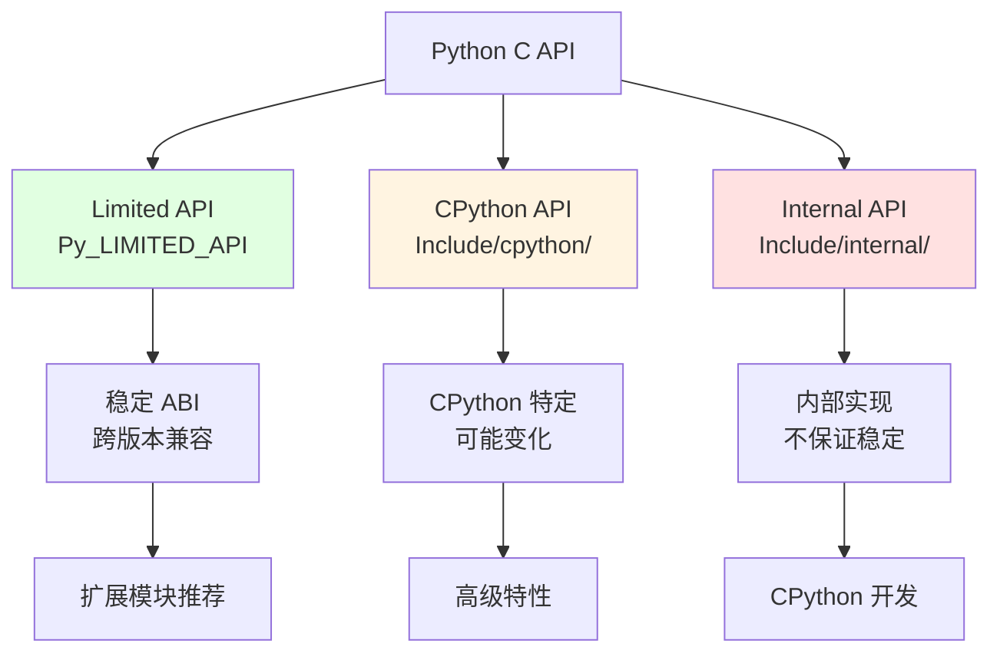
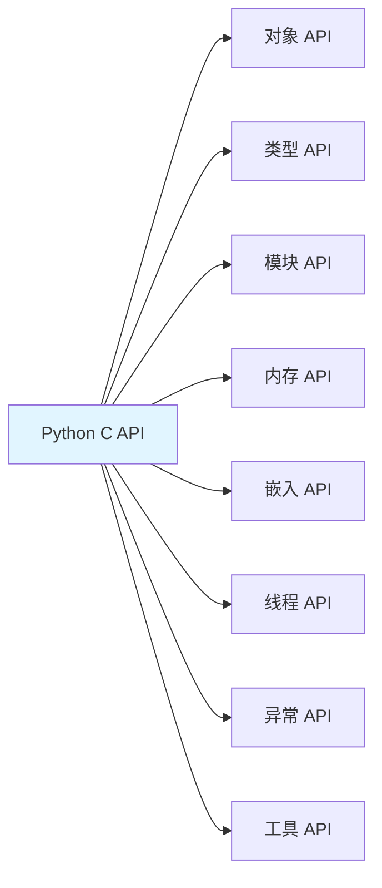
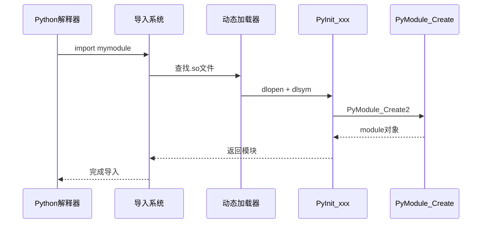

# CPython-07-C-API-概览

## 1. 模块职责

Python C API 是 CPython 提供给C/C++开发者的接口，用于扩展 Python 功能或嵌入 Python 解释器到其他应用程序。

**核心职责**：
- 提供扩展模块开发接口
- 提供嵌入式 Python 接口
- 提供自定义类型定义接口
- 提供线程和 GIL 管理接口
- 提供对象生命周期管理接口

**应用场景**：
- 编写高性能 Python 扩展模块
- 在 C/C++ 应用中嵌入 Python
- 与现有 C/C++ 库集成
- 优化性能瓶颈

## 2. API 层次结构

CPython C API 分为三个层次，具有不同的稳定性保证。

### 2.1 API 层次总览



**层次说明**：

| 层次 | 位置 | 稳定性 | 用途 |
|-----|------|--------|------|
| **Limited API** | `Include/*.h` | 高（稳定 ABI） | 生产环境扩展模块 |
| **CPython API** | `Include/cpython/*.h` | 中（小版本可能变化） | CPython 特定功能 |
| **Internal API** | `Include/internal/*.h` | 低（随时可能变化） | CPython 内部开发 |

### 2.2 Limited API（稳定 ABI）

Limited API 是 Python 3.2+ 引入的稳定接口，保证 ABI 兼容性。

**启用方式**：

```c
#define Py_LIMITED_API 0x030C0000  // Python 3.12
#include <Python.h>
```

**优势**：
- **跨版本兼容**：一次编译，多版本运行（如 Python 3.12-3.15）
- **长期稳定**：API 不会破坏性变化
- **官方支持**：保证向后兼容

**限制**：
- 不包含所有 API（约 60% 的完整 API）
- 性能可能略低（间接访问某些字段）
- 无法访问 CPython 内部结构

**示例**：

```c
// limited_ext.c - 使用 Limited API 的扩展模块

#define Py_LIMITED_API 0x030C0000
#include <Python.h>

static PyObject *
my_function(PyObject *self, PyObject *args)
{
    const char *message;

    // 解析参数
    if (!PyArg_ParseTuple(args, "s", &message)) {
        return NULL;
    }

    // 构建返回值
    return PyUnicode_FromFormat("Hello, %s!", message);
}

static PyMethodDef MyMethods[] = {
    {"greet", my_function, METH_VARARGS, "Greet someone"},
    {NULL, NULL, 0, NULL}  // 哨兵
};

static struct PyModuleDef mymodule = {
    PyModuleDef_HEAD_INIT,
    "mymodule",              // 模块名
    "Example module",        // 模块文档
    -1,                      // 模块状态大小
    MyMethods
};

PyMODINIT_FUNC
PyInit_mymodule(void)
{
    return PyModule_Create(&mymodule);
}
```

**编译**：

```bash
gcc -shared -fPIC -I/usr/include/python3.12 \
    -o mymodule.abi3.so limited_ext.c

# 可在 Python 3.12, 3.13, 3.14 等版本使用
```

### 2.3 CPython API

CPython API 提供完整的 CPython 功能，但可能在小版本间变化。

**包含内容**：
- 对象内部字段直接访问（如 `PyLongObject.ob_digit`）
- 未包含在 Limited API 中的函数
- 性能优化的宏（如 `PyList_GET_ITEM`）

**示例**：

```c
// cpython_ext.c - 使用 CPython API

#include <Python.h>
#include "cpython/longintrepr.h"  // 长整数内部表示

static PyObject *
get_int_digits(PyObject *self, PyObject *args)
{
    PyObject *num;

    if (!PyArg_ParseTuple(args, "O!", &PyLong_Type, &num)) {
        return NULL;
    }

    // 访问 CPython 内部结构
    PyLongObject *long_obj = (PyLongObject *)num;
    Py_ssize_t size = Py_ABS(Py_SIZE(long_obj));

    PyObject *result = PyList_New(size);
    for (Py_ssize_t i = 0; i < size; i++) {
        PyObject *digit = PyLong_FromUnsignedLong(long_obj->ob_digit[i]);
        PyList_SET_ITEM(result, i, digit);
    }

    return result;
}
```

### 2.4 Internal API

Internal API 仅供 CPython 内部使用，外部不应依赖。

**标志**：
- 文件位于 `Include/internal/`
- 函数名前缀 `_Py` 或 `_PyObject`
- 宏名前缀 `_Py`

## 3. C API 主要类别

CPython C API 按功能分为多个类别。

### 3.1 API 类别总览



| 类别 | 头文件 | 说明 |
|-----|-------|------|
| 对象 API | `object.h`, `refcount.h` | 对象创建、引用计数、类型检查 |
| 类型 API | `object.h`, `cpython/object.h` | 自定义类型定义、类型槽 |
| 模块 API | `modsupport.h`, `moduleobject.h` | 扩展模块创建、导入 |
| 内存 API | `pymem.h`, `objimpl.h` | 内存分配、GC控制 |
| 嵌入 API | `pylifecycle.h`, `pythonrun.h` | 解释器初始化、代码执行 |
| 线程 API | `pystate.h`, `pythread.h` | GIL 管理、线程状态 |
| 异常 API | `pyerrors.h` | 异常设置、捕获、传播 |
| 工具 API | `abstract.h`, `import.h` | 抽象接口、导入系统 |

## 4. 对象 API

对象 API 提供操作 Python 对象的基本接口。

### 4.1 引用计数

**核心宏**：

```c
// Include/refcount.h

// 增加引用计数
Py_INCREF(op);              // 普通增加
Py_XINCREF(op);             // 安全增加（op 可为 NULL）

// 减少引用计数
Py_DECREF(op);              // 普通减少
Py_XDECREF(op);             // 安全减少（op 可为 NULL）
Py_CLEAR(op);               // 减少并设为 NULL

// 借用引用转拥有引用
Py_INCREF(borrowed_ref);

// 新引用转借用引用（立即使用后 DECREF）
Py_DECREF(new_ref);
```

**使用示例**：

```c
PyObject *create_list(void)
{
    // PyList_New 返回新引用
    PyObject *list = PyList_New(0);
    if (list == NULL) {
        return NULL;  // 内存不足
    }

    // PyLong_FromLong 返回新引用
    PyObject *item = PyLong_FromLong(42);
    if (item == NULL) {
        Py_DECREF(list);  // 清理已分配的对象
        return NULL;
    }

    // PyList_Append 借用item的引用，但不窃取
    if (PyList_Append(list, item) < 0) {
        Py_DECREF(item);
        Py_DECREF(list);
        return NULL;
    }

    Py_DECREF(item);  // 释放不再需要的引用

    return list;  // 返回list的所有权
}
```

**引用计数规则**：

1. **新引用**：函数返回新创建或增加引用计数的对象
   - `PyLong_FromLong`, `PyList_New`, `PyUnicode_FromString`
   - 调用者负责 `Py_DECREF`

2. **借用引用**：函数返回不增加引用计数的对象
   - `PyList_GetItem`, `PyTuple_GetItem`, `PyDict_GetItem`
   - 不应存储超过原对象生命周期

3. **窃取引用**：函数接管对象的引用
   - `PyList_SET_ITEM`, `PyTuple_SET_ITEM`, `PyModule_AddObject`
   - 调用者不应再 `Py_DECREF`

### 4.2 对象创建

**内置类型创建**：

```c
// 整数
PyObject *num = PyLong_FromLong(42);
PyObject *big_num = PyLong_FromLongLong(1234567890123456LL);

// 浮点数
PyObject *pi = PyFloat_FromDouble(3.14159);

// 字符串
PyObject *str = PyUnicode_FromString("Hello, World!");
PyObject *formatted = PyUnicode_FromFormat("Value: %d", 42);

// 字节串
PyObject *bytes = PyBytes_FromString("raw bytes");
PyObject *bytes_sized = PyBytes_FromStringAndSize("data", 4);

// 列表
PyObject *list = PyList_New(3);  // 预分配3个元素
PyList_SET_ITEM(list, 0, PyLong_FromLong(1));  // 窃取引用
PyList_SET_ITEM(list, 1, PyLong_FromLong(2));
PyList_SET_ITEM(list, 2, PyLong_FromLong(3));

// 元组
PyObject *tuple = PyTuple_Pack(3,
    PyUnicode_FromString("a"),
    PyUnicode_FromString("b"),
    PyUnicode_FromString("c")
);  // PyTuple_Pack 窃取所有引用

// 字典
PyObject *dict = PyDict_New();
PyDict_SetItemString(dict, "key", PyLong_FromLong(42));

// None, True, False
Py_RETURN_NONE;
Py_RETURN_TRUE;
Py_RETURN_FALSE;
```

### 4.3 类型检查

```c
// 精确类型检查
if (PyLong_CheckExact(obj)) {
    // obj 确实是 int，不是子类
}

// 类型或子类检查
if (PyLong_Check(obj)) {
    // obj 是 int 或其子类
}

// 常用类型检查宏
PyUnicode_Check(obj);     // str
PyList_Check(obj);        // list
PyDict_Check(obj);        // dict
PyTuple_Check(obj);       // tuple
PyBool_Check(obj);        // bool
PyFloat_Check(obj);       // float
PyBytes_Check(obj);       // bytes
PyByteArray_Check(obj);   // bytearray
PySet_Check(obj);         // set
PyFrozenSet_Check(obj);   // frozenset
PyCallable_Check(obj);    // 可调用对象
```

### 4.4 对象操作

**序列协议**：

```c
// 获取长度
Py_ssize_t len = PyObject_Length(obj);  // len(obj)

// 获取元素
PyObject *item = PyObject_GetItem(obj, key);  // obj[key]

// 设置元素
PyObject_SetItem(obj, key, value);  // obj[key] = value

// 删除元素
PyObject_DelItem(obj, key);  // del obj[key]

// 切片
PyObject *slice = PySlice_New(start, stop, step);
PyObject *sub = PyObject_GetItem(obj, slice);  // obj[start:stop:step]
```

**映射协议**：

```c
// 检查键是否存在
int has_key = PyMapping_HasKey(dict, key);

// 获取键列表
PyObject *keys = PyMapping_Keys(dict);  // dict.keys()

// 获取值列表
PyObject *values = PyMapping_Values(dict);  // dict.values()

// 获取项列表
PyObject *items = PyMapping_Items(dict);  // dict.items()
```

**调用协议**：

```c
// 无参数调用
PyObject *result = PyObject_CallNoArgs(func);  // func()

// 位置参数调用
PyObject *args = PyTuple_Pack(2, arg1, arg2);
PyObject *result = PyObject_CallObject(func, args);  // func(arg1, arg2)
Py_DECREF(args);

// 位置+关键字参数调用
PyObject *args = PyTuple_Pack(1, arg1);
PyObject *kwargs = PyDict_New();
PyDict_SetItemString(kwargs, "key", value);
PyObject *result = PyObject_Call(func, args, kwargs);  // func(arg1, key=value)
Py_DECREF(args);
Py_DECREF(kwargs);

// 便捷方法调用
PyObject *result = PyObject_CallMethod(obj, "method", "si", str_arg, int_arg);
// obj.method(str_arg, int_arg)
```

## 5. 类型 API

类型 API 用于定义自定义 Python 类型。

### 5.1 自定义类型结构

```c
// custom_type.c - 定义自定义类型

#include <Python.h>
#include "structmember.h"

// 1. 定义对象结构
typedef struct {
    PyObject_HEAD
    PyObject *first_name;  // 成员变量
    PyObject *last_name;
    int age;
} PersonObject;

// 2. 析构函数
static void
Person_dealloc(PersonObject *self)
{
    Py_XDECREF(self->first_name);
    Py_XDECREF(self->last_name);
    Py_TYPE(self)->tp_free((PyObject *)self);
}

// 3. 构造函数
static PyObject *
Person_new(PyTypeObject *type, PyObject *args, PyObject *kwds)
{
    PersonObject *self;
    self = (PersonObject *)type->tp_alloc(type, 0);

    if (self != NULL) {
        self->first_name = PyUnicode_FromString("");
        if (self->first_name == NULL) {
            Py_DECREF(self);
            return NULL;
        }

        self->last_name = PyUnicode_FromString("");
        if (self->last_name == NULL) {
            Py_DECREF(self);
            return NULL;
        }

        self->age = 0;
    }

    return (PyObject *)self;
}

// 4. 初始化函数
static int
Person_init(PersonObject *self, PyObject *args, PyObject *kwds)
{
    static char *kwlist[] = {"first_name", "last_name", "age", NULL};
    PyObject *first = NULL, *last = NULL;
    int age = 0;

    if (!PyArg_ParseTupleAndKeywords(args, kwds, "|UUi", kwlist,
                                     &first, &last, &age)) {
        return -1;
    }

    if (first) {
        PyObject *tmp = self->first_name;
        Py_INCREF(first);
        self->first_name = first;
        Py_DECREF(tmp);
    }

    if (last) {
        PyObject *tmp = self->last_name;
        Py_INCREF(last);
        self->last_name = last;
        Py_DECREF(tmp);
    }

    self->age = age;
    return 0;
}

// 5. 方法定义
static PyObject *
Person_full_name(PersonObject *self, PyObject *Py_UNUSED(ignored))
{
    return PyUnicode_FromFormat("%S %S", self->first_name, self->last_name);
}

static PyMethodDef Person_methods[] = {
    {"full_name", (PyCFunction)Person_full_name, METH_NOARGS,
     "Return the person's full name"},
    {NULL}  // 哨兵
};

// 6. 成员定义（属性访问）
static PyMemberDef Person_members[] = {
    {"first_name", Py_T_OBJECT_EX, offsetof(PersonObject, first_name), 0,
     "first name"},
    {"last_name", Py_T_OBJECT_EX, offsetof(PersonObject, last_name), 0,
     "last name"},
    {"age", Py_T_INT, offsetof(PersonObject, age), 0,
     "age"},
    {NULL}  // 哨兵
};

// 7. 类型对象定义
static PyTypeObject PersonType = {
    PyVarObject_HEAD_INIT(NULL, 0)
    .tp_name = "mymodule.Person",
    .tp_doc = "Person objects",
    .tp_basicsize = sizeof(PersonObject),
    .tp_itemsize = 0,
    .tp_flags = Py_TPFLAGS_DEFAULT | Py_TPFLAGS_BASETYPE,
    .tp_new = Person_new,
    .tp_init = (initproc)Person_init,
    .tp_dealloc = (destructor)Person_dealloc,
    .tp_methods = Person_methods,
    .tp_members = Person_members,
};

// 8. 模块初始化
static struct PyModuleDef mymodule = {
    PyModuleDef_HEAD_INIT,
    .m_name = "mymodule",
    .m_doc = "Example module with custom type",
    .m_size = -1,
};

PyMODINIT_FUNC
PyInit_mymodule(void)
{
    PyObject *m;

    if (PyType_Ready(&PersonType) < 0) {
        return NULL;
    }

    m = PyModule_Create(&mymodule);
    if (m == NULL) {
        return NULL;
    }

    Py_INCREF(&PersonType);
    if (PyModule_AddObject(m, "Person", (PyObject *)&PersonType) < 0) {
        Py_DECREF(&PersonType);
        Py_DECREF(m);
        return NULL;
    }

    return m;
}
```

**使用示例**：

```python
import mymodule

person = mymodule.Person("John", "Doe", 30)
print(person.first_name)  # "John"
print(person.full_name())  # "John Doe"
person.age = 31
```

### 5.2 类型槽（Type Slots）

类型槽定义类型的行为：

```c
typedef struct _typeobject {
    PyObject_VAR_HEAD
    const char *tp_name;           // 类型名称
    Py_ssize_t tp_basicsize;       // 对象基本大小
    Py_ssize_t tp_itemsize;        // 变长对象元素大小

    // 生命周期
    destructor tp_dealloc;         // 析构函数
    printfunc tp_print;            // (已废弃)
    getattrfunc tp_getattr;        // __getattr__
    setattrfunc tp_setattr;        // __setattr__

    // 比较
    reprfunc tp_repr;              // __repr__

    // 数值协议
    PyNumberMethods *tp_as_number; // 数值运算

    // 序列协议
    PySequenceMethods *tp_as_sequence;  // 序列操作

    // 映射协议
    PyMappingMethods *tp_as_mapping;    // 映射操作

    // 哈希
    hashfunc tp_hash;              // __hash__

    // 调用
    ternaryfunc tp_call;           // __call__

    // 字符串转换
    reprfunc tp_str;               // __str__

    // 属性访问
    getattrofunc tp_getattro;      // __getattribute__
    setattrofunc tp_setattro;      // __setattr__

    // 缓冲协议
    PyBufferProcs *tp_as_buffer;

    // 标志
    unsigned long tp_flags;

    // 文档字符串
    const char *tp_doc;

    // GC 支持
    traverseproc tp_traverse;      // GC 遍历
    inquiry tp_clear;              // GC 清理

    // 比较
    richcmpfunc tp_richcompare;    // <, <=, ==, !=, >, >=

    // 弱引用
    Py_ssize_t tp_weaklistoffset;

    // 迭代器
    getiterfunc tp_iter;           // __iter__
    iternextfunc tp_iternext;      // __next__

    // 方法和成员
    PyMethodDef *tp_methods;
    PyMemberDef *tp_members;
    PyGetSetDef *tp_getset;

    // 继承
    PyTypeObject *tp_base;
    PyObject *tp_dict;
    descrgetfunc tp_descr_get;     // __get__
    descrsetfunc tp_descr_set;     // __set__

    // 构造
    initproc tp_init;              // __init__
    allocfunc tp_alloc;            // 分配内存
    newfunc tp_new;                // __new__
    freefunc tp_free;              // 释放内存

    // ...更多槽
} PyTypeObject;
```

### 5.3 协议实现

**数值协议示例**：

```c
static PyObject *
MyType_add(PyObject *self, PyObject *other)
{
    // 实现 self + other
    return result;
}

static PyNumberMethods MyType_as_number = {
    .nb_add = MyType_add,          // __add__
    .nb_subtract = MyType_subtract,// __sub__
    .nb_multiply = MyType_multiply,// __mul__
    .nb_true_divide = MyType_divide, // __truediv__
    // ...更多运算符
};

static PyTypeObject MyType = {
    PyVarObject_HEAD_INIT(NULL, 0)
    // ...
    .tp_as_number = &MyType_as_number,
};
```

## 6. 模块 API

模块 API 用于创建 Python 扩展模块。

### 6.1 模块定义

```c
// mymodule.c

#include <Python.h>

// 1. 定义模块函数
static PyObject *
mymodule_add(PyObject *self, PyObject *args)
{
    int a, b;

    if (!PyArg_ParseTuple(args, "ii", &a, &b)) {
        return NULL;
    }

    return PyLong_FromLong((long)(a + b));
}

// 2. 定义方法表
static PyMethodDef MyModuleMethods[] = {
    {"add", mymodule_add, METH_VARARGS, "Add two integers"},
    {"greet", mymodule_greet, METH_VARARGS | METH_KEYWORDS, "Greet someone"},
    {NULL, NULL, 0, NULL}  // 哨兵
};

// 3. 定义模块
static struct PyModuleDef mymodule = {
    PyModuleDef_HEAD_INIT,
    "mymodule",                // 模块名
    "Module documentation",    // 模块文档
    -1,                        // 模块状态大小（-1表示全局）
    MyModuleMethods,           // 方法表
    NULL,                      // 模块槽（用于多阶段初始化）
    NULL,                      // GC 遍历
    NULL,                      // GC 清理
    NULL                       // 模块释放
};

// 4. 模块初始化函数
PyMODINIT_FUNC
PyInit_mymodule(void)
{
    PyObject *m;

    m = PyModule_Create(&mymodule);
    if (m == NULL) {
        return NULL;
    }

    // 添加常量
    PyModule_AddIntConstant(m, "VERSION", 1);
    PyModule_AddStringConstant(m, "AUTHOR", "Your Name");

    // 添加异常
    PyObject *MyError = PyErr_NewException("mymodule.Error", NULL, NULL);
    Py_XINCREF(MyError);
    PyModule_AddObject(m, "Error", MyError);

    return m;
}
```

### 6.2 参数解析

`PyArg_ParseTuple` 和 `PyArg_ParseTupleAndKeywords` 用于解析函数参数。

**格式字符**：

| 字符 | Python 类型 | C 类型 | 说明 |
|-----|------------|--------|------|
| `s` | `str` | `const char *` | 字符串 |
| `s#` | `str` | `const char *, Py_ssize_t` | 字符串+长度 |
| `z` | `str` or `None` | `const char *` | 可选字符串 |
| `i` | `int` | `int` | 整数 |
| `l` | `int` | `long` | 长整数 |
| `L` | `int` | `long long` | 64位整数 |
| `d` | `float` | `double` | 浮点数 |
| `O` | 任意 | `PyObject *` | Python 对象 |
| `O!` | 指定类型 | `PyTypeObject *, PyObject *` | 类型检查 |
| `O&` | 任意 | `converter, void *` | 自定义转换 |
| `p` | `bool` | `int` | 布尔值 |
| `(...)` | `tuple` | - | 嵌套元组 |

**示例**：

```c
static PyObject *
example_function(PyObject *self, PyObject *args, PyObject *kwargs)
{
    const char *name;
    int age = 0;  // 默认值
    PyObject *active = Py_True;  // 默认值

    static char *kwlist[] = {"name", "age", "active", NULL};

    // 解析位置参数和关键字参数
    // s: 必需的字符串
    // |: 后面的参数可选
    // i: 可选的整数
    // O: 可选的Python对象
    if (!PyArg_ParseTupleAndKeywords(args, kwargs, "s|iO", kwlist,
                                     &name, &age, &active)) {
        return NULL;
    }

    int is_active = PyObject_IsTrue(active);

    return PyUnicode_FromFormat("Name: %s, Age: %d, Active: %s",
                                name, age, is_active ? "Yes" : "No");
}
```

### 6.3 多阶段初始化

Python 3.5+ 支持多阶段模块初始化，更适合子解释器。

```c
// 模块状态
typedef struct {
    PyObject *error;
} module_state;

// 获取模块状态
static inline module_state *
get_module_state(PyObject *module)
{
    void *state = PyModule_GetState(module);
    assert(state != NULL);
    return (module_state *)state;
}

// 模块槽
static PyModuleDef_Slot mymodule_slots[] = {
    {Py_mod_exec, mymodule_exec},  // 执行回调
    {Py_mod_multiple_interpreters, Py_MOD_PER_INTERPRETER_GIL_SUPPORTED},
    {0, NULL}
};

// 执行回调
static int
mymodule_exec(PyObject *module)
{
    module_state *state = get_module_state(module);

    // 初始化模块状态
    state->error = PyErr_NewException("mymodule.Error", NULL, NULL);
    if (state->error == NULL) {
        return -1;
    }

    Py_INCREF(state->error);
    if (PyModule_AddObject(module, "Error", state->error) < 0) {
        Py_DECREF(state->error);
        return -1;
    }

    return 0;
}

// GC 支持
static int
mymodule_traverse(PyObject *module, visitproc visit, void *arg)
{
    module_state *state = get_module_state(module);
    Py_VISIT(state->error);
    return 0;
}

static int
mymodule_clear(PyObject *module)
{
    module_state *state = get_module_state(module);
    Py_CLEAR(state->error);
    return 0;
}

// 模块定义
static struct PyModuleDef mymodule = {
    PyModuleDef_HEAD_INIT,
    .m_name = "mymodule",
    .m_doc = "Multi-phase initialization example",
    .m_size = sizeof(module_state),
    .m_methods = MyModuleMethods,
    .m_slots = mymodule_slots,
    .m_traverse = mymodule_traverse,
    .m_clear = mymodule_clear,
};

PyMODINIT_FUNC
PyInit_mymodule(void)
{
    return PyModuleDef_Init(&mymodule);
}
```

## 7. 内存 API

内存 API 提供内存分配和 GC 控制接口。

### 7.1 内存分配

```c
// Include/pymem.h

// Raw 内存分配（直接封装 malloc/free）
void *ptr = PyMem_RawMalloc(size);
void *ptr = PyMem_RawCalloc(nelem, elsize);
void *ptr = PyMem_RawRealloc(ptr, new_size);
PyMem_RawFree(ptr);

// Python 内存分配（可能使用 pymalloc）
void *ptr = PyMem_Malloc(size);
void *ptr = PyMem_Calloc(nelem, elsize);
void *ptr = PyMem_Realloc(ptr, new_size);
PyMem_Free(ptr);

// 对象内存分配
PyObject *obj = PyObject_Malloc(size);
PyObject_Free(obj);
```

**选择指南**：

| API | 用途 | 特点 |
|-----|------|------|
| `PyMem_Raw*` | 不持有 GIL 的场景 | 直接 `malloc` |
| `PyMem_*` | 普通内存分配 | 可能使用 pymalloc |
| `PyObject_*` | Python 对象分配 | 优化小对象 |

### 7.2 GC 控制

```c
// Include/objimpl.h

// 分配 GC 追踪对象
PyObject *obj = _PyObject_GC_New(type);
PyVarObject *obj = _PyObject_GC_NewVar(type, nitems);

// 开始/停止追踪
PyObject_GC_Track(obj);
PyObject_GC_UnTrack(obj);

// 释放 GC 对象
PyObject_GC_Del(obj);

// 手动触发 GC
Py_ssize_t collected = PyGC_Collect();

// 禁用/启用 GC
PyGC_Disable();
PyGC_Enable();
```

## 8. 线程与 GIL API

线程 API 用于管理 GIL 和线程状态。

### 8.1 GIL 管理

**释放和获取 GIL**：

```c
// 释放 GIL（长时间 I/O 或计算）
Py_BEGIN_ALLOW_THREADS
    // 执行不需要 Python 对象的操作
    long_running_c_function();
Py_END_ALLOW_THREADS

// 等价于：
PyThreadState *_save;
_save = PyEval_SaveThread();
// ... 无 GIL 代码 ...
PyEval_RestoreThread(_save);
```

**示例**：

```c
static PyObject *
compute_intensive(PyObject *self, PyObject *args)
{
    int n;

    if (!PyArg_ParseTuple(args, "i", &n)) {
        return NULL;
    }

    // 释放 GIL 进行计算密集型操作
    long result;
    Py_BEGIN_ALLOW_THREADS
    result = fibonacci(n);  // 纯 C 计算
    Py_END_ALLOW_THREADS

    return PyLong_FromLong(result);
}
```

### 8.2 线程状态

```c
// 获取当前线程状态
PyThreadState *tstate = PyThreadState_Get();

// 获取解释器状态
PyInterpreterState *interp = PyThreadState_GetInterpreter(tstate);

// 确保有 GIL
PyGILState_STATE gstate = PyGILState_Ensure();
// ... 需要 GIL 的代码 ...
PyGILState_Release(gstate);
```

## 9. 异常 API

异常 API 用于设置、检查和处理 Python 异常。

### 9.1 设置异常

```c
// 设置异常
PyErr_SetString(PyExc_ValueError, "Invalid value");
PyErr_Format(PyExc_TypeError, "Expected %s, got %s", expected, actual);

// 设置异常对象
PyObject *exc = PyErr_NewException("mymodule.CustomError", NULL, NULL);
PyErr_SetObject(exc, args);

// 常见异常类型
PyExc_Exception       // 基类
PyExc_TypeError       // 类型错误
PyExc_ValueError      // 值错误
PyExc_KeyError        // 键错误
PyExc_IndexError      // 索引错误
PyExc_AttributeError  // 属性错误
PyExc_RuntimeError    // 运行时错误
PyExc_MemoryError     // 内存错误
PyExc_OSError         // 系统错误
```

### 9.2 检查和处理异常

```c
// 检查是否有异常
if (PyErr_Occurred()) {
    // 有异常
}

// 检查特定异常
if (PyErr_ExceptionMatches(PyExc_ValueError)) {
    // 捕获到 ValueError
}

// 清除异常
PyErr_Clear();

// 打印异常
PyErr_Print();

// 获取异常信息
PyObject *type, *value, *traceback;
PyErr_Fetch(&type, &value, &traceback);
// ... 处理异常 ...
PyErr_Restore(type, value, traceback);  // 恢复异常
```

### 9.3 异常处理示例

```c
static PyObject *
safe_divide(PyObject *self, PyObject *args)
{
    double a, b;

    if (!PyArg_ParseTuple(args, "dd", &a, &b)) {
        return NULL;  // 参数解析失败，异常已设置
    }

    if (b == 0.0) {
        PyErr_SetString(PyExc_ZeroDivisionError, "division by zero");
        return NULL;
    }

    return PyFloat_FromDouble(a / b);
}
```

## 10. 完整扩展模块示例

综合前面的知识，创建一个完整的扩展模块。

```c
// mathex.c - 数学扩展模块

#define PY_SSIZE_T_CLEAN
#include <Python.h>
#include <math.h>

// 模块状态
typedef struct {
    PyObject *error;
} mathex_state;

// 获取模块状态
static inline mathex_state *
get_state(PyObject *module)
{
    return (mathex_state *)PyModule_GetState(module);
}

// 函数：计算斐波那契数
static PyObject *
mathex_fibonacci(PyObject *self, PyObject *args)
{
    int n;

    if (!PyArg_ParseTuple(args, "i", &n)) {
        return NULL;
    }

    if (n < 0) {
        PyErr_SetString(PyExc_ValueError, "n must be non-negative");
        return NULL;
    }

    // 释放 GIL 进行计算
    long result;
    Py_BEGIN_ALLOW_THREADS
    if (n <= 1) {
        result = n;
    } else {
        long a = 0, b = 1;
        for (int i = 2; i <= n; i++) {
            long tmp = a + b;
            a = b;
            b = tmp;
        }
        result = b;
    }
    Py_END_ALLOW_THREADS

    return PyLong_FromLong(result);
}

// 函数：计算向量长度
static PyObject *
mathex_vector_length(PyObject *self, PyObject *args)
{
    PyObject *vec;

    if (!PyArg_ParseTuple(args, "O", &vec)) {
        return NULL;
    }

    if (!PySequence_Check(vec)) {
        PyErr_SetString(PyExc_TypeError, "Expected a sequence");
        return NULL;
    }

    Py_ssize_t len = PySequence_Length(vec);
    if (len < 0) {
        return NULL;
    }

    double sum_squares = 0.0;
    for (Py_ssize_t i = 0; i < len; i++) {
        PyObject *item = PySequence_GetItem(vec, i);
        if (item == NULL) {
            return NULL;
        }

        double value = PyFloat_AsDouble(item);
        Py_DECREF(item);

        if (value == -1.0 && PyErr_Occurred()) {
            return NULL;
        }

        sum_squares += value * value;
    }

    return PyFloat_FromDouble(sqrt(sum_squares));
}

// 方法表
static PyMethodDef mathex_methods[] = {
    {"fibonacci", mathex_fibonacci, METH_VARARGS,
     "Calculate the nth Fibonacci number"},
    {"vector_length", mathex_vector_length, METH_VARARGS,
     "Calculate the length of a vector"},
    {NULL, NULL, 0, NULL}
};

// 模块初始化
static int
mathex_exec(PyObject *module)
{
    mathex_state *state = get_state(module);

    state->error = PyErr_NewException("mathex.Error", NULL, NULL);
    if (state->error == NULL) {
        return -1;
    }

    Py_INCREF(state->error);
    if (PyModule_AddObject(module, "Error", state->error) < 0) {
        Py_DECREF(state->error);
        return -1;
    }

    // 添加常量
    if (PyModule_AddIntConstant(module, "VERSION", 1) < 0) {
        return -1;
    }

    return 0;
}

// GC 支持
static int
mathex_traverse(PyObject *module, visitproc visit, void *arg)
{
    mathex_state *state = get_state(module);
    Py_VISIT(state->error);
    return 0;
}

static int
mathex_clear(PyObject *module)
{
    mathex_state *state = get_state(module);
    Py_CLEAR(state->error);
    return 0;
}

// 模块槽
static PyModuleDef_Slot mathex_slots[] = {
    {Py_mod_exec, mathex_exec},
    {Py_mod_multiple_interpreters, Py_MOD_PER_INTERPRETER_GIL_SUPPORTED},
    {0, NULL}
};

// 模块定义
static struct PyModuleDef mathexmodule = {
    PyModuleDef_HEAD_INIT,
    .m_name = "mathex",
    .m_doc = "Math extension module",
    .m_size = sizeof(mathex_state),
    .m_methods = mathex_methods,
    .m_slots = mathex_slots,
    .m_traverse = mathex_traverse,
    .m_clear = mathex_clear,
};

PyMODINIT_FUNC
PyInit_mathex(void)
{
    return PyModuleDef_Init(&mathexmodule);
}
```

**setup.py**：

```python
from setuptools import Extension, setup

module = Extension(
    'mathex',
    sources=['mathex.c'],
    extra_compile_args=['-O3'],
)

setup(
    name='mathex',
    version='1.0',
    description='Math extension module',
    ext_modules=[module],
)
```

**使用**：

```python
import mathex

print(mathex.fibonacci(10))  # 55
print(mathex.vector_length([3, 4]))  # 5.0
```

## 11. 最佳实践

### 11.1 错误处理

**规则**：
- 函数返回 `NULL` 或 `-1` 表示错误
- 调用可能失败的函数后立即检查
- 清理已分配的资源
- 不要忽略 `PyErr_Occurred()`

**示例**：

```c
PyObject *result = some_function();
if (result == NULL) {
    // 清理资源
    Py_XDECREF(temp1);
    Py_XDECREF(temp2);
    return NULL;  // 传播异常
}
```

### 11.2 引用计数

**规则**：
- 新引用需要 `Py_DECREF`
- 借用引用不持久化
- 使用 `Py_XDECREF` 处理可能为 `NULL` 的引用
- 窃取引用的函数不再 `DECREF`

**工具**：
- `Py_CLEAR(op)` 安全清理
- Valgrind 检测内存泄漏
- `sys.getrefcount()` 调试引用计数

### 11.3 GIL 管理

**何时释放 GIL**：
- I/O 操作（文件、网络）
- 长时间计算（不涉及 Python 对象）
- 调用外部库（如 NumPy、C++库）

**何时持有 GIL**：
- 操作 Python 对象
- 调用 Python C API
- 设置/检查异常

## 12. 总结

Python C API 是连接 Python 和 C/C++ 的桥梁，提供：

1. **对象 API**：创建、操作、引用计数
2. **类型 API**：定义自定义类型和协议
3. **模块 API**：创建扩展模块
4. **内存 API**：分配器和 GC 控制
5. **线程 API**：GIL 管理
6. **异常 API**：错误处理

**关键概念**：
- **引用计数**：新引用、借用引用、窃取引用
- **Limited API**：跨版本兼容的稳定接口
- **GIL**：保护 Python 对象的全局锁
- **异常传播**：返回 `NULL` 或 `-1`

理解 C API 有助于：
- 编写高性能扩展模块
- 嵌入 Python 到 C/C++ 应用
- 优化性能瓶颈
- 与现有 C/C++ 代码集成


## 12. C API源码深度剖析

### 12.1 扩展模块创建：PyModule_Create

```c
// Objects/moduleobject.c

PyObject* PyModule_Create2(PyModuleDef* module, int module_api_version)
{
    if (!_PyImport_IsInitialized()) {
        PyErr_SetString(PyExc_SystemError, 
                       "Python import machinery not initialized");
        return NULL;
    }
    return _PyModule_CreateInitialized(module, module_api_version);
}
```

**扩展模块加载时序图**：




---

## 深度补充文档

本模块的详细API源码分析、完整UML图、详细时序图、完整函数调用链和架构图请参阅：

**[CPython-07-深度补充文档](CPython-07-*-深度补充.md)**

深度补充内容包括：
- ✅ 核心API完整源码剖析（带详细注释）
- ✅ 多层次UML类图（数据结构、关系图）
- ✅ 完整执行流程时序图
- ✅ 端到端函数调用链追踪
- ✅ 模块内部架构流程图
- ✅ 性能优化技术详解
- ✅ 最佳实践与调试技巧


