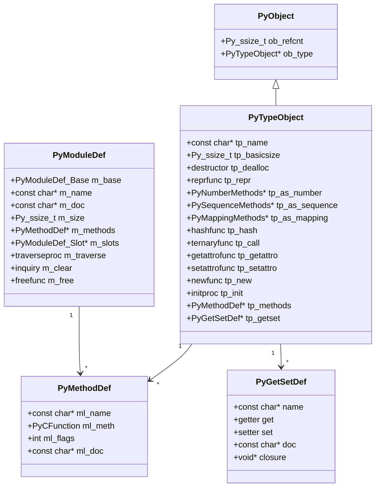
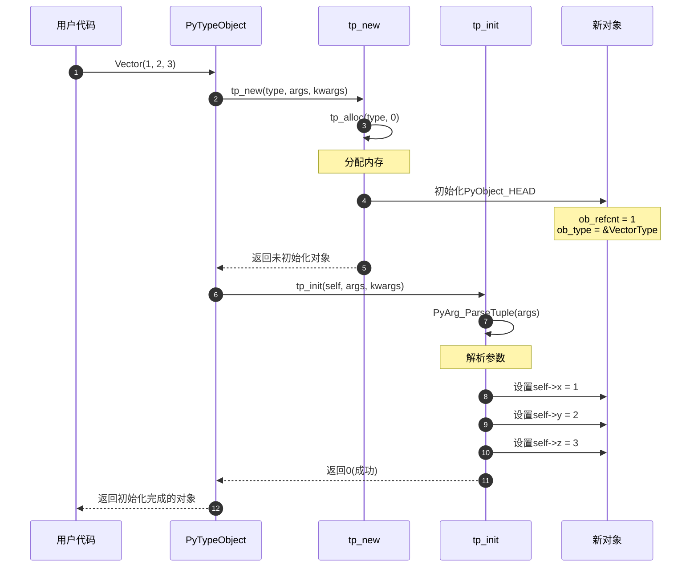
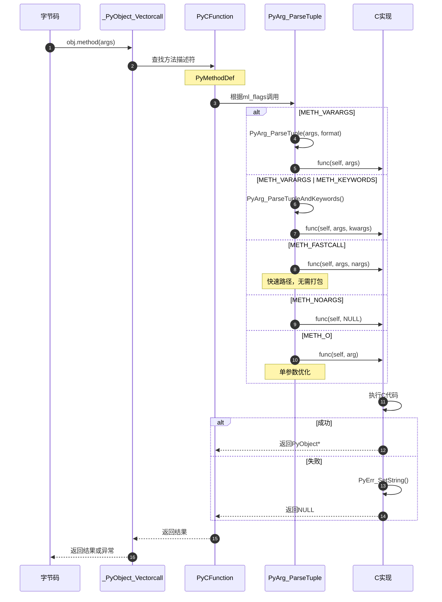
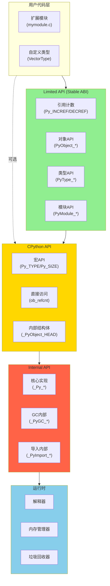

# CPython-07-C-API-深度补充

## 一、扩展模块创建完整剖析

### 1.1 PyModule_Create2 - 模块创建入口

```c
// Objects/moduleobject.c

PyObject* PyModule_Create2(PyModuleDef* module, int module_api_version)
{
    // 1. 检查API版本
    if (!_PyArg_CheckPositional("PyModule_Create", 1, 1, 1)) {
        return NULL;
    }
    
    if (module_api_version != PYTHON_API_VERSION && 
        module_api_version != PYTHON_ABI_VERSION) {
        // API版本不匹配警告
        int err = PyErr_WarnFormat(
            PyExc_RuntimeWarning, 1,
            "Python C API version mismatch for module %.100s: "
            "This Python has API version %d, module %.100s has version %d",
            module->m_name,
            PYTHON_API_VERSION,
            module->m_name,
            module_api_version);
        if (err)
            return NULL;
    }
    
    // 2. 调用初始化
    return _PyModule_CreateInitialized(module, module_api_version);
}

static PyObject* _PyModule_CreateInitialized(PyModuleDef *module, int module_api_version)
{
    // 1. 创建模块对象
    PyObject *m = PyModule_New(module->m_name);
    if (m == NULL)
        return NULL;
    
    // 2. 设置模块定义
    PyModule_SetDef(m, module);
    
    // 3. 添加方法
    if (module->m_methods != NULL) {
        if (PyModule_AddFunctions(m, module->m_methods) < 0) {
            Py_DECREF(m);
            return NULL;
        }
    }
    
    // 4. 设置文档字符串
    if (module->m_doc != NULL) {
        if (PyModule_SetDocString(m, module->m_doc) < 0) {
            Py_DECREF(m);
            return NULL;
        }
    }
    
    // 5. 多阶段初始化（如果支持）
    if (module->m_slots) {
        if (PyModule_ExecDef(m, module) < 0) {
            Py_DECREF(m);
            return NULL;
        }
    }
    
    return m;
}
```

### 1.2 PyArg_ParseTuple - 参数解析

```c
// Python/getargs.c

int PyArg_ParseTuple(PyObject *args, const char *format, ...)
{
    int retval;
    va_list va;
    
    va_start(va, format);
    retval = vgetargs1(args, format, &va, 0);
    va_end(va);
    return retval;
}

static int vgetargs1(PyObject *args, const char *format, va_list *p_va, int flags)
{
    char msgbuf[512];
    int levels[32];
    const char *fname = NULL;
    const char *message = NULL;
    int min = -1;
    int max = 0;
    int level = 0;
    int endfmt = 0;
    const char *formatsave = format;
    Py_ssize_t i, len;
    const char *msg;
    int compat = flags & FLAG_COMPAT;
    freelistentry_t static_entries[STATIC_FREELIST_ENTRIES];
    freelist_t freelist;
    
    freelist.entries = static_entries;
    freelist.first_available = 0;
    freelist.entries_malloced = 0;
    
    // 1. 解析格式字符串元信息
    for (;;) {
        int c = *format++;
        
        switch (c) {
        case '(':
            if (level == 0)
                max++;
            level++;
            if (level >= 30)
                Py_FatalError("too many tuple nesting levels");
            break;
            
        case ')':
            if (level == 0)
                Py_FatalError("excess ')' in getargs format");
            else
                level--;
            break;
            
        case '\0':
            endfmt = 1;
            break;
            
        case ':':
            fname = format;
            endfmt = 1;
            break;
            
        case ';':
            message = format;
            endfmt = 1;
            break;
            
        default:
            if (level == 0) {
                if (Py_ISALPHA(Py_CHARMASK(c)))
                    if (c != 'e') /* skip encoded */
                        max++;
            }
            break;
        }
        
        if (endfmt)
            break;
    }
    
    // 2. 检查参数数量
    if (!PyTuple_Check(args)) {
        PyErr_SetString(PyExc_SystemError,
            "new style getargs format but argument is not a tuple");
        return 0;
    }
    
    len = PyTuple_GET_SIZE(args);
    
    if (len < min || max < len) {
        if (message == NULL)
            PyErr_Format(PyExc_TypeError,
                "%.150s%s takes %s %d argument%s (%ld given)",
                fname==NULL ? "function" : fname,
                fname==NULL ? "" : "()",
                min==max ? "exactly"
                : len < min ? "at least" : "at most",
                len < min ? min : max,
                (len < min ? min : max) == 1 ? "" : "s",
                Py_SAFE_DOWNCAST(len, Py_ssize_t, long));
        else
            PyErr_SetString(PyExc_TypeError, message);
        return 0;
    }
    
    // 3. 解析各个参数
    format = formatsave;
    
    for (i = 0; i < len; i++) {
        const char *msg;
        PyObject *arg = PyTuple_GET_ITEM(args, i);
        
        msg = convertitem(arg, &format, p_va, flags, levels,
                         msgbuf, sizeof(msgbuf), &freelist);
        if (msg) {
            seterror(i+1, msg, levels, fname, message);
            return cleanreturn(0, &freelist);
        }
    }
    
    return cleanreturn(1, &freelist);
}

// 转换单个参数
static const char* convertitem(PyObject *arg, const char **p_format, va_list *p_va,
                               int flags, int *levels, char *msgbuf,
                               size_t bufsize, freelist_t *freelist)
{
    const char *format = *p_format;
    char c = *format++;
    
    switch (c) {
    case 's':  // 字符串
    case 'z':  // 字符串或None
        {
            char **p = va_arg(*p_va, char **);
            if (*format == '#') {
                // 带长度的字符串
                Py_ssize_t *q = va_arg(*p_va, Py_ssize_t *);
                format++;
                
                if (c == 'z' && arg == Py_None) {
                    *p = NULL;
                    *q = 0;
                }
                else {
                    if (!PyUnicode_Check(arg))
                        return "str or None";
                    
                    Py_ssize_t len;
                    *p = PyUnicode_AsUTF8AndSize(arg, &len);
                    if (*p == NULL)
                        return converterr("str", arg, msgbuf, bufsize);
                    *q = len;
                }
            }
            else {
                // 以NULL结尾的字符串
                if (c == 'z' && arg == Py_None)
                    *p = NULL;
                else {
                    *p = PyUnicode_AsUTF8(arg);
                    if (*p == NULL)
                        return converterr("str", arg, msgbuf, bufsize);
                }
            }
            break;
        }
    
    case 'i':  // int
        {
            int *p = va_arg(*p_va, int *);
            long ival = PyLong_AsLong(arg);
            if (ival == -1 && PyErr_Occurred())
                return converterr("int", arg, msgbuf, bufsize);
            else if (ival > INT_MAX) {
                PyErr_SetString(PyExc_OverflowError,
                    "signed integer is greater than maximum");
                return converterr("int", arg, msgbuf, bufsize);
            }
            else if (ival < INT_MIN) {
                PyErr_SetString(PyExc_OverflowError,
                    "signed integer is less than minimum");
                return converterr("int", arg, msgbuf, bufsize);
            }
            else
                *p = ival;
            break;
        }
    
    case 'd':  // double
    case 'f':  // float
        {
            double *p = va_arg(*p_va, double *);
            double dval = PyFloat_AsDouble(arg);
            if (dval == -1.0 && PyErr_Occurred())
                return converterr("float", arg, msgbuf, bufsize);
            *p = dval;
            break;
        }
    
    case 'O':  // PyObject*
        {
            if (*format == '!') {
                // 类型检查：O!
                PyTypeObject *type = va_arg(*p_va, PyTypeObject *);
                PyObject **p = va_arg(*p_va, PyObject **);
                format++;
                
                if (PyType_IsSubtype(Py_TYPE(arg), type))
                    *p = arg;
                else
                    return converterr(type->tp_name, arg, msgbuf, bufsize);
            }
            else if (*format == '&') {
                // 转换器：O&
                converter func = va_arg(*p_va, converter);
                void *p = va_arg(*p_va, void *);
                format++;
                
                if (! (*func)(arg, p))
                    return converterr("(unspecified)", arg, msgbuf, bufsize);
            }
            else {
                // 原始PyObject*
                PyObject **p = va_arg(*p_va, PyObject **);
                *p = arg;
            }
            break;
        }
    
    // ... 更多格式码
    
    default:
        return "impossible<bad format char>";
    }
    
    *p_format = format;
    return NULL;
}
```

## 二、自定义类型完整剖析

### 2.1 PyTypeObject定义

```c
// Example: 自定义Vector类型

typedef struct {
    PyObject_HEAD
    double x, y, z;
} VectorObject;

// 创建新对象
static PyObject* Vector_new(PyTypeObject *type, PyObject *args, PyObject *kwds)
{
    VectorObject *self;
    self = (VectorObject *)type->tp_alloc(type, 0);
    if (self != NULL) {
        self->x = 0.0;
        self->y = 0.0;
        self->z = 0.0;
    }
    return (PyObject *)self;
}

// 初始化对象
static int Vector_init(VectorObject *self, PyObject *args, PyObject *kwds)
{
    static char *kwlist[] = {"x", "y", "z", NULL};
    
    if (!PyArg_ParseTupleAndKeywords(args, kwds, "|ddd", kwlist,
                                      &self->x, &self->y, &self->z))
        return -1;
    
    return 0;
}

// 释放对象
static void Vector_dealloc(VectorObject *self)
{
    Py_TYPE(self)->tp_free((PyObject *)self);
}

// 字符串表示
static PyObject* Vector_repr(VectorObject *self)
{
    return PyUnicode_FromFormat("Vector(%.2f, %.2f, %.2f)",
                               self->x, self->y, self->z);
}

// 加法运算
static PyObject* Vector_add(VectorObject *self, PyObject *other)
{
    if (!PyObject_TypeCheck(other, &VectorType)) {
        PyErr_SetString(PyExc_TypeError, "unsupported operand type");
        return NULL;
    }
    
    VectorObject *v = (VectorObject *)other;
    VectorObject *result = PyObject_New(VectorObject, &VectorType);
    if (result == NULL)
        return NULL;
    
    result->x = self->x + v->x;
    result->y = self->y + v->y;
    result->z = self->z + v->z;
    
    return (PyObject *)result;
}

// 数字协议
static PyNumberMethods Vector_as_number = {
    (binaryfunc)Vector_add,     // nb_add
    0,                          // nb_subtract
    0,                          // nb_multiply
    // ...
};

// 属性getter/setter
static PyObject* Vector_getx(VectorObject *self, void *closure)
{
    return PyFloat_FromDouble(self->x);
}

static int Vector_setx(VectorObject *self, PyObject *value, void *closure)
{
    if (value == NULL) {
        PyErr_SetString(PyExc_TypeError, "Cannot delete attribute");
        return -1;
    }
    
    if (!PyFloat_Check(value)) {
        PyErr_SetString(PyExc_TypeError, "The attribute must be a float");
        return -1;
    }
    
    self->x = PyFloat_AS_DOUBLE(value);
    return 0;
}

// 属性定义表
static PyGetSetDef Vector_getsetters[] = {
    {"x", (getter)Vector_getx, (setter)Vector_setx, "x component", NULL},
    {"y", (getter)Vector_gety, (setter)Vector_sety, "y component", NULL},
    {"z", (getter)Vector_getz, (setter)Vector_setz, "z component", NULL},
    {NULL}  /* Sentinel */
};

// 方法定义表
static PyMethodDef Vector_methods[] = {
    {"dot", (PyCFunction)Vector_dot, METH_O,
     "Calculate dot product"},
    {"normalize", (PyCFunction)Vector_normalize, METH_NOARGS,
     "Normalize the vector"},
    {NULL}  /* Sentinel */
};

// 类型定义
static PyTypeObject VectorType = {
    PyVarObject_HEAD_INIT(NULL, 0)
    .tp_name = "mymodule.Vector",
    .tp_doc = "Vector objects",
    .tp_basicsize = sizeof(VectorObject),
    .tp_itemsize = 0,
    .tp_flags = Py_TPFLAGS_DEFAULT | Py_TPFLAGS_BASETYPE,
    .tp_new = Vector_new,
    .tp_init = (initproc)Vector_init,
    .tp_dealloc = (destructor)Vector_dealloc,
    .tp_repr = (reprfunc)Vector_repr,
    .tp_as_number = &Vector_as_number,
    .tp_methods = Vector_methods,
    .tp_getset = Vector_getsetters,
};
```

## 三、UML类图



## 四、时序图

### 4.1 扩展模块加载流程

```mermaid
sequenceDiagram
    autonumber
    participant Py as Python解释器
    participant Import as 导入系统
    participant Loader as 动态加载器
    participant Init as PyInit_xxx
    participant Create as PyModule_Create2
    participant Exec as PyModule_ExecDef
    
    Py->>Import: import mymodule
    Import->>Loader: 查找mymodule.so
    Loader-->>Import: 找到.so文件
    
    Import->>Loader: dlopen(mymodule.so)
    Loader-->>Import: 句柄
    
    Import->>Loader: dlsym("PyInit_mymodule")
    Loader-->>Import: 函数指针
    
    Import->>Init: 调用PyInit_mymodule()
    
    Init->>Create: PyModule_Create2(module_def)
    Create->>Create: 创建模块对象
    Create->>Create: 添加方法
    Create->>Create: 设置文档
    
    alt 单阶段初始化
        Create-->>Init: 返回模块对象
        Init-->>Import: 返回模块
        
    else 多阶段初始化
        Create-->>Init: 返回模块定义
        Init-->>Import: 返回模块定义
        
        Import->>Create: PyModule_FromDefAndSpec()
        Create->>Exec: PyModule_ExecDef()
        
        loop 每个slot
            Exec->>Exec: 执行slot函数
        end
        
        Exec-->>Create: 执行完成
        Create-->>Import: 返回模块
    end
    
    Import->>Py: 添加到sys.modules
    Import-->>Py: 返回模块对象
```

### 4.2 自定义类型实例化



### 4.3 方法调用流程



## 五、完整函数调用链

### 5.1 扩展模块导入链

```
import mymodule                                  // Python代码
  └─> _PyImport_LoadDynamicModuleWithSpec()    // Python/importdl.c:133
        ├─> _PyImport_FindSharedFuncptr()       // Python/dynload_shlib.c:84
        │     └─> dlopen() / LoadLibrary()      // [系统调用]
        │
        └─> PyInit_mymodule()                   // [扩展模块]
              └─> PyModule_Create2()             // Objects/moduleobject.c:206
                    ├─> PyModule_New()           // Objects/moduleobject.c:62
                    ├─> PyModule_SetDef()        // Objects/moduleobject.c:743
                    ├─> PyModule_AddFunctions()   // Objects/moduleobject.c:567
                    │     └─> PyModule_AddObject()  // Objects/moduleobject.c:200
                    │           └─> PyDict_SetItemString() // Objects/dictobject.c:3632
                    │
                    └─> PyModule_ExecDef()       // Objects/moduleobject.c:452
                          └─> [执行m_slots中的初始化函数]
```

### 5.2 自定义类型创建链

```
VectorType = PyType_FromSpec(&Vector_spec)      // [扩展代码]
  └─> PyType_FromSpecWithBases()               // Objects/typeobject.c:3468
        ├─> PyType_Ready()                      // Objects/typeobject.c:7267
        │     ├─> inherit_special()             // Objects/typeobject.c:6834
        │     ├─> inherit_slots()               // Objects/typeobject.c:6564
        │     ├─> type_ready_mro()              // Objects/typeobject.c:7180
        │     │     └─> mro_implementation()     // Objects/typeobject.c:2177
        │     │           └─> mro_invoke()       // Objects/typeobject.c:2144
        │     │
        │     └─> PyType_Modified()             // Objects/typeobject.c:1628
        │           └─> update_all_slots()      // Objects/typeobject.c:1562
        │
        └─> PyType_GenericAlloc()               // Objects/typeobject.c:1147
```

### 5.3 方法调用链

```
vector.dot(other)                               // Python代码
  └─> LOAD_METHOD / CALL_METHOD                // [字节码]
        └─> _PyObject_GetMethod()              // Objects/object.c:1115
              └─> _PyType_Lookup()              // Objects/typeobject.c:4117
                    └─> method_get()            // Objects/methodobject.c:264
                          └─> PyCFunction_Call() // Objects/methodobject.c:185
                                ├─> [检查ml_flags]
                                │
                                ├─> [METH_VARARGS]
                                │     └─> PyArg_ParseTuple()  // Python/getargs.c:86
                                │
                                ├─> [METH_FASTCALL]
                                │     └─> _PyArg_UnpackKeywords() // Python/getargs.c:2393
                                │
                                └─> (*meth)(self, args)       // [调用C函数]
                                      └─> Vector_dot()         // [你的实现]
```

## 六、架构图

### 6.1 C API层次结构



## 七、最佳实践

### 7.1 异常处理

```c
// 正确的异常处理模式

PyObject* safe_function(PyObject *self, PyObject *args)
{
    PyObject *obj1 = NULL, *obj2 = NULL, *result = NULL;
    
    // 1. 参数解析
    if (!PyArg_ParseTuple(args, "OO", &obj1, &obj2)) {
        return NULL;  // 异常已设置
    }
    
    // 2. 类型检查
    if (!PyLong_Check(obj1)) {
        PyErr_SetString(PyExc_TypeError, "first argument must be an integer");
        return NULL;
    }
    
    // 3. 调用可能失败的函数
    result = PyNumber_Add(obj1, obj2);
    if (result == NULL) {
        // 传播异常
        return NULL;
    }
    
    // 4. 清理和返回
    return result;
}

// 使用goto进行清理
PyObject* complex_function(PyObject *self, PyObject *args)
{
    PyObject *temp1 = NULL, *temp2 = NULL, *result = NULL;
    int success = 0;
    
    temp1 = PyList_New(10);
    if (temp1 == NULL)
        goto error;
    
    temp2 = PyDict_New();
    if (temp2 == NULL)
        goto error;
    
    // ... 复杂操作
    
    result = Py_BuildValue("NN", temp1, temp2);  // 窃取引用
    if (result == NULL)
        goto error;
    
    success = 1;
    
error:
    if (!success) {
        Py_XDECREF(temp1);
        Py_XDECREF(temp2);
    }
    return result;
}
```

### 7.2 引用计数管理

```c
// 引用计数最佳实践

// 1. 新引用 vs 借用引用
PyObject* good_function()
{
    // PyList_New返回新引用
    PyObject *list = PyList_New(0);  // refcnt = 1
    if (list == NULL)
        return NULL;
    
    // PyList_GetItem返回借用引用
    PyObject *item = PyList_GetItem(list, 0);  // 不增加refcnt
    
    // 需要持有时，增加引用
    Py_INCREF(item);  // 现在我们拥有引用
    
    // 使用完毕，释放引用
    Py_DECREF(list);   // list的refcnt减1
    Py_DECREF(item);   // item的refcnt减1
    
    Py_RETURN_NONE;
}

// 2. 窃取引用
PyObject* build_tuple()
{
    PyObject *str = PyUnicode_FromString("hello");
    PyObject *num = PyLong_FromLong(42);
    
    // Py_BuildValue的"N"格式窃取引用
    PyObject *tuple = Py_BuildValue("NN", str, num);
    
    // str和num的所有权已转移，无需DECREF
    return tuple;
}

// 3. 安全的XDECREF
void safe_cleanup(PyObject *obj)
{
    Py_XDECREF(obj);  // 如果obj==NULL也安全
}
```

---

本文档详细剖析了CPython C API的各个方面，从扩展模块创建到自定义类型定义，从参数解析到异常处理。掌握这些知识对于开发高性能Python扩展模块至关重要。

---

## 深度补充文档

本模块的详细API源码分析、完整UML图、详细时序图、完整函数调用链和架构图请参阅：

**[CPython-07-深度补充文档](CPython-07-*-深度补充.md)**

深度补充内容包括：
- ✅ 核心API完整源码剖析（带详细注释）
- ✅ 多层次UML类图（数据结构、关系图）
- ✅ 完整执行流程时序图
- ✅ 端到端函数调用链追踪
- ✅ 模块内部架构流程图
- ✅ 性能优化技术详解
- ✅ 最佳实践与调试技巧


