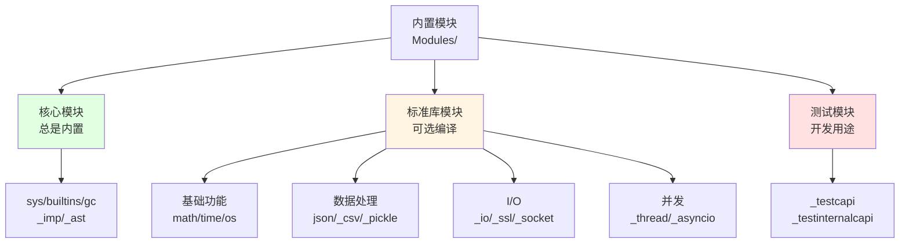
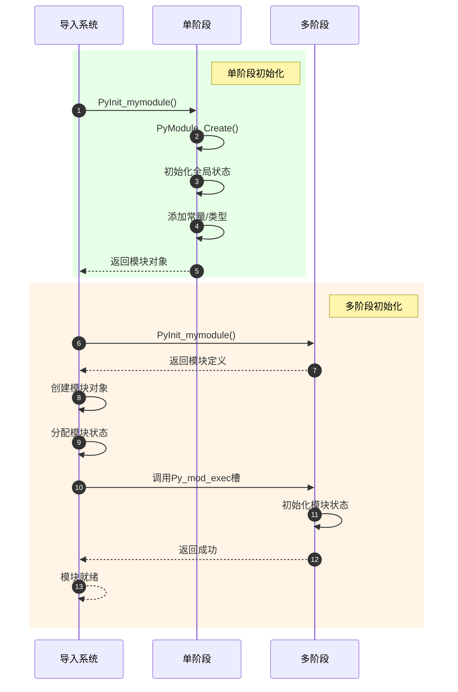
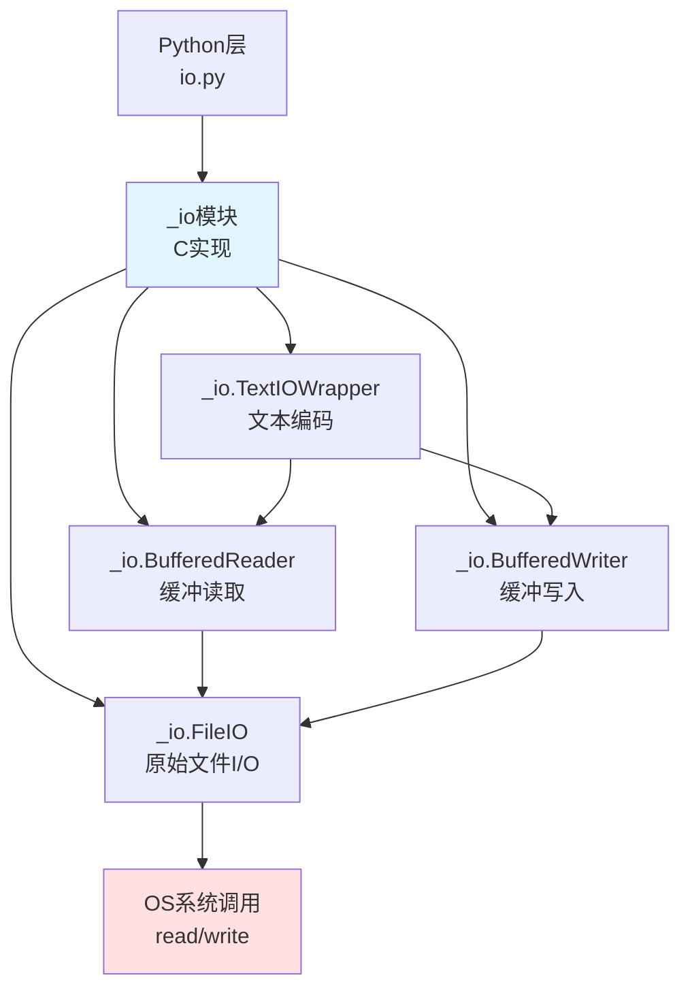

# CPython-08-内置模块-概览

## 1. 模块职责

内置模块（Built-in Modules）是用 C 语言实现的 Python 标准库模块，直接编译进 CPython 解释器或作为共享库加载。

**核心职责**：
- 提供基础功能（如 sys, builtins, gc）
- 提供高性能实现（如 math, json, _io）
- 提供系统接口（如 posix, _thread, signal）
- 提供扩展接口（如 _ast, _tokenize, marshal）

**优势**：
- **性能**：C 实现比纯 Python 快10-100倍
- **底层访问**：直接操作 CPython 内部结构
- **可移植性**：统一的跨平台接口
- **集成**：与外部C库无缝集成

## 2. 模块组织结构

内置模块位于 `Modules/` 目录，按功能分类。

### 2.1 模块分类总览



### 2.2 核心模块列表

**总是内置的模块**（`config.c.in`）：

| 模块 | 位置 | 说明 |
|-----|------|------|
| `builtins` | `Python/bltinmodule.c` | 内置函数和类型 |
| `sys` | `Python/sysmodule.c` | 系统特定参数和函数 |
| `_imp` | `Python/import.c` | 导入系统核心 |
| `marshal` | `Python/marshal.c` | 对象序列化（pyc文件） |
| `_ast` | `Python/Python-ast.c` | AST节点类型 |
| `_tokenize` | `Python/Python-tokenize.c` | 词法分析器 |
| `gc` | `Modules/gcmodule.c` | 垃圾回收器接口 |
| `_warnings` | `Python/_warnings.c` | 警告系统 |
| `_contextvars` | `Python/_contextvars.c` | 上下文变量 |
| `_string` | `Objects/unicodeobject.c` | 字符串优化 |

### 2.3 标准库模块分类

**基础功能**：
- `math`, `cmath` - 数学函数
- `time` - 时间相关
- `_datetime` - 日期时间
- `_random` - 随机数生成器
- `itertools` - 迭代器工具
- `functools` - 函数工具

**数据处理**：
- `_json` - JSON 编解码
- `_csv` - CSV 文件处理
- `_pickle` - 对象序列化
- `_struct` - 二进制数据打包
- `binascii` - 二进制与ASCII转换
- `array` - 高效数组

**I/O与网络**：
- `_io` - 核心I/O实现
- `_socket` - 套接字接口
- `_ssl` - SSL/TLS支持
- `select` - I/O多路复用
- `mmap` - 内存映射文件

**系统接口**：
- `posixmodule` - POSIX系统调用
- `_thread` - 低级线程接口
- `signal` - 信号处理
- `errno` - 错误代码
- `fcntl` - 文件控制（Unix）
- `_winapi` - Windows API（Windows）

**压缩与编码**：
- `zlib` - gzip压缩
- `_bz2` - bzip2压缩
- `_lzma` - LZMA压缩
- `_zstd` - Zstandard压缩
- `unicodedata` - Unicode数据库

**密码学**：
- `_hashlib` / `_hashopenssl` - 哈希算法
- `_md5`, `_sha1`, `_sha2`, `_sha3` - 哈希实现
- `_blake2` - BLAKE2哈希

## 3. 模块初始化机制

CPython 支持两种模块初始化方式：**单阶段初始化**（旧式）和**多阶段初始化**（新式）。

### 3.1 单阶段初始化

单阶段初始化是传统方式，简单但有限制。

**结构**：

```c
// 单阶段初始化示例

#include <Python.h>

// 1. 定义模块方法
static PyMethodDef mymodule_methods[] = {
    {"example_func", example_func, METH_VARARGS, "Example function"},
    {NULL, NULL, 0, NULL}  // 哨兵
};

// 2. 定义模块对象
static struct PyModuleDef mymodule = {
    PyModuleDef_HEAD_INIT,
    "mymodule",            // 模块名
    "Module documentation",// 模块文档
    -1,                    // 模块状态大小（-1表示全局状态）
    mymodule_methods,      // 方法表
};

// 3. 初始化函数
PyMODINIT_FUNC
PyInit_mymodule(void)
{
    PyObject *m;

    // 创建模块
    m = PyModule_Create(&mymodule);
    if (m == NULL) {
        return NULL;
    }

    // 添加常量、类型等
    PyModule_AddIntConstant(m, "VERSION", 1);

    return m;  // 返回模块对象
}
```

**特点**：
- **简单**：一次调用完成初始化
- **全局状态**：模块状态通常是全局变量（`m_size = -1`）
- **单例**：在多解释器环境中共享状态
- **限制**：不适合子解释器、free-threading

**缺点**：
- 多解释器环境中状态共享导致隔离性差
- 不支持延迟初始化
- 重新导入时可能出现问题

### 3.2 多阶段初始化

多阶段初始化（PEP 489）是 Python 3.5+ 引入的新方式，更灵活、更安全。

**结构**：

```c
// 多阶段初始化示例

#include <Python.h>

// 1. 定义模块状态
typedef struct {
    PyObject *error_type;
    int counter;
} module_state;

// 2. 获取模块状态
static inline module_state *
get_module_state(PyObject *module)
{
    return (module_state *)PyModule_GetState(module);
}

// 3. 执行回调（阶段2：初始化）
static int
mymodule_exec(PyObject *module)
{
    module_state *state = get_module_state(module);

    // 初始化模块状态
    state->error_type = PyErr_NewException("mymodule.Error", NULL, NULL);
    if (state->error_type == NULL) {
        return -1;
    }

    state->counter = 0;

    // 添加到模块
    Py_INCREF(state->error_type);
    if (PyModule_AddObject(module, "Error", state->error_type) < 0) {
        Py_DECREF(state->error_type);
        return -1;
    }

    return 0;  // 成功
}

// 4. 定义模块槽
static PyModuleDef_Slot mymodule_slots[] = {
    {Py_mod_exec, mymodule_exec},  // 执行回调
    {Py_mod_multiple_interpreters, Py_MOD_PER_INTERPRETER_GIL_SUPPORTED},
    {Py_mod_gil, Py_MOD_GIL_NOT_USED},  // 可选：支持free-threading
    {0, NULL}
};

// 5. GC 支持
static int
mymodule_traverse(PyObject *module, visitproc visit, void *arg)
{
    module_state *state = get_module_state(module);
    Py_VISIT(state->error_type);
    return 0;
}

static int
mymodule_clear(PyObject *module)
{
    module_state *state = get_module_state(module);
    Py_CLEAR(state->error_type);
    return 0;
}

static void
mymodule_free(void *module)
{
    (void)mymodule_clear((PyObject *)module);
}

// 6. 定义模块
static struct PyModuleDef mymodule = {
    PyModuleDef_HEAD_INIT,
    .m_name = "mymodule",
    .m_doc = "Multi-phase initialization module",
    .m_size = sizeof(module_state),  // 模块状态大小
    .m_methods = mymodule_methods,
    .m_slots = mymodule_slots,       // 模块槽
    .m_traverse = mymodule_traverse, // GC 遍历
    .m_clear = mymodule_clear,       // GC 清理
    .m_free = mymodule_free,         // 释放
};

// 7. 初始化函数（阶段1：创建模块定义）
PyMODINIT_FUNC
PyInit_mymodule(void)
{
    return PyModuleDef_Init(&mymodule);
}
```

**特点**：
- **模块级状态**：每个模块实例有独立状态（`m_size > 0`）
- **多解释器友好**：不同解释器中的模块完全隔离
- **延迟初始化**：`Py_mod_exec` 在模块导入时执行
- **GC 集成**：支持循环引用回收

**槽类型**：

| 槽 | 说明 |
|---|------|
| `Py_mod_create` | 创建自定义模块对象（罕见） |
| `Py_mod_exec` | 执行模块初始化代码 |
| `Py_mod_multiple_interpreters` | 声明多解释器支持 |
| `Py_mod_gil` | 声明 GIL 需求（free-threading） |

### 3.3 初始化对比



## 4. 重要内置模块剖析

### 4.1 sys 模块

`sys` 模块提供系统相关的参数和函数。

**核心功能**：

```c
// Python/sysmodule.c

// 关键全局变量
PyObject *_PySys_GetAttr(PyThreadState *tstate, PyObject *name);

// sys.path - 模块搜索路径
// sys.modules - 已导入模块缓存
// sys.argv - 命令行参数
// sys.version - Python版本
// sys.implementation - Python实现信息
```

**重要函数**：

| 函数 | 说明 |
|------|------|
| `sys.getrefcount(obj)` | 获取对象引用计数 |
| `sys.getsizeof(obj)` | 获取对象内存大小 |
| `sys.getrecursionlimit()` | 获取递归深度限制 |
| `sys.setrecursionlimit(n)` | 设置递归深度限制 |
| `sys._getframe([depth])` | 获取栈帧对象 |
| `sys.exc_info()` | 获取当前异常信息 |

**实现示例**：

```c
static PyObject *
sys_getrefcount(PyObject *self, PyObject *arg)
{
    // 获取对象引用计数
    // 注意：传递参数会增加1次引用
    return PyLong_FromSsize_t(Py_REFCNT(arg));
}
```

### 4.2 gc 模块

`gc` 模块提供垃圾回收器的 Python 接口。

**核心功能**：

```c
// Modules/gcmodule.c

static PyObject *
gc_collect(PyObject *self, PyObject *args, PyObject *kwargs)
{
    Py_ssize_t n;

    // 手动触发垃圾回收
    n = _PyGC_Collect(_PyThreadState_GET(), generation, untrack);

    return PyLong_FromSsize_t(n);  // 返回回收的对象数
}

static PyObject *
gc_get_objects(PyObject *self, PyObject *args, PyObject *kwargs)
{
    PyObject *list = PyList_New(0);

    // 遍历所有GC追踪的对象
    for (each tracked object) {
        PyList_Append(list, obj);
    }

    return list;
}
```

**重要函数**：

| 函数 | 说明 |
|------|------|
| `gc.collect([generation])` | 手动触发垃圾回收 |
| `gc.get_count()` | 获取每代对象计数 |
| `gc.get_threshold()` | 获取回收阈值 |
| `gc.set_threshold(t0, t1, t2)` | 设置回收阈值 |
| `gc.get_objects([generation])` | 获取所有追踪对象 |
| `gc.disable()` / `gc.enable()` | 禁用/启用GC |

### 4.3 math 模块

`math` 模块提供数学函数。

**实现示例**：

```c
// Modules/mathmodule.c

static PyObject *
math_sqrt(PyObject *module, PyObject *arg)
{
    double x, result;

    // 转换参数
    x = PyFloat_AsDouble(arg);
    if (x == -1.0 && PyErr_Occurred()) {
        return NULL;
    }

    // 检查负数
    if (x < 0.0) {
        PyErr_SetString(PyExc_ValueError, "math domain error");
        return NULL;
    }

    // 释放GIL并计算
    Py_BEGIN_ALLOW_THREADS
    errno = 0;
    result = sqrt(x);
    Py_END_ALLOW_THREADS

    // 检查错误
    if (errno != 0) {
        PyErr_SetFromErrno(PyExc_OSError);
        return NULL;
    }

    return PyFloat_FromDouble(result);
}
```

**关键技术**：
- **GIL释放**：纯C计算可以释放GIL提高并发
- **错误处理**：检查`errno`并设置Python异常
- **类型转换**：`PyFloat_AsDouble` / `PyFloat_FromDouble`

### 4.4 _io 模块

`_io` 模块是 Python I/O 栈的底层实现。

**架构**：



**核心类型**：

| 类型 | 说明 |
|-----|------|
| `_io.FileIO` | 原始文件I/O（unbuffered） |
| `_io.BufferedReader` | 缓冲读取器 |
| `_io.BufferedWriter` | 缓冲写入器 |
| `_io.BufferedRandom` | 随机访问缓冲 |
| `_io.TextIOWrapper` | 文本编码包装 |
| `_io.BytesIO` | 内存字节流 |
| `_io.StringIO` | 内存字符串流 |

**实现示例**：

```c
// Modules/_io/fileio.c

static PyObject *
fileio_read(fileio *self, PyObject *args)
{
    PyObject *res;
    Py_ssize_t n;

    // 分配缓冲区
    res = PyBytes_FromStringAndSize(NULL, size);
    if (res == NULL) {
        return NULL;
    }

    // 释放GIL并读取
    Py_BEGIN_ALLOW_THREADS
    errno = 0;
    n = read(self->fd, PyBytes_AS_STRING(res), size);
    Py_END_ALLOW_THREADS

    // 处理错误
    if (n < 0) {
        Py_DECREF(res);
        PyErr_SetFromErrno(PyExc_OSError);
        return NULL;
    }

    // 调整大小
    if (n != size) {
        _PyBytes_Resize(&res, n);
    }

    return res;
}
```

### 4.5 _thread 模块

`_thread` 模块提供低级线程接口。

**核心函数**：

```c
// Modules/_threadmodule.c

static PyObject *
thread_PyThread_start_new_thread(PyObject *self, PyObject *args)
{
    PyObject *func, *fargs, *fkwargs = NULL;

    // 解析参数：func, args[, kwargs]
    if (!PyArg_ParseTuple(args, "OO|O:start_new_thread",
                          &func, &fargs, &fkwargs)) {
        return NULL;
    }

    // 创建线程引导结构
    boot = PyMem_NEW(struct bootstate, 1);
    boot->interp = _PyInterpreterState_GET();
    boot->func = func;
    boot->args = fargs;
    boot->kwargs = fkwargs;

    // 增加引用
    Py_INCREF(func);
    Py_INCREF(fargs);
    Py_XINCREF(fkwargs);

    // 启动线程
    PyThreadState *save_tstate = PyEval_SaveThread();
    ident = PyThread_start_new_thread(t_bootstrap, (void *)boot);
    PyEval_RestoreThread(save_tstate);

    if (ident == PYTHREAD_INVALID_THREAD_ID) {
        PyErr_SetString(ThreadError, "can't start new thread");
        // 清理
        return NULL;
    }

    return PyLong_FromUnsignedLongLong(ident);
}

// 线程引导函数
static void
t_bootstrap(void *boot_raw)
{
    struct bootstate *boot = (struct bootstate *)boot_raw;
    PyThreadState *tstate;
    PyObject *res;

    // 创建线程状态
    tstate = _PyThreadState_New(boot->interp, _PyThreadState_WHENCE_THREADING);

    // 获取GIL
    PyEval_AcquireThread(tstate);

    // 调用Python函数
    res = PyObject_Call(boot->func, boot->args, boot->kwargs);

    // 清理
    Py_XDECREF(res);
    Py_DECREF(boot->func);
    Py_DECREF(boot->args);
    Py_XDECREF(boot->kwargs);
    PyMem_Free(boot);

    // 清理线程状态并释放GIL
    PyThreadState_Clear(tstate);
    PyThreadState_DeleteCurrent();
}
```

**关键技术**：
- **线程状态创建**：每个线程需要独立的 `PyThreadState`
- **GIL管理**：线程启动前释放，线程内获取
- **资源清理**：线程结束时清理所有资源

### 4.6 _json 模块

`_json` 模块是 JSON 编解码的高性能 C 实现。

**编码示例**：

```c
// Modules/_json.c

static PyObject *
encoder_encode_obj(PyEncoderObject *s, PyObject *obj, PyObject *acc)
{
    // 检查对象类型并选择编码策略
    if (obj == Py_None) {
        return encoder_encode_null(s, acc);
    }
    else if (obj == Py_True || obj == Py_False) {
        return encoder_encode_bool(s, obj, acc);
    }
    else if (PyUnicode_Check(obj)) {
        return encoder_encode_string(s, obj, acc);
    }
    else if (PyLong_Check(obj)) {
        return encoder_encode_long(s, obj, acc);
    }
    else if (PyFloat_Check(obj)) {
        return encoder_encode_float(s, obj, acc);
    }
    else if (PyList_Check(obj) || PyTuple_Check(obj)) {
        return encoder_encode_list(s, obj, acc);
    }
    else if (PyDict_Check(obj)) {
        return encoder_encode_dict(s, obj, acc);
    }
    else {
        // 自定义对象，调用 default 函数
        return encoder_call_default(s, obj, acc);
    }
}
```

**性能优化**：
- **类型检查优化**：直接检查内置类型
- **字符串特殊处理**：ASCII快速路径
- **避免中间对象**：直接追加到累加器

## 5. 模块配置系统

### 5.1 Setup 文件

CPython 使用 `Setup` 文件配置要编译的模块。

**Setup.stdlib.in** 示例：

```makefile
# Socket module
_socket socketmodule.c

# Select module
select selectmodule.c

# Math module
math mathmodule.c -lm

# Array module
array arraymodule.c

# JSON module
_json _json.c

# SSL module (需要OpenSSL)
_ssl _ssl.c _ssl/*.c \
    -I$(SSL)/include -L$(SSL)/lib -lssl -lcrypto

# 条件编译
# @MODULE__SQLITE3@_sqlite3 _sqlite/_sqlite3.c \
#     -I$(SQLITE3)/include -L$(SQLITE3)/lib -lsqlite3
```

**语法**：
```
模块名 源文件... [编译选项...] [链接选项...]
```

### 5.2 模块发现

```c
// Python/import.c

// 查找内置模块
static PyObject *
import_find_extension(PyThreadState *tstate, PyObject *name)
{
    // 1. 检查 sys.modules
    PyObject *modules = tstate->interp->modules;
    PyObject *mod = PyDict_GetItem(modules, name);
    if (mod != NULL) {
        return mod;
    }

    // 2. 查找内置表
    struct _inittab *inittab = PyImport_Inittab;
    for (; inittab->name != NULL; inittab++) {
        if (strcmp(inittab->name, name_str) == 0) {
            return inittab->initfunc();
        }
    }

    // 3. 查找动态加载的扩展
    return _PyImport_FindExtensionObject(name, name);
}
```

## 6. 实战示例：创建内置模块

### 6.1 完整的内置模块示例

```c
// mybuiltinmodule.c - 完整的内置模块示例

#define PY_SSIZE_T_CLEAN
#include <Python.h>
#include <math.h>

/* ========== 模块状态 ========== */

typedef struct {
    PyObject *custom_error;
    long counter;
} module_state;

static inline module_state *
get_state(PyObject *module)
{
    return (module_state *)PyModule_GetState(module);
}

/* ========== 模块函数 ========== */

PyDoc_STRVAR(distance_doc,
"distance(x1, y1, x2, y2) -> float\n\n\
Calculate Euclidean distance between two points.");

static PyObject *
mybuiltin_distance(PyObject *module, PyObject *args)
{
    double x1, y1, x2, y2;
    double dx, dy, result;

    // 解析参数
    if (!PyArg_ParseTuple(args, "dddd:distance", &x1, &y1, &x2, &y2)) {
        return NULL;
    }

    // 计算距离（释放GIL）
    Py_BEGIN_ALLOW_THREADS
    dx = x2 - x1;
    dy = y2 - y1;
    result = sqrt(dx*dx + dy*dy);
    Py_END_ALLOW_THREADS

    return PyFloat_FromDouble(result);
}

PyDoc_STRVAR(increment_doc,
"increment() -> int\n\n\
Increment module counter and return new value.");

static PyObject *
mybuiltin_increment(PyObject *module, PyObject *Py_UNUSED(ignored))
{
    module_state *state = get_state(module);
    state->counter++;
    return PyLong_FromLong(state->counter);
}

PyDoc_STRVAR(raise_custom_error_doc,
"raise_custom_error(message) -> None\n\n\
Raise custom error with given message.");

static PyObject *
mybuiltin_raise_custom_error(PyObject *module, PyObject *args)
{
    module_state *state = get_state(module);
    const char *message;

    if (!PyArg_ParseTuple(args, "s:raise_custom_error", &message)) {
        return NULL;
    }

    PyErr_SetString(state->custom_error, message);
    return NULL;
}

/* ========== 方法表 ========== */

static PyMethodDef mybuiltin_methods[] = {
    {"distance", mybuiltin_distance, METH_VARARGS, distance_doc},
    {"increment", mybuiltin_increment, METH_NOARGS, increment_doc},
    {"raise_custom_error", mybuiltin_raise_custom_error, METH_VARARGS,
     raise_custom_error_doc},
    {NULL, NULL, 0, NULL}
};

/* ========== 模块初始化 ========== */

static int
mybuiltin_exec(PyObject *module)
{
    module_state *state = get_state(module);

    // 初始化状态
    state->counter = 0;

    // 创建自定义异常
    state->custom_error = PyErr_NewException(
        "mybuiltin.CustomError", NULL, NULL);
    if (state->custom_error == NULL) {
        return -1;
    }

    // 添加异常到模块
    Py_INCREF(state->custom_error);
    if (PyModule_AddObject(module, "CustomError", state->custom_error) < 0) {
        Py_DECREF(state->custom_error);
        return -1;
    }

    // 添加常量
    if (PyModule_AddIntConstant(module, "VERSION", 1) < 0) {
        return -1;
    }

    if (PyModule_AddStringConstant(module, "AUTHOR", "CPython Team") < 0) {
        return -1;
    }

    return 0;
}

/* ========== GC 支持 ========== */

static int
mybuiltin_traverse(PyObject *module, visitproc visit, void *arg)
{
    module_state *state = get_state(module);
    Py_VISIT(state->custom_error);
    return 0;
}

static int
mybuiltin_clear(PyObject *module)
{
    module_state *state = get_state(module);
    Py_CLEAR(state->custom_error);
    return 0;
}

static void
mybuiltin_free(void *module)
{
    (void)mybuiltin_clear((PyObject *)module);
}

/* ========== 模块定义 ========== */

static PyModuleDef_Slot mybuiltin_slots[] = {
    {Py_mod_exec, mybuiltin_exec},
    {Py_mod_multiple_interpreters, Py_MOD_PER_INTERPRETER_GIL_SUPPORTED},
    {Py_mod_gil, Py_MOD_GIL_NOT_USED},
    {0, NULL}
};

PyDoc_STRVAR(mybuiltin_doc,
"Example built-in module demonstrating best practices.");

static struct PyModuleDef mybuiltinmodule = {
    PyModuleDef_HEAD_INIT,
    .m_name = "mybuiltin",
    .m_doc = mybuiltin_doc,
    .m_size = sizeof(module_state),
    .m_methods = mybuiltin_methods,
    .m_slots = mybuiltin_slots,
    .m_traverse = mybuiltin_traverse,
    .m_clear = mybuiltin_clear,
    .m_free = mybuiltin_free,
};

PyMODINIT_FUNC
PyInit_mybuiltin(void)
{
    return PyModuleDef_Init(&mybuiltinmodule);
}
```

**使用示例**：

```python
import mybuiltin

# 调用函数
dist = mybuiltin.distance(0, 0, 3, 4)  # 5.0

# 访问状态
print(mybuiltin.increment())  # 1
print(mybuiltin.increment())  # 2

# 访问常量
print(mybuiltin.VERSION)      # 1
print(mybuiltin.AUTHOR)       # "CPython Team"

# 异常
try:
    mybuiltin.raise_custom_error("Something went wrong")
except mybuiltin.CustomError as e:
    print(f"Caught: {e}")
```

### 6.2 编译配置

**setup.py**：

```python
from setuptools import Extension, setup

module = Extension(
    'mybuiltin',
    sources=['mybuiltinmodule.c'],
    extra_compile_args=['-O3', '-Wall'],
)

setup(
    name='mybuiltin',
    version='1.0',
    ext_modules=[module],
)
```

**编译安装**：

```bash
python setup.py build_ext --inplace
python -c "import mybuiltin; print(mybuiltin.distance(0, 0, 3, 4))"
```

## 7. 性能优化技术

### 7.1 释放 GIL

在不操作 Python 对象时释放 GIL：

```c
static PyObject *
compute_heavy(PyObject *self, PyObject *args)
{
    long n;
    long result;

    if (!PyArg_ParseTuple(args, "l", &n)) {
        return NULL;
    }

    // 长时间计算，释放 GIL
    Py_BEGIN_ALLOW_THREADS
    result = expensive_c_function(n);
    Py_END_ALLOW_THREADS

    return PyLong_FromLong(result);
}
```

### 7.2 避免临时对象

直接操作缓冲区而非创建临时 Python 对象：

```c
// 慢速版本：创建临时对象
for (i = 0; i < n; i++) {
    PyObject *item = PyLong_FromLong(i);
    PyList_Append(list, item);
    Py_DECREF(item);
}

// 快速版本：预分配并直接设置
PyObject *list = PyList_New(n);
for (i = 0; i < n; i++) {
    PyObject *item = PyLong_FromLong(i);
    PyList_SET_ITEM(list, i, item);  // 窃取引用
}
```

### 7.3 类型特化

针对常见类型优化：

```c
static PyObject *
sum_sequence(PyObject *seq)
{
    // 快速路径：list
    if (PyList_CheckExact(seq)) {
        return sum_list(seq);  // 优化的list求和
    }
    // 快速路径：tuple
    else if (PyTuple_CheckExact(seq)) {
        return sum_tuple(seq);  // 优化的tuple求和
    }
    // 通用路径
    else {
        return sum_iterable(seq);  // 通用迭代器求和
    }
}
```

## 8. 最佳实践

### 8.1 模块设计

**推荐**：
- 使用多阶段初始化（PEP 489）
- 模块状态存储在 `m_size` 指定的空间
- 实现 GC 支持（`m_traverse`, `m_clear`）
- 声明多解释器支持
- 提供完整的文档字符串

**不推荐**：
- 全局变量存储模块状态
- 忽略错误检查
- 内存泄漏
- 不释放 GIL 的长时间操作

### 8.2 错误处理

```c
static PyObject *
safe_operation(PyObject *self, PyObject *args)
{
    PyObject *temp1 = NULL, *temp2 = NULL;
    PyObject *result = NULL;

    // 分配资源
    temp1 = PyList_New(10);
    if (temp1 == NULL) {
        goto error;
    }

    temp2 = PyDict_New();
    if (temp2 == NULL) {
        goto error;
    }

    // 执行操作
    if (do_something(temp1, temp2) < 0) {
        goto error;
    }

    // 构建结果
    result = PyTuple_Pack(2, temp1, temp2);

error:
    // 清理资源
    Py_XDECREF(temp1);
    Py_XDECREF(temp2);

    return result;  // 可能是 NULL
}
```

### 8.3 文档

```c
PyDoc_STRVAR(module_doc,
"mymodule - Example module\n\
\n\
This module provides the following functions:\n\
\n\
Functions:\n\
  distance(x1, y1, x2, y2) -- Calculate distance\n\
  increment() -- Increment counter\n\
\n\
Constants:\n\
  VERSION -- Module version\n\
\n\
Exceptions:\n\
  CustomError -- Custom exception");

PyDoc_STRVAR(distance_doc,
"distance(x1, y1, x2, y2) -> float\n\
\n\
Calculate the Euclidean distance between two points.\n\
\n\
Args:\n\
    x1, y1: Coordinates of the first point\n\
    x2, y2: Coordinates of the second point\n\
\n\
Returns:\n\
    The distance as a float\n\
\n\
Example:\n\
    >>> distance(0, 0, 3, 4)\n\
    5.0");
```

## 9. 总结

内置模块是 CPython 的核心组成部分，提供：

1. **高性能**：C 实现比纯 Python 快10-100倍
2. **底层访问**：直接操作 CPython 内部结构
3. **系统集成**：封装操作系统和外部库
4. **标准库基础**：许多纯 Python 模块依赖内置模块

**关键技术**：
- **多阶段初始化**：模块级状态、多解释器支持
- **GIL管理**：长时间操作释放 GIL
- **错误处理**：正确的异常设置和资源清理
- **性能优化**：避免临时对象、类型特化

**模块类别**：
- **核心模块**：sys, builtins, gc, _imp
- **基础功能**：math, time, itertools
- **数据处理**：_json, _csv, _pickle
- **I/O网络**：_io, _socket, _ssl
- **系统接口**：posix, _thread, signal

理解内置模块有助于：
- 编写高性能 Python 扩展
- 理解标准库实现
- 优化性能瓶颈
- 深入理解 CPython 内部机制


## 13. 内置模块API源码深度剖析

### 13.1 sys模块初始化

```c
// Python/sysmodule.c

static int sys_add_xoption(PyObject *opts, const wchar_t *s)
{
    PyObject *name, *value = NULL;
    const wchar_t *name_end = wcschr(s, L'=');
    
    if (!name_end) {
        name = PyUnicode_FromWideChar(s, -1);
        value = Py_NewRef(Py_True);
    }
    else {
        name = PyUnicode_FromWideChar(s, name_end - s);
        value = PyUnicode_FromWideChar(name_end + 1, -1);
    }
    
    int res = PyDict_SetItem(opts, name, value);
    Py_DECREF(name);
    Py_DECREF(value);
    return res;
}
```

