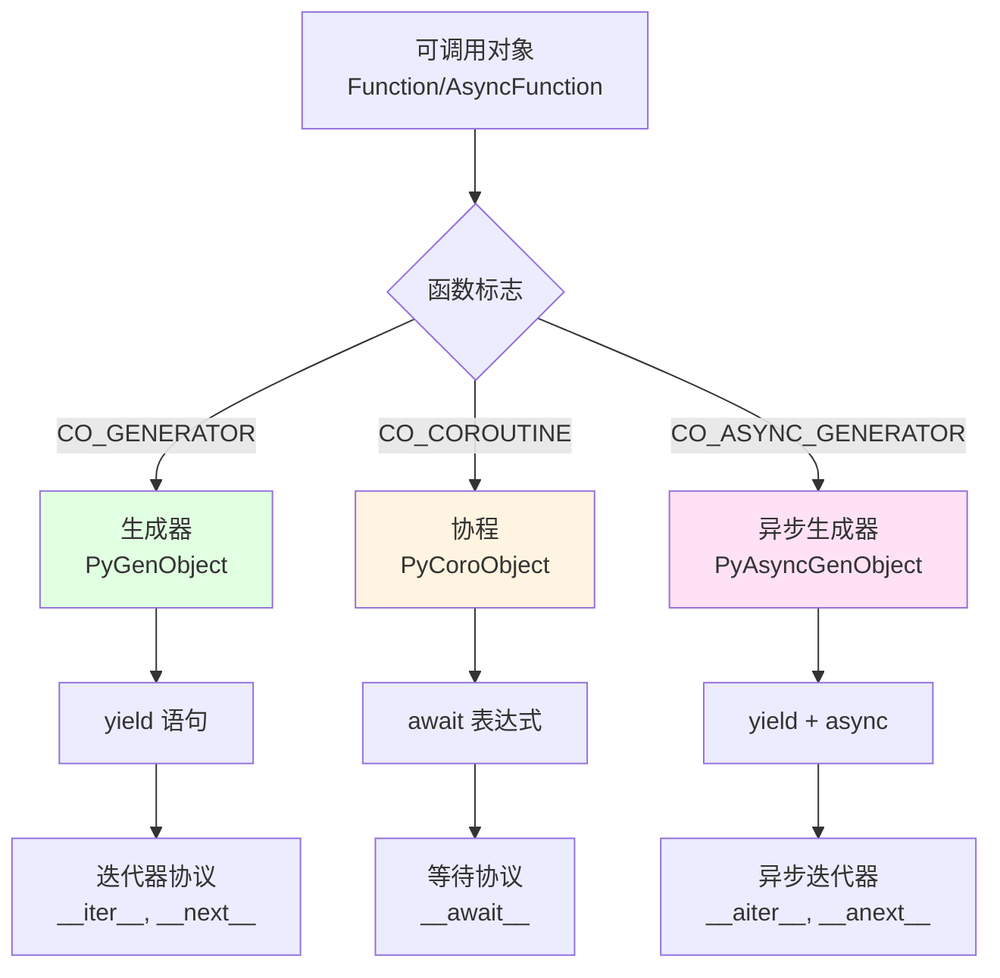
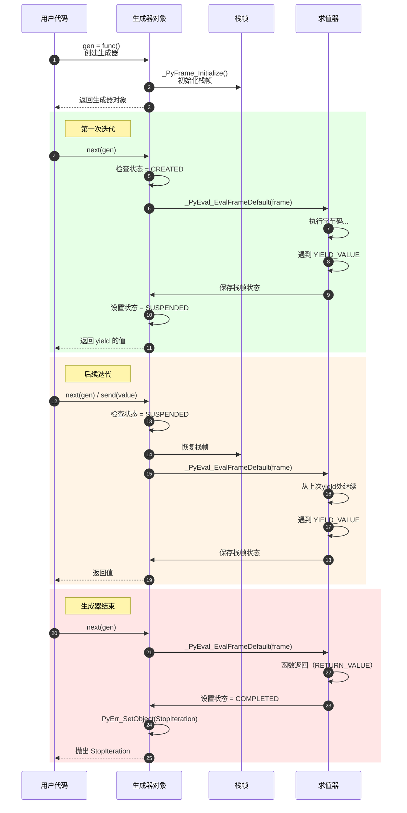
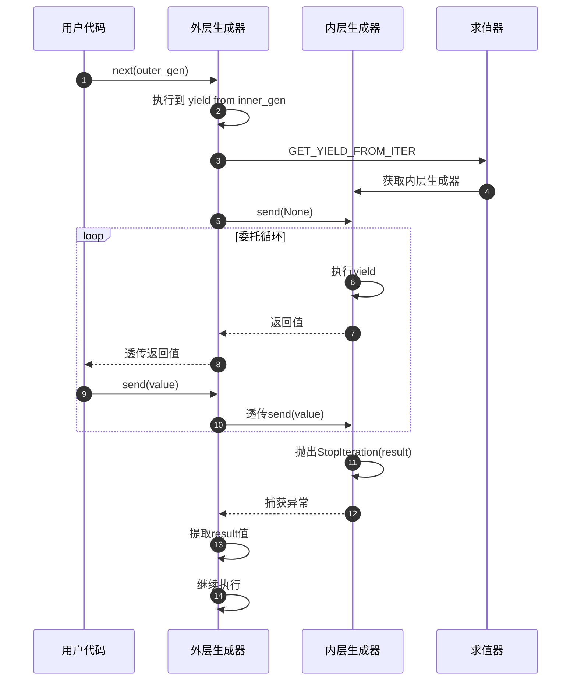
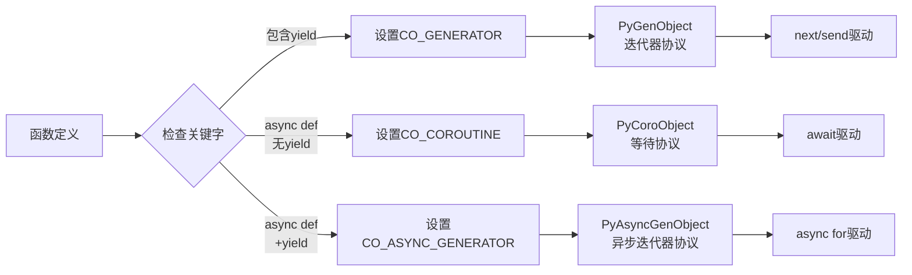
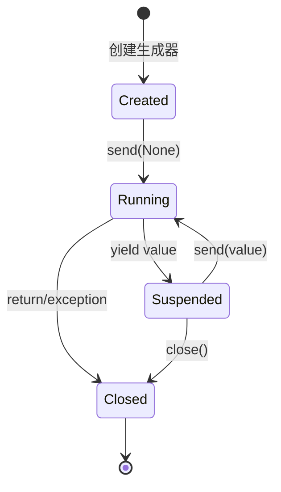

# CPython-09-生成器与协程-概览

## 1. 模块职责

生成器和协程是 Python 中实现惰性计算和异步编程的核心机制。本文档深入剖析 CPython 中 `yield`、生成器对象、协程对象的底层实现。

**核心概念**：
- **生成器（Generator）**：使用 `yield` 的函数，返回迭代器
- **协程（Coroutine）**：使用 `async def` 定义的函数，返回可等待对象
- **异步生成器（Async Generator）**：在 `async def` 中使用 `yield` 的函数

**应用场景**：
- 惰性计算、大数据处理
- 协程式并发、异步I/O
- 状态机实现
- 无限序列生成

## 2. 生成器、协程与异步生成器对比

### 2.1 三种对象类型



**类型对比表**：

| 特性 | 生成器 | 协程 | 异步生成器 |
|-----|--------|------|-----------|
| 定义方式 | `def` + `yield` | `async def` | `async def` + `yield` |
| 返回类型 | `generator` | `coroutine` | `async_generator` |
| 代码标志 | `CO_GENERATOR` | `CO_COROUTINE` | `CO_ASYNC_GENERATOR` |
| 协议 | 迭代器 | 等待 | 异步迭代器 |
| 主要方法 | `send()`, `throw()`, `close()` | 同生成器 + `__await__()` | `asend()`, `athrow()`, `aclose()` |
| 恢复方式 | `next()` / `send()` | `await` | `async for` |

### 2.2 代码标志识别

```c
// Python/codegen.c

static int
codegen_function_body(compiler *c, stmt_ty s, int is_async, Py_ssize_t funcflags,
                      int firstlineno)
{
    // 根据 AST 节点类型和是否 async 确定函数类型
    int scope_type;

    if (is_async) {
        // async def 函数
        scope_type = COMPILE_SCOPE_ASYNC_FUNCTION;
    } else {
        // 普通 def 函数
        scope_type = COMPILE_SCOPE_FUNCTION;
    }

    // 进入作用域，编译器会根据函数体中的语句
    // 自动设置 CO_GENERATOR/CO_COROUTINE/CO_ASYNC_GENERATOR 标志
    codegen_enter_scope(c, name, scope_type, (void *)s, firstlineno, NULL, &umd);

    // ... 编译函数体
}
```

**代码对象标志**（`co_flags`）：

```c
// Include/cpython/code.h

#define CO_GENERATOR        0x0020  // 包含 yield
#define CO_COROUTINE        0x0080  // async def（无 yield）
#define CO_ASYNC_GENERATOR  0x0200  // async def + yield
```

## 3. 生成器对象（Generator）

### 3.1 生成器数据结构

```c
// Include/cpython/genobject.h

typedef struct {
    PyObject_HEAD
    // 生成器的栈帧（执行状态）
    _PyInterpreterFrame gi_iframe;
    // 弱引用列表
    PyObject *gi_weakreflist;
    // 生成器名称和限定名
    PyObject *gi_name;
    PyObject *gi_qualname;
    // 生成器状态代码
    _PyGen_State gi_frame_state;
    // 异常信息
    PyObject *gi_exc_state_value;
} PyGenObject;
```

**生成器状态**：

```c
typedef enum {
    _Py_GEN_CREATED,   // 刚创建，未开始执行
    _Py_GEN_RUNNING,   // 正在执行
    _Py_GEN_SUSPENDED, // 暂停（在yield处）
    _Py_GEN_COMPLETED  // 已完成
} _PyGen_State;
```

### 3.2 生成器创建

```c
// Objects/genobject.c

PyObject *
_Py_MakeCoro(PyFunctionObject *func)
{
    // 获取代码对象的标志
    int coro_flags = ((PyCodeObject *)func->func_code)->co_flags &
        (CO_GENERATOR | CO_COROUTINE | CO_ASYNC_GENERATOR);

    assert(coro_flags);

    // 1. 普通生成器
    if (coro_flags == CO_GENERATOR) {
        return make_gen(&PyGen_Type, func);
    }

    // 2. 异步生成器
    if (coro_flags == CO_ASYNC_GENERATOR) {
        PyAsyncGenObject *ag;
        ag = (PyAsyncGenObject *)make_gen(&PyAsyncGen_Type, func);
        if (ag == NULL) {
            return NULL;
        }
        ag->ag_origin_or_finalizer = NULL;
        ag->ag_closed = 0;
        ag->ag_hooks_inited = 0;
        ag->ag_running_async = 0;
        return (PyObject*)ag;
    }

    // 3. 协程
    assert (coro_flags == CO_COROUTINE);
    PyObject *coro = make_gen(&PyCoro_Type, func);
    if (!coro) {
        return NULL;
    }

    // 设置协程追踪信息
    PyThreadState *tstate = _PyThreadState_GET();
    int origin_depth = tstate->coroutine_origin_tracking_depth;

    if (origin_depth == 0) {
        ((PyCoroObject *)coro)->cr_origin_or_finalizer = NULL;
    } else {
        // 记录协程创建的调用栈
        _PyInterpreterFrame *frame = tstate->current_frame;
        frame = _PyFrame_GetFirstComplete(frame->previous);
        PyObject *cr_origin = compute_cr_origin(origin_depth, frame);
        ((PyCoroObject *)coro)->cr_origin_or_finalizer = cr_origin;
        if (!cr_origin) {
            Py_DECREF(coro);
            return NULL;
        }
    }
    return coro;
}

static PyObject *
make_gen(PyTypeObject *type, PyFunctionObject *func)
{
    PyGenObject *gen;

    // 分配生成器对象
    gen = PyObject_GC_New(PyGenObject, type);
    if (gen == NULL) {
        return NULL;
    }

    // 初始化生成器栈帧
    _PyInterpreterFrame *frame = &gen->gi_iframe;
    _PyFrame_Initialize(frame, func, NULL, func->func_code, 0);

    gen->gi_weakreflist = NULL;
    gen->gi_frame_state = _Py_GEN_CREATED;
    gen->gi_exc_state_value = NULL;

    Py_INCREF(func->func_name);
    gen->gi_name = func->func_name;
    Py_INCREF(func->func_qualname);
    gen->gi_qualname = func->func_qualname;

    _PyObject_GC_TRACK(gen);

    return (PyObject *)gen;
}
```

### 3.3 生成器执行流程

**完整执行时序图**：



**生成器send方法**：

```c
// Objects/genobject.c

static PyObject *
gen_send(PyObject *self, PyObject *arg)
{
    PyGenObject *gen = (PyGenObject *)self;

    // 检查生成器状态
    if (gen->gi_frame_state == _Py_GEN_COMPLETED) {
        PyErr_SetNone(PyExc_StopIteration);
        return NULL;
    }

    if (gen->gi_frame_state == _Py_GEN_CREATED && arg != Py_None) {
        // 第一次send必须是None
        PyErr_SetString(PyExc_TypeError,
                       "can't send non-None value to a just-started generator");
        return NULL;
    }

    // 执行生成器
    return gen_send_ex(gen, arg, 0, 0);
}

static PyObject *
gen_send_ex(PyGenObject *gen, PyObject *arg, int exc, int closing)
{
    PyThreadState *tstate = _PyThreadState_GET();
    _PyInterpreterFrame *frame = &gen->gi_iframe;
    PyObject *result;

    // 设置生成器为运行状态
    gen->gi_frame_state = _Py_GEN_RUNNING;

    // 将send的值压入栈（作为上次yield的返回值）
    if (arg != NULL) {
        // 栈顶已经有一个值（上次yield的），需要替换
        _PyFrame_StackPush(frame, arg);
    }

    // 执行栈帧
    result = _PyEval_EvalFrame(tstate, frame, exc);

    // 如果返回了值，说明遇到了yield
    if (result != NULL) {
        // 生成器暂停
        gen->gi_frame_state = _Py_GEN_SUSPENDED;
        return result;
    }

    // 如果没有返回值且没有异常，说明生成器结束
    if (PyErr_Occurred() == NULL) {
        PyErr_SetNone(PyExc_StopIteration);
    }

    gen->gi_frame_state = _Py_GEN_COMPLETED;
    return NULL;
}
```

### 3.4 yield 字节码

**yield 语句编译**：

```c
// Python/codegen.c

case Yield_kind:
    // 编译 yield value 表达式
    VISIT(c, expr, e->v.Yield.value);
    // 生成 YIELD_VALUE 指令
    ADDOP_YIELD(c, loc);
    break;

case YieldFrom_kind:
    // 编译 yield from iterable
    if (SCOPE_TYPE(c) == COMPILE_SCOPE_ASYNC_FUNCTION) {
        return _PyCompile_Error(c, loc, "'yield from' inside async function");
    }

    VISIT(c, expr, e->v.YieldFrom.value);
    // 获取迭代器
    ADDOP(c, loc, GET_YIELD_FROM_ITER);
    // 压入None（第一次send）
    ADDOP_LOAD_CONST(c, loc, Py_None);
    // 委托给子迭代器
    ADD_YIELD_FROM(c, loc, 0);
    break;
```

**YIELD_VALUE 指令执行**：

```c
// Python/bytecodes.c

inst(YIELD_VALUE, (value -- value)) {
    // 将值保存到栈中
    _PyFrame_SetStackPointer(frame, stack_pointer);

    // 记录yield位置（用于恢复）
    frame->prev_instr = next_instr - 1;

    // 返回yielded的值
    DISPATCH_INLINED(value);
}
```

## 4. yield from 委托

`yield from` 允许一个生成器委托给另一个生成器。

### 4.1 yield from 执行流程



**实现细节**：

```c
// Python/bytecodes.c

inst(GET_YIELD_FROM_ITER, (iterable -- iter)) {
    // 如果是生成器，直接使用
    if (PyGen_CheckExact(iterable) || PyCoro_CheckExact(iterable)) {
        iter = iterable;
    }
    // 否则获取迭代器
    else {
        iter = PyObject_GetIter(iterable);
        if (iter == NULL) {
            GOTO_ERROR(error);
        }
        Py_DECREF(iterable);
    }
}

// 委托执行
macro(YIELD_FROM) = {
    SEND,           // 发送值到子生成器
    JUMP_BACKWARD,  // 继续循环
};
```

**示例**：

```python
def inner():
    yield 1
    yield 2
    return 'done'

def outer():
    result = yield from inner()  # 委托给inner
    print(f"inner returned: {result}")
    yield 3

gen = outer()
print(next(gen))  # 1（来自inner）
print(next(gen))  # 2（来自inner）
print(next(gen))  # 打印"inner returned: done"，然后yield 3
```

## 5. 协程对象（Coroutine）

协程是使用 `async def` 定义的函数，本质上是特殊的生成器。

### 5.1 协程数据结构

```c
// Include/cpython/genobject.h

typedef struct {
    PyObject_HEAD
    _PyInterpreterFrame cr_iframe;
    PyObject *cr_weakreflist;
    PyObject *cr_name;
    PyObject *cr_qualname;
    _PyGen_State cr_frame_state;
    PyObject *cr_exc_state_value;
    // 协程特有：追踪创建位置或finalizer
    PyObject *cr_origin_or_finalizer;
} PyCoroObject;
```

### 5.2 await 表达式

`await` 是协程中暂停和恢复的关键字。

**编译为字节码**：

```c
// Python/codegen.c

case Await_kind:
    // 编译 await expr
    VISIT(c, expr, e->v.Await.value);
    // 获取awaitable对象
    ADDOP_I(c, loc, GET_AWAITABLE, 0);
    // 压入None
    ADDOP_LOAD_CONST(c, loc, Py_None);
    // 委托执行（类似yield from）
    ADD_YIELD_FROM(c, loc, 1);
    break;
```

**GET_AWAITABLE 指令**：

```c
// Python/bytecodes.c

inst(GET_AWAITABLE, (iterable -- iter)) {
    // 检查是否实现了__await__方法
    iter = _PyObject_CallMethod(iterable, "__await__", NULL);

    if (iter == NULL) {
        // 如果是协程或生成器，直接使用
        if (PyCoro_CheckExact(iterable) || PyGen_CheckExact(iterable)) {
            iter = iterable;
        }
        else {
            PyErr_Format(PyExc_TypeError,
                        "object %.100s can't be used in 'await' expression",
                        Py_TYPE(iterable)->tp_name);
            GOTO_ERROR(error);
        }
    }

    Py_DECREF(iterable);
}
```

### 5.3 协程的等待协议

协程实现了等待协议（awaitable protocol）：

```c
// Objects/genobject.c

static PyObject *
coro_await(PyObject *coro)
{
    // 返回self（协程本身就是awaitable）
    Py_INCREF(coro);
    return coro;
}

static PyAsyncMethods coro_as_async = {
    coro_await,    // __await__
    0,             // __aiter__
    0,             // __anext__
};

PyTypeObject PyCoro_Type = {
    PyVarObject_HEAD_INIT(&PyType_Type, 0)
    "coroutine",
    // ...
    &coro_as_async,  // tp_as_async
    // ...
};
```

**示例**：

```python
async def coro():
    print("Coroutine start")
    await asyncio.sleep(1)  # 暂停，交出控制权
    print("Coroutine resume")
    return 42

# 创建协程对象
c = coro()
print(type(c))  # <class 'coroutine'>

# 协程需要被驱动（通过事件循环）
# asyncio.run(coro())
```

## 6. 异步生成器（Async Generator）

异步生成器结合了 `async def` 和 `yield`，用于异步迭代。

### 6.1 异步生成器数据结构

```c
// Include/cpython/genobject.h

typedef struct {
    PyObject_HEAD
    _PyInterpreterFrame ag_iframe;
    PyObject *ag_weakreflist;
    PyObject *ag_name;
    PyObject *ag_qualname;
    _PyGen_State ag_frame_state;
    PyObject *ag_exc_state_value;
    PyObject *ag_origin_or_finalizer;
    // 异步生成器特有
    int ag_running_async;  // 是否在异步运行
    int ag_closed;         // 是否已关闭
    int ag_hooks_inited;   // hooks是否已初始化
} PyAsyncGenObject;
```

### 6.2 异步迭代协议

```c
// Objects/genobject.c

static PyObject *
async_gen_anext(PyAsyncGenObject *ag)
{
    // 返回asend包装器
    return async_gen_asend_new(ag, Py_None);
}

static PyObject *
async_gen_aiter(PyAsyncGenObject *ag)
{
    // 返回self
    Py_INCREF(ag);
    return (PyObject *)ag;
}

static PyAsyncMethods async_gen_as_async = {
    0,                       // __await__
    async_gen_aiter,         // __aiter__
    async_gen_anext,         // __anext__
};
```

**示例**：

```python
async def async_range(n):
    for i in range(n):
        await asyncio.sleep(0.1)  // 模拟异步操作
        yield i

async def main():
    async for value in async_range(5):
        print(value)

# asyncio.run(main())
```

### 6.3 async for 循环编译

```c
// Python/codegen.c

static int
codegen_async_for(compiler *c, stmt_ty s)
{
    // async for target in iter:
    //     body

    // 获取异步迭代器
    VISIT(c, expr, s->v.AsyncFor.iter);
    ADDOP(c, LOC(s->v.AsyncFor.iter), GET_AITER);

    USE_LABEL(c, start);

    // 设置异常处理
    ADDOP_JUMP(c, loc, SETUP_FINALLY, except);

    // 获取下一个值
    ADDOP(c, loc, GET_ANEXT);
    ADDOP_LOAD_CONST(c, loc, Py_None);

    // 等待结果（类似await）
    ADD_YIELD_FROM(c, loc, 1);
    ADDOP(c, loc, POP_BLOCK);

    // 赋值给target
    VISIT(c, expr, s->v.AsyncFor.target);

    // 执行循环体
    VISIT_SEQ(c, stmt, s->v.AsyncFor.body);

    // 跳回循环开始
    ADDOP_JUMP(c, NO_LOCATION, JUMP, start);

    // 异常处理（StopAsyncIteration）
    USE_LABEL(c, except);
    ADDOP_JUMP(c, loc, END_ASYNC_FOR, send);

    // else块
    VISIT_SEQ(c, stmt, s->v.AsyncFor.orelse);

    USE_LABEL(c, end);
    return SUCCESS;
}
```

## 7. 实战案例

### 7.1 生成器：斐波那契数列

```python
def fibonacci():
    """无限斐波那契数列生成器"""
    a, b = 0, 1
    while True:
        yield a  # 暂停并返回当前值
        a, b = b, a + b

# 使用
fib = fibonacci()
for _ in range(10):
    print(next(fib), end=' ')
# 输出: 0 1 1 2 3 5 8 13 21 34
```

**对应字节码**：

```python
import dis

def fibonacci():
    a, b = 0, 1
    while True:
        yield a
        a, b = b, a + b

dis.dis(fibonacci)
```

```
# 简化后的字节码
LOAD_CONST    (0, 1)
UNPACK_SEQUENCE  2
STORE_FAST    a
STORE_FAST    b

LOAD_FAST     a
YIELD_VALUE       # 暂停，返回a
POP_TOP

LOAD_FAST     b
LOAD_FAST     a
LOAD_FAST     b
BINARY_ADD
BUILD_TUPLE   2
UNPACK_SEQUENCE  2
STORE_FAST    a
STORE_FAST    b
JUMP_BACKWARD
```

### 7.2 yield from：树遍历

```python
class Node:
    def __init__(self, value, left=None, right=None):
        self.value = value
        self.left = left
        self.right = right

    def traverse(self):
        """中序遍历"""
        if self.left:
            yield from self.left.traverse()  # 委托给左子树
        yield self.value
        if self.right:
            yield from self.right.traverse()  # 委托给右子树

# 构建树
root = Node(2,
            Node(1),
            Node(3))

# 遍历
for value in root.traverse():
    print(value)
# 输出: 1 2 3
```

### 7.3 协程：简单任务调度

```python
def simple_coro():
    print('-> Started')
    x = yield      # 暂停，等待send
    print('-> Received:', x)
    y = yield x * 2
    print('-> Received:', y)
    return x + y

# 使用
coro = simple_coro()
next(coro)           # 启动协程，输出: -> Started
print(coro.send(10)) # 发送10，输出: -> Received: 10, 返回20
try:
    coro.send(5)     # 发送5，输出: -> Received: 5
except StopIteration as e:
    print('Result:', e.value)  # 输出: Result: 15
```

### 7.4 async/await：HTTP请求

```python
import asyncio
import aiohttp

async def fetch_url(session, url):
    """异步获取URL内容"""
    async with session.get(url) as response:  # await 隐式调用
        return await response.text()

async def main():
    urls = [
        'http://example.com',
        'http://example.org',
        'http://example.net',
    ]

    async with aiohttp.ClientSession() as session:
        # 并发执行多个请求
        tasks = [fetch_url(session, url) for url in urls]
        results = await asyncio.gather(*tasks)

        for url, content in zip(urls, results):
            print(f"{url}: {len(content)} bytes")

# asyncio.run(main())
```

## 8. 生成器与协程的区别

### 8.1 概念区别

| 维度 | 生成器 | 协程 |
|-----|--------|------|
| **目的** | 惰性迭代 | 异步编程 |
| **暂停点** | `yield` | `await` |
| **恢复方式** | `next()` / `send()` | 事件循环驱动 |
| **返回值** | 通过 `StopIteration.value` | 通过 `return` |
| **可否嵌套** | 可（`yield from`） | 可（`await`） |

### 8.2 底层实现差异



## 9. 性能考量

### 9.1 生成器优势

- **内存效率**：惰性计算，不需要一次性生成所有值
- **无限序列**：可以表示无限序列
- **管道式处理**：多个生成器可以链式组合

**示例：内存对比**：

```python
# 列表：一次性生成所有值
def list_squares(n):
    return [x**2 for x in range(n)]

# 生成器：按需生成
def gen_squares(n):
    for x in range(n):
        yield x**2

import sys

# 内存占用
lst = list_squares(1000000)
gen = gen_squares(1000000)

print(sys.getsizeof(lst))  # ~8MB
print(sys.getsizeof(gen))  # ~128 bytes
```

### 9.2 协程性能

协程相比线程：
- **更轻量**：无需操作系统线程切换开销
- **更高效**：单线程事件循环，无GIL竞争
- **更可控**：显式的暂停点（await）

**并发对比**：

```python
import time
import asyncio

# 同步版本
def sync_task():
    for i in range(5):
        time.sleep(0.1)
    return "done"

def sync_main():
    start = time.time()
    tasks = [sync_task() for _ in range(10)]
    print(f"Sync: {time.time() - start:.2f}s")  # ~5s

# 异步版本
async def async_task():
    for i in range(5):
        await asyncio.sleep(0.1)
    return "done"

async def async_main():
    start = time.time()
    tasks = [async_task() for _ in range(10)]
    await asyncio.gather(*tasks)
    print(f"Async: {time.time() - start:.2f}s")  # ~0.5s

sync_main()
asyncio.run(async_main())
```

## 10. 调试技巧

### 10.1 查看生成器状态

```python
import inspect

def my_gen():
    yield 1
    yield 2

gen = my_gen()

print(inspect.getgeneratorstate(gen))  # GEN_CREATED
next(gen)
print(inspect.getgeneratorstate(gen))  # GEN_SUSPENDED
next(gen)
print(inspect.getgeneratorstate(gen))  # GEN_SUSPENDED
try:
    next(gen)
except StopIteration:
    print(inspect.getgeneratorstate(gen))  # GEN_CLOSED
```

### 10.2 协程调试

```python
import sys

async def buggy_coro():
    await asyncio.sleep(1)
    x = 1 / 0  # 错误

async def main():
    try:
        await buggy_coro()
    except ZeroDivisionError:
        import traceback
        traceback.print_exc()

asyncio.run(main())
```

## 11. 最佳实践

### 11.1 生成器

**推荐**：
- 用于大数据流处理
- 表示无限序列
- 管道式数据转换

```python
def read_large_file(filename):
    """按行读取大文件"""
    with open(filename) as f:
        for line in f:
            yield line.strip()

def filter_lines(lines, keyword):
    """过滤包含关键字的行"""
    for line in lines:
        if keyword in line:
            yield line

def process(filename, keyword):
    """管道式处理"""
    lines = read_large_file(filename)
    filtered = filter_lines(lines, keyword)
    for line in filtered:
        print(line)
```

### 11.2 协程

**推荐**：
- I/O密集型任务
- 网络请求
- 并发操作

**不推荐**：
- CPU密集型任务（使用多进程）
- 简单顺序操作（不需要异步）

## 12. 总结

生成器和协程是Python中强大的控制流机制：

1. **生成器**：
   - 使用 `yield` 实现惰性迭代
   - 内存高效，适合大数据处理
   - 通过 `yield from` 支持委托

2. **协程**：
   - 使用 `async def` + `await` 实现异步编程
   - 轻量级并发，无需多线程
   - 事件循环驱动执行

3. **底层实现**：
   - 基于栈帧保存和恢复
   - 字节码级别的暂停和恢复
   - 共享相同的基础结构（`PyGenObject`系列）

理解生成器和协程的底层实现有助于：
- 编写高效的异步代码
- 理解Python并发模型
- 调试复杂的异步问题
- 设计更好的API


## 14. 生成器与协程API源码深度剖析

### 14.1 生成器send实现

```c
// Objects/genobject.c

static PyObject* gen_send_ex(PyGenObject *gen, PyObject *arg, int exc, int closing)
{
    PyThreadState *tstate = _PyThreadState_GET();
    _PyInterpreterFrame *frame = (_PyInterpreterFrame *)gen->gi_iframe;
    PyObject *result;
    
    if (gen->gi_frame_state == FRAME_CREATED) {
        // 首次调用
        if (arg && arg != Py_None) {
            PyErr_SetString(PyExc_TypeError, 
                           "can't send non-None value to a just-started generator");
            return NULL;
        }
    }
    
    // 恢复栈帧并执行
    result = _PyEval_EvalFrame(tstate, frame, exc);
    
    if (result == NULL) {
        if (PyErr_ExceptionMatches(PyExc_StopIteration)) {
            return NULL;
        }
    }
    
    return result;
}
```

**生成器状态转换图**：



