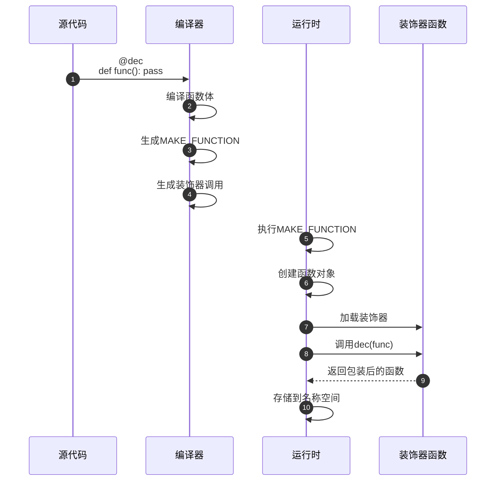
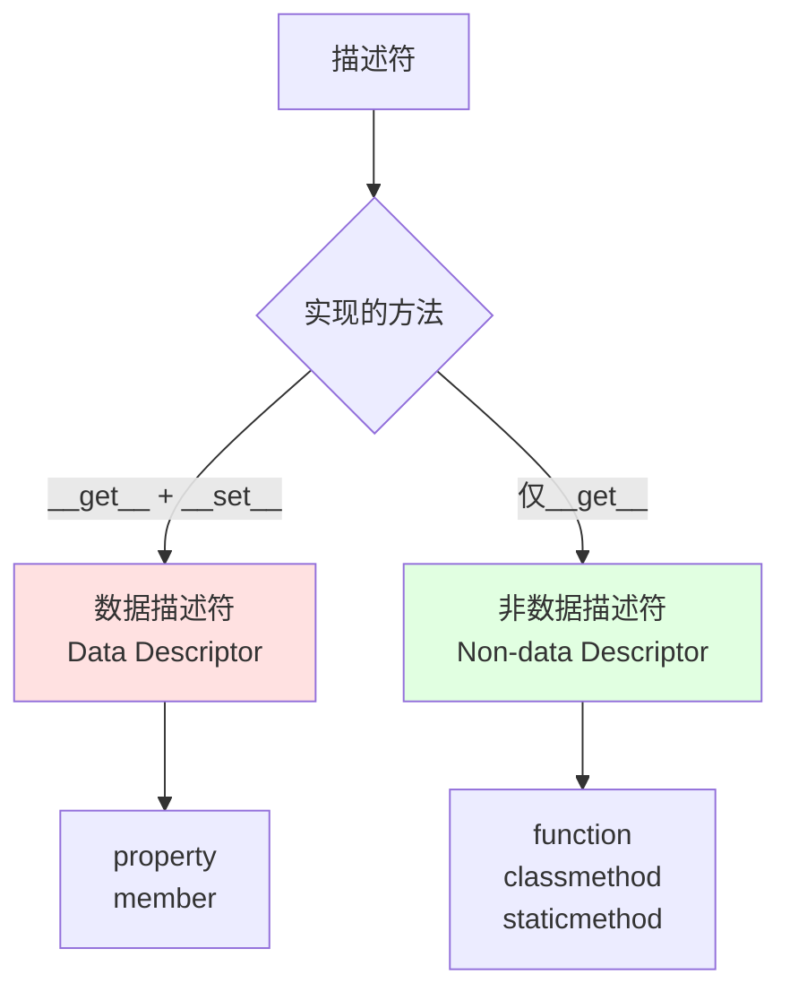
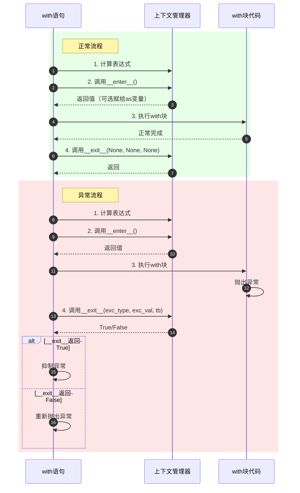
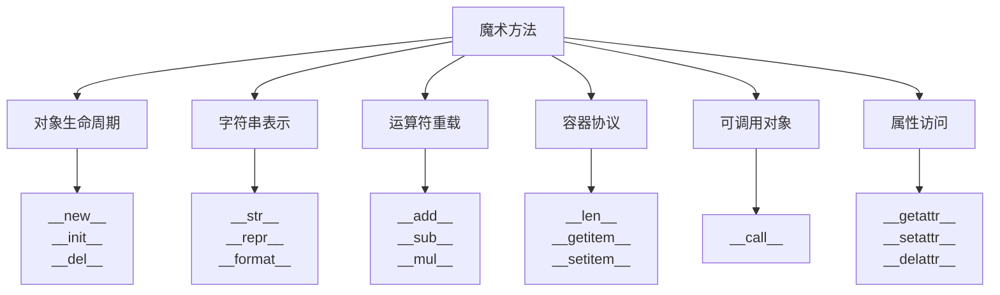
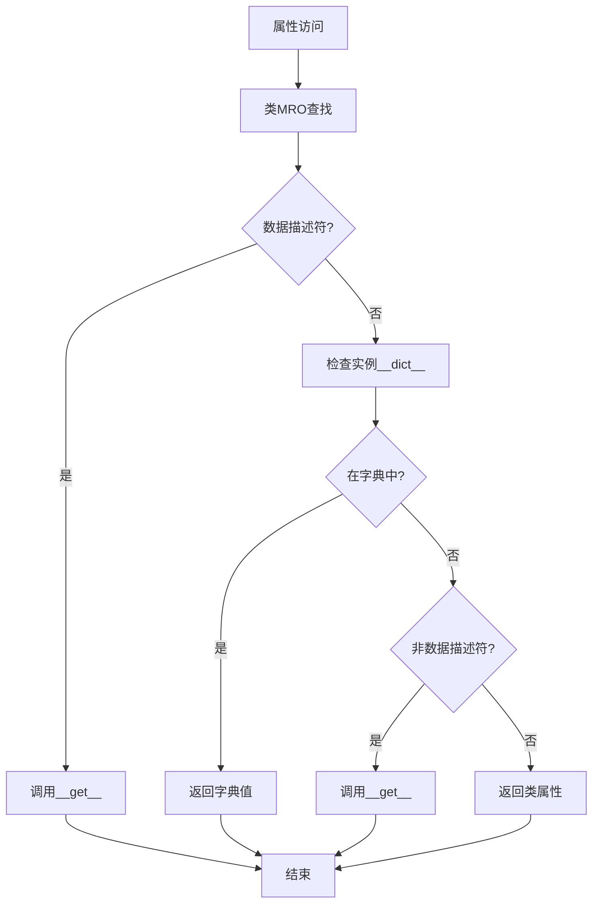

# CPython-10-Python高级特性-概览

## 1. 模块职责

本文档深入剖析 Python 高级特性的底层实现，包括装饰器、描述符、上下文管理器、魔术方法、元编程等核心机制。

**核心主题**：
- **装饰器**：函数/类/方法装饰器的实现
- **描述符协议**：property、classmethod、staticmethod
- **上下文管理器**：with/async with 语句
- **魔术方法**：Python 数据模型的核心
- **元编程**：metaclass、type、__init_subclass__
- **反射机制**：getattr、setattr、hasattr

## 2. 装饰器（Decorator）

装饰器是Python中修改函数或类行为的语法糖。

### 2.1 装饰器语法糖

```python
@decorator
def func():
    pass

# 等价于
def func():
    pass
func = decorator(func)
```

### 2.2 装饰器编译

**AST表示**：

```c
// Python/Python-ast.c

// 函数装饰器
typedef struct {
    identifier name;
    arguments_ty args;
    stmt_seq *body;
    expr_seq *decorator_list;  // 装饰器列表
    // ...
} FunctionDef;

// 类装饰器
typedef struct {
    identifier name;
    expr_seq *bases;
    keyword_seq *keywords;
    stmt_seq *body;
    expr_seq *decorator_list;  // 装饰器列表
} ClassDef;
```

**字节码生成**：

```c
// Python/codegen.c

static int
codegen_function_def(compiler *c, stmt_ty s, int is_async)
{
    // 1. 编译函数体（创建代码对象）
    PyCodeObject *co = compile_function_body(c, s);

    // 2. 创建函数对象
    ADDOP_LOAD_CONST(c, loc, (PyObject *)co);
    ADDOP(c, loc, MAKE_FUNCTION, flags);

    // 3. 应用装饰器（从内到外）
    asdl_seq *decos = s->v.FunctionDef.decorator_list;
    for (Py_ssize_t i = 0; i < asdl_seq_LEN(decos); i++) {
        // 加载装饰器
        VISIT(c, expr, asdl_seq_GET(decos, i));
        // 调用装饰器
        ADDOP_I(c, loc, CALL, 0);
    }

    // 4. 存储结果
    ADDOP_NAME(c, loc, STORE_NAME, s->v.FunctionDef.name);

    return SUCCESS;
}
```

### 2.3 装饰器执行流程



### 2.4 常见装饰器实现

**1. 函数装饰器**：

```python
def timer(func):
    """计时装饰器"""
    import time
    import functools

    @functools.wraps(func)  # 保留原函数元数据
    def wrapper(*args, **kwargs):
        start = time.time()
        result = func(*args, **kwargs)
        end = time.time()
        print(f"{func.__name__} took {end - start:.4f}s")
        return result
    return wrapper

@timer
def slow_function():
    import time
    time.sleep(1)

# 等价于: slow_function = timer(slow_function)
```

**2. 带参数的装饰器**：

```python
def repeat(n):
    """重复执行n次"""
    def decorator(func):
        import functools

        @functools.wraps(func)
        def wrapper(*args, **kwargs):
            results = []
            for _ in range(n):
                results.append(func(*args, **kwargs))
            return results
        return wrapper
    return decorator

@repeat(3)
def greet(name):
    return f"Hello, {name}!"

# 等价于: greet = repeat(3)(greet)
```

**3. 类装饰器**：

```python
class CountCalls:
    """记录函数调用次数"""
    def __init__(self, func):
        self.func = func
        self.count = 0

    def __call__(self, *args, **kwargs):
        self.count += 1
        print(f"Call {self.count} of {self.func.__name__}")
        return self.func(*args, **kwargs)

@CountCalls
def say_hello():
    print("Hello!")

say_hello()  # Call 1 of say_hello
say_hello()  # Call 2 of say_hello
```

## 3. 描述符协议（Descriptor Protocol）

描述符是实现了 `__get__`、`__set__` 或 `__delete__` 方法的对象，是 Python 属性访问的核心机制。

### 3.1 描述符协议定义

```c
// Include/cpython/object.h

typedef struct PyGetSetDef {
    const char *name;
    getter get;    // __get__
    setter set;    // __set__
    const char *doc;
    void *closure;
} PyGetSetDef;

// 描述符类型槽
typedef PyObject *(*descrgetfunc)(PyObject *, PyObject *, PyObject *);
typedef int (*descrsetfunc)(PyObject *, PyObject *, PyObject *);
```

**描述符分类**：



### 3.2 属性查找顺序

**属性查找优先级**：

1. **数据描述符**（来自 `type(obj).__dict__`）
2. **实例属性**（来自 `obj.__dict__`）
3. **非数据描述符**（来自 `type(obj).__dict__`）
4. **类属性**（来自 `type(obj).__dict__`）
5. **`__getattr__`**（如果定义）

```c
// Objects/object.c

PyObject *
PyObject_GetAttr(PyObject *v, PyObject *name)
{
    PyTypeObject *tp = Py_TYPE(v);

    // 1. 检查类型的__getattribute__
    if (tp->tp_getattro != NULL) {
        return (*tp->tp_getattro)(v, name);
    }

    // 2. 使用通用属性查找
    return PyObject_GenericGetAttr(v, name);
}

PyObject *
PyObject_GenericGetAttr(PyObject *obj, PyObject *name)
{
    PyTypeObject *tp = Py_TYPE(obj);
    PyObject *descr = NULL;
    PyObject *res = NULL;
    descrgetfunc f;

    // 1. 在类的MRO中查找描述符
    descr = _PyType_Lookup(tp, name);
    if (descr != NULL) {
        Py_INCREF(descr);
        f = Py_TYPE(descr)->tp_descr_get;

        // 如果是数据描述符，立即调用__get__
        if (f != NULL && PyDescr_IsData(descr)) {
            res = f(descr, obj, (PyObject *)tp);
            Py_DECREF(descr);
            return res;
        }
    }

    // 2. 查找实例字典
    if (tp->tp_dict != NULL) {
        PyObject *dict = *_PyObject_GetDictPtr(obj);
        if (dict != NULL) {
            res = PyDict_GetItemWithError(dict, name);
            if (res != NULL) {
                Py_INCREF(res);
                Py_XDECREF(descr);
                return res;
            }
        }
    }

    // 3. 如果是非数据描述符，调用__get__
    if (f != NULL) {
        res = f(descr, obj, (PyObject *)tp);
        Py_DECREF(descr);
        return res;
    }

    // 4. 返回类属性
    if (descr != NULL) {
        return descr;
    }

    // 5. 抛出AttributeError
    PyErr_Format(PyExc_AttributeError, ...);
    return NULL;
}
```

### 3.3 property 实现

`property` 是最常用的数据描述符。

```c
// Objects/descrobject.c

typedef struct {
    PyObject_HEAD
    PyObject *prop_get;    // getter函数
    PyObject *prop_set;    // setter函数
    PyObject *prop_del;    // deleter函数
    PyObject *prop_doc;    // 文档字符串
    PyObject *prop_name;   // 属性名
    int getter_doc;
} propertyobject;

static PyObject *
property_descr_get(PyObject *self, PyObject *obj, PyObject *type)
{
    propertyobject *prop = (propertyobject *)self;

    // 如果从类访问，返回描述符本身
    if (obj == NULL || obj == Py_None) {
        Py_INCREF(self);
        return self;
    }

    // 调用getter
    if (prop->prop_get == NULL) {
        PyErr_SetString(PyExc_AttributeError, "property has no getter");
        return NULL;
    }

    return PyObject_CallOneArg(prop->prop_get, obj);
}

static int
property_descr_set(PyObject *self, PyObject *obj, PyObject *value)
{
    propertyobject *prop = (propertyobject *)self;
    PyObject *func, *res;

    if (value == NULL) {
        // 删除属性
        func = prop->prop_del;
        if (func == NULL) {
            PyErr_SetString(PyExc_AttributeError, "property has no deleter");
            return -1;
        }
    }
    else {
        // 设置属性
        func = prop->prop_set;
        if (func == NULL) {
            PyErr_SetString(PyExc_AttributeError, "property has no setter");
            return -1;
        }
    }

    if (value == NULL) {
        res = PyObject_CallOneArg(func, obj);
    }
    else {
        res = PyObject_CallFunctionObjArgs(func, obj, value, NULL);
    }

    if (res == NULL) {
        return -1;
    }
    Py_DECREF(res);
    return 0;
}

PyTypeObject PyProperty_Type = {
    PyVarObject_HEAD_INIT(&PyType_Type, 0)
    "property",
    sizeof(propertyobject),
    // ...
    property_descr_get,  // tp_descr_get
    property_descr_set,  // tp_descr_set
    // ...
};
```

**使用示例**：

```python
class Circle:
    def __init__(self, radius):
        self._radius = radius

    @property
    def radius(self):
        """半径getter"""
        return self._radius

    @radius.setter
    def radius(self, value):
        """半径setter"""
        if value < 0:
            raise ValueError("Radius must be positive")
        self._radius = value

    @property
    def area(self):
        """只读属性：面积"""
        import math
        return math.pi * self._radius ** 2

c = Circle(5)
print(c.radius)   # 调用getter，输出: 5
c.radius = 10     # 调用setter
print(c.area)     # 只读属性，输出: 314.159...
# c.area = 100    # AttributeError: property has no setter
```

### 3.4 classmethod 和 staticmethod

**classmethod 实现**：

```c
// Objects/funcobject.c

typedef struct {
    PyObject_HEAD
    PyObject *cm_callable;  // 被包装的函数
    PyObject *cm_dict;
} classmethod;

static PyObject *
cm_descr_get(PyObject *self, PyObject *obj, PyObject *type)
{
    classmethod *cm = (classmethod *)self;

    // 无论从实例还是类访问，都传递类作为第一个参数
    if (type == NULL) {
        type = (PyObject *)Py_TYPE(obj);
    }

    return PyMethod_New(cm->cm_callable, type);
}

PyTypeObject PyClassMethod_Type = {
    PyVarObject_HEAD_INIT(&PyType_Type, 0)
    "classmethod",
    sizeof(classmethod),
    // ...
    cm_descr_get,  // tp_descr_get
    0,             // tp_descr_set（非数据描述符）
    // ...
};
```

**staticmethod 实现**：

```c
typedef struct {
    PyObject_HEAD
    PyObject *sm_callable;  // 被包装的函数
    PyObject *sm_dict;
} staticmethod;

static PyObject *
sm_descr_get(PyObject *self, PyObject *obj, PyObject *type)
{
    staticmethod *sm = (staticmethod *)self;

    // 直接返回原函数，不绑定self或cls
    Py_INCREF(sm->sm_callable);
    return sm->sm_callable;
}

PyTypeObject PyStaticMethod_Type = {
    PyVarObject_HEAD_INIT(&PyType_Type, 0)
    "staticmethod",
    sizeof(staticmethod),
    // ...
    sm_descr_get,  // tp_descr_get
    0,             // tp_descr_set（非数据描述符）
    // ...
};
```

**使用示例**：

```python
class MyClass:
    class_var = "I'm a class variable"

    def instance_method(self):
        """实例方法：接收self"""
        return f"Instance method called, self={self}"

    @classmethod
    def class_method(cls):
        """类方法：接收cls"""
        return f"Class method called, cls={cls}, var={cls.class_var}"

    @staticmethod
    def static_method():
        """静态方法：不接收self或cls"""
        return "Static method called"

obj = MyClass()

# 实例方法
print(obj.instance_method())  # self自动传递

# 类方法
print(MyClass.class_method())  # cls自动传递
print(obj.class_method())      # cls自动传递（不是self）

# 静态方法
print(MyClass.static_method())  # 无隐式参数
print(obj.static_method())      # 无隐式参数
```

## 4. 上下文管理器（Context Manager）

上下文管理器通过 `with` 语句实现资源的自动管理。

### 4.1 上下文管理器协议

```python
class ContextManager:
    def __enter__(self):
        """进入with块前调用，返回值赋给as后的变量"""
        return self

    def __exit__(self, exc_type, exc_value, traceback):
        """离开with块后调用

        参数：
            exc_type: 异常类型（无异常时为None）
            exc_value: 异常实例
            traceback: 追踪信息

        返回值：
            True: 抑制异常
            False/None: 传播异常
        """
        return False
```

### 4.2 with语句编译

```c
// Python/codegen.c

/*
   with EXPR as VAR:
       BLOCK

   编译为：
       <EXPR>
       SETUP_WITH  E
       <store to VAR> or POP_TOP
       <BLOCK>
       LOAD_CONST (None, None, None)
       CALL_FUNCTION_EX 0
       JUMP  EXIT
   E:  WITH_EXCEPT_START
       POP_JUMP_IF_TRUE T
       RERAISE
   T:  POP_TOP
       POP_EXCEPT
       POP_TOP
   EXIT:
*/

static int
codegen_with_inner(compiler *c, stmt_ty s, int pos)
{
    withitem_ty item = asdl_seq_GET(s->v.With.items, pos);

    // 1. 计算上下文表达式
    VISIT(c, expr, item->context_expr);

    // 2. 加载__exit__方法
    ADDOP_I(c, loc, COPY, 1);
    ADDOP_I(c, loc, LOAD_SPECIAL, SPECIAL___EXIT__);
    ADDOP_I(c, loc, SWAP, 2);
    ADDOP_I(c, loc, SWAP, 3);

    // 3. 调用__enter__方法
    ADDOP_I(c, loc, LOAD_SPECIAL, SPECIAL___ENTER__);
    ADDOP_I(c, loc, CALL, 0);

    // 4. 设置异常处理
    ADDOP_JUMP(c, loc, SETUP_WITH, final);

    // 5. 赋值给as变量或丢弃
    if (item->optional_vars) {
        VISIT(c, expr, item->optional_vars);
    }
    else {
        ADDOP(c, loc, POP_TOP);
    }

    // 6. 执行with块代码
    VISIT_SEQ(c, stmt, s->v.With.body);

    // 7. 正常退出：调用__exit__(None, None, None)
    ADDOP(c, NO_LOCATION, POP_BLOCK);
    RETURN_IF_ERROR(codegen_call_exit_with_nones(c, loc));
    ADDOP(c, loc, POP_TOP);
    ADDOP_JUMP(c, loc, JUMP, exit);

    // 8. 异常退出：调用__exit__(exc_type, exc_value, traceback)
    USE_LABEL(c, final);
    ADDOP_JUMP(c, loc, SETUP_CLEANUP, cleanup);
    ADDOP(c, loc, PUSH_EXC_INFO);
    ADDOP(c, loc, WITH_EXCEPT_START);
    RETURN_IF_ERROR(codegen_with_except_finish(c, cleanup));

    USE_LABEL(c, exit);
    return SUCCESS;
}
```

### 4.3 with语句执行流程



### 4.4 实战案例

**1. 文件操作**：

```python
class FileManager:
    def __init__(self, filename, mode):
        self.filename = filename
        self.mode = mode
        self.file = None

    def __enter__(self):
        print(f"Opening {self.filename}")
        self.file = open(self.filename, self.mode)
        return self.file

    def __exit__(self, exc_type, exc_value, traceback):
        if self.file:
            print(f"Closing {self.filename}")
            self.file.close()

        if exc_type is not None:
            print(f"Exception occurred: {exc_value}")
            # 返回False传播异常
            return False

# 使用
with FileManager('test.txt', 'w') as f:
    f.write('Hello, World!')
# 自动调用__exit__关闭文件
```

**2. 数据库事务**：

```python
class Transaction:
    def __init__(self, conn):
        self.conn = conn

    def __enter__(self):
        self.conn.begin()
        return self.conn

    def __exit__(self, exc_type, exc_value, traceback):
        if exc_type is None:
            # 无异常，提交事务
            self.conn.commit()
        else:
            # 有异常，回滚事务
            self.conn.rollback()
        return False  # 不抑制异常

# 使用
with Transaction(conn) as c:
    c.execute("INSERT ...")
    c.execute("UPDATE ...")
# 自动提交或回滚
```

**3. contextlib辅助**：

```python
from contextlib import contextmanager

@contextmanager
def timer(name):
    """计时上下文管理器"""
    import time
    start = time.time()
    print(f"{name} started")

    try:
        yield  # 执行with块
    finally:
        end = time.time()
        print(f"{name} finished in {end - start:.4f}s")

# 使用
with timer("Operation"):
    import time
    time.sleep(1)
```

### 4.5 async with（异步上下文管理器）

```python
class AsyncContextManager:
    async def __aenter__(self):
        """异步进入"""
        await some_async_setup()
        return self

    async def __aexit__(self, exc_type, exc_value, traceback):
        """异步退出"""
        await some_async_cleanup()
        return False

# 使用
async with AsyncContextManager() as cm:
    await do_something()
```

## 5. 魔术方法（Magic Methods）

魔术方法定义了Python的数据模型，是操作符重载和协议实现的基础。

### 5.1 魔术方法分类



### 5.2 核心魔术方法

**1. 对象创建和初始化**：

```python
class MyClass:
    def __new__(cls, *args, **kwargs):
        """创建实例（类方法，返回实例）"""
        print(f"__new__ called for {cls}")
        instance = super().__new__(cls)
        return instance

    def __init__(self, value):
        """初始化实例"""
        print(f"__init__ called with value={value}")
        self.value = value

    def __del__(self):
        """析构函数（不保证调用时机）"""
        print(f"__del__ called for {self}")

obj = MyClass(42)
# 输出:
# __new__ called for <class '__main__.MyClass'>
# __init__ called with value=42
```

**2. 字符串表示**：

```python
class Point:
    def __init__(self, x, y):
        self.x = x
        self.y = y

    def __repr__(self):
        """开发者友好的表示（应该可eval重建对象）"""
        return f"Point({self.x}, {self.y})"

    def __str__(self):
        """用户友好的表示"""
        return f"({self.x}, {self.y})"

    def __format__(self, format_spec):
        """自定义格式化"""
        if format_spec == 'polar':
            r = (self.x**2 + self.y**2)**0.5
            theta = math.atan2(self.y, self.x)
            return f"(r={r:.2f}, θ={theta:.2f})"
        return str(self)

p = Point(3, 4)
print(repr(p))           # Point(3, 4)
print(str(p))            # (3, 4)
print(f"{p:polar}")      # (r=5.00, θ=0.93)
```

**3. 运算符重载**：

```c
// Include/cpython/object.h

typedef struct {
    binaryfunc nb_add;           // __add__
    binaryfunc nb_subtract;      // __sub__
    binaryfunc nb_multiply;      // __mul__
    binaryfunc nb_remainder;     // __mod__
    binaryfunc nb_divmod;        // __divmod__
    // ... 更多运算符
} PyNumberMethods;
```

```python
class Vector:
    def __init__(self, x, y):
        self.x = x
        self.y = y

    def __add__(self, other):
        """向量加法"""
        return Vector(self.x + other.x, self.y + other.y)

    def __mul__(self, scalar):
        """标量乘法"""
        return Vector(self.x * scalar, self.y * scalar)

    def __eq__(self, other):
        """相等比较"""
        return self.x == other.x and self.y == other.y

    def __repr__(self):
        return f"Vector({self.x}, {self.y})"

v1 = Vector(1, 2)
v2 = Vector(3, 4)
print(v1 + v2)     # Vector(4, 6)
print(v1 * 2)      # Vector(2, 4)
print(v1 == v2)    # False
```

**4. 容器协议**：

```python
class CustomList:
    def __init__(self, items=None):
        self._items = items or []

    def __len__(self):
        """len()函数"""
        return len(self._items)

    def __getitem__(self, index):
        """索引访问：obj[index]"""
        return self._items[index]

    def __setitem__(self, index, value):
        """索引赋值：obj[index] = value"""
        self._items[index] = value

    def __delitem__(self, index):
        """索引删除：del obj[index]"""
        del self._items[index]

    def __contains__(self, item):
        """in运算符：item in obj"""
        return item in self._items

    def __iter__(self):
        """for循环迭代"""
        return iter(self._items)

cl = CustomList([1, 2, 3, 4, 5])
print(len(cl))       # 5
print(cl[2])         # 3
cl[2] = 30
print(3 in cl)       # False
for item in cl:
    print(item)      # 1, 2, 30, 4, 5
```

**5. 可调用对象**：

```python
class Multiplier:
    def __init__(self, factor):
        self.factor = factor

    def __call__(self, x):
        """使实例可调用"""
        return x * self.factor

double = Multiplier(2)
triple = Multiplier(3)

print(double(5))     # 10
print(triple(5))     # 15
```

**6. 属性访问**：

```python
class DynamicAttributes:
    def __init__(self):
        self._data = {}

    def __getattr__(self, name):
        """访问不存在的属性时调用"""
        print(f"Getting {name}")
        return self._data.get(name, f"No attribute '{name}'")

    def __setattr__(self, name, value):
        """设置任何属性时调用"""
        print(f"Setting {name} = {value}")
        if name.startswith('_'):
            # 私有属性使用默认行为
            super().__setattr__(name, value)
        else:
            self._data[name] = value

    def __delattr__(self, name):
        """删除属性时调用"""
        print(f"Deleting {name}")
        if name in self._data:
            del self._data[name]

obj = DynamicAttributes()
obj.x = 10           # Setting x = 10
print(obj.x)         # Getting x, 输出: 10
del obj.x            # Deleting x
```

## 6. 元编程（Metaprogramming）

元编程是编写操作代码的代码，Python通过metaclass和type实现。

### 6.1 type：类的类

```python
# type有三种用法：

# 1. 查询对象类型
print(type(42))          # <class 'int'>
print(type("hello"))     # <class 'str'>

# 2. 动态创建类
def init(self, value):
    self.value = value

MyClass = type(
    'MyClass',                    # 类名
    (object,),                    # 基类元组
    {'__init__': init,            # 类字典
     'class_var': 100}
)

obj = MyClass(42)
print(obj.value)         # 42
print(obj.class_var)     # 100

# 3. 自定义元类
print(type(MyClass))     # <class 'type'>
```

### 6.2 metaclass实现

```c
// Objects/typeobject.c

// type的__call__方法（创建实例时调用）
static PyObject *
type_call(PyTypeObject *type, PyObject *args, PyObject *kwds)
{
    PyObject *obj;

    // 1. 调用__new__创建实例
    obj = type->tp_new(type, args, kwds);
    if (obj == NULL) {
        return NULL;
    }

    // 2. 如果返回的是正确类型的实例，调用__init__
    type = Py_TYPE(obj);
    if (type->tp_init != NULL) {
        int res = type->tp_init(obj, args, kwds);
        if (res < 0) {
            Py_DECREF(obj);
            return NULL;
        }
    }

    return obj;
}
```

### 6.3 自定义元类

```python
class SingletonMeta(type):
    """单例元类"""
    _instances = {}

    def __call__(cls, *args, **kwargs):
        if cls not in cls._instances:
            # 首次创建实例
            instance = super().__call__(*args, **kwargs)
            cls._instances[cls] = instance
        return cls._instances[cls]

class Database(metaclass=SingletonMeta):
    def __init__(self, host):
        self.host = host
        print(f"Connecting to {host}")

# 无论创建多少次，都是同一个实例
db1 = Database("localhost")  # Connecting to localhost
db2 = Database("localhost")  # 不会再次连接
print(db1 is db2)            # True
```

### 6.4 __init_subclass__

Python 3.6+ 提供了更简单的类定制机制。

```python
class RegisteredClass:
    """自动注册子类"""
    _registry = {}

    def __init_subclass__(cls, key=None, **kwargs):
        super().__init_subclass__(**kwargs)
        if key is not None:
            cls._registry[key] = cls
            print(f"Registered {cls.__name__} with key='{key}'")

    @classmethod
    def get(cls, key):
        return cls._registry.get(key)

class PluginA(RegisteredClass, key='plugin_a'):
    pass

class PluginB(RegisteredClass, key='plugin_b'):
    pass

# 输出:
# Registered PluginA with key='plugin_a'
# Registered PluginB with key='plugin_b'

print(RegisteredClass.get('plugin_a'))  # <class '__main__.PluginA'>
```

## 7. 反射与内省

反射允许在运行时检查和修改对象。

### 7.1 核心反射函数

```python
class MyClass:
    class_var = "I'm a class variable"

    def __init__(self):
        self.instance_var = "I'm an instance variable"

    def method(self):
        pass

obj = MyClass()

# hasattr: 检查属性是否存在
print(hasattr(obj, 'instance_var'))  # True
print(hasattr(obj, 'nonexistent'))   # False

# getattr: 获取属性
value = getattr(obj, 'instance_var', 'default')
print(value)  # I'm an instance variable

# setattr: 设置属性
setattr(obj, 'new_var', 42)
print(obj.new_var)  # 42

# delattr: 删除属性
delattr(obj, 'new_var')

# dir: 列出所有属性
print(dir(obj))  # ['__class__', '__init__', ..., 'class_var', 'instance_var', 'method']

# vars: 返回__dict__
print(vars(obj))  # {'instance_var': "I'm an instance variable"}
```

### 7.2 inspect模块

```python
import inspect

class Example:
    def __init__(self, x):
        self.x = x

    def method(self, y):
        return self.x + y

# 获取签名
sig = inspect.signature(Example.method)
print(sig)  # (self, y)

# 获取源代码
source = inspect.getsource(Example.method)
print(source)

# 检查类型
print(inspect.isclass(Example))      # True
print(inspect.isfunction(Example.method))  # True
print(inspect.ismethod(Example().method))  # True

# 获取成员
members = inspect.getmembers(Example)
for name, value in members:
    print(f"{name}: {type(value)}")
```

## 8. 综合实战案例

### 8.1 ORM-like 数据模型

```python
class Field:
    """字段描述符"""
    def __init__(self, field_type, default=None):
        self.field_type = field_type
        self.default = default
        self.name = None  # 由__set_name__设置

    def __set_name__(self, owner, name):
        self.name = name

    def __get__(self, instance, owner):
        if instance is None:
            return self
        return instance.__dict__.get(self.name, self.default)

    def __set__(self, instance, value):
        if not isinstance(value, self.field_type):
            raise TypeError(f"{self.name} must be {self.field_type}")
        instance.__dict__[self.name] = value

class ModelMeta(type):
    """模型元类：收集字段"""
    def __new__(mcs, name, bases, namespace):
        fields = {}
        for key, value in namespace.items():
            if isinstance(value, Field):
                fields[key] = value

        cls = super().__new__(mcs, name, bases, namespace)
        cls._fields = fields
        return cls

class Model(metaclass=ModelMeta):
    """基础模型类"""
    def __init__(self, **kwargs):
        for name, field in self._fields.items():
            setattr(self, name, kwargs.get(name, field.default))

    def __repr__(self):
        items = ', '.join(f"{k}={v!r}" for k, v in self.__dict__.items())
        return f"{self.__class__.__name__}({items})"

# 使用
class User(Model):
    name = Field(str, "Anonymous")
    age = Field(int, 0)
    email = Field(str)

user = User(name="Alice", age=30, email="alice@example.com")
print(user)              # User(name='Alice', age=30, email='alice@example.com')
print(user.name)         # Alice
user.age = "invalid"     # TypeError: age must be <class 'int'>
```

## 9. 最佳实践

**装饰器**：
- 使用 `functools.wraps` 保留元数据
- 装饰器应该是幂等的
- 考虑使用 `functools.lru_cache` 优化

**描述符**：
- 数据描述符优先于实例属性
- 使用 `__set_name__` 自动获取属性名
- property 适合简单场景，复杂逻辑使用自定义描述符

**上下文管理器**：
- 总是在 `__exit__` 中清理资源
- 使用 `contextlib.contextmanager` 简化实现
- 异步资源使用 async with

**魔术方法**：
- 只实现需要的魔术方法
- `__repr__` 应该明确无歧义
- `__str__` 应该友好易读
- 运算符重载应该符合直觉

**元编程**：
- 优先使用 `__init_subclass__` 而非元类
- 元类适合框架级别的定制
- 保持简单，避免过度设计

## 10. 总结

Python高级特性提供了强大的抽象能力：

1. **装饰器**：修改函数/类行为的语法糖
2. **描述符**：控制属性访问的协议
3. **上下文管理器**：自动资源管理
4. **魔术方法**：定义对象行为的数据模型
5. **元编程**：在运行时操作类和对象

理解这些机制有助于：
- 编写更优雅的Python代码
- 理解标准库和框架的实现
- 设计更好的API
- 实现领域特定语言（DSL）


## 15. Python高级特性API源码深度剖析

### 15.1 描述符__get__实现

```c
// Objects/descrobject.c

static PyObject* property_descr_get(PyObject *self, PyObject *obj, PyObject *type)
{
    propertyobject *prop = (propertyobject *)self;
    
    if (obj == NULL || obj == Py_None) {
        Py_INCREF(self);
        return self;
    }
    
    if (prop->prop_get == NULL) {
        PyErr_SetString(PyExc_AttributeError, "unreadable attribute");
        return NULL;
    }
    
    return PyObject_CallOneArg(prop->prop_get, obj);
}
```

**描述符查找流程**：



