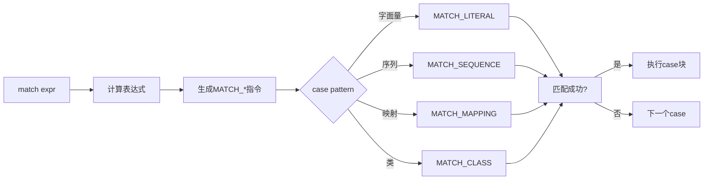

# CPython-11-类型系统与模式匹配-概览

## 1. 模块职责

本文档深入剖析 Python 的类型系统、类型注解、模式匹配和数据类的底层实现。

**核心主题**：
- **类型注解**：函数/变量类型标注
- **typing模块**：泛型、协议、类型别名
- **模式匹配**：match-case语句实现
- **数据类**：@dataclass装饰器
- **类型检查**：运行时vs静态检查

## 2. 类型注解（Type Annotations）

Python 3.5+ 引入了类型注解（PEP 484），提供可选的静态类型提示。

### 2.1 类型注解语法

```python
# 变量注解
age: int = 25
name: str = "Alice"
items: list[int] = [1, 2, 3]

# 函数注解
def greet(name: str) -> str:
    return f"Hello, {name}"

# 类属性注解
class Person:
    name: str
    age: int

    def __init__(self, name: str, age: int):
        self.name = name
        self.age = age
```

### 2.2 类型注解存储

类型注解不影响运行时行为，仅存储在 `__annotations__` 字典中。

```python
def func(x: int, y: str) -> bool:
    return True

print(func.__annotations__)
# {'x': <class 'int'>, 'y': <class 'str'>, 'return': <class 'bool'>}

class MyClass:
    x: int
    y: str = "default"

print(MyClass.__annotations__)
# {'x': <class 'int'>, 'y': <class 'str'>}
```

### 2.3 类型注解编译

**AST表示**：

```c
// Python/Python-ast.c

// 函数定义包含参数和返回值类型
typedef struct {
    identifier name;
    arguments_ty args;        // 包含类型注解
    expr_ty returns;          // 返回类型注解
    stmt_seq *body;
} FunctionDef;

// 注解赋值语句
typedef struct {
    expr_ty target;           // 变量名
    expr_ty annotation;       // 类型注解
    expr_ty value;            // 可选的值
} AnnAssign;
```

**示例**：

```python
import dis

def func(x: int) -> int:
    y: str = "hello"
    return x + 1

dis.dis(func)
```

类型注解在编译时被评估并存储，但不生成运行时检查代码。

## 3. typing模块

`typing` 模块提供了丰富的类型标注工具。

### 3.1 常用typing类型

```python
from typing import (
    List, Dict, Set, Tuple,      # 容器类型
    Optional, Union,              # 联合类型
    Any, NoReturn,                # 特殊类型
    Callable, Iterable, Iterator, # 函数和迭代器
    TypeVar, Generic,             # 泛型
    Protocol, TypedDict,          # 协议和字典
    Literal, Final,               # 字面量和常量
)

# 容器类型
names: List[str] = ["Alice", "Bob"]
ages: Dict[str, int] = {"Alice": 25, "Bob": 30}
coords: Tuple[float, float] = (3.14, 2.71)

# 可选类型
def find_user(id: int) -> Optional[str]:
    # 返回str或None
    return None

# 联合类型
def process(value: Union[int, str]) -> None:
    pass

# 可调用类型
def apply(func: Callable[[int, int], int], x: int, y: int) -> int:
    return func(x, y)
```

### 3.2 泛型（Generics）

```python
from typing import TypeVar, Generic

T = TypeVar('T')  # 类型变量

class Stack(Generic[T]):
    """泛型栈"""
    def __init__(self) -> None:
        self._items: List[T] = []

    def push(self, item: T) -> None:
        self._items.append(item)

    def pop(self) -> T:
        return self._items.pop()

# 使用
int_stack: Stack[int] = Stack()
int_stack.push(1)
int_stack.push(2)
print(int_stack.pop())  # 2

str_stack: Stack[str] = Stack()
str_stack.push("hello")
```

### 3.3 协议（Protocol）

协议定义了结构化类型（structural typing），类似于接口。

```python
from typing import Protocol

class Drawable(Protocol):
    """可绘制协议"""
    def draw(self) -> None:
        ...

class Circle:
    def draw(self) -> None:
        print("Drawing circle")

class Square:
    def draw(self) -> None:
        print("Drawing square")

def render(obj: Drawable) -> None:
    """接受任何实现了draw方法的对象"""
    obj.draw()

# Circle和Square自动满足Drawable协议
render(Circle())
render(Square())
```

### 3.4 TypedDict

```python
from typing import TypedDict

class Person(TypedDict):
    name: str
    age: int
    email: str

def greet(person: Person) -> str:
    return f"Hello, {person['name']}"

# 使用
person: Person = {
    "name": "Alice",
    "age": 25,
    "email": "alice@example.com"
}
print(greet(person))
```

## 4. 模式匹配（Pattern Matching）

Python 3.10+ 引入了match-case语句（PEP 634）。

### 4.1 模式匹配语法

```python
def handle_command(command):
    match command:
        case "quit":
            return "Quitting..."

        case "help":
            return "Help message"

        case ["load", filename]:
            return f"Loading {filename}"

        case ["save", filename, "as", format]:
            return f"Saving {filename} as {format}"

        case _:
            return "Unknown command"

# 使用
print(handle_command("quit"))              # Quitting...
print(handle_command(["load", "data.txt"])) # Loading data.txt
```

### 4.2 模式类型

**1. 字面量模式**：

```python
match value:
    case 0:
        print("Zero")
    case 1 | 2 | 3:
        print("Small number")
    case _:
        print("Other")
```

**2. 序列模式**：

```python
match point:
    case [0, 0]:
        print("Origin")
    case [x, 0]:
        print(f"On X axis: {x}")
    case [0, y]:
        print(f"On Y axis: {y}")
    case [x, y]:
        print(f"Point: ({x}, {y})")
```

**3. 映射模式**：

```python
match user:
    case {"name": name, "role": "admin"}:
        print(f"Admin: {name}")
    case {"name": name, "role": "user"}:
        print(f"User: {name}")
    case {"name": name}:
        print(f"Guest: {name}")
```

**4. 类模式**：

```python
class Point:
    def __init__(self, x, y):
        self.x = x
        self.y = y

match obj:
    case Point(x=0, y=0):
        print("Origin")
    case Point(x=0, y=y):
        print(f"On Y axis: {y}")
    case Point(x=x, y=0):
        print(f"On X axis: {x}")
    case Point(x=x, y=y):
        print(f"Point: ({x}, {y})")
```

**5. 守卫（Guards）**：

```python
match value:
    case x if x < 0:
        print("Negative")
    case x if x == 0:
        print("Zero")
    case x if x > 0:
        print("Positive")
```

### 4.3 模式匹配编译

match语句被编译为一系列比较和跳转指令。

```python
import dis

def match_example(value):
    match value:
        case 1:
            return "one"
        case 2:
            return "two"
        case _:
            return "other"

dis.dis(match_example)
```

**简化的编译输出**：

```
LOAD_FAST         value
MATCH_CLASS       <int>
COMPARE_OP        ==
POP_JUMP_IF_FALSE next_case
RETURN_VALUE      "one"

next_case:
LOAD_FAST         value
COMPARE_OP        ==
...
```

### 4.4 复杂模式匹配案例

**解析HTTP响应**：

```python
def handle_response(response):
    match response:
        case {"status": 200, "body": body}:
            return f"Success: {body}"

        case {"status": 404}:
            return "Not found"

        case {"status": code, "error": msg} if code >= 500:
            return f"Server error {code}: {msg}"

        case {"status": code} if 400 <= code < 500:
            return f"Client error: {code}"

        case _:
            return "Unknown response"

# 使用
print(handle_response({"status": 200, "body": "OK"}))
print(handle_response({"status": 404}))
print(handle_response({"status": 500, "error": "Internal error"}))
```

**解析AST节点**：

```python
from dataclasses import dataclass

@dataclass
class BinOp:
    op: str
    left: 'Expr'
    right: 'Expr'

@dataclass
class Num:
    value: int

Expr = BinOp | Num

def evaluate(expr: Expr) -> int:
    match expr:
        case Num(value):
            return value

        case BinOp('+', left, right):
            return evaluate(left) + evaluate(right)

        case BinOp('-', left, right):
            return evaluate(left) - evaluate(right)

        case BinOp('*', left, right):
            return evaluate(left) * evaluate(right)

        case _:
            raise ValueError(f"Unknown expression: {expr}")

# 使用
expr = BinOp('+', Num(2), BinOp('*', Num(3), Num(4)))
print(evaluate(expr))  # 2 + (3 * 4) = 14
```

## 5. 数据类（Dataclasses）

`dataclasses` 模块（PEP 557）简化了数据容器类的定义。

### 5.1 基本使用

```python
from dataclasses import dataclass

@dataclass
class Point:
    x: float
    y: float

# 自动生成__init__, __repr__, __eq__等方法
p1 = Point(1.0, 2.0)
p2 = Point(1.0, 2.0)

print(p1)           # Point(x=1.0, y=2.0)
print(p1 == p2)     # True
```

### 5.2 dataclass选项

```python
from dataclasses import dataclass, field

@dataclass(
    order=True,         # 生成__lt__, __le__, __gt__, __ge__
    frozen=True,        # 不可变（生成__setattr__, __delattr__）
    slots=True,         # 使用__slots__优化内存
)
class Person:
    name: str
    age: int
    email: str = field(default="", repr=False)  # 默认值，不显示在repr中
    _id: int = field(default=0, init=False)     # 不在__init__中

p1 = Person("Alice", 25)
p2 = Person("Bob", 30)
print(p1 < p2)      # True（按定义顺序比较）
```

### 5.3 dataclass实现原理

`@dataclass` 装饰器在运行时生成方法：

```python
def dataclass(cls=None, /, *, init=True, repr=True, eq=True, ...):
    def wrap(cls):
        # 1. 收集字段
        fields = {}
        for name, type_hint in cls.__annotations__.items():
            fields[name] = Field(name, type_hint, ...)

        # 2. 生成__init__
        if init:
            cls.__init__ = _create_init(fields)

        # 3. 生成__repr__
        if repr:
            cls.__repr__ = _create_repr(fields)

        # 4. 生成__eq__
        if eq:
            cls.__eq__ = _create_eq(fields)

        return cls

    if cls is None:
        return wrap
    return wrap(cls)
```

### 5.4 高级特性

**默认工厂函数**：

```python
from dataclasses import dataclass, field

@dataclass
class Student:
    name: str
    grades: list[int] = field(default_factory=list)  # 每个实例独立的列表

s1 = Student("Alice")
s2 = Student("Bob")
s1.grades.append(90)
print(s1.grades)  # [90]
print(s2.grades)  # []
```

**后处理**：

```python
from dataclasses import dataclass

@dataclass
class Rectangle:
    width: float
    height: float
    area: float = field(init=False)

    def __post_init__(self):
        """初始化后自动调用"""
        self.area = self.width * self.height

r = Rectangle(3, 4)
print(r.area)  # 12.0
```

**继承**：

```python
from dataclasses import dataclass

@dataclass
class Person:
    name: str
    age: int

@dataclass
class Employee(Person):
    employee_id: int
    department: str

e = Employee("Alice", 30, 12345, "Engineering")
print(e)
# Employee(name='Alice', age=30, employee_id=12345, department='Engineering')
```

### 5.5 与NamedTuple对比

```python
from typing import NamedTuple
from dataclasses import dataclass

# NamedTuple（不可变）
class PointNT(NamedTuple):
    x: float
    y: float

# Dataclass（可变，除非frozen=True）
@dataclass
class PointDC:
    x: float
    y: float

# 使用
nt = PointNT(1, 2)
dc = PointDC(1, 2)

# nt.x = 10  # AttributeError
dc.x = 10    # OK
```

**对比表**：

| 特性 | NamedTuple | Dataclass | 普通类 |
|-----|-----------|-----------|--------|
| 不可变 | ✅ | ❌（可选frozen） | ❌ |
| 内存效率 | ✅ | ⚠️（可选slots） | ❌ |
| 默认值 | ✅ | ✅ | ✅ |
| 继承 | ⚠️ | ✅ | ✅ |
| 方法 | ⚠️ | ✅ | ✅ |
| 简洁性 | ✅ | ✅ | ❌ |

## 6. 类型检查工具

### 6.1 运行时类型检查

```python
from typing import get_type_hints

def func(x: int, y: str) -> bool:
    return True

hints = get_type_hints(func)
print(hints)
# {'x': <class 'int'>, 'y': <class 'str'>, 'return': <class 'bool'>}

# 运行时验证
def validate_types(func, *args, **kwargs):
    hints = get_type_hints(func)

    # 检查参数类型
    import inspect
    sig = inspect.signature(func)
    bound = sig.bind(*args, **kwargs)

    for name, value in bound.arguments.items():
        expected_type = hints.get(name)
        if expected_type and not isinstance(value, expected_type):
            raise TypeError(f"{name} should be {expected_type}, got {type(value)}")

    # 调用函数
    result = func(*args, **kwargs)

    # 检查返回值类型
    return_type = hints.get('return')
    if return_type and not isinstance(result, return_type):
        raise TypeError(f"Return value should be {return_type}, got {type(result)}")

    return result

# 使用
validate_types(func, 1, "hello")      # OK
# validate_types(func, "1", "hello")  # TypeError
```

### 6.2 静态类型检查器

**mypy**：

```python
# example.py
def greet(name: str) -> str:
    return f"Hello, {name}"

result: int = greet("Alice")  # 类型错误
```

```bash
$ mypy example.py
example.py:4: error: Incompatible types in assignment
    (expression has type "str", variable has type "int")
```

**类型忽略**：

```python
result = some_legacy_function()  # type: ignore
```

## 7. 实战案例

### 7.1 类型安全的配置系统

```python
from dataclasses import dataclass
from typing import Optional, Literal

@dataclass(frozen=True)
class DatabaseConfig:
    host: str
    port: int
    database: str
    username: str
    password: str
    pool_size: int = 10

    def __post_init__(self):
        if self.port < 1 or self.port > 65535:
            raise ValueError("Invalid port number")

@dataclass(frozen=True)
class CacheConfig:
    backend: Literal["redis", "memcached"]
    host: str
    port: int
    ttl: int = 3600

@dataclass(frozen=True)
class AppConfig:
    app_name: str
    debug: bool
    database: DatabaseConfig
    cache: Optional[CacheConfig] = None

# 使用
config = AppConfig(
    app_name="MyApp",
    debug=True,
    database=DatabaseConfig(
        host="localhost",
        port=5432,
        database="mydb",
        username="user",
        password="pass"
    ),
    cache=CacheConfig(
        backend="redis",
        host="localhost",
        port=6379
    )
)

print(config.database.host)  # localhost
# config.debug = False  # FrozenInstanceError（不可变）
```

### 7.2 状态机（使用模式匹配）

```python
from dataclasses import dataclass
from typing import Literal

State = Literal["idle", "running", "paused", "stopped"]

@dataclass
class Event:
    type: str
    data: dict

class StateMachine:
    def __init__(self):
        self.state: State = "idle"

    def handle(self, event: Event) -> None:
        match (self.state, event.type):
            case ("idle", "start"):
                self.state = "running"
                print("Starting...")

            case ("running", "pause"):
                self.state = "paused"
                print("Pausing...")

            case ("paused", "resume"):
                self.state = "running"
                print("Resuming...")

            case ("running" | "paused", "stop"):
                self.state = "stopped"
                print("Stopping...")

            case ("stopped", "start"):
                self.state = "running"
                print("Restarting...")

            case _:
                print(f"Invalid transition: {self.state} + {event.type}")

# 使用
sm = StateMachine()
sm.handle(Event("start", {}))   # Starting...
sm.handle(Event("pause", {}))   # Pausing...
sm.handle(Event("resume", {}))  # Resuming...
sm.handle(Event("stop", {}))    # Stopping...
```

### 7.3 表达式求值器（模式匹配 + 数据类）

```python
from dataclasses import dataclass
from typing import Union

@dataclass
class Num:
    value: float

@dataclass
class BinOp:
    op: str
    left: 'Expr'
    right: 'Expr'

@dataclass
class UnaryOp:
    op: str
    operand: 'Expr'

Expr = Union[Num, BinOp, UnaryOp]

def evaluate(expr: Expr) -> float:
    match expr:
        case Num(value):
            return value

        case BinOp('+', left, right):
            return evaluate(left) + evaluate(right)

        case BinOp('-', left, right):
            return evaluate(left) - evaluate(right)

        case BinOp('*', left, right):
            return evaluate(left) * evaluate(right)

        case BinOp('/', left, right):
            right_val = evaluate(right)
            if right_val == 0:
                raise ZeroDivisionError()
            return evaluate(left) / right_val

        case BinOp('**', left, right):
            return evaluate(left) ** evaluate(right)

        case UnaryOp('-', operand):
            return -evaluate(operand)

        case _:
            raise ValueError(f"Unknown expression: {expr}")

def pretty_print(expr: Expr) -> str:
    match expr:
        case Num(value):
            return str(value)

        case BinOp(op, left, right):
            return f"({pretty_print(left)} {op} {pretty_print(right)})"

        case UnaryOp(op, operand):
            return f"{op}{pretty_print(operand)}"

        case _:
            return "?"

# 使用
expr = BinOp(
    '+',
    Num(2),
    BinOp('*', Num(3), Num(4))
)

print(pretty_print(expr))  # (2 + (3 * 4))
print(evaluate(expr))      # 14.0
```

## 8. 最佳实践

### 8.1 类型注解

**推荐**：
- 公共API添加类型注解
- 使用 `Optional[T]` 而非 `Union[T, None]`
- 优先使用内置类型（`list`而非`List`，Python 3.9+）
- 复杂类型使用类型别名

```python
# 好的做法
from typing import Optional

UserId = int
UserDict = dict[str, str | int]

def get_user(user_id: UserId) -> Optional[UserDict]:
    ...
```

**不推荐**：
- 过度注解私有函数
- 使用 `Any` 逃避类型检查
- 忽略泛型参数

### 8.2 模式匹配

**推荐**：
- 用于复杂的条件分支
- 数据结构解构
- 状态机实现

**不推荐**：
- 简单的if-else用模式匹配
- 过度使用守卫（if）

### 8.3 数据类

**推荐**：
- 数据容器使用dataclass
- 不可变数据用 `frozen=True`
- 需要性能优化用 `slots=True`

**不推荐**：
- 复杂业务逻辑类用dataclass
- 需要自定义`__init__`时用dataclass

## 9. 性能考量

### 9.1 类型注解开销

类型注解在运行时有微小开销：

```python
import timeit

# 无注解
def func1(x, y):
    return x + y

# 有注解
def func2(x: int, y: int) -> int:
    return x + y

print(timeit.timeit(lambda: func1(1, 2), number=1000000))  # ~0.05s
print(timeit.timeit(lambda: func2(1, 2), number=1000000))  # ~0.05s
# 几乎无差异
```

### 9.2 dataclass vs 普通类

```python
from dataclasses import dataclass
import sys

@dataclass(slots=True)
class PointDC:
    x: float
    y: float

class PointNormal:
    def __init__(self, x, y):
        self.x = x
        self.y = y

print(sys.getsizeof(PointDC(1, 2)))      # ~48 bytes
print(sys.getsizeof(PointNormal(1, 2)))  # ~56 bytes
# dataclass(slots=True)更省内存
```

## 10. 总结

Python的类型系统和现代特性：

1. **类型注解**：可选的静态类型提示，提高代码可读性
2. **typing模块**：丰富的类型工具（泛型、协议、类型别名）
3. **模式匹配**：强大的结构化匹配和解构
4. **数据类**：简化数据容器类的定义
5. **类型检查**：静态（mypy）和运行时验证

**关键优势**：
- 更好的IDE支持（自动完成、重构）
- 早期发现类型错误
- 更清晰的API文档
- 更易维护的代码

理解这些特性有助于：
- 编写更健壮的Python代码
- 利用现代Python特性
- 构建大型项目
- 提高代码质量


## 13. 类型系统API源码深度剖析

### 13.1 模式匹配指令实现

```c
// Python/ceval.c

case MATCH_CLASS: {
    // 类模式匹配
    PyObject *subject = TOP();
    PyObject *type = PEEK(1);
    
    if (!PyType_Check(type)) {
        _PyErr_Format(tstate, PyExc_TypeError,
                     "called match pattern must be a type");
        goto error;
    }
    
    int match = PyObject_IsInstance(subject, type);
    if (match < 0) {
        goto error;
    }
    
    PyObject *res = match ? Py_True : Py_False;
    PUSH(Py_NewRef(res));
    DISPATCH();
}
```

**match-case编译流程**：



