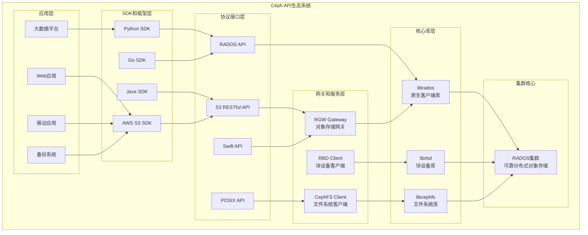
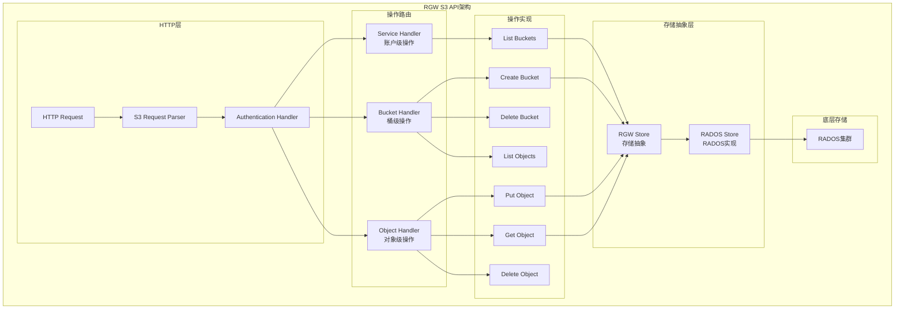
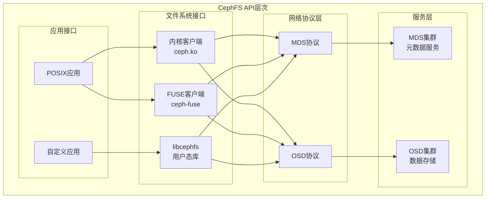

## 概述

本文档是Ceph分布式存储系统源码剖析系列的最终篇，重点介绍Ceph对外提供的各种API接口、使用方法以及在实际项目中的最佳实践。通过深入分析源码中的API设计和实现，帮助开发者更好地理解和使用Ceph存储系统。

## 1. Ceph对外API架构概览

### 1.1 API层次架构图



## 2. LibRADOS - 原生客户端API

### 2.1 LibRADOS核心接口

```cpp
/**
 * LibRADOS核心API - 提供对RADOS集群的原生访问
 * 文件: src/librados/librados_cxx.cc
 * 
 * LibRADOS是Ceph的核心客户端库，提供：
 * 1. 集群连接和认证
 * 2. 存储池操作
 * 3. 对象CRUD操作
 * 4. 异步操作支持
 * 5. 集群管理功能
 */

/**
 * Rados类 - 集群连接和管理的主入口
 */
class Rados {
public:
    // ===================== 初始化和连接 =====================
    
    /**
     * 初始化Rados客户端
     * @param id 客户端ID，通常是"admin"
     * @return 0成功，负数为错误码
     * 
     * 示例：
     * librados::Rados cluster;
     * int ret = cluster.init("admin");
     * if (ret < 0) {
     *     std::cerr << "Failed to initialize cluster: " << ret << std::endl;
     *     return ret;
     * }
     */
    int init(const char * const id);
    
    /**
     * 连接到Ceph集群
     * @return 0成功，负数为错误码
     * 
     * 连接过程包括：
     * 1. 读取配置文件(/etc/ceph/ceph.conf)
     * 2. 连接到Monitor节点
     * 3. 获取集群映射信息
     * 4. 建立与OSD的连接
     */
    int connect();
    
    /**
     * 断开集群连接并清理资源
     */
    void shutdown();
    
    // ===================== 存储池操作 =====================
    
    /**
     * 创建存储池
     * @param name 存储池名称
     * @param auid 用户ID（可选）
     * @return 0成功，负数为错误码
     */
    int pool_create(const char *name, uint64_t auid = 0);
    
    /**
     * 删除存储池
     * @param name 存储池名称
     * @return 0成功，负数为错误码
     */
    int pool_delete(const char *name);
    
    /**
     * 列出所有存储池
     * @param pools 输出存储池列表
     * @return 0成功，负数为错误码
     */
    int pool_list(std::list<std::string>& pools);
    
    /**
     * 创建IO上下文
     * @param pool_name 存储池名称
     * @param ioctx 输出IO上下文
     * @return 0成功，负数为错误码
     */
    int ioctx_create(const char *pool_name, IoCtx& ioctx);

private:
    RadosClient *client;                // 客户端实现
};

/**
 * IoCtx类 - 存储池IO操作上下文
 */
class IoCtx {
public:
    // ===================== 基本对象操作 =====================
    
    /**
     * 写入对象（覆盖）
     * @param oid 对象ID
     * @param bl 要写入的数据
     * @param len 数据长度
     * @param off 写入偏移量
     * @return 0成功，负数为错误码
     * 
     * 示例：
     * bufferlist bl;
     * bl.append("Hello, Ceph!");
     * int ret = ioctx.write_full("my_object", bl);
     */
    int write(const std::string& oid, bufferlist& bl, size_t len, uint64_t off);
    int write_full(const std::string& oid, bufferlist& bl);
    
    /**
     * 读取对象
     * @param oid 对象ID  
     * @param bl 输出数据缓冲
     * @param len 读取长度
     * @param off 读取偏移量
     * @return 实际读取字节数，负数为错误码
     */
    int read(const std::string& oid, bufferlist& bl, size_t len, uint64_t off);
    
    /**
     * 删除对象
     * @param oid 对象ID
     * @return 0成功，负数为错误码
     */
    int remove(const std::string& oid);
    
    /**
     * 获取对象状态
     * @param oid 对象ID
     * @param psize 输出对象大小
     * @param pmtime 输出修改时间
     * @return 0成功，负数为错误码
     */
    int stat(const std::string& oid, uint64_t *psize, time_t *pmtime);

    // ===================== 异步操作 =====================
    
    /**
     * 异步写入对象
     * @param oid 对象ID
     * @param completion 完成回调
     * @param bl 要写入的数据
     * @param len 数据长度
     * @param off 写入偏移量
     * @return 0成功提交，负数为错误码
     */
    int aio_write(const std::string& oid, AioCompletion *c, 
                 const bufferlist& bl, size_t len, uint64_t off);
    
    /**
     * 异步读取对象
     * @param oid 对象ID
     * @param completion 完成回调  
     * @param bl 输出数据缓冲
     * @param len 读取长度
     * @param off 读取偏移量
     * @return 0成功提交，负数为错误码
     */
    int aio_read(const std::string& oid, AioCompletion *c,
                bufferlist *bl, size_t len, uint64_t off);

    // ===================== 扩展属性操作 =====================
    
    /**
     * 设置对象扩展属性
     * @param oid 对象ID
     * @param name 属性名
     * @param bl 属性值
     * @return 0成功，负数为错误码
     */
    int setxattr(const std::string& oid, const char *name, bufferlist& bl);
    
    /**
     * 获取对象扩展属性
     * @param oid 对象ID
     * @param name 属性名
     * @param bl 输出属性值
     * @return 属性值长度，负数为错误码
     */
    int getxattr(const std::string& oid, const char *name, bufferlist& bl);
    
    /**
     * 列出对象所有扩展属性
     * @param oid 对象ID
     * @param attrset 输出属性集合
     * @return 0成功，负数为错误码
     */
    int getxattrs(const std::string& oid, std::map<std::string, bufferlist>& attrset);

    // ===================== 对象列举操作 =====================
    
    /**
     * 开始对象列举
     * @param ctx 输出列举上下文
     * @return 0成功，负数为错误码
     */
    int objects_list_open(ObjectCursor& ctx);
    
    /**
     * 列举下一批对象
     * @param ctx 列举上下文
     * @param result 输出对象列表
     * @param finished 输出是否结束标志
     * @return 0成功，负数为错误码
     */
    int objects_list_next(ObjectCursor ctx, std::vector<ObjectItem> *result, bool *finished);

private:
    IoCtxImpl *io_ctx_impl;             // IO上下文实现
};

/**
 * AioCompletion类 - 异步操作完成回调
 */
class AioCompletion {
public:
    /**
     * 创建异步完成对象
     * @param cb_arg 回调参数
     * @param cb_complete 完成回调函数
     * @param cb_safe 安全回调函数（可选）
     * @return 异步完成对象
     */
    static AioCompletion *create(void *cb_arg, 
                                callback_t cb_complete, 
                                callback_t cb_safe = nullptr);
    
    /**
     * 等待操作完成
     */
    void wait_for_complete();
    
    /**
     * 等待操作安全完成（数据持久化）
     */
    void wait_for_safe();
    
    /**
     * 获取操作返回值
     * @return 操作结果
     */
    int get_return_value();
    
    /**
     * 释放完成对象
     */
    void release();

private:
    AioCompletionImpl *pc;              // 完成实现
};
```

### 2.2 LibRADOS使用示例

```cpp
/**
 * LibRADOS完整使用示例
 * 演示连接集群、创建存储池、对象操作等功能
 */

#include <rados/librados.hpp>
#include <iostream>
#include <string>

class RadosExample {
private:
    librados::Rados cluster;            // 集群连接
    librados::IoCtx io_ctx;             // IO上下文
    
public:
    /**
     * 初始化连接到Ceph集群
     * @param pool_name 存储池名称
     * @return 0成功，负数为错误码
     */
    int initialize(const std::string& pool_name) {
        int ret = 0;
        
        // 1. 初始化客户端
        ret = cluster.init("admin");    // 使用admin用户
        if (ret < 0) {
            std::cerr << "Failed to initialize cluster: " << strerror(-ret) << std::endl;
            return ret;
        }
        
        // 2. 读取配置文件
        ret = cluster.conf_read_file("/etc/ceph/ceph.conf");
        if (ret < 0) {
            std::cerr << "Failed to read config file: " << strerror(-ret) << std::endl;
            return ret;
        }
        
        // 3. 连接到集群
        ret = cluster.connect();
        if (ret < 0) {
            std::cerr << "Failed to connect to cluster: " << strerror(-ret) << std::endl;
            return ret;
        }
        
        std::cout << "Connected to Ceph cluster successfully!" << std::endl;
        
        // 4. 创建存储池（如果不存在）
        ret = cluster.pool_create(pool_name.c_str());
        if (ret < 0 && ret != -EEXIST) {
            std::cerr << "Failed to create pool: " << strerror(-ret) << std::endl;
            return ret;
        }
        
        // 5. 创建IO上下文
        ret = cluster.ioctx_create(pool_name.c_str(), io_ctx);
        if (ret < 0) {
            std::cerr << "Failed to create IO context: " << strerror(-ret) << std::endl;
            return ret;
        }
        
        std::cout << "IO context created for pool: " << pool_name << std::endl;
        return 0;
    }
    
    /**
     * 写入对象示例
     * @param object_name 对象名称
     * @param data 要写入的数据
     * @return 0成功，负数为错误码
     */
    int write_object(const std::string& object_name, const std::string& data) {
        // 准备数据缓冲
        librados::bufferlist bl;
        bl.append(data);
        
        // 写入对象（覆盖写入）
        int ret = io_ctx.write_full(object_name, bl);
        if (ret < 0) {
            std::cerr << "Failed to write object " << object_name 
                      << ": " << strerror(-ret) << std::endl;
            return ret;
        }
        
        std::cout << "Object " << object_name << " written successfully, "
                  << data.length() << " bytes" << std::endl;
        return 0;
    }
    
    /**
     * 读取对象示例
     * @param object_name 对象名称
     * @param data 输出读取的数据
     * @return 0成功，负数为错误码
     */
    int read_object(const std::string& object_name, std::string& data) {
        librados::bufferlist bl;
        
        // 读取整个对象
        int ret = io_ctx.read(object_name, bl, 0, 0);  // len=0表示读取全部
        if (ret < 0) {
            std::cerr << "Failed to read object " << object_name 
                      << ": " << strerror(-ret) << std::endl;
            return ret;
        }
        
        // 转换为字符串
        data = bl.to_str();
        
        std::cout << "Object " << object_name << " read successfully, "
                  << ret << " bytes" << std::endl;
        return 0;
    }
    
    /**
     * 异步写入示例
     * @param object_name 对象名称
     * @param data 要写入的数据
     * @return 0成功，负数为错误码
     */
    int async_write_object(const std::string& object_name, const std::string& data) {
        // 创建异步完成回调
        librados::AioCompletion *completion = librados::Rados::aio_create_completion(
            nullptr,  // callback argument
            [](librados::completion_t cb, void *arg) {
                // 完成回调函数
                librados::AioCompletion *comp = (librados::AioCompletion*)cb;
                int ret = comp->get_return_value();
                if (ret == 0) {
                    std::cout << "Async write completed successfully" << std::endl;
                } else {
                    std::cerr << "Async write failed: " << strerror(-ret) << std::endl;
                }
                comp->release();  // 释放资源
            },
            nullptr   // safe callback (可选)
        );
        
        // 准备数据
        librados::bufferlist bl;
        bl.append(data);
        
        // 提交异步写入
        int ret = io_ctx.aio_write_full(object_name, completion, bl);
        if (ret < 0) {
            std::cerr << "Failed to submit async write: " << strerror(-ret) << std::endl;
            completion->release();
            return ret;
        }
        
        std::cout << "Async write submitted for object: " << object_name << std::endl;
        return 0;
    }
    
    /**
     * 对象属性操作示例
     * @param object_name 对象名称
     * @return 0成功，负数为错误码
     */
    int manage_object_attrs(const std::string& object_name) {
        // 设置扩展属性
        librados::bufferlist attr_bl;
        attr_bl.append("example_value");
        
        int ret = io_ctx.setxattr(object_name, "user.example_attr", attr_bl);
        if (ret < 0) {
            std::cerr << "Failed to set xattr: " << strerror(-ret) << std::endl;
            return ret;
        }
        
        std::cout << "Set extended attribute for " << object_name << std::endl;
        
        // 获取扩展属性
        librados::bufferlist read_attr_bl;
        ret = io_ctx.getxattr(object_name, "user.example_attr", read_attr_bl);
        if (ret < 0) {
            std::cerr << "Failed to get xattr: " << strerror(-ret) << std::endl;
            return ret;
        }
        
        std::cout << "Extended attribute value: " << read_attr_bl.to_str() << std::endl;
        
        // 列出所有扩展属性
        std::map<std::string, librados::bufferlist> attr_map;
        ret = io_ctx.getxattrs(object_name, attr_map);
        if (ret < 0) {
            std::cerr << "Failed to list xattrs: " << strerror(-ret) << std::endl;
            return ret;
        }
        
        std::cout << "All extended attributes:" << std::endl;
        for (const auto& pair : attr_map) {
            std::cout << "  " << pair.first << " = " << pair.second.to_str() << std::endl;
        }
        
        return 0;
    }
    
    /**
     * 列举对象示例
     * @return 0成功，负数为错误码
     */
    int list_objects() {
        librados::ObjectCursor cur = io_ctx.object_list_begin();
        librados::ObjectCursor end = io_ctx.object_list_end();
        
        std::cout << "Objects in pool:" << std::endl;
        
        while (cur != end) {
            std::vector<librados::ObjectItem> results;
            int ret = io_ctx.object_list(cur, end, 100, {}, &results, &cur);
            if (ret < 0) {
                std::cerr << "Failed to list objects: " << strerror(-ret) << std::endl;
                return ret;
            }
            
            for (const auto& obj : results) {
                std::cout << "  Object: " << obj.oid 
                         << ", Size: " << obj.size 
                         << ", Modified: " << ctime(&obj.mtime) << std::endl;
            }
        }
        
        return 0;
    }
    
    /**
     * 清理资源
     */
    void cleanup() {
        io_ctx.close();
        cluster.shutdown();
        std::cout << "Connection closed" << std::endl;
    }
};

/**
 * 主函数 - 演示完整的使用流程
 */
int main() {
    RadosExample example;
    
    // 初始化连接
    if (example.initialize("test_pool") != 0) {
        return 1;
    }
    
    // 写入对象
    example.write_object("test_object", "Hello, Ceph World!");
    
    // 读取对象
    std::string data;
    example.read_object("test_object", data);
    std::cout << "Read data: " << data << std::endl;
    
    // 异步写入
    example.async_write_object("async_object", "Async data");
    
    // 管理对象属性
    example.manage_object_attrs("test_object");
    
    // 列举对象
    example.list_objects();
    
    // 清理资源
    example.cleanup();
    
    return 0;
}
```

## 3. S3兼容API - 对象存储接口

### 3.1 RGW S3 API实现架构



### 3.2 S3 API核心实现

```cpp
/**
 * RGW S3 API核心实现
 * 文件: src/rgw/rgw_rest_s3.h:698-764
 * 
 * RGW提供完整的S3兼容API，包括桶操作、对象操作等
 */

/**
 * RGWHandler_REST_Bucket_S3 - S3桶操作处理器
 */
class RGWHandler_REST_Bucket_S3 : public RGWHandler_REST_S3 {
public:
    // ===================== 桶操作检测方法 =====================
    
    /**
     * 检查是否为ACL操作
     * @return true 如果请求包含acl参数
     */
    bool is_acl_op() const {
        return s->info.args.exists("acl");
    }
    
    /**
     * 检查是否为CORS操作
     * @return true 如果请求包含cors参数
     */
    bool is_cors_op() const {
        return s->info.args.exists("cors");
    }
    
    /**
     * 检查是否为生命周期操作
     * @return true 如果请求包含lifecycle参数
     */
    bool is_lc_op() const {
        return s->info.args.exists("lifecycle");
    }
    
    /**
     * 检查是否为标签操作
     * @return true 如果请求包含tagging参数
     */
    bool is_tagging_op() const {
        return s->info.args.exists("tagging");
    }
    
    /**
     * 检查是否为策略操作
     * @return true 如果请求包含policy参数
     */
    bool is_policy_op() const {
        return s->info.args.exists("policy");
    }

    // ===================== HTTP方法处理 =====================
    
    /**
     * 处理GET请求
     * @return 对应的RGWOp操作对象
     */
    RGWOp *op_get() override {
        if (is_acl_op()) {
            return new RGWGetACLs_ObjStore_S3;
        } else if (s->info.args.exists("uploads")) {
            return new RGWListBucketMultiparts_ObjStore_S3;
        } else if (is_cors_op()) {
            return new RGWGetCORS_ObjStore_S3;
        } else if (is_tagging_op()) {
            return new RGWGetBucketTags_ObjStore_S3;
        } else if (is_lc_op()) {
            return new RGWGetLC_ObjStore_S3;
        } else if (is_policy_op()) {
            return new RGWGetBucketPolicy;
        } else {
            return new RGWListBucket_ObjStore_S3;  // 默认列出桶内容
        }
    }
    
    /**
     * 处理PUT请求
     * @return 对应的RGWOp操作对象
     */
    RGWOp *op_put() override {
        if (is_tagging_op()) {
            return new RGWPutBucketTags_ObjStore_S3;
        } else if (is_acl_op()) {
            return new RGWPutACLs_ObjStore_S3;
        } else if (is_cors_op()) {
            return new RGWPutCORS_ObjStore_S3;
        } else if (is_lc_op()) {
            return new RGWPutLC_ObjStore_S3;
        } else if (is_policy_op()) {
            return new RGWPutBucketPolicy;
        } else {
            return new RGWCreateBucket_ObjStore_S3;  // 默认创建桶
        }
    }
    
    /**
     * 处理DELETE请求
     * @return 对应的RGWOp操作对象
     */
    RGWOp *op_delete() override {
        if (is_tagging_op()) {
            return new RGWDeleteBucketTags_ObjStore_S3;
        } else if (is_cors_op()) {
            return new RGWDeleteCORS_ObjStore_S3;
        } else if (is_lc_op()) {
            return new RGWDeleteLC_ObjStore_S3;
        } else if (is_policy_op()) {
            return new RGWDeleteBucketPolicy;
        } else {
            return new RGWDeleteBucket_ObjStore_S3;  // 默认删除桶
        }
    }
};

/**
 * RGWCreateBucket_ObjStore_S3 - S3创建桶操作
 */
class RGWCreateBucket_ObjStore_S3 : public RGWCreateBucket_ObjStore {
public:
    /**
     * 执行创建桶操作
     * @return 操作结果
     */
    int execute() override {
        // 1. 解析请求参数
        parse_location_constraint();
        parse_canned_acl();
        
        // 2. 检查桶名称合法性
        if (!validate_bucket_name(s->bucket_name)) {
            return -EINVAL;
        }
        
        // 3. 检查权限
        if (!verify_bucket_permission(s, RGW_PERM_WRITE)) {
            return -EACCES;
        }
        
        // 4. 调用基类执行创建
        int ret = RGWCreateBucket_ObjStore::execute();
        if (ret < 0) {
            return ret;
        }
        
        // 5. 设置响应头
        if (ret == 0) {
            dump_location_header();
        }
        
        return ret;
    }
    
    /**
     * 发送HTTP响应
     */
    void send_response() override {
        if (op_ret == 0) {
            dump_location_header();
        }
        
        set_req_state_err(s, op_ret);
        dump_errno(s);
        end_header(s, this, "application/xml");
        
        if (op_ret == 0) {
            rgw_flush_formatter_and_reset(s, s->formatter);
        }
    }

private:
    /**
     * 解析位置约束
     */
    void parse_location_constraint() {
        // 解析请求体中的位置约束XML
        RGWXMLDecoder::XMLParser parser;
        if (!parser.init()) {
            return;
        }
        
        char* buf = nullptr;
        int len = 0;
        int ret = rgw_rest_read_all_input(s, &buf, &len);
        if (ret < 0) {
            return;
        }
        
        // 解析XML获取region信息
        if (!parser.parse(buf, len, 1)) {
            free(buf);
            return;
        }
        
        free(buf);
    }
    
    /**
     * 转储位置头信息
     */
    void dump_location_header() {
        std::string location = "/" + s->bucket_name;
        dump_header(s, "Location", location);
    }
};

/**
 * RGWListBucket_ObjStore_S3 - S3列出桶内容操作
 */
class RGWListBucket_ObjStore_S3 : public RGWListBucket_ObjStore {
public:
    /**
     * 执行列出操作
     * @return 操作结果
     */
    int execute() override {
        // 1. 解析查询参数
        parse_list_params();
        
        // 2. 执行列出操作
        int ret = RGWListBucket_ObjStore::execute();
        if (ret < 0) {
            return ret;
        }
        
        return 0;
    }
    
    /**
     * 发送响应
     */
    void send_response() override {
        if (op_ret < 0) {
            set_req_state_err(s, op_ret);
        } else {
            dump_start(s);
        }
        
        dump_errno(s);
        end_header(s, this, "application/xml");
        
        if (op_ret < 0) {
            return;
        }
        
        // 输出XML响应
        s->formatter->open_object_section_in_ns("ListBucketResult", 
                                               XMLNS_AWS_S3);
        
        s->formatter->dump_string("Name", s->bucket_name);
        s->formatter->dump_string("Prefix", prefix);
        s->formatter->dump_string("Marker", marker.name);
        s->formatter->dump_int("MaxKeys", max);
        s->formatter->dump_bool("IsTruncated", is_truncated);
        
        // 输出对象列表
        for (const auto& entry : objs) {
            s->formatter->open_object_section("Contents");
            s->formatter->dump_string("Key", entry.key.name);
            s->formatter->dump_string("LastModified", 
                                    entry.meta.mtime.to_iso_8601());
            s->formatter->dump_string("ETag", entry.meta.etag);
            s->formatter->dump_int("Size", entry.meta.accounted_size);
            s->formatter->dump_string("StorageClass", "STANDARD");
            s->formatter->close_section();
        }
        
        // 输出通用前缀
        for (const auto& prefix : common_prefixes) {
            s->formatter->open_object_section("CommonPrefixes");
            s->formatter->dump_string("Prefix", prefix.first);
            s->formatter->close_section();
        }
        
        s->formatter->close_section();
        rgw_flush_formatter_and_reset(s, s->formatter);
    }

private:
    /**
     * 解析列出参数
     */
    void parse_list_params() {
        // 解析查询参数
        prefix = s->info.args.get("prefix");
        delimiter = s->info.args.get("delimiter");
        marker.name = s->info.args.get("marker");
        
        string max_keys_str = s->info.args.get("max-keys");
        if (!max_keys_str.empty()) {
            max = atoi(max_keys_str.c_str());
            if (max > 1000) {
                max = 1000;  // S3限制
            }
        }
        
        // 解析list-type参数（支持v2 API）
        string list_type = s->info.args.get("list-type");
        if (list_type == "2") {
            // S3 List Objects v2
            fetch_owner = false;
            continuation_token = s->info.args.get("continuation-token");
            start_after = s->info.args.get("start-after");
        }
    }
};
```

### 3.3 S3 API使用示例

```python
"""
S3 API使用示例 - Python版本
使用boto3库访问Ceph RGW的S3兼容API
"""

import boto3
import botocore.config
from botocore.exceptions import ClientError
import json

class CephS3Client:
    def __init__(self, endpoint_url, access_key, secret_key, region='default'):
        """
        初始化S3客户端连接到Ceph RGW
        
        Args:
            endpoint_url: RGW的访问端点
            access_key: S3访问密钥ID
            secret_key: S3秘密访问密钥
            region: 区域名称
        """
        # 配置连接参数
        config = botocore.config.Config(
            region_name=region,
            signature_version='s3v4',  # 使用签名版本4
            s3={'addressing_style': 'path'}  # 使用路径风格
        )
        
        # 创建S3客户端
        self.s3_client = boto3.client(
            's3',
            endpoint_url=endpoint_url,
            aws_access_key_id=access_key,
            aws_secret_access_key=secret_key,
            config=config
        )
        
        # 创建S3资源（高级接口）
        self.s3_resource = boto3.resource(
            's3',
            endpoint_url=endpoint_url,
            aws_access_key_id=access_key,
            aws_secret_access_key=secret_key,
            config=config
        )
    
    def create_bucket(self, bucket_name, location=None):
        """
        创建存储桶
        
        Args:
            bucket_name: 桶名称
            location: 位置约束（可选）
            
        Returns:
            bool: 成功返回True，失败返回False
        """
        try:
            # 配置创建参数
            create_params = {'Bucket': bucket_name}
            
            if location:
                create_params['CreateBucketConfiguration'] = {
                    'LocationConstraint': location
                }
            
            # 创建桶
            response = self.s3_client.create_bucket(**create_params)
            print(f"Bucket '{bucket_name}' created successfully")
            print(f"Location: {response.get('Location', 'N/A')}")
            return True
            
        except ClientError as e:
            error_code = e.response['Error']['Code']
            if error_code == 'BucketAlreadyExists':
                print(f"Bucket '{bucket_name}' already exists")
                return True
            else:
                print(f"Error creating bucket: {e}")
                return False
    
    def list_buckets(self):
        """
        列出所有存储桶
        
        Returns:
            list: 桶信息列表
        """
        try:
            response = self.s3_client.list_buckets()
            buckets = response.get('Buckets', [])
            
            print("Available buckets:")
            for bucket in buckets:
                print(f"  - {bucket['Name']} (Created: {bucket['CreationDate']})")
            
            return buckets
            
        except ClientError as e:
            print(f"Error listing buckets: {e}")
            return []
    
    def put_object(self, bucket_name, object_key, data, metadata=None):
        """
        上传对象
        
        Args:
            bucket_name: 桶名称
            object_key: 对象键
            data: 对象数据（字符串或字节）
            metadata: 用户元数据字典（可选）
            
        Returns:
            bool: 成功返回True，失败返回False
        """
        try:
            # 准备上传参数
            put_params = {
                'Bucket': bucket_name,
                'Key': object_key,
                'Body': data
            }
            
            # 添加用户元数据
            if metadata:
                put_params['Metadata'] = metadata
            
            # 上传对象
            response = self.s3_client.put_object(**put_params)
            
            print(f"Object '{object_key}' uploaded to bucket '{bucket_name}'")
            print(f"ETag: {response.get('ETag', 'N/A')}")
            return True
            
        except ClientError as e:
            print(f"Error uploading object: {e}")
            return False
    
    def get_object(self, bucket_name, object_key):
        """
        下载对象
        
        Args:
            bucket_name: 桶名称
            object_key: 对象键
            
        Returns:
            tuple: (对象内容, 元数据) 或 (None, None)
        """
        try:
            response = self.s3_client.get_object(
                Bucket=bucket_name,
                Key=object_key
            )
            
            # 读取对象内容
            content = response['Body'].read()
            
            # 获取元数据
            metadata = {
                'ContentLength': response.get('ContentLength'),
                'ContentType': response.get('ContentType'),
                'LastModified': response.get('LastModified'),
                'ETag': response.get('ETag'),
                'Metadata': response.get('Metadata', {})
            }
            
            print(f"Object '{object_key}' downloaded from bucket '{bucket_name}'")
            print(f"Size: {metadata['ContentLength']} bytes")
            
            return content, metadata
            
        except ClientError as e:
            if e.response['Error']['Code'] == 'NoSuchKey':
                print(f"Object '{object_key}' not found")
            else:
                print(f"Error downloading object: {e}")
            return None, None
    
    def list_objects(self, bucket_name, prefix='', delimiter='', max_keys=1000):
        """
        列出桶中的对象
        
        Args:
            bucket_name: 桶名称
            prefix: 对象键前缀过滤
            delimiter: 分隔符
            max_keys: 最大返回对象数
            
        Returns:
            dict: 包含对象列表和通用前缀的字典
        """
        try:
            # 构建列出参数
            list_params = {
                'Bucket': bucket_name,
                'MaxKeys': max_keys
            }
            
            if prefix:
                list_params['Prefix'] = prefix
            if delimiter:
                list_params['Delimiter'] = delimiter
            
            # 列出对象
            response = self.s3_client.list_objects_v2(**list_params)
            
            # 解析响应
            objects = response.get('Contents', [])
            common_prefixes = response.get('CommonPrefixes', [])
            
            print(f"Objects in bucket '{bucket_name}':")
            for obj in objects:
                print(f"  - {obj['Key']} ({obj['Size']} bytes, {obj['LastModified']})")
            
            if common_prefixes:
                print("Common prefixes:")
                for cp in common_prefixes:
                    print(f"  - {cp['Prefix']}")
            
            return {
                'objects': objects,
                'common_prefixes': common_prefixes,
                'is_truncated': response.get('IsTruncated', False)
            }
            
        except ClientError as e:
            print(f"Error listing objects: {e}")
            return {'objects': [], 'common_prefixes': [], 'is_truncated': False}
    
    def delete_object(self, bucket_name, object_key):
        """
        删除对象
        
        Args:
            bucket_name: 桶名称
            object_key: 对象键
            
        Returns:
            bool: 成功返回True，失败返回False
        """
        try:
            self.s3_client.delete_object(
                Bucket=bucket_name,
                Key=object_key
            )
            
            print(f"Object '{object_key}' deleted from bucket '{bucket_name}'")
            return True
            
        except ClientError as e:
            print(f"Error deleting object: {e}")
            return False
    
    def put_bucket_policy(self, bucket_name, policy):
        """
        设置桶策略
        
        Args:
            bucket_name: 桶名称
            policy: 策略文档（字典格式）
            
        Returns:
            bool: 成功返回True，失败返回False
        """
        try:
            policy_json = json.dumps(policy)
            
            self.s3_client.put_bucket_policy(
                Bucket=bucket_name,
                Policy=policy_json
            )
            
            print(f"Bucket policy set for '{bucket_name}'")
            return True
            
        except ClientError as e:
            print(f"Error setting bucket policy: {e}")
            return False
    
    def get_bucket_policy(self, bucket_name):
        """
        获取桶策略
        
        Args:
            bucket_name: 桶名称
            
        Returns:
            dict: 策略文档或None
        """
        try:
            response = self.s3_client.get_bucket_policy(Bucket=bucket_name)
            policy = json.loads(response['Policy'])
            
            print(f"Bucket policy for '{bucket_name}':")
            print(json.dumps(policy, indent=2))
            
            return policy
            
        except ClientError as e:
            if e.response['Error']['Code'] == 'NoSuchBucketPolicy':
                print(f"No policy found for bucket '{bucket_name}'")
            else:
                print(f"Error getting bucket policy: {e}")
            return None

def main():
    """
    主函数 - 演示S3 API的完整使用流程
    """
    # 配置连接参数
    endpoint_url = 'http://rgw-endpoint:7480'  # RGW端点
    access_key = 'your-access-key'
    secret_key = 'your-secret-key'
    
    # 创建客户端
    client = CephS3Client(endpoint_url, access_key, secret_key)
    
    # 测试桶名称
    bucket_name = 'test-bucket'
    
    # 1. 创建桶
    print("=== Creating Bucket ===")
    client.create_bucket(bucket_name)
    
    # 2. 列出所有桶
    print("\n=== Listing Buckets ===")
    client.list_buckets()
    
    # 3. 上传对象
    print("\n=== Uploading Objects ===")
    test_data = "Hello, Ceph S3!"
    metadata = {
        'author': 'ceph-example',
        'content-type': 'text/plain'
    }
    client.put_object(bucket_name, 'test-file.txt', test_data, metadata)
    
    # 上传更多测试对象
    for i in range(5):
        client.put_object(bucket_name, f'files/test-{i}.txt', f'Content {i}')
    
    # 4. 列出对象
    print("\n=== Listing Objects ===")
    client.list_objects(bucket_name)
    
    print("\n=== Listing Objects with Prefix ===")
    client.list_objects(bucket_name, prefix='files/')
    
    # 5. 下载对象
    print("\n=== Downloading Object ===")
    content, metadata = client.get_object(bucket_name, 'test-file.txt')
    if content:
        print(f"Downloaded content: {content.decode()}")
        print(f"Metadata: {metadata}")
    
    # 6. 设置桶策略
    print("\n=== Setting Bucket Policy ===")
    policy = {
        "Version": "2012-10-17",
        "Statement": [
            {
                "Sid": "AllowPublicRead",
                "Effect": "Allow",
                "Principal": "*",
                "Action": "s3:GetObject",
                "Resource": f"arn:aws:s3:::{bucket_name}/*"
            }
        ]
    }
    client.put_bucket_policy(bucket_name, policy)
    
    # 7. 获取桶策略
    print("\n=== Getting Bucket Policy ===")
    client.get_bucket_policy(bucket_name)
    
    # 8. 清理 - 删除对象
    print("\n=== Cleanup - Deleting Objects ===")
    objects_to_delete = ['test-file.txt'] + [f'files/test-{i}.txt' for i in range(5)]
    for obj_key in objects_to_delete:
        client.delete_object(bucket_name, obj_key)
    
    print("\nS3 API demonstration completed!")

if __name__ == '__main__':
    main()
```

## 4. CephFS文件系统API

### 4.1 CephFS API概览



### 4.2 LibCephFS API使用示例

```c
/**
 * LibCephFS C API使用示例
 * 演示如何使用libcephfs进行文件系统操作
 */

#include <cephfs/libcephfs.h>
#include <stdio.h>
#include <stdlib.h>
#include <string.h>
#include <fcntl.h>
#include <sys/stat.h>
#include <errno.h>

/**
 * CephFS操作示例类
 */
typedef struct {
    struct ceph_mount_info *cmount;     // CephFS挂载句柄
} cephfs_example_t;

/**
 * 初始化CephFS连接
 * @param example 示例结构体
 * @param user_id 用户ID（如 "admin"）
 * @return 0成功，负数为错误码
 */
int cephfs_init(cephfs_example_t *example, const char *user_id) {
    int ret;
    
    // 1. 创建CephFS句柄
    ret = ceph_create(&example->cmount, user_id);
    if (ret) {
        fprintf(stderr, "Failed to create ceph mount: %s\n", strerror(-ret));
        return ret;
    }
    
    // 2. 读取配置文件
    ret = ceph_conf_read_file(example->cmount, "/etc/ceph/ceph.conf");
    if (ret) {
        fprintf(stderr, "Failed to read config file: %s\n", strerror(-ret));
        ceph_shutdown(example->cmount);
        return ret;
    }
    
    // 3. 挂载文件系统
    ret = ceph_mount(example->cmount, "/");  // 挂载到根目录
    if (ret) {
        fprintf(stderr, "Failed to mount cephfs: %s\n", strerror(-ret));
        ceph_shutdown(example->cmount);
        return ret;
    }
    
    printf("CephFS mounted successfully\n");
    return 0;
}

/**
 * 文件操作示例
 * @param example 示例结构体
 * @param filename 文件名
 * @param content 要写入的内容
 * @return 0成功，负数为错误码
 */
int cephfs_file_operations(cephfs_example_t *example, 
                          const char *filename, 
                          const char *content) {
    int ret;
    int fd;
    char buffer[1024];
    struct ceph_statx stx;
    
    printf("=== File Operations Example ===\n");
    
    // 1. 创建并写入文件
    printf("Creating file: %s\n", filename);
    fd = ceph_open(example->cmount, filename, O_CREAT | O_WRONLY | O_TRUNC, 0644);
    if (fd < 0) {
        fprintf(stderr, "Failed to create file %s: %s\n", 
                filename, strerror(-fd));
        return fd;
    }
    
    // 写入内容
    ret = ceph_write(example->cmount, fd, content, strlen(content), 0);
    if (ret < 0) {
        fprintf(stderr, "Failed to write to file: %s\n", strerror(-ret));
        ceph_close(example->cmount, fd);
        return ret;
    }
    
    printf("Wrote %d bytes to file\n", ret);
    ceph_close(example->cmount, fd);
    
    // 2. 读取文件
    printf("Reading file: %s\n", filename);
    fd = ceph_open(example->cmount, filename, O_RDONLY, 0);
    if (fd < 0) {
        fprintf(stderr, "Failed to open file for read: %s\n", strerror(-fd));
        return fd;
    }
    
    memset(buffer, 0, sizeof(buffer));
    ret = ceph_read(example->cmount, fd, buffer, sizeof(buffer) - 1, 0);
    if (ret < 0) {
        fprintf(stderr, "Failed to read file: %s\n", strerror(-ret));
        ceph_close(example->cmount, fd);
        return ret;
    }
    
    printf("Read %d bytes: %s\n", ret, buffer);
    ceph_close(example->cmount, fd);
    
    // 3. 获取文件状态
    printf("Getting file stats: %s\n", filename);
    ret = ceph_statx(example->cmount, filename, &stx, 
                     CEPH_STATX_BASIC_STATS, AT_STATX_SYNC_AS_STAT);
    if (ret) {
        fprintf(stderr, "Failed to stat file: %s\n", strerror(-ret));
        return ret;
    }
    
    printf("File stats:\n");
    printf("  Size: %lu bytes\n", stx.stx_size);
    printf("  Mode: 0%o\n", stx.stx_mode);
    printf("  UID: %u, GID: %u\n", stx.stx_uid, stx.stx_gid);
    printf("  Access time: %lu.%09lu\n", stx.stx_atime.tv_sec, stx.stx_atime.tv_nsec);
    printf("  Modify time: %lu.%09lu\n", stx.stx_mtime.tv_sec, stx.stx_mtime.tv_nsec);
    
    return 0;
}

/**
 * 目录操作示例
 * @param example 示例结构体
 * @param dirname 目录名
 * @return 0成功，负数为错误码
 */
int cephfs_directory_operations(cephfs_example_t *example, const char *dirname) {
    int ret;
    struct ceph_dir_result *dirp;
    struct dirent *entry;
    
    printf("=== Directory Operations Example ===\n");
    
    // 1. 创建目录
    printf("Creating directory: %s\n", dirname);
    ret = ceph_mkdir(example->cmount, dirname, 0755);
    if (ret && ret != -EEXIST) {
        fprintf(stderr, "Failed to create directory %s: %s\n", 
                dirname, strerror(-ret));
        return ret;
    }
    
    // 2. 在目录中创建一些文件
    char filepath[256];
    for (int i = 0; i < 3; i++) {
        snprintf(filepath, sizeof(filepath), "%s/file%d.txt", dirname, i);
        
        int fd = ceph_open(example->cmount, filepath, O_CREAT | O_WRONLY | O_TRUNC, 0644);
        if (fd < 0) {
            fprintf(stderr, "Failed to create %s: %s\n", filepath, strerror(-fd));
            continue;
        }
        
        char content[64];
        snprintf(content, sizeof(content), "Content of file %d", i);
        ceph_write(example->cmount, fd, content, strlen(content), 0);
        ceph_close(example->cmount, fd);
    }
    
    // 3. 列出目录内容
    printf("Listing directory contents: %s\n", dirname);
    ret = ceph_opendir(example->cmount, dirname, &dirp);
    if (ret) {
        fprintf(stderr, "Failed to open directory %s: %s\n", 
                dirname, strerror(-ret));
        return ret;
    }
    
    printf("Directory contents:\n");
    while ((entry = ceph_readdir(example->cmount, dirp)) != NULL) {
        if (strcmp(entry->d_name, ".") == 0 || strcmp(entry->d_name, "..") == 0) {
            continue;
        }
        printf("  %s (type: %d)\n", entry->d_name, entry->d_type);
    }
    
    ceph_closedir(example->cmount, dirp);
    
    return 0;
}

/**
 * 扩展属性操作示例
 * @param example 示例结构体
 * @param filepath 文件路径
 * @return 0成功，负数为错误码
 */
int cephfs_xattr_operations(cephfs_example_t *example, const char *filepath) {
    int ret;
    char value[256];
    char list[1024];
    
    printf("=== Extended Attributes Example ===\n");
    
    // 1. 设置扩展属性
    const char *attr_name = "user.example_attr";
    const char *attr_value = "example_value";
    
    printf("Setting extended attribute: %s = %s\n", attr_name, attr_value);
    ret = ceph_setxattr(example->cmount, filepath, attr_name, 
                       attr_value, strlen(attr_value), 0);
    if (ret) {
        fprintf(stderr, "Failed to set xattr: %s\n", strerror(-ret));
        return ret;
    }
    
    // 2. 获取扩展属性
    printf("Getting extended attribute: %s\n", attr_name);
    ret = ceph_getxattr(example->cmount, filepath, attr_name, 
                       value, sizeof(value) - 1);
    if (ret < 0) {
        fprintf(stderr, "Failed to get xattr: %s\n", strerror(-ret));
        return ret;
    }
    
    value[ret] = '\0';
    printf("Extended attribute value: %s\n", value);
    
    // 3. 列出所有扩展属性
    printf("Listing all extended attributes:\n");
    ret = ceph_listxattr(example->cmount, filepath, list, sizeof(list) - 1);
    if (ret < 0) {
        fprintf(stderr, "Failed to list xattrs: %s\n", strerror(-ret));
        return ret;
    }
    
    // 解析属性列表（以null分隔）
    char *attr = list;
    while (attr < list + ret) {
        printf("  Attribute: %s\n", attr);
        attr += strlen(attr) + 1;
    }
    
    return 0;
}

/**
 * 清理资源
 * @param example 示例结构体
 */
void cephfs_cleanup(cephfs_example_t *example) {
    if (example->cmount) {
        printf("Unmounting CephFS\n");
        ceph_unmount(example->cmount);
        ceph_shutdown(example->cmount);
        example->cmount = NULL;
    }
}

/**
 * 主函数 - 演示CephFS API的完整使用
 */
int main(int argc, char **argv) {
    cephfs_example_t example = {0};
    int ret;
    
    const char *user_id = (argc > 1) ? argv[1] : "admin";
    
    printf("CephFS libcephfs API Example\n");
    printf("Using user ID: %s\n", user_id);
    
    // 初始化CephFS连接
    ret = cephfs_init(&example, user_id);
    if (ret) {
        return 1;
    }
    
    // 文件操作示例
    ret = cephfs_file_operations(&example, "/test_file.txt", "Hello, CephFS!");
    if (ret) {
        cephfs_cleanup(&example);
        return 1;
    }
    
    // 目录操作示例
    ret = cephfs_directory_operations(&example, "/test_directory");
    if (ret) {
        cephfs_cleanup(&example);
        return 1;
    }
    
    // 扩展属性操作示例
    ret = cephfs_xattr_operations(&example, "/test_file.txt");
    if (ret) {
        cephfs_cleanup(&example);
        return 1;
    }
    
    printf("\nAll operations completed successfully!\n");
    
    // 清理资源
    cephfs_cleanup(&example);
    
    return 0;
}
```

## 5. 实战经验和最佳实践

### 5.1 性能优化最佳实践

#### 5.1.1 客户端优化

```bash
# LibRADOS客户端优化配置
[client]
# 连接池大小 - 控制与OSD的并发连接数
objecter_inflight_ops = 1024          # 最大飞行中操作数
objecter_inflight_op_bytes = 104857600 # 最大飞行中字节数(100MB)

# 异步I/O优化
rbd_readahead_trigger_requests = 10    # 预读触发请求数
rbd_readahead_max_bytes = 524288       # 最大预读字节数(512KB)
rbd_cache = true                       # 启用RBD缓存
rbd_cache_size = 67108864             # RBD缓存大小(64MB)

# 网络优化
ms_tcp_nodelay = true                  # 禁用TCP Nagle算法
ms_tcp_rcvbuf = 65536                 # TCP接收缓冲区大小
```

#### 5.1.2 应用层优化技巧

```python
"""
高性能Ceph客户端使用技巧
"""

import asyncio
import concurrent.futures
from contextlib import asynccontextmanager

class HighPerformanceCephClient:
    def __init__(self, cluster_handle, pool_name):
        self.cluster = cluster_handle
        self.ioctx = cluster.open_ioctx(pool_name)
        self.executor = concurrent.futures.ThreadPoolExecutor(max_workers=10)
    
    async def batch_write_objects(self, objects_data):
        """
        批量异步写入对象 - 提高并发性能
        
        Args:
            objects_data: [(object_name, data), ...] 对象数据列表
        """
        # 创建异步任务列表
        tasks = []
        
        for obj_name, data in objects_data:
            # 将同步操作包装为异步任务
            task = asyncio.get_event_loop().run_in_executor(
                self.executor,
                self._write_object_sync,
                obj_name, data
            )
            tasks.append(task)
        
        # 并发执行所有写入操作
        results = await asyncio.gather(*tasks, return_exceptions=True)
        
        # 处理结果
        success_count = sum(1 for r in results if not isinstance(r, Exception))
        error_count = len(results) - success_count
        
        print(f"Batch write completed: {success_count} success, {error_count} errors")
        return results
    
    def _write_object_sync(self, obj_name, data):
        """同步写入单个对象"""
        try:
            # 使用librados异步API提高性能
            completion = self.cluster.aio_create_completion()
            self.ioctx.aio_write_full(obj_name, data, completion)
            completion.wait_for_complete()
            
            ret = completion.get_return_value()
            completion.release()
            
            if ret < 0:
                raise Exception(f"Write failed: {ret}")
            
            return obj_name
        except Exception as e:
            print(f"Error writing {obj_name}: {e}")
            raise
    
    def use_object_map_for_large_files(self, obj_name, file_size):
        """
        大文件使用对象映射优化I/O模式
        """
        # 计算最优的条带大小
        stripe_unit = 4 * 1024 * 1024  # 4MB条带单元
        
        # 为大文件启用对象映射
        if file_size > 100 * 1024 * 1024:  # 大于100MB的文件
            # 配置对象映射参数
            self.ioctx.set_omap_header(obj_name, {
                'file_size': str(file_size),
                'stripe_unit': str(stripe_unit),
                'optimization': 'large_file'
            })
    
    @asynccontextmanager
    async def batch_context(self):
        """
        批处理上下文管理器 - 自动优化批量操作
        """
        # 保存原始配置
        original_config = {}
        
        # 设置批处理优化配置
        batch_config = {
            'objecter_inflight_ops': 2048,
            'objecter_inflight_op_bytes': 209715200,  # 200MB
        }
        
        try:
            # 应用批处理配置
            for key, value in batch_config.items():
                self.cluster.conf_set(key, str(value))
            
            yield self
            
        finally:
            # 恢复原始配置
            for key, value in original_config.items():
                self.cluster.conf_set(key, str(value))
```

### 5.2 错误处理和容错

```python
"""
Ceph客户端错误处理最佳实践
"""

import time
import random
import logging
from functools import wraps

class CephErrorHandler:
    # 可重试的错误码
    RETRYABLE_ERRORS = {
        -5,    # -EIO: I/O错误
        -110,  # -ETIMEDOUT: 超时
        -107,  # -ENOTCONN: 未连接
        -11,   # -EAGAIN: 资源临时不可用
    }
    
    @staticmethod
    def retry_with_backoff(max_retries=3, base_delay=1.0, max_delay=60.0, jitter=True):
        """
        指数退避重试装饰器
        
        Args:
            max_retries: 最大重试次数
            base_delay: 基础延迟时间(秒)
            max_delay: 最大延迟时间(秒)
            jitter: 是否添加随机抖动
        """
        def decorator(func):
            @wraps(func)
            def wrapper(*args, **kwargs):
                last_exception = None
                
                for attempt in range(max_retries + 1):
                    try:
                        return func(*args, **kwargs)
                    
                    except Exception as e:
                        last_exception = e
                        
                        # 检查错误码是否可重试
                        if hasattr(e, 'errno') and e.errno not in CephErrorHandler.RETRYABLE_ERRORS:
                            logging.error(f"Non-retryable error in {func.__name__}: {e}")
                            raise
                        
                        if attempt < max_retries:
                            # 计算延迟时间
                            delay = min(base_delay * (2 ** attempt), max_delay)
                            
                            # 添加随机抖动避免惊群效应
                            if jitter:
                                delay *= (0.5 + random.random() * 0.5)
                            
                            logging.warning(f"Attempt {attempt + 1} failed in {func.__name__}: {e}. "
                                          f"Retrying in {delay:.2f}s...")
                            
                            time.sleep(delay)
                        else:
                            logging.error(f"All {max_retries} retries failed in {func.__name__}")
                
                raise last_exception
            
            return wrapper
        return decorator
    
    @staticmethod
    def handle_ceph_exceptions(func):
        """
        Ceph异常处理装饰器
        """
        @wraps(func)
        def wrapper(*args, **kwargs):
            try:
                return func(*args, **kwargs)
            
            except Exception as e:
                error_code = getattr(e, 'errno', 0)
                
                # 常见错误码处理
                if error_code == -2:  # -ENOENT
                    logging.info(f"Object not found in {func.__name__}: {e}")
                    return None
                
                elif error_code == -17:  # -EEXIST
                    logging.info(f"Object already exists in {func.__name__}: {e}")
                    return "already_exists"
                
                elif error_code == -28:  # -ENOSPC
                    logging.critical(f"No space left in {func.__name__}: {e}")
                    # 可以触发清理或告警逻辑
                    raise
                
                elif error_code == -5:   # -EIO
                    logging.error(f"I/O error in {func.__name__}: {e}")
                    # I/O错误通常需要重试
                    raise
                
                else:
                    logging.error(f"Unexpected error in {func.__name__}: {e} (errno: {error_code})")
                    raise
        
        return wrapper

class RobustCephClient:
    """
    具有健壮错误处理的Ceph客户端
    """
    
    def __init__(self, cluster_config):
        self.cluster = None
        self.config = cluster_config
        self._setup_logging()
        self._connect_with_retry()
    
    def _setup_logging(self):
        """设置日志"""
        logging.basicConfig(
            level=logging.INFO,
            format='%(asctime)s - %(levelname)s - %(message)s'
        )
        self.logger = logging.getLogger(__name__)
    
    @CephErrorHandler.retry_with_backoff(max_retries=5, base_delay=2.0)
    def _connect_with_retry(self):
        """重试连接到集群"""
        try:
            import rados
            
            self.cluster = rados.Rados(**self.config)
            self.cluster.connect()
            
            self.logger.info("Successfully connected to Ceph cluster")
            
        except Exception as e:
            self.logger.error(f"Failed to connect to Ceph cluster: {e}")
            raise
    
    @CephErrorHandler.handle_ceph_exceptions
    @CephErrorHandler.retry_with_backoff(max_retries=3)
    def read_object_safe(self, pool_name, obj_name, offset=0, length=0):
        """
        安全读取对象，带重试和错误处理
        """
        try:
            ioctx = self.cluster.open_ioctx(pool_name)
            data = ioctx.read(obj_name, length, offset)
            ioctx.close()
            
            self.logger.info(f"Successfully read object {obj_name} from pool {pool_name}")
            return data
            
        except Exception as e:
            self.logger.error(f"Error reading object {obj_name}: {e}")
            raise
    
    @CephErrorHandler.handle_ceph_exceptions
    @CephErrorHandler.retry_with_backoff(max_retries=3)
    def write_object_safe(self, pool_name, obj_name, data, offset=0):
        """
        安全写入对象，带重试和错误处理
        """
        try:
            ioctx = self.cluster.open_ioctx(pool_name)
            
            # 对于大对象，使用分块写入
            if len(data) > 64 * 1024 * 1024:  # 64MB
                return self._write_large_object(ioctx, obj_name, data)
            else:
                ioctx.write_full(obj_name, data)
                ioctx.close()
            
            self.logger.info(f"Successfully wrote object {obj_name} to pool {pool_name}")
            return True
            
        except Exception as e:
            self.logger.error(f"Error writing object {obj_name}: {e}")
            raise
    
    def _write_large_object(self, ioctx, obj_name, data):
        """
        分块写入大对象
        """
        chunk_size = 8 * 1024 * 1024  # 8MB chunks
        total_size = len(data)
        
        try:
            # 先删除可能存在的对象
            try:
                ioctx.remove_object(obj_name)
            except:
                pass  # 对象不存在，忽略
            
            # 分块写入
            for offset in range(0, total_size, chunk_size):
                chunk = data[offset:offset + chunk_size]
                ioctx.write(obj_name, chunk, offset)
                
                # 记录进度
                progress = min(offset + chunk_size, total_size)
                self.logger.info(f"Large object write progress: {progress}/{total_size} bytes")
            
            ioctx.close()
            self.logger.info(f"Successfully wrote large object {obj_name} ({total_size} bytes)")
            return True
            
        except Exception as e:
            self.logger.error(f"Error writing large object {obj_name}: {e}")
            # 清理部分写入的对象
            try:
                ioctx.remove_object(obj_name)
            except:
                pass
            raise
    
    def health_check(self):
        """
        集群健康检查
        """
        try:
            # 检查集群状态
            stat = self.cluster.get_cluster_stats()
            
            health_status = {
                'connected': True,
                'total_space': stat['total_space'],
                'total_used': stat['total_used'],
                'total_avail': stat['total_avail'],
                'usage_percent': (stat['total_used'] / stat['total_space']) * 100
            }
            
            # 检查可用空间
            if health_status['usage_percent'] > 90:
                self.logger.warning(f"Cluster usage is high: {health_status['usage_percent']:.1f}%")
            
            return health_status
            
        except Exception as e:
            self.logger.error(f"Health check failed: {e}")
            return {'connected': False, 'error': str(e)}
    
    def __enter__(self):
        return self
    
    def __exit__(self, exc_type, exc_val, exc_tb):
        if self.cluster:
            self.cluster.shutdown()
```

### 5.3 监控和告警

```python
"""
Ceph集群监控最佳实践
"""

import time
import json
import requests
from dataclasses import dataclass
from typing import Dict, List, Optional

@dataclass
class CephHealthMetric:
    """Ceph健康指标数据类"""
    timestamp: float
    cluster_id: str
    status: str  # HEALTH_OK, HEALTH_WARN, HEALTH_ERR
    total_space: int
    used_space: int
    available_space: int
    num_osds: int
    num_osds_up: int
    num_osds_in: int
    num_pgs: int
    num_pgs_active_clean: int

class CephMonitoringSystem:
    """
    Ceph集群监控系统
    """
    
    def __init__(self, cluster, alert_webhook=None):
        self.cluster = cluster
        self.alert_webhook = alert_webhook
        self.thresholds = {
            'disk_usage_warning': 80,    # 磁盘使用率警告阈值(%)
            'disk_usage_critical': 90,   # 磁盘使用率危急阈值(%)
            'osd_down_warning': 1,       # OSD宕机警告阈值(个)
            'pg_inactive_warning': 5     # 非活跃PG警告阈值(%)
        }
        
    def collect_metrics(self) -> CephHealthMetric:
        """
        收集集群指标
        """
        try:
            # 获取集群统计
            stats = self.cluster.get_cluster_stats()
            
            # 获取集群状态 (需要通过管理命令获取)
            status_cmd = {"prefix": "status", "format": "json"}
            ret, outbuf, outs = self.cluster.mon_command(json.dumps(status_cmd), b'')
            
            if ret != 0:
                raise Exception(f"Failed to get cluster status: {outs}")
            
            status_info = json.loads(outbuf)
            
            # 解析OSD信息
            osd_info = status_info.get('osdmap', {})
            
            # 解析PG信息  
            pg_info = status_info.get('pgmap', {})
            
            # 构造指标对象
            metric = CephHealthMetric(
                timestamp=time.time(),
                cluster_id=status_info.get('fsid', 'unknown'),
                status=status_info.get('health', {}).get('status', 'unknown'),
                total_space=stats.get('total_space', 0),
                used_space=stats.get('total_used', 0),
                available_space=stats.get('total_avail', 0),
                num_osds=osd_info.get('num_osds', 0),
                num_osds_up=osd_info.get('num_up_osds', 0),
                num_osds_in=osd_info.get('num_in_osds', 0),
                num_pgs=pg_info.get('num_pgs', 0),
                num_pgs_active_clean=pg_info.get('pgs_by_state', {}).get('active+clean', 0)
            )
            
            return metric
            
        except Exception as e:
            print(f"Error collecting metrics: {e}")
            raise
    
    def check_alerts(self, metric: CephHealthMetric) -> List[Dict]:
        """
        检查告警条件
        """
        alerts = []
        
        # 检查磁盘使用率
        if metric.total_space > 0:
            usage_percent = (metric.used_space / metric.total_space) * 100
            
            if usage_percent >= self.thresholds['disk_usage_critical']:
                alerts.append({
                    'level': 'CRITICAL',
                    'type': 'disk_usage',
                    'message': f'Cluster disk usage critical: {usage_percent:.1f}%',
                    'value': usage_percent,
                    'threshold': self.thresholds['disk_usage_critical']
                })
            elif usage_percent >= self.thresholds['disk_usage_warning']:
                alerts.append({
                    'level': 'WARNING', 
                    'type': 'disk_usage',
                    'message': f'Cluster disk usage high: {usage_percent:.1f}%',
                    'value': usage_percent,
                    'threshold': self.thresholds['disk_usage_warning']
                })
        
        # 检查OSD状态
        osd_down_count = metric.num_osds - metric.num_osds_up
        if osd_down_count >= self.thresholds['osd_down_warning']:
            alerts.append({
                'level': 'WARNING' if osd_down_count < 3 else 'CRITICAL',
                'type': 'osd_down',
                'message': f'{osd_down_count} OSDs are down',
                'value': osd_down_count,
                'threshold': self.thresholds['osd_down_warning']
            })
        
        # 检查PG健康状态
        if metric.num_pgs > 0:
            inactive_pgs = metric.num_pgs - metric.num_pgs_active_clean
            inactive_percent = (inactive_pgs / metric.num_pgs) * 100
            
            if inactive_percent >= self.thresholds['pg_inactive_warning']:
                alerts.append({
                    'level': 'WARNING',
                    'type': 'pg_inactive',
                    'message': f'{inactive_percent:.1f}% PGs are not active+clean',
                    'value': inactive_percent,
                    'threshold': self.thresholds['pg_inactive_warning']
                })
        
        # 检查整体健康状态
        if metric.status == 'HEALTH_ERR':
            alerts.append({
                'level': 'CRITICAL',
                'type': 'cluster_health',
                'message': 'Cluster health status is ERROR',
                'value': metric.status,
                'threshold': 'HEALTH_OK'
            })
        elif metric.status == 'HEALTH_WARN':
            alerts.append({
                'level': 'WARNING',
                'type': 'cluster_health', 
                'message': 'Cluster health status is WARNING',
                'value': metric.status,
                'threshold': 'HEALTH_OK'
            })
        
        return alerts
    
    def send_alerts(self, alerts: List[Dict], metric: CephHealthMetric):
        """
        发送告警通知
        """
        if not alerts or not self.alert_webhook:
            return
        
        for alert in alerts:
            payload = {
                'timestamp': metric.timestamp,
                'cluster_id': metric.cluster_id,
                'alert_level': alert['level'],
                'alert_type': alert['type'],
                'message': alert['message'],
                'current_value': alert['value'],
                'threshold': alert['threshold'],
                'cluster_status': metric.status
            }
            
            try:
                response = requests.post(
                    self.alert_webhook,
                    json=payload,
                    timeout=10,
                    headers={'Content-Type': 'application/json'}
                )
                response.raise_for_status()
                
                print(f"Alert sent: {alert['message']}")
                
            except Exception as e:
                print(f"Failed to send alert: {e}")
    
    def monitoring_loop(self, interval=60):
        """
        持续监控循环
        
        Args:
            interval: 监控间隔(秒)
        """
        print(f"Starting Ceph monitoring loop with {interval}s interval...")
        
        while True:
            try:
                # 收集指标
                metric = self.collect_metrics()
                
                # 输出基本信息
                usage_percent = (metric.used_space / metric.total_space) * 100 if metric.total_space > 0 else 0
                
                print(f"[{time.strftime('%Y-%m-%d %H:%M:%S')}] "
                      f"Status: {metric.status}, "
                      f"Usage: {usage_percent:.1f}%, "
                      f"OSDs: {metric.num_osds_up}/{metric.num_osds}, "
                      f"PGs: {metric.num_pgs_active_clean}/{metric.num_pgs} active+clean")
                
                # 检查告警
                alerts = self.check_alerts(metric)
                
                # 发送告警
                if alerts:
                    print(f"Found {len(alerts)} alerts:")
                    for alert in alerts:
                        print(f"  [{alert['level']}] {alert['message']}")
                    
                    self.send_alerts(alerts, metric)
                
            except Exception as e:
                print(f"Error in monitoring loop: {e}")
            
            time.sleep(interval)

# 使用示例
def setup_monitoring():
    """
    设置集群监控
    """
    import rados
    
    # 创建集群连接
    cluster = rados.Rados(conffile='/etc/ceph/ceph.conf')
    cluster.connect()
    
    # 创建监控系统
    monitoring = CephMonitoringSystem(
        cluster=cluster,
        alert_webhook='https://your-webhook-url.com/alerts'  # 可选告警Webhook
    )
    
    # 自定义告警阈值
    monitoring.thresholds.update({
        'disk_usage_warning': 75,
        'disk_usage_critical': 85,
        'osd_down_warning': 2
    })
    
    # 开始监控(每30秒检查一次)
    monitoring.monitoring_loop(interval=30)

if __name__ == '__main__':
    setup_monitoring()
```

## 总结

本文档详细介绍了Ceph分布式存储系统对外提供的各种API接口和最佳实践，包括：

### 核心API体系

1. **LibRADOS原生API**：提供对RADOS集群的底层访问能力，支持对象CRUD、异步操作、扩展属性等功能
2. **S3兼容API**：通过RGW提供完整的Amazon S3兼容接口，支持桶管理、对象操作、权限控制等
3. **CephFS文件系统API**：通过libcephfs提供POSIX兼容的文件系统操作接口
4. **Swift兼容API**：提供OpenStack Swift兼容的对象存储接口

### 实战经验总结

1. **性能优化**：
   - 合理配置客户端参数（连接池、缓存、预读等）
   - 使用异步操作和批量处理提高并发性能
   - 针对不同工作负载选择最适合的API和配置

2. **错误处理**：
   - 实现指数退避重试机制
   - 区分可重试和不可重试的错误类型
   - 建立完善的日志和监控体系

3. **监控告警**：
   - 持续监控集群健康状态和性能指标
   - 设置合理的告警阈值和通知机制
   - 建立自动化的故障处理流程

### 架构设计原则

Ceph的API设计体现了优秀分布式系统的设计原则：

1. **分层架构**：从底层RADOS到上层协议接口，层次清晰，职责明确
2. **协议兼容**：支持多种标准协议，降低用户迁移成本
3. **异步并发**：提供丰富的异步操作支持，满足高性能需求
4. **容错设计**：内置重试、超时、降级等容错机制
5. **可扩展性**：支持水平扩展和热升级

通过深入理解Ceph的API设计和实现原理，开发者可以更好地利用Ceph构建高性能、高可靠的存储应用，充分发挥分布式存储的优势。

---

*这是Ceph分布式存储系统源码剖析系列的完结篇。通过整个系列的学习，相信读者已经对Ceph的架构设计、核心模块实现和API使用有了深入的理解，能够在实际项目中有效地使用和优化Ceph存储系统。*
