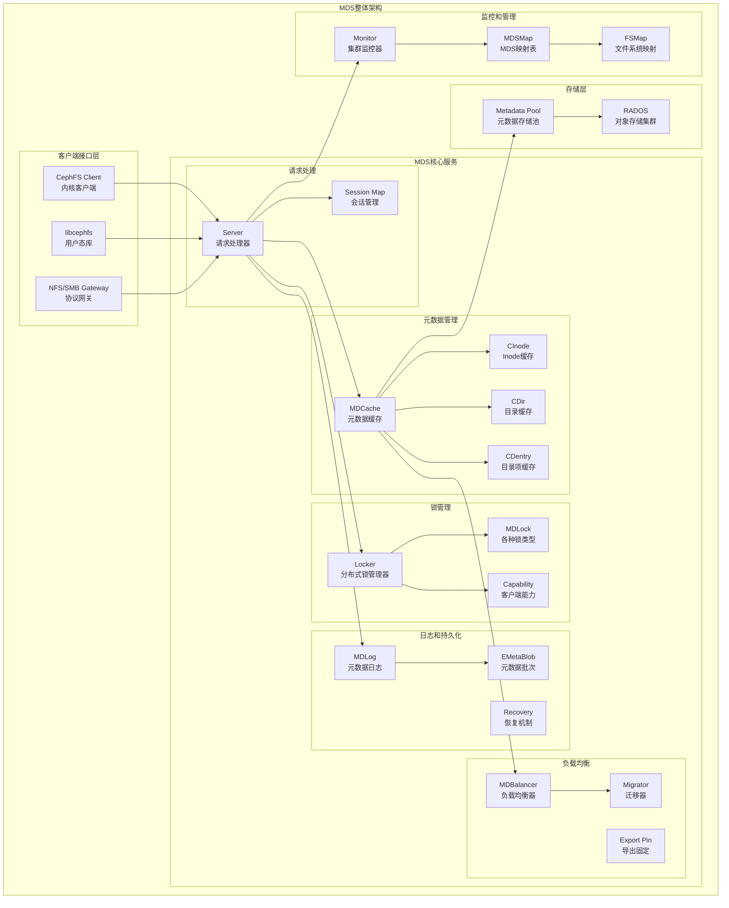
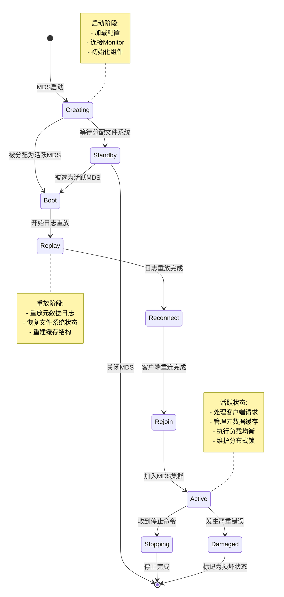
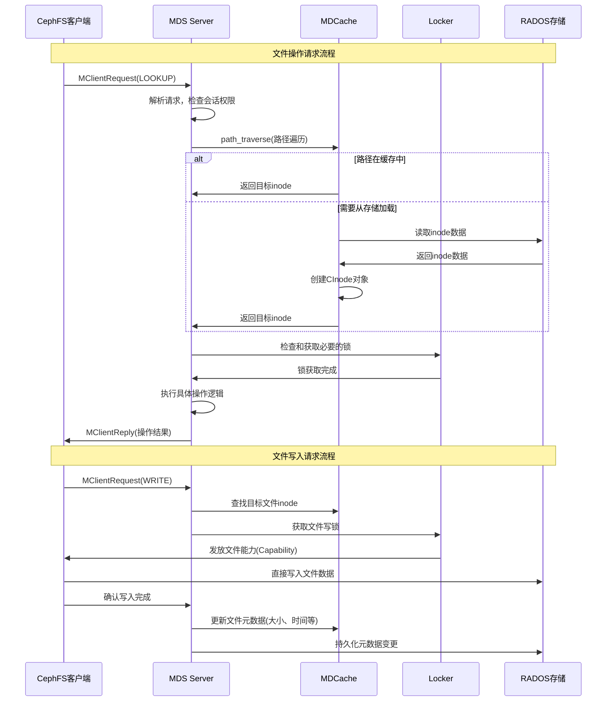
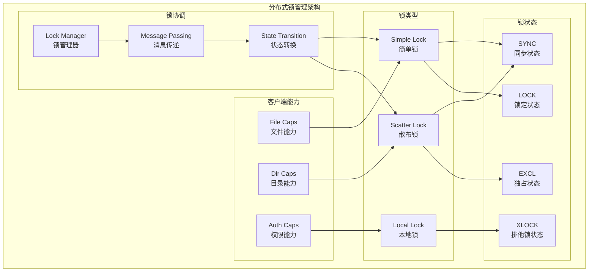
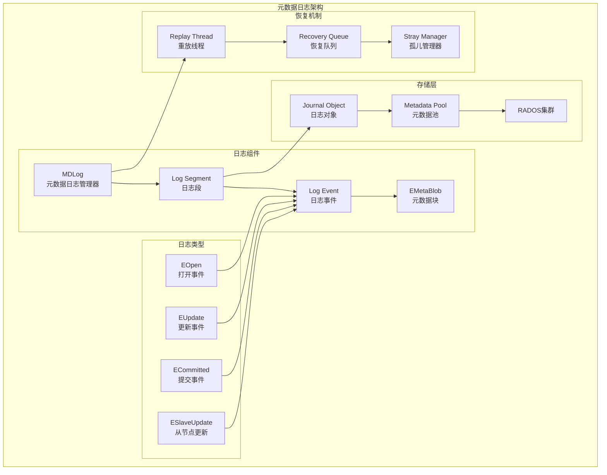
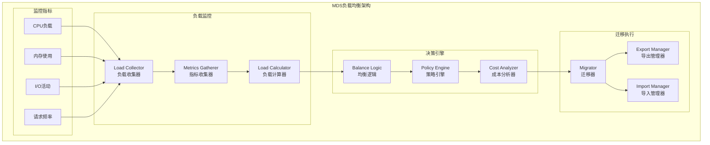

# Ceph分布式存储系统源码剖析 - MDS模块详解

## 概述

Metadata Server（MDS）是CephFS分布式文件系统的元数据服务器，负责管理文件系统的名称空间、目录树结构、文件元数据和访问权限。MDS采用智能缓存机制和分布式锁系统，为客户端提供POSIX兼容的文件系统语义，同时支持多活MDS配置以实现高性能和高可用。

## 1. MDS整体架构

### 1.1 MDS架构图



### 1.2 MDS状态机



## 2. 核心数据结构详解

### 2.1 MDCache - 元数据缓存管理器

```cpp
/**
 * MDCache类 - 元数据缓存管理的核心实现
 * 文件: src/mds/MDCache.h:147-1630
 * 
 * MDCache是MDS的核心组件，负责：
 * 1. 管理内存中的元数据缓存（inode、dentry、dir）
 * 2. 处理元数据的加载、存储和淘汰
 * 3. 维护目录树结构和权限层次
 * 4. 协调多MDS间的元数据分布和迁移
 * 5. 实现分布式锁和一致性保证
 */
class MDCache {
public:
    // ===================== 基本属性 =====================
    
    /**
     * MDS引用和基础组件
     */
    MDSRank *mds;                       // MDS排名实例
    
    // ===================== 核心缓存数据结构 =====================
    
    /**
     * Inode缓存 - 按inode号索引的inode对象映射
     */
    std::unordered_map<inodeno_t, CInode*> inode_map;     // 普通inode映射
    std::map<vinodeno_t, CInode*> snap_inode_map;         // 快照inode映射
    
    /**
     * 特殊inode引用
     */
    CInode *root = nullptr;             // 根目录inode
    CInode *myin = nullptr;             // MDS专用目录(.ceph/mds%d)
    
    /**
     * 基础inode集合 - 不能被淘汰的特殊inode
     */
    std::set<CInode*> base_inodes;      // 基础inode集合
    
    // ===================== 子树管理 =====================
    
    /**
     * 子树映射 - 管理MDS间的权限分布
     * key: 子树根目录
     * value: 该子树的边界目录集合
     */
    std::map<CDir*, std::set<CDir*>> subtrees;
    
    /**
     * 预期的子树重命名映射
     */
    std::map<CInode*, std::list<std::pair<CDir*, CDir*>>> projected_subtree_renames;
    
    // ===================== 请求管理 =====================
    
    /**
     * 活跃请求映射 - 正在处理的元数据请求
     */
    std::unordered_map<metareqid_t, MDRequestRef> active_requests;
    
    // ===================== 性能统计 =====================
    
    /**
     * 性能计数器
     */
    std::unique_ptr<PerfCounters> logger;
    
    // ===================== 文件和对象操作 =====================
    
    /**
     * 文件操作器 - 用于访问RADOS对象
     */
    Filer filer;
    
    /**
     * 客户端租约管理
     */
    static const int client_lease_pools = 3;               // 租约池数量
    std::array<xlist<ClientLease*>, client_lease_pools> client_leases;
    
    // ===================== 核心管理方法 =====================
    
    /**
     * 添加inode到缓存
     * @param in 要添加的inode
     */
    void add_inode(CInode *in) {
        // 检查是否已经存在
        ceph_assert(inode_map.count(in->ino()) == 0);
        
        // 添加到主映射
        inode_map[in->ino()] = in;
        
        // 如果是快照inode，也添加到快照映射
        if (in->last != CEPH_NOSNAP) {
            snap_inode_map[vinodeno_t(in->ino(), in->last)] = in;
        }
        
        // 如果是基础inode，添加到基础集合
        if (in->is_base()) {
            base_inodes.insert(in);
        }
        
        dout(14) << "add_inode " << *in << dendl;
    }
    
    /**
     * 从缓存中移除inode
     * @param in 要移除的inode
     */
    void remove_inode(CInode *in) {
        dout(14) << "remove_inode " << *in << dendl;
        
        // 从主映射中移除
        if (in->last == CEPH_NOSNAP) {
            ceph_assert(inode_map.count(in->ino()) == 1);
            inode_map.erase(in->ino());
        } else {
            // 从快照映射中移除
            ceph_assert(snap_inode_map.count(vinodeno_t(in->ino(), in->last)) == 1);
            snap_inode_map.erase(vinodeno_t(in->ino(), in->last));
        }
        
        // 从基础集合中移除
        if (in->is_base()) {
            ceph_assert(base_inodes.count(in) == 1);
            base_inodes.erase(in);
        }
    }
    
    /**
     * 根据inode号获取inode
     * @param ino inode号
     * @param snapid 快照ID（可选）
     * @return inode指针，未找到返回nullptr
     */
    CInode *get_inode(inodeno_t ino, snapid_t snapid = CEPH_NOSNAP) {
        if (snapid == CEPH_NOSNAP) {
            // 普通inode查找
            auto p = inode_map.find(ino);
            if (p != inode_map.end()) {
                dout(16) << "get_inode " << ino << " -> " << p->second << dendl;
                return p->second;
            }
        } else {
            // 快照inode查找
            auto p = snap_inode_map.find(vinodeno_t(ino, snapid));
            if (p != snap_inode_map.end()) {
                dout(16) << "get_inode " << ino << "." << snapid 
                         << " -> " << p->second << dendl;
                return p->second;
            }
        }
        return nullptr;
    }
    
    // ===================== 路径遍历 =====================
    
    /**
     * 缓存中路径遍历 - 仅查找已缓存的路径
     * @param fp 文件路径
     * @return 目标inode，未找到返回nullptr
     */
    CInode *cache_traverse(const filepath& fp);
    
    /**
     * 完整路径遍历 - 如需要会从磁盘加载
     * @param mdr 元数据请求
     * @param fin 完成回调
     * @param path 文件路径
     * @param flags 遍历标志
     * @param pdnvec 输出路径上的dentry向量
     * @param pin 输出目标inode
     * @return 遍历结果
     */
    int path_traverse(const MDRequestRef& mdr, MDSContext *fin,
                     const filepath& path, int flags,
                     std::vector<CDentry*> *pdnvec = nullptr,
                     CInode **pin = nullptr);

    // ===================== 子树管理方法 =====================
    
    /**
     * 检查目录是否为子树根
     * @param dir 要检查的目录
     * @return true 如果是子树根
     */
    bool is_subtree(CDir *dir) {
        return subtrees.count(dir) > 0;
    }
    
    /**
     * 获取包含指定目录的子树根
     * @param dir 目录
     * @return 子树根目录
     */
    CDir *get_subtree_root(CDir *dir) {
        while (dir) {
            if (is_subtree(dir)) return dir;
            CInode *diri = dir->get_inode();
            if (!diri->get_parent_dn()) break;
            dir = diri->get_parent_dn()->get_dir();
        }
        return nullptr;
    }
    
    /**
     * 创建子树
     * @param dir 子树根目录
     * @param bounds 子树边界集合
     */
    void create_subtree(CDir *dir, std::list<CDir*>& bounds) {
        dout(10) << "create_subtree " << *dir << dendl;
        ceph_assert(subtrees.count(dir) == 0);
        
        std::set<CDir*> b;
        for (auto &p : bounds) {
            b.insert(p);
        }
        subtrees[dir] = b;
        
        dir->mark_subtree_root();
    }

private:
    // ===================== 内部工具方法 =====================
    
    /**
     * 创建系统inode
     * @param ino inode号
     * @param mode 文件模式
     * @return 创建的inode
     */
    CInode *create_system_inode(inodeno_t ino, int mode);
    
    /**
     * 创建根inode
     * @return 根inode
     */
    CInode *create_root_inode();
    
    /**
     * 创建未链接的系统inode
     * @param in inode对象
     * @param ino inode号
     * @param mode 文件模式
     */
    void create_unlinked_system_inode(CInode *in, inodeno_t ino, int mode) const;
    
public:
    // ===================== 构造和初始化 =====================
    
    /**
     * MDCache构造函数
     * @param m MDS排名实例
     * @param recovery_queue 恢复队列
     */
    explicit MDCache(MDSRank *m, PurgeQueue &purge_queue);
    
    /**
     * 初始化MDCache
     */
    void init();
    
    /**
     * 创建空的文件系统层次结构
     * @param gather 收集器用于异步操作
     */
    void create_empty_hierarchy(MDSGather *gather);
};
```

### 2.2 CInode - 缓存的Inode对象

```cpp
/**
 * CInode类 - 缓存中的inode表示
 * 文件: src/mds/CInode.h:1279-1600
 * 
 * CInode代表内存中缓存的文件或目录的inode，包含：
 * 1. 文件元数据（大小、时间、权限等）
 * 2. 目录结构信息（对于目录类型）
 * 3. 分布式锁状态
 * 4. 客户端能力（capabilities）管理
 * 5. 快照和版本信息
 */
class CInode : public MDSCacheObject, public InodeStoreBase {
public:
    // ===================== 基本属性 =====================
    
    /**
     * Inode基本标识
     */
    inodeno_t ino() const { return inode->ino; }    // inode号
    snapid_t first, last;                           // 快照范围
    
    /**
     * 版本和状态
     */
    version_t get_version() const { return inode->version; }
    
    // ===================== 锁管理 =====================
    
    /**
     * 各种类型的分布式锁
     */
    SimpleLock  versionlock;        // 版本锁
    SimpleLock  authlock;           // 权限锁  
    SimpleLock  linklock;           // 链接锁
    SimpleLock  snaplock;           // 快照锁
    SimpleLock  nestlock;           // 嵌套统计锁
    SimpleLock  flocklock;          // 文件锁
    SimpleLock  policylock;         // 策略锁
    
    ScatterLock dirfragtreelock;    // 目录片段树锁
    ScatterLock filelock;           // 文件锁
    ScatterLock xattrlock;          // 扩展属性锁
    
    LocalLockC  inode_lock;         // inode本地锁
    
    // ===================== 客户端能力管理 =====================
    
    /**
     * 客户端能力映射 - 跟踪哪些客户端对此inode有什么权限
     */
    std::map<client_t, Capability> client_caps;    // 客户端能力映射
    std::map<client_t, ClientLease*> client_leases; // 客户端租约
    
    /**
     * 能力状态
     */
    __u32 get_caps_issued() const;                  // 已发布的能力
    __u32 get_caps_wanted() const;                  // 想要的能力
    bool is_any_caps() const { return !client_caps.empty(); }
    bool is_any_nonstale_caps() const;
    
    // ===================== 目录管理（仅目录类型inode）=====================
    
    /**
     * 目录片段映射 - 目录可能被分片存储
     */
    std::map<frag_t, CDir*> dirfrags;               // 片段到目录对象的映射
    
    /**
     * 目录相关方法
     */
    bool is_dir() const { return inode->is_dir(); }
    bool is_file() const { return inode->is_file(); }
    bool is_symlink() const { return inode->is_symlink(); }
    
    /**
     * 获取目录片段
     * @param fg 片段标识
     * @return 目录对象，未找到返回nullptr
     */
    CDir *get_dirfrag(frag_t fg) {
        auto p = dirfrags.find(fg);
        return (p != dirfrags.end()) ? p->second : nullptr;
    }
    
    /**
     * 为目录名选择合适的片段
     * @param dname 目录名
     * @return 片段标识
     */
    frag_t pick_dirfrag(std::string_view dname) {
        if (dirfrags.empty()) return frag_t();
        
        // 计算目录名的哈希值
        int h = ceph_str_hash(inode->dir_layout.dl_dir_hash, dname.data(), dname.length());
        return dirfragtree.get_containing_frag(h);
    }
    
    // ===================== 父子关系 =====================
    
    /**
     * 父目录关系
     */
    CDentry *parent = nullptr;                      // 父目录项（主要链接）
    std::set<CDentry*> remote_parents;              // 远程父目录项（硬链接）
    
    /**
     * 获取父目录项
     * @return 主要父目录项
     */
    CDentry *get_parent_dn() const { return parent; }
    
    /**
     * 获取父目录
     * @return 父目录的CDir对象
     */
    CDir *get_parent_dir() const {
        if (parent) return parent->get_dir();
        return nullptr;
    }

    // ===================== 持久化操作 =====================
    
    /**
     * 从存储中获取inode数据
     * @param fin 完成回调
     */
    void fetch(MDSContext *fin);
    
    /**
     * 存储inode数据到持久化存储
     * @param fin 完成回调
     */
    void store(MDSContext *fin);
    
    /**
     * 标记为脏数据，需要写回存储
     */
    void mark_dirty(int mask) {
        if (!state_test(STATE_DIRTY)) {
            get_mdcache()->dirty_list.push_back(&item_dirty);
        }
        state_set(STATE_DIRTY);
        _mark_dirty(mask);
    }
    
private:
    // ===================== 内部数据 =====================
    
    /**
     * MDCache引用
     */
    MDCache *mdcache;
    
    /**
     * 实际inode数据
     */
    mempool::mds_co::pool_allocator<mempool_inode> alloc;
    std::shared_ptr<mempool_inode> inode;           // 共享的inode数据
    
    /**
     * 目录片段树 - 用于目录分片
     */
    fragtree_t dirfragtree;
    
    /**
     * 快照领域
     */
    SnapRealm *snaprealm = nullptr;                 // 快照领域
    
    /**
     * 符号链接目标（仅符号链接）
     */
    mempool::mds_co::string symlink;
    
    /**
     * 文件数据定位信息
     */
    file_layout_t layout;                           // 文件布局
    
    // ===================== 状态标志 =====================
    
    static const unsigned STATE_DIRTY = 1<<0;      // 需要写回存储
    static const unsigned STATE_NEEDSRECOVER = 1<<1; // 需要恢复
    static const unsigned STATE_RECOVERING = 1<<2;  // 正在恢复
    static const unsigned STATE_PURGING = 1<<3;    // 正在清理
    static const unsigned STATE_BADREMOTEAUTH = 1<<4; // 远程权限错误
    
    /**
     * 获取对象名用于存储
     * @param ino inode号
     * @param frag 片段标识
     * @param suffix 后缀
     * @return 对象名
     */
    static object_t get_object_name(inodeno_t ino, frag_t frag, std::string_view suffix);

public:
    // ===================== 构造和析构 =====================
    
    /**
     * CInode构造函数
     * @param c MDCache引用
     * @param auth 是否为权威副本
     * @param f 起始快照
     * @param l 结束快照
     */
    CInode(MDCache *c, bool auth = true, snapid_t f = 2, snapid_t l = CEPH_NOSNAP);
    
    /**
     * CInode析构函数
     */
    ~CInode() override;
    
    // ===================== 辅助方法 =====================
    
    /**
     * 检查是否为基础inode（不能被淘汰）
     * @return true 如果是基础inode
     */
    bool is_base() const {
        return (ino() == CEPH_INO_ROOT ||
                MDS_INO_IS_MDSDIR(ino()) ||
                ino() == CEPH_INO_GLOBAL_SNAPREALM);
    }
    
    /**
     * 检查是否为根inode
     * @return true 如果是根inode
     */
    bool is_root() const {
        return ino() == CEPH_INO_ROOT;
    }
    
    /**
     * 获取完整路径
     * @param path 输出路径
     */
    void make_path(filepath& path) const {
        if (parent) {
            parent->make_path(path);
        } else if (ino() != CEPH_INO_ROOT) {
            // 孤儿inode，使用特殊路径
            std::ostringstream ss;
            ss << "~" << ino();
            path.push_dentry(ss.str());
        }
    }
    
    /**
     * 获取可读的路径字符串
     * @return 路径字符串
     */
    std::string get_path() const {
        filepath path;
        make_path(path);
        return path.get_path();
    }
};
```

### 2.3 CDir - 缓存的目录对象

```cpp
/**
 * CDir类 - 缓存中的目录片段表示
 * 文件: src/mds/CDir.h
 * 
 * CDir代表目录的一个片段（fragment），大目录可能被分成多个片段。
 * 每个CDir包含一定范围内的目录项（CDentry）。
 */
class CDir : public MDSCacheObject {
public:
    // ===================== 基本属性 =====================
    
    /**
     * 目录基本信息
     */
    CInode *inode;                      // 所属inode
    frag_t frag;                        // 片段标识
    bool is_subtree_root;               // 是否为子树根
    
    /**
     * 权限信息
     */
    mds_authority_t dir_auth;           // 目录权限
    
    // ===================== 目录项管理 =====================
    
    /**
     * 目录项映射 - 目录项名称到CDentry对象的映射
     */
    std::map<std::string, CDentry*> items;          // 目录项映射
    
    /**
     * 查找目录项
     * @param name 目录项名称
     * @param snap 快照ID
     * @return CDentry对象，未找到返回nullptr
     */
    CDentry *lookup(std::string_view name, snapid_t snap = CEPH_NOSNAP) {
        auto p = items.find(std::string(name));
        if (p != items.end()) {
            return p->second;
        }
        return nullptr;
    }
    
    /**
     * 添加主要目录项
     * @param name 目录项名称
     * @param in 指向的inode
     * @param alt_name 备用名称
     * @param first 起始快照
     * @param last 结束快照  
     * @return 创建的CDentry对象
     */
    CDentry *add_primary_dentry(std::string_view name, CInode *in,
                               mempool::mds_co::string alt_name = mempool::mds_co::string(),
                               snapid_t first = 2, snapid_t last = CEPH_NOSNAP) {
        // 创建新的目录项
        CDentry *dn = new CDentry(name, inode->hash_dentry_name(name),
                                 this, first, last);
        
        // 设置链接
        dn->get_linkage()->set_primary(in, alt_name);
        
        // 添加到映射
        items[std::string(name)] = dn;
        
        // 设置父子关系
        if (in->parent == nullptr) {
            in->parent = dn;
        }
        
        return dn;
    }
    
    /**
     * 移除目录项
     * @param dn 要移除的目录项
     */
    void unlink_inode(CDentry *dn) {
        CInode *in = dn->get_linkage()->get_inode();
        if (in) {
            // 清理父子关系
            if (in->parent == dn) {
                in->parent = nullptr;
            }
            in->remove_primary_dentry(dn);
        }
        
        // 从映射中移除
        items.erase(dn->get_name());
        
        // 清理链接
        dn->get_linkage()->clear();
    }

    // ===================== 片段操作 =====================
    
    /**
     * 检查是否需要分片
     * @return true 如果需要分片
     */
    bool should_split() const {
        return (items.size() > (size_t)g_conf()->mds_bal_split_size &&
                g_conf()->mds_bal_fragment_fast_factor > 0);
    }
    
    /**
     * 检查是否需要合并
     * @return true 如果需要合并
     */
    bool should_merge() const {
        return (items.size() < (size_t)g_conf()->mds_bal_merge_size &&
                frag != frag_t());  // 不是根片段
    }
    
    // ===================== 状态管理 =====================
    
    /**
     * 目录状态标志
     */
    static const unsigned STATE_COMPLETE = 1<<0;    // 完整加载
    static const unsigned STATE_FETCHING = 1<<1;    // 正在获取
    static const unsigned STATE_COMMITTING = 1<<2;  // 正在提交
    static const unsigned STATE_DIRTY = 1<<3;       // 需要写回
    
    /**
     * 检查目录状态
     */
    bool is_complete() const { return state_test(STATE_COMPLETE); }
    bool is_dirty() const { return state_test(STATE_DIRTY); }
    
    /**
     * 标记为完整状态
     */
    void mark_complete() {
        state_set(STATE_COMPLETE);
    }
    
    /**
     * 标记为脏状态
     */
    void mark_dirty() {
        if (!state_test(STATE_DIRTY)) {
            state_set(STATE_DIRTY);
            get_mdcache()->dirty_dirfrag_list.push_back(this);
        }
    }

    // ===================== 持久化操作 =====================
    
    /**
     * 从存储获取目录内容
     * @param c 完成回调
     */
    void fetch(MDSContext *c);
    
    /**
     * 存储目录内容到持久化存储
     * @param c 完成回调
     */
    void commit(version_t want, MDSContext *c);

private:
    // ===================== 内部数据 =====================
    
    /**
     * 版本信息
     */
    version_t version;                  // 当前版本
    version_t projected_version;        // 预期版本
    
    /**
     * 统计信息
     */
    fnode_t fnode;                      // 片段节点信息
    
    /**
     * 获取对象名用于存储
     * @return 存储对象名
     */
    object_t get_ondisk_object() {
        return CInode::get_object_name(inode->ino(), frag, "");
    }

public:
    // ===================== 构造和析构 =====================
    
    /**
     * CDir构造函数
     * @param in 所属inode
     * @param f 片段标识
     * @param c MDCache引用
     * @param auth 是否为权威副本
     */
    CDir(CInode *in, frag_t f, MDCache *c, bool auth);
    
    /**
     * CDir析构函数
     */
    ~CDir() override;
    
    // ===================== 辅助方法 =====================
    
    /**
     * 获取完整路径
     * @param path 输出路径
     */
    void get_path(std::string& path) const {
        if (inode->parent) {
            inode->get_parent_dir()->get_path(path);
            path += "/";
            path += inode->parent->get_name();
        }
        if (frag != frag_t()) {
            path += "~";
            path += frag.as_string();  
        }
    }
    
    /**
     * 获取MDCache引用
     * @return MDCache指针
     */
    MDCache *get_mdcache() const {
        return inode->get_mdcache();
    }
};
```

## 3. 客户端请求处理

### 3.1 Server - 请求处理器



### 3.2 请求处理核心代码

```cpp
/**
 * Server类 - MDS请求处理的核心实现
 * 文件: src/mds/Server.h:82-400
 * 
 * Server负责处理来自客户端的各种文件系统操作请求
 */
class Server {
public:
    // ===================== 核心处理方法 =====================
    
    /**
     * 处理客户端请求的入口函数
     * @param mdr 元数据请求包装
     */
    void handle_client_request(const MDRequestRef& mdr) {
        const MClientRequest *req = mdr->client_request;
        
        dout(7) << "handle_client_request " << *req << dendl;
        
        // 检查会话有效性
        if (mdr->session->is_closed()) {
            dout(3) << "handle_client_request from closed session, dropping" << dendl;
            return;
        }
        
        // 根据操作类型分发处理
        switch (req->get_op()) {
            case CEPH_MDS_OP_LOOKUP:
                handle_client_lookup(mdr);
                break;
            case CEPH_MDS_OP_GETATTR:
                handle_client_getattr(mdr);
                break;
            case CEPH_MDS_OP_SETATTR:
                handle_client_setattr(mdr);
                break;
            case CEPH_MDS_OP_MKNOD:
                handle_client_mknod(mdr);
                break;
            case CEPH_MDS_OP_MKDIR:
                handle_client_mkdir(mdr);
                break;
            case CEPH_MDS_OP_RMDIR:
                handle_client_rmdir(mdr);
                break;
            case CEPH_MDS_OP_UNLINK:
                handle_client_unlink(mdr);
                break;
            case CEPH_MDS_OP_RENAME:
                handle_client_rename(mdr);
                break;
            case CEPH_MDS_OP_OPEN:
                handle_client_open(mdr);
                break;
            case CEPH_MDS_OP_READDIR:
                handle_client_readdir(mdr);
                break;
            default:
                reply_client_request(mdr, -ENOSYS);
                break;
        }
    }
    
    /**
     * 处理路径查找请求
     * @param mdr 元数据请求
     */
    void handle_client_lookup(const MDRequestRef& mdr) {
        const MClientRequest *req = mdr->client_request;
        filepath reqpath = req->get_filepath();
        
        dout(10) << "handle_client_lookup " << reqpath << dendl;
        
        // 路径遍历
        CInode *ref_inode = nullptr;
        std::vector<CDentry*> trace;
        
        int r = mdcache->path_traverse(mdr, nullptr, reqpath,
                                      MDS_TRAVERSE_WANT_INODE,
                                      &trace, &ref_inode);
        
        if (r > 0) {
            // 需要等待异步操作完成
            return;
        }
        
        if (r < 0) {
            // 路径不存在或其他错误
            reply_client_request(mdr, r);
            return;
        }
        
        // 检查权限
        if (!check_access(mdr, ref_inode, MAY_EXEC)) {
            reply_client_request(mdr, -EACCES);
            return;
        }
        
        // 构造回复
        auto reply = make_message<MClientReply>(*req, 0);
        
        // 设置inode信息
        reply->head.is_dentry = 1;
        reply->set_trace(trace);
        
        // 可能发放客户端能力
        issue_client_caps(ref_inode, mdr->client_caps, mdr->session, 
                         req->get_wanted_caps());
        
        // 发送回复
        mdr->session->con->send_message2(reply);
        mdr->mark_disposed();
    }
    
    /**
     * 处理创建目录请求
     * @param mdr 元数据请求
     */
    void handle_client_mkdir(const MDRequestRef& mdr) {
        const MClientRequest *req = mdr->client_request;
        filepath reqpath = req->get_filepath();
        
        dout(10) << "handle_client_mkdir " << reqpath << dendl;
        
        // 解析路径，获取父目录和目录名
        std::string dname = reqpath.last_dentry();
        filepath dirpath = reqpath;
        dirpath.pop_dentry();
        
        // 遍历到父目录
        CInode *diri = nullptr;
        std::vector<CDentry*> trace;
        
        int r = mdcache->path_traverse(mdr, nullptr, dirpath,
                                      MDS_TRAVERSE_WANT_INODE |
                                      MDS_TRAVERSE_WANT_AUTH,
                                      &trace, &diri);
        
        if (r > 0) return;  // 等待异步操作
        if (r < 0) {
            reply_client_request(mdr, r);
            return;
        }
        
        // 检查父目录权限
        if (!check_access(mdr, diri, MAY_WRITE)) {
            reply_client_request(mdr, -EACCES);
            return;
        }
        
        // 检查目录是否已存在
        CDir *dir = diri->get_or_open_dirfrag(mdcache, frag_t());
        CDentry *dn = dir->lookup(dname);
        if (dn && !dn->get_linkage()->is_null()) {
            reply_client_request(mdr, -EEXIST);
            return;
        }
        
        // 创建新的inode
        CInode *newi = mdcache->new_inode(mdr);
        newi->inode->mode = req->head.args.mkdir.mode | S_IFDIR;
        newi->inode->uid = mdr->session->get_uid();
        newi->inode->gid = mdr->session->get_gid();
        newi->inode->layout = mdcache->default_file_layout;
        
        // 创建目录项链接
        if (!dn) {
            dn = dir->add_null_dentry(dname);
        }
        dn->push_projected_linkage(newi);
        
        // 记录到日志
        mdr->ls = mdcache->get_current_segment();
        EUpdate *le = new EUpdate(mdcache->mds->mdlog, "mkdir");
        mdcache->predirty_journal_parents(mdr, &le->metablob, newi, dir,
                                         PREDIRTY_PRIMARY | PREDIRTY_DIR, 1);
        le->metablob.add_client_req(req->get_reqid(), req->get_oldest_client_tid());
        
        mdcache->mds->mdlog->start_entry(le);
        mdcache->mds->mdlog->submit_entry(le, new C_MDS_mknod_finish(this, mdr, dn, newi));
    }

private:
    // ===================== 核心组件引用 =====================
    
    MDSRank *mds;                       // MDS排名实例
    MDCache *mdcache;                   // 元数据缓存
    Locker *locker;                     // 锁管理器
    
    // ===================== 辅助方法 =====================
    
    /**
     * 检查访问权限
     * @param mdr 元数据请求
     * @param in 目标inode
     * @param mask 权限掩码
     * @return true 如果有权限
     */
    bool check_access(const MDRequestRef& mdr, CInode *in, unsigned mask) {
        if (mdr->session->is_capable("*", "*")) {
            return true;  // 超级用户
        }
        
        // 检查UNIX权限
        uid_t uid = mdr->session->get_uid();
        gid_t gid = mdr->session->get_gid();
        
        return in->check_mode_perms(uid, gid, mask);
    }
    
    /**
     * 发放客户端能力
     * @param in 目标inode
     * @param issued 要发放的能力
     * @param session 客户端会话
     * @param wanted 客户端请求的能力
     */
    void issue_client_caps(CInode *in, int issued, Session *session, int wanted) {
        if (!in->is_file()) return;
        
        client_t client = session->get_client();
        Capability *cap = in->get_client_cap(client);
        
        if (!cap) {
            cap = in->add_client_cap(client, session);
        }
        
        // 计算实际发放的能力
        int actual_issued = cap->issue(wanted & issued);
        
        dout(7) << "issue_client_caps client." << client
                << " issued " << ccap_string(actual_issued)
                << " on " << *in << dendl;
    }
    
    /**
     * 回复客户端请求
     * @param mdr 元数据请求
     * @param result 结果代码
     */
    void reply_client_request(const MDRequestRef& mdr, int result) {
        const MClientRequest *req = mdr->client_request;
        
        auto reply = make_message<MClientReply>(*req, result);
        
        mdr->session->con->send_message2(reply);
        mdr->mark_disposed();
        
        dout(8) << "reply_client_request " << result 
                << " (" << cpp_strerror(result) << ") " << *req << dendl;
    }

public:
    // ===================== 构造函数 =====================
    
    /**
     * Server构造函数
     * @param m MDS排名实例
     */
    explicit Server(MDSRank *m) : mds(m) {
        mdcache = mds->mdcache;
        locker = mds->locker;
    }
};
```

## 4. 分布式锁管理

### 4.1 Locker架构



### 4.2 锁管理核心实现

```cpp
/**
 * Locker类 - 分布式锁管理器
 * 文件: src/mds/Locker.h
 * 
 * Locker管理MDS集群中的分布式锁，确保元数据的一致性
 */
class Locker {
public:
    // ===================== 锁状态枚举 =====================
    
    /**
     * 基本锁状态
     */
    static const int LOCK_SYNC = 1;         // 同步状态，多个副本可读
    static const int LOCK_LOCK = 2;         // 锁定状态，正在转换
    static const int LOCK_EXCL = 3;         // 独占状态，单个副本可写
    static const int LOCK_XLOCK = 4;        // 排他锁状态，阻止所有访问
    static const int LOCK_XLOCKDONE = 5;    // 排他锁完成状态
    
    // ===================== 客户端能力管理 =====================
    
    /**
     * 文件能力常量定义
     */
    static const unsigned CEPH_CAP_PIN = 1;        // 固定能力
    static const unsigned CEPH_CAP_FILE_SHARED = 2; // 共享读权限
    static const unsigned CEPH_CAP_FILE_EXCL = 4;   // 独占读权限  
    static const unsigned CEPH_CAP_FILE_CACHE = 8;  // 缓存权限
    static const unsigned CEPH_CAP_FILE_RD = 16;    // 读权限
    static const unsigned CEPH_CAP_FILE_WR = 32;    // 写权限
    static const unsigned CEPH_CAP_FILE_BUFFER = 64; // 缓冲权限
    static const unsigned CEPH_CAP_FILE_LAZY = 128; // 懒惰权限
    
    /**
     * 检查inode锁状态
     * @param in 目标inode
     * @param need 需要的锁类型
     * @return true 如果锁可用
     */
    bool can_read(CInode *in, int need) {
        if (in->filelock.get_state() == LOCK_SYNC ||
            in->filelock.get_state() == LOCK_EXCL) {
            return true;
        }
        return false;
    }
    
    bool can_write(CInode *in, int need) {
        if (in->filelock.get_state() == LOCK_EXCL) {
            return true;
        }
        return false;
    }
    
    /**
     * 尝试获取锁
     * @param in 目标inode
     * @param mut 变更操作
     * @param need 需要的锁类型
     * @return true 如果成功获取锁
     */
    bool acquire_locks(CInode *in, MutationRef mut, int need_auth = 0,
                      int need_inode = 0, int need_file = 0, int need_xattr = 0) {
        
        // 检查权限锁
        if (need_auth && !simple_lock_can_read_write(in, &in->authlock)) {
            simple_lock_get_read_write(in, &in->authlock, mut);
            if (in->authlock.is_unstable()) {
                return false;  // 需要等待
            }
        }
        
        // 检查inode锁
        if (need_inode && !simple_lock_can_read_write(in, &in->inode_lock)) {
            simple_lock_get_read_write(in, &in->inode_lock, mut);
            if (in->inode_lock.is_unstable()) {
                return false;
            }
        }
        
        // 检查文件锁
        if (need_file && !scatter_lock_can_read_write(in, &in->filelock)) {
            scatter_lock_get_read_write(in, &in->filelock, mut);
            if (in->filelock.is_unstable()) {
                return false;
            }
        }
        
        return true;  // 所有锁都获取成功
    }
    
    // ===================== 客户端能力发放 =====================
    
    /**
     * 检查可以发放给客户端的能力
     * @param in 目标inode
     * @param client 客户端ID
     * @param wanted 客户端想要的能力
     * @return 可以发放的能力
     */
    int check_inode_max_caps(CInode *in, client_t client, unsigned wanted) {
        unsigned issued = 0;
        
        // 检查各种锁状态决定能力
        if (in->filelock.get_state() == LOCK_SYNC) {
            // 同步状态：可以发放读权限
            issued |= CEPH_CAP_FILE_SHARED | CEPH_CAP_FILE_RD | CEPH_CAP_FILE_CACHE;
        }
        
        if (in->filelock.get_state() == LOCK_EXCL) {
            // 独占状态：可以发放读写权限
            issued |= CEPH_CAP_FILE_EXCL | CEPH_CAP_FILE_RD | CEPH_CAP_FILE_WR |
                     CEPH_CAP_FILE_CACHE | CEPH_CAP_FILE_BUFFER;
        }
        
        // 检查权限锁
        if (in->authlock.get_state() == LOCK_SYNC) {
            // 可以读取权限信息
            issued |= CEPH_CAP_AUTH_SHARED;
        }
        
        if (in->authlock.get_state() == LOCK_EXCL) {
            // 可以修改权限
            issued |= CEPH_CAP_AUTH_EXCL;
        }
        
        return issued & wanted;
    }
    
    /**
     * 实际发放客户端能力
     * @param in 目标inode
     * @param client 客户端ID
     * @param cap 能力对象
     * @param wanted 想要的能力
     * @return 实际发放的能力
     */
    int issue_caps(CInode *in, client_t client, Capability *cap, unsigned wanted) {
        unsigned max_caps = check_inode_max_caps(in, client, wanted);
        unsigned issued = cap->issue(max_caps);
        
        if (issued) {
            dout(7) << "issue_caps client." << client 
                    << " issued " << ccap_string(issued)
                    << " on " << *in << dendl;
            
            // 发送能力消息给客户端
            auto m = make_message<MClientCaps>(CEPH_CAP_OP_GRANT,
                                              in->ino(),
                                              0,
                                              cap->get_cap_id(),
                                              cap->get_seq(),
                                              issued,
                                              wanted,
                                              0);
            
            mds->send_message_client_counted(m, client);
        }
        
        return issued;
    }
    
    // ===================== 锁状态转换 =====================
    
    /**
     * 简单锁状态转换
     * @param in inode对象
     * @param lock 锁对象
     * @param to 目标状态
     */
    void simple_lock_state_change(CInode *in, SimpleLock *lock, int to) {
        int from = lock->get_state();
        
        dout(10) << "simple_lock_state_change " << *lock
                 << " from " << from << " to " << to
                 << " on " << *in << dendl;
        
        // 更新锁状态
        lock->set_state(to);
        
        // 根据状态变化执行相应操作
        switch (to) {
            case LOCK_SYNC:
                // 进入同步状态，可能需要通知其他MDS
                if (in->is_replicated()) {
                    send_lock_message(in, lock, LOCK_AC_SYNC);
                }
                break;
                
            case LOCK_EXCL:
                // 进入独占状态，撤回其他副本的锁
                if (in->is_replicated()) {
                    send_lock_message(in, lock, LOCK_AC_LOCK);
                }
                break;
                
            case LOCK_LOCK:
                // 锁定状态，暂停新的操作
                break;
        }
        
        // 如果有等待的操作，尝试继续处理
        if (lock->is_stable()) {
            process_lock_waiters(in, lock);
        }
    }

private:
    // ===================== 内部组件 =====================
    
    MDSRank *mds;                       // MDS排名实例
    MDCache *mdcache;                   // 元数据缓存
    
    /**
     * 发送锁消息给其他MDS
     * @param in inode对象  
     * @param lock 锁对象
     * @param action 锁操作
     */
    void send_lock_message(CInode *in, MDSCacheObject::Lock *lock, int action) {
        for (const auto& p : in->get_replicas()) {
            mds_rank_t to = p.first;
            
            auto m = make_message<MLock>(lock, action, mds->get_nodeid());
            m->set_object_info(in->get_object_info());
            
            mds->send_message_mds(m, to);
        }
    }
    
    /**
     * 处理等待锁的操作
     * @param in inode对象
     * @param lock 锁对象
     */
    void process_lock_waiters(CInode *in, MDSCacheObject::Lock *lock) {
        auto& waiters = lock->get_waiters();
        
        for (auto it = waiters.begin(); it != waiters.end();) {
            MDSContext *waiter = *it;
            
            // 检查等待的条件是否满足
            if (can_process_waiter(in, lock, waiter)) {
                it = waiters.erase(it);
                mds->queue_waiter(waiter);
            } else {
                ++it;
            }
        }
    }

public:
    // ===================== 构造函数 =====================
    
    /**
     * Locker构造函数
     * @param m MDS排名实例
     * @param c 元数据缓存
     */
    Locker(MDSRank *m, MDCache *c) : mds(m), mdcache(c) {}
};
```

## 5. 元数据日志和恢复

### 5.1 MDLog架构



### 5.2 元数据日志实现

```cpp
/**
 * MDLog类 - 元数据日志管理器
 * 文件: src/mds/MDLog.h
 * 
 * MDLog负责记录所有元数据变更操作，支持崩溃恢复
 */
class MDLog {
public:
    // ===================== 日志段管理 =====================
    
    /**
     * 日志段列表
     */
    std::list<LogSegment*> segments;        // 所有日志段
    std::set<LogSegment*> expiring_segments; // 正在过期的日志段
    std::set<LogSegment*> expired_segments;  // 已过期的日志段
    
    /**
     * 当前活跃日志段
     */
    LogSegment *cur_segment = nullptr;       // 当前写入段
    
    /**
     * 获取当前日志段
     * @return 当前活跃日志段
     */
    LogSegment *get_current_segment() {
        if (!cur_segment) {
            cur_segment = new LogSegment(get_write_pos());
            segments.push_back(cur_segment);
        }
        return cur_segment;
    }
    
    // ===================== 日志写入 =====================
    
    /**
     * 开始新的日志条目
     * @param le 日志事件
     */
    void start_entry(LogEvent *le) {
        ceph_assert(le);
        
        dout(5) << "start_entry " << le->get_type_name() 
                << " seq " << get_event_seq() << dendl;
        
        le->set_seq(get_event_seq());
        le->set_stamp(ceph_clock_now());
        
        // 序列化日志事件
        ceph::buffer::list bl;
        le->encode(bl, mds->mdsmap->get_up_features());
        
        // 获取当前日志段
        LogSegment *ls = get_current_segment();
        ls->events[le->get_seq()] = le;
        
        // 写入存储
        append_to_journal(bl);
        
        // 更新序列号
        event_seq++;
    }
    
    /**
     * 提交日志条目
     * @param le 日志事件
     * @param fin 完成回调
     */
    void submit_entry(LogEvent *le, MDSContext *fin = nullptr) {
        dout(5) << "submit_entry " << le->get_type_name() << dendl;
        
        // 添加到等待列表
        if (fin) {
            le->add_waiter(fin);
        }
        
        // 触发日志写入
        flush();
    }
    
    /**
     * 刷新日志到存储
     */
    void flush() {
        if (unflushed > 0) {
            dout(10) << "flush " << unflushed << " unflushed bytes" << dendl;
            
            // 创建写入操作
            ObjectOperation op;
            op.write(get_write_pos() - unflushed, unflushed_bl);
            
            // 异步写入
            mds->objecter->write_full(get_ino(), op, 
                                     CEPH_NOSNAP, 
                                     new C_MDSFlush(this));
            
            unflushed = 0;
            unflushed_bl.clear();
        }
    }

    // ===================== 日志重放 =====================
    
    /**
     * 重放日志 - 在MDS启动时恢复状态
     */
    void replay() {
        dout(1) << "replay start" << dendl;
        
        // 读取日志头信息
        read_head();
        
        // 按序重放所有事件
        for (auto& seg : segments) {
            for (auto& p : seg->events) {
                LogEvent *le = p.second;
                
                dout(10) << "replaying " << le->get_type_name() 
                         << " seq " << p.first << dendl;
                
                // 执行重放
                le->replay(mds);
                
                // 更新重放位置
                last_replayed_seq = p.first;
            }
        }
        
        dout(1) << "replay end, last_replayed_seq = " << last_replayed_seq << dendl;
        
        // 重放完成，可以接受新请求
        mds->set_want_state(MDSMap::STATE_RECONNECT);
    }

    // ===================== 日志修剪 =====================
    
    /**
     * 修剪旧的日志段
     */
    void trim() {
        dout(10) << "trim checking " << segments.size() << " segments" << dendl;
        
        // 找到可以安全删除的日志段
        while (!segments.empty()) {
            LogSegment *ls = segments.front();
            
            // 检查是否还有引用
            if (!ls->can_expire()) {
                break;
            }
            
            dout(10) << "trimming segment " << ls->offset 
                     << " (" << ls->events.size() << " events)" << dendl;
            
            // 从存储中删除
            ObjectOperation op;
            op.remove();
            
            mds->objecter->operate(ls->get_ino(), op, CEPH_NOSNAP);
            
            // 从内存中删除
            segments.pop_front();
            delete ls;
        }
    }

private:
    // ===================== 内部数据 =====================
    
    MDSRank *mds;                           // MDS实例
    
    /**
     * 日志写入状态
     */
    uint64_t write_pos = 0;                 // 写入位置
    uint64_t event_seq = 1;                 // 事件序列号
    uint64_t last_replayed_seq = 0;         // 最后重放序列号
    
    /**
     * 未刷新数据
     */
    uint32_t unflushed = 0;                 // 未刷新字节数
    ceph::buffer::list unflushed_bl;        // 未刷新数据缓冲
    
    /**
     * 获取日志对象的inode号
     * @return 日志对象inode号
     */
    inodeno_t get_ino() const {
        return MDS_INO_LOG_OFFSET + mds->get_nodeid();
    }
    
    /**
     * 获取当前写入位置
     * @return 写入位置
     */
    uint64_t get_write_pos() const {
        return write_pos;
    }
    
    /**
     * 获取下一个事件序列号
     * @return 事件序列号
     */
    uint64_t get_event_seq() const {
        return event_seq;
    }
    
    /**
     * 追加数据到日志
     * @param bl 要追加的数据
     */
    void append_to_journal(const ceph::buffer::list& bl) {
        unflushed_bl.append(bl);
        unflushed += bl.length();
        write_pos += bl.length();
    }

public:
    // ===================== 构造函数 =====================
    
    /**
     * MDLog构造函数
     * @param m MDS实例
     */
    explicit MDLog(MDSRank *m) : mds(m) {}
    
    /**
     * MDLog析构函数
     */
    ~MDLog() {
        // 清理所有日志段
        for (auto ls : segments) {
            delete ls;
        }
        segments.clear();
    }
};
```

## 6. 负载均衡和迁移

### 6.1 负载均衡策略



## 7. 性能优化和监控

### 7.1 MDS性能计数器

```cpp
/**
 * MDS性能监控指标
 * 文件: src/mds/MDCache.h:72-122
 */
enum mds_perf_counters_t {
    l_mdc_first = 3000,
    
    // 目录更新统计
    l_mdc_dir_update,                   // 目录更新次数
    l_mdc_dir_update_receipt,           // 收到的目录更新
    l_mdc_dir_try_discover,             // 尝试发现操作
    l_mdc_dir_send_discover,            // 发送发现请求
    l_mdc_dir_handle_discover,          // 处理发现请求
    
    // 孤儿文件统计  
    l_mdc_num_strays,                   // 当前孤儿文件数
    l_mdc_num_strays_delayed,           // 延迟处理的孤儿文件
    l_mdc_num_strays_enqueuing,         // 正在排队的孤儿文件
    l_mdc_strays_created,               // 已创建的孤儿文件
    l_mdc_strays_enqueued,              // 已排队的孤儿文件
    l_mdc_strays_reintegrated,          // 已重新集成的孤儿文件
    l_mdc_strays_migrated,              // 已迁移的孤儿文件
    
    // 恢复统计
    l_mdc_num_recovering_processing,    // 正在恢复的inode数
    l_mdc_num_recovering_enqueued,      // 等待恢复的inode数  
    l_mdc_num_recovering_prioritized,   // 优先恢复的inode数
    l_mdc_recovery_started,             // 已开始恢复的数量
    l_mdc_recovery_completed,           // 已完成恢复的数量
    
    l_mdc_last,
};
```

### 7.2 MDS调优参数

```bash
# MDS核心配置参数
[mds]
# 缓存管理
mds_cache_memory_limit = 4294967296     # 缓存内存限制(4GB)
mds_cache_reservation = 0.05            # 缓存保留比例  
mds_cache_size = 100000                 # 缓存inode数量限制
mds_cache_mid = 0.7                     # 缓存中点水位

# 日志配置
mds_log_max_events = 1000000            # 日志最大事件数
mds_log_max_segments = 128              # 日志最大段数
mds_log_segment_size = 1073741824       # 日志段大小(1GB)

# 负载均衡
mds_bal_sample_interval = 3.0           # 负载采样间隔
mds_bal_replicate_threshold = 8000      # 复制阈值
mds_bal_unreplicate_threshold = 0       # 取消复制阈值
mds_bal_mode = 0                        # 均衡模式(0=关闭)

# 客户端交互
mds_client_prealloc_inos = 1000         # 客户端预分配inode数
mds_early_reply = true                  # 启用早期回复
mds_default_dir_hash = 2                # 默认目录哈希类型

# 恢复设置
mds_heartbeat_reset_grace = 10          # 心跳重置宽限期
mds_recovery_max_active = 15            # 最大活跃恢复数
mds_recovery_max_mds = 1                # 最大恢复MDS数

# 会话管理
mds_session_timeout = 60                # 会话超时时间
mds_session_autoclose = 300             # 会话自动关闭时间
mds_max_caps_per_client = 1048576       # 每客户端最大能力数
```

## 总结

MDS模块是CephFS分布式文件系统的核心大脑，通过以下关键机制实现高性能、可扩展的元数据服务：

1. **智能缓存管理**：通过MDCache实现高效的内存缓存，减少存储访问延迟
2. **分布式锁协调**：通过Locker确保多MDS环境下的数据一致性
3. **客户端能力管理**：通过Capability机制实现细粒度的权限控制和缓存优化
4. **元数据日志记录**：通过MDLog提供崩溃一致性和快速恢复能力
5. **动态负载均衡**：通过智能迁移算法实现多活MDS的负载分布
6. **POSIX语义支持**：提供完整的POSIX文件系统语义兼容性

MDS的设计体现了现代分布式文件系统的核心理念：通过分层架构、智能缓存、分布式协调和动态适应，为用户提供高性能、高可用的元数据服务。在下一篇文档中，我们将深入分析RGW模块的对象存储网关实现。
