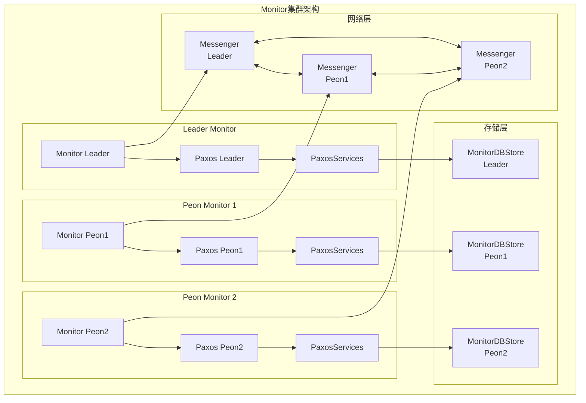
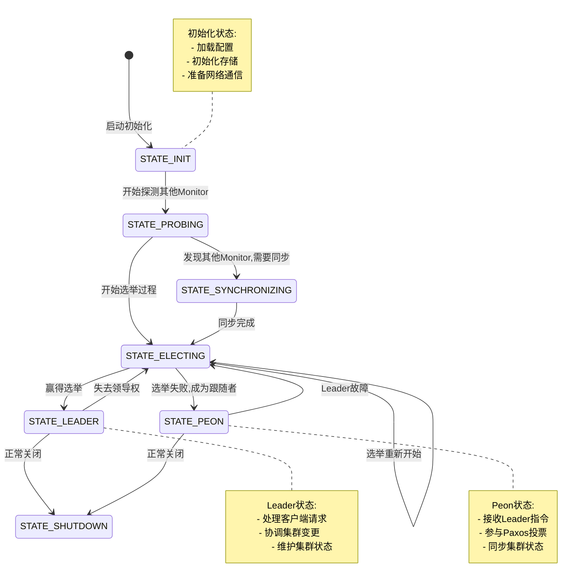
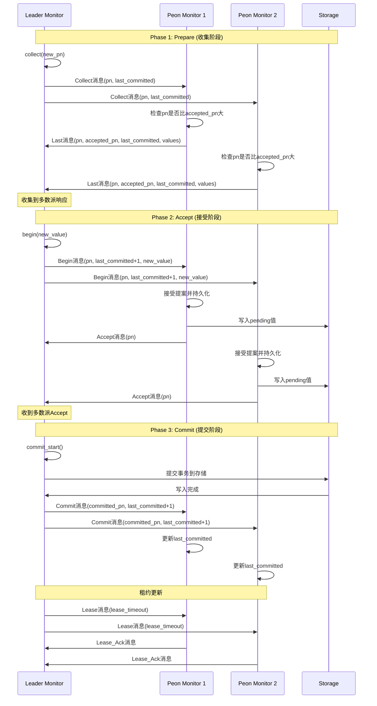
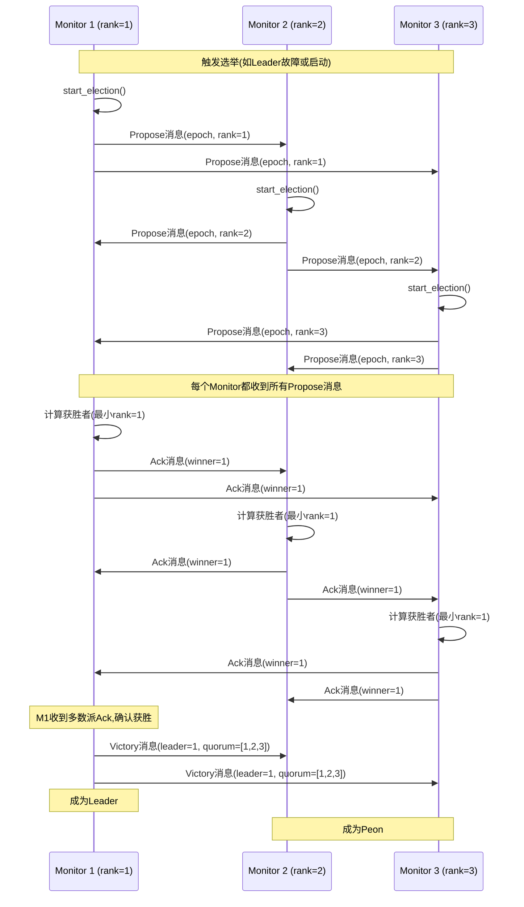
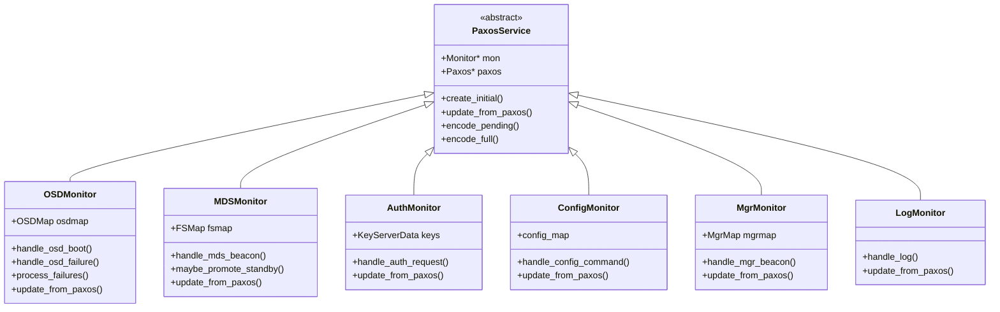
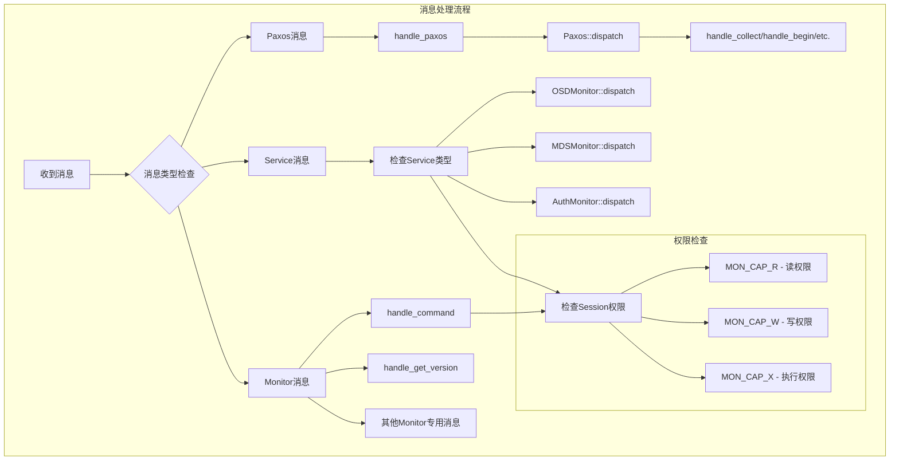
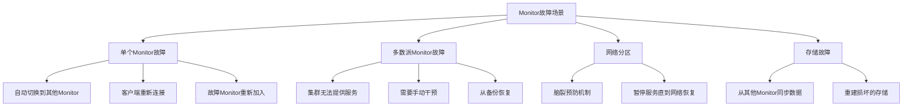

# Ceph分布式存储系统源码剖析 - Monitor模块详解

## 概述

Monitor（MON）是Ceph集群的"大脑"，负责维护集群的完整状态信息和提供一致性保证。Monitor使用Paxos算法确保集群状态的一致性，并为整个RADOS集群提供权威的配置信息。

## 1. Monitor架构概览

### 1.1 Monitor整体架构图



### 1.2 Monitor状态机



## 2. 核心数据结构详解

### 2.1 Monitor主类结构

```cpp
/**
 * Monitor类 - Ceph监控器的核心实现
 * 文件: src/mon/Monitor.h:110-250
 * 
 * Monitor是集群状态管理的核心组件，负责：
 * 1. 维护集群所有组件的状态映射(OSDMap、MDSMap、MonMap等)
 * 2. 通过Paxos算法保证集群状态的一致性和持久化
 * 3. 处理来自OSD、MDS、客户端的各种请求
 * 4. 提供集群配置和认证服务
 */
class Monitor : public Dispatcher,      // 消息分发器接口
                public AuthClient,       // 认证客户端接口
                public AuthServer,       // 认证服务器接口
                public md_config_obs_t { // 配置观察者接口
public:
    // ===================== 基本属性 =====================
    
    /**
     * Monitor基本标识信息
     */
    std::string name;                    // Monitor名称，如 "a", "b", "c"
    int rank;                           // Monitor在集群中的排名/编号
    
    /**
     * 网络通信组件
     */
    Messenger *messenger;               // 主消息传递器，处理集群通信
    ConnectionRef con_self;             // 自我连接引用，用于本地消息
    
    /**
     * 同步和并发控制
     */
    ceph::mutex lock;                   // 主锁，保护Monitor的关键数据结构
    SafeTimer timer;                    // 安全定时器，处理定时任务
    Finisher finisher;                  // 异步操作完成器
    ThreadPool cpu_tp;                  // CPU密集型任务的线程池
    
    // ===================== 集群状态管理 =====================
    
    /**
     * 集群状态标识
     */
    bool has_ever_joined;               // 是否曾经加入过仲裁团
    uuid_d fingerprint;                 // 集群唯一标识指纹
    
    /**
     * 集群映射信息 - Monitor维护的权威状态信息
     */
    MonMap *monmap;                     // Monitor映射表，包含所有Monitor信息
    
    /**
     * 额外的探测节点
     */
    std::set<entity_addrvec_t> extra_probe_peers;  // 额外探测的节点地址
    
    // ===================== 认证和安全 =====================
    
    /**
     * 密钥和认证管理
     */
    KeyRing keyring;                    // 密钥环，存储各种密钥
    KeyServer key_server;               // 密钥服务器，管理集群密钥
    
    /**
     * 认证方法配置
     */
    AuthMethodList auth_cluster_required;    // 集群内认证方法要求
    AuthMethodList auth_service_required;    // 服务认证方法要求
    
    // ===================== 命令处理 =====================
    
    /**
     * 支持的Monitor命令
     */
    std::vector<MonCommand> leader_mon_commands;     // Leader支持的命令
    std::vector<MonCommand> local_mon_commands;      // 本地支持的命令
    ceph::buffer::list local_mon_commands_bl;       // 编码后的命令列表
    
    // ===================== Manager集成 =====================
    
    /**
     * Manager客户端连接
     */
    Messenger *mgr_messenger;           // Manager专用消息传递器
    MgrClient mgr_client;               // Manager客户端
    uint64_t mgr_proxy_bytes;           // 代理的管理器命令消息字节数
    
    // ===================== 持久化存储 =====================
    
    /**
     * 底层存储
     */
    MonitorDBStore *store;              // Monitor数据持久化存储
    static const std::string MONITOR_NAME;           // Monitor存储名称
    static const std::string MONITOR_STORE_PREFIX;   // Monitor存储前缀
    
private:
    // ===================== 内部状态管理 =====================
    
    /**
     * Monitor状态枚举
     */
    enum {
        STATE_INIT = 1,                 // 初始化状态：加载配置，初始化存储
        STATE_PROBING,                  // 探测状态：探测其他Monitor节点
        STATE_SYNCHRONIZING,            // 同步状态：与其他Monitor同步数据
        STATE_ELECTING,                 // 选举状态：参与Leader选举
        STATE_LEADER,                   // Leader状态：作为Leader处理请求
        STATE_PEON,                     // Peon状态：作为跟随者接收指令
        STATE_SHUTDOWN                  // 关闭状态：正在关闭
    };
    int state;                          // 当前状态
    
public:
    /**
     * 获取状态名称的静态函数
     * @param s 状态值
     * @return 对应的状态名称字符串
     */
    static const char *get_state_name(int s) {
        switch (s) {
            case STATE_INIT: return "init";
            case STATE_PROBING: return "probing";
            case STATE_SYNCHRONIZING: return "synchronizing";
            case STATE_ELECTING: return "electing";
            case STATE_LEADER: return "leader";
            case STATE_PEON: return "peon";
            case STATE_SHUTDOWN: return "shutdown";
            default: return "unknown";
        }
    }
    
    // ===================== 构造和析构 =====================
    
    /**
     * Monitor构造函数
     * @param cct_ Ceph上下文，包含配置和日志等
     * @param nm Monitor名称
     * @param s 持久化存储对象
     * @param m 消息传递器
     * @param mgr_m Manager专用消息传递器
     * @param map Monitor映射表
     */
    Monitor(CephContext* cct_, 
           std::string nm, 
           MonitorDBStore *s,
           Messenger *m, 
           Messenger *mgr_m, 
           MonMap *map);
};
```

### 2.2 Paxos算法实现

Paxos是Monitor实现一致性的核心算法。下面是Paxos类的详细分析：

```cpp
/**
 * Paxos类 - 分布式一致性算法的实现
 * 文件: src/mon/Paxos.h:174-400
 * 
 * Paxos算法的特点：
 * 1. 每次只生成一个新值，简化恢复逻辑
 * 2. 节点跟踪"已提交"的值，并慷慨地（可信地）共享它们
 * 3. 内置租约机制，允许节点确定何时安全"读取"最后提交值的副本
 */
class Paxos {
public:
    // ===================== 核心状态变量 =====================
    
    /**
     * Paxos提案编号 - 用于区分不同的提案轮次
     */
    version_t last_pn;                  // 最后使用的提案编号(Proposal Number)
    version_t accepted_pn;              // 已接受的提案编号
    
    /**
     * Paxos版本管理 - 跟踪已提交的值的版本范围
     */
    version_t first_committed;          // 第一个已提交版本号
    version_t last_committed;           // 最后一个已提交版本号
    
    /**
     * 当前正在处理的提案
     */
    ceph::buffer::list new_value;       // 正在提议的新值
    std::set<int> accepted;             // 已接受当前提案的节点集合
    
    // ===================== 状态枚举 =====================
    
    /**
     * Paxos算法状态
     */
    enum {
        STATE_RECOVERING = 1,           // 恢复状态：从故障中恢复
        STATE_ACTIVE,                   // 活跃状态：正常工作状态  
        STATE_UPDATING,                 // 更新状态：正在更新值
        STATE_UPDATING_PREVIOUS,        // 更新前值状态：更新前一个值
        STATE_WRITING,                  // 写入状态：正在写入存储
        STATE_WRITING_PREVIOUS,         // 写入前值状态：写入前一个值
        STATE_REFRESH,                  // 刷新状态：刷新状态信息
        STATE_SHUTDOWN                  // 关闭状态：正在关闭
    };
    int state;                          // 当前Paxos状态
    
    // ===================== 租约机制 =====================
    
    /**
     * 租约系统用于确保读取的安全性
     */
    utime_t lease_expire;               // 租约过期时间
    utime_t lease_ack_timeout;          // 租约确认超时时间
    std::set<int> lease_ack_pending;    // 等待租约确认的节点
    
    /**
     * 检查租约是否有效
     * @return true 如果租约有效，可以安全读取
     */
    bool is_lease_valid() {
        return ((mon.get_quorum().size() == 1) ||  // 单节点集群
                (ceph_clock_now() < lease_expire));  // 或租约未过期
    }
    
    // ===================== 核心算法方法 =====================
    
    /**
     * Phase 1: Prepare阶段 - 收集承诺
     * Leader向所有Peon发送Collect消息，询问它们的最新状态
     */
    void collect(version_t oldpn);
    
    /**
     * Phase 2: Accept阶段 - 提议新值  
     * Leader向所有Peon发送Begin消息，提议新的值
     * @param v 要提议的新值
     */
    void begin(bufferlist& v);
    
    /**
     * Phase 3: Commit阶段 - 提交值
     * 当收到足够的Accept响应后，Leader提交值并通知所有节点
     */
    void commit();
    void commit_start();
    void commit_finish();
    
    // ===================== 消息处理方法 =====================
    
    /**
     * 处理Collect消息（来自Leader的准备请求）
     * @param op 包含Collect消息的操作请求
     */
    void handle_collect(MonOpRequestRef op);
    
    /**
     * 处理Last消息（Peon对Collect的响应）
     * @param op 包含Last消息的操作请求
     */
    void handle_last(MonOpRequestRef op);
    
    /**
     * 处理Begin消息（Leader的提议请求）
     * @param op 包含Begin消息的操作请求
     */
    void handle_begin(MonOpRequestRef op);
    
    /**
     * 处理Accept消息（Peon对Begin的响应）
     * @param op 包含Accept消息的操作请求
     */
    void handle_accept(MonOpRequestRef op);
    
    /**
     * 处理Commit消息（Leader的提交通知）
     * @param op 包含Commit消息的操作请求
     */
    void handle_commit(MonOpRequestRef op);
    
    // ===================== 超时处理 =====================
    
    /**
     * Collect阶段超时处理
     * 如果在规定时间内没有收到足够的Last响应，触发新的选举
     */
    void collect_timeout();
    
    /**
     * Accept阶段超时处理  
     * 如果在规定时间内没有收到足够的Accept响应，触发新的选举
     */
    void accept_timeout();
    
    // ===================== 存储接口 =====================
    
    /**
     * 读取指定版本的值
     * @param v 版本号
     * @param bl 输出的值内容
     * @return true 如果成功读取
     */
    bool read(version_t v, ceph::buffer::list &bl);
    
    /**
     * 读取当前最新提交的值
     * @param bl 输出的值内容
     * @return 当前版本号，0表示失败
     */
    version_t read_current(ceph::buffer::list &bl);
    
    /**
     * 检查指定版本是否可读
     * @param v 版本号
     * @return true 如果该版本可以安全读取
     */
    bool is_readable(version_t v = 0);

private:
    Monitor &mon;                       // Monitor实例引用
    std::string paxos_name;             // Paxos实例名称
    
    // ===================== 内部工具方法 =====================
    
    /**
     * 获取存储接口
     * @return MonitorDBStore指针
     */
    MonitorDBStore *get_store();
    
    /**
     * 存储状态到持久化存储
     * @param m 包含状态的消息
     * @return true 如果需要刷新
     */
    bool store_state(MMonPaxos *m);
    
    /**
     * 共享状态给其他节点
     * @param m 要发送的消息
     * @param first 起始版本
     * @param last 结束版本
     */
    void share_state(MMonPaxos *m, version_t first, version_t last);
};
```

### 2.3 PaxosService体系结构

```cpp
/**
 * PaxosService基类 - 基于Paxos的服务抽象
 * 文件: src/mon/PaxosService.h
 * 
 * PaxosService为构建在Paxos之上的各种Monitor服务提供基础框架
 * 包括OSDMonitor、MDSMonitor、AuthMonitor等
 */
class PaxosService {
public:
    // ===================== 服务生命周期 =====================
    
    /**
     * 创建初始状态 - 在首次启动时调用
     */
    virtual void create_initial() = 0;
    
    /**
     * 从Paxos更新状态 - 当有新的已提交值时调用
     * @param need_bootstrap 输出参数，指示是否需要重启
     */
    virtual void update_from_paxos(bool *need_bootstrap) = 0;
    
    /**
     * 初始化服务
     */
    virtual void init() {}
    
    /**
     * 创建待处理状态
     */
    virtual void create_pending() {}
    
    // ===================== Paxos集成 =====================
    
    /**
     * 将待处理的更改编码到事务中
     * @param t 要编码到的事务
     */
    virtual void encode_pending(MonitorDBStore::TransactionRef t) = 0;
    
    /**
     * 将完整状态编码到事务中
     * @param t 要编码到的事务  
     */
    virtual void encode_full(MonitorDBStore::TransactionRef t) = 0;
    
    /**
     * 获取修剪边界版本
     * @return 可以修剪到的版本号
     */
    virtual version_t get_trim_to() const = 0;
    
protected:
    Monitor *mon;                       // Monitor实例指针
    Paxos *paxos;                       // 关联的Paxos实例
    std::string service_name;           // 服务名称标识
    
    /**
     * 提议新的Paxos值
     * @param bl 要提议的值
     * @param callback 提交完成后的回调
     */
    void propose_pending(bufferlist& bl, Context *callback = nullptr);
    
    /**
     * 获取存储前缀集合
     * @param s 输出的前缀集合
     */
    virtual void get_store_prefixes(std::set<std::string>& s) const = 0;
};
```

## 3. Paxos算法详细分析

### 3.1 Paxos三阶段流程



### 3.2 Leader选举过程

```cpp
/**
 * Elector类 - Monitor选举算法实现
 * 文件: src/mon/Elector.h
 * 
 * 选举算法确保在任何时候只有一个Monitor成为Leader
 */
class Elector {
public:
    // ===================== 选举状态 =====================
    
    enum {
        ELECTING_DISABLED = 0,          // 选举禁用
        ELECTING_INIT,                  // 选举初始化
        ELECTING_STARTED,               // 选举开始
        ELECTING_NOMINATED,             // 被提名状态
        ELECTING_WON,                   // 选举获胜
        ELECTING_LOST                   // 选举失败
    };
    
    /**
     * 选举策略枚举
     */
    enum election_strategy {
        CONNECTIVITY = 0,               // 基于连通性的选举策略
        CONNECTIVITY_WEIGHTED = 1,      // 加权连通性策略  
        DISALLOW = 2                    // 禁止选举策略
    };
    
    // ===================== 选举核心方法 =====================
    
    /**
     * 开始选举过程
     */
    void start();
    
    /**
     * 处理提议消息
     * @param m 选举提议消息
     */
    void handle_propose(MonOpRequestRef op);
    
    /**
     * 处理ACK消息  
     * @param m 选举确认消息
     */
    void handle_ack(MonOpRequestRef op);
    
    /**
     * 处理Victory消息
     * @param m 选举胜利消息
     */
    void handle_victory(MonOpRequestRef op);
    
    /**
     * 选举超时处理
     */
    void election_timeout();
    
private:
    Monitor *mon;                       // Monitor实例引用
    LogClient *logclient;               // 日志客户端
    
    int election_strategy;              // 选举策略
    std::set<int> peers;                // 参与选举的节点集合
    std::map<int, MMonElection*> acked; // 已确认的选举消息
    
    /**
     * 计算选举胜者
     * @return 获胜的Monitor排名
     */
    int get_winner();
};
```

### 3.3 选举算法时序图



## 4. Monitor服务体系

### 4.1 PaxosService层次结构



### 4.2 OSDMonitor详解

```cpp
/**
 * OSDMonitor类 - OSD状态监控和管理服务
 * 文件: src/mon/OSDMonitor.h
 * 
 * OSDMonitor负责：
 * 1. 维护OSDMap（OSD映射表）
 * 2. 处理OSD的启动、故障、下线等状态变化
 * 3. 管理存储池(Pool)的创建、删除、配置
 * 4. 处理PG(Placement Group)相关操作
 */
class OSDMonitor : public PaxosService {
public:
    // ===================== 核心数据结构 =====================
    
    /**
     * OSD映射表 - 集群OSD的权威状态
     */
    OSDMap osdmap;                      // 当前已提交的OSDMap
    OSDMap::Incremental pending_inc;    // 待提交的增量更新
    
    /**
     * 故障检测和处理
     */
    std::map<int, utime_t> down_pending_out;    // 等待标记为out的down OSD
    std::set<int> osd_epochs;                   // OSD epoch集合
    std::map<int, entity_addrvec_t> osd_addrs;  // OSD地址映射
    
    // ===================== 主要处理方法 =====================
    
    /**
     * 处理OSD启动消息
     * @param op 包含OSD启动信息的操作请求
     * 
     * OSD启动流程：
     * 1. 验证OSD身份和版本兼容性
     * 2. 分配或确认OSD编号
     * 3. 更新OSDMap中的OSD状态为UP
     * 4. 如果是新OSD，设置初始权重和位置
     */
    void handle_osd_boot(MonOpRequestRef op);
    
    /**
     * 处理OSD故障报告
     * @param op 故障报告操作请求
     * 
     * 故障处理逻辑：
     * 1. 验证故障报告的可信度（来源、时间等）
     * 2. 将目标OSD标记为DOWN
     * 3. 启动定时器，准备将其标记为OUT
     * 4. 触发数据重分布和恢复
     */
    void handle_osd_failure(MonOpRequestRef op);
    
    /**
     * 处理OSD心跳消息
     * @param op 心跳消息操作请求
     * 
     * 心跳处理：
     * 1. 更新OSD的最后见到时间
     * 2. 处理OSD报告的性能统计
     * 3. 检查OSD健康状态
     */
    void handle_osd_alive(MonOpRequestRef op);
    
    /**
     * 处理存储池操作请求
     * @param op 存储池操作请求
     * 
     * 支持的操作：
     * - 创建存储池：分配pool ID，设置副本数等参数
     * - 删除存储池：清理pool数据，更新映射
     * - 修改存储池：调整参数如副本数、PG数等
     */
    void handle_poolop(MonOpRequestRef op);
    
    // ===================== 内部管理方法 =====================
    
    /**
     * 处理等待的故障OSD
     * 
     * 定期检查down_pending_out映射，对于超时的OSD：
     * 1. 将其标记为OUT（权重设为0）
     * 2. 触发CRUSH重新计算
     * 3. 启动数据迁移过程
     */
    void check_failures();
    
    /**
     * 更新OSD权重
     * @param osd OSD编号
     * @param weight 新的权重值（0表示OUT，0x10000表示完全IN）
     */
    void update_osd_weight(int osd, uint64_t weight);
    
    /**
     * 计算新的PG分布
     * 
     * 当OSDMap发生变化时：
     * 1. 使用CRUSH算法重新计算PG到OSD的映射
     * 2. 生成数据迁移计划
     * 3. 平衡集群负载
     */
    void calculate_pg_distribution();

protected:
    // ===================== Paxos服务接口实现 =====================
    
    /**
     * 从Paxos更新OSDMap状态
     * @param need_bootstrap 是否需要重启标志
     */
    void update_from_paxos(bool *need_bootstrap) override;
    
    /**
     * 将待处理的OSD变更编码到事务
     * @param t 目标事务
     */
    void encode_pending(MonitorDBStore::TransactionRef t) override;
    
    /**
     * 创建初始的OSDMap
     */
    void create_initial() override;
};
```

### 4.3 OSDMap数据结构

```cpp
/**
 * OSDMap类 - 集群OSD状态的权威映射
 * 文件: src/osd/OSDMap.h
 * 
 * OSDMap包含了集群中所有OSD的完整状态信息，
 * 是CRUSH算法进行数据分布计算的基础
 */
class OSDMap {
public:
    // ===================== 基本信息 =====================
    
    /**
     * 映射版本和标识
     */
    epoch_t epoch;                      // OSDMap版本号，每次更新递增
    uuid_d fsid;                        // 文件系统唯一标识
    utime_t created, last_up_change;    // 创建时间和最后UP状态变更时间
    utime_t last_in_change;             // 最后IN状态变更时间
    
    /**
     * 集群配置参数
     */
    uint32_t flags;                     // 集群级别的标志位
    float full_ratio, nearfull_ratio;   // 满和接近满的比例阈值
    
    // ===================== OSD状态管理 =====================
    
    /**
     * OSD基本状态数组
     */
    std::vector<uint8_t> osd_state;     // 每个OSD的状态位掩码
    std::vector<uint32_t> osd_weight;   // 每个OSD的权重(0表示out，0x10000表示full weight)
    std::vector<entity_addrvec_t> osd_addrs; // 每个OSD的网络地址
    
    /**
     * OSD状态位掩码定义
     */
    static const uint8_t OSD_UP       = 1;      // OSD正在运行
    static const uint8_t OSD_EXISTS   = 2;      // OSD存在于集群中
    static const uint8_t OSD_AUTOOUT  = 4;      // OSD被自动标记为out
    static const uint8_t OSD_NEW      = 8;      // 新创建的OSD
    
    /**
     * OSD状态查询方法
     */
    bool is_up(int osd) const { 
        return osd < (int)osd_state.size() && (osd_state[osd] & OSD_UP); 
    }
    
    bool is_in(int osd) const { 
        return osd < (int)osd_weight.size() && osd_weight[osd] > 0; 
    }
    
    bool exists(int osd) const { 
        return osd < (int)osd_state.size() && (osd_state[osd] & OSD_EXISTS); 
    }
    
    // ===================== 存储池管理 =====================
    
    /**
     * 存储池配置映射
     */
    std::map<int64_t, pg_pool_t> pools;      // 存储池ID到配置的映射
    std::map<std::string, int64_t> name_pool; // 存储池名称到ID的映射
    int64_t pool_max;                        // 最大存储池ID
    
    /**
     * 存储池相关方法
     */
    bool have_pg_pool(int64_t pool) const {
        return pools.count(pool) != 0;
    }
    
    const pg_pool_t* get_pg_pool(int64_t pool) const {
        auto p = pools.find(pool);
        return p != pools.end() ? &p->second : nullptr;
    }
    
    // ===================== CRUSH映射 =====================
    
    /**
     * CRUSH层次结构和规则
     */
    CRUSHWrapper crush;                 // CRUSH映射算法包装器
    
    /**
     * 计算对象的PG映射
     * @param pgid PG标识
     * @param acting 输出：负责该PG的OSD列表
     * @param up 输出：应该负责该PG的OSD列表
     * @param acting_primary 输出：acting集合的主OSD
     * @param up_primary 输出：up集合的主OSD
     */
    void pg_to_up_acting_osds(const pg_t &pg,
                             std::vector<int> *up,
                             int *up_primary,
                             std::vector<int> *acting, 
                             int *acting_primary) const;
    
    /**
     * 使用CRUSH算法计算PG到OSD的原始映射
     * @param pgid PG标识
     * @param osds 输出：计算出的OSD列表
     */
    void _pg_to_raw_osds(const pg_pool_t& pool,
                        const pg_t &pg,
                        std::vector<int> *osds) const;

    // ===================== 增量更新 =====================
    
    /**
     * 增量更新类 - 用于高效传输OSDMap变更
     */
    struct Incremental {
        epoch_t epoch;                  // 目标epoch
        uuid_d fsid;                   // 文件系统ID
        utime_t stamp;                 // 时间戳
        
        // OSD状态变更
        std::map<int32_t, uint32_t> new_weight;     // 权重变更
        std::map<int32_t, uint8_t> new_state;       // 状态变更  
        std::map<int32_t, entity_addrvec_t> new_up_client; // 客户端地址变更
        
        // 存储池变更
        std::map<int64_t, pg_pool_t> new_pools;     // 新增存储池
        std::set<int64_t> old_pools;                // 删除存储池
        std::map<int64_t, std::string> new_pool_names; // 存储池重命名
        
        // CRUSH变更
        CRUSHWrapper crush;             // 新的CRUSH映射
        int32_t new_crush_version;      // CRUSH版本号
        
        /**
         * 应用增量更新到完整OSDMap
         * @param base 基础OSDMap
         */
        void apply_to(OSDMap& base) const;
    };
    
    /**
     * 应用增量更新
     * @param inc 要应用的增量更新
     * @return 应用结果（成功/失败）
     */
    int apply_incremental(const Incremental &inc);
};
```

## 5. Monitor消息处理流程

### 5.1 消息分发机制



### 5.2 完整的消息处理实现

```cpp
/**
 * Monitor消息分发实现
 * 文件: src/mon/Monitor.cc:4680-4760
 */
void Monitor::dispatch_op(MonOpRequestRef op)
{
    // 标记消息处理开始
    op->mark_event("mon_dispatch_op");
    
    // 检查会话权限
    if (!op->get_session()->is_capable("mon", MON_CAP_R)) {
        dout(5) << __func__ << " " << op->get_req()->get_source_inst()
                << " not enough caps for " << *(op->get_req()) 
                << " -- dropping" << dendl;
        return;
    }

    // 根据消息类型进行分发
    switch (op->get_req()->get_type()) {
        
        // ===================== OSD相关消息 =====================
        case CEPH_MSG_MON_GET_OSDMAP:      // 获取OSDMap请求
        case CEPH_MSG_POOLOP:              // 存储池操作
        case MSG_OSD_BEACON:               // OSD信标消息
        case MSG_OSD_MARK_ME_DOWN:         // OSD请求标记自己为down
        case MSG_OSD_MARK_ME_DEAD:         // OSD请求标记自己为dead
        case MSG_OSD_FULL:                 // OSD存储满报告
        case MSG_OSD_FAILURE:              // OSD故障报告
        case MSG_OSD_BOOT:                 // OSD启动报告
        case MSG_OSD_ALIVE:                // OSD存活心跳
        case MSG_OSD_PGTEMP:               // PG临时映射
        case MSG_OSD_PG_CREATED:           // PG创建完成
        case MSG_REMOVE_SNAPS:             // 删除快照
        case MSG_MON_GET_PURGED_SNAPS:     // 获取已清理快照
        case MSG_OSD_PG_READY_TO_MERGE:    // PG准备合并
            // 转发给OSDMonitor处理
            paxos_service[PAXOS_OSDMAP]->dispatch(op);
            return;

        // ===================== MDS相关消息 =====================
        case MSG_MDS_BEACON:               // MDS信标消息  
        case MSG_MDS_OFFLOAD_TARGETS:      // MDS负载转移目标
            // 转发给MDSMonitor处理
            paxos_service[PAXOS_MDSMAP]->dispatch(op);
            return;

        // ===================== Manager相关消息 =====================
        case MSG_MGR_BEACON:               // Manager信标消息
            // 转发给MgrMonitor处理
            paxos_service[PAXOS_MGR]->dispatch(op);
            return;

        // ===================== NVMeOF网关消息 =====================
        case MSG_MNVMEOF_GW_BEACON:        // NVMeOF网关信标
            paxos_service[PAXOS_NVMEGW]->dispatch(op);
            return;

        // ===================== 统计和监控消息 =====================
        case MSG_MON_MGR_REPORT:           // Manager统计报告
        case CEPH_MSG_STATFS:              // 文件系统统计请求
        case MSG_GETPOOLSTATS:             // 存储池统计请求
            // 转发给MgrStatMonitor处理
            paxos_service[PAXOS_MGRSTAT]->dispatch(op);
            return;

        // ===================== 日志消息 =====================
        case MSG_LOG:                      // 日志消息
            paxos_service[PAXOS_LOG]->dispatch(op);
            return;

        // ===================== 命令消息 =====================
        case MSG_MON_COMMAND:              // Monitor命令
            op->set_type_command();
            handle_command(op);            // 命令有自己的权限检查
            return;

        // ===================== 通用Monitor消息 =====================
        case CEPH_MSG_MON_GET_VERSION:     // 获取版本信息
            handle_get_version(op);
            return;
            
        default:
            // 未知消息类型
            dout(1) << "dropping unexpected message " << *(op->get_req()) 
                    << " from " << op->get_req()->get_source_inst() << dendl;
            return;
    }
}

/**
 * 命令处理实现
 * @param op 包含命令的操作请求
 */
void Monitor::handle_command(MonOpRequestRef op)
{
    auto m = op->get_req<MMonCommand>();
    
    // 解析命令
    std::map<std::string, cmd_vartype> cmdmap;
    std::string ss;
    int r = cmdmap_from_json(m->cmd, &cmdmap, ss);
    if (r < 0) {
        reply_command(op, -EINVAL, ss, 0);
        return;
    }

    // 获取命令前缀（命令名称）
    std::string prefix;
    cmd_getval(cct, cmdmap, "prefix", prefix);
    
    // 分发到具体的命令处理器
    if (prefix == "health") {
        handle_command_health(op, cmdmap);
    } else if (prefix == "status" || prefix == "stat") {
        handle_command_status(op, cmdmap);
    } else if (prefix == "osd") {
        // 转发给OSDMonitor处理OSD相关命令
        paxos_service[PAXOS_OSDMAP]->handle_command(op, cmdmap);
    } else if (prefix == "mds") {
        // 转发给MDSMonitor处理MDS相关命令
        paxos_service[PAXOS_MDSMAP]->handle_command(op, cmdmap);
    } else {
        // 未知命令
        reply_command(op, -EINVAL, 
                     "unknown command '" + prefix + "'", 0);
    }
}
```

## 6. Monitor存储机制

### 6.1 MonitorDBStore架构

```cpp
/**
 * MonitorDBStore类 - Monitor持久化存储抽象层
 * 文件: src/mon/MonitorDBStore.h
 * 
 * 为Monitor提供键值存储接口，支持事务和原子操作
 * 底层可以使用RocksDB、LevelDB等存储引擎
 */
class MonitorDBStore {
public:
    // ===================== 事务类 =====================
    
    /**
     * Transaction类 - 原子事务操作
     * 
     * 支持批量的put、erase、rmprefix等操作，
     * 要么全部成功，要么全部失败
     */
    class Transaction {
    public:
        /**
         * 添加键值对
         * @param prefix 键前缀（用于分类）
         * @param key 键
         * @param val 值
         */
        void put(const std::string& prefix,
                const std::string& key, 
                const ceph::buffer::list& val);
                
        void put(const std::string& prefix,
                const std::string& key,
                version_t val);
                
        /**
         * 删除键
         * @param prefix 键前缀
         * @param key 键  
         */
        void erase(const std::string& prefix,
                  const std::string& key);
                  
        /**
         * 删除前缀下的所有键
         * @param prefix 要删除的前缀
         */
        void rmprefix(const std::string& prefix);
        
        /**
         * 合并另一个事务
         * @param tx 要合并的事务
         */
        void append(TransactionRef tx);
        
        /**
         * 编码事务到buffer
         * @param bl 输出buffer
         */
        void encode(ceph::buffer::list& bl) const;
        
        /**
         * 从buffer解码事务
         * @param bl 输入buffer
         */
        void decode(ceph::buffer::list::const_iterator& bl);

    private:
        std::vector<Op> ops;            // 操作列表
    };
    
    typedef std::shared_ptr<Transaction> TransactionRef;
    
    // ===================== 基本存储接口 =====================
    
    /**
     * 获取键值
     * @param prefix 键前缀
     * @param key 键
     * @param out 输出值
     * @return 0成功，-ENOENT不存在
     */
    virtual int get(const std::string& prefix,
                   const std::string& key,
                   ceph::buffer::list& out) = 0;
                   
    /**
     * 获取版本号
     * @param prefix 键前缀  
     * @param key 键
     * @return 版本号，0表示不存在
     */
    version_t get(const std::string& prefix,
                 const std::string& key) {
        ceph::buffer::list bl;
        if (get(prefix, key, bl) < 0)
            return 0;
        auto p = bl.cbegin();
        version_t v;
        ceph::decode(v, p);
        return v;
    }
    
    /**
     * 提交事务
     * @param t 要提交的事务
     * @return 0成功，负数表示错误
     */
    virtual int apply_transaction(TransactionRef t) = 0;
    
    /**
     * 遍历前缀下的所有键
     * @param prefix 前缀
     * @param func 对每个键值对调用的函数
     */
    virtual int get_iterator(const std::string& prefix,
                           KeyValueDB::Iterator& iter) = 0;
                           
    // ===================== 压缩和清理 =====================
    
    /**
     * 手动触发压缩
     */
    virtual void compact() = 0;
    
    /**
     * 异步触发压缩
     */
    virtual void compact_async() = 0;

protected:
    KeyValueDB *db;                     // 底层键值数据库
    
    /**
     * 存储键的组织结构：
     * 
     * paxos:
     *   first_committed -> 1
     *   last_committed -> 100
     *   1 -> <transaction_data_1>
     *   2 -> <transaction_data_2>
     *   ...
     *   100 -> <transaction_data_100>
     *   
     * osdmap:
     *   first_committed -> 50
     *   last_committed -> 100  
     *   full_50 -> <full_osdmap_50>
     *   inc_51 -> <incremental_51>
     *   inc_52 -> <incremental_52>
     *   ...
     *   inc_100 -> <incremental_100>
     *   
     * auth:
     *   first_committed -> 1
     *   last_committed -> 10
     *   1 -> <auth_data_1>
     *   ...
     */
};
```

### 6.2 数据组织和版本管理

```mermaid
graph TB
    subgraph "Monitor存储结构"
        subgraph "Paxos存储"
            P1[paxos/first_committed = 1]
            P2[paxos/last_committed = 100]
            P3[paxos/1 = transaction_1]
            P4[paxos/2 = transaction_2]
            P5[paxos/... = ...]
            P6[paxos/100 = transaction_100]
        end
        
        subgraph "OSDMap存储"  
            O1[osdmap/first_committed = 50]
            O2[osdmap/last_committed = 100]
            O3[osdmap/full_50 = full_osdmap]
            O4[osdmap/inc_51 = incremental]
            O5[osdmap/... = ...]
            O6[osdmap/inc_100 = incremental]
        end
        
        subgraph "MDSMap存储"
            M1[mdsmap/first_committed = 1]
            M2[mdsmap/last_committed = 20]
            M3[mdsmap/1 = mdsmap_data]
            M4[mdsmap/... = ...]
        end
        
        subgraph "认证存储"
            A1[auth/first_committed = 1]
            A2[auth/last_committed = 5]
            A3[auth/keys = keyring_data]
            A4[auth/caps = capabilities]
        end
    end
    
    subgraph "底层存储引擎"
        RocksDB[(RocksDB)]
        LevelDB[(LevelDB)]
    end
    
    P1 --> RocksDB
    O1 --> RocksDB  
    M1 --> RocksDB
    A1 --> RocksDB
```



## 7. 性能优化和监控

### 7.1 Monitor性能计数器

```cpp
/**
 * Monitor性能计数器定义
 * 文件: src/mon/Monitor.h:91-102
 */
enum {
    l_mon_first = 456000,
    l_mon_num_sessions,              // 当前会话数量
    l_mon_session_add,               // 新增会话计数
    l_mon_session_rm,                // 删除会话计数
    l_mon_session_trim,              // 修剪会话计数
    l_mon_num_elections,             // 选举次数
    l_mon_election_call,             // 发起选举次数
    l_mon_election_win,              // 选举获胜次数  
    l_mon_election_lose,             // 选举失败次数
    l_mon_last,
};

/**
 * Paxos性能计数器
 */
enum {
    l_paxos_first = 45800,
    l_paxos_start_leader,            // 成为Leader次数
    l_paxos_start_peon,              // 成为Peon次数  
    l_paxos_restart,                 // 重启次数
    l_paxos_refresh,                 // 刷新次数
    l_paxos_refresh_latency,         // 刷新延迟
    l_paxos_begin,                   // Begin操作次数
    l_paxos_begin_latency,           // Begin操作延迟
    l_paxos_commit,                  // Commit操作次数
    l_paxos_commit_latency,          // Commit操作延迟
    l_paxos_collect,                 // Collect操作次数
    l_paxos_collect_timeout,         // Collect超时次数
    l_paxos_accept_timeout,          // Accept超时次数
    l_paxos_last,
};
```

### 7.2 Monitor调优参数

```bash
# Monitor核心配置参数
[mon]
# Paxos相关配置
mon_paxos_max_join_drift = 10       # 允许的最大时间漂移（秒）
mon_clock_drift_allowed = 0.05      # 允许的时钟漂移比例
mon_clock_drift_warn_backoff = 30   # 时钟漂移警告间隔

# 存储和压缩配置  
mon_compact_on_start = false        # 启动时是否压缩存储
mon_compact_on_bootstrap = false    # 引导时是否压缩存储
mon_compact_on_trim = true          # 修剪时是否压缩存储

# OSD监控配置
mon_osd_min_up_ratio = 0.5         # 最小UP OSD比例
mon_osd_min_in_ratio = 0.75        # 最小IN OSD比例
mon_osd_down_out_interval = 600    # OSD down后标记out的间隔（秒）
mon_osd_report_timeout = 900       # OSD报告超时时间
mon_osd_max_op_age = 600           # 最大操作年龄

# 内存和性能配置
mon_pg_warn_max_per_osd = 300      # 每OSD的PG数量警告阈值
mon_max_pg_per_osd = 200           # 每OSD的最大PG数量
mon_pg_warn_max_object_skew = 10   # 对象分布倾斜警告阈值

# 网络和连接配置
mon_client_hunt_interval = 3       # 客户端寻找Monitor间隔
mon_client_ping_interval = 10      # 客户端ping间隔
mon_client_ping_timeout = 30       # 客户端ping超时
```

## 8. 故障处理和恢复

### 8.1 Monitor故障场景



### 8.2 故障恢复流程

```cpp
/**
 * Monitor故障恢复和同步机制
 * 文件: src/mon/Monitor.cc
 */

/**
 * Monitor引导过程 - 用于故障恢复或重新加入集群
 */
void Monitor::bootstrap()
{
    dout(10) << "bootstrap" << dendl;
    
    // 1. 取消当前的定时器和操作
    cancel_probe_timeout();
    
    // 2. 重置状态
    state = STATE_PROBING;
    
    // 3. 开始探测其他Monitor
    _finish_svc(false);
    
    // 4. 如果是单节点或者能联系到其他Monitor
    if (monmap->size() == 1 && rank == 0) {
        // 单节点集群，直接成为Leader
        win_election(1, std::set<int>{0});
        return;
    }
    
    // 5. 多节点集群，开始探测
    probe_peers();
}

/**
 * 探测其他Monitor节点
 */
void Monitor::probe_peers() 
{
    dout(10) << "probe_peers" << dendl;
    
    for (int i = 0; i < monmap->size(); i++) {
        if (i == rank) continue;
        
        // 向每个Monitor发送探测消息
        MMonProbe *m = new MMonProbe(monmap->fsid, 
                                    MMonProbe::OP_PROBE,
                                    name, has_ever_joined);
        messenger->send_message(m, monmap->get_inst(i));
    }
    
    // 设置探测超时
    probe_timeout_event = timer.add_event_after(
        g_conf()->mon_probe_timeout,
        new C_ProbeTimeout(this));
}

/**
 * 处理探测响应并决定是否需要同步
 */
void Monitor::handle_probe_reply(MonOpRequestRef op)
{
    auto m = op->get_req<MMonProbe>();
    
    if (m->fsid != monmap->fsid) {
        dout(0) << "probe reply from different cluster" << dendl;
        return;
    }
    
    // 如果对方有更新的数据，进入同步状态
    if (need_to_sync_with_peer(m)) {
        state = STATE_SYNCHRONIZING;
        sync_with_peer(m->get_source().num());
        return;
    }
    
    // 否则继续选举流程
    if (state == STATE_PROBING) {
        _finish_probing();
    }
}

/**
 * 与其他Monitor同步数据
 * @param peer 要同步的Monitor编号
 */
void Monitor::sync_with_peer(int peer)
{
    dout(10) << "sync_with_peer " << peer << dendl;
    
    // 请求对方的完整数据
    MMonSync *m = new MMonSync(MMonSync::OP_GET_COOKIE_FULL);
    messenger->send_message(m, monmap->get_inst(peer));
    
    // 设置同步超时
    sync_timeout_event = timer.add_event_after(
        g_conf()->mon_sync_timeout,
        new C_SyncTimeout(this));
}

/**
 * 处理同步数据
 */
void Monitor::handle_sync(MonOpRequestRef op)
{
    auto m = op->get_req<MMonSync>();
    
    switch (m->op) {
        case MMonSync::OP_GET_COOKIE_FULL:
            // 对方请求完整数据
            handle_sync_get_cookie(op);
            break;
            
        case MMonSync::OP_COOKIE:
            // 收到数据块
            handle_sync_cookie(op);
            break;
            
        case MMonSync::OP_GET_CHUNK:
            // 对方请求数据块
            handle_sync_get_chunk(op);
            break;
            
        case MMonSync::OP_CHUNK:
            // 收到数据块
            handle_sync_chunk(op);
            break;
            
        case MMonSync::OP_NO_COOKIE:
            // 同步完成
            sync_finish();
            break;
    }
}
```

## 总结

Monitor模块是Ceph集群的控制中心，通过以下核心机制保证集群的一致性和可用性：

1. **Paxos一致性算法**：确保所有Monitor节点对集群状态达成共识
2. **分布式选举**：自动选出Leader，避免脑裂问题
3. **状态机管理**：维护集群各组件的权威状态映射
4. **租约机制**：保证读操作的安全性和一致性
5. **故障恢复**：自动检测和恢复故障节点

Monitor的设计体现了分布式系统的经典原则：通过冗余和一致性算法实现高可用性，通过明确的状态管理实现系统的可预测性。在下一篇文档中，我们将深入分析OSD模块的数据存储和恢复机制。

