## 概述

Object Storage Daemon（OSD）是Ceph集群中负责实际数据存储、数据复制、数据恢复和数据重平衡的核心组件。每个OSD管理一个存储设备（如磁盘），负责存储对象数据，维护数据副本，并参与集群的数据分布和容错机制。

## 1. OSD整体架构

### 1.1 OSD架构图


### 1.2 OSD状态机


## 2. 核心数据结构详解

### 2.1 OSD主类结构

```cpp
/**
 * OSD类 - 对象存储守护进程的核心实现
 * 文件: src/osd/OSD.h:2155-2217
 * 
 * OSD是Ceph存储集群中的工作节点，负责：
 * 1. 存储和检索对象数据
 * 2. 维护数据副本和执行纠删码操作
 * 3. 执行数据恢复、回填和重平衡
 * 4. 处理客户端和其他OSD的I/O请求
 * 5. 参与集群健康监控和故障处理
 */
class OSD : public Dispatcher,          // 消息分发器接口
            public md_config_obs_t {    // 配置观察者接口

public:
    // ===================== 基本属性 =====================
    
    /**
     * OSD身份和上下文信息
     */
    CephContext *cct;                   // Ceph上下文，包含配置和日志
    std::unique_ptr<ObjectStore> store; // 底层对象存储引擎
    int whoami;                         // OSD ID编号（在集群中唯一）
    std::string dev;                    // 主存储设备路径
    std::string journal_path;           // 日志设备路径（如果分离）
    
    // ===================== 网络通信 =====================
    
    /**
     * 多种消息传递器，用于不同类型的通信
     */
    Messenger *cluster_messenger;       // 集群内通信（与其他OSD）
    Messenger *client_messenger;        // 客户端通信（接收I/O请求）
    Messenger *objecter_messenger;      // 对象操作通信（作为客户端）
    
    /**
     * 心跳网络 - 用于故障检测
     */
    Messenger *hb_front_client;         // 前端心跳客户端
    Messenger *hb_back_client;          // 后端心跳客户端  
    Messenger *hb_front_server;         // 前端心跳服务器
    Messenger *hb_back_server;          // 后端心跳服务器
    
    // ===================== Monitor连接 =====================
    
    /**
     * Monitor客户端连接
     */
    MonClient *monc;                    // Monitor客户端
    
    // ===================== 存储和PG管理 =====================
    
    /**
     * PG（Placement Group）管理
     */
    ceph::mutex pg_map_lock;            // PG映射表锁
    std::map<spg_t, PGRef> pg_map;      // spg_t -> PG的映射表
    
    /**
     * 分片存储架构 - 每个分片独立处理PG子集
     */
    struct OSDShard {
        ceph::mutex shard_lock;         // 分片锁
        std::set<PGRef> pg_slots;       // 该分片管理的PG集合
        OpSchedulerItem op_queue;       // 操作队列
        ThreadPool::WorkQueue<OpSchedulerItem> shard_wq; // 工作队列
        
        OSDShard(int id, CephContext *cct, OSD *osd);
    };
    std::vector<std::unique_ptr<OSDShard>> shards; // 分片数组
    
    // ===================== 操作调度 =====================
    
    /**
     * 操作调度器 - 管理I/O请求的优先级和调度
     */
    std::unique_ptr<OpScheduler> op_shardedwq;  // 分片操作调度器
    
    // ===================== 性能统计 =====================
    
    /**
     * 性能计数器
     */
    PerfCounters *logger;               // 普通性能计数器
    PerfCounters *recoverystate_perf;   // 恢复状态性能计数器
    PGRecoveryStats pg_recovery_stats;  // PG恢复统计
    
    // ===================== 对象操作客户端 =====================
    
    /**
     * Objecter - OSD作为客户端访问其他OSD时使用
     */
    std::unique_ptr<Objecter> objecter; // 对象操作客户端
    
    // ===================== 超级块信息 =====================
    
    /**
     * OSD超级块 - 存储OSD的元信息
     */
    OSDSuperblock superblock;           // 超级块数据
    
    // ===================== 构造函数 =====================
    
    /**
     * OSD构造函数
     * @param cct_ Ceph上下文
     * @param store_ 对象存储引擎
     * @param id OSD编号
     * @param internal 内部消息传递器
     * @param external 外部消息传递器
     * @param hb_front_client 前端心跳客户端
     * @param hb_back_client 后端心跳客户端
     * @param hb_front_server 前端心跳服务器
     * @param hb_back_server 后端心跳服务器
     * @param osdc_messenger 对象存储客户端消息传递器
     * @param mc Monitor客户端
     * @param dev 设备路径
     * @param jdev 日志设备路径
     * @param poolctx 异步IO上下文池
     */
    OSD(CephContext *cct_,
        std::unique_ptr<ObjectStore> store_,
        int id,
        Messenger *internal,
        Messenger *external,
        Messenger *hb_front_client,
        Messenger *hb_back_client, 
        Messenger *hb_front_server,
        Messenger *hb_back_server,
        Messenger *osdc_messenger,
        MonClient *mc,
        const std::string &dev,
        const std::string &jdev,
        ceph::async::io_context_pool& poolctx);

    // ===================== 核心方法 =====================
    
    /**
     * 处理从Monitor收到的OSDMap更新
     * @param map 新的OSDMap
     * @param incremental 增量更新
     * @param new_purged_snaps 新清理的快照
     */
    void handle_osd_map(MOSDMap *m);
    
    /**
     * 处理客户端操作请求
     * @param op 操作请求
     */
    void handle_op(OpRequestRef& op);
    
    /**
     * 处理副本操作请求（来自Primary OSD）
     * @param op 副本操作请求
     */
    void handle_replica_op(OpRequestRef& op);
    
    /**
     * 处理子操作请求（内部操作）
     * @param op 子操作请求
     */
    void handle_sub_op(OpRequestRef& op);
    
    /**
     * 创建新的PG
     * @param pgid PG标识
     * @param split_bits 分裂位数
     */
    PGRef _make_pg(OSDMapRef createmap, spg_t pgid);
    
    /**
     * 删除PG
     * @param pgid PG标识
     */
    void _remove_pg(spg_t pgid);

private:
    // ===================== 内部状态管理 =====================
    
    /**
     * OSD启动状态
     */
    enum osd_boot_state_t {
        OSD_BOOT_NONE,                  // 未启动
        OSD_BOOT_INITIAL,               // 初始启动
        OSD_BOOT_WAITING_FOR_ELF,       // 等待ELF
        OSD_BOOT_WAITING_FOR_MAP        // 等待OSDMap
    };
    osd_boot_state_t boot_state;       // 当前启动状态
    
    /**
     * 内部工具方法
     */
    void _dispatch(Message *m);         // 消息分发
    bool require_mon_peer(Message *m);  // 检查是否需要Monitor连接
    bool require_osd_peer(Message *m);  // 检查是否需要OSD连接
    
    /**
     * PG操作的内部方法
     */
    void queue_for_pg(spg_t pgid, OpRequestRef& op); // 将操作排队到PG
    void dequeue_op(PGRef pg, OpRequestRef op);       // 从PG队列中移除操作
    void _finish_splits(std::set<PGRef>& pgs);        // 完成PG分裂
};
```

### 2.2 Placement Group（PG）详解

PG是Ceph数据分布的基本单位，每个PG包含多个对象，并在多个OSD之间复制。

```cpp
/**
 * PG类 - Placement Group的核心实现
 * 文件: src/osd/PG.h:166-220
 * 
 * PG是数据分布和复制的基本单位，负责：
 * 1. 管理一组对象的存储和访问
 * 2. 维护数据副本或纠删码冗余
 * 3. 处理数据恢复和一致性维护
 * 4. 协调Primary和Replica之间的操作
 */
class PG : public DoutPrefixProvider,           // 调试输出提供者
           public PeeringState::PeeringListener, // 对等状态监听者
           public Scrub::PgScrubBeListener {     // 数据清洗监听者

public:
    // ===================== 基本标识 =====================
    
    /**
     * PG身份信息
     */
    const pg_shard_t pg_whoami;         // PG在本OSD的身份标识
    const spg_t pg_id;                  // PG的唯一标识符
    const coll_t coll;                  // 对应的存储集合标识
    
    // ===================== 存储接口 =====================
    
    /**
     * 存储集合句柄
     */
    ObjectStore::CollectionHandle ch;   // 存储集合句柄
    
    // ===================== 核心组件 =====================
    
    /**
     * 恢复状态机 - 管理PG的各种状态转换
     */
    PeeringState recovery_state;        // PG对等和恢复状态机
    
    /**
     * 数据清洗组件
     */
    std::unique_ptr<ScrubPgIF> m_scrubber; // 数据清洗接口
    
    // ===================== 基本属性访问 =====================
    
    /**
     * 获取当前状态名称
     * @return 当前PG状态的字符串表示
     */
    const char* const get_current_state() const {
        return recovery_state.get_current_state();
    }
    
    /**
     * 获取当前OSDMap
     * @return 当前有效的OSDMap引用
     */
    const OSDMapRef& get_osdmap() const {
        ceph_assert(is_locked());
        return recovery_state.get_osdmap();
    }
    
    /**
     * 获取OSDMap版本号
     * @return 当前OSDMap的版本号
     */
    epoch_t get_osdmap_epoch() const override final {
        return recovery_state.get_osdmap()->get_epoch();
    }

    // ===================== PG状态查询 =====================
    
    /**
     * 检查PG是否处于活跃状态
     * @return true 如果PG处于活跃状态
     */
    bool is_active() const {
        return recovery_state.is_active();
    }
    
    /**
     * 检查PG是否处于干净状态（无待处理操作）
     * @return true 如果PG处于干净状态
     */
    bool is_clean() const {
        return recovery_state.is_clean();
    }
    
    /**
     * 检查本OSD是否为该PG的Primary
     * @return true 如果本OSD是Primary
     */
    bool is_primary() const {
        return recovery_state.is_primary();
    }
    
    /**
     * 检查本OSD是否为该PG的Replica
     * @return true 如果本OSD是Replica
     */
    bool is_replica() const {
        return recovery_state.is_replica();
    }

protected:
    // ===================== 内部组件 =====================
    
    /**
     * OSD服务引用和基本组件
     */
    OSDService *osd;                    // OSD服务对象
    CephContext *cct;                   // Ceph上下文
    OSDriver osdriver;                  // 对象存储驱动
    SnapMapper snap_mapper;             // 快照映射器
    
    /**
     * PG信息引用（来自recovery_state）
     */
    const PGPool &pool;                 // 存储池信息引用
    const pg_info_t &info;              // PG信息引用
    
    // ===================== 同步和并发控制 =====================
    
    /**
     * PG锁 - 保护PG的状态和数据结构
     */
    mutable ceph::mutex _lock;          // PG主锁
    
public:
    /**
     * 锁定PG进行操作
     * @param no_lockdep 是否禁用锁依赖检查
     */
    void lock(bool no_lockdep = false) const;
    
    /**
     * 解锁PG
     */
    void unlock() const;
    
    /**
     * 检查PG是否已锁定
     * @return true 如果PG已锁定
     */
    bool is_locked() const {
        return _lock.is_locked();
    }

    // ===================== PG生命周期管理 =====================
    
    /**
     * PG构造函数
     * @param o OSD服务对象
     * @param curmap 当前OSDMap
     * @param _pool 存储池信息
     * @param p PG标识
     */
    PG(OSDService *o, OSDMapRef curmap, const PGPool &_pool, spg_t p);
    
    /**
     * PG析构函数
     */
    virtual ~PG();
    
    /**
     * 初始化PG
     * @param role 本OSD在该PG中的角色
     * @param up UP集合
     * @param up_primary UP集合的Primary
     * @param acting Acting集合  
     * @param acting_primary Acting集合的Primary
     * @param history PG历史信息
     * @param pi 过去间隔信息
     * @param t 初始化事务
     */
    void init(
        int role,
        const std::vector<int>& up,
        int up_primary,
        const std::vector<int>& acting,
        int acting_primary,
        const pg_history_t& history,
        const PastIntervals& pi,
        ObjectStore::Transaction& t);

    // ===================== 恢复和修复 =====================
    
    /**
     * 开始恢复操作
     * @param max 最大恢复操作数
     * @param handle 线程池句柄
     * @param ops_started 输出已启动的操作数
     * @return 是否还有未找到的对象
     */
    virtual bool start_recovery_ops(
        uint64_t max,
        ThreadPool::TPHandle &handle,
        uint64_t *ops_started) = 0;
        
    /**
     * 开始回填操作
     * @param max 最大回填操作数
     * @param handle 线程池句柄
     * @param ops_started 输出已启动的操作数
     * @return 是否还有回填工作
     */
    virtual bool start_backfill(
        uint64_t max,
        ThreadPool::TPHandle &handle,  
        uint64_t *ops_started) = 0;

#ifdef PG_DEBUG_REFS
    // ===================== 调试引用计数 =====================
    uint64_t get_with_id();
    void put_with_id(uint64_t id);
    void dump_live_ids();
#endif
};
```

### 2.3 PG状态机详解

```cpp
/**
 * PG状态枚举 - 定义PG的各种状态
 * 文件: src/osd/osd_types.h
 * 
 * PG状态用位掩码表示，可以同时具有多个状态
 */

// 基本状态
#define PG_STATE_CREATING     (1<<0)   // 正在创建
#define PG_STATE_ACTIVE       (1<<1)   // 活跃状态，可以处理I/O
#define PG_STATE_CLEAN        (1<<2)   // 干净状态，所有副本都是最新的
#define PG_STATE_DOWN         (1<<4)   // 宕机状态，无法提供服务

// 恢复相关状态
#define PG_STATE_RECOVERING   (1<<9)   // 正在恢复missing对象
#define PG_STATE_BACKFILLING  (1<<10)  // 正在回填数据到新OSD
#define PG_STATE_REMAPPED     (1<<11)  // 已重新映射到新OSD集合

// 一致性状态  
#define PG_STATE_STALE        (1<<12)  // 陈旧状态，OSDMap过旧
#define PG_STATE_PEERING      (1<<13)  // 正在对等，建立一致性
#define PG_STATE_REPAIR       (1<<14)  // 正在修复不一致

// 异常状态
#define PG_STATE_DEGRADED     (1<<15)  // 降级状态，副本数不足
#define PG_STATE_INCONSISTENT (1<<16)  // 不一致状态，副本间数据不一致
#define PG_STATE_INCOMPLETE   (1<<17)  // 不完整状态，缺少必要副本

// 维护状态
#define PG_STATE_SCRUBBING    (1<<18)  // 正在清洗数据
#define PG_STATE_DEEP_SCRUB   (1<<19)  // 正在深度清洗
```

### 2.4 PG状态转换图

```mermaid
stateDiagram-v2
    [*] --> Creating: PG创建
    
    Creating --> Peering: 开始对等过程
    
    Peering --> Active: 对等完成，数据一致
    Peering --> Incomplete: 缺少必要副本
    
    Active --> Clean: 所有副本同步完成
    Clean --> Active: 收到新的写操作
    
    Active --> Degraded: 副本数不足
    Degraded --> Active: 副本恢复
    
    Active --> Recovering: 检测到missing对象
    Recovering --> Active: 恢复完成
    
    Active --> Backfilling: 需要回填新OSD
    Backfilling --> Active: 回填完成
    
    Active --> Scrubbing: 开始数据清洗
    Scrubbing --> Active: 清洗完成
    Scrubbing --> Inconsistent: 发现数据不一致
    
    Inconsistent --> Repair: 开始修复
    Repair --> Active: 修复完成
    
    Active --> Down: 所有副本都不可用
    Down --> Peering: 副本恢复可用
    
    Incomplete --> Peering: 获得足够副本
    
    note left of Creating
        创建状态:
        - 分配PG ID
        - 确定初始OSD集合
        - 创建存储集合
    end note
    
    note right of Peering
        对等状态:
        - 选择Primary
        - 交换PG信息
        - 确定权威日志
        - 计算missing对象
    end note
    
    note left of Active
        活跃状态:
        - 处理客户端I/O
        - 维护副本一致性
        - 执行后台恢复
    end note
```



## 3. 数据存储和访问

### 3.1 对象存储层次结构


### 3.2 对象标识符详解

```cpp
/**
 * 对象标识符层次结构
 * 从用户对象名到物理存储的映射过程
 */

/**
 * object_t - 用户层对象标识
 * 文件: src/include/object.h
 * 
 * 用户创建的对象名称，例如："myfile.txt"
 */
struct object_t {
    std::string name;                   // 对象名称字符串
    
    object_t() {}
    explicit object_t(const char *s) : name(s) {}
    explicit object_t(const std::string& s) : name(s) {}
};

/**
 * sobject_t - 快照对象标识  
 * 文件: src/include/object.h
 * 
 * 包含快照信息的对象标识
 */
struct sobject_t {
    object_t oid;                       // 基础对象标识
    snapid_t snap;                      // 快照ID
    
    sobject_t() : snap(CEPH_NOSNAP) {}
    sobject_t(object_t o, snapid_t s) : oid(o), snap(s) {}
};

/**
 * hobject_t - 哈希对象标识
 * 文件: src/osd/osd_types.h
 * 
 * 包含哈希和命名空间的对象标识，用于在PG内定位对象
 */
struct hobject_t {
    object_t oid;                       // 对象标识
    snapid_t snap;                      // 快照ID
    uint32_t hash;                      // 对象哈希值，用于分布
    bool max;                           // 是否为最大值（用于范围操作）
    uint32_t bitwise_key_cache;         // 按位键缓存
    int64_t pool;                       // 存储池ID
    std::string nspace;                 // 命名空间
    std::string key;                    // 对象键（用于特殊用途）
    
    /**
     * 计算对象的PG ID
     * @param pg_num 存储池PG数量
     * @return 计算出的PG ID
     */
    pg_t get_pg(uint32_t pg_num) const {
        return pg_t(ceph_stable_mod(hash, pg_num, pg_num-1), pool);
    }
    
    /**
     * 生成对象的完整路径名
     * @return 对象路径字符串
     */
    std::string get_path() const;
};

/**
 * ghobject_t - 全局哈希对象标识
 * 文件: src/osd/osd_types.h
 * 
 * 在整个OSD中唯一标识对象，包含分片信息
 */
struct ghobject_t {
    hobject_t hobj;                     // 基础哈希对象标识
    ghobject_t::generation_t generation; // 对象生成版本
    shard_id_t shard_id;                // 分片ID（用于纠删码）
    
    /**
     * 构造函数
     * @param o 哈希对象标识
     * @param gen 生成版本
     * @param shard 分片ID
     */
    ghobject_t(const hobject_t &o, 
              generation_t gen, 
              shard_id_t shard) 
        : hobj(o), generation(gen), shard_id(shard) {}
    
    /**
     * 检查是否为最大对象（用于范围遍历）
     * @return true 如果是最大对象
     */
    bool is_max() const {
        return hobj.is_max();
    }
    
    /**
     * 检查是否为元数据对象
     * @return true 如果是元数据对象
     */
    bool is_meta() const {
        return hobj.pool == -1;
    }
};
```

### 3.3 数据读写流程


## 4. 数据恢复和一致性

### 4.1 数据恢复机制概览


### 4.2 PG日志机制

```cpp
/**
 * PGLog类 - PG操作日志管理
 * 文件: src/osd/PGLog.h
 * 
 * PG日志记录了PG上所有操作的历史，用于：
 * 1. 确定哪些对象需要恢复
 * 2. 解决副本间的不一致
 * 3. 支持快速恢复和增量同步
 */
struct PGLog {
    
    /**
     * 日志条目结构
     */
    struct Entry {
        eversion_t version;             // 操作版本号（epoch.version）
        eversion_t prior_version;       // 前一个版本号
        eversion_t reverting_to;        // 回滚到的版本（用于回滚操作）
        
        utime_t mtime;                  // 修改时间
        hobject_t soid;                 // 操作的对象标识
        
        __u8 op;                        // 操作类型（MODIFY、DELETE等）
        bool invalid_hash;              // 哈希是否无效
        bool invalid_pool;              // 存储池是否无效
        
        /**
         * 操作类型常量
         */
        static const int MODIFY = 1;    // 修改操作
        static const int CLONE = 2;     // 克隆操作
        static const int DELETE = 3;    // 删除操作
        static const int LOST_REVERT = 4; // 丢失回滚
        static const int LOST_DELETE = 5; // 丢失删除
        static const int LOST_MARK = 6;   // 丢失标记
        static const int PROMOTE = 7;     // 提升操作
        static const int CLEAN = 8;       // 清理操作
        
        /**
         * 判断操作是否为删除类型
         * @return true 如果是删除操作
         */
        bool is_delete() const {
            return op == DELETE || op == LOST_DELETE;
        }
        
        /**
         * 判断操作是否为修改类型
         * @return true 如果是修改操作
         */
        bool is_modify() const {
            return op == MODIFY;
        }
    };
    
    /**
     * Missing对象信息
     */
    struct Missing {
        struct item {
            eversion_t need;            // 需要的版本
            eversion_t have;            // 当前拥有的版本（可能是older版本）
            
            item() {}
            item(eversion_t n, eversion_t h) : need(n), have(h) {}
        };
        
        std::map<hobject_t, item> missing; // 缺失对象映射
        std::map<version_t, hobject_t> rmissing; // 反向映射（版本->对象）
        
        /**
         * 添加缺失对象
         * @param oid 对象标识
         * @param need 需要的版本
         * @param have 当前拥有的版本
         */
        void add(const hobject_t& oid, eversion_t need, eversion_t have) {
            missing[oid] = item(need, have);
            rmissing[need.version] = oid;
        }
        
        /**
         * 检查对象是否缺失
         * @param oid 对象标识
         * @return true 如果对象缺失
         */
        bool is_missing(const hobject_t& oid) const {
            return missing.count(oid) > 0;
        }
        
        /**
         * 获取缺失对象数量
         * @return 缺失对象的数量
         */
        unsigned int num_missing() const {
            return missing.size();
        }
    };

    // ===================== PGLog核心数据 =====================
    
    /**
     * 日志数据
     */
    std::list<Entry> log;               // 日志条目列表
    eversion_t head;                    // 日志头（最新版本）
    eversion_t tail;                    // 日志尾（最旧版本）
    
    /**
     * 缺失对象跟踪
     */
    Missing missing;                    // 本地缺失对象
    
    // ===================== 核心方法 =====================
    
    /**
     * 添加日志条目
     * @param e 要添加的日志条目
     */
    void add(const Entry& e) {
        log.push_back(e);
        if (e.version > head) head = e.version;
    }
    
    /**
     * 修剪日志到指定版本
     * @param trim_to 修剪到的版本
     */
    void trim(eversion_t trim_to) {
        while (!log.empty() && log.front().version <= trim_to) {
            log.pop_front();
        }
        tail = trim_to;
    }
    
    /**
     * 合并来自其他副本的日志
     * @param other 其他副本的日志
     * @param info PG信息
     * @param olog 输出的合并日志
     * @param trim_to 修剪边界
     * @param missing 输出的缺失对象
     */
    static void merge_log(const PGLog& other,
                         const pg_info_t& info,
                         PGLog& olog,
                         eversion_t trim_to,
                         Missing& missing);
    
    /**
     * 从日志重建缺失对象集合
     * @param log 日志条目列表
     * @param missing 输出的缺失对象
     * @param from 起始版本
     */
    static void rebuild_missing(const std::list<Entry>& log,
                               Missing& missing,
                               eversion_t from);
};
```

### 4.3 恢复流程详解

```cpp
/**
 * 数据恢复流程实现
 * 文件: src/osd/PrimaryLogPG.cc:13327-13400
 * 
 * 数据恢复是PG维护数据一致性的核心机制
 */

/**
 * 执行恢复操作
 * @param max 最大恢复操作数
 * @param handle 线程池句柄
 * @param ops_started 输出已启动的操作数
 * @return 是否还有未找到的对象
 */
bool PrimaryLogPG::start_recovery_ops(
    uint64_t max,
    ThreadPool::TPHandle &handle,
    uint64_t *ops_started)
{
    uint64_t& started = *ops_started;
    started = 0;
    bool work_in_progress = false;
    bool recovery_started = false;
    
    // 必须是Primary且已完成对等
    ceph_assert(is_primary());
    ceph_assert(is_peered());
    ceph_assert(!recovery_state.is_deleting());
    
    // 检查恢复状态
    if (!state_test(PG_STATE_RECOVERING) && !state_test(PG_STATE_BACKFILLING)) {
        dout(10) << "recovery raced and were queued twice, ignoring!" << dendl;
        return have_unfound();
    }
    
    // 获取本地missing对象
    const auto &missing = recovery_state.get_pg_log().get_missing();
    uint64_t num_unfound = get_num_unfound();
    
    // 如果本地没有missing对象，标记本地恢复完成
    if (!recovery_state.have_missing()) {
        recovery_state.local_recovery_complete();
    }
    
    // 恢复策略：
    // 1. 如果Primary没有missing或所有missing都unfound，恢复副本
    // 2. 否则，恢复Primary本身的missing对象
    if (!missing.have_missing() || recovery_state.all_missing_unfound()) {
        // 恢复副本数据
        started = recover_replicas(max, handle, &recovery_started);
    }
    if (!started) {
        // 恢复Primary数据
        started += recover_primary(max, handle);
    }
    if (!started && num_unfound != get_num_unfound()) {
        // 如果unfound对象数量变化，再次尝试恢复副本
        started = recover_replicas(max, handle, &recovery_started);
    }
    
    if (started || recovery_started)
        work_in_progress = true;
    
    // 检查是否需要开始回填
    bool deferred_backfill = false;
    if (recovering.empty() &&
        state_test(PG_STATE_BACKFILLING) &&
        !get_backfill_targets().empty() && 
        started < max &&
        missing.num_missing() == 0 &&
        waiting_on_backfill.empty()) {
        
        // 检查回填限制标志
        if (get_osdmap()->test_flag(CEPH_OSDMAP_NOBACKFILL)) {
            dout(10) << "deferring backfill due to NOBACKFILL" << dendl;
            deferred_backfill = true;
        } else if (get_osdmap()->test_flag(CEPH_OSDMAP_NOREBALANCE) &&
                   !is_degraded()) {
            dout(10) << "deferring backfill due to NOREBALANCE" << dendl;
            deferred_backfill = true;
        } else {
            // 开始回填操作
            started += recover_backfill(max - started, handle, &work_in_progress);
        }
    }
    
    dout(10) << __func__ << " started " << started << dendl;
    
    if (!work_in_progress &&
        (recovery_state.all_missing_unfound() || 
         (!deferred_backfill && recovery_state.is_clean()))) {
        // 恢复完成，更新状态
        recovery_state.set_last_complete();
        
        if (recovery_state.is_active()) {
            if (recovery_state.is_clean()) {
                // 标记PG为clean状态
                finish_recovery();
            }
        }
    }
    
    return have_unfound();
}

/**
 * 恢复副本数据
 * @param max 最大恢复操作数
 * @param handle 线程池句柄
 * @param work_started 输出是否有工作启动
 * @return 已启动的恢复操作数
 */
uint64_t PrimaryLogPG::recover_replicas(
    uint64_t max, 
    ThreadPool::TPHandle &handle,
    bool *work_started)
{
    dout(10) << __func__ << "(" << max << ")" << dendl;
    uint64_t started = 0;
    
    PGBackend::RecoveryHandle *h = pgbackend->open_recovery_op();
    
    // 按missing对象数量排序副本，优先恢复missing少的副本
    std::vector<std::pair<unsigned int, pg_shard_t>> replicas_by_num_missing;
    replicas_by_num_missing.reserve(get_acting_recovery_backfill().size() - 1);
    
    for (auto &p: get_acting_recovery_backfill()) {
        if (p == get_primary()) continue;
        
        auto pm = recovery_state.get_peer_missing().find(p);
        ceph_assert(pm != recovery_state.get_peer_missing().end());
        auto nm = pm->second.num_missing();
        if (nm != 0) {
            replicas_by_num_missing.push_back(make_pair(nm, p));
        }
    }
    
    // 按missing数量升序排序
    std::sort(replicas_by_num_missing.begin(), 
              replicas_by_num_missing.end(),
              [](const std::pair<unsigned int, pg_shard_t> &lhs,
                 const std::pair<unsigned int, pg_shard_t> &rhs) {
                  return lhs.first < rhs.first;
              });
    
    // 为每个副本恢复对象
    for (auto &replica: replicas_by_num_missing) {
        pg_shard_t peer = replica.second;
        auto pm = recovery_state.get_peer_missing().find(peer);
        ceph_assert(pm != recovery_state.get_peer_missing().end());
        
        for (auto m = pm->second.missing.begin();
             m != pm->second.missing.end() && started < max;
             ++m) {
            
            const hobject_t &soid = m->first;
            
            if (recovering.count(soid)) {
                dout(20) << __func__ << ": " << soid << " already recovering" << dendl;
                continue;
            }
            
            if (missing_loc.is_unfound(soid)) {
                dout(20) << __func__ << ": " << soid << " still unfound" << dendl;
                continue;
            }
            
            // 开始恢复该对象
            start_recovery_op(soid);
            recovering.insert(std::make_pair(soid, ObjectContextRef()));
            
            int r = pgbackend->recover_object(soid, m->second.need, ObjectContextRef(), 
                                             ObjectContextRef(), h);
            if (r >= 0) {
                started++;
                *work_started = true;
            } else {
                // 恢复失败，移除跟踪
                dout(0) << __func__ << " Error " << r << " on oid " << soid << dendl;
                recovering.erase(soid);
                finish_recovery_op(soid, false);
            }
        }
    }
    
    pgbackend->run_recovery_op(h, handle);
    return started;
}
```

### 4.4 回填（Backfill）机制


### 4.5 数据一致性检查（Scrubbing）

```cpp
/**
 * 数据清洗机制 - 确保数据完整性
 * 文件: src/osd/scrubber_common.h
 * 
 * Scrubbing是Ceph的后台数据一致性检查机制，包括：
 * 1. Light Scrub：检查元数据一致性
 * 2. Deep Scrub：检查数据内容一致性
 */

/**
 * 清洗类型枚举
 */
enum class scrub_type_t {
    not_scrubbing = 0,                  // 未进行清洗
    shallow,                            // 浅度清洗（Light Scrub）
    deep                                // 深度清洗（Deep Scrub）
};

/**
 * 清洗状态枚举
 */
enum class scrub_state_t {
    not_active = 0,                     // 未激活
    active,                             // 活跃清洗中
    build_map,                          // 构建对象映射
    wait_pushes,                        // 等待推送完成
    wait_last_update,                   // 等待最后更新
    compare_maps,                       // 比较映射
    wait_digest_updates,                // 等待摘要更新
    finish                              // 完成清洗
};

/**
 * 清洗结果统计
 */
struct scrub_stat_t {
    uint64_t deepest_depth;             // 最深扫描深度
    uint64_t objects_scrubbed;          // 已清洗对象数
    uint64_t bytes_scrubbed;            // 已清洗字节数
    utime_t start_time;                 // 开始时间
    utime_t end_time;                   // 结束时间
    
    // 错误统计
    uint64_t shallow_errors;            // 浅度错误数
    uint64_t deep_errors;               // 深度错误数
    uint64_t fixed_errors;              // 已修复错误数
    
    /**
     * 重置统计信息
     */
    void clear() {
        deepest_depth = 0;
        objects_scrubbed = 0;
        bytes_scrubbed = 0;
        shallow_errors = 0;
        deep_errors = 0;
        fixed_errors = 0;
        start_time = utime_t();
        end_time = utime_t();
    }
};

/**
 * 对象清洗信息
 */
struct ScrubMapObject {
    uint64_t size;                      // 对象大小
    utime_t mtime;                      // 修改时间
    uint32_t omap_digest;               // OMAP数据摘要
    uint32_t data_digest;               // 数据内容摘要
    std::map<std::string, bufferlist> attrs; // 对象属性
    
    /**
     * 检查对象是否一致
     * @param other 另一个副本的对象信息
     * @param deep 是否进行深度比较
     * @return 一致性检查结果
     */
    bool operator==(const ScrubMapObject& other) const {
        return (size == other.size &&
                mtime == other.mtime &&
                omap_digest == other.omap_digest &&
                data_digest == other.data_digest &&
                attrs == other.attrs);
    }
};

/**
 * 清洗映射表 - 包含PG中所有对象的摘要信息
 */
struct ScrubMap {
    std::map<hobject_t, ScrubMapObject> objects; // 对象摘要映射
    hobject_t start;                    // 扫描起始位置
    hobject_t end;                      // 扫描结束位置
    
    /**
     * 比较两个清洗映射，找出不一致
     * @param other 另一个清洗映射
     * @param inconsistent 输出不一致对象列表
     * @param missing 输出缺失对象列表
     * @param extra 输出多余对象列表
     */
    void compare_maps(const ScrubMap& other,
                     std::set<hobject_t>& inconsistent,
                     std::set<hobject_t>& missing,
                     std::set<hobject_t>& extra) const;
};
```

## 5. 纠删码（Erasure Coding）支持

### 5.1 纠删码架构


### 5.2 纠删码实现详解

```cpp
/**
 * 纠删码后端实现
 * 文件: src/osd/ECBackend.h
 * 
 * ECBackend实现了纠删码的数据存储、读取和恢复逻辑
 */
class ECBackend : public PGBackend {
public:
    /**
     * 纠删码配置信息
     */
    struct ECCodeProfile {
        std::string plugin;             // 使用的纠删码插件名（jerasure、isa等）
        std::string technique;          // 编码技术（reed_sol_van等）
        std::map<std::string, std::string> parameters; // 插件参数
        
        uint32_t k;                     // 数据分片数
        uint32_t m;                     // 校验分片数
        uint32_t stripe_unit;           // 条带单元大小
        
        /**
         * 获取总分片数
         * @return k + m
         */
        uint32_t get_chunk_count() const {
            return k + m;
        }
        
        /**
         * 检查是否可以容忍指定数量的故障
         * @param failures 故障分片数
         * @return true 如果可以容忍
         */
        bool can_recover(uint32_t failures) const {
            return failures <= m;
        }
    };
    
    /**
     * 分片信息
     */
    struct shard_info_t {
        uint32_t shard_id;              // 分片ID
        uint32_t offset;                // 在对象中的偏移
        uint32_t size;                  // 分片大小
        
        /**
         * 计算对象大小对应的分片大小
         * @param object_size 对象总大小
         * @param shard_id 分片ID
         * @return 该分片应有的大小
         */
        static uint32_t object_size_to_shard_size(
            uint64_t object_size, 
            uint32_t shard_id, 
            const ECCodeProfile& profile) {
            
            uint32_t stripe_width = profile.k * profile.stripe_unit;
            uint32_t shard_size = 0;
            
            // 计算完整条带数
            uint64_t complete_stripes = object_size / stripe_width;
            shard_size += complete_stripes * profile.stripe_unit;
            
            // 处理最后一个不完整的条带
            uint64_t remainder = object_size % stripe_width;
            if (remainder > 0) {
                uint32_t shard_offset = shard_id * profile.stripe_unit;
                if (remainder > shard_offset) {
                    uint32_t this_shard_remainder = 
                        std::min(remainder - shard_offset, 
                                (uint64_t)profile.stripe_unit);
                    shard_size += this_shard_remainder;
                }
            }
            
            return shard_size;
        }
    };

    // ===================== 读取操作 =====================
    
    /**
     * 读取对象数据
     * @param hoid 对象标识
     * @param pextents 要读取的范围
     * @param want_attrs 是否需要属性
     * @param read_op 读取操作上下文
     */
    void objects_read_sync(
        const hobject_t &hoid,
        const std::list<std::pair<uint64_t, uint64_t>>& pextents,
        uint32_t op_flags,
        std::map<hobject_t, std::list<boost::tuple<uint64_t, uint64_t, uint32_t>>>& reads) override;

    /**
     * 快速读取策略 - 优先从可用分片中选择最少的进行读取
     * @param hoid 对象标识
     * @param offset 读取偏移
     * @param length 读取长度
     * @param want_shards 输出需要读取的分片集合
     */
    void choose_read_shards(
        const hobject_t &hoid,
        uint64_t offset,
        uint64_t length,
        std::set<pg_shard_t>& want_shards) const;

    // ===================== 写入操作 =====================
    
    /**
     * 写入对象数据
     * @param hoid 对象标识
     * @param delta_stats 统计信息变化
     * @param op_list 操作列表
     * @param op_t 事务
     * @param op 写入操作上下文
     */
    void objects_readwrite_sync(
        const hobject_t &hoid,
        object_stat_sum_t *delta_stats,
        const std::list<PGTransaction>& op_list,
        ObjectStore::Transaction *op_t,
        const ZTracer::Trace &parent_trace) override;

    /**
     * 编码数据到各个分片
     * @param hoid 对象标识
     * @param bl 要编码的数据
     * @param encoded_shards 输出编码后的分片数据
     */
    int encode_data_chunks(
        const hobject_t &hoid,
        const ceph::bufferlist &bl,
        std::map<int, ceph::bufferlist> &encoded_shards);

    // ===================== 恢复操作 =====================
    
    /**
     * 恢复对象分片
     * @param hoid 对象标识
     * @param need_version 需要的版本
     * @param target_shards 目标分片集合
     * @param h 恢复句柄
     */
    int recover_object(
        const hobject_t &hoid,
        eversion_t need_version,
        ObjectContextRef head_obc,
        ObjectContextRef obc,
        RecoveryHandle *h) override;

    /**
     * 从可用分片中解码恢复数据
     * @param available_shards 可用的分片数据
     * @param decoded_data 输出解码后的原始数据
     */
    int decode_data_chunks(
        const std::map<int, ceph::bufferlist> &available_shards,
        ceph::bufferlist &decoded_data);

private:
    ECCodeProfile ec_profile;           // 纠删码配置
    ErasureCodeInterfaceRef ec_impl;    // 纠删码实现接口
    
    /**
     * 获取分片位置映射
     * @param hoid 对象标识
     * @return 分片ID到OSD的映射
     */
    std::map<int, pg_shard_t> get_shard_mapping(const hobject_t &hoid) const;
    
    /**
     * 检查是否有足够的分片用于读取/恢复
     * @param available_shards 可用分片集合
     * @return true 如果有足够分片
     */
    bool have_enough_shards(const std::set<int>& available_shards) const {
        return available_shards.size() >= ec_profile.k;
    }
};
```

## 6. 性能优化和监控

### 6.1 OSD性能计数器

```cpp
/**
 * OSD性能计数器定义
 * 文件: src/osd/osd_perf_counters.h
 */
enum osd_perf_counters_t {
    l_osd_first = 10000,
    
    // I/O统计
    l_osd_op,                          // 总操作数
    l_osd_op_inb,                      // 入站操作字节数
    l_osd_op_outb,                     // 出站操作字节数
    l_osd_op_lat,                      // 操作延迟
    l_osd_op_process_lat,              // 操作处理延迟
    l_osd_op_prepare_lat,              // 操作准备延迟
    
    // 读操作统计
    l_osd_op_r,                        // 读操作数
    l_osd_op_r_out_bytes,              // 读取输出字节数
    l_osd_op_r_lat,                    // 读操作延迟
    l_osd_op_r_process_lat,            // 读操作处理延迟
    l_osd_op_r_prepare_lat,            // 读操作准备延迟
    
    // 写操作统计  
    l_osd_op_w,                        // 写操作数
    l_osd_op_w_in_bytes,               // 写入输入字节数
    l_osd_op_w_lat,                    // 写操作延迟
    l_osd_op_w_process_lat,            // 写操作处理延迟
    l_osd_op_w_prepare_lat,            // 写操作准备延迟
    l_osd_op_w_rlat,                   // 写操作副本延迟
    
    // 读写操作统计
    l_osd_op_rw,                       // 读写操作数
    l_osd_op_rw_in_bytes,              // 读写输入字节数
    l_osd_op_rw_out_bytes,             // 读写输出字节数
    l_osd_op_rw_lat,                   // 读写操作延迟
    l_osd_op_rw_process_lat,           // 读写操作处理延迟
    l_osd_op_rw_prepare_lat,           // 读写操作准备延迟
    l_osd_op_rw_rlat,                  // 读写操作副本延迟
    
    // 副本操作统计
    l_osd_sop,                         // 子操作数（副本操作）
    l_osd_sop_in_bytes,                // 副本操作输入字节数
    l_osd_sop_lat,                     // 副本操作延迟
    l_osd_sop_w,                       // 副本写操作数
    l_osd_sop_w_in_bytes,              // 副本写操作字节数
    l_osd_sop_w_lat,                   // 副本写操作延迟
    l_osd_sop_pull,                    // 拉取操作数
    l_osd_sop_pull_lat,                // 拉取操作延迟
    l_osd_sop_push,                    // 推送操作数
    l_osd_sop_push_in_bytes,           // 推送操作字节数
    l_osd_sop_push_lat,                // 推送操作延迟
    
    // 恢复统计
    l_osd_pull,                        // 拉取恢复操作数
    l_osd_push,                        // 推送恢复操作数
    l_osd_push_outb,                   // 推送输出字节数
    l_osd_recovery_ops,                // 恢复操作数
    l_osd_recovery_bytes,              // 恢复字节数
    
    // 存储引擎统计
    l_osd_loadavg,                     // 负载平均值
    l_osd_buffer_bytes,                // 缓冲区字节数
    l_osd_numpg,                       // PG数量
    l_osd_numpg_primary,               // Primary PG数量
    l_osd_numpg_replica,               // Replica PG数量
    l_osd_numpg_stray,                 // Stray PG数量
    l_osd_heartbeat_to_peers,          // 发送心跳数
    l_osd_heartbeat_from_peers,        // 接收心跳数
    
    l_osd_last,
};
```

### 6.2 性能调优参数

```bash
# OSD核心性能参数
[osd]
# I/O调度配置
osd_op_num_shards = 5               # 操作分片数量
osd_op_num_threads_per_shard = 2    # 每个分片的线程数
osd_disk_threads = 1                # 磁盘操作线程数
osd_op_queue = wpq                  # 操作队列类型(wpq/mclock)

# 内存管理
osd_memory_target = 4294967296      # 内存目标大小(4GB)
osd_memory_cache_min = 134217728    # 最小缓存大小(128MB)
bluestore_cache_size = 1073741824   # BlueStore缓存大小(1GB)
bluestore_cache_kv_ratio = 0.4      # KV缓存比例

# 网络配置
ms_bind_port_min = 6800            # 最小绑定端口
ms_bind_port_max = 7300            # 最大绑定端口
ms_async_op_threads = 3            # 异步操作线程数

# 恢复和回填配置
osd_recovery_threads = 1           # 恢复线程数
osd_recovery_max_active = 3        # 最大活跃恢复操作
osd_recovery_max_single_start = 1  # 单次启动的最大恢复操作
osd_max_backfills = 1              # 最大回填操作数
osd_backfill_scan_min = 64         # 回填扫描最小对象数
osd_backfill_scan_max = 512        # 回填扫描最大对象数

# 清洗配置  
osd_scrub_thread_timeout = 60      # 清洗线程超时
osd_scrub_finalize_thread_timeout = 600  # 清洗完成线程超时
osd_scrub_during_recovery = false  # 恢复期间是否清洗
osd_scrub_begin_hour = 0           # 清洗开始小时
osd_scrub_end_hour = 24            # 清洗结束小时

# 日志配置
osd_journal_size = 5120            # 日志大小(MB)
journal_dio = true                 # 日志直接I/O
journal_aio = true                 # 日志异步I/O

# 存储引擎特定配置
bluestore_block_size = 10737418240 # BlueStore块大小(10GB)
bluestore_min_alloc_size = 65536   # 最小分配单元(64KB)
bluestore_compression_algorithm = lz4  # 压缩算法
bluestore_compression_mode = aggressive # 压缩模式
```

## 7. 故障处理和诊断

### 7.1 常见故障场景


### 7.2 故障诊断工具

```bash
# OSD状态检查
ceph osd tree                      # 显示OSD层次结构
ceph osd stat                      # 显示OSD统计信息
ceph osd dump                      # 转储OSD映射信息
ceph osd perf                      # 显示OSD性能统计
ceph osd df                        # 显示OSD磁盘使用情况

# PG状态检查  
ceph pg dump                       # 转储所有PG信息
ceph pg stat                       # 显示PG统计信息
ceph pg <pgid> query               # 查询特定PG详细信息
ceph health detail                 # 显示健康状态详情

# 性能监控
ceph daemon osd.<id> perf dump     # 转储OSD性能计数器
ceph daemon osd.<id> ops           # 显示当前操作
ceph daemon osd.<id> dump_historic_ops  # 显示历史操作

# 存储后端检查
ceph-kvstore-tool bluestore-kv <osd-path> list  # 列出KV存储内容
ceph-objectstore-tool --op list --data-path <osd-path>  # 列出对象

# 日志分析
tail -f /var/log/ceph/ceph-osd.<id>.log  # 实时查看OSD日志
ceph-post-file /var/log/ceph/ceph-osd.<id>.log  # 上传日志供分析
```

## 总结

OSD模块是Ceph存储系统的核心执行引擎，通过以下关键机制实现高性能、高可靠的分布式存储：

1. **分片并行处理**：通过多分片架构实现高并发I/O处理
2. **智能数据分布**：基于CRUSH算法实现均匀的数据分布
3. **多级容错机制**：支持副本和纠删码两种数据冗余方式
4. **自动故障恢复**：实现数据的自动检测、恢复和重平衡
5. **一致性保证**：通过PG日志和版本控制确保数据一致性
6. **后台维护**：通过Scrubbing机制保证长期数据完整性

OSD的设计体现了现代分布式存储系统的核心原则：通过智能的数据分布、强大的容错机制和高效的并行处理，为用户提供可靠、高性能的存储服务。在下一篇文档中，我们将深入分析MDS模块的元数据管理机制。
