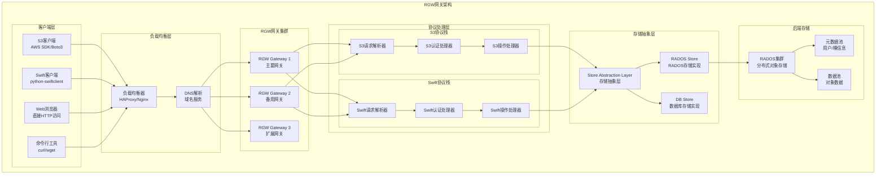
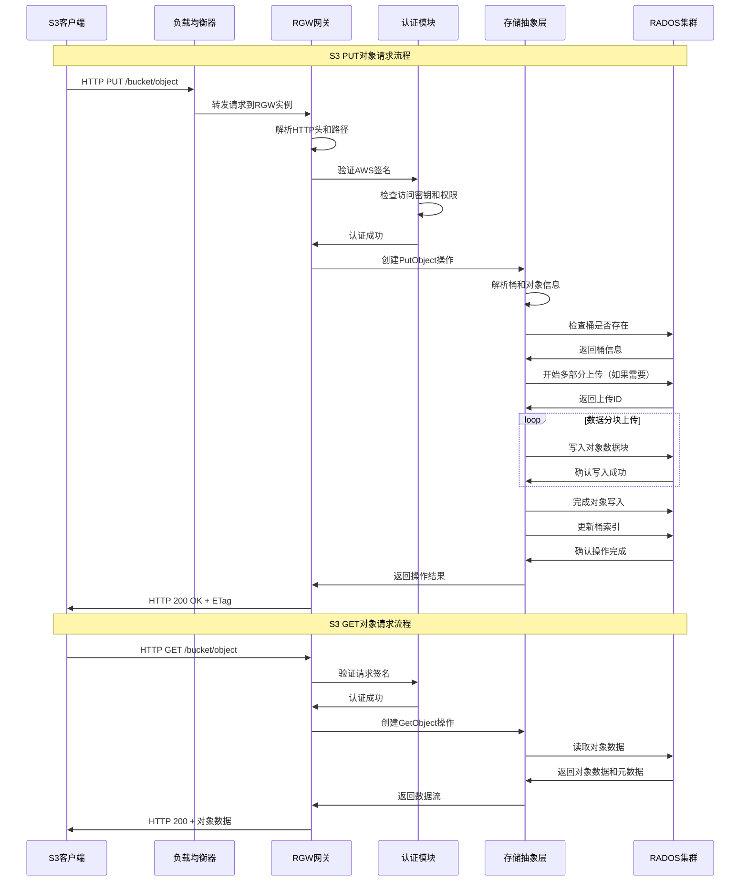
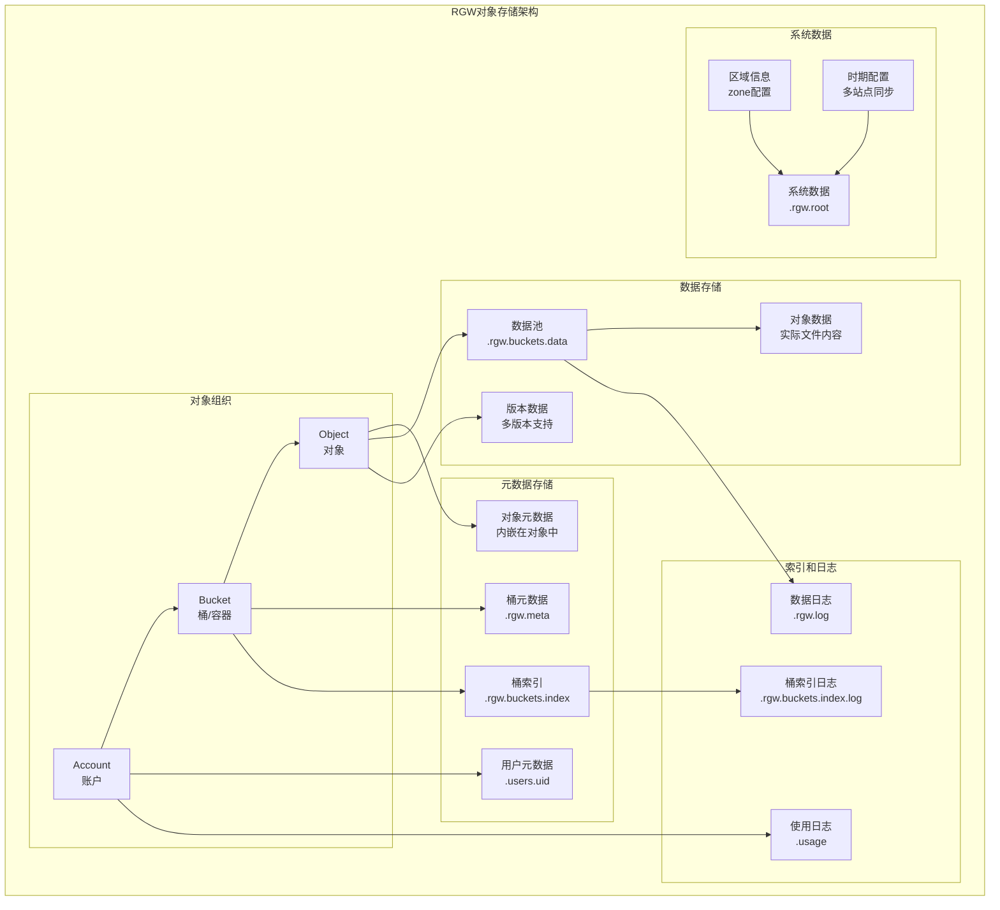
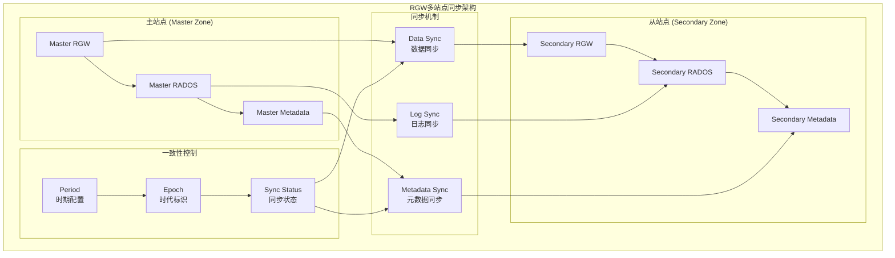

## 概述

RADOS Gateway（RGW）是Ceph对象存储的网关服务，提供RESTful API接口，兼容Amazon S3和OpenStack Swift协议。RGW将HTTP RESTful请求转换为RADOS操作，为用户提供简单易用的对象存储服务，同时支持多租户、访问控制、生命周期管理等企业级特性。

## 1. RGW整体架构

### 1.1 RGW架构图



### 1.2 请求处理流程



## 2. 核心组件详解

### 2.1 存储抽象层（SAL）

```cpp
/**
 * RGW存储抽象层 - 核心接口定义
 * 文件: src/rgw/rgw_sal.h:813-877
 * 
 * SAL(Store Abstraction Layer)是RGW的核心架构，分离了
 * 上层协议处理和底层存储实现，支持多种存储后端
 */

/**
 * Store基类 - 存储后端的抽象接口
 */
class Store {
public:
    /**
     * 虚析构函数
     */
    virtual ~Store() = default;
    
    // ===================== 用户管理接口 =====================
    
    /**
     * 获取用户对象
     * @param dpp 调试前缀提供者
     * @param y 可选yield上下文，用于协程
     * @param id 用户ID标识
     * @return 用户对象的智能指针
     */
    virtual std::unique_ptr<User> get_user(const DoutPrefixProvider *dpp,
                                          optional_yield y,
                                          const rgw_user& id) = 0;
    
    /**
     * 创建新用户
     * @param dpp 调试前缀提供者
     * @param y 可选yield上下文
     * @param id 用户ID
     * @return 新用户对象的智能指针
     */
    virtual std::unique_ptr<User> create_user(const DoutPrefixProvider *dpp,
                                             optional_yield y,
                                             const rgw_user& id) = 0;
    
    // ===================== 桶管理接口 =====================
    
    /**
     * 获取桶对象
     * @param dpp 调试前缀提供者
     * @param y 可选yield上下文
     * @param info 桶信息结构
     * @param attrs 桶属性映射
     * @return 桶对象的智能指针
     */
    virtual std::unique_ptr<Bucket> get_bucket(const DoutPrefixProvider *dpp,
                                              optional_yield y,
                                              const RGWBucketInfo& info,
                                              rgw::sal::Attrs&& attrs) = 0;
    
    /**
     * 创建新桶
     * @param dpp 调试前缀提供者
     * @param y 可选yield上下文
     * @param info 桶信息
     * @param attrs 桶属性
     * @return 新桶对象的智能指针
     */
    virtual std::unique_ptr<Bucket> create_bucket(const DoutPrefixProvider *dpp,
                                                  optional_yield y,
                                                  const RGWBucketInfo& info,
                                                  rgw::sal::Attrs&& attrs) = 0;
    
    // ===================== 对象管理接口 =====================
    
    /**
     * 获取对象
     * @param dpp 调试前缀提供者
     * @param y 可选yield上下文
     * @param bucket 所属桶对象
     * @param key 对象键信息
     * @return 对象的智能指针
     */
    virtual std::unique_ptr<Object> get_object(const DoutPrefixProvider *dpp,
                                              optional_yield y,
                                              std::unique_ptr<Bucket> bucket,
                                              const rgw_obj_key& key) = 0;

    // ===================== 系统管理接口 =====================
    
    /**
     * 获取集群统计信息
     * @param dpp 调试前缀提供者
     * @param y 可选yield上下文
     * @param stats 输出统计信息
     * @return 操作结果
     */
    virtual int get_cluster_stat(const DoutPrefixProvider* dpp, 
                                optional_yield y,
                                RGWClusterStat& stats) = 0;
};

/**
 * Bucket类 - 桶抽象接口
 */
class Bucket {
public:
    /**
     * 桶列表参数结构
     */
    struct ListParams {
        std::string prefix;              // 对象键前缀过滤
        std::string delim;               // 分隔符，用于模拟目录结构
        rgw_obj_key marker;              // 列表起始标记
        rgw_obj_key end_marker;          // 列表结束标记
        std::string ns;                  // 命名空间
        bool enforce_ns{true};           // 是否强制命名空间
        bool list_versions{false};       // 是否列出版本信息
        bool allow_unordered{false};     // 是否允许乱序列出
        int shard_id{RGW_NO_SHARD};     // 分片ID
    };
    
    /**
     * 桶列表结果结构
     */
    struct ListResults {
        std::vector<rgw_bucket_dir_entry> objs;  // 对象列表
        std::map<std::string, bool> common_prefixes; // 通用前缀
        bool is_truncated{false};        // 是否被截断
        rgw_obj_key next_marker;         // 下一页标记
    };
    
    // ===================== 桶操作接口 =====================
    
    /**
     * 获取桶中的对象
     * @param key 对象键
     * @return 对象智能指针
     */
    virtual std::unique_ptr<Object> get_object(const rgw_obj_key& key) = 0;
    
    /**
     * 列出桶中的对象
     * @param dpp 调试前缀提供者
     * @param params 列表参数
     * @param max_entries 最大条目数
     * @param results 输出结果
     * @param y 可选yield上下文
     * @return 操作结果
     */
    virtual int list(const DoutPrefixProvider* dpp, 
                    ListParams& params, 
                    int max_entries,
                    ListResults& results, 
                    optional_yield y) = 0;
    
    /**
     * 获取桶的访问控制列表
     * @param dpp 调试前缀提供者
     * @param y 可选yield上下文
     * @return ACL对象智能指针
     */
    virtual std::unique_ptr<ACL> get_acl(const DoutPrefixProvider* dpp,
                                        optional_yield y) = 0;
    
    /**
     * 设置桶的访问控制列表
     * @param dpp 调试前缀提供者
     * @param acl ACL对象
     * @param y 可选yield上下文
     * @return 操作结果
     */
    virtual int set_acl(const DoutPrefixProvider* dpp,
                       const ACL& acl,
                       optional_yield y) = 0;

    // ===================== 桶属性管理 =====================
    
    /**
     * 获取桶属性
     * @param dpp 调试前缀提供者
     * @param y 可选yield上下文
     * @param attrs 输出属性映射
     * @return 操作结果
     */
    virtual int get_attrs(const DoutPrefixProvider* dpp,
                         optional_yield y,
                         rgw::sal::Attrs& attrs) = 0;
    
    /**
     * 设置桶属性
     * @param dpp 调试前缀提供者
     * @param attrs 属性映射
     * @param y 可选yield上下文
     * @return 操作结果
     */
    virtual int set_attrs(const DoutPrefixProvider* dpp,
                         const rgw::sal::Attrs& attrs,
                         optional_yield y) = 0;

private:
    RGWBucketInfo info;                 // 桶信息结构
    rgw::sal::Attrs attrs;              // 桶属性
    Store* store;                       // 所属存储后端
};

/**
 * Object类 - 对象抽象接口
 */
class Object {
public:
    // ===================== 对象操作接口 =====================
    
    /**
     * 读取对象数据
     * @param dpp 调试前缀提供者
     * @param ofs 读取偏移量
     * @param end 读取结束位置
     * @param bl 输出数据缓冲
     * @param y 可选yield上下文
     * @return 实际读取字节数
     */
    virtual int get_obj_data(const DoutPrefixProvider* dpp,
                            off_t ofs,
                            off_t end,
                            ceph::bufferlist& bl,
                            optional_yield y) = 0;
    
    /**
     * 写入对象数据
     * @param dpp 调试前缀提供者
     * @param bl 要写入的数据
     * @param ofs 写入偏移量
     * @param y 可选yield上下文
     * @return 操作结果
     */
    virtual int put_obj_data(const DoutPrefixProvider* dpp,
                            const ceph::bufferlist& bl,
                            off_t ofs,
                            optional_yield y) = 0;
    
    /**
     * 删除对象
     * @param dpp 调试前缀提供者
     * @param y 可选yield上下文
     * @return 操作结果
     */
    virtual int delete_object(const DoutPrefixProvider* dpp,
                             optional_yield y) = 0;
    
    /**
     * 复制对象
     * @param dpp 调试前缀提供者
     * @param dest_obj 目标对象
     * @param y 可选yield上下文
     * @return 操作结果
     */
    virtual int copy_object(const DoutPrefixProvider* dpp,
                           std::unique_ptr<Object> dest_obj,
                           optional_yield y) = 0;

    // ===================== 对象元数据 =====================
    
    /**
     * 获取对象属性
     * @param dpp 调试前缀提供者
     * @param y 可选yield上下文
     * @param attrs 输出属性映射
     * @return 操作结果
     */
    virtual int get_attrs(const DoutPrefixProvider* dpp,
                         optional_yield y,
                         rgw::sal::Attrs& attrs) = 0;
    
    /**
     * 设置对象属性
     * @param dpp 调试前缀提供者
     * @param attrs 属性映射
     * @param y 可选yield上下文
     * @return 操作结果
     */
    virtual int set_attrs(const DoutPrefixProvider* dpp,
                         const rgw::sal::Attrs& attrs,
                         optional_yield y) = 0;

private:
    std::unique_ptr<Bucket> bucket;     // 所属桶
    rgw_obj_key key;                    // 对象键
    Store* store;                       // 存储后端引用
};
```

### 2.2 认证和授权机制

```cpp
/**
 * RGW认证体系
 * 文件: src/rgw/rgw_auth_registry.h
 * 
 * RGW支持多种认证方式，包括AWS签名v2/v4、Swift令牌认证等
 */

/**
 * 认证策略注册表
 */
class StrategyRegistry {
public:
    /**
     * AWS签名v4认证策略
     */
    class S3AuthStrategy : public Strategy {
    public:
        /**
         * 应用S3认证策略
         * @param dpp 调试前缀提供者
         * @param s 请求状态
         * @param y 可选yield上下文
         * @return 认证结果
         */
        AuthResult apply(const DoutPrefixProvider* dpp,
                        req_state* const s,
                        optional_yield y) const override {
            
            // 1. 解析HTTP头中的认证信息
            std::string auth_header = s->info.env->get("HTTP_AUTHORIZATION", "");
            
            if (auth_header.empty()) {
                // 匿名访问
                return AuthResult{AuthResult::DENIED, "No authorization header"};
            }
            
            // 2. 解析AWS签名格式
            if (auth_header.substr(0, 4) == "AWS ") {
                // AWS签名v2格式: AWS AccessKeyId:Signature
                return apply_aws_v2_auth(dpp, s, auth_header, y);
            } else if (auth_header.substr(0, 7) == "AWS4-") {
                // AWS签名v4格式: AWS4-HMAC-SHA256 Credential=...
                return apply_aws_v4_auth(dpp, s, auth_header, y);
            } else {
                return AuthResult{AuthResult::DENIED, "Unsupported auth format"};
            }
        }

    private:
        /**
         * 应用AWS签名v4认证
         * @param dpp 调试前缀提供者
         * @param s 请求状态
         * @param auth_header 认证头
         * @param y 可选yield上下文
         * @return 认证结果
         */
        AuthResult apply_aws_v4_auth(const DoutPrefixProvider* dpp,
                                    req_state* const s,
                                    const std::string& auth_header,
                                    optional_yield y) const {
            
            // 解析签名头组件
            AWSv4SignatureComponents components;
            int ret = parse_aws_v4_auth_header(auth_header, components);
            if (ret < 0) {
                return AuthResult{AuthResult::DENIED, "Invalid auth header format"};
            }
            
            // 查找用户访问密钥
            RGWUserInfo user_info;
            ret = lookup_user_by_access_key(dpp, components.access_key_id, user_info, y);
            if (ret < 0) {
                return AuthResult{AuthResult::DENIED, "Invalid access key"};
            }
            
            // 计算预期签名
            std::string expected_signature = calculate_aws_v4_signature(
                dpp, s, components, user_info.secret_key);
            
            // 验证签名
            if (components.signature != expected_signature) {
                ldpp_dout(dpp, 0) << "AWS v4 signature mismatch" << dendl;
                return AuthResult{AuthResult::DENIED, "Signature mismatch"};
            }
            
            // 认证成功，设置用户上下文
            s->user = std::make_unique<RGWUser>(user_info);
            
            return AuthResult{AuthResult::GRANTED, ""};
        }
        
        /**
         * 计算AWS签名v4
         */
        std::string calculate_aws_v4_signature(const DoutPrefixProvider* dpp,
                                              req_state* const s,
                                              const AWSv4SignatureComponents& components,
                                              const std::string& secret_key) const {
            
            // 1. 构造规范请求字符串
            std::string canonical_request = build_canonical_request(s, components);
            
            // 2. 构造字符串以签名
            std::string string_to_sign = build_string_to_sign(components, canonical_request);
            
            // 3. 计算签名密钥
            std::string signing_key = derive_signing_key(secret_key, components);
            
            // 4. 计算最终签名
            std::string signature = hmac_sha256_hex(signing_key, string_to_sign);
            
            ldpp_dout(dpp, 20) << "AWS v4 signature calculation:" << dendl;
            ldpp_dout(dpp, 20) << "  canonical_request: " << canonical_request << dendl;
            ldpp_dout(dpp, 20) << "  string_to_sign: " << string_to_sign << dendl;
            ldpp_dout(dpp, 20) << "  signature: " << signature << dendl;
            
            return signature;
        }
    };
    
    /**
     * Swift令牌认证策略
     */
    class SwiftAuthStrategy : public Strategy {
    public:
        AuthResult apply(const DoutPrefixProvider* dpp,
                        req_state* const s,
                        optional_yield y) const override {
            
            // 检查Swift认证令牌
            std::string auth_token = s->info.env->get("HTTP_X_AUTH_TOKEN", "");
            
            if (auth_token.empty()) {
                return AuthResult{AuthResult::DENIED, "No auth token provided"};
            }
            
            // 验证令牌并获取用户信息
            RGWUserInfo user_info;
            int ret = validate_swift_token(dpp, auth_token, user_info, y);
            if (ret < 0) {
                return AuthResult{AuthResult::DENIED, "Invalid auth token"};
            }
            
            // 设置用户上下文
            s->user = std::make_unique<RGWUser>(user_info);
            
            return AuthResult{AuthResult::GRANTED, ""};
        }

    private:
        /**
         * 验证Swift认证令牌
         */
        int validate_swift_token(const DoutPrefixProvider* dpp,
                                const std::string& token,
                                RGWUserInfo& user_info,
                                optional_yield y) const {
            
            // Swift令牌通常包含用户ID和过期时间
            // 这里简化处理，实际实现会更复杂
            
            // 解析令牌格式
            if (token.length() < 32) {
                return -EINVAL;
            }
            
            // 查找令牌对应的用户
            std::string user_id = extract_user_from_token(token);
            if (user_id.empty()) {
                return -EACCES;
            }
            
            // 查找用户信息
            int ret = lookup_user_by_id(dpp, user_id, user_info, y);
            if (ret < 0) {
                return ret;
            }
            
            // 验证令牌有效性（时间、签名等）
            if (!verify_token_validity(token, user_info)) {
                return -EACCES;
            }
            
            return 0;
        }
    };

private:
    std::vector<std::unique_ptr<Strategy>> strategies; // 认证策略列表
    
public:
    /**
     * 注册认证策略
     * @param strategy 认证策略对象
     */
    void add_strategy(std::unique_ptr<Strategy> strategy) {
        strategies.push_back(std::move(strategy));
    }
    
    /**
     * 应用认证策略
     * @param dpp 调试前缀提供者
     * @param s 请求状态
     * @param y 可选yield上下文
     * @return 认证结果
     */
    AuthResult apply_auth_strategies(const DoutPrefixProvider* dpp,
                                    req_state* const s,
                                    optional_yield y) const {
        
        // 尝试每个认证策略，直到成功或全部失败
        for (const auto& strategy : strategies) {
            AuthResult result = strategy->apply(dpp, s, y);
            
            if (result.result == AuthResult::GRANTED) {
                return result;  // 认证成功
            }
            
            // 记录失败原因，继续尝试下一个策略
            ldpp_dout(dpp, 10) << "Auth strategy failed: " << result.reason << dendl;
        }
        
        // 所有策略都失败
        return AuthResult{AuthResult::DENIED, "All auth strategies failed"};
    }
};
```

## 3. 协议处理详解

### 3.1 S3协议处理器

```cpp
/**
 * S3协议处理核心实现
 * 文件: src/rgw/rgw_rest_s3.cc:5295-5360
 */

/**
 * RGWHandler_REST_Bucket_S3 - S3桶操作处理器
 */
class RGWHandler_REST_Bucket_S3 : public RGWHandler_REST_S3 {
public:
    /**
     * 处理HTTP PUT请求 - 创建桶或设置桶属性
     * @return 对应的操作对象
     */
    RGWOp *op_put() override {
        // 根据查询参数确定具体操作类型
        
        if (s->info.args.sub_resource_exists("versioning")) {
            // PUT /?versioning - 设置桶版本控制
            return new RGWSetBucketVersioning_ObjStore_S3;
            
        } else if (s->info.args.sub_resource_exists("website")) {
            // PUT /?website - 设置静态网站配置
            if (!s->cct->_conf->rgw_enable_static_website) {
                return nullptr;  // 功能未启用
            }
            return new RGWSetBucketWebsite_ObjStore_S3;
            
        } else if (is_tagging_op()) {
            // PUT /?tagging - 设置桶标签
            return new RGWPutBucketTags_ObjStore_S3;
            
        } else if (is_acl_op()) {
            // PUT /?acl - 设置桶访问控制列表
            return new RGWPutACLs_ObjStore_S3;
            
        } else if (is_cors_op()) {
            // PUT /?cors - 设置跨域资源共享配置
            return new RGWPutCORS_ObjStore_S3;
            
        } else if (is_lc_op()) {
            // PUT /?lifecycle - 设置生命周期配置
            return new RGWPutLC_ObjStore_S3;
            
        } else if (is_policy_op()) {
            // PUT /?policy - 设置桶策略
            return new RGWPutBucketPolicy;
            
        } else if (is_object_lock_op()) {
            // PUT /?object-lock - 设置对象锁配置
            return new RGWPutBucketObjectLock_ObjStore_S3;
            
        } else if (is_notification_op()) {
            // PUT /?notification - 设置事件通知配置
            return RGWHandler_REST_PSNotifs_S3::create_put_op();
            
        } else if (is_replication_op()) {
            // PUT /?replication - 设置桶复制配置
            return new RGWPutBucketReplication_ObjStore_S3;
            
        } else if (is_bucket_encryption_op()) {
            // PUT /?encryption - 设置桶加密配置
            return new RGWPutBucketEncryption_ObjStore_S3;
            
        } else {
            // 默认操作：创建桶
            return new RGWCreateBucket_ObjStore_S3;
        }
    }
    
    /**
     * 处理HTTP GET请求 - 获取桶信息或列出对象
     * @return 对应的操作对象
     */
    RGWOp *op_get() override {
        if (is_acl_op()) {
            // GET /?acl - 获取访问控制列表
            return new RGWGetACLs_ObjStore_S3;
            
        } else if (s->info.args.exists("uploads")) {
            // GET /?uploads - 列出进行中的多部分上传
            return new RGWListBucketMultiparts_ObjStore_S3;
            
        } else if (is_cors_op()) {
            // GET /?cors - 获取跨域配置
            return new RGWGetCORS_ObjStore_S3;
            
        } else if (is_tagging_op()) {
            // GET /?tagging - 获取桶标签
            return new RGWGetBucketTags_ObjStore_S3;
            
        } else if (is_lc_op()) {
            // GET /?lifecycle - 获取生命周期配置
            return new RGWGetLC_ObjStore_S3;
            
        } else if (is_policy_op()) {
            // GET /?policy - 获取桶策略
            return new RGWGetBucketPolicy;
            
        } else if (s->info.args.exists("location")) {
            // GET /?location - 获取桶位置
            return new RGWGetBucketLocation_ObjStore_S3;
            
        } else if (s->info.args.exists("logging")) {
            // GET /?logging - 获取日志配置
            return new RGWGetBucketLogging_ObjStore_S3;
            
        } else {
            // 默认操作：列出桶中的对象
            return new RGWListBucket_ObjStore_S3;
        }
    }
    
    /**
     * 处理HTTP DELETE请求 - 删除桶或桶配置
     * @return 对应的操作对象
     */
    RGWOp *op_delete() override {
        if (is_tagging_op()) {
            // DELETE /?tagging - 删除桶标签
            return new RGWDeleteBucketTags_ObjStore_S3;
            
        } else if (is_cors_op()) {
            // DELETE /?cors - 删除跨域配置
            return new RGWDeleteCORS_ObjStore_S3;
            
        } else if (is_lc_op()) {
            // DELETE /?lifecycle - 删除生命周期配置
            return new RGWDeleteLC_ObjStore_S3;
            
        } else if (is_policy_op()) {
            // DELETE /?policy - 删除桶策略
            return new RGWDeleteBucketPolicy;
            
        } else {
            // 默认操作：删除桶
            return new RGWDeleteBucket_ObjStore_S3;
        }
    }
};
```

### 3.2 Swift协议处理器

```cpp
/**
 * Swift协议处理实现
 * 文件: src/rgw/rgw_rest_swift.cc:2857-2943
 */

/**
 * RGWHandler_REST_Bucket_SWIFT - Swift容器操作处理器
 */
class RGWHandler_REST_Bucket_SWIFT : public RGWHandler_REST_SWIFT {
public:
    /**
     * 处理PUT请求 - Swift容器操作
     */
    RGWOp *op_put() override {
        if (is_acl_op()) {
            // PUT /?acl - 设置访问控制
            return new RGWPutACLs_ObjStore_SWIFT;
        }
        
        if (s->info.args.exists("extract-archive")) {
            // PUT /?extract-archive - 批量解压上传
            return new RGWBulkUploadOp_ObjStore_SWIFT;
        }
        
        // 默认：创建容器
        return new RGWCreateBucket_ObjStore_SWIFT;
    }
    
    /**
     * 处理GET请求 - 列出容器内容
     */
    RGWOp *op_get() override {
        return new RGWListBucket_ObjStore_SWIFT;
    }
    
    /**
     * 处理DELETE请求 - 删除容器
     */
    RGWOp *op_delete() override {
        return new RGWDeleteBucket_ObjStore_SWIFT;
    }
    
    /**
     * 处理POST请求 - 更新容器元数据
     */
    RGWOp *op_post() override {
        if (RGWFormPost::is_formpost_req(s)) {
            // 表单POST上传
            return new RGWFormPost;
        } else {
            // 更新容器元数据
            return new RGWPutMetadataBucket_ObjStore_SWIFT;
        }
    }
};

/**
 * RGWHandler_REST_Obj_SWIFT - Swift对象操作处理器
 */
class RGWHandler_REST_Obj_SWIFT : public RGWHandler_REST_SWIFT {
public:
    /**
     * 处理PUT请求 - 上传对象
     */
    RGWOp *op_put() override {
        if (is_acl_op()) {
            return new RGWPutACLs_ObjStore_SWIFT;
        }
        
        if (s->info.args.exists("extract-archive")) {
            // 解压上传
            return new RGWBulkUploadOp_ObjStore_SWIFT;
        }
        
        if (s->init_state.src_bucket.empty()) {
            // 普通上传
            return new RGWPutObj_ObjStore_SWIFT;
        } else {
            // 复制对象
            return new RGWCopyObj_ObjStore_SWIFT;
        }
    }
    
    /**
     * 处理GET请求 - 下载对象
     */
    RGWOp *op_get() override {
        RGWGetObj_ObjStore_SWIFT *get_obj_op = new RGWGetObj_ObjStore_SWIFT;
        get_obj_op->set_get_data(true);  // 获取数据
        return get_obj_op;
    }
    
    /**
     * 处理HEAD请求 - 获取对象元数据
     */
    RGWOp *op_head() override {
        RGWGetObj_ObjStore_SWIFT *get_obj_op = new RGWGetObj_ObjStore_SWIFT;
        get_obj_op->set_get_data(false); // 只获取元数据
        return get_obj_op;
    }
    
    /**
     * 处理DELETE请求 - 删除对象
     */
    RGWOp *op_delete() override {
        return new RGWDeleteObj_ObjStore_SWIFT;
    }
    
    /**
     * 处理COPY请求 - 复制对象
     */
    RGWOp *op_copy() override {
        return new RGWCopyObj_ObjStore_SWIFT;
    }
};
```

## 4. 数据存储机制

### 4.1 对象存储架构



### 4.2 多站点同步架构



## 5. 高级特性实现

### 5.1 对象版本控制

```cpp
/**
 * 对象版本控制实现
 * 文件: src/rgw/rgw_op.cc
 */

/**
 * RGWPutObj_ObjStore - 对象上传操作基类
 */
class RGWPutObj_ObjStore : public RGWPutObj {
public:
    /**
     * 执行对象上传，支持版本控制
     * @return 操作结果
     */
    int execute() override {
        // 1. 检查桶版本控制状态
        bool versioning_enabled = false;
        if (bucket_info.versioning_enabled()) {
            versioning_enabled = true;
        }
        
        // 2. 处理版本ID
        if (versioning_enabled) {
            if (s->object->get_key().instance.empty()) {
                // 生成新的版本ID
                generate_version_id();
            }
        } else {
            // 版本控制未启用，使用null版本
            s->object->get_key().instance = "null";
        }
        
        // 3. 检查对象是否已存在
        rgw::sal::Object::ReadResult read_result;
        int ret = s->object->get_obj_attrs(s, y, &read_result);
        
        bool object_exists = (ret == 0);
        bool is_versioned_write = versioning_enabled && !s->object->get_key().instance.empty();
        
        // 4. 处理条件请求头
        if (s->info.env->exists("HTTP_IF_MATCH")) {
            std::string if_match = s->info.env->get("HTTP_IF_MATCH");
            if (object_exists && read_result.attrs["etag"] != if_match) {
                return -ERR_PRECONDITION_FAILED;
            }
        }
        
        if (s->info.env->exists("HTTP_IF_NONE_MATCH")) {
            std::string if_none_match = s->info.env->get("HTTP_IF_NONE_MATCH");
            if (object_exists && (if_none_match == "*" || 
                                 read_result.attrs["etag"] == if_none_match)) {
                return -ERR_PRECONDITION_FAILED;
            }
        }
        
        // 5. 执行实际上传
        ret = do_aws_copy_obj(s, y);
        if (ret < 0) {
            return ret;
        }
        
        // 6. 更新桶索引
        if (!is_versioned_write || object_exists) {
            // 更新或创建桶索引条目
            rgw_bucket_dir_entry entry;
            entry.key = s->object->get_key();
            entry.meta.size = s->object->get_size();
            entry.meta.mtime = s->object->get_mtime();
            entry.meta.etag = s->object->get_etag();
            
            ret = s->bucket->update_index(s, entry);
            if (ret < 0) {
                ldpp_dout(s, 0) << "ERROR: failed to update bucket index" << dendl;
                return ret;
            }
        }
        
        return 0;
    }

private:
    /**
     * 生成版本ID
     */
    void generate_version_id() {
        // 使用时间戳和随机数生成版本ID
        char version_id[64];
        struct timespec ts;
        clock_gettime(CLOCK_REALTIME, &ts);
        
        snprintf(version_id, sizeof(version_id), 
                "%lu.%06lu.%d", 
                ts.tv_sec, ts.tv_nsec / 1000, rand());
        
        s->object->get_key().instance = version_id;
        
        ldpp_dout(s, 10) << "Generated version ID: " << version_id << dendl;
    }
};
```

### 5.2 生命周期管理

```cpp
/**
 * 对象生命周期管理实现
 * 文件: src/rgw/rgw_lc.h
 */

/**
 * 生命周期配置结构
 */
struct RGWLifecycleConfiguration {
    /**
     * 生命周期规则
     */
    struct Rule {
        std::string id;                 // 规则ID
        std::string prefix;             // 对象前缀过滤器
        std::string status;             // 规则状态（Enabled/Disabled）
        
        // 过期配置
        struct Expiration {
            int days = -1;              // 天数后过期
            std::string date;           // 绝对过期日期
            bool expired_object_delete_marker = false; // 删除过期的删除标记
        } expiration;
        
        // 非当前版本过期配置
        struct NoncurrentVersionExpiration {
            int days = -1;              // 非当前版本保留天数
        } noncurrent_expiration;
        
        // 存储类转换
        struct Transition {
            int days = -1;              // 转换天数
            std::string date;           // 转换日期
            std::string storage_class;  // 目标存储类（GLACIER等）
        };
        std::vector<Transition> transitions;
        
        /**
         * 检查对象是否匹配规则
         * @param obj_key 对象键
         * @return true 如果匹配
         */
        bool matches_object(const rgw_obj_key& obj_key) const {
            if (!prefix.empty()) {
                return obj_key.name.substr(0, prefix.length()) == prefix;
            }
            return true;
        }
        
        /**
         * 检查对象是否应该过期
         * @param obj_meta 对象元数据
         * @param now 当前时间
         * @return true 如果应该过期
         */
        bool should_expire(const RGWObjectInfo& obj_meta, const utime_t& now) const {
            if (expiration.days > 0) {
                utime_t expire_time = obj_meta.mtime;
                expire_time += utime_t(expiration.days * 24 * 3600, 0);
                return now >= expire_time;
            }
            
            if (!expiration.date.empty()) {
                utime_t expire_date;
                if (parse_time(expiration.date.c_str(), &expire_date) == 0) {
                    return now >= expire_date;
                }
            }
            
            return false;
        }
    };
    
    std::vector<Rule> rules;            // 生命周期规则列表
    
    /**
     * 应用生命周期规则到对象
     * @param obj_key 对象键
     * @param obj_meta 对象元数据
     * @param now 当前时间
     * @return 应该执行的操作
     */
    enum class Action {
        NONE,           // 无操作
        DELETE,         // 删除对象
        TRANSITION      // 转换存储类
    };
    
    Action apply_rules(const rgw_obj_key& obj_key,
                      const RGWObjectInfo& obj_meta,
                      const utime_t& now) const {
        
        for (const auto& rule : rules) {
            if (rule.status != "Enabled") {
                continue;
            }
            
            if (!rule.matches_object(obj_key)) {
                continue;
            }
            
            // 检查过期规则
            if (rule.should_expire(obj_meta, now)) {
                return Action::DELETE;
            }
            
            // 检查转换规则
            for (const auto& transition : rule.transitions) {
                if (transition.days > 0) {
                    utime_t transition_time = obj_meta.mtime;
                    transition_time += utime_t(transition.days * 24 * 3600, 0);
                    
                    if (now >= transition_time) {
                        return Action::TRANSITION;
                    }
                }
            }
        }
        
        return Action::NONE;
    }
};

/**
 * 生命周期处理器
 */
class RGWLifecycleProcessor {
public:
    /**
     * 处理桶的生命周期规则
     * @param bucket_info 桶信息
     * @param lc_config 生命周期配置
     * @return 处理结果
     */
    int process_bucket_lifecycle(const RGWBucketInfo& bucket_info,
                                const RGWLifecycleConfiguration& lc_config) {
        
        dout(10) << "Processing lifecycle for bucket: " << bucket_info.bucket.name << dendl;
        
        // 获取当前时间
        utime_t now = ceph_clock_now();
        
        // 列举桶中的所有对象
        rgw::sal::Bucket::ListParams params;
        rgw::sal::Bucket::ListResults results;
        
        std::unique_ptr<rgw::sal::Bucket> bucket = store->get_bucket(nullptr, null_yield, bucket_info, {});
        
        bool is_truncated = true;
        while (is_truncated) {
            int ret = bucket->list(nullptr, params, 1000, results, null_yield);
            if (ret < 0) {
                ldpp_dout(nullptr, 0) << "ERROR: failed to list bucket objects" << dendl;
                return ret;
            }
            
            // 处理每个对象
            for (const auto& entry : results.objs) {
                RGWLifecycleConfiguration::Action action = 
                    lc_config.apply_rules(entry.key, entry.meta, now);
                
                switch (action) {
                    case RGWLifecycleConfiguration::Action::DELETE:
                        ret = delete_expired_object(bucket.get(), entry.key);
                        if (ret < 0) {
                            ldpp_dout(nullptr, 0) << "ERROR: failed to delete expired object " 
                                                  << entry.key.name << dendl;
                        }
                        break;
                        
                    case RGWLifecycleConfiguration::Action::TRANSITION:
                        ret = transition_object(bucket.get(), entry.key, "GLACIER");
                        if (ret < 0) {
                            ldpp_dout(nullptr, 0) << "ERROR: failed to transition object " 
                                                  << entry.key.name << dendl;
                        }
                        break;
                        
                    default:
                        // 无操作
                        break;
                }
            }
            
            // 更新分页参数
            is_truncated = results.is_truncated;
            if (is_truncated) {
                params.marker = results.next_marker;
            }
        }
        
        return 0;
    }

private:
    rgw::sal::Store* store;             // 存储后端
    
    /**
     * 删除过期对象
     * @param bucket 桶对象
     * @param obj_key 对象键
     * @return 操作结果
     */
    int delete_expired_object(rgw::sal::Bucket* bucket, const rgw_obj_key& obj_key) {
        std::unique_ptr<rgw::sal::Object> obj = bucket->get_object(obj_key);
        
        int ret = obj->delete_object(nullptr, null_yield);
        if (ret == 0) {
            ldpp_dout(nullptr, 10) << "Deleted expired object: " << obj_key.name << dendl;
        }
        
        return ret;
    }
    
    /**
     * 转换对象存储类
     * @param bucket 桶对象
     * @param obj_key 对象键
     * @param storage_class 目标存储类
     * @return 操作结果
     */
    int transition_object(rgw::sal::Bucket* bucket, 
                         const rgw_obj_key& obj_key,
                         const std::string& storage_class) {
        
        // 获取对象
        std::unique_ptr<rgw::sal::Object> obj = bucket->get_object(obj_key);
        
        // 更新存储类元数据
        rgw::sal::Attrs attrs;
        int ret = obj->get_attrs(nullptr, null_yield, attrs);
        if (ret < 0) {
            return ret;
        }
        
        // 设置新的存储类
        attrs["x-amz-storage-class"] = storage_class;
        
        ret = obj->set_attrs(nullptr, attrs, null_yield);
        if (ret == 0) {
            ldpp_dout(nullptr, 10) << "Transitioned object " << obj_key.name 
                                  << " to storage class " << storage_class << dendl;
        }
        
        return ret;
    }

public:
    /**
     * 构造函数
     * @param s 存储后端
     */
    explicit RGWLifecycleProcessor(rgw::sal::Store* s) : store(s) {}
};
```

## 6. 性能优化和扩展

### 6.1 RGW性能优化配置

```bash
# RGW性能优化配置
[client.rgw]
# 基本配置
rgw_frontends = "beast port=7480"         # 前端服务器配置
rgw_thread_pool_size = 100               # 线程池大小
rgw_num_rados_handles = 1                # RADOS句柄数量

# 缓存优化
rgw_cache_enabled = true                 # 启用缓存
rgw_cache_lru_size = 10000              # LRU缓存大小
rgw_bucket_index_max_aio = 8            # 桶索引最大异步I/O

# 数据处理优化
rgw_max_chunk_size = 524288             # 最大块大小(512KB)
rgw_obj_stripe_size = 4194304           # 对象条带大小(4MB)
rgw_copy_obj_progress = true            # 显示复制进度
rgw_copy_obj_progress_every_bytes = 1048576  # 进度报告间隔

# 多部分上传优化
rgw_multipart_min_part_size = 5242880   # 最小部分大小(5MB)
rgw_multipart_part_upload_limit = 10000 # 最大部分数量
rgw_list_buckets_max_chunk = 1000       # 列桶最大块大小

# 网络优化
rgw_enable_ops_log = true               # 启用操作日志
rgw_enable_usage_log = true             # 启用使用日志
rgw_usage_log_flush_threshold = 1024    # 使用日志刷新阈值

# 数据一致性
rgw_bucket_index_transaction_instrumentation = true  # 桶索引事务监控
rgw_data_log_changes_size = 1000        # 数据日志变更大小
```

### 6.2 多站点部署配置

```bash
# 主站点配置
[client.rgw.master]
rgw_zone = master                       # 主区域名称
rgw_zonegroup = default                 # 区域组
rgw_realm = production                  # 生产域

# 从站点配置  
[client.rgw.secondary]
rgw_zone = secondary                    # 从区域名称
rgw_zonegroup = default                 # 相同区域组
rgw_realm = production                  # 相同生产域

# 同步配置
rgw_data_log_window = 30                # 数据日志窗口(秒)
rgw_md_log_max_shards = 64             # 元数据日志最大分片数
rgw_sync_log_trim_interval = 1200      # 同步日志修剪间隔
```

## 7. 监控和运维

### 7.1 RGW运维工具

```bash
#!/bin/bash
# RGW运维脚本示例

# 1. 检查RGW服务状态
check_rgw_status() {
    echo "=== RGW Service Status ==="
    systemctl status ceph-radosgw@rgw.$(hostname)
    
    echo "=== RGW Process Info ==="
    ps aux | grep radosgw
    
    echo "=== RGW Port Status ==="
    netstat -tlnp | grep :7480
}

# 2. 检查RGW性能
check_rgw_performance() {
    echo "=== RGW Performance Counters ==="
    ceph daemon rgw.$(hostname) perf dump | jq '.rgw'
    
    echo "=== Object Operations ==="
    ceph daemon rgw.$(hostname) perf dump | jq '.objecter'
    
    echo "=== Cache Statistics ==="
    ceph daemon rgw.$(hostname) perf dump | jq '.rgw_cache'
}

# 3. 检查用户和桶
check_rgw_data() {
    echo "=== RGW Users ==="
    radosgw-admin user list
    
    echo "=== RGW Buckets ==="
    radosgw-admin bucket list
    
    echo "=== Usage Statistics ==="
    radosgw-admin usage show --show-log-entries=false
}

# 4. 清理和维护
rgw_maintenance() {
    echo "=== Cleaning up multipart uploads ==="
    radosgw-admin multipart list --owner=cleanup-user
    
    echo "=== Garbage Collection ==="
    radosgw-admin gc list --include-all
    radosgw-admin gc process
    
    echo "=== Bucket Index Repair ==="
    radosgw-admin bucket check --fix
}

# 5. 性能测试
rgw_performance_test() {
    echo "=== RGW Performance Test ==="
    
    # 创建测试桶
    s3cmd mb s3://performance-test-bucket
    
    # 小文件上传测试
    echo "Testing small files upload..."
    for i in {1..100}; do
        echo "test data $i" | s3cmd put - s3://performance-test-bucket/small-file-$i.txt
    done
    
    # 大文件上传测试
    echo "Testing large file upload..."
    dd if=/dev/zero of=/tmp/large-test-file bs=1M count=100
    time s3cmd put /tmp/large-test-file s3://performance-test-bucket/large-file.dat
    
    # 列表性能测试
    echo "Testing bucket listing..."
    time s3cmd ls s3://performance-test-bucket/
    
    # 清理测试数据
    s3cmd rb s3://performance-test-bucket --recursive --force
    rm -f /tmp/large-test-file
}

# 主函数
main() {
    case "$1" in
        "status")
            check_rgw_status
            ;;
        "performance")
            check_rgw_performance
            ;;
        "data")
            check_rgw_data
            ;;
        "maintenance")
            rgw_maintenance
            ;;
        "test")
            rgw_performance_test
            ;;
        *)
            echo "Usage: $0 {status|performance|data|maintenance|test}"
            echo "  status      - Check RGW service status"
            echo "  performance - Check RGW performance metrics"
            echo "  data        - Check RGW users and buckets"
            echo "  maintenance - Perform maintenance tasks"
            echo "  test        - Run performance tests"
            exit 1
            ;;
    esac
}

main "$@"
```

### 7.2 监控指标

```python
"""
RGW监控指标收集器
"""

import json
import subprocess
import time
from typing import Dict, List, Optional

class RGWMonitor:
    """RGW监控类"""
    
    def __init__(self, rgw_daemon_name: str):
        self.daemon_name = rgw_daemon_name
        
    def get_perf_counters(self) -> Dict:
        """获取RGW性能计数器"""
        try:
            cmd = ['ceph', 'daemon', f'rgw.{self.daemon_name}', 'perf', 'dump']
            result = subprocess.run(cmd, capture_output=True, text=True, check=True)
            return json.loads(result.stdout)
        except Exception as e:
            print(f"Error getting perf counters: {e}")
            return {}
    
    def get_ops_stats(self) -> Dict:
        """获取操作统计"""
        perf_data = self.get_perf_counters()
        rgw_stats = perf_data.get('rgw', {})
        
        return {
            'total_ops': rgw_stats.get('op', 0),
            'get_ops': rgw_stats.get('get', 0),
            'put_ops': rgw_stats.get('put', 0),
            'delete_ops': rgw_stats.get('delete', 0),
            'list_ops': rgw_stats.get('list', 0),
            'cache_hit': rgw_stats.get('cache_hit', 0),
            'cache_miss': rgw_stats.get('cache_miss', 0),
            'failed_ops': rgw_stats.get('failed_req', 0)
        }
    
    def get_bandwidth_stats(self) -> Dict:
        """获取带宽统计"""
        perf_data = self.get_perf_counters()
        rgw_stats = perf_data.get('rgw', {})
        
        return {
            'bytes_sent': rgw_stats.get('get_b', 0),
            'bytes_received': rgw_stats.get('put_b', 0),
            'total_bandwidth': rgw_stats.get('get_b', 0) + rgw_stats.get('put_b', 0)
        }
    
    def check_health(self) -> Dict:
        """检查RGW健康状态"""
        try:
            # 检查进程状态
            cmd = ['systemctl', 'is-active', f'ceph-radosgw@rgw.{self.daemon_name}']
            result = subprocess.run(cmd, capture_output=True, text=True)
            service_active = result.returncode == 0
            
            # 检查端口监听
            cmd = ['netstat', '-tlnp']
            result = subprocess.run(cmd, capture_output=True, text=True, check=True)
            port_listening = ':7480' in result.stdout
            
            # 获取性能数据
            ops_stats = self.get_ops_stats()
            bandwidth_stats = self.get_bandwidth_stats()
            
            return {
                'service_active': service_active,
                'port_listening': port_listening,
                'total_ops': ops_stats['total_ops'],
                'failed_ops': ops_stats['failed_ops'],
                'error_rate': (ops_stats['failed_ops'] / max(ops_stats['total_ops'], 1)) * 100,
                'cache_hit_rate': (ops_stats['cache_hit'] / 
                                 max(ops_stats['cache_hit'] + ops_stats['cache_miss'], 1)) * 100,
                'total_bandwidth': bandwidth_stats['total_bandwidth']
            }
            
        except Exception as e:
            print(f"Error checking RGW health: {e}")
            return {'error': str(e)}

def monitor_rgw_cluster(rgw_instances: List[str], interval: int = 60):
    """
    监控RGW集群
    
    Args:
        rgw_instances: RGW实例名称列表
        interval: 监控间隔(秒)
    """
    monitors = [RGWMonitor(instance) for instance in rgw_instances]
    
    print(f"Starting RGW cluster monitoring for {len(monitors)} instances...")
    
    while True:
        timestamp = time.strftime('%Y-%m-%d %H:%M:%S')
        print(f"\n[{timestamp}] RGW Cluster Status:")
        
        cluster_stats = {
            'total_ops': 0,
            'total_failed_ops': 0,
            'total_bandwidth': 0,
            'active_instances': 0
        }
        
        for monitor in monitors:
            try:
                health = monitor.check_health()
                
                if 'error' in health:
                    print(f"  {monitor.daemon_name}: ERROR - {health['error']}")
                    continue
                
                # 累计集群统计
                cluster_stats['total_ops'] += health['total_ops']
                cluster_stats['total_failed_ops'] += health['failed_ops']
                cluster_stats['total_bandwidth'] += health['total_bandwidth']
                
                if health['service_active']:
                    cluster_stats['active_instances'] += 1
                
                # 输出实例状态
                status = "UP" if health['service_active'] and health['port_listening'] else "DOWN"
                print(f"  {monitor.daemon_name}: {status}")
                print(f"    Ops: {health['total_ops']}, "
                      f"Error Rate: {health['error_rate']:.2f}%, "
                      f"Cache Hit: {health['cache_hit_rate']:.2f}%")
                
            except Exception as e:
                print(f"  {monitor.daemon_name}: ERROR - {e}")
        
        # 输出集群汇总
        total_error_rate = (cluster_stats['total_failed_ops'] / 
                           max(cluster_stats['total_ops'], 1)) * 100
        
        print(f"\nCluster Summary:")
        print(f"  Active Instances: {cluster_stats['active_instances']}/{len(monitors)}")
        print(f"  Total Operations: {cluster_stats['total_ops']}")
        print(f"  Error Rate: {total_error_rate:.2f}%")
        print(f"  Total Bandwidth: {cluster_stats['total_bandwidth'] / (1024*1024):.2f} MB")
        
        time.sleep(interval)

if __name__ == '__main__':
    # 示例：监控3个RGW实例
    rgw_instances = ['node1', 'node2', 'node3']
    monitor_rgw_cluster(rgw_instances, interval=30)
```

## 8. 故障排查和调试

### 8.1 常见问题诊断

```bash
#!/bin/bash
# RGW故障诊断脚本

diagnose_rgw_issues() {
    echo "=== RGW Diagnostic Report ==="
    echo "Generated at: $(date)"
    echo ""
    
    # 1. 基本服务检查
    echo "1. Service Status:"
    systemctl status ceph-radosgw@rgw.$(hostname) --no-pager
    echo ""
    
    # 2. 网络连接检查
    echo "2. Network Connectivity:"
    netstat -tlnp | grep radosgw
    ss -tlnp | grep radosgw
    echo ""
    
    # 3. 日志错误检查
    echo "3. Recent Errors in Logs:"
    journalctl -u ceph-radosgw@rgw.$(hostname) --since "1 hour ago" | grep -i error | tail -10
    echo ""
    
    # 4. RADOS连接检查
    echo "4. RADOS Connectivity:"
    ceph status
    ceph osd pool ls | grep rgw
    echo ""
    
    # 5. 用户和权限检查
    echo "5. User Configuration:"
    radosgw-admin user list | head -10
    radosgw-admin zone get
    echo ""
    
    # 6. 存储池状态
    echo "6. Storage Pool Status:"
    ceph df detail | grep rgw
    echo ""
    
    # 7. 性能指标
    echo "7. Performance Metrics:"
    ceph daemon rgw.$(hostname) perf dump | jq '.rgw | {ops: .op, get: .get, put: .put, errors: .failed_req}'
    echo ""
    
    # 8. 配置检查
    echo "8. Configuration Check:"
    ceph daemon rgw.$(hostname) config show | grep rgw | head -20
}

# 执行诊断
diagnose_rgw_issues > /tmp/rgw_diagnostic_$(date +%Y%m%d_%H%M%S).log 2>&1
echo "Diagnostic report saved to /tmp/rgw_diagnostic_$(date +%Y%m%d_%H%M%S).log"
```

## 总结

RGW模块是Ceph对象存储服务的核心网关，通过以下关键机制实现高性能、高可用的对象存储服务：

### 核心特性

1. **协议兼容性**：完整支持S3和Swift协议，确保与现有应用的兼容性
2. **存储抽象层**：通过SAL实现存储后端的可插拔架构
3. **多租户支持**：完整的用户、桶、权限隔离机制
4. **企业级特性**：支持版本控制、生命周期管理、跨域访问等高级功能
5. **多站点同步**：支持跨地域的数据复制和灾难恢复

### 性能优势

1. **水平扩展**：支持多个RGW实例的负载均衡部署
2. **智能缓存**：多级缓存机制提升访问性能
3. **异步处理**：大量使用异步I/O提高并发能力
4. **优化存储**：智能的数据分布和访问模式优化

### 运维便利性

1. **丰富的管理工具**：radosgw-admin提供完整的管理功能
2. **详细的监控指标**：全方位的性能和健康状态监控
3. **灵活的配置**：支持动态配置和热更新
4. **故障自恢复**：内置的容错和故障恢复机制

RGW的设计体现了现代对象存储服务的核心要求：高性能、高可用、易扩展、协议标准兼容。通过深入理解RGW的架构和实现，可以更好地部署、调优和维护Ceph对象存储服务，为用户提供可靠的云存储能力。
