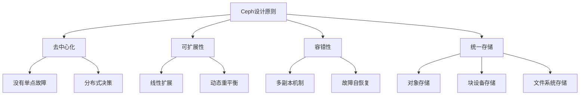
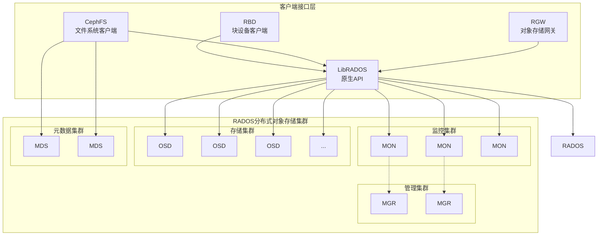
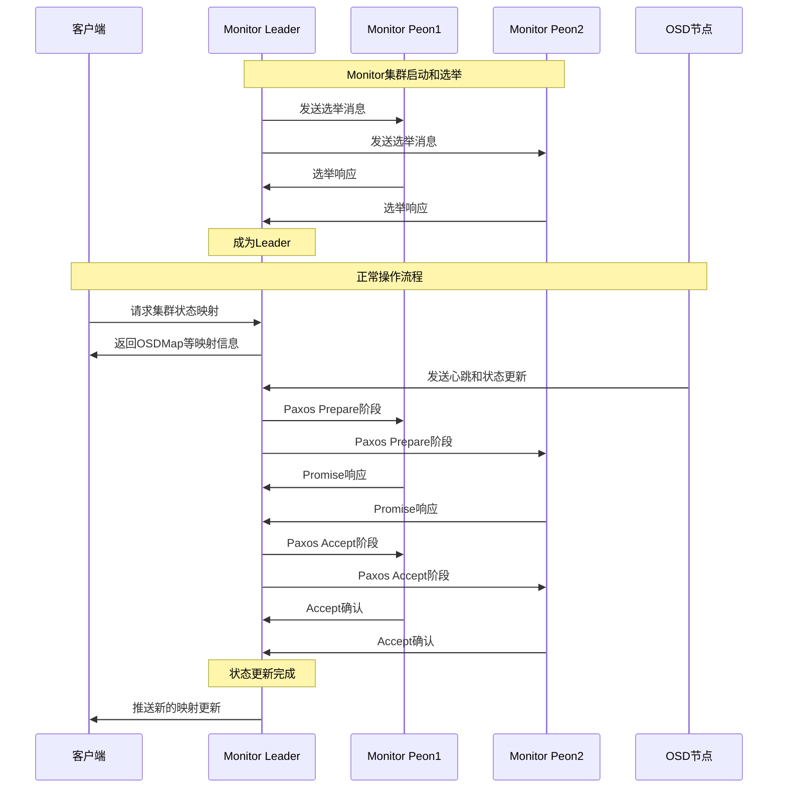
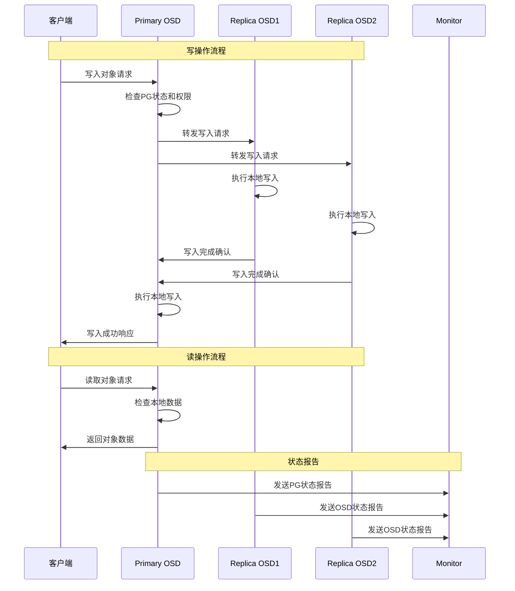
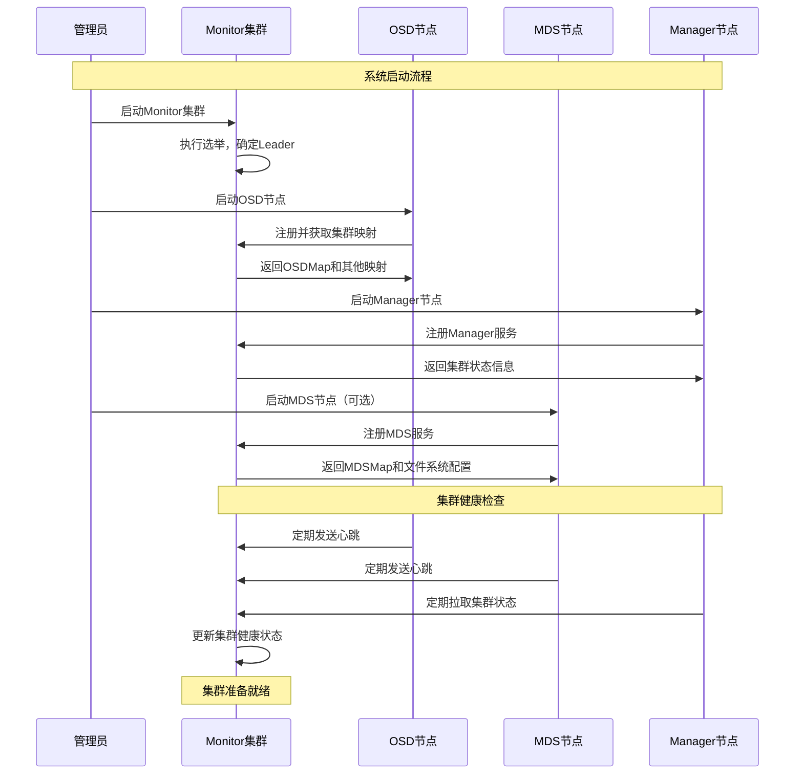
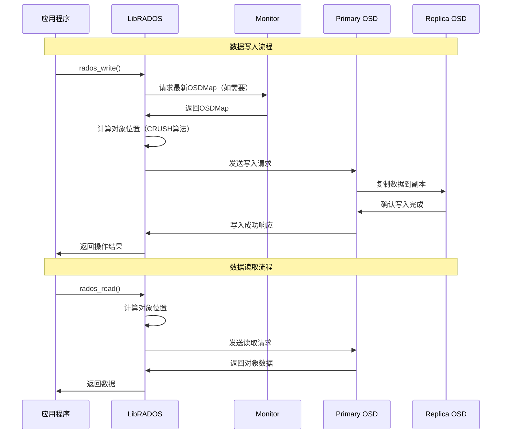
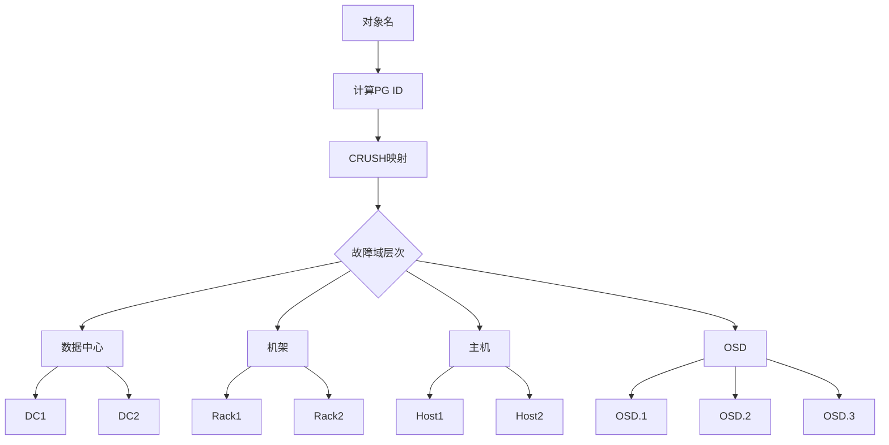
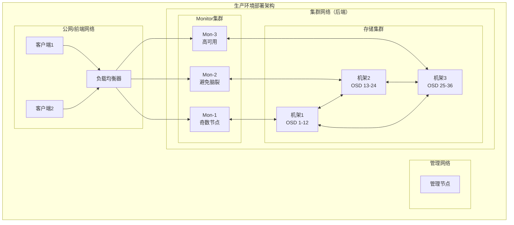

## 项目概述

Ceph是一个统一的、分布式的存储系统，旨在提供卓越的性能、可靠性和可扩展性。它提供了对象存储、块设备和文件系统三种存储接口，都基于同一个分布式存储集群RADOS（Reliable Autonomic Distributed Object Store）。

## 1. 整体架构概述

### 1.1 核心设计原则



### 1.2 系统架构图



## 2. 核心组件详解

### 2.1 Monitor（MON）- 监控器

#### 核心功能
- **集群状态管理**：维护集群的完整状态映射
- **一致性保证**：通过Paxos算法确保集群状态一致性
- **认证服务**：管理客户端和守护进程的认证

#### 关键数据结构

```cpp
/**
 * Monitor类 - Ceph监控器的主要实现
 * 文件: src/mon/Monitor.h
 * 
 * Monitor是集群状态的权威管理者，负责：
 * 1. 维护OSDMap、MDSMap、MonMap等集群映射
 * 2. 通过Paxos算法保证集群状态一致性
 * 3. 处理客户端和OSD的认证请求
 * 4. 协调集群配置变更
 */
class Monitor : public Dispatcher, public AuthClient, public AuthServer {
public:
    // 监控器名称和编号
    std::string name;              // 监控器名称，如 "mon.a"
    int rank;                      // 在监控器集群中的编号
    
    // 网络通信
    Messenger *messenger;          // 消息通信组件
    ConnectionRef con_self;        // 自我连接引用
    
    // 同步和锁
    ceph::mutex lock;             // 主锁，保护Monitor状态
    SafeTimer timer;              // 安全定时器，处理定时任务
    Finisher finisher;            // 完成器，处理异步操作完成
    ThreadPool cpu_tp;            // CPU密集型任务线程池
    
    // 集群状态
    bool has_ever_joined;         // 是否已经加入过仲裁
    MonMap *monmap;               // 监控器映射表
    uuid_d fingerprint;           // 集群指纹
    
    // Paxos相关服务
    std::vector<PaxosService*> paxos_service;  // Paxos服务列表
    
    // 当前状态枚举
    enum {
        STATE_INIT = 1,           // 初始化状态
        STATE_PROBING,            // 探测状态
        STATE_SYNCHRONIZING,      // 同步状态  
        STATE_ELECTING,           // 选举状态
        STATE_LEADER,             // 领导者状态
        STATE_PEON,               // 跟随者状态
        STATE_SHUTDOWN            // 关闭状态
    };
    
private:
    int state;                    // 当前状态
    MonitorDBStore *store;        // 持久化存储
};
```

#### Monitor工作流程时序图



### 2.2 Object Storage Daemon（OSD）- 对象存储守护进程

#### 核心功能
- **数据存储**：存储和管理实际的对象数据
- **数据复制**：维护数据的多个副本
- **故障恢复**：检测和恢复故障节点的数据

#### 关键数据结构

```cpp
/**
 * OSD类 - 对象存储守护进程的主要实现
 * 文件: src/osd/OSD.h
 * 
 * OSD负责：
 * 1. 存储和检索对象数据
 * 2. 维护数据副本和纠删码
 * 3. 执行数据恢复和重平衡
 * 4. 处理客户端I/O请求
 */
class OSD : public Dispatcher {
public:
    // 基本属性
    CephContext *cct;                    // Ceph上下文
    std::unique_ptr<ObjectStore> store;  // 底层对象存储
    int whoami;                          // OSD ID编号
    
    // 网络通信
    Messenger *cluster_messenger;        // 集群内通信
    Messenger *client_messenger;         // 客户端通信
    Messenger *objecter_messenger;       // 对象操作通信
    
    // 心跳机制
    Messenger *hb_front_client;          // 前端心跳客户端
    Messenger *hb_back_client;           // 后端心跳客户端
    Messenger *hb_front_server;          // 前端心跳服务器
    Messenger *hb_back_server;           // 后端心跳服务器
    
    // Monitor客户端
    MonClient *monc;                     // Monitor客户端连接
    
    // 存储池
    ceph::async::io_context_pool& poolctx;  // 异步IO上下文池
    
    // PG管理
    ceph::mutex pg_map_lock;             // PG映射锁
    std::map<spg_t, PGRef> pg_map;       // PG映射表
    
    // 操作队列
    std::unique_ptr<OpScheduler> op_shardedwq;  // 操作调度器
    
    // 统计信息
    PerfCounters *logger;                // 性能计数器
    PerfCounters *recoverystate_perf;    // 恢复状态性能计数器
    
    // 超级块信息
    OSDSuperblock superblock;            // OSD超级块
    
    /**
     * OSD构造函数
     * @param cct_ Ceph上下文
     * @param store_ 对象存储后端
     * @param id OSD编号
     * @param internal 内部消息传递器
     * @param external 外部消息传递器  
     * @param hb_front_client 前端心跳客户端
     * @param hb_back_client 后端心跳客户端
     * @param hb_front_server 前端心跳服务器
     * @param hb_back_server 后端心跳服务器
     * @param osdc_messenger 对象存储客户端消息传递器
     * @param mc Monitor客户端
     * @param dev 设备路径
     * @param jdev 日志设备路径
     * @param poolctx IO上下文池
     */
    OSD(CephContext *cct_,
        std::unique_ptr<ObjectStore> store_,
        int id,
        Messenger *internal,
        Messenger *external, 
        Messenger *hb_front_client,
        Messenger *hb_back_client,
        Messenger *hb_front_server,
        Messenger *hb_back_server,
        Messenger *osdc_messenger,
        MonClient *mc, 
        const std::string &dev, 
        const std::string &jdev,
        ceph::async::io_context_pool& poolctx);
};
```

#### OSD数据流处理时序图



### 2.3 Metadata Server（MDS）- 元数据服务器

#### 核心功能
- **元数据管理**：管理CephFS文件系统的元数据
- **目录服务**：提供分层文件系统名称空间
- **缓存管理**：缓存热点元数据提升性能

#### 关键数据结构

```cpp
/**
 * MDSRank类 - MDS服务器的主要实现
 * 文件: src/mds/MDSRank.h
 * 
 * MDS负责：
 * 1. 管理文件系统元数据（inode、目录结构等）
 * 2. 提供POSIX兼容的文件系统语义
 * 3. 处理客户端的文件系统操作请求
 * 4. 支持多活MDS的负载均衡
 */
class MDSRank {
public:
    // 基本属性
    mds_rank_t whoami;                   // MDS排名/编号
    int incarnation;                     // 化身编号
    
    // 服务组件
    MDCache *mdcache;                    // 元数据缓存
    MDLog *mdlog;                        // 元数据日志
    Server *server;                      // 服务器组件，处理客户端请求
    Locker *locker;                      // 锁管理器
    MDBalancer *balancer;                // 负载均衡器
    
    // 快照和inode管理
    SnapServer *snapserver;              // 快照服务器
    SnapClient *snapclient;              // 快照客户端
    InoTable *inotable;                  // Inode表管理
    
    // 网络通信
    Messenger *messenger;                // 消息传递器
    MonClient *monc;                     // Monitor客户端
    Objecter *objecter;                  // 对象操作客户端
    
    // 存储
    int64_t metadata_pool;               // 元数据存储池ID
    
    // 性能统计
    PerfCounters *logger;                // 性能日志
    OpTracker op_tracker;                // 操作追踪器
    
    // 状态管理
    std::set<mds_rank_t> want_state;     // 期望状态集合
    MDSMap *mdsmap;                      // MDS映射表
    
private:
    // 心跳和健康检查
    Finisher *finisher;                  // 完成器
    Context *update_op;                  // 更新操作上下文
    
    // 会话管理
    std::map<entity_name_t, Session*> sessionmap;  // 会话映射
    
public:
    /**
     * 处理客户端请求的入口函数
     * @param m 客户端消息
     * 根据消息类型分发到相应处理函数
     */
    void handle_client_request(MClientRequest *m);
    
    /**
     * 处理其他MDS的消息
     * @param m MDS间通信消息  
     */
    void handle_peer_request(MMDSPeerRequest *m);
    
    /**
     * 元数据缓存管理
     * 包括inode缓存、目录缓存、能力（capabilities）管理
     */
    void manage_cache();
};
```

### 2.4 RADOS Gateway（RGW）- 对象存储网关

#### 核心功能
- **协议转换**：提供S3和Swift兼容的REST API
- **用户管理**：管理对象存储用户和访问权限
- **多租户**：支持多租户隔离

#### 关键数据结构

```cpp
/**
 * RGW操作类型枚举
 * 文件: src/rgw/rgw_op_type.h
 * 
 * 定义了RGW支持的所有操作类型，包括S3和Swift协议的各种操作
 */
enum RGWOpType {
    RGW_OP_UNKNOWN = 0,           // 未知操作
    
    // 对象操作
    RGW_OP_GET_OBJ,              // 获取对象
    RGW_OP_PUT_OBJ,              // 上传对象  
    RGW_OP_DELETE_OBJ,           // 删除对象
    RGW_OP_STAT_OBJ,             // 获取对象状态
    RGW_OP_COPY_OBJ,             // 复制对象
    
    // 桶操作
    RGW_OP_LIST_BUCKETS,         // 列出桶
    RGW_OP_CREATE_BUCKET,        // 创建桶
    RGW_OP_DELETE_BUCKET,        // 删除桶
    RGW_OP_LIST_BUCKET,          // 列出桶内对象
    RGW_OP_STAT_BUCKET,          // 获取桶状态
    
    // 多部分上传
    RGW_OP_INIT_MULTIPART,       // 初始化多部分上传
    RGW_OP_COMPLETE_MULTIPART,   // 完成多部分上传
    RGW_OP_ABORT_MULTIPART,      // 取消多部分上传
    RGW_OP_LIST_MULTIPART,       // 列出多部分上传
    
    // 访问控制
    RGW_OP_GET_ACLS,             // 获取访问控制列表
    RGW_OP_PUT_ACLS,             // 设置访问控制列表
    
    // 桶策略和配置
    RGW_OP_PUT_BUCKET_POLICY,    // 设置桶策略
    RGW_OP_GET_BUCKET_POLICY,    // 获取桶策略
    RGW_OP_PUT_CORS,             // 设置CORS配置
    RGW_OP_GET_CORS,             // 获取CORS配置
    
    // 生命周期管理
    RGW_OP_PUT_LC,               // 设置生命周期规则
    RGW_OP_GET_LC,               // 获取生命周期规则
    RGW_OP_DELETE_LC,            // 删除生命周期规则
};

/**
 * RGW存储抽象层（SAL）
 * 文件: src/rgw/rgw_sal.h
 * 
 * SAL分离了RGW的上层协议处理和底层存储，支持多种后端存储
 * 包括RADOS、DBStore等，并支持缓存、复制等中间层
 */
class RGWStore {
public:
    /**
     * 虚析构函数
     */
    virtual ~RGWStore() = default;
    
    /**
     * 获取用户对象
     * @param dpp 调试前缀提供者
     * @param y 可选yield上下文
     * @param id 用户ID
     * @return 用户对象的智能指针
     */
    virtual std::unique_ptr<User> get_user(const DoutPrefixProvider *dpp,
                                          optional_yield y,
                                          const rgw_user& id) = 0;
    
    /**
     * 获取桶对象
     * @param dpp 调试前缀提供者  
     * @param y 可选yield上下文
     * @param info 桶信息
     * @param attrs 桶属性
     * @return 桶对象的智能指针
     */
    virtual std::unique_ptr<Bucket> get_bucket(const DoutPrefixProvider *dpp,
                                              optional_yield y,
                                              const RGWBucketInfo& info,
                                              rgw::sal::Attrs&& attrs) = 0;
    
    /**
     * 获取对象
     * @param dpp 调试前缀提供者
     * @param y 可选yield上下文  
     * @param bucket 所属桶
     * @param key 对象键
     * @return 对象的智能指针
     */
    virtual std::unique_ptr<Object> get_object(const DoutPrefixProvider *dpp,
                                              optional_yield y,
                                              std::unique_ptr<Bucket> bucket,
                                              const rgw_obj_key& key) = 0;
};
```

## 3. 系统交互流程

### 3.1 整体系统启动时序图



### 3.2 客户端数据访问流程



## 4. 数据分布算法

### 4.1 CRUSH算法核心概念

CRUSH（Controlled Replication Under Scalable Hashing）是Ceph的数据分布算法核心，具有以下特点：

1. **确定性算法**：给定输入总是产生相同输出
2. **伪随机分布**：数据均匀分布在集群中
3. **故障域感知**：考虑硬件拓扑结构
4. **动态适应**：支持集群扩缩容



### 4.2 对象到PG的映射流程

```cpp
/**
 * 对象到PG的映射计算
 * 位置: src/osd/osd_types.h
 * 
 * @param pool_id 存储池ID
 * @param object_name 对象名称
 * @param pg_num 存储池PG数量
 * @return 计算得出的PG ID
 */
pg_t calculate_pg_id(int64_t pool_id, const std::string& object_name, uint32_t pg_num) {
    // 1. 计算对象名的哈希值
    uint32_t hash = ceph_str_hash(CEPH_STR_HASH_RJENKINS, 
                                  object_name.c_str(), 
                                  object_name.length());
    
    // 2. 使用稳定哈希将哈希值映射到PG
    uint32_t ps = ceph_stable_mod(hash, pg_num, pg_num - 1);
    
    // 3. 构造PG ID
    pg_t pg_id;
    pg_id.pool = pool_id;
    pg_id.ps = ps;
    
    return pg_id;
}
```

## 5. 关键配置参数

### 5.1 Monitor配置

```bash
# Monitor相关配置
[mon]
mon_data = /var/lib/ceph/mon/ceph-$id          # Monitor数据目录
mon_initial_members = node1,node2,node3         # 初始Monitor成员
mon_host = 10.0.0.1,10.0.0.2,10.0.0.3         # Monitor主机地址
mon_allow_pool_delete = false                   # 是否允许删除存储池
mon_max_pg_per_osd = 300                       # 每个OSD最大PG数量
```

### 5.2 OSD配置

```bash  
# OSD相关配置
[osd]
osd_data = /var/lib/ceph/osd/ceph-$id          # OSD数据目录
osd_journal = /var/lib/ceph/osd/ceph-$id/journal  # 日志路径
osd_max_object_size = 128M                      # 最大对象大小
osd_client_message_size_cap = 500M              # 客户端消息大小限制
osd_recovery_threads = 1                        # 恢复线程数
osd_recovery_max_active = 5                     # 最大活跃恢复操作
```

### 5.3 MDS配置

```bash
# MDS相关配置  
[mds]
mds_data = /var/lib/ceph/mds/ceph-$id          # MDS数据目录
mds_max_file_size = 1TB                        # 最大文件大小
mds_cache_size = 100000                        # 缓存大小（inode数量）
mds_max_caps_per_client = 1048576              # 每客户端最大能力数
```

## 6. 性能监控指标

### 6.1 集群级别指标

```cpp
/**
 * 集群统计信息结构
 * 文件: src/rgw/rgw_sal.h
 * 
 * 提供集群级别的使用统计和健康状态信息
 */
struct RGWClusterStat {
    uint64_t kb;              // 总容量（KB）
    uint64_t kb_used;         // 已使用容量（KB）  
    uint64_t kb_avail;        // 可用容量（KB）
    uint64_t num_objects;     // 对象总数
};
```

### 6.2 监控指标类型

1. **性能指标**：
   - IOPS（每秒输入输出操作数）
   - 延迟（操作响应时间）
   - 吞吐量（每秒数据传输量）

2. **容量指标**：
   - 存储利用率
   - PG分布均匀性
   - 对象数量统计

3. **健康指标**：
   - OSD存活状态
   - 数据副本完整性
   - 网络连接状态

## 7. 最佳实践建议

### 7.1 硬件配置建议

1. **Monitor节点**：
   - CPU：2-4核心即可
   - 内存：至少4GB
   - 存储：SSD，用于存储集群状态
   - 网络：千兆以上，低延迟优先

2. **OSD节点**：
   - CPU：根据OSD数量配置，每OSD约0.5-1核心
   - 内存：每TB存储配置1GB内存
   - 存储：机械盘做数据盘，SSD做日志盘
   - 网络：万兆网络，前后端分离

3. **MDS节点**：
   - CPU：多核心，支持高并发元数据操作
   - 内存：大内存，用于元数据缓存
   - 存储：高速存储，用于元数据日志

### 7.2 部署架构建议



### 7.3 性能调优建议

1. **网络优化**：
   - 使用万兆网络
   - 前后端网络分离
   - 开启网卡多队列

2. **存储优化**：
   - 日志和数据分离
   - 使用高速存储设备
   - 合理配置副本数

3. **系统优化**：
   - 关闭swap
   - 调整内核参数
   - 使用高性能文件系统

## 总结

Ceph作为统一存储系统，通过RADOS提供了高可用、高扩展的分布式存储能力。其核心优势包括：

1. **统一存储**：单一集群支持对象、块、文件三种存储接口
2. **无单点故障**：去中心化设计，避免单点故障
3. **自动修复**：内置故障检测和数据自动恢复机制  
4. **线性扩展**：支持PB级存储，可线性扩展性能
5. **企业级特性**：支持快照、克隆、复制等高级功能

在下一篇文档中，我们将深入分析各个核心模块的详细实现。
