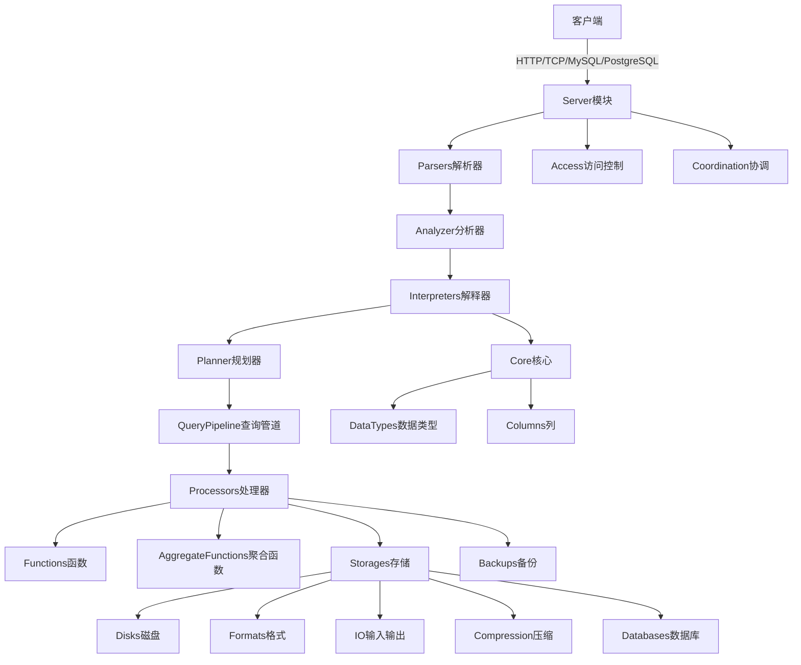
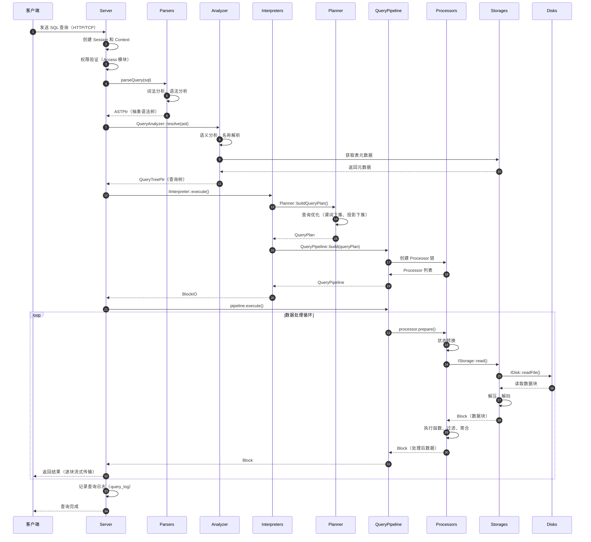
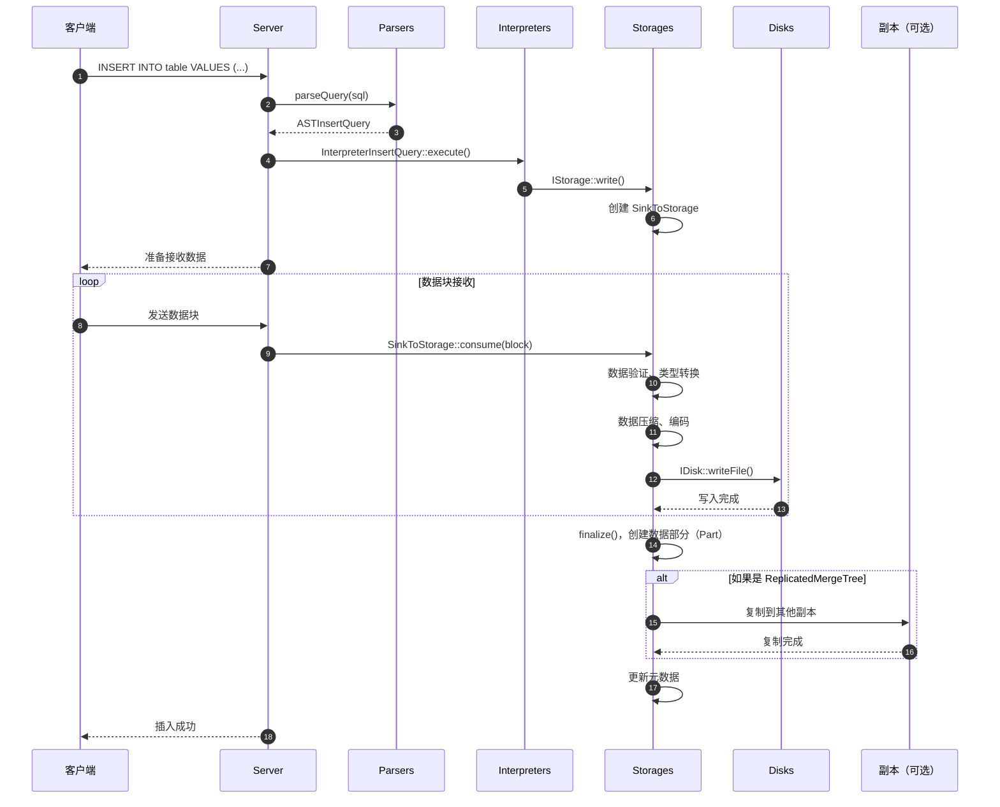
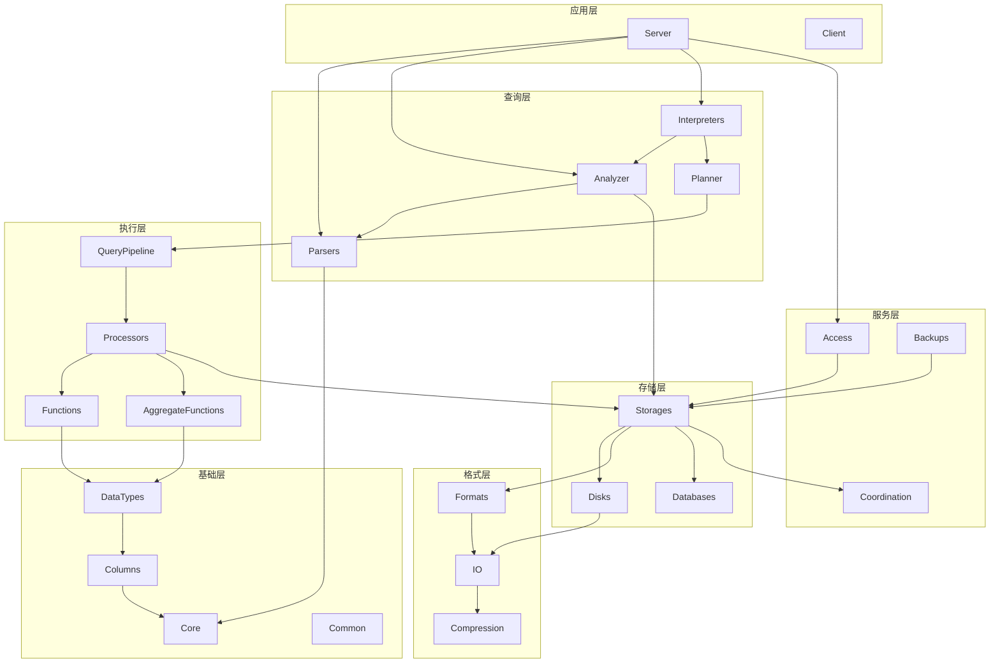

# ClickHouse-00-总览

## 摘要

ClickHouse 是一个开源的列式数据库管理系统（OLAP），专为实时分析数据报告而设计。项目采用 C++ 实现，支持高并发查询和大规模数据处理。

### 目标

- 提供高性能的列式存储和查询引擎
- 支持实时数据写入和查询
- 支持分布式集群部署
- 提供标准 SQL 接口

### 边界

- 主要面向 OLAP 场景，不适合高频更新
- 不支持完整的事务 ACID（仅提供最终一致性）
- 单表查询性能优先，JOIN 性能相对较弱

### 非目标

- 不是传统的 OLTP 数据库
- 不提供完整的 ACID 事务支持
- 不适合频繁的单行更新/删除操作

### 运行环境与部署形态

- 支持 Linux、macOS、FreeBSD 系统
- 可单机部署或集群部署
- 支持容器化部署（Docker/Kubernetes）
- 支持云原生环境（ClickHouse Cloud）

## 整体架构

### 架构图



### 架构说明

#### 图意概述

ClickHouse 采用分层架构设计，从客户端请求到最终数据存储，经过多个模块的协同处理。整体流程为：客户端通过多种协议连接 → 服务器接收请求 → SQL 解析 → 语义分析 → 查询规划 → 管道执行 → 数据处理 → 存储访问。

#### 关键模块与接口

**Server 模块**
- 职责：处理多协议连接（HTTP、TCP、MySQL、PostgreSQL 协议）
- 接口：提供 TCPHandler、HTTPHandler、MySQLHandler、PostgreSQLHandler
- 依赖：依赖 Poco 库处理网络通信

**Parsers 模块**
- 职责：将 SQL 文本解析为抽象语法树（AST）
- 接口：parseQuery() 函数，输入 SQL 字符串，输出 ASTPtr
- 依赖：独立模块，仅依赖 Core 基础类型

**Analyzer 模块**
- 职责：语义分析，将 AST 转换为查询树（Query Tree）
- 接口：QueryAnalyzer::resolve() 方法
- 依赖：依赖 Parsers、DataTypes、Storages

**Interpreters 模块**
- 职责：查询解释，将分析后的查询转换为执行计划
- 接口：IInterpreter::execute() 返回 BlockIO
- 依赖：依赖 Analyzer、Storages、Functions

**Planner 模块**
- 职责：查询优化与物理计划生成
- 接口：Planner::buildQueryPlan() 生成 QueryPlan
- 依赖：依赖 Interpreters、Processors

**QueryPipeline 模块**
- 职责：查询管道构建与执行协调
- 接口：QueryPipeline::execute() 执行管道
- 依赖：依赖 Processors

**Processors 模块**
- 职责：数据处理的基本单元，实现流式数据处理
- 接口：IProcessor::prepare()、work()、schedule()
- 依赖：依赖 Core、Columns、DataTypes

**Storages 模块**
- 职责：表数据的存储与访问
- 接口：IStorage::read()、write()
- 依赖：依赖 IO、Disks、Formats

**Functions 模块**
- 职责：标量函数实现
- 接口：IFunction::execute() 执行函数
- 依赖：依赖 DataTypes、Columns

**AggregateFunctions 模块**
- 职责：聚合函数实现
- 接口：IAggregateFunction::add()、merge()、insertResultInto()
- 依赖：依赖 DataTypes、Columns

**Access 模块**
- 职责：权限控制与用户认证
- 接口：AccessControl、ContextAccess
- 依赖：依赖 Core、Storages

**Coordination 模块**
- 职责：分布式协调（Keeper，ZooKeeper 替代品）
- 接口：KeeperStorage、KeeperServer
- 依赖：依赖 NuRaft 共识算法库

**IO 模块**
- 职责：底层输入输出抽象
- 接口：ReadBuffer、WriteBuffer
- 依赖：基础模块，被多个上层模块依赖

**Disks 模块**
- 职责：磁盘抽象，支持本地磁盘、S3、HDFS 等
- 接口：IDisk::readFile()、writeFile()
- 依赖：依赖 IO

**Formats 模块**
- 职责：数据格式序列化与反序列化
- 接口：IInputFormat、IOutputFormat
- 依赖：依赖 IO、DataTypes、Columns

**Compression 模块**
- 职责：数据压缩与解压
- 接口：CompressionCodec::compress()、decompress()
- 依赖：依赖 IO

**Databases 模块**
- 职责：数据库层抽象
- 接口：IDatabase::getTable()、createTable()
- 依赖：依赖 Storages

**Core 模块**
- 职责：核心数据结构与基础类型
- 接口：Block、Field、ColumnsWithTypeAndName
- 依赖：基础模块

**DataTypes 模块**
- 职责：数据类型系统
- 接口：IDataType::serializeBinary()、deserializeBinary()
- 依赖：依赖 Core

**Columns 模块**
- 职责：列数据的内存表示
- 接口：IColumn::insert()、get()、size()
- 依赖：依赖 Core

**Backups 模块**
- 职责：备份与恢复
- 接口：BackupEntriesCollector、RestorerFromBackup
- 依赖：依赖 Storages、IO、Disks

#### 边界条件

**并发控制**
- 查询并发由 max_concurrent_queries 参数控制
- 每个查询在独立的线程池中执行
- 资源组（Workload）机制实现查询隔离

**超时策略**
- 连接超时：http_receive_timeout（默认 30 秒）
- 查询超时：max_execution_time（默认无限制）
- 发送超时：send_timeout（默认 300 秒）

**幂等性**
- INSERT 查询通过 insert_deduplication_token 实现幂等
- ReplicatedMergeTree 表自动实现插入去重

**顺序保证**
- 单表插入保证块级顺序
- 分布式表不保证全局顺序
- ORDER BY 子句在 MergeTree 引擎中定义排序键

#### 异常与回退

**查询执行异常**
- 语法错误：解析阶段抛出异常，返回错误信息
- 权限错误：访问控制阶段拒绝，返回权限不足
- 执行错误：处理器执行失败，回滚事务（如适用）
- 超时错误：达到超时限制，取消查询执行

**存储异常**
- 磁盘故障：切换到备用磁盘（多磁盘策略）
- 副本不可用：从其他副本读取数据
- 数据损坏：使用校验和检测，跳过损坏部分

**网络异常**
- 连接断开：自动重试机制（可配置）
- 分布式查询失败：部分节点失败时可返回部分结果

**回退策略**
- 查询降级：允许从副本读取数据
- 功能降级：某些功能不可用时使用备用实现
- 数据恢复：从备份或副本恢复数据

#### 性能与容量假设

**性能指标**
- 单机查询吞吐：百万至十亿行/秒（取决于查询复杂度）
- 插入吞吐：每秒数十万至数百万行
- 查询延迟：简单查询毫秒级，复杂查询秒级
- 并发查询数：支持数百至数千并发查询

**容量假设**
- 单表数据量：PB 级别
- 单机存储容量：TB 至数十 TB
- 集群节点数：数千节点
- 单列基数：支持数十亿唯一值

**内存使用**
- 查询内存：由 max_memory_usage 限制（默认 10GB）
- 缓存大小：mark_cache（默认 5GB）、uncompressed_cache（默认关闭）
- 聚合内存：GROUP BY 操作可能占用大量内存

**磁盘 I/O**
- 顺序读：充分利用列式存储的优势
- 随机读：尽量避免，通过索引优化
- 压缩比：通常 5-10 倍（取决于数据类型）

#### 版本兼容与演进

**协议兼容性**
- TCP 协议：向后兼容，客户端版本可低于服务器版本
- HTTP 协议：RESTful 接口保持稳定
- MySQL/PostgreSQL 协议：支持大多数标准 SQL 客户端

**存储格式兼容性**
- 数据块格式：向后兼容，支持旧版本数据读取
- 元数据格式：版本升级时自动迁移
- 副本协议：要求集群内版本差异不超过一个大版本

**功能演进**
- LTS 版本：长期支持版本，提供稳定性保证
- Feature 版本：快速迭代，引入新特性
- 弃用策略：旧功能标记为 deprecated，至少保留两个大版本

**升级路径**
- 滚动升级：支持集群节点逐个升级
- 降级：不支持降级，需通过备份恢复
- 配置兼容：旧配置在新版本中继续有效

## 全局时序图

### 查询处理时序图



### 时序图说明

#### 图意概述

该时序图展示了 ClickHouse 处理一个典型 SELECT 查询的完整流程。从客户端发送查询到服务器返回结果，数据经过解析、分析、优化、执行多个阶段。整个过程采用流式处理，避免一次性加载所有数据到内存。

#### 关键步骤详解

**步骤 1-3：连接与认证**
- 客户端通过 HTTP 或 TCP 协议连接服务器
- Server 创建 Session 对象，管理连接生命周期
- Context 对象包含查询执行的所有上下文信息
- Access 模块验证用户身份和权限

**步骤 4-6：SQL 解析**
- Parser 模块将 SQL 文本转换为 AST（抽象语法树）
- 词法分析器（Lexer）将字符流转换为 Token 流
- 语法分析器（Parser）根据语法规则构建 AST
- 支持标准 SQL 和 ClickHouse 扩展语法

**步骤 7-11：语义分析**
- Analyzer 模块对 AST 进行语义分析
- 解析表名、列名，查询元数据
- 类型检查与类型推导
- 生成查询树（Query Tree），包含所有语义信息

**步骤 12-15：查询规划**
- Interpreter 选择合适的解释器（如 InterpreterSelectQuery）
- Planner 生成查询计划（Query Plan）
- 执行优化：谓词下推、投影下推、分区裁剪、索引选择
- 生成物理执行计划

**步骤 16-19：管道构建**
- QueryPipeline 将查询计划转换为处理器管道
- 创建 Source、Transform、Sink 等 Processor
- 连接 Processor 的输入输出端口
- 形成数据流图（DAG）

**步骤 20-21：管道执行**
- PipelineExecutor 调度 Processor 执行
- 采用 Push-Pull 混合模型
- 支持并行处理（多线程）

**步骤 22-32：数据处理循环**
- Processor 状态机驱动：prepare() → work() → schedule()
- Source Processor 从 Storage 读取数据
- Storage 从 Disk 读取原始数据（压缩格式）
- 解压缩、反序列化为 Block（内存中的数据块）
- Transform Processor 执行过滤、投影、函数计算、聚合
- 数据以 Block 为单位流式传输
- Server 逐块将结果发送给客户端

**步骤 33-34：查询完成**
- 记录查询日志到 system.query_log 表
- 更新性能指标（ProfileEvents、CurrentMetrics）
- 清理资源，关闭连接（或保持连接池）

#### 边界条件

**并发处理**
- 多个查询并发执行，每个查询独立的 Processor 管道
- 线程池大小由 max_threads 参数控制
- 内存使用由 max_memory_usage 限制

**流式处理**
- 数据以 Block（默认 65536 行）为单位处理
- 避免全表加载到内存
- 支持处理超大结果集

**超时控制**
- 每个阶段都有超时限制
- 达到超时后取消查询执行
- 清理已分配的资源

#### 异常处理

**解析异常**
- 语法错误：返回 SYNTAX_ERROR 异常，指出错误位置
- 处理方式：直接返回错误给客户端，不进入后续流程

**分析异常**
- 表不存在：UNKNOWN_TABLE
- 列不存在：UNKNOWN_IDENTIFIER
- 类型不匹配：TYPE_MISMATCH
- 处理方式：抛出异常，回滚资源

**执行异常**
- 存储错误：CANNOT_READ_FROM_FILE_DESCRIPTOR
- 内存不足：MEMORY_LIMIT_EXCEEDED
- 处理方式：取消查询，清理部分结果，返回错误

**网络异常**
- 连接断开：SOCKET_TIMEOUT
- 处理方式：停止发送数据，记录日志

#### 性能优化点

**解析优化**
- 查询缓存：相同查询复用 AST
- 并行解析：大型 SQL 可拆分并行解析

**分析优化**
- 元数据缓存：避免重复查询 system 表
- 类型推导缓存：减少重复计算

**执行优化**
- 谓词下推：WHERE 条件尽早应用
- 投影下推：只读取需要的列
- 分区裁剪：跳过不相关分区
- 索引加速：使用主键索引和跳数索引
- 并行执行：多线程并行处理

**I/O 优化**
- 预读：异步读取后续数据块
- 压缩：减少磁盘 I/O
- 缓存：Mark 缓存、未压缩缓存

#### 可观测性

**日志记录**
- query_log：查询执行日志
- query_thread_log：查询线程日志
- part_log：数据部分操作日志

**性能指标**
- ProfileEvents：计数器（如读取行数、字节数）
- CurrentMetrics：当前状态（如并发查询数、内存使用）
- AsynchronousMetrics：异步采集的指标（如 CPU 使用率）

**调试工具**
- EXPLAIN：查看查询计划
- EXPLAIN PIPELINE：查看 Processor 管道
- system.processes：查看正在执行的查询
- system.stack_trace：查看查询堆栈

### 插入数据时序图



### 插入时序图说明

**数据接收**
- 客户端分批发送数据
- 服务器端缓冲数据块

**数据写入**
- 数据先写入内存（MemoryStorage 或 Buffer）
- 达到阈值后刷写到磁盘（创建 Part）
- 压缩、编码提高存储效率

**副本同步**
- ReplicatedMergeTree 自动同步到其他副本
- 使用 ZooKeeper/Keeper 协调
- 保证最终一致性

## 模块交互矩阵

| 调用方 → 被调方 | Server | Parsers | Analyzer | Interpreters | Planner | QueryPipeline | Processors | Storages | Functions | AggregateFunctions | IO | Disks | Formats | Access | Coordination |
|---|---|---|---|---|---|---|---|---|---|---|---|---|---|---|---|
| **Server** | - | 同步 | 同步 | 同步 | - | - | - | - | - | - | - | - | - | 同步 | 同步 |
| **Parsers** | - | - | - | - | - | - | - | - | - | - | - | - | - | - | - |
| **Analyzer** | - | 同步 | - | - | - | - | - | 同步 | 同步 | - | - | - | - | - | - |
| **Interpreters** | - | - | 同步 | - | 同步 | 同步 | - | 同步 | 同步 | 同步 | - | - | - | 同步 | - |
| **Planner** | - | - | - | 同步 | - | 同步 | 同步 | 同步 | - | - | - | - | - | - | - |
| **QueryPipeline** | - | - | - | - | - | - | 同步 | - | - | - | - | - | - | - | - |
| **Processors** | - | - | - | - | - | - | 同步 | 同步 | 同步 | 同步 | 同步 | - | 同步 | - | - |
| **Storages** | - | - | - | - | - | - | 同步 | - | - | - | 同步 | 同步 | 同步 | - | 异步 |
| **Functions** | - | - | - | - | - | - | - | - | - | - | - | - | - | - | - |
| **AggregateFunctions** | - | - | - | - | - | - | - | - | - | - | - | - | - | - | - |
| **IO** | - | - | - | - | - | - | - | - | - | - | - | 同步 | - | - | - |
| **Disks** | - | - | - | - | - | - | - | - | - | - | 同步 | - | - | - | - |
| **Formats** | - | - | - | - | - | - | - | - | - | - | 同步 | - | - | - | - |
| **Access** | - | - | - | - | - | - | - | - | - | - | 同步 | 同步 | - | - | 同步 |
| **Coordination** | - | - | - | - | - | - | - | 同步 | - | - | 同步 | - | - | - | - |

### 交互矩阵说明

**同步调用**
- 调用方等待被调方返回结果
- 例如：Server 调用 Parsers 解析 SQL，等待返回 AST

**异步调用**
- 调用方不等待被调方完成，通过回调或轮询获取结果
- 例如：Storages 通过 Coordination 模块异步复制数据

**错误语义**
- 所有同步调用通过异常传递错误
- 异步调用通过回调函数传递错误

**一致性要求**
- Server → Access：强一致性，权限验证必须准确
- Storages → Coordination：最终一致性，副本同步允许短暂延迟
- Interpreters → Storages：强一致性，元数据必须准确
- Processors → Functions：强一致性，函数执行必须正确

## 关键设计与权衡

### 一致性、事务与锁

**一致性级别**
- 单表插入：块级原子性，整个块要么全部成功，要么全部失败
- 分布式表：最终一致性，不同节点可能短时间内数据不一致
- 副本：最终一致性，通过 ZooKeeper/Keeper 协调

**事务支持**
- 默认不支持多语句事务
- 实验性支持事务（Experimental Transactions）
- 每个 INSERT 语句作为独立事务

**锁机制**
- 表锁：DDL 操作获取表级锁
- 部分锁：后台合并操作获取部分级锁
- 无行锁：OLAP 场景不需要行级锁
- 读写不互斥：读操作不阻塞写操作（MVCC 风格）

**权衡**
- 牺牲强一致性，换取高性能
- 牺牲完整事务支持，简化实现
- 通过幂等性保证数据正确性

### 并发控制

**查询并发**
- 线程池：max_threads 控制单查询线程数
- 全局并发：max_concurrent_queries 控制同时执行的查询数
- 资源组：Workload 机制实现查询隔离和优先级

**写入并发**
- 多个 INSERT 并发执行
- 后台合并任务并发执行
- 通过配置控制后台任务数量

**内存管理**
- 每个查询独立的内存限制（max_memory_usage）
- 全局内存限制（max_server_memory_usage）
- 内存超限时取消查询或使用外部排序

**权衡**
- 高并发提高吞吐量，但增加资源竞争
- 细粒度控制提高灵活性，但增加管理复杂度

### 性能关键路径

**查询热路径**
1. SQL 解析（优化：查询缓存）
2. 分区裁剪（优化：分区索引）
3. 主键索引查找（优化：Mark 缓存）
4. 数据读取（优化：预读、并行读）
5. 数据解压（优化：SIMD、并行解压）
6. 列式过滤（优化：向量化执行）
7. 聚合计算（优化：并行聚合、预聚合）
8. 结果排序（优化：部分排序、Top-K）
9. 结果传输（优化：压缩、流式传输）

**写入热路径**
1. 数据验证（优化：批量验证）
2. 数据编码（优化：并行编码）
3. 数据压缩（优化：SIMD）
4. 磁盘写入（优化：批量写入、异步写入）
5. 元数据更新（优化：批量更新）
6. 副本同步（优化：异步复制）

**权衡**
- 内存 vs 磁盘：更多内存提高缓存命中率
- CPU vs I/O：并行处理充分利用 CPU，但增加内存和 I/O 压力
- 压缩比 vs 速度：高压缩比节省存储，但增加 CPU 开销

### 可观测性

**日志系统**
- system.query_log：查询执行日志，记录查询文本、执行时间、资源使用
- system.query_thread_log：查询线程日志，记录每个线程的执行情况
- system.part_log：数据部分操作日志，记录部分的创建、合并、删除
- system.trace_log：调用栈采样日志，用于性能分析
- system.metric_log：指标历史记录

**性能指标**
- ProfileEvents：事件计数器（如 Query、SelectQuery、InsertQuery、FileOpen、ReadBufferFromFileDescriptorRead）
- CurrentMetrics：当前状态指标（如 Query、TCPConnection、HTTPConnection、MemoryTracking）
- AsynchronousMetrics：异步采集指标（如 jemalloc.resident、CPUFrequencyMHz）

**调试工具**
- EXPLAIN：显示查询计划
- EXPLAIN PIPELINE：显示 Processor 管道结构
- EXPLAIN SYNTAX：显示优化后的 SQL
- EXPLAIN PLAN：显示详细的执行计划
- system.processes：查看正在执行的查询
- system.query_log：查询历史记录
- system.stack_trace：查看线程堆栈

**分布式追踪**
- OpenTelemetry 集成
- 跟踪查询在分布式集群中的执行路径
- 识别性能瓶颈

**权衡**
- 更多日志和指标提高可观测性，但增加存储和 CPU 开销
- 采样可以减少开销，但降低精度

### 配置项

**性能配置**
- max_threads：单查询最大线程数（默认：CPU 核心数）
- max_memory_usage：单查询最大内存（默认：10GB）
- max_execution_time：查询最大执行时间（默认：0，无限制）
- max_concurrent_queries：最大并发查询数（默认：100）

**存储配置**
- merge_tree/max_bytes_to_merge_at_max_space_in_pool：后台合并的最大数据量（默认：150GB）
- merge_tree/parts_to_throw_insert：部分数过多时拒绝插入（默认：3000）
- background_pool_size：后台合并线程池大小（默认：16）

**网络配置**
- http_port：HTTP 端口（默认：8123）
- tcp_port：TCP 端口（默认：9000）
- interserver_http_port：集群间通信端口（默认：9009）

**日志配置**
- logger.level：日志级别（trace、debug、information、warning、error）
- query_log.database：查询日志数据库（默认：system）
- query_log.table：查询日志表（默认：query_log）

**权衡**
- 默认配置适合大多数场景
- 根据工作负载调优可显著提升性能
- 配置过于激进可能导致不稳定

## 数据流与控制流

### 数据流

**查询数据流**
```
磁盘 → ReadBuffer → 解压 → 反序列化 → Block → Transform → Block → 序列化 → WriteBuffer → 网络
```

**插入数据流**
```
网络 → ReadBuffer → 反序列化 → Block → Transform → Block → 序列化 → 压缩 → WriteBuffer → 磁盘
```

**特点**
- 流式处理，避免全量加载
- 以 Block 为单位传输数据
- 支持管道中的背压（Backpressure）

### 控制流

**查询控制流**
```
请求接收 → 解析 → 分析 → 优化 → 执行 → 结果返回
```

**后台任务控制流**
```
定时触发 → 任务调度 → 任务执行 → 结果处理
```

**特点**
- 异步执行，不阻塞主流程
- 支持取消操作（Cancellation）
- 支持超时控制

## 模块依赖图



## 总结

ClickHouse 是一个高性能的列式数据库系统，通过精心设计的模块化架构，实现了从 SQL 解析到数据存储的完整流程。关键设计包括：

1. **分层架构**：清晰的模块划分，每个模块职责单一
2. **流式处理**：避免全量加载数据，支持处理超大数据集
3. **向量化执行**：充分利用 CPU SIMD 指令，提高计算效率
4. **列式存储**：减少 I/O，提高压缩比
5. **并行执行**：多线程并行处理，充分利用多核 CPU
6. **可扩展性**：支持分布式部署，水平扩展
7. **最终一致性**：牺牲强一致性，换取高性能

通过这些设计，ClickHouse 能够在 OLAP 场景下提供极高的查询性能和数据吞吐量。

