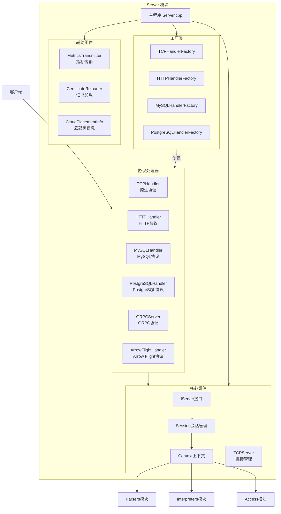
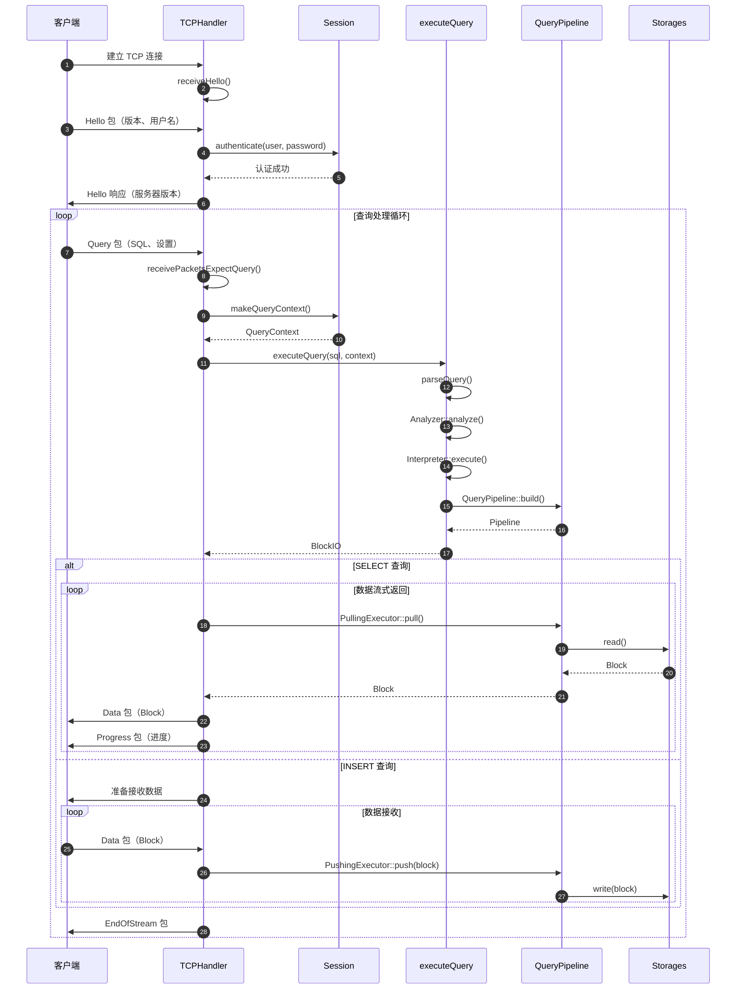
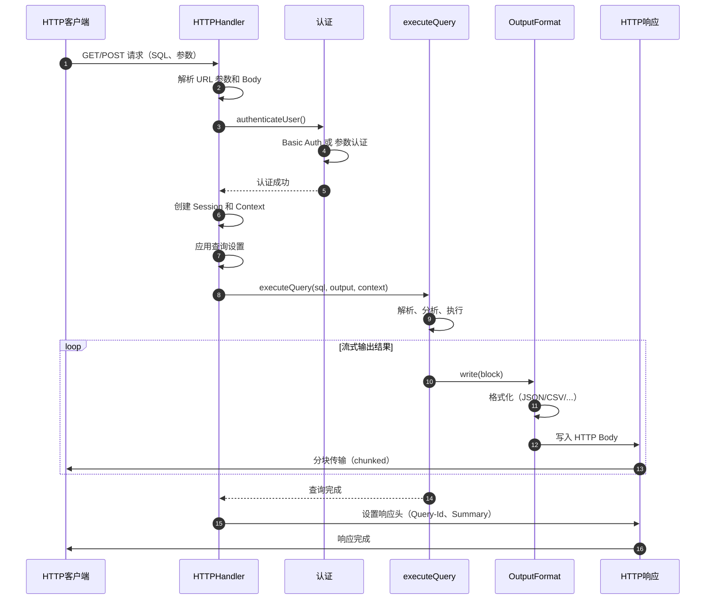
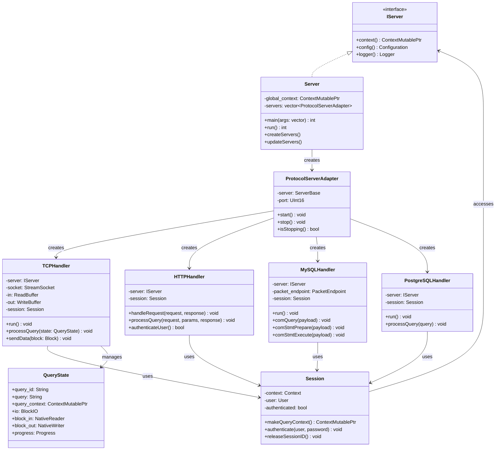
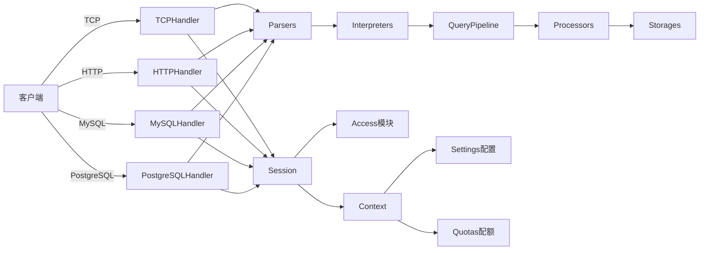

# ClickHouse-01-Server模块

## 模块概览

### 职责

Server 模块是 ClickHouse 的网络通信前端，负责：
- 处理多种协议的客户端连接（TCP、HTTP、MySQL、PostgreSQL、GRPC）
- 管理会话（Session）生命周期
- 协调请求路由与处理
- 维护连接池与资源管理

### 输入/输出

**输入**
- 客户端请求（SQL 查询、数据插入）
- 网络连接（Socket）
- 配置文件（端口、安全设置）

**输出**
- 查询结果（Block 流）
- 响应状态（成功/失败）
- 异常信息
- 进度更新

### 上下游依赖

**上游**：客户端应用（clickhouse-client、JDBC/ODBC 驱动、HTTP 客户端）

**下游**：
- Parsers（SQL 解析）
- Interpreters（查询执行）
- Access（权限验证）
- Context（执行上下文）

### 生命周期

```
Server 启动 → 绑定监听端口 → 接受连接 → 创建 Handler → 处理请求 → 返回响应 → 关闭连接 → Server 关闭
```

## 模块架构图



### 架构说明

#### 图意概述

Server 模块采用多协议适配器模式，通过统一的 IServer 接口对外提供服务，内部使用不同的 Handler 处理各种协议。每种协议都有对应的 Factory 负责创建 Handler 实例。核心组件包括 Session（会话管理）、Context（执行上下文）和 TCPServer（底层连接管理）。

#### 关键字段与接口

**IServer 接口**
- `context()`: 获取全局上下文
- `config()`: 获取配置信息
- `logger()`: 获取日志对象

**Session 类**
- `makeQueryContext()`: 创建查询上下文
- `authenticate()`: 用户认证
- `makeSessionContext()`: 创建会话上下文

**TCPHandler 类**
- `run()`: 主处理循环
- `receivePacket()`: 接收客户端数据包
- `sendData()`: 发送数据块
- `processQuery()`: 处理查询请求
- `processInsertQuery()`: 处理插入请求

**HTTPHandler 类**
- `handleRequest()`: 处理 HTTP 请求
- `processQuery()`: 执行查询
- `authenticateUser()`: 用户认证

**MySQLHandler 类**
- `run()`: 主处理循环
- `comQuery()`: 处理 COM_QUERY 命令
- `comStmtPrepare()`: 预处理语句
- `comStmtExecute()`: 执行预处理语句

#### 边界条件

**并发限制**
- `max_concurrent_queries`: 最大并发查询数（默认 100）
- `max_connections`: 最大连接数（默认 1024）
- 每个连接独立的线程或协程

**超时控制**
- `receive_timeout`: 接收超时（默认 300 秒）
- `send_timeout`: 发送超时（默认 300 秒）
- `idle_connection_timeout`: 空闲连接超时（默认 3600 秒）

**资源限制**
- 每个查询的内存限制
- 网络缓冲区大小限制
- 文件描述符数量限制

#### 异常与回退

**连接异常**
- `SOCKET_TIMEOUT`: 套接字超时，关闭连接
- `NETWORK_ERROR`: 网络错误，记录日志并关闭连接
- `AUTHENTICATION_FAILED`: 认证失败，返回错误响应

**协议异常**
- `UNKNOWN_PACKET_FROM_CLIENT`: 未知数据包，忽略或关闭连接
- `UNEXPECTED_PACKET_FROM_CLIENT`: 意外数据包，返回错误
- `BAD_ARGUMENTS`: 参数错误，返回错误信息

**执行异常**
- 查询执行失败：返回异常信息给客户端
- 内存不足：取消查询，返回错误
- 超时：停止查询执行，返回超时错误

**回退策略**
- 连接断开：清理资源，记录日志
- 协议错误：尝试恢复或关闭连接
- 部分失败：尽可能返回部分结果

#### 性能与容量假设

**性能指标**
- 单连接处理延迟：< 1ms（不含查询执行）
- 连接建立速度：数千连接/秒
- 数据传输速度：受网络带宽限制

**容量假设**
- 支持数千并发连接
- 单机数万 QPS（简单查询）
- 支持 GB 级结果集流式传输

**资源消耗**
- 每个连接约 100KB-1MB 内存
- CPU 主要用于数据序列化/反序列化
- 网络 I/O 为主要瓶颈

#### 版本兼容与演进

**TCP 协议兼容性**
- 协议版本号协商机制
- 向后兼容旧客户端
- 新特性通过版本检查启用

**HTTP 协议兼容性**
- RESTful API 保持稳定
- 新参数向后兼容
- 支持多种 HTTP 方法

**MySQL/PostgreSQL 协议**
- 支持标准协议子集
- 部分高级特性不支持
- 兼容主流客户端驱动

## 核心 API 详解

### API 1: TCPHandler - 处理 TCP 原生协议

#### 基本信息

- **名称**: `TCPHandler::run()`
- **协议**: TCP Binary Protocol
- **幂等性**: 取决于具体 SQL 语句（SELECT 幂等，INSERT 需要去重机制）

#### 请求结构体

```cpp
// TCP 协议使用数据包（Packet）而非结构体
// 数据包类型在 Protocol::Client 命名空间定义
namespace Protocol::Client
{
    enum PacketType
    {
        Hello = 0,        // 握手
        Query = 1,        // 查询
        Data = 2,         // 数据（INSERT）
        Cancel = 3,       // 取消
        Ping = 4,         // 心跳
        TablesStatusRequest = 5,  // 表状态请求
    };
}

// 查询数据包结构
struct QueryPacket
{
    String query_id;              // 查询 ID
    ClientInfo client_info;       // 客户端信息
    Settings settings;            // 查询设置
    String query;                 // SQL 查询文本
    QueryProcessingStage::Enum stage;  // 处理阶段
    Compression compression;      // 压缩方式
};
```

| 字段 | 类型 | 必填 | 默认 | 约束 | 说明 |
|---|---|---:|---|---|---|
| query_id | String | 否 | 自动生成 | 最长 256 字符 | 查询唯一标识符 |
| client_info | ClientInfo | 是 | - | - | 客户端版本、地址等信息 |
| settings | Settings | 否 | 默认设置 | - | 查询级别设置 |
| query | String | 是 | - | 最长由 max_query_size 控制 | SQL 查询文本 |
| stage | Enum | 否 | Complete | - | 查询处理阶段（Complete/FetchColumns等） |
| compression | Enum | 否 | Disable | - | 数据压缩方式 |

#### 响应结构体

```cpp
namespace Protocol::Server
{
    enum PacketType
    {
        Hello = 0,        // 握手响应
        Data = 1,         // 数据块
        Exception = 2,    // 异常
        Progress = 3,     // 进度更新
        Pong = 4,         // Ping 响应
        EndOfStream = 5,  // 流结束
        ProfileInfo = 6,  // 性能信息
        Totals = 7,       // 总计
        Extremes = 8,     // 极值
        TablesStatusResponse = 9,  // 表状态响应
        Log = 10,         // 日志
        TableColumns = 11, // 表列信息
    };
}

// 数据块响应
struct DataPacket
{
    Block block;  // 数据块（包含列名、类型、数据）
};

// 异常响应
struct ExceptionPacket
{
    Int32 code;           // 错误码
    String name;          // 错误名称
    String message;       // 错误消息
    String stack_trace;   // 堆栈跟踪（可选）
};
```

| 字段 | 类型 | 必填 | 默认 | 约束 | 说明 |
|---|---|---:|---|---|---|
| block | Block | 是 | - | - | 包含列信息和数据的块 |
| code | Int32 | 是 | - | - | ClickHouse 错误码 |
| name | String | 是 | - | - | 异常类型名称 |
| message | String | 是 | - | - | 人类可读的错误描述 |
| stack_trace | String | 否 | - | - | 调用堆栈（debug 模式） |

#### 入口函数与关键代码

```cpp
void TCPHandler::run()
{
    try
    {
        runImpl();
    }
    catch (...)
    {
        // （此处省略异常处理和清理逻辑）
    }
}

void TCPHandler::runImpl()
{
    // 1) 连接初始化
    connection_context = server.context();
    socket().setReceiveTimeout(receive_timeout);
    socket().setSendTimeout(send_timeout);
    
    in = std::make_shared<ReadBufferFromPocoSocketChunked>(socket());
    out = std::make_shared<WriteBufferFromPocoSocketChunked>(socket());
    
    // 2) 协议握手
    if (parse_proxy_protocol)
        receiveProxyHeader();
    
    receiveHello();  // 接收客户端 Hello 包
    sendHello();     // 发送服务器 Hello 包
    
    // 3) 主处理循环
    while (true)
    {
        // 等待客户端数据包
        std::optional<QueryState> state;
        
        // 接收并处理数据包
        if (!receivePacketsExpectQuery(state))
            break;  // 连接关闭
        
        if (!state)
            continue;  // Ping 等无状态包
        
        // 处理查询
        processQuery(state);
        
        // 检查连接关闭条件
        if (query_count >= max_queries_per_connection)
            break;
    }
}

void TCPHandler::processQuery(std::optional<QueryState> & state)
{
    const auto & query = state->query;
    
    // 1) 创建查询上下文
    state->query_context = session->makeQueryContext();
    
    // 2) 权限验证
    // （此处省略权限检查逻辑）
    
    // 3) 判断查询类型
    const auto & ast = parseQuery(query);
    
    if (ast->as<ASTInsertQuery>())
    {
        // INSERT 查询
        processInsertQuery(*state);
    }
    else
    {
        // 其他查询（SELECT、DDL 等）
        processOrdinaryQuery(*state);
    }
}

void TCPHandler::processOrdinaryQuery(QueryState & state)
{
    // 1) 执行查询，获取 BlockIO
    auto [ast, io] = executeQuery(
        state.query,
        state.query_context,
        QueryFlags{},
        state.stage
    );
    
    state.io = std::move(io);
    
    // 2) 流式发送结果
    if (state.io.pipeline.pulling())
    {
        PullingAsyncPipelineExecutor executor(state.io.pipeline);
        
        while (executor.pull(block))
        {
            sendData(state, block);
            
            // 定期发送进度
            if (after_send_progress.elapsedSeconds() >= min_interval)
                sendProgress(state);
        }
    }
    
    // 3) 发送结束标记
    sendProgress(state);
    sendEndOfStream(state);
}

void TCPHandler::processInsertQuery(QueryState & state)
{
    // 1) 启动 INSERT 执行
    auto [ast, io] = executeQuery(state.query, state.query_context);
    state.io = std::move(io);
    
    // 2) 接收客户端数据块
    PushingAsyncPipelineExecutor executor(state.io.pipeline);
    
    while (receivePacketsExpectData(state))
    {
        // 将数据块写入管道
        executor.push(state.block_for_insert);
    }
    
    // 3) 完成插入
    executor.finish();
    
    // 4) 发送响应
    sendProgress(state);
    sendEndOfStream(state);
}
```

#### 调用链分析

**完整调用链**

```
TCPHandler::run()
  └─> TCPHandler::runImpl()
      ├─> receiveHello()                    // 接收握手
      │   └─> ReadBuffer::readVarUInt()
      ├─> sendHello()                       // 发送握手
      │   └─> WriteBuffer::writeVarUInt()
      └─> 主循环
          ├─> receivePacketsExpectQuery()   // 接收查询包
          │   ├─> ReadBuffer::readVarUInt()  // 读取包类型
          │   ├─> readStringBinary()         // 读取查询文本
          │   └─> Settings::deserialize()    // 反序列化设置
          ├─> processQuery()                 // 处理查询
          │   ├─> Session::makeQueryContext()  // 创建上下文
          │   ├─> AccessControl::checkAccess()  // 权限检查
          │   ├─> parseQuery()                 // 解析 SQL
          │   │   └─> ParserQuery::parse()
          │   ├─> executeQuery()               // 执行查询
          │   │   ├─> Analyzer::analyze()      // 语义分析
          │   │   ├─> Interpreter::execute()   // 查询执行
          │   │   └─> QueryPipeline::build()   // 构建管道
          │   └─> 分支：
          │       ├─> processOrdinaryQuery()   // SELECT 等
          │       │   ├─> PullingAsyncPipelineExecutor::pull()
          │       │   └─> sendData()           // 发送数据块
          │       └─> processInsertQuery()     // INSERT
          │           ├─> receivePacketsExpectData()  // 接收数据
          │           └─> PushingAsyncPipelineExecutor::push()
          ├─> sendProgress()                 // 发送进度
          │   └─> WriteBuffer::write()
          └─> sendEndOfStream()              // 发送结束标记
              └─> WriteBuffer::write()
```

**关键函数详解**

**1. receivePacketsExpectQuery**

```cpp
bool TCPHandler::receivePacketsExpectQuery(std::optional<QueryState> & state)
{
    UInt64 packet_type = 0;
    readVarUInt(packet_type, *in);  // 读取包类型
    
    switch (packet_type)
    {
        case Protocol::Client::Query:
        {
            state.emplace();
            // 读取查询 ID
            readStringBinary(state->query_id, *in);
            // 读取客户端信息
            state->client_info.read(*in);
            // 读取设置
            state->query_context->getSettingsRef().deserialize(*in);
            // 读取查询文本
            readStringBinary(state->query, *in);
            return true;
        }
        
        case Protocol::Client::Ping:
            sendPong();
            return true;
        
        case Protocol::Client::Cancel:
            return false;  // 客户端取消
        
        default:
            throw Exception("Unexpected packet from client");
    }
}
```

**2. sendData**

```cpp
void TCPHandler::sendData(QueryState & state, const Block & block)
{
    // 写入包类型
    writeVarUInt(Protocol::Server::Data, *out);
    
    // 可选压缩
    if (state.compression == Protocol::Compression::Enable)
    {
        CompressedWriteBuffer compressed(*state.maybe_compressed_out);
        state.block_out = std::make_unique<NativeWriter>(compressed);
    }
    
    // 序列化数据块
    state.block_out->write(block);
    
    // 刷新缓冲区
    state.maybe_compressed_out->next();
    out->next();
}
```

#### 时序图



#### 异常与性能要点

**异常处理**
- **网络异常**: SOCKET_TIMEOUT、NETWORK_ERROR - 关闭连接，清理资源
- **协议异常**: UNKNOWN_PACKET、UNEXPECTED_PACKET - 发送异常响应或关闭连接
- **执行异常**: 捕获查询执行中的所有异常，封装为 Exception 包发送给客户端
- **认证异常**: AUTHENTICATION_FAILED - 发送异常并关闭连接

**性能优化**
- **零拷贝**: 使用 BLOB 类型避免数据拷贝
- **批量传输**: Block 为单位传输数据，默认 65536 行
- **压缩**: 支持 LZ4、ZSTD 等压缩算法
- **流式处理**: 不等待全部结果，边计算边传输
- **连接复用**: 同一连接可执行多个查询，减少握手开销

**内存控制**
- 读写缓冲区大小可配置
- 单查询内存由 max_memory_usage 限制
- 达到内存限制时使用外部排序/聚合

**超时与重试**
- 接收超时：receive_timeout（默认 300 秒）
- 发送超时：send_timeout（默认 300 秒）
- 空闲超时：idle_connection_timeout（默认 3600 秒）
- 客户端需实现重试机制（服务器端不自动重试）

### API 2: HTTPHandler - 处理 HTTP 协议

#### 基本信息

- **名称**: `HTTPHandler::handleRequest()`
- **协议**: HTTP/1.1、HTTP/2
- **幂等性**: GET、HEAD 方法幂等；POST 方法取决于 SQL 语句

#### 请求结构体

```cpp
// HTTP 请求通过 URL 参数和 Body 传递
struct HTTPRequest
{
    String method;                    // GET/POST
    String uri;                       // /query 或 /
    Map<String, String> params;       // URL 参数
    Map<String, String> headers;      // HTTP 头
    String body;                      // 请求体（SQL 或数据）
};

// 常用 URL 参数
struct QueryParams
{
    String query;                     // SQL 查询（GET 方法）
    String database;                  // 默认数据库
    String user;                      // 用户名
    String password;                  // 密码
    String query_id;                  // 查询 ID
    String format;                    // 结果格式（JSON/CSV/TabSeparated等）
    String session_id;                // 会话 ID
    UInt64 session_timeout;           // 会话超时
    Map<String, String> settings;     // 查询设置
};
```

| 参数 | 类型 | 必填 | 默认 | 约束 | 说明 |
|---|---|---:|---|---|---|
| query | String | 是 | - | - | SQL 查询文本（GET）或在 Body（POST） |
| database | String | 否 | default | - | 默认数据库 |
| user | String | 否 | default | - | 用户名（或通过 Basic Auth） |
| password | String | 否 | - | - | 密码（或通过 Basic Auth） |
| format | String | 否 | TabSeparated | 支持的格式 | 输出格式 |
| query_id | String | 否 | 自动生成 | - | 查询唯一标识 |
| compress | Bool | 否 | 0 | 0/1 | 是否压缩响应 |
| max_threads | UInt64 | 否 | auto | >0 | 查询线程数 |

#### 响应结构体

```cpp
struct HTTPResponse
{
    UInt16 status_code;               // 200/400/500 等
    Map<String, String> headers;      // HTTP 头
    String body;                      // 响应体（格式化数据）
};

// 常用响应头
struct ResponseHeaders
{
    String X-ClickHouse-Query-Id;             // 查询 ID
    String X-ClickHouse-Format;               // 数据格式
    String X-ClickHouse-Timezone;             // 时区
    String X-ClickHouse-Summary;              // 查询统计（JSON）
    String Content-Type;                      // 内容类型
    String Content-Encoding;                  // 压缩方式（gzip/deflate）
};
```

| 字段 | 类型 | 必填 | 默认 | 约束 | 说明 |
|---|---|---:|---|---|---|
| status_code | UInt16 | 是 | - | HTTP 状态码 | 200 成功，4xx 客户端错误，5xx 服务器错误 |
| X-ClickHouse-Query-Id | String | 是 | - | - | 用于追踪和取消查询 |
| X-ClickHouse-Summary | String | 否 | - | JSON 格式 | 包含读取行数、字节数、执行时间等 |
| body | String | 是 | - | - | 格式化的查询结果或错误信息 |

#### 入口函数与关键代码

```cpp
void HTTPHandler::handleRequest(
    HTTPServerRequest & request,
    HTTPServerResponse & response,
    const ProfileEvents::Event & write_event)
{
    Output used_output;
    std::optional<CurrentThread::QueryScope> query_scope;
    
    try
    {
        // 1) 解析 URL 参数
        HTMLForm params(default_settings, request);
        
        // 2) 用户认证
        if (!authenticateUser(request, params, response))
            return;
        
        // 3) 处理查询
        processQuery(request, params, response, used_output, query_scope, write_event);
    }
    catch (...)
    {
        // （此处省略异常处理逻辑）
        trySendExceptionToClient(exception_code, message, request, response, used_output);
    }
}

void HTTPHandler::processQuery(
    HTTPServerRequest & request,
    HTMLForm & params,
    HTTPServerResponse & response,
    Output & used_output,
    std::optional<CurrentThread::QueryScope> & query_scope,
    const ProfileEvents::Event & write_event)
{
    // 1) 创建会话和上下文
    session = makeSession();
    auto context = session->makeQueryContext();
    
    // 2) 应用设置
    for (const auto & [key, value] : params)
    {
        if (key.starts_with("param_"))
        {
            // 查询参数
            context->setQueryParameter(key.substr(6), value);
        }
        else
        {
            // 设置参数
            context->setSetting(key, value);
        }
    }
    
    // 3) 获取查询文本
    String query = getQuery(request, params, context);
    
    // 4) 准备输出
    String format = params.get("format", "TabSeparated");
    used_output.out_holder = std::make_shared<WriteBufferFromHTTPServerResponse>(
        response,
        request.getMethod() == HTTPRequest::HTTP_HEAD,
        write_event
    );
    
    // 5) 执行查询
    executeQuery(
        query,
        *used_output.out_maybe_compressed,
        /* allow_into_outfile = */ false,
        context,
        [&](const QueryResultDetails & details)
        {
            // 设置响应头
            response.add("X-ClickHouse-Query-Id", details.query_id);
            response.add("X-ClickHouse-Format", format);
            if (details.timezone)
                response.add("X-ClickHouse-Timezone", *details.timezone);
        }
    );
    
    // 6) 完成输出
    used_output.finalize();
}
```

#### 调用链分析

```
HTTPHandler::handleRequest()
  ├─> HTMLForm::HTMLForm()                      // 解析 URL 参数
  ├─> authenticateUser()                        // 用户认证
  │   ├─> authenticateUserByHTTP()
  │   └─> Session::authenticate()
  ├─> processQuery()
  │   ├─> Session::makeQueryContext()           // 创建查询上下文
  │   ├─> Context::setSetting()                 // 应用设置
  │   ├─> getQuery()                            // 获取 SQL
  │   │   ├─> DynamicQueryHandler: params.get("query")
  │   │   └─> PredefinedQueryHandler: predefined_query
  │   ├─> WriteBufferFromHTTPServerResponse::WriteBufferFromHTTPServerResponse()
  │   └─> executeQuery()                        // 执行查询
  │       ├─> parseQuery()
  │       ├─> Analyzer::analyze()
  │       ├─> Interpreter::execute()
  │       ├─> OutputFormat::write()             // 格式化输出
  │       │   ├─> JSONEachRowOutputFormat::write()
  │       │   ├─> CSVOutputFormat::write()
  │       │   └─> NativeOutputFormat::write()
  │       └─> WriteBuffer::write()              // 写入 HTTP 响应
  └─> Output::finalize()                        // 完成响应
```

#### 时序图



#### 异常与性能要点

**异常处理**
- **认证失败**: 返回 401 Unauthorized，WWW-Authenticate 头
- **查询错误**: 返回 400 Bad Request，错误信息在 Body
- **执行错误**: 返回 500 Internal Server Error，异常详情在 Body
- **格式错误**: 如果已开始发送数据，将异常信息追加到输出

**性能优化**
- **Keep-Alive**: 支持 HTTP 持久连接，减少握手开销
- **压缩**: 支持 gzip、deflate、brotli 压缩
- **流式传输**: 使用 Transfer-Encoding: chunked，边计算边返回
- **缓存控制**: 通过 Cache-Control 头支持浏览器缓存

**格式支持**
- **结构化格式**: JSON、JSONEachRow、JSONCompact、XML
- **文本格式**: TabSeparated、CSV、TSV、Pretty
- **二进制格式**: Native、RowBinary、Parquet、Arrow
- **自定义格式**: 支持通过插件扩展

## 其他协议处理器

### MySQL 协议（MySQLHandler）

**特点**
- 兼容 MySQL 客户端和驱动（JDBC、Python MySQLdb 等）
- 支持 MySQL 握手、认证
- 支持 COM_QUERY、COM_STMT_PREPARE、COM_STMT_EXECUTE 等命令
- 数据类型映射：ClickHouse 类型 ↔ MySQL 类型

**限制**
- 不支持所有 MySQL 特性（如存储过程、触发器）
- 事务支持有限
- 部分函数名称不同

### PostgreSQL 协议（PostgreSQLHandler）

**特点**
- 兼容 PostgreSQL 客户端和驱动（JDBC、psycopg2 等）
- 支持扩展查询协议（Extended Query Protocol）
- 支持预处理语句（Prepared Statements）
- 支持 COPY 协议（数据导入/导出）

**限制**
- 不支持完整的 PostgreSQL 扩展（如 PL/pgSQL）
- 部分系统函数不支持

### GRPC 协议（GRPCServer）

**特点**
- 基于 gRPC 框架
- 支持流式查询（Server Streaming）
- 支持双向流（Bidirectional Streaming）
- Protocol Buffers 序列化

**优势**
- 高性能、低延迟
- 强类型接口
- 跨语言支持
- 支持负载均衡、服务发现

## 数据结构 UML 图



### UML 图说明

**IServer 接口**
- 定义服务器的基本接口
- 提供全局上下文、配置、日志访问

**Server 类**
- 主服务器类，继承自 BaseDaemon
- 管理所有协议服务器
- 负责启动、停止、重新加载配置

**协议处理器（Handler）**
- TCPHandler、HTTPHandler、MySQLHandler、PostgreSQLHandler
- 每种协议一个处理器类
- 共享 Session 对象管理会话状态

**Session 类**
- 管理用户会话
- 处理认证
- 创建查询上下文

**QueryState 结构**
- 保存单个查询的状态
- 包含查询文本、上下文、I/O 对象
- 跟踪执行进度

**ProtocolServerAdapter**
- 适配不同协议服务器的统一接口
- 管理服务器生命周期

## 模块交互图



### 交互说明

**客户端 → Handler**
- 客户端通过不同协议连接对应的 Handler
- Handler 负责协议解析和数据格式转换

**Handler → Session**
- 所有 Handler 通过 Session 管理会话状态
- Session 提供认证、上下文创建

**Session → Access**
- 调用 Access 模块进行权限验证
- 检查用户、角色、行级权限

**Handler → Parsers → Interpreters → Pipeline**
- 标准查询执行流程
- Handler 将 SQL 传递给解析器
- 逐层处理直到数据存储

## 实战经验

### 连接管理最佳实践

**TCP 连接**
- 使用连接池，复用连接，减少握手开销
- 设置合理的超时参数（receive_timeout、send_timeout）
- 启用压缩（LZ4），特别是网络带宽有限时

**HTTP 连接**
- 使用 Keep-Alive，复用 HTTP 连接
- 合理设置 session_timeout，避免频繁认证
- 大数据量传输使用 POST 方法，避免 URL 长度限制

### 性能调优

**并发控制**
- 设置 max_threads 匹配 CPU 核心数
- 限制 max_concurrent_queries 防止资源耗尽
- 使用资源组（Workload）隔离不同优先级的查询

**内存优化**
- 设置 max_memory_usage 避免 OOM
- 启用外部排序/聚合处理大数据量
- 监控 system.metrics 中的内存指标

**网络优化**
- 启用压缩减少网络传输
- 使用批量插入，减少网络往返
- 分布式查询时考虑数据本地性

### 安全配置

**认证授权**
- 使用强密码或证书认证
- 最小权限原则，限制用户权限
- 定期审计 system.query_log

**网络安全**
- 仅在受信任网络开放端口
- 使用 SSL/TLS 加密通信
- 配置防火墙规则

**防护措施**
- 设置查询超时（max_execution_time）
- 限制查询复杂度（max_ast_depth、max_expanded_ast_elements）
- 启用查询日志，监控异常行为

### 监控指标

**关键指标**
- `CurrentMetrics::Query`: 当前执行的查询数
- `CurrentMetrics::TCPConnection`: TCP 连接数
- `CurrentMetrics::HTTPConnection`: HTTP 连接数
- `ProfileEvents::Query`: 总查询数
- `ProfileEvents::FailedQuery`: 失败查询数

**性能指标**
- 查询延迟（p50、p95、p99）
- 查询吞吐量（QPS）
- 网络带宽使用
- 连接池利用率

## 总结

Server 模块是 ClickHouse 的门户，提供多协议支持，核心职责包括：

1. **多协议适配**：TCP、HTTP、MySQL、PostgreSQL、GRPC 等
2. **会话管理**：Session 管理用户会话和认证
3. **请求路由**：将请求分发到相应的处理逻辑
4. **数据传输**：支持流式、压缩、批量传输
5. **性能优化**：连接复用、并行处理、资源限制
6. **安全控制**：认证、授权、加密、审计

通过灵活的架构设计，Server 模块能够高效处理各种客户端连接，为 ClickHouse 提供统一、高性能的服务接口。

