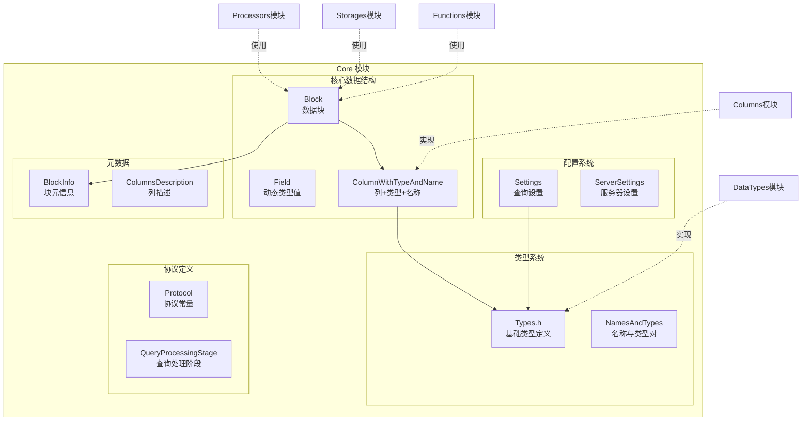
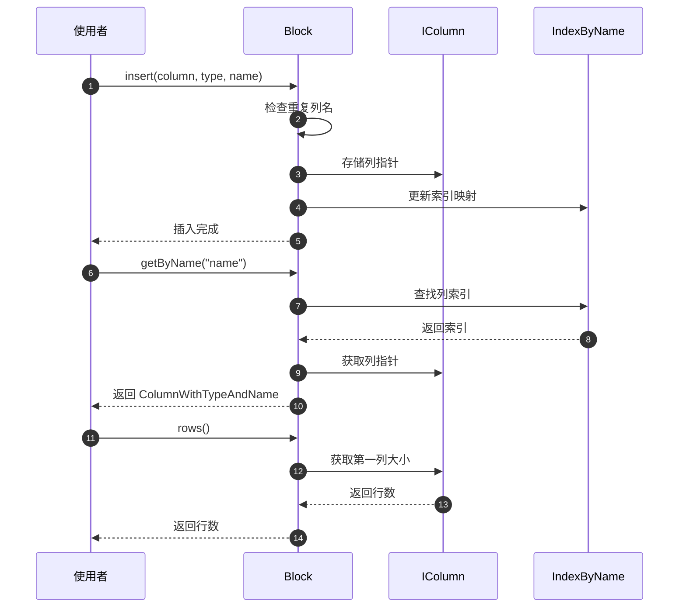
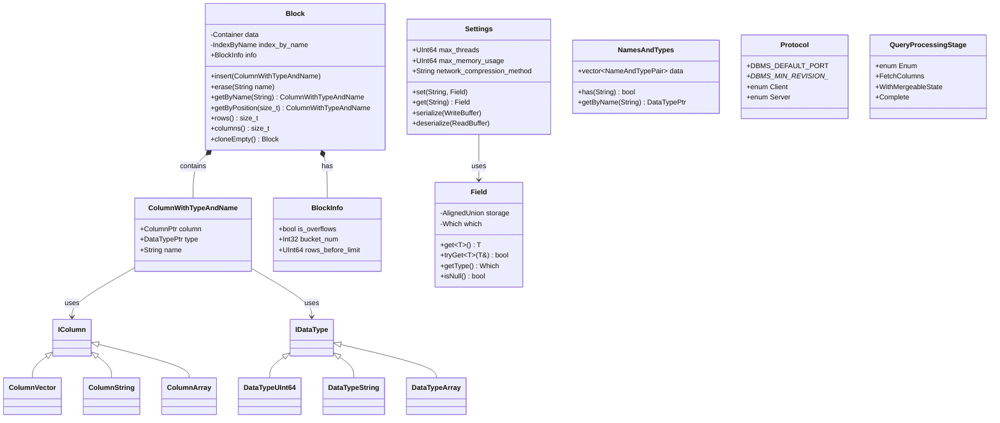
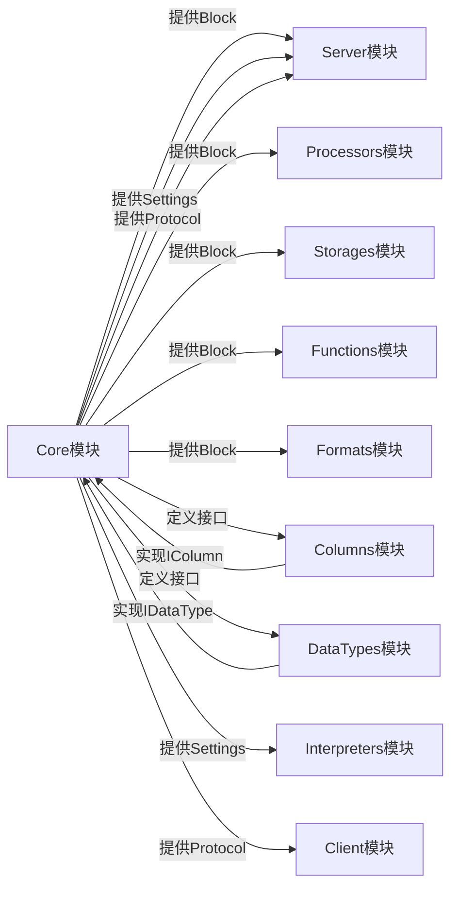

# ClickHouse-02-Core模块

## 模块概览

### 职责

Core 模块是 ClickHouse 的基础核心模块，提供最基本的数据结构和类型定义，包括：
- 数据块（Block）：内存中的数据表示
- 字段（Field）：单个值的动态类型容器
- 数据类型系统基础
- 列式存储基础结构
- 协议定义和常量
- 设置与配置系统

### 输入/输出

**输入**
- 配置参数（Settings）
- 原始数据（各种数据类型）
- 网络协议数据包

**输出**
- Block（数据块，用于模块间传递数据）
- Field（动态类型值）
- 类型信息（DataType）

### 上下游依赖

**上游**：所有其他模块（Core 是基础模块，不依赖其他业务模块）

**下游**：
- Columns（列数据实现）
- DataTypes（数据类型实现）
- Server（使用 Block 传递数据）
- Processors（使用 Block 处理数据）
- Storages（使用 Block 读写数据）
- Functions（使用 Block 执行函数）

### 生命周期

Core 模块的对象贯穿整个查询处理过程：

```
启动 → 加载配置（Settings） → 创建 Block → 填充数据 → 处理数据 → 销毁 Block → 关闭
```

## 模块架构图



### 架构说明

#### 图意概述

Core 模块提供 ClickHouse 的基础数据结构和类型系统。Block 是数据传递的基本单元，包含多个列（ColumnWithTypeAndName），每个列有名称、类型和数据。Field 用于表示单个动态类型的值。Settings 管理查询和服务器的各种参数。Protocol 定义了客户端和服务器之间的通信协议。

#### 关键字段与接口

**Block 类**
```cpp
class Block {
    Container data;                   // 列的容器（vector<ColumnWithTypeAndName>）
    IndexByName index_by_name;        // 列名到索引的映射
    BlockInfo info;                   // 块的元信息
    
    // 主要方法
    void insert(ColumnWithTypeAndName elem);     // 插入列
    void erase(const String & name);             // 删除列
    ColumnWithTypeAndName & getByName(const String & name);  // 按名称获取列
    size_t rows() const;                         // 行数
    size_t columns() const;                      // 列数
    Block cloneEmpty() const;                    // 克隆结构（不含数据）
};
```

**ColumnWithTypeAndName 结构**
```cpp
struct ColumnWithTypeAndName {
    ColumnPtr column;        // 实际列数据（IColumn 指针）
    DataTypePtr type;        // 数据类型（IDataType 指针）
    String name;             // 列名
};
```

**Field 类**
```cpp
class Field {
    // 可以存储多种类型的值
    // Null, UInt64, Int64, Float64, String, Array, Tuple, Map, etc.
    
    // 主要方法
    template <typename T> T & get();              // 获取值
    template <typename T> const T & get() const;
    template <typename T> bool tryGet(T & result) const;  // 尝试获取
    Types::Which getType() const;                 // 获取类型
};
```

**Settings 类**
```cpp
struct Settings {
    // 包含数百个设置项，如：
    UInt64 max_threads;                  // 最大线程数
    UInt64 max_memory_usage;             // 最大内存使用
    String network_compression_method;   // 网络压缩方法
    
    // 主要方法
    void set(const String & name, const Field & value);   // 设置值
    Field get(const String & name) const;                 // 获取值
    void serialize(WriteBuffer & buf) const;              // 序列化
    void deserialize(ReadBuffer & buf);                   // 反序列化
};
```

#### 边界条件

**Block 大小限制**
- 默认块大小：65536 行（DEFAULT_BLOCK_SIZE）
- 插入块大小：1048576 行（DEFAULT_INSERT_BLOCK_SIZE）
- 最小块大小：受内存和性能权衡
- 最大块大小：受内存限制

**Field 类型范围**
- 支持的类型：Null、整数、浮点数、字符串、数组、元组、映射
- 最大字符串长度：受可用内存限制
- 嵌套深度：数组/元组的嵌套层数应合理

**Settings 约束**
- 每个设置项都有类型约束
- 有最小值、最大值限制（如 max_threads > 0）
- 某些设置项相互依赖

#### 异常与回退

**Block 操作异常**
- 列不存在：抛出 THERE_IS_NO_COLUMN 异常
- 行数不一致：抛出 SIZES_OF_COLUMNS_DOESNT_MATCH
- 内存不足：抛出 MEMORY_LIMIT_EXCEEDED

**Field 类型转换异常**
- 类型不匹配：抛出 BAD_TYPE_OF_FIELD
- 值溢出：抛出 VALUE_IS_OUT_OF_RANGE_OF_DATA_TYPE

**Settings 解析异常**
- 未知设置：抛出 UNKNOWN_SETTING
- 值类型错误：抛出 TYPE_MISMATCH
- 值超出范围：抛出 ARGUMENT_OUT_OF_BOUND

#### 性能与容量假设

**Block 性能**
- 列式存储：每列连续存储，缓存友好
- 向量化处理：批量处理整个 Block
- 内存局部性：同类型数据连续存储

**容量假设**
- 单个 Block：通常 10-100 MB
- 列数：通常几十到几百列
- 行数：默认 65536 行

**内存使用**
- Block 内存 = Σ(每列的内存使用)
- 列内存 = 行数 × 每行字节数
- 元数据开销：相对较小

#### 版本兼容与演进

**协议版本**
- DBMS_MIN_REVISION_WITH_CLIENT_INFO：客户端信息
- DBMS_MIN_REVISION_WITH_SERVER_TIMEZONE：时区支持
- DBMS_MIN_REVISION_WITH_QUOTA_KEY_IN_CLIENT_INFO：配额键
- 每个版本向后兼容

**Block 格式**
- 序列化格式稳定
- 新增字段向后兼容
- 旧版本可读取新版本数据（忽略新字段）

## 核心 API 详解

### API 1: Block - 数据块

#### 基本信息

- **名称**: `Block`
- **用途**: 内存中的数据表示，包含多列数据
- **幂等性**: 数据结构，不涉及幂等性

#### 数据结构

```cpp
class Block
{
private:
    using Container = ColumnsWithTypeAndName;  // vector<ColumnWithTypeAndName>
    using IndexByName = std::unordered_map<String, size_t>;
    
    Container data;              // 列的数组
    IndexByName index_by_name;   // 列名 → 索引的映射
    
public:
    BlockInfo info;              // 块的元信息（溢出模式、bucket_num等）
    
    // 构造函数
    Block() = default;
    Block(std::initializer_list<ColumnWithTypeAndName> il);
    Block(const ColumnsWithTypeAndName & data_);
    
    // 插入和删除列
    void insert(size_t position, ColumnWithTypeAndName elem);
    void insert(ColumnWithTypeAndName elem);
    void erase(size_t position);
    void erase(const String & name);
    
    // 访问列
    ColumnWithTypeAndName & getByPosition(size_t position);
    const ColumnWithTypeAndName & getByPosition(size_t position) const;
    ColumnWithTypeAndName & getByName(const String & name);
    const ColumnWithTypeAndName & getByName(const String & name) const;
    
    // 查询列
    bool has(const String & name) const;
    size_t getPositionByName(const String & name) const;
    
    // 迭代器
    Container::iterator begin();
    Container::iterator end();
    Container::const_iterator begin() const;
    Container::const_iterator end() const;
    
    // 元信息
    size_t rows() const;         // 行数
    size_t columns() const;      // 列数
    bool empty() const;          // 是否为空
    size_t bytes() const;        // 字节数
    
    // 克隆
    Block cloneEmpty() const;    // 克隆结构，不含数据
    Block cloneWithColumns(const Columns & columns) const;
    
    // 其他操作
    void clear();                // 清空
    void swap(Block & other);    // 交换
    void updateHash(SipHash & hash) const;  // 计算哈希
};
```

| 字段 | 类型 | 说明 |
|---|---|---|
| data | Container | 列的容器，每个元素是 ColumnWithTypeAndName |
| index_by_name | IndexByName | 列名到索引的哈希表，加速按名称查找 |
| info | BlockInfo | 块的元信息，如溢出模式、bucket编号 |

#### 关键方法实现

**插入列**

```cpp
void Block::insert(ColumnWithTypeAndName elem)
{
    // 1) 检查重复列名
    if (index_by_name.contains(elem.name))
        throw Exception("Duplicate column " + elem.name);
    
    // 2) 添加到容器
    data.push_back(std::move(elem));
    
    // 3) 更新索引
    index_by_name[data.back().name] = data.size() - 1;
}
```

**按名称获取列**

```cpp
ColumnWithTypeAndName & Block::getByName(const String & name)
{
    // 1) 在索引中查找
    auto it = index_by_name.find(name);
    if (it == index_by_name.end())
        throw Exception("Not found column " + name);
    
    // 2) 返回对应列
    return data[it->second];
}
```

**获取行数**

```cpp
size_t Block::rows() const
{
    // 1) 空块返回 0
    if (data.empty())
        return 0;
    
    // 2) 返回第一个非 nullptr 列的行数
    for (const auto & elem : data)
    {
        if (elem.column)
            return elem.column->size();
    }
    
    return 0;
}
```

**克隆空块**

```cpp
Block Block::cloneEmpty() const
{
    Block res;
    
    // 复制列结构（名称和类型），不复制数据
    for (const auto & elem : data)
    {
        res.insert({
            elem.column ? elem.column->cloneEmpty() : nullptr,
            elem.type,
            elem.name
        });
    }
    
    res.info = info;
    return res;
}
```

#### 使用示例

```cpp
// 创建空块
Block block;

// 添加列
auto uint64_column = ColumnUInt64::create();
uint64_column->insert(1);
uint64_column->insert(2);
uint64_column->insert(3);
block.insert({std::move(uint64_column), std::make_shared<DataTypeUInt64>(), "id"});

auto string_column = ColumnString::create();
string_column->insert("Alice");
string_column->insert("Bob");
string_column->insert("Charlie");
block.insert({std::move(string_column), std::make_shared<DataTypeString>(), "name"});

// 访问数据
std::cout << "Rows: " << block.rows() << std::endl;  // 输出 3
std::cout << "Columns: " << block.columns() << std::endl;  // 输出 2

// 按名称获取列
auto & name_column = block.getByName("name");
std::cout << "Column type: " << name_column.type->getName() << std::endl;  // String

// 迭代列
for (const auto & column : block)
{
    std::cout << column.name << ": " << column.type->getName() << std::endl;
}
```

#### 时序图



### API 2: Field - 动态类型值

#### 基本信息

- **名称**: `Field`
- **用途**: 存储任意类型的单个值，用于设置、默认值、常量等
- **幂等性**: 值类型，不涉及幂等性

#### 数据结构

```cpp
class Field
{
private:
    // 使用 variant 存储不同类型的值
    using Types = TypeList<
        Null,
        UInt64, UInt128, UInt256,
        Int64, Int128, Int256,
        Float64,
        String,
        Array, Tuple, Map,
        DecimalField<Decimal32>, DecimalField<Decimal64>, DecimalField<Decimal128>,
        DecimalField<Decimal256>,
        AggregateFunctionStateData,
        CustomType,
        bool
    >;
    
    AlignedUnion</* 所有类型 */> storage;
    Types::Which which;
    
public:
    // 构造函数
    Field();
    template <typename T> Field(const T & value);
    
    // 赋值
    template <typename T> Field & operator=(const T & value);
    
    // 获取值
    template <typename T> T & get();
    template <typename T> const T & get() const;
    template <typename T> bool tryGet(T & result) const;
    
    // 类型判断
    Types::Which getType() const;
    bool isNull() const;
    
    // 比较
    bool operator==(const Field & rhs) const;
    bool operator<(const Field & rhs) const;
    
    // 转换
    String dump() const;
    String toString() const;
};
```

#### 支持的类型

| 类型 | 说明 | 示例 |
|---|---|---|
| Null | 空值 | Field(Null()) |
| UInt64 | 无符号64位整数 | Field(UInt64(123)) |
| Int64 | 有符号64位整数 | Field(Int64(-456)) |
| Float64 | 64位浮点数 | Field(Float64(3.14)) |
| String | 字符串 | Field(String("hello")) |
| Array | 数组 | Field(Array{Field(1), Field(2)}) |
| Tuple | 元组 | Field(Tuple{Field(1), Field("a")}) |
| Map | 映射 | Field(Map{...}) |
| Decimal | 高精度小数 | Field(DecimalField<Decimal64>(100, 2)) |

#### 关键方法实现

**构造和赋值**

```cpp
template <typename T>
Field::Field(const T & value)
{
    // 1) 确定类型
    which = Types::indexOf<T>();
    
    // 2) 构造存储
    new (&storage) T(value);
}

template <typename T>
Field & Field::operator=(const T & value)
{
    // 1) 销毁旧值
    destroy();
    
    // 2) 构造新值
    which = Types::indexOf<T>();
    new (&storage) T(value);
    
    return *this;
}
```

**获取值**

```cpp
template <typename T>
T & Field::get()
{
    // 1) 类型检查
    if (which != Types::indexOf<T>())
        throw Exception("Bad cast from type " + getTypeName(which) + 
                       " to " + getTypeName(Types::indexOf<T>()));
    
    // 2) 返回引用
    return *reinterpret_cast<T*>(&storage);
}

template <typename T>
bool Field::tryGet(T & result) const
{
    // 尝试获取，失败返回 false
    if (which != Types::indexOf<T>())
        return false;
    
    result = *reinterpret_cast<const T*>(&storage);
    return true;
}
```

**比较操作**

```cpp
bool Field::operator==(const Field & rhs) const
{
    // 1) 类型必须相同
    if (which != rhs.which)
        return false;
    
    // 2) 根据类型比较值
    switch (which)
    {
        case Types::Which::Null:
            return true;
        case Types::Which::UInt64:
            return get<UInt64>() == rhs.get<UInt64>();
        case Types::Which::String:
            return get<String>() == rhs.get<String>();
        // ... 其他类型
    }
}
```

#### 使用示例

```cpp
// 创建不同类型的 Field
Field null_field = Null();
Field int_field = UInt64(123);
Field string_field = String("hello");
Field array_field = Array{Field(1), Field(2), Field(3)};

// 类型判断
if (int_field.getType() == Field::Types::Which::UInt64)
{
    std::cout << "Is UInt64" << std::endl;
}

// 获取值
UInt64 value = int_field.get<UInt64>();
std::cout << "Value: " << value << std::endl;  // 123

// 安全获取
String str;
if (string_field.tryGet(str))
{
    std::cout << "String: " << str << std::endl;  // hello
}

// 数组操作
const Array & arr = array_field.get<Array>();
for (const auto & elem : arr)
{
    std::cout << elem.get<UInt64>() << " ";  // 1 2 3
}
```

### API 3: Settings - 设置系统

#### 基本信息

- **名称**: `Settings`
- **用途**: 管理查询级别的设置参数
- **幂等性**: 配置数据，不涉及幂等性

#### 数据结构

```cpp
struct Settings
{
    // 设置项定义（通过宏生成）
    #define DECLARE_SETTING(TYPE, NAME, DEFAULT, DESCRIPTION, FLAGS) \
        TYPE NAME = DEFAULT;
    
    APPLY_FOR_SETTINGS(DECLARE_SETTING)
    
    #undef DECLARE_SETTING
    
    // 主要方法
    void set(const String & name, const Field & value);
    Field get(const String & name) const;
    bool tryGet(const String & name, Field & value) const;
    
    void serialize(WriteBuffer & buf) const;
    void deserialize(ReadBuffer & buf);
    
    SettingsChanges changes() const;
    void applyChanges(const SettingsChanges & changes);
};
```

#### 常用设置项

| 设置项 | 类型 | 默认值 | 说明 |
|---|---|---|---|
| max_threads | UInt64 | auto | 查询最大线程数 |
| max_memory_usage | UInt64 | 10GB | 查询最大内存使用 |
| max_execution_time | Seconds | 0 | 最大执行时间（0=无限制） |
| network_compression_method | String | "LZ4" | 网络压缩方法 |
| enable_http_compression | Bool | false | 是否启用HTTP压缩 |
| readonly | UInt64 | 0 | 只读模式（0=读写，1=只读，2=仅DDL） |
| max_rows_to_read | UInt64 | 0 | 最多读取行数（0=无限制） |
| max_bytes_to_read | UInt64 | 0 | 最多读取字节数 |

#### 使用示例

```cpp
// 创建设置对象
Settings settings;

// 获取默认值
std::cout << settings.max_threads << std::endl;  // CPU核心数

// 设置值（类型安全）
settings.max_threads = 4;
settings.max_memory_usage = 1000000000;  // 1GB

// 通过名称设置（动态）
settings.set("max_execution_time", Field(UInt64(60)));

// 获取值
Field value = settings.get("max_threads");
std::cout << value.get<UInt64>() << std::endl;  // 4

// 应用变更
SettingsChanges changes;
changes.emplace_back("max_threads", 8);
changes.emplace_back("readonly", 1);
settings.applyChanges(changes);

// 序列化和反序列化
WriteBufferFromOwnString buf_out;
settings.serialize(buf_out);

ReadBufferFromString buf_in(buf_out.str());
Settings settings2;
settings2.deserialize(buf_in);
```

## 数据结构 UML 图



### UML 图说明

**Block（数据块）**
- 核心数据结构，包含多个列
- 每个列是 ColumnWithTypeAndName
- 维护列名到索引的映射
- 提供插入、删除、查询列的方法

**ColumnWithTypeAndName（列+类型+名称）**
- 三元组：列数据（IColumn）、数据类型（IDataType）、列名
- 连接 Core 模块与 Columns、DataTypes 模块
- Block 的基本组成单元

**Field（动态类型值）**
- 可以存储任意支持的类型
- 使用类型安全的 get/set 方法
- 用于设置、默认值、常量等场景

**Settings（设置）**
- 管理查询级别的配置参数
- 支持序列化和反序列化
- 可以动态设置和获取

**BlockInfo（块元信息）**
- 存储块的额外信息
- 如是否溢出、bucket编号等

## 模块交互图



### 交互说明

**Core → 上层模块**
- 提供 Block 作为数据传递单元
- 提供 Settings 管理配置
- 提供 Protocol 定义通信协议
- 提供基础类型定义

**Core → Columns/DataTypes**
- 定义 IColumn、IDataType 接口
- Columns/DataTypes 实现具体类型

**Block 的流转**
1. Server 接收数据，创建 Block
2. Processors 处理 Block（过滤、聚合等）
3. Functions 在 Block 上执行函数
4. Storages 将 Block 写入存储或从存储读取
5. Formats 将 Block 序列化为各种格式

## 性能特性

### Block 的优势

**列式存储**
- 每列数据连续存储
- CPU 缓存友好
- 压缩效率高

**批量处理**
- 一次处理整个 Block（默认 65536 行）
- 减少函数调用开销
- 支持 SIMD 向量化

**零拷贝**
- 列数据使用共享指针（ColumnPtr）
- 多个 Block 可共享同一列
- 避免不必要的数据拷贝

### 内存管理

**Block 内存**
```
Block 内存 = Σ(列内存) + 元数据开销
列内存 = 行数 × sizeof(类型)
```

**优化策略**
- 使用 MutableColumnPtr 避免不必要的拷贝
- 及时释放不需要的列
- 使用 Block::cloneEmpty() 复用结构

### 性能建议

**使用 Block**
- 保持块大小适中（默认 65536 行）
- 避免频繁创建小块
- 复用 Block 结构（cloneEmpty）

**使用 Field**
- 仅在必要时使用（Field 有额外开销）
- 优先使用具体类型（如 UInt64）
- 避免在热路径中频繁创建 Field

**使用 Settings**
- 缓存常用设置
- 避免重复序列化/反序列化
- 使用默认值减少存储

## 实战经验

### Block 操作技巧

**创建 Block**
```cpp
// 方法1：逐列插入
Block block;
block.insert({ColumnUInt64::create(), std::make_shared<DataTypeUInt64>(), "id"});
block.insert({ColumnString::create(), std::make_shared<DataTypeString>(), "name"});

// 方法2：初始化列表
Block block {
    {ColumnUInt64::create(), std::make_shared<DataTypeUInt64>(), "id"},
    {ColumnString::create(), std::make_shared<DataTypeString>(), "name"}
};

// 方法3：从已有 Block 克隆结构
Block new_block = old_block.cloneEmpty();
```

**合并 Block**
```cpp
// 纵向合并（追加行）
void mergeBlocks(Block & dest, const Block & src)
{
    for (size_t i = 0; i < dest.columns(); ++i)
    {
        auto & dest_col = dest.getByPosition(i);
        const auto & src_col = src.getByPosition(i);
        
        // 追加列数据
        dest_col.column = dest_col.column->mutate();
        dest_col.column->insertRangeFrom(*src_col.column, 0, src_col.column->size());
    }
}

// 横向合并（追加列）
void addColumns(Block & dest, const Block & src)
{
    for (const auto & column : src)
    {
        dest.insert(column);
    }
}
```

### Field 使用模式

**类型安全访问**
```cpp
Field field = getFieldFromSomewhere();

// 安全方式：tryGet
UInt64 value;
if (field.tryGet(value))
{
    // 使用 value
}
else
{
    // 处理类型不匹配
}

// 或者先检查类型
if (field.getType() == Field::Types::Which::UInt64)
{
    UInt64 value = field.get<UInt64>();
}
```

**处理复杂类型**
```cpp
// 数组
Field array_field = Array{Field(1), Field(2), Field(3)};
const Array & arr = array_field.get<Array>();
for (const auto & elem : arr)
{
    std::cout << elem.get<UInt64>() << " ";
}

// 元组
Field tuple_field = Tuple{Field(123), Field("hello")};
const Tuple & tup = tuple_field.get<Tuple>();
UInt64 first = tup[0].get<UInt64>();
String second = tup[1].get<String>();
```

### Settings 最佳实践

**常用设置组合**
```cpp
// OLAP 查询优化
Settings olap_settings;
olap_settings.max_threads = 16;
olap_settings.max_memory_usage = 20000000000;  // 20GB
olap_settings.max_execution_time = 300;         // 5分钟

// 快速查询（限制资源）
Settings fast_settings;
fast_settings.max_threads = 4;
fast_settings.max_rows_to_read = 1000000;
fast_settings.max_execution_time = 10;

// 只读模式
Settings readonly_settings;
readonly_settings.readonly = 1;
```

**动态调整设置**
```cpp
void applyQuerySettings(Context & context, const String & query_type)
{
    Settings & settings = context.getSettingsRef();
    
    if (query_type == "fast")
    {
        settings.max_threads = 2;
        settings.max_execution_time = 5;
    }
    else if (query_type == "heavy")
    {
        settings.max_threads = 32;
        settings.max_execution_time = 3600;
    }
}
```

## 总结

Core 模块是 ClickHouse 的基石，提供了：

1. **Block**：数据传递的基本单元，支持列式存储和批量处理
2. **Field**：动态类型值容器，用于配置和常量
3. **Settings**：灵活的设置系统，控制查询行为
4. **Protocol**：客户端和服务器通信协议定义
5. **基础类型**：整个系统的类型系统基础

关键特性：
- 列式存储，缓存友好
- 批量处理，减少开销
- 类型安全，避免错误
- 灵活配置，适应不同场景

Core 模块的设计直接影响了 ClickHouse 的整体性能和可扩展性，是理解整个系统的关键起点。

