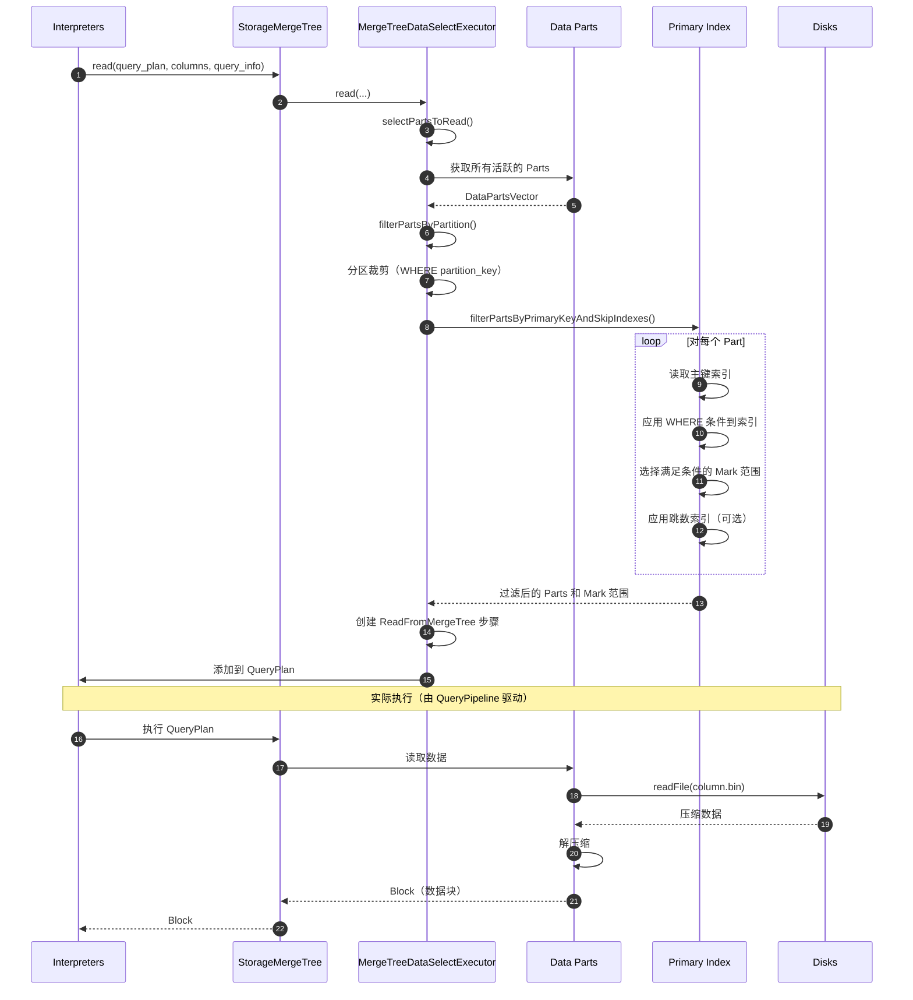
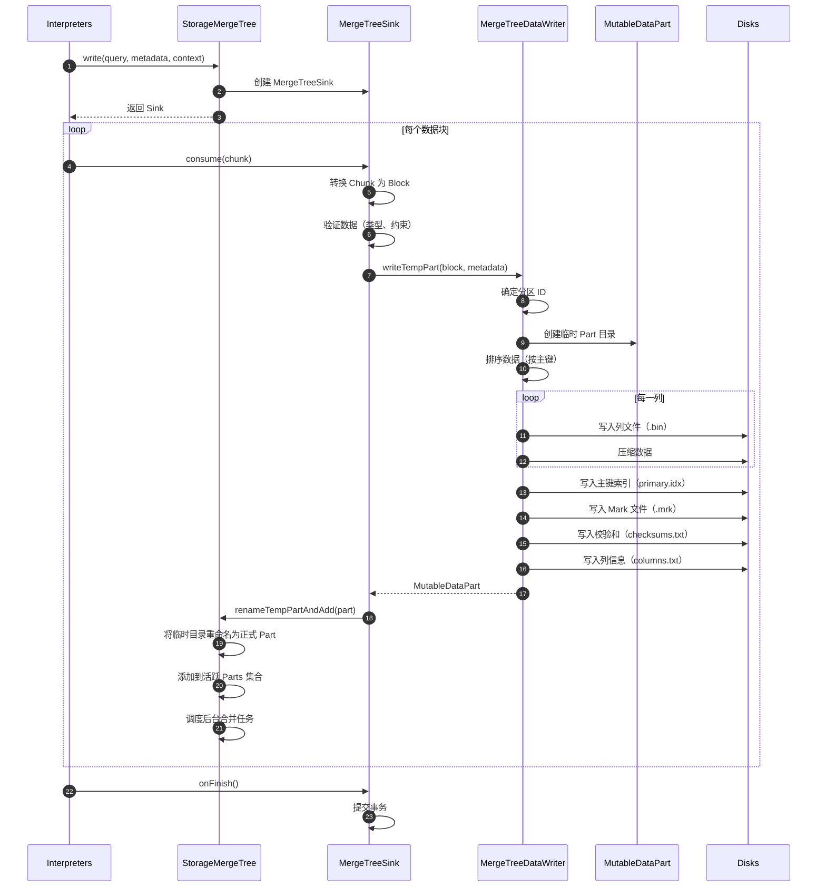
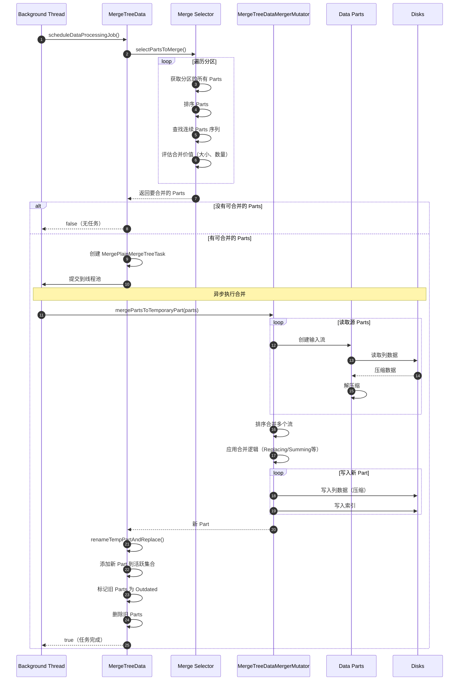
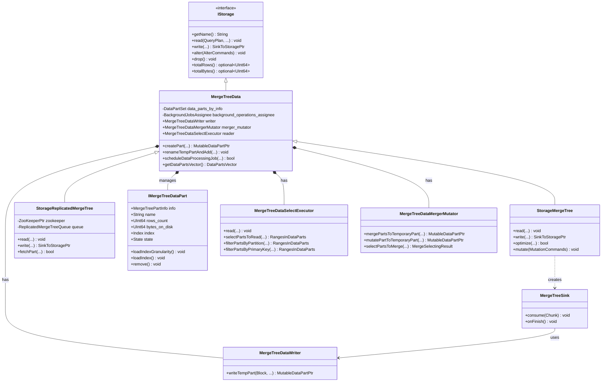

# ClickHouse-03-Storages模块

## 模块概览

### 职责

Storages 模块是 ClickHouse 的存储引擎层，负责：
- 数据持久化存储与读取
- 多种表引擎实现（MergeTree 系列、Log 系列、特殊引擎等）
- 数据部分（Part）管理与后台合并
- 分区管理与数据生命周期
- 索引创建与维护
- 数据完整性与一致性保证

### 输入/输出

**输入**
- Block（待写入的数据块）
- 查询条件（过滤、投影）
- ALTER 命令（表结构变更）
- 分区操作命令

**输出**
- Pipe/QueryPlan（数据读取管道）
- SinkToStorage（数据写入接口）
- 表元数据信息
- 统计信息（行数、字节数等）

### 上下游依赖

**上游**：Interpreters（查询解释）、QueryPipeline（查询执行）

**下游**：
- Disks（磁盘抽象）
- IO（输入输出）
- Formats（数据格式）
- Compression（压缩）
- DataTypes（数据类型）
- Columns（列数据）

### 生命周期

```
表创建 → 数据写入（创建Part） → 后台合并（Merge） → 数据查询（读取Part） → 数据删除（DROP） → 表销毁
```

## 模块架构图

```mermaid
flowchart TB
    subgraph Storages["Storages 模块"]
        subgraph Interface["接口层"]
            IStorage[IStorage<br/>存储接口]
        end
        
        subgraph MergeTreeFamily["MergeTree 家族"]
            MergeTree[MergeTree<br/>基础表引擎]
            ReplacingMergeTree[ReplacingMergeTree<br/>去重引擎]
            SummingMergeTree[SummingMergeTree<br/>聚合引擎]
            AggregatingMergeTree[AggregatingMergeTree<br/>预聚合引擎]
            CollapsingMergeTree[CollapsingMergeTree<br/>折叠引擎]
            VersionedCollapsingMergeTree[VersionedCollapsingMergeTree<br/>版本折叠引擎]
            ReplicatedMergeTree[ReplicatedMergeTree<br/>复制引擎]
        end
        
        subgraph LogFamily["Log 家族"]
            TinyLog[TinyLog]
            StripeLog[StripeLog]
            Log[Log]
        end
        
        subgraph SpecialEngines["特殊引擎"]
            Memory[Memory<br/>内存表]
            Distributed[Distributed<br/>分布式表]
            Merge[Merge<br/>合并表]
            View[View/MaterializedView<br/>视图]
            Dictionary[Dictionary<br/>字典]
            File[File<br/>文件]
            URL[URL<br/>远程URL]
        end
        
        subgraph DataManagement["数据管理"]
            MergeTreeData[MergeTreeData<br/>数据管理]
            IMergeTreeDataPart[IMergeTreeDataPart<br/>数据部分]
            MergeTreeDataWriter[MergeTreeDataWriter<br/>数据写入]
            MergeTreeDataMergerMutator[MergeTreeDataMergerMutator<br/>合并与变更]
            MergeTreeDataSelectExecutor[MergeTreeDataSelectExecutor<br/>查询执行]
        end
        
        subgraph BackgroundTasks["后台任务"]
            MergeTask[Merge Task<br/>合并任务]
            MutationTask[Mutation Task<br/>变更任务]
            MoveTask[Move Task<br/>移动任务]
            TTLTask[TTL Task<br/>TTL清理任务]
        end
    end
    
    IStorage <|-- MergeTree
    MergeTree <|-- ReplacingMergeTree
    MergeTree <|-- SummingMergeTree
    MergeTree <|-- AggregatingMergeTree
    MergeTree <|-- CollapsingMergeTree
    MergeTree <|-- VersionedCollapsingMergeTree
    MergeTree <|-- ReplicatedMergeTree
    
    IStorage <|-- TinyLog
    IStorage <|-- Log
    IStorage <|-- Memory
    IStorage <|-- Distributed
    
    MergeTree --> MergeTreeData
    MergeTreeData --> IMergeTreeDataPart
    MergeTreeData --> MergeTreeDataWriter
    MergeTreeData --> MergeTreeDataMergerMutator
    MergeTreeData --> MergeTreeDataSelectExecutor
    
    MergeTreeData --> BackgroundTasks
    
    IMergeTreeDataPart --> Disks[Disks模块]
    MergeTreeDataWriter --> IO[IO模块]
    MergeTreeDataSelectExecutor --> Processors[Processors模块]
```

### 架构说明

#### 图意概述

Storages 模块采用分层架构，顶层是 IStorage 接口，下层是各种具体的表引擎实现。MergeTree 家族是最重要的引擎，支持高性能 OLAP 查询。MergeTreeData 管理数据部分（Parts），MergeTreeDataWriter 负责写入，MergeTreeDataSelectExecutor 负责查询，MergeTreeDataMergerMutator 负责后台合并。后台任务异步执行合并、变更、移动和 TTL 清理。

#### 关键字段与接口

**IStorage 接口**
```cpp
class IStorage {
    virtual String getName() const = 0;  // 表引擎名称
    
    // 查询接口
    virtual void read(
        QueryPlan & query_plan,
        const Names & column_names,
        const StorageSnapshotPtr & storage_snapshot,
        SelectQueryInfo & query_info,
        ContextPtr context,
        QueryProcessingStage::Enum processed_stage,
        size_t max_block_size,
        size_t num_streams
    );
    
    // 写入接口
    virtual SinkToStoragePtr write(
        const ASTPtr & query,
        const StorageMetadataPtr & metadata_snapshot,
        ContextPtr context,
        bool async_insert
    );
    
    // DDL 操作
    virtual void alter(
        const AlterCommands & commands,
        ContextPtr context,
        AlterLockHolder & table_lock_holder
    );
    
    virtual void drop() = 0;          // 删除表
    virtual void truncate(...) = 0;   // 清空表
    virtual void rename(...) = 0;     // 重命名表
    
    // 元数据
    virtual StorageInMemoryMetadata getInMemoryMetadata() const;
    virtual std::optional<UInt64> totalRows(ContextPtr context) const;
    virtual std::optional<UInt64> totalBytes(ContextPtr context) const;
};
```

**MergeTreeData 类**
```cpp
class MergeTreeData : public IStorage {
    // 数据部分集合
    using DataPartsVector = std::vector<DataPartPtr>;
    DataPartSet data_parts_by_info;
    
    // 后台任务
    BackgroundJobsAssignee background_operations_assignee;
    BackgroundJobsAssignee background_moves_assignee;
    
    // 写入
    MergeTreeDataWriter writer;
    
    // 合并
    MergeTreeDataMergerMutator merger_mutator;
    
    // 查询
    MergeTreeDataSelectExecutor reader;
    
    // 主要方法
    MutableDataPartPtr createPart(...);  // 创建新数据部分
    void renameTempPartAndAdd(...);      // 重命名并添加部分
    void replaceParts(...);               // 替换部分
    void removePartsFromWorkingSet(...);  // 移除部分
    DataPartsVector getDataPartsVector() const;  // 获取所有部分
    
    // 后台任务
    bool scheduleDataProcessingJob(...);  // 调度后台任务
};
```

**IMergeTreeDataPart 类**
```cpp
class IMergeTreeDataPart {
    // 部分信息
    MergeTreePartInfo info;         // 分区、最小块号、最大块号、层级
    String name;                     // 部分名称
    UInt64 rows_count;               // 行数
    UInt64 bytes_on_disk;            // 磁盘字节数
    
    // 索引
    Index index;                     // 主键索引
    IndexGranularity index_granularity;  // 索引粒度
    
    // 列文件
    NameSet columns;                 // 列集合
    ChecksumsMap checksums;          // 校验和
    
    // 状态
    State state;                     // Active/Outdated/Deleting
    
    // 主要方法
    void loadIndexGranularity(...);  // 加载索引粒度
    void loadIndex(...);              // 加载索引
    void calculateColumnsSizesOnDisk();  // 计算列大小
    void remove();                    // 删除部分
};
```

#### 边界条件

**Part 数量限制**
- 单表 Part 数量：通常几百到几千个
- Part 过多时拒绝插入：parts_to_throw_insert（默认 3000）
- Part 过多时警告：parts_to_delay_insert（默认 300）

**合并限制**
- 单次合并最大大小：max_bytes_to_merge_at_max_space_in_pool（默认 150GB）
- 合并选择算法：启发式算法，平衡合并速度和 I/O
- 并发合并数：background_pool_size（默认 16）

**数据完整性**
- 每个 Part 有校验和文件（checksums.txt）
- 写入是原子的（先写临时目录，再重命名）
- 副本间通过 ZooKeeper 协调

#### 异常与回退

**写入异常**
- 磁盘空间不足：DISK_FULL 异常，停止写入
- Part 数量过多：TOO_MANY_PARTS 异常
- 数据损坏：CHECKSUM_MISMATCH，跳过或修复

**读取异常**
- Part 不存在：从其他副本读取或报错
- 索引损坏：重建索引
- 数据损坏：跳过损坏的 Part

**后台任务异常**
- 合并失败：重试或跳过
- Mutation 失败：标记为失败，需要手动处理
- 磁盘故障：切换到其他磁盘

**回退策略**
- 副本同步：从其他副本恢复数据
- 重试机制：后台任务失败后自动重试
- 降级读取：允许读取部分数据

#### 性能与容量假设

**读性能**
- 顺序读：充分利用列式存储，GB/s 级别
- 随机读：通过索引优化，千万行/秒
- 并发读：支持数千并发查询

**写性能**
- 批量写入：百万行/秒
- 实时写入：使用 Buffer 表或异步插入
- 并发写入：支持多个 INSERT 并发

**容量假设**
- 单表数据量：PB 级别
- 单 Part 大小：几 MB 到几 GB
- 总 Part 数量：几千个

**资源消耗**
- 内存：Mark 缓存、Uncompressed 缓存
- CPU：压缩/解压、后台合并
- I/O：顺序读写为主

#### 版本兼容与演进

**Part 格式版本**
- format_version = 0: 旧格式（按月分区）
- format_version = 1: 新格式（自定义分区）
- 向后兼容：新版本可读取旧格式

**副本协议**
- 副本间协议版本化
- 要求集群内版本差异不超过一个大版本
- 滚动升级支持

**表结构变更**
- 支持在线 ALTER（轻量级）
- Mutation 用于重写数据的变更
- 元数据变更立即生效

## 核心 API 详解

### API 1: IStorage::read - 数据读取

#### 基本信息

- **名称**: `IStorage::read()`
- **用途**: 从存储引擎读取数据，生成查询计划
- **幂等性**: 读操作幂等

#### 请求结构

```cpp
struct ReadParams {
    QueryPlan & query_plan;          // 输出：查询计划
    Names column_names;              // 要读取的列名
    StorageSnapshotPtr storage_snapshot;  // 存储快照
    SelectQueryInfo query_info;      // 查询信息（WHERE、PREWHERE等）
    ContextPtr context;              // 查询上下文
    QueryProcessingStage::Enum processed_stage;  // 处理阶段
    size_t max_block_size;           // 块大小
    size_t num_streams;              // 并行流数量
};
```

| 参数 | 类型 | 必填 | 说明 |
|---|---|---:|---|
| query_plan | QueryPlan& | 是 | 输出的查询计划 |
| column_names | Names | 是 | 要读取的列名列表 |
| storage_snapshot | StorageSnapshotPtr | 是 | 存储的快照（元数据） |
| query_info | SelectQueryInfo | 是 | 查询条件、排序、聚合等信息 |
| max_block_size | size_t | 是 | 单个Block的最大行数 |
| num_streams | size_t | 是 | 并行读取的流数量 |

#### 关键实现（MergeTree）

```cpp
void StorageMergeTree::read(
    QueryPlan & query_plan,
    const Names & column_names,
    const StorageSnapshotPtr & storage_snapshot,
    SelectQueryInfo & query_info,
    ContextPtr local_context,
    QueryProcessingStage::Enum processed_stage,
    const size_t max_block_size,
    const size_t num_streams)
{
    // 1) 如果启用了并行副本，返回特殊的并行读取计划
    if (local_context->canUseParallelReplicasOnInitiator())
    {
        // （此处省略并行副本逻辑）
        return;
    }
    
    // 2) 使用 MergeTreeDataSelectExecutor 生成读取计划
    return reader.read(
        column_names,
        storage_snapshot,
        query_info,
        local_context,
        max_block_size,
        num_streams,
        processed_stage,
        query_plan
    );
}
```

**MergeTreeDataSelectExecutor::read 核心逻辑**

```cpp
void MergeTreeDataSelectExecutor::read(
    const Names & column_names,
    const StorageSnapshotPtr & storage_snapshot,
    SelectQueryInfo & query_info,
    ContextPtr context,
    const size_t max_block_size,
    const size_t num_streams,
    QueryProcessingStage::Enum processed_stage,
    QueryPlan & query_plan)
{
    // 1) 选择要读取的 Parts
    RangesInDataParts parts_with_ranges = selectPartsToRead(
        query_info,
        storage_snapshot,
        context
    );
    
    // 2) 应用分区裁剪
    parts_with_ranges = filterPartsByPartition(parts_with_ranges, query_info);
    
    // 3) 应用索引
    parts_with_ranges = filterPartsByPrimaryKeyAndSkipIndexes(
        parts_with_ranges,
        query_info,
        context
    );
    
    // 4) 计算读取的行数和字节数
    size_t total_marks_to_read = calculateTotalMarksToRead(parts_with_ranges);
    
    // 5) 创建读取步骤
    auto read_step = std::make_unique<ReadFromMergeTree>(
        column_names,
        parts_with_ranges,
        max_block_size,
        num_streams,
        context
    );
    
    // 6) 添加到查询计划
    query_plan.addStep(std::move(read_step));
}
```

**分区裁剪**

```cpp
RangesInDataParts filterPartsByPartition(
    RangesInDataParts & parts,
    const SelectQueryInfo & query_info)
{
    // 获取分区键表达式
    const auto & partition_key = metadata_snapshot->getPartitionKey();
    
    // 从 WHERE 子句中提取分区过滤条件
    KeyCondition partition_condition(
        query_info.query,
        context,
        partition_key.column_names,
        partition_key.expression
    );
    
    RangesInDataParts result;
    
    // 遍历所有 Parts
    for (const auto & part_with_ranges : parts)
    {
        // 检查分区是否满足条件
        if (partition_condition.checkInRange(
            part_with_ranges.data_part->partition.value))
        {
            result.push_back(part_with_ranges);
        }
    }
    
    return result;
}
```

**主键索引过滤**

```cpp
RangesInDataParts filterPartsByPrimaryKeyAndSkipIndexes(
    RangesInDataParts & parts,
    const SelectQueryInfo & query_info,
    ContextPtr context)
{
    RangesInDataParts result;
    
    for (auto & part_with_ranges : parts)
    {
        const auto & part = part_with_ranges.data_part;
        
        // 1) 应用主键索引
        KeyCondition key_condition(
            query_info.query,
            context,
            primary_key.column_names,
            primary_key.expression
        );
        
        // 2) 使用主键索引选择 Mark 范围
        MarkRanges mark_ranges = key_condition.mayBeTrueInRange(
            part->index_granularity.getMarksCount(),
            part->index.data(),
            part->index_granularity
        );
        
        // 3) 应用跳数索引（如果有）
        for (const auto & skip_index : skip_indexes)
        {
            mark_ranges = skip_index->filterMarks(mark_ranges, query_info);
        }
        
        // 4) 如果有有效的 Mark 范围，添加到结果
        if (!mark_ranges.empty())
        {
            part_with_ranges.ranges = std::move(mark_ranges);
            result.push_back(part_with_ranges);
        }
    }
    
    return result;
}
```

#### 时序图



### API 2: IStorage::write - 数据写入

#### 基本信息

- **名称**: `IStorage::write()`
- **用途**: 创建数据写入接口，返回 Sink 对象
- **幂等性**: 通过去重机制实现（ReplicatedMergeTree）

#### 请求结构

```cpp
struct WriteParams {
    ASTPtr query;                        // INSERT 查询 AST
    StorageMetadataPtr metadata_snapshot;  // 元数据快照
    ContextPtr context;                  // 查询上下文
    bool async_insert;                   // 是否异步插入
};
```

#### 关键实现

```cpp
SinkToStoragePtr StorageMergeTree::write(
    const ASTPtr & query,
    const StorageMetadataPtr & metadata_snapshot,
    ContextPtr local_context,
    bool /*async_insert*/)
{
    // 1) 检查是否可写
    const auto & settings = local_context->getSettingsRef();
    if (settings.readonly)
        throw Exception("Cannot write in readonly mode");
    
    // 2) 创建写入 Sink
    return std::make_shared<MergeTreeSink>(
        *this,
        metadata_snapshot,
        max_parts_per_block,
        local_context
    );
}
```

**MergeTreeSink 核心逻辑**

```cpp
class MergeTreeSink : public SinkToStorage
{
    StorageMergeTree & storage;
    StorageMetadataPtr metadata_snapshot;
    
    void consume(Chunk chunk) override
    {
        // 1) 转换 Chunk 为 Block
        Block block = getHeader().cloneWithColumns(chunk.detachColumns());
        
        // 2) 验证数据
        metadata_snapshot->check(block, true);
        
        // 3) 写入数据
        auto part = storage.writer.writeTempPart(
            block,
            metadata_snapshot,
            context
        );
        
        // 4) 提交 Part
        storage.renameTempPartAndAdd(part, transaction);
    }
    
    void onFinish() override
    {
        // 提交事务
        transaction->commit();
    }
};
```

**MergeTreeDataWriter::writeTempPart**

```cpp
MutableDataPartPtr MergeTreeDataWriter::writeTempPart(
    Block & block,
    const StorageMetadataPtr & metadata_snapshot,
    ContextPtr context)
{
    // 1) 确定分区
    String partition_id = data.getPartitionIDFromBlock(block, context);
    
    // 2) 创建临时 Part
    MergeTreeDataPartBuilder builder(data, "tmp_", partition_id);
    auto new_data_part = builder.build();
    
    // 3) 排序数据（按主键）
    sortBlock(block, metadata_snapshot->getSortingKey());
    
    // 4) 写入列数据
    for (const auto & column : block)
    {
        writeColumn(column, new_data_part);
    }
    
    // 5) 写入索引
    writeIndex(block, new_data_part, metadata_snapshot);
    
    // 6) 写入校验和
    writeChecksums(new_data_part);
    
    // 7) 完成写入
    new_data_part->finalize();
    
    return new_data_part;
}
```

**写入列数据**

```cpp
void writeColumn(
    const ColumnWithTypeAndName & column,
    const MutableDataPartPtr & part)
{
    // 1) 打开列文件
    String column_file = part->getFullPath() + column.name + ".bin";
    WriteBufferFromFile buf(column_file);
    
    // 2) 压缩写入
    CompressedWriteBuffer compressed_buf(buf, compression_codec);
    
    // 3) 序列化列数据
    ISerialization::SerializeBinaryBulkSettings settings;
    ISerialization::SerializeBinaryBulkStatePtr state;
    
    column.type->getDefaultSerialization()->serializeBinaryBulkWithMultipleStreams(
        *column.column,
        0,  // offset
        column.column->size(),  // limit
        settings,
        state
    );
    
    // 4) 刷新缓冲区
    compressed_buf.next();
    buf.next();
}
```

**写入主键索引**

```cpp
void writeIndex(
    const Block & block,
    const MutableDataPartPtr & part,
    const StorageMetadataPtr & metadata_snapshot)
{
    // 1) 获取主键列
    const auto & primary_key_columns = metadata_snapshot->getPrimaryKeyColumns();
    Block index_block;
    for (const auto & column_name : primary_key_columns)
    {
        index_block.insert(block.getByName(column_name));
    }
    
    // 2) 打开索引文件
    String index_file = part->getFullPath() + "primary.idx";
    WriteBufferFromFile buf(index_file);
    CompressedWriteBuffer compressed_buf(buf);
    
    // 3) 每隔 index_granularity 行写入一个索引项
    size_t index_granularity = data.getSettings()->index_granularity;
    for (size_t i = 0; i < block.rows(); i += index_granularity)
    {
        // 序列化该行的主键值
        for (size_t col = 0; col < index_block.columns(); ++col)
        {
            index_block.getByPosition(col).type->serializeBinary(
                *index_block.getByPosition(col).column,
                i,  // row number
                compressed_buf
            );
        }
    }
    
    // 4) 刷新
    compressed_buf.next();
    buf.next();
}
```

#### 时序图



### API 3: 后台合并（Background Merge）

#### 基本信息

- **名称**: 后台合并任务
- **用途**: 定期合并小的 Parts 为大的 Parts，减少 Part 数量
- **幂等性**: 合并操作幂等

#### 合并算法

```cpp
bool MergeTreeData::scheduleDataProcessingJob(BackgroundJobsAssignee & assignee)
{
    // 1) 选择要合并的 Parts
    auto merge_entry = selectPartsToMerge();
    if (!merge_entry)
        return false;
    
    // 2) 创建合并任务
    auto merge_task = std::make_unique<MergePlainMergeTreeTask>(
        *this,
        merge_entry,
        task_result_callback
    );
    
    // 3) 提交到后台线程池
    assignee.scheduleCommonTask(std::move(merge_task));
    
    return true;
}
```

**选择合并的 Parts（启发式算法）**

```cpp
MergeSelectingResult selectPartsToMerge()
{
    // 1) 获取所有活跃的 Parts，按分区分组
    auto parts_by_partition = getActivePartsGroupedByPartition();
    
    for (auto & [partition_id, parts] : parts_by_partition)
    {
        // 2) 排序 Parts（按 min_block_num）
        std::sort(parts.begin(), parts.end());
        
        // 3) 查找连续的 Parts 序列进行合并
        for (size_t i = 0; i < parts.size(); )
        {
            // 4) 评分：倾向于合并小的 Parts
            size_t count = 1;
            size_t total_size = parts[i]->getBytesOnDisk();
            
            while (i + count < parts.size() && 
                   total_size < max_bytes_to_merge)
            {
                total_size += parts[i + count]->getBytesOnDisk();
                ++count;
                
                // 找到足够的 Parts（通常 10 个左右）
                if (count >= min_parts_to_merge)
                    break;
            }
            
            // 5) 如果找到合适的序列，返回
            if (count >= min_parts_to_merge)
            {
                return MergeSelectingResult{
                    .parts = {parts.begin() + i, parts.begin() + i + count},
                    .partition_id = partition_id
                };
            }
            
            ++i;
        }
    }
    
    return {};  // 没有找到可合并的 Parts
}
```

**执行合并**

```cpp
void MergePlainMergeTreeTask::executeImpl()
{
    // 1) 准备合并
    auto future_part = merger_mutator.mergePartsToTemporaryPart(
        merge_entry->parts,
        merge_entry->new_part_name,
        metadata_snapshot,
        transaction_ptr,
        merge_list_entry,
        table_lock_holder,
        context
    );
    
    // 2) 将临时 Part 重命名为正式 Part
    storage.renameTempPartAndReplace(future_part);
    
    // 3) 删除旧的 Parts
    storage.removePartsFromWorkingSet(merge_entry->parts);
}
```

**合并数据（MergeTreeDataMergerMutator::mergePartsToTemporaryPart）**

```cpp
MutableDataPartPtr mergePartsToTemporaryPart(
    const DataPartsVector & parts,
    const String & new_part_name,
    const StorageMetadataPtr & metadata_snapshot,
    MergeTreeTransactionPtr transaction,
    MergeListEntry & merge_entry,
    TableLockHolder & table_lock_holder,
    ContextPtr context)
{
    // 1) 创建新的临时 Part
    auto new_data_part = data.createPart(new_part_name, "tmp_merge_");
    
    // 2) 创建合并的输入流（从多个 Parts 读取）
    Pipes pipes;
    for (const auto & part : parts)
    {
        auto pipe = createMergeTreeSequentialSource(part, ...);
        pipes.push_back(std::move(pipe));
    }
    
    // 3) 合并多个输入流（排序合并）
    auto merging_transform = createMergingTransform(
        metadata_snapshot->getSortingKey(),
        merging_params  // 根据引擎类型：Replacing/Summing/Aggregating等
    );
    
    QueryPipeline pipeline;
    pipeline.init(Pipe::unitePipes(std::move(pipes)));
    pipeline.addTransform(std::move(merging_transform));
    
    // 4) 写入新 Part
    PullingPipelineExecutor executor(pipeline);
    Block block;
    while (executor.pull(block))
    {
        writeBlock(block, new_data_part);
    }
    
    // 5) 完成写入
    new_data_part->finalize();
    
    return new_data_part;
}
```

#### 时序图



## 数据结构 UML 图



## 表引擎对比

| 引擎 | 适用场景 | 特点 | 限制 |
|---|---|---|---|
| **MergeTree** | 通用 OLAP | 列式存储、主键索引、后台合并 | - |
| **ReplacingMergeTree** | 需要去重 | 相同主键保留最新数据 | 去重不实时（合并时） |
| **SummingMergeTree** | 预聚合 | 相同主键数值列求和 | 仅对数值列有效 |
| **AggregatingMergeTree** | 复杂聚合 | 存储聚合函数状态 | 需配合物化视图 |
| **CollapsingMergeTree** | 状态折叠 | 通过 Sign 列折叠行 | 需保证写入顺序 |
| **VersionedCollapsingMergeTree** | 版本折叠 | 带版本的折叠 | 更复杂的写入逻辑 |
| **ReplicatedMergeTree** | 高可用 | 多副本、自动复制 | 需要 ZooKeeper |
| **Distributed** | 分布式查询 | 分片数据聚合 | 不存储数据 |
| **Memory** | 临时数据 | 全内存、快速 | 重启丢失 |
| **TinyLog/Log** | 小数据集 | 简单、无索引 | 不支持并发写 |

## 实战经验

### 选择合适的表引擎

**场景1：日志分析**
```sql
-- 使用 MergeTree，按时间分区
CREATE TABLE logs (
    date Date,
    timestamp DateTime,
    level String,
    message String
) ENGINE = MergeTree()
PARTITION BY toYYYYMM(date)
ORDER BY (date, timestamp);
```

**场景2：用户画像（需要更新）**
```sql
-- 使用 ReplacingMergeTree，按 user_id 去重
CREATE TABLE user_profiles (
    user_id UInt64,
    name String,
    age UInt8,
    update_time DateTime
) ENGINE = ReplacingMergeTree(update_time)
ORDER BY user_id;
```

**场景3：实时统计（预聚合）**
```sql
-- 使用 SummingMergeTree
CREATE TABLE user_stats (
    date Date,
    user_id UInt64,
    events UInt64,
    revenue Float64
) ENGINE = SummingMergeTree()
PARTITION BY toYYYYMM(date)
ORDER BY (date, user_id);
```

### Part 管理最佳实践

**控制 Part 数量**
```sql
-- 设置合并参数
ALTER TABLE my_table MODIFY SETTING
    parts_to_delay_insert = 150,      -- 延迟插入阈值
    parts_to_throw_insert = 300,      -- 拒绝插入阈值
    max_bytes_to_merge_at_max_space_in_pool = 161061273600;  -- 150GB
```

**手动优化（合并 Parts）**
```sql
-- 优化单个分区
OPTIMIZE TABLE my_table PARTITION '202401';

-- 优化整个表
OPTIMIZE TABLE my_table FINAL;

-- 注意：OPTIMIZE 是阻塞操作，生产环境慎用
```

**监控 Part 状态**
```sql
-- 查看 Part 数量
SELECT
    table,
    count() as parts_count,
    sum(rows) as total_rows,
    formatReadableSize(sum(bytes_on_disk)) as total_size
FROM system.parts
WHERE active AND table = 'my_table'
GROUP BY table;

-- 查看后台任务
SELECT * FROM system.merges;
SELECT * FROM system.mutations;
```

### 性能优化技巧

**分区策略**
```sql
-- 按月分区（推荐）
PARTITION BY toYYYYMM(date)

-- 按天分区（数据量大时）
PARTITION BY toDate(date)

-- 多维分区（慎用）
PARTITION BY (toYYYYMM(date), event_type)
```

**索引优化**
```sql
-- 主键设计：低基数列在前
ORDER BY (date, event_type, user_id)  -- 好
ORDER BY (user_id, date, event_type)  -- 不好（user_id 高基数）

-- 跳数索引（加速过滤）
ALTER TABLE my_table ADD INDEX idx_message (message) TYPE tokenbf_v1(30720, 2, 0) GRANULARITY 1;
```

## 总结

Storages 模块是 ClickHouse 的核心，提供了：

1. **多样化的表引擎**：MergeTree 系列适应不同场景
2. **高性能存储**：列式存储、压缩、索引优化
3. **后台任务**：自动合并、变更、TTL 清理
4. **高可用性**：副本机制、数据完整性保证
5. **可扩展性**：支持 PB 级数据存储

关键特性：
- LSM-Tree 结构：写入快，通过后台合并优化读取
- 分区管理：便于数据生命周期管理
- 主键索引：稀疏索引，平衡存储和查询效率
- 灵活的合并策略：Replacing、Summing、Aggregating 等

Storages 模块的设计决定了 ClickHouse 在 OLAP 场景下的卓越性能。

