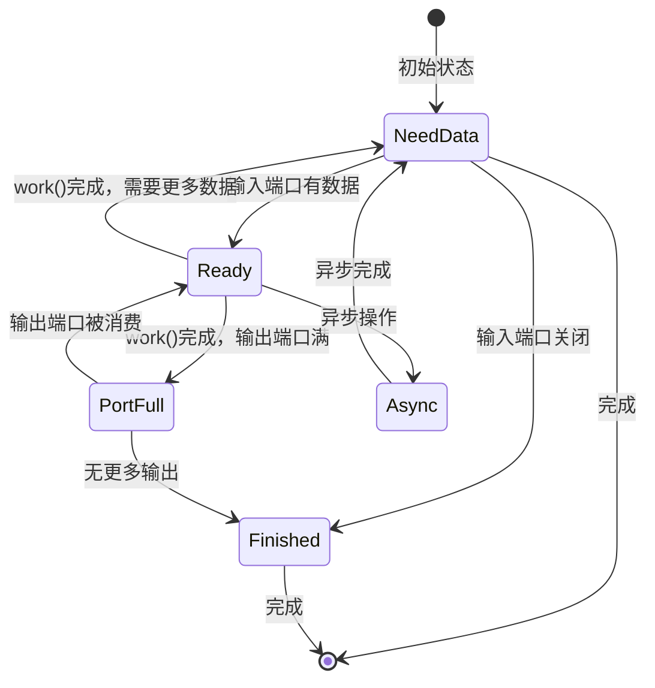
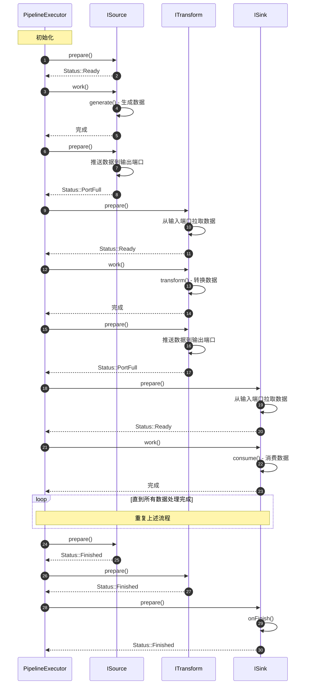
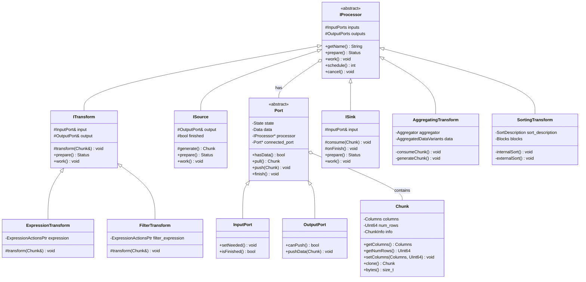

# ClickHouse-04-Processors模块

## 模块概览

### 职责

Processors 模块是 ClickHouse 的数据处理执行引擎，负责：
- 实现流式数据处理（Pull/Push 模型）
- 提供各种数据转换操作（过滤、投影、聚合、排序等）
- 支持并行处理和管道执行
- 管理处理器状态机和调度
- 实现向量化执行
- 处理背压（Backpressure）机制

### 输入/输出

**输入**
- Chunk（数据块，来自上游 Processor）
- Port（输入端口）
- 处理指令和参数

**输出**
- Chunk（处理后的数据块）
- Port（输出端口）
- 状态信息（进度、异常）

### 上下游依赖

**上游**：QueryPipeline（查询管道构建）、Interpreters（查询解释）

**下游**：
- Core（Block、Chunk 数据结构）
- Columns（列数据操作）
- Functions（函数执行）
- AggregateFunctions（聚合函数）
- Storages（数据源和目标）

### 生命周期

```
创建 Processor → 连接端口 → 准备执行 → 执行循环（prepare/work/schedule） → 完成 → 销毁
```

## 模块架构图

```mermaid
flowchart TB
    subgraph Processors["Processors 模块"]
        subgraph Core["核心接口"]
            IProcessor[IProcessor<br/>处理器基类]
            Port[Port/InputPort/OutputPort<br/>端口]
            Chunk[Chunk<br/>数据块]
        end
        
        subgraph BasicTypes["基本类型"]
            ISource[ISource<br/>数据源]
            ITransform[ITransform<br/>转换器]
            ISink[ISink<br/>数据汇]
        end
        
        subgraph Transforms["转换处理器"]
            FilterTransform[FilterTransform<br/>过滤]
            ExpressionTransform[ExpressionTransform<br/>表达式计算]
            AggregatingTransform[AggregatingTransform<br/>聚合]
            SortingTransform[SortingTransform<br/>排序]
            LimitTransform[LimitTransform<br/>限制行数]
            DistinctTransform[DistinctTransform<br/>去重]
        end
        
        subgraph Special["特殊处理器"]
            ResizeProcessor[ResizeProcessor<br/>调整并行度]
            MergingTransform[MergingTransform<br/>合并]
            UnionProcessor[UnionProcessor<br/>联合]
            ForkProcessor[ForkProcessor<br/>分叉]
        end
        
        subgraph Sources["数据源"]
            SourceFromSingleChunk[SourceFromSingleChunk<br/>单块源]
            SourceFromInputStream[SourceFromInputStream<br/>流源]
            StorageSource[从存储读取]
        end
        
        subgraph Sinks["数据汇"]
            SinkToStorage[SinkToStorage<br/>写入存储]
            EmptySink[EmptySink<br/>空汇]
        end
        
        subgraph Executors["执行器"]
            PipelineExecutor[PipelineExecutor<br/>管道执行器]
            PullingExecutor[PullingAsyncPipelineExecutor<br/>拉取执行器]
            PushingExecutor[PushingAsyncPipelineExecutor<br/>推送执行器]
        end
    end
    
    IProcessor <|-- ISource
    IProcessor <|-- ITransform
    IProcessor <|-- ISink
    
    ISource <|-- Sources
    ITransform <|-- Transforms
    ISink <|-- Sinks
    
    IProcessor --> Port
    Port --> Chunk
    
    Executors --> IProcessor
    
    QueryPipeline[QueryPipeline模块] --> Processors
    Processors --> Core[Core模块]
    Processors --> Functions[Functions模块]
    Processors --> AggregateFunctions[AggregateFunctions模块]
```

### 架构说明

#### 图意概述

Processors 模块采用数据流处理架构，核心是 IProcessor 接口和 Port 端口机制。数据以 Chunk 为单位在 Processor 之间流动。基本类型包括 ISource（数据源）、ITransform（转换）、ISink（数据汇）。各种转换处理器实现具体的数据处理逻辑。执行器负责调度和执行 Processor 管道。

#### 关键字段与接口

**IProcessor 接口**
```cpp
class IProcessor {
protected:
    InputPorts inputs;       // 输入端口列表
    OutputPorts outputs;     // 输出端口列表
    
public:
    // 状态枚举
    enum class Status {
        NeedData,           // 需要输入数据
        PortFull,           // 输出端口已满
        Finished,           // 处理完成
        Ready,              // 准备执行 work()
        Async,              // 异步执行中
        ExpandPipeline      // 需要扩展管道
    };
    
    // 核心方法
    virtual String getName() const = 0;                    // 处理器名称
    virtual Status prepare() = 0;                          // 准备阶段
    virtual void work();                                   // 执行阶段
    virtual int schedule();                                // 调度（异步）
    virtual Processors expandPipeline();                   // 扩展管道
    
    // 端口访问
    InputPorts & getInputs() { return inputs; }
    OutputPorts & getOutputs() { return outputs; }
    
    // 取消执行
    void cancel() noexcept;
};
```

**Port 类**
```cpp
class Port {
public:
    enum class State {
        NotActive,          // 未激活
        NeedData,           // 需要数据
        HasData             // 有数据
    };
    
    struct Data {
        Chunk chunk;        // 数据块
        std::exception_ptr exception;  // 异常
        bool finished = false;         // 是否结束
    };
    
private:
    State state = State::NotActive;
    Data data;
    IProcessor * processor = nullptr;
    Port * connected_port = nullptr;
    
public:
    // 输入端口方法
    bool hasData() const;
    Chunk pull();
    void push(Chunk chunk);
    void finish();
    
    // 输出端口方法
    bool canPush() const;
    void pushData(Chunk chunk);
    
    // 连接端口
    void connect(Port & other);
};
```

**Chunk 类**
```cpp
class Chunk {
private:
    Columns columns;        // 列数据
    UInt64 num_rows = 0;    // 行数
    ChunkInfo info;         // 元信息
    
public:
    Chunk() = default;
    Chunk(Columns columns_, UInt64 num_rows_);
    
    // 访问方法
    const Columns & getColumns() const { return columns; }
    UInt64 getNumRows() const { return num_rows; }
    UInt64 getNumColumns() const { return columns.size(); }
    
    // 操作方法
    void setColumns(Columns columns_, UInt64 num_rows_);
    Chunk clone() const;
    void clear();
    bool empty() const { return columns.empty(); }
    
    // 内存使用
    size_t bytes() const;
    size_t allocatedBytes() const;
};
```

#### 边界条件

**处理器数量限制**
- 单个管道的 Processor 数量：通常几十到几百个
- 最大并行度：由 max_threads 设置控制
- 内存限制：每个 Processor 应避免占用过多内存

**数据块大小**
- Chunk 默认大小：65536 行
- 最小块：避免太小导致开销大
- 最大块：避免太大导致内存压力

**状态转换**
- Processor 状态机必须正确转换
- 避免死锁（循环等待）
- 正确处理异常状态

#### 异常与回退

**执行异常**
- 处理器抛出异常：传播到整个管道
- 端口异常：通过 Port::Data 传递
- 取消执行：调用 cancel() 方法

**状态异常**
- 状态转换错误：LOGICAL_ERROR
- 端口连接错误：LOGICAL_ERROR
- 数据不一致：检查 Chunk 的列数和行数

**回退策略**
- 异常传播：沿管道向上传播
- 资源清理：RAII 保证资源释放
- 取消机制：支持优雅取消

#### 性能与容量假设

**执行效率**
- 向量化执行：批量处理整个 Chunk
- 并行处理：多个 Processor 并行执行
- 流水线：边读边处理边写

**容量假设**
- 单个 Chunk：几 MB 到几十 MB
- Processor 数量：数十到数百个
- 并行度：通常等于 CPU 核心数

**资源消耗**
- CPU：主要消耗，向量化提高效率
- 内存：Chunk 缓冲、聚合状态
- I/O：通过异步处理减少阻塞

#### 版本兼容与演进

**接口稳定性**
- IProcessor 接口相对稳定
- 新 Transform 类型持续增加
- 优化算法不断改进

**向后兼容**
- 旧的 Transform 继续工作
- 新特性通过新类型实现
- 状态机逻辑保持一致

## 核心 API 详解

### API 1: IProcessor 状态机

#### 基本信息

- **名称**: `IProcessor::prepare()` 和 `IProcessor::work()`
- **用途**: 实现 Processor 的状态转换和数据处理
- **幂等性**: prepare() 幂等，work() 可能有副作用

#### 状态机模型



#### 实现示例（ISource）

```cpp
class ISource : public IProcessor {
protected:
    OutputPort & output;    // 输出端口
    bool finished = false;  // 是否完成
    Chunk current_chunk;    // 当前数据块
    
    // 子类实现：生成数据
    virtual Chunk generate() = 0;
    
public:
    explicit ISource(SharedHeader header) 
        : IProcessor({}, {header}), output(outputs.front()) 
    {}
    
    Status prepare() override {
        // 1) 如果已完成
        if (finished) {
            output.finish();
            return Status::Finished;
        }
        
        // 2) 如果输出端口满
        if (!output.canPush()) {
            return Status::PortFull;
        }
        
        // 3) 如果有待推送的数据
        if (current_chunk) {
            output.push(std::move(current_chunk));
            return Status::PortFull;
        }
        
        // 4) 需要生成新数据
        return Status::Ready;
    }
    
    void work() override {
        // 生成数据
        current_chunk = generate();
        
        // 检查是否完成
        if (!current_chunk) {
            finished = true;
        }
    }
};
```

#### 实现示例（ITransform）

```cpp
class ITransform : public IProcessor {
protected:
    InputPort & input;
    OutputPort & output;
    
    bool has_input = false;
    bool has_output = false;
    bool no_more_data_needed = false;
    
    Chunk input_chunk;
    Chunk output_chunk;
    
    // 子类实现：转换数据
    virtual void transform(Chunk & chunk) = 0;
    
public:
    ITransform(SharedHeader input_header, SharedHeader output_header)
        : IProcessor({input_header}, {output_header}),
          input(inputs.front()),
          output(outputs.front())
    {}
    
    Status prepare() override {
        // 1) 如果有输出待推送
        if (has_output) {
            if (!output.canPush()) {
                return Status::PortFull;
            }
            
            output.push(std::move(output_chunk));
            has_output = false;
        }
        
        // 2) 如果输入端口关闭且没有待处理数据
        if (input.isFinished() && !has_input) {
            output.finish();
            return Status::Finished;
        }
        
        // 3) 如果没有输入数据
        if (!has_input) {
            if (!input.hasData()) {
                input.setNeeded();
                return Status::NeedData;
            }
            
            input_chunk = input.pull();
            has_input = true;
        }
        
        // 4) 准备执行转换
        return Status::Ready;
    }
    
    void work() override {
        // 转换数据
        transform(input_chunk);
        
        // 设置输出
        output_chunk = std::move(input_chunk);
        has_input = false;
        has_output = true;
    }
};
```

#### 实现示例（ISink）

```cpp
class ISink : public IProcessor {
protected:
    InputPort & input;
    Chunk current_chunk;
    bool has_input = false;
    
    // 子类实现：消费数据
    virtual void consume(Chunk chunk) = 0;
    virtual void onFinish() {}
    
public:
    explicit ISink(SharedHeader header)
        : IProcessor({header}, {}), input(inputs.front())
    {}
    
    Status prepare() override {
        // 1) 如果有数据待处理
        if (has_input) {
            return Status::Ready;
        }
        
        // 2) 如果输入端口关闭
        if (input.isFinished()) {
            onFinish();
            return Status::Finished;
        }
        
        // 3) 如果没有数据
        if (!input.hasData()) {
            input.setNeeded();
            return Status::NeedData;
        }
        
        // 4) 拉取数据
        current_chunk = input.pull();
        has_input = true;
        
        return Status::Ready;
    }
    
    void work() override {
        // 消费数据
        consume(std::move(current_chunk));
        has_input = false;
    }
};
```

#### 时序图



### API 2: ExpressionTransform - 表达式计算

#### 基本信息

- **名称**: `ExpressionTransform`
- **用途**: 执行表达式计算（投影、函数调用、类型转换）
- **幂等性**: 相同输入产生相同输出

#### 数据结构

```cpp
class ExpressionTransform : public ISimpleTransform {
private:
    ExpressionActionsPtr expression;    // 表达式DAG
    
public:
    ExpressionTransform(
        const Block & header_,
        ExpressionActionsPtr expression_)
        : ISimpleTransform(header_, expression_->getSampleBlock(), false)
        , expression(std::move(expression_))
    {}
    
    String getName() const override { return "ExpressionTransform"; }
    
protected:
    void transform(Chunk & chunk) override {
        // 1) 将 Chunk 转换为 Block
        auto block = getInputPort().getHeader().cloneWithColumns(chunk.detachColumns());
        
        // 2) 执行表达式
        expression->execute(block);
        
        // 3) 转换回 Chunk
        chunk.setColumns(block.getColumns(), block.rows());
    }
};
```

#### 表达式执行流程

```cpp
void ExpressionActions::execute(Block & block) const {
    // 遍历所有操作
    for (const auto & action : actions) {
        switch (action.type) {
            case ExpressionAction::ADD_COLUMN:
                // 添加常量列
                block.insert({
                    action.added_column->cloneResized(block.rows()),
                    action.result_type,
                    action.result_name
                });
                break;
            
            case ExpressionAction::APPLY_FUNCTION:
                // 执行函数
                ColumnsWithTypeAndName arguments;
                for (const auto & arg : action.argument_names) {
                    arguments.push_back(block.getByName(arg));
                }
                
                auto result_column = action.function->execute(
                    arguments,
                    action.result_type,
                    block.rows()
                );
                
                block.insert({
                    std::move(result_column),
                    action.result_type,
                    action.result_name
                });
                break;
            
            case ExpressionAction::REMOVE_COLUMN:
                // 删除列
                block.erase(action.source_name);
                break;
            
            // ... 其他操作类型
        }
    }
}
```

### API 3: AggregatingTransform - 聚合处理

#### 基本信息

- **名称**: `AggregatingTransform`
- **用途**: 执行 GROUP BY 聚合
- **幂等性**: 不幂等（有状态）

#### 数据结构

```cpp
class AggregatingTransform : public IProcessor {
private:
    Aggregator aggregator;              // 聚合器
    AggregatedDataVariants data_variants;  // 聚合数据
    
    bool is_consume_finished = false;
    bool is_generate_initialized = false;
    
public:
    Status prepare() override {
        auto & output = outputs.front();
        auto & input = inputs.front();
        
        // 1) 消费阶段
        if (!is_consume_finished) {
            if (input.isFinished()) {
                is_consume_finished = true;
                return Status::Ready;  // 准备生成结果
            }
            
            if (!input.hasData()) {
                input.setNeeded();
                return Status::NeedData;
            }
            
            current_chunk = input.pull();
            return Status::Ready;  // 准备聚合
        }
        
        // 2) 生成阶段
        if (!output.canPush()) {
            return Status::PortFull;
        }
        
        if (!is_generate_initialized) {
            return Status::Ready;  // 准备初始化生成
        }
        
        if (has_output) {
            output.push(std::move(output_chunk));
            has_output = false;
        }
        
        if (is_finished) {
            output.finish();
            return Status::Finished;
        }
        
        return Status::Ready;
    }
    
    void work() override {
        if (!is_consume_finished) {
            // 聚合当前块
            consumeChunk();
        }
        else if (!is_generate_initialized) {
            // 初始化结果生成
            initGenerate();
        }
        else {
            // 生成下一个结果块
            generateChunk();
        }
    }
    
private:
    void consumeChunk() {
        // 将 Chunk 转换为 Block
        Block block = getInputPort().getHeader().cloneWithColumns(
            current_chunk.detachColumns()
        );
        
        // 执行聚合
        aggregator.executeOnBlock(
            block,
            data_variants,
            key_columns,
            aggregate_columns,
            no_more_keys
        );
    }
    
    void initGenerate() {
        // 准备输出
        aggregator.prepareOutputBlock(data_variants);
        is_generate_initialized = true;
    }
    
    void generateChunk() {
        // 从聚合数据生成结果块
        auto block = aggregator.getOutputBlock(data_variants);
        
        if (block) {
            output_chunk = Chunk(block.getColumns(), block.rows());
            has_output = true;
        }
        else {
            is_finished = true;
        }
    }
};
```

#### 聚合算法

```cpp
void Aggregator::executeOnBlock(
    const Block & block,
    AggregatedDataVariants & result,
    ColumnRawPtrs & key_columns,
    AggregateColumns & aggregate_columns,
    bool & no_more_keys)
{
    // 1) 选择聚合方法（基于键类型）
    AggregatedDataVariants::Type method = chooseAggregationMethod(key_columns);
    
    // 2) 执行聚合
    switch (method) {
        case AggregatedDataVariants::Type::without_key:
            // 无 GROUP BY，全局聚合
            executeWithoutKey(result, aggregate_columns);
            break;
        
        case AggregatedDataVariants::Type::key64:
            // 单个64位键
            executeImpl<AggregatedDataVariants::Type::key64>(
                result, key_columns, aggregate_columns, no_more_keys
            );
            break;
        
        case AggregatedDataVariants::Type::key_string:
            // 字符串键
            executeImpl<AggregatedDataVariants::Type::key_string>(
                result, key_columns, aggregate_columns, no_more_keys
            );
            break;
        
        case AggregatedDataVariants::Type::key128:
            // 128位键
            executeImpl<AggregatedDataVariants::Type::key128>(
                result, key_columns, aggregate_columns, no_more_keys
            );
            break;
        
        // ... 其他方法
    }
}

template <AggregatedDataVariants::Type method>
void Aggregator::executeImpl(
    AggregatedDataVariants & result,
    ColumnRawPtrs & key_columns,
    AggregateColumns & aggregate_columns,
    bool & no_more_keys)
{
    // 获取哈希表
    auto & hash_table = result.get<method>();
    
    // 遍历所有行
    for (size_t i = 0; i < block.rows(); ++i) {
        // 1) 计算键
        auto key = extractKey<method>(key_columns, i);
        
        // 2) 查找或插入
        auto [it, inserted] = hash_table.emplace(key);
        
        // 3) 更新聚合状态
        if (inserted) {
            // 新键，创建聚合状态
            createAggregateStates(it->getMapped());
        }
        
        // 4) 添加值到聚合函数
        for (size_t j = 0; j < aggregate_functions.size(); ++j) {
            aggregate_functions[j]->add(
                it->getMapped() + offsets_of_aggregate_states[j],
                aggregate_columns[j],
                i,
                arena
            );
        }
    }
}
```

### API 4: SortingTransform - 排序处理

#### 基本信息

- **名称**: `SortingTransform`
- **用途**: 对数据进行排序
- **幂等性**: 幂等（相同输入产生相同顺序）

#### 排序策略

```cpp
class SortingTransform : public IProcessor {
private:
    SortDescription sort_description;     // 排序描述
    size_t limit;                         // LIMIT 值
    size_t max_bytes_before_external_sort;  // 外部排序阈值
    
    Blocks blocks;                        // 缓冲的数据块
    bool inputs_finished = false;
    bool use_external_sort = false;
    
public:
    void work() override {
        if (!inputs_finished) {
            // 1) 收集所有输入块
            blocks.push_back(std::move(current_block));
            
            // 2) 检查是否需要外部排序
            size_t total_bytes = 0;
            for (const auto & block : blocks) {
                total_bytes += block.bytes();
            }
            
            if (total_bytes > max_bytes_before_external_sort) {
                use_external_sort = true;
                // （此处省略外部排序逻辑）
            }
        }
        else if (!is_sorted) {
            // 3) 执行排序
            if (use_external_sort) {
                externalSort();
            }
            else {
                internalSort();
            }
            
            is_sorted = true;
        }
        else {
            // 4) 输出排序后的数据
            generateOutput();
        }
    }
    
private:
    void internalSort() {
        // 1) 合并所有块
        Block merged_block = concatenateBlocks(blocks);
        blocks.clear();
        
        // 2) 获取排序列
        ColumnRawPtrs sort_columns;
        for (const auto & descr : sort_description) {
            sort_columns.push_back(merged_block.getByName(descr.column_name).column.get());
        }
        
        // 3) 创建排序排列
        IColumn::Permutation permutation;
        sortBlock(merged_block, sort_description, limit, permutation);
        
        // 4) 应用排列
        for (auto & column_with_type_and_name : merged_block) {
            column_with_type_and_name.column = 
                column_with_type_and_name.column->permute(permutation, limit);
        }
        
        sorted_block = std::move(merged_block);
    }
    
    void externalSort() {
        // 1) 将块写入临时文件
        TemporaryFileStream temp_stream(tmp_path);
        for (auto & block : blocks) {
            // 块内排序
            sortBlock(block, sort_description, 0, {});
            // 写入文件
            temp_stream.write(block);
        }
        blocks.clear();
        
        // 2) 归并排序
        MergeSortingBlockInputStream merge_stream(
            temp_stream.getInputStreams(),
            sort_description,
            max_block_size,
            limit
        );
        
        // 3) 读取排序后的数据
        while (Block block = merge_stream.read()) {
            sorted_blocks.push_back(std::move(block));
        }
    }
};
```

## 数据结构 UML 图



## 执行模型

### Pull 模型

```
Source → Transform → Transform → Sink
  ↑         ↑           ↑          ↑
  pull    pull        pull      pull（驱动）
```

Sink 驱动执行，从 Transform 拉取数据，Transform 从上游拉取。

### Push 模型

```
Source → Transform → Transform → Sink
  ↓         ↓           ↓          ↓
 push     push        push       push
```

Source 驱动执行，向 Transform 推送数据，Transform 向下游推送。

### 混合模型（ClickHouse 实际使用）

```
Executor 调度所有 Processors
   ├─> Source: prepare/work（生成数据）
   ├─> Transform: prepare/work（处理数据）
   └─> Sink: prepare/work（消费数据）
```

执行器根据 Processor 状态智能调度。

## 实战经验

### 自定义 Transform

```cpp
class MyCustomTransform : public ISimpleTransform {
public:
    MyCustomTransform(const Block & header)
        : ISimpleTransform(header, header, false)
    {}
    
    String getName() const override { return "MyCustomTransform"; }
    
protected:
    void transform(Chunk & chunk) override {
        // 获取列
        auto columns = chunk.detachColumns();
        
        // 处理每一列
        for (auto & column : columns) {
            // 自定义处理逻辑
            column = processColumn(column);
        }
        
        // 设置回去
        chunk.setColumns(std::move(columns), chunk.getNumRows());
    }
    
private:
    MutableColumnPtr processColumn(const ColumnPtr & column) {
        // 实现列处理逻辑
        auto result = column->cloneEmpty();
        
        for (size_t i = 0; i < column->size(); ++i) {
            // 处理每一行
            auto value = column->getDataAt(i);
            // ... 自定义处理
            result->insert(processed_value);
        }
        
        return result;
    }
};
```

### 性能优化技巧

**向量化处理**
```cpp
// 不好：逐行处理
for (size_t i = 0; i < chunk.getNumRows(); ++i) {
    processRow(chunk, i);
}

// 好：批量处理
processChunk(chunk);  // 一次处理整个 Chunk
```

**避免数据拷贝**
```cpp
// 不好：拷贝列
auto new_column = column->cloneResized(size);

// 好：移动或共享
auto new_column = std::move(column);
// 或
auto new_column = column;  // 共享指针
```

**合理设置块大小**
```cpp
// 太小：开销大
const size_t BLOCK_SIZE = 100;

// 太大：内存压力
const size_t BLOCK_SIZE = 10000000;

// 合适：默认值
const size_t BLOCK_SIZE = 65536;
```

## 总结

Processors 模块是 ClickHouse 的执行引擎核心，提供了：

1. **灵活的处理器模型**：Source、Transform、Sink
2. **高效的状态机**：prepare/work 分离
3. **向量化执行**：批量处理 Chunk
4. **并行处理**：多个 Processor 并行执行
5. **流式处理**：边读边处理边写

关键特性：
- 状态驱动：通过状态机协调执行
- 端口连接：灵活的数据流图
- 异步支持：支持异步 I/O 操作
- 可扩展：易于添加新的 Transform 类型

Processors 模块的设计使得 ClickHouse 能够高效地执行复杂查询，充分利用现代 CPU 的并行能力和向量化指令。

