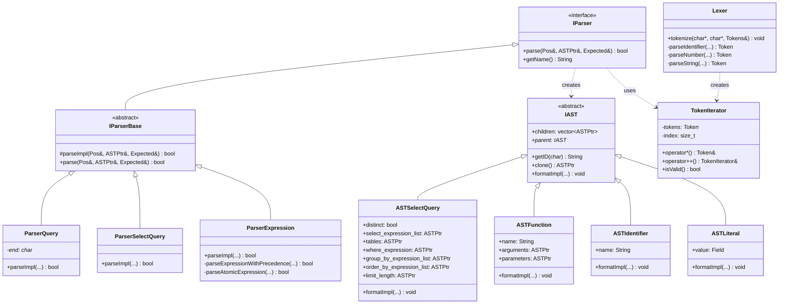

# ClickHouse-05-Parsers模块

## 模块概览

### 职责

Parsers 模块是 ClickHouse 的 SQL 解析器，负责：
- 将 SQL 文本解析为抽象语法树（AST）
- 词法分析（Lexer）：将字符流转换为 Token 流
- 语法分析（Parser）：根据语法规则构建 AST
- 支持标准 SQL 和 ClickHouse 扩展语法
- 错误检测和错误信息提示
- 语法高亮支持

### 输入/输出

**输入**
- SQL 查询文本（String）
- 解析选项（最大递归深度、回溯次数等）

**输出**
- ASTPtr（抽象语法树指针）
- 解析错误信息（位置、期望的 Token）
- 语法高亮信息（可选）

### 上下游依赖

**上游**：Server（接收 SQL 文本）

**下游**：
- Analyzer（语义分析）
- Interpreters（查询解释）
- Formatters（格式化输出）

### 生命周期

```
接收 SQL → 词法分析（Token化） → 语法分析（构建AST） → 返回AST → AST被Analyzer使用
```

## 模块架构图

```mermaid
flowchart TB
    subgraph Parsers["Parsers 模块"]
        subgraph Core["核心组件"]
            IParser[IParser<br/>解析器接口]
            Lexer[Lexer<br/>词法分析器]
            TokenIterator[TokenIterator<br/>Token迭代器]
            IAST[IAST<br/>AST节点基类]
        end
        
        subgraph TopLevel["顶层解析器"]
            ParserQuery[ParserQuery<br/>查询解析]
            ParserQueryWithOutput[ParserQueryWithOutput<br/>带输出的查询]
        end
        
        subgraph QueryParsers["查询类型解析器"]
            ParserSelectQuery[ParserSelectQuery<br/>SELECT]
            ParserInsertQuery[ParserInsertQuery<br/>INSERT]
            ParserCreateQuery[ParserCreateQuery<br/>CREATE]
            ParserAlterQuery[ParserAlterQuery<br/>ALTER]
            ParserDropQuery[ParserDropQuery<br/>DROP]
            ParserShowQuery[ParserShowQuery<br/>SHOW]
        end
        
        subgraph ExpressionParsers["表达式解析器"]
            ParserExpression[ParserExpression<br/>表达式]
            ParserExpressionList[ParserExpressionList<br/>表达式列表]
            ParserFunction[ParserFunction<br/>函数]
            ParserIdentifier[ParserIdentifier<br/>标识符]
            ParserLiteral[ParserLiteral<br/>字面量]
        end
        
        subgraph ASTNodes["AST节点"]
            ASTSelectQuery[ASTSelectQuery<br/>SELECT节点]
            ASTInsertQuery[ASTInsertQuery<br/>INSERT节点]
            ASTCreateQuery[ASTCreateQuery<br/>CREATE节点]
            ASTExpressionList[ASTExpressionList<br/>表达式列表节点]
            ASTFunction[ASTFunction<br/>函数节点]
            ASTIdentifier[ASTIdentifier<br/>标识符节点]
            ASTLiteral[ASTLiteral<br/>字面量节点]
        end
    end
    
    SQL[SQL文本] --> Lexer
    Lexer --> TokenIterator
    TokenIterator --> IParser
    
    IParser <|-- ParserQuery
    ParserQuery --> QueryParsers
    
    ParserSelectQuery --> ExpressionParsers
    ParserInsertQuery --> ExpressionParsers
    
    ExpressionParsers --> ASTNodes
    QueryParsers --> ASTNodes
    
    ASTNodes --> Analyzer[Analyzer模块]
```

### 架构说明

#### 图意概述

Parsers 模块采用递归下降解析（Recursive Descent Parsing）方式。Lexer 将 SQL 文本转换为 Token 流，TokenIterator 遍历 Token。IParser 是所有解析器的基类，定义了统一的接口。顶层解析器（ParserQuery）根据关键字分发到具体的查询类型解析器（SELECT、INSERT 等）。每个解析器递归调用表达式解析器构建 AST 节点。

#### 关键字段与接口

**IParser 接口**
```cpp
class IParser {
public:
    struct Pos : TokenIterator {
        uint32_t depth = 0;          // 当前递归深度
        uint32_t max_depth = 0;      // 最大递归深度
        uint32_t backtracks = 0;     // 回溯次数
        uint32_t max_backtracks = 0; // 最大回溯次数
    };
    
    // 核心解析方法
    virtual bool parse(
        Pos & pos,              // Token 位置（输入输出）
        ASTPtr & node,          // 输出的 AST 节点
        Expected & expected     // 期望的 Token（用于错误提示）
    ) = 0;
    
    // 解析器名称
    virtual const char * getName() const = 0;
};
```

**TokenIterator 类**
```cpp
class TokenIterator {
private:
    const Token * tokens;      // Token 数组
    size_t index = 0;          // 当前位置
    
public:
    // 访问当前 Token
    const Token & operator*() const { return tokens[index]; }
    const Token * operator->() const { return &tokens[index]; }
    
    // 移动位置
    TokenIterator & operator++() { ++index; return *this; }
    TokenIterator operator++(int) { auto old = *this; ++index; return old; }
    
    // 比较
    bool operator==(const TokenIterator & rhs) const;
    bool operator!=(const TokenIterator & rhs) const;
    
    // 检查是否结束
    bool isValid() const { return tokens[index].type != TokenType::EndOfStream; }
};
```

**IAST 接口**
```cpp
class IAST {
public:
    using Children = std::vector<ASTPtr>;
    
    Children children;         // 子节点
    IAST * parent = nullptr;   // 父节点
    
    // 核心方法
    virtual String getID(char delimiter = '_') const = 0;  // 节点ID
    virtual ASTPtr clone() const = 0;                      // 克隆
    virtual void formatImpl(...) const = 0;                 // 格式化
    
    // 遍历
    void forEachChild(std::function<void(IAST&)> f);
    
    // 查找
    template <typename T>
    T * as() { return dynamic_cast<T*>(this); }
    
    template <typename T>
    const T * as() const { return dynamic_cast<const T*>(this); }
};
```

**ASTSelectQuery 类**
```cpp
class ASTSelectQuery : public IAST {
public:
    // SELECT 子句
    bool distinct = false;
    ASTPtr select_expression_list;    // SELECT 列表
    
    // FROM 子句
    ASTPtr tables;                     // 表和JOIN
    
    // WHERE 子句
    ASTPtr prewhere_expression;        // PREWHERE
    ASTPtr where_expression;           // WHERE
    
    // GROUP BY 子句
    ASTPtr group_by_expression_list;
    bool group_by_with_totals = false;
    bool group_by_with_rollup = false;
    bool group_by_with_cube = false;
    
    // HAVING 子句
    ASTPtr having_expression;
    
    // ORDER BY 子句
    ASTPtr order_by_expression_list;
    
    // LIMIT 子句
    ASTPtr limit_offset;
    ASTPtr limit_length;
    bool limit_with_ties = false;
    
    // SETTINGS 子句
    ASTPtr settings;
    
    // 方法
    String getID(char) const override { return "SelectQuery"; }
    ASTPtr clone() const override;
    void formatImpl(...) const override;
};
```

#### 边界条件

**递归深度限制**
- 默认最大深度：DBMS_DEFAULT_MAX_PARSER_DEPTH（1000）
- 超过限制抛出：TOO_DEEP_RECURSION
- 防止栈溢出

**回溯次数限制**
- 默认最大回溯：DBMS_DEFAULT_MAX_PARSER_BACKTRACKS（1000000）
- 超过限制抛出：TOO_SLOW
- 防止解析性能问题

**查询大小限制**
- 最大查询长度：DBMS_DEFAULT_MAX_QUERY_SIZE（262144，256KB）
- 超过限制抛出：QUERY_SIZE_EXCEEDED

#### 异常与回退

**解析异常**
- SYNTAX_ERROR：语法错误，指出错误位置和期望的 Token
- UNKNOWN_IDENTIFIER：未知标识符
- UNKNOWN_FUNCTION：未知函数

**错误恢复**
- 解析失败时回溯到上一个有效位置
- 提供详细的错误信息（位置、期望）
- 支持部分解析（尽可能解析）

**错误提示**
```
Syntax error: expected ',' or FROM, got ')' at line 1, column 25
SELECT id, name, age FROM users
                         ^
```

#### 性能与容量假设

**解析性能**
- 简单查询：< 1ms
- 复杂查询：1-10ms
- 超大查询：10-100ms

**内存使用**
- Token 数组：几 KB 到几 MB
- AST 节点：几 KB 到几 MB
- 临时数据：较小

**容量假设**
- Token 数量：通常几十到几千个
- AST 节点数量：通常几十到几百个
- 嵌套层次：通常 < 100

#### 版本兼容与演进

**语法扩展**
- 新关键字向后兼容（使用保留字列表）
- 新语法通过选项启用（如 allow_experimental_*）
- 旧语法继续支持（弃用但不删除）

**AST 版本**
- AST 结构相对稳定
- 新增字段向后兼容
- 序列化格式版本化

## 核心 API 详解

### API 1: parseQuery - 解析查询

#### 基本信息

- **名称**: `parseQuery()`
- **用途**: 将 SQL 文本解析为 AST
- **幂等性**: 幂等（相同输入产生相同 AST）

#### 函数签名

```cpp
ASTPtr parseQuery(
    IParser & parser,            // 解析器
    const char * begin,          // SQL 文本开始
    const char * end,            // SQL 文本结束
    const String & query_description,  // 查询描述（用于错误信息）
    size_t max_query_size,       // 最大查询大小
    size_t max_parser_depth      // 最大解析深度
);
```

#### 实现流程

```cpp
ASTPtr parseQuery(
    IParser & parser,
    const char * begin,
    const char * end,
    const String & query_description,
    size_t max_query_size,
    size_t max_parser_depth)
{
    // 1) 检查查询大小
    size_t query_size = end - begin;
    if (query_size > max_query_size)
        throw Exception("Query is too large");
    
    // 2) 词法分析：将文本转换为 Token 数组
    Tokens tokens(begin, end);
    IParser::Pos pos(tokens, max_parser_depth);
    
    // 3) 语法分析：解析 AST
    ASTPtr ast;
    Expected expected;
    
    if (!parser.parse(pos, ast, expected))
    {
        // 解析失败，生成错误信息
        throw Exception(getSyntaxError(query_description, begin, end, expected));
    }
    
    // 4) 检查是否有未解析的 Token
    if (pos->type != TokenType::EndOfStream)
    {
        throw Exception("Query has extra tokens after the end");
    }
    
    return ast;
}
```

**词法分析（Lexer）**

```cpp
class Lexer {
public:
    static void tokenize(const char * begin, const char * end, Tokens & tokens)
    {
        const char * pos = begin;
        
        while (pos < end)
        {
            // 跳过空白字符
            pos = skipWhitespace(pos, end);
            if (pos >= end)
                break;
            
            // 识别 Token
            Token token;
            
            if (isAlpha(*pos) || *pos == '_')
            {
                // 标识符或关键字
                token = parseIdentifierOrKeyword(pos, end);
            }
            else if (isDigit(*pos))
            {
                // 数字字面量
                token = parseNumber(pos, end);
            }
            else if (*pos == '\'' || *pos == '"')
            {
                // 字符串字面量
                token = parseString(pos, end);
            }
            else if (*pos == '/' && pos + 1 < end && *(pos + 1) == '*')
            {
                // 多行注释
                pos = skipComment(pos, end);
                continue;
            }
            else if (*pos == '-' && pos + 1 < end && *(pos + 1) == '-')
            {
                // 单行注释
                pos = skipLineComment(pos, end);
                continue;
            }
            else
            {
                // 操作符或标点符号
                token = parseOperator(pos, end);
            }
            
            tokens.push_back(token);
            pos = token.end;
        }
        
        // 添加结束标记
        tokens.push_back(Token{TokenType::EndOfStream, end, end});
    }
    
private:
    static Token parseIdentifierOrKeyword(const char *& pos, const char * end)
    {
        const char * begin = pos;
        
        // 读取标识符字符
        while (pos < end && (isAlpha(*pos) || isDigit(*pos) || *pos == '_'))
            ++pos;
        
        String text(begin, pos);
        
        // 检查是否为关键字
        if (isKeyword(text))
            return Token{TokenType::Keyword, begin, pos, text};
        else
            return Token{TokenType::Identifier, begin, pos, text};
    }
    
    static Token parseNumber(const char *& pos, const char * end)
    {
        const char * begin = pos;
        
        // 整数部分
        while (pos < end && isDigit(*pos))
            ++pos;
        
        // 小数部分
        if (pos < end && *pos == '.')
        {
            ++pos;
            while (pos < end && isDigit(*pos))
                ++pos;
        }
        
        // 指数部分
        if (pos < end && (*pos == 'e' || *pos == 'E'))
        {
            ++pos;
            if (pos < end && (*pos == '+' || *pos == '-'))
                ++pos;
            while (pos < end && isDigit(*pos))
                ++pos;
        }
        
        return Token{TokenType::Number, begin, pos};
    }
};
```

**语法分析（Parser）**

```cpp
class ParserSelectQuery : public IParserBase {
public:
    const char * getName() const override { return "SELECT query"; }
    
    bool parseImpl(Pos & pos, ASTPtr & node, Expected & expected) override
    {
        auto select_query = std::make_shared<ASTSelectQuery>();
        
        // 1) WITH 子句（CTE）
        if (pos->type == TokenType::WITH)
        {
            ++pos;
            if (!ParserWithClause().parse(pos, select_query->with_expression_list, expected))
                return false;
        }
        
        // 2) SELECT 子句
        if (pos->type != TokenType::SELECT)
        {
            expected.add(pos, "SELECT");
            return false;
        }
        ++pos;
        
        // DISTINCT
        if (pos->type == TokenType::DISTINCT)
        {
            select_query->distinct = true;
            ++pos;
        }
        
        // SELECT 列表
        if (!ParserExpressionList(false).parse(pos, select_query->select_expression_list, expected))
            return false;
        
        // 3) FROM 子句
        if (pos->type == TokenType::FROM)
        {
            ++pos;
            if (!ParserTablesInSelectQuery().parse(pos, select_query->tables, expected))
                return false;
        }
        
        // 4) PREWHERE 子句
        if (pos->type == TokenType::PREWHERE)
        {
            ++pos;
            if (!ParserExpression().parse(pos, select_query->prewhere_expression, expected))
                return false;
        }
        
        // 5) WHERE 子句
        if (pos->type == TokenType::WHERE)
        {
            ++pos;
            if (!ParserExpression().parse(pos, select_query->where_expression, expected))
                return false;
        }
        
        // 6) GROUP BY 子句
        if (pos->type == TokenType::GROUP && (pos + 1)->type == TokenType::BY)
        {
            pos += 2;
            if (!ParserExpressionList(false).parse(pos, select_query->group_by_expression_list, expected))
                return false;
            
            // WITH TOTALS / ROLLUP / CUBE
            if (pos->type == TokenType::WITH)
            {
                ++pos;
                if (pos->type == TokenType::TOTALS)
                {
                    select_query->group_by_with_totals = true;
                    ++pos;
                }
                else if (pos->type == TokenType::ROLLUP)
                {
                    select_query->group_by_with_rollup = true;
                    ++pos;
                }
                else if (pos->type == TokenType::CUBE)
                {
                    select_query->group_by_with_cube = true;
                    ++pos;
                }
            }
        }
        
        // 7) HAVING 子句
        if (pos->type == TokenType::HAVING)
        {
            ++pos;
            if (!ParserExpression().parse(pos, select_query->having_expression, expected))
                return false;
        }
        
        // 8) ORDER BY 子句
        if (pos->type == TokenType::ORDER && (pos + 1)->type == TokenType::BY)
        {
            pos += 2;
            if (!ParserOrderByClause().parse(pos, select_query->order_by_expression_list, expected))
                return false;
        }
        
        // 9) LIMIT 子句
        if (pos->type == TokenType::LIMIT)
        {
            ++pos;
            
            // LIMIT offset, length 或 LIMIT length
            ASTPtr first_arg;
            if (!ParserExpression().parse(pos, first_arg, expected))
                return false;
            
            if (pos->type == TokenType::Comma)
            {
                // LIMIT offset, length
                ++pos;
                select_query->limit_offset = first_arg;
                if (!ParserExpression().parse(pos, select_query->limit_length, expected))
                    return false;
            }
            else
            {
                // LIMIT length
                select_query->limit_length = first_arg;
            }
            
            // WITH TIES
            if (pos->type == TokenType::WITH && (pos + 1)->type == TokenType::TIES)
            {
                select_query->limit_with_ties = true;
                pos += 2;
            }
        }
        
        // 10) SETTINGS 子句
        if (pos->type == TokenType::SETTINGS)
        {
            ++pos;
            if (!ParserSetQuery(true).parse(pos, select_query->settings, expected))
                return false;
        }
        
        node = select_query;
        return true;
    }
};
```

#### 时序图


### API 2: ParserExpression - 表达式解析

#### 基本信息

- **名称**: `ParserExpression`
- **用途**: 解析表达式（运算符、函数调用、列引用、字面量）
- **幂等性**: 幂等

#### 表达式优先级

```cpp
enum class OperatorPrecedence {
    OR = 1,              // OR
    AND = 2,             // AND
    NOT = 3,             // NOT
    COMPARISON = 4,      // =, !=, <, >, <=, >=, LIKE, IN
    ADDITION = 5,        // +, -
    MULTIPLICATION = 6,  // *, /, %
    UNARY = 7,           // +x, -x
    POSTFIX = 8,         // []
    FUNCTION = 9         // f()
};
```

#### 实现（运算符优先级解析）

```cpp
class ParserExpression : public IParserBase {
public:
    bool parseImpl(Pos & pos, ASTPtr & node, Expected & expected) override
    {
        return parseExpressionWithPrecedence(pos, node, expected, 0);
    }
    
private:
    bool parseExpressionWithPrecedence(
        Pos & pos, ASTPtr & node, Expected & expected, int min_precedence)
    {
        // 1) 解析左操作数（原子表达式）
        if (!parseAtomicExpression(pos, node, expected))
            return false;
        
        // 2) 处理二元运算符
        while (true)
        {
            // 检查是否有运算符
            TokenType op_type = pos->type;
            int precedence = getOperatorPrecedence(op_type);
            
            // 如果优先级不够，返回
            if (precedence < min_precedence)
                break;
            
            ++pos;  // 跳过运算符
            
            // 解析右操作数（考虑结合性）
            ASTPtr right;
            int next_min_precedence = isRightAssociative(op_type) ? precedence : precedence + 1;
            
            if (!parseExpressionWithPrecedence(pos, right, expected, next_min_precedence))
                return false;
            
            // 创建二元运算符节点
            auto function = std::make_shared<ASTFunction>();
            function->name = getOperatorFunctionName(op_type);
            function->arguments = std::make_shared<ASTExpressionList>();
            function->arguments->children.push_back(node);
            function->arguments->children.push_back(right);
            
            node = function;
        }
        
        return true;
    }
    
    bool parseAtomicExpression(Pos & pos, ASTPtr & node, Expected & expected)
    {
        // 1) 字面量
        if (pos->type == TokenType::Number || 
            pos->type == TokenType::String ||
            pos->type == TokenType::NULL_KEYWORD)
        {
            return ParserLiteral().parse(pos, node, expected);
        }
        
        // 2) 括号表达式
        if (pos->type == TokenType::OpeningRoundBracket)
        {
            ++pos;
            if (!parseExpression(pos, node, expected))
                return false;
            
            if (pos->type != TokenType::ClosingRoundBracket)
            {
                expected.add(pos, ")");
                return false;
            }
            ++pos;
            return true;
        }
        
        // 3) 函数调用或列引用
        if (pos->type == TokenType::Identifier)
        {
            // 先尝试解析为函数
            if ((pos + 1)->type == TokenType::OpeningRoundBracket)
            {
                return ParserFunction().parse(pos, node, expected);
            }
            else
            {
                // 列引用
                return ParserIdentifier().parse(pos, node, expected);
            }
        }
        
        // 4) CASE 表达式
        if (pos->type == TokenType::CASE)
        {
            return ParserCaseExpression().parse(pos, node, expected);
        }
        
        // 5) CAST 表达式
        if (pos->type == TokenType::CAST)
        {
            return ParserCastExpression().parse(pos, node, expected);
        }
        
        expected.add(pos, "expression");
        return false;
    }
};
```

### API 3: formatAST - 格式化 AST

#### 基本信息

- **名称**: `formatAST()` / `IAST::formatImpl()`
- **用途**: 将 AST 转换回 SQL 文本
- **幂等性**: 幂等（格式化后的SQL语义相同）

#### 实现示例

```cpp
void ASTSelectQuery::formatImpl(const FormatSettings & settings, FormatState & state, FormatStateStacked frame) const
{
    frame.current_select = this;
    frame.need_parens = false;
    
    // WITH 子句
    if (with_expression_list)
    {
        settings.ostr << (settings.hilite ? hilite_keyword : "") << "WITH " << (settings.hilite ? hilite_none : "");
        with_expression_list->formatImpl(settings, state, frame);
        settings.ostr << settings.nl_or_ws;
    }
    
    // SELECT 子句
    settings.ostr << (settings.hilite ? hilite_keyword : "") << "SELECT " << (settings.hilite ? hilite_none : "");
    
    if (distinct)
        settings.ostr << (settings.hilite ? hilite_keyword : "") << "DISTINCT " << (settings.hilite ? hilite_none : "");
    
    select_expression_list->formatImpl(settings, state, frame);
    
    // FROM 子句
    if (tables)
    {
        settings.ostr << settings.nl_or_ws << (settings.hilite ? hilite_keyword : "") << "FROM " << (settings.hilite ? hilite_none : "");
        tables->formatImpl(settings, state, frame);
    }
    
    // PREWHERE 子句
    if (prewhere_expression)
    {
        settings.ostr << settings.nl_or_ws << (settings.hilite ? hilite_keyword : "") << "PREWHERE " << (settings.hilite ? hilite_none : "");
        prewhere_expression->formatImpl(settings, state, frame);
    }
    
    // WHERE 子句
    if (where_expression)
    {
        settings.ostr << settings.nl_or_ws << (settings.hilite ? hilite_keyword : "") << "WHERE " << (settings.hilite ? hilite_none : "");
        where_expression->formatImpl(settings, state, frame);
    }
    
    // GROUP BY 子句
    if (group_by_expression_list)
    {
        settings.ostr << settings.nl_or_ws << (settings.hilite ? hilite_keyword : "") << "GROUP BY " << (settings.hilite ? hilite_none : "");
        group_by_expression_list->formatImpl(settings, state, frame);
        
        if (group_by_with_totals)
            settings.ostr << (settings.hilite ? hilite_keyword : "") << " WITH TOTALS" << (settings.hilite ? hilite_none : "");
    }
    
    // HAVING 子句
    if (having_expression)
    {
        settings.ostr << settings.nl_or_ws << (settings.hilite ? hilite_keyword : "") << "HAVING " << (settings.hilite ? hilite_none : "");
        having_expression->formatImpl(settings, state, frame);
    }
    
    // ORDER BY 子句
    if (order_by_expression_list)
    {
        settings.ostr << settings.nl_or_ws << (settings.hilite ? hilite_keyword : "") << "ORDER BY " << (settings.hilite ? hilite_none : "");
        order_by_expression_list->formatImpl(settings, state, frame);
    }
    
    // LIMIT 子句
    if (limit_length)
    {
        settings.ostr << settings.nl_or_ws << (settings.hilite ? hilite_keyword : "") << "LIMIT " << (settings.hilite ? hilite_none : "");
        
        if (limit_offset)
        {
            limit_offset->formatImpl(settings, state, frame);
            settings.ostr << ", ";
        }
        
        limit_length->formatImpl(settings, state, frame);
    }
}
```

## 数据结构 UML 图



## 实战经验

### 解析自定义 SQL

```cpp
// 解析简单查询
String sql = "SELECT id, name FROM users WHERE age > 18";
const char * begin = sql.data();
const char * end = begin + sql.size();

ParserQuery parser(end);
ASTPtr ast = parseQuery(parser, begin, end, "", 0, 0);

// 访问 AST
if (auto * select = ast->as<ASTSelectQuery>())
{
    std::cout << "Is SELECT query" << std::endl;
    
    // 访问 WHERE 子句
    if (select->where_expression)
    {
        std::cout << "Has WHERE clause" << std::endl;
    }
}
```

### 遍历 AST

```cpp
// 递归遍历所有节点
void visitAST(const ASTPtr & ast, int depth = 0)
{
    std::string indent(depth * 2, ' ');
    std::cout << indent << ast->getID() << std::endl;
    
    for (const auto & child : ast->children)
    {
        visitAST(child, depth + 1);
    }
}

// 使用
ASTPtr ast = parseQuery(...);
visitAST(ast);
```

### 修改 AST

```cpp
// 修改 AST（添加 LIMIT）
if (auto * select = ast->as<ASTSelectQuery>())
{
    if (!select->limit_length)
    {
        auto limit = std::make_shared<ASTLiteral>(Field(UInt64(100)));
        select->limit_length = limit;
        select->children.push_back(limit);
    }
}
```

### 格式化 AST

```cpp
// 将 AST 转换回 SQL
WriteBufferFromOwnString buf;
FormatSettings format_settings;
format_settings.hilite = false;
format_settings.one_line = false;

ast->formatImpl(format_settings, {}, {});
String formatted_sql = buf.str();

std::cout << formatted_sql << std::endl;
```

## 总结

Parsers 模块是 ClickHouse 查询处理的第一步，负责：

1. **词法分析**：将 SQL 文本转换为 Token 流
2. **语法分析**：使用递归下降解析构建 AST
3. **错误处理**：提供详细的错误位置和提示信息
4. **AST 表示**：树形结构表示查询的各个部分
5. **格式化输出**：将 AST 转换回 SQL 文本

关键特性：
- 递归下降解析：清晰的解析器结构
- 运算符优先级：正确处理表达式
- 可扩展性：易于添加新的语法
- 错误恢复：提供有用的错误信息

Parsers 模块为后续的语义分析（Analyzer）和查询执行（Interpreters）奠定了基础。

