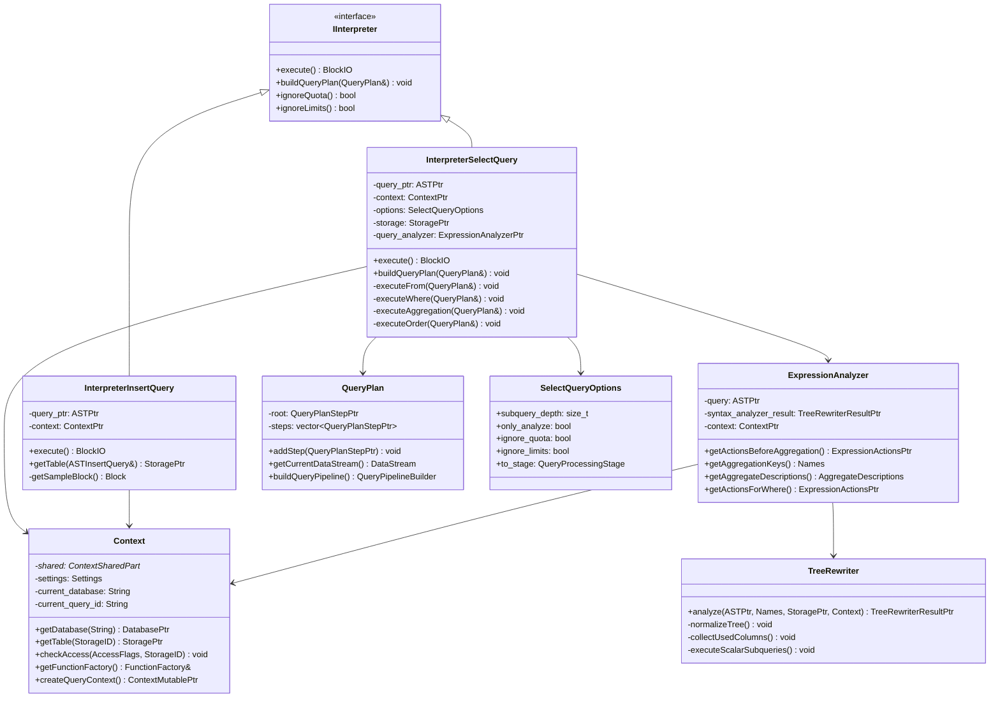

# ClickHouse-06-Interpreters模块

## 模块概览

### 职责

Interpreters 模块是 ClickHouse 的查询解释层，负责：
- 接收 Parsers 生成的 AST
- 进行语义分析和类型检查
- 构建查询执行计划（QueryPlan）
- 管理查询上下文（Context）
- 协调各种资源（存储、函数、权限等）
- 生成查询执行流水线（QueryPipeline）

### 输入/输出

**输入**
- ASTPtr（抽象语法树）
- ContextPtr（查询上下文）
- SelectQueryOptions（查询选项）

**输出**
- BlockIO（输入/输出流）
- QueryPlan（查询计划）
- QueryPipeline（执行流水线）

### 上下游依赖

**上游**：
- Server（接收查询请求）
- Parsers（提供 AST）

**下游**：
- Storages（读取/写入数据）
- Functions（函数调用）
- Processors（执行流水线）
- Access（权限检查）

### 生命周期

```
接收AST → 创建Interpreter → 语义分析 → 构建QueryPlan → 生成Pipeline → 执行 → 返回结果
```

## 模块架构图

```mermaid
flowchart TB
    subgraph Interpreters["Interpreters 模块"]
        subgraph Core["核心组件"]
            IInterpreter[IInterpreter<br/>解释器接口]
            Context[Context<br/>查询上下文]
            ExpressionAnalyzer[ExpressionAnalyzer<br/>表达式分析器]
            TreeRewriter[TreeRewriter<br/>AST重写器]
        end
        
        subgraph QueryInterpreters["查询解释器"]
            InterpreterSelectQuery[InterpreterSelectQuery<br/>SELECT解释器]
            InterpreterInsertQuery[InterpreterInsertQuery<br/>INSERT解释器]
            InterpreterCreateQuery[InterpreterCreateQuery<br/>CREATE解释器]
            InterpreterAlterQuery[InterpreterAlterQuery<br/>ALTER解释器]
            InterpreterDropQuery[InterpreterDropQuery<br/>DROP解释器]
        end
        
        subgraph Analysis["分析组件"]
            ActionsVisitor[ActionsVisitor<br/>访问者模式]
            JoinedTables[JoinedTables<br/>JOIN分析]
            SubqueryForSet[SubqueryForSet<br/>子查询分析]
        end
        
        subgraph Planning["计划组件"]
            QueryPlan[QueryPlan<br/>查询计划]
            QueryPlanOptimizations[优化规则]
        end
        
        subgraph Resources["资源管理"]
            DatabaseCatalog[DatabaseCatalog<br/>数据库目录]
            TableFunctions[TableFunctions<br/>表函数]
            FunctionFactory[FunctionFactory<br/>函数工厂]
            AccessControl[AccessControl<br/>访问控制]
        end
    end
    
    AST[AST] --> IInterpreter
    IInterpreter --> Context
    Context --> Resources
    
    IInterpreter <|-- QueryInterpreters
    
    InterpreterSelectQuery --> ExpressionAnalyzer
    ExpressionAnalyzer --> TreeRewriter
    ExpressionAnalyzer --> Analysis
    
    InterpreterSelectQuery --> Planning
    QueryPlan --> QueryPlanOptimizations
    QueryPlan --> Pipeline[QueryPipeline]
    
    Pipeline --> Processors[Processors模块]
```

### 架构说明

#### 图意概述

Interpreters 模块采用分层设计。IInterpreter 是所有解释器的基类，每种 SQL 语句都有对应的解释器。Context 贯穿整个解释过程，管理所有查询相关的状态和资源。ExpressionAnalyzer 和 TreeRewriter 负责语义分析和 AST 优化。最终生成 QueryPlan，经过优化后转换为 QueryPipeline 供 Processors 执行。

#### 关键字段与接口

**IInterpreter 接口**
```cpp
class IInterpreter {
public:
    virtual ~IInterpreter() = default;
    
    // 执行查询，返回输入/输出流
    virtual BlockIO execute() = 0;
    
    // 构建查询计划
    virtual void buildQueryPlan(QueryPlan & query_plan);
    
    // 是否忽略配额
    virtual bool ignoreQuota() const { return false; }
    
    // 是否忽略限制
    virtual bool ignoreLimits() const { return false; }
    
    // 是否支持事务
    virtual bool supportsTransactions() const { return false; }
};
```

**Context 类（简化版）**
```cpp
class Context : public std::enable_shared_from_this<Context> {
public:
    // 全局单例
    static ContextMutablePtr createGlobal(ContextSharedPart * shared);
    
    // 创建会话/查询上下文
    ContextMutablePtr createSession();
    ContextMutablePtr createQueryContext();
    
    // 数据库操作
    DatabasePtr getDatabase(const String & database_name) const;
    StoragePtr getTable(const StorageID & table_id) const;
    
    // 设置管理
    const Settings & getSettings() const;
    void setSettings(const Settings & settings_);
    
    // 访问控制
    std::shared_ptr<const ContextAccess> getAccess() const;
    void checkAccess(const AccessFlags & flags, const StorageID & table_id) const;
    
    // 函数和聚合
    const FunctionFactory & getFunctionFactory() const;
    const AggregateFunctionFactory & getAggregateFunctionFactory() const;
    
    // 进程列表
    ProcessList & getProcessList();
    QueryStatusPtr getProcessListElement() const;
    
    // 临时表
    void addExternalTable(const String & table_name, TemporaryTableHolder && temporary_table);
    StoragePtr tryResolveStorageID(StorageID & table_id) const;
    
    // 查询信息
    String getCurrentDatabase() const;
    String getCurrentQueryId() const;
    ClientInfo & getClientInfo();
    
private:
    std::shared_ptr<ContextSharedPart> shared;  // 全局共享数据
    
    Settings settings;                          // 查询设置
    ClientInfo client_info;                     // 客户端信息
    String current_database;                    // 当前数据库
    String current_query_id;                    // 当前查询ID
    
    // 缓存和资源
    std::shared_ptr<MarkCache> mark_cache;
    std::shared_ptr<UncompressedCache> uncompressed_cache;
    
    // 临时表
    mutable std::map<String, TemporaryTableHolder> external_tables_mapping;
};
```

**ExpressionAnalyzer 类**
```cpp
class ExpressionAnalyzer {
public:
    ExpressionAnalyzer(
        const ASTPtr & query_,
        const TreeRewriterResultPtr & syntax_analyzer_result_,
        ContextPtr context_);
    
    // 获取聚合前的操作
    ExpressionActionsPtr getActionsBeforeAggregation();
    
    // 获取 GROUP BY 的键
    Names getAggregationKeys() const;
    
    // 获取聚合函数描述
    AggregateDescriptions getAggregateDescriptions() const;
    
    // 获取 JOIN 分析
    const JoinedTables & analyzedJoin() const { return *joined_tables; }
    
    // 获取 PREWHERE 信息
    PrewhereInfoPtr getPrewhereInfo();
    
    // 获取 WHERE 表达式
    ExpressionActionsPtr getActionsForWhere();
    
private:
    ASTPtr query;
    TreeRewriterResultPtr syntax_analyzer_result;
    ContextPtr context;
    
    std::unique_ptr<JoinedTables> joined_tables;
    
    // 分析结果
    AggregateDescriptions aggregate_descriptions;
    Names aggregation_keys;
};
```

**InterpreterSelectQuery 类**
```cpp
class InterpreterSelectQuery : public IInterpreterUnionOrSelectQuery {
public:
    InterpreterSelectQuery(
        const ASTPtr & query_ptr_,
        const ContextPtr & context_,
        const SelectQueryOptions & options_,
        const Names & required_result_column_names_ = Names{});
    
    // 执行查询
    BlockIO execute() override;
    
    // 构建查询计划
    void buildQueryPlan(QueryPlan & query_plan) override;
    
    // 获取结果 Block
    Block getSampleBlock();
    
private:
    ASTPtr query_ptr;
    ContextPtr context;
    SelectQueryOptions options;
    Names required_result_column_names;
    
    // 分析结果
    TreeRewriterResultPtr syntax_analyzer_result;
    ExpressionAnalyzerPtr query_analyzer;
    
    // 存储
    StoragePtr storage;
    TableLockHolder table_lock;
    StorageMetadataPtr metadata_snapshot;
    
    // 方法
    void executeImpl(QueryPlan & query_plan);
    void executeWhere(QueryPlan & query_plan);
    void executeAggregation(QueryPlan & query_plan);
    void executeOrder(QueryPlan & query_plan);
    void executePreLimit(QueryPlan & query_plan);
    void executeLimit(QueryPlan & query_plan);
    void executeProjection(QueryPlan & query_plan);
};
```

#### 边界条件

**查询复杂度限制**
- 最大 JOIN 数量：max_join_tables（61）
- 最大子查询深度：max_subquery_depth（100）
- 最大聚合函数数量：max_aggregate_functions（1000）

**资源限制**
- 最大内存使用：max_memory_usage
- 最大执行时间：max_execution_time
- 最大行数：max_rows_to_read

**并发控制**
- 最大并发查询数：max_concurrent_queries
- 最大线程数：max_threads

#### 异常与回退

**语义错误**
- UNKNOWN_TABLE：表不存在
- UNKNOWN_IDENTIFIER：列不存在
- TYPE_MISMATCH：类型不匹配
- SYNTAX_ERROR：语法错误（来自 Parsers）

**资源限制错误**
- MEMORY_LIMIT_EXCEEDED：内存超限
- TIMEOUT_EXCEEDED：超时
- TOO_MANY_ROWS：行数超限

**权限错误**
- ACCESS_DENIED：访问被拒绝
- NOT_ENOUGH_PRIVILEGES：权限不足

#### 性能与容量假设

**解释性能**
- 简单查询：< 1ms
- 复杂查询（多 JOIN、子查询）：1-10ms
- 超复杂查询：10-100ms

**内存使用**
- Context：几 KB 到几 MB
- QueryPlan：几 KB 到几 MB
- 临时数据（集合、哈希表）：可能很大

**优化能力**
- 谓词下推：减少读取量
- 投影下推：只读取需要的列
- PREWHERE 优化：提前过滤
- JOIN 重排：优化 JOIN 顺序

#### 版本兼容与演进

**新功能**
- 通过 SelectQueryOptions 启用实验性功能
- 向后兼容旧查询语法
- 支持多版本查询计划

**优化升级**
- 新增优化规则不影响旧查询
- 可通过 Settings 禁用特定优化

## 核心 API 详解

### API 1: InterpreterSelectQuery::execute - 执行 SELECT

#### 基本信息

- **名称**: `InterpreterSelectQuery::execute()`
- **用途**: 执行 SELECT 查询，返回结果流
- **幂等性**: 非幂等（可能有副作用，如缓存）

#### 实现流程

```cpp
BlockIO InterpreterSelectQuery::execute()
{
    // 1) 构建查询计划
    QueryPlan query_plan;
    buildQueryPlan(query_plan);
    
    // 2) 优化查询计划
    QueryPlanOptimizationSettings optimization_settings;
    optimization_settings.optimize_plan = context->getSettings().query_plan_enable_optimizations;
    
    QueryPlanOptimizer::optimize(query_plan, optimization_settings);
    
    // 3) 生成 Pipeline
    QueryPipelineBuilder pipeline_builder = query_plan.buildQueryPipeline();
    
    // 4) 设置 Pipeline 参数
    pipeline_builder.setMaxThreads(max_threads);
    
    // 5) 创建 BlockIO
    BlockIO res;
    res.pipeline = QueryPipelineBuilder::getPipeline(std::move(pipeline_builder));
    res.pipeline.setProgressCallback(context->getProgressCallback());
    
    return res;
}

void InterpreterSelectQuery::buildQueryPlan(QueryPlan & query_plan)
{
    // 1) 执行 FROM 子句（读取表）
    executeFrom(query_plan);
    
    // 2) 执行 PREWHERE（提前过滤）
    if (hasPrewhere())
        executePrewhere(query_plan);
    
    // 3) 执行 WHERE（过滤）
    if (hasWhere())
        executeWhere(query_plan);
    
    // 4) 执行 GROUP BY（聚合）
    if (hasAggregation())
    {
        executeBeforeAggregation(query_plan);
        executeAggregation(query_plan);
        executeHaving(query_plan);
    }
    
    // 5) 执行 ORDER BY（排序）
    if (hasOrderBy())
        executeOrder(query_plan);
    
    // 6) 执行 LIMIT（限制）
    if (hasLimit())
    {
        executePreLimit(query_plan);
        executeLimit(query_plan);
    }
    
    // 7) 执行 SELECT（投影）
    executeProjection(query_plan);
}
```

**executeFrom - 从表读取数据**

```cpp
void InterpreterSelectQuery::executeFrom(QueryPlan & query_plan)
{
    // 1) 获取存储
    auto & select = query_ptr->as<ASTSelectQuery &>();
    
    if (!select.tables)
        throw Exception("SELECT without FROM");
    
    // 2) 解析表
    storage = DatabaseCatalog::instance().getTable(table_id, context);
    metadata_snapshot = storage->getInMemoryMetadataPtr();
    
    // 3) 构建 SelectQueryInfo
    SelectQueryInfo query_info;
    query_info.query = query_ptr;
    query_info.syntax_analyzer_result = syntax_analyzer_result;
    query_info.sets = query_analyzer->getPreparedSets();
    
    // 4) 检查权限
    context->checkAccess(AccessType::SELECT, table_id);
    
    // 5) 获取 PREWHERE 信息
    if (auto prewhere_info = query_analyzer->getPrewhereInfo())
        query_info.prewhere_info = prewhere_info;
    
    // 6) 调用存储的 read 方法
    Pipe pipe = storage->read(
        required_columns,
        metadata_snapshot,
        query_info,
        context,
        QueryProcessingStage::FetchColumns,
        max_block_size,
        max_streams
    );
    
    // 7) 添加到查询计划
    auto read_step = std::make_unique<ReadFromStorageStep>(
        std::move(pipe),
        storage->getName()
    );
    
    query_plan.addStep(std::move(read_step));
}
```

**executeWhere - 执行 WHERE 过滤**

```cpp
void InterpreterSelectQuery::executeWhere(QueryPlan & query_plan)
{
    auto & select = query_ptr->as<ASTSelectQuery &>();
    
    // 1) 构建 WHERE 表达式
    auto where_step_actions = query_analyzer->getActionsForWhere();
    
    // 2) 获取过滤列名
    String filter_column_name = where_step_actions->getSampleBlock().getByPosition(
        where_step_actions->getResultPosition()).name;
    
    // 3) 创建 FilterStep
    auto where_step = std::make_unique<FilterStep>(
        query_plan.getCurrentDataStream(),
        where_step_actions,
        filter_column_name,
        true  // remove_filter_column
    );
    
    where_step->setStepDescription("WHERE");
    query_plan.addStep(std::move(where_step));
}
```

**executeAggregation - 执行聚合**

```cpp
void InterpreterSelectQuery::executeAggregation(QueryPlan & query_plan)
{
    // 1) 获取聚合键和聚合函数
    Names keys = query_analyzer->getAggregationKeys();
    AggregateDescriptions aggregates = query_analyzer->getAggregateDescriptions();
    
    // 2) 确定聚合方法
    Aggregator::Params params(
        keys,
        aggregates,
        overflow_row,
        settings.max_rows_to_group_by,
        settings.group_by_overflow_mode,
        settings.group_by_two_level_threshold,
        settings.group_by_two_level_threshold_bytes,
        settings.max_bytes_before_external_group_by,
        settings.empty_result_for_aggregation_by_empty_set,
        context->getTemporaryVolume(),
        settings.max_threads,
        settings.min_free_disk_space_for_temporary_data
    );
    
    // 3) 创建 AggregatingStep
    auto aggregating_step = std::make_unique<AggregatingStep>(
        query_plan.getCurrentDataStream(),
        params,
        group_by_info,
        final,
        settings.max_block_size,
        settings.aggregation_in_order_max_block_bytes,
        merge_threads,
        temporary_data_merge_threads,
        false  // storage_has_evenly_distributed_read
    );
    
    aggregating_step->setStepDescription("Aggregating");
    query_plan.addStep(std::move(aggregating_step));
    
    // 4) 如果有 WITH TOTALS，添加 TotalsHavingStep
    if (query_ptr->as<ASTSelectQuery &>().group_by_with_totals)
    {
        auto totals_having_step = std::make_unique<TotalsHavingStep>(
            query_plan.getCurrentDataStream(),
            overflow_row,
            nullptr  // having_actions
        );
        
        query_plan.addStep(std::move(totals_having_step));
    }
}
```

**executeOrder - 执行排序**

```cpp
void InterpreterSelectQuery::executeOrder(QueryPlan & query_plan)
{
    auto & select = query_ptr->as<ASTSelectQuery &>();
    
    // 1) 解析 ORDER BY
    SortDescription order_descr = getSortDescription(select, context);
    
    // 2) 确定排序参数
    UInt64 limit = 0;
    if (select.limitLength())
    {
        limit = getLimitForSorting(select, context);
    }
    
    // 3) 创建 SortingStep
    auto sorting_step = std::make_unique<SortingStep>(
        query_plan.getCurrentDataStream(),
        order_descr,
        limit,
        SortingStep::Settings(settings)
    );
    
    sorting_step->setStepDescription("Sorting");
    query_plan.addStep(std::move(sorting_step));
}
```

**executeLimit - 执行 LIMIT**

```cpp
void InterpreterSelectQuery::executeLimit(QueryPlan & query_plan)
{
    auto & select = query_ptr->as<ASTSelectQuery &>();
    
    // 1) 计算 offset 和 length
    UInt64 offset = 0;
    UInt64 length = 0;
    
    if (select.limitOffset())
        offset = getLimitOffset(select, context);
    
    if (select.limitLength())
        length = getLimitLength(select, context);
    
    // 2) 创建 LimitStep
    auto limit_step = std::make_unique<LimitStep>(
        query_plan.getCurrentDataStream(),
        length,
        offset,
        settings.optimize_read_in_order,
        select.limit_with_ties
    );
    
    limit_step->setStepDescription("LIMIT");
    query_plan.addStep(std::move(limit_step));
}
```

#### 时序图

```mermaid
sequenceDiagram
    autonumber
    participant Client as 客户端
    participant Interp as InterpreterSelectQuery
    participant Analyzer as ExpressionAnalyzer
    participant Plan as QueryPlan
    participant Storage as IStorage
    participant Opt as Optimizer
    participant Pipeline as QueryPipeline
    
    Client->>Interp: execute()
    Interp->>Interp: buildQueryPlan()
    
    Interp->>Analyzer: 创建 ExpressionAnalyzer
    Analyzer->>Analyzer: 分析 SELECT 列表
    Analyzer->>Analyzer: 分析 WHERE 表达式
    Analyzer->>Analyzer: 分析 GROUP BY
    Analyzer-->>Interp: 分析结果
    
    Interp->>Plan: executeFrom()
    Plan->>Storage: read(columns, query_info)
    Storage-->>Plan: Pipe
    Plan->>Plan: 添加 ReadFromStorageStep
    
    Interp->>Plan: executePrewhere()
    Plan->>Plan: 添加 FilterStep（PREWHERE）
    
    Interp->>Plan: executeWhere()
    Plan->>Plan: 添加 FilterStep（WHERE）
    
    Interp->>Plan: executeAggregation()
    Plan->>Plan: 添加 AggregatingStep
    Plan->>Plan: 添加 TotalsHavingStep
    
    Interp->>Plan: executeOrder()
    Plan->>Plan: 添加 SortingStep
    
    Interp->>Plan: executeLimit()
    Plan->>Plan: 添加 LimitStep
    
    Interp->>Plan: executeProjection()
    Plan->>Plan: 添加 ExpressionStep（投影）
    
    Interp->>Opt: optimize(query_plan)
    loop 优化规则
        Opt->>Opt: 谓词下推
        Opt->>Opt: 投影下推
        Opt->>Opt: 合并步骤
        Opt->>Opt: 移除冗余步骤
    end
    Opt-->>Interp: 优化后的 QueryPlan
    
    Interp->>Pipeline: buildQueryPipeline()
    Pipeline->>Pipeline: 创建 Processors
    Pipeline->>Pipeline: 连接 Ports
    Pipeline-->>Interp: QueryPipeline
    
    Interp-->>Client: BlockIO
```

### API 2: InterpreterInsertQuery::execute - 执行 INSERT

#### 基本信息

- **名称**: `InterpreterInsertQuery::execute()`
- **用途**: 执行 INSERT 查询，返回写入流
- **幂等性**: 非幂等（修改数据）

#### 实现流程

```cpp
BlockIO InterpreterInsertQuery::execute()
{
    auto & query = query_ptr->as<ASTInsertQuery &>();
    
    // 1) 获取目标表
    StoragePtr table = getTable(query);
    
    // 2) 获取表元数据
    auto metadata_snapshot = table->getInMemoryMetadataPtr();
    
    // 3) 检查权限
    context->checkAccess(AccessType::INSERT, table->getStorageID());
    
    // 4) 确定要插入的列
    Names insert_columns;
    if (query.columns)
    {
        for (const auto & column : query.columns->children)
            insert_columns.push_back(column->as<ASTIdentifier &>().name());
    }
    else
    {
        // 使用所有列
        insert_columns = metadata_snapshot->getColumns().getOrdinary().getNames();
    }
    
    // 5) 获取示例 Block
    Block sample_block = getSampleBlock(query, table, metadata_snapshot, context);
    
    BlockIO res;
    
    // 6) 如果是 INSERT SELECT
    if (query.select)
    {
        // 执行 SELECT 部分
        auto select_interpreter = std::make_shared<InterpreterSelectWithUnionQuery>(
            query.select, context, SelectQueryOptions());
        
        res.pipeline = select_interpreter->execute().pipeline;
        
        // 添加转换步骤（类型转换、列重排）
        res.pipeline.addSimpleTransform([&](const Block & header) {
            return std::make_shared<ConvertingTransform>(
                header, sample_block, ConvertingTransform::MatchColumnsMode::Name);
        });
        
        // 添加写入步骤
        auto out = table->write(query_ptr, metadata_snapshot, context);
        res.pipeline.setSinks([&](const Block & cur_header, QueryPipeline::StreamType type) {
            return std::make_shared<SinkToStorage>(out);
        });
    }
    else
    {
        // INSERT VALUES - 直接从客户端读取数据
        res.pipeline = QueryPipeline();
        
        // 创建输入流
        auto out = table->write(query_ptr, metadata_snapshot, context);
        
        res.pipeline.setSinks([&](const Block & cur_header, QueryPipeline::StreamType type) {
            return std::make_shared<SinkToStorage>(out);
        });
    }
    
    return res;
}
```

### API 3: Context - 查询上下文管理

#### 基本信息

- **名称**: `Context`
- **用途**: 管理查询执行的所有上下文信息
- **生命周期**: 全局 → 会话 → 查询

#### Context 层次结构

```cpp
// 全局上下文（进程级）
ContextMutablePtr global_context = Context::createGlobal(shared_part);
global_context->makeGlobalContext();

// 会话上下文（连接级）
ContextMutablePtr session_context = Context::createCopy(global_context);
session_context->makeSessionContext();
session_context->setUser(user);

// 查询上下文（查询级）
ContextMutablePtr query_context = Context::createCopy(session_context);
query_context->makeQueryContext();
query_context->setCurrentQueryId(query_id);
```

#### 资源访问示例

```cpp
// 获取表
auto table = context->getTable(StorageID{"database", "table"});

// 获取函数工厂
auto & function_factory = context->getFunctionFactory();
auto function = function_factory.get("sum", context);

// 检查权限
context->checkAccess(AccessType::SELECT | AccessType::INSERT, table_id);

// 设置
context->setSetting("max_threads", Field(16));
UInt64 max_threads = context->getSettings().max_threads;

// 临时表
context->addExternalTable("temp_table", temporary_table_holder);
auto temp_table = context->tryResolveStorageID(StorageID{"", "temp_table"});
```

## 数据结构 UML 图



## 实战经验

### 自定义 Interpreter

```cpp
class MyCustomInterpreter : public IInterpreter {
public:
    MyCustomInterpreter(const ASTPtr & query_ptr_, ContextPtr context_)
        : query_ptr(query_ptr_), context(context_) {}
    
    BlockIO execute() override
    {
        // 实现自定义逻辑
        QueryPlan query_plan;
        buildQueryPlan(query_plan);
        
        auto pipeline_builder = query_plan.buildQueryPipeline();
        
        BlockIO res;
        res.pipeline = QueryPipelineBuilder::getPipeline(std::move(pipeline_builder));
        return res;
    }
    
    void buildQueryPlan(QueryPlan & query_plan) override
    {
        // 构建查询计划
    }
    
private:
    ASTPtr query_ptr;
    ContextPtr context;
};
```

### Context 使用模式

```cpp
// 创建查询上下文
ContextMutablePtr query_context = session_context->createQueryContext();

// 设置查询ID
query_context->setCurrentQueryId(UUIDHelpers::generateV4());

// 设置查询参数
Settings settings;
settings.max_threads = 8;
settings.max_memory_usage = 10_GiB;
query_context->setSettings(settings);

// 执行查询
auto interpreter = InterpreterFactory::get(ast, query_context);
BlockIO res = interpreter->execute();

// 清理
query_context.reset();
```

### 表达式分析示例

```cpp
// 创建 TreeRewriter
TreeRewriterResultPtr syntax_result = TreeRewriter(context).analyze(
    query, required_result_columns, storage, storage_metadata);

// 创建 ExpressionAnalyzer
ExpressionAnalyzer analyzer(query, syntax_result, context);

// 获取 WHERE 表达式
ExpressionActionsPtr where_actions = analyzer.getActionsForWhere();

// 获取聚合信息
Names aggregation_keys = analyzer.getAggregationKeys();
AggregateDescriptions aggregates = analyzer.getAggregateDescriptions();
```

## 总结

Interpreters 模块是 ClickHouse 的查询执行核心，负责：

1. **语义分析**：检查查询的语义正确性
2. **查询计划**：构建逻辑执行计划（QueryPlan）
3. **上下文管理**：管理所有查询相关的状态和资源
4. **资源协调**：协调存储、函数、权限等各种资源
5. **优化**：应用各种查询优化规则

关键组件：
- **IInterpreter**：解释器接口，每种查询类型一个实现
- **Context**：贯穿整个查询生命周期的上下文
- **ExpressionAnalyzer**：表达式语义分析
- **QueryPlan**：查询执行计划

Interpreters 模块连接了 Parsers（输入 AST）和 Processors（执行引擎），是查询处理的中枢。

