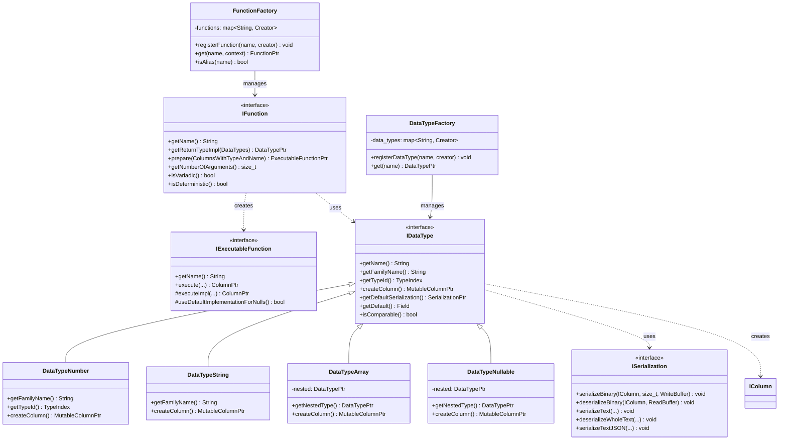

# ClickHouse-07-Functions与DataTypes模块

## 模块概览

### 职责

**Functions 模块**负责：
- 定义和实现所有 SQL 函数（标量函数、操作符）
- 提供函数注册和发现机制（FunctionFactory）
- 支持向量化执行（批量处理）
- 支持编译执行（JIT）
- 处理 NULL 值和特殊列类型

**DataTypes 模块**负责：
- 定义所有数据类型（Int、String、Array、Tuple 等）
- 提供类型系统的基础设施
- 序列化和反序列化
- 类型转换和类型推导
- 类型兼容性检查

### 输入/输出

**Functions**
- **输入**：一个或多个 Column，参数类型信息
- **输出**：结果 Column

**DataTypes**
- **输入**：原始数据（二进制、文本）
- **输出**：Column 实例，或序列化数据

### 上下游依赖

**上游**：
- Interpreters（使用函数和类型）
- Parsers（解析类型名称）

**下游**：
- Columns（数据存储）
- IO（序列化）

## 模块架构图

```mermaid
flowchart TB
    subgraph Functions["Functions 模块"]
        subgraph FuncCore["核心组件"]
            IFunction[IFunction<br/>函数接口]
            IExecutableFunction[IExecutableFunction<br/>可执行函数]
            FunctionFactory[FunctionFactory<br/>函数工厂]
        end
        
        subgraph FuncCategories["函数分类"]
            Arithmetic[算术函数<br/>+,-,*,/]
            Comparison[比较函数<br/>=,<,>,IN]
            Logical[逻辑函数<br/>AND,OR,NOT]
            String[字符串函数<br/>concat,substring]
            DateTime[日期时间函数<br/>toDateTime,now]
            Array[数组函数<br/>arrayJoin,arrayMap]
            Aggregate[聚合函数<br/>sum,avg,count]
        end
    end
    
    subgraph DataTypes["DataTypes 模块"]
        subgraph TypeCore["核心组件"]
            IDataType[IDataType<br/>类型接口]
            ISerialization[ISerialization<br/>序列化接口]
            DataTypeFactory[DataTypeFactory<br/>类型工厂]
        end
        
        subgraph TypeCategories["类型分类"]
            Numeric[数值类型<br/>Int,Float,Decimal]
            StringType[字符串类型<br/>String,FixedString]
            DateTimeType[日期时间类型<br/>Date,DateTime]
            Composite[复合类型<br/>Array,Tuple,Map]
            Special[特殊类型<br/>Nullable,LowCardinality]
        end
    end
    
    Query[查询表达式] --> FunctionFactory
    FunctionFactory --> IFunction
    IFunction --> IExecutableFunction
    IExecutableFunction --> FuncCategories
    
    FuncCategories --> Columns[Columns模块]
    
    TypeCategories --> ISerialization
    ISerialization --> IO[IO模块]
    
    IDataType <|-- TypeCategories
    IFunction ..> IDataType: uses
```

### 架构说明

#### 图意概述

Functions 和 DataTypes 模块是紧密关联的。Functions 模块提供 700+ 个函数实现，通过 FunctionFactory 统一管理和注册。每个函数实现 IFunction 接口，生成 IExecutableFunction 用于实际执行。DataTypes 模块定义了 30+ 种数据类型，每种类型实现 IDataType 接口，提供序列化、反序列化、类型转换等能力。Functions 依赖 DataTypes 进行类型检查和转换。

#### 关键字段与接口

**IFunction 接口**
```cpp
class IFunction {
public:
    virtual ~IFunction() = default;
    
    // 函数名称
    virtual String getName() const = 0;
    
    // 根据参数类型获取返回类型
    virtual DataTypePtr getReturnTypeImpl(const DataTypes & arguments) const = 0;
    
    // 创建可执行函数
    virtual ExecutableFunctionPtr prepare(const ColumnsWithTypeAndName & arguments) const = 0;
    
    // 是否可变参数
    virtual bool isVariadic() const { return false; }
    
    // 参数数量
    virtual size_t getNumberOfArguments() const = 0;
    
    // 是否注入查询ID
    virtual bool isInjectiveForQueryId() const { return false; }
    
    // 是否支持常量折叠
    virtual bool isSuitableForConstantFolding() const { return true; }
    
    // 是否支持短路求值
    virtual bool isSuitableForShortCircuitArgumentsExecution(const DataTypesWithConstInfo & arguments) const { return false; }
    
    // 是否为确定性函数
    virtual bool isDeterministic() const { return true; }
    
    // 是否为有状态函数
    virtual bool isStateful() const { return false; }
};
```

**IExecutableFunction 接口**
```cpp
class IExecutableFunction {
public:
    virtual ~IExecutableFunction() = default;
    
    // 函数名称
    virtual String getName() const = 0;
    
    // 执行函数（核心方法）
    ColumnPtr execute(
        const ColumnsWithTypeAndName & arguments,
        const DataTypePtr & result_type,
        size_t input_rows_count,
        bool dry_run
    ) const;
    
protected:
    // 实际实现（子类重写）
    virtual ColumnPtr executeImpl(
        const ColumnsWithTypeAndName & arguments,
        const DataTypePtr & result_type,
        size_t input_rows_count
    ) const = 0;
    
    // 是否对 NULL 使用默认实现
    virtual bool useDefaultImplementationForNulls() const { return true; }
    
    // 是否对常量使用默认实现
    virtual bool useDefaultImplementationForConstants() const { return false; }
    
    // 是否对低基数列使用默认实现
    virtual bool useDefaultImplementationForLowCardinalityColumns() const { return true; }
};
```

**IDataType 接口**
```cpp
class IDataType : public std::enable_shared_from_this<IDataType> {
public:
    virtual ~IDataType() = default;
    
    // 类型名称（例如："UInt64", "Array(String)"）
    String getName() const;
    
    // 类型族名称（例如："UInt64", "Array"）
    virtual const char * getFamilyName() const = 0;
    
    // 类型ID（用于运行时类型检查）
    virtual TypeIndex getTypeId() const = 0;
    
    // 获取默认序列化器
    virtual SerializationPtr getDefaultSerialization() const;
    
    // 获取子列类型（例如：Array 的元素类型）
    virtual DataTypePtr tryGetSubcolumnType(std::string_view subcolumn_name) const;
    
    // 创建默认列
    virtual MutableColumnPtr createColumn() const = 0;
    
    // 获取默认值
    virtual Field getDefault() const;
    
    // 类型是否可比较
    virtual bool isComparable() const { return false; }
    
    // 类型是否可作为主键
    virtual bool canBeInsideNullable() const { return false; }
    
    // 类型是否可作为分区键
    virtual bool canBeUsedInBitOperations() const { return false; }
    
    // 类型是否支持范围过滤
    virtual bool isValueRepresentedByNumber() const { return false; }
    
    // 类型是否可聚合
    virtual bool canBeInsideLowCardinality() const { return false; }
};
```

**ISerialization 接口**
```cpp
class ISerialization {
public:
    virtual ~ISerialization() = default;
    
    // 序列化到二进制格式
    virtual void serializeBinary(
        const Field & field,
        WriteBuffer & ostr
    ) const = 0;
    
    virtual void serializeBinary(
        const IColumn & column,
        size_t row_num,
        WriteBuffer & ostr
    ) const = 0;
    
    // 反序列化
    virtual void deserializeBinary(
        Field & field,
        ReadBuffer & istr
    ) const = 0;
    
    virtual void deserializeBinary(
        IColumn & column,
        ReadBuffer & istr
    ) const = 0;
    
    // 序列化到文本格式
    virtual void serializeText(
        const IColumn & column,
        size_t row_num,
        WriteBuffer & ostr,
        const FormatSettings & settings
    ) const = 0;
    
    // 反序列化文本
    virtual void deserializeWholeText(
        IColumn & column,
        ReadBuffer & istr,
        const FormatSettings & settings
    ) const = 0;
    
    // 序列化到 JSON
    virtual void serializeTextJSON(
        const IColumn & column,
        size_t row_num,
        WriteBuffer & ostr,
        const FormatSettings & settings
    ) const = 0;
    
    // 反序列化 JSON
    virtual void deserializeTextJSON(
        IColumn & column,
        ReadBuffer & istr,
        const FormatSettings & settings
    ) const = 0;
};
```

#### 边界条件

**Functions**
- 参数数量：0-255
- NULL 处理：自动或自定义
- 常量折叠：编译期优化
- 向量化：批量处理（通常 8192 行）

**DataTypes**
- 类型嵌套深度：< 1000
- 数组大小：< 2^31
- 字符串长度：< 2^31
- Nullable 嵌套：最多一层

#### 异常与回退

**Functions**
- TYPE_MISMATCH：参数类型不匹配
- NUMBER_OF_ARGUMENTS_DOESNT_MATCH：参数数量错误
- ILLEGAL_TYPE_OF_ARGUMENT：非法参数类型
- BAD_ARGUMENTS：参数值非法

**DataTypes**
- CANNOT_PARSE_TEXT：文本解析失败
- CANNOT_READ_ALL_DATA：数据不完整
- INCORRECT_DATA：数据格式错误

#### 性能与容量假设

**Functions 性能**
- 简单函数（加法）：< 1ns/row
- 复杂函数（正则表达式）：10-1000ns/row
- 向量化加速：5-10x

**DataTypes 性能**
- 简单类型序列化：< 10ns/row
- 复杂类型序列化：10-100ns/row
- 文本格式：比二进制慢 2-10x

#### 版本兼容与演进

**Functions**
- 新函数通过 FunctionFactory 注册
- 函数别名支持向后兼容
- 实验性函数通过 Settings 启用

**DataTypes**
- 类型序列化格式版本化
- 新类型向后兼容
- 类型转换规则明确定义

## 核心 API 详解

### API 1: FunctionPlus - 加法函数示例

#### 基本信息

- **名称**: `plus`
- **用途**: 两个数值相加
- **参数**: 2 个（被加数、加数）
- **返回**: 和

#### 实现（简化版）

```cpp
class FunctionPlus : public IFunction {
public:
    static constexpr auto name = "plus";
    
    static FunctionPtr create(ContextPtr context) {
        return std::make_shared<FunctionPlus>();
    }
    
    String getName() const override {
        return name;
    }
    
    size_t getNumberOfArguments() const override {
        return 2;
    }
    
    DataTypePtr getReturnTypeImpl(const DataTypes & arguments) const override {
        // 类型推导：返回更宽的类型
        if (!isNumber(arguments[0]) || !isNumber(arguments[1]))
            throw Exception("Arguments must be numbers");
        
        // 简化：返回第一个参数的类型
        return arguments[0];
    }
    
    ExecutableFunctionPtr prepare(const ColumnsWithTypeAndName & arguments) const override {
        return std::make_shared<ExecutableFunctionPlus>();
    }
};

class ExecutableFunctionPlus : public IExecutableFunction {
public:
    String getName() const override {
        return "plus";
    }
    
    ColumnPtr executeImpl(
        const ColumnsWithTypeAndName & arguments,
        const DataTypePtr & result_type,
        size_t input_rows_count) const override
    {
        // 1) 获取输入列
        const auto & col_left = arguments[0].column;
        const auto & col_right = arguments[1].column;
        
        // 2) 创建结果列
        auto col_result = result_type->createColumn();
        col_result->reserve(input_rows_count);
        
        // 3) 向量化执行
        if (auto * col_left_uint64 = typeid_cast<const ColumnUInt64 *>(col_left.get()))
        {
            if (auto * col_right_uint64 = typeid_cast<const ColumnUInt64 *>(col_right.get()))
            {
                auto & result_data = typeid_cast<ColumnUInt64 &>(*col_result).getData();
                result_data.resize(input_rows_count);
                
                const auto & left_data = col_left_uint64->getData();
                const auto & right_data = col_right_uint64->getData();
                
                // 向量化加法
                for (size_t i = 0; i < input_rows_count; ++i)
                    result_data[i] = left_data[i] + right_data[i];
                
                return col_result;
            }
        }
        
        // （此处省略其他类型的处理）
        
        throw Exception("Unsupported types for plus");
    }
};

// 注册函数
void registerFunctionPlus(FunctionFactory & factory) {
    factory.registerFunction<FunctionPlus>();
}
```

### API 2: DataTypeUInt64 - UInt64 类型示例

#### 基本信息

- **名称**: `UInt64`
- **大小**: 8 字节
- **范围**: 0 到 2^64-1
- **序列化**: 小端序二进制

#### 实现（简化版）

```cpp
class DataTypeUInt64 : public IDataType {
public:
    static constexpr auto name = "UInt64";
    
    const char * getFamilyName() const override {
        return name;
    }
    
    TypeIndex getTypeId() const override {
        return TypeIndex::UInt64;
    }
    
    MutableColumnPtr createColumn() const override {
        return ColumnUInt64::create();
    }
    
    Field getDefault() const override {
        return UInt64(0);
    }
    
    bool isComparable() const override { return true; }
    bool canBeInsideNullable() const override { return true; }
    bool isValueRepresentedByNumber() const override { return true; }
    
    SerializationPtr getDefaultSerialization() const override {
        return std::make_shared<SerializationNumber<UInt64>>();
    }
};

template <typename T>
class SerializationNumber : public ISerialization {
public:
    void serializeBinary(const Field & field, WriteBuffer & ostr) const override {
        T value = field.get<T>();
        writeBinary(value, ostr);
    }
    
    void serializeBinary(const IColumn & column, size_t row_num, WriteBuffer & ostr) const override {
        const auto & col = assert_cast<const ColumnVector<T> &>(column);
        writeBinary(col.getData()[row_num], ostr);
    }
    
    void deserializeBinary(Field & field, ReadBuffer & istr) const override {
        T value;
        readBinary(value, istr);
        field = value;
    }
    
    void deserializeBinary(IColumn & column, ReadBuffer & istr) const override {
        auto & col = assert_cast<ColumnVector<T> &>(column);
        T value;
        readBinary(value, istr);
        col.insertValue(value);
    }
    
    void serializeText(const IColumn & column, size_t row_num, WriteBuffer & ostr, const FormatSettings &) const override {
        const auto & col = assert_cast<const ColumnVector<T> &>(column);
        writeText(col.getData()[row_num], ostr);
    }
    
    void deserializeWholeText(IColumn & column, ReadBuffer & istr, const FormatSettings &) const override {
        auto & col = assert_cast<ColumnVector<T> &>(column);
        T value;
        readText(value, istr);
        col.insertValue(value);
    }
};

// 注册类型
void registerDataTypeNumbers(DataTypeFactory & factory) {
    factory.registerSimpleDataType("UInt64", [] { return DataTypePtr(std::make_shared<DataTypeUInt64>()); });
}
```

### API 3: DataTypeArray - Array 类型示例

#### 基本信息

- **名称**: `Array(T)`
- **参数**: 元素类型 T
- **存储**: 偏移量数组 + 元素数组

#### 实现（简化版）

```cpp
class DataTypeArray : public IDataType {
public:
    DataTypeArray(const DataTypePtr & nested_)
        : nested(nested_) {}
    
    String getName() const override {
        return "Array(" + nested->getName() + ")";
    }
    
    const char * getFamilyName() const override {
        return "Array";
    }
    
    TypeIndex getTypeId() const override {
        return TypeIndex::Array;
    }
    
    MutableColumnPtr createColumn() const override {
        return ColumnArray::create(nested->createColumn());
    }
    
    Field getDefault() const override {
        return Array();
    }
    
    bool canBeInsideNullable() const override { return false; }
    
    SerializationPtr getDefaultSerialization() const override {
        return std::make_shared<SerializationArray>(nested->getDefaultSerialization());
    }
    
    DataTypePtr getNestedType() const { return nested; }
    
private:
    DataTypePtr nested;
};

class SerializationArray : public ISerialization {
public:
    SerializationArray(const SerializationPtr & nested_)
        : nested(nested_) {}
    
    void serializeBinary(const IColumn & column, size_t row_num, WriteBuffer & ostr) const override {
        const auto & col_array = assert_cast<const ColumnArray &>(column);
        const auto & offsets = col_array.getOffsets();
        const auto & nested_column = col_array.getData();
        
        // 1) 序列化数组大小
        size_t offset = row_num > 0 ? offsets[row_num - 1] : 0;
        size_t next_offset = offsets[row_num];
        size_t array_size = next_offset - offset;
        
        writeVarUInt(array_size, ostr);
        
        // 2) 序列化每个元素
        for (size_t i = offset; i < next_offset; ++i)
            nested->serializeBinary(nested_column, i, ostr);
    }
    
    void deserializeBinary(IColumn & column, ReadBuffer & istr) const override {
        auto & col_array = assert_cast<ColumnArray &>(column);
        auto & offsets = col_array.getOffsets();
        auto & nested_column = col_array.getData();
        
        // 1) 反序列化数组大小
        size_t array_size;
        readVarUInt(array_size, istr);
        
        // 2) 反序列化每个元素
        for (size_t i = 0; i < array_size; ++i)
            nested->deserializeBinary(nested_column, istr);
        
        // 3) 更新偏移量
        offsets.push_back(nested_column.size());
    }
    
private:
    SerializationPtr nested;
};
```

## 数据结构 UML 图



## 实战经验

### 注册自定义函数

```cpp
// 1) 实现函数
class FunctionMyCustom : public IFunction {
public:
    static constexpr auto name = "myCustom";
    
    static FunctionPtr create(ContextPtr) {
        return std::make_shared<FunctionMyCustom>();
    }
    
    String getName() const override { return name; }
    size_t getNumberOfArguments() const override { return 1; }
    
    DataTypePtr getReturnTypeImpl(const DataTypes & arguments) const override {
        return std::make_shared<DataTypeString>();
    }
    
    ExecutableFunctionPtr prepare(const ColumnsWithTypeAndName & arguments) const override {
        return std::make_shared<ExecutableFunctionMyCustom>();
    }
};

// 2) 实现可执行函数
class ExecutableFunctionMyCustom : public IExecutableFunction {
public:
    String getName() const override { return "myCustom"; }
    
    ColumnPtr executeImpl(
        const ColumnsWithTypeAndName & arguments,
        const DataTypePtr & result_type,
        size_t input_rows_count) const override
    {
        // 实现逻辑
        auto result_column = ColumnString::create();
        
        for (size_t i = 0; i < input_rows_count; ++i)
            result_column->insertData("result", 6);
        
        return result_column;
    }
};

// 3) 注册
void registerFunctionMyCustom(FunctionFactory & factory) {
    factory.registerFunction<FunctionMyCustom>();
}
```

### 注册自定义类型

```cpp
// 1) 实现类型
class DataTypeMyCustom : public IDataType {
public:
    const char * getFamilyName() const override { return "MyCustom"; }
    TypeIndex getTypeId() const override { return TypeIndex::String; }  // 复用现有ID
    
    MutableColumnPtr createColumn() const override {
        return ColumnString::create();
    }
    
    SerializationPtr getDefaultSerialization() const override {
        return std::make_shared<SerializationString>();
    }
};

// 2) 注册
void registerDataTypeMyCustom(DataTypeFactory & factory) {
    factory.registerSimpleDataType("MyCustom", [] {
        return DataTypePtr(std::make_shared<DataTypeMyCustom>());
    });
}
```

### 类型转换

```cpp
// 使用 CAST
DataTypePtr from_type = std::make_shared<DataTypeString>();
DataTypePtr to_type = std::make_shared<DataTypeUInt64>();

FunctionCast::Diagnostic diagnostic = {nullptr, ""};
ColumnWithTypeAndName result = castColumn({column, from_type, "x"}, to_type, diagnostic);
```

## 总结

Functions 和 DataTypes 模块是 ClickHouse 的类型系统和函数库：

**Functions 模块**提供：
1. **700+ 函数**：覆盖算术、字符串、日期、数组等
2. **向量化执行**：批量处理提升性能
3. **类型推导**：自动确定返回类型
4. **NULL 处理**：自动处理 Nullable 类型
5. **FunctionFactory**：统一的函数注册和查找

**DataTypes 模块**提供：
1. **30+ 数据类型**：数值、字符串、复合类型等
2. **序列化**：二进制、文本、JSON 格式
3. **类型系统**：类型推导、转换、兼容性
4. **Column 创建**：每种类型对应的列实现
5. **DataTypeFactory**：统一的类型注册和查找

两个模块紧密协作，为 ClickHouse 提供强大的数据处理能力。

