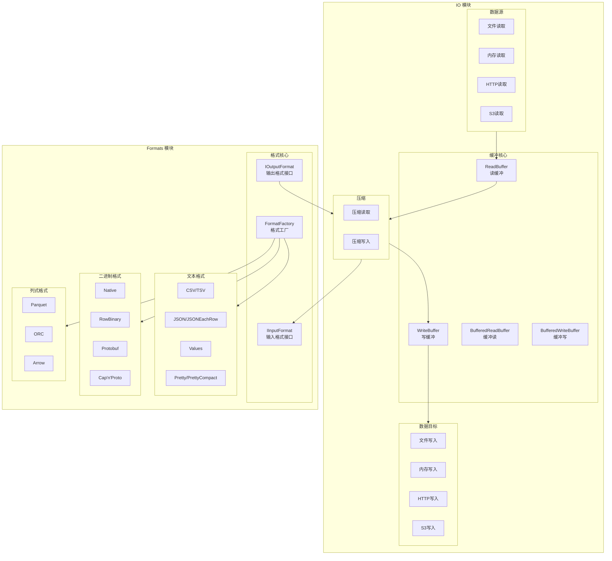
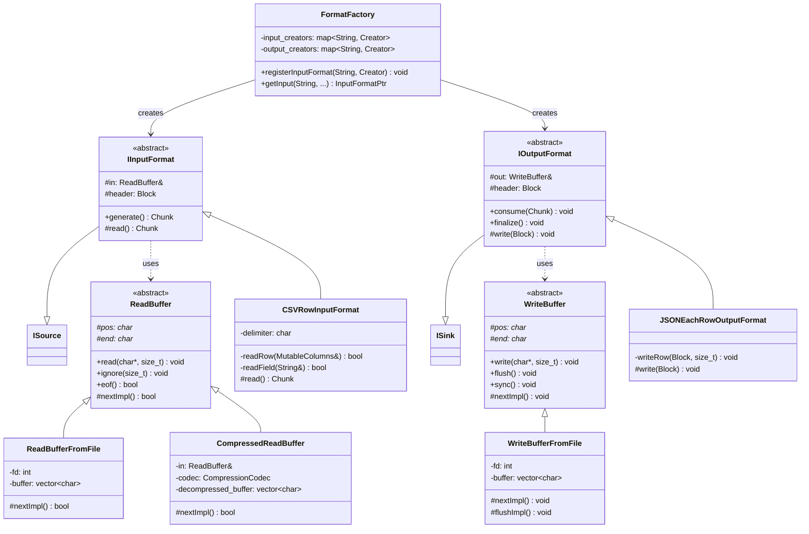

# ClickHouse-08-IO与Formats模块

## 模块概览

### 职责

**IO 模块**负责：
- 提供统一的读写接口（ReadBuffer、WriteBuffer）
- 支持多种底层存储（文件、内存、网络、压缩）
- 实现缓冲机制提升 I/O 性能
- 支持异步 I/O
- 提供各种编解码工具（Base64、Hex、压缩等）

**Formats 模块**负责：
- 定义数据格式接口（IInputFormat、IOutputFormat）
- 实现 20+ 种数据格式（CSV、JSON、Parquet、ORC 等）
- 处理数据格式之间的转换
- 支持流式解析和写入
- 与 IO 模块协作实现高效序列化

### 输入/输出

**IO**
- **输入**：底层数据源（文件描述符、缓冲区、网络连接）
- **输出**：抽象的 ReadBuffer/WriteBuffer

**Formats**
- **输入**：ReadBuffer + FormatSettings
- **输出**：Block 或 WriteBuffer

## 模块架构图



### 架构说明

#### 图意概述

IO 模块提供分层的缓冲抽象。最底层是 ReadBuffer/WriteBuffer 接口，中间层实现各种数据源/目标（文件、内存、网络），顶层提供压缩、加密等增强功能。Formats 模块基于 IO 模块，实现各种数据格式的解析和生成。FormatFactory 统一管理所有格式。

#### 关键字段与接口

**ReadBuffer 类**
```cpp
class ReadBuffer {
public:
    // 当前位置
    char * position() { return pos; }
    
    // 剩余字节数
    size_t available() const { return end - pos; }
    
    // 读取下一个字节
    bool next() {
        if (pos < end)
            return true;
        return nextImpl();
    }
    
    // 读取一个字节
    char read() {
        if (pos < end)
            return *pos++;
        return readImpl();
    }
    
    // 读取多个字节
    void read(char * to, size_t n);
    
    // 忽略 n 个字节
    void ignore(size_t n);
    
    // 查找字符
    char * find(char c);
    
    // 是否到达结尾
    bool eof() const { return pos == end && eofImpl(); }
    
protected:
    char * pos;          // 当前位置
    char * end;          // 缓冲区结束
    
    // 子类实现：填充缓冲区
    virtual bool nextImpl() = 0;
    virtual bool eofImpl() const = 0;
};
```

**WriteBuffer 类**
```cpp
class WriteBuffer {
public:
    // 当前位置
    char * position() { return pos; }
    
    // 剩余空间
    size_t available() const { return end - pos; }
    
    // 写入一个字节
    void write(char c) {
        if (pos < end)
            *pos++ = c;
        else
            writeImpl(c);
    }
    
    // 写入多个字节
    void write(const char * from, size_t n);
    
    // 刷新缓冲区
    void flush() {
        next();
        flushImpl();
    }
    
    // 同步到存储
    void sync() {
        flush();
        syncImpl();
    }
    
protected:
    char * pos;          // 当前位置
    char * end;          // 缓冲区结束
    
    // 子类实现：刷新缓冲区
    virtual void nextImpl() = 0;
    virtual void flushImpl() {}
    virtual void syncImpl() {}
};
```

**IInputFormat 接口**
```cpp
class IInputFormat : public ISource {
public:
    // 读取下一个 Block
    Chunk generate() override;
    
    // 获取总行数（如果已知）
    virtual std::optional<size_t> getTotalRows() const { return {}; }
    
    // 获取总字节数
    virtual std::optional<size_t> getTotalBytes() const { return {}; }
    
    // 设置最大块大小
    void setMaxBlockSize(size_t max_block_size_) { max_block_size = max_block_size_; }
    
protected:
    ReadBuffer & in;
    Block header;
    size_t max_block_size = DEFAULT_BLOCK_SIZE;
    
    // 子类实现：读取数据
    virtual Chunk read() = 0;
};
```

**IOutputFormat 接口**
```cpp
class IOutputFormat : public ISink {
public:
    // 写入 Block
    void consume(Chunk chunk) override;
    
    // 完成写入
    void finalize() override;
    
    // 获取写入的行数
    size_t getResultRows() const { return result_rows; }
    
    // 获取写入的字节数
    size_t getResultBytes() const { return result_bytes; }
    
protected:
    WriteBuffer & out;
    Block header;
    size_t result_rows = 0;
    size_t result_bytes = 0;
    
    // 子类实现：写入数据
    virtual void write(const Block & block) = 0;
    virtual void finalizeImpl() {}
};
```

#### 边界条件

**IO**
- 缓冲区大小：默认 1MB，可配置
- 最大文件大小：取决于文件系统
- 网络超时：可配置
- 并发连接数：可配置

**Formats**
- 最大块大小：默认 8192 行
- 最大字段大小：可配置
- 嵌套深度：< 100
- 并行解析：支持

#### 异常与回退

**IO 异常**
- CANNOT_OPEN_FILE：无法打开文件
- CANNOT_READ_FROM_FILE：读取失败
- CANNOT_WRITE_TO_FILE：写入失败
- NETWORK_ERROR：网络错误

**Formats 异常**
- CANNOT_PARSE_INPUT_ASSERTION_FAILED：解析失败
- CANNOT_PARSE_NUMBER：数字解析失败
- CANNOT_PARSE_DATE：日期解析失败
- INCORRECT_DATA：数据格式错误

#### 性能与容量假设

**IO 性能**
- 本地文件：500MB/s - 5GB/s（取决于存储）
- 网络：10MB/s - 1GB/s（取决于网络）
- 压缩：100MB/s - 500MB/s（取决于算法和CPU）

**Formats 性能**
- Native：1-5GB/s
- CSV：100-500MB/s
- JSON：50-200MB/s
- Parquet：500MB/s - 2GB/s

## 核心 API 详解

### API 1: ReadBufferFromFile - 文件读取

#### 基本信息

- **名称**: `ReadBufferFromFile`
- **用途**: 从文件读取数据
- **特性**: 带缓冲、支持 Direct I/O

#### 实现（简化版）

```cpp
class ReadBufferFromFile : public ReadBuffer {
public:
    ReadBufferFromFile(
        const String & file_name,
        size_t buf_size = DBMS_DEFAULT_BUFFER_SIZE,
        int flags = -1,
        char * existing_memory = nullptr,
        size_t alignment = 0)
        : ReadBuffer(nullptr, 0)
    {
        // 1) 打开文件
        fd = ::open(file_name.c_str(), flags ? flags : O_RDONLY);
        if (fd < 0)
            throwFromErrno("Cannot open file " + file_name);
        
        // 2) 分配缓冲区
        if (existing_memory)
            internal_buffer = Buffer(existing_memory, existing_memory + buf_size);
        else
            internal_buffer.resize(buf_size);
        
        working_buffer = internal_buffer;
        pos = working_buffer.begin();
        end = pos;
    }
    
    ~ReadBufferFromFile() override {
        if (fd >= 0)
            ::close(fd);
    }
    
protected:
    bool nextImpl() override {
        // 读取下一块数据
        ssize_t bytes_read = ::read(fd, internal_buffer.begin(), internal_buffer.size());
        
        if (bytes_read < 0)
            throwFromErrno("Cannot read from file");
        
        if (bytes_read == 0)
            return false;
        
        working_buffer = Buffer(internal_buffer.begin(), internal_buffer.begin() + bytes_read);
        pos = working_buffer.begin();
        end = working_buffer.end();
        
        return true;
    }
    
    bool eofImpl() const override {
        return true;  // 简化实现
    }
    
private:
    int fd = -1;
    Buffer internal_buffer;
};
```

### API 2: CSVRowInputFormat - CSV 解析

#### 基本信息

- **名称**: `CSVRowInputFormat`
- **用途**: 解析 CSV 格式数据
- **特性**: 支持自定义分隔符、转义、引号

#### 实现（简化版）

```cpp
class CSVRowInputFormat : public IInputFormat {
public:
    CSVRowInputFormat(
        ReadBuffer & in_,
        const Block & header_,
        const FormatSettings & format_settings_)
        : IInputFormat(in_, header_)
        , format_settings(format_settings_)
    {
        delimiter = format_settings.csv.delimiter;
    }
    
protected:
    Chunk read() override {
        MutableColumns columns = header.cloneEmptyColumns();
        
        size_t num_rows = 0;
        
        while (!in.eof() && num_rows < max_block_size)
        {
            // 读取一行
            if (!readRow(columns))
                break;
            
            ++num_rows;
        }
        
        if (num_rows == 0)
            return {};
        
        return Chunk(std::move(columns), num_rows);
    }
    
private:
    bool readRow(MutableColumns & columns) {
        for (size_t i = 0; i < columns.size(); ++i)
        {
            // 1) 读取字段
            String field;
            if (!readField(field))
                return false;
            
            // 2) 解析并插入列
            ReadBufferFromString buf(field);
            auto serialization = header.getByPosition(i).type->getDefaultSerialization();
            serialization->deserializeWholeText(*columns[i], buf, format_settings);
            
            // 3) 检查分隔符或行尾
            if (i + 1 < columns.size())
            {
                assertChar(delimiter, in);
            }
            else
            {
                if (!in.eof())
                    assertChar('\n', in);
            }
        }
        
        return true;
    }
    
    bool readField(String & field) {
        field.clear();
        
        // 处理引号
        if (*in.position() == '"')
        {
            ++in.position();
            
            while (true)
            {
                char * next_quote = find_first_symbols<'"'>(in.position(), in.buffer().end());
                field.append(in.position(), next_quote - in.position());
                in.position() = next_quote;
                
                if (in.eof())
                    throw Exception("Unexpected EOF in CSV");
                
                ++in.position();  // 跳过引号
                
                // 检查是否为转义引号
                if (*in.position() == '"')
                {
                    field += '"';
                    ++in.position();
                }
                else
                {
                    break;  // 字段结束
                }
            }
        }
        else
        {
            // 无引号字段
            char * next_delimiter = find_first_symbols<','>(in.position(), in.buffer().end());
            field.append(in.position(), next_delimiter - in.position());
            in.position() = next_delimiter;
        }
        
        return true;
    }
    
    FormatSettings format_settings;
    char delimiter;
};
```

### API 3: JSONEachRowOutputFormat - JSON 输出

#### 基本信息

- **名称**: `JSONEachRowOutputFormat`
- **用途**: 输出 JSON Lines 格式
- **特性**: 每行一个 JSON 对象

#### 实现（简化版）

```cpp
class JSONEachRowOutputFormat : public IOutputFormat {
public:
    JSONEachRowOutputFormat(
        WriteBuffer & out_,
        const Block & header_,
        const FormatSettings & format_settings_)
        : IOutputFormat(out_, header_)
        , format_settings(format_settings_)
    {}
    
protected:
    void write(const Block & block) override {
        size_t rows = block.rows();
        size_t columns = block.columns();
        
        for (size_t row = 0; row < rows; ++row)
        {
            writeChar('{', out);
            
            for (size_t col = 0; col < columns; ++col)
            {
                if (col > 0)
                    writeChar(',', out);
                
                // 1) 写入列名
                writeChar('"', out);
                writeString(header.getByPosition(col).name, out);
                writeChar('"', out);
                writeChar(':', out);
                
                // 2) 写入值
                const auto & column = block.getByPosition(col);
                auto serialization = column.type->getDefaultSerialization();
                serialization->serializeTextJSON(*column.column, row, out, format_settings);
            }
            
            writeChar('}', out);
            writeChar('\n', out);
            
            ++result_rows;
        }
    }
    
private:
    FormatSettings format_settings;
};
```

## 数据结构 UML 图



## 实战经验

### 文件读写示例

```cpp
// 读取文件
ReadBufferFromFile in("data.csv", 1024 * 1024);

String line;
while (!in.eof())
{
    readString(line, in);
    assertChar('\n', in);
    // 处理 line
}

// 写入文件
WriteBufferFromFile out("output.csv", 1024 * 1024);

writeString("id,name,age\n", out);
writeString("1,Alice,25\n", out);
writeString("2,Bob,30\n", out);

out.sync();
```

### 压缩读写

```cpp
// 压缩写入
WriteBufferFromFile file_out("data.csv.gz");
CompressedWriteBuffer compressed_out(file_out, CompressionCodecFactory::instance().get("gzip", {}));

writeString("data", compressed_out);
compressed_out.finalize();

// 压缩读取
ReadBufferFromFile file_in("data.csv.gz");
CompressedReadBuffer compressed_in(file_in);

String data;
readString(data, compressed_in);
```

### 格式转换

```cpp
// CSV → JSON
ReadBufferFromFile in("input.csv");
WriteBufferFromFile out("output.json");

FormatFactory & factory = FormatFactory::instance();

auto csv_format = factory.getInput("CSV", in, header, context, max_block_size);
auto json_format = factory.getOutput("JSONEachRow", out, header, context);

while (auto chunk = csv_format->generate())
{
    json_format->consume(std::move(chunk));
}

json_format->finalize();
```

## 总结

IO 和 Formats 模块是 ClickHouse 的数据输入输出基础设施：

**IO 模块**提供：
1. **统一接口**：ReadBuffer/WriteBuffer 抽象
2. **多种数据源**：文件、内存、网络、S3
3. **缓冲机制**：提升 I/O 性能
4. **压缩支持**：LZ4、ZSTD、Gzip 等
5. **异步 I/O**：高并发场景

**Formats 模块**提供：
1. **20+ 格式**：CSV、JSON、Parquet、ORC、Native 等
2. **流式处理**：边读边解析
3. **高性能**：针对每种格式优化
4. **灵活配置**：FormatSettings 控制行为
5. **FormatFactory**：统一管理

两个模块协作实现高效的数据序列化和反序列化。

