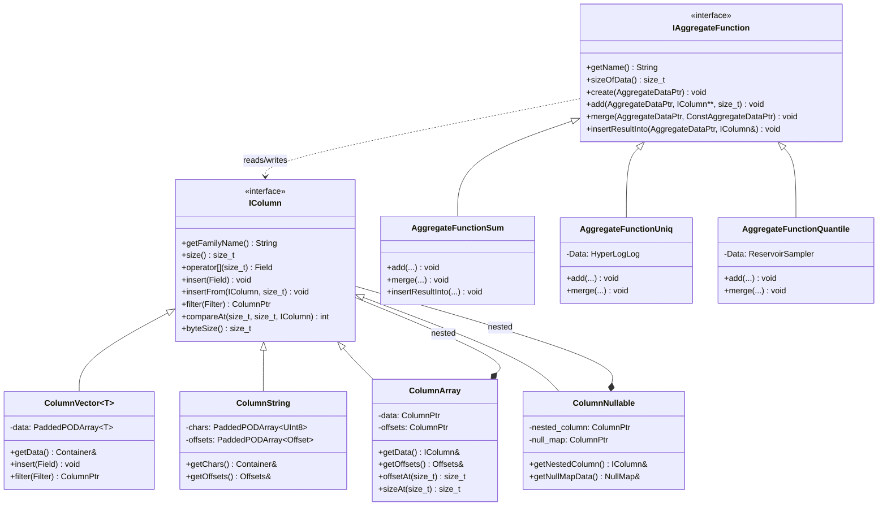

# ClickHouse-09-Columns与AggregateFunctions模块

## 模块概览

### 职责

**Columns 模块**负责：
- 定义列的内存存储格式
- 实现各种列类型（Vector、String、Array、Nullable 等）
- 提供列操作接口（插入、删除、过滤、排序）
- 支持 COW（Copy-On-Write）语义
- 优化内存使用和访问性能

**AggregateFunctions 模块**负责：
- 定义聚合函数接口
- 实现 100+ 个聚合函数（sum、avg、count、uniq 等）
- 管理聚合状态的创建、更新、合并
- 支持分布式聚合
- 支持组合器（If、Array、State 等）

### 输入/输出

**Columns**
- **输入**：原始数据（标量值、字符串、数组等）
- **输出**：内存中的列结构

**AggregateFunctions**
- **输入**：列数据、聚合参数
- **输出**：聚合结果

## 模块架构图

```mermaid
flowchart TB
    subgraph Columns["Columns 模块"]
        subgraph ColumnCore["核心接口"]
            IColumn[IColumn<br/>列接口]
            COW[COW机制<br/>写时复制]
        end
        
        subgraph SimpleColumns["简单列类型"]
            ColumnVector[ColumnVector<br/>数值列]
            ColumnString[ColumnString<br/>字符串列]
            ColumnFixedString[ColumnFixedString<br/>定长字符串]
            ColumnDecimal[ColumnDecimal<br/>高精度数值]
        end
        
        subgraph ComplexColumns["复合列类型"]
            ColumnArray[ColumnArray<br/>数组列]
            ColumnTuple[ColumnTuple<br/>元组列]
            ColumnMap[ColumnMap<br/>Map列]
            ColumnNullable[ColumnNullable<br/>可空列]
        end
        
        subgraph SpecialColumns["特殊列类型"]
            ColumnConst[ColumnConst<br/>常量列]
            ColumnLowCardinality[ColumnLowCardinality<br/>低基数列]
            ColumnSparse[ColumnSparse<br/>稀疏列]
        end
    end
    
    subgraph AggregateFunctions["AggregateFunctions 模块"]
        subgraph AggCore["核心接口"]
            IAggregateFunction[IAggregateFunction<br/>聚合函数接口]
            AggregateFunctionFactory[AggregateFunctionFactory<br/>工厂]
        end
        
        subgraph BasicAgg["基础聚合"]
            Sum[sum/avg/min/max]
            Count[count/uniq]
            GroupArray[groupArray]
        end
        
        subgraph StatisticalAgg["统计聚合"]
            Quantile[quantile分位数]
            Stddev[stddev标准差]
            Corr[corr相关系数]
        end
        
        subgraph Combinators["组合器"]
            If[If组合器]
            Array[Array组合器]
            State[State组合器]
            Merge[Merge组合器]
        end
    end
    
    DataTypes[DataTypes] --> IColumn
    IColumn <|-- SimpleColumns
    IColumn <|-- ComplexColumns
    IColumn <|-- SpecialColumns
    
    IColumn --> Block[Block]
    
    IAggregateFunction --> BasicAgg
    IAggregateFunction --> StatisticalAgg
    IAggregateFunction --> Combinators
    
    AggregateFunctionFactory --> IAggregateFunction
    
    IColumn ..> IAggregateFunction: provides data
```

### 架构说明

#### 图意概述

Columns 模块实现了 ClickHouse 的列存储。IColumn 是所有列的基类，提供统一接口。简单列直接存储标量值，复合列组合多个子列，特殊列提供优化（常量折叠、低基数压缩、稀疏存储）。COW 机制避免不必要的数据复制。

AggregateFunctions 模块实现了所有聚合函数。IAggregateFunction 定义了聚合状态的生命周期（create、add、merge、insertResultInto）。组合器可以修改聚合函数的行为（条件聚合、数组聚合、状态保存）。

#### 关键字段与接口

**IColumn 接口**
```cpp
class IColumn : public COW<IColumn> {
public:
    // 列名称
    virtual const char * getFamilyName() const = 0;
    
    // 行数
    virtual size_t size() const = 0;
    
    // 获取值
    virtual Field operator[](size_t n) const = 0;
    virtual void get(size_t n, Field & res) const = 0;
    
    // 插入值
    virtual void insert(const Field & x) = 0;
    virtual void insertFrom(const IColumn & src, size_t n) = 0;
    virtual void insertDefault() = 0;
    
    // 批量操作
    virtual void insertRangeFrom(const IColumn & src, size_t start, size_t length) = 0;
    virtual void popBack(size_t n) = 0;
    
    // 过滤
    virtual Ptr filter(const Filter & filt, ssize_t result_size_hint) const = 0;
    
    // 排序
    virtual void getPermutation(
        bool reverse,
        size_t limit,
        int nan_direction_hint,
        Permutation & res) const = 0;
    
    // 比较
    virtual int compareAt(size_t n, size_t m, const IColumn & rhs, int nan_direction_hint) const = 0;
    
    // 聚合
    virtual void updateHashWithValue(size_t n, SipHash & hash) const = 0;
    
    // 内存
    virtual size_t byteSize() const = 0;
    virtual size_t allocatedBytes() const = 0;
    
    // 克隆
    virtual MutablePtr clone() const = 0;
    virtual MutablePtr cloneResized(size_t size) const;
    
    // 预留空间
    virtual void reserve(size_t n) {}
};
```

**ColumnVector 类（简化版）**
```cpp
template <typename T>
class ColumnVector : public IColumn {
public:
    using Self = ColumnVector;
    using value_type = T;
    using Container = PaddedPODArray<value_type>;
    
    const char * getFamilyName() const override { return "Vector"; }
    
    size_t size() const override { return data.size(); }
    
    Field operator[](size_t n) const override { return data[n]; }
    
    void insert(const Field & x) override {
        data.push_back(x.get<T>());
    }
    
    void insertFrom(const IColumn & src, size_t n) override {
        const auto & src_vec = assert_cast<const ColumnVector &>(src);
        data.push_back(src_vec.data[n]);
    }
    
    void insertDefault() override {
        data.push_back(T());
    }
    
    Ptr filter(const Filter & filt, ssize_t result_size_hint) const override {
        auto res = Self::create();
        Container & res_data = res->getData();
        
        if (result_size_hint)
            res_data.reserve(result_size_hint);
        
        const UInt8 * filt_pos = filt.data();
        const UInt8 * filt_end = filt_pos + filt.size();
        const T * data_pos = data.data();
        
        while (filt_pos < filt_end) {
            if (*filt_pos)
                res_data.push_back(*data_pos);
            ++filt_pos;
            ++data_pos;
        }
        
        return res;
    }
    
    void getPermutation(bool reverse, size_t limit, int nan_direction_hint, Permutation & res) const override {
        size_t s = data.size();
        res.resize(s);
        
        for (size_t i = 0; i < s; ++i)
            res[i] = i;
        
        if (reverse)
            std::sort(res.begin(), res.end(), [this](size_t a, size_t b) { return data[a] > data[b]; });
        else
            std::sort(res.begin(), res.end(), [this](size_t a, size_t b) { return data[a] < data[b]; });
        
        if (limit && limit < s)
            res.resize(limit);
    }
    
    int compareAt(size_t n, size_t m, const IColumn & rhs, int nan_direction_hint) const override {
        const auto & rhs_vec = assert_cast<const ColumnVector &>(rhs);
        return data[n] < rhs_vec.data[m] ? -1 : (data[n] > rhs_vec.data[m] ? 1 : 0);
    }
    
    Container & getData() { return data; }
    const Container & getData() const { return data; }
    
private:
    Container data;
};
```

**IAggregateFunction 接口**
```cpp
class IAggregateFunction {
public:
    IAggregateFunction(const DataTypes & argument_types_, const Array & parameters_)
        : argument_types(argument_types_), parameters(parameters_) {}
    
    virtual ~IAggregateFunction() = default;
    
    // 函数名称
    virtual String getName() const = 0;
    
    // 状态大小和对齐
    virtual size_t sizeOfData() const = 0;
    virtual size_t alignOfData() const = 0;
    
    // 创建状态
    virtual void create(AggregateDataPtr place) const = 0;
    
    // 销毁状态
    virtual void destroy(AggregateDataPtr place) const noexcept = 0;
    
    // 添加值到状态
    virtual void add(
        AggregateDataPtr place,
        const IColumn ** columns,
        size_t row_num,
        Arena * arena
    ) const = 0;
    
    // 批量添加
    virtual void addBatch(
        size_t batch_size,
        AggregateDataPtr * places,
        size_t place_offset,
        const IColumn ** columns,
        Arena * arena,
        ssize_t if_argument_pos = -1
    ) const = 0;
    
    // 合并状态
    virtual void merge(
        AggregateDataPtr place,
        ConstAggregateDataPtr rhs,
        Arena * arena
    ) const = 0;
    
    // 序列化状态
    virtual void serialize(
        ConstAggregateDataPtr place,
        WriteBuffer & buf,
        std::optional<size_t> version
    ) const = 0;
    
    // 反序列化状态
    virtual void deserialize(
        AggregateDataPtr place,
        ReadBuffer & buf,
        std::optional<size_t> version,
        Arena * arena
    ) const = 0;
    
    // 插入结果
    virtual void insertResultInto(
        AggregateDataPtr place,
        IColumn & to,
        Arena * arena
    ) const = 0;
    
    // 返回类型
    virtual DataTypePtr getReturnType() const = 0;
    
protected:
    DataTypes argument_types;
    Array parameters;
};
```

**AggregateFunctionSum 示例**
```cpp
template <typename T>
struct AggregateFunctionSumData {
    T sum = 0;
    
    void add(T value) {
        sum += value;
    }
    
    void merge(const AggregateFunctionSumData & rhs) {
        sum += rhs.sum;
    }
    
    void write(WriteBuffer & buf) const {
        writeBinary(sum, buf);
    }
    
    void read(ReadBuffer & buf) {
        readBinary(sum, buf);
    }
    
    T get() const {
        return sum;
    }
};

template <typename T>
class AggregateFunctionSum : public IAggregateFunction {
public:
    using Data = AggregateFunctionSumData<T>;
    
    String getName() const override { return "sum"; }
    
    DataTypePtr getReturnType() const override {
        return std::make_shared<DataTypeNumber<T>>();
    }
    
    size_t sizeOfData() const override { return sizeof(Data); }
    size_t alignOfData() const override { return alignof(Data); }
    
    void create(AggregateDataPtr place) const override {
        new (place) Data;
    }
    
    void destroy(AggregateDataPtr place) const noexcept override {
        reinterpret_cast<Data *>(place)->~Data();
    }
    
    void add(
        AggregateDataPtr place,
        const IColumn ** columns,
        size_t row_num,
        Arena * arena
    ) const override {
        const auto & column = assert_cast<const ColumnVector<T> &>(*columns[0]);
        reinterpret_cast<Data *>(place)->add(column.getData()[row_num]);
    }
    
    void merge(
        AggregateDataPtr place,
        ConstAggregateDataPtr rhs,
        Arena * arena
    ) const override {
        reinterpret_cast<Data *>(place)->merge(*reinterpret_cast<const Data *>(rhs));
    }
    
    void serialize(
        ConstAggregateDataPtr place,
        WriteBuffer & buf,
        std::optional<size_t> version
    ) const override {
        reinterpret_cast<const Data *>(place)->write(buf);
    }
    
    void deserialize(
        AggregateDataPtr place,
        ReadBuffer & buf,
        std::optional<size_t> version,
        Arena * arena
    ) const override {
        reinterpret_cast<Data *>(place)->read(buf);
    }
    
    void insertResultInto(
        AggregateDataPtr place,
        IColumn & to,
        Arena * arena
    ) const override {
        auto & column = assert_cast<ColumnVector<T> &>(to);
        column.getData().push_back(reinterpret_cast<Data *>(place)->get());
    }
};
```

#### 边界条件

**Columns**
- 最大行数：2^31 (约 21 亿)
- 最大内存：取决于可用内存
- 字符串长度：< 2^31
- 数组大小：< 2^31

**AggregateFunctions**
- 最大聚合键数量：取决于内存
- 状态大小：几字节到几 MB
- 并发聚合：支持多线程

#### 异常与回退

**Columns 异常**
- BAD_CAST：列类型转换失败
- SIZES_OF_COLUMNS_DOESNT_MATCH：列大小不匹配
- LOGICAL_ERROR：内部逻辑错误

**AggregateFunctions 异常**
- NUMBER_OF_ARGUMENTS_DOESNT_MATCH：参数数量错误
- ILLEGAL_TYPE_OF_ARGUMENT：参数类型错误
- BAD_ARGUMENTS：参数值非法

## 核心 API 详解

### API 1: ColumnVector::filter - 列过滤

#### 基本信息

- **名称**: `filter()`
- **用途**: 根据过滤器保留部分行
- **性能**: O(n)，SIMD 优化

#### 实现

```cpp
template <typename T>
ColumnPtr ColumnVector<T>::filter(const Filter & filt, ssize_t result_size_hint) const {
    size_t size = data.size();
    
    // 1) 创建结果列
    auto res = Self::create();
    Container & res_data = res->getData();
    
    // 2) 预留空间
    if (result_size_hint > 0)
        res_data.reserve(result_size_hint);
    else if (result_size_hint < 0)
        res_data.reserve(size);
    
    // 3) 过滤数据（SIMD 优化版本）
    const UInt8 * filt_pos = filt.data();
    const T * data_pos = data.data();
    const T * data_end = data_pos + size;
    
    // 向量化处理（16 个元素一组）
    while (data_pos + 16 <= data_end) {
        UInt16 mask = 0;
        
        // 加载过滤位
        for (size_t i = 0; i < 16; ++i)
            mask |= (filt_pos[i] ? 1 : 0) << i;
        
        // 根据 mask 复制数据
        for (size_t i = 0; i < 16; ++i) {
            if (mask & (1 << i))
                res_data.push_back(data_pos[i]);
        }
        
        filt_pos += 16;
        data_pos += 16;
    }
    
    // 处理剩余元素
    while (data_pos < data_end) {
        if (*filt_pos)
            res_data.push_back(*data_pos);
        ++filt_pos;
        ++data_pos;
    }
    
    return res;
}
```

### API 2: AggregateFunctionUniq - 去重计数

#### 基本信息

- **名称**: `uniq`
- **用途**: 计算唯一值数量
- **算法**: HyperLogLog（近似）或 HashSet（精确）

#### 实现（HyperLogLog 版本）

```cpp
struct AggregateFunctionUniqHLL12Data {
    using Set = HyperLogLogWithSmallSetOptimization<UInt64, 16, 12>;
    Set set;
    
    void add(UInt64 value) {
        set.insert(value);
    }
    
    void merge(const AggregateFunctionUniqHLL12Data & rhs) {
        set.merge(rhs.set);
    }
    
    void write(WriteBuffer & buf) const {
        set.write(buf);
    }
    
    void read(ReadBuffer & buf) {
        set.read(buf);
    }
    
    UInt64 get() const {
        return set.size();
    }
};

class AggregateFunctionUniq : public IAggregateFunction {
public:
    using Data = AggregateFunctionUniqHLL12Data;
    
    String getName() const override { return "uniq"; }
    
    void add(
        AggregateDataPtr place,
        const IColumn ** columns,
        size_t row_num,
        Arena * arena
    ) const override {
        // 1) 获取数据
        Data & data = *reinterpret_cast<Data *>(place);
        
        // 2) 计算哈希
        const IColumn & column = *columns[0];
        UInt64 hash = column.get64(row_num);
        
        // 3) 添加到 HyperLogLog
        data.add(hash);
    }
    
    void merge(
        AggregateDataPtr place,
        ConstAggregateDataPtr rhs,
        Arena * arena
    ) const override {
        reinterpret_cast<Data *>(place)->merge(*reinterpret_cast<const Data *>(rhs));
    }
    
    void insertResultInto(
        AggregateDataPtr place,
        IColumn & to,
        Arena * arena
    ) const override {
        UInt64 result = reinterpret_cast<Data *>(place)->get();
        assert_cast<ColumnUInt64 &>(to).getData().push_back(result);
    }
};
```

### API 3: ColumnArray - 数组列

#### 基本信息

- **名称**: `ColumnArray`
- **结构**: 偏移量数组 + 嵌套列
- **内存**: 连续存储

#### 实现

```cpp
class ColumnArray : public IColumn {
public:
    ColumnArray(MutableColumnPtr && nested_column, MutableColumnPtr && offsets_column_)
        : data(std::move(nested_column))
        , offsets(std::move(offsets_column_))
    {}
    
    const char * getFamilyName() const override { return "Array"; }
    
    size_t size() const override { return getOffsets().size(); }
    
    Field operator[](size_t n) const override {
        size_t offset = offsetAt(n);
        size_t size = sizeAt(n);
        
        Array res(size);
        for (size_t i = 0; i < size; ++i)
            res[i] = (*data)[offset + i];
        
        return res;
    }
    
    void insert(const Field & x) override {
        const Array & array = x.get<Array>();
        size_t size = array.size();
        
        for (size_t i = 0; i < size; ++i)
            data->insert(array[i]);
        
        getOffsets().push_back(data->size());
    }
    
    void insertFrom(const IColumn & src_, size_t n) override {
        const ColumnArray & src = assert_cast<const ColumnArray &>(src_);
        size_t size = src.sizeAt(n);
        size_t offset = src.offsetAt(n);
        
        data->insertRangeFrom(*src.data, offset, size);
        getOffsets().push_back(data->size());
    }
    
    // 获取数组的偏移量
    size_t offsetAt(size_t i) const {
        return i == 0 ? 0 : getOffsets()[i - 1];
    }
    
    // 获取数组的大小
    size_t sizeAt(size_t i) const {
        return getOffsets()[i] - offsetAt(i);
    }
    
    IColumn & getData() { return *data; }
    const IColumn & getData() const { return *data; }
    
    Offsets & getOffsets() {
        return assert_cast<ColumnVector<Offset> &>(*offsets).getData();
    }
    
    const Offsets & getOffsets() const {
        return assert_cast<const ColumnVector<Offset> &>(*offsets).getData();
    }
    
private:
    WrappedPtr data;        // 嵌套列（所有数组元素）
    WrappedPtr offsets;     // 偏移量列（ColumnVector<UInt64>）
};
```

## 数据结构 UML 图



## 实战经验

### 创建和操作列

```cpp
// 创建数值列
auto col = ColumnUInt64::create();
col->insert(Field(UInt64(1)));
col->insert(Field(UInt64(2)));
col->insert(Field(UInt64(3)));

// 创建字符串列
auto str_col = ColumnString::create();
str_col->insert("hello");
str_col->insert("world");

// 创建数组列
auto nested = ColumnUInt32::create();
nested->insert(Field(UInt32(1)));
nested->insert(Field(UInt32(2)));
nested->insert(Field(UInt32(3)));

auto offsets = ColumnUInt64::create();
offsets->insert(Field(UInt64(2)));  // [1, 2]
offsets->insert(Field(UInt64(3)));  // [3]

auto array_col = ColumnArray::create(std::move(nested), std::move(offsets));
```

### 列过滤

```cpp
// 创建过滤器
IColumn::Filter filter(col->size());
for (size_t i = 0; i < filter.size(); ++i)
    filter[i] = (col->getUInt(i) % 2 == 0);  // 保留偶数

// 应用过滤器
auto filtered_col = col->filter(filter, -1);
```

### 使用聚合函数

```cpp
// 创建聚合函数
AggregateFunctionFactory & factory = AggregateFunctionFactory::instance();
DataTypes argument_types = {std::make_shared<DataTypeUInt64>()};
Array parameters;

auto agg_func = factory.get("sum", argument_types, parameters);

// 创建聚合状态
AggregateDataPtr place = arena.alloc(agg_func->sizeOfData());
agg_func->create(place);

// 添加数据
const IColumn * columns[] = {col.get()};
for (size_t i = 0; i < col->size(); ++i)
    agg_func->add(place, columns, i, &arena);

// 获取结果
auto result_col = ColumnUInt64::create();
agg_func->insertResultInto(place, *result_col, &arena);

// 销毁状态
agg_func->destroy(place);
```

### 自定义聚合函数

```cpp
// 实现自定义聚合函数：计算平方和
struct AggregateFunctionSumSquaresData {
    Float64 sum = 0;
    
    void add(Float64 value) {
        sum += value * value;
    }
    
    void merge(const AggregateFunctionSumSquaresData & rhs) {
        sum += rhs.sum;
    }
    
    Float64 get() const {
        return sum;
    }
};

class AggregateFunctionSumSquares : public IAggregateFunction {
    // 实现所有必要的方法...
};

// 注册
void registerAggregateFunctionSumSquares(AggregateFunctionFactory & factory) {
    factory.registerFunction("sumSquares", createAggregateFunctionSumSquares);
}
```

## 总结

Columns 和 AggregateFunctions 模块是 ClickHouse 数据处理的基石：

**Columns 模块**提供：
1. **统一的列接口**：IColumn 抽象所有列类型
2. **高效的内存布局**：连续存储，SIMD 优化
3. **丰富的列类型**：数值、字符串、数组、元组、Map
4. **COW 语义**：避免不必要的复制
5. **特殊优化**：常量折叠、低基数压缩、稀疏存储

**AggregateFunctions 模块**提供：
1. **100+ 聚合函数**：覆盖各种统计需求
2. **状态管理**：创建、更新、合并、序列化
3. **分布式支持**：状态可以跨节点合并
4. **组合器**：灵活修改聚合行为
5. **高性能**：批量处理、内存对齐

两个模块紧密协作，为 ClickHouse 提供高效的数据处理能力。

