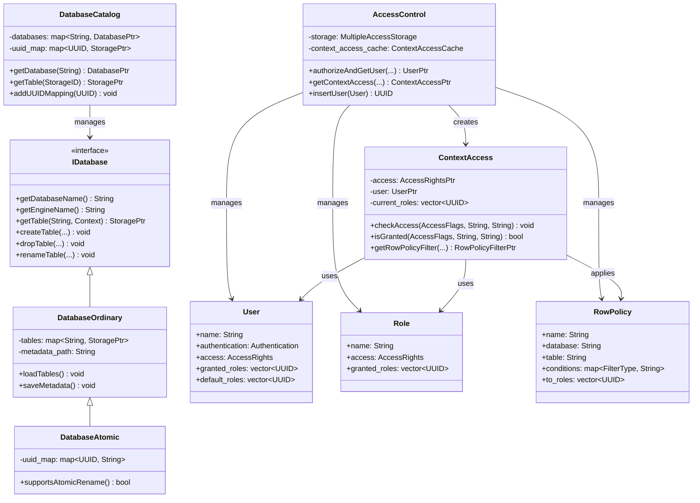

# ClickHouse-10-Databases与Access模块

## 模块概览

### 职责

**Databases 模块**负责：
- 管理数据库的创建、删除、查询
- 提供数据库引擎（Ordinary、Atomic、Replicated等）
- 管理表的元数据和生命周期
- 实现 DatabaseCatalog（全局数据库目录）
- 支持跨数据库操作

**Access 模块**负责：
- 用户认证和授权
- 权限管理（GRANT/REVOKE）
- 行级安全策略（Row Policies）
- 配额管理（Quotas）
- 角色管理（Roles）

## 模块架构图

```mermaid
flowchart TB
    subgraph Databases["Databases 模块"]
        subgraph DBCore["核心组件"]
            IDatabase[IDatabase<br/>数据库接口]
            DatabaseCatalog[DatabaseCatalog<br/>全局目录]
            DatabaseFactory[DatabaseFactory<br/>工厂]
        end
        
        subgraph DBEngines["数据库引擎"]
            DatabaseOrdinary[Ordinary<br/>普通数据库]
            DatabaseAtomic[Atomic<br/>原子操作]
            DatabaseReplicated[Replicated<br/>复制数据库]
            DatabaseMemory[Memory<br/>内存数据库]
            DatabaseLazy[Lazy<br/>懒加载]
        end
        
        subgraph DBOperations["数据库操作"]
            CreateDB[创建数据库]
            DropDB[删除数据库]
            AlterDB[修改数据库]
            ListTables[列出表]
        end
    end
    
    subgraph Access["Access 模块"]
        subgraph AccessCore["核心组件"]
            AccessControl[AccessControl<br/>访问控制中心]
            ContextAccess[ContextAccess<br/>上下文访问]
            AccessRights[AccessRights<br/>访问权限]
        end
        
        subgraph AccessEntities["访问实体"]
            User[User<br/>用户]
            Role[Role<br/>角色]
            RowPolicy[RowPolicy<br/>行策略]
            Quota[Quota<br/>配额]
            SettingsProfile[SettingsProfile<br/>设置配置]
        end
        
        subgraph AccessOperations["访问操作"]
            Authenticate[认证]
            Authorize[授权]
            CheckAccess[检查权限]
            ApplyPolicy[应用策略]
        end
    end
    
    Context[Context] --> DatabaseCatalog
    DatabaseCatalog --> IDatabase
    IDatabase <|-- DBEngines
    DatabaseFactory --> DBEngines
    
    Context --> AccessControl
    AccessControl --> ContextAccess
    ContextAccess --> AccessRights
    AccessControl --> AccessEntities
    
    IDatabase ..> AccessControl: uses
```

### 架构说明

#### 图意概述

Databases 模块提供了数据库的抽象和实现。DatabaseCatalog 是全局单例，管理所有数据库和表的元数据。每个数据库引擎实现不同的特性（如原子性、复制、懒加载）。

Access 模块实现了完整的访问控制系统。AccessControl 是中心组件，管理用户、角色、策略、配额等实体。ContextAccess 为每个查询提供权限检查能力。

#### 关键字段与接口

**IDatabase 接口**
```cpp
class IDatabase : public std::enable_shared_from_this<IDatabase> {
public:
    virtual ~IDatabase() = default;
    
    // 数据库名称
    virtual String getDatabaseName() const = 0;
    
    // 数据库引擎
    virtual String getEngineName() const = 0;
    
    // 表操作
    virtual bool isTableExist(const String & name, ContextPtr context) const = 0;
    virtual StoragePtr tryGetTable(const String & name, ContextPtr context) const = 0;
    virtual StoragePtr getTable(const String & name, ContextPtr context) const;
    
    // 创建表
    virtual void createTable(
        ContextPtr context,
        const String & name,
        const StoragePtr & table,
        const ASTPtr & query) = 0;
    
    // 删除表
    virtual void dropTable(
        ContextPtr context,
        const String & name,
        bool sync) = 0;
    
    // 重命名表
    virtual void renameTable(
        ContextPtr context,
        const String & name,
        IDatabase & to_database,
        const String & to_name,
        bool exchange,
        bool dictionary) = 0;
    
    // 列出所有表
    virtual ASTPtr getCreateDatabaseQuery() const = 0;
    
    // 迭代所有表
    using FilterByNameFunction = std::function<bool(const String &)>;
    virtual void iterateTables(
        ContextPtr context,
        const FilterByNameFunction & filter,
        const std::function<void(const StoragePtr &)> & callback) const = 0;
    
    // 数据库属性
    virtual bool supportsAtomicRename() const { return false; }
    virtual bool shouldBeEmptyOnDetach() const { return true; }
    virtual bool canContainMergeTreeTables() const { return true; }
    virtual bool canContainDistributedTables() const { return true; }
};
```

**DatabaseCatalog 类**
```cpp
class DatabaseCatalog : public Singleton<DatabaseCatalog> {
public:
    // 数据库操作
    DatabasePtr getDatabase(const String & database_name) const;
    DatabasePtr tryGetDatabase(const String & database_name) const;
    
    void attachDatabase(const String & database_name, const DatabasePtr & database);
    DatabasePtr detachDatabase(
        ContextPtr context,
        const String & database_name,
        bool drop = false,
        bool check_empty = true);
    
    // 表操作
    StoragePtr getTable(const StorageID & table_id, ContextPtr context) const;
    StoragePtr tryGetTable(const StorageID & table_id, ContextPtr context) const;
    
    // UUID 映射（Atomic 数据库）
    void addUUIDMapping(const UUID & uuid);
    void removeUUIDMapping(const UUID & uuid);
    StoragePtr tryGetByUUID(const UUID & uuid) const;
    
    // 临时表
    void addTemporaryTable(ContextPtr context, const String & table_name, const StoragePtr & table);
    void removeTemporaryTable(ContextPtr context, const String & table_name);
    
    // 所有数据库
    Databases getDatabases() const;
    
private:
    mutable std::mutex databases_mutex;
    Databases databases;  // database_name -> DatabasePtr
    
    mutable std::mutex uuid_map_mutex;
    std::unordered_map<UUID, StoragePtr> uuid_map;
    
    std::unordered_map<String, TemporaryTablesMapping> temporary_tables;
};
```

**AccessControl 类**
```cpp
class AccessControl : public MultipleAccessStorage {
public:
    AccessControl();
    
    // 认证
    std::shared_ptr<const User> authorizeAndGetUser(
        const String & user_name,
        const String & password,
        const Poco::Net::IPAddress & address) const;
    
    // 创建 ContextAccess
    std::shared_ptr<const ContextAccess> getContextAccess(
        const UUID & user_id,
        const std::vector<UUID> & current_roles,
        bool use_default_roles,
        const Settings & settings,
        const String & current_database,
        const ClientInfo & client_info) const;
    
    // 用户管理
    UUID insertUser(const User & user);
    void removeUser(const UUID & id);
    UserPtr readUser(const UUID & id) const;
    std::vector<UUID> findUsers(const String & name) const;
    
    // 角色管理
    UUID insertRole(const Role & role);
    void removeRole(const UUID & id);
    RolePtr readRole(const UUID & id) const;
    
    // 行策略管理
    UUID insertRowPolicy(const RowPolicy & policy);
    void removeRowPolicy(const UUID & id);
    std::vector<UUID> findRowPolicies(const String & database, const String & table) const;
    
    // 配额管理
    UUID insertQuota(const Quota & quota);
    void removeQuota(const UUID & id);
    
private:
    std::unique_ptr<MultipleAccessStorage> storage;
    std::unique_ptr<ContextAccessCache> context_access_cache;
    std::unique_ptr<RoleCache> role_cache;
    std::unique_ptr<RowPolicyCache> row_policy_cache;
    std::unique_ptr<QuotaCache> quota_cache;
};
```

**ContextAccess 类**
```cpp
class ContextAccess {
public:
    // 检查权限
    bool isGranted(const AccessFlags & flags) const;
    bool isGranted(const AccessFlags & flags, const std::string_view & database) const;
    bool isGranted(const AccessFlags & flags, const std::string_view & database, const std::string_view & table) const;
    bool isGranted(const AccessFlags & flags, const std::string_view & database, const std::string_view & table, const std::string_view & column) const;
    
    // 抛出异常（如果无权限）
    void checkAccess(const AccessFlags & flags) const;
    void checkAccess(const AccessFlags & flags, const std::string_view & database) const;
    void checkAccess(const AccessFlags & flags, const std::string_view & database, const std::string_view & table) const;
    
    // 获取权限
    AccessRightsPtr getAccessRights() const;
    
    // 获取行策略过滤器
    RowPolicyFilterPtr getRowPolicyFilter(
        const String & database,
        const String & table,
        RowPolicyFilterType filter_type) const;
    
    // 获取配额
    std::shared_ptr<const EnabledQuota> getQuota() const;
    
    // 用户信息
    UserPtr getUser() const;
    String getUserName() const;
    std::vector<UUID> getCurrentRoles() const;
    
private:
    std::shared_ptr<const AccessRights> access;
    std::shared_ptr<const User> user;
    std::vector<UUID> current_roles;
    RowPolicyFilterPtr row_policy_filter;
    std::shared_ptr<const EnabledQuota> quota;
};
```

#### 边界条件

**Databases**
- 最大数据库数量：无硬性限制
- 最大表数量：数万到数十万
- 数据库名称：字母、数字、下划线
- 并发操作：支持多线程

**Access**
- 最大用户数量：数千到数万
- 最大角色数量：数百到数千
- 权限检查：< 1ms
- 行策略数量：每表数十个

#### 异常与回退

**Databases 异常**
- UNKNOWN_DATABASE：数据库不存在
- DATABASE_ALREADY_EXISTS：数据库已存在
- UNKNOWN_TABLE：表不存在
- TABLE_ALREADY_EXISTS：表已存在

**Access 异常**
- AUTHENTICATION_FAILED：认证失败
- ACCESS_DENIED：访问被拒绝
- NOT_ENOUGH_PRIVILEGES：权限不足
- UNKNOWN_USER：用户不存在

## 核心 API 详解

### API 1: DatabaseCatalog::getTable - 获取表

#### 基本信息

- **名称**: `getTable()`
- **用途**: 通过 StorageID 获取表
- **线程安全**: 是

#### 实现

```cpp
StoragePtr DatabaseCatalog::getTable(const StorageID & table_id, ContextPtr context) const {
    // 1) 尝试从 UUID 映射获取（Atomic 数据库）
    if (table_id.hasUUID()) {
        auto storage = tryGetByUUID(table_id.uuid);
        if (storage)
            return storage;
    }
    
    // 2) 从数据库获取
    DatabasePtr database = getDatabase(table_id.database_name);
    return database->getTable(table_id.table_name, context);
}

StoragePtr DatabaseCatalog::tryGetByUUID(const UUID & uuid) const {
    std::lock_guard lock(uuid_map_mutex);
    
    auto it = uuid_map.find(uuid);
    if (it == uuid_map.end())
        return nullptr;
    
    return it->second;
}
```

### API 2: DatabaseAtomic - 原子数据库

#### 基本信息

- **名称**: `DatabaseAtomic`
- **特性**: 支持原子重命名、UUID 映射
- **存储**: 磁盘持久化

#### 实现（简化版）

```cpp
class DatabaseAtomic : public DatabaseOrdinary {
public:
    String getEngineName() const override { return "Atomic"; }
    
    void createTable(
        ContextPtr context,
        const String & name,
        const StoragePtr & table,
        const ASTPtr & query) override
    {
        // 1) 生成 UUID
        UUID uuid = UUIDHelpers::generateV4();
        
        // 2) 创建表
        DatabaseOrdinary::createTable(context, name, table, query);
        
        // 3) 添加 UUID 映射
        DatabaseCatalog::instance().addUUIDMapping(uuid);
        
        // 4) 保存元数据
        String metadata_file_path = getMetadataPath() + escapeForFileName(name) + ".sql";
        WriteBufferFromFile out(metadata_file_path);
        writeString(serializeAST(*query), out);
    }
    
    void renameTable(
        ContextPtr context,
        const String & name,
        IDatabase & to_database,
        const String & to_name,
        bool exchange,
        bool dictionary) override
    {
        // 原子重命名：使用硬链接
        String from_path = getTableDataPath(name);
        String to_path = to_database.getTableDataPath(to_name);
        
        if (exchange) {
            // 交换两个表
            String temp_path = to_path + ".tmp";
            Poco::File(to_path).renameTo(temp_path);
            Poco::File(from_path).renameTo(to_path);
            Poco::File(temp_path).renameTo(from_path);
        } else {
            // 简单重命名
            Poco::File(from_path).renameTo(to_path);
        }
        
        // 更新元数据
        updateMetadata(name, to_name);
    }
    
    bool supportsAtomicRename() const override { return true; }
};
```

### API 3: ContextAccess::checkAccess - 权限检查

#### 基本信息

- **名称**: `checkAccess()`
- **用途**: 检查是否有权限，无权限则抛出异常
- **性能**: < 1ms

#### 实现

```cpp
void ContextAccess::checkAccess(
    const AccessFlags & flags,
    const std::string_view & database,
    const std::string_view & table) const
{
    // 1) 检查是否有权限
    if (isGranted(flags, database, table))
        return;
    
    // 2) 构建错误信息
    String required_access = flags.toString();
    String object = database.empty() ? "" : (String(database) + "." + String(table));
    
    // 3) 抛出异常
    throw Exception(
        ErrorCodes::ACCESS_DENIED,
        "{}: Not enough privileges. To execute this query it's necessary to have grant {} ON {}",
        user->getName(),
        required_access,
        object
    );
}

bool ContextAccess::isGranted(
    const AccessFlags & flags,
    const std::string_view & database,
    const std::string_view & table) const
{
    // 1) 检查全局权限
    if (access->isGranted(flags))
        return true;
    
    // 2) 检查数据库级权限
    if (!database.empty() && access->isGranted(flags, database))
        return true;
    
    // 3) 检查表级权限
    if (!table.empty() && access->isGranted(flags, database, table))
        return true;
    
    return false;
}
```

### API 4: RowPolicy - 行级安全

#### 基本信息

- **名称**: `RowPolicy`
- **用途**: 限制用户可以看到的行
- **实现**: WHERE 子句过滤

#### 使用示例

```cpp
// 创建行策略
CREATE ROW POLICY policy1 ON database.table
FOR SELECT
USING user_id = currentUser()
TO user1, user2;

// 应用行策略
RowPolicyFilterPtr filter = context_access->getRowPolicyFilter(
    "database",
    "table",
    RowPolicyFilterType::SELECT_FILTER
);

if (filter && filter->expression) {
    // 添加过滤条件到 WHERE 子句
    ASTPtr where_expression = filter->expression;
    
    // 在查询中应用
    if (query.where_expression)
        query.where_expression = makeASTFunction("and", query.where_expression, where_expression);
    else
        query.where_expression = where_expression;
}
```

## 数据结构 UML 图



## 实战经验

### 创建和使用数据库

```cpp
// 创建数据库
CREATE DATABASE my_database ENGINE = Atomic;

// 使用数据库
USE my_database;

// 创建表
CREATE TABLE users (
    id UInt64,
    name String,
    age UInt8
) ENGINE = MergeTree()
ORDER BY id;
```

### 权限管理

```cpp
// 创建用户
CREATE USER alice IDENTIFIED WITH sha256_password BY 'password123';

// 授予权限
GRANT SELECT ON database.* TO alice;
GRANT INSERT, DELETE ON database.table TO alice;

// 创建角色
CREATE ROLE analyst;
GRANT SELECT ON database.* TO analyst;

// 分配角色
GRANT analyst TO alice;

// 设置默认角色
SET DEFAULT ROLE analyst TO alice;
```

### 行级安全策略

```cpp
// 创建行策略：用户只能看到自己的数据
CREATE ROW POLICY user_filter ON database.users
FOR SELECT
USING user_id = currentUser()
TO alice, bob;

// 创建行策略：管理员可以看到所有数据
CREATE ROW POLICY admin_access ON database.users
FOR SELECT
USING 1
TO admin_role;
```

### 配额管理

```cpp
// 创建配额：限制查询次数和执行时间
CREATE QUOTA user_quota
FOR INTERVAL 1 hour MAX queries = 100, MAX execution_time = 3600
TO alice;

// 创建配额：限制结果行数和字节数
CREATE QUOTA data_quota
FOR INTERVAL 1 day MAX result_rows = 1000000, MAX result_bytes = 10000000000
TO analyst_role;
```

## 总结

Databases 和 Access 模块是 ClickHouse 的元数据管理和安全基础：

**Databases 模块**提供：
1. **数据库抽象**：IDatabase 接口
2. **多种引擎**：Ordinary、Atomic、Replicated、Memory
3. **全局目录**：DatabaseCatalog 统一管理
4. **原子操作**：支持原子重命名（Atomic）
5. **UUID 映射**：快速定位表

**Access 模块**提供：
1. **认证授权**：用户认证和权限检查
2. **角色管理**：基于角色的访问控制（RBAC）
3. **行级安全**：Row Policies 限制可见行
4. **配额管理**：限制资源使用
5. **细粒度权限**：数据库、表、列级别

两个模块协作，为 ClickHouse 提供完善的元数据管理和安全保障。

