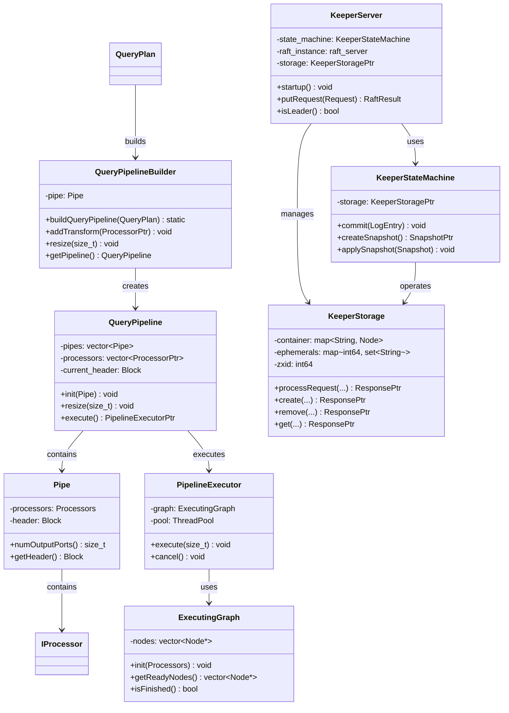

# ClickHouse-11-QueryPipeline与Coordination模块

## 模块概览

### 职责

**QueryPipeline 模块**负责：
- 构建查询执行管道
- 连接 Processors 形成执行图
- 管理数据流和端口连接
- 支持并行执行和流水线优化
- 处理管道的启动、执行、完成

**Coordination 模块**负责：
- 提供分布式协调服务（ClickHouse Keeper）
- 实现类 ZooKeeper 协议
- 管理分布式锁和元数据
- 支持 Raft 共识算法
- 提供高可用性保障

## 模块架构图

```mermaid
flowchart TB
    subgraph QueryPipeline["QueryPipeline 模块"]
        subgraph PipelineCore["核心组件"]
            QueryPipeline[QueryPipeline<br/>查询管道]
            QueryPipelineBuilder[QueryPipelineBuilder<br/>管道构建器]
            Pipe[Pipe<br/>管道片段]
            Chain[Chain<br/>处理器链]
        end
        
        subgraph PipelineExecution["执行组件"]
            PipelineExecutor[PipelineExecutor<br/>执行器]
            ExecutingGraph[ExecutingGraph<br/>执行图]
            ExecutorTasks[ExecutorTasks<br/>任务队列]
        end
        
        subgraph PipelineOptimization["优化组件"]
            Resize[Resize<br/>并行度调整]
            Transform[Transform<br/>转换优化]
            Merge[Merge<br/>合并优化]
        end
    end
    
    subgraph Coordination["Coordination 模块"]
        subgraph KeeperCore["Keeper 核心"]
            KeeperServer[KeeperServer<br/>Keeper 服务器]
            KeeperStorage[KeeperStorage<br/>存储引擎]
            KeeperStateMachine[KeeperStateMachine<br/>状态机]
        end
        
        subgraph RaftConsensus["Raft 共识"]
            RaftInstance[RaftInstance<br/>Raft 实例]
            LogStore[LogStore<br/>日志存储]
            SnapshotManager[SnapshotManager<br/>快照管理]
        end
        
        subgraph KeeperProtocol["Keeper 协议"]
            ZooKeeperProtocol[ZooKeeper 协议<br/>兼容层]
            KeeperConnection[KeeperConnection<br/>连接管理]
            KeeperSession[KeeperSession<br/>会话管理]
        end
    end
    
    QueryPlan[QueryPlan] --> QueryPipelineBuilder
    QueryPipelineBuilder --> Pipe
    Pipe --> Chain
    Chain --> Processors[IProcessor]
    
    QueryPipelineBuilder --> QueryPipeline
    QueryPipeline --> PipelineExecutor
    PipelineExecutor --> ExecutingGraph
    ExecutingGraph --> ExecutorTasks
    
    KeeperServer --> KeeperStorage
    KeeperServer --> RaftInstance
    RaftInstance --> LogStore
    RaftInstance --> SnapshotManager
    
    ZooKeeperProtocol --> KeeperConnection
    KeeperConnection --> KeeperSession
    KeeperSession --> KeeperStorage
```

### 架构说明

#### 图意概述

QueryPipeline 模块负责将 QueryPlan 转换为可执行的 Processor 管道。QueryPipelineBuilder 是核心构建器，它创建 Pipe（管道片段）和 Chain（处理器链），最终形成完整的 QueryPipeline。PipelineExecutor 负责实际执行，构建 ExecutingGraph 并管理任务调度。

Coordination 模块提供分布式协调服务。KeeperServer 是主服务器，使用 Raft 算法实现强一致性。KeeperStorage 存储所有协调数据。ZooKeeperProtocol 提供与 ZooKeeper 兼容的接口。

#### 关键字段与接口

**QueryPipeline 类**
```cpp
class QueryPipeline {
public:
    // 构造
    QueryPipeline() = default;
    
    // 设置输入源
    void init(Pipe pipe);
    
    // 添加处理步骤
    void addSimpleTransform(const ProcessorGetter & getter);
    void addTransform(ProcessorPtr transform);
    
    // 调整并行度
    void resize(size_t num_streams);
    
    // 合并流
    void narrow(size_t size);
    
    // 获取信息
    size_t getNumStreams() const { return streams.size(); }
    const Block & getHeader() const { return current_header; }
    
    // 执行
    PipelineExecutorPtr execute();
    
    // 完成构建
    void finalize();
    
private:
    Pipes pipes;                    // 管道片段
    Block current_header;           // 当前数据头
    size_t num_threads = 0;         // 线程数
    
    std::vector<ProcessorPtr> processors;  // 所有处理器
};
```

**QueryPipelineBuilder 类**
```cpp
class QueryPipelineBuilder {
public:
    QueryPipelineBuilder() = default;
    
    // 从 QueryPlan 构建
    static QueryPipelineBuilder buildQueryPipeline(
        QueryPlan & plan,
        const BuildQueryPipelineSettings & settings);
    
    // 添加步骤
    void addSimpleTransform(const Pipe::ProcessorGetter & getter);
    void addTransform(ProcessorPtr transform);
    
    // 调整管道
    void resize(size_t num_streams, bool force = false);
    void narrow(size_t size);
    
    // 完成构建
    QueryPipeline getPipeline() &&;
    
private:
    Pipe pipe;                      // 当前管道
    QueryPipeline::StreamType stream_type = QueryPipeline::StreamType::Main;
};
```

**PipelineExecutor 类**
```cpp
class PipelineExecutor {
public:
    PipelineExecutor(Processors & processors, QueryStatus * elem);
    
    // 执行管道
    void execute(size_t num_threads);
    
    // 取消执行
    void cancel();
    
    // 获取状态
    const ExecutingGraph & getExecutingGraph() const { return graph; }
    
private:
    // 初始化执行图
    void initializeExecution(size_t num_threads);
    
    // 执行单步
    void executeStep(ExecutorTasks & tasks);
    
    // 调度任务
    void schedule(ExecutorTasks & tasks);
    
    ExecutingGraph graph;           // 执行图
    ThreadPool pool;                // 线程池
    std::atomic<bool> cancelled{false};
};
```

**KeeperServer 类**
```cpp
class KeeperServer {
public:
    KeeperServer(
        const KeeperConfigurationPtr & configuration,
        const Poco::Util::AbstractConfiguration & config);
    
    // 启动服务
    void startup();
    void shutdown();
    
    // 处理请求
    RaftResult putRequest(const KeeperStorage::RequestForSession & request);
    
    // 状态查询
    bool isLeader() const;
    bool isFollower() const;
    uint64_t getLogSize() const;
    
    // 快照管理
    void createSnapshot();
    void loadSnapshot(const std::string & path);
    
private:
    std::unique_ptr<KeeperStateMachine> state_machine;
    std::unique_ptr<nuraft::raft_server> raft_instance;
    
    KeeperStoragePtr storage;
    CoordinationSettingsPtr coordination_settings;
};
```

**KeeperStorage 类**
```cpp
class KeeperStorage {
public:
    struct Node {
        std::string data;
        std::vector<std::string> children;
        int64_t czxid = 0;          // 创建事务ID
        int64_t mzxid = 0;          // 修改事务ID
        int64_t ctime = 0;          // 创建时间
        int64_t mtime = 0;          // 修改时间
        int32_t version = 0;        // 数据版本
        int32_t cversion = 0;       // 子节点版本
        int32_t aversion = 0;       // ACL 版本
        int64_t ephemeralOwner = 0; // 临时节点所有者
    };
    
    // 节点操作
    ResponsePtr processRequest(
        const RequestPtr & request,
        int64_t session_id,
        int64_t zxid);
    
    // 创建节点
    ResponsePtr create(
        const std::string & path,
        const std::string & data,
        int32_t flags,
        int64_t session_id);
    
    // 删除节点
    ResponsePtr remove(const std::string & path, int32_t version);
    
    // 获取节点
    ResponsePtr get(const std::string & path);
    
    // 设置数据
    ResponsePtr set(const std::string & path, const std::string & data, int32_t version);
    
    // 列出子节点
    ResponsePtr list(const std::string & path);
    
    // 检查存在
    ResponsePtr exists(const std::string & path);
    
private:
    std::unordered_map<std::string, Node> container;  // 节点存储
    std::unordered_map<int64_t, std::unordered_set<std::string>> ephemerals;  // 临时节点
    
    int64_t zxid = 0;               // 当前事务ID
    int64_t session_id_counter = 0; // 会话ID计数器
};
```

#### 边界条件

**QueryPipeline**
- 最大线程数：取决于系统
- 最大 Processor 数量：数千到数万
- 管道深度：通常 < 100
- 并行流数量：1-1000

**Coordination**
- 最大节点数量：数百万
- 最大数据大小：每个节点 < 1MB
- 会话超时：秒级到分钟级
- 集群大小：3-7 个节点

#### 异常与回退

**QueryPipeline 异常**
- LOGICAL_ERROR：管道构建错误
- QUERY_WAS_CANCELLED：查询被取消
- TOO_MANY_SIMULTANEOUS_QUERIES：并发查询过多

**Coordination 异常**
- ZNONODE：节点不存在
- ZNODEEXISTS：节点已存在
- ZBADVERSION：版本不匹配
- ZSESSIONEXPIRED：会话过期

## 核心 API 详解

### API 1: QueryPipelineBuilder::buildQueryPipeline - 构建管道

#### 基本信息

- **名称**: `buildQueryPipeline()`
- **用途**: 从 QueryPlan 构建执行管道
- **返回**: QueryPipelineBuilder

#### 实现流程

```cpp
QueryPipelineBuilder QueryPipelineBuilder::buildQueryPipeline(
    QueryPlan & plan,
    const BuildQueryPipelineSettings & settings)
{
    // 1) 优化 QueryPlan
    QueryPlanOptimizationSettings optimization_settings;
    QueryPlanOptimizer::optimize(plan, optimization_settings);
    
    // 2) 创建构建器
    QueryPipelineBuilder builder;
    
    // 3) 遍历 QueryPlan 的步骤
    for (auto * step : plan.getSteps()) {
        // 每个步骤转换为 Processors
        step->updatePipeline(builder, settings);
    }
    
    // 4) 完成构建
    builder.finalize();
    
    return builder;
}

// 示例：ReadFromStorageStep 的实现
void ReadFromStorageStep::updatePipeline(
    QueryPipelineBuilder & pipeline,
    const BuildQueryPipelineSettings & settings)
{
    // 1) 从存储读取
    Pipe pipe = storage->read(
        column_names,
        metadata_snapshot,
        query_info,
        context,
        processing_stage,
        max_block_size,
        num_streams
    );
    
    // 2) 初始化管道
    if (pipeline.initialized())
        throw Exception("Pipeline already initialized");
    
    pipeline.init(std::move(pipe));
}

// 示例：FilterStep 的实现
void FilterStep::updatePipeline(
    QueryPipelineBuilder & pipeline,
    const BuildQueryPipelineSettings & settings)
{
    // 添加过滤转换
    pipeline.addSimpleTransform([&](const Block & header) {
        return std::make_shared<FilterTransform>(
            header,
            filter_expression,
            filter_column_name,
            remove_filter_column
        );
    });
}
```

### API 2: PipelineExecutor::execute - 执行管道

#### 基本信息

- **名称**: `execute()`
- **用途**: 执行管道中的所有 Processors
- **线程模型**: 多线程并行执行

#### 实现（简化版）

```cpp
void PipelineExecutor::execute(size_t num_threads) {
    // 1) 初始化执行图
    initializeExecution(num_threads);
    
    // 2) 创建任务队列
    ExecutorTasks tasks(num_threads);
    
    // 3) 执行循环
    while (!graph.isFinished()) {
        // 检查是否取消
        if (cancelled.load())
            break;
        
        // 调度任务
        schedule(tasks);
        
        // 执行一步
        executeStep(tasks);
    }
    
    // 4) 等待所有任务完成
    tasks.wait();
}

void PipelineExecutor::initializeExecution(size_t num_threads) {
    // 1) 构建执行图
    graph.init(processors);
    
    // 2) 准备所有 Processor
    for (auto * node : graph.nodes) {
        node->processor->prepare();
    }
    
    // 3) 初始化线程池
    pool.initialize(num_threads);
}

void PipelineExecutor::executeStep(ExecutorTasks & tasks) {
    // 1) 获取可执行的节点
    auto ready_nodes = graph.getReadyNodes();
    
    // 2) 为每个节点创建任务
    for (auto * node : ready_nodes) {
        tasks.addTask([node]() {
            // 准备
            auto status = node->processor->prepare();
            
            if (status == IProcessor::Status::Ready) {
                // 执行工作
                node->processor->work();
            }
        });
    }
    
    // 3) 执行任务
    tasks.execute();
}
```

### API 3: KeeperStorage::processRequest - 处理 Keeper 请求

#### 基本信息

- **名称**: `processRequest()`
- **用途**: 处理 ZooKeeper 兼容的请求
- **一致性**: 通过 Raft 保证强一致性

#### 实现

```cpp
ResponsePtr KeeperStorage::processRequest(
    const RequestPtr & request,
    int64_t session_id,
    int64_t zxid)
{
    // 1) 更新事务ID
    this->zxid = zxid;
    
    // 2) 根据请求类型分发
    switch (request->getOpNum()) {
        case OpNum::Create:
            return processCreate(
                dynamic_cast<const CreateRequest &>(*request),
                session_id
            );
        
        case OpNum::Remove:
            return processRemove(
                dynamic_cast<const RemoveRequest &>(*request)
            );
        
        case OpNum::Set:
            return processSet(
                dynamic_cast<const SetRequest &>(*request)
            );
        
        case OpNum::Get:
            return processGet(
                dynamic_cast<const GetRequest &>(*request)
            );
        
        case OpNum::List:
            return processList(
                dynamic_cast<const ListRequest &>(*request)
            );
        
        default:
            return std::make_shared<ErrorResponse>(-1);
    }
}

ResponsePtr KeeperStorage::processCreate(
    const CreateRequest & request,
    int64_t session_id)
{
    const std::string & path = request.path;
    
    // 1) 检查节点是否已存在
    if (container.contains(path)) {
        auto response = std::make_shared<CreateResponse>();
        response->error = Error::ZNODEEXISTS;
        return response;
    }
    
    // 2) 检查父节点是否存在
    std::string parent_path = parentPath(path);
    if (!parent_path.empty() && !container.contains(parent_path)) {
        auto response = std::make_shared<CreateResponse>();
        response->error = Error::ZNONODE;
        return response;
    }
    
    // 3) 创建节点
    Node node;
    node.data = request.data;
    node.czxid = zxid;
    node.mzxid = zxid;
    node.ctime = std::time(nullptr);
    node.mtime = node.ctime;
    
    // 处理临时节点
    if (request.is_ephemeral) {
        node.ephemeralOwner = session_id;
        ephemerals[session_id].insert(path);
    }
    
    // 4) 插入节点
    container[path] = node;
    
    // 5) 更新父节点的子节点列表
    if (!parent_path.empty()) {
        container[parent_path].children.push_back(path);
        container[parent_path].cversion++;
    }
    
    // 6) 返回响应
    auto response = std::make_shared<CreateResponse>();
    response->path_created = path;
    return response;
}
```

## 数据结构 UML 图



## 实战经验

### 构建和执行管道

```cpp
// 从 QueryPlan 构建管道
QueryPlan plan;
// ... 构建 plan

BuildQueryPipelineSettings settings;
settings.actions_settings.max_threads = 8;

auto pipeline_builder = QueryPipelineBuilder::buildQueryPipeline(plan, settings);
QueryPipeline pipeline = std::move(pipeline_builder).getPipeline();

// 执行管道
auto executor = pipeline.execute();
executor->execute(8);  // 8 个线程
```

### 使用 ClickHouse Keeper

```cpp
// 创建 Keeper 客户端
auto keeper_client = std::make_shared<KeeperClient>(
    "localhost:9181",
    session_timeout_ms
);

// 创建节点
keeper_client->create(
    "/my_app/config",
    "config_data",
    zkutil::CreateMode::Persistent
);

// 获取节点数据
auto result = keeper_client->get("/my_app/config");
std::string data = result.data;

// 监听节点变化
keeper_client->exists(
    "/my_app/config",
    [](const auto & event) {
        std::cout << "Node changed: " << event.path << std::endl;
    }
);

// 创建临时节点（用于分布式锁）
keeper_client->create(
    "/locks/my_lock",
    "lock_holder",
    zkutil::CreateMode::Ephemeral
);
```

### 分布式锁实现

```cpp
class DistributedLock {
public:
    DistributedLock(zkutil::ZooKeeperPtr keeper, const std::string & path)
        : keeper(keeper), lock_path(path) {}
    
    bool tryLock() {
        try {
            // 创建临时顺序节点
            created_path = keeper->create(
                lock_path + "/lock_",
                "",
                zkutil::CreateMode::EphemeralSequential
            );
            
            // 获取所有子节点
            auto children = keeper->getChildren(lock_path);
            std::sort(children.begin(), children.end());
            
            // 检查是否是最小节点
            std::string my_node = created_path.substr(lock_path.size() + 1);
            if (children[0] == my_node) {
                return true;  // 获得锁
            }
            
            // 等待前一个节点删除
            size_t my_index = std::find(children.begin(), children.end(), my_node) - children.begin();
            std::string prev_node = lock_path + "/" + children[my_index - 1];
            
            keeper->exists(prev_node, [this](const auto &) {
                // 前一个节点删除，重新尝试
                tryLock();
            });
            
            return false;
        }
        catch (const Exception & e) {
            return false;
        }
    }
    
    void unlock() {
        if (!created_path.empty()) {
            keeper->remove(created_path);
            created_path.clear();
        }
    }
    
private:
    zkutil::ZooKeeperPtr keeper;
    std::string lock_path;
    std::string created_path;
};
```

## 总结

QueryPipeline 和 Coordination 模块是 ClickHouse 的高级功能组件：

**QueryPipeline 模块**提供：
1. **管道构建**：将 QueryPlan 转换为可执行管道
2. **并行执行**：多线程并行处理数据流
3. **动态调度**：根据 Processor 状态智能调度
4. **流式处理**：边读边处理，低内存占用
5. **执行优化**：调整并行度、合并流

**Coordination 模块**提供：
1. **分布式协调**：ClickHouse Keeper 替代 ZooKeeper
2. **强一致性**：基于 Raft 算法
3. **ZooKeeper 兼容**：可直接替换 ZooKeeper
4. **高性能**：针对 ClickHouse 优化
5. **易维护**：C++ 实现，与 ClickHouse 集成

两个模块分别支持查询执行和分布式协调，是 ClickHouse 高性能和高可用的关键。

