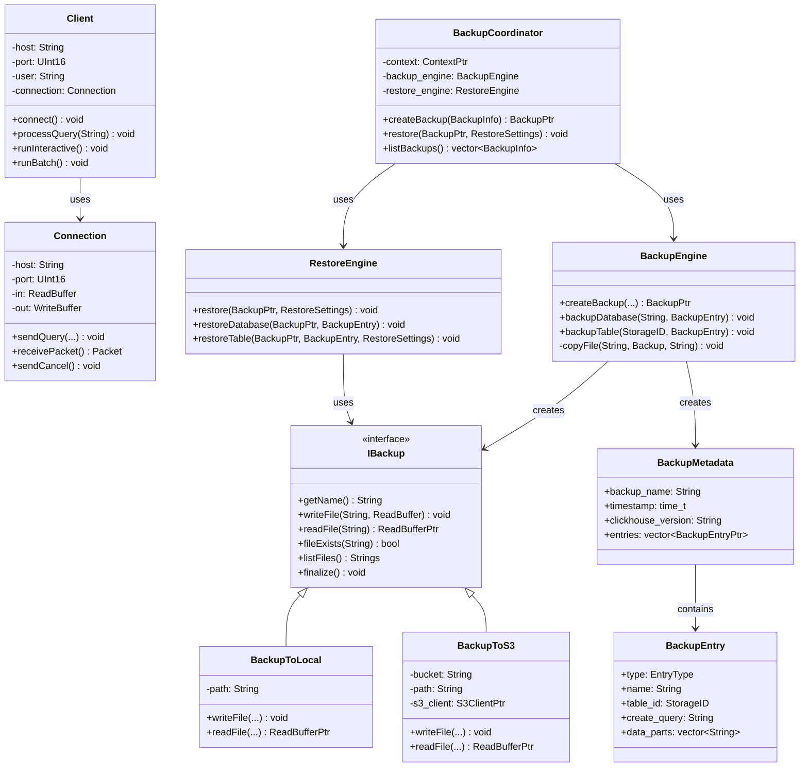

# ClickHouse-12-Client与Backups模块

## 模块概览

### 职责

**Client 模块**负责：
- 提供命令行客户端（clickhouse-client）
- 实现与服务器的通信协议
- 支持交互式查询和批量查询
- 提供查询结果的格式化输出
- 支持本地查询处理

**Backups 模块**负责：
- 实现数据库备份和恢复功能
- 支持全量备份和增量备份
- 支持多种备份目标（本地、S3、HDFS）
- 提供备份元数据管理
- 支持并行备份和恢复

## 模块架构图

```mermaid
flowchart TB
    subgraph Client["Client 模块"]
        subgraph ClientCore["客户端核心"]
            ClickHouseClient[ClickHouseClient<br/>命令行客户端]
            Connection[Connection<br/>连接管理]
            QueryProcessor[QueryProcessor<br/>查询处理器]
        end
        
        subgraph ClientFeatures["客户端功能"]
            Interactive[Interactive<br/>交互模式]
            Batch[Batch<br/>批处理模式]
            Format[Format<br/>格式化输出]
            History[History<br/>历史记录]
            Completion[Completion<br/>自动补全]
        end
        
        subgraph ClientProtocol["协议实现"]
            TCPProtocol[TCP 协议<br/>Native]
            HTTPProtocol[HTTP 协议<br/>REST API]
            Compression[压缩支持]
        end
    end
    
    subgraph Backups["Backups 模块"]
        subgraph BackupCore["备份核心"]
            BackupCoordinator[BackupCoordinator<br/>备份协调器]
            BackupEngine[BackupEngine<br/>备份引擎]
            RestoreEngine[RestoreEngine<br/>恢复引擎]
        end
        
        subgraph BackupTypes["备份类型"]
            FullBackup[Full Backup<br/>全量备份]
            IncrementalBackup[Incremental Backup<br/>增量备份]
        end
        
        subgraph BackupTargets["备份目标"]
            LocalDisk[Local Disk<br/>本地磁盘]
            S3Storage[S3<br/>对象存储]
            HDFSStorage[HDFS<br/>分布式存储]
        end
        
        subgraph BackupMetadata["元数据管理"]
            BackupMetadata[BackupMetadata<br/>备份元数据]
            BackupEntry[BackupEntry<br/>备份条目]
            BackupSettings[BackupSettings<br/>备份设置]
        end
    end
    
    User[用户] --> ClickHouseClient
    ClickHouseClient --> Connection
    Connection --> TCPProtocol
    Connection --> HTTPProtocol
    
    ClickHouseClient --> Interactive
    ClickHouseClient --> Batch
    ClickHouseClient --> Format
    
    QueryProcessor --> Server[Server 模块]
    
    BackupCoordinator --> BackupEngine
    BackupCoordinator --> RestoreEngine
    
    BackupEngine --> BackupTypes
    BackupEngine --> BackupTargets
    BackupEngine --> BackupMetadata
    
    RestoreEngine --> BackupMetadata
    RestoreEngine --> StorageEngines[Storage Engines]
```

### 架构说明

#### 图意概述

Client 模块提供了命令行客户端工具。ClickHouseClient 是主入口，通过 Connection 与服务器通信，支持 TCP 和 HTTP 两种协议。客户端支持交互式和批处理两种模式，提供丰富的输出格式和历史记录功能。

Backups 模块实现了完整的备份恢复系统。BackupCoordinator 协调整个备份过程，BackupEngine 执行实际的备份操作，支持全量和增量备份，可以备份到本地磁盘、S3 或 HDFS。BackupMetadata 管理备份的元信息。

#### 关键字段与接口

**ClickHouseClient 类（简化版）**
```cpp
class Client {
public:
    Client() = default;
    
    // 初始化
    void initialize(const Poco::Util::Application & app);
    
    // 主循环
    int main(const std::vector<std::string> & args);
    
    // 连接到服务器
    void connect();
    
    // 执行查询
    void processQuery(const String & query);
    
    // 交互模式
    void runInteractive();
    
    // 批处理模式
    void runBatch();
    
private:
    // 连接参数
    String host = "localhost";
    UInt16 port = 9000;
    String user = "default";
    String password;
    String database = "default";
    
    // 客户端配置
    bool is_interactive = true;
    String output_format = "PrettyCompact";
    bool multiline = false;
    String history_file;
    
    // 连接对象
    std::unique_ptr<Connection> connection;
    
    // 处理单个查询
    void processQueryImpl(const String & query);
    
    // 显示结果
    void displayResult(const Block & block);
    
    // 处理异常
    void onException(const Exception & e);
};
```

**Connection 类**
```cpp
class Connection {
public:
    Connection(
        const String & host_,
        UInt16 port_,
        const String & default_database_,
        const String & user_,
        const String & password_,
        const String & client_name_);
    
    // 连接
    void connect(const ConnectionTimeouts & timeouts);
    void disconnect();
    
    // 发送查询
    void sendQuery(
        const String & query,
        const String & query_id,
        QueryProcessingStage::Enum stage,
        const Settings * settings,
        const ClientInfo * client_info,
        bool with_pending_data);
    
    // 接收数据
    bool poll(size_t timeout_microseconds);
    Packet receivePacket();
    
    // 取消查询
    void sendCancel();
    
    // 获取服务器信息
    const String & getServerName() const { return server_name; }
    const String & getServerVersion() const { return server_version; }
    
private:
    String host;
    UInt16 port;
    String default_database;
    String user;
    String password;
    
    std::unique_ptr<ReadBuffer> in;
    std::unique_ptr<WriteBuffer> out;
    
    String server_name;
    String server_version;
    
    // 协议实现
    void sendHello();
    void receiveHello();
    void sendData(const Block & block);
    Block receiveData();
};
```

**BackupCoordinator 类**
```cpp
class BackupCoordinator {
public:
    BackupCoordinator(const ContextPtr & context_);
    
    // 创建备份
    BackupPtr createBackup(const BackupInfo & backup_info);
    
    // 恢复备份
    void restore(const BackupPtr & backup, const RestoreSettings & settings);
    
    // 列出备份
    std::vector<BackupInfo> listBackups() const;
    
    // 删除备份
    void removeBackup(const String & backup_name);
    
private:
    ContextPtr context;
    std::unique_ptr<BackupEngine> backup_engine;
    std::unique_ptr<RestoreEngine> restore_engine;
};
```

**BackupEngine 类**
```cpp
class BackupEngine {
public:
    // 创建备份
    BackupPtr createBackup(
        const BackupInfo & backup_info,
        const BackupSettings & settings);
    
    // 备份数据库
    void backupDatabase(
        const String & database_name,
        BackupEntryPtr & backup_entry);
    
    // 备份表
    void backupTable(
        const StorageID & table_id,
        BackupEntryPtr & backup_entry);
    
    // 备份数据部分
    void backupDataParts(
        const StoragePtr & storage,
        const DataPartsVector & data_parts,
        BackupEntryPtr & backup_entry);
    
private:
    // 写入备份元数据
    void writeMetadata(
        BackupPtr backup,
        const BackupMetadata & metadata);
    
    // 复制文件
    void copyFile(
        const String & source_path,
        BackupPtr backup,
        const String & dest_path);
};
```

**Backup 类（接口）**
```cpp
class IBackup {
public:
    virtual ~IBackup() = default;
    
    // 备份名称
    virtual String getName() const = 0;
    
    // 写入文件
    virtual void writeFile(const String & file_name, ReadBuffer & in) = 0;
    
    // 读取文件
    virtual std::unique_ptr<ReadBuffer> readFile(const String & file_name) const = 0;
    
    // 文件是否存在
    virtual bool fileExists(const String & file_name) const = 0;
    
    // 列出文件
    virtual Strings listFiles() const = 0;
    
    // 完成备份
    virtual void finalize() = 0;
};

class BackupToLocal : public IBackup {
public:
    BackupToLocal(const String & path_);
    
    void writeFile(const String & file_name, ReadBuffer & in) override;
    std::unique_ptr<ReadBuffer> readFile(const String & file_name) const override;
    bool fileExists(const String & file_name) const override;
    
private:
    String path;
};

class BackupToS3 : public IBackup {
public:
    BackupToS3(const String & bucket_, const String & path_);
    
    void writeFile(const String & file_name, ReadBuffer & in) override;
    std::unique_ptr<ReadBuffer> readFile(const String & file_name) const override;
    
private:
    String bucket;
    String path;
    std::shared_ptr<S3Client> s3_client;
};
```

#### 边界条件

**Client**
- 最大查询长度：几 MB
- 历史记录大小：默认 10000 条
- 连接超时：默认 10 秒
- 读取超时：默认 300 秒

**Backups**
- 最大备份大小：取决于存储
- 并行备份线程：默认 16
- 压缩级别：1-9
- 增量备份间隔：小时级到天级

#### 异常与回退

**Client 异常**
- CONNECTION_FAILED：连接失败
- NETWORK_ERROR：网络错误
- QUERY_WAS_CANCELLED：查询被取消
- TIMEOUT_EXCEEDED：超时

**Backups 异常**
- BACKUP_ALREADY_EXISTS：备份已存在
- BACKUP_NOT_FOUND：备份不存在
- BACKUP_IS_EMPTY：备份为空
- RESTORE_FAILED：恢复失败

## 核心 API 详解

### API 1: Client::processQuery - 执行查询

#### 基本信息

- **名称**: `processQuery()`
- **用途**: 执行 SQL 查询并显示结果
- **模式**: 支持交互式和批处理

#### 实现流程

```cpp
void Client::processQuery(const String & query) {
    try {
        // 1) 发送查询
        connection->sendQuery(
            query,
            query_id,
            QueryProcessingStage::Complete,
            &settings,
            &client_info,
            false
        );
        
        // 2) 接收结果
        while (true) {
            Packet packet = connection->receivePacket();
            
            switch (packet.type) {
                case Protocol::Server::Data:
                    // 显示数据块
                    displayResult(packet.block);
                    break;
                
                case Protocol::Server::Progress:
                    // 显示进度
                    displayProgress(packet.progress);
                    break;
                
                case Protocol::Server::ProfileInfo:
                    // 显示性能信息
                    displayProfileInfo(packet.profile_info);
                    break;
                
                case Protocol::Server::Exception:
                    // 处理异常
                    throw packet.exception;
                
                case Protocol::Server::EndOfStream:
                    // 查询完成
                    return;
                
                default:
                    break;
            }
        }
    }
    catch (const Exception & e) {
        onException(e);
    }
}

void Client::displayResult(const Block & block) {
    if (block.rows() == 0)
        return;
    
    // 1) 创建输出格式
    auto output_format = FormatFactory::instance().getOutput(
        output_format_name,
        *out_buf,
        block.cloneEmpty(),
        context
    );
    
    // 2) 写入数据
    output_format->write(block);
    output_format->finalize();
    
    // 3) 刷新输出
    out_buf->next();
}

void Client::runInteractive() {
    // 1) 加载历史记录
    LineReader line_reader(history_file);
    
    // 2) 交互循环
    while (true) {
        // 读取一行
        String line = line_reader.readLine("localhost :) ", "");
        
        if (line.empty())
            continue;
        
        if (line == "exit" || line == "quit")
            break;
        
        // 处理多行查询
        if (multiline && !ends_with_semicolon(line)) {
            String full_query = line;
            while (true) {
                String next_line = line_reader.readLine(":-] ", "");
                full_query += "\n" + next_line;
                if (ends_with_semicolon(next_line))
                    break;
            }
            processQuery(full_query);
        }
        else {
            processQuery(line);
        }
        
        // 保存到历史
        line_reader.addToHistory(line);
    }
}
```

### API 2: BackupEngine::createBackup - 创建备份

#### 基本信息

- **名称**: `createBackup()`
- **用途**: 创建数据库备份
- **类型**: 支持全量和增量备份

#### 实现流程

```cpp
BackupPtr BackupEngine::createBackup(
    const BackupInfo & backup_info,
    const BackupSettings & settings)
{
    // 1) 创建备份对象
    BackupPtr backup;
    if (backup_info.destination.type == BackupDestination::Local)
        backup = std::make_shared<BackupToLocal>(backup_info.destination.path);
    else if (backup_info.destination.type == BackupDestination::S3)
        backup = std::make_shared<BackupToS3>(backup_info.destination.bucket, backup_info.destination.path);
    
    // 2) 收集要备份的对象
    BackupMetadata metadata;
    metadata.backup_name = backup_info.name;
    metadata.timestamp = std::time(nullptr);
    metadata.clickhouse_version = VERSION_STRING;
    
    // 3) 备份数据库
    for (const auto & database_name : backup_info.databases) {
        BackupEntryPtr database_entry = std::make_shared<BackupEntry>();
        database_entry->type = BackupEntry::Database;
        database_entry->name = database_name;
        
        backupDatabase(database_name, database_entry);
        metadata.entries.push_back(database_entry);
    }
    
    // 4) 备份表
    for (const auto & table_id : backup_info.tables) {
        BackupEntryPtr table_entry = std::make_shared<BackupEntry>();
        table_entry->type = BackupEntry::Table;
        table_entry->table_id = table_id;
        
        backupTable(table_id, table_entry);
        metadata.entries.push_back(table_entry);
    }
    
    // 5) 写入元数据
    writeMetadata(backup, metadata);
    
    // 6) 完成备份
    backup->finalize();
    
    return backup;
}

void BackupEngine::backupTable(
    const StorageID & table_id,
    BackupEntryPtr & backup_entry)
{
    // 1) 获取表
    auto table = DatabaseCatalog::instance().getTable(table_id, context);
    auto metadata_snapshot = table->getInMemoryMetadataPtr();
    
    // 2) 备份表结构
    String create_query = getCreateQuery(table_id);
    backup_entry->create_query = create_query;
    
    WriteBufferFromOwnString create_query_buf;
    writeString(create_query, create_query_buf);
    
    String metadata_path = "metadata/" + table_id.database_name + "/" + table_id.table_name + ".sql";
    backup->writeFile(metadata_path, create_query_buf);
    
    // 3) 备份数据（如果是 MergeTree）
    if (auto * merge_tree = dynamic_cast<StorageMergeTree *>(table.get())) {
        auto data_parts = merge_tree->getDataPartsVector();
        
        for (const auto & part : data_parts) {
            String part_path = table->getRelativeDataPath() + part->name + "/";
            
            // 备份每个数据部分的文件
            for (const auto & file : part->getFileNamesWithoutChecksums()) {
                String source_path = part->getFullPath() + file;
                String dest_path = "data/" + table_id.database_name + "/" + table_id.table_name + "/" + part->name + "/" + file;
                
                copyFile(source_path, backup, dest_path);
            }
            
            backup_entry->data_parts.push_back(part->name);
        }
    }
}

void BackupEngine::copyFile(
    const String & source_path,
    BackupPtr backup,
    const String & dest_path)
{
    // 1) 打开源文件
    ReadBufferFromFile in(source_path);
    
    // 2) 可选压缩
    std::unique_ptr<ReadBuffer> compressed_in;
    if (settings.compression_method != CompressionMethod::None) {
        compressed_in = std::make_unique<CompressedReadBuffer>(in);
        backup->writeFile(dest_path, *compressed_in);
    }
    else {
        backup->writeFile(dest_path, in);
    }
}
```

### API 3: RestoreEngine::restore - 恢复备份

#### 基本信息

- **名称**: `restore()`
- **用途**: 从备份恢复数据
- **模式**: 支持完整恢复和选择性恢复

#### 实现

```cpp
void RestoreEngine::restore(
    const BackupPtr & backup,
    const RestoreSettings & settings)
{
    // 1) 读取备份元数据
    auto metadata_in = backup->readFile(".backup_metadata");
    BackupMetadata metadata;
    readMetadata(*metadata_in, metadata);
    
    // 2) 验证备份
    if (metadata.clickhouse_version != VERSION_STRING)
        LOG_WARNING(log, "Backup was created with different ClickHouse version");
    
    // 3) 恢复数据库
    for (const auto & entry : metadata.entries) {
        if (entry->type == BackupEntry::Database) {
            restoreDatabase(backup, entry);
        }
    }
    
    // 4) 恢复表
    for (const auto & entry : metadata.entries) {
        if (entry->type == BackupEntry::Table) {
            restoreTable(backup, entry, settings);
        }
    }
}

void RestoreEngine::restoreTable(
    const BackupPtr & backup,
    const BackupEntryPtr & entry,
    const RestoreSettings & settings)
{
    const auto & table_id = entry->table_id;
    
    // 1) 读取表结构
    String metadata_path = "metadata/" + table_id.database_name + "/" + table_id.table_name + ".sql";
    auto metadata_in = backup->readFile(metadata_path);
    
    String create_query;
    readString(create_query, *metadata_in);
    
    // 2) 创建表
    if (settings.create_table) {
        auto ast = parseQuery(create_query);
        InterpreterCreateQuery interpreter(ast, context);
        interpreter.execute();
    }
    
    // 3) 恢复数据
    auto table = DatabaseCatalog::instance().getTable(table_id, context);
    
    for (const auto & part_name : entry->data_parts) {
        String part_path = "data/" + table_id.database_name + "/" + table_id.table_name + "/" + part_name + "/";
        String dest_path = table->getRelativeDataPath() + part_name + "/";
        
        // 复制数据部分的所有文件
        auto files = backup->listFiles(part_path);
        for (const auto & file : files) {
            auto file_in = backup->readFile(part_path + file);
            
            String dest_file_path = dest_path + file;
            WriteBufferFromFile out(dest_file_path);
            
            copyData(*file_in, out);
            out.sync();
        }
    }
    
    // 4) 附加数据部分
    if (auto * merge_tree = dynamic_cast<StorageMergeTree *>(table.get())) {
        for (const auto & part_name : entry->data_parts) {
            merge_tree->attachPart(part_name);
        }
    }
}
```

## 数据结构 UML 图



## 实战经验

### 使用 clickhouse-client

```bash
# 连接到服务器
clickhouse-client --host localhost --port 9000 --user default --password ''

# 执行单个查询
clickhouse-client --query "SELECT * FROM system.databases"

# 执行文件中的查询
clickhouse-client < queries.sql

# 指定输出格式
clickhouse-client --format CSV --query "SELECT * FROM users"

# 多行查询
clickhouse-client --multiline
```

### 客户端配置

```xml
<!-- ~/.clickhouse-client/config.xml -->
<clickhouse>
    <host>localhost</host>
    <port>9000</port>
    <user>default</user>
    <password></password>
    
    <format>PrettyCompact</format>
    <multiline>true</multiline>
    <history_file>~/.clickhouse-client-history</history_file>
    
    <compression>true</compression>
</clickhouse>
```

### 创建备份

```sql
-- 备份整个数据库
BACKUP DATABASE my_database TO Disk('backups', 'my_database_backup');

-- 备份特定表
BACKUP TABLE my_database.users TO Disk('backups', 'users_backup');

-- 备份到 S3
BACKUP DATABASE my_database TO S3('s3://my-bucket/backups/my_database', 'access_key', 'secret_key');

-- 增量备份
BACKUP DATABASE my_database TO Disk('backups', 'my_database_incremental') SETTINGS base_backup = 'my_database_backup';
```

### 恢复备份

```sql
-- 恢复数据库
RESTORE DATABASE my_database FROM Disk('backups', 'my_database_backup');

-- 恢复表
RESTORE TABLE my_database.users FROM Disk('backups', 'users_backup');

-- 恢复到不同的数据库
RESTORE DATABASE my_database AS my_database_restored FROM Disk('backups', 'my_database_backup');

-- 从 S3 恢复
RESTORE DATABASE my_database FROM S3('s3://my-bucket/backups/my_database', 'access_key', 'secret_key');
```

### 使用 Python 客户端

```python
from clickhouse_driver import Client

# 连接
client = Client('localhost')

# 执行查询
result = client.execute('SELECT * FROM users WHERE age > 18')

# 插入数据
client.execute('INSERT INTO users VALUES', [(1, 'Alice', 25), (2, 'Bob', 30)])

# 使用参数
result = client.execute('SELECT * FROM users WHERE age > %(age)s', {'age': 18})

# 流式读取大结果
for row in client.execute_iter('SELECT * FROM large_table'):
    process(row)
```

## 总结

Client 和 Backups 模块是 ClickHouse 的运维工具：

**Client 模块**提供：
1. **命令行工具**：clickhouse-client 交互式客户端
2. **多种协议**：TCP（Native）和 HTTP 支持
3. **丰富功能**：历史记录、自动补全、多行查询
4. **灵活输出**：支持 20+ 种输出格式
5. **批处理**：支持脚本化查询

**Backups 模块**提供：
1. **全量备份**：完整的数据库/表备份
2. **增量备份**：基于前一次备份的增量
3. **多种目标**：本地磁盘、S3、HDFS
4. **并行备份**：多线程加速备份过程
5. **元数据管理**：完整的备份信息记录

两个模块为 ClickHouse 提供便捷的运维和数据保护能力。

