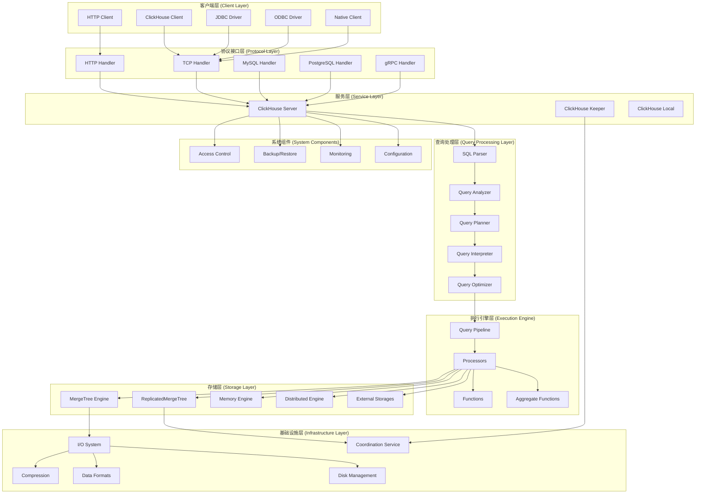
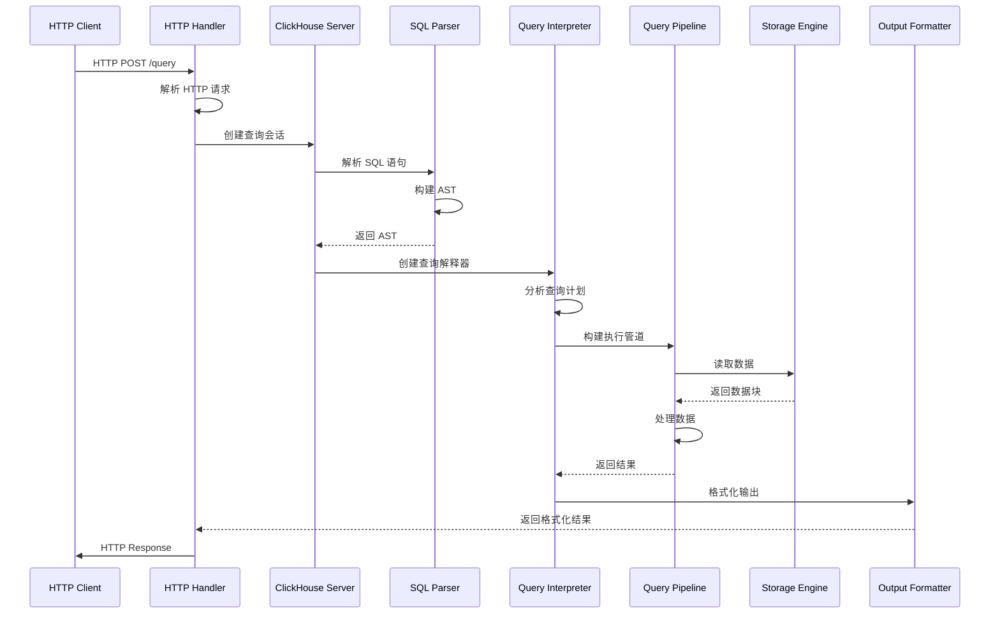
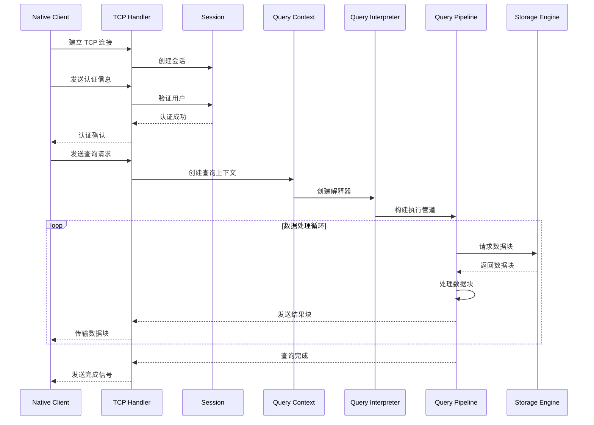
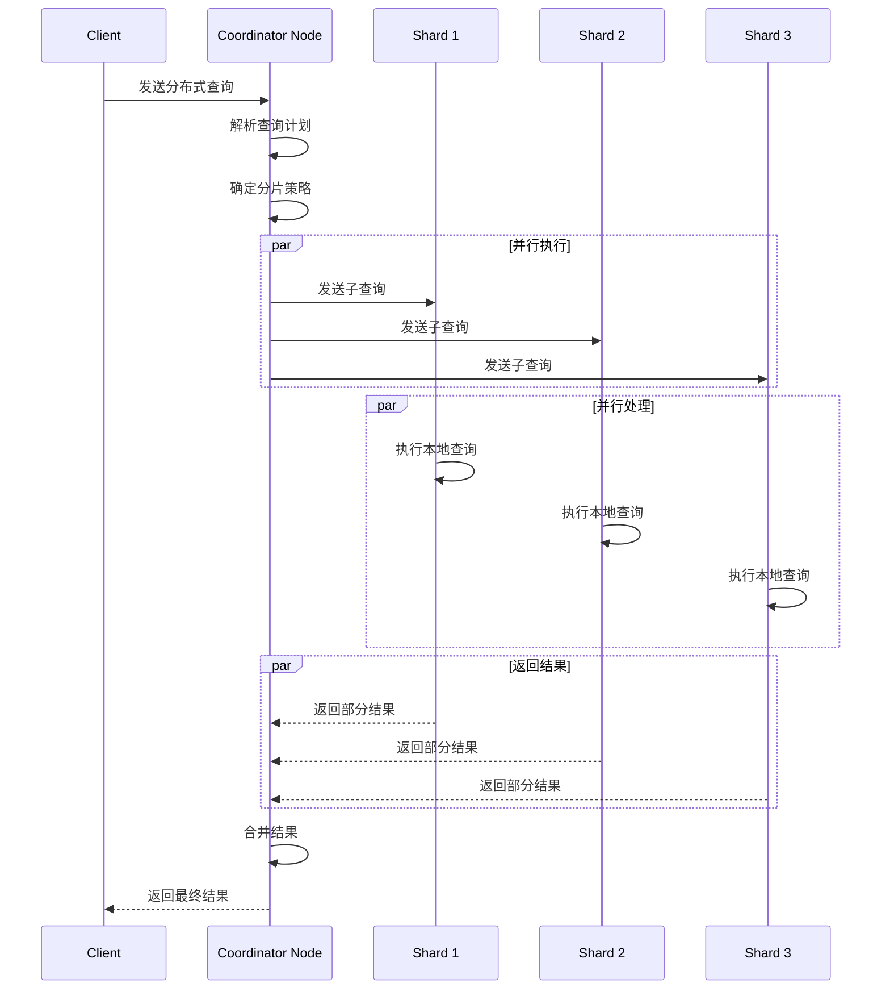
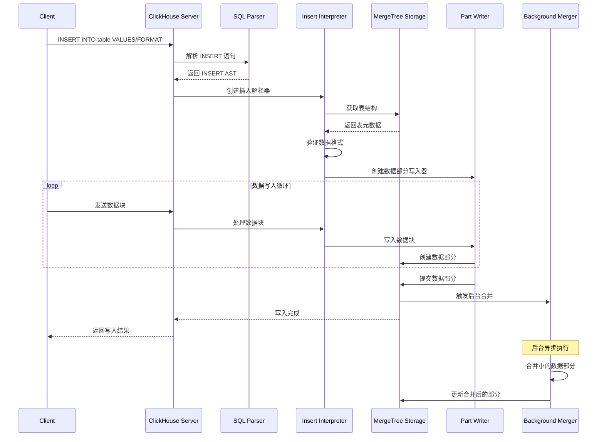
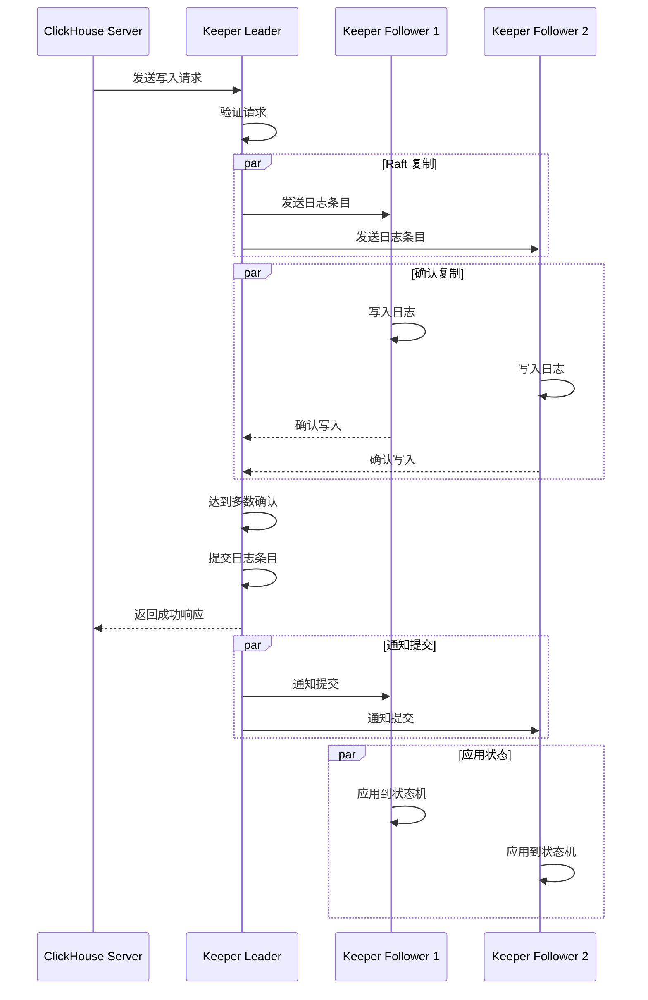

## 项目概述

ClickHouse 是一个开源的列式数据库管理系统，专为实时分析查询而设计。项目采用模块化架构，支持多种接口协议和部署模式。

## 整体架构图

## 核心模块说明

### 1. 客户端层 (Client Layer)
- **ClickHouse Client**: 官方命令行客户端
- **HTTP Client**: 基于 HTTP 协议的客户端
- **JDBC/ODBC**: 标准数据库连接驱动
- **Native Client**: 使用原生 TCP 协议的客户端

### 2. 协议接口层 (Protocol Layer)
- **HTTP Handler**: 处理 HTTP/HTTPS 请求
- **TCP Handler**: 处理原生 TCP 协议
- **MySQL Handler**: MySQL 协议兼容
- **PostgreSQL Handler**: PostgreSQL 协议兼容
- **gRPC Handler**: gRPC 协议支持

### 3. 服务层 (Service Layer)
- **ClickHouse Server**: 主服务器进程
- **ClickHouse Keeper**: 分布式协调服务（ZooKeeper 替代）
- **ClickHouse Local**: 本地单机模式

### 4. 查询处理层 (Query Processing Layer)
- **SQL Parser**: SQL 语句解析器
- **Query Analyzer**: 查询分析器
- **Query Planner**: 查询计划器
- **Query Interpreter**: 查询解释器
- **Query Optimizer**: 查询优化器

### 5. 执行引擎层 (Execution Engine)
- **Query Pipeline**: 查询管道
- **Processors**: 数据处理器
- **Functions**: 内置函数库
- **Aggregate Functions**: 聚合函数

### 6. 存储层 (Storage Layer)
- **MergeTree Engine**: 主要存储引擎
- **ReplicatedMergeTree**: 复制表引擎
- **Memory Engine**: 内存存储引擎
- **Distributed Engine**: 分布式表引擎
- **External Storages**: 外部存储集成

### 7. 基础设施层 (Infrastructure Layer)
- **I/O System**: 输入输出系统
- **Compression**: 数据压缩
- **Data Formats**: 数据格式支持
- **Disk Management**: 磁盘管理
- **Coordination Service**: 协调服务

### 8. 系统组件 (System Components)
- **Access Control**: 访问控制
- **Backup/Restore**: 备份恢复
- **Monitoring**: 监控系统
- **Configuration**: 配置管理

## 主要接口时序图

### 1. HTTP 查询处理时序图

### 2. TCP 原生协议查询时序图

### 3. 分布式查询时序图

### 4. 数据写入时序图

### 5. ClickHouse Keeper 协调时序图

## 关键设计特点

### 1. 列式存储
- 数据按列存储，提高压缩率和查询性能
- 支持多种压缩算法（LZ4、ZSTD、Delta 等）

### 2. 向量化执行
- 批量处理数据块，提高 CPU 利用率
- SIMD 指令优化

### 3. 分布式架构
- 支持水平扩展
- 自动分片和复制
- 无单点故障

### 4. 实时写入
- 支持高并发写入
- 异步合并机制
- 最终一致性

### 5. 多协议支持
- HTTP/HTTPS
- 原生 TCP 协议
- MySQL/PostgreSQL 兼容
- gRPC 支持

### 6. 高可用性
- ClickHouse Keeper 提供协调服务
- 数据复制和故障转移
- 健康检查和监控

## 性能优化特性

### 1. 查询优化
- 基于成本的优化器
- 谓词下推
- 投影下推
- 分区裁剪

### 2. 存储优化
- 主键索引
- 跳数索引
- 布隆过滤器
- 数据分区

### 3. 内存管理
- 内存池管理
- 查询内存限制
- 缓存机制

### 4. 并发控制
- 无锁数据结构
- 读写分离
- 异步 I/O

这个架构分析展示了 ClickHouse 的完整技术栈，从客户端接口到底层存储的各个层次，以及主要操作的执行流程。每个组件都有明确的职责分工，整体架构具有高度的模块化和可扩展性。
