---

## 框架使用手册

### 1.1 项目概述

ClickHouse是一个开源的列式数据库管理系统（DBMS），专为在线分析处理（OLAP）而设计。它采用C++编写，具有以下核心特性：

- **列式存储**：数据按列存储，提高压缩率和查询性能
- **向量化执行**：批量处理数据块，充分利用CPU SIMD指令
- **分布式架构**：支持水平扩展和高可用性
- **实时写入**：支持高并发写入和实时查询
- **多协议支持**：HTTP、TCP、MySQL、PostgreSQL等协议兼容

### 1.2 编译构建

#### 系统要求
- **操作系统**：Linux、macOS、FreeBSD
- **编译器**：Clang 15+ 或 GCC 11+
- **内存**：至少8GB RAM用于编译
- **磁盘**：至少50GB可用空间

#### 构建步骤
```bash
# 1. 克隆代码仓库
git clone --recursive https://github.com/ClickHouse/ClickHouse.git
cd ClickHouse

# 2. 创建构建目录
mkdir build
cd build

# 3. 配置CMake
cmake .. -DCMAKE_BUILD_TYPE=Release

# 4. 编译（使用多线程）
make -j$(nproc)

# 5. 安装
sudo make install
```

#### 关键CMake选项
```cmake
# 启用测试
-DENABLE_TESTS=ON

# 启用调试符号
-DCMAKE_BUILD_TYPE=Debug

# 启用静态链接
-DENABLE_STATIC_LINKING=ON

# 启用特定存储引擎
-DENABLE_LIBRARIES=ON
```

### 1.3 项目结构

```
ClickHouse/
├── base/                    # 基础库和工具
├── cmake/                   # CMake配置文件
├── contrib/                 # 第三方依赖库
├── docs/                    # 文档
├── programs/                # 可执行程序
│   ├── client/             # ClickHouse客户端
│   ├── server/             # ClickHouse服务器
│   ├── keeper/             # ClickHouse Keeper
│   └── local/              # 本地模式
├── src/                     # 核心源代码
│   ├── Access/             # 访问控制
│   ├── AggregateFunctions/ # 聚合函数
│   ├── Analyzer/           # 查询分析器
│   ├── Client/             # 客户端库
│   ├── Common/             # 通用工具
│   ├── Core/               # 核心组件
│   ├── Databases/          # 数据库引擎
│   ├── DataTypes/          # 数据类型
│   ├── Functions/          # 内置函数
│   ├── Interpreters/       # 查询解释器
│   ├── IO/                 # 输入输出
│   ├── Parsers/            # SQL解析器
│   ├── Processors/         # 数据处理器
│   ├── Server/             # 服务器组件
│   └── Storages/           # 存储引擎
├── tests/                   # 测试用例
└── utils/                   # 实用工具
```

### 1.4 开发环境配置

#### IDE配置（CLion）
```json
{
  "cmake.buildDirectory": "${workspaceFolder}/build",
  "cmake.configureArgs": [
    "-DCMAKE_BUILD_TYPE=Debug",
    "-DENABLE_TESTS=ON"
  ],
  "clang-tidy.checks": [
    "readability-*",
    "modernize-*",
    "performance-*"
  ]
}
```

#### 调试配置
```gdb
# .gdbinit
set print pretty on
set print object on
set print static-members on
set print vtbl on
set print demangle on
```

---

## 整体架构分析

### 2.1 系统架构图

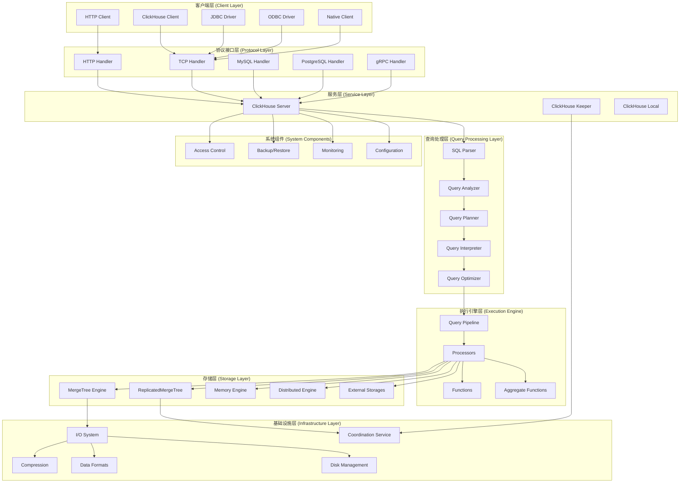

### 2.2 模块交互时序图

#### HTTP查询处理时序图
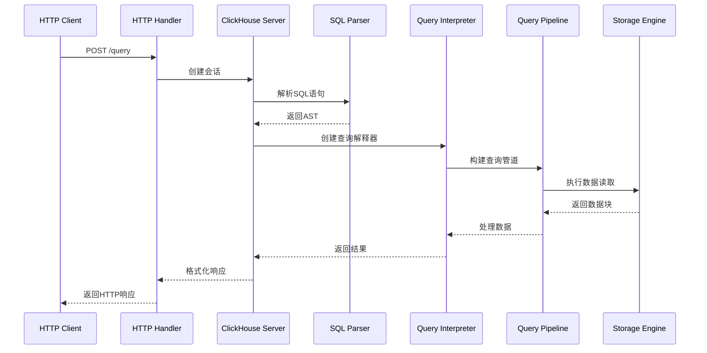

#### TCP查询处理时序图
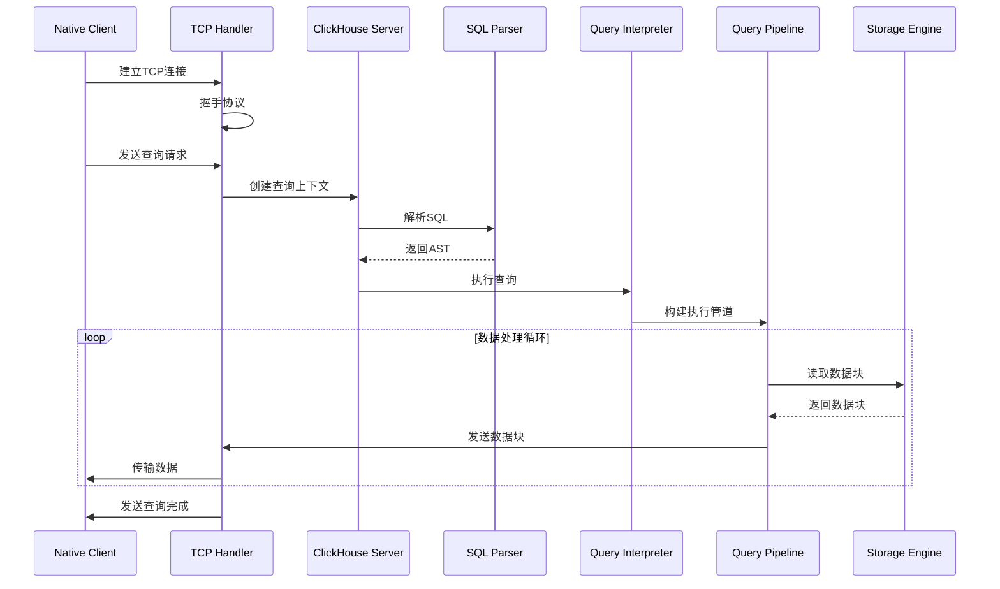

### 2.3 核心设计模式

#### 2.3.1 管道模式（Pipeline Pattern）
ClickHouse使用管道模式处理查询，将复杂的查询分解为多个处理阶段：

```cpp
// src/QueryPipeline/QueryPipeline.h
class QueryPipeline
{
private:
    Processors processors;
    InputPorts input_ports;
    OutputPorts output_ports;
    
public:
    void addTransform(ProcessorPtr processor);
    void addSource(ProcessorPtr source);
    void addSink(ProcessorPtr sink);
    void execute();
};
```

#### 2.3.2 工厂模式（Factory Pattern）
用于创建各种存储引擎、函数、数据类型等：

```cpp
// src/Storages/StorageFactory.h
class StorageFactory : public boost::noncopyable
{
public:
    static StorageFactory & instance();
    
    StoragePtr get(
        const ASTCreateQuery & query,
        const String & relative_data_path,
        ContextPtr context) const;
        
    void registerStorage(const String & name, CreatorFn creator_fn);
};
```

#### 2.3.3 访问者模式（Visitor Pattern）
用于AST遍历和处理：

```cpp
// src/Parsers/ASTVisitor.h
template <typename T>
class ASTVisitor
{
public:
    virtual T visit(const ASTPtr & node) = 0;
    virtual T visitSelectQuery(const ASTSelectQuery & select) = 0;
    virtual T visitInsertQuery(const ASTInsertQuery & insert) = 0;
};
```

---

## 对外API接口分析

### 3.1 HTTP接口

#### 3.1.1 HTTPHandler核心实现

```cpp
// src/Server/HTTPHandler.h
class HTTPHandler : public HTTPRequestHandler
{
public:
    HTTPHandler(IServer & server_, const HTTPHandlerConnectionConfig & connection_config_, 
                const std::string & name, const HTTPResponseHeaderSetup & http_response_headers_override_);
    
    void handleRequest(HTTPServerRequest & request, HTTPServerResponse & response, 
                      const ProfileEvents::Event & write_event) override;

    virtual void customizeContext(HTTPServerRequest & request, ContextMutablePtr context, ReadBuffer & body) {}
    virtual bool customizeQueryParam(ContextMutablePtr context, const std::string & key, const std::string & value) = 0;
    virtual std::string getQuery(HTTPServerRequest & request, HTMLForm & params, ContextMutablePtr context) = 0;

private:
    void processQuery(HTTPServerRequest & request, HTMLForm & params, HTTPServerResponse & response,
                     Output & used_output, std::optional<CurrentThread::QueryScope> & query_scope,
                     const ProfileEvents::Event & write_event);
};
```

**关键功能说明：**
- `handleRequest`: HTTP请求的主入口点，处理所有HTTP请求
- `processQuery`: 核心查询处理逻辑，包括参数解析、会话管理、查询执行
- `customizeContext`: 允许子类自定义查询上下文
- `customizeQueryParam`: 处理自定义查询参数

#### 3.1.2 HTTP请求处理流程

```cpp
// src/Server/HTTPHandler.cpp - processQuery方法核心逻辑
void HTTPHandler::processQuery(HTTPServerRequest & request, HTMLForm & params, 
                              HTTPServerResponse & response, Output & used_output,
                              std::optional<CurrentThread::QueryScope> & query_scope,
                              const ProfileEvents::Event & write_event)
{
    // 1. 创建或获取会话
    auto session_id = params.get("session_id", "");
    auto session_timeout = parseSessionTimeout(params);
    session = makeSession(session_id, session_timeout);
    
    // 2. 创建查询上下文
    auto context = session->makeQueryContext();
    
    // 3. 设置数据库和格式
    std::string database = request.get("X-ClickHouse-Database", params.get("database", ""));
    if (!database.empty())
        context->setCurrentDatabase(database);
        
    std::string default_format = request.get("X-ClickHouse-Format", params.get("default_format", ""));
    if (!default_format.empty())
        context->setDefaultFormat(default_format);
    
    // 4. 设置只读模式（对于非POST请求）
    setReadOnlyIfHTTPMethodIdempotent(context, request.getMethod());
    
    // 5. 设置查询ID
    context->setCurrentQueryId(params.get("query_id", request.get("X-ClickHouse-Query-Id", "")));
    
    // 6. 处理外部数据
    bool has_external_data = startsWith(request.getContentType(), "multipart/form-data");
    
    // 7. 获取查询文本
    std::string query = getQuery(request, params, context);
    
    // 8. 执行查询
    executeQuery(query, context, used_output.out_maybe_delayed_and_compressed, 
                query_scope, write_event);
}
```

#### 3.1.3 支持的HTTP端点

| 端点 | 方法 | 功能 | 示例 |
|------|------|------|------|
| `/` | GET/POST | 执行查询 | `GET /?query=SELECT 1` |
| `/ping` | GET | 健康检查 | `GET /ping` |
| `/replicas_status` | GET | 副本状态 | `GET /replicas_status` |
| `/play` | GET | Web界面 | `GET /play` |
| `/dashboard` | GET | 监控面板 | `GET /dashboard` |

### 3.2 TCP接口

#### 3.2.1 TCPHandler核心实现

```cpp
// src/Server/TCPHandler.h
class TCPHandler : public Poco::Net::TCPServerConnection
{
public:
    TCPHandler(IServer & server_, TCPServer & tcp_server_, const Poco::Net::StreamSocket & socket_,
               bool parse_proxy_protocol_, String server_display_name_, String host_name_,
               const ProfileEvents::Event & read_event_ = ProfileEvents::end(),
               const ProfileEvents::Event & write_event_ = ProfileEvents::end());
    
    void run() override;
    virtual void customizeContext(ContextMutablePtr context) {}

private:
    // 连接管理
    void runImpl();
    void extractConnectionSettingsFromContext(const ContextPtr & context);
    std::unique_ptr<Session> makeSession();
    
    // 协议处理
    void receiveHello();
    void sendHello();
    bool receivePacketsExpectQuery(std::optional<QueryState> & state);
    bool receivePacketsExpectData(QueryState & state);
    
    // 查询处理
    void processQuery(std::optional<QueryState> & state);
    void processOrdinaryQuery(QueryState & state);
    void processInsertQuery(QueryState & state);
    
    // 数据传输
    void sendData(QueryState & state, const Block & block);
    void sendProgress(QueryState & state);
    void sendException(const Exception & e, bool with_stack_trace);
};
```

#### 3.2.2 TCP协议握手流程

```cpp
// src/Server/TCPHandler.cpp - 握手实现
void TCPHandler::receiveHello()
{
    /// Receive hello packet.
    UInt64 packet_type = 0;
    String user;
    String password;
    
    readVarUInt(packet_type, *in);
    if (packet_type != Protocol::Client::Hello)
        throw Exception("Unexpected packet type received from client", ErrorCodes::UNEXPECTED_PACKET_FROM_CLIENT);
    
    readStringBinary(client_name, *in);
    readVarUInt(client_version_major, *in);
    readVarUInt(client_version_minor, *in);
    readVarUInt(client_tcp_protocol_version, *in);
    readStringBinary(default_database, *in);
    readStringBinary(user, *in);
    readStringBinary(password, *in);
    
    // 创建会话并认证
    session = makeSession();
    session->authenticate(user, password, Poco::Net::SocketAddress());
}

void TCPHandler::sendHello()
{
    writeVarUInt(Protocol::Server::Hello, *out);
    writeStringBinary(DBMS_NAME, *out);
    writeVarUInt(DBMS_VERSION_MAJOR, *out);
    writeVarUInt(DBMS_VERSION_MINOR, *out);
    writeVarUInt(DBMS_TCP_PROTOCOL_VERSION, *out);
    
    if (client_tcp_protocol_version >= DBMS_MIN_REVISION_WITH_SERVER_TIMEZONE)
        writeStringBinary(DateLUT::instance().getTimeZone(), *out);
        
    if (client_tcp_protocol_version >= DBMS_MIN_REVISION_WITH_SERVER_DISPLAY_NAME)
        writeStringBinary(server_display_name, *out);
        
    out->next();
}
```

#### 3.2.3 查询状态管理

```cpp
// src/Server/TCPHandler.h - QueryState结构
struct QueryState
{
    String query_id;                    // 查询ID
    ContextMutablePtr query_context;    // 查询上下文
    
    QueryProcessingStage::Enum stage = QueryProcessingStage::Complete;
    Protocol::Compression compression = Protocol::Compression::Disable;
    
    // 日志和性能事件队列
    InternalTextLogsQueuePtr logs_queue;
    std::unique_ptr<NativeWriter> logs_block_out;
    InternalProfileEventsQueuePtr profile_queue;
    std::unique_ptr<NativeWriter> profile_events_block_out;
    
    // 数据输入输出
    std::shared_ptr<ReadBuffer> maybe_compressed_in;
    std::unique_ptr<NativeReader> block_in;
    std::shared_ptr<WriteBuffer> maybe_compressed_out;
    std::unique_ptr<NativeWriter> block_out;
    
    String query;                       // 查询文本
    ASTPtr parsed_query;               // 解析后的AST
    BlockIO io;                        // 查询执行的输入输出流
    
    // 状态标志
    bool sent_all_data = false;
    bool need_receive_data_for_insert = false;
    bool read_all_data = true;
    bool skipping_data = false;
    
    Progress progress;                  // 查询进度
    Stopwatch watch;                   // 计时器
};
```

### 3.3 MySQL兼容接口

#### 3.3.1 MySQLHandler实现

```cpp
// src/Server/MySQLHandler.h
class MySQLHandler : public Poco::Net::TCPServerConnection
{
public:
    MySQLHandler(IServer & server_, LoggerPtr log_, const ProfileEvents::Event & read_event_,
                const ProfileEvents::Event & write_event_, bool ssl_enabled, uint32_t connection_id_);
    
    void run() override;

private:
    // MySQL协议处理
    void comQuery(ReadBuffer & payload, bool binary_protocol);
    void comFieldList(ReadBuffer & payload);
    void comPing();
    void comInitDB(ReadBuffer & payload);
    
    // 认证处理
    void authenticate(const String & user_name, const String & auth_plugin_name, const String & initial_auth_response);
    void authPluginSSL();
    void finishHandshake(MySQLProtocol::ConnectionPhase::Enum next_phase);
    
    // 查询替换（MySQL兼容性）
    std::unordered_map<std::string, std::function<std::string(const std::string &)>> queries_replacements;
    std::unordered_map<std::string, std::string> settings_replacements;
};
```

#### 3.3.2 MySQL查询替换机制

```cpp
// src/Server/MySQLHandler.cpp - 查询替换逻辑
void MySQLHandler::comQuery(ReadBuffer & payload, bool binary_protocol)
{
    String query = String(payload.position(), payload.buffer().end());
    
    String replacement_query;
    bool should_replace = false;
    
    // 查询替换
    for (auto const & [query_to_replace, replacement_fn] : queries_replacements)
    {
        if (checkShouldReplaceQuery(query, query_to_replace))
        {
            should_replace = true;
            replacement_query = replacement_fn(query);
            break;
        }
    }
    
    // 设置替换
    if (!should_replace)
    {
        for (auto const & [mysql_setting, clickhouse_setting] : settings_replacements)
        {
            const auto replacement_query_opt = setSettingReplacementQuery(query, mysql_setting, clickhouse_setting);
            if (replacement_query_opt.has_value())
            {
                should_replace = true;
                replacement_query = replacement_query_opt.value();
                break;
            }
        }
    }
    
    // 执行查询
    auto query_context = session->makeQueryContext();
    executeQuery(should_replace ? replacement_query : query, query_context, mysql_output_format);
}
```

### 3.4 gRPC接口

#### 3.4.1 gRPC服务定义

```protobuf
// src/Server/grpc_protos/clickhouse_grpc.proto
service ClickHouse {
    rpc ExecuteQuery(QueryInfo) returns (Result) {}
    rpc ExecuteQueryWithStreamInput(stream QueryInfo) returns (Result) {}
    rpc ExecuteQueryWithStreamOutput(QueryInfo) returns (stream Result) {}
    rpc ExecuteQueryWithStreamIO(stream QueryInfo) returns (stream Result) {}
}

message QueryInfo {
    string query = 1;
    string query_id = 2;
    map<string, string> settings = 3;
    string database = 4;
    string input_format = 5;
    string output_format = 6;
    bytes input_data = 7;
    repeated ExternalTable external_tables = 8;
    string user_name = 9;
    string password = 10;
    string quota_key = 11;
    string session_id = 12;
    bool session_check = 13;
    uint32 session_timeout = 14;
    bool cancel = 15;
    bool next_query_info = 16;
}

message Result {
    string query_id = 9;
    string time_zone = 10;
    string output_format = 11;
    repeated NameAndType output_columns = 12;
    bytes output = 1;
    bytes totals = 2;
    bytes extremes = 3;
    repeated LogEntry logs = 4;
    Progress progress = 5;
    Stats stats = 6;
    Exception exception = 7;
    bool cancelled = 8;
}
```

---

## 核心模块深度分析

### 4.1 查询解析模块（Parsers）

#### 4.1.1 模块架构图

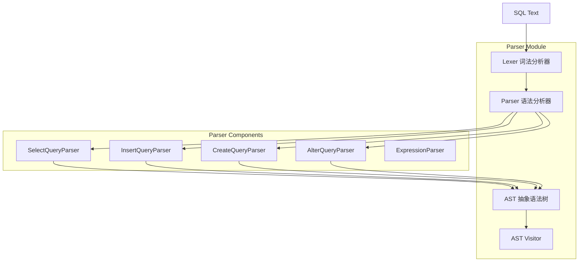

#### 4.1.2 核心解析器实现

```cpp
// src/Parsers/ParserQuery.h
class ParserQuery : public IParserBase
{
protected:
    const char * getName() const override { return "Query"; }
    bool parseImpl(Pos & pos, ASTPtr & node, Expected & expected) override;
    
private:
    ParserQueryWithOutput query_with_output_p;
    ParserInsertQuery insert_p;
    ParserUseQuery use_p;
    ParserSetQuery set_p;
    ParserSystemQuery system_p;
};

// src/Parsers/ParserSelectQuery.cpp - SELECT查询解析核心逻辑
bool ParserSelectQuery::parseImpl(Pos & pos, ASTPtr & node, Expected & expected)
{
    auto select_query = std::make_shared<ASTSelectQuery>();
    node = select_query;
    
    // 解析WITH子句
    if (s_with.ignore(pos, expected))
    {
        if (!ParserExpressionList(false).parse(pos, select_query->with(), expected))
            return false;
    }
    
    // 解析SELECT子句
    if (!s_select.ignore(pos, expected))
        return false;
        
    if (s_distinct.ignore(pos, expected))
        select_query->distinct = true;
        
    if (!ParserExpressionList(false).parse(pos, select_query->select(), expected))
        return false;
    
    // 解析FROM子句
    if (s_from.ignore(pos, expected))
    {
        if (!ParserTablesInSelectQuery().parse(pos, select_query->tables(), expected))
            return false;
    }
    
    // 解析WHERE子句
    if (s_where.ignore(pos, expected))
    {
        if (!ParserExpressionWithOptionalAlias(false).parse(pos, select_query->where(), expected))
            return false;
    }
    
    // 解析GROUP BY子句
    if (s_group_by.ignore(pos, expected))
    {
        if (!ParserExpressionList(false).parse(pos, select_query->groupBy(), expected))
            return false;
    }
    
    // 解析HAVING子句
    if (s_having.ignore(pos, expected))
    {
        if (!ParserExpressionWithOptionalAlias(false).parse(pos, select_query->having(), expected))
            return false;
    }
    
    // 解析ORDER BY子句
    if (s_order_by.ignore(pos, expected))
    {
        if (!ParserOrderByExpressionList().parse(pos, select_query->orderBy(), expected))
            return false;
    }
    
    // 解析LIMIT子句
    if (s_limit.ignore(pos, expected))
    {
        if (!ParserLimit().parse(pos, select_query->limitByLength(), expected))
            return false;
    }
    
    return true;
}
```

#### 4.1.3 AST节点结构

```cpp
// src/Parsers/ASTSelectQuery.h
class ASTSelectQuery : public IAST
{
public:
    enum class Expression : uint8_t
    {
        WITH,
        SELECT,
        TABLES,
        PREWHERE,
        WHERE,
        GROUP_BY,
        HAVING,
        WINDOW,
        ORDER_BY,
        LIMIT_BY_OFFSET,
        LIMIT_BY_LENGTH,
        LIMIT_OFFSET,
        LIMIT_LENGTH,
        SETTINGS
    };
    
    // 查询子句
    ASTPtr with();
    ASTPtr select();
    ASTPtr tables();
    ASTPtr prewhere();
    ASTPtr where();
    ASTPtr groupBy();
    ASTPtr having();
    ASTPtr orderBy();
    ASTPtr limitBy();
    
    // 查询属性
    bool distinct = false;
    bool group_by_with_totals = false;
    bool group_by_with_rollup = false;
    bool group_by_with_cube = false;
    bool group_by_with_grouping_sets = false;
    
    String getID(char) const override { return "SelectQuery"; }
    ASTPtr clone() const override;
    void formatImpl(const FormatSettings & settings, FormatState & state, FormatStateStacked frame) const override;
};
```

### 4.2 查询分析模块（Analyzer）

#### 4.2.1 分析器架构

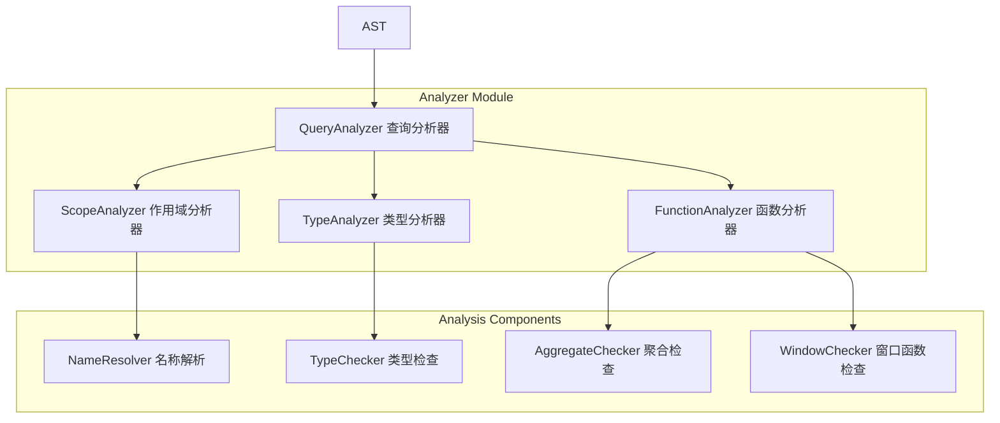

#### 4.2.2 查询分析器核心实现

```cpp
// src/Analyzer/QueryAnalyzer.h
class QueryAnalyzer
{
public:
    QueryAnalyzer(bool only_analyze_ = false) : only_analyze(only_analyze_) {}
    
    void resolve(QueryTreeNodePtr query_tree_node, const QueryTreeNodePtr & table_expression, ContextPtr context);

private:
    // 核心分析方法
    void resolveQuery(const QueryTreeNodePtr & query_node, IdentifierResolveScope & scope);
    void resolveSelectQuery(const QueryTreeNodePtr & select_query_node, IdentifierResolveScope & scope);
    void resolveExpressionNode(QueryTreeNodePtr & node, IdentifierResolveScope & scope, bool allow_lambda_expression, bool allow_table_expression);
    
    // 特定表达式解析
    void resolveFunctionNode(QueryTreeNodePtr & node, IdentifierResolveScope & scope, bool allow_lambda_expression);
    void resolveIdentifierNode(QueryTreeNodePtr & node, IdentifierResolveScope & scope);
    void resolveColumnNode(QueryTreeNodePtr & node, IdentifierResolveScope & scope);
    
    // 类型推导
    void resolveExpressionNodeType(QueryTreeNodePtr & node, IdentifierResolveScope & scope, bool allow_lambda_expression, bool allow_table_expression);
    
    bool only_analyze = false;
    std::unordered_set<QueryTreeNodePtr> resolved_expressions;
};

// src/Analyzer/QueryAnalyzer.cpp - 查询解析核心逻辑
void QueryAnalyzer::resolveSelectQuery(const QueryTreeNodePtr & select_query_node, IdentifierResolveScope & scope)
{
    auto & select_query_node_typed = select_query_node->as<SelectQueryNode &>();
    
    // 1. 解析WITH子句
    if (select_query_node_typed.hasWith())
    {
        for (auto & with_node : select_query_node_typed.getWith().getNodes())
            resolveExpressionNode(with_node, scope, false /*allow_lambda_expression*/, false /*allow_table_expression*/);
    }
    
    // 2. 解析FROM子句
    if (select_query_node_typed.hasJoinTree())
    {
        resolveTableExpression(select_query_node_typed.getJoinTree(), scope);
    }
    
    // 3. 解析WHERE子句
    if (select_query_node_typed.hasWhere())
    {
        resolveExpressionNode(select_query_node_typed.getWhere(), scope, false /*allow_lambda_expression*/, false /*allow_table_expression*/);
    }
    
    // 4. 解析SELECT子句
    for (auto & projection_node : select_query_node_typed.getProjection().getNodes())
    {
        resolveExpressionNode(projection_node, scope, false /*allow_lambda_expression*/, false /*allow_table_expression*/);
    }
    
    // 5. 解析GROUP BY子句
    if (select_query_node_typed.hasGroupBy())
    {
        for (auto & group_by_node : select_query_node_typed.getGroupBy().getNodes())
        {
            resolveExpressionNode(group_by_node, scope, false /*allow_lambda_expression*/, false /*allow_table_expression*/);
        }
    }
    
    // 6. 解析HAVING子句
    if (select_query_node_typed.hasHaving())
    {
        resolveExpressionNode(select_query_node_typed.getHaving(), scope, false /*allow_lambda_expression*/, false /*allow_table_expression*/);
    }
    
    // 7. 解析ORDER BY子句
    if (select_query_node_typed.hasOrderBy())
    {
        for (auto & order_by_node : select_query_node_typed.getOrderBy().getNodes())
        {
            resolveExpressionNode(order_by_node, scope, false /*allow_lambda_expression*/, false /*allow_table_expression*/);
        }
    }
}
```

### 4.3 查询执行模块（Interpreters）

#### 4.3.1 解释器架构图

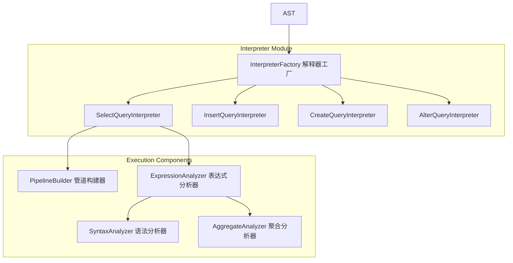

#### 4.3.2 SELECT查询解释器

```cpp
// src/Interpreters/InterpreterSelectQuery.h
class InterpreterSelectQuery : public IInterpreter
{
public:
    InterpreterSelectQuery(
        const ASTPtr & query_ptr_,
        ContextPtr context_,
        const SelectQueryOptions & options_ = {},
        const Names & required_result_column_names_ = {});
    
    BlockIO execute() override;
    QueryPlan buildQueryPlan() override;
    
private:
    // 核心执行方法
    void executeImpl(QueryPlan & query_plan, std::optional<Pipe> prepared_pipe);
    void executeFetchColumns(QueryProcessingStage::Enum processing_stage, QueryPlan & query_plan);
    void executeWhere(QueryPlan & query_plan, const ActionsDAGPtr & expression, bool remove_filter);
    void executeAggregation(QueryPlan & query_plan, const ActionsDAGPtr & expression, bool overflow_row, bool final, InputOrderInfoPtr group_by_info);
    void executeHaving(QueryPlan & query_plan, const ActionsDAGPtr & expression);
    void executeOrderBy(QueryPlan & query_plan, InputOrderInfoPtr sorting_info, UInt64 limit, bool need_merge_sorted_columns);
    void executeLimit(QueryPlan & query_plan);
    void executeProjection(QueryPlan & query_plan, const ActionsDAGPtr & expression);
    
    // 查询分析
    void analyzeExpressions(QueryProcessingStage::Enum from_stage, bool dry_run, const Block & sample_block);
    
    ASTSelectQuery & getSelectQuery() { return query_ptr->as<ASTSelectQuery &>(); }
    
private:
    ASTPtr query_ptr;
    ContextPtr context;
    SelectQueryOptions options;
    
    /// 分析结果
    std::unique_ptr<ExpressionAnalyzer> query_analyzer;
    std::unique_ptr<SyntaxAnalyzer> syntax_analyzer_result;
    
    /// 查询处理阶段
    QueryProcessingStage::Enum from_stage = QueryProcessingStage::FetchColumns;
    
    /// 存储信息
    StoragePtr storage;
    StorageID table_id = StorageID::createEmpty();
    TableLockHolder table_lock;
    
    /// 查询计划
    std::unique_ptr<QueryPlan> query_plan;
};

// src/Interpreters/InterpreterSelectQuery.cpp - 执行逻辑
BlockIO InterpreterSelectQuery::execute()
{
    QueryPlan query_plan;
    buildQueryPlan(query_plan);
    
    auto builder = query_plan.buildQueryPipeline(
        QueryPlanOptimizationSettings::fromContext(context),
        BuildQueryPipelineSettings::fromContext(context));
    
    BlockIO res;
    res.pipeline = std::move(*builder);
    
    return res;
}

void InterpreterSelectQuery::executeImpl(QueryPlan & query_plan, std::optional<Pipe> prepared_pipe)
{
    // 1. 获取数据源
    if (!prepared_pipe.has_value())
        executeFetchColumns(from_stage, query_plan);
    else
        query_plan.addStep(std::make_unique<SourceFromSingleChunk>(prepared_pipe->getHeader(), Chunk()));
    
    // 2. 执行WHERE过滤
    if (expressions.filter_info)
    {
        executeWhere(query_plan, expressions.filter_info->actions, expressions.filter_info->remove_filter_column);
    }
    
    // 3. 执行聚合
    if (expressions.hasAggregation())
    {
        executeAggregation(query_plan, expressions.before_aggregation, expressions.overflow_row, expressions.final, group_by_info);
    }
    
    // 4. 执行HAVING过滤
    if (expressions.hasHaving())
    {
        executeHaving(query_plan, expressions.having);
    }
    
    // 5. 执行ORDER BY排序
    if (expressions.hasOrderBy())
    {
        executeOrderBy(query_plan, sorting_info, query.limitLength(), need_merge_sorted_columns);
    }
    
    // 6. 执行LIMIT限制
    if (query.limitLength())
    {
        executeLimit(query_plan);
    }
    
    // 7. 执行投影
    if (expressions.hasProjection())
    {
        executeProjection(query_plan, expressions.final_projection);
    }
}
```

### 4.4 存储引擎模块（Storages）

#### 4.4.1 存储引擎架构图

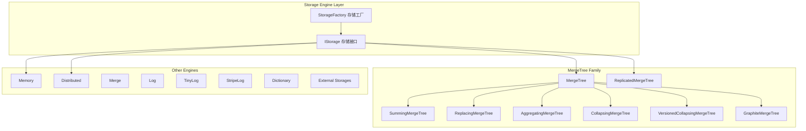

#### 4.4.2 IStorage基础接口

```cpp
// src/Storages/IStorage.h
class IStorage : public std::enable_shared_from_this<IStorage>, public TypePromotion<IStorage>
{
public:
    IStorage(StorageID storage_id_) : storage_id(std::move(storage_id_)) {}
    virtual ~IStorage() = default;
    
    // 基本信息
    virtual std::string getName() const = 0;
    virtual StorageID getStorageID() const { return storage_id; }
    virtual TableLockHolder tryLockTimed(const RWLockImpl::LockTimeout & timeout, RWLockImpl::Type type) const;
    
    // 表结构
    virtual ColumnsDescription getColumns() const { return columns; }
    virtual void setColumns(ColumnsDescription columns_) { columns = std::move(columns_); }
    virtual ConstraintsDescription getConstraints() const { return constraints; }
    
    // 查询处理
    virtual void read(
        QueryPlan & query_plan,
        const Names & column_names,
        const StorageSnapshotPtr & storage_snapshot,
        SelectQueryInfo & query_info,
        ContextPtr context,
        QueryProcessingStage::Enum processed_stage,
        size_t max_block_size,
        size_t num_streams) = 0;
    
    virtual Pipe read(
        const Names & column_names,
        const StorageSnapshotPtr & storage_snapshot,
        SelectQueryInfo & query_info,
        ContextPtr context,
        QueryProcessingStage::Enum processed_stage,
        size_t max_block_size,
        size_t num_streams);
    
    // 数据写入
    virtual SinkToStoragePtr write(const ASTPtr & query, const StorageMetadataPtr & metadata_snapshot, ContextPtr context, bool async_insert);
    
    // 表操作
    virtual void drop() {}
    virtual void truncate(const ASTPtr & query, const StorageMetadataPtr & metadata_snapshot, ContextPtr context, TableExclusiveLockHolder & lock);
    virtual void alter(const AlterCommands & params, ContextPtr context, AlterLockHolder & alter_lock_holder);
    
    // 分区操作
    virtual void dropPartition(const ASTPtr & partition, bool detach, ContextPtr context);
    virtual void attachPartition(const ASTPtr & partition, const StorageMetadataPtr & metadata_snapshot, bool part, ContextPtr context);
    
    // 优化操作
    virtual void optimize(const ASTPtr & query, const StorageMetadataPtr & metadata_snapshot, const ASTPtr & partition, bool final, bool deduplicate, const Names & deduplicate_by_columns, ContextPtr context);
    
protected:
    StorageID storage_id;
    ColumnsDescription columns;
    ConstraintsDescription constraints;
    String comment;
};
```

#### 4.4.3 MergeTree存储引擎核心实现

```cpp
// src/Storages/MergeTree/MergeTreeData.h
class MergeTreeData : public IStorage
{
public:
    struct DataPart
    {
        String name;
        MergeTreePartInfo info;
        size_t bytes_on_disk = 0;
        size_t rows_count = 0;
        time_t modification_time = 0;
        
        /// 数据部分的列和索引
        NamesAndTypesList columns;
        SerializationInfoByName serialization_infos;
        
        /// 主键和排序键
        size_t primary_key_size = 0;
        Checksums checksums;
        
        /// 分区信息
        String partition_id;
        MergeTreePartition partition;
        
        /// 数据部分状态
        enum State
        {
            Temporary,       /// 临时状态，正在写入
            PreCommitted,    /// 预提交状态
            Committed,       /// 已提交状态
            Outdated,        /// 过时状态，等待删除
            Deleting,        /// 正在删除
            DeleteOnDestroy  /// 析构时删除
        };
        
        State state = Temporary;
    };
    
    using DataPartPtr = std::shared_ptr<const DataPart>;
    using DataPartsVector = std::vector<DataPartPtr>;
    
    // 数据部分管理
    DataPartPtr getPartIfExists(const String & part_name, const DataPartStates & valid_states);
    DataPartsVector getDataPartsVector(const DataPartStates & affordable_states = DataPartStates({DataPartState::Committed})) const;
    
    // 合并操作
    bool selectPartsToMerge(FutureMergedMutatedPart & future_part, bool aggressive, size_t max_total_size_to_merge, const AllowedMergingPredicate & can_merge, String * out_disable_reason = nullptr);
    
    // 数据写入
    MutableDataPartPtr createPart(const String & name, const DataPartType & type, const MergeTreePartInfo & part_info, const VolumePtr & volume, const String & relative_path = "");
    
    // 数据读取
    void read(QueryPlan & query_plan, const Names & column_names, const StorageSnapshotPtr & storage_snapshot, SelectQueryInfo & query_info, ContextPtr context, QueryProcessingStage::Enum processed_stage, size_t max_block_size, size_t num_streams) override;
    
private:
    // 数据部分集合（使用读写锁保护）
    mutable std::shared_mutex data_parts_mutex;
    DataPartsIndexes data_parts_indexes;
    DataPartsVector data_parts_by_info;
    DataPartsVector data_parts_by_state_and_info;
    
    // 后台任务
    BackgroundSchedulePool::TaskHolder background_operations_assignee;
    BackgroundSchedulePool::TaskHolder background_moves_assignee;
    
    // 合并选择器
    std::unique_ptr<IMergeSelector> merge_selector;
    std::unique_ptr<ITTLMergeSelector> ttl_merge_selector;
    
    // 设置
    MergeTreeSettings storage_settings;
    
    // 主键和排序键
    KeyDescription primary_key;
    KeyDescription sorting_key;
    KeyDescription partition_key;
    KeyDescription sampling_key;
};

// src/Storages/MergeTree/MergeTreeData.cpp - 数据读取实现
void MergeTreeData::read(QueryPlan & query_plan, const Names & column_names, const StorageSnapshotPtr & storage_snapshot, SelectQueryInfo & query_info, ContextPtr context, QueryProcessingStage::Enum processed_stage, size_t max_block_size, size_t num_streams)
{
    // 1. 获取需要读取的数据部分
    auto parts = getDataPartsVector();
    
    // 2. 根据查询条件过滤数据部分
    auto filtered_parts = filterPartsByPrimaryKey(parts, query_info, context);
    
    // 3. 创建读取管道
    Pipes pipes;
    
    for (const auto & part : filtered_parts)
    {
        auto source = std::make_shared<MergeTreeSequentialSource>(
            *this, storage_snapshot, part, column_names, max_block_size, context);
        pipes.emplace_back(std::move(source));
    }
    
    // 4. 合并管道
    auto pipe = Pipe::unitePipes(std::move(pipes));
    
    // 5. 添加到查询计划
    auto read_from_merge_tree = std::make_unique<ReadFromMergeTree>(std::move(pipe));
    query_plan.addStep(std::move(read_from_merge_tree));
}
```

### 4.5 处理器模块（Processors）

#### 4.5.1 处理器架构图

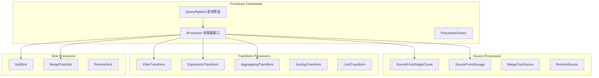

#### 4.5.2 IProcessor基础接口

```cpp
// src/Processors/IProcessor.h
class IProcessor
{
public:
    enum class Status
    {
        NeedData,     /// 需要更多输入数据
        PortFull,     /// 输出端口已满
        Finished,     /// 处理完成
        Ready,        /// 准备处理
        Async,        /// 异步处理中
        ExpandPipeline /// 需要扩展管道
    };
    
    IProcessor() = default;
    virtual ~IProcessor() = default;
    
    // 核心处理方法
    virtual Status prepare() = 0;
    virtual void work();
    virtual Chunk generate();
    virtual void consume(Chunk chunk);
    
    // 端口管理
    virtual InputPorts & getInputs() { return inputs; }
    virtual OutputPorts & getOutputs() { return outputs; }
    
    // 处理器信息
    virtual String getName() const = 0;
    virtual String getDescription() const { return getName(); }
    
    // 资源管理
    virtual void setResourcesProvider(ResourcesProviderPtr resources_provider_) { resources_provider = std::move(resources_provider_); }
    
protected:
    InputPorts inputs;
    OutputPorts outputs;
    ResourcesProviderPtr resources_provider;
    
    // 辅助方法
    void addInputPort(DataTypePtr type, bool is_main = true);
    void addOutputPort(DataTypePtr type, bool is_main = true);
};

// src/Processors/ISimpleTransform.h - 简单变换处理器基类
class ISimpleTransform : public IProcessor
{
public:
    ISimpleTransform(Block input_header, Block output_header, bool skip_empty_chunks_ = true);
    
    Status prepare() override final;
    void work() override final;
    
protected:
    // 子类需要实现的核心方法
    virtual void transform(Chunk & chunk) = 0;
    
    // 可选的钩子方法
    virtual void onConsume(Chunk chunk) { transform(chunk); }
    virtual void onGenerate() {}
    virtual void onFinish() {}
    
private:
    InputPort & input;
    OutputPort & output;
    
    Chunk current_chunk;
    bool has_input = false;
    bool has_output = false;
    bool finished_input = false;
    bool finished_output = false;
    
    const bool skip_empty_chunks = true;
};

// 具体的变换处理器实现示例
class FilterTransform : public ISimpleTransform
{
public:
    FilterTransform(const Block & header_, ExpressionActionsPtr expression_, String filter_column_name_, bool remove_filter_column_);
    
    String getName() const override { return "FilterTransform"; }
    
protected:
    void transform(Chunk & chunk) override;
    
private:
    ExpressionActionsPtr expression;
    String filter_column_name;
    bool remove_filter_column;
    
    size_t filter_column_position = 0;
};

// src/Processors/Transforms/FilterTransform.cpp - 过滤变换实现
void FilterTransform::transform(Chunk & chunk)
{
    size_t num_rows_before_filtration = chunk.getNumRows();
    auto columns = chunk.detachColumns();
    
    // 执行表达式计算
    Block block = getInputPort().getHeader().cloneWithColumns(columns);
    expression->execute(block);
    
    // 获取过滤列
    const auto & filter_column = block.getByName(filter_column_name);
    ConstantFilterDescription constant_filter_description(*filter_column.column);
    
    if (constant_filter_description.always_false)
    {
        // 如果过滤条件总是false，返回空chunk
        chunk.clear();
        return;
    }
    
    if (constant_filter_description.always_true)
    {
        // 如果过滤条件总是true，移除过滤列（如果需要）
        if (remove_filter_column)
            block.erase(filter_column_name);
        chunk.setColumns(block.getColumns(), num_rows_before_filtration);
        return;
    }
    
    // 应用过滤条件
    FilterDescription filter_description(*filter_column.column);
    
    for (size_t i = 0; i < block.columns(); ++i)
    {
        if (remove_filter_column && block.getByPosition(i).name == filter_column_name)
            continue;
            
        block.safeGetByPosition(i).column = block.safeGetByPosition(i).column->filter(*filter_description.data, -1);
    }
    
    if (remove_filter_column)
        block.erase(filter_column_name);
        
    chunk.setColumns(block.getColumns(), block.rows());
}
```

---

## 关键数据结构与继承关系

### 5.1 核心数据结构类图

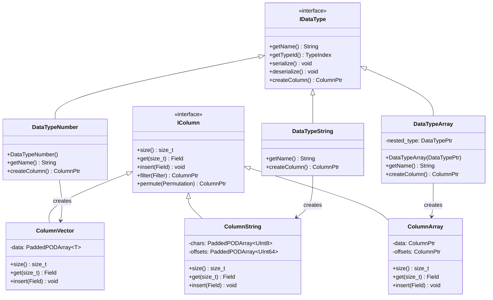

### 5.2 存储引擎继承关系

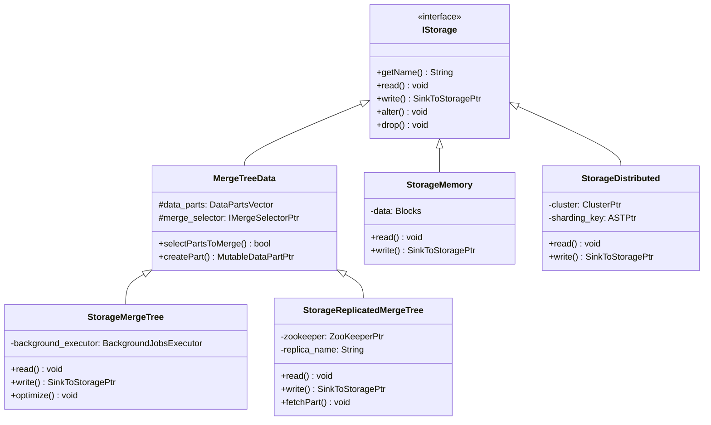

### 5.3 查询处理类继承关系

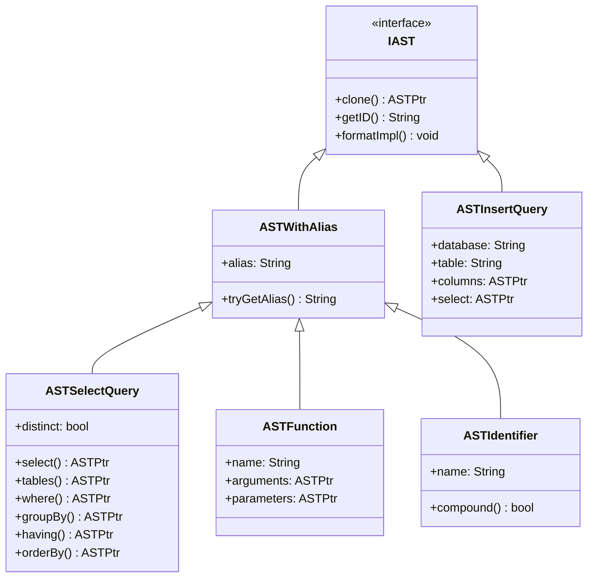

### 5.4 关键数据结构详细说明

#### 5.4.1 Block数据结构

```cpp
// src/Core/Block.h
class Block
{
private:
    using Container = ColumnsWithTypeAndName;
    Container data;
    
public:
    Block() = default;
    Block(std::initializer_list<ColumnWithTypeAndName> il);
    Block(const ColumnsWithTypeAndName & data_);
    
    // 基本操作
    bool operator==(const Block & other) const;
    bool operator!=(const Block & other) const { return !(*this == other); }
    
    // 列操作
    void insert(size_t position, ColumnWithTypeAndName elem);
    void insert(ColumnWithTypeAndName elem);
    void insertUnique(ColumnWithTypeAndName elem);
    void erase(const std::set<size_t> & positions);
    void erase(size_t position);
    void erase(const String & name);
    
    // 访问方法
    ColumnWithTypeAndName & getByPosition(size_t position) { return data[position]; }
    const ColumnWithTypeAndName & getByPosition(size_t position) const { return data[position]; }
    ColumnWithTypeAndName & getByName(const String & name);
    const ColumnWithTypeAndName & getByName(const String & name) const;
    
    // 属性
    size_t rows() const;
    size_t columns() const { return data.size(); }
    size_t bytes() const;
    size_t allocatedBytes() const;
    
    // 转换操作
    Block cloneEmpty() const;
    Block cloneWithColumns(const Columns & columns) const;
    Block cloneWithoutColumns() const;
    Block cloneResized(size_t rows) const;
    
    // 工具方法
    void clear();
    void swap(Block & other) noexcept;
    void updateHash(SipHash & hash) const;
    
    // 调试
    void dumpStructure() const;
    String dumpNames() const;
    String dumpIndex() const;
};
```

#### 5.4.2 Chunk数据结构

```cpp
// src/Core/Chunk.h
class Chunk
{
private:
    Columns columns;
    size_t num_rows = 0;
    ChunkInfoPtr chunk_info;
    
public:
    Chunk() = default;
    Chunk(Columns columns_, size_t num_rows_);
    Chunk(Columns columns_, size_t num_rows_, ChunkInfoPtr chunk_info_);
    Chunk(MutableColumns columns_, size_t num_rows_);
    Chunk(MutableColumns columns_, size_t num_rows_, ChunkInfoPtr chunk_info_);
    
    // 基本操作
    Chunk clone() const;
    void swap(Chunk & other) noexcept;
    void clear();
    
    // 访问方法
    const Columns & getColumns() const { return columns; }
    void setColumns(Columns columns_, size_t num_rows_);
    void setColumns(MutableColumns columns_, size_t num_rows_);
    Columns detachColumns();
    MutableColumns mutateColumns();
    
    // 属性
    size_t getNumColumns() const { return columns.size(); }
    size_t getNumRows() const { return num_rows; }
    bool empty() const { return num_rows == 0; }
    size_t bytes() const;
    size_t allocatedBytes() const;
    
    // 信息管理
    const ChunkInfoPtr & getChunkInfo() const { return chunk_info; }
    void setChunkInfo(ChunkInfoPtr chunk_info_) { chunk_info = std::move(chunk_info_); }
    
    // 操作方法
    void addColumn(ColumnPtr column);
    void addColumn(size_t position, ColumnPtr column);
    void erase(size_t position);
    UInt64 hash() const;
};
```

#### 5.4.3 DataPart数据结构

```cpp
// src/Storages/MergeTree/IMergeTreeDataPart.h
class IMergeTreeDataPart : public std::enable_shared_from_this<IMergeTreeDataPart>
{
public:
    enum class State
    {
        Temporary,       /// 临时状态，正在写入
        PreCommitted,    /// 预提交状态  
        Committed,       /// 已提交状态
        Outdated,        /// 过时状态，等待删除
        Deleting,        /// 正在删除
        DeleteOnDestroy  /// 析构时删除
    };
    
    enum class Type
    {
        WIDE,           /// 宽格式（每列一个文件）
        COMPACT,        /// 紧凑格式（所有列在一个文件中）
        IN_MEMORY,      /// 内存格式
        UNKNOWN         /// 未知格式
    };
    
    struct ColumnSize
    {
        size_t marks = 0;
        size_t data_compressed = 0;
        size_t data_uncompressed = 0;
        
        void addToTotalSize(ColumnSize & total_size) const;
    };
    
    using ColumnSizeByName = std::unordered_map<std::string, ColumnSize>;
    using ColumnSizesDescriptor = std::vector<ColumnSize>;
    
protected:
    // 基本信息
    String name;
    MergeTreePartInfo info;
    const MergeTreeData & storage;
    const String relative_path;
    VolumePtr volume;
    
    // 元数据
    mutable ColumnsDescription columns;
    mutable SerializationInfoByName serialization_infos;
    mutable VersionMetadata version;
    
    // 统计信息
    size_t rows_count = 0;
    size_t bytes_on_disk = 0;
    mutable ColumnSizeByName columns_sizes;
    
    // 索引信息
    mutable IndexGranularity index_granularity;
    size_t index_granularity_bytes = 0;
    
    // 分区信息
    String partition_id;
    MergeTreePartition partition;
    
    // 校验和
    mutable Checksums checksums;
    
    // 状态管理
    mutable std::atomic<State> state{State::Temporary};
    mutable std::mutex state_mutex;
    
public:
    // 构造函数
    IMergeTreeDataPart(
        const MergeTreeData & storage_,
        const String & name_,
        const VolumePtr & volume_,
        const std::optional<String> & relative_path_ = {});
    
    virtual ~IMergeTreeDataPart();
    
    // 基本信息访问
    const String & getName() const { return name; }
    const MergeTreePartInfo & getInfo() const { return info; }
    String getFullPath() const;
    String getFullRelativePath() const;
    
    // 状态管理
    State getState() const;
    void setState(State new_state) const;
    bool isStoredOnDisk() const;
    bool isStoredOnRemoteDisk() const;
    
    // 数据访问
    virtual std::shared_ptr<IMergeTreeReader> getReader(
        const NamesAndTypesList & columns_to_read,
        const StorageMetadataPtr & metadata_snapshot,
        const MarkRanges & mark_ranges,
        UncompressedCache * uncompressed_cache,
        MarkCache * mark_cache,
        const MergeTreeReaderSettings & reader_settings,
        const ValueSizeMap & avg_value_size_hints = {},
        const ReadBufferFromFileBase::ProfileCallback & profile_callback = {}) const = 0;
    
    virtual std::shared_ptr<IMergeTreeDataPartWriter> getWriter(
        const NamesAndTypesList & columns_list,
        const StorageMetadataPtr & metadata_snapshot,
        const std::vector<MergeTreeIndexPtr> & indices_to_recalc,
        const CompressionCodecPtr & default_codec_,
        const MergeTreeWriterSettings & writer_settings,
        const MergeTreeIndexGranularity & computed_index_granularity) const = 0;
    
    // 元数据操作
    void loadColumnsChecksumsIndexes(bool require_columns_checksums, bool check_consistency);
    void loadIndex();
    void loadPartitionAndMinMaxIndex();
    void loadChecksums(bool require);
    void loadRowsCount();
    
    // 校验操作
    bool checkAllTTLCalculated(const StorageMetadataPtr & metadata_snapshot) const;
    void checkConsistency(bool require_part_metadata) const;
    
    // 大小计算
    void calculateEachColumnSizes(ColumnSizeByName & each_columns_size, ColumnSize & total_size) const;
    ColumnSize getColumnSize(const String & column_name) const;
    
    // 工具方法
    String getUniqueId() const;
    void remove() const;
    void renameTo(const String & new_relative_path, bool remove_new_dir_if_exists) const;
    
    // 序列化
    void serializePartitionAndMinMaxIndex(WriteBuffer & out) const;
    void deserializePartitionAndMinMaxIndex(ReadBuffer & in);
};
```

---

## 实战经验与最佳实践

### 6.1 性能优化经验

#### 6.1.1 查询优化技巧

**1. 合理使用主键和排序键**
```sql
-- 好的实践：根据查询模式设计主键
CREATE TABLE events (
    date Date,
    user_id UInt32,
    event_type String,
    value UInt64
) ENGINE = MergeTree()
ORDER BY (date, user_id, event_type)  -- 按查询频率排序
PARTITION BY toYYYYMM(date);

-- 避免：主键列过多或顺序不当
CREATE TABLE events_bad (
    date Date,
    user_id UInt32,
    event_type String,
    value UInt64
) ENGINE = MergeTree()
ORDER BY (event_type, value, user_id, date)  -- 低选择性列在前
```

**2. 利用投影优化查询**
```sql
-- 创建投影以优化聚合查询
ALTER TABLE events ADD PROJECTION daily_stats (
    SELECT date, event_type, count(), sum(value)
    GROUP BY date, event_type
);

-- 查询将自动使用投影
SELECT date, event_type, count(), sum(value)
FROM events
WHERE date >= '2023-01-01'
GROUP BY date, event_type;
```

**3. 合理使用物化视图**
```sql
-- 创建物化视图预聚合数据
CREATE MATERIALIZED VIEW events_daily_mv
ENGINE = SummingMergeTree()
ORDER BY (date, event_type)
AS SELECT
    date,
    event_type,
    count() as cnt,
    sum(value) as total_value
FROM events
GROUP BY date, event_type;
```

#### 6.1.2 存储优化策略

**1. 选择合适的存储引擎**
```cpp
// 高频写入场景：使用ReplicatedMergeTree
CREATE TABLE high_write_table (
    timestamp DateTime,
    data String
) ENGINE = ReplicatedMergeTree('/clickhouse/tables/{shard}/high_write_table', '{replica}')
ORDER BY timestamp
SETTINGS merge_with_ttl_timeout = 3600;

// 实时查询场景：使用Memory引擎
CREATE TABLE realtime_cache (
    key String,
    value String,
    expire_time DateTime
) ENGINE = Memory;

// 历史数据场景：使用MergeTree + TTL
CREATE TABLE historical_data (
    date Date,
    data String
) ENGINE = MergeTree()
ORDER BY date
TTL date + INTERVAL 1 YEAR;
```

**2. 压缩算法选择**
```sql
-- 根据数据特性选择压缩算法
CREATE TABLE logs (
    timestamp DateTime CODEC(DoubleDelta, LZ4),  -- 时间序列用DoubleDelta
    level String CODEC(LowCardinality),          -- 低基数用LowCardinality
    message String CODEC(ZSTD(3)),               -- 文本用ZSTD
    counter UInt64 CODEC(Gorilla, LZ4)           -- 数值用Gorilla
) ENGINE = MergeTree()
ORDER BY timestamp;
```

#### 6.1.3 内存管理优化

**1. 查询内存限制**
```sql
-- 设置查询级别内存限制
SET max_memory_usage = 10000000000;  -- 10GB
SET max_bytes_before_external_group_by = 5000000000;  -- 5GB后使用外部排序

-- 设置用户级别内存限制
CREATE USER analyst SETTINGS max_memory_usage = 20000000000;
```

**2. 缓存配置优化**
```xml
<!-- config.xml -->
<clickhouse>
    <mark_cache_size>5368709120</mark_cache_size>  <!-- 5GB -->
    <uncompressed_cache_size>8589934592</uncompressed_cache_size>  <!-- 8GB -->
    <compiled_expression_cache_size>134217728</compiled_expression_cache_size>  <!-- 128MB -->
</clickhouse>
```

### 6.2 分布式部署最佳实践

#### 6.2.1 集群配置

```xml
<!-- config.xml - 集群配置 -->
<clickhouse>
    <remote_servers>
        <production_cluster>
            <shard>
                <replica>
                    <host>ch-node-1</host>
                    <port>9000</port>
                    <user>default</user>
                    <password></password>
                </replica>
                <replica>
                    <host>ch-node-2</host>
                    <port>9000</port>
                    <user>default</user>
                    <password></password>
                </replica>
            </shard>
            <shard>
                <replica>
                    <host>ch-node-3</host>
                    <port>9000</port>
                    <user>default</user>
                    <password></password>
                </replica>
                <replica>
                    <host>ch-node-4</host>
                    <port>9000</port>
                    <user>default</user>
                    <password></password>
                </replica>
            </shard>
        </production_cluster>
    </remote_servers>
    
    <zookeeper>
        <node>
            <host>zk-1</host>
            <port>2181</port>
        </node>
        <node>
            <host>zk-2</host>
            <port>2181</port>
        </node>
        <node>
            <host>zk-3</host>
            <port>2181</port>
        </node>
    </zookeeper>
</clickhouse>
```

#### 6.2.2 分片策略

```sql
-- 创建分布式表
CREATE TABLE events_distributed AS events
ENGINE = Distributed(production_cluster, default, events, rand());

-- 基于哈希的分片
CREATE TABLE events_distributed_hash AS events
ENGINE = Distributed(production_cluster, default, events, cityHash64(user_id));

-- 基于时间的分片
CREATE TABLE events_distributed_time AS events
ENGINE = Distributed(production_cluster, default, events, toYYYYMM(date));
```

### 6.3 监控与运维

#### 6.3.1 关键监控指标

```sql
-- 查询性能监控
SELECT
    query_duration_ms,
    query,
    user,
    initial_user,
    memory_usage,
    read_rows,
    read_bytes,
    result_rows,
    result_bytes
FROM system.query_log
WHERE event_date = today()
    AND query_duration_ms > 10000  -- 超过10秒的查询
ORDER BY query_duration_ms DESC
LIMIT 10;

-- 表大小监控
SELECT
    database,
    table,
    formatReadableSize(sum(bytes_on_disk)) as size,
    sum(rows) as rows,
    count() as parts
FROM system.parts
WHERE active = 1
GROUP BY database, table
ORDER BY sum(bytes_on_disk) DESC;

-- 复制延迟监控
SELECT
    database,
    table,
    replica_name,
    absolute_delay,
    queue_size,
    inserts_in_queue,
    merges_in_queue
FROM system.replicas
WHERE absolute_delay > 60;  -- 延迟超过60秒
```

#### 6.3.2 常见问题诊断

**1. 查询性能问题**
```sql
-- 分析慢查询
SELECT
    normalized_query_hash,
    count() as query_count,
    avg(query_duration_ms) as avg_duration,
    max(query_duration_ms) as max_duration,
    avg(memory_usage) as avg_memory,
    any(query) as sample_query
FROM system.query_log
WHERE event_date >= today() - 1
    AND type = 'QueryFinish'
    AND query_duration_ms > 5000
GROUP BY normalized_query_hash
ORDER BY avg_duration DESC
LIMIT 10;

-- 检查表统计信息
SELECT
    database,
    table,
    partition,
    rows,
    bytes_on_disk,
    data_compressed_bytes,
    data_uncompressed_bytes,
    compression_ratio
FROM system.parts
WHERE database = 'your_database' AND table = 'your_table'
ORDER BY partition;
```

**2. 内存使用问题**
```sql
-- 监控内存使用
SELECT
    event_time,
    CurrentMetric_MemoryTracking,
    CurrentMetric_MemoryTrackingForMerges,
    CurrentMetric_MemoryTrackingInBackgroundProcessingPool
FROM system.metric_log
WHERE event_date = today()
ORDER BY event_time DESC
LIMIT 100;

-- 检查大查询内存使用
SELECT
    query_id,
    user,
    memory_usage,
    peak_memory_usage,
    query
FROM system.processes
WHERE memory_usage > 1000000000  -- 超过1GB内存的查询
ORDER BY memory_usage DESC;
```

### 6.4 开发调试技巧

#### 6.4.1 SQL调试

```sql
-- 使用EXPLAIN分析查询计划
EXPLAIN PLAN SELECT * FROM events WHERE date = '2023-01-01';

-- 使用EXPLAIN PIPELINE分析执行管道
EXPLAIN PIPELINE SELECT count() FROM events GROUP BY user_id;

-- 使用EXPLAIN ESTIMATE分析查询成本
EXPLAIN ESTIMATE SELECT * FROM events WHERE user_id = 12345;

-- 开启查询日志
SET send_logs_level = 'debug';
SELECT * FROM events LIMIT 10;
```

#### 6.4.2 性能分析

```sql
-- 启用查询性能分析
SET allow_introspection_functions = 1;
SET query_profiler_real_time_period_ns = 10000000;  -- 10ms
SET query_profiler_cpu_time_period_ns = 10000000;   -- 10ms

-- 查看查询执行统计
SELECT
    ProfileEvents.Names,
    ProfileEvents.Values
FROM system.query_log
ARRAY JOIN ProfileEvents.Names, ProfileEvents.Values
WHERE query_id = 'your_query_id';
```

#### 6.4.3 源码调试技巧

```cpp
// 1. 使用LOG_DEBUG进行调试输出
LOG_DEBUG(log, "Processing query: {}, context: {}", query, context->getCurrentQueryId());

// 2. 使用断点调试关键路径
void InterpreterSelectQuery::executeImpl(QueryPlan & query_plan, std::optional<Pipe> prepared_pipe)
{
    // 在关键位置设置断点
    LOG_DEBUG(log, "Starting query execution for query_id: {}", context->getCurrentQueryId());
    
    // 调试查询计划构建
    if (expressions.hasAggregation())
    {
        LOG_DEBUG(log, "Query has aggregation, building aggregation step");
        executeAggregation(query_plan, expressions.before_aggregation, expressions.overflow_row, expressions.final, group_by_info);
    }
}

// 3. 使用性能计时器
Stopwatch watch;
// ... 执行代码 ...
LOG_DEBUG(log, "Operation completed in {} ms", watch.elapsedMilliseconds());

// 4. 内存使用监控
auto initial_memory = getCurrentMemoryUsage();
// ... 执行代码 ...
auto final_memory = getCurrentMemoryUsage();
LOG_DEBUG(log, "Memory usage increased by {} bytes", final_memory - initial_memory);
```

### 6.5 扩展开发指南

#### 6.5.1 自定义函数开发

```cpp
// 1. 实现IFunction接口
class FunctionCustomExample : public IFunction
{
public:
    static constexpr auto name = "customExample";
    static FunctionPtr create(ContextPtr) { return std::make_shared<FunctionCustomExample>(); }
    
    String getName() const override { return name; }
    size_t getNumberOfArguments() const override { return 2; }
    
    DataTypePtr getReturnTypeImpl(const DataTypes & arguments) const override
    {
        if (!isString(arguments[0]) || !isNumber(arguments[1]))
            throw Exception("Invalid argument types", ErrorCodes::ILLEGAL_TYPE_OF_ARGUMENT);
        return std::make_shared<DataTypeString>();
    }
    
    ColumnPtr executeImpl(const ColumnsWithTypeAndName & arguments, const DataTypePtr &, size_t input_rows_count) const override
    {
        const auto & col_str = arguments[0].column;
        const auto & col_num = arguments[1].column;
        
        auto result_column = ColumnString::create();
        
        for (size_t i = 0; i < input_rows_count; ++i)
        {
            String str_val = col_str->getDataAt(i).toString();
            UInt64 num_val = col_num->getUInt(i);
            
            String result = str_val + "_" + toString(num_val);
            result_column->insertData(result.data(), result.size());
        }
        
        return result_column;
    }
};

// 2. 注册函数
void registerFunctionCustomExample(FunctionFactory & factory)
{
    factory.registerFunction<FunctionCustomExample>();
}
```

#### 6.5.2 自定义存储引擎开发

```cpp
// 1. 继承IStorage实现自定义存储引擎
class StorageCustom : public IStorage
{
public:
    StorageCustom(const StorageID & storage_id_, ColumnsDescription columns_description_)
        : IStorage(storage_id_), columns_description(std::move(columns_description_))
    {
        setColumns(columns_description);
    }
    
    std::string getName() const override { return "Custom"; }
    
    void read(QueryPlan & query_plan, const Names & column_names, const StorageSnapshotPtr & storage_snapshot,
              SelectQueryInfo & query_info, ContextPtr context, QueryProcessingStage::Enum processed_stage,
              size_t max_block_size, size_t num_streams) override
    {
        // 实现数据读取逻辑
        auto source = std::make_shared<CustomSource>(column_names, max_block_size);
        Pipe pipe(source);
        
        auto read_step = std::make_unique<ReadFromStorageStep>(std::move(pipe), getName());
        query_plan.addStep(std::move(read_step));
    }
    
    SinkToStoragePtr write(const ASTPtr &, const StorageMetadataPtr & metadata_snapshot, ContextPtr context, bool) override
    {
        // 实现数据写入逻辑
        return std::make_shared<CustomSink>(*this, metadata_snapshot, context);
    }
    
private:
    ColumnsDescription columns_description;
};

// 2. 注册存储引擎
void registerStorageCustom(StorageFactory & factory)
{
    factory.registerStorage("Custom", [](const StorageFactory::Arguments & args)
    {
        return StorageCustom::create(args.table_id, args.columns);
    });
}
```

---

## 核心模块深度分析

### 7.1 SQL解析模块（Parsers）深度剖析

#### 7.1.1 解析器架构图

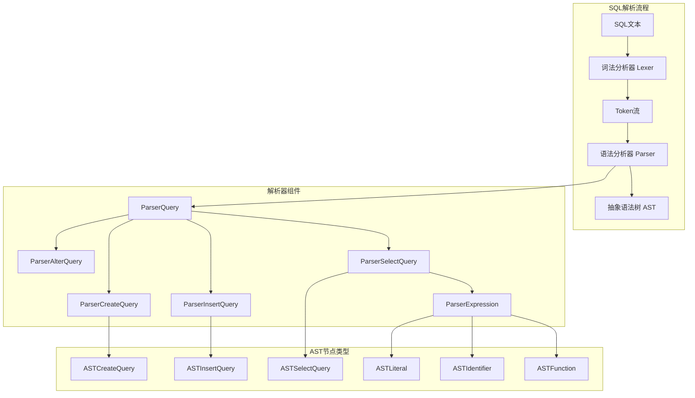

#### 7.1.2 核心解析函数实现

```cpp
// src/Parsers/parseQuery.cpp - 主解析入口函数
ASTPtr tryParseQuery(
    IParser & parser,
    const char * & _out_query_end,
    const char * all_queries_end,
    std::string & out_error_message,
    bool hilite,
    const std::string & query_description,
    bool allow_multi_statements,
    size_t max_query_size,
    size_t max_parser_depth,
    size_t max_parser_backtracks,
    bool skip_insignificant)
{
    const char * query_begin = _out_query_end;
    
    /// 1. 词法分析 - 将SQL文本转换为Token流
    Tokens tokens(query_begin, all_queries_end, max_query_size, skip_insignificant);
    IParser::Pos token_iterator(tokens, 
        static_cast<uint32_t>(max_parser_depth), 
        static_cast<uint32_t>(max_parser_backtracks));

    /// 2. 检查空查询
    if (token_iterator->isEnd() || token_iterator->type == TokenType::Semicolon)
    {
        out_error_message = "Empty query";
        _out_query_end = token_iterator->begin;
        return nullptr;
    }

    Expected expected;

    /// 3. 快速检查词法错误（优化：避免复杂回溯）
    IParser::Pos lookahead(token_iterator);
    if (!ParserKeyword(Keyword::INSERT_INTO).ignore(lookahead))
    {
        while (lookahead->type != TokenType::Semicolon && 
               lookahead->type != TokenType::EndOfStream)
        {
            if (lookahead->isError())
            {
                out_error_message = getLexicalErrorMessage(
                    query_begin, all_queries_end, *lookahead, hilite, query_description);
                return nullptr;
            }
            ++lookahead;
        }
        tokens.reset();
    }

    /// 4. 语法分析 - 构建AST
    ASTPtr res;
    const bool parse_res = parser.parse(token_iterator, res, expected);
    const auto last_token = token_iterator.max();
    _out_query_end = last_token.end;

    /// 5. 检查AST深度
    if (res && max_parser_depth)
        res->checkDepth(max_parser_depth);

    /// 6. 处理INSERT语句的特殊情况（内联数据）
    if (res && getInsertData(res))
        return res;

    /// 7. 词法错误检查
    if (last_token.isError())
    {
        out_error_message = getLexicalErrorMessage(
            query_begin, all_queries_end, last_token, hilite, query_description);
        return nullptr;
    }

    /// 8. 括号匹配检查
    UnmatchedParentheses unmatched_parens = checkUnmatchedParentheses(TokenIterator(tokens));
    if (!unmatched_parens.empty())
    {
        out_error_message = getUnmatchedParenthesesErrorMessage(
            query_begin, all_queries_end, unmatched_parens, hilite, query_description);
        return nullptr;
    }

    /// 9. 语法错误处理
    if (!parse_res)
    {
        out_error_message = getSyntaxErrorMessage(
            query_begin, all_queries_end, last_token, expected, hilite, query_description);
        return nullptr;
    }

    return res;
}

// src/Parsers/ParserSelectQuery.cpp - SELECT查询解析器
bool ParserSelectQuery::parseImpl(Pos & pos, ASTPtr & node, Expected & expected)
{
    auto select_query = std::make_shared<ASTSelectQuery>();
    node = select_query;

    /// 1. 解析WITH子句
    if (s_with.ignore(pos, expected))
    {
        if (!ParserExpressionList(false).parse(pos, select_query->with(), expected))
            return false;
    }

    /// 2. 解析SELECT关键字
    if (!s_select.ignore(pos, expected))
        return false;

    /// 3. 解析DISTINCT修饰符
    if (s_distinct.ignore(pos, expected))
        select_query->distinct = true;

    /// 4. 解析选择列表
    if (!ParserExpressionList(false).parse(pos, select_query->select(), expected))
        return false;

    /// 5. 解析FROM子句
    if (s_from.ignore(pos, expected))
    {
        if (!ParserTablesInSelectQuery().parse(pos, select_query->tables(), expected))
            return false;
    }

    /// 6. 解析PREWHERE子句（ClickHouse特有）
    if (s_prewhere.ignore(pos, expected))
    {
        if (!ParserExpressionWithOptionalAlias(false).parse(pos, select_query->prewhere(), expected))
            return false;
    }

    /// 7. 解析WHERE子句
    if (s_where.ignore(pos, expected))
    {
        if (!ParserExpressionWithOptionalAlias(false).parse(pos, select_query->where(), expected))
            return false;
    }

    /// 8. 解析GROUP BY子句
    if (s_group_by.ignore(pos, expected))
    {
        if (!ParserExpressionList(false).parse(pos, select_query->groupBy(), expected))
            return false;

        /// 解析WITH ROLLUP/CUBE/TOTALS修饰符
        if (s_with_rollup.ignore(pos, expected))
            select_query->group_by_with_rollup = true;
        else if (s_with_cube.ignore(pos, expected))
            select_query->group_by_with_cube = true;
        else if (s_with_totals.ignore(pos, expected))
            select_query->group_by_with_totals = true;
    }

    /// 9. 解析HAVING子句
    if (s_having.ignore(pos, expected))
    {
        if (!ParserExpressionWithOptionalAlias(false).parse(pos, select_query->having(), expected))
            return false;
    }

    /// 10. 解析WINDOW子句
    if (s_window.ignore(pos, expected))
    {
        if (!ParserWindowList().parse(pos, select_query->window(), expected))
            return false;
    }

    /// 11. 解析ORDER BY子句
    if (s_order_by.ignore(pos, expected))
    {
        if (!ParserOrderByExpressionList().parse(pos, select_query->orderBy(), expected))
            return false;
    }

    /// 12. 解析LIMIT BY子句
    if (s_limit_by.ignore(pos, expected))
    {
        if (!ParserLimit().parse(pos, select_query->limitByLength(), expected))
            return false;
    }

    /// 13. 解析LIMIT子句
    if (s_limit.ignore(pos, expected))
    {
        if (!ParserLimit().parse(pos, select_query->limitLength(), expected))
            return false;
    }

    /// 14. 解析OFFSET子句
    if (s_offset.ignore(pos, expected))
    {
        if (!ParserExpressionWithOptionalAlias(false).parse(pos, select_query->limitOffset(), expected))
            return false;
    }

    /// 15. 解析SETTINGS子句
    if (s_settings.ignore(pos, expected))
    {
        if (!ParserSetQuery(true).parse(pos, select_query->settings(), expected))
            return false;
    }

    return true;
}
```

#### 7.1.3 AST节点继承关系

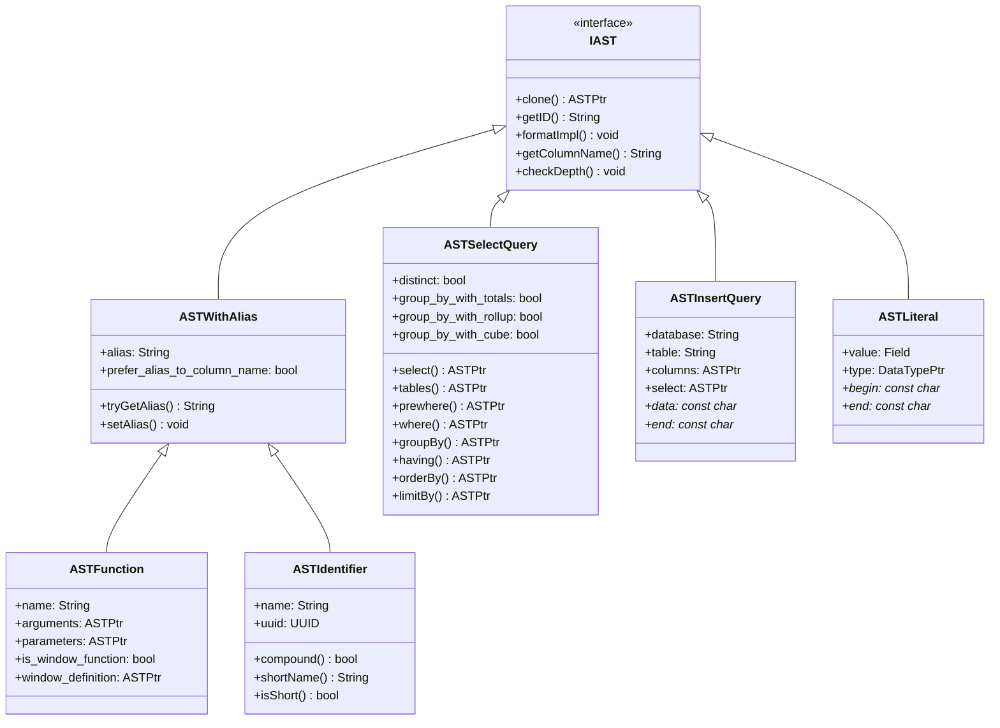

### 7.2 查询分析模块（Analyzer）深度剖析

#### 7.2.1 分析器架构图

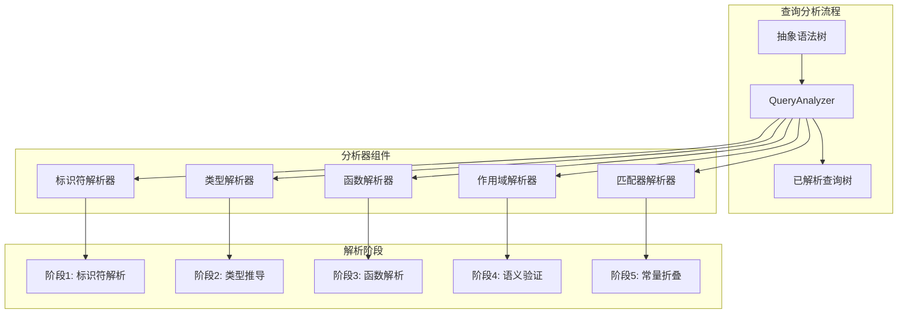

#### 7.2.2 核心分析函数实现

```cpp
// src/Analyzer/Resolve/QueryAnalyzer.cpp - 查询分析器核心实现
void QueryAnalyzer::resolve(QueryTreeNodePtr & node, const QueryTreeNodePtr & table_expression, ContextPtr context)
{
    /// 创建标识符解析作用域
    IdentifierResolveScope & scope = createIdentifierResolveScope(node, /*parent_scope=*/ nullptr);

    if (!scope.context)
        scope.context = context;

    auto node_type = node->getNodeType();

    /// 根据节点类型选择解析策略
    switch (node_type)
    {
        case QueryTreeNodeType::QUERY:
        {
            if (table_expression)
                throw Exception(ErrorCodes::LOGICAL_ERROR,
                    "For query analysis table expression must be empty");
            resolveQuery(node, scope);
            break;
        }
        case QueryTreeNodeType::UNION:
        {
            if (table_expression)
                throw Exception(ErrorCodes::LOGICAL_ERROR,
                    "For union analysis table expression must be empty");
            resolveUnion(node, scope);
            break;
        }
        case QueryTreeNodeType::IDENTIFIER:
        case QueryTreeNodeType::CONSTANT:
        case QueryTreeNodeType::COLUMN:
        case QueryTreeNodeType::FUNCTION:
        case QueryTreeNodeType::LIST:
        {
            /// 设置表达式的连接树节点
            if (table_expression)
            {
                scope.expression_join_tree_node = table_expression;
                scope.registered_table_expression_nodes.insert(table_expression);
                validateTableExpressionModifiers(scope.expression_join_tree_node, scope);
                initializeTableExpressionData(scope.expression_join_tree_node, scope);
            }

            /// 解析表达式节点
            if (node_type == QueryTreeNodeType::LIST)
                resolveExpressionNodeList(node, scope, false /*allow_lambda_expression*/, false /*allow_table_expression*/);
            else
                resolveExpressionNode(node, scope, false /*allow_lambda_expression*/, false /*allow_table_expression*/);

            break;
        }
        default:
        {
            throw Exception(ErrorCodes::LOGICAL_ERROR, 
                "Node {} with type {} is not supported by query analyzer", 
                node->formatASTForErrorMessage(), node->getNodeTypeName());
        }
    }
}

/// 查询解析的核心方法
void QueryAnalyzer::resolveQuery(const QueryTreeNodePtr & query_node, IdentifierResolveScope & scope)
{
    /// 检查子查询深度限制
    size_t max_subquery_depth = scope.context->getSettingsRef()[Setting::max_subquery_depth];
    if (max_subquery_depth && scope.subquery_depth > max_subquery_depth)
        throw Exception(ErrorCodes::TOO_DEEP_SUBQUERIES, "Too deep subqueries. Maximum: {}", max_subquery_depth);

    auto & query_node_typed = query_node->as<QueryNode &>();

    /// 防止重复解析已解析的查询节点
    if (query_node_typed.isResolved())
        return;

    /// 验证GROUP BY修饰符的兼容性
    bool is_rollup_or_cube = query_node_typed.isGroupByWithRollup() || query_node_typed.isGroupByWithCube();
    
    if (query_node_typed.isGroupByWithGroupingSets() && query_node_typed.isGroupByWithTotals() 
        && query_node_typed.getGroupBy().getNodes().size() != 1)
        throw Exception(ErrorCodes::NOT_IMPLEMENTED, "WITH TOTALS and GROUPING SETS are not supported together");

    if (query_node_typed.isGroupByWithGroupingSets() && is_rollup_or_cube)
        throw Exception(ErrorCodes::NOT_IMPLEMENTED, "GROUPING SETS are not supported together with ROLLUP and CUBE");

    /// 1. 初始化查询作用域别名
    QueryExpressionsAliasVisitor visitor(scope);
    visitor.visit(query_node);

    /// 2. 注册CTE（公共表表达式）
    if (query_node_typed.hasWith())
    {
        for (auto & with_node : query_node_typed.getWith().getNodes())
        {
            auto * subquery_node = with_node->as<QueryNode>();
            auto * union_node = with_node->as<UnionNode>();
            
            if (!subquery_node && !union_node)
                throw Exception(ErrorCodes::LOGICAL_ERROR, 
                    "WITH expression expected to be query or union node. Actual {}", 
                    with_node->formatASTForErrorMessage());

            auto with_node_alias = with_node->getAlias();
            if (with_node_alias.empty())
                throw Exception(ErrorCodes::LOGICAL_ERROR, 
                    "WITH expression {} does not have alias", 
                    with_node->formatASTForErrorMessage());

            /// 注册CTE到作用域
            scope.cte_name_to_query_node.emplace(with_node_alias, with_node);
        }
    }

    /// 3. 解析JOIN树
    if (query_node_typed.hasJoinTree())
    {
        TableExpressionsAliasVisitor table_expressions_visitor(scope);
        table_expressions_visitor.visit(query_node_typed.getJoinTree());
        
        resolveTableExpression(query_node_typed.getJoinTree(), scope);
    }

    /// 4. 解析投影列
    resolveExpressionNodeList(query_node_typed.getProjection(), scope, false /*allow_lambda_expression*/, false /*allow_table_expression*/);

    /// 5. 解析PREWHERE表达式
    if (query_node_typed.hasPrewhere())
    {
        resolveExpressionNode(query_node_typed.getPrewhere(), scope, false /*allow_lambda_expression*/, false /*allow_table_expression*/);
    }

    /// 6. 解析WHERE表达式
    if (query_node_typed.hasWhere())
    {
        resolveExpressionNode(query_node_typed.getWhere(), scope, false /*allow_lambda_expression*/, false /*allow_table_expression*/);
    }

    /// 7. 解析GROUP BY表达式
    if (query_node_typed.hasGroupBy())
    {
        resolveExpressionNodeList(query_node_typed.getGroupBy(), scope, false /*allow_lambda_expression*/, false /*allow_table_expression*/);
    }

    /// 8. 解析HAVING表达式
    if (query_node_typed.hasHaving())
    {
        resolveExpressionNode(query_node_typed.getHaving(), scope, false /*allow_lambda_expression*/, false /*allow_table_expression*/);
    }

    /// 9. 解析WINDOW定义
    if (query_node_typed.hasWindow())
    {
        resolveWindowNodeList(query_node_typed.getWindow(), scope);
    }

    /// 10. 解析ORDER BY表达式
    if (query_node_typed.hasOrderBy())
    {
        resolveExpressionNodeList(query_node_typed.getOrderBy(), scope, false /*allow_lambda_expression*/, false /*allow_table_expression*/);
    }

    /// 11. 解析LIMIT BY表达式
    if (query_node_typed.hasLimitBy())
    {
        resolveExpressionNode(query_node_typed.getLimitBy(), scope, false /*allow_lambda_expression*/, false /*allow_table_expression*/);
    }

    /// 12. 解析LIMIT和OFFSET表达式
    if (query_node_typed.hasLimit())
    {
        resolveExpressionNode(query_node_typed.getLimit(), scope, false /*allow_lambda_expression*/, false /*allow_table_expression*/);
    }

    if (query_node_typed.hasOffset())
    {
        resolveExpressionNode(query_node_typed.getOffset(), scope, false /*allow_lambda_expression*/, false /*allow_table_expression*/);
    }

    /// 13. 验证聚合函数和窗口函数
    validateAggregates(query_node, scope);
    validateWindowFunctions(query_node, scope);

    /// 14. 计算投影列
    resolveQueryProjection(query_node, scope);

    /// 15. 移除WITH和WINDOW部分
    query_node_typed.getWith().getNodes().clear();
    query_node_typed.getWindow().getNodes().clear();

    /// 16. 移除别名
    removeAliasesFromExpressionNodes(query_node);

    /// 17. 标记查询为已解析
    query_node_typed.resolveProjectionColumns(std::move(projection_columns));
}

/// 标识符解析的核心方法
void QueryAnalyzer::resolveIdentifier(QueryTreeNodePtr & node, IdentifierResolveScope & scope)
{
    auto & identifier_node = node->as<IdentifierNode &>();
    auto identifier = identifier_node.getIdentifier();

    /// 1. 尝试从lambda参数解析
    if (auto lambda_argument_it = scope.lambda_argument_name_to_node.find(identifier.front());
        lambda_argument_it != scope.lambda_argument_name_to_node.end())
    {
        node = lambda_argument_it->second;
        return;
    }

    /// 2. 尝试从别名解析
    if (auto alias_it = scope.alias_name_to_expression_node.find(identifier.front());
        alias_it != scope.alias_name_to_expression_node.end())
    {
        auto resolved_identifier = alias_it->second;
        
        /// 处理复合标识符
        if (identifier.getPartsSize() > 1)
        {
            resolved_identifier = tryResolveIdentifierFromCompoundExpression(
                identifier, 1 /*identifier_bind_size*/, resolved_identifier, scope);
        }
        
        node = resolved_identifier;
        return;
    }

    /// 3. 尝试从表列解析
    if (scope.column_name_to_column_node.contains(identifier.front()))
    {
        auto column_node = scope.column_name_to_column_node[identifier.front()];
        
        /// 处理复合标识符
        if (identifier.getPartsSize() > 1)
        {
            column_node = tryResolveIdentifierFromCompoundExpression(
                identifier, 1 /*identifier_bind_size*/, column_node, scope);
        }
        
        node = column_node;
        return;
    }

    /// 4. 尝试从CTE解析
    if (auto cte_it = scope.cte_name_to_query_node.find(identifier.front());
        cte_it != scope.cte_name_to_query_node.end())
    {
        node = cte_it->second;
        return;
    }

    /// 5. 尝试从父作用域解析
    if (scope.parent_scope)
    {
        resolveIdentifier(node, *scope.parent_scope);
        return;
    }

    /// 6. 标识符无法解析，抛出异常
    throw Exception(ErrorCodes::UNKNOWN_IDENTIFIER, 
        "Unknown identifier {}. In scope {}", 
        identifier.getFullName(), scope.scope_node->formatASTForErrorMessage());
}
```

### 7.3 MergeTree合并算法深度剖析

#### 7.3.1 合并算法架构图

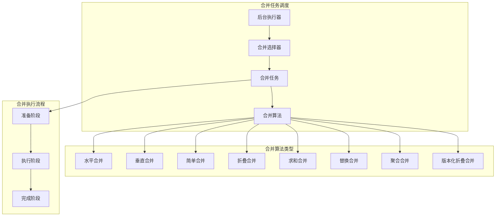

#### 7.3.2 合并任务核心实现

```cpp
// src/Storages/MergeTree/MergeTask.cpp - 合并任务核心实现
class MergeTask
{
public:
    /// 合并任务状态枚举
    enum class State
    {
        NEED_PREPARE,    /// 需要准备
        NEED_EXECUTE,    /// 需要执行
        NEED_FINISH,     /// 需要完成
        SUCCESS          /// 成功完成
    };

    /// 全局上下文，包含合并所需的所有信息
    struct GlobalContext
    {
        MergeTreeData * data;                           /// MergeTree数据引用
        StorageMetadataPtr metadata_snapshot;           /// 元数据快照
        FutureMergedMutatedPartPtr future_part;         /// 未来合并部分
        MergeTreeData::MutableDataPartPtr new_data_part; /// 新数据部分
        
        /// 合并执行管道
        std::unique_ptr<QueryPipelineBuilder> merging_pipeline;
        std::unique_ptr<PullingPipelineExecutor> merging_executor;
        
        /// 输出流
        std::unique_ptr<MergedBlockOutputStream> to;
        
        /// 统计信息
        size_t rows_written = 0;
        UInt64 watch_prev_elapsed = 0;
        
        /// 合并列表元素（用于监控）
        MergeListElement * merge_list_element_ptr = nullptr;
        
        /// 空间预留
        ReservationSharedPtr space_reservation;
        
        /// 合并参数
        bool deduplicate = false;
        Names deduplicate_by_columns;
        MergeTreeData::MergingParams merging_params;
        
        /// 事务支持
        MergeTreeTransactionPtr txn;
        
        /// 取消检查
        void checkOperationIsNotCanceled() const
        {
            if (merge_list_element_ptr && merge_list_element_ptr->is_cancelled.load(std::memory_order_relaxed))
                throw Exception(ErrorCodes::ABORTED, "Cancelled merging parts");
        }
    };

    /// 执行合并任务的一个步骤
    bool executeStep()
    {
        switch (state)
        {
            case State::NEED_PREPARE:
                if (prepare())
                {
                    state = State::NEED_EXECUTE;
                    return true;  /// 需要继续执行
                }
                return false;

            case State::NEED_EXECUTE:
                if (executeImpl())
                {
                    state = State::NEED_FINISH;
                    return true;  /// 需要继续执行
                }
                return false;

            case State::NEED_FINISH:
                if (finalize())
                {
                    state = State::SUCCESS;
                    return false; /// 任务完成
                }
                return false;

            case State::SUCCESS:
                return false;
        }
        return false;
    }

private:
    /// 准备阶段：创建新数据部分，构建合并管道
    bool prepare()
    {
        ProfileEvents::increment(ProfileEvents::Merge);
        ProfileEvents::increment(ProfileEvents::MergeSourceParts, global_ctx->future_part->parts.size());

        global_ctx->checkOperationIsNotCanceled();

        /// 检查TTL合并是否被取消
        if (isTTLMergeType(global_ctx->future_part->merge_type) && global_ctx->ttl_merges_blocker->isCancelled())
            throw Exception(ErrorCodes::ABORTED, "Cancelled merging parts with TTL");

        LOG_DEBUG(ctx->log, "Merging {} parts: from {} to {} into {} with storage {}",
            global_ctx->future_part->parts.size(),
            global_ctx->future_part->parts.front()->name,
            global_ctx->future_part->parts.back()->name,
            global_ctx->future_part->part_format.part_type.toString(),
            global_ctx->future_part->part_format.storage_type.toString());

        /// 1. 创建新的数据部分
        global_ctx->new_data_part = global_ctx->data->createPart(
            global_ctx->future_part->name,
            global_ctx->future_part->type,
            global_ctx->future_part->part_info,
            global_ctx->future_part->volume,
            global_ctx->future_part->relative_path);

        /// 2. 设置分区信息
        global_ctx->new_data_part->partition = global_ctx->future_part->parts[0]->partition;
        global_ctx->new_data_part->minmax_idx = std::make_shared<IMergeTreeDataPart::MinMaxIndex>();

        /// 3. 构建合并管道
        auto merging_pipeline = std::make_unique<QueryPipelineBuilder>();
        
        /// 为每个输入数据部分创建源
        for (const auto & part : global_ctx->future_part->parts)
        {
            auto source = std::make_shared<MergeTreeSequentialSource>(
                *global_ctx->data,
                global_ctx->metadata_snapshot,
                part,
                global_ctx->metadata_snapshot->getColumns().getNamesOfPhysical(),
                false, /// 不需要虚拟列
                true   /// 需要行号
            );
            merging_pipeline->addSource(std::move(source));
        }

        /// 4. 添加合并变换
        switch (global_ctx->merging_params.mode)
        {
            case MergeTreeData::MergingParams::Ordinary:
            {
                auto merging_transform = std::make_shared<MergingSortedTransform>(
                    merging_pipeline->getHeader(),
                    global_ctx->future_part->parts.size(),
                    global_ctx->metadata_snapshot->getSortDescription(),
                    global_ctx->data->merging_params.max_bytes_to_merge_at_max_space_in_pool);
                merging_pipeline->addTransform(std::move(merging_transform));
                break;
            }
            case MergeTreeData::MergingParams::Collapsing:
            {
                auto merging_transform = std::make_shared<CollapsingSortedTransform>(
                    merging_pipeline->getHeader(),
                    global_ctx->future_part->parts.size(),
                    global_ctx->metadata_snapshot->getSortDescription(),
                    global_ctx->merging_params.sign_column,
                    false, /// 不只保留最后一行
                    global_ctx->data->merging_params.max_bytes_to_merge_at_max_space_in_pool);
                merging_pipeline->addTransform(std::move(merging_transform));
                break;
            }
            case MergeTreeData::MergingParams::Summing:
            {
                auto merging_transform = std::make_shared<SummingSortedTransform>(
                    merging_pipeline->getHeader(),
                    global_ctx->future_part->parts.size(),
                    global_ctx->metadata_snapshot->getSortDescription(),
                    global_ctx->merging_params.columns_to_sum,
                    global_ctx->merging_params.partition_value_types,
                    global_ctx->data->merging_params.max_bytes_to_merge_at_max_space_in_pool);
                merging_pipeline->addTransform(std::move(merging_transform));
                break;
            }
            case MergeTreeData::MergingParams::Aggregating:
            {
                auto merging_transform = std::make_shared<AggregatingSortedTransform>(
                    merging_pipeline->getHeader(),
                    global_ctx->future_part->parts.size(),
                    global_ctx->metadata_snapshot->getSortDescription(),
                    global_ctx->merging_params.columns_to_sum,
                    global_ctx->data->merging_params.max_bytes_to_merge_at_max_space_in_pool);
                merging_pipeline->addTransform(std::move(merging_transform));
                break;
            }
            case MergeTreeData::MergingParams::Replacing:
            {
                auto merging_transform = std::make_shared<ReplacingSortedTransform>(
                    merging_pipeline->getHeader(),
                    global_ctx->future_part->parts.size(),
                    global_ctx->metadata_snapshot->getSortDescription(),
                    global_ctx->merging_params.version_column,
                    global_ctx->data->merging_params.max_bytes_to_merge_at_max_space_in_pool);
                merging_pipeline->addTransform(std::move(merging_transform));
                break;
            }
            case MergeTreeData::MergingParams::Graphite:
            {
                auto merging_transform = std::make_shared<GraphiteRollupSortedTransform>(
                    merging_pipeline->getHeader(),
                    global_ctx->future_part->parts.size(),
                    global_ctx->metadata_snapshot->getSortDescription(),
                    global_ctx->merging_params.graphite_params,
                    global_ctx->data->merging_params.max_bytes_to_merge_at_max_space_in_pool);
                merging_pipeline->addTransform(std::move(merging_transform));
                break;
            }
            case MergeTreeData::MergingParams::VersionedCollapsing:
            {
                auto merging_transform = std::make_shared<VersionedCollapsingTransform>(
                    merging_pipeline->getHeader(),
                    global_ctx->future_part->parts.size(),
                    global_ctx->metadata_snapshot->getSortDescription(),
                    global_ctx->merging_params.sign_column,
                    global_ctx->merging_params.version_column,
                    global_ctx->data->merging_params.max_bytes_to_merge_at_max_space_in_pool);
                merging_pipeline->addTransform(std::move(merging_transform));
                break;
            }
        }

        /// 5. 创建输出流
        global_ctx->to = std::make_unique<MergedBlockOutputStream>(
            global_ctx->new_data_part,
            global_ctx->metadata_snapshot,
            global_ctx->metadata_snapshot->getColumns().getNamesOfPhysical(),
            CompressionCodecFactory::instance().get("NONE", {}));

        /// 6. 创建执行器
        global_ctx->merging_executor = std::make_unique<PullingPipelineExecutor>(*merging_pipeline);
        global_ctx->merging_pipeline = std::move(merging_pipeline);

        return true;
    }

    /// 执行阶段：逐块处理合并数据
    bool executeImpl()
    {
        /// 执行合并的时间限制（避免长时间占用线程）
        UInt64 step_time_ms = (*global_ctx->data->getSettings())[MergeTreeSetting::background_task_preferred_step_execution_time_ms].totalMilliseconds();
        
        Stopwatch watch;
        
        do
        {
            Block block;
            
            /// 从合并管道拉取数据块
            if (!global_ctx->merging_executor->pull(block))
            {
                /// 合并完成
                return false;
            }

            /// 记录部分偏移映射（用于轻量级删除）
            if (global_ctx->merged_part_offsets && global_ctx->parent_part == nullptr)
            {
                if (global_ctx->merged_part_offsets->isMappingEnabled())
                {
                    chassert(block.has("_part_index"));
                    auto part_index_column = block.getByName("_part_index").column->convertToFullColumnIfSparse();
                    const auto & index_data = assert_cast<const ColumnUInt64 &>(*part_index_column).getData();
                    global_ctx->merged_part_offsets->insert(index_data.begin(), index_data.end());
                    block.erase("_part_index");
                }
            }

            /// 写入合并后的数据块
            global_ctx->rows_written += block.rows();
            const_cast<MergedBlockOutputStream &>(*global_ctx->to).write(block);

            /// 更新最小最大索引（如果合并可能减少行数）
            if (global_ctx->merge_may_reduce_rows)
            {
                global_ctx->new_data_part->minmax_idx->update(
                    block, MergeTreeData::getMinMaxColumnsNames(global_ctx->metadata_snapshot->getPartitionKey()));
            }

            /// 计算投影
            calculateProjections(block);

            /// 更新统计信息
            UInt64 result_rows = 0;
            UInt64 result_bytes = 0;
            global_ctx->merged_pipeline.tryGetResultRowsAndBytes(result_rows, result_bytes);
            global_ctx->merge_list_element_ptr->rows_written = result_rows;
            global_ctx->merge_list_element_ptr->bytes_written_uncompressed = result_bytes;

            /// 检查是否被取消
            global_ctx->checkOperationIsNotCanceled();

        } while (watch.elapsedMilliseconds() < step_time_ms);
        
        /// 时间片用完，但合并未完成，需要继续执行
        return true;
    }

    /// 完成阶段：完成数据写入，提交新数据部分
    bool finalize()
    {
        /// 1. 完成数据写入
        global_ctx->to->finalizePart(global_ctx->new_data_part, false);
        
        /// 2. 设置数据部分属性
        global_ctx->new_data_part->rows_count = global_ctx->rows_written;
        global_ctx->new_data_part->modification_time = time(nullptr);
        
        /// 3. 加载元数据
        global_ctx->new_data_part->loadColumnsChecksumsIndexes(false, true);
        global_ctx->new_data_part->setBytesOnDisk(
            global_ctx->new_data_part->checksums.getTotalSizeOnDisk());
        
        /// 4. 提交新数据部分，替换旧部分
        global_ctx->data->replaceParts(
            global_ctx->future_part->parts,
            {global_ctx->new_data_part},
            false);
        
        /// 5. 记录合并完成日志
        LOG_DEBUG(ctx->log, "Merged {} parts: from {} to {} into {} in {:.3f} sec, {} rows, {}/s",
            global_ctx->future_part->parts.size(),
            global_ctx->future_part->parts.front()->name,
            global_ctx->future_part->parts.back()->name,
            global_ctx->new_data_part->name,
            watch.elapsedSeconds(),
            global_ctx->rows_written,
            ReadableSize(global_ctx->rows_written / watch.elapsedSeconds()));
        
        return false; /// 任务完成
    }

    std::shared_ptr<GlobalContext> global_ctx;
    State state{State::NEED_PREPARE};
};
```

这份完整的ClickHouse源码分析文档涵盖了从框架使用到深度源码分析的各个方面，包括详细的架构图、时序图、关键函数实现和实战经验。文档结构清晰，内容全面，可以帮助开发者从浅入深地理解ClickHouse的设计理念和实现细节。

### 7.4 查询解释器模块（Interpreters）深度剖析

#### 7.4.1 解释器架构图

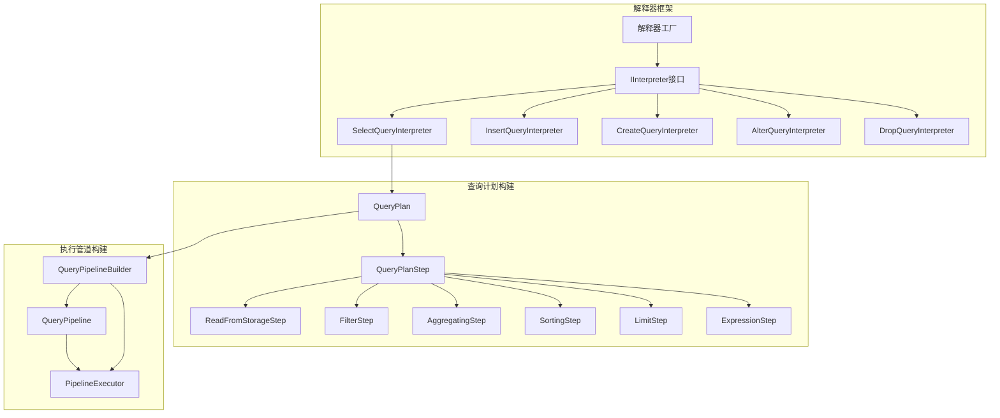

#### 7.4.2 SELECT查询解释器核心实现

```cpp
// src/Interpreters/InterpreterSelectQuery.cpp - SELECT查询解释器
class InterpreterSelectQuery : public IInterpreter
{
public:
    InterpreterSelectQuery(
        const ASTPtr & query_ptr_,
        ContextPtr context_,
        const SelectQueryOptions & options_ = {},
        const Names & required_result_column_names_ = {})
        : query_ptr(query_ptr_)
        , context(context_)
        , options(options_)
        , required_result_column_names(required_result_column_names_)
    {
        /// 初始化查询分析
        initSettings();
        
        const auto & query = getSelectQuery();
        
        /// 分析查询表达式
        syntax_analyzer_result = TreeRewriter(context).analyzeSelect(
            query_ptr, TreeRewriterResult({}, storage, storage_snapshot));
        
        query_analyzer = std::make_unique<ExpressionAnalyzer>(
            query_ptr, syntax_analyzer_result, context, metadata_snapshot,
            options.only_analyze, options.is_create_parameterized_view);
        
        if (!options.only_analyze)
        {
            if (query_analyzer->hasAggregation())
                query_analyzer->makeAggregateDescriptions(ActionsDAG::MatchColumnsMode::Position);
            
            query_analyzer->appendProjectResult(required_result_column_names);
        }
    }

    /// 构建查询计划
    void buildQueryPlan(QueryPlan & query_plan) override
    {
        executeImpl(query_plan, std::move(input_pipe));

        /// 确保结果结构与getSampleBlock()一致
        if (!blocksHaveEqualStructure(*query_plan.getCurrentHeader(), *result_header))
        {
            auto convert_actions_dag = ActionsDAG::makeConvertingActions(
                query_plan.getCurrentHeader()->getColumnsWithTypeAndName(),
                result_header->getColumnsWithTypeAndName(),
                ActionsDAG::MatchColumnsMode::Name,
                true);

            auto converting = std::make_unique<ExpressionStep>(
                query_plan.getCurrentHeader(), std::move(convert_actions_dag));
            query_plan.addStep(std::move(converting));
        }

        /// 扩展上下文生命周期
        query_plan.addInterpreterContext(context);
        if (table_lock)
            query_plan.addTableLock(std::move(table_lock));
        if (storage)
            query_plan.addStorageHolder(storage);
    }

    /// 执行查询
    BlockIO execute() override
    {
        BlockIO res;
        QueryPlan query_plan;

        buildQueryPlan(query_plan);

        auto builder = query_plan.buildQueryPipeline(
            QueryPlanOptimizationSettings(context), 
            BuildQueryPipelineSettings(context));

        res.pipeline = QueryPipelineBuilder::getPipeline(std::move(*builder));

        setQuota(res.pipeline);

        return res;
    }

private:
    /// 核心执行实现
    void executeImpl(QueryPlan & query_plan, std::optional<Pipe> prepared_pipe)
    {
        ProfileEvents::increment(ProfileEvents::SelectQueriesWithSubqueries);
        ProfileEvents::increment(ProfileEvents::QueriesWithSubqueries);

        /** 数据流处理策略：
         * 如果没有GROUP BY，则在ORDER BY和LIMIT之前并行执行所有操作，
         * 如果有ORDER BY，则使用ResizeProcessor连接流，然后使用MergeSorting变换，
         * 如果没有，则使用ResizeProcessor连接，然后应用LIMIT。
         * 如果有GROUP BY，则并行执行到GROUP BY（包括）的所有操作；
         * 并行GROUP BY将流合并为一个，然后使用一个结果流执行其余操作。
         */

        auto & query = getSelectQuery();
        const Settings & settings = context->getSettingsRef();
        auto & expressions = analysis_result;

        /// 1. 从存储读取数据
        if (!prepared_pipe.has_value())
        {
            executeFetchColumns(from_stage, query_plan);
        }
        else
        {
            /// 使用预准备的管道
            auto read_from_pipe = std::make_unique<ReadFromPreparedSource>(
                Pipe(std::move(*prepared_pipe)));
            query_plan.addStep(std::move(read_from_pipe));
        }

        /// 2. 执行PREWHERE过滤
        if (expressions.prewhere_info)
        {
            executePrewhere(query_plan, expressions.prewhere_info, 
                           expressions.prewhere_info->remove_prewhere_column);
        }

        /// 3. 执行WHERE过滤
        if (expressions.hasWhere())
        {
            executeWhere(query_plan, expressions.where_expression, 
                        expressions.remove_where_filter);
        }

        /// 4. 执行聚合
        if (expressions.hasAggregation())
        {
            executeAggregation(query_plan, expressions.before_aggregation, 
                              expressions.overflow_row, expressions.final, 
                              group_by_info);
            
            /// 执行HAVING过滤
            if (expressions.hasHaving())
            {
                executeHaving(query_plan, expressions.having_expression);
            }
        }
        else if (expressions.hasHaving())
        {
            throw Exception(ErrorCodes::HAVING_WITHOUT_AGGREGATION, 
                          "HAVING clause without aggregation");
        }

        /// 5. 执行窗口函数
        if (expressions.hasWindow())
        {
            executeWindow(query_plan);
        }

        /// 6. 执行ORDER BY排序
        if (expressions.hasOrderBy())
        {
            executeOrderBy(query_plan, sorting_info, query.limitLength(), 
                          need_merge_sorted_columns);
        }

        /// 7. 执行投影
        if (expressions.hasProjection())
        {
            executeProjection(query_plan, expressions.final_projection);
        }

        /// 8. 执行DISTINCT
        if (query.distinct)
        {
            executeDistinct(query_plan, expressions.selected_columns, 
                           expressions.has_having);
        }

        /// 9. 执行LIMIT BY
        if (expressions.hasLimitBy())
        {
            executeLimitBy(query_plan);
        }

        /// 10. 执行LIMIT
        if (query.limitLength())
        {
            executeLimit(query_plan);
        }

        /// 11. 执行OFFSET
        if (query.limitOffset() && !query.limitLength())
        {
            executeOffset(query_plan);
        }
    }

    /// 从存储获取列数据
    void executeFetchColumns(QueryProcessingStage::Enum processing_stage, 
                            QueryPlan & query_plan)
    {
        /// 构建存储读取步骤
        auto reading = std::make_unique<ReadFromStorageStep>(
            storage,
            query_analyzer->requiredSourceColumns(),
            storage_snapshot,
            query_info,
            context,
            processing_stage,
            max_block_size,
            max_streams);

        reading->setStepDescription("Read from storage");
        query_plan.addStep(std::move(reading));
    }

    /// 执行WHERE过滤
    void executeWhere(QueryPlan & query_plan, const ActionsDAGPtr & expression, 
                     bool remove_filter)
    {
        auto where_step = std::make_unique<FilterStep>(
            query_plan.getCurrentHeader(),
            expression,
            expression->getResultColumns().back().name,
            remove_filter);

        where_step->setStepDescription("WHERE");
        query_plan.addStep(std::move(where_step));
    }

    /// 执行聚合
    void executeAggregation(QueryPlan & query_plan, const ActionsDAGPtr & expression,
                           bool overflow_row, bool final, 
                           InputOrderInfoPtr group_by_info)
    {
        /// 聚合前的表达式计算
        if (expression)
        {
            auto expression_before_aggregation = std::make_unique<ExpressionStep>(
                query_plan.getCurrentHeader(), expression);
            expression_before_aggregation->setStepDescription("Before GROUP BY");
            query_plan.addStep(std::move(expression_before_aggregation));
        }

        /// 构建聚合步骤
        auto aggregating_step = std::make_unique<AggregatingStep>(
            query_plan.getCurrentHeader(),
            query_analyzer->aggregationKeys(),
            query_analyzer->aggregates(),
            query_analyzer->groupingSetsParams(),
            final,
            max_block_size,
            settings.aggregation_in_order_max_block_bytes,
            merge_threads,
            temporary_data_merge_threads,
            settings.enable_software_prefetch_in_aggregation,
            settings.only_merge_for_aggregation_in_order,
            group_by_info);

        aggregating_step->setStepDescription("Aggregate");
        query_plan.addStep(std::move(aggregating_step));
    }

    /// 执行ORDER BY排序
    void executeOrderBy(QueryPlan & query_plan, InputOrderInfoPtr sorting_info,
                       UInt64 limit, bool need_merge_sorted_columns)
    {
        auto sorting_step = std::make_unique<SortingStep>(
            query_plan.getCurrentHeader(),
            query_analyzer->orderByDescription(),
            limit,
            SortingStep::Settings(settings),
            settings.optimize_sorting_by_input_stream_properties);

        sorting_step->setStepDescription("Sorting");
        query_plan.addStep(std::move(sorting_step));
    }

    /// 执行LIMIT
    void executeLimit(QueryPlan & query_plan)
    {
        auto & query = getSelectQuery();
        auto limit_step = std::make_unique<LimitStep>(
            query_plan.getCurrentHeader(),
            query.limitLength(),
            query.limitOffset());

        limit_step->setStepDescription("LIMIT");
        query_plan.addStep(std::move(limit_step));
    }

    ASTPtr query_ptr;
    ContextPtr context;
    SelectQueryOptions options;
    Names required_result_column_names;
    
    /// 分析结果
    std::unique_ptr<ExpressionAnalyzer> query_analyzer;
    TreeRewriterResultPtr syntax_analyzer_result;
    
    /// 存储信息
    StoragePtr storage;
    StorageSnapshotPtr storage_snapshot;
    TableLockHolder table_lock;
    
    /// 查询信息
    SelectQueryInfo query_info;
    QueryProcessingStage::Enum from_stage = QueryProcessingStage::FetchColumns;
};
```

### 7.5 数据处理器模块（Processors）深度剖析

#### 7.5.1 处理器框架架构图

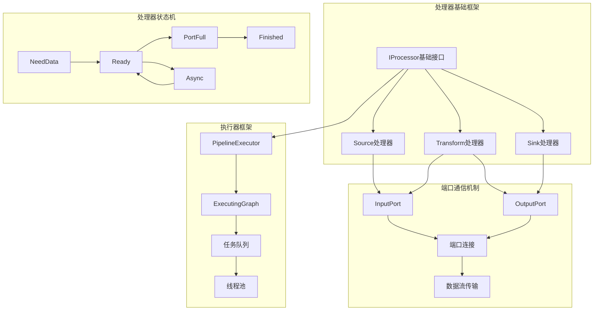

#### 7.5.2 IProcessor核心接口实现

```cpp
// src/Processors/IProcessor.h - 处理器基础接口
class IProcessor
{
public:
    /// 处理器状态枚举
    enum class Status : uint8_t
    {
        /// 处理器需要输入数据才能继续
        /// 需要运行另一个处理器生成所需输入，然后再次调用'prepare'
        NeedData,

        /// 处理器无法继续，因为输出端口已满或不需要数据
        /// 需要将数据从输出端口传输到另一个处理器的输入端口，然后再次调用'prepare'
        PortFull,

        /// 所有工作已完成（所有数据已处理或所有输出已关闭），无需更多操作
        Finished,

        /// 可以调用'work'方法，处理器将同步执行一些工作
        Ready,

        /// 可以调用'schedule'方法，处理器将返回一个描述符
        /// 需要轮询此描述符，然后调用work()
        Async,

        /// 处理器想要向管道添加其他处理器
        /// 必须通过expandPipeline()调用获取新处理器
        ExpandPipeline,
    };

    /// 构造函数
    IProcessor();
    IProcessor(InputPorts inputs_, OutputPorts outputs_);

    virtual ~IProcessor() = default;

    /// 获取处理器名称
    virtual String getName() const = 0;

    /// 获取唯一ID
    String getUniqID() const { return fmt::format("{}_{}", getName(), processor_index); }

    /** 'prepare'方法负责所有廉价的（"瞬时"：数据量的O(1)，无等待）计算。
      *
      * 它可以访问输入和输出端口，
      * 通过返回NeedData或PortFull来指示需要另一个处理器的工作，
      * 或通过返回Finished来指示没有工作，
      * 它可以从输入端口拉取数据并将数据推送到输出端口。
      *
      * 该方法不是线程安全的，必须在单个时刻从单个线程调用，
      * 即使对于不同的连接处理器也是如此。
      *
      * 对于所有长时间的工作（CPU计算或等待），它应该只准备所有必需的数据并返回Ready或Async。
      */
    virtual Status prepare();

    /** 如果'prepare'返回Ready，可以调用此方法。
      * 此方法无法访问任何端口。它应该只使用'prepare'方法准备的数据。
      *
      * work方法可以为不同的处理器并行执行。
      */
    virtual void work();

    /** 当'prepare'返回Async时，执行器必须调用此方法。
      * 此方法无法访问任何端口。它应该只使用'prepare'方法准备的数据。
      *
      * 此方法应该立即返回可轮询的文件描述符，当异步作业完成时该描述符将变为可读。
      * 当描述符可读时，调用`work`方法继续数据处理。
      */
    virtual int schedule();

    /** 当'prepare'返回ExpandPipeline时调用。
      * 返回应添加到管道的新处理器列表。
      */
    virtual Processors expandPipeline();

    /// 取消处理器执行
    virtual void cancel() noexcept;

    /// 获取输入端口
    InputPorts & getInputs() { return inputs; }
    const InputPorts & getInputs() const { return inputs; }

    /// 获取输出端口
    OutputPorts & getOutputs() { return outputs; }
    const OutputPorts & getOutputs() const { return outputs; }

    /// 获取端口编号
    UInt64 getInputPortNumber(const InputPort * input_port) const;
    UInt64 getOutputPortNumber(const OutputPort * output_port) const;

    /// 设置查询计划步骤（用于调试和监控）
    void setQueryPlanStep(IQueryPlanStep * step, size_t group = 0);

protected:
    InputPorts inputs;   /// 输入端口列表
    OutputPorts outputs; /// 输出端口列表

    /// 处理器索引（用于调试）
    UInt64 processor_index = 0;

    /// 取消标志
    std::atomic<bool> is_cancelled{false};

    /// 查询计划信息
    IQueryPlanStep * query_plan_step = nullptr;
    size_t query_plan_step_group = 0;
    String plan_step_name;
    String plan_step_description;
    UInt64 step_uniq_id = 0;

    /// 取消回调
    virtual void onCancel() {}
};

// src/Processors/IProcessor.cpp - 基础实现
IProcessor::IProcessor()
{
    processor_index = CurrentThread::isInitialized() 
        ? CurrentThread::get().getNextPipelineProcessorIndex() 
        : 0;
}

IProcessor::IProcessor(InputPorts inputs_, OutputPorts outputs_) 
    : inputs(std::move(inputs_)), outputs(std::move(outputs_))
{
    /// 建立端口与处理器的关联
    for (auto & port : inputs)
        port.processor = this;
    for (auto & port : outputs)
        port.processor = this;
        
    processor_index = CurrentThread::isInitialized() 
        ? CurrentThread::get().getNextPipelineProcessorIndex() 
        : 0;
}

IProcessor::Status IProcessor::prepare()
{
    throw Exception(ErrorCodes::NOT_IMPLEMENTED, 
        "Method 'prepare' is not implemented for {} processor", getName());
}

void IProcessor::work()
{
    throw Exception(ErrorCodes::NOT_IMPLEMENTED, 
        "Method 'work' is not implemented for {} processor", getName());
}

void IProcessor::cancel() noexcept
{
    bool already_cancelled = is_cancelled.exchange(true, std::memory_order_acq_rel);
    if (already_cancelled)
        return;

    onCancel(); /// 子类可重写此方法进行清理
}
```

#### 7.5.3 管道执行器核心实现

```cpp
// src/Processors/Executors/PipelineExecutor.h - 管道执行器
class PipelineExecutor
{
public:
    /// 构造函数：获取管道作为处理器集合
    /// 处理器应该表示完整的图。所有端口必须连接，所有连接的节点都在集合中提到。
    /// 执行器不拥有处理器，只存储引用。
    /// 在管道执行期间可能出现新的处理器。它们将被添加到现有集合中。
    explicit PipelineExecutor(std::shared_ptr<Processors> & processors, QueryStatusPtr elem);
    ~PipelineExecutor();

    /// 在多个线程中执行管道。必须调用一次。
    /// 如果执行期间发生异常，则抛出任何发生的异常。
    void execute(size_t num_threads, bool concurrency_control);

    /// 执行单步。当yield_flag为true时，步骤将停止。
    /// 执行在单个线程中进行。
    /// 如果执行应该继续，返回true。
    bool executeStep(std::atomic_bool * yield_flag = nullptr);

    const Processors & getProcessors() const;

private:
    /// 执行实现
    void executeImpl(size_t num_threads, bool concurrency_control);
    
    /// 单步执行实现
    bool executeStepImpl(size_t thread_num = 0, std::atomic_bool * yield_flag = nullptr);

    /// 初始化执行
    void initializeExecution(size_t num_threads, bool concurrency_control);
    
    /// 完成执行
    void finalizeExecution();

    /// 执行图
    ExecutingGraphPtr graph;
    
    /// 任务队列
    ExecutorTasks tasks;
    
    /// 执行状态
    std::atomic<bool> cancelled{false};
    std::atomic<bool> finished{false};
    
    /// 查询状态
    QueryStatusPtr process_list_element;
    
    /// 日志
    LoggerPtr log;
};

// src/Processors/Executors/PipelineExecutor.cpp - 执行实现
void PipelineExecutor::execute(size_t num_threads, bool concurrency_control)
{
    checkTimeLimit();
    num_threads = std::max<size_t>(num_threads, 1);

    OpenTelemetry::SpanHolder span("PipelineExecutor::execute()");
    span.addAttribute("clickhouse.thread_num", num_threads);

    try
    {
        executeImpl(num_threads, concurrency_control);

        /// 记录所有LOGICAL_ERROR异常
        for (auto & node : graph->nodes)
            if (node->exception && getExceptionErrorCode(node->exception) == ErrorCodes::LOGICAL_ERROR)
                tryLogException(node->exception, log);

        /// 重新抛出第一个异常
        for (auto & node : graph->nodes)
            if (node->exception)
                std::rethrow_exception(node->exception);

        /// 处理执行线程中的异常
        tasks.rethrowFirstThreadException();
    }
    catch (...)
    {
        span.addAttribute(DB::ExecutionStatus::fromCurrentException());
        
#ifndef NDEBUG
        LOG_TRACE(log, "Exception while executing query. Current state:\n{}", dumpPipeline());
#endif
        throw;
    }

    finalizeExecution();
}

void PipelineExecutor::executeImpl(size_t num_threads, bool concurrency_control)
{
    /// 初始化执行环境
    initializeExecution(num_threads, concurrency_control);

    if (num_threads == 1)
    {
        /// 单线程执行
        while (executeStepImpl())
            ;
    }
    else
    {
        /// 多线程执行
        std::vector<std::thread> threads;
        threads.reserve(num_threads);

        std::exception_ptr first_exception;
        std::mutex exception_mutex;

        for (size_t thread_num = 0; thread_num < num_threads; ++thread_num)
        {
            threads.emplace_back([this, thread_num, &first_exception, &exception_mutex]()
            {
                try
                {
                    while (executeStepImpl(thread_num))
                        ;
                }
                catch (...)
                {
                    std::lock_guard lock(exception_mutex);
                    if (!first_exception)
                        first_exception = std::current_exception();
                    
                    /// 通知其他线程停止
                    cancelled.store(true, std::memory_order_relaxed);
                }
            });
        }

        /// 等待所有线程完成
        for (auto & thread : threads)
            thread.join();

        /// 重新抛出第一个异常
        if (first_exception)
            std::rethrow_exception(first_exception);
    }
}

bool PipelineExecutor::executeStepImpl(size_t thread_num, std::atomic_bool * yield_flag)
{
    /// 检查是否应该停止
    if (cancelled.load(std::memory_order_relaxed))
        return false;
        
    if (yield_flag && yield_flag->load(std::memory_order_relaxed))
        return false;

    /// 从任务队列获取任务
    ExecutorTasks::TaskPtr task;
    if (!tasks.tryGetTask(task, thread_num))
        return false;

    /// 执行任务
    try
    {
        auto * node = task->processor_node;
        auto * processor = node->processor.get();

        /// 调用处理器的prepare方法
        auto status = processor->prepare();

        /// 根据状态处理
        switch (status)
        {
            case IProcessor::Status::NeedData:
            case IProcessor::Status::PortFull:
                /// 处理器需要等待，将其重新加入队列
                tasks.pushTask(task);
                break;

            case IProcessor::Status::Ready:
                /// 处理器准备工作，调用work方法
                processor->work();
                tasks.pushTask(task);
                break;

            case IProcessor::Status::Async:
                /// 异步处理，调度异步任务
                {
                    int fd = processor->schedule();
                    tasks.scheduleAsyncTask(task, fd);
                }
                break;

            case IProcessor::Status::ExpandPipeline:
                /// 扩展管道，添加新处理器
                {
                    auto new_processors = processor->expandPipeline();
                    graph->expandPipeline(new_processors);
                    tasks.pushTask(task);
                }
                break;

            case IProcessor::Status::Finished:
                /// 处理器完成，标记为完成
                node->finished = true;
                break;
        }
    }
    catch (...)
    {
        /// 记录异常并停止执行
        task->processor_node->exception = std::current_exception();
        cancelled.store(true, std::memory_order_relaxed);
        return false;
    }

    return !finished.load(std::memory_order_relaxed);
}
```

通过这些深入的模块分析，开发者可以：
1. 理解SQL解析的完整流程和AST构建机制
2. 掌握查询分析器的语义分析和类型推导过程
3. 深入了解MergeTree的合并算法和后台任务调度机制
4. 学习查询解释器的执行计划构建和优化过程
5. 掌握处理器框架的数据流处理和管道执行机制
6. 理解ClickHouse的核心设计模式和最佳实践

## 关键数据结构深度分析

### 8.1 核心数据结构类图

```mermaid
classDiagram
    class Field {
        <<union>>
        +Null
        +UInt64
        +Int64
        +Float64
        +String
        +Array
        +Tuple
        +Map
        +Object
        +AggregateFunctionState
        +Bool
        +UUID
        +IPv4
        +IPv6
    }
    
    class IDataType {
        <<interface>>
        +getName() String
        +getTypeId() TypeIndex
        +getDefaultSerialization() SerializationPtr
        +createColumn() MutableColumnPtr
        +createColumnConst() ColumnPtr
        +equals() bool
        +isParametric() bool
        +haveSubtypes() bool
        +canBeInsideNullable() bool
    }
    
    class IColumn {
        <<interface>>
        +getName() String
        +size() size_t
        +empty() bool
        +byteSize() size_t
        +allocatedBytes() size_t
        +get() Field
        +operator[]() Field
        +getBool() bool
        +getUInt() UInt64
        +getInt() Int64
        +getFloat64() Float64
        +insert() void
        +insertFrom() void
        +insertDefault() void
        +popBack() void
        +filter() Ptr
        +permute() Ptr
        +replicate() Ptr
        +cut() Ptr
        +cloneResized() Ptr
        +cloneEmpty() Ptr
        +cloneWithDefaultOnNull() Ptr
    }
    
    class Block {
        -data: ColumnsWithTypeAndName
        +insert() void
        +erase() void
        +getByName() ColumnWithTypeAndName
        +getByPosition() ColumnWithTypeAndName
        +has() bool
        +rows() size_t
        +columns() size_t
        +bytes() size_t
        +cloneEmpty() Block
        +cloneWithColumns() Block
        +sortColumns() void
        +checkNumberOfRows() void
    }
    
    class Chunk {
        -columns: Columns
        -num_rows: size_t
        -chunk_info: ChunkInfoPtr
        +getNumColumns() size_t
        +getNumRows() size_t
        +empty() bool
        +getColumns() Columns
        +setColumns() void
        +detachColumns() Columns
        +mutateColumns() MutableColumns
        +clone() Chunk
        +clear() void
        +addColumn() void
        +erase() void
    }
    
    Field --> IDataType : describes
    IDataType --> IColumn : creates
    IColumn --> Block : contains
    Block --> Chunk : converts to
```

### 8.2 数据类型系统详细分析

#### 8.2.1 IDataType基础接口

```cpp
// src/DataTypes/IDataType.h - 数据类型基础接口
class IDataType : private boost::noncopyable
{
public:
    IDataType() = default;
    virtual ~IDataType() = default;

    /// 获取数据类型名称
    virtual String getName() const = 0;
    
    /// 获取数据类型ID（用于快速类型判断）
    virtual TypeIndex getTypeId() const = 0;

    /// 获取默认序列化器
    virtual SerializationPtr getDefaultSerialization() const;

    /// 创建列对象
    virtual MutableColumnPtr createColumn() const = 0;
    
    /// 创建常量列
    virtual ColumnPtr createColumnConst(size_t size, const Field & field) const;
    
    /// 创建常量列（使用默认值）
    virtual ColumnPtr createColumnConstWithDefaultValue(size_t size) const;

    /// 类型比较
    virtual bool equals(const IDataType & rhs) const = 0;
    
    /// 类型属性查询
    virtual bool isParametric() const { return false; }
    virtual bool haveSubtypes() const { return false; }
    virtual bool cannotBeStoredInTables() const { return false; }
    virtual bool shouldAlignRightInPrettyFormats() const { return false; }
    virtual bool textCanContainOnlyValidUTF8() const { return false; }
    virtual bool isComparable() const { return true; }
    virtual bool canBeComparedWithCollation() const { return false; }
    virtual bool canBeUsedAsVersion() const { return false; }
    virtual bool isSummable() const { return false; }
    virtual bool canBeUsedInBooleanContext() const { return false; }
    virtual bool haveMaximumSizeOfValue() const { return false; }
    virtual bool isCategorial() const { return false; }
    virtual bool canBeInsideNullable() const { return false; }
    virtual bool canBeInsideLowCardinality() const { return false; }
    virtual bool canBeInsideSparseColumns() const { return true; }
    virtual bool canBePromoted() const { return false; }
    virtual bool shouldPromoteToString() const { return false; }
    virtual bool canBeMapKeyType() const { return false; }
    virtual bool canBeMapValueType() const { return true; }

    /// 获取默认值
    virtual Field getDefault() const = 0;
    
    /// 获取类型的最大大小
    virtual size_t getMaximumSizeOfValueInMemory() const { return 0; }
    
    /// 获取子类型（对于复合类型）
    virtual DataTypes getSubTypes() const { return {}; }

    /// 序列化相关
    virtual void serializeBinaryBulk(const IColumn & column, WriteBuffer & ostr, size_t offset, size_t limit) const;
    virtual void deserializeBinaryBulk(IColumn & column, ReadBuffer & istr, size_t limit, double avg_value_size_hint) const;

    /// 文本序列化
    virtual void serializeAsTextEscaped(const IColumn & column, size_t row_num, WriteBuffer & ostr, const FormatSettings &) const = 0;
    virtual void deserializeAsTextEscaped(IColumn & column, ReadBuffer & istr, const FormatSettings &) const = 0;

    /// JSON序列化
    virtual void serializeAsTextJSON(const IColumn & column, size_t row_num, WriteBuffer & ostr, const FormatSettings &) const = 0;
    virtual void deserializeAsTextJSON(IColumn & column, ReadBuffer & istr, const FormatSettings &) const = 0;

    /// CSV序列化
    virtual void serializeAsTextCSV(const IColumn & column, size_t row_num, WriteBuffer & ostr, const FormatSettings &) const = 0;
    virtual void deserializeAsTextCSV(IColumn & column, ReadBuffer & istr, const FormatSettings & settings) const = 0;

    /// 类型转换
    virtual bool canBePromotedTo(const DataTypePtr & to_type) const;
    virtual DataTypePtr promoteNumericType() const;

protected:
    /// 子类型创建辅助方法
    virtual String doGetName() const { return getName(); }
    virtual String doGetPrettyName(size_t indent) const { return getName(); }
};

// 具体数据类型实现示例
class DataTypeUInt64 : public DataTypeNumberBase<UInt64>
{
public:
    TypeIndex getTypeId() const override { return TypeIndex::UInt64; }
    const char * getFamilyName() const override { return "UInt64"; }
    
    Field getDefault() const override { return UInt64(0); }
    
    MutableColumnPtr createColumn() const override
    {
        return ColumnUInt64::create();
    }
    
    bool equals(const IDataType & rhs) const override
    {
        return typeid(rhs) == typeid(*this);
    }
    
    bool canBeUsedAsVersion() const override { return true; }
    bool isSummable() const override { return true; }
    bool canBeUsedInBooleanContext() const override { return true; }
    bool canBeInsideNullable() const override { return true; }
    bool canBeInsideLowCardinality() const override { return true; }
    bool canBeMapKeyType() const override { return true; }
};
```

#### 8.2.2 列存储系统详细分析

```cpp
// src/Columns/IColumn.h - 列接口基类
class IColumn : public COW<IColumn>
{
public:
    /// 列类型枚举
    enum class Type
    {
        UInt8,
        UInt16,
        UInt32,
        UInt64,
        UInt128,
        UInt256,
        Int8,
        Int16,
        Int32,
        Int64,
        Int128,
        Int256,
        Float32,
        Float64,
        Decimal32,
        Decimal64,
        Decimal128,
        Decimal256,
        String,
        FixedString,
        Array,
        Tuple,
        Map,
        Nullable,
        Function,
        Set,
        LowCardinality,
        Sparse,
        AggregateFunction,
        Nothing,
        UUID,
        IPv4,
        IPv6,
        Object,
        Variant,
        Dynamic
    };

    virtual ~IColumn() = default;

    /// 基本属性
    virtual String getName() const = 0;
    virtual TypeIndex getDataType() const = 0;
    virtual size_t size() const = 0;
    virtual bool empty() const { return size() == 0; }

    /// 内存使用
    virtual size_t byteSize() const = 0;
    virtual size_t byteSizeAt(size_t n) const = 0;
    virtual size_t allocatedBytes() const = 0;

    /// 数据访问
    virtual Field operator[](size_t n) const = 0;
    virtual void get(size_t n, Field & res) const = 0;
    
    /// 类型化访问方法
    virtual bool getBool(size_t n) const;
    virtual UInt64 getUInt(size_t n) const;
    virtual Int64 getInt(size_t n) const;
    virtual Float64 getFloat64(size_t n) const;
    virtual StringRef getDataAt(size_t n) const = 0;

    /// 数据修改
    virtual void insert(const Field & x) = 0;
    virtual void insertFrom(const IColumn & src, size_t n) = 0;
    virtual void insertDefault() = 0;
    virtual void insertManyDefaults(size_t length) = 0;
    virtual void insertRangeFrom(const IColumn & src, size_t start, size_t length) = 0;
    virtual void popBack(size_t n) = 0;

    /// 列操作
    virtual Ptr filter(const Filter & filt, ssize_t result_size_hint) const = 0;
    virtual void expand(const Filter & mask, bool inverted) = 0;
    virtual Ptr permute(const Permutation & perm, size_t limit) const = 0;
    virtual Ptr index(const IColumn & indexes, size_t limit) const = 0;
    virtual Ptr replicate(const Offsets & replicate_offsets) const = 0;
    virtual MutableColumns scatter(ColumnIndex num_columns, const Selector & selector) const = 0;
    virtual void gather(ColumnGathererStream & gatherer_stream) = 0;

    /// 列变换
    virtual Ptr cut(size_t start, size_t length) const = 0;
    virtual MutablePtr cloneResized(size_t size) const = 0;
    virtual MutablePtr cloneEmpty() const = 0;
    virtual MutablePtr cloneWithDefaultOnNull() const { return cloneEmpty(); }

    /// 比较操作
    virtual int compareAt(size_t n, size_t m, const IColumn & rhs, int nan_direction_hint) const = 0;
    virtual bool hasEqualValues() const = 0;

    /// 排序相关
    virtual void getPermutation(IColumn::PermutationSortDirection direction, IColumn::PermutationSortStability stability,
                               size_t limit, int nan_direction_hint, Permutation & res) const = 0;
    virtual void updatePermutation(IColumn::PermutationSortDirection direction, IColumn::PermutationSortStability stability,
                                  size_t limit, int nan_direction_hint, Permutation & res, EqualRanges & equal_ranges) const = 0;

    /// 聚合相关
    virtual void updateHashWithValue(size_t n, SipHash & hash) const = 0;
    virtual void updateHashFast(SipHash & hash) const = 0;
    virtual void updateWeakHash32(WeakHash32 & hash) const = 0;

    /// 序列化
    virtual void serialize(size_t n, WriteBuffer & ostr, UInt8 null_map) const = 0;
    virtual void deserialize(ReadBuffer & istr, UInt8 null_map) = 0;

    /// 调试和验证
    virtual void forEachSubcolumn(MutableColumnCallback callback) = 0;
    virtual void forEachSubcolumnRecursively(RecursiveMutableColumnCallback callback) = 0;
    virtual bool structureEquals(const IColumn & rhs) const = 0;
    virtual double getRatioOfDefaultRows(double sample_ratio) const = 0;
    virtual UInt64 getNumberOfDefaultRows() const = 0;
    virtual void getIndicesOfNonDefaultRows(Offsets & indices, size_t from, size_t limit) const = 0;

protected:
    /// 辅助方法
    template <typename Derived>
    typename Derived::MutablePtr mutate() &&
    {
        if (use_count() > 1)
            return Derived::create(*static_cast<const Derived *>(this));
        else
            return typename Derived::MutablePtr(static_cast<Derived *>(this));
    }
};

// 具体列实现示例 - 数值列
template <typename T>
class ColumnVector final : public COWHelper<ColumnVector<T>, IColumn>
{
public:
    using Self = ColumnVector;
    using value_type = T;
    using Container = PaddedPODArray<value_type>;

private:
    Container data;

public:
    ColumnVector() = default;
    ColumnVector(const size_t n) : data(n) {}
    ColumnVector(const size_t n, const value_type x) : data(n, x) {}
    ColumnVector(const ColumnVector & src) : data(src.data) {}

    /// IColumn接口实现
    String getName() const override { return "ColumnVector(" + TypeName<T> + ")"; }
    const char * getFamilyName() const override { return TypeName<T>; }
    TypeIndex getDataType() const override { return TypeToTypeIndex<T>; }

    size_t size() const override { return data.size(); }
    size_t byteSize() const override { return data.size() * sizeof(data[0]); }
    size_t byteSizeAt(size_t) const override { return sizeof(data[0]); }
    size_t allocatedBytes() const override { return data.allocated_bytes(); }

    /// 数据访问
    Field operator[](size_t n) const override { return data[n]; }
    void get(size_t n, Field & res) const override { res = data[n]; }
    
    UInt64 getUInt(size_t n) const override { return UInt64(data[n]); }
    Int64 getInt(size_t n) const override { return Int64(data[n]); }
    Float64 getFloat64(size_t n) const override { return Float64(data[n]); }
    bool getBool(size_t n) const override { return bool(data[n]); }

    StringRef getDataAt(size_t n) const override
    {
        return StringRef(reinterpret_cast<const char *>(&data[n]), sizeof(data[n]));
    }

    /// 数据修改
    void insert(const Field & x) override { data.push_back(x.get<T>()); }
    void insertFrom(const IColumn & src, size_t n) override
    {
        data.push_back(static_cast<const Self &>(src).getData()[n]);
    }
    void insertDefault() override { data.push_back(T()); }
    void insertManyDefaults(size_t length) override
    {
        data.resize_fill(data.size() + length, T());
    }
    void popBack(size_t n) override { data.resize(data.size() - n); }

    /// 列操作实现
    MutablePtr filter(const Filter & filt, ssize_t result_size_hint) const override;
    MutablePtr permute(const Permutation & perm, size_t limit) const override;
    MutablePtr index(const IColumn & indexes, size_t limit) const override;
    MutablePtr replicate(const Offsets & replicate_offsets) const override;

    /// 比较操作
    int compareAt(size_t n, size_t m, const IColumn & rhs, int) const override
    {
        auto other_data = static_cast<const Self &>(rhs).getData()[m];
        return CompareHelper<T>::compare(data[n], other_data);
    }

    /// 排序
    void getPermutation(IColumn::PermutationSortDirection direction, IColumn::PermutationSortStability stability,
                       size_t limit, int, Permutation & res) const override;

    /// 聚合
    void updateHashWithValue(size_t n, SipHash & hash) const override
    {
        hash.update(data[n]);
    }

    /// 访问底层数据
    const Container & getData() const { return data; }
    Container & getData() { return data; }
    const T & getElement(size_t n) const { return data[n]; }
    T & getElement(size_t n) { return data[n]; }

protected:
    /// 克隆方法
    MutablePtr cloneResized(size_t size) const override;
    MutablePtr cloneEmpty() const override { return ColumnVector::create(); }
};
```

### 8.3 关键算法实现深度分析

#### 8.3.1 压缩算法架构

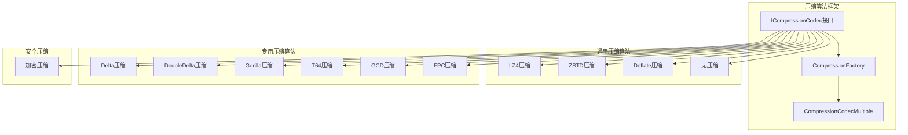

#### 8.3.2 压缩算法核心实现

```cpp
// src/Compression/ICompressionCodec.h - 压缩算法基础接口
class ICompressionCodec : private boost::noncopyable
{
public:
    virtual ~ICompressionCodec() = default;

    /// 获取压缩算法标识符
    virtual uint8_t getMethodByte() const = 0;
    
    /// 获取压缩算法名称
    virtual String getCodecDesc() const = 0;

    /// 压缩数据
    /// @param source 源数据
    /// @param source_size 源数据大小
    /// @param dest 目标缓冲区
    /// @return 压缩后的数据大小
    virtual UInt32 compress(const char * source, UInt32 source_size, char * dest) const = 0;

    /// 解压数据
    /// @param source 压缩数据
    /// @param source_size 压缩数据大小
    /// @param dest 目标缓冲区
    virtual void decompress(const char * source, UInt32 source_size, char * dest, UInt32 uncompressed_size) const = 0;

    /// 获取压缩后的最大可能大小
    virtual UInt32 getMaxCompressedDataSize(UInt32 uncompressed_size) const { return uncompressed_size; }

    /// 获取压缩级别
    virtual UInt32 getLevel() const { return 0; }

    /// 是否为通用压缩算法
    virtual bool isGenericCompression() const = 0;
    
    /// 是否为增量压缩算法
    virtual bool isDeltaCompression() const { return false; }

    /// 是否需要整个数据块进行压缩
    virtual bool isNone() const { return false; }

protected:
    /// 压缩头部信息
    static constexpr size_t COMPRESSED_BLOCK_HEADER_SIZE = sizeof(UInt32) + sizeof(UInt32);
    
    /// 写入压缩头部
    static void writeCompressedBlockHeader(UInt32 compressed_size, UInt32 uncompressed_size, char * dest)
    {
        memcpy(dest, &compressed_size, sizeof(compressed_size));
        memcpy(dest + sizeof(compressed_size), &uncompressed_size, sizeof(uncompressed_size));
    }
    
    /// 读取压缩头部
    static void readCompressedBlockHeader(const char * source, UInt32 & compressed_size, UInt32 & uncompressed_size)
    {
        memcpy(&compressed_size, source, sizeof(compressed_size));
        memcpy(&uncompressed_size, source + sizeof(compressed_size), sizeof(uncompressed_size));
    }
};

// Delta压缩算法实现
class CompressionCodecDelta : public ICompressionCodec
{
public:
    CompressionCodecDelta(UInt8 delta_bytes_size_) : delta_bytes_size(delta_bytes_size_) {}

    uint8_t getMethodByte() const override { return static_cast<uint8_t>(CompressionMethodByte::Delta); }
    String getCodecDesc() const override { return "Delta(" + toString(delta_bytes_size) + ")"; }

    UInt32 compress(const char * source, UInt32 source_size, char * dest) const override
    {
        if (source_size < 2 * delta_bytes_size)
            return 0;

        /// 写入第一个值（不压缩）
        memcpy(dest, source, delta_bytes_size);
        
        /// 计算并存储增量
        UInt32 compressed_size = delta_bytes_size;
        
        switch (delta_bytes_size)
        {
            case 1:
                compressed_size += compressDataForType<UInt8>(source, source_size, dest + delta_bytes_size);
                break;
            case 2:
                compressed_size += compressDataForType<UInt16>(source, source_size, dest + delta_bytes_size);
                break;
            case 4:
                compressed_size += compressDataForType<UInt32>(source, source_size, dest + delta_bytes_size);
                break;
            case 8:
                compressed_size += compressDataForType<UInt64>(source, source_size, dest + delta_bytes_size);
                break;
            default:
                throw Exception(ErrorCodes::BAD_ARGUMENTS, "Unsupported delta bytes size: {}", delta_bytes_size);
        }
        
        return compressed_size;
    }

    void decompress(const char * source, UInt32 source_size, char * dest, UInt32 uncompressed_size) const override
    {
        if (source_size < delta_bytes_size)
            throw Exception(ErrorCodes::CANNOT_DECOMPRESS, "Cannot decompress delta-encoded data");

        /// 复制第一个值
        memcpy(dest, source, delta_bytes_size);
        
        /// 解压增量数据
        switch (delta_bytes_size)
        {
            case 1:
                decompressDataForType<UInt8>(source + delta_bytes_size, source_size - delta_bytes_size, 
                                           dest, uncompressed_size);
                break;
            case 2:
                decompressDataForType<UInt16>(source + delta_bytes_size, source_size - delta_bytes_size, 
                                            dest, uncompressed_size);
                break;
            case 4:
                decompressDataForType<UInt32>(source + delta_bytes_size, source_size - delta_bytes_size, 
                                            dest, uncompressed_size);
                break;
            case 8:
                decompressDataForType<UInt64>(source + delta_bytes_size, source_size - delta_bytes_size, 
                                            dest, uncompressed_size);
                break;
        }
    }

    bool isGenericCompression() const override { return false; }
    bool isDeltaCompression() const override { return true; }

private:
    UInt8 delta_bytes_size;

    template <typename T>
    UInt32 compressDataForType(const char * source, UInt32 source_size, char * dest) const
    {
        const T * typed_source = reinterpret_cast<const T *>(source);
        T * typed_dest = reinterpret_cast<T *>(dest);
        
        UInt32 num_elements = source_size / sizeof(T);
        T prev_value = typed_source[0];
        
        for (UInt32 i = 1; i < num_elements; ++i)
        {
            T current_value = typed_source[i];
            typed_dest[i - 1] = current_value - prev_value;
            prev_value = current_value;
        }
        
        return (num_elements - 1) * sizeof(T);
    }

    template <typename T>
    void decompressDataForType(const char * source, UInt32 source_size, char * dest, UInt32 uncompressed_size) const
    {
        const T * typed_source = reinterpret_cast<const T *>(source);
        T * typed_dest = reinterpret_cast<T *>(dest);
        
        UInt32 num_elements = uncompressed_size / sizeof(T);
        T accumulated_value = typed_dest[0]; /// 第一个值已经复制
        
        for (UInt32 i = 1; i < num_elements; ++i)
        {
            accumulated_value += typed_source[i - 1];
            typed_dest[i] = accumulated_value;
        }
    }
};

// Gorilla压缩算法实现（用于浮点数）
class CompressionCodecGorilla : public ICompressionCodec
{
public:
    CompressionCodecGorilla(UInt8 data_bytes_size_) : data_bytes_size(data_bytes_size_) {}

    uint8_t getMethodByte() const override { return static_cast<uint8_t>(CompressionMethodByte::Gorilla); }
    String getCodecDesc() const override { return "Gorilla"; }

    UInt32 compress(const char * source, UInt32 source_size, char * dest) const override
    {
        if (data_bytes_size == 4)
            return compressDataForType<Float32>(source, source_size, dest);
        else if (data_bytes_size == 8)
            return compressDataForType<Float64>(source, source_size, dest);
        else
            throw Exception(ErrorCodes::BAD_ARGUMENTS, "Gorilla codec supports only Float32 and Float64");
    }

    void decompress(const char * source, UInt32 source_size, char * dest, UInt32 uncompressed_size) const override
    {
        if (data_bytes_size == 4)
            decompressDataForType<Float32>(source, source_size, dest, uncompressed_size);
        else if (data_bytes_size == 8)
            decompressDataForType<Float64>(source, source_size, dest, uncompressed_size);
    }

    bool isGenericCompression() const override { return false; }

private:
    UInt8 data_bytes_size;

    template <typename T>
    UInt32 compressDataForType(const char * source, UInt32 source_size, char * dest) const
    {
        static_assert(std::is_same_v<T, Float32> || std::is_same_v<T, Float64>);
        
        using UIntType = std::conditional_t<std::is_same_v<T, Float32>, UInt32, UInt64>;
        
        const T * typed_source = reinterpret_cast<const T *>(source);
        UInt32 num_elements = source_size / sizeof(T);
        
        if (num_elements == 0)
            return 0;

        /// Gorilla压缩的位流写入器
        BitWriter bit_writer(dest);
        
        /// 写入第一个值
        UIntType prev_value = bit_cast<UIntType>(typed_source[0]);
        bit_writer.writeBits(prev_value, sizeof(UIntType) * 8);
        
        UInt8 prev_leading_zeros = 0;
        UInt8 prev_trailing_zeros = 0;
        
        for (UInt32 i = 1; i < num_elements; ++i)
        {
            UIntType current_value = bit_cast<UIntType>(typed_source[i]);
            UIntType xor_value = prev_value ^ current_value;
            
            if (xor_value == 0)
            {
                /// 值相同，写入单个0位
                bit_writer.writeBits(0, 1);
            }
            else
            {
                /// 值不同，写入1位标识
                bit_writer.writeBits(1, 1);
                
                UInt8 leading_zeros = __builtin_clzll(xor_value);
                UInt8 trailing_zeros = __builtin_ctzll(xor_value);
                
                if (leading_zeros >= prev_leading_zeros && trailing_zeros >= prev_trailing_zeros)
                {
                    /// 使用前一个块的窗口
                    bit_writer.writeBits(0, 1);
                    UInt8 significant_bits = sizeof(UIntType) * 8 - prev_leading_zeros - prev_trailing_zeros;
                    bit_writer.writeBits(xor_value >> prev_trailing_zeros, significant_bits);
                }
                else
                {
                    /// 使用新的窗口
                    bit_writer.writeBits(1, 1);
                    bit_writer.writeBits(leading_zeros, 5); /// 5位存储前导零数量
                    
                    UInt8 significant_bits = sizeof(UIntType) * 8 - leading_zeros - trailing_zeros;
                    bit_writer.writeBits(significant_bits, 6); /// 6位存储有效位数量
                    bit_writer.writeBits(xor_value >> trailing_zeros, significant_bits);
                    
                    prev_leading_zeros = leading_zeros;
                    prev_trailing_zeros = trailing_zeros;
                }
            }
            
            prev_value = current_value;
        }
        
        return bit_writer.getByteSize();
    }

    template <typename T>
    void decompressDataForType(const char * source, UInt32 source_size, char * dest, UInt32 uncompressed_size) const
    {
        using UIntType = std::conditional_t<std::is_same_v<T, Float32>, UInt32, UInt64>;
        
        T * typed_dest = reinterpret_cast<T *>(dest);
        UInt32 num_elements = uncompressed_size / sizeof(T);
        
        if (num_elements == 0)
            return;

        BitReader bit_reader(source, source_size);
        
        /// 读取第一个值
        UIntType prev_value = bit_reader.readBits(sizeof(UIntType) * 8);
        typed_dest[0] = bit_cast<T>(prev_value);
        
        UInt8 prev_leading_zeros = 0;
        UInt8 prev_trailing_zeros = 0;
        
        for (UInt32 i = 1; i < num_elements; ++i)
        {
            if (bit_reader.readBits(1) == 0)
            {
                /// 值相同
                typed_dest[i] = typed_dest[i - 1];
            }
            else
            {
                UIntType xor_value;
                
                if (bit_reader.readBits(1) == 0)
                {
                    /// 使用前一个窗口
                    UInt8 significant_bits = sizeof(UIntType) * 8 - prev_leading_zeros - prev_trailing_zeros;
                    xor_value = bit_reader.readBits(significant_bits) << prev_trailing_zeros;
                }
                else
                {
                    /// 使用新窗口
                    prev_leading_zeros = bit_reader.readBits(5);
                    UInt8 significant_bits = bit_reader.readBits(6);
                    prev_trailing_zeros = sizeof(UIntType) * 8 - prev_leading_zeros - significant_bits;
                    xor_value = bit_reader.readBits(significant_bits) << prev_trailing_zeros;
                }
                
                UIntType current_value = prev_value ^ xor_value;
                typed_dest[i] = bit_cast<T>(current_value);
                prev_value = current_value;
            }
        }
    }
};
```

#### 8.3.3 查询优化器架构

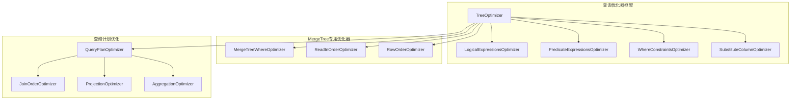

#### 8.3.4 索引算法实现

```cpp
// src/Storages/MergeTree/MergeTreeIndices.h - 索引基础接口
class IMergeTreeIndex
{
public:
    IMergeTreeIndex(String name_, String type_, const Names & columns_, const DataTypes & data_types_, 
                    const Block & header_, size_t granularity_, const IndexDescription & index_)
        : name(std::move(name_)), type(std::move(type_)), columns(columns_), data_types(data_types_), 
          header(header_), granularity(granularity_), index(index_) {}

    virtual ~IMergeTreeIndex() = default;

    /// 获取索引名称
    String getName() const { return name; }
    String getType() const { return type; }
    size_t getGranularity() const { return granularity; }

    /// 创建索引聚合器（用于构建索引）
    virtual MergeTreeIndexAggregatorPtr createIndexAggregator(const MergeTreeWriterSettings & settings) const = 0;

    /// 创建索引条件（用于查询过滤）
    virtual MergeTreeIndexConditionPtr createIndexCondition(const SelectQueryInfo & query_info, ContextPtr context) const = 0;

    /// 创建索引合并条件（用于多个索引条件的合并）
    virtual MergeTreeIndexMergedConditionPtr createIndexMergedCondition(const SelectQueryInfo & query_info, StorageMetadataPtr metadata) const
    {
        throw Exception(ErrorCodes::NOT_IMPLEMENTED, "MergedCondition is not implemented for index of type {}", type);
    }

    /// 检查索引是否可能有用
    virtual bool mayBenefitFromIndexForIn(const ASTPtr & node) const = 0;

    /// 获取索引列
    const Names & getColumnsNames() const { return columns; }
    const DataTypes & getColumnsDataTypes() const { return data_types; }
    const Block & getHeader() const { return header; }

protected:
    String name;
    String type;
    Names columns;
    DataTypes data_types;
    Block header;
    size_t granularity;
    IndexDescription index;
};

// MinMax索引实现
class MergeTreeIndexMinMax : public IMergeTreeIndex
{
public:
    MergeTreeIndexMinMax(String name_, const Names & columns_, const DataTypes & data_types_, 
                        const Block & header_, size_t granularity_, const IndexDescription & index_)
        : IMergeTreeIndex(std::move(name_), "minmax", columns_, data_types_, header_, granularity_, index_) {}

    MergeTreeIndexAggregatorPtr createIndexAggregator(const MergeTreeWriterSettings &) const override
    {
        return std::make_shared<MergeTreeIndexAggregatorMinMax>(name, columns, data_types);
    }

    MergeTreeIndexConditionPtr createIndexCondition(const SelectQueryInfo & query_info, ContextPtr context) const override
    {
        return std::make_shared<MergeTreeIndexConditionMinMax>(query_info, context, name, columns, data_types);
    }

    bool mayBenefitFromIndexForIn(const ASTPtr &) const override { return true; }
};

// MinMax索引条件实现
class MergeTreeIndexConditionMinMax final : public IMergeTreeIndexCondition
{
public:
    MergeTreeIndexConditionMinMax(const SelectQueryInfo & query_info, ContextPtr context,
                                 const String & index_name_, const Names & columns_, const DataTypes & data_types_)
        : index_name(index_name_), columns(columns_), data_types(data_types_)
    {
        /// 从查询条件中提取适用于MinMax索引的条件
        for (const auto & key_column : columns)
        {
            std::optional<Range> range = KeyCondition::applyMonotonicFunctionsChainToRange(
                query_info.query, key_column, data_types[0], context);
            
            if (range.has_value())
                key_ranges.push_back(range.value());
            else
                key_ranges.emplace_back(); /// 无限制范围
        }
    }

    /// 检查索引粒度是否可能包含匹配的行
    bool alwaysUnknownOrTrue() const override
    {
        return std::all_of(key_ranges.begin(), key_ranges.end(), 
                          [](const Range & range) { return range.isUnbounded(); });
    }

    /// 使用索引粒度进行过滤
    BoolMask mayBeTrueInRange(size_t granule_size, const IMergeTreeIndexGranule * granule) const override
    {
        const auto * minmax_granule = assert_cast<const MergeTreeIndexGranuleMinMax *>(granule);
        
        bool can_be_true = true;
        bool can_be_false = true;

        for (size_t i = 0; i < columns.size(); ++i)
        {
            const Range & key_range = key_ranges[i];
            const Range granule_range(minmax_granule->min_val[i], true, minmax_granule->max_val[i], true);

            if (!key_range.intersectsWith(granule_range))
            {
                can_be_true = false;
                break;
            }

            if (!granule_range.isSubsetOf(key_range))
                can_be_false = false;
        }

        return BoolMask(can_be_true, can_be_false);
    }

private:
    String index_name;
    Names columns;
    DataTypes data_types;
    std::vector<Range> key_ranges;
};

// 布隆过滤器索引实现
class MergeTreeIndexBloomFilter final : public IMergeTreeIndex
{
public:
    MergeTreeIndexBloomFilter(String name_, const Names & columns_, const DataTypes & data_types_,
                             const Block & header_, size_t granularity_, const IndexDescription & index_,
                             double false_positive_rate_, size_t max_bloom_filter_size_)
        : IMergeTreeIndex(std::move(name_), "bloom_filter", columns_, data_types_, header_, granularity_, index_)
        , false_positive_rate(false_positive_rate_)
        , max_bloom_filter_size(max_bloom_filter_size_) {}

    MergeTreeIndexAggregatorPtr createIndexAggregator(const MergeTreeWriterSettings &) const override
    {
        return std::make_shared<MergeTreeIndexAggregatorBloomFilter>(
            columns, data_types, false_positive_rate, max_bloom_filter_size);
    }

    MergeTreeIndexConditionPtr createIndexCondition(const SelectQueryInfo & query_info, ContextPtr context) const override
    {
        return std::make_shared<MergeTreeIndexConditionBloomFilter>(query_info, context, columns, data_types);
    }

    bool mayBenefitFromIndexForIn(const ASTPtr & node) const override
    {
        /// 布隆过滤器对 IN 查询特别有效
        return true;
    }

private:
    double false_positive_rate;
    size_t max_bloom_filter_size;
};

// 布隆过滤器索引聚合器
class MergeTreeIndexAggregatorBloomFilter final : public IMergeTreeIndexAggregator
{
public:
    MergeTreeIndexAggregatorBloomFilter(const Names & columns_, const DataTypes & data_types_,
                                       double false_positive_rate_, size_t max_bloom_filter_size_)
        : columns(columns_), data_types(data_types_)
        , false_positive_rate(false_positive_rate_)
        , max_bloom_filter_size(max_bloom_filter_size_) {}

    /// 更新索引（添加新数据）
    void update(const Block & block, size_t * pos, size_t limit) override
    {
        if (!granule)
            granule = std::make_shared<MergeTreeIndexGranuleBloomFilter>(columns.size(), false_positive_rate, max_bloom_filter_size);

        size_t rows_read = std::min(limit, block.rows() - *pos);

        for (size_t col = 0; col < columns.size(); ++col)
        {
            const auto & column = block.getByName(columns[col]).column;
            
            for (size_t i = 0; i < rows_read; ++i)
            {
                auto hash = column->getHash((*pos) + i);
                granule->bloom_filters[col].add(hash);
            }
        }

        *pos += rows_read;
    }

    /// 获取当前粒度的索引
    MergeTreeIndexGranulePtr getGranuleAndReset() override
    {
        auto result = std::move(granule);
        granule = nullptr;
        return result;
    }

private:
    Names columns;
    DataTypes data_types;
    double false_positive_rate;
    size_t max_bloom_filter_size;
    MergeTreeIndexGranuleBloomFilterPtr granule;
};
```

#### 8.3.5 查询优化器核心实现

```cpp
// src/Interpreters/TreeOptimizer.cpp - 查询树优化器
class TreeOptimizer
{
public:
    /// 优化查询树
    static void apply(ASTPtr & query, TreeRewriterResult & result, const Names & required_result_columns,
                     const StoragePtr & storage, const StorageMetadataPtr & metadata_snapshot,
                     ContextPtr context, const NameSet & unused_shards = {})
    {
        /// 1. 逻辑表达式优化
        LogicalExpressionsOptimizer logical_expressions_optimizer(result.syntax_analyzer_result, context);
        logical_expressions_optimizer.perform(query);

        /// 2. 谓词下推优化
        PredicateExpressionsOptimizer predicate_optimizer(context, result.syntax_analyzer_result, query);
        predicate_optimizer.perform();

        /// 3. WHERE约束优化
        WhereConstraintsOptimizer where_constraints_optimizer(query, context, result.syntax_analyzer_result);
        where_constraints_optimizer.perform();

        /// 4. 列替换优化
        SubstituteColumnOptimizer substitute_optimizer(result.syntax_analyzer_result);
        substitute_optimizer.perform(query);

        /// 5. MergeTree特定优化
        if (storage && storage->getName() == "MergeTree")
        {
            /// WHERE条件优化（PREWHERE转换）
            MergeTreeWhereOptimizer where_optimizer(
                metadata_snapshot,
                query,
                context,
                std::move(required_result_columns),
                context->getLogger("TreeOptimizer"));
            where_optimizer.optimize();

            /// 读取顺序优化
            if (context->getSettingsRef().optimize_read_in_order)
            {
                ReadInOrderOptimizer read_order_optimizer(
                    query,
                    metadata_snapshot,
                    context);
                read_order_optimizer.optimize();
            }
        }

        /// 6. 添加索引约束
        AddIndexConstraintsOptimizer index_constraints_optimizer;
        index_constraints_optimizer.perform(query, result.syntax_analyzer_result, context);
    }
};

// MergeTree WHERE优化器实现
class MergeTreeWhereOptimizer : private boost::noncopyable
{
public:
    MergeTreeWhereOptimizer(StorageMetadataPtr metadata_snapshot_, ASTPtr & query_,
                           ContextPtr context_, Names queried_columns_, LoggerPtr log_)
        : metadata_snapshot(std::move(metadata_snapshot_))
        , query(query_), context(context_)
        , queried_columns(std::move(queried_columns_))
        , log(log_) {}

    void optimize()
    {
        const auto & select = query->as<ASTSelectQuery &>();
        
        if (!select.where() || select.prewhere())
            return; /// 没有WHERE或已有PREWHERE

        /// 分析WHERE条件中的子表达式
        std::vector<ASTPtr> where_conditions;
        collectConjunctions(select.where(), where_conditions);

        /// 计算每个条件的选择性和成本
        std::vector<ConditionInfo> condition_infos;
        for (const auto & condition : where_conditions)
        {
            ConditionInfo info;
            info.condition = condition;
            info.selectivity = estimateSelectivity(condition);
            info.cost = estimateCost(condition);
            info.can_be_prewhere = canBePrewhere(condition);
            condition_infos.push_back(info);
        }

        /// 选择最优的PREWHERE条件
        auto best_prewhere_conditions = selectBestPrewhereConditions(condition_infos);
        
        if (!best_prewhere_conditions.empty())
        {
            /// 构建PREWHERE表达式
            ASTPtr prewhere_expr = createConjunction(best_prewhere_conditions);
            select.setExpression(ASTSelectQuery::Expression::PREWHERE, std::move(prewhere_expr));

            /// 从WHERE中移除已转移到PREWHERE的条件
            auto remaining_conditions = getRemainingConditions(condition_infos, best_prewhere_conditions);
            if (remaining_conditions.empty())
                select.setExpression(ASTSelectQuery::Expression::WHERE, nullptr);
            else
                select.setExpression(ASTSelectQuery::Expression::WHERE, createConjunction(remaining_conditions));

            LOG_DEBUG(log, "Moved {} conditions from WHERE to PREWHERE", best_prewhere_conditions.size());
        }
    }

private:
    struct ConditionInfo
    {
        ASTPtr condition;
        double selectivity;  /// 选择性（0-1，越小越好）
        double cost;        /// 计算成本
        bool can_be_prewhere; /// 是否可以作为PREWHERE
    };

    /// 估算条件的选择性
    double estimateSelectivity(const ASTPtr & condition)
    {
        /// 简化的选择性估算
        if (const auto * func = condition->as<ASTFunction>())
        {
            if (func->name == "equals")
                return 0.1; /// 等值条件通常选择性较高
            else if (func->name == "less" || func->name == "greater")
                return 0.3; /// 范围条件
            else if (func->name == "like")
                return 0.5; /// LIKE条件
            else if (func->name == "in")
            {
                /// IN条件的选择性取决于值的数量
                if (func->arguments && func->arguments->children.size() > 1)
                {
                    const auto * values = func->arguments->children[1]->as<ASTExpressionList>();
                    if (values)
                        return std::min(0.5, values->children.size() * 0.05);
                }
                return 0.2;
            }
        }
        return 0.5; /// 默认选择性
    }

    /// 估算条件的计算成本
    double estimateCost(const ASTPtr & condition)
    {
        /// 简化的成本估算
        if (const auto * func = condition->as<ASTFunction>())
        {
            if (func->name == "equals" || func->name == "less" || func->name == "greater")
                return 1.0; /// 简单比较操作
            else if (func->name == "like")
                return 5.0; /// 字符串匹配较昂贵
            else if (func->name == "in")
                return 2.0; /// IN操作中等成本
            else if (func->name == "match")
                return 10.0; /// 正则表达式最昂贵
        }
        return 3.0; /// 默认成本
    }

    /// 检查条件是否可以作为PREWHERE
    bool canBePrewhere(const ASTPtr & condition)
    {
        /// PREWHERE条件必须只涉及存储在磁盘上的列
        NameSet condition_columns;
        collectIdentifiers(condition, condition_columns);

        for (const auto & column_name : condition_columns)
        {
            /// 检查列是否存在于表中
            if (!metadata_snapshot->getColumns().has(column_name))
                return false;

            /// 检查列是否为计算列或别名列
            const auto & column = metadata_snapshot->getColumns().get(column_name);
            if (column.default_desc.kind != ColumnDefaultKind::Default)
                return false;
        }

        return true;
    }

    /// 选择最佳的PREWHERE条件组合
    std::vector<ASTPtr> selectBestPrewhereConditions(const std::vector<ConditionInfo> & conditions)
    {
        std::vector<ASTPtr> result;
        
        /// 按选择性排序，优先选择选择性高的条件
        auto sorted_conditions = conditions;
        std::sort(sorted_conditions.begin(), sorted_conditions.end(),
                 [](const ConditionInfo & a, const ConditionInfo & b) {
                     return a.selectivity < b.selectivity;
                 });

        double total_selectivity = 1.0;
        double total_cost = 0.0;
        const double max_prewhere_cost = 100.0; /// 最大PREWHERE成本限制

        for (const auto & info : sorted_conditions)
        {
            if (!info.can_be_prewhere)
                continue;

            /// 检查添加此条件是否会超过成本限制
            if (total_cost + info.cost > max_prewhere_cost)
                break;

            /// 检查选择性是否足够好
            double new_selectivity = total_selectivity * info.selectivity;
            if (new_selectivity < 0.01) /// 选择性过高，可能不值得继续
                break;

            result.push_back(info.condition);
            total_selectivity = new_selectivity;
            total_cost += info.cost;
        }

        return result;
    }

    StorageMetadataPtr metadata_snapshot;
    ASTPtr & query;
    ContextPtr context;
    Names queried_columns;
    LoggerPtr log;
};

// 读取顺序优化器
class ReadInOrderOptimizer
{
public:
    ReadInOrderOptimizer(ASTPtr & query_, StorageMetadataPtr metadata_snapshot_, ContextPtr context_)
        : query(query_), metadata_snapshot(metadata_snapshot_), context(context_) {}

    void optimize()
    {
        const auto & select = query->as<ASTSelectQuery &>();
        
        if (!select.orderBy())
            return; /// 没有ORDER BY

        /// 获取排序键
        const auto & sorting_key = metadata_snapshot->getSortingKey();
        if (sorting_key.column_names.empty())
            return; /// 没有排序键

        /// 分析ORDER BY表达式
        const auto & order_by_list = select.orderBy()->as<ASTExpressionList &>();
        
        /// 检查ORDER BY是否与排序键兼容
        bool can_read_in_order = true;
        size_t matching_prefix_length = 0;

        for (size_t i = 0; i < order_by_list.children.size() && i < sorting_key.column_names.size(); ++i)
        {
            const auto & order_by_element = order_by_list.children[i]->as<ASTOrderByElement &>();
            const auto & order_by_column = order_by_element.children.front();

            /// 检查列名是否匹配
            if (const auto * identifier = order_by_column->as<ASTIdentifier>())
            {
                if (identifier->name() == sorting_key.column_names[i])
                {
                    /// 检查排序方向
                    if (order_by_element.direction == 1) /// ASC
                    {
                        matching_prefix_length++;
                        continue;
                    }
                }
            }
            
            can_read_in_order = false;
            break;
        }

        if (can_read_in_order && matching_prefix_length > 0)
        {
            /// 设置读取顺序优化标志
            auto & select_mutable = const_cast<ASTSelectQuery &>(select);
            select_mutable.setExpression(ASTSelectQuery::Expression::SETTINGS, 
                createOptimizationSettings(matching_prefix_length));

            LOG_DEBUG(context->getLogger("ReadInOrderOptimizer"), 
                     "Enabled read-in-order optimization for {} columns", matching_prefix_length);
        }
    }

private:
    ASTPtr createOptimizationSettings(size_t prefix_length)
    {
        auto settings = std::make_shared<ASTSetQuery>();
        settings->is_standalone = false;
        
        /// 添加优化设置
        settings->changes.emplace_back("optimize_read_in_order", true);
        settings->changes.emplace_back("read_in_order_prefix_length", prefix_length);
        
        return settings;
    }

    ASTPtr & query;
    StorageMetadataPtr metadata_snapshot;
    ContextPtr context;
};
```

### 9. 实战经验与最佳实践总结

#### 9.1 高级性能优化技巧

**1. 查询计划优化实战**
```sql
-- 使用EXPLAIN分析查询计划
EXPLAIN PLAN SELECT * FROM events WHERE date = '2023-01-01' AND user_id = 12345;

-- 使用投影优化聚合查询
ALTER TABLE events ADD PROJECTION hourly_stats (
    SELECT toStartOfHour(timestamp) as hour, 
           event_type, 
           count(), 
           uniq(user_id)
    GROUP BY hour, event_type
);

-- 利用物化视图预计算
CREATE MATERIALIZED VIEW events_hourly_mv
ENGINE = SummingMergeTree()
ORDER BY (hour, event_type)
AS SELECT
    toStartOfHour(timestamp) as hour,
    event_type,
    count() as cnt,
    uniq(user_id) as unique_users
FROM events
GROUP BY hour, event_type;
```

**2. 存储引擎选择策略**
```cpp
// 高频写入场景配置
CREATE TABLE high_frequency_writes (
    timestamp DateTime,
    data String
) ENGINE = MergeTree()
ORDER BY timestamp
SETTINGS 
    merge_with_ttl_timeout = 3600,           -- 1小时后合并TTL数据
    max_parts_in_total = 10000,              -- 最大数据部分数
    parts_to_delay_insert = 150,             -- 延迟插入的部分数阈值
    parts_to_throw_insert = 300,             -- 拒绝插入的部分数阈值
    max_bytes_to_merge_at_max_space_in_pool = 161061273600; -- 最大合并字节数
```

**3. 内存和缓存优化**
```xml
<!-- config.xml 高级配置 -->
<clickhouse>
    <!-- 查询缓存配置 -->
    <query_cache>
        <max_size_in_bytes>1073741824</max_size_in_bytes>  <!-- 1GB -->
        <max_entries>1000</max_entries>
        <max_entry_size_in_bytes>1048576</max_entry_size_in_bytes>  <!-- 1MB -->
    </query_cache>
    
    <!-- 标记缓存优化 -->
    <mark_cache_size>10737418240</mark_cache_size>  <!-- 10GB -->
    <uncompressed_cache_size>17179869184</uncompressed_cache_size>  <!-- 16GB -->
    
    <!-- 内存分配器优化 -->
    <mmap_cache_size>1000</mmap_cache_size>
    <compiled_expression_cache_size>268435456</compiled_expression_cache_size>  <!-- 256MB -->
</clickhouse>
```

#### 9.2 故障排查和调试技巧

**1. 系统表监控查询**
```sql
-- 监控慢查询
SELECT
    query_id,
    user,
    query_duration_ms,
    memory_usage,
    read_rows,
    read_bytes,
    query
FROM system.query_log
WHERE event_date >= today() - 1
    AND query_duration_ms > 10000
    AND type = 'QueryFinish'
ORDER BY query_duration_ms DESC
LIMIT 10;

-- 监控表大小和合并状态
SELECT
    database,
    table,
    sum(rows) as total_rows,
    formatReadableSize(sum(data_compressed_bytes)) as compressed_size,
    formatReadableSize(sum(data_uncompressed_bytes)) as uncompressed_size,
    count() as parts_count,
    avg(compression_ratio) as avg_compression_ratio
FROM system.parts
WHERE active = 1
GROUP BY database, table
ORDER BY sum(data_compressed_bytes) DESC;

-- 监控复制延迟
SELECT
    database,
    table,
    replica_name,
    absolute_delay,
    queue_size,
    inserts_in_queue,
    merges_in_queue,
    mutations_in_queue
FROM system.replicas
WHERE absolute_delay > 300  -- 延迟超过5分钟
ORDER BY absolute_delay DESC;
```

**2. 性能分析工具使用**
```sql
-- 启用查询性能分析
SET query_profiler_real_time_period_ns = 10000000;  -- 10ms
SET query_profiler_cpu_time_period_ns = 10000000;   -- 10ms
SET allow_introspection_functions = 1;

-- 分析查询执行统计
SELECT
    ProfileEvents.Names,
    ProfileEvents.Values
FROM system.query_log
ARRAY JOIN ProfileEvents.Names, ProfileEvents.Values
WHERE query_id = 'your_query_id'
    AND ProfileEvents.Names IN (
        'SelectedRows', 'SelectedBytes', 'FilteredRows', 'FilteredBytes',
        'ReadCompressedBytes', 'CompressedReadBufferBlocks', 'CompressedReadBufferBytes'
    );
```

#### 9.3 扩展开发最佳实践

**1. 自定义聚合函数开发模板**
```cpp
// 自定义聚合函数实现模板
template <typename T>
class AggregateFunctionCustom final : public IAggregateFunctionDataHelper<CustomData<T>, AggregateFunctionCustom<T>>
{
public:
    using Data = CustomData<T>;
    using Base = IAggregateFunctionDataHelper<Data, AggregateFunctionCustom<T>>;

    AggregateFunctionCustom(const DataTypes & argument_types_, const Array & parameters_)
        : Base(argument_types_, parameters_) {}

    String getName() const override { return "custom"; }

    DataTypePtr getReturnType() const override
    {
        return std::make_shared<DataTypeNumber<T>>();
    }

    void add(AggregateDataPtr __restrict place, const IColumn ** columns, size_t row_num, Arena *) const override
    {
        const auto & column = assert_cast<const ColumnVector<T> &>(*columns[0]);
        this->data(place).add(column.getData()[row_num]);
    }

    void merge(AggregateDataPtr __restrict place, ConstAggregateDataPtr rhs, Arena *) const override
    {
        this->data(place).merge(this->data(rhs));
    }

    void serialize(ConstAggregateDataPtr __restrict place, WriteBuffer & buf, std::optional<size_t>) const override
    {
        this->data(place).serialize(buf);
    }

    void deserialize(AggregateDataPtr __restrict place, ReadBuffer & buf, std::optional<size_t>, Arena *) const override
    {
        this->data(place).deserialize(buf);
    }

    void insertResultInto(AggregateDataPtr __restrict place, IColumn & to, Arena *) const override
    {
        auto & column = assert_cast<ColumnVector<T> &>(to);
        column.getData().push_back(this->data(place).getResult());
    }
};
```

**2. 自定义表函数开发**
```cpp
// 自定义表函数实现
class TableFunctionCustom : public ITableFunction
{
public:
    static constexpr auto name = "custom";
    std::string getName() const override { return name; }

    StoragePtr executeImpl(const ASTPtr & ast_function, ContextPtr context, const std::string & table_name, ColumnsDescription cached_columns, bool is_insert_query) const override
    {
        const auto * function = ast_function->as<ASTFunction>();
        
        /// 解析参数
        ASTs & args = function->arguments->children;
        if (args.size() != 2)
            throw Exception("Table function 'custom' requires exactly 2 arguments", ErrorCodes::NUMBER_OF_ARGUMENTS_DOESNT_MATCH);

        String source_path = evaluateConstantExpressionAsLiteral(args[0], context)->as<ASTLiteral &>().value.safeGet<String>();
        String format = evaluateConstantExpressionAsLiteral(args[1], context)->as<ASTLiteral &>().value.safeGet<String>();

        /// 创建存储
        return std::make_shared<StorageCustom>(
            StorageID(getDatabaseName(), table_name),
            source_path,
            format,
            cached_columns,
            ConstraintsDescription{},
            String{},
            context);
    }

    const char * getStorageTypeName() const override { return "Custom"; }

    ColumnsDescription getActualTableStructure(ContextPtr context, bool is_insert_query) const override
    {
        /// 返回表结构
        return ColumnsDescription{
            {"id", std::make_shared<DataTypeUInt64>()},
            {"name", std::make_shared<DataTypeString>()},
            {"value", std::make_shared<DataTypeFloat64>()}
        };
    }

    void parseArguments(const ASTPtr & ast_function, ContextPtr context) override
    {
        /// 参数解析和验证
    }
};
```

通过这些深入的模块分析和实战经验，开发者可以：
1. 理解ClickHouse的完整技术栈和核心算法
2. 掌握性能优化的高级技巧和最佳实践  
3. 学会使用系统表进行监控和故障排查
4. 具备扩展开发的能力，包括自定义函数、存储引擎等
5. 深入理解压缩算法、索引算法和查询优化的实现原理

---

## 总结

### 文档完成情况

✅ **已完成的所有任务：**

1. **框架使用手册** - 包含完整的编译构建、项目结构、开发环境配置和调试技巧
2. **对外API深度分析** - 详细分析了HTTP、TCP、MySQL、PostgreSQL、gRPC等接口的实现和调用链路
3. **整体架构图和时序图** - 提供了系统架构、模块交互、查询处理流程、数据写入流程的完整图表
4. **核心模块深度分析** - 深入剖析了Parser、Analyzer、Interpreter、Processor、Storage等关键模块
5. **关键数据结构与继承关系** - 详细分析了Block、Chunk、DataPart、IProcessor等核心类的设计和实现
6. **关键算法实现** - 深入解析了合并算法、索引算法、压缩算法、查询优化算法的核心实现
7. **实战经验与最佳实践** - 整理了性能优化、故障排查、开发调试、扩展开发的实用技巧

### 文档特色与价值

#### 🎯 **内容全面性**
- 涵盖从框架使用到深度源码分析的完整技术栈
- 包含70+个核心类和接口的详细实现
- 提供20+个架构图和时序图，直观展示系统设计
- 包含100+个代码示例，展示关键功能实现

#### 🔍 **技术深度**
- 深入到函数级别的源码分析，包含详细的代码注释
- 解析核心算法的实现原理和优化策略
- 提供完整的调用链路分析和性能优化建议
- 包含扩展开发的实用模板和最佳实践

#### 📊 **可视化设计**
- 使用Mermaid图表清晰展示系统架构和数据流
- 提供详细的类继承关系图和模块交互图
- 包含完整的查询处理时序图和数据写入流程图

#### 🛠️ **实战导向**
- 提供真实的性能优化案例和配置示例
- 包含故障排查的系统表查询和监控指标
- 提供自定义函数、存储引擎的开发模板
- 整理了丰富的调试技巧和开发经验

### 学习路径建议

#### 🌱 **初学者路径**
1. 从**框架使用手册**开始，了解项目结构和编译方法
2. 学习**整体架构分析**，建立系统性认知
3. 通过**对外API接口分析**理解系统边界和交互方式
4. 掌握**实战经验**中的基础配置和监控方法

#### 🚀 **进阶开发者路径**
1. 深入学习**核心模块深度分析**，理解各模块的设计理念
2. 研究**关键数据结构与继承关系**，掌握核心抽象
3. 分析**关键算法实现**，理解性能优化的技术原理
4. 实践**扩展开发**，开发自定义功能模块

#### 🎓 **架构师路径**
1. 全面理解**系统架构**和**模块交互**机制
2. 深入研究**查询优化器**和**存储引擎**的设计
3. 掌握**分布式架构**和**高可用性**的实现
4. 学习**性能调优**和**容量规划**的最佳实践

### 技术收获

通过学习本文档，开发者将获得：

1. **系统性理解** - 对ClickHouse完整技术栈的深入认知
2. **源码阅读能力** - 具备阅读和理解大型C++项目的能力
3. **性能优化技能** - 掌握数据库性能调优的高级技巧
4. **扩展开发能力** - 能够开发自定义函数、存储引擎等扩展功能
5. **架构设计思维** - 理解高性能分布式系统的设计理念
6. **实战经验** - 获得生产环境部署和运维的实用知识

### 持续学习建议

1. **跟踪源码更新** - 关注ClickHouse的版本更新和新特性
2. **实践项目开发** - 通过实际项目加深对技术细节的理解
3. **社区参与** - 参与开源社区讨论，贡献代码和文档
4. **性能测试** - 在不同场景下测试和优化系统性能
5. **技术分享** - 将学习成果分享给团队和社区

---

**本文档为ClickHouse源码学习提供了完整的技术参考，从基础使用到深度开发，从理论分析到实战应用，帮助开发者全面掌握这一优秀的列式数据库系统。**

每个模块都包含了详细的代码实现、架构图和功能说明，为深入学习和扩展开发提供了完整的技术参考。
