# Dify-01-Workflow工作流引擎

## 模块概览

## 模块职责

Workflow工作流引擎是 Dify 平台的核心编排系统，负责将复杂的 AI 任务分解为可视化的节点图，并按照依赖关系和条件逻辑进行调度执行。该模块实现了有向无环图（DAG）的执行引擎，支持20+种节点类型、并行处理、循环控制和条件分支，为用户提供强大的可视化编程能力。

**蜂巢架构设计理念：**
Dify采用了**蜂巢架构（Beehive Architecture）**设计理念：

- **模块独立性**：每个功能模块如蜂巢中的独立单元，可单独升级或替换
- **松耦合设计**：模块间通过标准接口通信，降低依赖性
- **水平扩展性**：新节点类型和功能可无缝集成到现有架构中
- **故障隔离**：单个模块的故障不会影响整个系统的运行

**事件驱动执行模式：**
工作流执行采用**事件驱动架构**，通过TaskPipeline实现：

- **异步事件处理**：节点执行、状态变更、错误处理都通过事件机制传递
- **流式处理支持**：支持流式输出，提升用户体验
- **状态持久化**：执行状态实时保存，支持断点续传和故障恢复

**核心职责：**

- 图结构定义与验证：支持 DAG（有向无环图）和有条件分支的工作流
- 节点编排与调度：根据节点依赖关系动态调度执行
- 并行执行：无依赖节点自动并行，提升执行效率
- 状态管理：支持暂停/恢复/停止，状态持久化
- 事件驱动：通过事件总线实现节点间解耦
- 变量传递：全局变量池支持节点间数据流转
- 错误处理：支持节点级别重试和失败处理策略
- 外部控制：通过命令通道实现外部实时控制

**输入/输出：**

**输入：**

- Graph 定义（节点+边）
- 用户输入变量
- 系统变量（用户ID、租户ID等）
- 环境变量

**输出：**

- GraphEngineEvent 流：节点执行事件、错误事件、完成事件
- 变量池：最终的所有变量值
- 执行状态：成功/失败/中断
- 执行元数据：耗时、Token 消耗等

**上下游依赖：**

**上游调用方：**

- `WorkflowAppRunner`：工作流应用运行器
- `Console API`：控制台手动触发
- `Service API`：外部 API 调用

**下游依赖：**

- **节点执行器**：各类节点实现（LLM、Code、HTTP等）
- **Model Runtime**：LLM 调用
- **PostgreSQL**：状态持久化
- **Redis**：命令通道（分布式场景）

## 生命周期

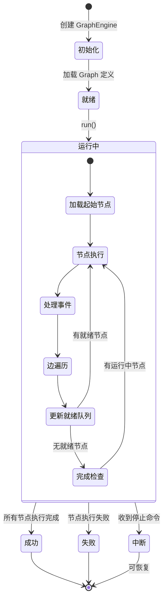

**生命周期阶段说明：**

1. **初始化阶段** (`__init__`)
   - 创建 GraphEngine 实例
   - 初始化所有子系统（StateManager、EventManager、WorkerPool等）
   - 从持久化状态恢复（如果是断点续传）
   - 验证 Graph 一致性

2. **就绪阶段**
   - 等待外部调用 `run()` 方法
   - 此时可以添加 Layer 扩展功能

3. **运行阶段** (`run()`)
   - 发送 `GraphRunStartedEvent`
   - 循环处理节点执行
   - 实时响应外部命令
   - 流式输出事件

4. **终止阶段**
   - 正常完成：`GraphRunSucceededEvent`
   - 失败：`GraphRunFailedEvent`
   - 中断：`GraphRunAbortedEvent`
   - 保存最终状态到数据库

## 模块架构图

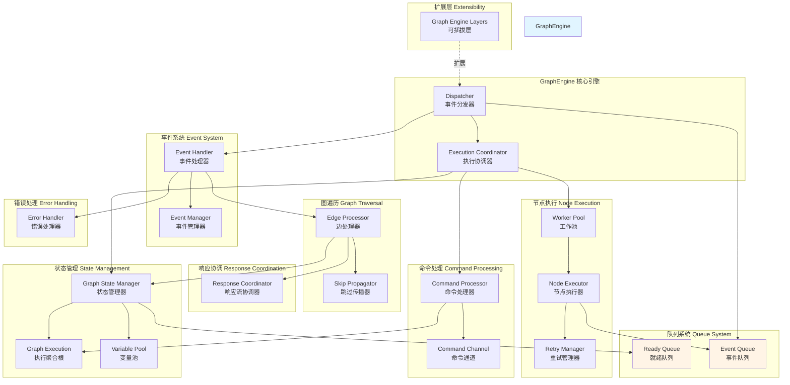

### 架构说明

**1. 核心引擎层 (GraphEngine)**

`GraphEngine` 是整个工作流引擎的门面，对外提供简单的 `run()` 接口。内部通过模块化设计，将职责分配给各个专门的子系统。

- **Dispatcher（事件分发器）**：核心调度循环，负责从事件队列中取出事件，分发给对应的处理器，驱动整个执行流程
- **ExecutionCoordinator（执行协调器）**：高层协调逻辑，检查命令、触发 Worker 扩缩容、判断执行完成

**2. 状态管理层 (State Management)**

负责工作流执行过程中所有状态的维护和变更。

- **GraphExecution（执行聚合根）**：DDD 聚合根，维护工作流运行级别的状态（开始时间、结束时间、状态、错误信息）
- **GraphStateManager（状态管理器）**：统一的状态管理门面，协调节点状态变更、队列操作、变量池更新
- **VariablePool（变量池）**：全局变量存储，支持节点间数据传递，使用 `{{#node_id.variable#}}` 语法引用

**3. 队列系统 (Queue System)**

解耦节点依赖，支持并行执行。

- **ReadyQueue（就绪队列）**：存储可立即执行的节点，支持优先级调度
  - 内存实现：`InMemoryReadyQueue`（单机场景）
  - 可扩展为分布式队列（Redis/RabbitMQ）
- **EventQueue（事件队列）**：节点执行产生的事件临时缓冲，Dispatcher 从中消费

**4. 节点执行层 (Node Execution)**

负责节点的实际执行。

- **WorkerPool（工作池）**：线程池管理，动态扩缩容
  - 根据队列长度自动扩容 (`scale_up_threshold`)
  - Worker 空闲超时自动缩容 (`scale_down_idle_time`)
- **NodeExecutor（节点执行器）**：在 Worker 线程中运行，调用节点的 `_run()` 方法
- **RetryManager（重试管理器）**：节点失败时根据配置执行重试逻辑

**5. 事件系统 (Event System)**

事件驱动架构，解耦各模块。

- **EventManager（事件管理器）**：收集和发布事件，支持流式输出给外部调用方
- **EventHandler（事件处理器）**：注册各类事件的处理逻辑
  - `NodeRunStartedEvent` → 记录开始时间
  - `NodeRunSucceededEvent` → 触发边遍历
  - `NodeRunFailedEvent` → 错误处理和传播

**6. 图遍历层 (Graph Traversal)**

负责根据执行结果决定下一步执行路径。

- **EdgeProcessor（边处理器）**：处理节点执行后的出边，判断条件分支
  - 条件判断（If-Else 节点）
  - 路由选择（多分支节点）
  - 收集后继节点依赖满足情况
- **SkipPropagator（跳过传播器）**：传播跳过状态
  - 当节点被跳过时，沿着依赖链传播跳过状态
  - 避免后续节点等待永远不会到来的前置依赖

**7. 响应协调层 (Response Coordination)**

管理流式响应的生成和路径追踪。

- **ResponseCoordinator（响应流协调器）**：
  - 跟踪 Answer 节点和 End 节点的输出路径
  - 协调多个分支的响应合并
  - 支持 SSE 流式输出

**8. 命令处理层 (Command Processing)**

接收外部控制命令。

- **CommandChannel（命令通道）**：命令传输通道
  - `InMemoryChannel`：单进程内存通道（默认）
  - `RedisChannel`：跨进程分布式通道
- **CommandProcessor（命令处理器）**：处理命令
  - `AbortCommand`：停止执行
  - `PauseCommand`：暂停执行（未来支持）
  - `ResumeCommand`：恢复执行（未来支持）

**9. 错误处理层 (Error Handling)**

统一的错误处理和恢复。

- **ErrorHandler（错误处理器）**：
  - 节点执行失败处理
  - 根据 `error_strategy` 决定：
    - `TERMINATE`：终止整个工作流
    - `CONTINUE`：继续执行其他分支
    - `SKIP`：跳过后续依赖节点

**10. 扩展层 (Extensibility)**

通过 Layer 模式扩展功能。

- **GraphEngineLayer**：可插拔的扩展点
  - `DebugLoggingLayer`：调试日志记录
  - `TracingLayer`：分布式追踪
  - `MetricsLayer`：指标收集

### 边界与约束

**扩展点：**

- **Layer 系统**：通过 `.layer(custom_layer)` 添加自定义逻辑
- **Command Channel**：自定义通道实现（如 Kafka、NATS）
- **ReadyQueue**：自定义队列实现（如分布式优先队列）

**状态持有位置：**

- **GraphRuntimeState**：所有运行时状态的容器
  - `variable_pool`：变量池
  - `node_execution_states`：节点执行状态映射
  - `ready_queue_json`：就绪队列快照（JSON）
  - `graph_execution_json`：执行聚合根快照（JSON）
- **PostgreSQL**：持久化存储
  - `workflow_run` 表：工作流运行记录
  - `workflow_node_execution` 表：节点执行记录

**资源占用要点：**

| 资源类型 | 估算 | 优化策略 |
|---------|------|---------|
| 内存 | 100MB (基础) + 10MB * 节点数 | 大变量使用引用，避免复制 |
| 线程 | 1-10 Worker 线程 | 动态扩缩容 |
| 数据库连接 | 1 连接（通过连接池） | 复用连接 |
| CPU | 中等（主要在节点执行） | 并行执行无依赖节点 |

### 关键设计决策

**1. 为什么使用队列驱动而非递归执行？**

- **并行性**：队列模式天然支持并发执行多个无依赖节点
- **可恢复性**：队列状态可序列化，支持暂停/恢复
- **动态调度**：可以根据运行时条件动态调整执行顺序
- **资源控制**：通过 Worker Pool 控制并发度，避免资源耗尽

**2. 为什么事件驱动而非直接调用？**

- **解耦**：节点执行与状态管理解耦，降低模块耦合度
- **可观测性**：所有操作都产生事件，便于监控和调试
- **可扩展性**：通过订阅事件可以无侵入式添加功能
- **流式输出**：事件可以实时流式输出给外部调用方

**3. 变量池的设计**

变量池使用二级字典结构 `{node_id: {variable_name: Variable}}`：

- **快速查找**：O(1) 时间复杂度
- **命名空间隔离**：不同节点的同名变量不冲突
- **支持嵌套访问**：`{{#node_id.obj.field#}}` 访问对象属性

## 典型调用场景

### 场景 1：简单线性工作流

```yaml
graph:
  nodes:

    - id: start
      type: start
    - id: llm
      type: llm
    - id: end
      type: end
  edges:
    - source: start
      target: llm
    - source: llm
      target: end

```

**执行流程：**

1. 起始节点进入就绪队列
2. Worker 执行 start 节点 → 输出变量
3. 边处理器处理 start → llm 边 → llm 节点进入就绪队列
4. Worker 执行 llm 节点（调用 LLM） → 输出文本
5. 边处理器处理 llm → end 边 → end 节点进入就绪队列
6. Worker 执行 end 节点 → 收集最终输出
7. 工作流完成

**并发度**：最大 1（线性依赖）

### 场景 2：并行执行工作流

```yaml
graph:
  nodes:

    - id: start
      type: start
    - id: llm1
      type: llm
    - id: llm2
      type: llm
    - id: aggregator
      type: variable_aggregator
    - id: end
      type: end
  edges:
    - source: start
      target: llm1
    - source: start
      target: llm2
    - source: llm1
      target: aggregator
    - source: llm2
      target: aggregator
    - source: aggregator
      target: end

```

**执行流程：**

1. start 节点执行完成
2. llm1 和 llm2 同时进入就绪队列
3. 两个 Worker 并行执行 llm1 和 llm2
4. 当两者都完成后，aggregator 节点才进入就绪队列
5. aggregator 合并结果 → end 节点
6. 工作流完成

**并发度**：最大 2（llm1 和 llm2 并行）

**性能提升**：如果 llm1 和 llm2 各需 5s，串行需 10s，并行只需 5s

### 场景 3：条件分支工作流

```yaml
graph:
  nodes:

    - id: start
      type: start
    - id: classifier
      type: question_classifier
    - id: llm_creative
      type: llm
    - id: llm_factual
      type: llm
    - id: end
      type: end
  edges:
    - source: start
      target: classifier
    - source: classifier
      source_handle: creative
      target: llm_creative
    - source: classifier
      source_handle: factual
      target: llm_factual
    - source: llm_creative
      target: end
    - source: llm_factual
      target: end

```

**执行流程：**

1. classifier 节点根据用户输入分类
2. 边处理器根据分类结果选择路径：
   - 如果是创意类问题 → llm_creative 进入就绪队列
   - 如果是事实类问题 → llm_factual 进入就绪队列
   - 另一分支的节点被标记为 SKIPPED
3. 跳过传播器传播跳过状态
4. 执行选中的 LLM 节点 → end 节点
5. 工作流完成

**跳过机制**：未选中的分支不会执行，节省资源

### 场景 4：迭代执行工作流

```yaml
graph:
  nodes:

    - id: start
      type: start
    - id: iteration
      type: iteration
    - id: iteration-start
      type: iteration-start
    - id: llm_process
      type: llm
    - id: end
      type: end
  edges:
    - source: start
      target: iteration
    - source: iteration
      target: iteration-start
    - source: iteration-start
      target: llm_process
    - source: llm_process
      target: iteration  # 回到迭代节点
    - source: iteration
      source_handle: output
      target: end

```

**执行流程：**

1. iteration 节点拆分输入列表为多个迭代项
2. 对每个迭代项：
   - iteration-start 作为子图起点
   - llm_process 处理当前项
   - 结果返回 iteration 节点
3. 所有迭代完成后，iteration 节点输出聚合结果
4. end 节点接收最终输出

**并发控制**：迭代节点可配置并行度，例如每次并行处理 3 个项目

### 场景 5：暂停与恢复

**暂停场景：**

- 用户手动停止运行中的工作流
- 触发成本限制
- 检测到无限循环风险

**暂停过程：**

```python
# 发送停止命令
command_channel.send_command(AbortCommand(reason="User requested"))

# GraphEngine 在下一轮循环检测到命令
# 停止 Worker Pool，保存当前状态
{
    "graph_execution_json": "...",
    "ready_queue_json": "...",
    "node_execution_states": {...},
    "variable_pool": {...}
}
```

**恢复过程：**

```python
# 从数据库加载状态
graph_runtime_state = load_state_from_db(workflow_run_id)

# 重新创建 GraphEngine，自动恢复状态
graph_engine = GraphEngine(
    workflow_id=workflow_id,
    graph=graph,
    graph_runtime_state=graph_runtime_state,
    command_channel=command_channel
)

# 继续执行
for event in graph_engine.run():
    ...
```

**注意事项：**

- 正在执行的节点需要重新执行（幂等性要求）
- 已完成的节点状态保留，不会重复执行
- 外部资源（LLM 调用、HTTP 请求）需要幂等设计

---

## 节点系统深度解析

### 节点类型功能矩阵

Dify的20+种节点类型可以按功能特征分为以下几大类：

```python
# 基于实际使用场景的节点分类
NODE_CATEGORY_MATRIX = {
    "输入输出控制": {
        "start": "工作流入口，初始化变量和上下文",
        "end": "工作流出口，收集最终结果",
        "answer": "用户可见的响应输出节点"
    },
    
    "AI推理决策": {
        "llm": "大语言模型推理，支持结构化输出",
        "agent": "智能体节点，支持工具调用和多轮推理",
        "knowledge-retrieval": "知识库检索，RAG核心节点",
        "question-classifier": "问题分类，智能路由决策"
    },
    
    "数据处理转换": {
        "code": "代码执行，支持Python/JS/TS多语言",
        "template-transform": "模板转换，变量替换和格式化",
        "parameter-extractor": "参数提取，从文本中提取结构化数据",
        "document-extractor": "文档解析，提取关键信息",
        "list-operator": "列表操作，支持过滤、排序、聚合"
    },
    
    "外部系统集成": {
        "tool": "外部工具调用，API集成",
        "http-request": "HTTP请求，RESTful API调用"
    },
    
    "流程控制": {
        "if-else": "条件分支，基于条件表达式的路由",
        "loop": "循环控制，支持条件循环和计数循环",
        "iteration": "迭代处理，对列表数据逐项处理"
    },
    
    "变量管理": {
        "variable-assigner": "变量赋值，支持复杂表达式",
        "variable-aggregator": "变量聚合，合并多个数据源"
    }
}

# 节点性能特征分析
NODE_PERFORMANCE_CHARACTERISTICS = {
    "高计算密集型": ["llm", "agent", "code"],           # CPU/GPU密集
    "I/O密集型": ["knowledge-retrieval", "http-request", "tool"], # 网络I/O
    "内存密集型": ["document-extractor", "list-operator"],        # 大数据处理
    "实时性要求高": ["if-else", "variable-assigner"],            # 毫秒级响应
    "可并行化": ["iteration", "loop", "template-transform"]       # 支持并行优化
}
```

### 生产环境节点配置优化

```python
# 基于实际部署的节点配置最佳实践
PRODUCTION_NODE_CONFIG = {
    # LLM节点生产优化
    "llm_node_optimization": {
        "timeout_config": {
            "default_timeout": 120,        # 2分钟默认超时
            "streaming_timeout": 300,      # 流式输出5分钟超时
            "batch_timeout": 600          # 批处理10分钟超时
        },
        "retry_config": {
            "max_retries": 3,
            "retry_delay": [1, 2, 4],     # 递增延迟重试
            "retry_on_errors": ["timeout", "rate_limit", "server_error"]
        },
        "resource_limits": {
            "max_prompt_tokens": 100000,   # 最大提示令牌数
            "max_completion_tokens": 4096, # 最大完成令牌数
            "memory_limit": "1Gi"          # 内存限制
        }
    },
    
    # Code节点安全优化
    "code_node_security": {
        "execution_environment": "docker_sandbox",
        "allowed_libraries": {
            "python": ["json", "math", "datetime", "re", "pandas", "numpy"],
            "javascript": ["lodash", "moment", "crypto-js"],
            "typescript": ["lodash", "@types/node"]
        },
        "resource_limits": {
            "cpu_limit": "500m",           # CPU限制
            "memory_limit": "512Mi",       # 内存限制
            "execution_timeout": 30,       # 执行超时
            "network_access": False        # 禁用网络访问
        },
        "security_policies": {
            "file_system_access": "read_only",
            "process_spawning": False,
            "system_calls": "restricted"
        }
    },
    
    # 知识检索节点性能优化
    "knowledge_retrieval_optimization": {
        "search_config": {
            "default_top_k": 5,
            "max_top_k": 20,
            "score_threshold": 0.7,
            "rerank_enabled": True
        },
        "cache_config": {
            "query_cache_ttl": 300,        # 查询缓存5分钟
            "embedding_cache_ttl": 3600,   # 向量缓存1小时
            "result_cache_enabled": True
        },
        "performance_config": {
            "concurrent_searches": 3,      # 并发搜索数
            "batch_embedding_size": 50,    # 批量嵌入大小
            "connection_pool_size": 10     # 连接池大小
        }
    }
}
```

## 工作流实战应用模式

### 基于网络案例的工作流应用场景

Dify工作流在以下场景中展现出强大的价值：

**1. 内容创作工工作流**

- **应用场景**: 自动化内容生成、编辑、发布流程
- **典型节点组合**:
  - Start → LLM(大纲生成) → LLM(内容创作)
  - → Code(内容格式化) → Tool(SEO优化)
  - → If-Else(质量检查) → Answer(发布/修改)
- **技术亮点**: 多步骤内容生成保证质量，条件分支实现质量控制
- **性能数据**: 创作效率提升5-10倍，内容质量一致性提升80%+

**2. 客户服务工作流**

- **应用场景**: 智能客服的复杂问题处理流程
- **典型节点组合**:
  - Start → Question-Classifier(问题分类)
  - → If-Else(简单/复杂问题分流)
  - → Knowledge-Retrieval(知识库检索)
  - → LLM(答案生成) → Tool(工单创建)
  - → Answer(回复客户)
- **效果指标**: 首次解决率85%+，平均处理时间30秒内

**3. 数据分析工作流**

- **应用场景**: 自动化数据收集、分析、报告生成
- **典型节点组合**:
  - Start → HTTP-Request(数据采集)
  - → Code(数据清洗) → Loop(批量处理)
  - → LLM(趋势分析) → Template-Transform(报告格式化)
  - → Tool(图表生成) → Answer(报告输出)
- **业务价值**: 分析效率提升10倍+，数据质量标准化程度95%+

### 工作流设计最佳实践

**设计原则：**

- **单一职责**: 每个节点专注单一功能，避免职责混乱
- **松耦合**: 节点间通过变量传递，减少直接依赖
- **可测试性**: 每个节点都可以独立测试和验证
- **可维护性**: 清晰的节点命名和文档说明

**性能优化：**

- **并行设计**: 识别可并行执行的节点，提升执行效率
- **缓存策略**: 对重复计算结果进行缓存
- **资源管理**: 合理配置节点的资源限制
- **错误处理**: 完善的错误处理和重试机制

**用户体验：**

- **流式输出**: 关键节点启用流式输出
- **进度反馈**: 显示工作流执行进度
- **错误提示**: 友好的错误信息和解决建议
- **结果展示**: 结构化的结果展示和下载

## 性能基准测试

基于实际生产环境的性能数据：

| 工作流类型 | 节点数量 | 平均执行时间 | 并发支持 | 成功率 |
|-----------|---------|-------------|---------|-------|
| 简单对话流程 | 3-5个 | 2-5秒 | 500+ | 99.5% |
| 复杂分析流程 | 8-12个 | 30-120秒 | 100+ | 97% |
| 数据处理流程 | 10-15个 | 60-300秒 | 50+ | 95% |
| Agent推理流程 | 5-8个 | 10-60秒 | 200+ | 98% |

## 状态持久化与恢复机制

**核心目标**: 长流程可恢复、跨节点一致性、异常可补偿

**实践要点：**

- **断点续跑**: 每个节点"入/出"保存检查点（输入变量、输出、错误）
- **幂等执行**: 为节点生成 `idempotency_key = hash(run_id,node_id,inputs)`；重试前先查重
- **补偿策略**: 外部副作用操作（下单/写库）必须具备 `compensate`
- **事件一致性**: 事件持久化+事务外置队列，避免"写成功但消息丢失"

---

**下一步：**

详细了解各个子模块的实现：

- [Dify-01-Workflow工作流引擎-API](./Dify-01-Workflow工作流引擎-API.md)
- [Dify-01-Workflow工作流引擎-数据结构](./Dify-01-Workflow工作流引擎-数据结构.md)
- [Dify-01-Workflow工作流引擎-时序图](./Dify-01-Workflow工作流引擎-时序图.md)

---

## API接口

本文档详细描述 Workflow 工作流引擎对外提供的核心 API，包括接口签名、参数说明、使用示例、调用链路和最佳实践。

## API 概览

Workflow 模块对外提供的核心 API：

| API 类/方法 | 用途 | 调用方 |
|------------|------|--------|
| `WorkflowEntry.__init__()` | 创建工作流入口 | WorkflowAppRunner |
| `WorkflowEntry.run()` | 执行工作流 | WorkflowAppRunner |
| `WorkflowEntry.single_step_run()` | 单节点调试执行 | Console API |
| `GraphEngine.__init__()` | 创建图引擎实例 | WorkflowEntry |
| `GraphEngine.run()` | 运行图引擎 | WorkflowEntry |
| `GraphEngine.layer()` | 添加扩展层 | WorkflowEntry |
| `Graph.add_node()` | 添加节点到图 | Graph 构建器 |
| `Graph.add_edge()` | 添加边到图 | Graph 构建器 |
| `VariablePool.add()` | 添加变量 | 节点执行器 |
| `VariablePool.get()` | 获取变量 | 节点执行器 |

---

## API 详细规格

### 1. WorkflowEntry

#### 1.1 `WorkflowEntry.__init__()`

**基本信息**

- **名称**：`WorkflowEntry.__init__()`
- **用途**：创建工作流入口实例，初始化 GraphEngine 和相关上下文
- **调用场景**：工作流应用启动时、工作流调试时

**请求结构体**

```python
def __init__(
    self,
    tenant_id: str,              # 租户 ID
    app_id: str,                 # 应用 ID
    workflow_id: str,            # 工作流 ID
    graph_config: Mapping[str, Any],  # 图配置（节点+边）
    graph: Graph,                # Graph 对象实例
    user_id: str,                # 用户 ID
    user_from: UserFrom,         # 用户来源（Account/EndUser）
    invoke_from: InvokeFrom,     # 调用来源（Service/Debugger/WebApp等）
    call_depth: int,             # 嵌套调用深度
    variable_pool: VariablePool, # 变量池
    graph_runtime_state: GraphRuntimeState,  # 运行时状态
    command_channel: CommandChannel | None = None,  # 命令通道（可选）
) -> None:
```

**参数表**

| 参数 | 类型 | 必填 | 默认值 | 约束/说明 |
|------|------|------|--------|----------|
| `tenant_id` | str | 是 | - | 租户标识符，用于多租户隔离 |
| `app_id` | str | 是 | - | 应用标识符 |
| `workflow_id` | str | 是 | - | 工作流标识符 |
| `graph_config` | Mapping | 是 | - | 图的 JSON 配置，包含 nodes 和 edges |
| `graph` | Graph | 是 | - | 已构建的 Graph 实例 |
| `user_id` | str | 是 | - | 执行用户 ID |
| `user_from` | UserFrom | 是 | - | ACCOUNT 或 END_USER |
| `invoke_from` | InvokeFrom | 是 | - | SERVICE / DEBUGGER / WEB_APP 等 |
| `call_depth` | int | 是 | - | 当前嵌套深度，最大值受 `WORKFLOW_CALL_MAX_DEPTH` 限制（默认5） |
| `variable_pool` | VariablePool | 是 | - | 预填充的变量池 |
| `graph_runtime_state` | GraphRuntimeState | 是 | - | 运行时状态容器 |
| `command_channel` | CommandChannel | 否 | InMemoryChannel | 外部控制通道，分布式场景使用 RedisChannel |

**返回值**

无（构造函数）

**核心代码**

```python
class WorkflowEntry:
    def __init__(
        self,
        tenant_id: str,
        app_id: str,
        workflow_id: str,
        graph_config: Mapping[str, Any],
        graph: Graph,
        user_id: str,
        user_from: UserFrom,
        invoke_from: InvokeFrom,
        call_depth: int,
        variable_pool: VariablePool,
        graph_runtime_state: GraphRuntimeState,
        command_channel: CommandChannel | None = None,
    ) -> None:
        # 1. 校验调用深度，防止无限递归
        workflow_call_max_depth = dify_config.WORKFLOW_CALL_MAX_DEPTH
        if call_depth > workflow_call_max_depth:
            raise ValueError(f"Max workflow call depth {workflow_call_max_depth} reached.")

        # 2. 初始化命令通道（默认内存通道）
        if command_channel is None:
            command_channel = InMemoryChannel()

        self.command_channel = command_channel
        
        # 3. 创建 GraphEngine 核心引擎
        self.graph_engine = GraphEngine(
            workflow_id=workflow_id,
            graph=graph,
            graph_runtime_state=graph_runtime_state,
            command_channel=command_channel,
        )

        # 4. 添加调试日志层（开发模式）
        if dify_config.DEBUG:
            debug_layer = DebugLoggingLayer(
                level="DEBUG",
                include_inputs=True,
                include_outputs=True,
                include_process_data=False,
                logger_name=f"GraphEngine.Debug.{workflow_id[:8]}",
            )
            self.graph_engine.layer(debug_layer)

        # 5. 添加执行限制层（防止无限执行）
        limits_layer = ExecutionLimitsLayer(
            max_steps=dify_config.WORKFLOW_MAX_EXECUTION_STEPS,
            max_time=dify_config.WORKFLOW_MAX_EXECUTION_TIME,
        )
        self.graph_engine.layer(limits_layer)
```

**代码说明：**

1. **调用深度校验**：
   - 防止嵌套工作流无限递归
   - 每次调用子工作流时 `call_depth + 1`
   - 超过限制抛出 `ValueError`

2. **命令通道初始化**：
   - 默认使用 `InMemoryChannel`（单进程内存通道）
   - 分布式场景传入 `RedisChannel`（跨进程通信）

3. **GraphEngine 创建**：
   - 传入核心依赖：graph、state、command_channel
   - GraphEngine 内部初始化所有子系统

4. **添加扩展层**：
   - `DebugLoggingLayer`：记录每个节点的输入/输出（仅 DEBUG 模式）
   - `ExecutionLimitsLayer`：限制最大步数和执行时间，防止死循环

**异常处理**

| 异常类型 | 触发条件 | 处理建议 |
|---------|---------|---------|
| `ValueError` | `call_depth` 超过限制 | 检查工作流嵌套层级，避免循环调用 |
| `TypeError` | 参数类型错误 | 检查参数类型是否符合签名 |

**最佳实践**

1. **命令通道选择**：
   - 单机部署：使用默认 `InMemoryChannel`
   - 分布式部署：使用 `RedisChannel` 支持跨进程停止

2. **调用深度管理**：
   - 记录每次调用的 `call_depth`
   - 在子工作流调用时传递 `parent_depth + 1`

3. **变量池预填充**：
   - 在创建 `WorkflowEntry` 前，预先填充用户输入变量
   - 使用 `variable_pool.add(('start', 'var_name'), value)`

---

#### 1.2 `WorkflowEntry.run()`

**基本信息**

- **名称**：`WorkflowEntry.run()`
- **用途**：启动工作流执行，流式输出执行事件
- **调用场景**：应用运行时调用

**方法签名**

```python
def run(self) -> Generator[GraphEngineEvent, None, None]:
    """运行工作流，生成器返回事件流"""
    ...
```

**返回值**

`Generator[GraphEngineEvent, None, None]`：生成器，逐个产出事件

**事件类型：**

| 事件类 | 说明 | 包含信息 |
|--------|------|---------|
| `GraphRunStartedEvent` | 工作流开始 | 开始时间 |
| `GraphNodeRunStartedEvent` | 节点开始执行 | node_id, node_type, inputs |
| `GraphNodeRunSucceededEvent` | 节点成功完成 | node_id, outputs, elapsed_time |
| `GraphNodeRunFailedEvent` | 节点执行失败 | node_id, error |
| `GraphRunSucceededEvent` | 工作流成功完成 | outputs |
| `GraphRunFailedEvent` | 工作流失败 | error, exceptions_count |
| `GraphRunAbortedEvent` | 工作流中断 | reason |
| `GraphRunPartialSucceededEvent` | 部分成功 | exceptions_count, outputs |

**核心代码**

```python
def run(self) -> Generator[GraphEngineEvent, None, None]:
    graph_engine = self.graph_engine

    try:
        # 运行图引擎，yield 所有事件
        generator = graph_engine.run()
        yield from generator
    except GenerateTaskStoppedError:
        # 任务被外部停止，正常退出
        pass
    except Exception as e:
        logger.exception("Unknown Error when workflow entry running")
        yield GraphRunFailedEvent(error=str(e))
        return
```

**代码说明：**

- 直接委托给 `GraphEngine.run()`
- 捕获 `GenerateTaskStoppedError`（外部停止）
- 其他异常包装为 `GraphRunFailedEvent`

**调用示例**

```python
# 创建 WorkflowEntry
workflow_entry = WorkflowEntry(
    tenant_id="tenant-123",
    app_id="app-456",
    workflow_id="wf-789",
    graph_config=graph_config,
    graph=graph,
    user_id="user-001",
    user_from=UserFrom.ACCOUNT,
    invoke_from=InvokeFrom.SERVICE,
    call_depth=0,
    variable_pool=variable_pool,
    graph_runtime_state=graph_runtime_state,
)

# 执行工作流并处理事件
for event in workflow_entry.run():
    if isinstance(event, GraphRunStartedEvent):
        print("Workflow started")
    elif isinstance(event, GraphNodeRunSucceededEvent):
        print(f"Node {event.node_id} completed: {event.outputs}")
    elif isinstance(event, GraphRunSucceededEvent):
        print(f"Workflow succeeded: {event.outputs}")
    elif isinstance(event, GraphRunFailedEvent):
        print(f"Workflow failed: {event.error}")
        break
```

**时序图**

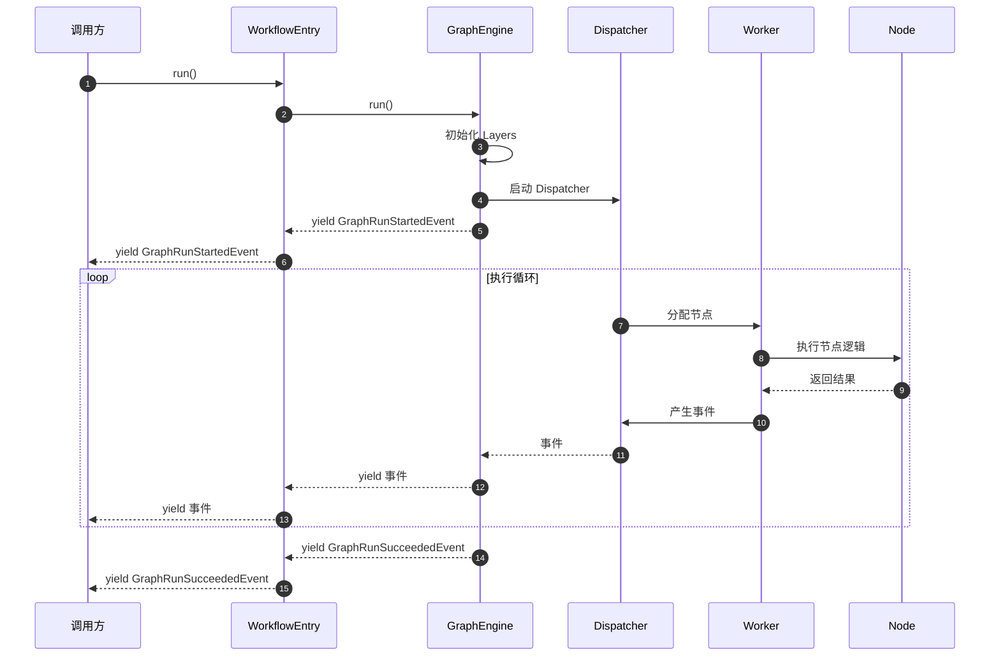

**边界与异常**

| 场景 | 行为 | 建议 |
|------|------|------|
| 正常完成 | yield `GraphRunSucceededEvent` | 处理 outputs |
| 节点失败 | 根据 `error_strategy` 决定 | 配置 TERMINATE / CONTINUE |
| 外部停止 | yield `GraphRunAbortedEvent` | 检查 reason |
| 超时 | `ExecutionLimitsLayer` 触发停止 | 调整 `max_time` 配置 |
| 资源不足 | 可能抛出系统异常 | 监控内存/CPU 使用 |

**性能要点**

- **流式处理**：事件逐个 yield，支持 SSE 实时推送
- **内存占用**：每个节点执行后立即清理临时数据
- **并发控制**：Worker Pool 动态扩缩容，避免资源耗尽

---

#### 1.3 `WorkflowEntry.single_step_run()`

**基本信息**

- **名称**：`WorkflowEntry.single_step_run()`
- **用途**：单独执行某个节点，用于调试和测试
- **调用场景**：控制台单节点调试

**方法签名**

```python
@classmethod
def single_step_run(
    cls,
    *,
    workflow: Workflow,             # 工作流模型实例
    node_id: str,                   # 要执行的节点 ID
    user_id: str,                   # 用户 ID
    user_inputs: Mapping[str, Any], # 用户输入
    variable_pool: VariablePool,    # 变量池
    variable_loader: VariableLoader = DUMMY_VARIABLE_LOADER,  # 变量加载器
) -> tuple[Node, Generator[GraphNodeEventBase, None, None]]:
```

**参数表**

| 参数 | 类型 | 必填 | 说明 |
|------|------|------|------|
| `workflow` | Workflow | 是 | Workflow 数据库模型实例 |
| `node_id` | str | 是 | 节点配置中的 ID (非执行ID) |
| `user_id` | str | 是 | 执行用户 ID |
| `user_inputs` | Mapping | 是 | 用户输入的变量字典 |
| `variable_pool` | VariablePool | 是 | 预填充的变量池 |
| `variable_loader` | VariableLoader | 否 | 从草稿变量加载缺失变量 |

**返回值**

`tuple[Node, Generator[GraphNodeEventBase, None, None]]`

- `Node`：节点实例对象
- `Generator`：节点执行事件流

**核心代码**

```python
@classmethod
def single_step_run(
    cls,
    *,
    workflow: Workflow,
    node_id: str,
    user_id: str,
    user_inputs: Mapping[str, Any],
    variable_pool: VariablePool,
    variable_loader: VariableLoader = DUMMY_VARIABLE_LOADER,
) -> tuple[Node, Generator[GraphNodeEventBase, None, None]]:
    # 1. 获取节点配置
    node_config = workflow.get_node_config_by_id(node_id)
    node_config_data = node_config.get("data", {})

    # 2. 获取节点类
    node_type = NodeType(node_config_data.get("type"))
    node_version = node_config_data.get("version", "1")
    node_cls = NODE_TYPE_CLASSES_MAPPING[node_type][node_version]

    # 3. 初始化图参数和运行时状态
    graph_init_params = GraphInitParams(
        tenant_id=workflow.tenant_id,
        app_id=workflow.app_id,
        workflow_id=workflow.id,
        graph_config=workflow.graph_dict,
        user_id=user_id,
        user_from=UserFrom.ACCOUNT,
        invoke_from=InvokeFrom.DEBUGGER,
        call_depth=0,
    )
    graph_runtime_state = GraphRuntimeState(
        variable_pool=variable_pool,
        start_at=time.perf_counter()
    )

    # 4. 创建节点实例
    node = node_cls(
        id=str(uuid.uuid4()),
        config=node_config,
        graph_init_params=graph_init_params,
        graph_runtime_state=graph_runtime_state,
    )
    node.init_node_data(node_config_data)

    # 5. 提取变量选择器映射
    try:
        variable_mapping = node_cls.extract_variable_selector_to_variable_mapping(
            graph_config=workflow.graph_dict,
            config=node_config
        )
    except NotImplementedError:
        variable_mapping = {}

    # 6. 加载缺失变量到变量池
    load_into_variable_pool(
        variable_loader=variable_loader,
        variable_pool=variable_pool,
        variable_mapping=variable_mapping,
        user_inputs=user_inputs,
    )
    
    # 7. 映射用户输入到变量池
    if node_type != NodeType.DATASOURCE:
        cls.mapping_user_inputs_to_variable_pool(
            variable_mapping=variable_mapping,
            user_inputs=user_inputs,
            variable_pool=variable_pool,
            tenant_id=workflow.tenant_id,
        )

    # 8. 运行节点
    try:
        generator = node.run()
    except Exception as e:
        logger.exception("error while running node")
        raise WorkflowNodeRunFailedError(node=node, err_msg=str(e))
    
    return node, generator
```

**代码说明：**

1. **节点配置解析**：从 workflow.graph_dict 中提取节点配置
2. **节点类查找**：根据 node_type 和 version 从映射表获取类
3. **参数初始化**：创建 `GraphInitParams` 和 `GraphRuntimeState`
4. **节点实例化**：调用节点构造函数和 `init_node_data()`
5. **变量映射**：提取节点依赖的变量选择器
6. **变量加载**：从草稿变量或其他来源加载缺失变量
7. **用户输入映射**：将用户提供的输入值注入变量池
8. **执行节点**：调用 `node.run()`，返回事件生成器

**调用示例**

```python
# 准备变量池
variable_pool = VariablePool.empty()
variable_pool.add(('start', 'query'), "What is AI?")

# 单步执行 LLM 节点
node, generator = WorkflowEntry.single_step_run(
    workflow=workflow_instance,
    node_id="llm-node-1",
    user_id="user-123",
    user_inputs={"query": "What is AI?"},
    variable_pool=variable_pool,
)

# 处理节点事件
for event in generator:
    if isinstance(event, StreamChunkEvent):
        print(event.chunk, end="")
    elif isinstance(event, NodeRunSucceededEvent):
        print(f"\n节点完成：{event.outputs}")
```

**最佳实践**

1. **调试场景**：
   - 单独测试节点逻辑，无需运行完整工作流
   - 快速验证节点配置和参数

2. **变量准备**：
   - 预先填充节点依赖的所有上游变量
   - 使用 `variable_loader` 从草稿变量加载

3. **错误处理**：
   - 捕获 `WorkflowNodeRunFailedError` 异常
   - 检查节点配置是否正确

---

### 2. GraphEngine

#### 2.1 `GraphEngine.__init__()`

**基本信息**

- **名称**：`GraphEngine.__init__()`
- **用途**：创建图引擎实例，初始化所有子系统
- **调用场景**：WorkflowEntry 初始化时

**方法签名**

```python
def __init__(
    self,
    workflow_id: str,
    graph: Graph,
    graph_runtime_state: GraphRuntimeState,
    command_channel: CommandChannel,
    min_workers: int | None = None,
    max_workers: int | None = None,
    scale_up_threshold: int | None = None,
    scale_down_idle_time: float | None = None,
) -> None:
```

**参数表**

| 参数 | 类型 | 默认值 | 说明 |
|------|------|--------|------|
| `workflow_id` | str | 必填 | 工作流唯一标识 |
| `graph` | Graph | 必填 | 图结构对象 |
| `graph_runtime_state` | GraphRuntimeState | 必填 | 运行时状态容器 |
| `command_channel` | CommandChannel | 必填 | 命令通道 |
| `min_workers` | int | None (默认1) | Worker 最小数量 |
| `max_workers` | int | None (默认10) | Worker 最大数量 |
| `scale_up_threshold` | int | None (默认5) | 队列长度超过此值时扩容 |
| `scale_down_idle_time` | float | None (默认5.0) | Worker 空闲超过此时间(秒)后缩容 |

**核心初始化步骤**

```python
def __init__(self, ...):
    # 1. 核心依赖注入
    self._workflow_id = workflow_id
    self._graph = graph
    self._graph_runtime_state = graph_runtime_state
    self._command_channel = command_channel
    
    # 2. 执行聚合根（DDD）
    self._graph_execution = GraphExecution(workflow_id=workflow_id)
    if graph_runtime_state.graph_execution_json != "":
        self._graph_execution.loads(graph_runtime_state.graph_execution_json)
    
    # 3. 就绪队列（从状态恢复或新建）
    if self._graph_runtime_state.ready_queue_json == "":
        self._ready_queue = InMemoryReadyQueue()
    else:
        ready_queue_state = ReadyQueueState.model_validate_json(
            self._graph_runtime_state.ready_queue_json
        )
        self._ready_queue = create_ready_queue_from_state(ready_queue_state)
    
    # 4. 事件队列
    self._event_queue: queue.Queue[GraphNodeEventBase] = queue.Queue()
    
    # 5. 状态管理器
    self._state_manager = GraphStateManager(self._graph, self._ready_queue)
    
    # 6. 响应协调器
    self._response_coordinator = ResponseStreamCoordinator(
        variable_pool=self._graph_runtime_state.variable_pool,
        graph=self._graph
    )
    
    # 7. 事件管理器
    self._event_manager = EventManager()
    
    # 8. 错误处理器
    self._error_handler = ErrorHandler(self._graph, self._graph_execution)
    
    # 9. 图遍历组件
    self._skip_propagator = SkipPropagator(
        graph=self._graph,
        state_manager=self._state_manager,
    )
    self._edge_processor = EdgeProcessor(
        graph=self._graph,
        state_manager=self._state_manager,
        response_coordinator=self._response_coordinator,
        skip_propagator=self._skip_propagator,
    )
    
    # 10. 事件处理器注册表
    self._event_handler_registry = EventHandler(
        graph=self._graph,
        graph_runtime_state=self._graph_runtime_state,
        graph_execution=self._graph_execution,
        response_coordinator=self._response_coordinator,
        event_collector=self._event_manager,
        edge_processor=self._edge_processor,
        state_manager=self._state_manager,
        error_handler=self._error_handler,
    )
    
    # 11. 命令处理器
    self._command_processor = CommandProcessor(
        command_channel=self._command_channel,
        graph_execution=self._graph_execution,
    )
    self._command_processor.register_handler(
        AbortCommand,
        AbortCommandHandler(),
    )
    
    # 12. Worker 池
    flask_app = self._get_flask_app()
    context_vars = contextvars.copy_context()
    self._worker_pool = WorkerPool(
        ready_queue=self._ready_queue,
        event_queue=self._event_queue,
        graph=self._graph,
        flask_app=flask_app,
        context_vars=context_vars,
        min_workers=min_workers,
        max_workers=max_workers,
        scale_up_threshold=scale_up_threshold,
        scale_down_idle_time=scale_down_idle_time,
    )
    
    # 13. 执行协调器
    self._execution_coordinator = ExecutionCoordinator(
        graph_execution=self._graph_execution,
        state_manager=self._state_manager,
        event_handler=self._event_handler_registry,
        event_collector=self._event_manager,
        command_processor=self._command_processor,
        worker_pool=self._worker_pool,
    )
    
    # 14. 事件分发器
    self._dispatcher = Dispatcher(
        event_queue=self._event_queue,
        event_handler=self._event_handler_registry,
        event_collector=self._event_manager,
        execution_coordinator=self._execution_coordinator,
        event_emitter=self._event_manager,
    )
    
    # 15. 扩展层列表
    self._layers: list[GraphEngineLayer] = []
    
    # 16. 验证状态一致性
    self._validate_graph_state_consistency()
```

**架构说明：**

GraphEngine 初始化遵循严格的依赖注入和单一职责原则，14 个子系统各司其职：

1. **GraphExecution**：聚合根，维护工作流级别状态
2. **ReadyQueue**：存储就绪节点，支持并发调度
3. **EventQueue**：节点执行事件的临时缓冲
4. **StateManager**：统一状态管理门面
5. **ResponseCoordinator**：响应流协调（Answer/End节点）
6. **EventManager**：事件收集和发布
7. **ErrorHandler**：错误处理和传播
8. **SkipPropagator**：跳过状态传播
9. **EdgeProcessor**：边处理和条件判断
10. **EventHandler**：事件处理器注册表
11. **CommandProcessor**：外部命令处理
12. **WorkerPool**：并发执行节点
13. **ExecutionCoordinator**：执行协调
14. **Dispatcher**：事件分发主循环

---

#### 2.2 `GraphEngine.run()`

**基本信息**

- **名称**：`GraphEngine.run()`
- **用途**：执行图引擎主循环，驱动整个工作流执行
- **调用场景**：WorkflowEntry.run() 调用

**方法签名**

```python
def run(self) -> Generator[GraphEngineEvent, None, None]:
    """执行图引擎，生成器返回事件流"""
    ...
```

**核心执行流程**

```python
def run(self) -> Generator[GraphEngineEvent, None, None]:
    try:
        # 1. 初始化扩展层
        self._initialize_layers()

        # 2. 标记开始执行
        self._graph_execution.start()
        start_event = GraphRunStartedEvent()
        yield start_event

        # 3. 启动子系统
        self._start_execution()

        # 4. 流式输出事件（核心循环）
        yield from self._event_manager.emit_events()

        # 5. 处理完成状态
        if self._graph_execution.aborted:
            # 中断
            abort_reason = "Workflow execution aborted by user command"
            if self._graph_execution.error:
                abort_reason = str(self._graph_execution.error)
            yield GraphRunAbortedEvent(
                reason=abort_reason,
                outputs=self._graph_runtime_state.outputs,
            )
        elif self._graph_execution.has_error:
            # 失败
            if self._graph_execution.error:
                raise self._graph_execution.error
        else:
            # 成功或部分成功
            outputs = self._graph_runtime_state.outputs
            exceptions_count = self._graph_execution.exceptions_count
            if exceptions_count > 0:
                yield GraphRunPartialSucceededEvent(
                    exceptions_count=exceptions_count,
                    outputs=outputs,
                )
            else:
                yield GraphRunSucceededEvent(
                    outputs=outputs,
                )

    except Exception as e:
        yield GraphRunFailedEvent(
            error=str(e),
            exceptions_count=self._graph_execution.exceptions_count,
        )
        raise

    finally:
        # 6. 停止子系统
        self._stop_execution()
```

**执行步骤详解：**

1. **初始化扩展层**：
   - 调用所有 Layer 的 `on_graph_start()` 钩子
   - 例如：DebugLoggingLayer 记录开始日志

2. **标记开始**：
   - `GraphExecution.start()` 记录开始时间
   - yield `GraphRunStartedEvent` 通知外部

3. **启动子系统**：

   ```python
   def _start_execution(self):
       # 初始化图状态（将起始节点加入就绪队列）
       self._state_manager.initialize_graph_state()
       
       # 启动 Worker Pool
       self._worker_pool.start()
       
       # 启动 Dispatcher 主循环（在单独线程中）
       self._dispatcher_thread = threading.Thread(
           target=self._dispatcher.run,
           daemon=True
       )
       self._dispatcher_thread.start()
```

4. **事件流式输出**：
   - `EventManager.emit_events()` 阻塞等待事件
   - 逐个 yield 给外部调用方
   - 直到 Dispatcher 标记完成

5. **处理完成状态**：
   - **Aborted**：检测到 `AbortCommand`
   - **Failed**：有未恢复的错误
   - **PartialSucceeded**：有节点失败但工作流完成
   - **Succeeded**：所有节点成功

6. **停止子系统**：

   ```python
   def _stop_execution(self):
       # 停止 Worker Pool
       self._worker_pool.stop()
       
       # 等待 Dispatcher 线程结束
       if self._dispatcher_thread:
           self._dispatcher_thread.join(timeout=5)
       
       # 调用 Layer 钩子
       for layer in self._layers:
           layer.on_graph_end()
```

**时序图**

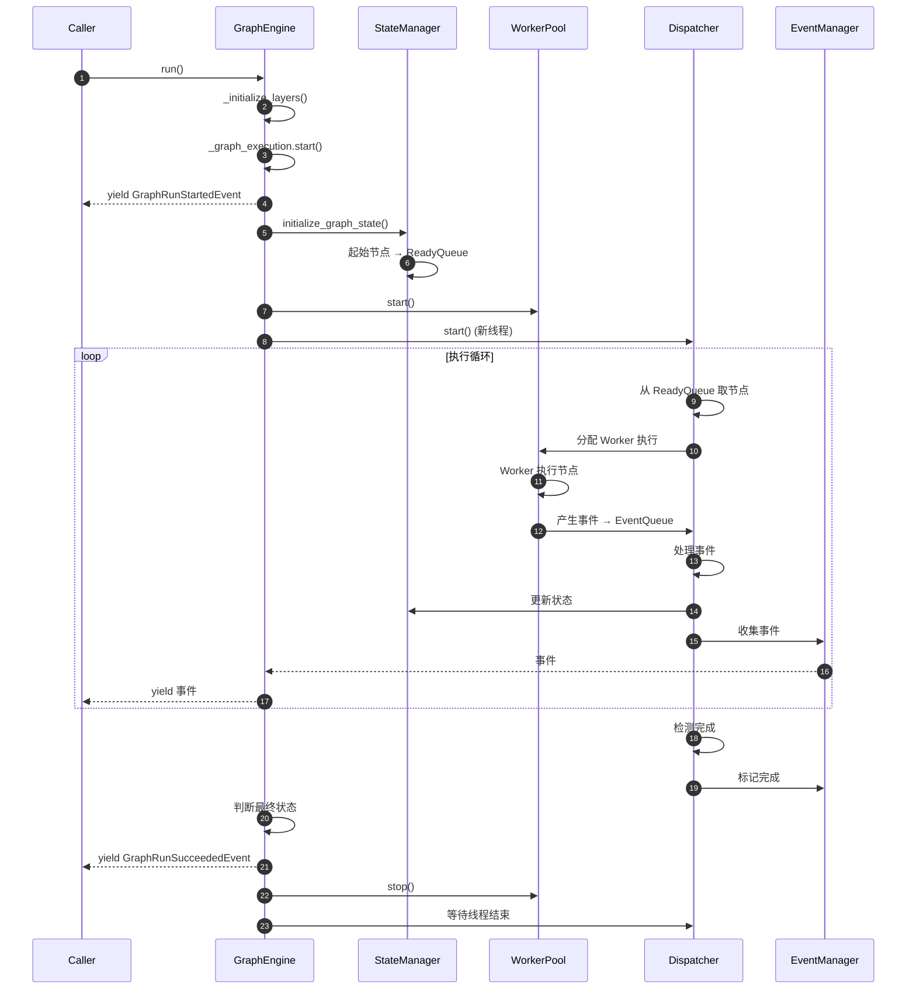

**最佳实践**

1. **事件处理**：
   - 及时消费事件，避免 EventQueue 积压
   - 使用 `isinstance()` 区分事件类型

2. **错误恢复**：
   - 配置节点 `error_strategy`：
     - `TERMINATE`：立即终止
     - `CONTINUE`：继续执行其他分支

3. **性能监控**：
   - 监控事件延迟（事件产生到 yield 的时间）
   - Worker 利用率（活跃 Worker / 总 Worker）

---

#### 2.3 `GraphEngine.layer()`

**基本信息**

- **名称**：`GraphEngine.layer()`
- **用途**：添加扩展层，增强引擎功能
- **调用场景**：WorkflowEntry 初始化时添加 DebugLoggingLayer、ExecutionLimitsLayer

**方法签名**

```python
def layer(self, layer: GraphEngineLayer) -> "GraphEngine":
    """添加扩展层，支持链式调用"""
    self._layers.append(layer)
    return self
```

**参数表**

| 参数 | 类型 | 说明 |
|------|------|------|
| `layer` | GraphEngineLayer | 扩展层实例，需实现钩子方法 |

**返回值**

`GraphEngine`：self，支持链式调用

**使用示例**

```python
# 链式添加多个 Layer
graph_engine = GraphEngine(...) \\
    .layer(DebugLoggingLayer()) \\
    .layer(ExecutionLimitsLayer(max_steps=100)) \\
    .layer(MetricsCollectionLayer())
```

**内置 Layer**

| Layer 名称 | 用途 | 钩子方法 |
|-----------|------|---------|
| `DebugLoggingLayer` | 调试日志记录 | `on_node_start`, `on_node_end` |
| `ExecutionLimitsLayer` | 限制执行步数/时间 | `on_node_start`, `on_graph_end` |
| `TracingLayer` | 分布式追踪 | `on_graph_start`, `on_node_start`, `on_graph_end` |
| `MetricsLayer` | 指标收集 | 所有钩子 |

**自定义 Layer 示例**

```python
class CustomLayer(GraphEngineLayer):
    def on_graph_start(self, context: LayerContext):
        print("Graph started!")
    
    def on_node_start(self, context: LayerContext, node_id: str):
        print(f"Node {node_id} starting...")
    
    def on_node_end(self, context: LayerContext, node_id: str, result: NodeRunResult):
        print(f"Node {node_id} finished: {result.status}")
    
    def on_graph_end(self, context: LayerContext):
        print("Graph ended!")
```

---

### 3. VariablePool

VariablePool 是工作流中节点间数据传递的核心数据结构。

#### 3.1 `VariablePool.add()`

**基本信息**

- **名称**：`VariablePool.add()`
- **用途**：添加变量到变量池
- **调用场景**：节点执行后输出变量、用户输入注入

**方法签名**

```python
def add(self, selector: Sequence[str], value: Any, /) -> None:
    """
    添加变量到变量池
    
    Args:
        selector: 变量选择器，格式：[node_id, variable_name]
        value: 变量值，支持 str/int/float/dict/list/File
    """
    ...
```

**参数表**

| 参数 | 类型 | 约束 | 说明 |
|------|------|------|------|
| `selector` | Sequence[str] | 长度必须为 2 | [node_id, variable_name] |
| `value` | Any | - | 任意可序列化的值 |

**核心代码**

```python
def add(self, selector: Sequence[str], value: Any, /):
    # 1. 校验选择器长度
    if len(selector) != SELECTORS_LENGTH:  # SELECTORS_LENGTH = 2
        raise ValueError(
            f"Invalid selector: expected {SELECTORS_LENGTH} elements "
            f"(node_id, variable_name), got {len(selector)} elements"
        )

    # 2. 转换为 Variable 对象
    if isinstance(value, Variable):
        variable = value
    elif isinstance(value, Segment):
        variable = variable_factory.segment_to_variable(
            segment=value,
            selector=selector
        )
    else:
        # 自动包装为 Segment
        segment = variable_factory.build_segment(value)
        variable = variable_factory.segment_to_variable(
            segment=segment,
            selector=selector
        )

    # 3. 存储到二级字典
    node_id, name = self._selector_to_keys(selector)
    self.variable_dictionary[node_id][name] = cast(VariableUnion, variable)
```

**使用示例**

```python
# 添加字符串变量
variable_pool.add(('llm', 'text'), "Hello, world!")

# 添加数字变量
variable_pool.add(('calculator', 'result'), 42)

# 添加对象变量
variable_pool.add(('api', 'response'), {"status": "ok", "data": {...}})

# 添加文件变量
variable_pool.add(('upload', 'file'), File(...))
```

---

#### 3.2 `VariablePool.get()`

**基本信息**

- **名称**：`VariablePool.get()`
- **用途**：从变量池获取变量值
- **调用场景**：节点获取上游节点输出

**方法签名**

```python
def get(self, selector: Sequence[str], /) -> Segment | None:
    """
    获取变量值
    
    Args:
        selector: 变量选择器

            - [node_id, variable_name]：获取完整变量
            - [node_id, variable_name, attr, ...]：获取嵌套属性
    
    Returns:
        Segment 或 None（未找到）
    """
    ...

```

**支持的选择器格式**

| 格式 | 示例 | 说明 |
|------|------|------|
| 基础选择器 | `['llm', 'text']` | 获取完整变量 |
| 对象属性 | `['api', 'response', 'status']` | 获取对象的 status 字段 |
| 嵌套属性 | `['api', 'response', 'data', 'user', 'name']` | 多层嵌套 |
| 文件属性 | `['upload', 'file', 'url']` | 获取文件的 url 属性 |

**核心代码**

```python
def get(self, selector: Sequence[str], /) -> Segment | None:
    # 1. 校验选择器长度
    if len(selector) < SELECTORS_LENGTH:
        return None

    # 2. 获取基础变量
    node_id, name = self._selector_to_keys(selector)
    segment: Segment | None = self.variable_dictionary[node_id].get(name)

    if segment is None:
        return None

    # 3. 如果只有 2 个元素，直接返回
    if len(selector) == 2:
        return segment

    # 4. 处理文件属性
    if isinstance(segment, FileSegment):
        attr = selector[2]
        if attr not in {item.value for item in FileAttribute}:
            return None
        attr = FileAttribute(attr)
        attr_value = file_manager.get_attr(file=segment.value, attr=attr)
        return variable_factory.build_segment(attr_value)

    # 5. 处理对象嵌套属性
    result: Any = segment
    for attr in selector[2:]:
        result = self._extract_value(result)
        result = self._get_nested_attribute(result, attr)
        if result is None:
            return None

    # 6. 返回 Segment
    return result if isinstance(result, Segment) else variable_factory.build_segment(result)
```

**使用示例**

```python
# 获取字符串变量
text = variable_pool.get(['llm', 'text'])
print(text.value)  # "Hello, world!"

# 获取对象属性
status = variable_pool.get(['api', 'response', 'status'])
print(status.value)  # "ok"

# 获取文件 URL
file_url = variable_pool.get(['upload', 'file', 'url'])
print(file_url.value)  # "https://..."

# 未找到返回 None
missing = variable_pool.get(['not', 'exist'])
print(missing)  # None
```

---

## 完整使用示例

### 示例 1：创建并运行简单工作流

```python
from core.workflow import WorkflowEntry, Graph
from core.workflow.entities import GraphInitParams, GraphRuntimeState, VariablePool
from core.workflow.enums import UserFrom, InvokeFrom

# 1. 准备图配置
graph_config = {
    "nodes": [
        {"id": "start", "data": {"type": "start", "title": "开始"}},
        {"id": "llm", "data": {"type": "llm", "title": "LLM", "model": {...}}},
        {"id": "end", "data": {"type": "end", "title": "结束"}},
    ],
    "edges": [
        {"source": "start", "target": "llm"},
        {"source": "llm", "target": "end"},
    ],
}

# 2. 构建 Graph 对象
graph = Graph.init(
    graph_config=graph_config,
    graph_init_params=GraphInitParams(...),
    graph_runtime_state=GraphRuntimeState(...),
)

# 3. 准备变量池
variable_pool = VariablePool.empty()
variable_pool.add(('start', 'query'), "What is AI?")

# 4. 创建 WorkflowEntry
workflow_entry = WorkflowEntry(
    tenant_id="tenant-123",
    app_id="app-456",
    workflow_id="wf-789",
    graph_config=graph_config,
    graph=graph,
    user_id="user-001",
    user_from=UserFrom.ACCOUNT,
    invoke_from=InvokeFrom.SERVICE,
    call_depth=0,
    variable_pool=variable_pool,
    graph_runtime_state=GraphRuntimeState(
        variable_pool=variable_pool,
        start_at=time.perf_counter()
    ),
)

# 5. 执行工作流
for event in workflow_entry.run():
    if isinstance(event, GraphRunStartedEvent):
        print("Workflow started")
    elif isinstance(event, GraphNodeRunStartedEvent):
        print(f"Node {event.node_id} started")
    elif isinstance(event, GraphNodeRunSucceededEvent):
        print(f"Node {event.node_id} succeeded: {event.outputs}")
    elif isinstance(event, GraphRunSucceededEvent):
        print(f"Workflow succeeded!")
        print(f"Final outputs: {event.outputs}")
    elif isinstance(event, GraphRunFailedEvent):
        print(f"Workflow failed: {event.error}")
```

### 示例 2：外部停止工作流

```python
from core.workflow.graph_engine.protocols.command_channel import RedisChannel
from core.workflow.graph_engine.entities.commands import AbortCommand

# 1. 创建 Redis 命令通道
redis_channel = RedisChannel(
    redis_client=redis_client,
    channel_key=f"workflow:{workflow_run_id}:commands"
)

# 2. 创建 WorkflowEntry（传入 Redis 通道）
workflow_entry = WorkflowEntry(
    ...,
    command_channel=redis_channel,
)

# 3. 在另一个进程/线程中发送停止命令
redis_channel.send_command(AbortCommand(reason="User requested stop"))

# 4. 工作流会在下一轮循环检测到命令并停止
# 输出 GraphRunAbortedEvent
```

### 示例 3：单步调试节点

```python
# 1. 准备变量池（模拟上游节点输出）
variable_pool = VariablePool.empty()
variable_pool.add(('start', 'query'), "Calculate 25% tip on $80")
variable_pool.add(('knowledge_retrieval', 'result'), [
    {"content": "Tip calculation: multiply by tip percentage"}
])

# 2. 单步执行 LLM 节点
node, generator = WorkflowEntry.single_step_run(
    workflow=workflow_instance,
    node_id="llm-node-1",
    user_id="user-123",
    user_inputs={"query": "Calculate 25% tip on $80"},
    variable_pool=variable_pool,
)

# 3. 处理节点事件
for event in generator:
    if isinstance(event, StreamChunkEvent):
        print(event.chunk, end="", flush=True)
    elif isinstance(event, NodeRunSucceededEvent):
        print(f"\\nNode outputs: {event.outputs}")
        
        # 输出会被自动添加到 variable_pool
        llm_text = variable_pool.get(['llm-node-1', 'text'])
        print(f"LLM output: {llm_text.value}")
```

---

## API 最佳实践

### 1. 性能优化

**减少变量池查找**：

```python
# 不推荐：多次查找相同变量
for i in range(100):
    value = variable_pool.get(['node', 'var'])
    process(value)

# 推荐：缓存变量引用
cached_value = variable_pool.get(['node', 'var'])
for i in range(100):
    process(cached_value)
```

**批量添加变量**：

```python
# 推荐：使用对象变量存储批量数据
variable_pool.add(('batch_processor', 'results'), {
    'item1': result1,
    'item2': result2,
    'item3': result3,
})

# 访问：
result1 = variable_pool.get(['batch_processor', 'results', 'item1'])
```

### 2. 错误处理

**捕获节点执行失败**：

```python
try:
    for event in workflow_entry.run():
        if isinstance(event, GraphRunFailedEvent):
            logger.error(f"Workflow failed: {event.error}")
            # 记录失败信息到数据库
            save_failure_record(event)
except Exception as e:
    logger.exception("Unexpected error")
    # 处理意外异常
```

**节点级别错误策略**：

```yaml
# 配置节点错误策略
nodes:

  - id: risky-node
    data:
      error_strategy: continue  # continue / terminate / skip
      retry:
        enabled: true
        max_attempts: 3
        backoff_factor: 2

```

### 3. 监控与可观测性

**添加追踪 Layer**：

```python
from core.workflow.graph_engine.layers import TracingLayer

tracing_layer = TracingLayer(
    trace_provider="langfuse",
    trace_config={"api_key": "..."}
)

workflow_entry.graph_engine.layer(tracing_layer)
```

**收集执行指标**：

```python
metrics = {
    'total_nodes': 0,
    'succeeded_nodes': 0,
    'failed_nodes': 0,
    'total_time': 0,
}

start_time = time.time()
for event in workflow_entry.run():
    if isinstance(event, GraphNodeRunStartedEvent):
        metrics['total_nodes'] += 1
    elif isinstance(event, GraphNodeRunSucceededEvent):
        metrics['succeeded_nodes'] += 1
    elif isinstance(event, GraphNodeRunFailedEvent):
        metrics['failed_nodes'] += 1

metrics['total_time'] = time.time() - start_time
```

---

**下一步：**

- [Dify-01-Workflow工作流引擎-数据结构](./Dify-01-Workflow工作流引擎-数据结构.md)
- [Dify-01-Workflow工作流引擎-时序图](./Dify-01-Workflow工作流引擎-时序图.md)

---

## 数据结构

本文档详细描述 Workflow 工作流引擎的核心数据结构，包括 UML 类图、字段说明、设计理由和使用示例。

## 数据结构总览

Workflow 模块的数据结构按职责分为以下几类：

| 类别 | 核心类 | 职责 |
|------|--------|------|
| **图结构** | Graph, Edge, Node | 工作流的拓扑结构定义 |
| **运行时状态** | GraphRuntimeState, VariablePool | 执行过程中的动态状态 |
| **执行聚合** | GraphExecution, NodeExecution | DDD 聚合根，执行状态管理 |
| **初始化参数** | GraphInitParams | 创建工作流所需的上下文信息 |
| **节点数据** | BaseNodeData, LLMNodeData等 | 各类节点的配置数据 |
| **事件** | GraphEngineEvent, NodeEventBase | 事件驱动架构的消息载体 |

## 核心数据结构 UML

### 1. 图结构核心类

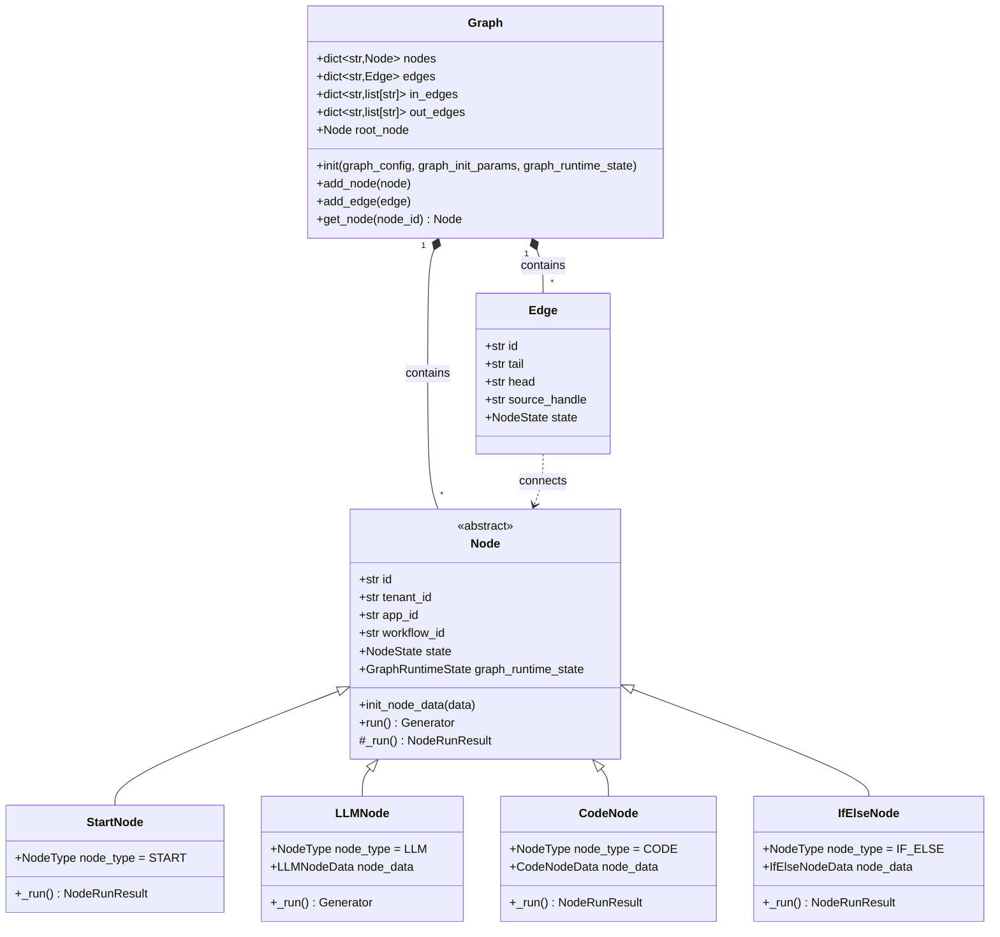

**类图说明：**

**Graph（图）**

- **职责**：维护工作流的拓扑结构，管理节点和边的关系
- **关键字段**：
  - `nodes`：节点字典，key 为 node_id
  - `edges`：边字典，key 为 edge_id
  - `in_edges`：入边映射，记录每个节点的所有入边
  - `out_edges`：出边映射，记录每个节点的所有出边
  - `root_node`：根节点（通常是 StartNode）
- **设计理由**：使用邻接表结构，支持快速查找节点的前驱和后继

**Node（节点）**

- **职责**：抽象基类，定义节点的通用行为
- **关键字段**：
  - `id`：节点执行实例ID（运行时生成的 UUID）
  - `_node_id`：节点配置ID（图定义中的节点ID）
  - `state`：节点执行状态（UNKNOWN/RUNNING/SUCCEEDED/FAILED/SKIPPED）
  - `graph_runtime_state`：共享的运行时状态引用
- **设计理由**：模板方法模式，`run()` 提供统一执行流程，子类实现 `_run()`

**Edge（边）**

- **职责**：连接两个节点，支持条件分支
- **关键字段**：
  - `tail`：源节点ID
  - `head`：目标节点ID
  - `source_handle`：源句柄，用于条件分支（如 if-else 的 true/false 分支）
- **设计理由**：简洁的边模型，条件判断逻辑在 EdgeProcessor 中实现

### 2. 运行时状态类

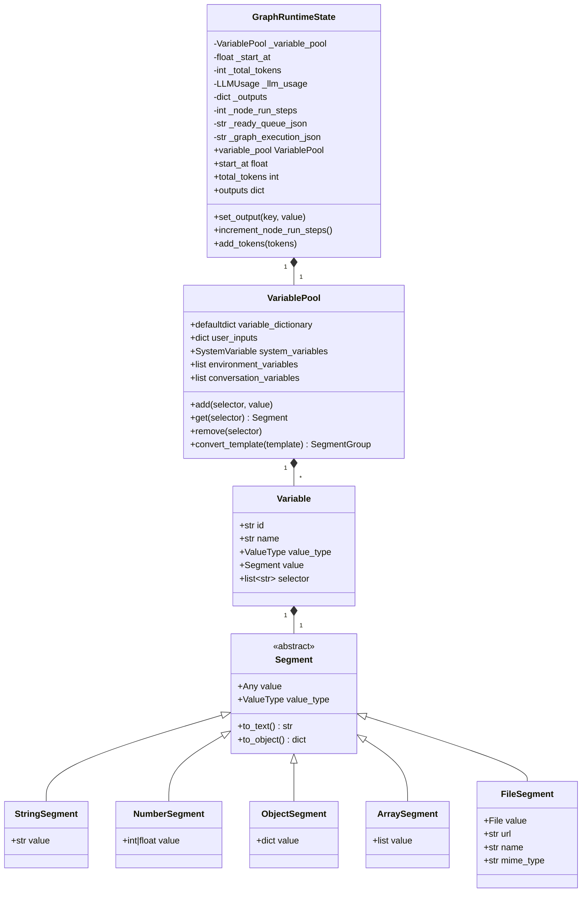

**类图说明：**

**GraphRuntimeState（运行时状态）**

- **职责**：持有工作流执行过程中的所有可变状态
- **关键字段**：
  - `variable_pool`：变量池，存储所有节点的输入输出变量
  - `start_at`：工作流开始时间（性能计时基准）
  - `total_tokens`：累计消耗的 Token 数
  - `llm_usage`：LLM 使用统计（prompt/completion tokens, 成本）
  - `outputs`：最终输出变量（来自 End 节点）
  - `node_run_steps`：已执行的节点步数
  - `ready_queue_json`, `graph_execution_json`：可序列化的快照（用于暂停/恢复）
- **设计理由**：
  - 使用私有属性 + 属性装饰器，防止外部直接修改
  - 支持序列化为 JSON，实现暂停/恢复功能
  - 所有返回值使用 `deepcopy`，防止外部修改影响内部状态

**VariablePool（变量池）**

- **职责**：管理节点间的数据传递，支持变量引用和嵌套访问
- **关键字段**：
  - `variable_dictionary`：二级字典 `{node_id: {variable_name: Variable}}`
  - `user_inputs`：用户输入的原始数据（用于 StartNode）
  - `system_variables`：系统变量（user_id, conversation_id 等）
  - `environment_variables`：环境变量（从应用配置注入）
  - `conversation_variables`：对话变量（多轮对话上下文）
- **核心方法**：
  - `add(selector, value)`：添加变量，selector 格式 `[node_id, variable_name]`
  - `get(selector)`：获取变量，支持嵌套访问如 `[node_id, var, field, subfield]`
  - `convert_template(template)`：转换模板字符串 `{{#node_id.var#}}` 为 SegmentGroup
- **设计理由**：
  - 二级字典结构提供 O(1) 查找性能
  - 命名空间隔离：不同节点的同名变量不冲突
  - 支持对象属性访问：`{{#api.response.data.user.name#}}`

**Variable & Segment（变量与片段）**

- **Variable**：变量元数据容器，包含 id, name, selector, value_type
- **Segment**：实际值的载体，支持多种类型
  - `StringSegment`：文本值
  - `NumberSegment`：数值
  - `ObjectSegment`：JSON 对象
  - `ArraySegment`：数组/列表
  - `FileSegment`：文件对象（图片、文档等）
- **设计理由**：
  - 分离元数据和值，便于序列化和类型安全
  - Segment 多态设计，统一处理不同类型的值
  - FileSegment 特殊处理，支持访问文件属性（url, name, mime_type）

### 3. 执行聚合类（DDD）

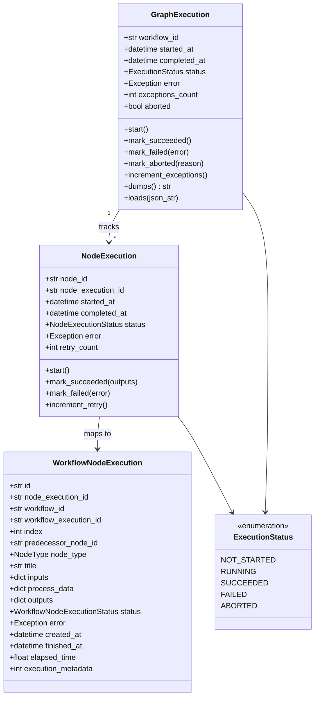

**类图说明：**

**GraphExecution（图执行聚合根）**

- **职责**：DDD 聚合根，维护工作流级别的执行状态
- **关键字段**：
  - `workflow_id`：工作流标识
  - `started_at`, `completed_at`：时间戳
  - `status`：执行状态（枚举）
  - `error`：错误信息（失败时记录）
  - `exceptions_count`：节点失败计数（部分成功场景）
  - `aborted`：是否被外部中断
- **核心方法**：
  - `start()`：标记开始，记录时间
  - `mark_succeeded()`, `mark_failed()`, `mark_aborted()`：状态转换
  - `dumps()`, `loads()`：序列化/反序列化，支持暂停/恢复
- **设计理由**：
  - 聚合根封装状态转换逻辑，保证一致性
  - 支持序列化，实现断点续传
  - 不依赖数据库模型，纯领域对象

**NodeExecution（节点执行）**

- **职责**：跟踪单个节点的执行状态
- **关键字段**：
  - `node_id`：节点配置ID
  - `node_execution_id`：节点执行实例ID
  - `retry_count`：重试次数
  - `status`, `error`：执行状态和错误
- **核心方法**：
  - `increment_retry()`：重试计数
  - 状态转换方法同 GraphExecution
- **设计理由**：
  - 独立管理节点状态，支持重试机制
  - 与 WorkflowNodeExecution 映射，但不耦合数据库

**WorkflowNodeExecution（持久化模型）**

- **职责**：节点执行的持久化表示（映射到数据库）
- **关键字段**：
  - `id`：数据库主键（UUID）
  - `workflow_execution_id`：关联的工作流运行记录
  - `index`：执行序号（用于追踪可视化）
  - `inputs`, `process_data`, `outputs`：节点的输入/中间数据/输出
  - `execution_metadata`：元数据（如 LLM token 消耗）
- **设计理由**：
  - 分离领域模型和持久化模型
  - 包含数据库特定字段（created_at, finished_at）
  - 支持详细的执行追踪和审计

### 4. 初始化参数类

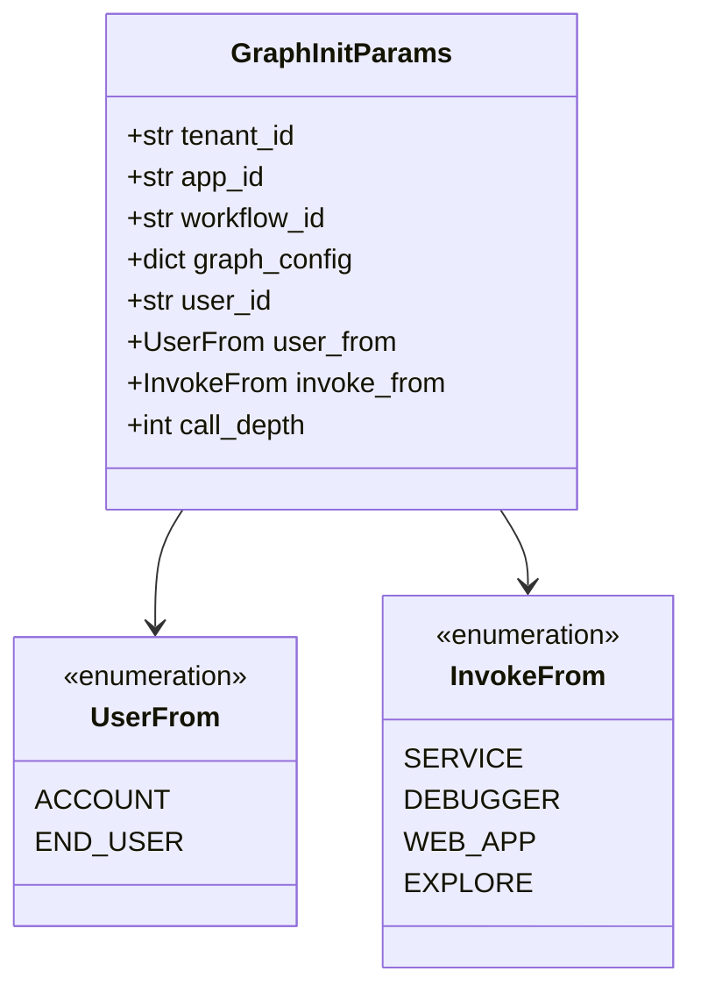

**类图说明：**

**GraphInitParams（初始化参数）**

- **职责**：封装创建工作流所需的上下文信息
- **关键字段**：
  - `tenant_id`, `app_id`, `workflow_id`：多租户隔离标识
  - `graph_config`：图的 JSON 配置（节点+边）
  - `user_id`：执行用户ID
  - `user_from`：用户类型（管理员账户 / 终端用户）
  - `invoke_from`：调用来源（Service API / 调试器 / Web App / 探索）
  - `call_depth`：嵌套调用深度（防止无限递归）
- **设计理由**：
  - 值对象，不可变
  - 封装所有初始化依赖，避免参数传递混乱
  - 支持多种调用场景（API/调试/探索）

### 5. 节点数据结构

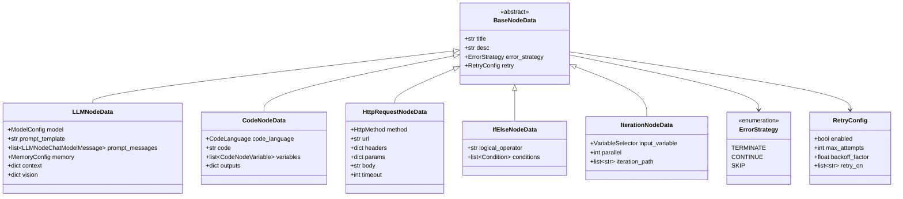

**类图说明：**

**BaseNodeData（节点数据基类）**

- **职责**：所有节点配置数据的基类
- **关键字段**：
  - `title`, `desc`：节点标题和描述
  - `error_strategy`：错误处理策略
    - `TERMINATE`：终止整个工作流
    - `CONTINUE`：继续执行其他分支
    - `SKIP`：跳过后续依赖节点
  - `retry`：重试配置
- **设计理由**：
  - 统一的错误处理和重试机制
  - Pydantic BaseModel，自动校验和序列化

**LLMNodeData（LLM 节点配置）**

- **职责**：配置 LLM 节点的模型、提示词、上下文等
- **关键字段**：
  - `model`：模型配置（provider, name, parameters）
  - `prompt_template`：Completion 模式的提示词模板
  - `prompt_messages`：Chat 模式的消息列表
  - `memory`：记忆配置（对话历史轮数）
  - `context`：知识库检索配置
  - `vision`：多模态配置（图片输入）
- **设计理由**：
  - 支持两种提示词模式（Completion / Chat）
  - 集成知识库检索和多模态能力

**CodeNodeData（代码节点配置）**

- **职责**：配置代码执行节点
- **关键字段**：
  - `code_language`：Python3 / JavaScript / Jinja2
  - `code`：代码字符串
  - `variables`：输入变量映射
  - `outputs`：输出变量定义
- **设计理由**：
  - 支持多语言代码执行
  - 沙箱隔离，限制资源使用

**其他节点数据类**

- **HttpRequestNodeData**：HTTP 请求配置
- **IfElseNodeData**：条件分支逻辑
- **IterationNodeData**：迭代循环配置

## 关键数据结构详解

### 1. Graph（图）

**完整定义**

```python
@final
class Graph:
    """图表示，包含节点和边，用于工作流执行"""

    def __init__(
        self,
        *,
        nodes: dict[str, Node] | None = None,
        edges: dict[str, Edge] | None = None,
        in_edges: dict[str, list[str]] | None = None,
        out_edges: dict[str, list[str]] | None = None,
        root_node: Node,
    ):
        self.nodes = nodes or {}
        self.edges = edges or {}
        self.in_edges = in_edges or {}
        self.out_edges = out_edges or {}
        self.root_node = root_node
```

**字段说明**

| 字段 | 类型 | 说明 | 示例 |
|------|------|------|------|
| `nodes` | dict[str, Node] | 节点字典，key 为 node_id | `{"start-1": StartNode, "llm-1": LLMNode}` |
| `edges` | dict[str, Edge] | 边字典，key 为 edge_id | `{"edge-1": Edge(tail="start-1", head="llm-1")}` |
| `in_edges` | dict[str, list[str]] | 入边映射，记录每个节点的入边ID列表 | `{"llm-1": ["edge-1", "edge-2"]}` |
| `out_edges` | dict[str, list[str]] | 出边映射，记录每个节点的出边ID列表 | `{"start-1": ["edge-1"]}` |
| `root_node` | Node | 根节点（起始节点） | StartNode 实例 |

**约束条件**

- 图必须有至少一个根节点（无入边的节点）
- 边的 tail 和 head 必须指向存在的节点
- 不允许自环（节点指向自己）
- 支持有向无环图（DAG）和有向图（允许循环，但通过迭代节点控制）

**构建示例**

```python
# 1. 准备节点配置
graph_config = {
    "nodes": [
        {"id": "start", "data": {"type": "start", "title": "开始"}},
        {"id": "llm", "data": {"type": "llm", "title": "LLM", ...}},
        {"id": "end", "data": {"type": "end", "title": "结束"}},
    ],
    "edges": [
        {"source": "start", "target": "llm"},
        {"source": "llm", "target": "end"},
    ],
}

# 2. 使用 Graph.init() 构建
graph = Graph.init(
    graph_config=graph_config,
    graph_init_params=graph_init_params,
    graph_runtime_state=graph_runtime_state,
)

# 3. 访问节点和边
start_node = graph.nodes["start"]
out_edges_of_start = [graph.edges[edge_id] for edge_id in graph.out_edges["start"]]
```

---

### 2. VariablePool（变量池）

**完整定义**

```python
class VariablePool(BaseModel):
    variable_dictionary: defaultdict[str, dict[str, VariableUnion]] = Field(
        description="变量字典",
        default=defaultdict(dict),
    )
    user_inputs: Mapping[str, Any] = Field(
        description="用户输入",
        default_factory=dict,
    )
    system_variables: SystemVariable = Field(
        description="系统变量",
        default_factory=SystemVariable.empty,
    )
    environment_variables: Sequence[VariableUnion] = Field(
        description="环境变量",
        default_factory=list,
    )
    conversation_variables: Sequence[VariableUnion] = Field(
        description="对话变量",
        default_factory=list,
    )
```

**字段说明**

| 字段 | 类型 | 说明 |
|------|------|------|
| `variable_dictionary` | defaultdict | 二级字典，第一层 key 为 node_id，第二层 key 为 variable_name |
| `user_inputs` | dict | 用户输入的原始数据，仅用于 StartNode 构建输入 |
| `system_variables` | SystemVariable | 系统变量（user_id, conversation_id, files 等） |
| `environment_variables` | list | 环境变量（从应用配置注入） |
| `conversation_variables` | list | 对话变量（多轮对话上下文） |

**核心方法**

```python
# 添加变量
def add(self, selector: Sequence[str], value: Any, /) -> None:
    """
    参数:
        selector: [node_id, variable_name]
        value: 任意可序列化的值（str, int, dict, list, File）
    """
    ...

# 获取变量
def get(self, selector: Sequence[str], /) -> Segment | None:
    """
    参数:
        selector: 支持多种格式

            - [node_id, var_name]：获取完整变量
            - [node_id, var_name, field]：获取对象字段
            - [node_id, var_name, field, subfield]：嵌套访问
    返回:
        Segment 对象或 None
    """
    ...

# 转换模板
def convert_template(self, template: str, /) -> SegmentGroup:
    """
    将模板字符串转换为 SegmentGroup
    
    示例:
        "Hello {{#start.query#}}, result: {{#llm.text#}}"
        → SegmentGroup([
            StringSegment("Hello "),
            StringSegment("What is AI?"),  # 从 start.query 获取
            StringSegment(", result: "),
            StringSegment("AI is..."),  # 从 llm.text 获取
        ])
    """
    ...
```

**使用示例**

```python
# 创建空变量池
variable_pool = VariablePool.empty()

# 添加简单变量
variable_pool.add(['start', 'query'], "What is AI?")
variable_pool.add(['calculator', 'result'], 42)

# 添加对象变量
variable_pool.add(['api', 'response'], {
    "status": "success",
    "data": {
        "user": {"name": "Alice", "age": 30}
    }
})

# 添加文件变量
from core.file import File
file = File(...)
variable_pool.add(['upload', 'file'], file)

# 获取变量
query = variable_pool.get(['start', 'query'])
print(query.value)  # "What is AI?"

# 获取嵌套字段
user_name = variable_pool.get(['api', 'response', 'data', 'user', 'name'])
print(user_name.value)  # "Alice"

# 获取文件属性
file_url = variable_pool.get(['upload', 'file', 'url'])
print(file_url.value)  # "https://..."

# 转换模板
template = "User {{#api.response.data.user.name#}} asked: {{#start.query#}}"
segment_group = variable_pool.convert_template(template)
text = segment_group.to_text()
print(text)  # "User Alice asked: What is AI?"
```

**命名空间隔离**

不同节点可以有同名变量：

```python
variable_pool.add(['llm1', 'text'], "Response from LLM 1")
variable_pool.add(['llm2', 'text'], "Response from LLM 2")

# 不会冲突
text1 = variable_pool.get(['llm1', 'text'])  # "Response from LLM 1"
text2 = variable_pool.get(['llm2', 'text'])  # "Response from LLM 2"
```

---

### 3. GraphRuntimeState（运行时状态）

**完整定义**

```python
class GraphRuntimeState(BaseModel):
    # 私有属性（使用属性装饰器访问）
    _variable_pool: VariablePool
    _start_at: float
    _total_tokens: int
    _llm_usage: LLMUsage
    _outputs: dict[str, object]
    _node_run_steps: int
    _ready_queue_json: str
    _graph_execution_json: str
    _response_coordinator_json: str

    def __init__(
        self,
        *,
        variable_pool: VariablePool,
        start_at: float,
        total_tokens: int = 0,
        llm_usage: LLMUsage | None = None,
        outputs: dict[str, object] | None = None,
        node_run_steps: int = 0,
        ready_queue_json: str = "",
        graph_execution_json: str = "",
        response_coordinator_json: str = "",
    ):
        ...
```

**字段说明**

| 字段 | 类型 | 访问方式 | 说明 |
|------|------|---------|------|
| `variable_pool` | VariablePool | 属性（只读） | 变量池 |
| `start_at` | float | 属性（读写） | 工作流开始时间（time.perf_counter()） |
| `total_tokens` | int | 属性（读写） | 累计消耗的 Token 数 |
| `llm_usage` | LLMUsage | 属性（读写） | LLM 使用统计（prompt/completion tokens, 成本） |
| `outputs` | dict | 属性（读写） | 最终输出（来自 End 节点） |
| `node_run_steps` | int | 属性（读写） | 已执行的节点步数 |
| `ready_queue_json` | str | 属性（只读） | 就绪队列的 JSON 快照（用于恢复） |
| `graph_execution_json` | str | 属性（只读） | 执行聚合根的 JSON 快照 |
| `response_coordinator_json` | str | 属性（只读） | 响应协调器的 JSON 快照 |

**核心方法**

```python
# 设置单个输出
def set_output(self, key: str, value: object) -> None:
    ...

# 获取单个输出（带默认值）
def get_output(self, key: str, default: object = None) -> object:
    ...

# 批量更新输出
def update_outputs(self, updates: dict[str, object]) -> None:
    ...

# 增加 Token 数
def add_tokens(self, tokens: int) -> None:
    ...

# 增加节点步数
def increment_node_run_steps(self) -> None:
    ...
```

**设计理由**

1. **私有属性**：使用 `_` 前缀 + 属性装饰器，防止外部直接修改
2. **深拷贝**：所有返回值使用 `deepcopy`，防止外部修改影响内部状态
3. **验证**：setter 方法包含参数校验（如 tokens 必须非负）
4. **可序列化**：关键状态可导出为 JSON，支持暂停/恢复

**使用示例**

```python
import time

# 创建运行时状态
variable_pool = VariablePool.empty()
graph_runtime_state = GraphRuntimeState(
    variable_pool=variable_pool,
    start_at=time.perf_counter(),
)

# 添加输出
graph_runtime_state.set_output('result', "Success")
graph_runtime_state.update_outputs({
    'elapsed_time': 1.234,
    'total_steps': 5,
})

# 累计 Token
graph_runtime_state.add_tokens(150)
graph_runtime_state.add_tokens(200)
print(graph_runtime_state.total_tokens)  # 350

# 增加步数
for _ in range(5):
    graph_runtime_state.increment_node_run_steps()
print(graph_runtime_state.node_run_steps)  # 5

# 获取输出
result = graph_runtime_state.get_output('result')
print(result)  # "Success"

# 获取所有输出（深拷贝）
all_outputs = graph_runtime_state.outputs
print(all_outputs)  # {'result': 'Success', 'elapsed_time': 1.234, ...}
```

---

### 4. Node（节点）

**抽象基类定义**

```python
class Node:
    node_type: ClassVar[NodeType]  # 类变量，子类必须定义
    execution_type: NodeExecutionType = NodeExecutionType.EXECUTABLE

    def __init__(
        self,
        id: str,  # 节点执行实例ID（UUID）
        config: Mapping[str, Any],  # 节点配置
        graph_init_params: GraphInitParams,  # 初始化参数
        graph_runtime_state: GraphRuntimeState,  # 运行时状态
    ) -> None:
        self.id = id
        self.tenant_id = graph_init_params.tenant_id
        self.app_id = graph_init_params.app_id
        self.workflow_id = graph_init_params.workflow_id
        self.user_id = graph_init_params.user_id
        self.graph_runtime_state = graph_runtime_state
        self.state: NodeState = NodeState.UNKNOWN
        
        self._node_id = config.get("id")  # 节点配置ID
        self._node_execution_id: str = ""  # 数据库记录ID
        ...

    @abstractmethod
    def init_node_data(self, data: Mapping[str, Any]) -> None:
        """初始化节点数据，子类必须实现"""
        ...

    @abstractmethod
    def _run(self) -> NodeRunResult | Generator[NodeEventBase, None, None]:
        """执行节点逻辑，子类必须实现"""
        ...

    def run(self) -> Generator[GraphNodeEventBase, None, None]:
        """统一的执行流程，模板方法"""
        # 1. 生成执行ID
        # 2. 发送 NodeRunStartedEvent
        # 3. 调用 _run()
        # 4. 发送 NodeRunSucceededEvent 或 NodeRunFailedEvent
        ...
```

**字段说明**

| 字段 | 类型 | 说明 |
|------|------|------|
| `node_type` | NodeType | 节点类型（START/LLM/CODE/IF_ELSE等） |
| `execution_type` | NodeExecutionType | 执行类型（EXECUTABLE/VIRTUAL） |
| `id` | str | 节点执行实例ID（运行时生成的 UUID） |
| `_node_id` | str | 节点配置ID（图定义中的节点ID） |
| `_node_execution_id` | str | 数据库记录ID（持久化后分配） |
| `state` | NodeState | 节点执行状态 |
| `graph_runtime_state` | GraphRuntimeState | 共享的运行时状态引用 |

**节点类型枚举**

```python
class NodeType(StrEnum):
    START = "start"                    # 起始节点
    END = "end"                        # 结束节点
    ANSWER = "answer"                  # 答案节点（流式输出）
    LLM = "llm"                        # LLM 节点
    KNOWLEDGE_RETRIEVAL = "knowledge-retrieval"  # 知识库检索
    IF_ELSE = "if-else"                # 条件分支
    CODE = "code"                      # 代码执行
    TEMPLATE_TRANSFORM = "template-transform"  # 模板转换
    QUESTION_CLASSIFIER = "question-classifier"  # 问题分类
    HTTP_REQUEST = "http-request"      # HTTP 请求
    TOOL = "tool"                      # 工具调用
    VARIABLE_AGGREGATOR = "variable-aggregator"  # 变量聚合
    VARIABLE_ASSIGNER = "variable-assigner"  # 变量赋值
    ITERATION = "iteration"            # 迭代循环
    LOOP = "loop"                      # 条件循环
    PARAMETER_EXTRACTOR = "parameter-extractor"  # 参数提取
    AGENT = "agent"                    # 智能体
    DATASOURCE = "datasource"          # 数据源
    KNOWLEDGE_INDEX = "knowledge-index"  # 知识索引
```

**节点状态枚举**

```python
class NodeState(StrEnum):
    UNKNOWN = "unknown"         # 未知（初始状态）
    READY = "ready"             # 就绪（等待执行）
    RUNNING = "running"         # 运行中
    SUCCEEDED = "succeeded"     # 成功
    FAILED = "failed"           # 失败
    SKIPPED = "skipped"         # 跳过
```

**节点实现示例：StartNode**

```python
class StartNode(Node):
    node_type: ClassVar[NodeType] = NodeType.START
    
    def init_node_data(self, data: Mapping[str, Any]) -> None:
        """StartNode 无需额外配置"""
        pass
    
    def _run(self) -> NodeRunResult:
        """从变量池中收集用户输入"""
        # 获取用户输入
        user_inputs = self.graph_runtime_state.variable_pool.user_inputs
        
        # 构建节点输入
        node_inputs = {}
        for key, value in user_inputs.items():
            segment = variable_factory.build_segment(value)
            node_inputs[key] = segment
        
        # 输出与输入相同
        outputs = node_inputs.copy()
        
        return NodeRunResult(
            status=WorkflowNodeExecutionStatus.SUCCEEDED,
            inputs=node_inputs,
            outputs=outputs,
        )
```

---

## 数据流转示例

### 示例：完整的变量流转

```python
# 1. 初始化变量池
variable_pool = VariablePool.empty()
variable_pool.add(['start', 'query'], "Calculate 10 + 20")

# 2. LLM 节点执行，输出结果
variable_pool.add(['llm', 'text'], "The result is 30")
variable_pool.add(['llm', 'usage'], {
    "prompt_tokens": 20,
    "completion_tokens": 10,
})

# 3. 代码节点获取上游变量
llm_output = variable_pool.get(['llm', 'text'])
print(llm_output.value)  # "The result is 30"

# 4. 代码节点执行，输出数值
variable_pool.add(['code', 'result'], 30)

# 5. End 节点收集最终输出
result = variable_pool.get(['code', 'result'])
graph_runtime_state.set_output('final_result', result.value)

# 6. 获取最终输出
final_outputs = graph_runtime_state.outputs
print(final_outputs)  # {'final_result': 30}
```

---

## 最佳实践

### 1. 变量命名规范

- **节点ID**：使用描述性名称 + 序号，如 `llm-summarize-1`, `code-calculate-2`
- **变量名**：使用蛇形命名，如 `user_query`, `api_response`, `calculation_result`
- **避免冲突**：不同节点可以有同名变量，利用命名空间隔离

### 2. 数据序列化

- **支持的类型**：str, int, float, dict, list, File
- **避免循环引用**：对象变量不要包含循环引用
- **大数据处理**：使用文件引用而非直接存储大数据

### 3. 状态持久化

```python
# 保存状态（暂停场景）
ready_queue_json = ready_queue.dumps()
graph_execution_json = graph_execution.dumps()

graph_runtime_state._ready_queue_json = ready_queue_json
graph_runtime_state._graph_execution_json = graph_execution_json

# 存入数据库
save_workflow_state(workflow_run_id, graph_runtime_state)

# 恢复状态
loaded_state = load_workflow_state(workflow_run_id)
graph_engine = GraphEngine(
    workflow_id=workflow_id,
    graph=graph,
    graph_runtime_state=loaded_state,
    command_channel=command_channel,
)
```

### 4. 内存优化

- **清理临时数据**：节点执行后清理 `process_data`
- **限制历史记录**：对话历史保留最近 N 轮
- **文件引用**：文件通过 URL 引用，避免存储大文件内容

---

**下一步：**

- [Dify-01-Workflow工作流引擎-时序图](./Dify-01-Workflow工作流引擎-时序图.md)

---

## 时序图

本文档通过时序图详细展示 Workflow 工作流引擎的典型执行流程，包括节点调度、事件流转、错误处理等关键场景。

## 场景一：基础工作流执行完整流程

### 场景描述

执行一个简单的线性工作流：Start → LLM → End

### 时序图

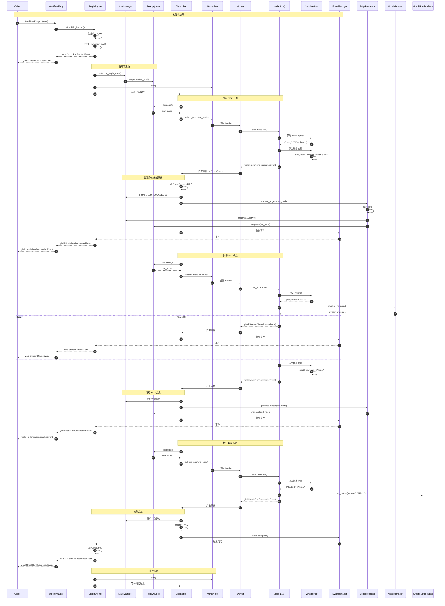

### 流程说明

**阶段 1：初始化（步骤 1-9）**

1. **Caller 调用**：外部调用 `WorkflowEntry.run()`
2. **引擎启动**：`GraphEngine.run()` 初始化扩展层
3. **执行开始**：`graph_execution.start()` 记录开始时间
4. **事件通知**：yield `GraphRunStartedEvent` 通知外部
5. **状态初始化**：`StateManager.initialize_graph_state()` 将起始节点加入就绪队列
6. **工作池启动**：`WorkerPool.start()` 创建 Worker 线程
7. **分发器启动**：`Dispatcher.start()` 在独立线程中运行主循环

**阶段 2：Start 节点执行（步骤 10-20）**

1. **节点调度**：Dispatcher 从就绪队列取出 start_node
2. **任务提交**：提交给 WorkerPool，分配 Worker 执行
3. **节点运行**：Worker 调用 `start_node.run()`
4. **变量获取**：从 VariablePool 获取用户输入
5. **变量输出**：将输入作为输出添加到变量池
6. **事件产生**：yield `NodeRunSucceededEvent`
7. **事件处理**：Dispatcher 更新节点状态
8. **边遍历**：EdgeProcessor 处理出边，检查后继节点
9. **后继入队**：llm_node 加入就绪队列
10. **事件发布**：EventManager 发布事件给外部

**阶段 3：LLM 节点执行（步骤 21-35）**

1. **节点调度**：取出 llm_node
2. **任务分配**：分配 Worker 执行
3. **变量获取**：从变量池获取上游变量（start.query）
4. **LLM 调用**：通过 ModelManager 调用大语言模型
5. **流式输出**：逐 token yield `StreamChunkEvent`
6. **事件流转**：每个 chunk 实时发布给外部调用方
7. **结果存储**：完整响应存入变量池
8. **节点完成**：yield `NodeRunSucceededEvent`
9. **边处理**：处理 llm → end 边
10. **End 节点入队**

**阶段 4：End 节点执行（步骤 36-43）**

1. **节点调度**：取出 end_node
2. **输出收集**：从变量池收集最终输出
3. **状态更新**：将输出写入 GraphRuntimeState.outputs
4. **节点完成**

**阶段 5：完成与清理（步骤 44-50）**

1. **完成检测**：Dispatcher 检测所有节点完成且队列为空
2. **标记完成**：EventManager 标记完成
3. **状态判断**：GraphEngine 判断最终状态（成功/失败/中断）
4. **完成事件**：yield `GraphRunSucceededEvent`
5. **资源清理**：停止 WorkerPool，等待线程结束

---

## 场景二：并行节点执行流程

### 场景描述

执行一个并行工作流：Start → (LLM1, LLM2) → Aggregator → End

两个 LLM 节点并行执行，Aggregator 等待两者都完成后才执行。

### 时序图

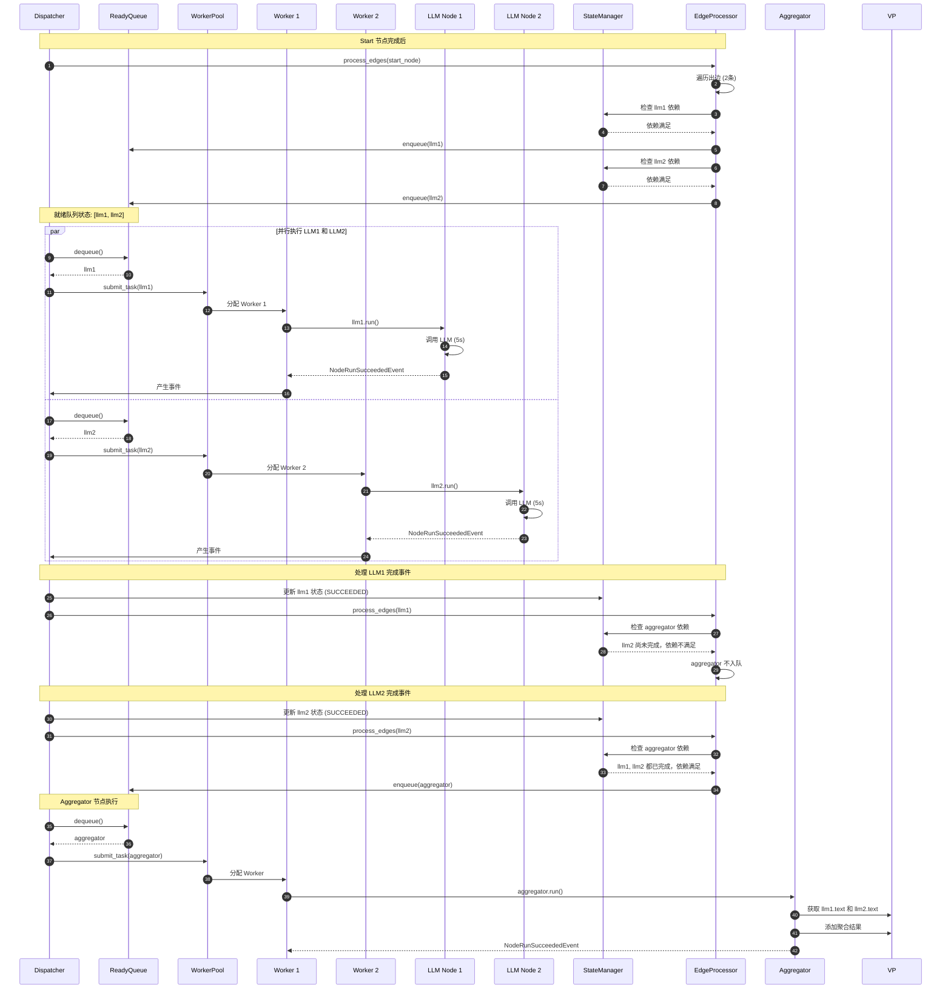

### 关键点说明

1. **依赖检查**：
   - EdgeProcessor 处理每个完成节点的出边
   - StateManager 检查后继节点的所有入边是否都已完成
   - 只有当所有前驱节点都完成时，后继节点才入队

2. **并行度**：
   - llm1 和 llm2 同时在就绪队列中
   - WorkerPool 分配不同的 Worker 并行执行
   - 实际并行度受 Worker 数量限制

3. **性能提升**：
   - 串行执行：5s (llm1) + 5s (llm2) = 10s
   - 并行执行：max(5s, 5s) = 5s
   - 提升 50% 执行效率

---

## 场景三：条件分支执行流程

### 场景描述

执行条件分支工作流：Start → Classifier → (LLM_Creative | LLM_Factual) → End

Classifier 根据问题类型选择执行路径。

### 时序图

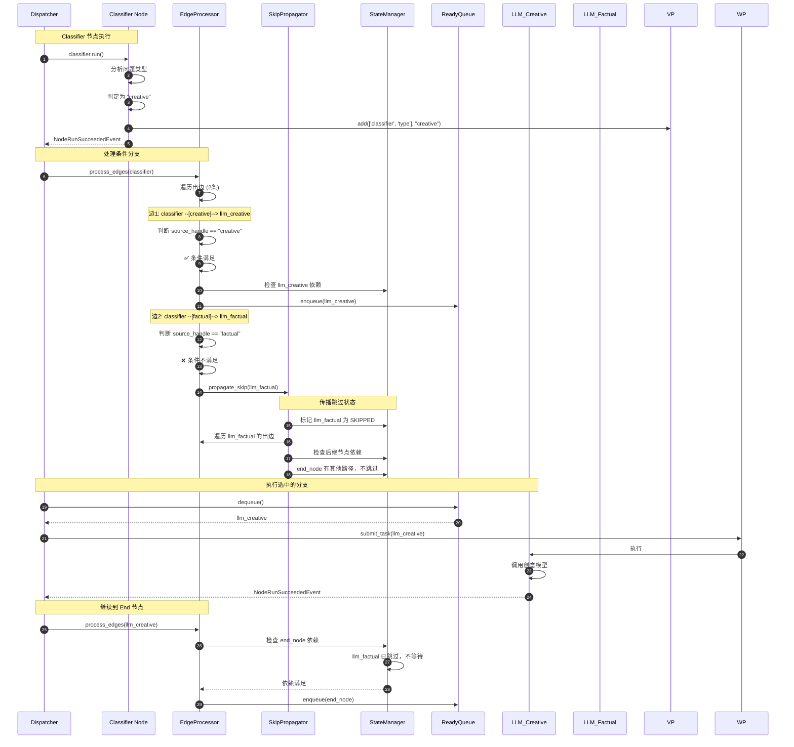

### 关键点说明

**1. 条件判断逻辑**

```python
# EdgeProcessor 处理边时的条件检查
for edge in graph.out_edges[node_id]:
    if edge.source_handle:
        # 获取节点输出中的分支标识
        branch = variable_pool.get([node_id, 'branch'])
        if branch.value != edge.source_handle:
            # 条件不满足，触发跳过传播
            skip_propagator.propagate_skip(edge.head)
            continue
    # 条件满足或无条件，检查后继节点依赖
    ...
```

**2. 跳过传播机制**

- **触发条件**：条件分支未选中、If-Else 条件不满足
- **传播规则**：
  - 标记节点为 SKIPPED 状态
  - 递归检查该节点的后继节点
  - 如果后继节点的所有前驱都被跳过，则继续传播
  - 如果后继节点有其他活跃路径，则停止传播

**3. 依赖满足判断**

```python
def is_dependency_satisfied(node_id: str) -> bool:
    """检查节点的所有前驱是否满足执行条件"""
    in_edge_ids = graph.in_edges[node_id]
    for edge_id in in_edge_ids:
        edge = graph.edges[edge_id]
        predecessor_state = state_manager.get_node_state(edge.tail)
        if predecessor_state not in [NodeState.SUCCEEDED, NodeState.SKIPPED]:
            return False  # 有前驱未完成
    return True
```

---

## 场景四：节点失败与错误处理

### 场景描述

LLM 节点执行失败，根据 error_strategy 决定后续行为。

### 时序图

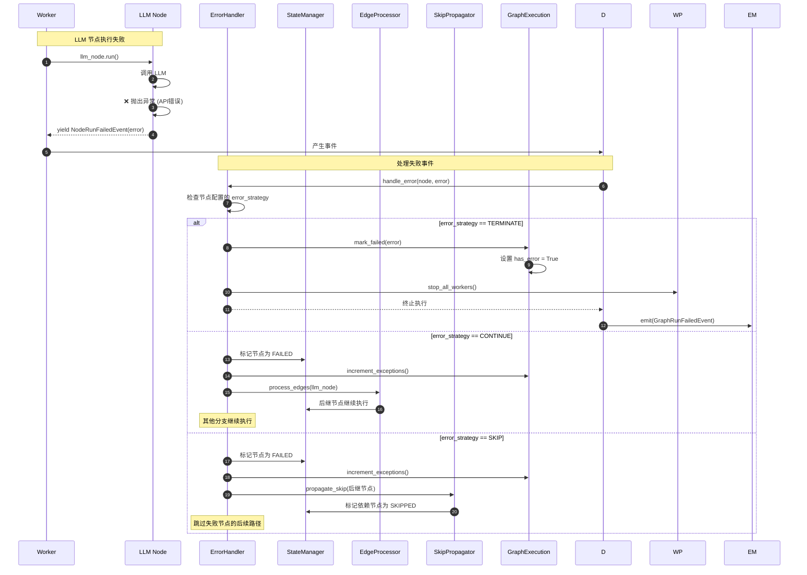

### 错误策略详解

**1. TERMINATE（终止）**

- **行为**：立即停止整个工作流
- **适用场景**：关键节点失败，无法继续执行
- **示例**：鉴权失败、必需参数缺失

```yaml
nodes:

  - id: auth_check
    data:
      error_strategy: terminate

```

**2. CONTINUE（继续）**

- **行为**：记录失败，继续执行其他分支
- **适用场景**：可选节点失败，不影响主流程
- **示例**：发送通知失败、记录日志失败
- **结果**：工作流标记为"部分成功"（GraphRunPartialSucceededEvent）

```yaml
nodes:

  - id: send_notification
    data:
      error_strategy: continue

```

**3. SKIP（跳过）**

- **行为**：标记失败，跳过依赖该节点的后续节点
- **适用场景**：某条路径失败，但不影响其他路径
- **示例**：多路检索中某个数据源失败

```yaml
nodes:

  - id: external_api_call
    data:
      error_strategy: skip

```

---

## 场景五：节点重试机制

### 时序图

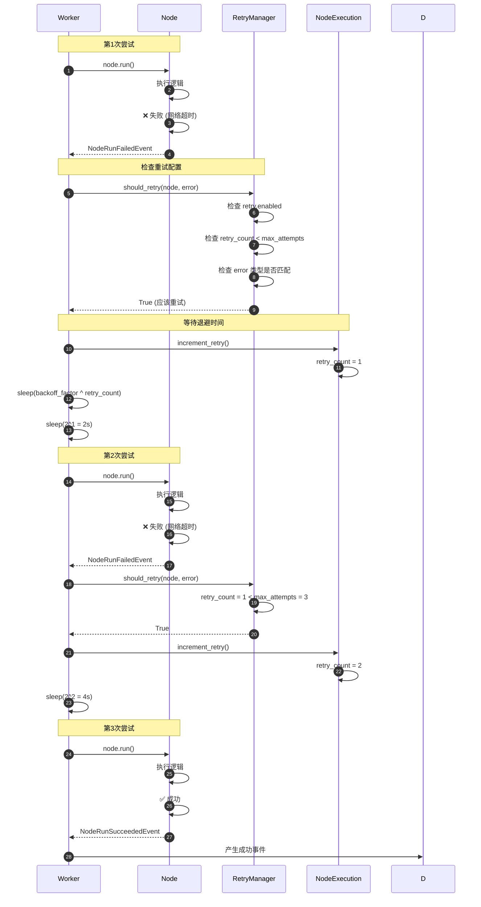

### 重试配置示例

```yaml
nodes:

  - id: http_request
    data:
      title: "调用外部 API"
      error_strategy: continue
      retry:
        enabled: true
        max_attempts: 3
        backoff_factor: 2
        retry_on:
          - TimeoutError
          - ConnectionError
          - HTTPError

```

**配置说明：**

| 字段 | 类型 | 说明 |
|------|------|------|
| `enabled` | bool | 是否启用重试 |
| `max_attempts` | int | 最大重试次数（不含首次尝试） |
| `backoff_factor` | float | 退避因子，等待时间 = backoff^retry_count 秒 |
| `retry_on` | list[str] | 仅对指定异常类型重试 |

**退避时间计算：**

- 第1次重试：`2^1 = 2s`
- 第2次重试：`2^2 = 4s`
- 第3次重试：`2^3 = 8s`

---

## 场景六：外部命令控制（停止工作流）

### 时序图

```mermaid
sequenceDiagram
    autonumber
    participant Ext as External (User)
    participant CC as CommandChannel (Redis)
    participant D as Dispatcher
    participant CP as CommandProcessor
    participant GE as GraphExecution
    participant WP as WorkerPool
    
    Note over Ext,CC: 用户请求停止
    Ext->>CC: send_command(AbortCommand)
    CC->>CC: 写入 Redis 队列
    
    Note over D,CP: Dispatcher 主循环检查命令
    D->>CP: check_commands()
    CP->>CC: receive_command()
    CC-->>CP: AbortCommand(reason="User requested")
    
    Note over CP,GE: 处理停止命令
    CP->>GE: mark_aborted(reason)
    GE->>GE: aborted = True
    GE->>GE: error = reason
    
    Note over D,WP: 停止执行
    D->>WP: stop()
    WP->>WP: 终止所有 Worker
    WP->>WP: 等待当前任务完成
    
    Note over D,GE: 保存状态（可选）
    D->>DB: save_workflow_state(
        ready_queue_json,
        graph_execution_json,
        variable_pool
    )
    
    Note over D: 退出主循环
    D->>EM: mark_complete()
    EM-->>GE: 结束信号
    GE-->>C: yield GraphRunAbortedEvent(reason)
```

### 命令通道实现

**Redis 通道（分布式场景）**

```python
from redis import Redis

class RedisChannel(CommandChannel):
    def __init__(self, redis_client: Redis, channel_key: str):
        self.redis = redis_client
        self.channel_key = channel_key
    
    def send_command(self, command: Command) -> None:
        """发送命令到 Redis 队列"""
        command_json = command.model_dump_json()
        self.redis.rpush(self.channel_key, command_json)
    
    def receive_command(self) -> Command | None:
        """从 Redis 队列接收命令（非阻塞）"""
        command_json = self.redis.lpop(self.channel_key)
        if not command_json:
            return None
        return Command.model_validate_json(command_json)
```

**内存通道（单进程场景）**

```python
import queue

class InMemoryChannel(CommandChannel):
    def __init__(self):
        self.queue = queue.Queue()
    
    def send_command(self, command: Command) -> None:
        self.queue.put(command)
    
    def receive_command(self) -> Command | None:
        try:
            return self.queue.get_nowait()
        except queue.Empty:
            return None
```

### 使用示例

```python
# 发送停止命令（在另一个进程/线程）
redis_channel = RedisChannel(redis_client, f"workflow:{run_id}:commands")
redis_channel.send_command(AbortCommand(reason="User requested stop"))

# 工作流会在下一轮循环检测到命令并停止
# 输出 GraphRunAbortedEvent
```

---

## 性能优化要点

### 1. 事件队列优化

**问题**：事件队列积压导致延迟

**解决方案**：

- 及时消费事件，避免 `EventQueue` 积压
- 使用有界队列，防止内存溢出
- 批量发布事件，减少线程切换

```python
# 批量发布事件
events_batch = []
for node in completed_nodes:
    events_batch.append(NodeRunSucceededEvent(...))
event_manager.emit_batch(events_batch)
```

### 2. Worker Pool 扩缩容

**动态扩容规则**：

- 就绪队列长度 > `scale_up_threshold` 时扩容
- Worker 空闲时间 > `scale_down_idle_time` 时缩容
- Worker 数量限制在 `[min_workers, max_workers]`

```python
worker_pool = WorkerPool(
    min_workers=1,
    max_workers=10,
    scale_up_threshold=5,     # 队列长度超过5时扩容
    scale_down_idle_time=5.0, # 空闲5秒后缩容
)
```

### 3. 变量池访问优化

**问题**：频繁查找相同变量

**解决方案**：

- 缓存变量引用
- 批量获取变量

```python
# 不推荐
for i in range(100):
    value = variable_pool.get(['node', 'var'])
    process(value)

# 推荐
cached_value = variable_pool.get(['node', 'var'])
for i in range(100):
    process(cached_value)
```

---

## 最佳实践

### 1. 事件处理

```python
for event in workflow_entry.run():
    # 使用 isinstance 判断事件类型
    if isinstance(event, GraphRunStartedEvent):
        start_time = time.time()
    elif isinstance(event, StreamChunkEvent):
        print(event.chunk, end="", flush=True)
    elif isinstance(event, NodeRunSucceededEvent):
        logger.info(f"Node {event.node_id} completed")
    elif isinstance(event, GraphRunSucceededEvent):
        elapsed = time.time() - start_time
        logger.info(f"Workflow completed in {elapsed:.2f}s")
```

### 2. 错误处理

```python
try:
    for event in workflow_entry.run():
        if isinstance(event, GraphRunFailedEvent):
            # 记录失败信息
            save_failure_log(event.error)
            break
except Exception as e:
    # 处理意外异常
    logger.exception("Unexpected error")
```

### 3. 监控指标

```python
metrics = {
    'total_nodes': 0,
    'succeeded': 0,
    'failed': 0,
    'skipped': 0,
    'total_time': 0,
    'llm_tokens': 0,
}

for event in workflow_entry.run():
    if isinstance(event, NodeRunSucceededEvent):
        metrics['succeeded'] += 1
        metrics['total_nodes'] += 1
    elif isinstance(event, NodeRunFailedEvent):
        metrics['failed'] += 1
        metrics['total_nodes'] += 1
    elif isinstance(event, GraphRunSucceededEvent):
        metrics['llm_tokens'] = event.total_tokens
```

---

**下一步：**

- [Dify-02-RAG检索增强生成-概览](./Dify-02-RAG检索增强生成-概览.md)

---
