# 03 Agent智能体系统

## 0. 摘要

Agent 智能体系统是 Dify 平台的核心能力之一，通过 ReAct（Reasoning + Acting）框架和 Function Calling 机制，使 LLM 能够自主调用工具、访问知识库，并通过多轮推理解决复杂问题。

**核心能力边界**：
- 多种 Agent 模式（CoT Agent、Function Call Agent）
- 工具调用与编排（内置工具、自定义工具、API 工具、知识库工具）
- 多轮推理与迭代执行（最多 99 轮迭代）
- 记忆管理（Token Buffer Memory）
- 流式输出与实时反馈

**非目标**：
- 不包含工具的具体实现（由 Tools 模块负责）
- 不直接处理工作流编排（由 Workflow 模块负责）

**运行环境**：
- 语言：Python 3.10+
- 核心依赖：大语言模型（支持 Function Calling）、ToolManager、MemoryManager
- 部署形态：作为 Flask 应用的子模块，支持流式和非流式两种模式

---

## 1. 整体架构图

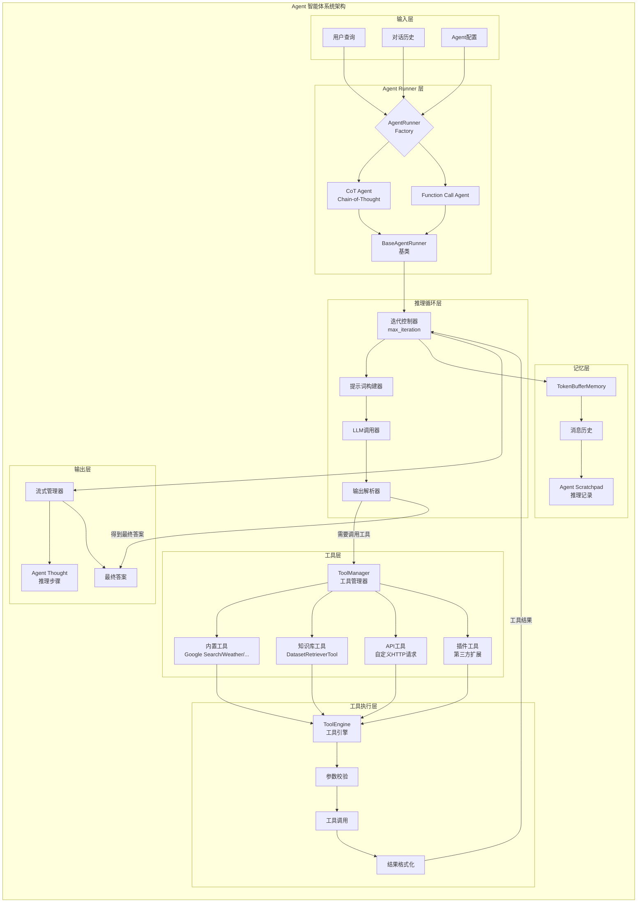
```mermaid
flowchart TB
    subgraph "Agent 智能体系统架构"
        direction TB
        
        subgraph "输入层"
            UserQuery[用户查询]
            ConversationHistory[对话历史]
            AgentConfig[Agent配置]
        end
        
        subgraph "Agent Runner 层"
            AgentFactory{AgentRunner<br/>Factory}
            CotAgent[CoT Agent<br/>Chain-of-Thought]
            FCAgent[Function Call Agent]
            BaseRunner[BaseAgentRunner<br/>基类]
        end
        
        subgraph "推理循环层"
            IterationControl[迭代控制器<br/>max_iteration]
            PromptBuilder[提示词构建器]
            LLMInvoker[LLM调用器]
            OutputParser[输出解析器]
        end
        
        subgraph "工具层"
            ToolManager[ToolManager<br/>工具管理器]
            BuiltInTools[内置工具<br/>Google Search/Weather/...]
            DatasetTools[知识库工具<br/>DatasetRetrieverTool]
            APITools[API工具<br/>自定义HTTP请求]
            PluginTools[插件工具<br/>第三方扩展]
        end
        
        subgraph "工具执行层"
            ToolEngine[ToolEngine<br/>工具引擎]
            ToolValidation[参数校验]
            ToolInvocation[工具调用]
            ResultFormatting[结果格式化]
        end
        
        subgraph "记忆层"
            TokenBuffer[TokenBufferMemory]
            MessageHistory[消息历史]
            AgentScratchpad[Agent Scratchpad<br/>推理记录]
        end
        
        subgraph "输出层"
            StreamManager[流式管理器]
            AgentThought[Agent Thought<br/>推理步骤]
            FinalAnswer[最终答案]
        end
    end
    
    UserQuery --> AgentFactory
    ConversationHistory --> AgentFactory
    AgentConfig --> AgentFactory
    
    AgentFactory --> CotAgent
    AgentFactory --> FCAgent
    CotAgent --> BaseRunner
    FCAgent --> BaseRunner
    
    BaseRunner --> IterationControl
    IterationControl --> PromptBuilder
    PromptBuilder --> LLMInvoker
    LLMInvoker --> OutputParser
    
    OutputParser -->|需要调用工具| ToolManager
    OutputParser -->|得到最终答案| FinalAnswer
    
    ToolManager --> BuiltInTools
    ToolManager --> DatasetTools
    ToolManager --> APITools
    ToolManager --> PluginTools
    
    BuiltInTools --> ToolEngine
    DatasetTools --> ToolEngine
    APITools --> ToolEngine
    PluginTools --> ToolEngine
    
    ToolEngine --> ToolValidation
    ToolValidation --> ToolInvocation
    ToolInvocation --> ResultFormatting
    ResultFormatting -->|工具结果| IterationControl
    
    IterationControl --> TokenBuffer
    TokenBuffer --> MessageHistory
    MessageHistory --> AgentScratchpad
    
    IterationControl --> StreamManager
    StreamManager --> AgentThought
    StreamManager --> FinalAnswer
```

**图解与要点**：

1. **分层设计**：Agent 系统采用 7 层架构，从用户输入到最终输出职责清晰。

2. **组件职责**：
   - **输入层**：接收用户查询、对话历史和配置参数
   - **Agent Runner 层**：根据模式选择 Agent 实现（CoT 或 Function Call）
   - **推理循环层**：控制迭代次数，构建提示词，调用 LLM，解析输出
   - **工具层**：管理和提供各种工具（内置、知识库、API、插件）
   - **工具执行层**：校验参数、执行工具、格式化结果
   - **记忆层**：管理对话历史和推理记录
   - **输出层**：流式输出推理步骤和最终答案

3. **数据流**：
   - **推理流**：用户查询 → 构建提示词 → LLM 推理 → 解析输出 → 工具调用 → 继续推理 → 最终答案
   - **记忆流**：每轮推理结果保存到 Scratchpad，历史对话保存到 TokenBuffer

4. **并发与性能**：
   - 单个 Agent 串行执行（保证推理逻辑连贯性）
   - 支持流式输出（实时展示推理过程）
   - 工具调用可并发执行（未来优化）

5. **扩展性**：
   - 通过工厂模式支持多种 Agent 模式
   - 通过 ToolManager 支持任意工具接入
   - 通过 OutputParser 支持自定义解析逻辑

---

## 2. 全局时序图（典型Agent推理流程）

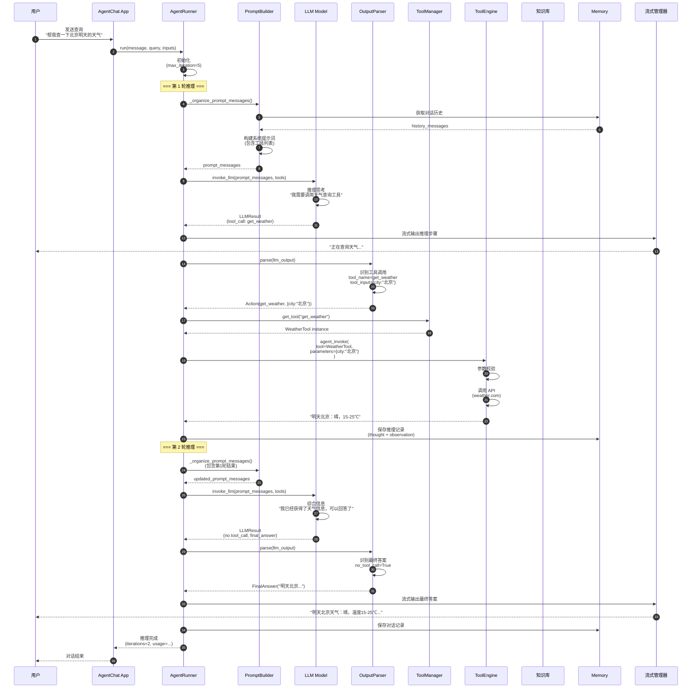
```mermaid
sequenceDiagram
    autonumber
    participant U as 用户
    participant App as AgentChat App
    participant AR as AgentRunner
    participant PM as PromptBuilder
    participant LLM as LLM Model
    participant OP as OutputParser
    participant TM as ToolManager
    participant TE as ToolEngine
    participant KB as 知识库
    participant Mem as Memory
    participant Stream as 流式管理器
    
    U->>App: 发送查询<br/>"帮我查一下北京明天的天气"
    App->>AR: run(message, query, inputs)
    AR->>AR: 初始化<br/>(max_iteration=5)
    
    Note over AR: === 第 1 轮推理 ===
    
    AR->>PM: _organize_prompt_messages()
    PM->>Mem: 获取对话历史
    Mem-->>PM: history_messages
    PM->>PM: 构建系统提示词<br/>(包含工具列表)
    PM-->>AR: prompt_messages
    
    AR->>LLM: invoke_llm(prompt_messages, tools)
    LLM->>LLM: 推理思考<br/>"我需要调用天气查询工具"
    LLM-->>AR: LLMResult<br/>(tool_call: get_weather)
    
    AR->>Stream: 流式输出推理步骤
    Stream-->>U: "正在查询天气..."
    
    AR->>OP: parse(llm_output)
    OP->>OP: 识别工具调用<br/>tool_name=get_weather<br/>tool_input={city:"北京"}
    OP-->>AR: Action(get_weather, {city:"北京"})
    
    AR->>TM: get_tool("get_weather")
    TM-->>AR: WeatherTool instance
    
    AR->>TE: agent_invoke(<br/>  tool=WeatherTool,<br/>  parameters={city:"北京"}<br/>)
    TE->>TE: 参数校验
    TE->>TE: 调用 API<br/>(weather.com)
    TE-->>AR: "明天北京：晴，15-25℃"
    
    AR->>Mem: 保存推理记录<br/>(thought + observation)
    
    Note over AR: === 第 2 轮推理 ===
    
    AR->>PM: _organize_prompt_messages()<br/>(包含第1轮结果)
    PM-->>AR: updated_prompt_messages
    
    AR->>LLM: invoke_llm(prompt_messages, tools)
    LLM->>LLM: 综合信息<br/>"我已经获得了天气信息，可以回答了"
    LLM-->>AR: LLMResult<br/>(no tool_call, final_answer)
    
    AR->>OP: parse(llm_output)
    OP->>OP: 识别最终答案<br/>no_tool_call=True
    OP-->>AR: FinalAnswer("明天北京...")
    
    AR->>Stream: 流式输出最终答案
    Stream-->>U: "明天北京天气：晴，温度15-25℃..."
    
    AR->>Mem: 保存对话记录
    AR-->>App: 推理完成<br/>(iterations=2, usage=...)
    App-->>U: 对话结束
```

**图解与要点**：

1. **入口**（步骤 1-3）：
   - 用户发送查询"帮我查一下北京明天的天气"
   - `AgentRunner` 初始化，设置最大迭代次数（默认 5 次）

2. **第 1 轮推理**（步骤 4-20）：
   - **步骤 4-7**：构建提示词
     - 获取对话历史
     - 构建系统提示词（包含工具列表和使用说明）
     - 组装完整的 prompt_messages
   
   - **步骤 8-10**：LLM 推理
     - 调用 LLM（如 GPT-4）
     - LLM 分析任务，决定调用 `get_weather` 工具
     - 返回工具调用指令
   
   - **步骤 11-12**：流式输出
     - 实时向用户展示"正在查询天气..."
   
   - **步骤 13-15**：解析输出
     - `OutputParser` 解析 LLM 输出
     - 识别工具名称（`get_weather`）和参数（`{city:"北京"}`）
     - 返回 `Action` 对象
   
   - **步骤 16-20**：工具调用
     - 从 `ToolManager` 获取工具实例
     - `ToolEngine` 执行工具（调用天气 API）
     - 返回结果"明天北京：晴，15-25℃"
     - 保存到推理记录（Scratchpad）

3. **第 2 轮推理**（步骤 21-28）：
   - **步骤 21-24**：再次构建提示词
     - 包含第 1 轮的推理结果和工具返回值
     - LLM 看到 Observation："明天北京：晴，15-25℃"
   
   - **步骤 25-26**：LLM 生成最终答案
     - LLM 判断已获得足够信息，不再需要调用工具
     - 生成自然语言回答
   
   - **步骤 27-28**：解析并输出
     - `OutputParser` 识别最终答案（无工具调用）
     - 流式输出最终答案给用户

4. **迭代终止条件**：
   - LLM 不再调用工具（生成最终答案）
   - 达到最大迭代次数（`max_iteration`）
   - 发生错误（工具调用失败、LLM 超时等）

5. **性能数据**（典型场景）：
   - 第 1 轮推理：LLM 调用 1s + 工具调用 0.5s = 1.5s
   - 第 2 轮推理：LLM 调用 1s = 1s
   - **总耗时**：约 2.5s（2 轮迭代）

---

## 3. 模块边界与交互图

### 3.1 Agent 模块与其他模块的交互

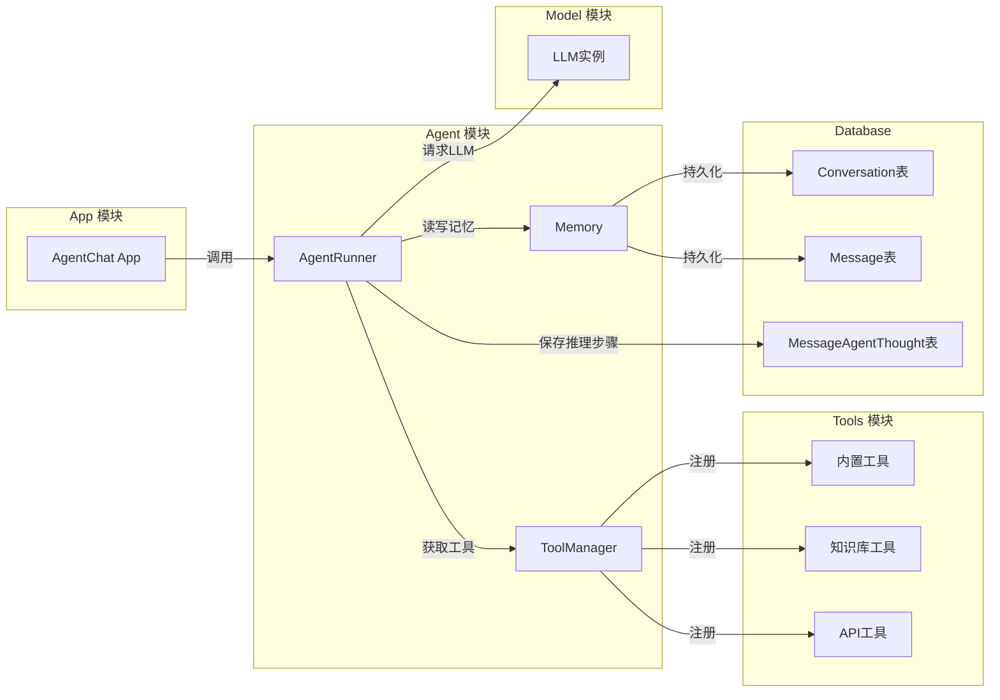
```mermaid
flowchart LR
    subgraph "Agent 模块"
        AR[AgentRunner]
        TM[ToolManager]
        Mem[Memory]
    end
    
    subgraph "App 模块"
        AgentApp[AgentChat App]
    end
    
    subgraph "Tools 模块"
        BuiltIn[内置工具]
        Dataset[知识库工具]
        API[API工具]
    end
    
    subgraph "Model 模块"
        LLM[LLM实例]
    end
    
    subgraph "Database"
        Conv[Conversation表]
        Msg[Message表]
        Thought[MessageAgentThought表]
    end
    
    AgentApp -->|调用| AR
    AR -->|请求LLM| LLM
    AR -->|获取工具| TM
    TM -->|注册| BuiltIn
    TM -->|注册| Dataset
    TM -->|注册| API
    AR -->|读写记忆| Mem
    Mem -->|持久化| Conv
    Mem -->|持久化| Msg
    AR -->|保存推理步骤| Thought
```

**模块交互说明**：

| 调用方 | 被调方 | 接口名称 | 调用类型 | 数据一致性 |
|--------|--------|----------|----------|------------|
| AgentChat App | Agent.AgentRunner | `run()` | 同步 | 强一致性（事务内） |
| AgentRunner | Model.LLM | `invoke_llm()` | 同步 | 不要求 |
| AgentRunner | Tools.ToolManager | `get_tool()` | 同步 | 不要求 |
| AgentRunner | Tools.ToolEngine | `agent_invoke()` | 同步 | 不要求 |
| AgentRunner | Memory.TokenBufferMemory | `get_history()` | 同步 | 最终一致性 |
| AgentRunner | Database | `save_agent_thought()` | 同步 | 强一致性（事务内） |

### 3.2 对外 API 提供方矩阵

| API 名称 | 提供者 | 调用者 | 用途 |
|---------|--------|--------|------|
| `AgentRunner.run()` | Agent | AgentChat App | 执行 Agent 推理 |
| `CotAgentRunner.run()` | Agent | 内部使用 | CoT 模式推理 |
| `FCAgentRunner.run()` | Agent | 内部使用 | Function Call 模式推理 |
| `ToolManager.get_tool()` | Agent | 内部使用 | 获取工具实例 |
| `ToolEngine.agent_invoke()` | Agent | 内部使用 | 执行工具 |
| `OutputParser.parse()` | Agent | 内部使用 | 解析 LLM 输出 |

---

## 4. 关键设计与权衡

### 4.1 数据一致性

**强一致性场景**：
- 推理步骤保存（每轮推理的 thought 和 observation 写入数据库）
- 对话消息保存（保证消息顺序和完整性）

**最终一致性场景**：
- 对话历史加载（允许短暂延迟）
- 工具调用结果（异步工具返回后再更新）

**事务边界**：
- 每轮推理为一个事务单元
- 推理失败时回滚当前轮次

### 4.2 迭代控制策略

**最大迭代次数**：
- 默认：5 次
- 范围：1-99 次
- 超过限制后强制输出当前结果

**提前终止条件**：
- LLM 输出最终答案（无工具调用）
- 连续 3 次工具调用失败
- Token 用量超过预算

### 4.3 性能关键路径

**P95 延迟目标**：
- 单轮推理：< 2s（LLM 调用 1s + 工具调用 1s）
- 完整对话：< 10s（平均 2-3 轮迭代）

**内存峰值**：
- 对话历史：< 100KB（20 轮对话）
- Agent Scratchpad：< 50KB（5 轮推理）

**I/O 热点**：
- LLM API 调用（高频）
- 工具 API 调用（中频）
- 数据库写入（中频）

### 4.4 可观测性指标

| 指标名称 | 类型 | 含义 | 阈值建议 |
|---------|------|------|----------|
| `agent.iteration_count` | 直方图 | 推理迭代次数 | 中位数 2-3 |
| `agent.llm.duration` | 直方图 | LLM 调用耗时 | P95 < 2s |
| `agent.tool.duration` | 直方图 | 工具调用耗时 | P95 < 1s |
| `agent.tool.error_rate` | 百分比 | 工具调用错误率 | < 5% |
| `agent.token_usage` | 计数器 | Token 用量 | 单次对话 < 5000 tokens |

### 4.5 配置项说明

| 配置项 | 默认值 | 影响 | 建议值 |
|--------|--------|------|--------|
| `max_iteration` | 5 | 最大推理次数 | 3-10（复杂任务可增加） |
| `stream_tool_call` | `true` | 是否流式输出工具调用 | 建议开启（更好的用户体验） |
| `memory.max_tokens` | 2000 | 对话历史最大 token 数 | 1000-4000 |
| `agent_mode` | `function_call` | Agent 模式 | `function_call`（更稳定）或 `cot`（更灵活） |

---

## 5. 典型使用示例与最佳实践

### 5.1 示例 1：基本 Agent 对话

```python
from core.agent.fc_agent_runner import FunctionCallAgentRunner
from models.model import Conversation, Message

# 1. 创建对话和消息
conversation = Conversation.query.filter_by(id="conv_id").first()
message = Message(
    conversation_id=conversation.id,
    query="帮我查一下北京明天的天气"
)

# 2. 初始化 Agent Runner
agent_runner = FunctionCallAgentRunner(
    tenant_id=tenant_id,
    application_generate_entity=app_entity,
    conversation=conversation,
    app_config=app_config,
    model_config=model_config,
    config=agent_config,
    queue_manager=queue_manager,
    message=message,
    user_id=user_id,
    model_instance=model_instance,
)

# 3. 执行推理
for chunk in agent_runner.run(message, query="帮我查一下北京明天的天气"):
    if isinstance(chunk, AgentThought):
        print(f"推理步骤: {chunk.thought}")
        print(f"工具调用: {chunk.tool_name}({chunk.tool_input})")
        print(f"工具结果: {chunk.observation}")
    elif isinstance(chunk, FinalAnswer):
        print(f"最终答案: {chunk.answer}")
```

**适用场景**：单次 Agent 对话，需要实时展示推理过程。

**注意事项**：
- 确保配置了至少一个工具
- 设置合理的 `max_iteration`（过小可能无法完成任务）
- 启用流式输出以提升用户体验

### 5.2 示例 2：Agent 使用知识库工具

```python
from core.agent.cot_agent_runner import CotAgentRunner
from core.tools.utils.dataset_retriever_tool import DatasetRetrieverTool

# 1. 初始化知识库工具
dataset_tools = DatasetRetrieverTool.get_dataset_tools(
    tenant_id=tenant_id,
    dataset_ids=["dataset_1", "dataset_2"],
    retrieve_config={
        "top_k": 5,
        "score_threshold": 0.7,
        "reranking_enable": True
    },
    user_id=user_id
)

# 2. 配置 Agent
agent_config = AgentConfig(
    strategy="cot",  # Chain-of-Thought 模式
    max_iteration=5,
    tools=[*dataset_tools, *other_tools]
)

# 3. 创建 CoT Agent Runner
cot_agent = CotAgentRunner(
    tenant_id=tenant_id,
    app_config=app_config,
    model_config=model_config,
    config=agent_config,
    # ... 其他参数
)

# 4. 执行推理
query = "Dify 的工作流引擎有哪些节点类型？"
for chunk in cot_agent.run(message, query, inputs={}):
    # 处理输出...
    pass
```

**适用场景**：需要从知识库检索信息的 Agent 对话。

**最佳实践**：
- 使用 CoT 模式更适合复杂推理任务
- 设置合理的检索参数（`top_k`、`score_threshold`）
- 启用重排序提高检索准确率

### 5.3 示例 3：Agent 调用自定义工具

```python
from core.tools import Tool, ToolParameter

# 1. 定义自定义工具
class MyCustomTool(Tool):
    name = "my_custom_tool"
    description = "这是一个自定义工具示例"
    parameters = [
        ToolParameter(
            name="param1",
            type=ToolParameter.ToolParameterType.STRING,
            required=True,
            description="参数1说明"
        )
    ]
    
    def _invoke(self, parameters: dict) -> str:
        # 实现工具逻辑
        param1 = parameters.get("param1")
        result = f"处理结果: {param1}"
        return result

# 2. 注册工具
from core.tools.tool_manager import ToolManager
ToolManager.register_tool(MyCustomTool)

# 3. Agent 会自动发现并使用该工具
agent_runner.run(message, query="使用 my_custom_tool 处理数据")
```

**适用场景**：需要扩展 Agent 能力，集成第三方 API 或自定义逻辑。

**参数说明**：
- `name`：工具唯一标识
- `description`：工具功能描述（LLM 会读取以决定是否调用）
- `parameters`：工具参数定义（类型、是否必填、描述）
- `_invoke()`：工具实现逻辑

### 5.4 最佳实践清单

**Agent 配置**：
- ✅ 根据任务复杂度设置 `max_iteration`（简单任务 3 次，复杂任务 10 次）
- ✅ 优先使用 Function Call 模式（更稳定，错误率更低）
- ✅ 为工具提供清晰的描述（帮助 LLM 正确选择工具）
- ✅ 限制工具数量（过多工具会降低 LLM 准确率，建议 < 20 个）
- ❌ 避免嵌套 Agent（性能和可控性差）
- ❌ 避免在 Agent 中执行长时间操作（使用异步工具）

**工具设计**：
- ✅ 工具功能单一（一个工具只做一件事）
- ✅ 参数命名清晰（避免歧义）
- ✅ 提供详细的错误信息（帮助 Agent 重试或调整策略）
- ✅ 实现幂等性（同样的参数多次调用结果一致）
- ❌ 避免工具之间有复杂依赖关系
- ❌ 避免工具返回过长的内容（影响 Token 用量）

**性能优化**：
- ✅ 启用流式输出（提升用户体验）
- ✅ 缓存工具调用结果（相同参数直接返回缓存）
- ✅ 使用更快的 LLM 模型（如 GPT-4-turbo）
- ✅ 限制对话历史长度（避免 Token 超限）
- ❌ 避免在每轮推理中重新初始化工具
- ❌ 避免频繁的数据库写入（批量保存推理步骤）

**错误处理**：
- ✅ 捕获工具调用异常（提供回退方案）
- ✅ 记录详细的推理日志（便于调试）
- ✅ 设置合理的超时时间（避免无限等待）
- ✅ 对 LLM 输出进行验证（防止格式错误）
- ❌ 避免直接向用户暴露内部错误
- ❌ 避免在错误后直接终止对话（尝试恢复）

---

## 6. Agent 模式对比

### 6.1 Function Call Agent vs CoT Agent

| 特性 | Function Call Agent | CoT Agent |
|------|---------------------|-----------|
| **原理** | 使用 LLM 的 Function Calling 能力 | 基于 ReAct（Reasoning + Acting）框架 |
| **提示词** | 工具以 JSON Schema 形式传递给 LLM | 工具以文本描述嵌入提示词 |
| **输出格式** | 结构化（JSON） | 半结构化（文本） |
| **稳定性** | 高（LLM 原生支持） | 中（依赖提示词工程） |
| **灵活性** | 中（受限于 Function Calling 格式） | 高（可自定义推理流程） |
| **Token 用量** | 较低 | 较高 |
| **适用场景** | 生产环境、稳定任务 | 复杂推理、研究实验 |
| **LLM 要求** | 必须支持 Function Calling | 无特殊要求 |
| **推荐模型** | GPT-4, Claude, Gemini | 任意 LLM |

**选择建议**：
- **生产环境**：优先使用 Function Call Agent（更稳定）
- **复杂推理**：使用 CoT Agent（更灵活）
- **Token 敏感**：使用 Function Call Agent（更节省）
- **LLM 限制**：如果模型不支持 Function Calling，使用 CoT Agent

### 6.2 迭代次数配置建议

| 任务类型 | 推荐迭代次数 | 示例 |
|----------|--------------|------|
| 简单查询 | 1-2 | "今天几号？"、"1+1等于几？" |
| 单步工具调用 | 2-3 | "查询北京天气"、"搜索Dify文档" |
| 多步推理 | 3-5 | "帮我规划一次北京旅行"、"分析这段代码的问题" |
| 复杂任务 | 5-10 | "编写一个完整的API接口"、"制定营销策略" |

---

## 7. 性能与监控

### 7.1 性能基准

| 场景 | 迭代次数 | Token 用量 | 耗时（P50） | 耗时（P95） |
|------|---------|-----------|-----------|-----------|
| 简单查询（无工具） | 1 | 200 | 0.8s | 1.5s |
| 单次工具调用 | 2 | 500 | 2s | 3s |
| 多次工具调用（3次） | 4 | 1500 | 5s | 8s |
| 知识库检索+推理 | 3 | 1200 | 4s | 6s |

### 7.2 监控指标

**关键指标**：
```python
# 迭代次数分布
agent.iteration_count.histogram(
    tags=["app_id", "model_provider"]
)

# 工具调用成功率
agent.tool.success_rate.gauge(
    tags=["tool_name", "app_id"]
)

# 平均响应时间
agent.response_time.histogram(
    tags=["app_id", "iteration_count"]
)

# Token 用量
agent.token_usage.counter(
    tags=["model_provider", "app_id"]
)
```

**告警规则**：
- 迭代次数 > 8：可能陷入循环
- 工具错误率 > 10%：工具配置或 API 异常
- 响应时间 P95 > 10s：性能下降
- Token 用量 > 10000/对话：成本异常

---

## 总结

Agent 智能体系统是 Dify 平台实现自主任务执行的核心模块。通过 ReAct 框架和 Function Calling 机制，Agent 能够：

1. **自主推理**：根据用户查询制定行动计划
2. **工具调用**：调用各种工具获取信息或执行操作
3. **多轮迭代**：通过多轮推理逐步完成复杂任务
4. **流式输出**：实时展示推理过程，提升用户体验

**核心优势**：
- 支持多种 Agent 模式（Function Call、CoT）
- 灵活的工具系统（内置、知识库、API、插件）
- 完善的记忆管理（对话历史、推理记录）
- 丰富的可观测性（推理步骤、Token 用量、性能指标）

**适用场景**：
- 客服机器人（查询订单、解答问题）
- 个人助理（日程管理、信息检索）
- 数据分析（查询数据库、生成报表）
- 内容创作（搜集资料、撰写文章）

**下一步**：
- 参考 `Dify-03-Agent智能体系统-API.md` 了解详细 API 规格
- 参考 `Dify-03-Agent智能体系统-数据结构.md` 了解核心数据结构
- 参考 `Dify-03-Agent智能体系统-时序图.md` 了解典型调用时序

---

本文档提供 Agent 模块典型场景的详细时序图及逐步解释，覆盖推理循环、工具调用、错误处理等关键流程。

---

## 时序图概览

本文档包含以下场景的时序图：

1. **场景 1**：简单查询（无工具调用）
2. **场景 2**：单次工具调用推理
3. **场景 3**：多次工具调用推理（复杂任务）
4. **场景 4**：工具调用失败与重试
5. **场景 5**：达到最大迭代次数
6. **场景 6**：CoT Agent 推理流程
7. **场景 7**：知识库工具调用

---

## 场景 1：简单查询（无工具调用）

### 业务场景

用户询问"1+1等于几？"，Agent 直接回答，无需调用工具。

### 时序图

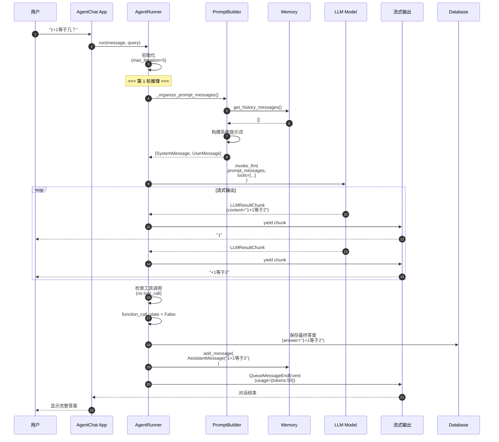
```mermaid
sequenceDiagram
    autonumber
    participant U as 用户
    participant App as AgentChat App
    participant AR as AgentRunner
    participant PM as PromptBuilder
    participant Mem as Memory
    participant LLM as LLM Model
    participant Stream as 流式输出
    participant DB as Database
    
    U->>App: "1+1等于几？"
    App->>AR: run(message, query)
    AR->>AR: 初始化<br/>(max_iteration=5)
    
    Note over AR: === 第 1 轮推理 ===
    
    AR->>PM: _organize_prompt_messages()
    PM->>Mem: get_history_messages()
    Mem-->>PM: []  # 无历史
    PM->>PM: 构建系统提示词
    PM-->>AR: [SystemMessage, UserMessage]
    
    AR->>LLM: invoke_llm(<br/>  prompt_messages,<br/>  tools=[...]<br/>)
    
    loop 流式输出
        LLM-->>AR: LLMResultChunk<br/>(content="1+1等于2")
        AR->>Stream: yield chunk
        Stream-->>U: "1"
        LLM-->>AR: LLMResultChunk
        AR->>Stream: yield chunk
        Stream-->>U: "+1等于2"
    end
    
    AR->>AR: 检查工具调用<br/>(no tool_call)
    AR->>AR: function_call_state = False
    
    AR->>DB: 保存最终答案<br/>(answer="1+1等于2")
    AR->>Mem: add_message(<br/>  AssistantMessage("1+1等于2")<br/>)
    
    AR->>Stream: QueueMessageEndEvent<br/>(usage={tokens:50})
    Stream-->>App: 对话结束
    App-->>U: 显示完整答案
```

### 逐步说明

**步骤 1-5**：初始化
- 用户发送简单查询
- Agent Runner 初始化，设置最大迭代次数为 5

**步骤 6-10**：构建提示词
- 获取对话历史（首次查询，历史为空）
- 构建系统提示词（包含工具列表）
- 组装完整的 prompt_messages

**步骤 11-18**：LLM 推理与流式输出
- 调用 LLM（GPT-4）
- LLM 判断无需调用工具，直接回答
- 流式返回文本片段"1"、"+1等于2"
- 用户实时看到答案生成过程

**步骤 19-22**：检查工具调用
- Agent 检测到无工具调用（`tool_calls` 为空）
- 设置 `function_call_state = False`，终止循环
- 保存最终答案到数据库

**步骤 23-26**：结束对话
- 保存消息到记忆
- 发布结束事件（包含 Token 用量）
- 用户看到完整答案

**性能数据**：
- LLM 调用：0.8s
- Token 用量：50 tokens
- 迭代次数：1 次
- **总耗时**：约 0.8s

---

## 场景 2：单次工具调用推理

### 业务场景

用户询问"北京今天天气怎么样？"，Agent 调用天气工具获取信息后回答。

### 时序图

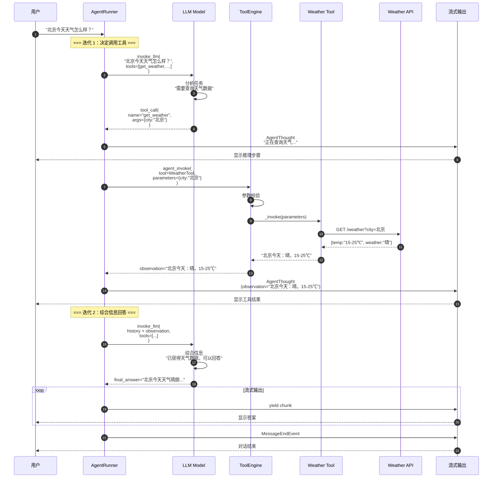
```mermaid
sequenceDiagram
    autonumber
    participant U as 用户
    participant AR as AgentRunner
    participant LLM as LLM Model
    participant TE as ToolEngine
    participant Weather as Weather Tool
    participant API as Weather API
    participant Stream as 流式输出
    
    U->>AR: "北京今天天气怎么样？"
    
    Note over AR: === 迭代 1：决定调用工具 ===
    
    AR->>LLM: invoke_llm(<br/>  "北京今天天气怎么样？",<br/>  tools=[get_weather, ...]<br/>)
    LLM->>LLM: 分析任务<br/>"需要查询天气数据"
    LLM-->>AR: tool_call(<br/>  name="get_weather",<br/>  args={city:"北京"}<br/>)
    
    AR->>Stream: AgentThought<br/>"正在查询天气..."
    Stream-->>U: 显示推理步骤
    
    AR->>TE: agent_invoke(<br/>  tool=WeatherTool,<br/>  parameters={city:"北京"}<br/>)
    TE->>TE: 参数校验
    TE->>Weather: _invoke(parameters)
    Weather->>API: GET /weather?city=北京
    API-->>Weather: {temp:"15-25℃", weather:"晴"}
    Weather-->>TE: "北京今天：晴，15-25℃"
    TE-->>AR: observation="北京今天：晴，15-25℃"
    
    AR->>Stream: AgentThought<br/>(observation="北京今天：晴，15-25℃")
    Stream-->>U: 显示工具结果
    
    Note over AR: === 迭代 2：综合信息回答 ===
    
    AR->>LLM: invoke_llm(<br/>  history + observation,<br/>  tools=[...]<br/>)
    LLM->>LLM: 综合信息<br/>"已获得天气数据，可以回答"
    LLM-->>AR: final_answer="北京今天天气晴朗..."
    
    loop 流式输出
        AR->>Stream: yield chunk
        Stream-->>U: 显示答案
    end
    
    AR->>Stream: MessageEndEvent
    Stream-->>U: 对话结束
```

### 逐步说明

**迭代 1：决定调用工具**（步骤 1-13）
- LLM 分析任务，判断需要查询天气
- 返回工具调用指令：`get_weather(city="北京")`
- Agent 调用 ToolEngine 执行工具
- 工具调用天气 API，返回结果
- 向用户展示推理步骤和工具结果

**迭代 2：综合信息回答**（步骤 14-20）
- 将工具结果（observation）添加到上下文
- LLM 看到天气数据，综合信息生成回答
- 无工具调用，输出最终答案
- 流式返回答案给用户

**性能数据**：
- 迭代 1：LLM 调用 1s + 工具调用 0.5s = 1.5s
- 迭代 2：LLM 调用 1s = 1s
- **总耗时**：约 2.5s
- **Token 用量**：约 500 tokens

---

## 场景 3：多次工具调用推理（复杂任务）

### 业务场景

用户询问"帮我查一下北京明天的天气，如果下雨的话，推荐一家室内咖啡店。"

### 时序图

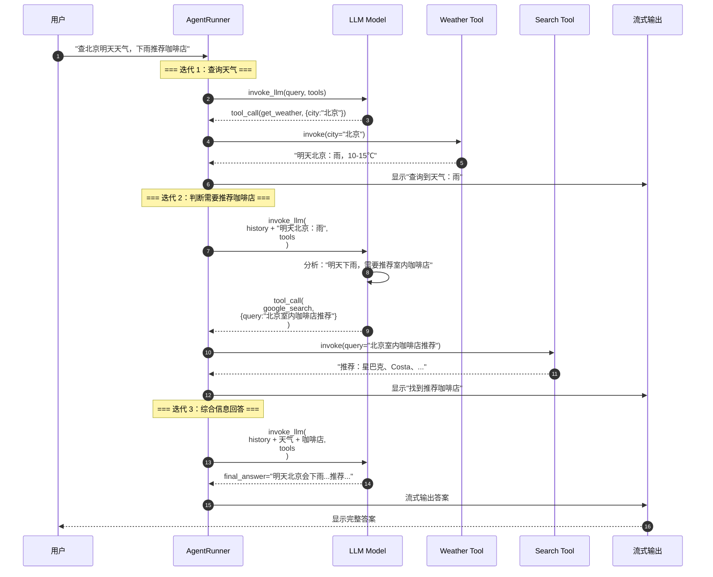
```mermaid
sequenceDiagram
    autonumber
    participant U as 用户
    participant AR as AgentRunner
    participant LLM as LLM Model
    participant Weather as Weather Tool
    participant Search as Search Tool
    participant Stream as 流式输出
    
    U->>AR: "查北京明天天气，下雨推荐咖啡店"
    
    Note over AR: === 迭代 1：查询天气 ===
    
    AR->>LLM: invoke_llm(query, tools)
    LLM-->>AR: tool_call(get_weather, {city:"北京"})
    AR->>Weather: invoke(city="北京")
    Weather-->>AR: "明天北京：雨，10-15℃"
    AR->>Stream: 显示"查询到天气：雨"
    
    Note over AR: === 迭代 2：判断需要推荐咖啡店 ===
    
    AR->>LLM: invoke_llm(<br/>  history + "明天北京：雨",<br/>  tools<br/>)
    LLM->>LLM: 分析："明天下雨，需要推荐室内咖啡店"
    LLM-->>AR: tool_call(<br/>  google_search,<br/>  {query:"北京室内咖啡店推荐"}<br/>)
    AR->>Search: invoke(query="北京室内咖啡店推荐")
    Search-->>AR: "推荐：星巴克、Costa、..."
    AR->>Stream: 显示"找到推荐咖啡店"
    
    Note over AR: === 迭代 3：综合信息回答 ===
    
    AR->>LLM: invoke_llm(<br/>  history + 天气 + 咖啡店,<br/>  tools<br/>)
    LLM-->>AR: final_answer="明天北京会下雨...推荐..."
    AR->>Stream: 流式输出答案
    Stream-->>U: 显示完整答案
```

### 逐步说明

**迭代 1**：查询天气（步骤 1-6）
- LLM 判断需要先查询天气
- 调用 `get_weather` 工具
- 获取结果："明天北京：雨，10-15℃"

**迭代 2**：推荐咖啡店（步骤 7-12）
- LLM 看到天气数据，判断明天会下雨
- 决定调用搜索工具查找室内咖啡店
- 获取搜索结果

**迭代 3**：综合回答（步骤 13-16）
- LLM 综合天气和咖啡店信息
- 生成自然语言回答
- 流式输出给用户

**性能数据**：
- 3 轮迭代，每轮 1.5-2s
- **总耗时**：约 5-6s
- **Token 用量**：约 1500 tokens

---

## 场景 4：工具调用失败与重试

### 业务场景

调用天气 API 失败（网络超时），Agent 尝试其他方案或告知用户。

### 时序图

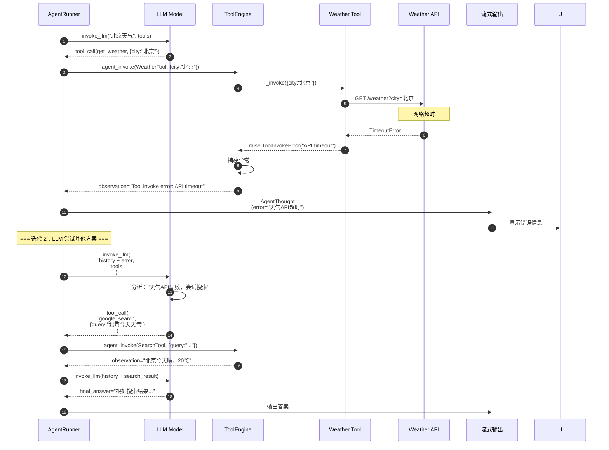
```mermaid
sequenceDiagram
    autonumber
    participant AR as AgentRunner
    participant LLM as LLM Model
    participant TE as ToolEngine
    participant Weather as Weather Tool
    participant API as Weather API
    participant Stream as 流式输出
    
    AR->>LLM: invoke_llm("北京天气", tools)
    LLM-->>AR: tool_call(get_weather, {city:"北京"})
    
    AR->>TE: agent_invoke(WeatherTool, {city:"北京"})
    TE->>Weather: _invoke({city:"北京"})
    Weather->>API: GET /weather?city=北京
    
    Note over API: 网络超时
    
    API-->>Weather: TimeoutError
    Weather-->>TE: raise ToolInvokeError("API timeout")
    TE->>TE: 捕获异常
    TE-->>AR: observation="Tool invoke error: API timeout"
    
    AR->>Stream: AgentThought<br/>(error="天气API超时")
    Stream-->>U: 显示错误信息
    
    Note over AR: === 迭代 2：LLM 尝试其他方案 ===
    
    AR->>LLM: invoke_llm(<br/>  history + error,<br/>  tools<br/>)
    LLM->>LLM: 分析："天气API失败，尝试搜索"
    LLM-->>AR: tool_call(<br/>  google_search,<br/>  {query:"北京今天天气"}<br/>)
    AR->>TE: agent_invoke(SearchTool, {query:"..."})
    TE-->>AR: observation="北京今天晴，20℃"
    
    AR->>LLM: invoke_llm(history + search_result)
    LLM-->>AR: final_answer="根据搜索结果..."
    AR->>Stream: 输出答案
```

### 逐步说明

**步骤 1-10**：工具调用失败
- LLM 决定调用天气工具
- 天气 API 超时（网络问题）
- ToolEngine 捕获异常，返回错误信息
- 向用户展示工具调用失败

**步骤 11-18**：LLM 调整策略
- LLM 看到天气 API 失败的错误信息
- 决定尝试其他方案：使用搜索工具
- 调用搜索工具成功获取天气信息
- 综合信息生成回答

**容错机制**：
- 工具失败不终止对话
- LLM 可以尝试其他工具或方案
- 向用户透明地展示错误信息

---

## 场景 5：达到最大迭代次数

### 业务场景

Agent 在多次工具调用后仍未完成任务，达到最大迭代次数限制（`max_iteration=5`）。

### 时序图

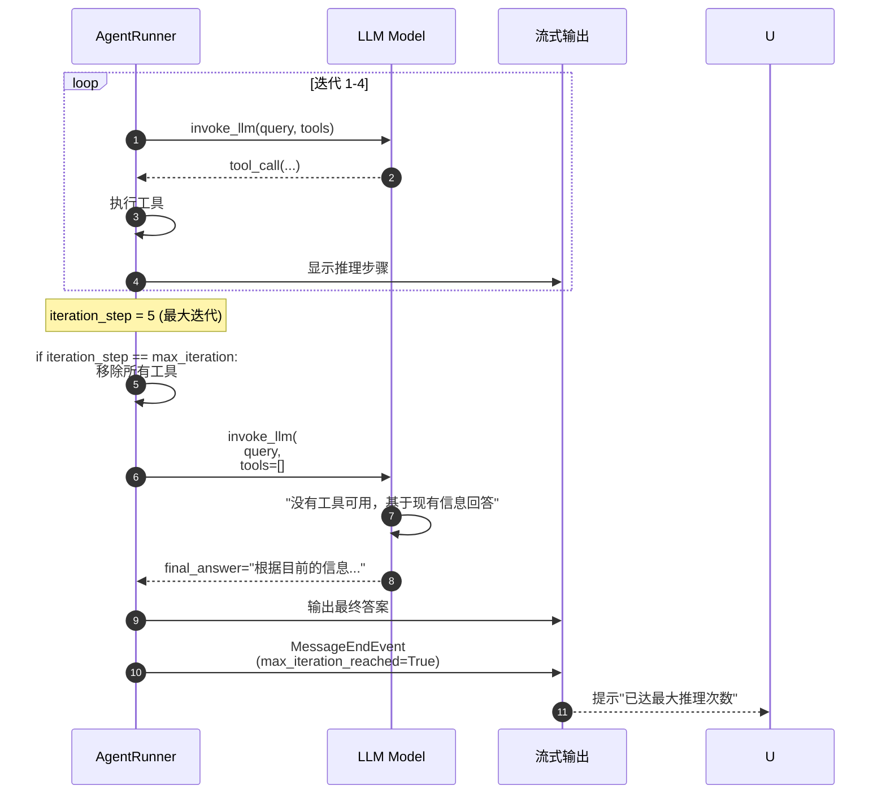
```mermaid
sequenceDiagram
    autonumber
    participant AR as AgentRunner
    participant LLM as LLM Model
    participant Stream as 流式输出
    
    loop 迭代 1-4
        AR->>LLM: invoke_llm(query, tools)
        LLM-->>AR: tool_call(...)
        AR->>AR: 执行工具
        AR->>Stream: 显示推理步骤
    end
    
    Note over AR: iteration_step = 5 (最大迭代)
    
    AR->>AR: if iteration_step == max_iteration:<br/>    移除所有工具
    
    AR->>LLM: invoke_llm(<br/>  query,<br/>  tools=[]  # 强制无工具<br/>)
    LLM->>LLM: "没有工具可用，基于现有信息回答"
    LLM-->>AR: final_answer="根据目前的信息..."
    
    AR->>Stream: 输出最终答案
    AR->>Stream: MessageEndEvent<br/>(max_iteration_reached=True)
    Stream-->>U: 提示"已达最大推理次数"
```

### 逐步说明

**步骤 1-4**：前 4 轮推理
- Agent 正常执行工具调用
- 每轮推理都调用工具获取信息

**步骤 5-11**：第 5 轮强制输出
- 检测到达最大迭代次数
- **关键**：移除所有工具（`tools=[]`）
- LLM 无法再调用工具，只能基于现有信息回答
- 输出最终答案（可能不完整）

**步骤 12-14**：结束对话
- 向用户展示答案
- 附加提示"已达最大推理次数，答案可能不完整"

**防护机制**：
- 避免无限循环
- 确保用户始终能得到回答
- 透明地告知限制

---

## 场景 6：CoT Agent 推理流程

### 业务场景

使用 Chain-of-Thought Agent（ReAct 模式）执行推理。

### 时序图

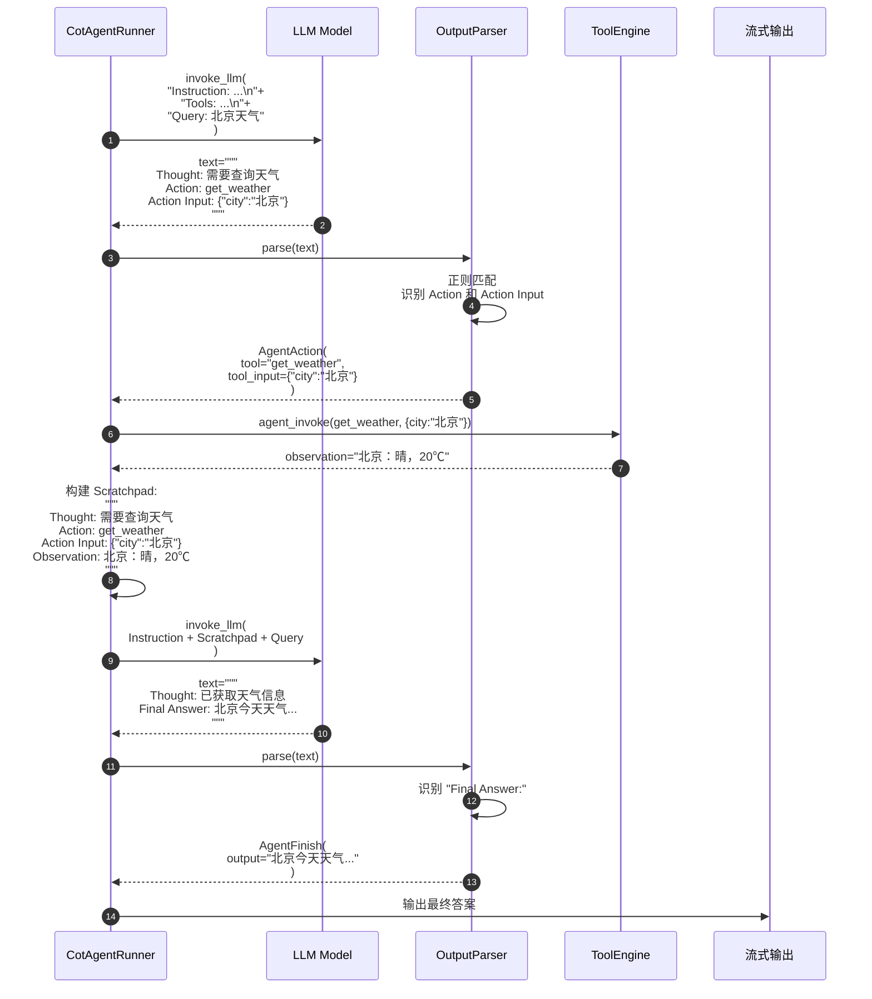
```mermaid
sequenceDiagram
    autonumber
    participant AR as CotAgentRunner
    participant LLM as LLM Model
    participant Parser as OutputParser
    participant TE as ToolEngine
    participant Stream as 流式输出
    
    AR->>LLM: invoke_llm(<br/>  "Instruction: ...\n"+<br/>  "Tools: ...\n"+<br/>  "Query: 北京天气"<br/>)
    
    LLM-->>AR: text="""<br/>Thought: 需要查询天气<br/>Action: get_weather<br/>Action Input: {"city":"北京"}<br/>"""
    
    AR->>Parser: parse(text)
    Parser->>Parser: 正则匹配<br/>识别 Action 和 Action Input
    Parser-->>AR: AgentAction(<br/>  tool="get_weather",<br/>  tool_input={"city":"北京"}<br/>)
    
    AR->>TE: agent_invoke(get_weather, {city:"北京"})
    TE-->>AR: observation="北京：晴，20℃"
    
    AR->>AR: 构建 Scratchpad:<br/>"""<br/>Thought: 需要查询天气<br/>Action: get_weather<br/>Action Input: {"city":"北京"}<br/>Observation: 北京：晴，20℃<br/>"""
    
    AR->>LLM: invoke_llm(<br/>  Instruction + Scratchpad + Query<br/>)
    LLM-->>AR: text="""<br/>Thought: 已获取天气信息<br/>Final Answer: 北京今天天气...<br/>"""
    
    AR->>Parser: parse(text)
    Parser->>Parser: 识别 "Final Answer:"
    Parser-->>AR: AgentFinish(<br/>  output="北京今天天气..."<br/>)
    
    AR->>Stream: 输出最终答案
```

### 逐步说明

**CoT Agent 与 Function Call Agent 的区别**：
- **提示词格式**：CoT 使用文本格式（Thought/Action/Observation），Function Call 使用 JSON Schema
- **输出解析**：CoT 使用正则匹配，Function Call 使用 LLM 原生能力
- **灵活性**：CoT 更灵活但依赖提示词工程，Function Call 更稳定但受限于模型能力

**步骤 1-3**：LLM 生成 Thought 和 Action
- LLM 输出文本格式的推理过程
- 包含 `Thought`、`Action`、`Action Input`

**步骤 4-6**：解析输出
- `OutputParser` 使用正则匹配提取工具名称和参数
- 返回 `AgentAction` 对象

**步骤 7-11**：执行工具并更新 Scratchpad
- 调用工具，获取 `observation`
- 将整个推理过程（Thought + Action + Observation）添加到 Scratchpad
- Scratchpad 作为上下文传递给下一轮 LLM 调用

**步骤 12-18**：生成最终答案
- LLM 看到 Scratchpad 中的 Observation
- 输出包含 `Final Answer:` 的文本
- `OutputParser` 识别并提取最终答案

---

## 场景 7：知识库工具调用

### 业务场景

用户询问"Dify 的工作流引擎有哪些节点类型？"，Agent 调用知识库工具检索相关文档。

### 时序图

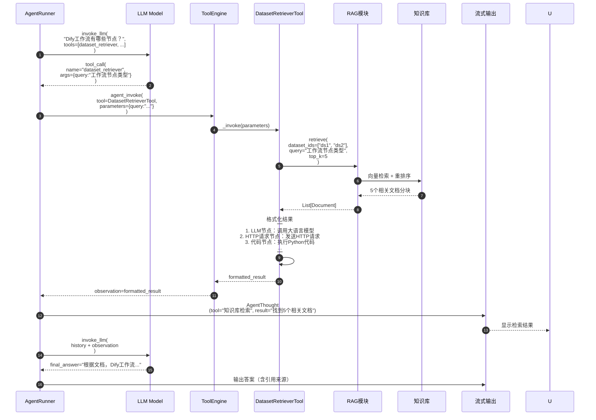
```mermaid
sequenceDiagram
    autonumber
    participant AR as AgentRunner
    participant LLM as LLM Model
    participant TE as ToolEngine
    participant DSTool as DatasetRetrieverTool
    participant RAG as RAG模块
    participant KB as 知识库
    participant Stream as 流式输出
    
    AR->>LLM: invoke_llm(<br/>  "Dify工作流有哪些节点？",<br/>  tools=[dataset_retriever, ...]<br/>)
    LLM-->>AR: tool_call(<br/>  name="dataset_retriever",<br/>  args={query:"工作流节点类型"}<br/>)
    
    AR->>TE: agent_invoke(<br/>  tool=DatasetRetrieverTool,<br/>  parameters={query:"..."}<br/>)
    TE->>DSTool: _invoke(parameters)
    DSTool->>RAG: retrieve(<br/>  dataset_ids=["ds1", "ds2"],<br/>  query="工作流节点类型",<br/>  top_k=5<br/>)
    RAG->>KB: 向量检索 + 重排序
    KB-->>RAG: 5个相关文档分块
    RAG-->>DSTool: List[Document]
    
    DSTool->>DSTool: 格式化结果<br/>"""<br/>1. LLM节点：调用大语言模型<br/>2. HTTP请求节点：发送HTTP请求<br/>3. 代码节点：执行Python代码<br/>...<br/>"""
    DSTool-->>TE: formatted_result
    TE-->>AR: observation=formatted_result
    
    AR->>Stream: AgentThought<br/>(tool="知识库检索", result="找到5个相关文档")
    Stream-->>U: 显示检索结果
    
    AR->>LLM: invoke_llm(<br/>  history + observation<br/>)
    LLM-->>AR: final_answer="根据文档，Dify工作流..."
    AR->>Stream: 输出答案（含引用来源）
```

### 逐步说明

**步骤 1-3**：LLM 决定调用知识库工具
- LLM 分析查询，判断需要从知识库检索信息
- 返回工具调用指令：`dataset_retriever(query="工作流节点类型")`

**步骤 4-11**：知识库检索
- `DatasetRetrieverTool` 调用 RAG 模块
- RAG 模块执行向量检索（语义搜索）
- 应用重排序提高相关性
- 返回 Top 5 相关文档分块

**步骤 12-14**：格式化结果
- 工具将文档分块格式化为易读的文本
- 包含文档内容和元数据（来源、相关性分数）

**步骤 15-20**：综合信息回答
- LLM 看到检索结果
- 综合信息生成回答
- **重要**：答案中包含文档引用（可追溯来源）

**性能数据**：
- 知识库检索：200-500ms
- LLM 推理：1-2s
- **总耗时**：约 2-3s

---

## 总结

Agent 模块的时序图展示了 7 个典型场景，涵盖：

1. **简单查询**：无工具调用，直接回答（0.8s）
2. **单次工具调用**：查询天气等简单任务（2.5s）
3. **多次工具调用**：复杂任务分解为多步骤（5-6s）
4. **错误处理**：工具失败后尝试其他方案
5. **迭代限制**：达到最大次数后强制输出
6. **CoT模式**：基于ReAct的推理流程
7. **知识库检索**：集成RAG能力（2-3s）

**关键性能指标**：

| 场景 | 迭代次数 | 工具调用次数 | 耗时（P50） | Token用量 |
|------|---------|-------------|-----------|----------|
| 简单查询 | 1 | 0 | 0.8s | 50 |
| 单次工具 | 2 | 1 | 2.5s | 500 |
| 多次工具 | 3-5 | 2-4 | 5-8s | 1500 |
| 知识库检索 | 2 | 1 | 2-3s | 800 |

**最佳实践**：
- 简单任务使用低迭代次数（3次）
- 复杂任务增加迭代次数（10次）
- 启用流式输出提升体验
- 设置工具超时避免长时间等待
- 优雅处理工具失败，提供降级方案

---

本文档详细描述 Agent 模块的核心数据结构，包括 UML 类图、字段说明、约束条件和使用示例。

---

## 数据结构概览

Agent 模块的核心数据结构分为以下几类：

1. **Agent 配置类**：`AgentEntity`、`AgentToolEntity`
2. **推理记录类**：`AgentScratchpadUnit`、`MessageAgentThought`
3. **工具类**：`Tool`、`ToolParameter`、`ToolInvokeMeta`
4. **输出类**：`AgentAction`、`AgentFinish`
5. **记忆类**：`TokenBufferMemory`、`PromptMessage`

---

## 1. AgentEntity 配置实体

### UML 类图

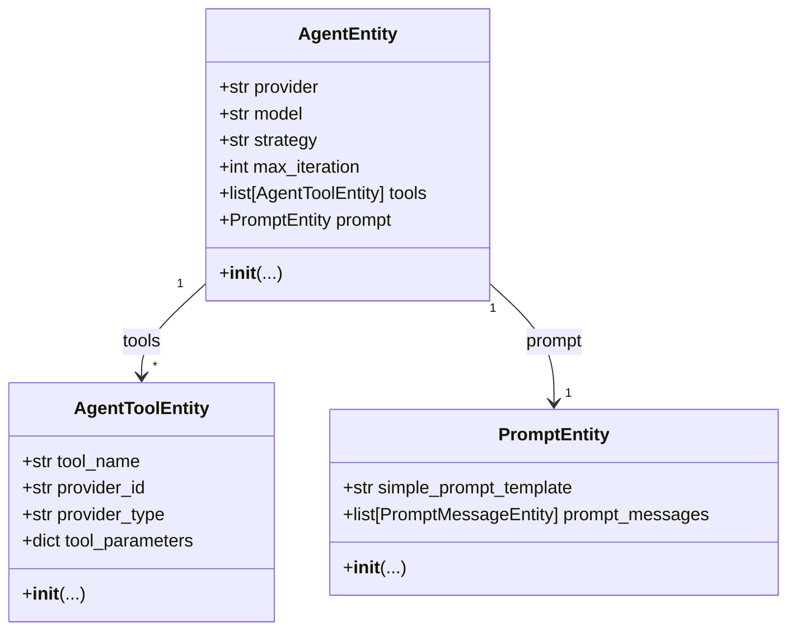
```mermaid
classDiagram
    class AgentEntity {
        +str provider
        +str model
        +str strategy
        +int max_iteration
        +list[AgentToolEntity] tools
        +PromptEntity prompt
        +__init__(...)
    }
    
    class AgentToolEntity {
        +str tool_name
        +str provider_id
        +str provider_type
        +dict tool_parameters
        +__init__(...)
    }
    
    class PromptEntity {
        +str simple_prompt_template
        +list[PromptMessageEntity] prompt_messages
        +__init__(...)
    }
    
    AgentEntity "1" --> "*" AgentToolEntity : tools
    AgentEntity "1" --> "1" PromptEntity : prompt
```

### AgentEntity 字段说明

| 字段 | 类型 | 必填 | 约束 | 说明 |
|------|------|------|------|------|
| `provider` | str | 是 | 非空 | LLM 提供商（openai、anthropic 等） |
| `model` | str | 是 | 非空 | LLM 模型名称（gpt-4、claude-3 等） |
| `strategy` | str | 是 | `"function_call"` / `"cot"` | Agent 策略 |
| `max_iteration` | int | 是 | 1-99 | 最大迭代次数 |
| `tools` | list[AgentToolEntity] | 否 | 默认 [] | 工具列表 |
| `prompt` | PromptEntity | 否 | - | 提示词配置 |

### 核心代码

```python
# api/core/agent/entities.py

from dataclasses import dataclass
from typing import Optional

@dataclass
class AgentToolEntity:
    """Agent 工具配置"""
    tool_name: str                    # 工具名称
    provider_id: str                  # 提供商 ID
    provider_type: str                # 提供商类型（builtin/api）
    tool_parameters: dict             # 工具参数

@dataclass
class AgentEntity:
    """Agent 配置实体"""
    provider: str                     # LLM 提供商
    model: str                        # LLM 模型
    strategy: str                     # Agent 策略
    max_iteration: int                # 最大迭代次数
    tools: list[AgentToolEntity]      # 工具列表
    prompt: Optional[PromptEntity] = None  # 提示词配置
    
    def __post_init__(self):
        """参数校验"""
        if self.max_iteration < 1 or self.max_iteration > 99:
            raise ValueError("max_iteration must be between 1 and 99")
        
        if self.strategy not in ["function_call", "cot"]:
            raise ValueError("strategy must be 'function_call' or 'cot'")
```

### 使用示例

```python
# 创建 Agent 配置
agent_config = AgentEntity(
    provider="openai",
    model="gpt-4",
    strategy="function_call",
    max_iteration=5,
    tools=[
        AgentToolEntity(
            tool_name="google_search",
            provider_id="google",
            provider_type="builtin",
            tool_parameters={"api_key": "xxx"}
        ),
        AgentToolEntity(
            tool_name="weather",
            provider_id="weather_api",
            provider_type="api",
            tool_parameters={"endpoint": "https://api.weather.com"}
        ),
    ],
    prompt=PromptEntity(
        simple_prompt_template="你是一个智能助手，可以使用工具帮助用户..."
    )
)
```

---

## 2. AgentScratchpadUnit 推理记录单元

### UML 类图

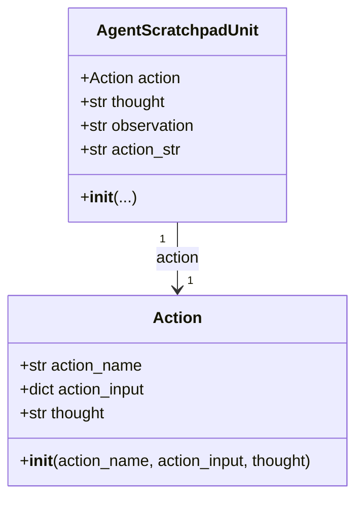
```mermaid
classDiagram
    class AgentScratchpadUnit {
        +Action action
        +str thought
        +str observation
        +str action_str
        +__init__(...)
    }
    
    class Action {
        +str action_name
        +dict action_input
        +str thought
        +__init__(action_name, action_input, thought)
    }
    
    AgentScratchpadUnit "1" --> "1" Action : action
```

### 字段说明

**AgentScratchpadUnit**：

| 字段 | 类型 | 说明 |
|------|------|------|
| `action` | Action | 执行的动作（工具调用） |
| `thought` | str | LLM 的思考过程 |
| `observation` | str | 工具返回的结果 |
| `action_str` | str | 动作的字符串表示 |

**Action**：

| 字段 | 类型 | 说明 |
|------|------|------|
| `action_name` | str | 工具名称 |
| `action_input` | dict | 工具参数 |
| `thought` | str | 执行该动作的原因 |

### 核心代码

```python
# api/core/agent/entities.py

@dataclass
class AgentScratchpadUnit:
    """Agent 推理记录单元（一轮推理的完整记录）"""
    
    @dataclass
    class Action:
        """动作（工具调用）"""
        action_name: str          # 工具名称
        action_input: dict        # 工具参数
        thought: str              # 思考过程
    
    action: Action                # 执行的动作
    thought: str                  # LLM 的思考
    observation: str              # 工具返回结果
    action_str: str               # 动作字符串表示
    
    def __str__(self) -> str:
        """格式化输出（用于构建提示词）"""
        return f"""Thought: {self.thought}
Action: {self.action.action_name}
Action Input: {json.dumps(self.action.action_input)}
Observation: {self.observation}"""
    
    def to_prompt_message(self) -> str:
        """转换为提示词消息"""
        return self.__str__()
```

### 使用示例

```python
# 创建推理记录
scratchpad_unit = AgentScratchpadUnit(
    action=AgentScratchpadUnit.Action(
        action_name="google_search",
        action_input={"query": "Dify 是什么"},
        thought="我需要搜索 Dify 的相关信息"
    ),
    thought="我需要搜索 Dify 的相关信息",
    observation="Dify 是一个开源的 LLM 应用开发平台...",
    action_str="google_search(query='Dify 是什么')"
)

# 转换为提示词
prompt_text = scratchpad_unit.to_prompt_message()
print(prompt_text)
# 输出：
# Thought: 我需要搜索 Dify 的相关信息
# Action: google_search
# Action Input: {"query": "Dify 是什么"}
# Observation: Dify 是一个开源的 LLM 应用开发平台...
```

---

## 3. MessageAgentThought 数据库记录

### 数据库表设计

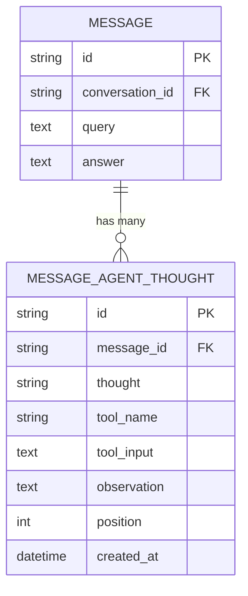
```mermaid
erDiagram
    MESSAGE_AGENT_THOUGHT {
        string id PK
        string message_id FK
        string thought
        string tool_name
        text tool_input
        text observation
        int position
        datetime created_at
    }
    
    MESSAGE {
        string id PK
        string conversation_id FK
        text query
        text answer
    }
    
    MESSAGE ||--o{ MESSAGE_AGENT_THOUGHT : "has many"
```

### 表字段说明

| 字段 | 类型 | 约束 | 索引 | 说明 |
|------|------|------|------|------|
| `id` | UUID | PRIMARY KEY | - | 主键 |
| `message_id` | UUID | NOT NULL, FK | 索引 | 所属消息 ID |
| `thought` | TEXT | - | - | LLM 思考过程 |
| `tool_name` | VARCHAR(255) | - | - | 调用的工具名称 |
| `tool_input` | TEXT | - | - | 工具参数（JSON 字符串） |
| `observation` | TEXT | - | - | 工具返回结果 |
| `position` | INT | NOT NULL | - | 在消息中的位置（迭代序号） |
| `created_at` | TIMESTAMP | NOT NULL | - | 创建时间 |

### 核心代码

```python
# api/models/model.py

class MessageAgentThought(db.Model):
    """Agent 推理步骤表"""
    __tablename__ = 'message_agent_thoughts'
    __table_args__ = (
        db.Index('message_agent_thought_message_id_idx', 'message_id'),
    )
    
    id = db.Column(db.String(255), primary_key=True)
    message_id = db.Column(db.String(255), nullable=False)
    thought = db.Column(db.Text)
    tool_name = db.Column(db.String(255))
    tool_input = db.Column(db.Text)  # JSON 字符串
    observation = db.Column(db.Text)
    position = db.Column(db.Integer, nullable=False)
    created_at = db.Column(db.DateTime, nullable=False, server_default=db.func.now())
    
    def to_dict(self) -> dict:
        """转换为字典"""
        return {
            'id': self.id,
            'message_id': self.message_id,
            'thought': self.thought,
            'tool_name': self.tool_name,
            'tool_input': json.loads(self.tool_input) if self.tool_input else None,
            'observation': self.observation,
            'position': self.position,
            'created_at': self.created_at.isoformat(),
        }
```

---

## 4. Tool 工具接口

### UML 类图

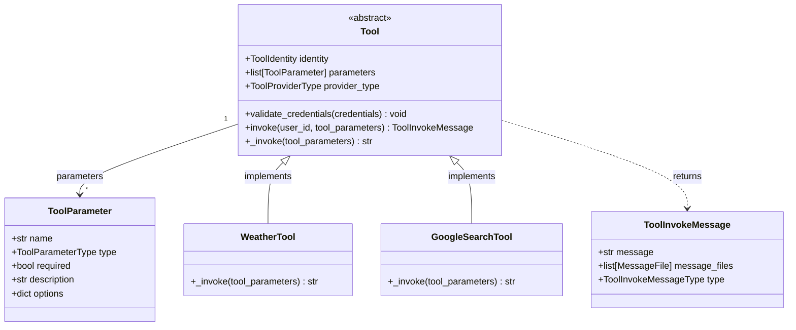
```mermaid
classDiagram
    class Tool {
        <<abstract>>
        +ToolIdentity identity
        +list[ToolParameter] parameters
        +ToolProviderType provider_type
        +validate_credentials(credentials) void
        +invoke(user_id, tool_parameters) ToolInvokeMessage
        +_invoke(tool_parameters) str
    }
    
    class ToolParameter {
        +str name
        +ToolParameterType type
        +bool required
        +str description
        +dict options
    }
    
    class ToolInvokeMessage {
        +str message
        +list[MessageFile] message_files
        +ToolInvokeMessageType type
    }
    
    class WeatherTool {
        +_invoke(tool_parameters) str
    }
    
    class GoogleSearchTool {
        +_invoke(tool_parameters) str
    }
    
    Tool "1" --> "*" ToolParameter : parameters
    Tool <|-- WeatherTool : implements
    Tool <|-- GoogleSearchTool : implements
    Tool ..> ToolInvokeMessage : returns
```

### 字段说明

**Tool**：

| 字段 | 类型 | 说明 |
|------|------|------|
| `identity` | ToolIdentity | 工具标识（名称、作者、标签） |
| `parameters` | list[ToolParameter] | 参数列表 |
| `provider_type` | ToolProviderType | 提供商类型（BUILTIN/API/PLUGIN） |

**ToolParameter**：

| 字段 | 类型 | 说明 |
|------|------|------|
| `name` | str | 参数名称 |
| `type` | ToolParameterType | 参数类型（STRING/NUMBER/BOOLEAN 等） |
| `required` | bool | 是否必填 |
| `description` | str | 参数描述 |
| `options` | dict | 额外选项（枚举值、默认值等） |

### 核心代码

```python
# api/core/tools/__base/tool.py

from abc import ABC, abstractmethod

class Tool(ABC):
    """工具基类"""
    
    identity: ToolIdentity        # 工具标识
    parameters: list[ToolParameter]  # 参数定义
    
    def validate_credentials(self, credentials: dict) -> None:
        """
        校验工具凭证
        
        参数:
            credentials: 凭证字典
        
        抛出:
            ToolCredentialsValidateError: 凭证无效
        """
        pass
    
    @abstractmethod
    def _invoke(self, tool_parameters: dict) -> str | ToolInvokeMessage:
        """
        工具实现（子类需要实现）
        
        参数:
            tool_parameters: 工具参数
        
        返回:
            工具执行结果
        """
        raise NotImplementedError
    
    def invoke(
        self, 
        user_id: str, 
        tool_parameters: dict
    ) -> ToolInvokeMessage:
        """
        调用工具（包含参数校验和日志记录）
        
        参数:
            user_id: 用户 ID
            tool_parameters: 工具参数
        
        返回:
            工具调用消息
        """
        # 1. 参数校验
        self._validate_parameters(tool_parameters)
        
        # 2. 调用工具实现
        result = self._invoke(tool_parameters)
        
        # 3. 格式化结果
        if isinstance(result, str):
            return ToolInvokeMessage(
                message=result,
                message_files=[],
                type=ToolInvokeMessageType.TEXT
            )
        else:
            return result
```

### 使用示例

```python
# 定义自定义工具
class MyCustomTool(Tool):
    identity = ToolIdentity(
        name="my_custom_tool",
        author="me",
        label=I18nObject(en_US="My Custom Tool", zh_Hans="我的自定义工具")
    )
    
    parameters = [
        ToolParameter(
            name="query",
            type=ToolParameterType.STRING,
            required=True,
            description="查询参数"
        )
    ]
    
    def _invoke(self, tool_parameters: dict) -> str:
        query = tool_parameters.get("query")
        # 实现工具逻辑
        result = f"处理结果: {query}"
        return result

# 调用工具
tool = MyCustomTool()
result = tool.invoke(
    user_id="user_123",
    tool_parameters={"query": "测试查询"}
)
print(result.message)  # "处理结果: 测试查询"
```

---

## 5. TokenBufferMemory 记忆管理

### UML 类图

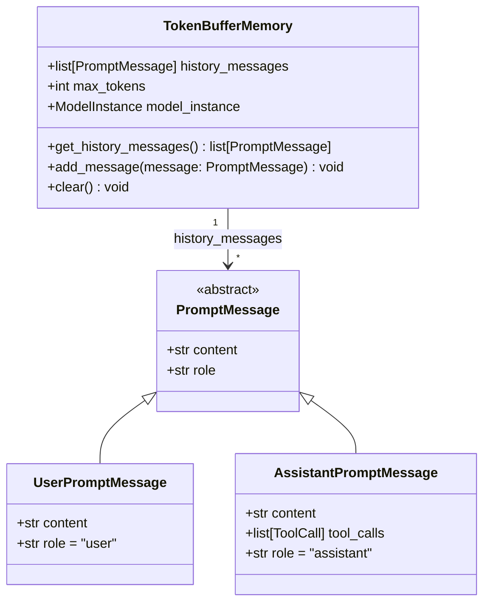
```mermaid
classDiagram
    class TokenBufferMemory {
        +list[PromptMessage] history_messages
        +int max_tokens
        +ModelInstance model_instance
        +get_history_messages() list[PromptMessage]
        +add_message(message: PromptMessage) void
        +clear() void
    }
    
    class PromptMessage {
        <<abstract>>
        +str content
        +str role
    }
    
    class UserPromptMessage {
        +str content
        +str role = "user"
    }
    
    class AssistantPromptMessage {
        +str content
        +list[ToolCall] tool_calls
        +str role = "assistant"
    }
    
    TokenBufferMemory "1" --> "*" PromptMessage : history_messages
    PromptMessage <|-- UserPromptMessage
    PromptMessage <|-- AssistantPromptMessage
```

### 字段说明

| 字段 | 类型 | 说明 |
|------|------|------|
| `history_messages` | list[PromptMessage] | 对话历史消息列表 |
| `max_tokens` | int | 最大 Token 数（超出则截断） |
| `model_instance` | ModelInstance | 用于计算 Token 数的模型实例 |

### 核心代码

```python
# api/core/memory/token_buffer_memory.py

class TokenBufferMemory:
    """基于 Token 的缓冲记忆"""
    
    def __init__(
        self,
        model_instance: ModelInstance,
        max_tokens: int = 2000
    ):
        self.model_instance = model_instance
        self.max_tokens = max_tokens
        self.history_messages: list[PromptMessage] = []
    
    def get_history_messages(self) -> list[PromptMessage]:
        """
        获取对话历史（自动截断到 max_tokens）
        
        返回:
            历史消息列表
        """
        # 1. 计算总 Token 数
        total_tokens = 0
        result_messages = []
        
        # 2. 从最新消息向前遍历
        for message in reversed(self.history_messages):
            message_tokens = self._calculate_tokens(message)
            
            if total_tokens + message_tokens > self.max_tokens:
                break
            
            total_tokens += message_tokens
            result_messages.insert(0, message)
        
        return result_messages
    
    def add_message(self, message: PromptMessage) -> None:
        """
        添加消息到历史
        
        参数:
            message: 提示词消息
        """
        self.history_messages.append(message)
    
    def clear(self) -> None:
        """清空历史"""
        self.history_messages = []
    
    def _calculate_tokens(self, message: PromptMessage) -> int:
        """计算消息的 Token 数"""
        return self.model_instance.get_num_tokens([message])
```

### 使用示例

```python
# 创建记忆管理器
memory = TokenBufferMemory(
    model_instance=model_instance,
    max_tokens=2000
)

# 添加消息
memory.add_message(UserPromptMessage(content="你好"))
memory.add_message(AssistantPromptMessage(content="你好！有什么可以帮你的吗？"))
memory.add_message(UserPromptMessage(content="今天天气怎么样？"))

# 获取历史（自动截断）
history = memory.get_history_messages()
print(f"历史消息数: {len(history)}")

# 清空历史
memory.clear()
```

---

## 6. 数据流转关系

### 推理流程数据转换

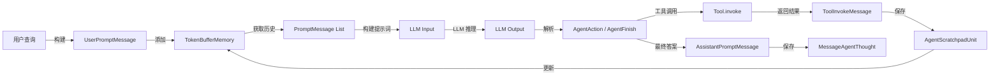
```mermaid
flowchart LR
    A[用户查询] -->|构建| B[UserPromptMessage]
    B -->|添加| C[TokenBufferMemory]
    C -->|获取历史| D[PromptMessage List]
    D -->|构建提示词| E[LLM Input]
    E -->|LLM 推理| F[LLM Output]
    F -->|解析| G[AgentAction / AgentFinish]
    G -->|工具调用| H[Tool.invoke]
    H -->|返回结果| I[ToolInvokeMessage]
    I -->|保存| J[AgentScratchpadUnit]
    J -->|更新| C
    G -->|最终答案| K[AssistantPromptMessage]
    K -->|保存| L[MessageAgentThought]
```

---

## 7. 约束与不变式

### 数据一致性约束

1. **迭代序号唯一性**：
   - 同一 `message_id` 下的 `position` 必须唯一且连续（1, 2, 3, ...）

2. **工具参数完整性**：
   - 必填参数必须存在
   - 参数类型必须匹配定义

3. **记忆 Token 限制**：
   - 对话历史总 Token 数不超过 `max_tokens`
   - 超出部分自动截断最旧的消息

### 业务不变式

1. **推理步骤记录完整性**：
   - 每轮推理必须有 `thought`、`tool_name`（如果调用工具）、`observation`（如果调用工具）

2. **工具调用幂等性**：
   - 相同参数多次调用应产生一致的结果（取决于具体工具）

3. **Agent 配置有效性**：
   - `strategy` 必须是 `"function_call"` 或 `"cot"`
   - `max_iteration` 必须在 1-99 范围内

---

## 8. 扩展与演进

### 版本兼容性

**工具接口版本**：
- V1：仅支持文本返回
- V2：支持文件返回（当前版本）
- V3（计划）：支持流式返回

**元数据扩展**：
- 通过 `tool_parameters` 字段添加自定义参数
- 向后兼容：旧版本数据缺少的字段使用默认值

### 扩展点

1. **自定义工具**：
   - 实现 `Tool` 基类
   - 定义 `identity` 和 `parameters`
   - 实现 `_invoke()` 方法

2. **自定义记忆策略**：
   - 实现自定义记忆管理器
   - 替换 `TokenBufferMemory`

3. **自定义输出解析器**：
   - 实现 `OutputParser` 接口
   - 支持自定义输出格式

---

## 总结

Agent 模块的数据结构设计遵循以下原则：

1. **清晰的分层**：配置、推理、工具、记忆各层职责明确
2. **灵活的扩展**：通过接口和基类支持自定义实现
3. **完整的记录**：每轮推理步骤都有详细记录
4. **高效的记忆**：基于 Token 的自动截断确保性能

这些数据结构支撑了 Agent 从配置初始化、推理执行、工具调用到结果保存的完整流程。

---

本文档详细描述 Agent 模块对外提供的核心 API，包括请求/响应结构、入口函数、调用链、时序图和最佳实践。

---

## API 概览

| API 名称 | 功能 | 调用者 | 幂等性 |
|----------|------|--------|--------|
| `AgentRunner.run()` | Agent 推理执行 | AgentChat App | 否 |
| `BaseAgentRunner._init_prompt_tools()` | 初始化工具列表 | 内部使用 | 是 |
| `BaseAgentRunner._organize_prompt_messages()` | 构建提示词 | 内部使用 | 是 |
| `ToolEngine.agent_invoke()` | 执行工具调用 | AgentRunner | 否 |
| `CotOutputParser.parse()` | 解析 CoT 输出 | CotAgentRunner | 是 |
| `AgentHistoryPromptTransform.transform()` | 转换对话历史 | BaseAgentRunner | 是 |

---

## API 1: AgentRunner.run()

### 基本信息

- **名称**：`AgentRunner.run()`
- **功能**：执行 Agent 推理循环，自主调用工具完成任务
- **调用类型**：同步生成器（Generator）
- **幂等性**：否（每次执行可能产生不同结果）

### 请求结构体

```python
run(
    message: Message,           # 消息对象
    query: str,                # 用户查询文本
    inputs: dict = {}          # 额外输入参数
) -> Generator[LLMResultChunk, None, None]
```

**字段表**：

| 字段 | 类型 | 必填 | 约束/默认 | 说明 |
|------|------|------|-----------|------|
| `message` | Message | 是 | 非空 | 当前消息对象（包含 conversation_id） |
| `query` | str | 是 | 非空字符串 | 用户查询文本 |
| `inputs` | dict | 否 | 默认 {} | 外部输入参数（用于填充提示词变量） |

### 响应结构体

```python
# 生成器返回的事件类型
Union[
    LLMResultChunk,              # LLM 流式输出片段
    QueueAgentThoughtEvent,      # Agent 推理步骤事件
    QueueMessageEndEvent         # 消息结束事件
]
```

**事件字段表**：

| 事件类型 | 字段 | 说明 |
|----------|------|------|
| `LLMResultChunk` | `delta.message.content` | LLM 生成的文本片段 |
| `QueueAgentThoughtEvent` | `agent_thought_id` | 推理步骤唯一 ID |
| `QueueAgentThoughtEvent` | `thought` | LLM 的思考内容 |
| `QueueAgentThoughtEvent` | `tool_name` | 调用的工具名称 |
| `QueueAgentThoughtEvent` | `tool_input` | 工具调用参数 |
| `QueueAgentThoughtEvent` | `observation` | 工具返回结果 |
| `QueueMessageEndEvent` | `llm_usage` | LLM Token 用量统计 |

### 入口函数与核心代码

```python
# api/core/agent/fc_agent_runner.py

class FunctionCallAgentRunner(BaseAgentRunner):
    def run(
        self, 
        message: Message, 
        query: str, 
        **kwargs
    ) -> Generator[LLMResultChunk, None, None]:
        """
        执行 Function Call Agent 推理
        
        参数:
            message: 消息对象
            query: 用户查询
        
        返回:
            生成器（流式返回推理结果）
        """
        self.query = query
        app_config = self.app_config
        
        # 1. 初始化工具
        tool_instances, prompt_messages_tools = self._init_prompt_tools()
        
        # 2. 初始化迭代参数
        iteration_step = 1
        max_iteration_steps = min(app_config.agent.max_iteration, 99) + 1
        function_call_state = True
        llm_usage = {"usage": None}
        final_answer = ""
        
        # 3. 推理循环
        while function_call_state and iteration_step <= max_iteration_steps:
            function_call_state = False
            
            # 3.1 最后一轮移除工具（强制输出答案）
            if iteration_step == max_iteration_steps:
                prompt_messages_tools = []
            
            # 3.2 创建推理步骤记录
            agent_thought_id = self.create_agent_thought(
                message_id=message.id,
                message="",
                tool_name="",
                tool_input="",
                messages_ids=[]
            )
            
            # 3.3 构建提示词
            prompt_messages = self._organize_prompt_messages()
            self.recalc_llm_max_tokens(self.model_config, prompt_messages)
            
            # 3.4 调用 LLM
            chunks = self.model_instance.invoke_llm(
                prompt_messages=prompt_messages,
                model_parameters=self.application_generate_entity.model_conf.parameters,
                tools=prompt_messages_tools,
                stop=self.application_generate_entity.model_conf.stop,
                stream=self.stream_tool_call,
                user=self.user_id,
                callbacks=[],
            )
            
            # 3.5 处理 LLM 输出
            tool_calls = []
            response = ""
            current_llm_usage = None
            
            if isinstance(chunks, Generator):
                # 流式处理
                for chunk in chunks:
                    if isinstance(chunk, LLMResultChunk):
                        # 解析工具调用
                        if chunk.delta.message.tool_calls:
                            for tool_call in chunk.delta.message.tool_calls:
                                tool_calls.append((
                                    tool_call.function.name,
                                    tool_call.id,
                                    tool_call.function.arguments
                                ))
                        
                        # 累积响应文本
                        if chunk.delta.message.content:
                            response += chunk.delta.message.content
                            yield chunk
                        
                        # 记录 Token 用量
                        if chunk.delta.usage:
                            current_llm_usage = chunk.delta.usage
            
            # 3.6 执行工具调用
            if tool_calls:
                function_call_state = True
                
                for tool_name, tool_call_id, tool_call_args in tool_calls:
                    # 获取工具实例
                    tool_instance = tool_instances.get(tool_name)
                    if not tool_instance:
                        observation = f"Tool {tool_name} not found"
                    else:
                        # 解析参数
                        try:
                            tool_parameters = json.loads(tool_call_args)
                        except json.JSONDecodeError:
                            observation = f"Invalid tool arguments: {tool_call_args}"
                            continue
                        
                        # 调用工具
                        observation, message_files, tool_invoke_meta = ToolEngine.agent_invoke(
                            tool=tool_instance,
                            tool_parameters=tool_parameters,
                            user_id=self.user_id,
                            tenant_id=self.tenant_id,
                            message=message,
                            invoke_from=self.application_generate_entity.invoke_from,
                            agent_tool_callback=self.agent_callback,
                            trace_manager=self.application_generate_entity.trace_manager,
                        )
                    
                    # 发布推理步骤事件
                    self.queue_manager.publish(
                        QueueAgentThoughtEvent(
                            agent_thought_id=agent_thought_id,
                            thought=response,
                            tool_name=tool_name,
                            tool_input=tool_call_args,
                            observation=observation,
                        ),
                        PublishFrom.APPLICATION_MANAGER
                    )
                    
                    # 更新 Agent Scratchpad
                    self.update_agent_thought(
                        agent_thought_id=agent_thought_id,
                        tool_name=tool_name,
                        tool_input=tool_call_args,
                        observation=observation,
                    )
            else:
                # 无工具调用，输出最终答案
                final_answer = response
            
            # 3.7 累积 Token 用量
            if current_llm_usage:
                self.increase_usage(llm_usage, current_llm_usage)
            
            # 3.8 下一轮迭代
            iteration_step += 1
        
        # 4. 发布结束事件
        yield QueueMessageEndEvent(
            llm_usage=llm_usage["usage"],
        )
```

**逐步说明**：
1. **步骤 1**：初始化工具列表（从配置中加载）
2. **步骤 2**：初始化迭代参数（最大迭代次数、状态标志）
3. **步骤 3**：进入推理循环，直到无工具调用或达到最大迭代次数
4. **步骤 3.1**：最后一轮移除工具，强制 LLM 输出答案
5. **步骤 3.2-3.4**：构建提示词并调用 LLM
6. **步骤 3.5**：流式处理 LLM 输出，解析工具调用
7. **步骤 3.6**：执行工具调用，发布推理步骤事件
8. **步骤 3.7-3.8**：累积用量，进入下一轮迭代

### 调用链与上游函数

```python
# api/core/app/apps/agent_chat/agent_chat_app_runner.py

class AgentChatAppRunner(AppRunner):
    def run(
        self,
        conversation: Conversation,
        message: Message,
        query: str,
    ) -> Generator:
        """AgentChat App 运行器（上游调用方）"""
        # 1. 初始化 Agent Runner
        if self.app_config.agent.strategy == AgentStrategy.FUNCTION_CALL:
            agent_runner = FunctionCallAgentRunner(
                tenant_id=self.application_generate_entity.tenant_id,
                application_generate_entity=self.application_generate_entity,
                conversation=conversation,
                app_config=self.app_config,
                model_config=self.model_config,
                config=self.app_config.agent,
                queue_manager=self.queue_manager,
                message=message,
                user_id=self.application_generate_entity.user_id,
                model_instance=self.model_instance,
                memory=self.memory,
            )
        else:
            # CoT Agent Runner
            agent_runner = CotAgentRunner(...)
        
        # 2. 执行 Agent 推理
        for chunk in agent_runner.run(message, query):
            yield chunk
```

**上游适配说明**：
- `AgentChatAppRunner` 负责选择 Agent 模式（Function Call 或 CoT）
- 初始化 Agent Runner 并传递配置参数
- 流式转发 Agent 推理结果

### 时序图

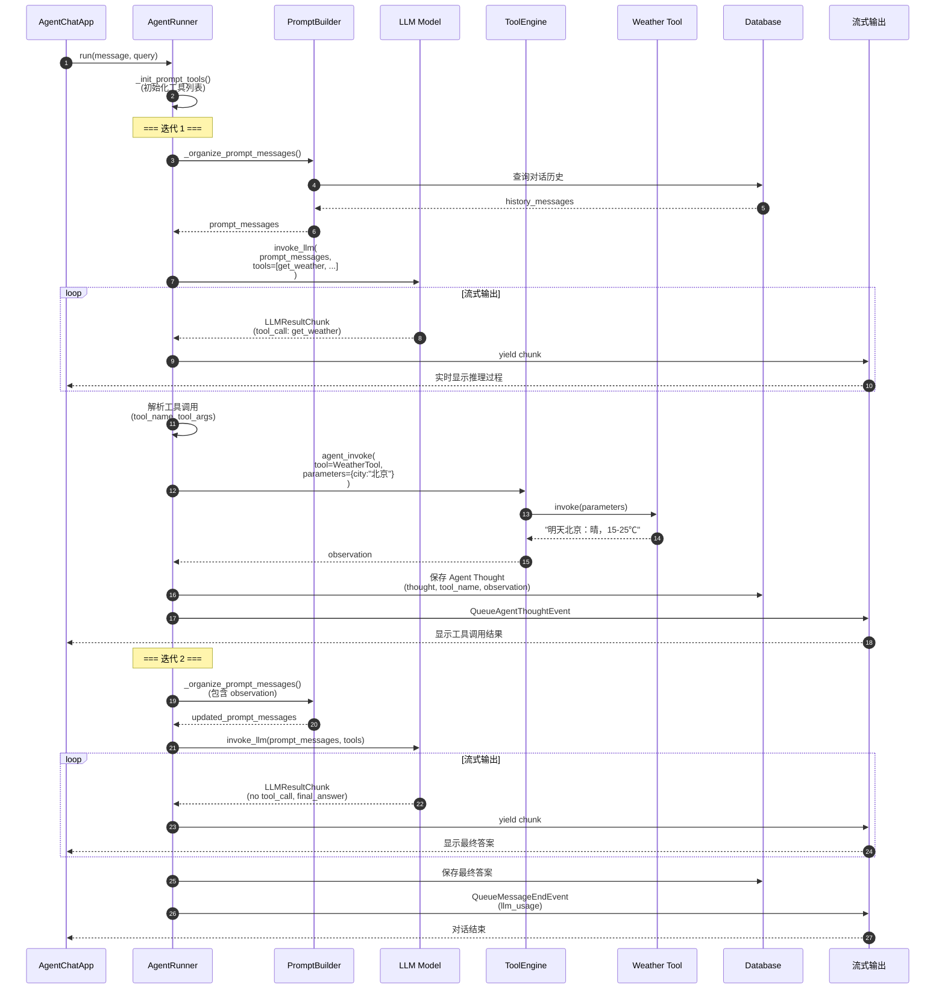
```mermaid
sequenceDiagram
    autonumber
    participant App as AgentChatApp
    participant AR as AgentRunner
    participant PM as PromptBuilder
    participant LLM as LLM Model
    participant TE as ToolEngine
    participant Tool as Weather Tool
    participant DB as Database
    participant Stream as 流式输出
    
    App->>AR: run(message, query)
    AR->>AR: _init_prompt_tools()<br/>(初始化工具列表)
    
    Note over AR: === 迭代 1 ===
    
    AR->>PM: _organize_prompt_messages()
    PM->>DB: 查询对话历史
    DB-->>PM: history_messages
    PM-->>AR: prompt_messages
    
    AR->>LLM: invoke_llm(<br/>  prompt_messages,<br/>  tools=[get_weather, ...]<br/>)
    
    loop 流式输出
        LLM-->>AR: LLMResultChunk<br/>(tool_call: get_weather)
        AR->>Stream: yield chunk
        Stream-->>App: 实时显示推理过程
    end
    
    AR->>AR: 解析工具调用<br/>(tool_name, tool_args)
    
    AR->>TE: agent_invoke(<br/>  tool=WeatherTool,<br/>  parameters={city:"北京"}<br/>)
    TE->>Tool: invoke(parameters)
    Tool-->>TE: "明天北京：晴，15-25℃"
    TE-->>AR: observation
    
    AR->>DB: 保存 Agent Thought<br/>(thought, tool_name, observation)
    
    AR->>Stream: QueueAgentThoughtEvent
    Stream-->>App: 显示工具调用结果
    
    Note over AR: === 迭代 2 ===
    
    AR->>PM: _organize_prompt_messages()<br/>(包含 observation)
    PM-->>AR: updated_prompt_messages
    
    AR->>LLM: invoke_llm(prompt_messages, tools)
    
    loop 流式输出
        LLM-->>AR: LLMResultChunk<br/>(no tool_call, final_answer)
        AR->>Stream: yield chunk
        Stream-->>App: 显示最终答案
    end
    
    AR->>DB: 保存最终答案
    AR->>Stream: QueueMessageEndEvent<br/>(llm_usage)
    Stream-->>App: 对话结束
```

### 边界与异常

**边界条件**：
- `max_iteration` 范围：1-99
- 单次对话最大 Token 数：取决于模型限制（通常 4000-128000）
- 工具调用超时：30 秒（可配置）

**异常处理**：
- **工具不存在**：返回错误信息，LLM 可重试其他工具
- **工具参数错误**：记录错误日志，返回错误信息给 LLM
- **LLM 超时**：等待 30 秒后抛出 `TimeoutError`
- **达到最大迭代**：强制输出当前结果

**错误返回**：
```python
try:
    for chunk in agent_runner.run(message, query):
        yield chunk
except ToolInvokeError as e:
    yield QueueErrorEvent(error=str(e))
except LLMTimeoutError as e:
    yield QueueErrorEvent(error="LLM timeout")
```

### 实践与最佳实践

**最佳实践**：
1. **设置合理的 max_iteration**：
   ```python
   agent_config = AgentConfig(
       strategy="function_call",
       max_iteration=5,  # 简单任务 3，复杂任务 10
   )
   ```

2. **启用流式输出**：
   ```python
   agent_runner = FunctionCallAgentRunner(
       stream_tool_call=True,  # 实时展示推理过程
       # ...
   )
   ```

3. **限制工具数量**：
   ```python
   # 不推荐：注册过多工具（影响 LLM 准确率）
   tools = get_all_tools()  # 可能有 50+ 个工具
   
   # 推荐：只注册相关工具
   tools = [
       WeatherTool(),
       SearchTool(),
       DatasetTool(dataset_ids=["dataset_1"]),
   ]  # 3-10 个工具
   ```

**性能要点**：
- 单轮迭代：LLM 调用 1-2s + 工具调用 0.5-1s = 1.5-3s
- 完整对话：2-3 轮迭代，约 3-9s
- Token 用量：500-2000 tokens/轮（取决于工具数量和历史长度）

---

## API 2: ToolEngine.agent_invoke()

### 基本信息

- **名称**：`ToolEngine.agent_invoke()`
- **功能**：在 Agent 上下文中执行工具调用
- **调用类型**：同步方法
- **幂等性**：取决于具体工具（大部分工具非幂等）

### 请求结构体

```python
agent_invoke(
    tool: Tool,                           # 工具实例
    tool_parameters: dict,                # 工具参数
    user_id: str,                         # 用户 ID
    tenant_id: str,                       # 租户 ID
    message: Message,                     # 消息对象
    invoke_from: InvokeFrom,              # 调用来源
    agent_tool_callback: AgentToolCallback,  # 回调处理器
    trace_manager: TraceQueueManager | None = None  # 追踪管理器
) -> tuple[str, list[str], ToolInvokeMeta]
```

**字段表**：

| 字段 | 类型 | 必填 | 说明 |
|------|------|------|------|
| `tool` | Tool | 是 | 工具实例 |
| `tool_parameters` | dict | 是 | 工具调用参数 |
| `user_id` | str | 是 | 用户唯一标识 |
| `tenant_id` | str | 是 | 租户唯一标识 |
| `message` | Message | 是 | 当前消息对象 |
| `invoke_from` | InvokeFrom | 是 | 调用来源（Agent/Workflow） |
| `agent_tool_callback` | AgentToolCallback | 是 | 回调处理器 |
| `trace_manager` | TraceQueueManager | 否 | 追踪管理器（可选） |

### 响应结构体

```python
tuple[
    str,              # 工具返回结果（observation）
    list[str],        # 生成的文件 ID 列表
    ToolInvokeMeta    # 工具调用元数据
]

# ToolInvokeMeta 结构
class ToolInvokeMeta:
    time_cost: float           # 耗时（秒）
    error: str | None          # 错误信息
    tool_config: dict          # 工具配置
```

### 入口函数与核心代码

```python
# api/core/tools/tool_engine.py

class ToolEngine:
    @staticmethod
    def agent_invoke(
        tool: Tool,
        tool_parameters: dict,
        user_id: str,
        tenant_id: str,
        message: Message,
        invoke_from: InvokeFrom,
        agent_tool_callback: AgentToolCallback,
        trace_manager: TraceQueueManager | None = None,
    ) -> tuple[str, list[str], ToolInvokeMeta]:
        """
        在 Agent 上下文中执行工具调用
        
        参数:
            tool: 工具实例
            tool_parameters: 工具参数
            user_id: 用户 ID
            tenant_id: 租户 ID
            message: 消息对象
            invoke_from: 调用来源
            agent_tool_callback: 回调处理器
            trace_manager: 追踪管理器
        
        返回:
            (工具结果, 文件ID列表, 元数据)
        """
        started_at = time.time()
        
        # 1. 参数校验
        try:
            tool.validate_credentials(tool_parameters)
        except ToolParameterValidationError as e:
            return (
                f"Tool parameter validation error: {str(e)}",
                [],
                ToolInvokeMeta.error_instance(str(e))
            )
        
        # 2. 开始追踪
        if trace_manager:
            trace_manager.add_trace_task(
                TraceTask(
                    TraceTaskName.TOOL_INVOKE,
                    tool_name=tool.identity.name,
                    tool_parameters=tool_parameters,
                )
            )
        
        # 3. 调用工具
        try:
            # 设置回调
            tool.set_callback(agent_tool_callback)
            
            # 执行工具
            result = tool.invoke(
                user_id=user_id,
                tool_parameters=tool_parameters,
            )
            
            # 处理结果
            if isinstance(result, ToolInvokeMessage):
                observation = result.message
                message_files = result.message_files or []
            else:
                observation = str(result)
                message_files = []
            
            # 保存文件
            file_ids = []
            for message_file in message_files:
                file_id = self._save_message_file(
                    tenant_id=tenant_id,
                    conversation_id=message.conversation_id,
                    message_file=message_file,
                )
                file_ids.append(file_id)
            
            # 4. 记录元数据
            time_cost = time.time() - started_at
            meta = ToolInvokeMeta(
                time_cost=time_cost,
                error=None,
                tool_config=tool.get_runtime_parameters(),
            )
            
            # 5. 结束追踪
            if trace_manager:
                trace_manager.add_trace_task(
                    TraceTask(
                        TraceTaskName.TOOL_INVOKE,
                        status=TraceTaskStatus.SUCCESS,
                        tool_result=observation,
                        time_cost=time_cost,
                    )
                )
            
            return observation, file_ids, meta
        
        except Exception as e:
            # 异常处理
            logger.exception(f"Tool {tool.identity.name} invoke error")
            time_cost = time.time() - started_at
            error_msg = str(e)
            
            if trace_manager:
                trace_manager.add_trace_task(
                    TraceTask(
                        TraceTaskName.TOOL_INVOKE,
                        status=TraceTaskStatus.ERROR,
                        error=error_msg,
                        time_cost=time_cost,
                    )
                )
            
            return (
                f"Tool invoke error: {error_msg}",
                [],
                ToolInvokeMeta.error_instance(error_msg)
            )
```

**逐步说明**：
1. **步骤 1**：校验工具参数（类型、必填项、格式等）
2. **步骤 2**：开始追踪（记录工具名称、参数）
3. **步骤 3**：执行工具调用，处理返回结果和文件
4. **步骤 4**：记录元数据（耗时、配置等）
5. **步骤 5**：结束追踪，返回结果

### 时序图

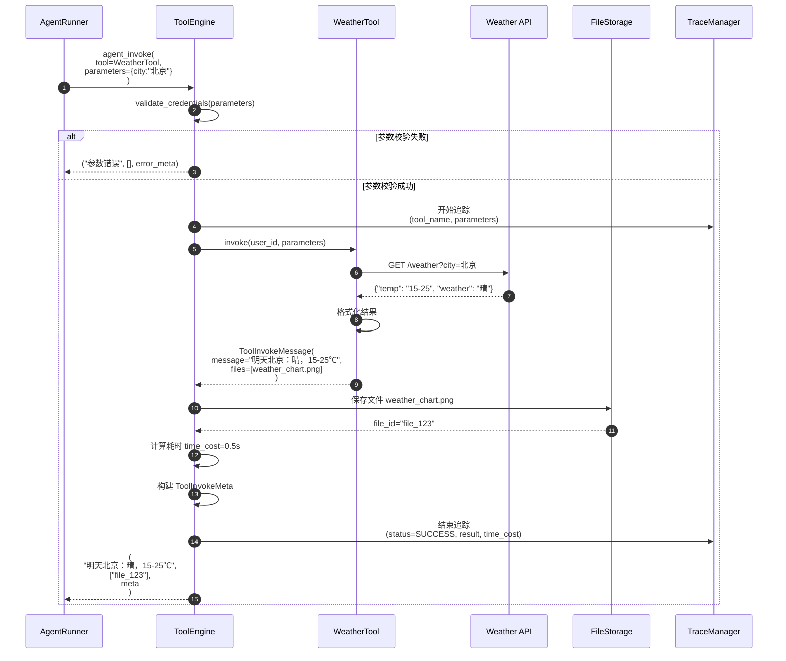
```mermaid
sequenceDiagram
    autonumber
    participant AR as AgentRunner
    participant TE as ToolEngine
    participant Tool as WeatherTool
    participant API as Weather API
    participant FS as FileStorage
    participant Trace as TraceManager
    
    AR->>TE: agent_invoke(<br/>  tool=WeatherTool,<br/>  parameters={city:"北京"}<br/>)
    
    TE->>TE: validate_credentials(parameters)
    
    alt 参数校验失败
        TE-->>AR: ("参数错误", [], error_meta)
    else 参数校验成功
        TE->>Trace: 开始追踪<br/>(tool_name, parameters)
        
        TE->>Tool: invoke(user_id, parameters)
        Tool->>API: GET /weather?city=北京
        API-->>Tool: {"temp": "15-25", "weather": "晴"}
        Tool->>Tool: 格式化结果
        Tool-->>TE: ToolInvokeMessage(<br/>  message="明天北京：晴，15-25℃",<br/>  files=[weather_chart.png]<br/>)
        
        TE->>FS: 保存文件 weather_chart.png
        FS-->>TE: file_id="file_123"
        
        TE->>TE: 计算耗时 time_cost=0.5s
        TE->>TE: 构建 ToolInvokeMeta
        
        TE->>Trace: 结束追踪<br/>(status=SUCCESS, result, time_cost)
        
        TE-->>AR: (<br/>  "明天北京：晴，15-25℃",<br/>  ["file_123"],<br/>  meta<br/>)
    end
```

### 实践与最佳实践

**最佳实践**：
1. **设置工具超时**：
   ```python
   tool.set_timeout(30)  # 30 秒超时
   ```

2. **处理文件返回**：
   ```python
   observation, file_ids, meta = ToolEngine.agent_invoke(...)
   
   # 向用户展示文件
   for file_id in file_ids:
       display_file(file_id)
   ```

3. **错误重试**：
   ```python
   max_retries = 3
   for attempt in range(max_retries):
       try:
           result = ToolEngine.agent_invoke(...)
           if "error" not in result[0].lower():
               break
       except Exception as e:
           if attempt == max_retries - 1:
               raise
           time.sleep(2 ** attempt)  # 指数退避
   ```

---

## API 3: OutputParser.parse()

### 基本信息

- **名称**：`CotOutputParser.parse()`
- **功能**：解析 CoT Agent 的 LLM 输出，提取 Action 或 Final Answer
- **调用类型**：同步方法
- **幂等性**：是

### 请求结构体

```python
parse(
    text: str                              # LLM 输出文本
) -> Union[AgentAction, AgentFinish]
```

### 响应结构体

```python
# AgentAction 结构（需要调用工具）
AgentAction(
    tool: str,                # 工具名称
    tool_input: dict | str,   # 工具参数
    thought: str              # LLM 思考过程
)

# AgentFinish 结构（最终答案）
AgentFinish(
    return_values: dict,      # 返回值 {"output": "答案"}
    thought: str              # LLM 思考过程
)
```

### 核心代码

```python
# api/core/agent/output_parser/cot_output_parser.py

class CotAgentOutputParser:
    @staticmethod
    def parse(text: str) -> Union[AgentAction, AgentFinish]:
        """
        解析 CoT Agent 输出
        
        参数:
            text: LLM 输出文本
        
        返回:
            AgentAction 或 AgentFinish
        """
        # 1. 检查是否包含 Final Answer
        if "Final Answer:" in text:
            # 提取最终答案
            final_answer = text.split("Final Answer:")[-1].strip()
            return AgentFinish(
                return_values={"output": final_answer},
                thought=text
            )
        
        # 2. 解析 Action
        # 格式：Action: tool_name\nAction Input: {parameters}
        action_match = re.search(r"Action:\s*(.+?)\n", text)
        action_input_match = re.search(r"Action Input:\s*(.+?)(?:\n|$)", text, re.DOTALL)
        
        if action_match and action_input_match:
            tool_name = action_match.group(1).strip()
            tool_input_str = action_input_match.group(1).strip()
            
            # 解析参数（JSON 或纯文本）
            try:
                tool_input = json.loads(tool_input_str)
            except json.JSONDecodeError:
                tool_input = tool_input_str
            
            return AgentAction(
                tool=tool_name,
                tool_input=tool_input,
                thought=text
            )
        
        # 3. 无法解析，返回错误
        raise OutputParserException(f"Cannot parse output: {text}")
```

---

## 总结

Agent 模块的核心 API 实现了自主推理和工具调用的完整流程：

1. **AgentRunner.run()**：推理循环主入口，管理迭代和状态
2. **ToolEngine.agent_invoke()**：工具执行引擎，处理参数校验和结果
3. **OutputParser.parse()**：输出解析器，提取工具调用或最终答案

**关键特性**：
- 流式输出：实时展示推理过程
- 多轮迭代：自动调用多个工具完成任务
- 异常处理：优雅处理工具调用失败
- 可观测性：完整的追踪和监控支持

**性能优化**：
- 启用流式输出提升体验
- 限制工具数量提高准确率
- 设置合理的迭代次数避免超时
- 使用缓存减少重复调用

**下一步**：
- 参考 `Dify-03-Agent智能体系统-数据结构.md` 了解核心数据结构
- 参考 `Dify-03-Agent智能体系统-时序图.md` 了解典型调用时序