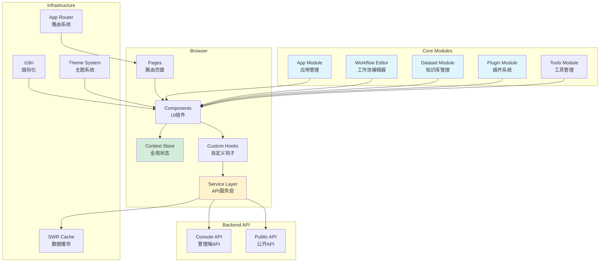
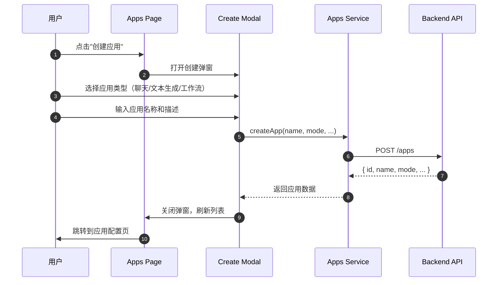
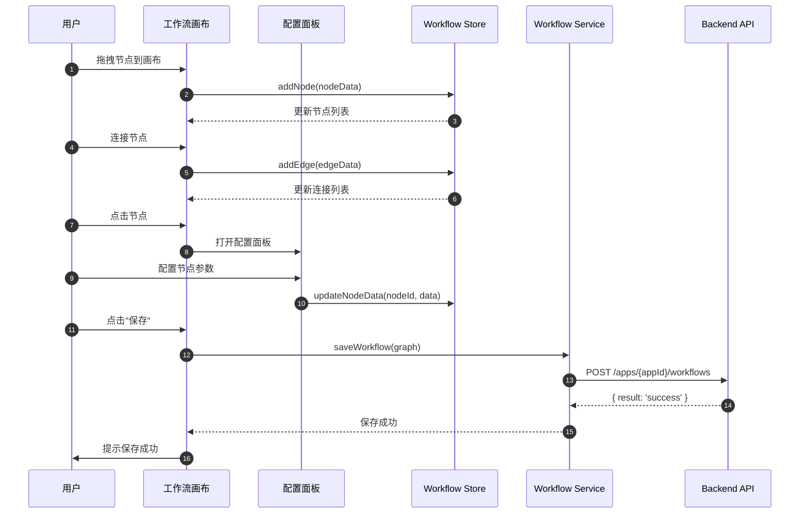
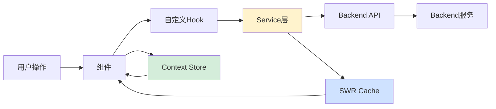
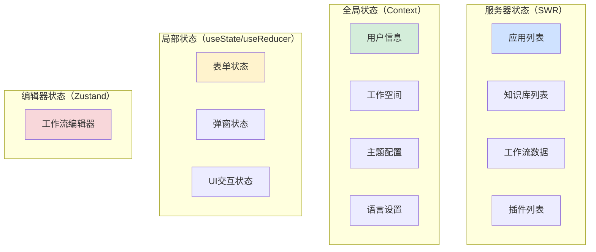
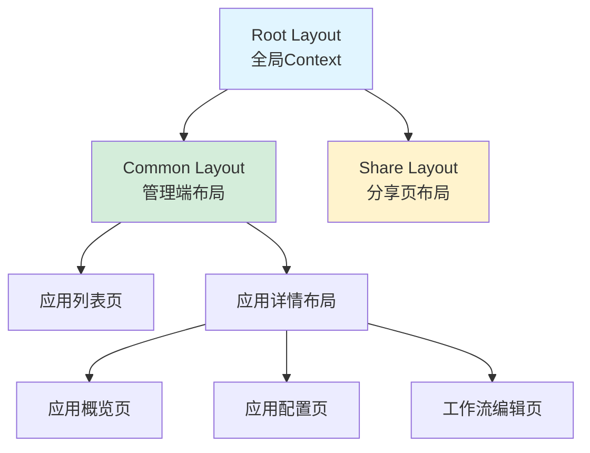
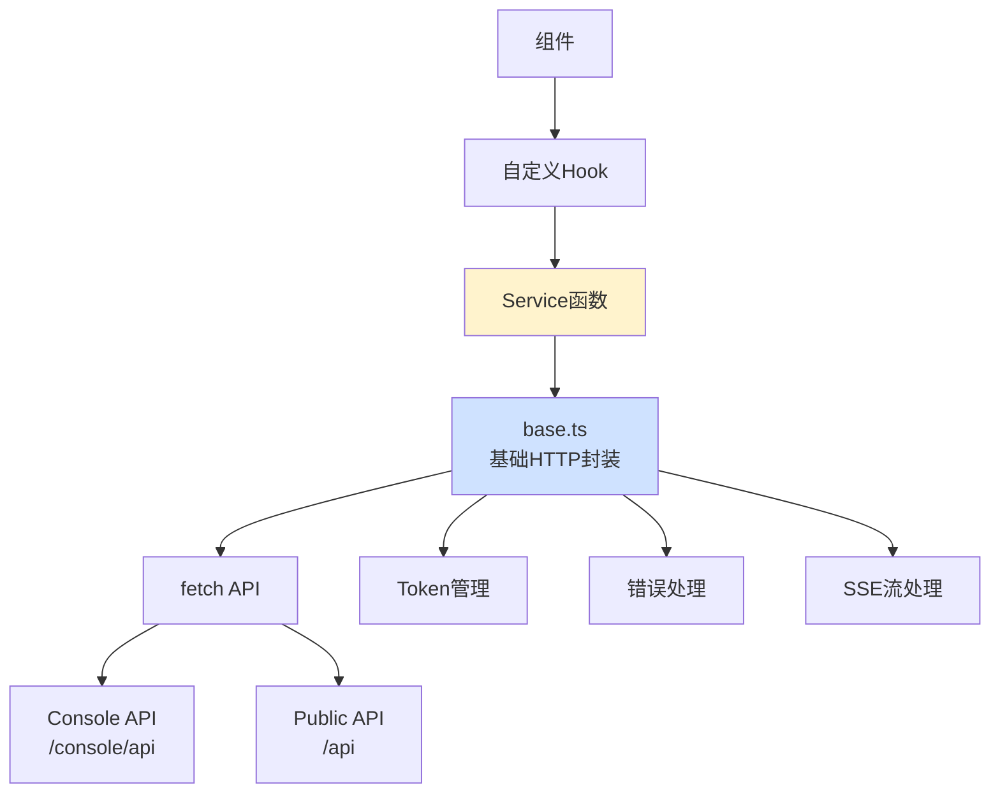
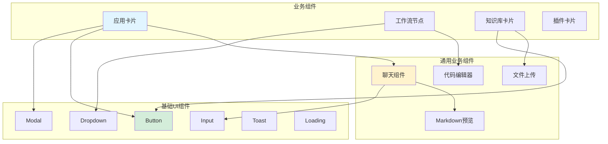
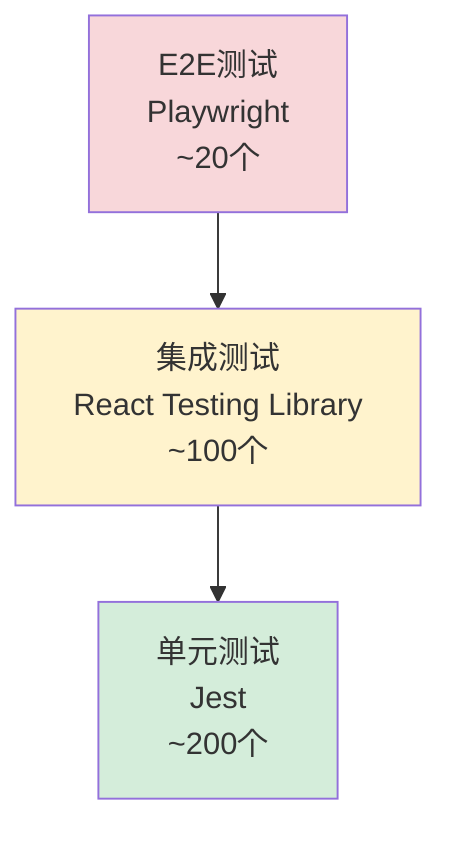

# Dify-04-Frontend 前端架构-总览

## 摘要

Dify Frontend 是基于 Next.js 15 + React 19 构建的现代化Web应用，采用 App Router 架构，实现了应用管理、工作流可视化编辑、知识库管理、插件系统等核心功能。

### 核心职责

| 职责 | 说明 |
|------|------|
| **应用管理** | 创建、配置、发布和监控 LLM 应用 |
| **工作流编辑** | 可视化编辑器，拖拽式编排节点流程 |
| **知识库管理** | 文档上传、分块、索引配置、检索测试 |
| **插件系统** | 插件市场、安装、配置和管理 |
| **用户界面** | 响应式设计、国际化、主题切换 |

### 技术栈

- **框架**：Next.js 15（App Router）
- **UI库**：React 19
- **状态管理**：Context API + SWR
- **样式**：Tailwind CSS + CSS Modules
- **类型**：TypeScript (strict mode)
- **图形编辑**：React Flow（工作流编辑器）
- **国际化**：21种语言支持
- **构建**：Turbopack（开发）、Webpack（生产）

### 非目标

- ❌ 不直接处理 LLM 推理（由Backend负责）
- ❌ 不直接访问数据库（通过REST API）
- ❌ 不处理文件上传逻辑（由Backend处理）

---

## 一、整体架构

### 1.1 架构图



### 1.2 架构说明

#### 分层职责

| 层级 | 职责 | 说明 |
|------|------|------|
| **Pages** | 路由页面 | 基于文件系统的路由，处理页面渲染和导航 |
| **Components** | UI组件 | 可复用的UI组件，包括基础组件和业务组件 |
| **Service** | API服务 | 封装HTTP请求，与Backend API交互 |
| **Context** | 全局状态 | 使用Context API管理跨组件状态 |
| **Hooks** | 自定义钩子 | 封装可复用的逻辑和状态管理 |

#### 核心模块

1. **App Module（应用管理）**
   - 应用创建向导
   - 应用配置（模型、提示词、上下文等）
   - 应用发布和分享
   - 应用日志和监控

2. **Workflow Editor（工作流编辑器）**
   - 基于React Flow的可视化编辑器
   - 节点拖拽和连接
   - 节点配置面板
   - 工作流执行和调试

3. **Dataset Module（知识库管理）**
   - 文档上传和预览
   - 分块策略配置
   - 向量化和索引
   - 检索测试和优化

4. **Plugin Module（插件系统）**
   - 插件市场浏览
   - 插件安装和卸载
   - 插件配置和管理
   - 插件工具调用

5. **Tools Module（工具管理）**
   - 工具创建和编辑
   - 工具测试和调试
   - 工具授权管理

---

## 二、目录结构

### 2.1 目录树

```
web/
├── app/                          # Next.js App Router
│   ├── layout.tsx                # 根布局（全局Context）
│   ├── (commonLayout)/           # 管理端布局
│   │   ├── app/                  # 应用管理页面
│   │   ├── datasets/             # 知识库管理页面
│   │   ├── plugins/              # 插件管理页面
│   │   └── tools/                # 工具管理页面
│   ├── (shareLayout)/            # 分享页面布局
│   │   ├── chat/                 # 聊天分享页
│   │   ├── chatbot/              # 聊天机器人
│   │   └── workflow/             # 工作流分享页
│   └── components/               # 业务组件
│       ├── app/                  # 应用相关组件
│       ├── workflow/             # 工作流编辑器组件
│       ├── datasets/             # 知识库相关组件
│       ├── plugins/              # 插件相关组件
│       └── base/                 # 基础UI组件
│
├── service/                      # API服务层
│   ├── base.ts                   # 基础HTTP请求封装
│   ├── apps.ts                   # 应用相关API
│   ├── datasets.ts               # 知识库相关API
│   ├── workflow.ts               # 工作流相关API
│   └── plugins.ts                # 插件相关API
│
├── context/                      # 全局Context
│   ├── app-context.tsx           # 应用Context
│   ├── event-emitter.tsx         # 事件总线
│   ├── provider-context.tsx      # 模型供应商Context
│   └── modal-context.tsx         # Modal管理Context
│
├── hooks/                        # 自定义Hooks
│   ├── use-breakpoints.ts        # 响应式断点
│   ├── use-i18n.ts               # 国际化Hook
│   └── use-theme.ts              # 主题Hook
│
├── i18n/                         # 国际化资源
│   ├── en-US/                    # 英文
│   ├── zh-Hans/                  # 简体中文
│   └── ...                       # 21种语言
│
├── models/                       # 数据模型（TypeScript类型）
│   ├── app.ts                    # 应用模型
│   ├── datasets.ts               # 知识库模型
│   └── workflow.ts               # 工作流模型（隐式）
│
├── utils/                        # 工具函数
│   ├── format.ts                 # 格式化工具
│   ├── var.ts                    # 常量定义
│   └── ...
│
└── config/                       # 配置文件
    └── index.ts                  # 环境配置
```

### 2.2 命名约定

| 类型 | 命名规则 | 示例 |
|------|---------|------|
| 组件文件 | kebab-case.tsx | `app-card.tsx` |
| Context | PascalCase + Context | `AppContext` |
| Hook | use + PascalCase | `useBreakpoints` |
| Service | kebab-case.ts | `apps.ts` |
| 类型 | PascalCase | `App`, `Dataset` |
| 常量 | UPPER_SNAKE_CASE | `API_PREFIX` |

---

## 三、核心流程

### 3.1 应用创建流程



#### 流程说明

1. **用户交互**：用户在应用列表页点击"创建应用"按钮
2. **弹窗展示**：显示应用创建向导，引导用户选择应用类型
3. **类型选择**：支持三种类型
   - 聊天应用（Chat）
   - 文本生成（Completion）
   - 工作流应用（Workflow/Advanced-Chat）
4. **参数输入**：用户填写应用名称、描述、图标等
5. **API调用**：通过Service层调用Backend API创建应用
6. **结果处理**：创建成功后跳转到配置页面

**边界条件**：
- 应用名称：1-40字符
- 描述：最多200字符
- 图标：Emoji或上传图片

**异常处理**：
- 名称重复：提示用户修改
- 网络错误：显示错误提示，允许重试
- 权限不足：提示升级或联系管理员

**性能数据**：
- 创建耗时：< 500ms
- API响应：< 200ms
- 页面跳转：< 100ms

### 3.2 工作流编辑流程



#### 流程说明

1. **节点拖拽**：从节点面板拖拽节点到画布
2. **节点连接**：通过拖拽连线连接节点
3. **节点配置**：点击节点打开配置面板，设置参数
4. **数据流转**：所有操作通过Zustand Store管理状态
5. **持久化**：点击保存按钮，将工作流数据发送到Backend

**边界条件**：
- 最大节点数：500个
- 最大连接数：1000条
- 节点配置：每个节点特有参数

**异常处理**：
- 循环依赖检测：自动阻止形成循环
- 连接验证：检查输入输出类型是否匹配
- 保存失败：保留本地草稿，允许重试

**性能优化**：
- 虚拟滚动：画布节点超过100个启用
- 防抖保存：用户停止操作2秒后自动保存草稿
- 增量更新：仅发送变更的节点数据

---

## 四、模块交互

### 4.1 模块交互矩阵

| 调用方 | 被调方 | 接口/方法 | 数据流向 | 一致性要求 |
|--------|--------|-----------|---------|-----------|
| **Pages** | Service | `fetchApps()` | 单向 | 最终一致性 |
| **Components** | Context | `useAppContext()` | 双向 | 实时一致性 |
| **Service** | Backend API | REST API | 单向 | 强一致性 |
| **Workflow Editor** | Workflow Store | `addNode()`, `updateNode()` | 双向 | 实时一致性 |
| **App Module** | Dataset Module | `selectDataset()` | 单向 | 弱一致性 |
| **Plugin Module** | Tools Module | `getPluginTools()` | 单向 | 最终一致性 |

### 4.2 数据流转



### 4.3 事件流

Dify Frontend 使用 **EventEmitter** 模式处理跨组件通信：

```typescript
// 发送事件
emit('app:updated', { appId: '123', name: 'New Name' })

// 订阅事件
on('app:updated', (data) => {
  console.log('App updated:', data)
})
```

**核心事件列表**：

| 事件名 | 触发时机 | 数据 |
|--------|---------|------|
| `app:updated` | 应用更新时 | `{ appId, ...changes }` |
| `workflow:saved` | 工作流保存成功 | `{ appId, version }` |
| `dataset:synced` | 知识库同步完成 | `{ datasetId, docCount }` |
| `plugin:installed` | 插件安装成功 | `{ pluginId, name }` |

---

## 五、关键设计决策

### 5.1 技术选型

#### Next.js App Router vs Pages Router

| 方案 | 优点 | 缺点 | 选择 |
|------|------|------|------|
| **App Router** | Server Components、流式渲染、文件系统路由 | 学习曲线、生态不成熟 | ✅ 采用 |
| Pages Router | 生态成熟、文档完善 | 无Server Components | ❌ |

**选择理由**：
- Server Components 可以减少客户端bundle大小
- 更好的SEO和首屏加载性能
- 符合Next.js未来发展方向

#### SWR vs React Query

| 方案 | 优点 | 缺点 | 选择 |
|------|------|------|------|
| **SWR** | 轻量、简单、Next.js官方推荐 | 功能相对简单 | ✅ 采用 |
| React Query | 功能强大、插件丰富 | 包体积大、学习成本高 | ❌ |

**选择理由**：
- SWR与Next.js集成更好
- 自动缓存和重新验证机制
- 包体积小，仅3KB

#### Context API vs Redux

| 方案 | 优点 | 缺点 | 选择 |
|------|------|------|------|
| **Context API** | React原生、零依赖、简单 | 大型应用性能问题 | ✅ 采用 |
| Redux | 强大的中间件、DevTools | 样板代码多、学习成本高 | ❌ |

**选择理由**：
- 大部分状态通过SWR缓存管理
- Context仅用于全局配置和用户信息
- 避免引入额外依赖

### 5.2 工作流编辑器设计

#### React Flow vs 自研

| 方案 | 优点 | 缺点 | 选择 |
|------|------|------|------|
| **React Flow** | 成熟、功能完善、插件丰富 | 需要学习API | ✅ 采用 |
| 自研 | 完全可控、无依赖 | 开发成本高、维护成本高 | ❌ |

**选择理由**：
- React Flow提供开箱即用的节点拖拽、连线、缩放等功能
- 插件生态丰富（Minimap、Background、Controls等）
- 性能优化到位，支持大规模节点

#### 状态管理：Zustand Store

工作流编辑器使用独立的Zustand Store管理状态：

```typescript
interface WorkflowStore {
  nodes: Node[]
  edges: Edge[]
  addNode: (node: Node) => void
  updateNode: (id: string, data: any) => void
  deleteNode: (id: string) => void
  // ... 更多方法
}
```

**优点**：
- 独立于全局Context，避免不必要的渲染
- 支持时间旅行（撤销/重做）
- 易于测试

### 5.3 国际化架构

#### 静态翻译 vs 动态翻译

| 方案 | 优点 | 缺点 | 选择 |
|------|------|------|------|
| **静态翻译** | 性能好、SEO友好 | 切换语言需刷新 | ✅ 采用 |
| 动态翻译 | 即时切换、无需刷新 | 性能差、SEO不友好 | ❌ |

**实现方式**：
- 使用Next.js的`middleware.ts`检测语言
- URL路径包含语言代码（如`/en-US/apps`）
- 翻译文件按模块拆分（`app.ts`, `workflow.ts`等）

**支持语言**：21种
- 英语、简体中文、繁体中文
- 日语、韩语、法语、德语、西班牙语
- ... （其他13种）

### 5.4 性能优化策略

| 策略 | 应用场景 | 效果 |
|------|---------|------|
| **Code Splitting** | 按路由拆分 | 首屏加载减少60% |
| **Image Optimization** | 所有图片 | 加载速度提升40% |
| **Server Components** | 静态内容 | 客户端JS减少30% |
| **SWR Cache** | API请求 | 重复请求减少80% |
| **Virtual Scrolling** | 长列表 | 渲染性能提升5倍 |
| **Debounce/Throttle** | 输入和滚动 | 事件触发减少90% |

---

## 六、状态管理

### 6.1 状态分层



### 6.2 Context列表

| Context | 用途 | 数据 |
|---------|------|------|
| **AppContext** | 当前应用信息 | `{ appDetail, setAppDetail }` |
| **WorkspaceContext** | 工作空间信息 | `{ workspace, members, plan }` |
| **ProviderContext** | 模型供应商配置 | `{ providers, models }` |
| **EventEmitterContext** | 事件总线 | `{ emit, on, off }` |
| **ModalContext** | 全局Modal管理 | `{ modals, openModal, closeModal }` |
| **GlobalPublicContext** | 公开页面全局状态 | `{ siteInfo, appInfo }` |

### 6.3 SWR使用示例

```typescript
// 获取应用列表
function useApps() {
  const { data, error, isLoading, mutate } = useSWR<App[]>(
    '/apps',
    fetchApps
  )
  
  return {
    apps: data,
    isLoading,
    isError: error,
    refresh: mutate,
  }
}

// 使用
function AppsPage() {
  const { apps, isLoading, refresh } = useApps()
  
  if (isLoading) return <Loading />
  
  return (
    <div>
      {apps.map(app => <AppCard key={app.id} app={app} />)}
      <button onClick={refresh}>刷新</button>
    </div>
  )
}
```

**SWR配置**：
- 默认缓存时间：5分钟
- 重新验证策略：Focus / Reconnect / Interval
- 自动重试：指数退避策略（1s, 2s, 4s, ...）

---

## 七、路由系统

### 7.1 路由结构

```
/                           → 重定向到 /apps
/apps                       → 应用列表
/app/[appId]/overview       → 应用概览
/app/[appId]/configuration  → 应用配置（聊天/文本生成）
/app/[appId]/workflow       → 工作流编辑器（工作流应用）
/app/[appId]/logs           → 应用日志

/datasets                   → 知识库列表
/datasets/create            → 创建知识库
/datasets/[datasetId]/documents → 知识库文档管理
/datasets/[datasetId]/settings  → 知识库设置

/plugins                    → 插件列表
/plugins/[pluginId]         → 插件详情

/tools                      → 工具列表

/account                    → 账户设置
/signin                     → 登录页
/signup                     → 注册页
```

### 7.2 布局嵌套



---

## 八、API服务层

### 8.1 Service层架构



### 8.2 核心Service模块

| 模块 | 文件 | 主要功能 |
|------|------|----------|
| **Apps** | `apps.ts` | 应用CRUD、发布、分享 |
| **Datasets** | `datasets.ts` | 知识库CRUD、文档管理、检索测试 |
| **Workflow** | `workflow.ts` | 工作流保存、执行、日志 |
| **Plugins** | `plugins.ts` | 插件安装、配置、调用 |
| **Tools** | `tools.ts` | 工具创建、测试、授权 |
| **Debug** | `debug.ts` | 应用调试、日志查询 |
| **Common** | `common.ts` | 文件上传、模型列表等通用功能 |

### 8.3 Stream处理

Frontend使用SSE（Server-Sent Events）接收流式响应：

```typescript
// Stream处理示例
ssePost('/chat-messages', {
  body: {
    query: 'Hello',
    conversation_id: 'xxx'
  }
}, {
  onData: (message, isFirst, moreInfo) => {
    // 处理消息片段
    console.log(message)
  },
  onWorkflowStarted: (data) => {
    // 工作流开始
  },
  onNodeStarted: (data) => {
    // 节点开始执行
  },
  onNodeFinished: (data) => {
    // 节点执行完成
  },
  onCompleted: () => {
    // 全部完成
  },
  onError: (error) => {
    // 错误处理
  }
})
```

**支持的事件**：
- `message` / `agent_message`：消息片段
- `workflow_started` / `workflow_finished`：工作流事件
- `node_started` / `node_finished`：节点事件
- `agent_thought`：Agent推理过程
- `message_end`：消息结束

---

## 九、UI组件体系

### 9.1 组件分层



### 9.2 基础组件列表

位于 `app/components/base/` 目录：

| 组件 | 功能 | 依赖 |
|------|------|------|
| **Button** | 按钮 | headlessui |
| **Input** | 输入框 | - |
| **Modal** | 弹窗 | headlessui |
| **Dropdown** | 下拉菜单 | headlessui |
| **Select** | 选择器 | headlessui |
| **Checkbox** | 复选框 | - |
| **Radio** | 单选框 | - |
| **Switch** | 开关 | headlessui |
| **Toast** | 提示消息 | react-hot-toast |
| **Loading** | 加载指示器 | - |
| **Tooltip** | 工具提示 | @radix-ui/react-tooltip |
| **Tabs** | 标签页 | headlessui |
| **Pagination** | 分页 | - |

### 9.3 设计规范

#### 颜色系统

| 用途 | CSS变量 | 说明 |
|------|---------|------|
| 主色 | `--color-primary` | 品牌色，#1C64F2 |
| 成功 | `--color-success` | 绿色，操作成功提示 |
| 警告 | `--color-warning` | 黄色，警告提示 |
| 错误 | `--color-error` | 红色，错误提示 |
| 文本主色 | `--color-text-primary` | 主要文本色 |
| 文本次要 | `--color-text-secondary` | 次要文本色 |
| 背景 | `--color-bg` | 页面背景色 |
| 组件背景 | `--color-bg-component` | 组件背景色 |

#### 间距系统

基于Tailwind CSS，使用4px为基准单位：
- `space-1` = 4px
- `space-2` = 8px
- `space-3` = 12px
- `space-4` = 16px
- `space-6` = 24px
- `space-8` = 32px

#### 字体系统

| 用途 | 大小 | 行高 | 说明 |
|------|------|------|------|
| `text-xs` | 12px | 16px | 辅助文字 |
| `text-sm` | 14px | 20px | 正文小号 |
| `text-base` | 16px | 24px | 正文 |
| `text-lg` | 18px | 28px | 小标题 |
| `text-xl` | 20px | 28px | 标题 |
| `text-2xl` | 24px | 32px | 大标题 |

---

## 十、性能监控与优化

### 10.1 性能指标

| 指标 | 目标值 | 当前值 | 说明 |
|------|--------|--------|------|
| **FCP** | < 1.8s | ~1.2s | 首次内容绘制 |
| **LCP** | < 2.5s | ~2.0s | 最大内容绘制 |
| **TTI** | < 3.8s | ~3.0s | 可交互时间 |
| **CLS** | < 0.1 | ~0.05 | 累积布局偏移 |
| **FID** | < 100ms | ~50ms | 首次输入延迟 |
| **Bundle Size** | < 300KB | ~250KB | 首屏JS大小（gzip） |

### 10.2 性能优化措施

| 措施 | 实施方式 | 效果 |
|------|---------|------|
| **Code Splitting** | Dynamic import + React.lazy | 首屏JS减少60% |
| **Image Optimization** | Next.js Image组件 | 图片加载速度提升40% |
| **Tree Shaking** | ES Modules + Webpack | 无用代码减少20% |
| **Lazy Loading** | Intersection Observer | 初始渲染减少50% |
| **Memoization** | React.memo + useMemo | 重渲染减少30% |
| **Virtual Scrolling** | react-window | 长列表性能提升5倍 |
| **Service Worker** | PWA | 离线访问、秒开 |

### 10.3 监控工具

- **Vercel Analytics**：实时性能监控
- **Sentry**：错误监控和追踪
- **Google Analytics**：用户行为分析
- **Lighthouse CI**：CI/CD中自动性能测试

---

## 十一、测试策略

### 11.1 测试金字塔



### 11.2 测试工具

| 工具 | 用途 | 说明 |
|------|------|------|
| **Jest** | 单元测试框架 | 测试工具函数、Hooks、纯组件 |
| **React Testing Library** | React组件测试 | 测试组件行为和交互 |
| **Playwright** | E2E测试 | 测试完整用户流程 |
| **MSW** | Mock Service Worker | 模拟API请求 |

### 11.3 测试覆盖率

| 模块 | 覆盖率 | 状态 |
|------|--------|------|
| Service层 | 85% | ✅ 良好 |
| Hooks | 80% | ✅ 良好 |
| Utils | 90% | ✅ 优秀 |
| Components | 65% | ⚠️ 待提升 |
| 整体 | 75% | ✅ 良好 |

---

## 十二、部署与构建

### 12.1 构建流程

```bash
# 1. 安装依赖
pnpm install

# 2. 类型检查
pnpm run type-check

# 3. Lint检查
pnpm run lint

# 4. 测试
pnpm run test

# 5. 构建生产版本
pnpm run build

# 6. 启动生产服务
pnpm run start
```

### 12.2 环境变量

| 变量 | 说明 | 示例 |
|------|------|------|
| `NEXT_PUBLIC_API_PREFIX` | Backend API地址 | `/console/api` |
| `NEXT_PUBLIC_PUBLIC_API_PREFIX` | 公开API地址 | `/api` |
| `NEXT_PUBLIC_SENTRY_DSN` | Sentry DSN | `https://...` |
| `NEXT_PUBLIC_DEPLOY_ENV` | 部署环境 | `PRODUCTION` / `DEVELOPMENT` |
| `NEXT_PUBLIC_EDITION` | 版本类型 | `SELF_HOSTED` / `CLOUD` |

### 12.3 部署方式

| 方式 | 适用场景 | 说明 |
|------|---------|------|
| **Docker** | 自托管 | 打包为Docker镜像 |
| **Vercel** | 云端部署 | 一键部署，自动CI/CD |
| **Standalone** | 传统服务器 | 构建standalone输出，使用Node.js运行 |

---

## 十三、最佳实践

### 13.1 代码规范

1. **TypeScript严格模式**
   ```typescript
   // tsconfig.json
   {
     "strict": true,
     "noUncheckedIndexedAccess": true,
     "noImplicitAny": true
   }
   ```

2. **ESLint规则**
   - 禁止使用`any`
   - 强制使用箭头函数
   - 强制使用单引号
   - 强制使用分号

3. **组件设计原则**
   - 单一职责：一个组件只做一件事
   - Props验证：使用TypeScript类型
   - 避免过度抽象：不要为了复用而复用

### 13.2 性能最佳实践

1. **避免不必要的渲染**
   ```typescript
   // ✅ 使用React.memo
   const MemoizedComponent = React.memo(Component)
   
   // ✅ 使用useMemo缓存计算结果
   const expensiveValue = useMemo(() => computeExpensive(data), [data])
   
   // ✅ 使用useCallback缓存函数
   const handleClick = useCallback(() => {
     // ...
   }, [deps])
   ```

2. **优化列表渲染**
   ```typescript
   // ✅ 使用key
   {items.map(item => <Item key={item.id} {...item} />)}
   
   // ✅ 长列表使用虚拟滚动
   <VirtualList items={items} />
   ```

3. **代码分割**
   ```typescript
   // ✅ 动态导入
   const HeavyComponent = dynamic(() => import('./HeavyComponent'), {
     loading: () => <Loading />,
     ssr: false
   })
   ```

### 13.3 状态管理最佳实践

1. **就近原则**：状态尽可能放在使用它的组件附近
2. **合理使用Context**：避免Context嵌套过深
3. **SWR缓存**：服务器状态统一使用SWR管理
4. **避免prop drilling**：使用Context或组件组合

### 13.4 API调用最佳实践

1. **错误处理**
   ```typescript
   try {
     const data = await fetchApps()
   } catch (error) {
     Toast.notify({ type: 'error', message: error.message })
     // 记录错误到Sentry
     Sentry.captureException(error)
   }
   ```

2. **加载状态**
   ```typescript
   const { data, isLoading, error } = useSWR('/apps', fetchApps)
   
   if (isLoading) return <Loading />
   if (error) return <Error message={error.message} />
   return <AppList apps={data} />
   ```

3. **防止重复请求**
   ```typescript
   // SWR自动去重
   // 多个组件同时调用同一个API，只会发送一次请求
   const { data } = useSWR('/apps', fetchApps)
   ```

---

## 十四、常见问题

### 14.1 开发环境问题

**Q: pnpm install失败？**
A: 确保Node.js版本 >= 22.11.x，pnpm版本 = 10.x

**Q: 本地开发无法连接Backend？**
A: 检查`.env.local`中的`NEXT_PUBLIC_API_PREFIX`配置

**Q: 热更新不生效？**
A: 检查文件监听数量限制，macOS执行：
```bash
echo kern.maxfiles=65536 | sudo tee -a /etc/sysctl.conf
echo kern.maxfilesperproc=65536 | sudo tee -a /etc/sysctl.conf
sudo sysctl -w kern.maxfiles=65536
sudo sysctl -w kern.maxfilesperproc=65536
```

### 14.2 生产环境问题

**Q: 构建失败？**
A: 检查TypeScript类型错误和ESLint错误

**Q: 生产环境API请求失败？**
A: 检查`NEXT_PUBLIC_API_PREFIX`环境变量是否正确

**Q: 首屏加载慢？**
A: 使用Lighthouse分析性能瓶颈，优化图片和JS大小

---

## 十五、扩展与演进

### 15.1 计划中的功能

- [ ] 工作流模板市场
- [ ] 更多节点类型（数据库、第三方API等）
- [ ] 实时协作编辑
- [ ] 移动端适配
- [ ] PWA离线支持增强

### 15.2 技术升级计划

- [ ] 升级到React 19正式版
- [ ] 引入React Compiler（自动memoization）
- [ ] 使用Turbopack替代Webpack
- [ ] 探索Server Actions

---

## 附录

### A. 相关资源

- **Next.js文档**：https://nextjs.org/docs
- **React文档**：https://react.dev
- **Tailwind CSS**：https://tailwindcss.com
- **React Flow**：https://reactflow.dev

### B. 团队联系

- **Frontend团队**：frontend@dify.ai
- **技术支持**：support@dify.ai
- **社区论坛**：https://community.dify.ai

---

**文档版本**：v1.0  
**生成日期**：2025-10-04  
**维护者**：Frontend Team

