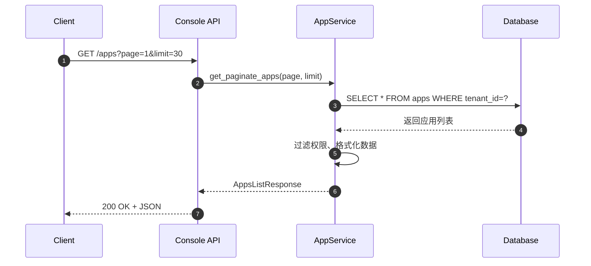
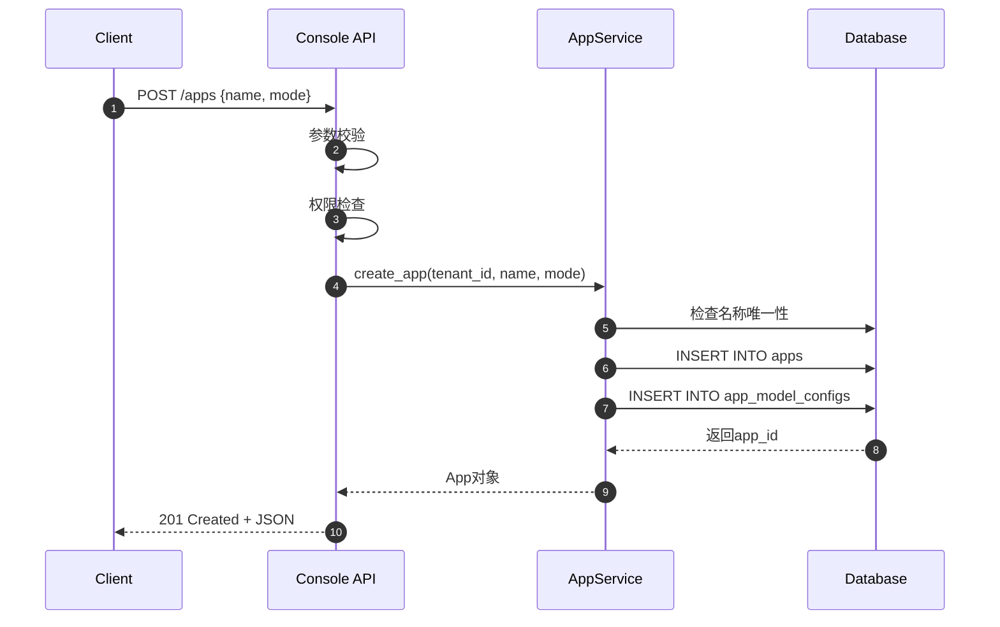
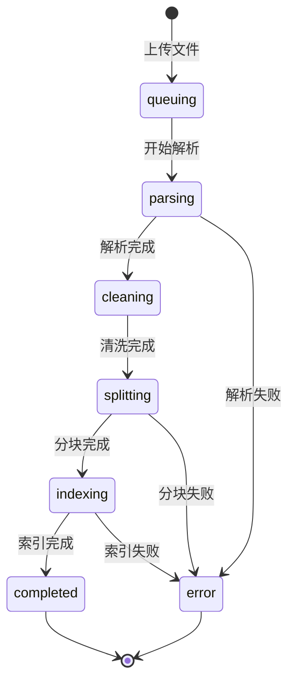
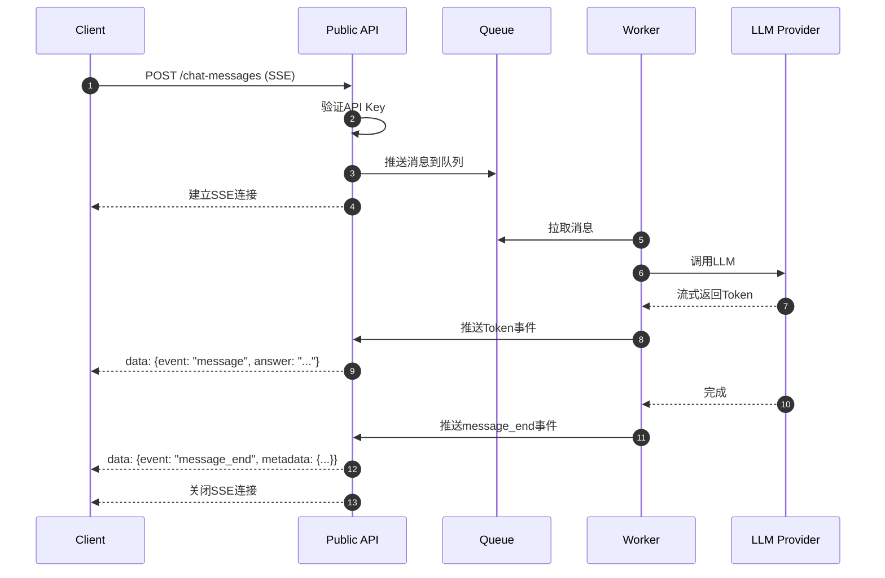

# Dify-05-Backend REST API规格

## 摘要

本文档详细说明 Dify Backend 对外提供的 REST API 规格，包括 Console API（管理端）和 Public API（公开端）两大类接口。

### API基本信息

| 项目 | Console API | Public API |
|------|-------------|------------|
| **Base URL** | `/console/api` | `/api` |
| **认证方式** | Bearer Token（JWT） | API Key |
| **用途** | 管理端（应用配置、知识库管理等） | 公开端（应用调用、对话等） |
| **文档** | Swagger UI | OpenAPI 3.0 |

### 核心模块

1. **App Management**（应用管理）
2. **Datasets Management**（知识库管理）
3. **Workspace Management**（工作空间管理）
4. **Authentication**（认证授权）
5. **Plugin & Tools**（插件和工具）
6. **Billing**（计费）

---

## 一、Console API（管理端）

### 1.1 应用管理API（/apps）

#### 1.1.1 获取应用列表

**接口**：`GET /console/api/apps`

**请求参数**：
```typescript
interface AppsListRequest {
  page: number        // 页码，从1开始
  limit: number       // 每页数量，默认30，最大100
  name?: string       // 应用名称搜索（可选）
  mode?: AppMode      // 应用类型过滤（可选）
}

type AppMode = 'chat' | 'agent-chat' | 'advanced-chat' | 'workflow' | 'completion'
```

**响应结构**：
```typescript
interface AppsListResponse {
  data: App[]
  total: number
  page: number
  limit: number
  has_more: boolean
}

interface App {
  id: string
  name: string
  mode: AppMode
  icon: string
  icon_background: string
  description: string
  enable_site: boolean
  enable_api: boolean
  api_rpm: number
  api_rph: number
  is_demo: boolean
  model_config: ModelConfig
  created_at: number
  updated_at: number
}
```

| 字段 | 类型 | 说明 |
|------|------|------|
| id | string | 应用唯一标识（UUID） |
| name | string | 应用名称（1-40字符） |
| mode | AppMode | 应用类型 |
| icon | string | 图标（Emoji或URL） |
| icon_background | string | 图标背景色（十六进制） |
| description | string | 应用描述（最多200字符） |
| enable_site | boolean | 是否启用Web App |
| enable_api | boolean | 是否启用API访问 |
| api_rpm | number | API限流（每分钟请求数） |
| api_rph | number | API限流（每小时请求数） |
| created_at | number | 创建时间（Unix时间戳） |
| updated_at | number | 更新时间（Unix时间戳） |

**时序图**：


**错误码**：

| 状态码 | 错误码 | 说明 |
|--------|--------|------|
| 401 | unauthorized | Token无效或过期 |
| 403 | access_denied | 无权限访问 |
| 429 | rate_limit_exceeded | 请求频率超限 |
| 500 | internal_error | 服务器内部错误 |

**使用示例**：
```bash
curl -X GET "https://api.dify.ai/console/api/apps?page=1&limit=30" \
  -H "Authorization: Bearer YOUR_TOKEN" \
  -H "Content-Type: application/json"
```

**最佳实践**：
- 使用`limit`参数控制返回数量，避免一次加载过多数据
- 使用`name`参数实现搜索功能
- 缓存结果5分钟，减少API调用

---

#### 1.1.2 创建应用

**接口**：`POST /console/api/apps`

**请求结构**：
```typescript
interface CreateAppRequest {
  name: string                 // 应用名称，必填，1-40字符
  mode: AppMode               // 应用类型，必填
  description?: string        // 应用描述，可选，最多200字符
  icon?: string               // 图标，可选，Emoji或URL
  icon_background?: string    // 图标背景色，可选，十六进制
}
```

**响应结构**：
```typescript
interface CreateAppResponse {
  id: string
  name: string
  mode: AppMode
  // ... 其他App字段
}
```

**核心代码**：
```python
# api/controllers/console/app/app.py
@api.route('/apps', methods=['POST'])
@login_required
def create_app():
    # 1. 参数校验
    parser = reqparse.RequestParser()
    parser.add_argument('name', required=True, type=str, location='json')
    parser.add_argument('mode', required=True, type=str, choices=['chat', 'agent-chat', 'advanced-chat', 'workflow', 'completion'])
    args = parser.parse_args()
    
    # 2. 权限检查
    if not current_user.is_editor:
        raise Forbidden('Only editors can create apps')
    
    # 3. 调用Service层创建应用
    app = AppService.create_app(
        tenant_id=current_user.current_tenant_id,
        name=args['name'],
        mode=args['mode'],
        icon=args.get('icon', '🤖'),
        icon_background=args.get('icon_background', '#FFEAD5'),
    )
    
    # 4. 返回结果
    return app.to_dict(), 201
```

**调用链**：
```
Controller: create_app()
  ↓
Service: AppService.create_app()
  ↓  
  - 验证应用名称唯一性
  - 创建App记录
  - 创建默认ModelConfig
  - 创建AppModelConfig关联
  ↓
Repository: AppDao.insert()
  ↓
Database: INSERT INTO apps
```

**时序图**：


**异常处理**：
- **名称重复**：返回400，提示"应用名称已存在"
- **权限不足**：返回403，提示"需要编辑权限"
- **参数错误**：返回400，详细说明错误字段

---

#### 1.1.3 更新应用配置

**接口**：`PUT /console/api/apps/{app_id}`

**请求参数**：
```typescript
interface UpdateAppRequest {
  name?: string
  description?: string
  icon?: string
  icon_background?: string
  enable_site?: boolean
  enable_api?: boolean
  api_rpm?: number
  api_rph?: number
}
```

**响应结构**：同 `CreateAppResponse`

---

#### 1.1.4 删除应用

**接口**：`DELETE /console/api/apps/{app_id}`

**请求参数**：无

**响应结构**：
```typescript
interface DeleteAppResponse {
  result: 'success'
}
```

**注意事项**：
- 删除操作不可逆
- 会同时删除应用相关的所有数据（对话、日志等）
- 需要二次确认

---

### 1.2 工作流API（/apps/{app_id}/workflows）

#### 1.2.1 获取工作流配置

**接口**：`GET /console/api/apps/{app_id}/workflows/draft`

**响应结构**：
```typescript
interface WorkflowDraftResponse {
  graph: {
    nodes: Node[]
    edges: Edge[]
  }
  features: {
    opening_statement?: string
    suggested_questions?: string[]
    speech_to_text?: SpeechToTextConfig
    text_to_speech?: TextToSpeechConfig
  }
  environment_variables: EnvironmentVariable[]
}

interface Node {
  id: string
  data: {
    type: NodeType
    title: string
    desc?: string
    // ... 节点特定配置
  }
  position: { x: number; y: number }
  width?: number
  height?: number
}

interface Edge {
  id: string
  source: string      // 源节点ID
  target: string      // 目标节点ID
  sourceHandle?: string
  targetHandle?: string
}
```

**核心代码**：
```python
@api.route('/apps/<app_id>/workflows/draft', methods=['GET'])
@login_required
def get_workflow_draft(app_id):
    # 1. 获取应用和工作流
    app = AppService.get_app(app_id)
    workflow = WorkflowService.get_draft_workflow(app)
    
    # 2. 解析graph结构
    graph = json.loads(workflow.graph)
    
    # 3. 返回结果
    return {
        'graph': graph,
        'features': workflow.features,
        'environment_variables': workflow.environment_variables
    }
```

---

#### 1.2.2 保存工作流配置

**接口**：`POST /console/api/apps/{app_id}/workflows/draft`

**请求结构**：
```typescript
interface SaveWorkflowRequest {
  graph: {
    nodes: Node[]
    edges: Edge[]
  }
  features?: WorkflowFeatures
  environment_variables?: EnvironmentVariable[]
}
```

**响应结构**：
```typescript
interface SaveWorkflowResponse {
  result: 'success'
  updated_at: number
}
```

**核心逻辑**：
```python
@api.route('/apps/<app_id>/workflows/draft', methods=['POST'])
@login_required
def save_workflow_draft(app_id):
    # 1. 解析请求数据
    data = request.get_json()
    graph = data['graph']
    
    # 2. 验证工作流
    WorkflowService.validate_workflow(graph)
    
    # 3. 保存草稿
    workflow = WorkflowService.save_draft_workflow(
        app_id=app_id,
        graph=json.dumps(graph),
        features=data.get('features'),
        environment_variables=data.get('environment_variables')
    )
    
    return {
        'result': 'success',
        'updated_at': workflow.updated_at
    }
```

**验证规则**：
- 必须有START节点
- 必须有END节点或LLM节点
- 不能存在循环依赖（除了Iteration节点）
- 节点连接的输入输出类型必须匹配
- 节点配置必须完整

---

#### 1.2.3 发布工作流

**接口**：`POST /console/api/apps/{app_id}/workflows/publish`

**请求结构**：无（将草稿发布为正式版本）

**响应结构**：
```typescript
interface PublishWorkflowResponse {
  result: 'success'
  version: string      // 版本号，如 "v1.2.3"
  published_at: number
}
```

**发布流程**：
1. 验证草稿完整性
2. 创建新版本记录
3. 将草稿内容复制到正式版本
4. 更新应用状态

---

### 1.3 知识库API（/datasets）

#### 1.3.1 获取知识库列表

**接口**：`GET /console/api/datasets`

**请求参数**：
```typescript
interface DatasetsListRequest {
  page: number
  limit: number
  keyword?: string      // 搜索关键词
  tag_ids?: string[]    // 标签过滤
}
```

**响应结构**：
```typescript
interface DatasetsListResponse {
  data: Dataset[]
  total: number
  page: number
  limit: number
  has_more: boolean
}

interface Dataset {
  id: string
  name: string
  description: string
  permission: 'only_me' | 'all_team_members' | 'partial_members'
  data_source_type: 'upload_file' | 'notion_import' | 'website_crawl'
  indexing_technique: 'high_quality' | 'economy'
  embedding_model: string
  embedding_model_provider: string
  document_count: number
  word_count: number
  app_count: number
  created_by: string
  created_at: number
  updated_at: number
}
```

| 字段 | 类型 | 说明 |
|------|------|------|
| id | string | 知识库唯一标识 |
| name | string | 知识库名称 |
| indexing_technique | string | 索引模式（高质量/经济） |
| embedding_model | string | Embedding模型名称 |
| document_count | number | 文档数量 |
| word_count | number | 总字数 |
| app_count | number | 关联应用数量 |

---

#### 1.3.2 创建知识库

**接口**：`POST /console/api/datasets`

**请求结构**：
```typescript
interface CreateDatasetRequest {
  name: string                    // 必填，1-40字符
  indexing_technique: 'high_quality' | 'economy'
  permission: 'only_me' | 'all_team_members' | 'partial_members'
  embedding_model_provider?: string  // 可选，默认使用工作空间配置
  embedding_model?: string           // 可选
  retrieval_model?: {
    search_method: 'semantic_search' | 'full_text_search' | 'hybrid_search'
    reranking_enable: boolean
    reranking_model?: {
      reranking_provider_name: string
      reranking_model_name: string
    }
    top_k: number
    score_threshold_enabled: boolean
    score_threshold?: number
  }
}
```

**响应结构**：同 `Dataset`

**核心代码**：
```python
@api.route('/datasets', methods=['POST'])
@login_required
def create_dataset():
    # 1. 参数解析
    args = request.get_json()
    
    # 2. 权限检查
    if not current_user.is_editor:
        raise Forbidden()
    
    # 3. 创建知识库
    dataset = DatasetService.create_dataset(
        tenant_id=current_user.current_tenant_id,
        user_id=current_user.id,
        name=args['name'],
        indexing_technique=args['indexing_technique'],
        permission=args.get('permission', 'only_me'),
        # ... 其他参数
    )
    
    return dataset.to_dict(), 201
```

---

#### 1.3.3 上传文档

**接口**：`POST /console/api/datasets/{dataset_id}/document/create_by_file`

**请求格式**：`multipart/form-data`

**请求参数**：
```typescript
interface UploadDocumentRequest {
  file: File                          // 文件，必填
  original_document_id?: string       // 原文档ID（用于更新）
  indexing_technique: 'high_quality' | 'economy'
  process_rule: {
    mode: 'automatic' | 'custom'
    rules?: {
      pre_processing_rules: Array<{
        id: 'remove_extra_spaces' | 'remove_urls_emails' | ...
        enabled: boolean
      }>
      segmentation: {
        separator: string
        max_tokens: number
      }
    }
  }
}
```

**响应结构**：
```typescript
interface UploadDocumentResponse {
  document: {
    id: string
    name: string
    doc_type: string        // 'pdf', 'txt', 'md' 等
    data_source_type: 'upload_file'
    doc_form: 'text_model' | 'qa_model'
    indexing_status: 'queuing' | 'parsing' | 'cleaning' | 'splitting' | 'indexing' | 'completed' | 'error'
    tokens: number
    position: number
    created_at: number
  }
  batch: string             // 批次ID（用于查询索引状态）
}
```

**索引状态流程**：


**核心流程**：
```python
@api.route('/datasets/<dataset_id>/document/create_by_file', methods=['POST'])
@login_required
def upload_document(dataset_id):
    # 1. 文件上传处理
    file = request.files['file']
    
    # 2. 文件类型验证
    if not FileService.is_supported(file.filename):
        raise UnsupportedFileTypeError()
    
    # 3. 文件大小验证（最大100MB）
    if file.content_length > 100 * 1024 * 1024:
        raise FileTooLargeError()
    
    # 4. 创建文档记录
    document = DocumentService.create_document(
        dataset_id=dataset_id,
        file=file,
        indexing_technique=args['indexing_technique'],
        process_rule=args['process_rule']
    )
    
    # 5. 异步触发索引任务
    IndexingRunner.delay(
        dataset_id=dataset_id,
        document_id=document.id
    )
    
    return {
        'document': document.to_dict(),
        'batch': document.batch
    }
```

**异步索引流程**：
```python
# api/core/indexing_runner.py
@celery.task
def run_indexing(dataset_id, document_id):
    # 1. 提取文本（Extract）
    text = ExtractProcessor.extract(document)
    
    # 2. 清洗文本（Clean）
    cleaned_text = CleanProcessor.clean(text)
    
    # 3. 分块（Split）
    segments = Splitter.split(cleaned_text, max_tokens=500)
    
    # 4. 向量化（Embed）
    embeddings = EmbeddingService.embed_batch(segments)
    
    # 5. 存储（Store）
    VectorStore.insert_batch(embeddings, segments)
    
    # 6. 更新状态
    document.indexing_status = 'completed'
    document.save()
```

**最佳实践**：
- 使用`batch`字段轮询索引状态（每3秒查询一次）
- 大文件建议分批上传
- 建议使用自定义分块策略以获得更好的检索效果

---

#### 1.3.4 检索测试

**接口**：`POST /console/api/datasets/{dataset_id}/retrieve`

**请求结构**：
```typescript
interface RetrieveRequest {
  query: string                 // 查询文本，必填
  retrieval_model: {
    search_method: 'semantic_search' | 'full_text_search' | 'hybrid_search'
    reranking_enable: boolean
    reranking_model?: RetrankingModel
    weights?: {
      semantic_weight: number
      keyword_weight: number
    }
    top_k: number
    score_threshold?: number
  }
}
```

**响应结构**：
```typescript
interface RetrieveResponse {
  records: RetrieveRecord[]
}

interface RetrieveRecord {
  segment: {
    id: string
    position: number
    document_id: string
    content: string
    word_count: number
    tokens: number
    keywords: string[]
    index_node_id: string
    index_node_hash: string
  }
  score: number           // 相关性分数（0-1）
  tsne_position?: {       // t-SNE可视化坐标
    x: number
    y: number
  }
}
```

**核心代码**：
```python
@api.route('/datasets/<dataset_id>/retrieve', methods=['POST'])
@login_required
def retrieve_documents(dataset_id):
    args = request.get_json()
    query = args['query']
    retrieval_model = args['retrieval_model']
    
    # 调用检索服务
    records = RetrievalService.retrieve(
        dataset_id=dataset_id,
        query=query,
        search_method=retrieval_model['search_method'],
        top_k=retrieval_model['top_k'],
        reranking_enable=retrieval_model.get('reranking_enable', False),
        reranking_model=retrieval_model.get('reranking_model'),
        score_threshold=retrieval_model.get('score_threshold')
    )
    
    return {'records': [r.to_dict() for r in records]}
```

---

### 1.4 工作空间API（/workspaces）

#### 1.4.1 获取当前工作空间信息

**接口**：`GET /console/api/workspaces/current`

**响应结构**：
```typescript
interface WorkspaceResponse {
  id: string
  name: string
  plan: 'sandbox' | 'professional' | 'team' | 'enterprise'
  status: 'normal' | 'trial' | 'suspended'
  created_at: number
  role: 'owner' | 'admin' | 'editor' | 'normal'
  in_trial: boolean
  trial_end_at?: number
}
```

---

#### 1.4.2 获取模型配置

**接口**：`GET /console/api/workspaces/current/model-providers`

**响应结构**：
```typescript
interface ModelProvidersResponse {
  data: ModelProvider[]
}

interface ModelProvider {
  provider: string          // 'openai', 'azure_openai', 'anthropic' 等
  label: {
    zh_Hans: string
    en_US: string
  }
  icon_small: {
    zh_Hans: string
    en_US: string
  }
  icon_large: {
    zh_Hans: string
    en_US: string
  }
  status: 'active' | 'no-configure' | 'quota-exceeded'
  models: Model[]
}

interface Model {
  model: string             // 'gpt-4', 'gpt-3.5-turbo' 等
  label: {
    zh_Hans: string
    en_US: string
  }
  model_type: 'llm' | 'text-embedding' | 'rerank' | 'speech2text' | 'tts' | 'moderation'
  features: string[]        // ['agent-thought', 'vision' 等]
  model_properties: {
    context_size: number
    max_chunks: number
    file_upload_limit: number
  }
  fetch_from: 'predefined-model' | 'customizable-model'
  status: 'active' | 'no-configure' | 'quota-exceeded'
}
```

---

### 1.5 认证API（/auth）

#### 1.5.1 登录

**接口**：`POST /console/api/login`

**请求结构**：
```typescript
interface LoginRequest {
  email: string
  password: string
  remember_me?: boolean
}
```

**响应结构**：
```typescript
interface LoginResponse {
  result: 'success'
  data: {
    access_token: string
    refresh_token: string
    expires_in: number        // 秒
  }
}
```

---

#### 1.5.2 刷新Token

**接口**：`POST /console/api/refresh-token`

**请求结构**：
```typescript
interface RefreshTokenRequest {
  refresh_token: string
}
```

**响应结构**：同 `LoginResponse`

---

### 1.6 插件API（/workspaces/current/plugins）

#### 1.6.1 获取插件列表

**接口**：`GET /console/api/workspaces/current/plugins`

**请求参数**：
```typescript
interface PluginsListRequest {
  page: number
  page_size: number
  category?: string
  search?: string
}
```

**响应结构**：
```typescript
interface PluginsListResponse {
  plugins: Plugin[]
  total: number
}

interface Plugin {
  plugin_id: string
  plugin_unique_identifier: string
  name: string
  description: string
  version: string
  author: string
  icon: string
  category: string
  tags: string[]
  verified: boolean
  install_count: number
  installed: boolean
  latest_version: string
  current_version?: string
}
```

---

#### 1.6.2 安装插件

**接口**：`POST /console/api/workspaces/current/plugins/install`

**请求结构**：
```typescript
interface InstallPluginRequest {
  plugin_unique_identifier: string
}
```

**响应结构**：
```typescript
interface InstallPluginResponse {
  result: 'success'
  plugin: InstalledPlugin
}

interface InstalledPlugin {
  install_id: string
  plugin_id: string
  tenant_id: string
  installed_at: number
  // ... 其他字段
}
```

---

## 二、Public API（公开端）

### 2.1 对话API（/chat-messages）

#### 2.1.1 发送消息（流式）

**接口**：`POST /api/chat-messages`

**认证**：`Authorization: Bearer {API_KEY}`

**请求结构**：
```typescript
interface ChatMessageRequest {
  query: string                    // 用户消息，必填
  inputs: Record<string, any>      // 变量，可选
  response_mode: 'streaming' | 'blocking'
  conversation_id?: string         // 对话ID，可选（新对话不传）
  user: string                     // 用户标识，必填
  files?: Array<{
    type: 'image' | 'document'
    transfer_method: 'remote_url' | 'local_file'
    url?: string
    upload_file_id?: string
  }>
}
```

**响应格式**（SSE）：
```
data: {"event": "message", "task_id": "xxx", "id": "xxx", "conversation_id": "xxx", "answer": "你好"}
data: {"event": "message", "task_id": "xxx", "id": "xxx", "answer": "，"}
data: {"event": "message", "task_id": "xxx", "id": "xxx", "answer": "我是"}
data: {"event": "message_end", "task_id": "xxx", "id": "xxx", "metadata": {...}}
```

**事件类型**：

| 事件 | 说明 | 数据结构 |
|------|------|----------|
| `message` | 消息片段 | `{answer: string, conversation_id: string, message_id: string}` |
| `agent_thought` | Agent推理过程 | `{thought: string, tool: string, tool_input: {...}}` |
| `message_file` | 消息附件 | `{type: string, url: string, belongs_to: string}` |
| `message_end` | 消息结束 | `{metadata: {usage, retriever_resources, ...}}` |
| `workflow_started` | 工作流开始 | `{workflow_run_id: string, data: {...}}` |
| `workflow_finished` | 工作流结束 | `{workflow_run_id: string, data: {...}}` |
| `node_started` | 节点开始 | `{node_id: string, node_type: string, ...}` |
| `node_finished` | 节点结束 | `{node_id: string, outputs: {...}, ...}` |
| `error` | 错误 | `{status: number, code: string, message: string}` |

**时序图**：


**核心代码**：
```python
@api.route('/chat-messages', methods=['POST'])
@api_key_required
def create_chat_message():
    args = request.get_json()
    
    # 验证参数
    query = args.get('query')
    response_mode = args.get('response_mode', 'blocking')
    
    # 创建任务
    task = ChatTaskService.create_task(
        app_id=current_app_id,
        user=args['user'],
        query=query,
        conversation_id=args.get('conversation_id'),
        inputs=args.get('inputs', {}),
        files=args.get('files', [])
    )
    
    if response_mode == 'streaming':
        # 流式响应
        def generate():
            for event in ChatTaskService.run_stream(task):
                yield f"data: {json.dumps(event)}\n\n"
        
        return Response(generate(), mimetype='text/event-stream')
    else:
        # 阻塞响应
        result = ChatTaskService.run_blocking(task)
        return jsonify(result)
```

---

#### 2.1.2 获取对话历史

**接口**：`GET /api/conversations/{conversation_id}/messages`

**请求参数**：
```typescript
interface ConversationMessagesRequest {
  user: string
  first_id?: string       // 首条消息ID（用于分页）
  limit?: number          // 每页数量，默认20
}
```

**响应结构**：
```typescript
interface ConversationMessagesResponse {
  data: Message[]
  has_more: boolean
  limit: number
}

interface Message {
  id: string
  conversation_id: string
  inputs: Record<string, any>
  query: string
  answer: string
  message_files: MessageFile[]
  feedback: null | {
    rating: 'like' | 'dislike'
  }
  retriever_resources: RetrieverResource[]
  created_at: number
}
```

---

### 2.2 工作流执行API（/workflows/run）

#### 2.2.1 执行工作流

**接口**：`POST /api/workflows/run`

**请求结构**：
```typescript
interface WorkflowRunRequest {
  inputs: Record<string, any>     // 输入变量，必填
  response_mode: 'streaming' | 'blocking'
  user: string                     // 用户标识，必填
  files?: File[]                   // 文件输入，可选
}
```

**响应格式**（SSE）：
```
data: {"event": "workflow_started", "task_id": "xxx", "workflow_run_id": "xxx", "data": {...}}
data: {"event": "node_started", "node_id": "xxx", "node_type": "llm", ...}
data: {"event": "text_chunk", "node_id": "xxx", "text": "Hello"}
data: {"event": "node_finished", "node_id": "xxx", "outputs": {...}}
data: {"event": "workflow_finished", "workflow_run_id": "xxx", "data": {...}}
```

**核心流程**：
```python
@api.route('/workflows/run', methods=['POST'])
@api_key_required
def run_workflow():
    args = request.get_json()
    
    # 创建工作流执行任务
    task = WorkflowTaskService.create_task(
        app_id=current_app_id,
        user=args['user'],
        inputs=args['inputs'],
        files=args.get('files', [])
    )
    
    if args.get('response_mode') == 'streaming':
        def generate():
            for event in WorkflowTaskService.run_stream(task):
                yield f"data: {json.dumps(event)}\n\n"
        
        return Response(generate(), mimetype='text/event-stream')
    else:
        result = WorkflowTaskService.run_blocking(task)
        return jsonify(result)
```

---

### 2.3 文件上传API（/files/upload）

#### 2.3.1 上传文件

**接口**：`POST /api/files/upload`

**请求格式**：`multipart/form-data`

**请求参数**：
```typescript
interface FileUploadRequest {
  file: File              // 文件，必填
  user: string            // 用户标识，必填
}
```

**响应结构**：
```typescript
interface FileUploadResponse {
  id: string               // 文件ID
  name: string
  size: number
  extension: string
  mime_type: string
  created_by: string
  created_at: number
}
```

**支持的文件类型**：
- **图片**：jpg, jpeg, png, gif, webp
- **文档**：pdf, txt, md, doc, docx
- **代码**：py, js, ts, java, cpp 等
- **其他**：csv, xlsx, json, xml

**文件大小限制**：
- 图片：最大15MB
- 文档：最大100MB

---

## 三、API最佳实践

### 3.1 认证和安全

#### 3.1.1 API Key管理

**生成API Key**：
```bash
curl -X POST "https://api.dify.ai/console/api/api-keys" \
  -H "Authorization: Bearer YOUR_CONSOLE_TOKEN" \
  -H "Content-Type: application/json" \
  -d '{
    "name": "My API Key",
    "permissions": ["chat", "completion", "workflow"]
  }'
```

**安全建议**：
- 不要在客户端代码中暴露API Key
- 使用环境变量存储API Key
- 定期轮换API Key
- 为不同应用使用不同的API Key

#### 3.1.2 速率限制

| 计划 | RPM | RPH | RPD |
|------|-----|-----|-----|
| **Sandbox** | 60 | 1,000 | 10,000 |
| **Professional** | 300 | 10,000 | 100,000 |
| **Team** | 600 | 30,000 | 300,000 |
| **Enterprise** | 定制 | 定制 | 定制 |

**超限处理**：
- 返回429状态码
- Response Header包含 `X-RateLimit-Remaining` 和 `X-RateLimit-Reset`

---

### 3.2 错误处理

#### 3.2.1 错误码

| 状态码 | 错误码 | 说明 | 处理建议 |
|--------|--------|------|----------|
| 400 | `invalid_param` | 参数错误 | 检查请求参数 |
| 401 | `unauthorized` | 认证失败 | 检查API Key |
| 403 | `access_denied` | 权限不足 | 检查权限配置 |
| 404 | `not_found` | 资源不存在 | 检查资源ID |
| 429 | `rate_limit_exceeded` | 超过速率限制 | 实现指数退避 |
| 500 | `internal_error` | 服务器错误 | 重试或联系支持 |
| 503 | `service_unavailable` | 服务不可用 | 稍后重试 |

#### 3.2.2 错误响应格式

```typescript
interface ErrorResponse {
  code: string
  message: string
  status: number
  details?: any
}
```

**示例**：
```json
{
  "code": "invalid_param",
  "message": "Parameter 'query' is required",
  "status": 400,
  "details": {
    "field": "query",
    "type": "required"
  }
}
```

---

### 3.3 性能优化

#### 3.3.1 并发请求

```python
import asyncio
import aiohttp

async def send_messages(queries):
    async with aiohttp.ClientSession() as session:
        tasks = []
        for query in queries:
            task = send_message(session, query)
            tasks.append(task)
        
        results = await asyncio.gather(*tasks)
        return results

async def send_message(session, query):
    async with session.post(
        'https://api.dify.ai/api/chat-messages',
        headers={'Authorization': 'Bearer YOUR_API_KEY'},
        json={'query': query, 'user': 'user-123', 'response_mode': 'blocking'}
    ) as response:
        return await response.json()
```

#### 3.3.2 缓存策略

```python
from functools import lru_cache
import time

@lru_cache(maxsize=128)
def get_app_config(app_id):
    # 缓存应用配置5分钟
    response = requests.get(f'/apps/{app_id}')
    return response.json()

# 定期清除缓存
def clear_cache_periodically():
    while True:
        time.sleep(300)  # 5分钟
        get_app_config.cache_clear()
```

---

### 3.4 监控和日志

#### 3.4.1 日志记录

```python
import logging

logger = logging.getLogger(__name__)

def call_api(endpoint, data):
    try:
        logger.info(f"Calling API: {endpoint}")
        response = requests.post(endpoint, json=data)
        logger.info(f"API response: {response.status_code}")
        return response.json()
    except Exception as e:
        logger.error(f"API error: {str(e)}", exc_info=True)
        raise
```

#### 3.4.2 指标监控

监控以下指标：
- **请求量**：QPS、RPM
- **响应时间**：P50、P95、P99
- **错误率**：4xx、5xx错误比例
- **Token用量**：输入Token、输出Token

---

## 四、SDK和示例

### 4.1 Python SDK

```python
from dify_client import Client

# 初始化客户端
client = Client(api_key='YOUR_API_KEY')

# 发送消息（流式）
for chunk in client.chat.create_stream(
    query='你好',
    user='user-123',
    conversation_id=None
):
    if chunk.event == 'message':
        print(chunk.answer, end='', flush=True)
    elif chunk.event == 'message_end':
        print(f"\nToken用量: {chunk.metadata['usage']}")

# 执行工作流
result = client.workflows.run(
    inputs={'input1': 'value1'},
    user='user-123',
    response_mode='blocking'
)
print(result['data']['outputs'])
```

### 4.2 Node.js SDK

```javascript
const { DifyClient } = require('dify-client');

// 初始化客户端
const client = new DifyClient('YOUR_API_KEY');

// 发送消息（流式）
const stream = await client.chat.createStream({
  query: '你好',
  user: 'user-123'
});

stream.on('message', (chunk) => {
  process.stdout.write(chunk.answer);
});

stream.on('messageEnd', (data) => {
  console.log(`\nToken用量: ${data.metadata.usage}`);
});

stream.on('error', (error) => {
  console.error('Error:', error);
});
```

### 4.3 cURL示例

```bash
# 发送消息（阻塞模式）
curl -X POST 'https://api.dify.ai/api/chat-messages' \
  -H 'Authorization: Bearer YOUR_API_KEY' \
  -H 'Content-Type: application/json' \
  -d '{
    "query": "你好",
    "user": "user-123",
    "response_mode": "blocking"
  }'

# 执行工作流
curl -X POST 'https://api.dify.ai/api/workflows/run' \
  -H 'Authorization: Bearer YOUR_API_KEY' \
  -H 'Content-Type: application/json' \
  -d '{
    "inputs": {"input1": "value1"},
    "user": "user-123",
    "response_mode": "blocking"
  }'
```

---

## 五、迁移指南

### 5.1 从v0.x迁移到v1.0

#### 主要变更

| 变更 | v0.x | v1.0 |
|------|------|------|
| **认证** | API Key in Query | Bearer Token in Header |
| **响应格式** | 不统一 | 统一JSON格式 |
| **错误码** | HTTP状态码 | 自定义错误码 |
| **SSE格式** | 文本 | JSON |

#### 迁移步骤

1. **更新认证方式**
   ```diff
   - GET /api/chat-messages?api_key=xxx
   + GET /api/chat-messages
   + Header: Authorization: Bearer xxx
   ```

2. **更新错误处理**
   ```diff
   - if response.status_code != 200:
   + if 'code' in response.json():
   +     error_code = response.json()['code']
   ```

3. **更新SSE解析**
   ```diff
   - for line in response.iter_lines():
   -     print(line)
   + for line in response.iter_lines():
   +     if line.startswith('data: '):
   +         data = json.loads(line[6:])
   +         print(data['answer'])
   ```

---

## 附录

### A. API端点索引

#### Console API（/console/api）

| 分类 | 端点 | 方法 | 说明 |
|------|------|------|------|
| **App** | `/apps` | GET | 获取应用列表 |
| **App** | `/apps` | POST | 创建应用 |
| **App** | `/apps/{id}` | PUT | 更新应用 |
| **App** | `/apps/{id}` | DELETE | 删除应用 |
| **Workflow** | `/apps/{id}/workflows/draft` | GET | 获取工作流草稿 |
| **Workflow** | `/apps/{id}/workflows/draft` | POST | 保存工作流草稿 |
| **Workflow** | `/apps/{id}/workflows/publish` | POST | 发布工作流 |
| **Dataset** | `/datasets` | GET | 获取知识库列表 |
| **Dataset** | `/datasets` | POST | 创建知识库 |
| **Dataset** | `/datasets/{id}/document/create_by_file` | POST | 上传文档 |
| **Dataset** | `/datasets/{id}/retrieve` | POST | 检索测试 |
| **Workspace** | `/workspaces/current` | GET | 获取工作空间信息 |
| **Plugin** | `/workspaces/current/plugins` | GET | 获取插件列表 |
| **Plugin** | `/workspaces/current/plugins/install` | POST | 安装插件 |

#### Public API（/api）

| 分类 | 端点 | 方法 | 说明 |
|------|------|------|------|
| **Chat** | `/chat-messages` | POST | 发送消息 |
| **Chat** | `/conversations/{id}/messages` | GET | 获取对话历史 |
| **Workflow** | `/workflows/run` | POST | 执行工作流 |
| **File** | `/files/upload` | POST | 上传文件 |

### B. 相关资源

- **API文档**：https://docs.dify.ai/api
- **OpenAPI规格**：https://api.dify.ai/console/api/spec/swagger.json
- **SDK**：https://github.com/langgenius/dify-sdk
- **社区论坛**：https://community.dify.ai

---

**文档版本**：v1.0  
**生成日期**：2025-10-04  
**维护者**：Backend Team

