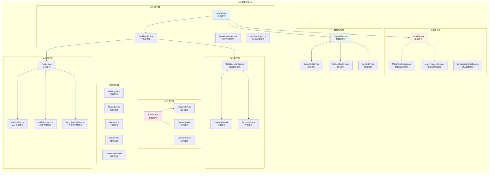
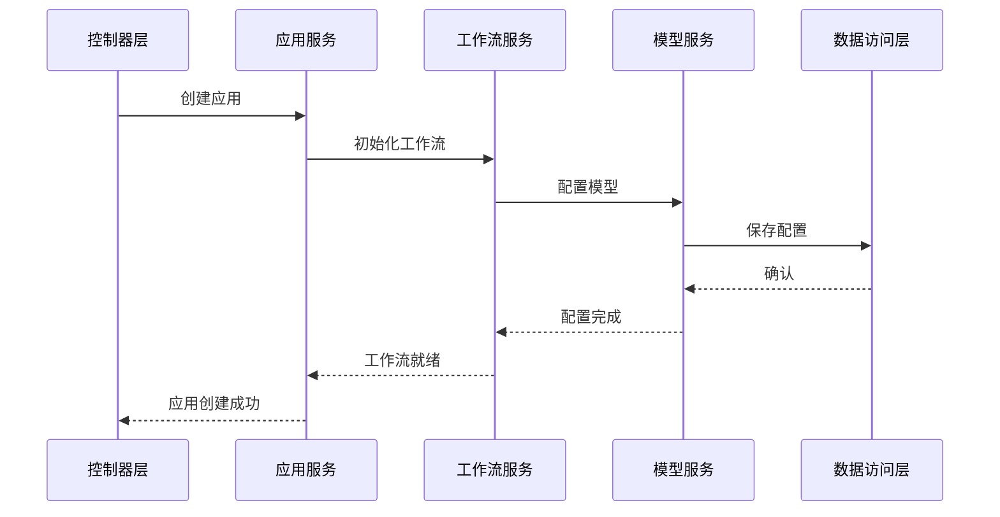

# Dify-05-服务层架构-概览

## 0. 摘要

Dify的服务层模块（`services/`）是平台的业务逻辑核心，采用领域驱动设计（DDD）实现了完整的业务功能。该模块包含20+个核心服务，涵盖应用管理、数据集处理、工作流执行、用户账户、计费系统等各个业务领域，为上层API提供了丰富的业务能力支撑。

**领域驱动设计特点：**

- **业务领域划分**：按照业务边界划分不同的服务模块
- **服务职责单一**：每个服务专注于特定的业务领域
- **依赖注入设计**：服务间通过接口解耦，便于测试和扩展
- **事务管理**：统一的事务管理和数据一致性保证

**Code Executor安全执行引擎：**
Dify实现了**安全的代码执行器（Code Executor）**，支持多种编程语言的安全执行：

```python
class CodeExecutor:
    """
    安全代码执行器
    支持Python、Node.js、Go等多种语言的沙箱执行
    """
    def execute(self, code: str, language: str, **kwargs):
        # 沙箱环境中安全执行代码
        pass
```

**核心能力边界**：

- 应用生命周期管理（创建、配置、发布、监控）
- 数据集处理与知识库管理
- 工作流编排与执行控制
- 用户认证与权限管理
- 模型调用与资源管理
- 计费与配额控制
- 系统监控与日志管理

**非目标**：

- 不直接处理HTTP请求（由Controller层处理）
- 不直接操作数据库（通过Repository层）
- 不包含UI逻辑（由前端处理）

**运行环境**：

- 语言：Python 3.10+
- 框架：基于依赖注入的服务架构
- 部署形态：作为Flask应用的业务逻辑层

---

## 1. 整体架构图



### 架构说明

**1. 领域服务设计**

每个服务域专注于特定的业务功能：

- **应用服务域**：管理AI应用的完整生命周期
- **数据服务域**：处理知识库和向量数据
- **模型服务域**：管理AI模型和推理服务
- **用户服务域**：处理用户认证和权限管理
- **工具服务域**：管理各类工具和插件
- **系统服务域**：提供基础设施服务
- **代码执行域**：安全的代码执行环境

**2. 服务间通信**



---

## 2. 核心服务详解

### 2.1 应用服务 (AppService)

**职责：**

- 应用创建、配置、删除
- 应用版本管理
- 应用运行状态监控
- 应用性能统计

**核心方法：**

```python
class AppService:
    def create_app(self, account: Account, args: CreateAppArgs) -> App:
        """创建新应用"""
        
    def update_app(self, app: App, args: UpdateAppArgs) -> App:
        """更新应用配置"""
        
    def delete_app(self, app: App) -> None:
        """删除应用"""
        
    def get_app_statistics(self, app: App) -> AppStatistics:
        """获取应用统计数据"""
```

### 2.2 工作流服务 (WorkflowService)

**职责：**

- 工作流图结构管理
- 工作流执行协调
- 节点配置管理
- 执行历史追踪

**核心方法：**

```python
class WorkflowService:
    def run_workflow(self, app: App, inputs: dict) -> WorkflowResult:
        """执行工作流"""
        
    def validate_workflow(self, graph_config: dict) -> ValidationResult:
        """验证工作流配置"""
        
    def get_execution_history(self, app: App) -> List[WorkflowExecution]:
        """获取执行历史"""
```

### 2.3 数据集服务 (DatasetService)

**职责：**

- 数据集创建与管理
- 文档处理与索引
- 检索配置优化
- 数据集统计分析

**核心方法：**

```python
class DatasetService:
    def create_dataset(self, account: Account, args: CreateDatasetArgs) -> Dataset:
        """创建数据集"""
        
    def add_document(self, dataset: Dataset, file: UploadFile) -> Document:
        """添加文档到数据集"""
        
    def query_dataset(self, dataset: Dataset, query: str) -> List[Document]:
        """查询数据集"""
```

---

## 3. 安全代码执行服务

### 3.1 CodeExecutorService

Dify的代码执行服务提供了安全的多语言代码执行环境：

**支持语言：**

- Python 3.10+
- Node.js 18+
- TypeScript 4.0+

**安全特性：**

```python
class CodeExecutorService:
    def execute_code(
        self,
        code: str,
        language: str,
        inputs: dict,
        timeout: int = 30
    ) -> CodeExecutionResult:
        """
        安全执行代码
        
        Args:
            code: 要执行的代码
            language: 编程语言
            inputs: 输入参数
            timeout: 超时时间（秒）
            
        Returns:
            执行结果，包含输出、错误、资源使用情况
        """
        # 1. 代码安全检查
        security_result = self.security_service.validate_code(code, language)
        if not security_result.is_safe:
            raise SecurityException(security_result.message)
            
        # 2. 创建沙箱环境
        sandbox = self.sandbox_service.create_sandbox(language)
        
        # 3. 资源限制设置
        sandbox.set_limits(
            memory_limit="512MB",
            cpu_limit="500m",
            timeout=timeout,
            network_access=False
        )
        
        # 4. 执行代码
        try:
            result = sandbox.execute(code, inputs)
            return CodeExecutionResult(
                success=True,
                output=result.output,
                error=None,
                execution_time=result.execution_time,
                memory_usage=result.memory_usage
            )
        except Exception as e:
            return CodeExecutionResult(
                success=False,
                output=None,
                error=str(e),
                execution_time=0,
                memory_usage=0
            )
        finally:
            # 5. 清理沙箱环境
            self.sandbox_service.cleanup_sandbox(sandbox)
```

### 3.2 安全策略

**代码安全检查：**

- 危险函数调用检测
- 文件系统访问限制
- 网络请求限制  
- 系统命令执行限制

**资源限制：**

- 内存使用限制：512MB
- CPU时间限制：30秒
- 磁盘访问限制：只读
- 网络访问：完全禁用

**沙箱隔离：**

- Docker容器隔离
- 进程级权限控制
- 临时文件系统
- 资源监控与清理

---

## 4. 服务层设计模式

### 4.1 依赖注入

所有服务都通过依赖注入进行管理：

```python
class ServiceContainer:
    """服务容器，管理所有服务的生命周期"""
    
    def __init__(self):
        self._services = {}
        self._singletons = {}
    
    def register(self, service_class, implementation_class):
        """注册服务"""
        self._services[service_class] = implementation_class
    
    def get(self, service_class):
        """获取服务实例"""
        if service_class in self._singletons:
            return self._singletons[service_class]
            
        implementation = self._services[service_class]
        instance = implementation()
        self._singletons[service_class] = instance
        return instance
```

### 4.2 事务管理

统一的事务管理确保数据一致性：

```python
class TransactionManager:
    """事务管理器"""
    
    @contextmanager
    def transaction(self):
        """事务上下文管理器"""
        db_session = get_db_session()
        try:
            yield db_session
            db_session.commit()
        except Exception:
            db_session.rollback()
            raise
        finally:
            db_session.close()

# 使用示例
class AppService:
    def create_app_with_workflow(self, args):
        with self.transaction_manager.transaction() as session:
            # 创建应用
            app = self.create_app(args.app_args, session=session)
            
            # 创建工作流
            workflow = self.workflow_service.create_workflow(
                args.workflow_args,
                session=session
            )
            
            # 关联应用和工作流
            app.workflow_id = workflow.id
            session.add(app)
            
            return app
```

### 4.3 事件驱动

服务间通过事件进行解耦：

```python
class EventBus:
    """事件总线"""
    
    def __init__(self):
        self._handlers = defaultdict(list)
    
    def subscribe(self, event_type: str, handler: Callable):
        """订阅事件"""
        self._handlers[event_type].append(handler)
    
    def publish(self, event: Event):
        """发布事件"""
        for handler in self._handlers[event.type]:
            try:
                handler(event)
            except Exception as e:
                logger.error(f"Event handler error: {e}")

# 事件定义
@dataclass
class AppCreatedEvent(Event):
    type: str = "app.created"
    app_id: str
    user_id: str
    created_at: datetime

# 事件处理
class BillingService:
    def handle_app_created(self, event: AppCreatedEvent):
        """处理应用创建事件，初始化计费"""
        self.create_billing_account(event.app_id, event.user_id)
```

---

## 5. 性能优化策略

### 5.1 缓存策略

**多级缓存架构：**

```python
class CacheService:
    """缓存服务"""
    
    def __init__(self):
        self.memory_cache = {}
        self.redis_cache = redis.Redis()
    
    def get(self, key: str):
        # L1缓存：内存缓存
        if key in self.memory_cache:
            return self.memory_cache[key]
            
        # L2缓存：Redis缓存
        value = self.redis_cache.get(key)
        if value:
            self.memory_cache[key] = value
            return value
            
        return None
    
    def set(self, key: str, value, ttl: int = 3600):
        # 写入内存缓存
        self.memory_cache[key] = value
        
        # 写入Redis缓存
        self.redis_cache.setex(key, ttl, value)
```

### 5.2 异步处理

长时间任务通过异步队列处理：

```python
class TaskService:
    """任务服务"""
    
    def submit_async_task(self, task_type: str, args: dict) -> str:
        """提交异步任务"""
        task_id = str(uuid.uuid4())
        
        # 提交到Celery队列
        task_result = async_task.delay(task_type, args)
        
        # 记录任务状态
        self.task_repository.create_task(
            task_id=task_id,
            task_type=task_type,
            status="pending",
            celery_task_id=task_result.id
        )
        
        return task_id
    
    def get_task_status(self, task_id: str) -> TaskStatus:
        """获取任务状态"""
        task = self.task_repository.get_task(task_id)
        if not task:
            raise TaskNotFoundError(task_id)
            
        return TaskStatus(
            task_id=task_id,
            status=task.status,
            progress=task.progress,
            result=task.result,
            error=task.error
        )
```

---

## 6. 监控与日志

### 6.1 服务监控

**关键指标：**

- 服务响应时间
- 错误率统计
- 资源使用情况
- 业务指标监控

### 6.2 日志管理

**结构化日志：**

```python
class LogService:
    """日志服务"""
    
    def log_business_event(
        self,
        event_type: str,
        user_id: str,
        app_id: str,
        details: dict
    ):
        """记录业务事件"""
        log_entry = {
            "timestamp": datetime.utcnow().isoformat(),
            "event_type": event_type,
            "user_id": user_id,
            "app_id": app_id,
            "details": details,
            "trace_id": get_trace_id()
        }
        
        logger.info("business_event", extra=log_entry)
```

---

**下一步：**

- 参考 `Dify-05-服务层架构-API.md` 了解服务接口规格
- 参考 `Dify-05-服务层架构-数据结构.md` 了解服务数据模型
- 参考 `Dify-05-服务层架构-时序图.md` 了解服务调用时序

---

## 补充：服务层工程实践

- 依赖与事务
  - 通过容器管理服务生命周期；明确事务边界（按用例/轮次）；跨服务操作采用事件驱动而非分布式事务。

```python
# 事务边界示例
with transaction_manager.transaction() as session:
    app = app_service.create_app(args, session=session)
    wf = workflow_service.create_workflow(wf_args, session=session)
    app.workflow_id = wf.id
    session.add(app)
```

- 异步与批处理
  - Celery 分队列路由（IO/CPU/快速任务）；批量写入与合并更新，降低往返。

- 缓存与一致性
  - L1(内存)+L2(Redis) 多级缓存；关键列表分页+计数并发查询；业务变更触发精确失效。

- 审计与追踪
  - 结构化业务日志，关联 `trace_id/user_id/app_id`；核心服务埋点与告警阈值。
