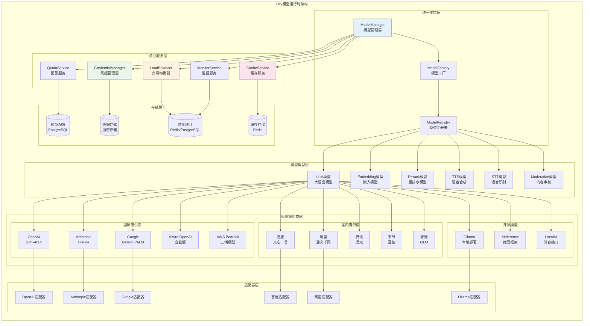

# Dify-06-模型运行时引擎-概览

## 0. 摘要

Dify的模型运行时模块（`core/model_runtime/`）是平台的多模型统一管理引擎，为上层应用提供了统一的模型调用接口。该模块支持40+个主流AI模型提供商、6种不同类型的AI模型，并实现了智能负载均衡、凭据管理和错误处理机制。

**多模型统一接口特点：**

- **模型提供商支持**：兼容OpenAI、Anthropic、Google、百度、阿里等40+个主流提供商
- **模型类型覆盖**：支持LLM、Embedding、Rerank、TTS、STT、Moderation等6种模型类型
- **智能负载均衡**：支持多个API Key的智能调度和故障转移
- **统一调用接口**：屏蔽不同提供商的差异，提供一致的调用体验

**技术栈与架构特点：**
Dify模型运行时采用了**Python/Flask/PostgreSQL**的经典技术栈：

- **Flask框架**：轻量级Web框架，支持快速API开发和模块化扩展
- **PostgreSQL数据库**：企业级关系数据库，支持JSON字段和复杂查询
- **Redis缓存**：高性能缓存层，用于会话管理和负载均衡状态
- **Celery任务队列**：异步任务处理，支持大规模并发和长时间运行任务

**模型适配器模式：**
采用适配器模式统一不同模型提供商的接口：

```python
class ModelAdapter:
    """模型适配器基类"""
    def invoke(self, model: str, credentials: dict, **kwargs):
        """统一的模型调用接口"""
        pass
```

**核心能力边界**：

- 多模型提供商统一管理（40+ 提供商）
- 多模型类型支持（LLM、Embedding、Rerank等）
- 智能负载均衡与故障转移
- 模型凭据安全管理
- 模型调用监控与统计
- 成本控制与配额管理

**非目标**：

- 不包含模型训练功能（仅提供推理服务）
- 不直接处理业务逻辑（由上层Service调用）
- 不包含模型微调和优化

**运行环境**：

- 语言：Python 3.10+
- 核心依赖：各模型提供商SDK、Redis、PostgreSQL
- 部署形态：作为Flask应用的核心模块，支持高并发调用

---

## 1. 整体架构图



### 架构说明

**1. 统一接口设计**

ModelManager作为统一入口，屏蔽了不同模型提供商的差异：

```python
class ModelManager:
    """模型管理器 - 统一模型调用入口"""
    
    def get_model_instance(
        self,
        tenant_id: str,
        model_type: ModelType,
        provider: str,
        model: str
    ) -> ModelInstance:
        """获取模型实例"""
        
    def invoke_model(
        self,
        model_instance: ModelInstance,
        **kwargs
    ) -> ModelResult:
        """调用模型"""
```

**2. 模型类型支持**

支持6种主要的AI模型类型：

- **LLM**：大语言模型，用于文本生成和理解
- **Embedding**：嵌入模型，用于文本向量化
- **Rerank**：重排序模型，用于搜索结果优化
- **TTS**：文本转语音模型
- **STT**：语音转文本模型  
- **Moderation**：内容审核模型

**3. 适配器模式实现**

每个模型提供商都有对应的适配器：

```python
class BaseModelAdapter:
    """模型适配器基类"""
    
    def validate_credentials(self, credentials: dict) -> bool:
        """验证凭据有效性"""
        
    def invoke_llm(self, **kwargs) -> LLMResult:
        """调用LLM模型"""
        
    def invoke_embedding(self, **kwargs) -> EmbeddingResult:
        """调用Embedding模型"""
        
    def get_supported_models(self) -> List[ModelSchema]:
        """获取支持的模型列表"""
```

---

## 2. 核心组件详解

### 2.1 模型管理器 (ModelManager)

模型管理器是整个运行时的核心组件：

**核心功能：**

- 模型实例创建与管理
- 模型调用统一入口
- 负载均衡与故障转移
- 模型性能监控

**关键实现：**

```python
class ModelManager:
    def __init__(self):
        self.model_registry = ModelRegistry()
        self.credential_manager = CredentialManager()
        self.load_balancer = LoadBalancer()
        self.cache_service = CacheService()
        self.monitor_service = MonitorService()
    
    def get_model_instance(
        self,
        tenant_id: str,
        model_type: ModelType,
        provider: str,
        model: str
    ) -> ModelInstance:
        """获取模型实例"""
        
        # 1. 从缓存获取
        cache_key = f"model:{tenant_id}:{provider}:{model}"
        cached_instance = self.cache_service.get(cache_key)
        if cached_instance:
            return cached_instance
        
        # 2. 获取模型配置
        model_schema = self.model_registry.get_model_schema(
            provider, model_type, model
        )
        if not model_schema:
            raise ModelNotFoundError(f"Model {provider}/{model} not found")
        
        # 3. 获取凭据
        credentials = self.credential_manager.get_credentials(
            tenant_id, provider
        )
        
        # 4. 创建模型实例
        model_instance = ModelInstance(
            provider=provider,
            model=model,
            model_type=model_type,
            model_schema=model_schema,
            credentials=credentials
        )
        
        # 5. 缓存实例
        self.cache_service.set(cache_key, model_instance, ttl=3600)
        
        return model_instance
    
    def invoke_llm(
        self,
        model_instance: ModelInstance,
        prompt_messages: List[PromptMessage],
        model_parameters: dict,
        stream: bool = False,
        **kwargs
    ) -> Generator[LLMResultChunk, None, None]:
        """调用LLM模型"""
        
        # 1. 负载均衡选择实例
        selected_instance = self.load_balancer.select_instance(
            model_instance
        )
        
        # 2. 调用监控
        start_time = time.time()
        
        try:
            # 3. 获取适配器并调用
            adapter = self._get_adapter(selected_instance.provider)
            
            for chunk in adapter.invoke_llm(
                model=selected_instance.model,
                credentials=selected_instance.credentials,
                prompt_messages=prompt_messages,
                model_parameters=model_parameters,
                stream=stream,
                **kwargs
            ):
                yield chunk
            
            # 4. 记录成功调用
            self.monitor_service.record_success(
                selected_instance,
                execution_time=time.time() - start_time
            )
            
        except Exception as e:
            # 5. 记录失败并尝试故障转移
            self.monitor_service.record_error(selected_instance, str(e))
            
            # 故障转移逻辑
            if self.load_balancer.should_failover(selected_instance, e):
                backup_instance = self.load_balancer.get_backup_instance(
                    model_instance
                )
                if backup_instance:
                    # 递归调用备用实例
                    yield from self.invoke_llm(
                        backup_instance,
                        prompt_messages,
                        model_parameters,
                        stream,
                        **kwargs
                    )
                    return
            
            raise e
```

### 2.2 凭据管理器 (CredentialManager)

安全管理模型提供商的API凭据：

**安全特性：**

- AES加密存储
- 凭据轮换支持
- 权限访问控制
- 凭据有效性检查

```python
class CredentialManager:
    """凭据管理器"""
    
    def __init__(self):
        self.encryption_service = EncryptionService()
        self.credential_repository = CredentialRepository()
    
    def store_credentials(
        self,
        tenant_id: str,
        provider: str,
        credentials: dict
    ) -> None:
        """存储凭据"""
        
        # 1. 验证凭据格式
        self._validate_credentials_format(provider, credentials)
        
        # 2. 测试凭据有效性
        adapter = self._get_adapter(provider)
        if not adapter.validate_credentials(credentials):
            raise InvalidCredentialsError("Invalid credentials")
        
        # 3. 加密存储
        encrypted_credentials = self.encryption_service.encrypt(
            json.dumps(credentials)
        )
        
        # 4. 保存到数据库
        self.credential_repository.upsert_credentials(
            tenant_id=tenant_id,
            provider=provider,
            encrypted_data=encrypted_credentials,
            updated_at=datetime.utcnow()
        )
    
    def get_credentials(self, tenant_id: str, provider: str) -> dict:
        """获取凭据"""
        
        # 1. 从数据库获取
        credential_record = self.credential_repository.get_credentials(
            tenant_id, provider
        )
        if not credential_record:
            raise CredentialsNotFoundError(
                f"Credentials not found for {provider}"
            )
        
        # 2. 解密凭据
        decrypted_data = self.encryption_service.decrypt(
            credential_record.encrypted_data
        )
        
        return json.loads(decrypted_data)
    
    def rotate_credentials(
        self,
        tenant_id: str,
        provider: str,
        new_credentials: dict
    ) -> None:
        """轮换凭据"""
        
        # 1. 验证新凭据
        adapter = self._get_adapter(provider)
        if not adapter.validate_credentials(new_credentials):
            raise InvalidCredentialsError("New credentials are invalid")
        
        # 2. 备份旧凭据
        old_credentials = self.get_credentials(tenant_id, provider)
        self._backup_credentials(tenant_id, provider, old_credentials)
        
        # 3. 更新凭据
        self.store_credentials(tenant_id, provider, new_credentials)
        
        # 4. 清理缓存
        self._clear_credential_cache(tenant_id, provider)
```

### 2.3 负载均衡器 (LoadBalancer)

智能的负载均衡和故障转移：

**负载均衡策略：**

- 轮询（Round Robin）
- 最少连接（Least Connections）
- 响应时间加权（Response Time Weighted）
- 基于错误率的自适应

```python
class LoadBalancer:
    """负载均衡器"""
    
    def __init__(self):
        self.strategy = WeightedRoundRobinStrategy()
        self.health_checker = HealthChecker()
        self.circuit_breaker = CircuitBreaker()
    
    def select_instance(self, model_instance: ModelInstance) -> ModelInstance:
        """选择模型实例"""
        
        # 1. 获取可用实例列表
        available_instances = self._get_available_instances(model_instance)
        
        if not available_instances:
            raise NoAvailableInstanceError("No available model instances")
        
        # 2. 健康检查过滤
        healthy_instances = [
            instance for instance in available_instances
            if self.health_checker.is_healthy(instance)
        ]
        
        if not healthy_instances:
            # 降级到可用实例（忽略健康检查）
            healthy_instances = available_instances
        
        # 3. 断路器检查
        active_instances = [
            instance for instance in healthy_instances
            if not self.circuit_breaker.is_open(instance)
        ]
        
        if not active_instances:
            # 降级到健康实例（忽略断路器）
            active_instances = healthy_instances
        
        # 4. 负载均衡选择
        selected_instance = self.strategy.select(active_instances)
        
        return selected_instance
    
    def record_success(self, instance: ModelInstance, response_time: float):
        """记录成功调用"""
        self.health_checker.record_success(instance, response_time)
        self.circuit_breaker.record_success(instance)
        self.strategy.update_weights(instance, success=True)
    
    def record_failure(self, instance: ModelInstance, error: Exception):
        """记录失败调用"""
        self.health_checker.record_failure(instance, error)
        self.circuit_breaker.record_failure(instance)
        self.strategy.update_weights(instance, success=False)
    
    def _get_available_instances(
        self,
        model_instance: ModelInstance
    ) -> List[ModelInstance]:
        """获取可用实例列表"""
        
        # 获取租户的所有API Key
        credentials_list = self.credential_manager.get_all_credentials(
            model_instance.tenant_id,
            model_instance.provider
        )
        
        # 为每个API Key创建实例
        instances = []
        for credentials in credentials_list:
            instance = ModelInstance(
                provider=model_instance.provider,
                model=model_instance.model,
                model_type=model_instance.model_type,
                model_schema=model_instance.model_schema,
                credentials=credentials
            )
            instances.append(instance)
        
        return instances
```

---

## 3. 模型提供商适配器

### 3.1 OpenAI适配器

```python
class OpenAIAdapter(BaseModelAdapter):
    """OpenAI适配器"""
    
    def invoke_llm(
        self,
        model: str,
        credentials: dict,
        prompt_messages: List[PromptMessage],
        model_parameters: dict,
        stream: bool = False,
        **kwargs
    ) -> Generator[LLMResultChunk, None, None]:
        """调用OpenAI LLM"""
        
        # 1. 构建OpenAI客户端
        client = OpenAI(
            api_key=credentials.get('openai_api_key'),
            base_url=credentials.get('openai_api_base'),
            timeout=30
        )
        
        # 2. 转换消息格式
        openai_messages = self._convert_messages(prompt_messages)
        
        # 3. 构建请求参数
        request_params = {
            'model': model,
            'messages': openai_messages,
            'stream': stream,
            **model_parameters
        }
        
        # 4. 调用OpenAI API
        try:
            response = client.chat.completions.create(**request_params)
            
            if stream:
                # 流式响应处理
                for chunk in response:
                    if chunk.choices and chunk.choices[0].delta.content:
                        yield LLMResultChunk(
                            model=model,
                            prompt_messages=prompt_messages,
                            delta=LLMResultChunkDelta(
                                index=0,
                                message=AssistantPromptMessage(
                                    content=chunk.choices[0].delta.content
                                ),
                                usage=self._get_usage(chunk) if hasattr(chunk, 'usage') else None
                            )
                        )
            else:
                # 非流式响应处理
                content = response.choices[0].message.content
                usage = self._get_usage(response)
                
                yield LLMResult(
                    model=model,
                    prompt_messages=prompt_messages,
                    message=AssistantPromptMessage(content=content),
                    usage=usage
                )
                
        except OpenAIError as e:
            raise ModelInvokeError(f"OpenAI API error: {str(e)}")
    
    def invoke_embedding(
        self,
        model: str,
        credentials: dict,
        texts: List[str],
        **kwargs
    ) -> EmbeddingResult:
        """调用OpenAI Embedding"""
        
        client = OpenAI(
            api_key=credentials.get('openai_api_key'),
            base_url=credentials.get('openai_api_base')
        )
        
        try:
            response = client.embeddings.create(
                model=model,
                input=texts
            )
            
            embeddings = [item.embedding for item in response.data]
            usage = EmbeddingUsage(
                tokens=response.usage.total_tokens,
                total_price=self._calculate_price(response.usage, model)
            )
            
            return EmbeddingResult(
                model=model,
                embeddings=embeddings,
                usage=usage
            )
            
        except OpenAIError as e:
            raise ModelInvokeError(f"OpenAI Embedding API error: {str(e)}")
```

### 3.2 国内模型适配器

```python
class BaiduAdapter(BaseModelAdapter):
    """百度文心一言适配器"""
    
    def invoke_llm(self, **kwargs) -> Generator[LLMResultChunk, None, None]:
        """调用百度文心一言"""
        
        # 1. 获取访问令牌
        access_token = self._get_access_token(kwargs['credentials'])
        
        # 2. 构建请求
        url = f"https://aip.baidubce.com/rpc/2.0/ai_custom/v1/wenxinworkshop/chat/{kwargs['model']}"
        
        headers = {
            'Content-Type': 'application/json'
        }
        
        # 3. 转换消息格式
        messages = self._convert_messages_to_baidu_format(
            kwargs['prompt_messages']
        )
        
        data = {
            'messages': messages,
            'stream': kwargs.get('stream', False),
            **kwargs.get('model_parameters', {})
        }
        
        # 4. 发送请求
        response = requests.post(
            url,
            headers=headers,
            json=data,
            params={'access_token': access_token},
            stream=kwargs.get('stream', False)
        )
        
        if kwargs.get('stream', False):
            # 处理流式响应
            for line in response.iter_lines():
                if line.startswith(b'data: '):
                    chunk_data = json.loads(line[6:])
                    if 'result' in chunk_data:
                        yield LLMResultChunk(
                            model=kwargs['model'],
                            prompt_messages=kwargs['prompt_messages'],
                            delta=LLMResultChunkDelta(
                                index=0,
                                message=AssistantPromptMessage(
                                    content=chunk_data['result']
                                )
                            )
                        )
        else:
            # 处理非流式响应
            result = response.json()
            yield LLMResult(
                model=kwargs['model'],
                prompt_messages=kwargs['prompt_messages'],
                message=AssistantPromptMessage(
                    content=result['result']
                ),
                usage=self._parse_usage(result.get('usage', {}))
            )
```

---

## 4. 性能优化与监控

### 4.1 缓存策略

**多级缓存架构：**

```python
class ModelCacheService:
    """模型缓存服务"""
    
    def __init__(self):
        self.memory_cache = {}
        self.redis_cache = Redis()
        self.max_memory_size = 1000  # 最大内存缓存条目数
    
    def get_cached_result(
        self,
        cache_key: str,
        cache_type: str = "embedding"
    ) -> Optional[Any]:
        """获取缓存结果"""
        
        # L1缓存：内存缓存（用于嵌入结果等）
        if cache_type == "embedding" and cache_key in self.memory_cache:
            return self.memory_cache[cache_key]
        
        # L2缓存：Redis缓存
        cached_data = self.redis_cache.get(cache_key)
        if cached_data:
            result = json.loads(cached_data)
            
            # 回写到内存缓存
            if cache_type == "embedding" and len(self.memory_cache) < self.max_memory_size:
                self.memory_cache[cache_key] = result
            
            return result
        
        return None
    
    def set_cached_result(
        self,
        cache_key: str,
        result: Any,
        ttl: int = 3600,
        cache_type: str = "embedding"
    ):
        """设置缓存结果"""
        
        # 序列化结果
        serialized_result = json.dumps(result, cls=ModelResultEncoder)
        
        # 写入Redis缓存
        self.redis_cache.setex(cache_key, ttl, serialized_result)
        
        # 写入内存缓存（仅对嵌入结果）
        if cache_type == "embedding" and len(self.memory_cache) < self.max_memory_size:
            self.memory_cache[cache_key] = result
```

### 4.2 监控服务

```python
class ModelMonitorService:
    """模型监控服务"""
    
    def record_model_invoke(
        self,
        model_instance: ModelInstance,
        request_data: dict,
        response_data: dict,
        execution_time: float,
        success: bool,
        error: Optional[str] = None
    ):
        """记录模型调用"""
        
        # 1. 记录调用统计
        stats = {
            'provider': model_instance.provider,
            'model': model_instance.model,
            'model_type': model_instance.model_type.value,
            'tenant_id': model_instance.tenant_id,
            'execution_time': execution_time,
            'success': success,
            'timestamp': datetime.utcnow(),
            'token_usage': response_data.get('usage', {}),
            'cost': self._calculate_cost(response_data.get('usage', {}), model_instance),
            'error': error
        }
        
        # 2. 写入时序数据库
        self.metrics_client.record_metrics(stats)
        
        # 3. 更新实时统计
        self._update_realtime_stats(model_instance, stats)
        
        # 4. 检查告警条件
        self._check_alerts(model_instance, stats)
    
    def get_model_performance_metrics(
        self,
        tenant_id: str,
        time_range: str = "1h"
    ) -> Dict[str, Any]:
        """获取模型性能指标"""
        
        return {
            'total_requests': self._get_total_requests(tenant_id, time_range),
            'success_rate': self._get_success_rate(tenant_id, time_range),
            'avg_response_time': self._get_avg_response_time(tenant_id, time_range),
            'token_usage': self._get_token_usage(tenant_id, time_range),
            'total_cost': self._get_total_cost(tenant_id, time_range),
            'error_distribution': self._get_error_distribution(tenant_id, time_range)
        }
```

---

## 5. 成本控制与配额管理

### 5.1 配额服务

```python
class QuotaService:
    """配额管理服务"""
    
    def check_quota(
        self,
        tenant_id: str,
        model_type: ModelType,
        estimated_tokens: int
    ) -> QuotaCheckResult:
        """检查配额是否足够"""
        
        # 1. 获取租户配额配置
        quota_config = self.quota_repository.get_tenant_quota(tenant_id)
        if not quota_config:
            return QuotaCheckResult(allowed=True, reason="No quota limit")
        
        # 2. 获取当前使用量
        current_usage = self.usage_repository.get_monthly_usage(
            tenant_id, datetime.utcnow().strftime('%Y-%m')
        )
        
        # 3. 检查各种配额限制
        checks = [
            self._check_monthly_quota(quota_config, current_usage, estimated_tokens),
            self._check_daily_quota(tenant_id, quota_config, estimated_tokens),
            self._check_rate_limit(tenant_id, model_type),
            self._check_balance(tenant_id, estimated_tokens)
        ]
        
        for check in checks:
            if not check.allowed:
                return check
        
        return QuotaCheckResult(allowed=True)
    
    def consume_quota(
        self,
        tenant_id: str,
        model_instance: ModelInstance,
        actual_usage: ModelUsage
    ):
        """消费配额"""
        
        # 1. 记录使用量
        usage_record = UsageRecord(
            tenant_id=tenant_id,
            provider=model_instance.provider,
            model=model_instance.model,
            model_type=model_instance.model_type,
            input_tokens=actual_usage.prompt_tokens,
            output_tokens=actual_usage.completion_tokens,
            total_tokens=actual_usage.total_tokens,
            cost=actual_usage.total_price,
            created_at=datetime.utcnow()
        )
        
        self.usage_repository.create_usage_record(usage_record)
        
        # 2. 更新缓存统计（用于快速配额检查）
        self._update_usage_cache(tenant_id, actual_usage)
        
        # 3. 检查是否需要告警
        self._check_quota_alerts(tenant_id, actual_usage)
```

### 5.2 成本优化

**智能路由策略：**

```python
class CostOptimizedLoadBalancer(LoadBalancer):
    """成本优化的负载均衡器"""
    
    def select_instance(self, model_instance: ModelInstance) -> ModelInstance:
        """基于成本的实例选择"""
        
        available_instances = self._get_available_instances(model_instance)
        
        # 1. 过滤健康实例
        healthy_instances = [
            instance for instance in available_instances
            if self.health_checker.is_healthy(instance)
        ]
        
        # 2. 计算每个实例的成本效益
        cost_scores = []
        for instance in healthy_instances:
            cost_per_token = self._get_cost_per_token(instance)
            latency_score = self._get_latency_score(instance)
            reliability_score = self._get_reliability_score(instance)
            
            # 综合评分（成本权重50%，延迟30%，可靠性20%）
            total_score = (
                (1 / cost_per_token) * 0.5 +
                latency_score * 0.3 +
                reliability_score * 0.2
            )
            
            cost_scores.append((instance, total_score))
        
        # 3. 选择评分最高的实例
        cost_scores.sort(key=lambda x: x[1], reverse=True)
        return cost_scores[0][0]
```

---

**下一步：**

- 参考 `Dify-06-模型运行时引擎-API.md` 了解模型调用API规格
- 参考 `Dify-06-模型运行时引擎-数据结构.md` 了解模型数据结构
- 参考 `Dify-06-模型运行时引擎-时序图.md` 了解模型调用时序

---

## 补充：运行时优化与成本控制

- 成本优化路由
  - 结合单价、延迟、成功率计算综合评分；健康检查+断路器；失败自动切换备用实例。

- 多级缓存
  - 嵌入/模型结果分类缓存；L1 内存限量回填、L2 Redis TTL；键规范与序列化统一。

- 凭据安全
  - AES/Fernet 加密存储；有效性预检与轮换；访问最小化与访问审计。

- 监控指标
  - provider/model 维度统计请求数、耗时、成功率、token 用量与成本；异常分布与告警。

```python
# 伪代码：成本加权选择
score = 0.5*(1/cost_per_token) + 0.3*latency_score + 0.2*reliability
selected = max(healthy_instances, key=lambda i: calc_score(i))
```
