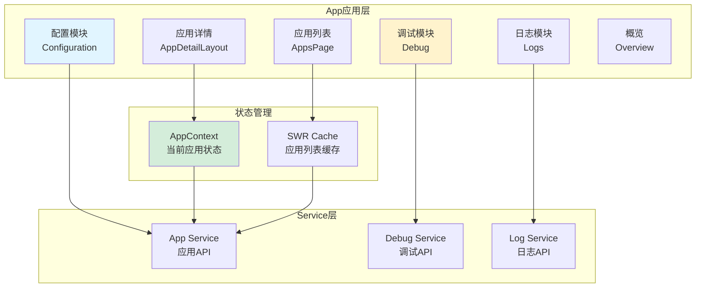
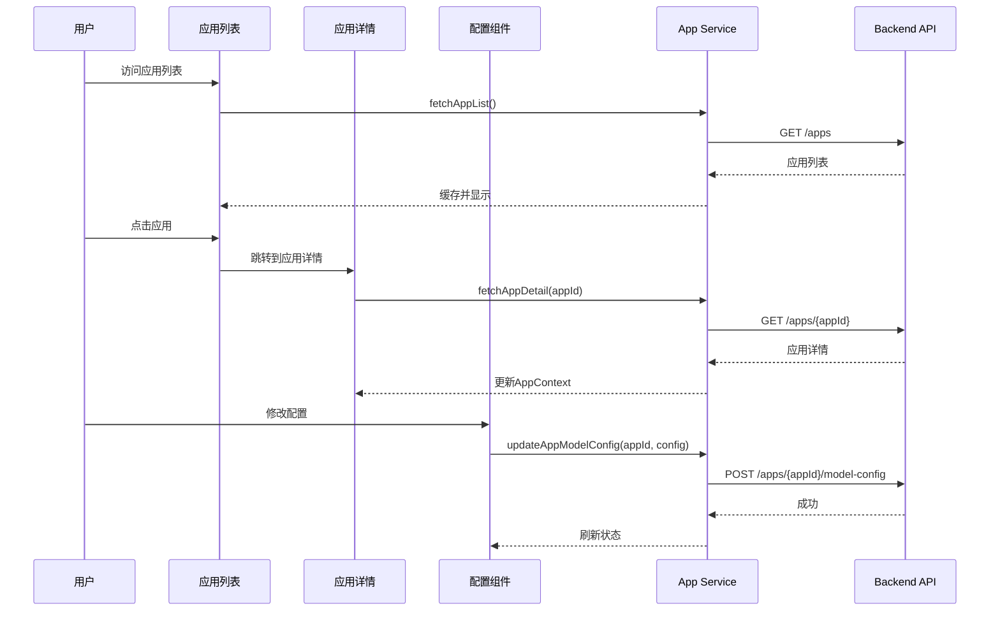

# Dify-07-Frontend-App应用层-概览

## 摘要

App应用层是Dify Frontend中负责应用管理和配置的核心模块，提供应用创建、配置、调试、发布等完整的应用生命周期管理功能。

### 核心职责

| 职责 | 说明 |
|------|------|
| **应用管理** | 应用列表、创建、编辑、删除、复制 |
| **配置管理** | 模型配置、提示词、变量、知识库关联 |
| **调试功能** | 实时对话测试、日志查看、参数调优 |
| **发布管理** | Web App发布、API配置、分享链接 |
| **日志监控** | 对话日志、Token统计、用户反馈 |

### 模块结构

```
app/components/app/
├── configuration/        # 配置模块
│   ├── config/          # 配置组件
│   ├── config-prompt/   # 提示词配置
│   ├── config-var/      # 变量配置
│   └── dataset-config/  # 知识库配置
├── log/                 # 日志模块
├── overview/            # 应用概览
├── text-generate/       # 文本生成调试
└── workflow-log/        # 工作流日志
```

---

## 一、模块架构

### 1.1 整体架构图



### 1.2 数据流



---

## 二、核心组件

### 2.1 应用列表（AppsPage）

**位置**：`app/(commonLayout)/apps/page.tsx`

**功能**：
- 展示所有应用卡片
- 支持搜索和筛选
- 创建新应用
- 应用操作（编辑、删除、复制）

**组件结构**：
```typescript
function AppsPage() {
  const { apps, isLoading, refresh } = useAppList()
  const [searchKeyword, setSearchKeyword] = useState('')
  
  // 过滤应用
  const filteredApps = apps?.filter(app =>
    app.name.toLowerCase().includes(searchKeyword.toLowerCase())
  )
  
  return (
    <div className="apps-page">
      {/* 顶部操作栏 */}
      <Header>
        <SearchInput value={searchKeyword} onChange={setSearchKeyword} />
        <CreateAppButton onClick={handleCreateApp} />
      </Header>
      
      {/* 应用网格 */}
      <div className="apps-grid">
        {filteredApps?.map(app => (
          <AppCard
            key={app.id}
            app={app}
            onEdit={() => router.push(`/app/${app.id}/configuration`)}
            onDelete={() => handleDeleteApp(app.id)}
            onDuplicate={() => handleDuplicateApp(app)}
          />
        ))}
        {/* 新建应用卡片 */}
        <NewAppCard onClick={handleCreateApp} />
      </div>
    </div>
  )
}
```

**关键交互**：
1. 创建应用：打开CreateAppModal，选择类型并创建
2. 编辑应用：跳转到应用配置页
3. 删除应用：确认对话框→删除→刷新列表
4. 复制应用：复制配置→创建新应用

---

### 2.2 应用详情布局（AppDetailLayout）

**位置**：`app/(commonLayout)/app/(appDetailLayout)/[appId]/layout.tsx`

**功能**：
- 提供统一的应用详情页布局
- 侧边栏导航
- 应用信息展示
- 路由管理

**布局结构**：
```typescript
function AppDetailLayout({ children, params }: { children: ReactNode, params: { appId: string } }) {
  const { app, isLoading } = useAppDetail(params.appId)
  const navigation = getNavigationConfig(params.appId, app?.mode)
  
  if (isLoading) return <Loading />
  if (!app) return <NotFound />
  
  return (
    <div className="app-detail-layout">
      {/* 侧边栏 */}
      <AppSidebar
        app={app}
        navigation={navigation}
      />
      
      {/* 主内容区 */}
      <div className="main-content">
        <AppContextProvider value={app}>
          {children}
        </AppContextProvider>
      </div>
    </div>
  )
}
```

**导航配置**：
```typescript
function getNavigationConfig(appId: string, mode: AppMode) {
  const base = [
    { name: '概览', href: `/app/${appId}/overview`, icon: OverviewIcon },
  ]
  
  if (mode === 'chat' || mode === 'agent-chat' || mode === 'completion') {
    base.push({
      name: '配置',
      href: `/app/${appId}/configuration`,
      icon: ConfigIcon
    })
  }
  
  if (mode === 'workflow' || mode === 'advanced-chat') {
    base.push({
      name: '工作流',
      href: `/app/${appId}/workflow`,
      icon: WorkflowIcon
    })
  }
  
  base.push(
    { name: '日志', href: `/app/${appId}/logs`, icon: LogIcon },
    { name: '标注', href: `/app/${appId}/annotations`, icon: AnnotationIcon }
  )
  
  return base
}
```

---

### 2.3 配置模块（Configuration）

**位置**：`app/components/app/configuration/`

**核心子组件**：

#### 2.3.1 模型配置（ModelConfig）

**功能**：选择和配置LLM模型

```typescript
function ModelConfig() {
  const { app } = useAppContext()
  const { providers } = useModelProviders()
  const [config, setConfig] = useState(app.model_config)
  
  return (
    <div className="model-config">
      {/* 模型选择 */}
      <ModelSelector
        providers={providers}
        value={config.model}
        onChange={(model) => setConfig({ ...config, model })}
      />
      
      {/* 参数配置 */}
      <div className="parameters">
        <Slider
          label="Temperature"
          value={config.completion_params.temperature}
          onChange={(value) => updateParameter('temperature', value)}
          min={0}
          max={2}
          step={0.1}
        />
        <Slider
          label="Top P"
          value={config.completion_params.top_p}
          onChange={(value) => updateParameter('top_p', value)}
          min={0}
          max={1}
          step={0.05}
        />
        <InputNumber
          label="Max Tokens"
          value={config.completion_params.max_tokens}
          onChange={(value) => updateParameter('max_tokens', value)}
          min={1}
          max={4096}
        />
      </div>
      
      {/* 保存按钮 */}
      <Button onClick={handleSave}>保存配置</Button>
    </div>
  )
}
```

#### 2.3.2 提示词配置（PromptConfig）

**功能**：编辑系统提示词和变量

```typescript
function PromptConfig() {
  const { app } = useAppContext()
  const [prompt, setPrompt] = useState(app.pre_prompt || '')
  const [variables, setVariables] = useState(app.user_input_form || [])
  
  return (
    <div className="prompt-config">
      {/* 提示词编辑器 */}
      <PromptEditor
        value={prompt}
        onChange={setPrompt}
        variables={variables}
        placeholder="输入系统提示词，使用 {{变量名}} 引用变量"
      />
      
      {/* 变量管理 */}
      <VariableList
        variables={variables}
        onChange={setVariables}
        onAdd={handleAddVariable}
        onRemove={handleRemoveVariable}
      />
      
      {/* 快速插入 */}
      <QuickInsert
        items={[
          { label: '用户输入', value: '{{query}}' },
          { label: '对话历史', value: '{{conversation_history}}' },
          { label: '知识库内容', value: '{{context}}' },
        ]}
        onInsert={(value) => insertToPrompt(value)}
      />
    </div>
  )
}
```

**变量类型**：
```typescript
interface Variable {
  variable: string           // 变量名
  label: string             // 显示标签
  type: 'text-input' | 'paragraph' | 'select' | 'number'
  required: boolean
  max_length?: number
  default?: string
  options?: string[]        // select类型的选项
}
```

#### 2.3.3 知识库配置（DatasetConfig）

**功能**：关联知识库，配置检索参数

```typescript
function DatasetConfig() {
  const { app } = useAppContext()
  const { datasets } = useDatasets()
  const [selectedDatasets, setSelectedDatasets] = useState(app.dataset_configs?.datasets || [])
  const [retrievalConfig, setRetrievalConfig] = useState(app.dataset_configs?.retrieval_model || {})
  
  return (
    <div className="dataset-config">
      {/* 知识库选择 */}
      <DatasetSelector
        datasets={datasets}
        selected={selectedDatasets}
        onChange={setSelectedDatasets}
      />
      
      {/* 检索配置 */}
      <div className="retrieval-config">
        <Select
          label="检索方式"
          value={retrievalConfig.search_method}
          onChange={(value) => updateRetrievalConfig('search_method', value)}
          options={[
            { label: '语义检索', value: 'semantic_search' },
            { label: '全文检索', value: 'full_text_search' },
            { label: '混合检索', value: 'hybrid_search' },
          ]}
        />
        
        <InputNumber
          label="Top K"
          value={retrievalConfig.top_k}
          onChange={(value) => updateRetrievalConfig('top_k', value)}
          min={1}
          max={20}
        />
        
        <Checkbox
          label="启用重排序"
          checked={retrievalConfig.reranking_enable}
          onChange={(checked) => updateRetrievalConfig('reranking_enable', checked)}
        />
        
        {retrievalConfig.reranking_enable && (
          <RerankingModelSelector
            value={retrievalConfig.reranking_model}
            onChange={(model) => updateRetrievalConfig('reranking_model', model)}
          />
        )}
      </div>
      
      {/* 预览效果 */}
      <RetrievalPreview
        datasets={selectedDatasets}
        config={retrievalConfig}
      />
    </div>
  )
}
```

---

### 2.4 调试模块（Debug）

**位置**：`app/components/app/text-generate/`（聊天/文本生成）

**功能**：
- 实时对话测试
- 输入变量设置
- 消息流式显示
- Token统计
- 思考过程展示

**核心组件**：
```typescript
function DebugPanel({ appId }: { appId: string }) {
  const [messages, setMessages] = useState<Message[]>([])
  const [inputs, setInputs] = useState<Record<string, any>>({})
  const [conversationId, setConversationId] = useState<string>()
  const [streaming, setStreaming] = useState(false)
  const abortControllerRef = useRef<AbortController>()
  
  const handleSend = (query: string) => {
    setStreaming(true)
    
    // 添加用户消息
    setMessages(prev => [...prev, { role: 'user', content: query }])
    
    // 创建临时助手消息
    const tempId = `temp-${Date.now()}`
    setMessages(prev => [...prev, { id: tempId, role: 'assistant', content: '' }])
    
    let fullMessage = ''
    
    // 发送请求
    const controller = sendChatMessage(appId, {
      query,
      inputs,
      conversation_id: conversationId,
    }, {
      onData: (chunk, isFirst, moreInfo) => {
        fullMessage += chunk
        setMessages(prev => 
          prev.map(msg => 
            msg.id === tempId 
              ? { ...msg, content: fullMessage, conversation_id: moreInfo.conversationId, id: moreInfo.messageId }
              : msg
          )
        )
        
        if (isFirst) {
          setConversationId(moreInfo.conversationId)
        }
      },
      onMessageEnd: (data) => {
        setMessages(prev =>
          prev.map(msg =>
            msg.id === data.id
              ? { ...msg, metadata: data.metadata }
              : msg
          )
        )
        setStreaming(false)
      },
      onError: (error) => {
        Toast.notify({ type: 'error', message: error })
        setStreaming(false)
      },
      onCompleted: () => {
        setStreaming(false)
      }
    })
    
    abortControllerRef.current = controller
  }
  
  const handleStop = () => {
    abortControllerRef.current?.abort()
    setStreaming(false)
  }
  
  const handleClear = () => {
    setMessages([])
    setConversationId(undefined)
  }
  
  return (
    <div className="debug-panel">
      {/* 左侧：变量输入 */}
      <div className="inputs-panel">
        <h3>输入变量</h3>
        {app.user_input_form?.map(variable => (
          <VariableInput
            key={variable.variable}
            variable={variable}
            value={inputs[variable.variable]}
            onChange={(value) => setInputs({ ...inputs, [variable.variable]: value })}
          />
        ))}
        <Button onClick={handleClear}>清空对话</Button>
      </div>
      
      {/* 右侧：对话区域 */}
      <div className="chat-panel">
        {/* 消息列表 */}
        <div className="messages">
          {messages.map((msg, index) => (
            <MessageItem key={index} message={msg} />
          ))}
        </div>
        
        {/* 输入框 */}
        <ChatInput
          onSend={handleSend}
          onStop={handleStop}
          disabled={streaming}
          streaming={streaming}
        />
      </div>
    </div>
  )
}
```

**消息组件**：
```typescript
function MessageItem({ message }: { message: Message }) {
  return (
    <div className={`message message-${message.role}`}>
      <div className="message-avatar">
        {message.role === 'user' ? <UserIcon /> : <BotIcon />}
      </div>
      
      <div className="message-content">
        {/* Markdown渲染 */}
        <MarkdownPreview content={message.content} />
        
        {/* 元数据 */}
        {message.metadata && (
          <div className="message-metadata">
            <span>Token: {message.metadata.usage.total_tokens}</span>
            <span>耗时: {message.metadata.elapsed_time}ms</span>
            {message.metadata.retriever_resources && (
              <Button onClick={() => showRetrievalDetails(message.metadata.retriever_resources)}>
                查看知识库引用
              </Button>
            )}
          </div>
        )}
      </div>
    </div>
  )
}
```

---

### 2.5 日志模块（Logs）

**位置**：`app/components/app/log/`

**功能**：
- 查看对话日志
- 搜索和筛选
- 查看详细信息
- 用户反馈统计

**核心组件**：
```typescript
function LogsPage({ appId }: { appId: string }) {
  const [logs, setLogs] = useState<Log[]>([])
  const [filters, setFilters] = useState({
    keyword: '',
    status: 'all',
    dateRange: [null, null]
  })
  const [page, setPage] = useState(1)
  
  // 获取日志
  const { data, isLoading } = useSWR(
    `/apps/${appId}/logs?page=${page}&keyword=${filters.keyword}&status=${filters.status}`,
    fetchLogs
  )
  
  return (
    <div className="logs-page">
      {/* 筛选器 */}
      <div className="filters">
        <SearchInput
          value={filters.keyword}
          onChange={(value) => setFilters({ ...filters, keyword: value })}
          placeholder="搜索消息内容"
        />
        
        <Select
          value={filters.status}
          onChange={(value) => setFilters({ ...filters, status: value })}
          options={[
            { label: '全部', value: 'all' },
            { label: '成功', value: 'success' },
            { label: '失败', value: 'error' },
          ]}
        />
        
        <DateRangePicker
          value={filters.dateRange}
          onChange={(range) => setFilters({ ...filters, dateRange: range })}
        />
      </div>
      
      {/* 日志列表 */}
      <div className="logs-list">
        {isLoading ? (
          <Loading />
        ) : (
          <>
            {data?.data.map(log => (
              <LogItem
                key={log.id}
                log={log}
                onClick={() => showLogDetail(log)}
              />
            ))}
            
            {/* 分页 */}
            <Pagination
              current={page}
              total={data?.total}
              pageSize={20}
              onChange={setPage}
            />
          </>
        )}
      </div>
    </div>
  )
}
```

**日志详情**：
```typescript
function LogDetailModal({ log }: { log: Log }) {
  return (
    <Modal title="对话详情" size="large">
      <div className="log-detail">
        {/* 基本信息 */}
        <Section title="基本信息">
          <InfoItem label="会话ID" value={log.conversation_id} />
          <InfoItem label="消息ID" value={log.id} />
          <InfoItem label="用户" value={log.from_account || log.from_end_user_id} />
          <InfoItem label="时间" value={formatTime(log.created_at)} />
          <InfoItem label="耗时" value={`${log.elapsed_time}ms`} />
        </Section>
        
        {/* 消息内容 */}
        <Section title="用户输入">
          <MarkdownPreview content={log.query} />
        </Section>
        
        <Section title="AI回复">
          <MarkdownPreview content={log.answer} />
        </Section>
        
        {/* Token统计 */}
        <Section title="Token使用">
          <TokenStats usage={log.message_tokens} />
        </Section>
        
        {/* 知识库引用 */}
        {log.retriever_resources && (
          <Section title="知识库引用">
            {log.retriever_resources.map((resource, index) => (
              <RetrievalResourceCard key={index} resource={resource} />
            ))}
          </Section>
        )}
        
        {/* 用户反馈 */}
        {log.feedback && (
          <Section title="用户反馈">
            <FeedbackDisplay feedback={log.feedback} />
          </Section>
        )}
      </div>
    </Modal>
  )
}
```

---

## 三、状态管理

### 3.1 AppContext

**位置**：`context/app-context.tsx`

**提供的状态**：
```typescript
interface AppContextValue {
  appDetail: App | null
  setAppDetail: (app: App | null) => void
  appSidebarExpand: 'expand' | 'collapse'
  setAppSidebarExpand: (expand: 'expand' | 'collapse') => void
  isLoadingAppDetail: boolean
  setIsLoadingAppDetail: (loading: boolean) => void
}

export const AppContext = createContext<AppContextValue>({
  appDetail: null,
  setAppDetail: () => {},
  appSidebarExpand: 'expand',
  setAppSidebarExpand: () => {},
  isLoadingAppDetail: false,
  setIsLoadingAppDetail: () => {},
})

export const useAppContext = () => useContext(AppContext)
```

**使用示例**：
```typescript
function ConfigurationPanel() {
  const { appDetail, setAppDetail } = useAppContext()
  
  const handleUpdateConfig = async (config: ModelConfig) => {
    const updatedApp = await updateAppModelConfig(appDetail.id, config)
    setAppDetail(updatedApp)
  }
  
  return (
    <div>
      <h2>{appDetail.name} - 配置</h2>
      <ModelConfigForm
        config={appDetail.model_config}
        onSave={handleUpdateConfig}
      />
    </div>
  )
}
```

---

### 3.2 SWR缓存

**应用列表缓存**：
```typescript
// 自动缓存，5分钟内无需重新请求
export function useAppList() {
  const { data, error, mutate } = useSWR<{ data: App[] }>(
    '/apps',
    fetchAppList,
    {
      revalidateOnFocus: false,
      dedupingInterval: 300000, // 5分钟
    }
  )
  
  return {
    apps: data?.data,
    isLoading: !error && !data,
    isError: error,
    refresh: mutate,
  }
}
```

**应用详情缓存**：
```typescript
export function useAppDetail(appId: string) {
  const { data, error, mutate } = useSWR<App>(
    appId ? `/apps/${appId}` : null,
    () => fetchAppDetail(appId)
  )
  
  return {
    app: data,
    isLoading: !error && !data,
    isError: error,
    refresh: mutate,
  }
}
```

---

## 四、最佳实践

### 4.1 配置自动保存

```typescript
function useAutoSave(appId: string, config: ModelConfig) {
  const [hasChanges, setHasChanges] = useState(false)
  const [lastSavedConfig, setLastSavedConfig] = useState(config)
  
  useEffect(() => {
    // 检测配置变化
    if (JSON.stringify(config) !== JSON.stringify(lastSavedConfig)) {
      setHasChanges(true)
    }
  }, [config, lastSavedConfig])
  
  useEffect(() => {
    if (!hasChanges) return
    
    // 防抖保存：2秒后自动保存
    const timer = setTimeout(async () => {
      try {
        await updateAppModelConfig(appId, config)
        setLastSavedConfig(config)
        setHasChanges(false)
        Toast.notify({ type: 'success', message: '已自动保存' })
      } catch (error) {
        Toast.notify({ type: 'error', message: '保存失败' })
      }
    }, 2000)
    
    return () => clearTimeout(timer)
  }, [hasChanges, config, appId])
  
  return { hasChanges }
}
```

### 4.2 离开页面确认

```typescript
function ConfigurationPage() {
  const { hasChanges } = useAutoSave(appId, config)
  
  // 监听页面离开
  useEffect(() => {
    const handleBeforeUnload = (e: BeforeUnloadEvent) => {
      if (hasChanges) {
        e.preventDefault()
        e.returnValue = '您有未保存的更改，确定要离开吗？'
      }
    }
    
    window.addEventListener('beforeunload', handleBeforeUnload)
    return () => window.removeEventListener('beforeunload', handleBeforeUnload)
  }, [hasChanges])
}
```

---

## 五、性能优化

### 5.1 虚拟滚动

```typescript
import { FixedSizeList } from 'react-window'

function LogsList({ logs }: { logs: Log[] }) {
  return (
    <FixedSizeList
      height={600}
      itemCount={logs.length}
      itemSize={80}
      width="100%"
    >
      {({ index, style }) => (
        <div style={style}>
          <LogItem log={logs[index]} />
        </div>
      )}
    </FixedSizeList>
  )
}
```

### 5.2 组件懒加载

```typescript
import dynamic from 'next/dynamic'

// 懒加载大组件
const LogDetailModal = dynamic(() => import('./LogDetailModal'), {
  loading: () => <Loading />,
  ssr: false,
})

const AdvancedSettings = dynamic(() => import('./AdvancedSettings'), {
  loading: () => <Loading />
})
```

---

## 附录

### A. 组件树

```
AppsPage
├── SearchInput
├── CreateAppButton
└── AppsGrid
    ├── AppCard (×N)
    │   ├── AppIcon
    │   ├── AppName
    │   ├── AppDescription
    │   └── AppActions
    │       ├── EditButton
    │       ├── DeleteButton
    │       └── MoreMenu
    └── NewAppCard

AppDetailLayout
├── AppSidebar
│   ├── AppInfo
│   ├── Navigation
│   └── AppActions
└── MainContent
    ├── Overview (路由)
    ├── Configuration (路由)
    │   ├── ModelConfig
    │   ├── PromptConfig
    │   ├── DatasetConfig
    │   └── FeaturesConfig
    ├── Workflow (路由)
    ├── Logs (路由)
    └── Annotations (路由)
```

---

**文档版本**：v1.0  
**生成日期**：2025-10-04  
**维护者**：Frontend Team

