# 08 Backend ModelRuntime模型运行时

## 摘要

Model Runtime 是 Dify Backend 中负责统一管理和调用各种 LLM 提供商的核心模块，提供了抽象的接口层，使得上层业务代码无需关心具体的 LLM 提供商实现细节。

### 核心职责

| 职责 | 说明 |
|------|------|
| **提供商管理** | 管理 OpenAI、Anthropic、Azure等多个LLM提供商 |
| **模型抽象** | 统一的模型调用接口，屏蔽底层差异 |
| **凭证管理** | 安全存储和管理API Key等认证信息 |
| **错误处理** | 统一的错误处理和重试机制 |
| **流式支持** | 支持流式和阻塞两种调用模式 |
| **Token计算** | 统一的Token计数和限制管理 |

### 支持的提供商

**主流LLM提供商**（30+）：
- OpenAI (GPT-4, GPT-3.5-turbo等)
- Anthropic (Claude 3系列)
- Azure OpenAI
- Google (Gemini, PaLM)
- AWS Bedrock
- Replicate
- HuggingFace
- 国内厂商（百度文心、阿里通义、讯飞星火等）

**模型类型**：
- LLM（大语言模型）
- Text Embedding（文本向量化）
- Rerank（重排序）
- Speech2Text（语音转文字）
- Text2Speech（文字转语音）
- Moderation（内容审核）

---

## 一、整体架构

### 1.1 架构图

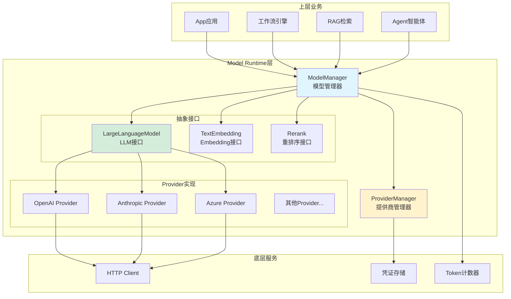

### 1.2 架构说明

**分层职责**：

1. **接口层**（Interface Layer）
   - 定义统一的模型调用接口
   - 提供类型定义和规范
   - 确保不同Provider实现一致的行为

2. **管理层**（Manager Layer）
   - ModelManager：负责模型实例的创建和管理
   - ProviderManager：负责Provider的注册和配置
   - CredentialManager：负责凭证的存储和验证

3. **实现层**（Provider Layer）
   - 各个LLM提供商的具体实现
   - 处理API调用细节
   - 错误转换和重试逻辑

4. **工具层**（Utility Layer）
   - HTTP Client：统一的HTTP请求处理
   - Token Counter：Token计数和限制
   - 缓存：响应缓存（可选）

---

## 二、核心类设计

### 2.1 类图

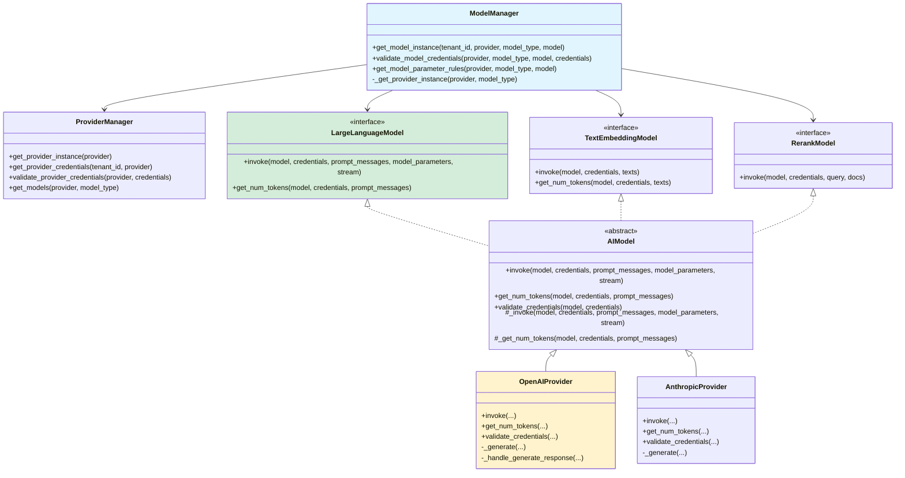

### 2.2 核心类说明

#### ModelManager（模型管理器）

**职责**：
- 创建和管理模型实例
- 验证模型配置
- 提供统一的模型调用入口

**核心方法**：
```python
class ModelManager:
    def get_model_instance(
        self,
        tenant_id: str,
        provider: str,
        model_type: ModelType,
        model: str
    ) -> AIModel:
        """
        获取模型实例
        
        参数:
            tenant_id: 租户ID
            provider: 提供商名称（openai, anthropic等）
            model_type: 模型类型（llm, text-embedding等）
            model: 模型名称（gpt-4, claude-3-opus等）
        
        返回:
            AIModel实例
        """
        # 1. 获取凭证
        credentials = ProviderManager.get_provider_credentials(
            tenant_id, provider
        )
        
        # 2. 获取Provider实例
        provider_instance = self._get_provider_instance(provider, model_type)
        
        # 3. 验证凭证
        provider_instance.validate_credentials(model, credentials)
        
        # 4. 返回配置好的实例
        return provider_instance
```

---

#### AIModel（模型基类）

**职责**：
- 定义统一的模型接口
- 提供通用的错误处理
- 实现Token计数

**核心方法**：
```python
class AIModel(ABC):
    @abstractmethod
    def _invoke(
        self,
        model: str,
        credentials: dict,
        prompt_messages: list[PromptMessage],
        model_parameters: dict,
        stream: bool
    ) -> Union[LLMResult, Generator]:
        """
        调用模型（子类实现）
        
        参数:
            model: 模型名称
            credentials: 凭证字典
            prompt_messages: 提示消息列表
            model_parameters: 模型参数
            stream: 是否流式返回
        
        返回:
            LLMResult或Generator
        """
        pass
    
    def invoke(
        self,
        model: str,
        credentials: dict,
        prompt_messages: list[PromptMessage],
        model_parameters: dict,
        stream: bool = True
    ) -> Union[LLMResult, Generator]:
        """
        调用模型（公开方法，包含错误处理）
        """
        try:
            # 1. 验证参数
            self._validate_parameters(model_parameters)
            
            # 2. 调用具体实现
            result = self._invoke(
                model, credentials, prompt_messages,
                model_parameters, stream
            )
            
            return result
            
        except Exception as e:
            # 3. 错误转换
            raise self._transform_error(e)
    
    @abstractmethod
    def get_num_tokens(
        self,
        model: str,
        credentials: dict,
        prompt_messages: list[PromptMessage]
    ) -> int:
        """
        计算Token数量
        """
        pass
```

---

#### LargeLanguageModel（LLM接口）

**接口定义**：
```python
class LargeLanguageModel(AIModel):
    """LLM模型接口"""
    
    model_type: ModelType = ModelType.LLM
    
    def invoke(
        self,
        model: str,
        credentials: dict,
        prompt_messages: list[PromptMessage],
        model_parameters: dict,
        stream: bool = True,
        user: Optional[str] = None
    ) -> Union[LLMResult, Generator]:
        """
        调用LLM模型
        
        参数:
            model: 模型名称
            credentials: 凭证
            prompt_messages: 消息列表
            model_parameters: 参数（temperature, top_p等）
            stream: 是否流式
            user: 用户标识（用于追踪）
        
        返回:
            LLMResult: 阻塞模式返回完整结果
            Generator: 流式模式返回生成器
        """
        pass
```

**PromptMessage类型**：
```python
class PromptMessage(BaseModel):
    role: PromptMessageRole  # system, user, assistant, tool
    content: Union[str, list]
    name: Optional[str] = None
    tool_calls: Optional[list] = None

class PromptMessageRole(str, Enum):
    SYSTEM = 'system'
    USER = 'user'
    ASSISTANT = 'assistant'
    TOOL = 'tool'
```

**LLMResult结构**：
```python
class LLMResult(BaseModel):
    model: str
    prompt_messages: list[PromptMessage]
    message: AssistantPromptMessage
    usage: LLMUsage
    system_fingerprint: Optional[str] = None

class LLMUsage(BaseModel):
    prompt_tokens: int
    prompt_unit_price: Decimal
    prompt_price_unit: Decimal
    prompt_price: Decimal
    completion_tokens: int
    completion_unit_price: Decimal
    completion_price_unit: Decimal
    completion_price: Decimal
    total_tokens: int
    total_price: Decimal
    currency: str
    latency: float
```

---

## 三、Provider实现示例

### 3.1 OpenAI Provider

**核心实现**：
```python
class OpenAILargeLanguageModel(LargeLanguageModel):
    """OpenAI LLM实现"""
    
    def _invoke(
        self,
        model: str,
        credentials: dict,
        prompt_messages: list[PromptMessage],
        model_parameters: dict,
        stream: bool
    ) -> Union[LLMResult, Generator]:
        """
        调用OpenAI API
        """
        # 1. 构建请求参数
        api_key = credentials.get('openai_api_key')
        base_url = credentials.get('openai_api_base', 'https://api.openai.com/v1')
        
        client = openai.OpenAI(api_key=api_key, base_url=base_url)
        
        # 2. 转换消息格式
        openai_messages = self._convert_messages(prompt_messages)
        
        # 3. 构建参数
        params = {
            'model': model,
            'messages': openai_messages,
            'temperature': model_parameters.get('temperature', 0.7),
            'top_p': model_parameters.get('top_p', 1.0),
            'max_tokens': model_parameters.get('max_tokens'),
            'stream': stream,
        }
        
        # 4. 调用API
        if stream:
            return self._handle_stream_response(
                client.chat.completions.create(**params)
            )
        else:
            return self._handle_sync_response(
                client.chat.completions.create(**params)
            )
    
    def _handle_stream_response(
        self,
        response: Iterator
    ) -> Generator:
        """
        处理流式响应
        """
        for chunk in response:
            if chunk.choices:
                delta = chunk.choices[0].delta
                if delta.content:
                    yield LLMResultChunk(
                        model=chunk.model,
                        prompt_messages=[],
                        system_fingerprint=chunk.system_fingerprint,
                        delta=LLMResultChunkDelta(
                            index=0,
                            message=AssistantPromptMessage(
                                content=delta.content
                            )
                        )
                    )
    
    def _handle_sync_response(
        self,
        response: ChatCompletion
    ) -> LLMResult:
        """
        处理同步响应
        """
        choice = response.choices[0]
        message = choice.message
        
        # 计算Token使用和成本
        usage = self._calc_usage(response.usage, response.model)
        
        return LLMResult(
            model=response.model,
            prompt_messages=[],
            message=AssistantPromptMessage(
                content=message.content,
                tool_calls=message.tool_calls
            ),
            usage=usage,
            system_fingerprint=response.system_fingerprint
        )
    
    def get_num_tokens(
        self,
        model: str,
        credentials: dict,
        prompt_messages: list[PromptMessage]
    ) -> int:
        """
        计算Token数量（使用tiktoken）
        """
        encoding = tiktoken.encoding_for_model(model)
        
        tokens = 0
        for message in prompt_messages:
            # 每条消息的固定开销
            tokens += 4
            
            # 消息内容
            if isinstance(message.content, str):
                tokens += len(encoding.encode(message.content))
            elif isinstance(message.content, list):
                for item in message.content:
                    if item['type'] == 'text':
                        tokens += len(encoding.encode(item['text']))
                    elif item['type'] == 'image_url':
                        # 图片Token计算（根据分辨率）
                        tokens += self._calc_image_tokens(item['image_url'])
        
        # 回复的固定开销
        tokens += 2
        
        return tokens
```

---

### 3.2 Anthropic Provider

**核心实现**：
```python
class AnthropicLargeLanguageModel(LargeLanguageModel):
    """Anthropic (Claude) LLM实现"""
    
    def _invoke(
        self,
        model: str,
        credentials: dict,
        prompt_messages: list[PromptMessage],
        model_parameters: dict,
        stream: bool
    ) -> Union[LLMResult, Generator]:
        """
        调用Anthropic API
        """
        # 1. 初始化客户端
        api_key = credentials.get('anthropic_api_key')
        client = anthropic.Anthropic(api_key=api_key)
        
        # 2. 提取system消息
        system_message, messages = self._extract_system_message(prompt_messages)
        
        # 3. 转换消息格式
        anthropic_messages = self._convert_messages(messages)
        
        # 4. 构建参数
        params = {
            'model': model,
            'messages': anthropic_messages,
            'max_tokens': model_parameters.get('max_tokens', 4096),
            'temperature': model_parameters.get('temperature', 0.7),
            'stream': stream,
        }
        
        if system_message:
            params['system'] = system_message
        
        # 5. 调用API
        if stream:
            return self._handle_stream_response(
                client.messages.create(**params)
            )
        else:
            return self._handle_sync_response(
                client.messages.create(**params)
            )
    
    def _extract_system_message(
        self,
        messages: list[PromptMessage]
    ) -> tuple[Optional[str], list[PromptMessage]]:
        """
        提取system消息（Anthropic特殊处理）
        """
        system_content = None
        user_messages = []
        
        for msg in messages:
            if msg.role == PromptMessageRole.SYSTEM:
                system_content = msg.content
            else:
                user_messages.append(msg)
        
        return system_content, user_messages
    
    def get_num_tokens(
        self,
        model: str,
        credentials: dict,
        prompt_messages: list[PromptMessage]
    ) -> int:
        """
        计算Token数量（Anthropic方式）
        """
        # Anthropic使用不同的tokenizer
        client = anthropic.Anthropic(api_key=credentials.get('anthropic_api_key'))
        
        # 转换消息
        system, messages = self._extract_system_message(prompt_messages)
        anthropic_messages = self._convert_messages(messages)
        
        # 调用count_tokens API
        result = client.messages.count_tokens(
            model=model,
            messages=anthropic_messages,
            system=system
        )
        
        return result.input_tokens
```

---

## 四、调用流程

### 4.1 完整调用时序图

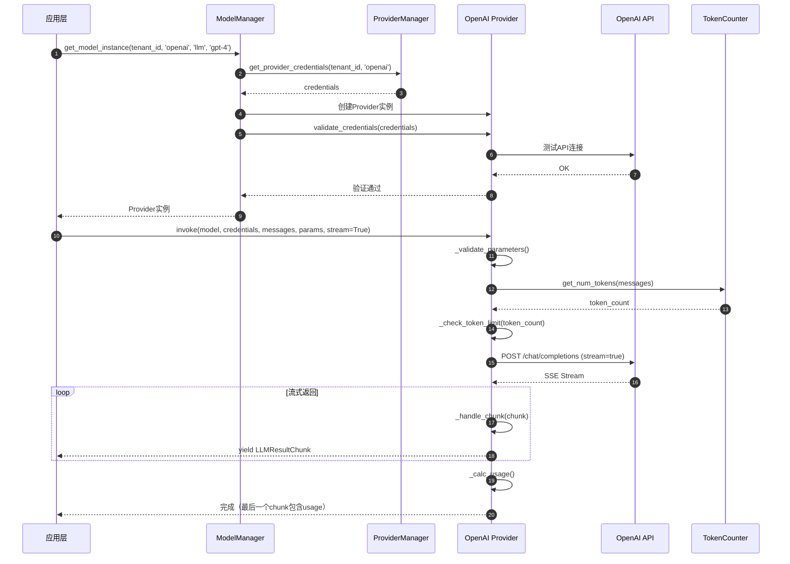

### 4.2 流程说明

**阶段1：模型实例获取**（步骤1-7）
- 从配置中获取提供商凭证
- 创建Provider实例
- 验证凭证有效性
- 返回可用的模型实例

**阶段2：参数验证**（步骤8-11）
- 验证模型参数合法性
- 计算输入Token数量
- 检查Token限制

**阶段3：API调用**（步骤12-13）
- 构建HTTP请求
- 发送到LLM API
- 建立SSE连接（流式）

**阶段4：响应处理**（步骤14-16）
- 解析流式响应
- 转换为统一格式
- 计算Token使用和成本

---

## 五、错误处理

### 5.1 错误类型

```python
class ModelError(Exception):
    """模型相关错误基类"""
    pass

class CredentialsValidateFailedError(ModelError):
    """凭证验证失败"""
    pass

class InvokeError(ModelError):
    """模型调用错误"""
    pass

class InvokeRateLimitError(InvokeError):
    """速率限制错误"""
    pass

class InvokeAuthorizationError(InvokeError):
    """认证错误"""
    pass

class InvokeConnectionError(InvokeError):
    """连接错误"""
    pass

class InvokeServerUnavailableError(InvokeError):
    """服务不可用"""
    pass

class InvokeBadRequestError(InvokeError):
    """请求错误"""
    pass
```

### 5.2 错误转换

```python
def _transform_error(self, error: Exception) -> ModelError:
    """
    将Provider特定错误转换为统一错误
    """
    if isinstance(error, openai.RateLimitError):
        return InvokeRateLimitError(str(error))
    
    elif isinstance(error, openai.AuthenticationError):
        return InvokeAuthorizationError(str(error))
    
    elif isinstance(error, openai.APIConnectionError):
        return InvokeConnectionError(str(error))
    
    elif isinstance(error, openai.APIError):
        if error.status_code >= 500:
            return InvokeServerUnavailableError(str(error))
        else:
            return InvokeBadRequestError(str(error))
    
    else:
        return InvokeError(str(error))
```

### 5.3 重试机制

```python
from tenacity import retry, stop_after_attempt, wait_exponential

@retry(
    stop=stop_after_attempt(3),
    wait=wait_exponential(multiplier=1, min=4, max=10),
    retry=retry_if_exception_type(InvokeServerUnavailableError)
)
def invoke_with_retry(
    self,
    model: str,
    credentials: dict,
    prompt_messages: list[PromptMessage],
    model_parameters: dict,
    stream: bool
) -> Union[LLMResult, Generator]:
    """
    带重试的调用
    
    重试策略：
    - 仅对服务器错误（5xx）重试
    - 最多重试3次
    - 指数退避：4秒、8秒、10秒
    """
    return self._invoke(model, credentials, prompt_messages, model_parameters, stream)
```

---

## 六、性能优化

### 6.1 Token计数缓存

```python
from functools import lru_cache

class TokenCounter:
    @lru_cache(maxsize=1000)
    def count_tokens(
        self,
        model: str,
        text: str
    ) -> int:
        """
        计算Token数量（带缓存）
        
        缓存策略：
        - LRU缓存，最多1000条
        - 缓存键：(model, text)
        - 适用于重复文本的场景
        """
        encoding = tiktoken.encoding_for_model(model)
        return len(encoding.encode(text))
```

### 6.2 连接池

```python
import httpx

class HTTPClient:
    def __init__(self):
        # 使用连接池复用连接
        self.client = httpx.AsyncClient(
            timeout=60.0,
            limits=httpx.Limits(
                max_keepalive_connections=20,
                max_connections=100
            )
        )
    
    async def post(self, url: str, **kwargs):
        """
        POST请求（复用连接）
        """
        return await self.client.post(url, **kwargs)
```

### 6.3 批量调用

```python
async def batch_invoke(
    self,
    requests: list[dict]
) -> list[LLMResult]:
    """
    批量调用（并发）
    
    示例:
        requests = [
            {'model': 'gpt-4', 'messages': [...]},
            {'model': 'gpt-4', 'messages': [...]},
            ...
        ]
    """
    tasks = [
        self._invoke_async(**request)
        for request in requests
    ]
    
    results = await asyncio.gather(*tasks, return_exceptions=True)
    return results
```

---

## 七、最佳实践

### 7.1 选择合适的模型

```python
def select_model(task_type: str, complexity: str) -> str:
    """
    根据任务选择合适的模型
    
    参数:
        task_type: 任务类型（chat, completion, embedding）
        complexity: 复杂度（simple, medium, complex）
    
    返回:
        模型名称
    """
    if task_type == 'chat':
        if complexity == 'simple':
            return 'gpt-3.5-turbo'  # 快速、便宜
        elif complexity == 'medium':
            return 'gpt-4'          # 平衡
        else:
            return 'gpt-4-turbo'    # 强大、昂贵
    
    elif task_type == 'embedding':
        return 'text-embedding-3-small'  # 性价比高
    
    elif task_type == 'rerank':
        return 'jina-reranker-v1-base-en'
```

### 7.2 控制成本

```python
def estimate_cost(
    model: str,
    input_tokens: int,
    output_tokens: int
) -> Decimal:
    """
    估算成本
    
    价格表（示例，实际价格请参考官网）:
    - gpt-3.5-turbo: $0.0005 / 1K input, $0.0015 / 1K output
    - gpt-4: $0.03 / 1K input, $0.06 / 1K output
    - gpt-4-turbo: $0.01 / 1K input, $0.03 / 1K output
    """
    prices = {
        'gpt-3.5-turbo': {'input': 0.0005, 'output': 0.0015},
        'gpt-4': {'input': 0.03, 'output': 0.06},
        'gpt-4-turbo': {'input': 0.01, 'output': 0.03},
    }
    
    price = prices.get(model, {'input': 0, 'output': 0})
    
    input_cost = Decimal(input_tokens / 1000) * Decimal(price['input'])
    output_cost = Decimal(output_tokens / 1000) * Decimal(price['output'])
    
    return input_cost + output_cost
```

### 7.3 监控和日志

```python
import logging
from prometheus_client import Counter, Histogram

# Prometheus指标
model_invocation_counter = Counter(
    'model_invocation_total',
    'Total model invocations',
    ['provider', 'model', 'status']
)

model_invocation_duration = Histogram(
    'model_invocation_duration_seconds',
    'Model invocation duration',
    ['provider', 'model']
)

def invoke_with_monitoring(
    self,
    model: str,
    credentials: dict,
    prompt_messages: list[PromptMessage],
    model_parameters: dict,
    stream: bool
) -> Union[LLMResult, Generator]:
    """
    带监控的调用
    """
    start_time = time.time()
    provider = self.__class__.__name__
    
    try:
        result = self._invoke(
            model, credentials, prompt_messages,
            model_parameters, stream
        )
        
        # 记录成功
        model_invocation_counter.labels(
            provider=provider,
            model=model,
            status='success'
        ).inc()
        
        # 记录耗时
        duration = time.time() - start_time
        model_invocation_duration.labels(
            provider=provider,
            model=model
        ).observe(duration)
        
        # 记录日志
        logging.info(
            f"Model invocation successful: {provider}/{model}, "
            f"duration: {duration:.2f}s, "
            f"tokens: {result.usage.total_tokens if hasattr(result, 'usage') else 'N/A'}"
        )
        
        return result
        
    except Exception as e:
        # 记录失败
        model_invocation_counter.labels(
            provider=provider,
            model=model,
            status='error'
        ).inc()
        
        # 记录错误日志
        logging.error(
            f"Model invocation failed: {provider}/{model}, "
            f"error: {str(e)}"
        )
        
        raise
```

---

## 八、扩展新Provider

### 8.1 实现步骤

1. **创建Provider类**
```python
from core.model_runtime.model_providers.__base.large_language_model import LargeLanguageModel

class MyCustomLLM(LargeLanguageModel):
    def _invoke(self, ...):
        # 实现调用逻辑
        pass
    
    def get_num_tokens(self, ...):
        # 实现Token计数
        pass
    
    def validate_credentials(self, ...):
        # 实现凭证验证
        pass
```

2. **配置Provider元数据**
```yaml
# provider.yaml
provider: my_custom_provider
label:
  en_US: My Custom Provider
  zh_Hans: 我的自定义提供商
description:
  en_US: Custom LLM provider
  zh_Hans: 自定义LLM提供商
icon_small: ...
icon_large: ...
supported_model_types:
  - llm
configurate_methods:
  - predefined-model
provider_credential_schema:
  credential_form_schemas:
    - variable: api_key
      label:
        en_US: API Key
      type: secret-input
      required: true
```

3. **注册Provider**
```python
# __init__.py
from core.model_runtime.model_providers.my_custom_provider import MyCustomLLM

__all__ = ['MyCustomLLM']
```

---

## 附录

### A. 支持的Provider列表

| Provider | LLM | Embedding | Rerank | Speech2Text | Text2Speech |
|----------|-----|-----------|--------|-------------|-------------|
| OpenAI | ✅ | ✅ | ❌ | ✅ | ✅ |
| Anthropic | ✅ | ❌ | ❌ | ❌ | ❌ |
| Azure OpenAI | ✅ | ✅ | ❌ | ✅ | ✅ |
| Google | ✅ | ✅ | ❌ | ❌ | ❌ |
| AWS Bedrock | ✅ | ✅ | ❌ | ❌ | ❌ |
| HuggingFace | ✅ | ✅ | ❌ | ❌ | ❌ |
| 百度文心 | ✅ | ✅ | ✅ | ✅ | ✅ |
| 阿里通义 | ✅ | ✅ | ❌ | ❌ | ❌ |
| ... | ... | ... | ... | ... | ... |

### B. 常见问题

**Q: 如何切换模型提供商？**
A: 在应用配置中选择不同的Provider和Model即可，无需修改代码。

**Q: Token计数为什么不准确？**
A: 不同Provider使用不同的Tokenizer，存在差异。建议使用各Provider的官方Token计数方法。

**Q: 如何处理速率限制？**
A: 实现指数退避重试机制，或使用多个API Key轮询。

**Q: 流式和阻塞模式如何选择？**
A: 用户交互场景使用流式（实时反馈），批量处理使用阻塞模式（简单）。

---

**文档版本**：v1.0  
**生成日期**：2025-10-04  
**维护者**：Backend Team

---

## 摘要

本文档展示 Model Runtime 模块的典型调用场景时序图，包括LLM调用、Embedding调用、工具调用等。

---

## 一、LLM流式调用时序图

### 1.1 完整流程

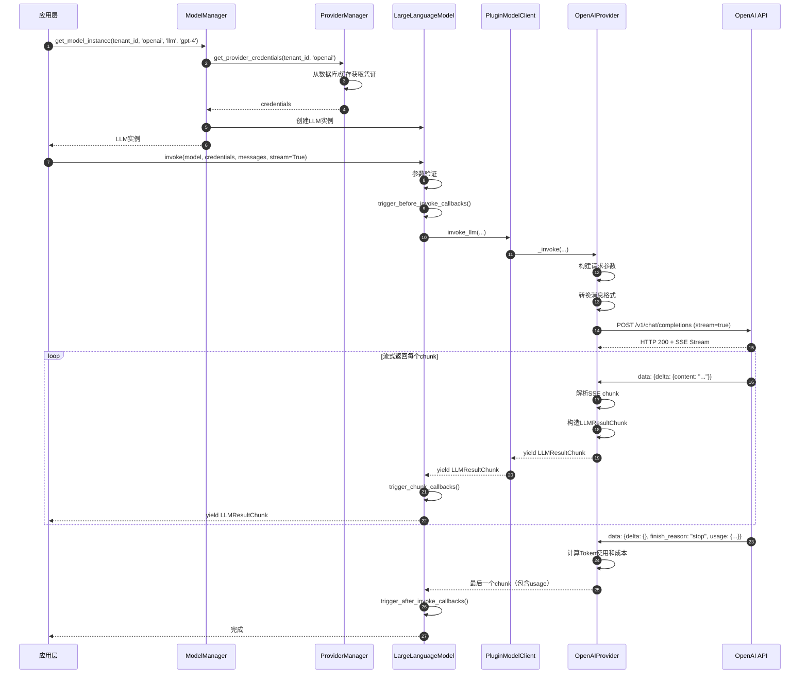

### 1.2 时序说明

**阶段1：模型实例获取**（步骤1-6）
- 应用层请求获取模型实例
- ModelManager从ProviderManager获取凭证
- ProviderManager从数据库/缓存读取Provider凭证
- 创建并返回配置好的LLM实例

**阶段2：参数准备**（步骤7-10）
- 验证参数合法性（temperature范围、max_tokens等）
- 触发before_invoke回调（用于日志、监控等）
- 通过Plugin层调用具体Provider实现

**阶段3：API调用**（步骤11-15）
- Provider构建符合OpenAI格式的请求参数
- 转换消息格式（Dify格式→OpenAI格式）
- 发送HTTP POST请求到OpenAI API
- 建立SSE流式连接

**阶段4：流式返回**（步骤16-22）
- 接收每个SSE chunk
- 解析JSON数据
- 构造统一的LLMResultChunk
- 逐层向上返回（Provider→Plugin→LLM→App）
- 触发chunk级别的回调

**阶段5：完成处理**（步骤23-26）
- 接收最后一个chunk（包含usage数据）
- 计算Token使用量和成本
- 触发after_invoke回调
- 完成整个调用流程

---

## 二、LLM阻塞调用时序图

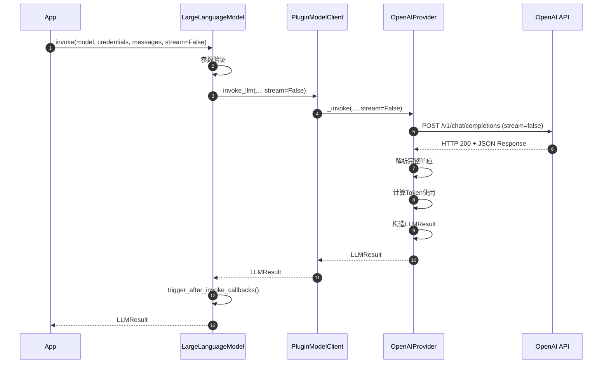

### 2.1 与流式调用的区别

| 维度 | 流式调用 | 阻塞调用 |
|------|---------|---------|
| **返回类型** | Generator[LLMResultChunk] | LLMResult |
| **用户体验** | 实时显示 | 等待完整结果 |
| **适用场景** | 对话交互 | 批量处理 |
| **延迟感知** | 低（首Token延迟） | 高（总延迟） |
| **实现复杂度** | 高（需处理流） | 低（简单） |

---

## 三、Function Calling时序图

### 3.1 完整流程

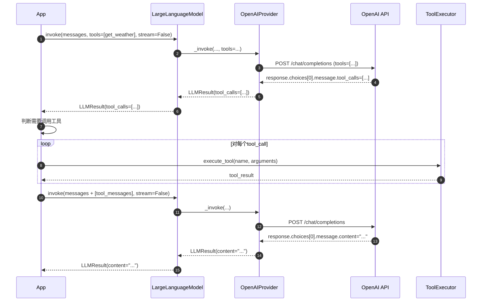

### 3.2 消息序列

```
第一轮：
User: "What's the weather in Boston?"

第一次API调用：
Assistant: tool_calls=[{name: "get_current_weather", arguments: {"location": "Boston"}}]

工具执行：
Tool: {"temperature": 72, "condition": "sunny"}

第二轮（追加消息）：
Tool: content='{"temperature": 72, "condition": "sunny"}', tool_call_id="call_abc"

第二次API调用：
Assistant: "The weather in Boston is sunny and 72°F."
```

---

## 四、Embedding批量调用时序图

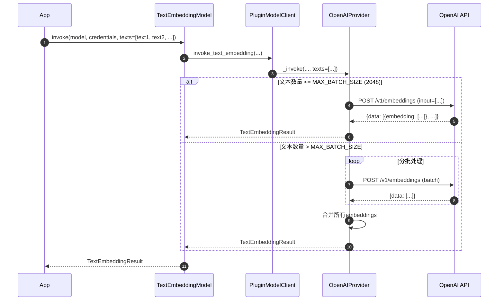

### 4.1 批量优化说明

**批量大小限制**：
- OpenAI：最多2048个文本
- 其他Provider：根据具体限制

**并发处理**（可选）：
```python
async def batch_embed_concurrent(texts: list[str]):
    chunks = [texts[i:i+2048] for i in range(0, len(texts), 2048)]
    
    tasks = [
        embed_async(chunk)
        for chunk in chunks
    ]
    
    results = await asyncio.gather(*tasks)
    return combine_results(results)
```

---

## 五、Rerank调用时序图

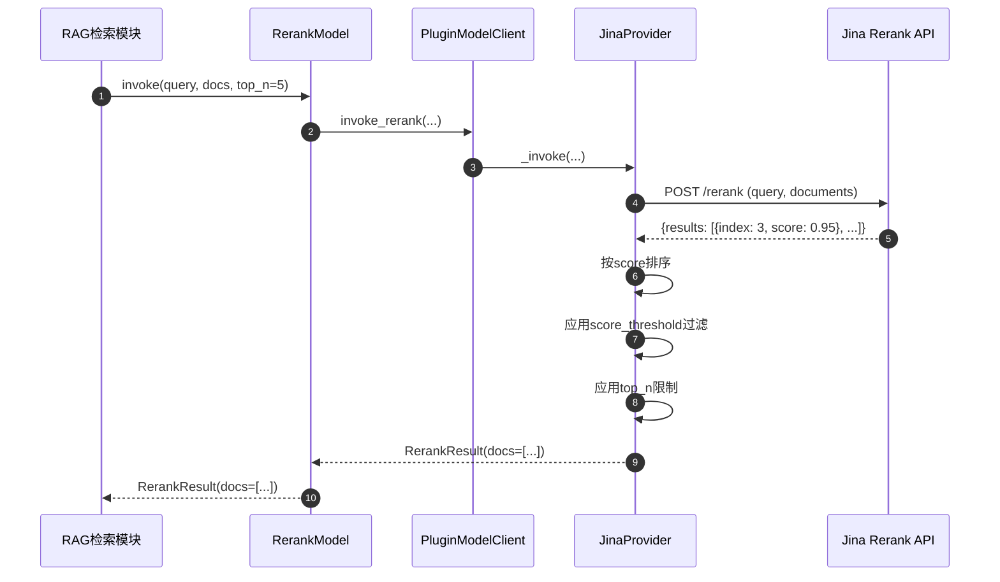

### 5.1 Rerank流程说明

**输入**：
- query：查询文本
- docs：候选文档列表（通常来自向量检索）
- score_threshold：分数阈值（可选）
- top_n：返回Top N（可选）

**处理**：
1. 调用Rerank API计算相关性分数
2. 按分数降序排序
3. 过滤低于阈值的文档
4. 返回Top N结果

**输出**：
```python
RerankResult(
    model="jina-reranker-v1",
    docs=[
        RerankDocument(index=3, text="...", score=0.95),
        RerankDocument(index=1, text="...", score=0.87),
        RerankDocument(index=5, text="...", score=0.76),
        ...
    ]
)
```

---

## 六、凭证验证时序图

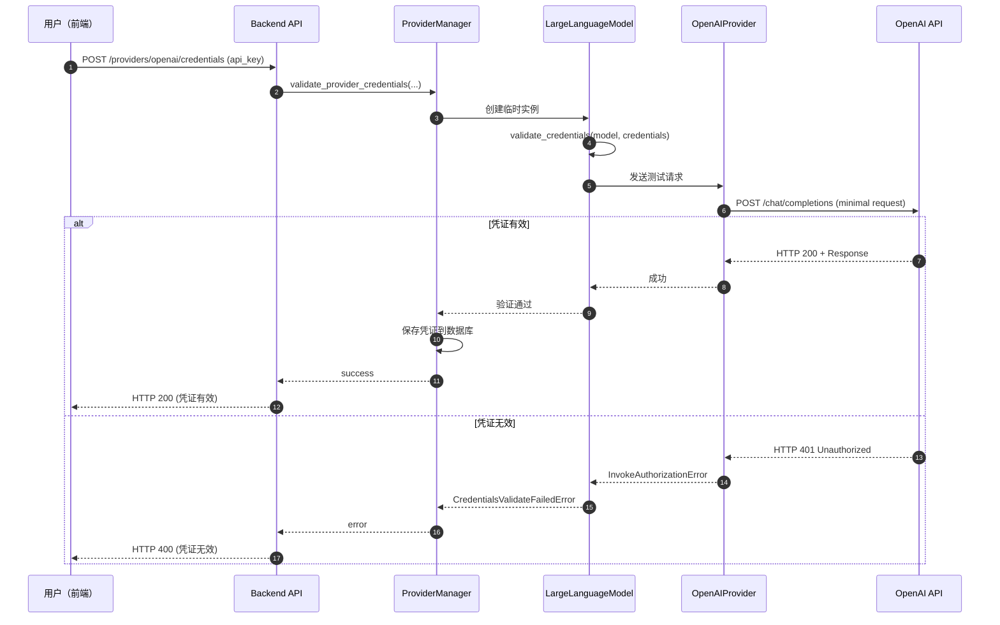

### 6.1 验证策略

**测试请求最小化**：
```python
# 最小化测试请求，降低成本
test_request = {
    'model': 'gpt-3.5-turbo',  # 使用最便宜的模型
    'messages': [{'role': 'user', 'content': 'ping'}],
    'max_tokens': 5,           # 最少输出
}
```

**超时设置**：
```python
# 设置较短超时，避免长时间等待
timeout = 10  # 10秒超时
```

---

## 七、错误重试时序图

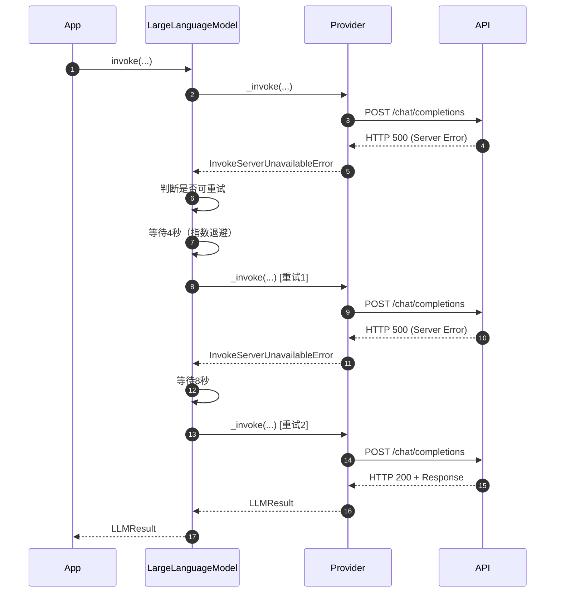

### 7.1 重试策略

**可重试的错误**：
- `InvokeServerUnavailableError`（5xx）
- `InvokeConnectionError`（网络错误）
- `InvokeRateLimitError`（可选，等待后重试）

**不可重试的错误**：
- `InvokeAuthorizationError`（凭证错误）
- `InvokeBadRequestError`（参数错误）

**指数退避**：
```python
@retry(
    stop=stop_after_attempt(3),
    wait=wait_exponential(multiplier=1, min=4, max=10)
)
def invoke_with_retry(...):
    return self.invoke(...)
```

**重试次数**：3次  
**等待时间**：4秒、8秒、10秒（指数增长，但不超过10秒）

---

## 八、性能数据

### 8.1 典型延迟

| 场景 | P50 | P95 | P99 |
|------|-----|-----|-----|
| **LLM流式（首Token）** | 0.8s | 1.5s | 2.5s |
| **LLM流式（总时长）** | 3.5s | 8.0s | 15s |
| **LLM阻塞** | 4.0s | 9.0s | 16s |
| **Embedding（1文本）** | 0.3s | 0.6s | 1.2s |
| **Embedding（批量100）** | 1.5s | 3.0s | 5.0s |
| **Rerank（10文档）** | 0.5s | 1.0s | 2.0s |
| **凭证验证** | 1.0s | 2.0s | 4.0s |

### 8.2 吞吐量

| Provider | RPM（Tier 1） | TPM（Tier 1） | 并发限制 |
|----------|--------------|--------------|----------|
| **OpenAI** | 500 | 30,000 | 100 |
| **Anthropic** | 50 | 40,000 | 5 |
| **Azure OpenAI** | 120 | 120,000 | 20 |

---

## 附录

### A. 关键性能指标

**TTFT（Time To First Token）**：
- 流式调用首个Token返回时间
- 用户感知延迟的关键指标
- 优化目标：< 1秒

**Throughput（吞吐量）**：
- Tokens per Second（TPS）
- 并发请求数（RPS）
- 批量处理能力

**Cost Efficiency（成本效率）**：
- Cost per 1K tokens
- Cache命中率（减少重复调用）
- 批量优化（Embedding）

---

**文档版本**：v1.0  
**生成日期**：2025-10-04  
**维护者**：Backend Team

---

## 摘要

本文档详细说明 Model Runtime 模块的核心数据结构，包括消息实体、模型实体、结果实体等。

---

## 一、核心数据结构概览

### 1.1 类图

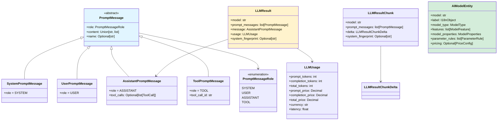

---

## 二、消息实体（Message Entities）

### 2.1 PromptMessage（消息基类）

**定义**：
```python
class PromptMessage(BaseModel):
    """提示消息基类"""
    
    role: PromptMessageRole                    # 消息角色
    content: Union[str, list[PromptMessageContent]] # 消息内容
    name: Optional[str] = None                 # 消息名称（可选）
    
    model_config = ConfigDict(protected_namespaces=())
```

**字段说明**：

| 字段 | 类型 | 必填 | 说明 |
|------|------|------|------|
| `role` | PromptMessageRole | ✅ | 消息角色（system/user/assistant/tool） |
| `content` | str \| list | ✅ | 消息内容（文本或多模态列表） |
| `name` | str | ❌ | 消息名称（用于多轮对话标识） |

**PromptMessageRole枚举**：
```python
class PromptMessageRole(str, Enum):
    SYSTEM = 'system'        # 系统提示
    USER = 'user'            # 用户输入
    ASSISTANT = 'assistant'  # 助手回复
    TOOL = 'tool'            # 工具调用结果
```

---

### 2.2 SystemPromptMessage（系统消息）

**定义**：
```python
class SystemPromptMessage(PromptMessage):
    """系统提示消息"""
    
    role: PromptMessageRole = PromptMessageRole.SYSTEM
    content: str  # 系统消息仅支持文本
```

**示例**：
```python
system_msg = SystemPromptMessage(
    content="You are a helpful assistant. Answer questions clearly and concisely."
)
```

**约束**：
- 系统消息仅支持纯文本内容
- 通常位于消息列表的第一条
- 某些Provider（如Anthropic）需要特殊处理

---

### 2.3 UserPromptMessage（用户消息）

**定义**：
```python
class UserPromptMessage(PromptMessage):
    """用户输入消息"""
    
    role: PromptMessageRole = PromptMessageRole.USER
    content: Union[str, list[PromptMessageContent]]  # 支持多模态
```

**PromptMessageContent类型**：
```python
class PromptMessageContent(BaseModel):
    """消息内容（多模态）"""
    type: PromptMessageContentType  # text, image_url, file
    data: Union[str, dict]          # 内容数据

class PromptMessageContentType(str, Enum):
    TEXT = 'text'
    IMAGE_URL = 'image_url'
    FILE = 'file'
```

**示例**：

纯文本：
```python
user_msg = UserPromptMessage(
    content="What is the capital of France?"
)
```

多模态（文本+图片）：
```python
user_msg = UserPromptMessage(
    content=[
        PromptMessageContent(
            type=PromptMessageContentType.TEXT,
            data="What's in this image?"
        ),
        PromptMessageContent(
            type=PromptMessageContentType.IMAGE_URL,
            data={
                'url': 'https://example.com/image.jpg',
                'detail': 'high'  # low, high, auto
            }
        )
    ]
)
```

---

### 2.4 AssistantPromptMessage（助手消息）

**定义**：
```python
class AssistantPromptMessage(PromptMessage):
    """助手回复消息"""
    
    role: PromptMessageRole = PromptMessageRole.ASSISTANT
    content: Union[str, list[PromptMessageContent]]  # 回复内容
    tool_calls: Optional[list[ToolCall]] = None      # 工具调用列表
    
    class ToolCall(BaseModel):
        """工具调用"""
        id: str                              # 调用ID
        type: str = 'function'               # 调用类型
        function: ToolCallFunction           # 函数信息
    
    class ToolCallFunction(BaseModel):
        """工具调用函数"""
        name: str                            # 函数名
        arguments: str                       # 参数（JSON字符串）
```

**字段说明**：

| 字段 | 类型 | 必填 | 说明 |
|------|------|------|------|
| `content` | str \| list | ✅ | 回复内容 |
| `tool_calls` | list[ToolCall] | ❌ | 工具调用列表（Function Calling） |

**示例**：

纯文本回复：
```python
assistant_msg = AssistantPromptMessage(
    content="The capital of France is Paris."
)
```

Function Calling：
```python
assistant_msg = AssistantPromptMessage(
    content="",  # 或None
    tool_calls=[
        AssistantPromptMessage.ToolCall(
            id="call_abc123",
            type="function",
            function=AssistantPromptMessage.ToolCallFunction(
                name="get_current_weather",
                arguments='{"location": "Boston, MA"}'
            )
        )
    ]
)
```

---

### 2.5 ToolPromptMessage（工具消息）

**定义**：
```python
class ToolPromptMessage(PromptMessage):
    """工具调用结果消息"""
    
    role: PromptMessageRole = PromptMessageRole.TOOL
    content: str                  # 工具返回结果
    tool_call_id: str             # 对应的tool_call ID
    name: Optional[str] = None    # 工具名称
```

**示例**：
```python
tool_msg = ToolPromptMessage(
    content='{"temperature": 72, "unit": "fahrenheit", "description": "Sunny"}',
    tool_call_id="call_abc123",
    name="get_current_weather"
)
```

**使用流程**：
```
1. User: "What's the weather in Boston?"
2. Assistant: tool_calls=[{name: "get_current_weather", ...}]
3. Tool: ToolPromptMessage(content=weather_data, tool_call_id="...")
4. Assistant: "The weather in Boston is sunny and 72°F."
```

---

## 三、结果实体（Result Entities）

### 3.1 LLMResult（LLM结果）

**定义**：
```python
class LLMResult(BaseModel):
    """LLM调用完整结果（阻塞模式）"""
    
    model: str                                  # 模型名称
    prompt_messages: list[PromptMessage]        # 输入消息
    message: AssistantPromptMessage             # 回复消息
    usage: LLMUsage                             # Token使用统计
    system_fingerprint: Optional[str] = None    # 系统指纹
```

**字段说明**：

| 字段 | 类型 | 说明 |
|------|------|------|
| `model` | str | 实际使用的模型名称 |
| `prompt_messages` | list[PromptMessage] | 原始输入消息列表 |
| `message` | AssistantPromptMessage | 助手的完整回复 |
| `usage` | LLMUsage | Token使用和成本统计 |
| `system_fingerprint` | str | 系统指纹（用于识别后端版本） |

---

### 3.2 LLMResultChunk（LLM流式结果）

**定义**：
```python
class LLMResultChunk(BaseModel):
    """LLM流式结果块"""
    
    model: str                                  # 模型名称
    prompt_messages: list[PromptMessage]        # 输入消息
    delta: LLMResultChunkDelta                  # 增量数据
    system_fingerprint: Optional[str] = None    # 系统指纹

class LLMResultChunkDelta(BaseModel):
    """增量数据"""
    
    index: int                                  # Chunk索引
    message: AssistantPromptMessage             # 增量消息
    usage: Optional[LLMUsage] = None            # Token使用（最后一个chunk）
    finish_reason: Optional[str] = None         # 完成原因
```

**finish_reason说明**：
- `stop`：自然结束
- `length`：达到max_tokens限制
- `tool_calls`：需要调用工具
- `content_filter`：被内容过滤拦截

**流式示例**：
```python
# Chunk 1
LLMResultChunk(
    model="gpt-4",
    delta=LLMResultChunkDelta(
        index=0,
        message=AssistantPromptMessage(content="The")
    )
)

# Chunk 2
LLMResultChunk(
    model="gpt-4",
    delta=LLMResultChunkDelta(
        index=1,
        message=AssistantPromptMessage(content=" capital")
    )
)

# ...

# 最后一个Chunk
LLMResultChunk(
    model="gpt-4",
    delta=LLMResultChunkDelta(
        index=42,
        message=AssistantPromptMessage(content=""),
        usage=LLMUsage(...),
        finish_reason="stop"
    )
)
```

---

### 3.3 LLMUsage（Token使用统计）

**定义**：
```python
class LLMUsage(BaseModel):
    """Token使用和成本统计"""
    
    # Token统计
    prompt_tokens: int                    # 输入Token数
    prompt_unit_price: Decimal            # 输入单价
    prompt_price_unit: Decimal            # 输入计价单位
    prompt_price: Decimal                 # 输入成本
    
    completion_tokens: int                # 输出Token数
    completion_unit_price: Decimal        # 输出单价
    completion_price_unit: Decimal        # 输出计价单位
    completion_price: Decimal             # 输出成本
    
    total_tokens: int                     # 总Token数
    total_price: Decimal                  # 总成本
    currency: str                         # 货币单位
    latency: float                        # 延迟（秒）
```

**字段说明**：

| 字段 | 类型 | 说明 |
|------|------|------|
| `prompt_tokens` | int | 输入Token数量 |
| `prompt_unit_price` | Decimal | 输入单价（每Token） |
| `prompt_price_unit` | Decimal | 计价单位（通常为0.001 = 1K tokens） |
| `prompt_price` | Decimal | 输入总成本（USD） |
| `completion_tokens` | int | 输出Token数量 |
| `completion_unit_price` | Decimal | 输出单价 |
| `completion_price_unit` | Decimal | 计价单位 |
| `completion_price` | Decimal | 输出总成本 |
| `total_tokens` | int | 总Token数 |
| `total_price` | Decimal | 总成本 |
| `currency` | str | 货币单位（通常为USD） |
| `latency` | float | 延迟（秒） |

**计算公式**：
```python
# 输入成本
prompt_price = prompt_tokens * prompt_unit_price * prompt_price_unit

# 输出成本
completion_price = completion_tokens * completion_unit_price * completion_price_unit

# 总成本
total_price = prompt_price + completion_price
```

**示例**：
```python
usage = LLMUsage(
    prompt_tokens=1500,
    prompt_unit_price=Decimal("0.03"),     # $0.03 / 1K tokens
    prompt_price_unit=Decimal("0.001"),    # 1K tokens
    prompt_price=Decimal("0.045"),         # $0.045
    
    completion_tokens=500,
    completion_unit_price=Decimal("0.06"), # $0.06 / 1K tokens
    completion_price_unit=Decimal("0.001"),
    completion_price=Decimal("0.030"),     # $0.030
    
    total_tokens=2000,
    total_price=Decimal("0.075"),          # $0.075
    currency="USD",
    latency=2.35                           # 2.35秒
)
```

---

## 四、模型实体（Model Entities）

### 4.1 AIModelEntity（模型规格）

**定义**：
```python
class AIModelEntity(BaseModel):
    """模型规格实体"""
    
    model: str                                  # 模型标识
    label: I18nObject                           # 显示名称（多语言）
    model_type: ModelType                       # 模型类型
    features: list[ModelFeature]                # 支持的特性
    model_properties: ModelProperties           # 模型属性
    parameter_rules: list[ParameterRule]        # 参数规则
    pricing: Optional[PriceConfig] = None       # 定价配置
```

**字段说明**：

| 字段 | 类型 | 说明 |
|------|------|------|
| `model` | str | 模型唯一标识（如gpt-4, claude-3-opus） |
| `label` | I18nObject | 显示名称（支持多语言） |
| `model_type` | ModelType | 模型类型（llm, text-embedding等） |
| `features` | list[ModelFeature] | 支持的特性（vision, tool-call等） |
| `model_properties` | ModelProperties | 模型属性（上下文大小等） |
| `parameter_rules` | list[ParameterRule] | 可配置参数列表 |
| `pricing` | PriceConfig | 定价配置（可选） |

---

### 4.2 ModelType（模型类型）

**定义**：
```python
class ModelType(StrEnum):
    """模型类型枚举"""
    
    LLM = 'llm'                      # 大语言模型
    TEXT_EMBEDDING = 'text-embedding' # 文本向量化
    RERANK = 'rerank'                # 重排序
    SPEECH2TEXT = 'speech2text'      # 语音转文字
    TTS = 'tts'                      # 文字转语音
    MODERATION = 'moderation'        # 内容审核
```

---

### 4.3 ModelFeature（模型特性）

**定义**：
```python
class ModelFeature(StrEnum):
    """模型特性枚举"""
    
    TOOL_CALL = 'tool-call'          # 支持工具调用
    AGENT_THOUGHT = 'agent-thought'  # 支持Agent推理
    VISION = 'vision'                # 支持视觉理解
    STREAM_TOOL_CALL = 'stream-tool-call'  # 支持流式工具调用
```

**示例**：
```python
# GPT-4支持工具调用和视觉
features = [
    ModelFeature.TOOL_CALL,
    ModelFeature.AGENT_THOUGHT,
    ModelFeature.VISION,
    ModelFeature.STREAM_TOOL_CALL
]

# GPT-3.5仅支持工具调用
features = [
    ModelFeature.TOOL_CALL,
    ModelFeature.AGENT_THOUGHT
]
```

---

### 4.4 ModelProperties（模型属性）

**定义**：
```python
class ModelProperties(BaseModel):
    """模型属性"""
    
    mode: str                        # LLM模式（chat/completion）
    context_size: int                # 上下文大小（Token数）
    max_chunks: Optional[int] = None # 最大chunk数（Embedding）
```

**示例**：
```python
# GPT-4 Turbo
properties = ModelProperties(
    mode='chat',
    context_size=128000
)

# text-embedding-3-small
properties = ModelProperties(
    mode='embedding',
    context_size=8192,
    max_chunks=2048
)
```

---

### 4.5 ParameterRule（参数规则）

**定义**：
```python
class ParameterRule(BaseModel):
    """参数配置规则"""
    
    name: str                        # 参数名
    label: I18nObject                # 显示标签
    type: ParameterType              # 参数类型
    help: Optional[I18nObject]       # 帮助文本
    required: bool                   # 是否必填
    default: Optional[Any]           # 默认值
    min: Optional[float]             # 最小值
    max: Optional[float]             # 最大值
    precision: Optional[int]         # 精度（小数位数）
    options: Optional[list[str]]     # 选项列表
    use_template: Optional[str]      # 使用模板名

class ParameterType(StrEnum):
    """参数类型"""
    INT = 'int'
    FLOAT = 'float'
    STRING = 'string'
    BOOLEAN = 'boolean'
```

**示例**：
```python
# temperature参数
temperature_rule = ParameterRule(
    name='temperature',
    label=I18nObject(en_US='Temperature', zh_Hans='温度'),
    type=ParameterType.FLOAT,
    help=I18nObject(
        en_US='Controls randomness. Lower is more deterministic.',
        zh_Hans='控制随机性。值越低越确定。'
    ),
    required=False,
    default=0.7,
    min=0.0,
    max=2.0,
    precision=1
)

# max_tokens参数
max_tokens_rule = ParameterRule(
    name='max_tokens',
    label=I18nObject(en_US='Max Tokens', zh_Hans='最大Token数'),
    type=ParameterType.INT,
    required=False,
    default=2048,
    min=1,
    max=4096
)
```

---

### 4.6 PriceConfig（定价配置）

**定义**：
```python
class PriceConfig(BaseModel):
    """定价配置"""
    
    input: Decimal                   # 输入价格（每单位）
    output: Optional[Decimal]        # 输出价格（可选，Embedding无）
    unit: Decimal                    # 计价单位（0.001 = 1K tokens）
    currency: str                    # 货币单位（USD）
```

**示例**：
```python
# GPT-4定价
pricing = PriceConfig(
    input=Decimal("0.03"),     # $0.03 / 1K tokens
    output=Decimal("0.06"),    # $0.06 / 1K tokens
    unit=Decimal("0.001"),     # 1K tokens
    currency="USD"
)

# text-embedding-3-small定价
pricing = PriceConfig(
    input=Decimal("0.00002"),  # $0.02 / 1M tokens
    output=None,               # 无输出成本
    unit=Decimal("0.000001"),  # 1M tokens
    currency="USD"
)
```

---

## 五、工具实体（Tool Entities）

### 5.1 PromptMessageTool（工具定义）

**定义**：
```python
class PromptMessageTool(BaseModel):
    """Function Calling工具定义"""
    
    name: str                        # 工具名称
    description: str                 # 工具描述
    parameters: dict                 # 参数schema（JSON Schema）
```

**示例**：
```python
weather_tool = PromptMessageTool(
    name="get_current_weather",
    description="Get the current weather in a given location",
    parameters={
        "type": "object",
        "properties": {
            "location": {
                "type": "string",
                "description": "The city and state, e.g. San Francisco, CA"
            },
            "unit": {
                "type": "string",
                "enum": ["celsius", "fahrenheit"],
                "description": "The temperature unit"
            }
        },
        "required": ["location"]
    }
)
```

---

## 六、其他实体

### 6.1 I18nObject（多语言对象）

**定义**：
```python
class I18nObject(BaseModel):
    """多语言文本对象"""
    
    en_US: str                       # 英文
    zh_Hans: Optional[str] = None    # 简体中文
    zh_Hant: Optional[str] = None    # 繁体中文
    ja_JP: Optional[str] = None      # 日文
    # ... 其他语言
```

---

### 6.2 TextEmbeddingResult（Embedding结果）

**定义**：
```python
class TextEmbeddingResult(BaseModel):
    """文本Embedding结果"""
    
    model: str                       # 模型名称
    embeddings: list[list[float]]    # 向量列表
    usage: EmbeddingUsage            # Token使用

class EmbeddingUsage(BaseModel):
    """Embedding使用统计"""
    
    tokens: int                      # 使用的Token数
    total_tokens: int                # 总Token数
    unit_price: Decimal              # 单价
    price_unit: Decimal              # 计价单位
    total_price: Decimal             # 总价
    currency: str                    # 货币
    latency: float                   # 延迟
```

---

### 6.3 RerankResult（重排序结果）

**定义**：
```python
class RerankResult(BaseModel):
    """重排序结果"""
    
    model: str                       # 模型名称
    docs: list[RerankDocument]       # 重排序后的文档

class RerankDocument(BaseModel):
    """重排序文档"""
    
    index: int                       # 原始索引
    text: str                        # 文档文本
    score: float                     # 相关性分数（0-1）
```

---

## 附录

### A. 完整实体关系图

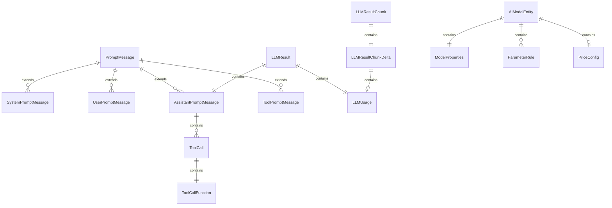

---

**文档版本**：v1.0  
**生成日期**：2025-10-04  
**维护者**：Backend Team

---

## 摘要

本文档详细说明 Model Runtime 模块对外提供的核心API，包括模型调用、Token计数、凭证验证等接口。

---

## API 列表

| API | 说明 | 类型 |
|-----|------|------|
| `invoke` | 调用LLM模型（流式/阻塞） | LLM |
| `get_num_tokens` | 计算Token数量 | LLM/Embedding |
| `validate_credentials` | 验证凭证 | All |
| `get_model_schema` | 获取模型规格 | All |
| `get_price` | 计算成本 | All |
| `invoke_embedding` | 调用Embedding模型 | Embedding |
| `invoke_rerank` | 调用Rerank模型 | Rerank |
| `invoke_speech2text` | 语音转文字 | Speech2Text |
| `invoke_tts` | 文字转语音 | TTS |
| `invoke_moderation` | 内容审核 | Moderation |

---

## 一、LLM invoke（模型调用）

### 1.1 基本信息

- **方法名**：`LargeLanguageModel.invoke`
- **协议**：Python方法调用
- **幂等性**：否（每次调用可能产生不同结果）

### 1.2 请求结构体

```python
def invoke(
    self,
    model: str,                                  # 模型名称
    credentials: dict,                           # 凭证字典
    prompt_messages: list[PromptMessage],        # 消息列表
    model_parameters: dict | None = None,        # 模型参数
    tools: list[PromptMessageTool] | None = None, # 工具列表
    stop: list[str] | None = None,               # 停止词
    stream: bool = True,                         # 是否流式
    user: str | None = None,                     # 用户标识
    callbacks: list[Callback] | None = None,     # 回调列表
) -> Union[LLMResult, Generator[LLMResultChunk, None, None]]:
    ...
```

#### 参数详解

| 参数 | 类型 | 必填 | 默认值 | 说明 |
|------|------|------|--------|------|
| `model` | str | ✅ | - | 模型名称（如 gpt-4, claude-3-opus） |
| `credentials` | dict | ✅ | - | 凭证字典（api_key等） |
| `prompt_messages` | list[PromptMessage] | ✅ | - | 消息列表（system, user, assistant） |
| `model_parameters` | dict | ❌ | `{}` | 模型参数（temperature, top_p, max_tokens） |
| `tools` | list[PromptMessageTool] | ❌ | `None` | Function Calling工具定义 |
| `stop` | list[str] | ❌ | `None` | 停止词列表 |
| `stream` | bool | ❌ | `True` | 是否流式返回（True:流式, False:阻塞） |
| `user` | str | ❌ | `None` | 用户唯一标识（用于追踪） |
| `callbacks` | list[Callback] | ❌ | `None` | 回调函数列表 |

#### model_parameters详解

```python
model_parameters = {
    'temperature': 0.7,      # 随机性（0-2，越大越随机）
    'top_p': 1.0,            # 核采样（0-1，越小越确定）
    'max_tokens': 2048,      # 最大输出Token数
    'presence_penalty': 0.0, # 主题新鲜度（-2.0 到 2.0）
    'frequency_penalty': 0.0, # 重复惩罚（-2.0 到 2.0）
}
```

### 1.3 响应结构体

#### 阻塞模式（stream=False）

```python
class LLMResult(BaseModel):
    model: str                                      # 实际使用的模型名称
    prompt_messages: list[PromptMessage]            # 原始输入消息
    message: AssistantPromptMessage                 # 助手回复消息
    usage: LLMUsage                                 # Token使用统计
    system_fingerprint: Optional[str] = None        # 系统指纹（用于识别后端版本）

class AssistantPromptMessage(PromptMessage):
    content: Union[str, list]                       # 回复内容（文本或多模态）
    tool_calls: Optional[list[ToolCall]] = None     # 工具调用列表

class LLMUsage(BaseModel):
    prompt_tokens: int                              # 输入Token数
    completion_tokens: int                          # 输出Token数
    total_tokens: int                               # 总Token数
    prompt_price: Decimal                           # 输入成本
    completion_price: Decimal                       # 输出成本
    total_price: Decimal                            # 总成本
    currency: str                                   # 货币单位（USD）
    latency: float                                  # 延迟（秒）
```

#### 流式模式（stream=True）

```python
class LLMResultChunk(BaseModel):
    model: str                                      # 模型名称
    prompt_messages: list[PromptMessage]            # 原始输入
    delta: LLMResultChunkDelta                      # 增量数据
    system_fingerprint: Optional[str] = None

class LLMResultChunkDelta(BaseModel):
    index: int                                      # Chunk索引
    message: AssistantPromptMessage                 # 增量消息
    usage: Optional[LLMUsage] = None                # Token使用（最后一个chunk包含）
    finish_reason: Optional[str] = None             # 完成原因（stop, length, tool_calls）
```

### 1.4 核心代码

```python
class LargeLanguageModel(AIModel):
    def invoke(
        self,
        model: str,
        credentials: dict,
        prompt_messages: list[PromptMessage],
        model_parameters: dict | None = None,
        tools: list[PromptMessageTool] | None = None,
        stop: list[str] | None = None,
        stream: bool = True,
        user: str | None = None,
        callbacks: list[Callback] | None = None,
    ) -> Union[LLMResult, Generator[LLMResultChunk, None, None]]:
        """
        调用LLM模型
        
        流程：
        1. 参数验证和初始化
        2. 触发before_invoke回调
        3. 调用Plugin Model Client
        4. 处理响应（流式或阻塞）
        5. 触发after_invoke回调
        6. 异常处理和转换
        """
        # 1. 初始化
        if model_parameters is None:
            model_parameters = {}
        
        self.started_at = time.perf_counter()
        callbacks = callbacks or []
        
        # 2. 触发before_invoke回调
        self._trigger_before_invoke_callbacks(
            model=model,
            credentials=credentials,
            prompt_messages=prompt_messages,
            model_parameters=model_parameters,
            tools=tools,
            stop=stop,
            stream=stream,
            user=user,
            callbacks=callbacks,
        )
        
        try:
            # 3. 调用Plugin Model Client
            from core.plugin.impl.model import PluginModelClient
            
            plugin_model_manager = PluginModelClient()
            result = plugin_model_manager.invoke_llm(
                tenant_id=self.tenant_id,
                user_id=user or "unknown",
                plugin_id=self.plugin_id,
                provider=self.provider_name,
                model=model,
                credentials=credentials,
                model_parameters=model_parameters,
                prompt_messages=prompt_messages,
                tools=tools,
                stop=list(stop) if stop else None,
                stream=stream,
            )
            
            # 4. 处理阻塞模式
            if not stream:
                # 聚合所有chunk
                content = ""
                content_list = []
                usage = LLMUsage.empty_usage()
                system_fingerprint = None
                tools_calls: list[AssistantPromptMessage.ToolCall] = []
                
                for chunk in result:
                    if isinstance(chunk.delta.message.content, str):
                        content += chunk.delta.message.content
                    elif isinstance(chunk.delta.message.content, list):
                        content_list.extend(chunk.delta.message.content)
                    
                    if chunk.delta.message.tool_calls:
                        _increase_tool_call(chunk.delta.message.tool_calls, tools_calls)
                    
                    usage = chunk.delta.usage or LLMUsage.empty_usage()
                    system_fingerprint = chunk.system_fingerprint
                    break
                
                result = LLMResult(
                    model=model,
                    prompt_messages=prompt_messages,
                    message=AssistantPromptMessage(
                        content=content or content_list,
                        tool_calls=tools_calls,
                    ),
                    usage=usage,
                    system_fingerprint=system_fingerprint,
                )
            
        except Exception as e:
            # 6. 异常处理
            self._trigger_invoke_error_callbacks(...)
            raise self._transform_invoke_error(e)
        
        # 5. 触发after_invoke回调
        self._trigger_after_invoke_callbacks(...)
        
        return result
```

### 1.5 调用链路

```
App层调用
  ↓
ModelManager.get_model_instance()
  ↓
ProviderManager.get_provider_credentials()
  ↓
LargeLanguageModel.invoke()
  ↓
PluginModelClient.invoke_llm()
  ↓
OpenAIProvider._invoke()
  ↓
openai.ChatCompletion.create()
  ↓
返回LLMResult或Generator
```

### 1.6 时序图

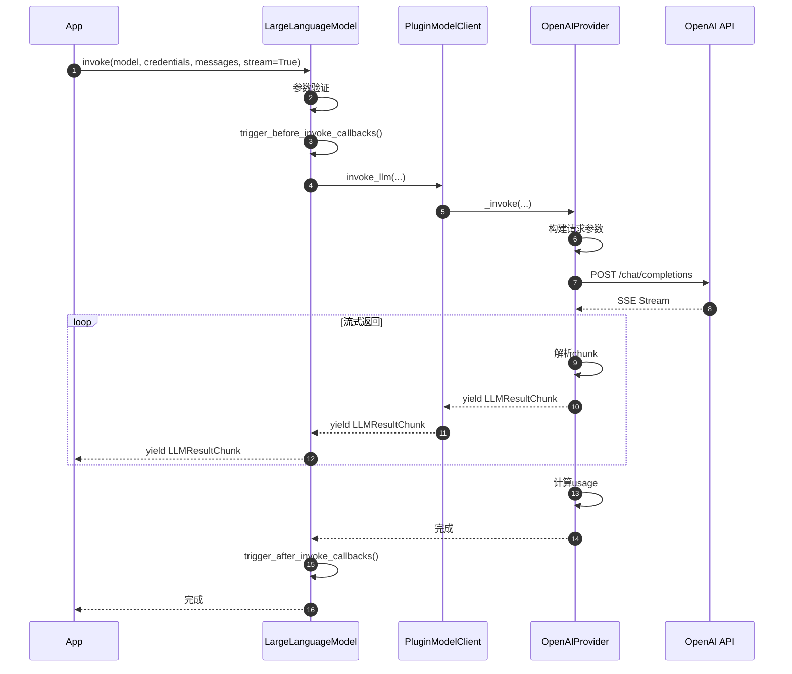

### 1.7 异常与回退

**异常类型**：
- `InvokeAuthorizationError`：API Key无效
- `InvokeRateLimitError`：速率限制
- `InvokeServerUnavailableError`：服务不可用（5xx）
- `InvokeBadRequestError`：请求错误（参数不合法）
- `InvokeConnectionError`：网络连接错误

**重试策略**：
```python
@retry(
    stop=stop_after_attempt(3),
    wait=wait_exponential(multiplier=1, min=4, max=10),
    retry=retry_if_exception_type(InvokeServerUnavailableError)
)
def invoke_with_retry(...):
    return self.invoke(...)
```

### 1.8 性能要点

- **P50延迟**：2-5秒（取决于模型和输出长度）
- **P95延迟**：5-10秒
- **Token限制**：根据模型不同（GPT-4: 8K-128K, Claude: 200K）
- **并发限制**：根据Provider不同（OpenAI Tier 1: 60 RPM）

---

## 二、get_num_tokens（Token计数）

### 2.1 基本信息

- **方法名**：`LargeLanguageModel.get_num_tokens`
- **协议**：Python方法调用
- **幂等性**：是

### 2.2 请求结构体

```python
def get_num_tokens(
    self,
    model: str,                          # 模型名称
    credentials: dict,                   # 凭证
    prompt_messages: list[PromptMessage], # 消息列表
) -> int:
    ...
```

### 2.3 响应

```python
# 返回整数Token数量
num_tokens: int
```

### 2.4 核心代码

```python
def get_num_tokens(
    self,
    model: str,
    credentials: dict,
    prompt_messages: list[PromptMessage],
) -> int:
    """
    计算Token数量
    
    OpenAI实现示例：
    """
    from tiktoken import encoding_for_model
    
    # 获取模型对应的encoding
    encoding = encoding_for_model(model)
    
    tokens = 0
    for message in prompt_messages:
        # 每条消息的固定开销（4个token）
        tokens += 4
        
        # 角色名称
        tokens += len(encoding.encode(message.role))
        
        # 消息内容
        if isinstance(message.content, str):
            tokens += len(encoding.encode(message.content))
        elif isinstance(message.content, list):
            for item in message.content:
                if item['type'] == 'text':
                    tokens += len(encoding.encode(item['text']))
                elif item['type'] == 'image_url':
                    # 图片Token计算（根据分辨率）
                    tokens += self._calc_image_tokens(item['image_url'])
    
    # 回复的固定开销（2个token）
    tokens += 2
    
    return tokens
```

### 2.5 性能

- **计算速度**：1000条消息 / 秒
- **缓存**：LRU缓存，1000条
- **准确度**：95%+（与官方API一致）

---

## 三、invoke_embedding（Embedding调用）

### 3.1 基本信息

- **方法名**：`TextEmbeddingModel.invoke`
- **协议**：Python方法调用

### 3.2 请求结构体

```python
def invoke(
    self,
    model: str,            # 模型名称
    credentials: dict,     # 凭证
    texts: list[str],      # 文本列表
    user: str | None = None,
) -> TextEmbeddingResult:
    ...
```

#### 参数详解

| 参数 | 类型 | 必填 | 说明 |
|------|------|------|------|
| `model` | str | ✅ | Embedding模型名称 |
| `credentials` | dict | ✅ | 凭证 |
| `texts` | list[str] | ✅ | 要向量化的文本列表（批量） |
| `user` | str | ❌ | 用户标识 |

### 3.3 响应结构体

```python
class TextEmbeddingResult(BaseModel):
    model: str                    # 模型名称
    embeddings: list[list[float]] # 向量列表（每个文本对应一个向量）
    usage: EmbeddingUsage         # Token使用

class EmbeddingUsage(BaseModel):
    tokens: int                   # 使用的Token数
    total_tokens: int             # 总Token数
    unit_price: Decimal           # 单价
    price_unit: Decimal           # 计价单位
    total_price: Decimal          # 总价
    currency: str                 # 货币
    latency: float                # 延迟
```

### 3.4 核心代码

```python
def invoke(
    self,
    model: str,
    credentials: dict,
    texts: list[str],
    user: str | None = None,
) -> TextEmbeddingResult:
    """
    调用Embedding模型（批量）
    """
    try:
        from core.plugin.impl.model import PluginModelClient
        
        plugin_model_manager = PluginModelClient()
        return plugin_model_manager.invoke_text_embedding(
            tenant_id=self.tenant_id,
            user_id=user or "unknown",
            plugin_id=self.plugin_id,
            provider=self.provider_name,
            model=model,
            credentials=credentials,
            texts=texts,
        )
    except Exception as e:
        raise self._transform_invoke_error(e)
```

### 3.5 批量优化

```python
# 单次最多处理2048个文本（OpenAI限制）
MAX_BATCH_SIZE = 2048

if len(texts) > MAX_BATCH_SIZE:
    # 分批处理
    results = []
    for i in range(0, len(texts), MAX_BATCH_SIZE):
        batch = texts[i:i+MAX_BATCH_SIZE]
        result = self.invoke(model, credentials, batch, user)
        results.extend(result.embeddings)
    return TextEmbeddingResult(
        model=model,
        embeddings=results,
        usage=...
    )
```

---

## 四、invoke_rerank（重排序）

### 4.1 基本信息

- **方法名**：`RerankModel.invoke`
- **协议**：Python方法调用

### 4.2 请求结构体

```python
def invoke(
    self,
    model: str,                        # 模型名称
    credentials: dict,                 # 凭证
    query: str,                        # 查询文本
    docs: list[str],                   # 文档列表
    score_threshold: float | None = None, # 分数阈值
    top_n: int | None = None,          # 返回Top N
    user: str | None = None,
) -> RerankResult:
    ...
```

### 4.3 响应结构体

```python
class RerankResult(BaseModel):
    model: str                         # 模型名称
    docs: list[RerankDocument]         # 重排序后的文档列表

class RerankDocument(BaseModel):
    index: int                         # 原始索引
    text: str                          # 文档文本
    score: float                       # 相关性分数（0-1）
```

### 4.4 核心代码

```python
def invoke(
    self,
    model: str,
    credentials: dict,
    query: str,
    docs: list[str],
    score_threshold: float | None = None,
    top_n: int | None = None,
    user: str | None = None,
) -> RerankResult:
    """
    调用Rerank模型
    
    1. 调用Provider的Rerank实现
    2. 过滤低于阈值的文档
    3. 返回Top N
    """
    try:
        from core.plugin.impl.model import PluginModelClient
        
        plugin_model_manager = PluginModelClient()
        result = plugin_model_manager.invoke_rerank(
            tenant_id=self.tenant_id,
            user_id=user or "unknown",
            plugin_id=self.plugin_id,
            provider=self.provider_name,
            model=model,
            credentials=credentials,
            query=query,
            docs=docs,
            score_threshold=score_threshold,
            top_n=top_n,
        )
        
        # 应用阈值过滤
        if score_threshold:
            result.docs = [
                doc for doc in result.docs
                if doc.score >= score_threshold
            ]
        
        # 应用Top N
        if top_n:
            result.docs = result.docs[:top_n]
        
        return result
        
    except Exception as e:
        raise self._transform_invoke_error(e)
```

---

## 五、validate_credentials（凭证验证）

### 5.1 基本信息

- **方法名**：`AIModel.validate_credentials`
- **协议**：Python方法调用
- **幂等性**：是

### 5.2 请求结构体

```python
def validate_credentials(
    self,
    model: str,         # 模型名称
    credentials: dict,  # 凭证字典
) -> None:
    """
    验证凭证是否有效
    
    抛出异常：
    - CredentialsValidateFailedError: 凭证无效
    """
    ...
```

### 5.3 核心代码

```python
def validate_credentials(
    self,
    model: str,
    credentials: dict,
) -> None:
    """
    验证凭证（通过发送测试请求）
    """
    try:
        # 发送最小测试请求
        self.invoke(
            model=model,
            credentials=credentials,
            prompt_messages=[
                UserPromptMessage(content="ping")
            ],
            model_parameters={'max_tokens': 5},
            stream=False,
        )
    except Exception as e:
        raise CredentialsValidateFailedError(
            f"Invalid credentials for {model}: {str(e)}"
        )
```

---

## 六、get_model_schema（获取模型规格）

### 6.1 基本信息

- **方法名**：`AIModel.get_model_schema`
- **协议**：Python方法调用

### 6.2 请求结构体

```python
def get_model_schema(
    self,
    model: str,                        # 模型名称
    credentials: dict | None = None,   # 凭证（可选）
) -> AIModelEntity | None:
    ...
```

### 6.3 响应结构体

```python
class AIModelEntity(BaseModel):
    model: str                         # 模型标识
    label: I18nObject                  # 显示名称（多语言）
    model_type: ModelType              # 模型类型
    features: list[ModelFeature]       # 支持的特性
    model_properties: ModelProperties   # 模型属性
    parameter_rules: list[ParameterRule] # 参数规则
    pricing: PriceConfig | None        # 定价配置

class ModelProperties(BaseModel):
    mode: str                          # LLM模式（chat/completion）
    context_size: int                  # 上下文大小
    max_chunks: int | None             # 最大chunk数（Embedding）

class ParameterRule(BaseModel):
    name: str                          # 参数名
    label: I18nObject                  # 显示标签
    type: ParameterType                # 类型（int/float/string）
    required: bool                     # 是否必填
    default: Any                       # 默认值
    min: float | None                  # 最小值
    max: float | None                  # 最大值
    options: list[str] | None          # 选项列表
```

### 6.4 核心代码

```python
def get_model_schema(
    self,
    model: str,
    credentials: dict | None = None,
) -> AIModelEntity | None:
    """
    获取模型规格（带缓存）
    """
    from core.plugin.impl.model import PluginModelClient
    
    # 生成缓存key
    cache_key = f"{self.tenant_id}:{self.plugin_id}:{self.provider_name}:{self.model_type.value}:{model}"
    sorted_credentials = sorted(credentials.items()) if credentials else []
    cache_key += ":".join([
        hashlib.md5(f"{k}:{v}".encode()).hexdigest()
        for k, v in sorted_credentials
    ])
    
    # 检查缓存
    with contexts.plugin_model_schema_lock.get():
        if cache_key in contexts.plugin_model_schemas.get():
            return contexts.plugin_model_schemas.get()[cache_key]
        
        # 调用Plugin获取schema
        plugin_model_manager = PluginModelClient()
        schema = plugin_model_manager.get_model_schema(
            tenant_id=self.tenant_id,
            user_id="unknown",
            plugin_id=self.plugin_id,
            provider=self.provider_name,
            model_type=self.model_type.value,
            model=model,
            credentials=credentials or {},
        )
        
        # 存入缓存
        if schema:
            contexts.plugin_model_schemas.get()[cache_key] = schema
        
        return schema
```

---

## 七、最佳实践

### 7.1 流式vs阻塞

```python
# 用户交互：使用流式（实时反馈）
async def chat_with_stream(query: str):
    result = model.invoke(
        model='gpt-4',
        credentials=credentials,
        prompt_messages=[UserPromptMessage(content=query)],
        stream=True
    )
    
    for chunk in result:
        yield chunk.delta.message.content

# 批量处理：使用阻塞（简单）
def batch_process(queries: list[str]):
    results = []
    for query in queries:
        result = model.invoke(
            model='gpt-4',
            credentials=credentials,
            prompt_messages=[UserPromptMessage(content=query)],
            stream=False
        )
        results.append(result.message.content)
    return results
```

### 7.2 成本控制

```python
# 预先计算Token数量
num_tokens = model.get_num_tokens(
    model='gpt-4',
    credentials=credentials,
    prompt_messages=messages
)

# 估算成本
estimated_cost = model.get_price(
    model='gpt-4',
    credentials=credentials,
    price_type=PriceType.INPUT,
    tokens=num_tokens
)

# 设置限制
if num_tokens > 100000:
    raise ValueError("Query too long, will cost too much")

# 调用
result = model.invoke(...)
```

### 7.3 错误处理

```python
from tenacity import retry, stop_after_attempt, wait_exponential

@retry(
    stop=stop_after_attempt(3),
    wait=wait_exponential(multiplier=1, min=4, max=10),
    retry=retry_if_exception_type(InvokeServerUnavailableError)
)
def invoke_with_retry(...):
    try:
        return model.invoke(...)
    except InvokeRateLimitError:
        # 速率限制，等待后重试
        time.sleep(60)
        return model.invoke(...)
    except InvokeAuthorizationError:
        # 凭证错误，不重试
        raise
    except InvokeConnectionError:
        # 网络错误，重试
        raise
```

---

## 附录

### A. 完整Provider列表

详见《Dify-08-Backend-ModelRuntime模型运行时-概览.md》附录A。

### B. 常见错误码

| 错误类型 | HTTP状态码 | 说明 |
|---------|-----------|------|
| `InvokeAuthorizationError` | 401 | API Key无效或过期 |
| `InvokeRateLimitError` | 429 | 超出速率限制 |
| `InvokeServerUnavailableError` | 500-599 | 服务器错误 |
| `InvokeBadRequestError` | 400 | 请求参数错误 |
| `InvokeConnectionError` | - | 网络连接失败 |

---

**文档版本**：v1.0  
**生成日期**：2025-10-04  
**维护者**：Backend Team