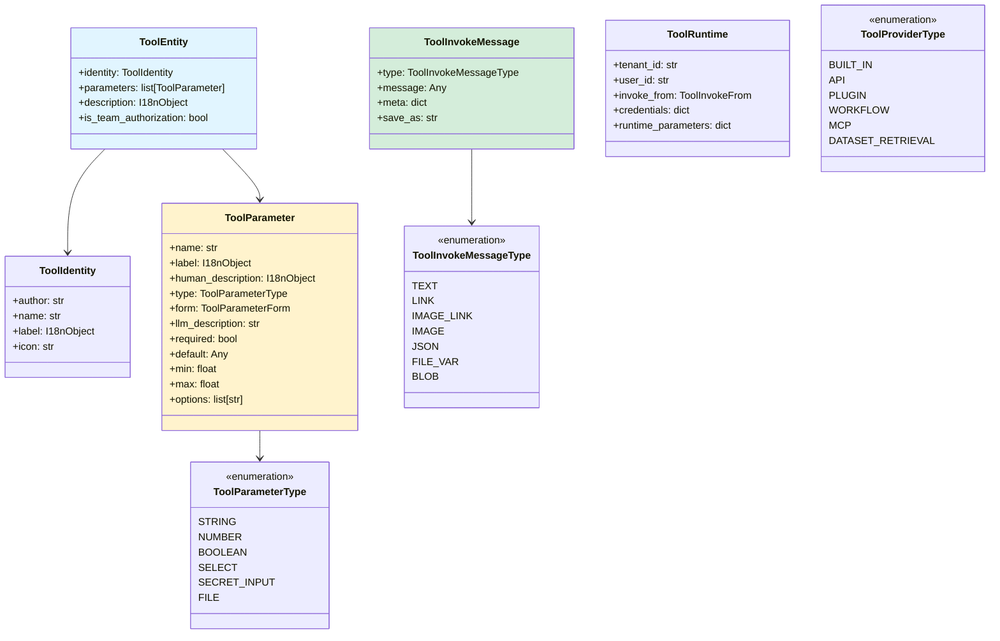

# Dify-09-Backend-Tools工具系统

## 摘要

Tools工具系统是Dify中为Agent和Workflow提供外部能力扩展的核心模块,支持内置工具、API工具、插件工具、工作流工具、MCP工具和数据集检索工具等多种类型。

### 核心职责

| 职责 | 说明 |
|------|------|
| **工具管理** | 统一管理6种类型的工具(Builtin/API/Plugin/Workflow/MCP/Dataset) |
| **工具调用** | 提供统一的工具调用接口,支持同步/异步执行 |
| **参数验证** | 验证工具参数,确保类型和约束正确 |
| **凭证管理** | 管理工具提供商的API Key等凭证信息 |
| **错误处理** | 统一的错误处理和异常转换 |
| **结果格式化** | 统一的工具执行结果格式 |

### 工具类型

| 类型 | 说明 | 示例 |
|------|------|------|
| **Builtin** | 内置工具 | Google搜索、天气查询、时间工具 |
| **API** | 自定义API工具 | 用户自定义的REST API |
| **Plugin** | 插件工具 | 通过插件系统扩展的工具 |
| **Workflow** | 工作流工具 | 将Workflow封装为工具 |
| **MCP** | MCP协议工具 | Model Context Protocol工具 |
| **Dataset Retrieval** | 数据集检索工具 | 知识库检索 |

---

## 一、整体架构

### 1.1 架构图


### 1.2 架构说明

**分层职责**：

1. **调用层**(Invocation Layer)
   - Agent：在推理过程中调用工具
   - Workflow：在工作流节点中调用工具
   - App：应用层直接调用工具

2. **引擎层**(Engine Layer)
   - ToolEngine：工具调用引擎,负责批量调用、并发控制
   - ToolInvoker：单个工具的调用器,处理参数转换和结果格式化

3. **管理层**(Manager Layer)
   - ToolManager：工具管理器,负责工具的注册、查询、凭证管理
   - ToolRuntime：运行时上下文,包含租户ID、用户ID、回调等信息

4. **提供商层**(Provider Layer)
   - 各类ToolProvider：负责具体类型工具的加载、验证、调用
   - 每个Provider管理一组相关的工具

5. **工具层**(Tool Layer)
   - 具体的工具实现
   - 每个工具实现`_invoke`方法来执行具体逻辑

---

## 二、核心类设计

### 2.1 类图


---

## 三、数据结构详解

### 3.1 核心数据结构类图



### 3.2 ToolEntity(工具实体)

**定义**：
```python
class ToolEntity(BaseModel):
    """工具实体"""
    
    identity: ToolIdentity                   # 工具标识
    parameters: list[ToolParameter]          # 参数列表
    description: I18nObject                  # 描述(多语言)
    is_team_authorization: bool = False      # 是否需要团队授权
```

**字段说明**：

| 字段 | 类型 | 必填 | 说明 |
|------|------|------|------|
| `identity` | ToolIdentity | ✅ | 工具的唯一标识信息 |
| `parameters` | list[ToolParameter] | ✅ | 工具参数定义列表 |
| `description` | I18nObject | ✅ | 工具的详细描述 |
| `is_team_authorization` | bool | ❌ | 是否需要团队级别授权 |

### 3.3 ToolIdentity(工具标识)

**定义**：
```python
class ToolIdentity(BaseModel):
    """工具标识"""
    
    author: str                    # 作者
    name: str                      # 工具名称(唯一标识)
    label: I18nObject              # 显示标签(多语言)
    icon: str                      # 图标URL或base64
    provider: str                  # Provider名称
```

**示例**：
```python
identity = ToolIdentity(
    author="Dify",
    name="google_search",
    label=I18nObject(
        en_US="Google Search",
        zh_Hans="谷歌搜索"
    ),
    icon="https://example.com/google-icon.svg",
    provider="google"
)
```

### 3.4 ToolParameter(工具参数)

**定义**：
```python
class ToolParameter(BaseModel):
    """工具参数定义"""
    
    name: str                           # 参数名
    label: I18nObject                   # 显示标签
    human_description: I18nObject       # 人类可读描述
    type: ToolParameterType             # 参数类型
    form: ToolParameterForm             # 表单类型
    llm_description: str                # LLM可读描述
    required: bool                      # 是否必填
    default: Any                        # 默认值
    min: Optional[float]                # 最小值(数字类型)
    max: Optional[float]                # 最大值(数字类型)
    options: Optional[list[str]]        # 选项列表(select类型)
```

**字段详解**：

| 字段 | 类型 | 说明 |
|------|------|------|
| `name` | str | 参数名(用于代码中引用) |
| `label` | I18nObject | 显示标签(用于UI展示) |
| `human_description` | I18nObject | 给人类看的详细描述 |
| `type` | ToolParameterType | 参数的数据类型 |
| `form` | ToolParameterForm | 表单类型(llm/form) |
| `llm_description` | str | 给LLM看的描述(用于参数推理) |
| `required` | bool | 是否必填 |
| `default` | Any | 默认值 |
| `min` | float | 最小值(数字类型有效) |
| `max` | float | 最大值(数字类型有效) |
| `options` | list[str] | 选项列表(select类型) |

**ToolParameterType枚举**：
```python
class ToolParameterType(StrEnum):
    STRING = 'string'               # 字符串
    NUMBER = 'number'               # 数字
    BOOLEAN = 'boolean'             # 布尔值
    SELECT = 'select'               # 选择框
    SECRET_INPUT = 'secret-input'   # 密钥输入
    FILE = 'file'                   # 文件
```

**ToolParameterForm枚举**：
```python
class ToolParameterForm(StrEnum):
    LLM = 'llm'        # LLM推理参数(由LLM自动填充)
    FORM = 'form'      # 表单参数(由用户手动填写)
```

**参数示例**：

```python
# LLM参数示例
query_param = ToolParameter(
    name='query',
    label=I18nObject(en_US='Search Query', zh_Hans='搜索查询'),
    human_description=I18nObject(
        en_US='The search query string',
        zh_Hans='搜索查询字符串'
    ),
    type=ToolParameterType.STRING,
    form=ToolParameterForm.LLM,
    llm_description='The query to search on Google',
    required=True
)

# Form参数示例
api_key_param = ToolParameter(
    name='api_key',
    label=I18nObject(en_US='API Key', zh_Hans='API密钥'),
    human_description=I18nObject(
        en_US='Your Google API Key',
        zh_Hans='您的Google API密钥'
    ),
    type=ToolParameterType.SECRET_INPUT,
    form=ToolParameterForm.FORM,
    llm_description='',
    required=True
)

# Select参数示例
language_param = ToolParameter(
    name='language',
    label=I18nObject(en_US='Language', zh_Hans='语言'),
    type=ToolParameterType.SELECT,
    form=ToolParameterForm.LLM,
    llm_description='The language for search results',
    required=False,
    default='en',
    options=['en', 'zh', 'ja', 'fr', 'de']
)
```

### 3.5 ToolInvokeMessage(工具调用消息)

**定义**：
```python
class ToolInvokeMessage(BaseModel):
    """工具调用结果消息"""
    
    type: ToolInvokeMessageType    # 消息类型
    message: Any                   # 消息内容
    meta: dict = {}                # 元数据
    save_as: str = ''              # 保存为变量名
```

**字段说明**：

| 字段 | 类型 | 说明 |
|------|------|------|
| `type` | ToolInvokeMessageType | 消息类型(text/json/image等) |
| `message` | Any | 消息内容(根据type不同而不同) |
| `meta` | dict | 元数据(如文件大小、mime类型等) |
| `save_as` | str | 保存为变量名(用于Workflow) |

**ToolInvokeMessageType枚举**：
```python
class ToolInvokeMessageType(StrEnum):
    TEXT = 'text'                    # 纯文本
    LINK = 'link'                    # 链接
    IMAGE_LINK = 'image_link'        # 图片链接
    IMAGE = 'image'                  # 图片(base64)
    JSON = 'json'                    # JSON数据
    FILE_VAR = 'file_var'            # 文件变量
    BLOB = 'blob'                    # 二进制数据
```

**消息示例**：

```python
# 文本消息
text_message = ToolInvokeMessage(
    type=ToolInvokeMessageType.TEXT,
    message="Search completed successfully"
)

# JSON消息
json_message = ToolInvokeMessage(
    type=ToolInvokeMessageType.JSON,
    message={
        "results": [
            {"title": "Result 1", "url": "https://example.com/1"},
            {"title": "Result 2", "url": "https://example.com/2"}
        ],
        "total": 2
    }
)

# 图片链接消息
image_message = ToolInvokeMessage(
    type=ToolInvokeMessageType.IMAGE_LINK,
    message="https://example.com/image.jpg",
    meta={"width": 800, "height": 600}
)

# 图片base64消息
image_base64_message = ToolInvokeMessage(
    type=ToolInvokeMessageType.IMAGE,
    message="data:image/png;base64,iVBORw0KGgoAAAANSUhEUgAAAAUA...",
    save_as="generated_image"
)
```

### 3.6 ToolRuntime(工具运行时)

**定义**：
```python
class ToolRuntime(BaseModel):
    """工具运行时上下文"""
    
    tenant_id: str                          # 租户ID
    user_id: str                            # 用户ID
    invoke_from: ToolInvokeFrom             # 调用来源
    credentials: dict[str, Any] = {}        # 凭证
    runtime_parameters: dict[str, Any] = {} # 运行时参数
```

**ToolInvokeFrom枚举**：
```python
class ToolInvokeFrom(StrEnum):
    AGENT = 'agent'              # 从Agent调用
    WORKFLOW = 'workflow'        # 从Workflow调用
    DEBUGGER = 'debugger'        # 从调试器调用
    TEST = 'test'                # 从测试调用
```

**示例**：
```python
runtime = ToolRuntime(
    tenant_id="tenant_123",
    user_id="user_456",
    invoke_from=ToolInvokeFrom.AGENT,
    credentials={
        "google_api_key": "your_api_key_here",
        "google_cx": "your_cx_here"
    },
    runtime_parameters={
        "max_results": 10,
        "safe_search": "moderate"
    }
)
```

### 3.7 Provider实体

**ProviderEntity定义**：
```python
class ProviderEntity(BaseModel):
    """Provider实体"""
    
    identity: ProviderIdentity           # Provider标识
    credentials_schema: list[ProviderConfig]  # 凭证配置
    tools: list[ToolEntity]              # 工具列表
```

**ProviderIdentity**：
```python
class ProviderIdentity(BaseModel):
    """Provider标识"""
    
    author: str                    # 作者
    name: str                      # Provider名称
    label: I18nObject              # 显示标签
    description: I18nObject        # 描述
    icon: str                      # 图标
```

**ProviderConfig(Provider配置)**：
```python
class ProviderConfig(BaseModel):
    """Provider凭证配置"""
    
    name: str                      # 配置项名称
    label: I18nObject              # 显示标签
    type: CredentialType           # 凭证类型
    required: bool                 # 是否必填
    default: Any                   # 默认值
    help: I18nObject               # 帮助文本
    url: str                       # 帮助链接
    placeholder: I18nObject        # 占位符
```

**CredentialType枚举**：
```python
class CredentialType(StrEnum):
    TEXT_INPUT = 'text-input'         # 文本输入
    SECRET_INPUT = 'secret-input'     # 密钥输入
    SELECT = 'select'                 # 选择框
    BOOLEAN = 'boolean'               # 布尔值
```

### 3.8 完整实体关系图


---

## 四、API规格

### 4.1 API列表

| API | 说明 | 调用方 |
|-----|------|--------|
| `ToolEngine.invoke` | 调用单个工具 | Agent/Workflow |
| `ToolEngine.batch_invoke` | 批量调用工具 | Agent |
| `ToolManager.get_tool` | 获取工具实例 | ToolEngine |
| `ToolManager.get_builtin_provider` | 获取内置Provider | App |
| `ToolManager.get_api_provider` | 获取API Provider | App |
| `Tool.invoke` | 工具执行入口 | ToolEngine |
| `Tool.validate_credentials` | 验证凭证 | Provider |
| `ToolProviderController.get_tools` | 获取工具列表 | ToolManager |

### 4.2 ToolEngine.invoke(工具调用)

#### 基本信息

- **方法名**：`ToolEngine.invoke`
- **协议**：Python方法调用
- **幂等性**：取决于具体工具

#### 请求结构体

```python
def invoke(
    self,
    tool_entity: AgentToolEntity,      # 工具实体
    tool_parameters: dict[str, Any],   # 工具参数
    user_id: str,                      # 用户ID
) -> ToolInvokeMessage | list[ToolInvokeMessage]:
    ...
```

**参数详解**

| 参数 | 类型 | 必填 | 说明 |
|------|------|------|------|
| `tool_entity` | AgentToolEntity | ✅ | 工具实体(包含provider/tool_name) |
| `tool_parameters` | dict | ✅ | 工具参数(根据工具定义) |
| `user_id` | str | ✅ | 用户唯一标识 |

**AgentToolEntity结构**

```python
class AgentToolEntity(BaseModel):
    provider_id: str           # Provider ID
    provider_type: ToolProviderType  # Provider类型
    provider_name: str         # Provider名称
    tool_name: str             # 工具名称
    tool_parameters: dict      # 工具参数配置
```

#### 核心代码

```python
class ToolEngine:
    def invoke(
        self,
        tool_entity: AgentToolEntity,
        tool_parameters: dict[str, Any],
        user_id: str,
    ) -> ToolInvokeMessage | list[ToolInvokeMessage]:
        """
        调用工具
        
        流程：
        1. 获取Tool实例
        2. 构建ToolRuntime
        3. 调用Tool.invoke
        4. 处理结果
        """
        # 1. 获取Tool实例
        tool = ToolManager.get_tool(
            provider_type=tool_entity.provider_type,
            provider_id=tool_entity.provider_id,
            tool_name=tool_entity.tool_name,
            tenant_id=self.tenant_id
        )
        
        # 2. 构建ToolRuntime
        runtime = ToolRuntime(
            tenant_id=self.tenant_id,
            user_id=user_id,
            invoke_from=ToolInvokeFrom.AGENT,
            callbacks=self.callbacks
        )
        
        # 3. Fork tool with runtime
        tool_with_runtime = tool.fork_tool_runtime(runtime)
        
        # 4. 调用工具
        try:
            result = tool_with_runtime.invoke(tool_parameters)
            
            # 5. 处理结果
            if isinstance(result, list):
                return result
            else:
                return [result]
                
        except Exception as e:
            # 6. 错误处理
            return [ToolInvokeMessage(
                type=ToolInvokeMessageType.TEXT,
                message=f"Tool execution failed: {str(e)}"
            )]
```

#### 调用链路

```
Agent/Workflow
  ↓
ToolEngine.invoke()
  ↓
ToolManager.get_tool()
  ↓
Tool.fork_tool_runtime()
  ↓
Tool.invoke()
  ↓
Tool._invoke() [子类实现]
  ↓
返回ToolInvokeMessage
```

#### 异常处理

```python
# 工具调用可能的异常
class ToolProviderNotFoundError(Exception):
    """Provider不存在"""
    pass

class ToolNotFoundError(Exception):
    """工具不存在"""
    pass

class ToolParameterValidationError(Exception):
    """参数验证失败"""
    pass

class ToolInvokeError(Exception):
    """工具执行错误"""
    pass

# 错误处理示例
try:
    result = tool_engine.invoke(tool_entity, parameters, user_id)
except ToolProviderNotFoundError:
    # Provider不存在,检查配置
    logger.error(f"Provider not found: {tool_entity.provider_id}")
except ToolParameterValidationError as e:
    # 参数错误,返回错误提示
    return ToolInvokeMessage(
        type=ToolInvokeMessageType.TEXT,
        message=f"Invalid parameters: {str(e)}"
    )
except ToolInvokeError as e:
    # 执行错误,可能重试
    if retries < max_retries:
        time.sleep(retry_delay)
        return tool_engine.invoke(tool_entity, parameters, user_id)
```

### 4.3 ToolEngine.batch_invoke(批量调用)

#### 基本信息

- **方法名**：`ToolEngine.batch_invoke`
- **协议**：Python方法调用
- **幂等性**：否

#### 请求结构体

```python
def batch_invoke(
    self,
    tool_entities: list[AgentToolEntity],  # 工具列表
    user_id: str,                          # 用户ID
) -> list[ToolInvokeMessage | list[ToolInvokeMessage]]:
    ...
```

#### 核心代码

```python
def batch_invoke(
    self,
    tool_entities: list[AgentToolEntity],
    user_id: str,
) -> list[ToolInvokeMessage | list[ToolInvokeMessage]]:
    """
    批量调用工具(并发)
    
    使用ThreadPoolExecutor实现并发调用
    """
    from concurrent.futures import ThreadPoolExecutor, as_completed
    
    # 1. 创建线程池
    max_workers = min(len(tool_entities), 10)  # 最多10个并发
    results = [None] * len(tool_entities)
    
    with ThreadPoolExecutor(max_workers=max_workers) as executor:
        # 2. 提交所有任务
        future_to_index = {
            executor.submit(
                self.invoke,
                tool_entity,
                tool_entity.tool_parameters,
                user_id
            ): i
            for i, tool_entity in enumerate(tool_entities)
        }
        
        # 3. 收集结果(按提交顺序)
        for future in as_completed(future_to_index):
            index = future_to_index[future]
            try:
                result = future.result()
                results[index] = result
            except Exception as e:
                results[index] = [ToolInvokeMessage(
                    type=ToolInvokeMessageType.TEXT,
                    message=f"Error: {str(e)}"
                )]
    
    return results
```

### 4.4 Tool.invoke(工具执行)

#### 基本信息

- **方法名**：`Tool.invoke`
- **协议**：Python方法调用

#### 核心代码

```python
class Tool(ABC):
    def invoke(
        self,
        tool_parameters: dict[str, Any],
    ) -> ToolInvokeMessage | list[ToolInvokeMessage]:
        """
        工具执行入口(模板方法)
        
        流程：
        1. 参数验证
        2. 触发before_invoke回调
        3. 调用_invoke(子类实现)
        4. 触发after_invoke回调
        5. 格式化结果
        """
        # 1. 验证参数
        validated_parameters = self._validate_parameters(tool_parameters)
        
        # 2. 触发before_invoke回调
        if self.runtime and self.runtime.callbacks:
            for callback in self.runtime.callbacks:
                callback.on_tool_start(
                    tool_name=self.entity.identity.name,
                    parameters=validated_parameters
                )
        
        # 3. 调用子类实现
        try:
            result = self._invoke(validated_parameters)
        except Exception as e:
            # 触发error回调
            if self.runtime and self.runtime.callbacks:
                for callback in self.runtime.callbacks:
                    callback.on_tool_error(
                        tool_name=self.entity.identity.name,
                        error=e
                    )
            raise ToolInvokeError(str(e))
        
        # 4. 触发after_invoke回调
        if self.runtime and self.runtime.callbacks:
            for callback in self.runtime.callbacks:
                callback.on_tool_end(
                    tool_name=self.entity.identity.name,
                    result=result
                )
        
        # 5. 返回结果
        return result
    
    @abstractmethod
    def _invoke(
        self,
        tool_parameters: dict[str, Any],
    ) -> ToolInvokeMessage | list[ToolInvokeMessage]:
        """
        工具实际执行逻辑(子类实现)
        """
        pass
```

### 4.5 Helper方法

#### create_text_message

```python
def create_text_message(self, text: str) -> ToolInvokeMessage:
    """创建文本消息"""
    return ToolInvokeMessage(
        type=ToolInvokeMessageType.TEXT,
        message=text
    )
```

#### create_json_message

```python
def create_json_message(self, data: dict | list) -> ToolInvokeMessage:
    """创建JSON消息"""
    return ToolInvokeMessage(
        type=ToolInvokeMessageType.JSON,
        message=data
    )
```

#### create_link_message

```python
def create_link_message(self, url: str, title: str = None) -> ToolInvokeMessage:
    """创建链接消息"""
    return ToolInvokeMessage(
        type=ToolInvokeMessageType.LINK,
        message=url,
        meta={'title': title} if title else {}
    )
```

#### create_image_message

```python
def create_image_message(
    self,
    image: str,                    # base64或URL
    save_as: str = None            # 保存为变量
) -> ToolInvokeMessage:
    """创建图片消息"""
    if image.startswith('http'):
        message_type = ToolInvokeMessageType.IMAGE_LINK
    else:
        message_type = ToolInvokeMessageType.IMAGE
    
    return ToolInvokeMessage(
        type=message_type,
        message=image,
        save_as=save_as
    )
```

---

## 五、时序图与调用流程

### 5.1 Builtin工具调用时序图


#### 流程说明

**阶段1：参数解析**(步骤1-3)
- Agent调用ToolEngine,传入工具和参数
- 如果参数是字符串,尝试解析为JSON
- 调用Tool的_invoke方法

**阶段2：工具执行**(步骤4-7)
- 验证参数合法性(必填、类型、范围)
- 从runtime获取API凭证
- 调用外部API(Google搜索)
- 接收API响应

**阶段3：结果处理**(步骤8-11)
- 解析API响应
- 格式化为ToolInvokeMessage
- 返回给ToolEngine
- ToolEngine转换为Agent友好格式

### 5.2 API工具调用时序图


### 5.3 批量工具调用时序图


#### 并发控制

```python
# 最多10个并发
MAX_CONCURRENT_TOOLS = 10

# 如果超过10个工具,分批处理
if len(tools) > MAX_CONCURRENT_TOOLS:
    batches = chunk_list(tools, MAX_CONCURRENT_TOOLS)
    for batch in batches:
        results = batch_invoke(batch)
```

### 5.4 Workflow工具调用时序图


### 5.5 工具注册流程时序图

#### Builtin工具加载


#### API工具注册


### 5.6 凭证验证流程时序图


### 5.7 错误处理流程时序图


---

## 六、工具类型详解

### 6.1 Builtin Tools(内置工具)

**特点**：
- 预先定义在代码中
- 由Dify官方维护
- 开箱即用,无需配置

**内置工具列表**：

| Provider | 工具名称 | 说明 |
|----------|---------|------|
| **google** | google_search | Google搜索 |
| **weather** | get_weather | 获取天气信息 |
| **time** | current_time | 获取当前时间 |
| **time** | timezone_conversion | 时区转换 |
| **time** | weekday | 获取星期几 |
| **webscraper** | webscraper | 网页抓取 |
| **code** | simple_code | 代码执行(Python) |
| **audio** | asr | 语音识别 |
| **audio** | tts | 文字转语音 |

**目录结构**：
```
core/tools/builtin_tool/
├── provider.py                      # Provider基类
├── tool.py                          # Tool基类
└── providers/
    ├── google/
    │   ├── google.yaml              # Provider配置
    │   ├── google.py                # Provider实现
    │   └── tools/
    │       ├── google_search.yaml   # 工具配置
    │       └── google_search.py     # 工具实现
    ├── time/
    │   ├── time.yaml
    │   ├── time.py
    │   └── tools/
    │       ├── current_time.yaml
    │       ├── current_time.py
    │       ├── timezone_conversion.yaml
    │       └── timezone_conversion.py
    └── ...
```

**工具配置示例(current_time.yaml)**：
```yaml
identity:
  name: current_time
  author: Dify
  label:
    en_US: Current Time
    zh_Hans: 当前时间
description:
  en_US: Get current time in specified timezone
  zh_Hans: 获取指定时区的当前时间
parameters:
  - name: timezone
    type: string
    required: true
    label:
      en_US: Timezone
      zh_Hans: 时区
    human_description:
      en_US: Timezone name (e.g., Asia/Shanghai, America/New_York)
      zh_Hans: 时区名称(例如：Asia/Shanghai, America/New_York)
    form: llm
```

**工具实现示例(current_time.py)**：
```python
from datetime import datetime
from typing import Any

import pytz

from core.tools.builtin_tool.tool import BuiltinTool
from core.tools.entities.tool_entities import ToolInvokeMessage


class CurrentTimeTool(BuiltinTool):
    def _invoke(
        self,
        tool_parameters: dict[str, Any],
    ) -> ToolInvokeMessage | list[ToolInvokeMessage]:
        """
        获取当前时间
        
        参数:
            tool_parameters: 工具参数,包含timezone
        
        返回:
            ToolInvokeMessage: 包含当前时间的消息
        """
        # 1. 获取参数
        timezone_str = tool_parameters.get('timezone', 'UTC')
        
        # 2. 获取时区对象
        try:
            tz = pytz.timezone(timezone_str)
        except pytz.UnknownTimeZoneError:
            return self.create_text_message(f"Unknown timezone: {timezone_str}")
        
        # 3. 获取当前时间
        now = datetime.now(tz)
        time_str = now.strftime('%Y-%m-%d %H:%M:%S %Z')
        
        # 4. 返回结果
        return self.create_text_message(f"Current time: {time_str}")
```

### 6.2 API Tools(API工具)

**特点**：
- 用户自定义的REST API
- 支持OpenAPI/Swagger规范导入
- 灵活配置请求方法、参数、认证

**支持的API规范**：
- OpenAPI 3.0
- Swagger 2.0
- 自定义Schema

**认证类型**：
- None(无认证)
- API Key(Header/Query)
- Bearer Token
- Basic Auth
- OAuth 2.0(部分支持)

**配置示例**：
```python
api_tool_config = {
    'provider': 'my_api',
    'schema_type': 'openapi',
    'schema': {
        'openapi': '3.0.0',
        'info': {
            'title': 'My API',
            'version': '1.0.0'
        },
        'servers': [
            {'url': 'https://api.example.com'}
        ],
        'paths': {
            '/users/{id}': {
                'get': {
                    'operationId': 'getUser',
                    'parameters': [
                        {
                            'name': 'id',
                            'in': 'path',
                            'required': True,
                            'schema': {'type': 'integer'}
                        }
                    ],
                    'responses': {
                        '200': {
                            'description': 'Success',
                            'content': {
                                'application/json': {
                                    'schema': {
                                        'type': 'object',
                                        'properties': {
                                            'id': {'type': 'integer'},
                                            'name': {'type': 'string'}
                                        }
                                    }
                                }
                            }
                        }
                    }
                }
            }
        }
    },
    'auth': {
        'type': 'api_key',
        'config': {
            'api_key': {
                'type': 'header',
                'header_name': 'X-API-Key',
                'value': 'your_api_key_here'
            }
        }
    }
}
```

### 6.3 Plugin Tools(插件工具)

**特点**：
- 通过插件系统动态加载
- 支持第三方开发者扩展
- 与Plugin系统深度集成

**详见**：《Dify-10-Backend-Plugin插件系统-概览.md》

### 6.4 Workflow Tools(工作流工具)

**特点**：
- 将已发布的Workflow封装为工具
- 支持在Agent中调用Workflow
- 支持工作流嵌套

**使用场景**：
```python
# 场景：将"文章生成"工作流封装为工具,供Agent调用

# 1. 创建并发布Workflow
workflow = create_workflow(
    name="Article Generator",
    inputs=[
        {'variable': 'topic', 'type': 'string'},
        {'variable': 'length', 'type': 'number'}
    ],
    outputs=[
        {'variable': 'article', 'type': 'string'}
    ]
)

# 2. 封装为工具
tool = WorkflowTool(
    workflow_id=workflow.id,
    workflow_app_id=workflow.app_id
)

# 3. 在Agent中使用
agent.add_tool(tool)
result = agent.run("Generate an article about AI")
```

### 6.5 MCP Tools(MCP协议工具)

**特点**：
- 基于Model Context Protocol
- 支持跨系统工具调用
- 符合MCP标准规范

### 6.6 Dataset Retrieval Tools(数据集检索工具)

**特点**：
- 从知识库检索相关文档
- 支持多数据集检索
- 与RAG系统集成

**示例**：
```python
retrieval_tool = DatasetRetrievalTool(
    dataset_ids=['dataset_1', 'dataset_2'],
    retrieve_config={
        'top_k': 5,
        'score_threshold': 0.7,
        'reranking_enable': True
    }
)

result = retrieval_tool.invoke({
    'query': 'What is machine learning?'
})

# 返回Top 5相关文档
```

---

## 七、最佳实践

### 7.1 选择合适的工具类型

| 场景 | 推荐类型 | 原因 |
|------|---------|------|
| 通用功能(搜索、时间) | Builtin | 开箱即用,无需配置 |
| 企业内部API | API Tool | 灵活配置,支持认证 |
| 复杂业务逻辑 | Workflow Tool | 可视化编排,易维护 |
| 第三方扩展 | Plugin Tool | 动态加载,隔离运行 |
| 知识库查询 | Dataset Retrieval | 原生支持,性能优化 |

### 7.2 工具参数设计

```python
# 好的参数设计
parameters = [
    {
        'name': 'query',
        'type': 'string',
        'required': True,
        'description': 'Search query',
        'max_length': 500
    },
    {
        'name': 'limit',
        'type': 'number',
        'required': False,
        'default': 10,
        'minimum': 1,
        'maximum': 100
    },
    {
        'name': 'language',
        'type': 'select',
        'required': False,
        'options': ['en', 'zh', 'ja'],
        'default': 'en'
    }
]

# 避免：过于复杂的嵌套参数
# 避免：缺少必要的验证规则
# 避免：参数名不清晰
```

### 7.3 参数验证

```python
def _invoke(self, tool_parameters: dict[str, Any]) -> ToolInvokeMessage:
    # 1. 检查必填参数
    required_params = ['query', 'limit']
    for param in required_params:
        if param not in tool_parameters:
            return self.create_text_message(
                f"Missing required parameter: {param}"
            )
    
    # 2. 类型验证
    query = tool_parameters.get('query')
    if not isinstance(query, str):
        return self.create_text_message(
            f"Parameter 'query' must be string, got {type(query)}"
        )
    
    # 3. 范围验证
    limit = tool_parameters.get('limit', 10)
    if not 1 <= limit <= 100:
        return self.create_text_message(
            f"Parameter 'limit' must be between 1 and 100"
        )
    
    # 4. 执行逻辑
    ...
```

### 7.4 错误处理

```python
def _invoke(self, tool_parameters: dict[str, Any]) -> ToolInvokeMessage:
    try:
        # 调用外部API
        response = requests.get(
            'https://api.example.com/search',
            params={'q': tool_parameters['query']},
            timeout=10
        )
        response.raise_for_status()
        
        return self.create_json_message(response.json())
        
    except requests.Timeout:
        return self.create_text_message("Request timeout after 10 seconds")
    
    except requests.HTTPError as e:
        if e.response.status_code == 401:
            return self.create_text_message("Authentication failed, check API key")
        elif e.response.status_code == 429:
            return self.create_text_message("Rate limit exceeded, please try again later")
        else:
            return self.create_text_message(f"HTTP error: {e.response.status_code}")
    
    except Exception as e:
        return self.create_text_message(f"Unexpected error: {str(e)}")
```

### 7.5 结果格式化

```python
def _invoke(self, tool_parameters: dict[str, Any]) -> ToolInvokeMessage:
    # 获取数据
    data = fetch_data(tool_parameters)
    
    # 根据数据类型选择合适的消息类型
    if isinstance(data, str):
        # 纯文本
        return self.create_text_message(data)
    
    elif isinstance(data, dict) or isinstance(data, list):
        # 结构化数据
        return self.create_json_message(data)
    
    elif data.startswith('http') and is_image_url(data):
        # 图片URL
        return self.create_image_message(data)
    
    else:
        # 其他类型转为文本
        return self.create_text_message(str(data))
```

### 7.6 性能优化

#### 并发控制

```python
# Agent批量调用工具时,限制并发数
MAX_CONCURRENT_TOOLS = 10

def batch_invoke_with_limit(tool_entities, user_id):
    # 分批处理
    batches = [
        tool_entities[i:i+MAX_CONCURRENT_TOOLS]
        for i in range(0, len(tool_entities), MAX_CONCURRENT_TOOLS)
    ]
    
    all_results = []
    for batch in batches:
        results = tool_engine.batch_invoke(batch, user_id)
        all_results.extend(results)
    
    return all_results
```

#### 使用连接池

```python
# 1. 使用连接池
session = requests.Session()
adapter = HTTPAdapter(pool_connections=10, pool_maxsize=20)
session.mount('https://', adapter)

# 2. 设置合理超时
response = session.get(url, timeout=(3, 10))  # 连接超时3秒,读取超时10秒
```

#### 结果缓存

```python
from functools import lru_cache
import hashlib

class CachedTool(BuiltinTool):
    @lru_cache(maxsize=1000)
    def _invoke_cached(self, params_hash: str, **kwargs) -> ToolInvokeMessage:
        return self._invoke_impl(**kwargs)
    
    def _invoke(self, tool_parameters: dict[str, Any]) -> ToolInvokeMessage:
        # 计算参数hash
        params_str = json.dumps(tool_parameters, sort_keys=True)
        params_hash = hashlib.md5(params_str.encode()).hexdigest()
        
        # 使用缓存
        return self._invoke_cached(params_hash, **tool_parameters)
```

---

## 八、性能数据

### 8.1 调用延迟

| 工具类型 | P50 | P95 | P99 | 说明 |
|---------|-----|-----|-----|------|
| **Builtin(本地)** | 10ms | 50ms | 100ms | 纯代码执行 |
| **Builtin(网络)** | 500ms | 2s | 5s | 需调用外部API |
| **API Tool** | 800ms | 3s | 8s | 用户自定义API |
| **Plugin Tool** | 200ms | 1s | 3s | 插件系统调用 |
| **Workflow Tool** | 2s | 10s | 30s | 完整Workflow执行 |
| **Dataset Retrieval** | 300ms | 1.5s | 4s | 向量检索+重排序 |

### 8.2 批量调用性能

```python
# 顺序调用10个工具
sequential_time = 10 * 800ms = 8s

# 并发调用10个工具(MAX_WORKERS=10)
concurrent_time = 800ms

# 性能提升：10倍
```

### 8.3 并发能力

- **单个Agent**：最多同时调用10个工具
- **系统级别**：1000+ QPS(取决于工具类型)
- **批量调用**：最多批量50个工具调用

### 8.4 并发限制

| 层级 | 限制 | 说明 |
|------|------|------|
| **单次批量** | 10个并发 | ThreadPoolExecutor限制 |
| **Agent迭代** | 5个工具/次 | 避免过度调用 |
| **系统级别** | 1000 QPS | 全局限流 |

### 8.5 关键性能指标

**TTFR(Time To First Response)**：
- Builtin工具：< 50ms
- API工具：< 1s
- Workflow工具：< 3s

**Throughput(吞吐量)**：
- 单Agent：10个工具/分钟
- 系统级别：1000+ 工具调用/秒

**Error Rate(错误率)**：
- Builtin工具：< 0.1%
- API工具：< 5%(依赖外部API)
- 总体：< 2%

---

## 附录

### A. 完整类型层次结构

```
Tool (Base)
├── BuiltinTool
│   ├── GoogleSearchTool
│   ├── WeatherTool
│   └── CurrentTimeTool
├── ApiTool
├── PluginTool
├── WorkflowTool
├── MCPTool
└── DatasetRetrievalTool
```

### B. 消息类型用途

| 类型 | 用途 | 示例 |
|------|------|------|
| TEXT | 纯文本结果 | "搜索完成" |
| JSON | 结构化数据 | {"results": [...]} |
| LINK | 外部链接 | `https://example.com` |
| IMAGE_LINK | 图片URL | `https://example.com/img.jpg` |
| IMAGE | Base64图片 | "data:image/png;base64,..." |
| FILE_VAR | 文件变量引用 | "{{file_123}}" |
| BLOB | 二进制数据 | bytes数据 |

### C. 常见错误码

| 错误码 | 说明 | 解决方案 |
|-------|------|---------|
| `TOOL_PROVIDER_NOT_FOUND` | Provider不存在 | 检查provider_id配置 |
| `TOOL_NOT_FOUND` | 工具不存在 | 检查tool_name拼写 |
| `PARAMETER_VALIDATION_ERROR` | 参数验证失败 | 检查参数类型和范围 |
| `CREDENTIAL_VALIDATION_ERROR` | 凭证无效 | 检查API Key等凭证 |
| `TOOL_INVOKE_TIMEOUT` | 执行超时 | 增加超时时间或优化逻辑 |
| `TOOL_INVOKE_ERROR` | 执行错误 | 查看详细错误信息 |

---

**文档版本**：v1.0
**生成日期**：2025-10-04
**维护者**：Backend Team

