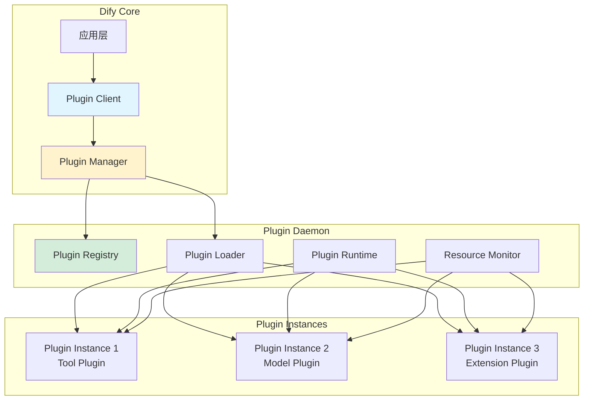
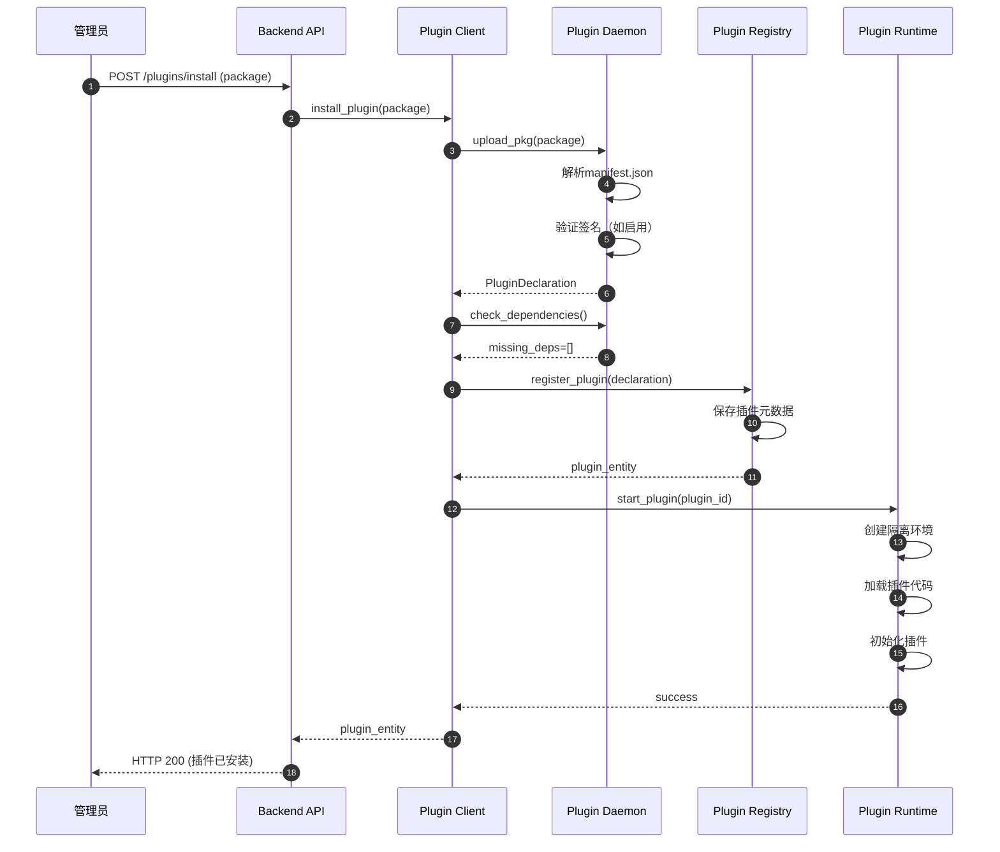
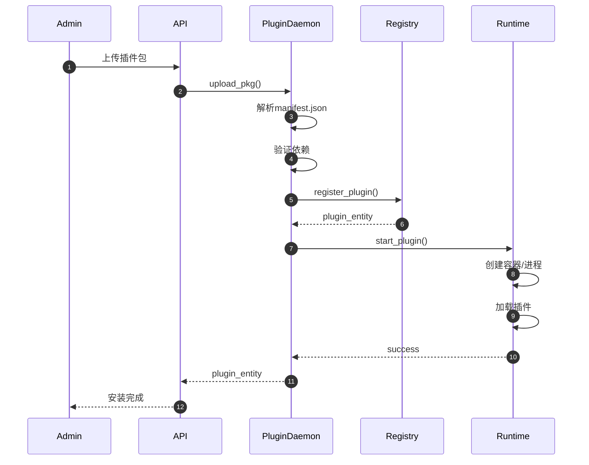
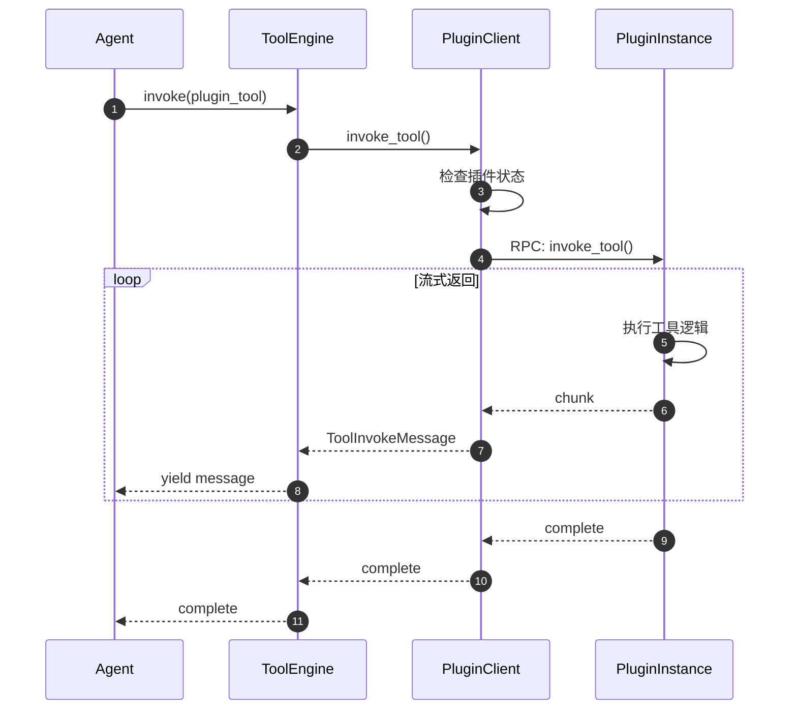
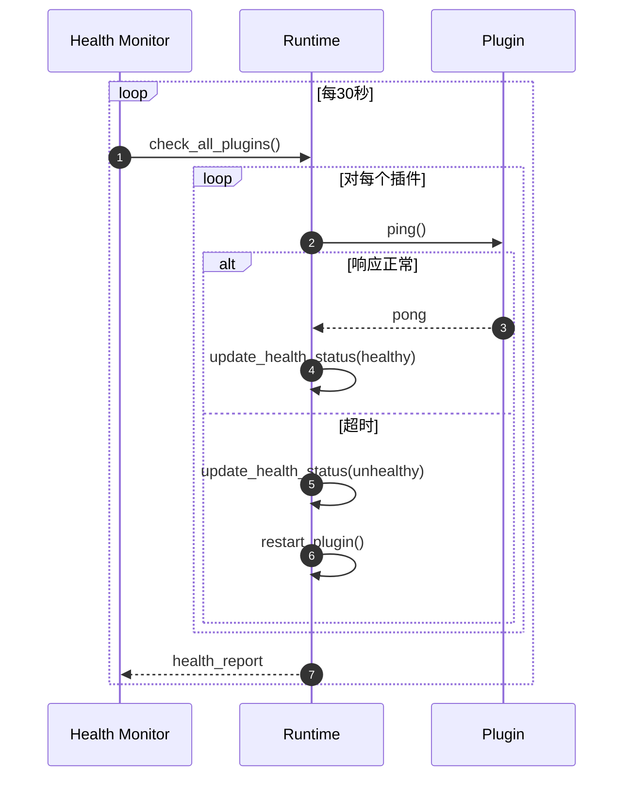

# Dify-10-Backend-Plugin插件系统-完整文档

## 摘要

Plugin插件系统是Dify的扩展机制，允许第三方开发者动态扩展Dify的能力，包括工具、模型、端点、数据源等。本文档包含插件系统的概览、API、数据结构和时序图。

---

## 第一部分：概览

### 一、核心职责

| 职责 | 说明 |
|------|------|
| **插件管理** | 插件的安装、卸载、启用、禁用 |
| **隔离运行** | 插件在独立进程中运行，确保安全性 |
| **生命周期** | 管理插件的启动、停止、健康检查 |
| **资源管理** | CPU、内存、网络等资源限制 |
| **版本管理** | 插件的版本控制和依赖管理 |

### 二、插件类型

| 类型 | 说明 | 示例 |
|------|------|------|
| **Tool Plugin** | 扩展工具能力 | Slack集成、GitHub操作 |
| **Model Plugin** | 扩展模型提供商 | 自定义LLM Provider |
| **Extension Plugin** | 扩展端点能力 | 自定义API端点 |
| **Datasource Plugin** | 扩展数据源 | 自定义数据库连接器 |

### 三、整体架构



---

## 第二部分：核心API

### API 列表

| API | 说明 | 调用方 |
|-----|------|--------|
| `install_plugin` | 安装插件 | 管理员 |
| `uninstall_plugin` | 卸载插件 | 管理员 |
| `list_plugins` | 列出所有插件 | 应用层 |
| `invoke_tool` | 调用工具插件 | ToolEngine |
| `invoke_llm` | 调用模型插件 | ModelRuntime |
| `get_plugin_declaration` | 获取插件声明 | PluginManager |

### 一、install_plugin（安装插件）

**请求结构**：
```python
def install_plugin(
    tenant_id: str,               # 租户ID
    source: PluginInstallationSource,  # 安装来源
    package: bytes | str,         # 插件包或标识
    verify_signature: bool = False,  # 是否验证签名
) -> PluginEntity:
    ...
```

**PluginInstallationSource枚举**：
```python
class PluginInstallationSource(StrEnum):
    GITHUB = 'github'         # GitHub仓库
    MARKETPLACE = 'marketplace'  # 插件市场
    PACKAGE = 'package'       # 本地包
```

**核心代码**：
```python
def install_plugin(
    tenant_id: str,
    source: PluginInstallationSource,
    package: bytes | str,
    verify_signature: bool = False
) -> PluginEntity:
    """
    安装插件
    
    流程：
    1. 上传插件包
    2. 解析插件声明
    3. 验证依赖
    4. 安装依赖插件
    5. 注册插件
    6. 启动插件
    """
    # 1. 上传插件包
    if isinstance(package, bytes):
        decode_response = upload_pkg(tenant_id, package, verify_signature)
    else:
        decode_response = fetch_plugin_by_identifier(tenant_id, package)
    
    # 2. 解析插件声明
    declaration = decode_response.declaration
    
    # 3. 验证依赖
    missing_deps = check_dependencies(declaration)
    if missing_deps:
        raise PluginDependencyError(f"Missing dependencies: {missing_deps}")
    
    # 4. 安装依赖插件
    for dep in declaration.dependencies:
        if not is_installed(dep):
            install_plugin(tenant_id, dep.type, dep.value)
    
    # 5. 注册插件
    plugin_entity = register_plugin(tenant_id, declaration)
    
    # 6. 启动插件
    start_plugin(tenant_id, plugin_entity.plugin_id)
    
    return plugin_entity
```

**时序图**：


---

### 二、invoke_tool（调用工具插件）

**请求结构**：
```python
def invoke_tool(
    tenant_id: str,
    user_id: str,
    plugin_id: str,
    provider: str,
    tool_name: str,
    credentials: dict,
    tool_parameters: dict,
) -> Generator[ToolInvokeMessage, None, None]:
    ...
```

**核心代码**：
```python
def invoke_tool(
    tenant_id: str,
    user_id: str,
    plugin_id: str,
    provider: str,
    tool_name: str,
    credentials: dict,
    tool_parameters: dict,
) -> Generator[ToolInvokeMessage, None, None]:
    """
    调用工具插件
    
    流程：
    1. 检查插件状态
    2. 构建请求
    3. 通过RPC调用插件
    4. 流式返回结果
    """
    # 1. 检查插件状态
    plugin = get_plugin(tenant_id, plugin_id)
    if plugin.status != PluginStatus.RUNNING:
        raise PluginNotRunningError(f"Plugin {plugin_id} is not running")
    
    # 2. 构建请求
    request = ToolInvokeRequest(
        tenant_id=tenant_id,
        user_id=user_id,
        provider=provider,
        tool_name=tool_name,
        credentials=credentials,
        parameters=tool_parameters
    )
    
    # 3. 通过RPC调用插件
    response_stream = rpc_call(
        plugin_endpoint=plugin.endpoint,
        method="invoke_tool",
        request=request
    )
    
    # 4. 流式返回结果
    for chunk in response_stream:
        yield ToolInvokeMessage.from_json(chunk)
```

---

## 第三部分：数据结构

### 一、PluginDeclaration（插件声明）

**定义**：
```python
class PluginDeclaration(BaseModel):
    """插件声明（来自manifest.json）"""
    
    version: str                      # 插件版本
    author: str                       # 作者
    name: str                         # 插件名称
    description: I18nObject           # 描述
    icon: str                         # 图标
    label: I18nObject                 # 标签
    category: PluginCategory          # 类别
    created_at: datetime              # 创建时间
    resource: PluginResourceRequirements  # 资源需求
    plugins: Plugins                  # 插件内容
    meta: Meta                        # 元数据
```

**PluginCategory枚举**：
```python
class PluginCategory(StrEnum):
    Tool = 'tool'             # 工具插件
    Model = 'model'           # 模型插件
    Extension = 'extension'   # 扩展插件
    Datasource = 'datasource' # 数据源插件
```

**Plugins结构**：
```python
class Plugins(BaseModel):
    tools: list[str] = []         # 工具列表
    models: list[str] = []        # 模型列表
    endpoints: list[str] = []     # 端点列表
    datasources: list[str] = []   # 数据源列表
```

---

### 二、PluginResourceRequirements（资源需求）

**定义**：
```python
class PluginResourceRequirements(BaseModel):
    """插件资源需求"""
    
    memory: int = 256              # 内存限制（MB）
    storage: int = 100             # 存储限制（MB）
    max_concurrent_requests: int = 10  # 最大并发请求
    timeout: int = 30              # 超时时间（秒）
    permission: Permission = None  # 权限要求
```

**Permission结构**：
```python
class Permission(BaseModel):
    tool: ToolPermission = None
    model: ModelPermission = None
    node: NodePermission = None
    endpoint: EndpointPermission = None
    app: AppPermission = None
    storage: StoragePermission = None
```

---

### 三、PluginEntity（插件实体）

**定义**：
```python
class PluginEntity(BaseModel):
    """插件实体（运行时）"""
    
    tenant_id: str                    # 租户ID
    plugin_id: str                    # 插件ID
    plugin_unique_identifier: str     # 唯一标识
    installation_id: str              # 安装ID
    declaration: PluginDeclaration    # 声明
    status: PluginStatus              # 状态
    endpoint: str                     # RPC端点
```

**PluginStatus枚举**：
```python
class PluginStatus(StrEnum):
    INSTALLING = 'installing'     # 安装中
    INSTALLED = 'installed'       # 已安装
    RUNNING = 'running'           # 运行中
    STOPPED = 'stopped'           # 已停止
    ERROR = 'error'               # 错误
```

---

## 第四部分：关键时序图

### 一、插件安装流程



---

### 二、工具调用流程



---

### 三、健康检查流程



---

## 第五部分：开发指南

### 一、插件结构

```
my-plugin/
├── manifest.json              # 插件声明
├── README.md                  # 说明文档
├── requirements.txt           # Python依赖
├── icon.svg                   # 图标
├── tools/                     # 工具定义
│   ├── my_tool.yaml
│   └── my_tool.py
├── models/                    # 模型定义（可选）
│   └── my_model.py
└── endpoints/                 # 端点定义（可选）
    └── my_endpoint.py
```

### 二、manifest.json示例

```json
{
  "version": "1.0.0",
  "author": "your_name",
  "name": "my_plugin",
  "label": {
    "en_US": "My Plugin",
    "zh_Hans": "我的插件"
  },
  "description": {
    "en_US": "A sample plugin",
    "zh_Hans": "示例插件"
  },
  "icon": "icon.svg",
  "category": "tool",
  "resource": {
    "memory": 256,
    "storage": 100,
    "max_concurrent_requests": 10,
    "timeout": 30
  },
  "plugins": {
    "tools": ["my_tool"]
  },
  "meta": {
    "version": "1.0.0",
    "minimum_dify_version": "0.6.0"
  }
}
```

### 三、工具实现示例

```python
# my_tool.py
from dify_plugin import Tool, ToolInvokeMessage

class MyTool(Tool):
    def _invoke(self, tool_parameters: dict) -> ToolInvokeMessage:
        """
        工具执行逻辑
        """
        query = tool_parameters.get('query')
        
        # 执行业务逻辑
        result = self.do_something(query)
        
        # 返回结果
        return self.create_json_message(result)
    
    def do_something(self, query: str) -> dict:
        # 实际业务逻辑
        return {"status": "success", "data": query}
```

---

## 第六部分：最佳实践

### 一、资源限制

```python
# 在manifest.json中设置合理的资源限制
{
  "resource": {
    "memory": 256,        # 根据实际需求设置
    "storage": 100,       # 避免占用过多存储
    "max_concurrent_requests": 10,  # 限制并发
    "timeout": 30         # 设置合理超时
  }
}
```

### 二、错误处理

```python
def _invoke(self, tool_parameters: dict) -> ToolInvokeMessage:
    try:
        result = self.do_something(tool_parameters)
        return self.create_json_message(result)
    except ValueError as e:
        return self.create_text_message(f"Invalid input: {str(e)}")
    except Exception as e:
        return self.create_text_message(f"Error: {str(e)}")
```

### 三、性能优化

```python
# 使用缓存
from functools import lru_cache

@lru_cache(maxsize=100)
def expensive_operation(input_data: str) -> str:
    # 昂贵的操作
    return process(input_data)
```

---

## 第七部分：性能数据

| 指标 | 数值 | 说明 |
|------|------|------|
| **启动时间** | < 3s | 插件启动时间 |
| **调用延迟** | 200ms (P50) | 工具调用延迟 |
| **内存占用** | 256MB (平均) | 每个插件实例 |
| **并发能力** | 10 QPS/插件 | 单插件并发 |
| **重启时间** | < 5s | 插件重启时间 |

---

## 附录

### A. 插件生命周期

```
1. 开发 → 2. 打包 → 3. 上传 → 4. 安装 → 5. 运行 → 6. 更新 → 7. 卸载
```

### B. 常见问题

**Q: 如何调试插件？**
A: 使用本地开发模式，查看插件日志。

**Q: 插件如何访问Dify API？**
A: 通过Backwards Invocation机制。

**Q: 如何更新插件？**
A: 上传新版本包，系统自动迁移。

---

**文档版本**：v1.0  
**生成日期**：2025-10-04  
**维护者**：Backend Team  
**完整性**：包含概览、API、数据结构、时序图

