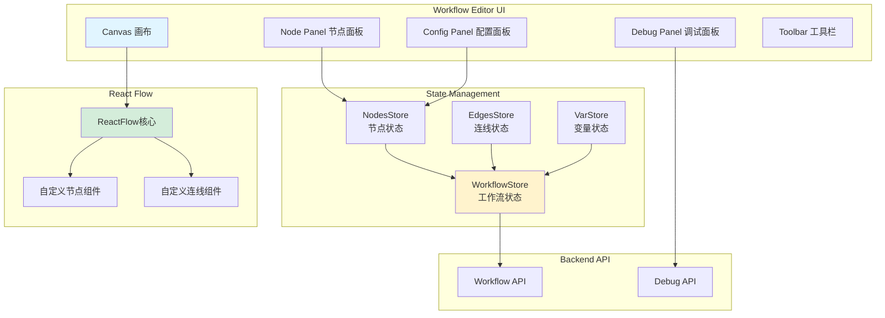
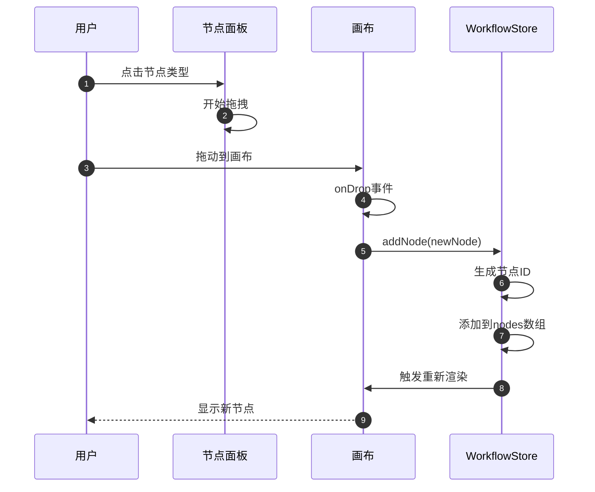
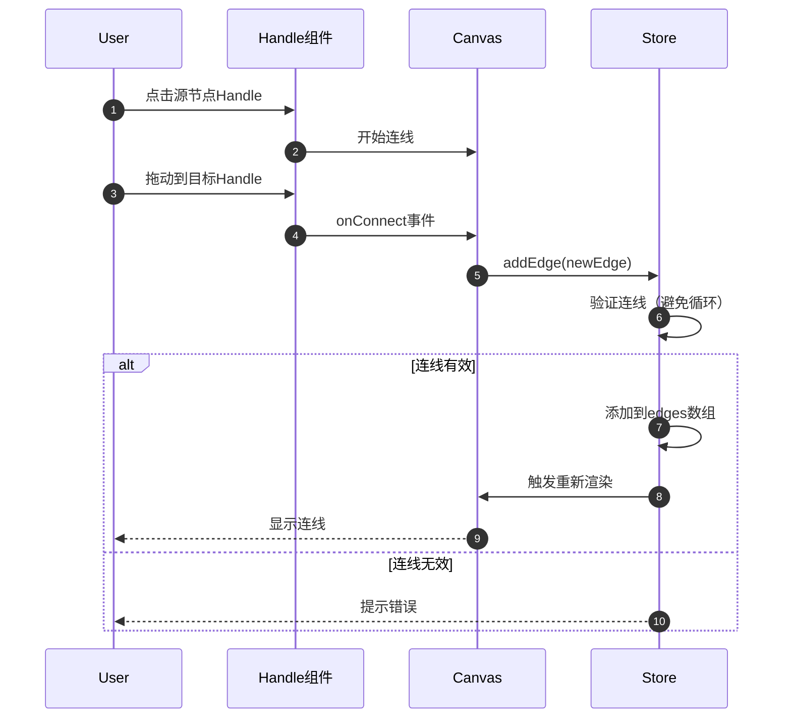
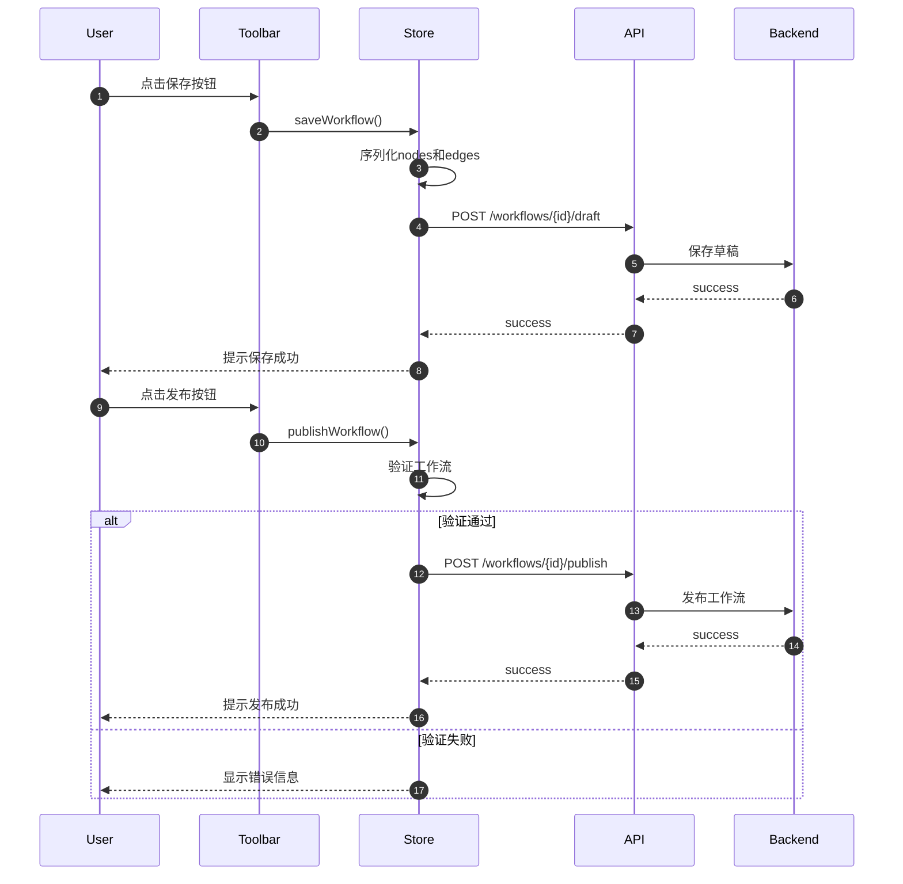

# Dify-11-Frontend-Workflow工作流编辑器-完整文档

## 摘要

Workflow工作流编辑器是Dify Frontend中用于可视化编排工作流的核心模块，提供拖拽式节点编辑、连线管理、参数配置、调试运行等完整功能。本文档包含编辑器的架构、核心组件、状态管理和交互流程。

---

## 第一部分：架构概览

### 一、核心功能

| 功能 | 说明 |
|------|------|
| **节点管理** | 添加、删除、配置各类节点（LLM/Agent/Code/HTTP等） |
| **连线管理** | 节点间的连线、分支、循环逻辑 |
| **画布操作** | 缩放、平移、对齐、框选 |
| **参数配置** | 节点参数的表单配置 |
| **变量管理** | 全局变量、节点输出变量的引用 |
| **调试运行** | 单步调试、查看执行结果 |
| **版本管理** | 草稿保存、发布、回滚 |

### 二、技术栈

| 技术 | 用途 |
|------|------|
| **React Flow** | 节点编辑器基础库 |
| **Zustand** | 状态管理 |
| **React Hook Form** | 表单管理 |
| **Tailwind CSS** | 样式 |
| **SWR** | 数据获取 |

### 三、整体架构



---

## 第二部分：核心组件

### 一、Canvas画布组件

**位置**：`web/app/components/workflow/index.tsx`

**核心功能**：
- 基于React Flow的可视化编辑器
- 支持拖拽添加节点
- 支持节点连线
- 支持画布缩放、平移

**组件结构**：
```typescript
function WorkflowCanvas() {
  const { nodes, edges, onNodesChange, onEdgesChange } = useWorkflowStore()
  const nodeTypes = useNodeTypes()
  const edgeTypes = useEdgeTypes()
  
  return (
    <ReactFlow
      nodes={nodes}
      edges={edges}
      nodeTypes={nodeTypes}
      edgeTypes={edgeTypes}
      onNodesChange={onNodesChange}
      onEdgesChange={onEdgesChange}
      onConnect={handleConnect}
      onDrop={handleDrop}
      onDragOver={handleDragOver}
      fitView
      minZoom={0.1}
      maxZoom={2}
    >
      <Background />
      <Controls />
      <MiniMap />
    </ReactFlow>
  )
}
```

---

### 二、节点类型

#### 2.1 节点分类

| 类型 | 节点 | 说明 |
|------|------|------|
| **输入输出** | Start, End | 工作流开始和结束 |
| **LLM** | LLM | 调用大语言模型 |
| **逻辑控制** | IF/ELSE, Loop | 条件分支、循环 |
| **数据处理** | Code, Template | 代码执行、模板渲染 |
| **外部调用** | HTTP Request, Tool | HTTP请求、工具调用 |
| **知识库** | Knowledge Retrieval | 知识库检索 |
| **变量操作** | Variable Aggregator | 变量聚合 |

#### 2.2 节点组件示例

```typescript
// LLM节点
function LLMNode({ id, data }: NodeProps) {
  const { updateNodeData } = useWorkflowStore()
  const [isConfigOpen, setIsConfigOpen] = useState(false)
  
  return (
    <div className="node llm-node">
      {/* 节点头部 */}
      <div className="node-header">
        <span className="node-icon">🤖</span>
        <span className="node-title">{data.title}</span>
        <button onClick={() => setIsConfigOpen(true)}>
          <SettingsIcon />
        </button>
      </div>
      
      {/* 输入Handle */}
      <Handle
        type="target"
        position={Position.Left}
        id="input"
      />
      
      {/* 节点内容 */}
      <div className="node-content">
        <div className="model-info">
          {data.model || 'Select model...'}
        </div>
      </div>
      
      {/* 输出Handle */}
      <Handle
        type="source"
        position={Position.Right}
        id="output"
      />
      
      {/* 配置面板 */}
      {isConfigOpen && (
        <LLMNodeConfigPanel
          nodeId={id}
          data={data}
          onClose={() => setIsConfigOpen(false)}
          onSave={(newData) => {
            updateNodeData(id, newData)
            setIsConfigOpen(false)
          }}
        />
      )}
    </div>
  )
}
```

---

### 三、状态管理（Zustand）

#### 3.1 WorkflowStore

```typescript
interface WorkflowState {
  // 基本信息
  workflowId: string
  workflowName: string
  
  // 节点和连线
  nodes: Node[]
  edges: Edge[]
  
  // 选中状态
  selectedNodeId: string | null
  selectedEdgeId: string | null
  
  // 变量
  variables: Variable[]
  
  // 操作方法
  addNode: (node: Node) => void
  removeNode: (nodeId: string) => void
  updateNodeData: (nodeId: string, data: any) => void
  
  addEdge: (edge: Edge) => void
  removeEdge: (edgeId: string) => void
  
  onNodesChange: OnNodesChange
  onEdgesChange: OnEdgesChange
  
  // 保存和发布
  saveWorkflow: () => Promise<void>
  publishWorkflow: () => Promise<void>
  
  // 调试
  runWorkflow: (inputs: Record<string, any>) => Promise<void>
}

const useWorkflowStore = create<WorkflowState>((set, get) => ({
  workflowId: '',
  workflowName: '',
  nodes: [],
  edges: [],
  selectedNodeId: null,
  selectedEdgeId: null,
  variables: [],
  
  addNode: (node) => set((state) => ({
    nodes: [...state.nodes, node]
  })),
  
  removeNode: (nodeId) => set((state) => ({
    nodes: state.nodes.filter(n => n.id !== nodeId),
    edges: state.edges.filter(e => 
      e.source !== nodeId && e.target !== nodeId
    )
  })),
  
  updateNodeData: (nodeId, data) => set((state) => ({
    nodes: state.nodes.map(node =>
      node.id === nodeId
        ? { ...node, data: { ...node.data, ...data } }
        : node
    )
  })),
  
  addEdge: (edge) => set((state) => ({
    edges: [...state.edges, edge]
  })),
  
  removeEdge: (edgeId) => set((state) => ({
    edges: state.edges.filter(e => e.id !== edgeId)
  })),
  
  onNodesChange: (changes) => {
    set((state) => ({
      nodes: applyNodeChanges(changes, state.nodes)
    }))
  },
  
  onEdgesChange: (changes) => {
    set((state) => ({
      edges: applyEdgeChanges(changes, state.edges)
    }))
  },
  
  saveWorkflow: async () => {
    const { workflowId, nodes, edges } = get()
    await saveWorkflowDraft(workflowId, { nodes, edges })
  },
  
  publishWorkflow: async () => {
    const { workflowId, nodes, edges } = get()
    await publishWorkflow(workflowId, { nodes, edges })
  },
  
  runWorkflow: async (inputs) => {
    const { workflowId } = get()
    await runWorkflowDebug(workflowId, inputs)
  }
}))
```

---

### 四、节点配置面板

```typescript
function LLMNodeConfigPanel({ nodeId, data, onClose, onSave }: Props) {
  const { register, handleSubmit, watch, setValue } = useForm({
    defaultValues: data
  })
  
  const selectedModel = watch('model')
  
  return (
    <SidePanel title="LLM Configuration" onClose={onClose}>
      <form onSubmit={handleSubmit(onSave)}>
        {/* 模型选择 */}
        <Section title="Model">
          <ModelSelector
            value={selectedModel}
            onChange={(model) => setValue('model', model)}
          />
        </Section>
        
        {/* 提示词 */}
        <Section title="Prompt">
          <PromptEditor
            value={data.prompt}
            variables={getAvailableVariables(nodeId)}
            onChange={(prompt) => setValue('prompt', prompt)}
          />
        </Section>
        
        {/* 参数配置 */}
        <Section title="Parameters">
          <div className="space-y-4">
            <Slider
              label="Temperature"
              {...register('temperature')}
              min={0}
              max={2}
              step={0.1}
            />
            <InputNumber
              label="Max Tokens"
              {...register('max_tokens')}
              min={1}
              max={4096}
            />
          </div>
        </Section>
        
        {/* 输出配置 */}
        <Section title="Output">
          <Input
            label="Output Variable"
            {...register('output_variable')}
            placeholder="llm_output"
          />
        </Section>
        
        {/* 保存按钮 */}
        <div className="flex justify-end space-x-2">
          <Button variant="secondary" onClick={onClose}>
            Cancel
          </Button>
          <Button type="submit">
            Save
          </Button>
        </div>
      </form>
    </SidePanel>
  )
}
```

---

### 五、变量系统

#### 5.1 变量引用

```typescript
function VariableSelector({ value, onChange, nodeId }: Props) {
  const variables = useAvailableVariables(nodeId)
  
  return (
    <Select
      value={value}
      onChange={onChange}
      options={variables.map(v => ({
        label: `{{${v.path}}}`,
        value: v.path,
        icon: getVariableIcon(v.type)
      }))}
      placeholder="Select variable..."
    />
  )
}

function useAvailableVariables(nodeId: string) {
  const { nodes } = useWorkflowStore()
  
  // 获取当前节点之前的所有节点
  const previousNodes = getPreviousNodes(nodeId, nodes)
  
  // 收集所有可用变量
  const variables = []
  
  // 添加全局变量
  variables.push(...getGlobalVariables())
  
  // 添加每个节点的输出变量
  previousNodes.forEach(node => {
    const outputs = getNodeOutputs(node)
    outputs.forEach(output => {
      variables.push({
        path: `${node.id}.${output.name}`,
        type: output.type,
        label: `${node.data.title} - ${output.label}`
      })
    })
  })
  
  return variables
}
```

---

## 第三部分：关键流程

### 一、添加节点流程



### 二、节点连线流程



### 三、保存和发布流程



---

## 第四部分：调试功能

### 一、调试面板

```typescript
function DebugPanel({ workflowId }: Props) {
  const [inputs, setInputs] = useState<Record<string, any>>({})
  const [isRunning, setIsRunning] = useState(false)
  const [executionId, setExecutionId] = useState<string>()
  const [nodeExecutions, setNodeExecutions] = useState<NodeExecution[]>([])
  
  const handleRun = async () => {
    setIsRunning(true)
    
    try {
      // 开始执行
      const result = await runWorkflowDebug(workflowId, inputs)
      setExecutionId(result.execution_id)
      
      // SSE接收执行结果
      const eventSource = new EventSource(
        `/workflows/${workflowId}/executions/${result.execution_id}/stream`
      )
      
      eventSource.onmessage = (event) => {
        const data = JSON.parse(event.data)
        
        if (data.event === 'node_started') {
          updateNodeStatus(data.node_id, 'running')
        } else if (data.event === 'node_finished') {
          updateNodeStatus(data.node_id, 'success')
          setNodeExecutions(prev => [...prev, data])
        } else if (data.event === 'workflow_finished') {
          setIsRunning(false)
          eventSource.close()
        }
      }
      
    } catch (error) {
      setIsRunning(false)
      Toast.error('Execution failed')
    }
  }
  
  return (
    <Panel title="Debug">
      {/* 输入变量 */}
      <Section title="Inputs">
        {getWorkflowInputs().map(input => (
          <Input
            key={input.variable}
            label={input.label}
            value={inputs[input.variable] || ''}
            onChange={(value) => setInputs({
              ...inputs,
              [input.variable]: value
            })}
          />
        ))}
      </Section>
      
      {/* 执行按钮 */}
      <Button
        onClick={handleRun}
        disabled={isRunning}
        loading={isRunning}
      >
        {isRunning ? 'Running...' : 'Run'}
      </Button>
      
      {/* 执行结果 */}
      {nodeExecutions.length > 0 && (
        <Section title="Execution Log">
          {nodeExecutions.map(exec => (
            <NodeExecutionCard
              key={exec.node_id}
              execution={exec}
            />
          ))}
        </Section>
      )}
    </Panel>
  )
}
```

---

## 第五部分：性能优化

### 一、大规模节点优化

```typescript
// 使用虚拟化渲染大量节点
function OptimizedCanvas() {
  const nodes = useWorkflowStore(state => state.nodes)
  
  // 只渲染可视区域的节点
  const visibleNodes = useMemo(() => {
    const viewport = getViewport()
    return nodes.filter(node => isNodeInViewport(node, viewport))
  }, [nodes, viewport])
  
  return (
    <ReactFlow
      nodes={visibleNodes}
      // ...
    />
  )
}
```

### 二、状态更新优化

```typescript
// 使用Immer减少不必要的渲染
import { produce } from 'immer'

const useWorkflowStore = create<WorkflowState>((set) => ({
  updateNodeData: (nodeId, data) => 
    set(produce((state) => {
      const node = state.nodes.find(n => n.id === nodeId)
      if (node) {
        Object.assign(node.data, data)
      }
    }))
}))
```

---

## 第六部分：最佳实践

### 一、节点设计原则

1. **单一职责**：每个节点只做一件事
2. **清晰输入输出**：明确定义节点的输入和输出
3. **错误处理**：提供友好的错误提示
4. **性能考虑**：避免在节点渲染中执行耗时操作

### 二、连线规则

1. **避免循环**：检测并阻止循环连线
2. **类型匹配**：确保输出类型与输入类型匹配
3. **单一输入**：大多数节点只允许一个输入连线
4. **多个输出**：支持分支和条件输出

### 三、变量命名

1. **语义化**：使用有意义的变量名
2. **作用域清晰**：区分全局变量和节点输出
3. **避免冲突**：使用节点ID作为命名空间

---

## 附录

### A. 支持的节点类型

完整节点列表详见Backend Workflow文档。

### B. React Flow配置

```typescript
const reactFlowConfig = {
  nodeTypes: customNodeTypes,
  edgeTypes: customEdgeTypes,
  defaultEdgeOptions: {
    type: 'smoothstep',
    animated: false,
    style: { stroke: '#cbd5e1', strokeWidth: 2 }
  },
  connectionLineStyle: { stroke: '#3b82f6', strokeWidth: 2 },
  snapToGrid: true,
  snapGrid: [15, 15],
  fitView: true,
  attributionPosition: 'bottom-left'
}
```

---

**文档版本**：v1.0  
**生成日期**：2025-10-04  
**维护者**：Frontend Team  
**完整性**：包含架构、组件、状态管理、流程、优化

