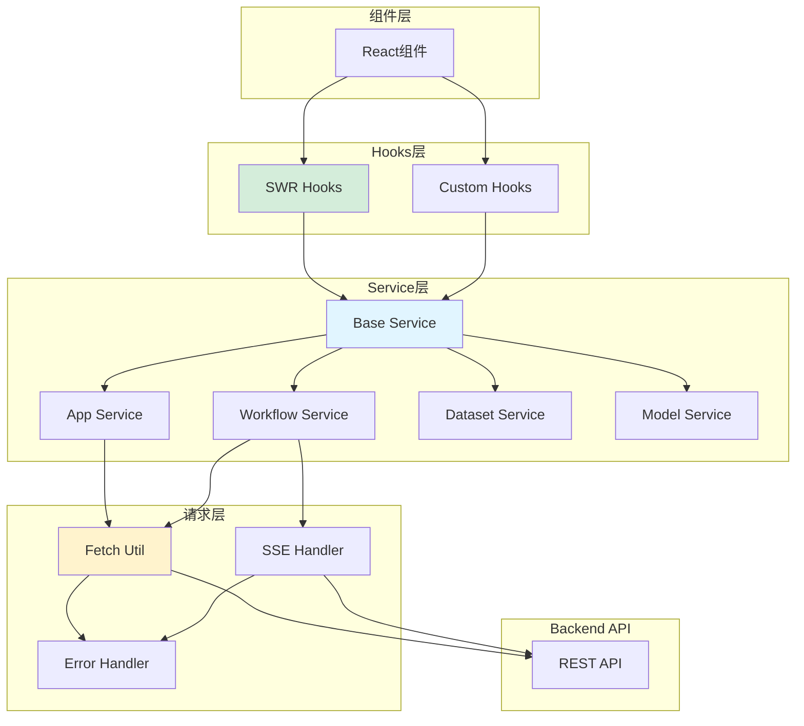
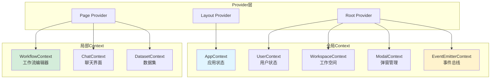
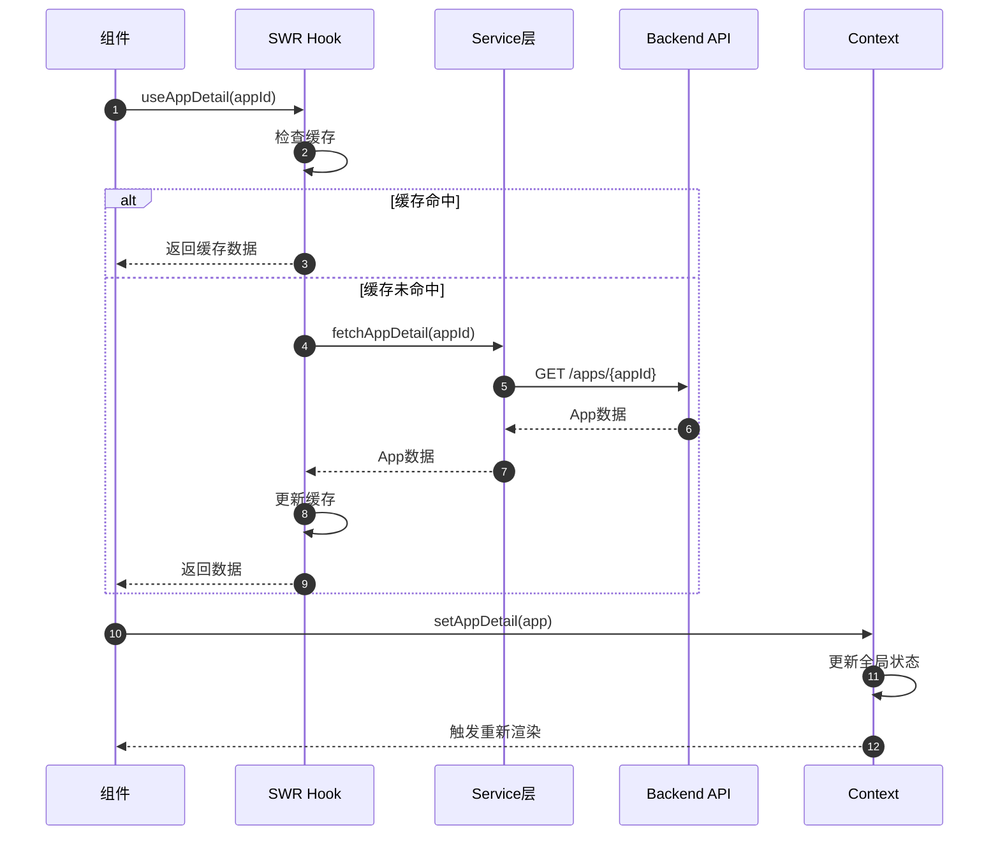

# Dify-12-Frontend-Service服务层与Context状态管理-完整文档

## 摘要

本文档整合Frontend的Service服务层和Context状态管理两大核心模块，详细说明数据获取、状态管理、全局Context的设计和使用。

---

## 第一部分：Service服务层

### 一、架构概览



### 二、核心Service

#### 2.1 Base Service（基础服务）

**位置**：`web/service/base.ts`

**核心功能**：
- 统一的请求封装
- 错误处理
- 认证管理
- SSE流式处理

**核心代码**：
```typescript
// 统一请求方法
export const request = async <T>(
  url: string,
  options: RequestOptions = {}
): Promise<T> => {
  const {
    method = 'GET',
    params,
    body,
    headers = {},
    ...rest
  } = options
  
  // 构建完整URL
  const fullUrl = buildUrl(url, params)
  
  // 构建Headers
  const requestHeaders = {
    'Content-Type': 'application/json',
    ...getAuthHeaders(),
    ...headers,
  }
  
  // 构建请求配置
  const config: RequestInit = {
    method,
    headers: requestHeaders,
    ...rest,
  }
  
  if (body) {
    config.body = JSON.stringify(body)
  }
  
  // 发送请求
  const response = await fetch(fullUrl, config)
  
  // 处理响应
  if (!response.ok) {
    await handleErrorResponse(response)
  }
  
  return response.json()
}

// SSE流式请求
export const ssePost = <T = any>(
  url: string,
  options: SSEOptions,
  onData: (data: T, isFirst: boolean, info: any) => void,
  onMessageEnd?: (data: any) => void,
  onError?: (error: Error) => void,
  onCompleted?: () => void
): AbortController => {
  const controller = new AbortController()
  
  fetch(url, {
    method: 'POST',
    headers: {
      'Content-Type': 'application/json',
      ...getAuthHeaders(),
    },
    body: JSON.stringify(options.body),
    signal: controller.signal,
  })
    .then(async (response) => {
      if (!response.ok) {
        await handleErrorResponse(response)
      }
      
      const reader = response.body?.getReader()
      const decoder = new TextDecoder()
      let buffer = ''
      let isFirst = true
      
      while (true) {
        const { done, value } = await reader!.read()
        
        if (done) {
          onCompleted?.()
          break
        }
        
        buffer += decoder.decode(value, { stream: true })
        const lines = buffer.split('\n')
        buffer = lines.pop() || ''
        
        for (const line of lines) {
          if (line.startsWith('data: ')) {
            const data = line.slice(6)
            
            if (data === '[DONE]') {
              onCompleted?.()
              return
            }
            
            try {
              const parsed = JSON.parse(data)
              
              if (parsed.event === 'message') {
                onData(parsed.data, isFirst, parsed)
                isFirst = false
              } else if (parsed.event === 'message_end') {
                onMessageEnd?.(parsed.data)
              } else if (parsed.event === 'error') {
                onError?.(new Error(parsed.data.message))
              }
            } catch (e) {
              console.error('Failed to parse SSE data:', e)
            }
          }
        }
      }
    })
    .catch((error) => {
      if (error.name !== 'AbortError') {
        onError?.(error)
      }
    })
  
  return controller
}
```

---

#### 2.2 App Service（应用服务）

**位置**：`web/service/apps.ts`

**核心API**：
```typescript
// 获取应用列表
export const fetchAppList = (): Promise<{ data: App[] }> => {
  return request('/apps')
}

// 获取应用详情
export const fetchAppDetail = (appId: string): Promise<App> => {
  return request(`/apps/${appId}`)
}

// 更新应用配置
export const updateAppModelConfig = (
  appId: string,
  config: ModelConfig
): Promise<App> => {
  return request(`/apps/${appId}/model-config`, {
    method: 'POST',
    body: config,
  })
}

// 发送聊天消息（流式）
export const sendChatMessage = (
  appId: string,
  data: ChatRequest,
  callbacks: {
    onData: (chunk: string, isFirst: boolean, info: any) => void
    onMessageEnd?: (data: any) => void
    onError?: (error: Error) => void
    onCompleted?: () => void
  }
): AbortController => {
  return ssePost(
    `/apps/${appId}/chat-messages`,
    { body: data },
    callbacks.onData,
    callbacks.onMessageEnd,
    callbacks.onError,
    callbacks.onCompleted
  )
}
```

---

#### 2.3 Workflow Service（工作流服务）

**核心API**：
```typescript
// 保存工作流草稿
export const saveWorkflowDraft = (
  appId: string,
  data: { nodes: Node[], edges: Edge[] }
): Promise<void> => {
  return request(`/apps/${appId}/workflows/draft`, {
    method: 'POST',
    body: data,
  })
}

// 发布工作流
export const publishWorkflow = (
  appId: string,
  data: { nodes: Node[], edges: Edge[] }
): Promise<void> => {
  return request(`/apps/${appId}/workflows/publish`, {
    method: 'POST',
    body: data,
  })
}

// 运行工作流（流式）
export const runWorkflow = (
  appId: string,
  inputs: Record<string, any>,
  callbacks: WorkflowCallbacks
): AbortController => {
  return ssePost(
    `/workflows/run`,
    { body: { inputs } },
    (data, isFirst, info) => {
      if (data.event === 'node_started') {
        callbacks.onNodeStarted?.(data)
      } else if (data.event === 'node_finished') {
        callbacks.onNodeFinished?.(data)
      } else if (data.event === 'workflow_finished') {
        callbacks.onWorkflowFinished?.(data)
      }
    },
    callbacks.onCompleted,
    callbacks.onError
  )
}
```

---

### 三、SWR集成

#### 3.1 数据获取Hooks

```typescript
// 获取应用列表（自动缓存）
export function useAppList() {
  const { data, error, mutate } = useSWR<{ data: App[] }>(
    '/apps',
    fetchAppList,
    {
      revalidateOnFocus: false,
      dedupingInterval: 300000, // 5分钟
    }
  )
  
  return {
    apps: data?.data,
    isLoading: !error && !data,
    isError: error,
    refresh: mutate,
  }
}

// 获取应用详情
export function useAppDetail(appId: string) {
  const { data, error, mutate } = useSWR<App>(
    appId ? `/apps/${appId}` : null,
    () => fetchAppDetail(appId),
    {
      revalidateOnFocus: false,
    }
  )
  
  return {
    app: data,
    isLoading: !error && !data,
    isError: error,
    refresh: mutate,
  }
}

// 获取模型列表
export function useModelList() {
  const { data, error } = useSWR<ModelProvider[]>(
    '/workspaces/current/models/provider/credentials',
    fetchModelProviders
  )
  
  return {
    providers: data,
    isLoading: !error && !data,
    isError: error,
  }
}
```

---

## 第二部分：Context状态管理

### 一、Context架构



---

### 二、核心Context

#### 2.1 AppContext（应用状态）

**位置**：`context/app-context.tsx`

**定义**：
```typescript
interface AppContextValue {
  // 应用详情
  appDetail: App | null
  setAppDetail: (app: App | null) => void
  
  // 侧边栏
  appSidebarExpand: 'expand' | 'collapse'
  setAppSidebarExpand: (expand: 'expand' | 'collapse') => void
  
  // 加载状态
  isLoadingAppDetail: boolean
  setIsLoadingAppDetail: (loading: boolean) => void
}

export const AppContext = createContext<AppContextValue>({
  appDetail: null,
  setAppDetail: () => {},
  appSidebarExpand: 'expand',
  setAppSidebarExpand: () => {},
  isLoadingAppDetail: false,
  setIsLoadingAppDetail: () => {},
})

export const useAppContext = () => useContext(AppContext)
```

**Provider实现**：
```typescript
export function AppContextProvider({ children }: { children: ReactNode }) {
  const [appDetail, setAppDetail] = useState<App | null>(null)
  const [appSidebarExpand, setAppSidebarExpand] = useState<'expand' | 'collapse'>('expand')
  const [isLoadingAppDetail, setIsLoadingAppDetail] = useState(false)
  
  const value = useMemo(() => ({
    appDetail,
    setAppDetail,
    appSidebarExpand,
    setAppSidebarExpand,
    isLoadingAppDetail,
    setIsLoadingAppDetail,
  }), [appDetail, appSidebarExpand, isLoadingAppDetail])
  
  return (
    <AppContext.Provider value={value}>
      {children}
    </AppContext.Provider>
  )
}
```

**使用示例**：
```typescript
function ConfigurationPanel() {
  const { appDetail, setAppDetail } = useAppContext()
  
  const handleSave = async (config: ModelConfig) => {
    const updatedApp = await updateAppModelConfig(appDetail.id, config)
    setAppDetail(updatedApp)
    Toast.notify({ type: 'success', message: 'Saved successfully' })
  }
  
  return (
    <div>
      <h2>{appDetail?.name}</h2>
      <ModelConfigForm onSave={handleSave} />
    </div>
  )
}
```

---

#### 2.2 EventEmitterContext（事件总线）

**定义**：
```typescript
interface EventEmitterContextValue {
  eventEmitter: EventEmitter
}

export const EventEmitterContext = createContext<EventEmitterContextValue>({
  eventEmitter: new EventEmitter(),
})

export const useEventEmitterContextContext = () => useContext(EventEmitterContext)
```

**事件定义**：
```typescript
// 事件类型
export enum EventType {
  APP_UPDATED = 'app:updated',
  WORKFLOW_SAVED = 'workflow:saved',
  DATASET_UPDATED = 'dataset:updated',
  MESSAGE_SENT = 'message:sent',
}

// 使用示例
function ComponentA() {
  const { eventEmitter } = useEventEmitterContextContext()
  
  const handleSave = () => {
    // 保存后发送事件
    eventEmitter.emit(EventType.WORKFLOW_SAVED, { workflowId: '123' })
  }
  
  return <button onClick={handleSave}>Save</button>
}

function ComponentB() {
  const { eventEmitter } = useEventEmitterContextContext()
  
  useEffect(() => {
    // 监听事件
    const handler = (data: any) => {
      console.log('Workflow saved:', data.workflowId)
    }
    
    eventEmitter.on(EventType.WORKFLOW_SAVED, handler)
    
    return () => {
      eventEmitter.off(EventType.WORKFLOW_SAVED, handler)
    }
  }, [eventEmitter])
  
  return <div>Component B</div>
}
```

---

#### 2.3 ModalContext（弹窗管理）

**定义**：
```typescript
interface ModalContextValue {
  setShowAccountSettingModal: (show: boolean) => void
  setShowPricingModal: (show: boolean) => void
  setShowUpgradeModal: (show: boolean) => void
  plan: {
    type: string
    usage: Record<string, number>
    total: Record<string, number>
  }
  enableBilling: boolean
}

export const ModalContext = createContext<ModalContextValue | null>(null)

export const useModalContext = () => {
  const context = useContext(ModalContext)
  if (!context) {
    throw new Error('useModalContext must be used within ModalContextProvider')
  }
  return context
}
```

**使用示例**：
```typescript
function Header() {
  const { setShowAccountSettingModal, plan, enableBilling } = useModalContext()
  
  return (
    <div>
      <button onClick={() => setShowAccountSettingModal(true)}>
        Settings
      </button>
      {enableBilling && (
        <div>Plan: {plan.type}</div>
      )}
    </div>
  )
}
```

---

### 三、状态管理最佳实践

#### 3.1 Context vs Zustand

**使用Context的场景**：
- 全局配置（主题、语言）
- 用户信息
- 权限控制
- 跨组件通信（EventEmitter）

**使用Zustand的场景**：
- 复杂的局部状态（Workflow编辑器）
- 需要细粒度更新控制
- 性能敏感的场景
- 需要持久化的状态

**示例对比**：
```typescript
// ❌ 不好：在Context中存储频繁变化的状态
const WorkflowContext = createContext({
  nodes: [],
  edges: [],
  updateNode: () => {},
  // ... 大量状态
})

// ✅ 好：使用Zustand
const useWorkflowStore = create((set) => ({
  nodes: [],
  edges: [],
  updateNode: (id, data) => set((state) => ({
    nodes: state.nodes.map(n => n.id === id ? { ...n, data } : n)
  })),
}))
```

---

#### 3.2 避免Context地狱

```typescript
// ❌ 不好：嵌套多层Provider
<UserProvider>
  <WorkspaceProvider>
    <AppProvider>
      <ModalProvider>
        <EventProvider>
          <App />
        </EventProvider>
      </ModalProvider>
    </AppProvider>
  </WorkspaceProvider>
</UserProvider>

// ✅ 好：组合Provider
function AllProviders({ children }) {
  return (
    <UserProvider>
      <WorkspaceProvider>
        <AppProvider>
          <ModalProvider>
            <EventProvider>
              {children}
            </EventProvider>
          </ModalProvider>
        </AppProvider>
      </WorkspaceProvider>
    </UserProvider>
  )
}

<AllProviders>
  <App />
</AllProviders>
```

---

#### 3.3 性能优化

```typescript
// 使用useMemo避免不必要的重新渲染
function AppContextProvider({ children }) {
  const [appDetail, setAppDetail] = useState(null)
  
  // ✅ 使用useMemo缓存value
  const value = useMemo(() => ({
    appDetail,
    setAppDetail,
  }), [appDetail])
  
  return (
    <AppContext.Provider value={value}>
      {children}
    </AppContext.Provider>
  )
}

// 使用Context Selector避免全局重新渲染
import { createContext, useContextSelector } from 'use-context-selector'

const AppContext = createContext(null)

function ComponentA() {
  // 只订阅appDetail.name，其他变化不会触发重新渲染
  const appName = useContextSelector(AppContext, v => v.appDetail?.name)
  return <div>{appName}</div>
}
```

---

## 第三部分：数据流

### 一、完整数据流



---

### 二、错误处理

```typescript
// 统一错误处理
async function handleErrorResponse(response: Response) {
  let errorMessage = 'Request failed'
  
  try {
    const errorData = await response.json()
    errorMessage = errorData.message || errorMessage
  } catch (e) {
    // JSON解析失败，使用默认消息
  }
  
  // 根据状态码处理
  if (response.status === 401) {
    // 未授权，跳转登录
    window.location.href = '/signin'
    throw new UnauthorizedError(errorMessage)
  } else if (response.status === 403) {
    // 无权限
    Toast.error('You do not have permission to perform this action')
    throw new ForbiddenError(errorMessage)
  } else if (response.status === 429) {
    // 速率限制
    Toast.error('Too many requests, please try again later')
    throw new RateLimitError(errorMessage)
  } else {
    // 其他错误
    Toast.error(errorMessage)
    throw new APIError(errorMessage)
  }
}

// 在组件中使用
function MyComponent() {
  const [loading, setLoading] = useState(false)
  
  const handleAction = async () => {
    setLoading(true)
    
    try {
      await someAPICall()
      Toast.success('Action completed')
    } catch (error) {
      // 错误已经在handleErrorResponse中处理
      console.error(error)
    } finally {
      setLoading(false)
    }
  }
  
  return <button onClick={handleAction}>Action</button>
}
```

---

## 第四部分：最佳实践总结

### 一、Service层

1. **统一封装**：所有API调用通过Service层
2. **类型安全**：使用TypeScript定义请求响应类型
3. **错误处理**：统一的错误处理和重试机制
4. **缓存策略**：合理使用SWR缓存
5. **取消请求**：使用AbortController支持取消

### 二、Context

1. **合理拆分**：按功能域拆分Context
2. **性能优化**：使用useMemo缓存value
3. **类型安全**：完整的TypeScript类型定义
4. **Provider组合**：避免Provider地狱
5. **事件通信**：使用EventEmitter解耦组件

### 三、状态管理选择

| 场景 | 推荐方案 | 原因 |
|------|---------|------|
| 全局配置 | Context | 不频繁变化 |
| 用户信息 | Context | 全局共享 |
| 复杂编辑器 | Zustand | 性能和灵活性 |
| 列表数据 | SWR | 自动缓存和刷新 |
| 临时状态 | useState | 简单直接 |

---

**文档版本**：v1.0  
**生成日期**：2025-10-04  
**维护者**：Frontend Team  
**完整性**：包含Service层和Context状态管理完整内容

