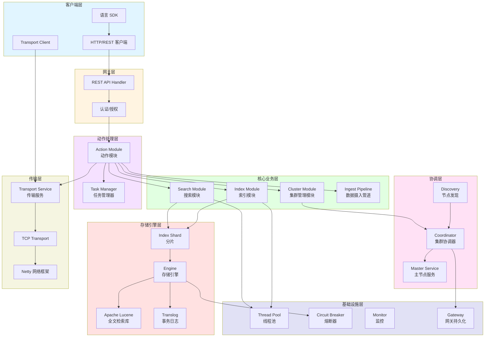
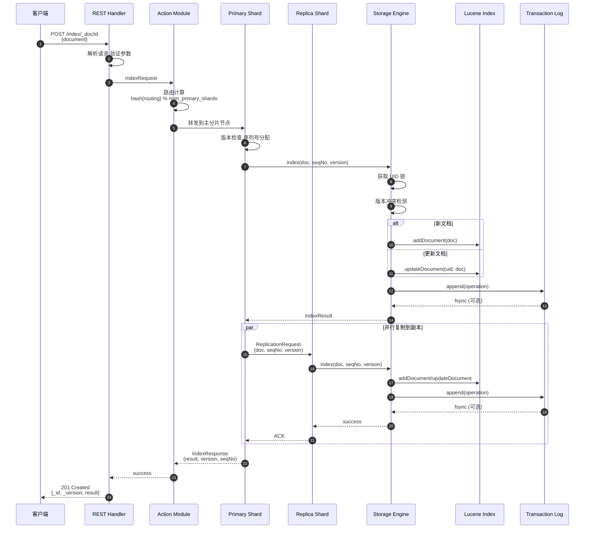
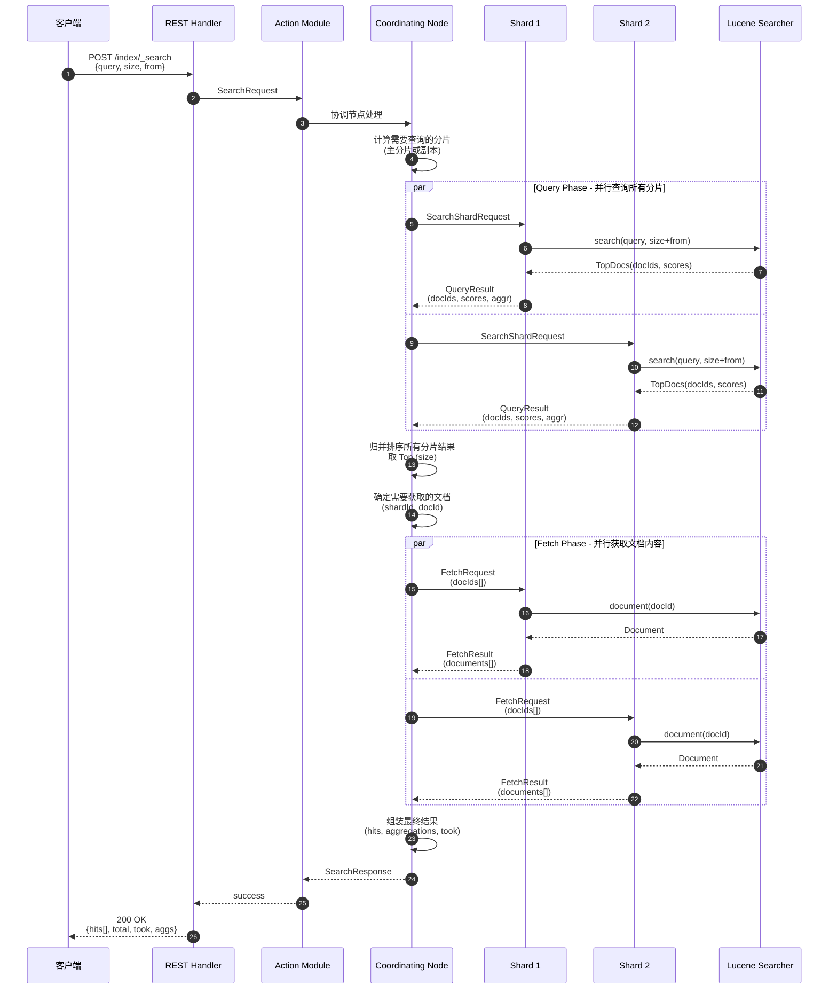
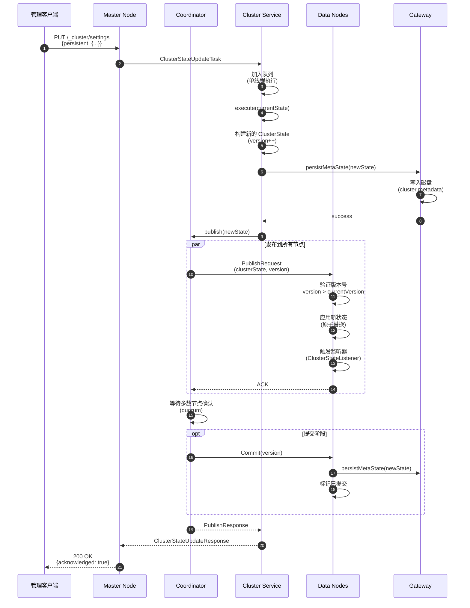
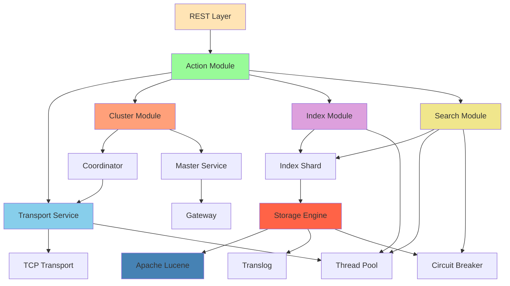

# Elasticsearch-00-总览

## 0. 摘要

### 项目目标
Elasticsearch 是一个分布式搜索和分析引擎,可扩展的数据存储和向量数据库,针对生产规模工作负载进行了速度和相关性优化。Elasticsearch 是 Elastic Stack 平台的基础。

### 核心能力
- **近实时搜索**: 对海量数据集进行近实时搜索
- **向量搜索**: 支持向量嵌入检索和语义搜索
- **全文检索**: 基于 Lucene 的强大全文检索能力
- **分布式架构**: 自动分片、副本和故障转移
- **聚合分析**: 复杂的数据聚合和分析能力
- **可扩展性**: 水平扩展,支持 PB 级数据

### 问题域
解决大规模数据的存储、索引、搜索和分析问题,支持:
- 日志和指标分析
- 应用性能监控(APM)
- 安全日志分析
- 检索增强生成(RAG)应用
- 企业搜索

### 非目标
- 不是 OLTP 数据库,不适合频繁更新的事务处理
- 不是分布式文件存储系统
- 不提供 ACID 事务保证(仅在单文档级别保证原子性)

### 运行环境
- **语言**: Java 21+
- **运行时**: JVM (OpenJDK/Oracle JDK)
- **核心依赖**: Apache Lucene 10.x
- **构建系统**: Gradle
- **通信协议**: HTTP/REST, TCP (节点间通信)

### 部署形态
- **单节点模式**: 用于开发和测试
- **集群模式**: 生产环境的分布式部署
- **云服务**: Elastic Cloud 托管服务
- **插件扩展**: 支持插件机制扩展功能

---

## 1. 整体架构图



### 架构图说明

#### 组件职责
1. **客户端层**: 提供多种方式接入 Elasticsearch,包括 HTTP REST API、Transport 客户端和各语言 SDK
2. **网关层**: 处理 HTTP 请求,执行认证和授权,将请求路由到对应的处理器
3. **协调层**: 负责集群协调、主节点选举、节点发现和集群状态管理
4. **动作处理层**: 将客户端请求转换为内部动作,管理任务生命周期
5. **核心业务层**: 实现索引、搜索、集群管理、数据摄入等核心功能
6. **存储引擎层**: 基于 Lucene 的存储引擎,管理分片数据和事务日志
7. **传输层**: 节点间通信,使用 Netty 实现高性能 TCP 通信
8. **基础设施层**: 提供线程池、熔断器、监控等基础服务

#### 数据流与控制流
- **写入流程**: Client → REST → Action → Index → Shard → Engine → Lucene + Translog
- **搜索流程**: Client → REST → Action → Search → Shard → Engine → Lucene
- **集群管理流程**: Coordinator → Master Service → Cluster State → Transport → All Nodes

#### 耦合关系
- **同步调用**: REST API → Action Module → Core Modules
- **异步事件**: Cluster State Changes → Event Listeners
- **发布订阅**: Cluster State 通过 Transport 发布到所有节点

#### 跨进程/跨线程路径
- **跨节点通信**: 通过 Transport Service 的 TCP 连接
- **跨线程**: 通过 ThreadPool 的不同线程池(search, index, generic, management等)
- **线程隔离**: 读写操作在不同线程池中执行,避免相互影响

#### 高可用与扩展性
- **无主架构**: 任意节点都可以处理客户端请求
- **主节点选举**: 基于 Raft 协议的自动主节点选举
- **数据分片**: 索引自动分片,支持水平扩展
- **副本机制**: 每个分片可配置多个副本,保证高可用
- **自动故障转移**: 节点故障时自动重新分配分片

#### 状态管理
- **集群状态**: 集中式的不可变集群元数据,由主节点管理
- **本地状态**: 每个节点维护本地分片状态
- **持久化**: 集群状态持久化到磁盘(Gateway)
- **版本控制**: 集群状态通过版本号确保一致性

---

## 2. 全局时序图

### 2.1 文档索引主流程



#### 时序图说明

**图意概述**:
描述客户端索引一个文档到 Elasticsearch 的完整流程,从 HTTP 请求接收,到主分片写入,再到副本复制的全过程。

**关键字段与载荷**:
- `routing`: 路由键,决定文档分配到哪个分片,默认为文档 ID
- `seqNo`: 序列号,单调递增,用于副本同步和恢复
- `version`: 文档版本号,用于乐观并发控制
- `primaryTerm`: 主分片任期号,每次主分片变更递增

**边界条件**:
1. **并发控制**: 使用文档 UID 加锁,防止同一文档并发写入冲突
2. **超时**: 默认主分片操作超时 1 分钟,副本复制超时 1 分钟
3. **幂等性**: 通过 `seqNo` 保证副本应用操作的幂等性
4. **顺序性**: 相同文档的操作按 `seqNo` 顺序应用
5. **一致性级别**: 可配置需要多少副本确认才返回成功

**异常路径与回退**:
- **版本冲突**: 返回 409 Conflict,客户端需要重新获取最新版本
- **主分片不可用**: 等待主分片选举或失败返回 503
- **副本失败**: 主分片写入成功即可返回,副本异步重试或重新分配
- **磁盘满**: 返回 429 Too Many Requests,触发只读索引块
- **Translog 损坏**: 分片进入失败状态,需要从副本恢复

**性能与容量假设**:
- **Translog Fsync**: 默认每个请求 fsync,配置 `async` 可提升吞吐但降低可靠性
- **批量索引**: 使用 `_bulk` API 可以大幅提升吞吐(10x-100x)
- **副本数量**: 每增加一个副本,写入延迟增加约 30-50%
- **刷新间隔**: 默认 1s 刷新一次,文档可见有最多 1s 延迟
- **吞吐量**: 单节点约 5000-20000 docs/s,取决于硬件和文档复杂度

**版本/兼容说明**:
- 序列号机制在 6.0 引入,替代旧的基于版本的复制
- 8.0+ 移除 TransportClient,仅支持 REST API
- Translog 格式向后兼容,支持滚动升级

---

### 2.2 搜索查询主流程



#### 时序图说明

**图意概述**:
展示 Elasticsearch 搜索请求的两阶段执行过程:Query Phase(查询阶段)和 Fetch Phase(获取阶段),以及协调节点如何归并多分片结果。

**关键字段与载荷**:
- `query`: 查询 DSL,支持 bool、match、term 等多种查询
- `size`: 返回结果数量,默认 10
- `from`: 分页起始位置,深度分页有性能问题
- `_source`: 控制返回哪些字段
- `sort`: 排序字段和顺序
- `aggs`: 聚合定义

**边界条件**:
1. **超时**: 默认无超时,可通过 `timeout` 参数设置
2. **最大结果窗口**: 默认 `from + size <= 10000`,防止深度分页
3. **并发控制**: Query Phase 和 Fetch Phase 内部并发执行
4. **分片选择**: 使用自适应副本选择,选择最快的分片
5. **请求缓存**: Query 结果可缓存(仅 size=0 或聚合)

**异常路径与回退**:
- **分片失败**: 部分分片失败仍可返回结果,响应中包含失败信息
- **超时**: 返回已完成分片的结果,标记为部分结果
- **熔断器触发**: 内存不足时拒绝请求,返回 429
- **查询过于复杂**: Query Phase 超过内存限制,中断查询

**性能与容量假设**:
- **Query Phase**: 轻量级,仅返回 docId 和 score,约占总耗时 30-40%
- **Fetch Phase**: 需要读取文档内容,约占总耗时 60-70%
- **深度分页**: `from=10000, size=10` 需要每个分片返回 10010 个结果
- **聚合**: 内存占用高,基数聚合使用 HyperLogLog 近似算法
- **并发度**: 默认按分片数量并发,单节点可处理数百并发搜索

**版本/兼容说明**:
- 7.0+ 默认使用自适应副本选择
- 6.0+ 引入序列号,移除 `_type`
- 5.0+ 引入 Query/Fetch 异步执行优化

---

### 2.3 集群状态变更主流程



#### 时序图说明

**图意概述**:
展示 Elasticsearch 集群状态变更的完整流程,包括状态生成、持久化、发布和提交四个阶段,基于 Raft 协议保证一致性。

**关键字段与载荷**:
- `version`: 集群状态版本号,单调递增
- `clusterUUID`: 集群唯一标识
- `nodes`: 集群节点列表
- `routingTable`: 分片路由表
- `metadata`: 索引元数据、设置、模板等
- `term`: 主节点任期号

**边界条件**:
1. **单线程执行**: 集群状态更新在单线程中串行执行,保证顺序
2. **超时**: 发布超时默认 30s,提交超时默认 30s
3. **多数确认**: 需要多数主合格节点确认才算成功
4. **版本检查**: 拒绝旧版本状态,防止脑裂
5. **幂等性**: 相同版本的状态重复应用是幂等的

**异常路径与回退**:
- **发布失败**: 少数节点失败不影响,但会记录失败节点
- **主节点故障**: 新主节点选举后继续未完成的发布
- **网络分区**: 少数分区节点无法接收新状态,重新加入时同步
- **版本冲突**: 节点拒绝旧版本状态,主节点重新发布

**性能与容量假设**:
- **状态大小**: 通常 < 10MB,超大集群可能达到 100MB
- **发布延迟**: 小集群 < 100ms,大集群(100+节点)可达秒级
- **更新频率**: 建议 < 10次/s,过高会影响集群稳定性
- **节点数量**: 支持 1000+ 节点,但建议专用主节点
- **分片数量**: 单集群支持数十万分片

**版本/兼容说明**:
- 7.0+ 使用 Raft-based 协调,移除旧的 Zen Discovery
- 8.0+ 强制设置 `cluster.initial_master_nodes`
- 滚动升级时兼容一个大版本差异

---

## 3. 模块边界与交互图

### 3.1 模块清单

Elasticsearch 核心代码模块按功能划分:

| 序号 | 模块名称 | 路径 | 职责 | 对外 API |
|---:|---|---|---|---|
| 01 | Server 核心 | server/ | 核心服务器功能 | Node, Bootstrap |
| 02 | 客户端 | client/ | REST 和传输客户端 | RestClient, TransportClient |
| 03 | 索引模块 | server/index/ | 索引管理和文档操作 | IndexService, IndexShard |
| 04 | 搜索模块 | server/search/ | 搜索和聚合 | SearchService, QueryPhase |
| 05 | 集群模块 | server/cluster/ | 集群管理和协调 | Coordinator, MasterService |
| 06 | 传输层 | server/transport/ | 节点间通信 | TransportService, TcpTransport |
| 07 | 存储引擎 | server/index/engine/ | 数据存储引擎 | InternalEngine, Translog |
| 08 | 动作处理 | server/action/ | 请求动作处理 | ActionModule, TransportAction |
| 09 | REST 层 | server/rest/ | HTTP REST API | RestController, RestHandler |
| 10 | Gateway | server/gateway/ | 集群元数据持久化 | Gateway, GatewayService |
| 11 | Ingest | server/ingest/ | 数据摄入管道 | IngestService, Pipeline |
| 12 | 脚本引擎 | server/script/ | 脚本执行 | ScriptService, Painless |
| 13 | 线程池 | server/threadpool/ | 线程池管理 | ThreadPool, ExecutorBuilder |
| 14 | 发现模块 | server/discovery/ | 节点发现 | Discovery, PeerFinder |
| 15 | 监控模块 | server/monitor/ | 系统监控 | Monitor, JvmMonitor |

### 3.2 模块交互矩阵

| 调用方 | 被调方 | 接口/方法 | 同步/异步 | 错误语义 | 一致性要求 |
|---|---|---|---|---|---|
| REST Layer | Action Module | execute(request) | 同步 | 返回异常 | 无 |
| Action Module | Transport Service | sendRequest() | 异步 | 回调 onFailure | 无 |
| Transport Service | Index Module | index/search/delete | 异步 | 回调 onFailure | 写入需确认 |
| Index Module | Storage Engine | index(doc) | 同步 | 抛出异常 | 强一致 |
| Storage Engine | Lucene | addDocument() | 同步 | 抛出异常 | 强一致 |
| Storage Engine | Translog | add(operation) | 同步 | 抛出异常 | 顺序写入 |
| Search Module | Storage Engine | search(query) | 同步 | 抛出异常 | 快照隔离 |
| Coordinator | Master Service | submitStateUpdateTask() | 异步 | 回调 onFailure | 线性一致 |
| Master Service | Gateway | persistMetaState() | 同步 | 抛出异常 | 持久化 |
| Master Service | Transport Service | publishClusterState() | 异步 | 多数确认 | 多数一致 |
| Cluster Module | Index Module | updateRouting() | 事件 | 忽略异常 | 最终一致 |
| Action Module | Cluster Module | clusterState() | 同步读 | 无 | 读本地 |
| Gateway | Storage Engine | 无直接调用 | - | - | - |

### 3.3 依赖关系图



---

## 4. 关键设计与权衡

### 4.1 数据一致性

#### 分片内一致性(强一致)
- **单文档操作**: 通过版本号和 UID 锁保证单文档 ACID
- **Translog**: 所有写操作先写 Translog,保证持久性
- **Flush**: 定期将内存缓冲区刷新到磁盘,形成 Lucene segment

#### 分片间一致性(主备模型)
- **主分片写入**: 写操作必须先在主分片成功
- **副本复制**: 主分片同步或异步复制到所有副本
- **序列号机制**: 全局单调递增的序列号,保证操作顺序
- **全局检查点**: 所有副本已确认的最大序列号

#### 集群一致性(最终一致)
- **集群状态**: 基于 Raft 的主节点选举和状态复制
- **发布-提交**: 两阶段提交保证多数节点一致
- **路由表**: 路由表变更通过集群状态同步到所有节点

### 4.2 事务边界

- **单文档**: 单文档操作是原子的,通过 Lucene 的原子更新保证
- **批量操作**: `_bulk` API 中每个操作独立,部分失败不影响其他
- **无跨文档事务**: 不支持多文档 ACID 事务
- **版本控制**: 乐观并发控制,通过 `version` 或 `if_seq_no + if_primary_term`

### 4.3 锁与并发策略

#### 乐观并发控制
- **版本号**: 每个文档有版本号,更新时检查版本
- **序列号**: 7.0+ 使用 `seq_no + primary_term` 替代版本号
- **CAS 操作**: 条件更新,失败时返回冲突错误

#### 分片级锁
- **UID 锁**: 同一文档并发写入时获取 UID 锁
- **Refresh 锁**: Refresh 操作获取读锁,不阻塞写入
- **Flush 锁**: Flush 操作获取写锁,阻塞其他 Flush

#### 集群级锁
- **集群状态更新**: 单线程串行执行,无锁竞争
- **主节点选举**: 通过 Raft 协议保证只有一个主节点

### 4.4 性能关键路径

#### 写入路径
1. **路由计算**: O(1) hash 计算
2. **版本检查**: 内存查找(VersionMap),O(1)
3. **Lucene 写入**: 解析文档,构建倒排索引,O(fields * terms)
4. **Translog**: 顺序写入,O(1)
5. **副本复制**: 并行发送,延迟取决于最慢副本

**优化手段**:
- 禁用 `_source`: 减少存储和网络传输
- 增大 `refresh_interval`: 减少 Refresh 开销
- 异步 Translog fsync: 提升吞吐,降低可靠性
- 批量索引: 使用 `_bulk` API,减少网络往返

#### 搜索路径
1. **查询解析**: 解析 Query DSL,O(query nodes)
2. **Query Phase**: 每个分片独立执行查询,并行
3. **归并排序**: 协调节点归并所有分片结果,O(N log N)
4. **Fetch Phase**: 并行获取文档,O(分片数)

**优化手段**:
- **请求缓存**: 缓存聚合结果和 size=0 的查询
- **查询缓存**: 缓存 Filter 查询结果
- **Fielddata 缓存**: 缓存用于排序和聚合的字段值
- **Adaptive Replica Selection**: 选择最快的副本

### 4.5 可观测性指标

#### 集群级指标
- **Cluster Health**: green/yellow/red
- **Active Shards**: 活跃分片数
- **Relocating Shards**: 正在迁移的分片数
- **Unassigned Shards**: 未分配的分片数

#### 节点级指标
- **JVM Heap**: 堆内存使用率,建议 < 75%
- **GC Time**: GC 时间,Young GC < 1s, Old GC 应避免
- **Thread Pool Queue**: 线程池队列长度,队列满时拒绝请求
- **Circuit Breaker**: 熔断器触发次数

#### 索引级指标
- **Indexing Rate**: 索引速率 (docs/s)
- **Search Rate**: 搜索速率 (queries/s)
- **Search Latency**: 搜索延迟 P50/P95/P99
- **Refresh Time**: Refresh 耗时
- **Merge Time**: Segment 合并耗时

#### 分片级指标
- **Shard Size**: 分片大小,建议 10-50GB
- **Segment Count**: Segment 数量,过多影响搜索性能
- **Translog Size**: Translog 大小,影响恢复时间

### 4.6 配置项

#### 集群级配置
- `cluster.name`: 集群名称,相同名称节点自动组成集群
- `cluster.initial_master_nodes`: 初始主节点候选列表
- `discovery.seed_hosts`: 种子节点列表

#### 节点级配置
- `node.name`: 节点名称
- `node.roles`: 节点角色 [master, data, ingest, ml]
- `path.data`: 数据目录
- `path.logs`: 日志目录

#### 索引级配置
- `number_of_shards`: 主分片数,创建后不可修改
- `number_of_replicas`: 副本数,可动态修改
- `refresh_interval`: 刷新间隔,默认 1s
- `translog.durability`: Translog 持久化策略,request/async

#### 性能配置
- `indices.memory.index_buffer_size`: 索引缓冲区,默认 10% heap
- `indices.queries.cache.size`: 查询缓存,默认 10% heap
- `indices.fielddata.cache.size`: Fielddata 缓存,默认不限制
- `thread_pool.write.queue_size`: 写入线程池队列大小,默认 10000

---

## 5. 典型使用示例与最佳实践

### 5.1 最小可运行示例

#### 单节点快速启动

```bash
# 下载并解压 Elasticsearch
wget https://artifacts.elastic.co/downloads/elasticsearch/elasticsearch-8.11.0-linux-x86_64.tar.gz
tar -xzf elasticsearch-8.11.0-linux-x86_64.tar.gz
cd elasticsearch-8.11.0

# 配置单节点模式
cat > config/elasticsearch.yml <<EOF
cluster.name: my-cluster
node.name: node-1
network.host: 0.0.0.0
discovery.type: single-node
xpack.security.enabled: false
EOF

# 启动节点
./bin/elasticsearch
```

#### 基础操作示例

```bash
# 创建索引
curl -X PUT "localhost:9200/products" -H 'Content-Type: application/json' -d'
{
  "settings": {
    "number_of_shards": 1,
    "number_of_replicas": 0
  },
  "mappings": {
    "properties": {
      "name": { "type": "text" },
      "price": { "type": "double" },
      "category": { "type": "keyword" },
      "created_at": { "type": "date" }
    }
  }
}'

# 索引文档
curl -X POST "localhost:9200/products/_doc" -H 'Content-Type: application/json' -d'
{
  "name": "Laptop",
  "price": 999.99,
  "category": "Electronics",
  "created_at": "2024-01-01T10:00:00Z"
}'

# 搜索文档
curl -X GET "localhost:9200/products/_search" -H 'Content-Type: application/json' -d'
{
  "query": {
    "match": {
      "name": "laptop"
    }
  }
}'
```

### 5.2 扩展点与插件接入

#### 自定义分析器插件

Elasticsearch 支持通过插件扩展分析器、TokenFilter、CharFilter 等组件:

```java
public class MyAnalysisPlugin extends Plugin implements AnalysisPlugin {
    
    @Override
    public Map<String, AnalysisProvider<TokenFilterFactory>> getTokenFilters() {
        return Collections.singletonMap("my_filter", MyTokenFilterFactory::new);
    }
}

public class MyTokenFilterFactory extends AbstractTokenFilterFactory {
    
    public MyTokenFilterFactory(IndexSettings indexSettings, 
                                Environment environment,
                                String name, 
                                Settings settings) {
        super(name, settings);
    }
    
    @Override
    public TokenStream create(TokenStream tokenStream) {
        return new MyTokenFilter(tokenStream);
    }
}
```

#### 自定义聚合插件

```java
public class MyAggregationPlugin extends Plugin implements SearchPlugin {
    
    @Override
    public List<AggregationSpec> getAggregations() {
        return Collections.singletonList(
            new AggregationSpec(
                "my_agg",
                MyAggregationBuilder::new,
                MyAggregationBuilder.PARSER
            ).addResultReader(InternalMyAggregation::new)
        );
    }
}
```

#### 插件部署

```bash
# 安装插件
./bin/elasticsearch-plugin install file:///path/to/my-plugin.zip

# 验证插件
./bin/elasticsearch-plugin list

# 移除插件
./bin/elasticsearch-plugin remove my-plugin
```

### 5.3 生产环境配置清单

#### 硬件配置建议
- **CPU**: 16-32 核,搜索密集型需要更多核心
- **内存**: 64-128GB,JVM heap 设置为物理内存的 50%,不超过 32GB
- **磁盘**: SSD 必需,建议 NVMe,RAID 10 或 RAID 0
- **网络**: 10Gbps 网络,低延迟交换机

#### JVM 配置
```bash
# jvm.options
-Xms31g
-Xmx31g
-XX:+UseG1GC
-XX:G1ReservePercent=25
-XX:InitiatingHeapOccupancyPercent=30
```

#### 操作系统配置
```bash
# 关闭 swap
sudo swapoff -a

# 增加文件描述符限制
ulimit -n 65535

# 增加虚拟内存区域
sysctl -w vm.max_map_count=262144

# 禁用 THP (Transparent Huge Pages)
echo never > /sys/kernel/mm/transparent_hugepage/enabled
```

#### 集群配置
```yaml
# elasticsearch.yml (生产环境三节点集群)
cluster.name: prod-cluster
node.name: ${HOSTNAME}
node.roles: [master, data, ingest]

# 网络配置
network.host: 0.0.0.0
http.port: 9200
transport.port: 9300

# 发现配置
discovery.seed_hosts:
  - 10.0.0.1:9300
  - 10.0.0.2:9300
  - 10.0.0.3:9300
cluster.initial_master_nodes:
  - node-1
  - node-2
  - node-3

# 路径配置
path.data: /data/elasticsearch
path.logs: /var/log/elasticsearch

# 内存配置
indices.memory.index_buffer_size: 20%
indices.queries.cache.size: 15%

# 线程池配置
thread_pool.write.queue_size: 1000
thread_pool.search.queue_size: 2000
```

#### 索引模板配置

```json
{
  "index_patterns": ["logs-*"],
  "settings": {
    "number_of_shards": 3,
    "number_of_replicas": 1,
    "refresh_interval": "5s",
    "index.translog.durability": "async",
    "index.translog.sync_interval": "5s"
  },
  "mappings": {
    "properties": {
      "timestamp": {
        "type": "date"
      },
      "message": {
        "type": "text",
        "fields": {
          "keyword": {
            "type": "keyword",
            "ignore_above": 256
          }
        }
      }
    }
  }
}
```

#### 监控与告警

```bash
# 检查集群健康
curl -X GET "localhost:9200/_cluster/health?pretty"

# 检查节点统计
curl -X GET "localhost:9200/_nodes/stats?pretty"

# 检查索引统计
curl -X GET "localhost:9200/_stats?pretty"

# 检查慢查询日志
tail -f /var/log/elasticsearch/prod-cluster_index_search_slowlog.log
```

#### 备份与恢复

```bash
# 配置快照仓库
curl -X PUT "localhost:9200/_snapshot/my_backup" -H 'Content-Type: application/json' -d'
{
  "type": "fs",
  "settings": {
    "location": "/mount/backups/elasticsearch"
  }
}'

# 创建快照
curl -X PUT "localhost:9200/_snapshot/my_backup/snapshot_1?wait_for_completion=true"

# 恢复快照
curl -X POST "localhost:9200/_snapshot/my_backup/snapshot_1/_restore"
```

---

## 6. 模块索引

本文档为总览文档,详细的模块文档请参考:

- [Elasticsearch-01-Server核心-概览](./Elasticsearch-01-Server核心-概览.md)
- [Elasticsearch-02-索引模块-概览](./Elasticsearch-02-索引模块-概览.md)
- [Elasticsearch-03-搜索模块-概览](./Elasticsearch-03-搜索模块-概览.md)
- [Elasticsearch-04-集群模块-概览](./Elasticsearch-04-集群模块-概览.md)
- [Elasticsearch-05-传输层-概览](./Elasticsearch-05-传输层-概览.md)
- [Elasticsearch-06-存储引擎-概览](./Elasticsearch-06-存储引擎-概览.md)
- [Elasticsearch-07-动作处理-概览](./Elasticsearch-07-动作处理-概览.md)
- [Elasticsearch-08-REST层-概览](./Elasticsearch-08-REST层-概览.md)
- [Elasticsearch-09-Gateway-概览](./Elasticsearch-09-Gateway-概览.md)
- [Elasticsearch-10-Ingest-概览](./Elasticsearch-10-Ingest-概览.md)

每个模块文档包含:
- 模块概览
- 对外 API 详细规格
- 关键数据结构与 UML 图
- 核心流程时序图
- 实现细节与最佳实践

---

## Elasticsearch 开发实践与优化要点

### Java 客户端开发

- **连接池配置**：
  - `MaxConnTotal: 100`（最大连接数），`MaxConnPerRoute: 10`（每路由最大连接数）。
  - `ConnectTimeout: 5s`，`SocketTimeout: 60s`，`ConnectionRequestTimeout: 1s`。
  - Keep-Alive 策略：30 秒，复用连接减少握手开销。

- **批量操作优化**：
  - 使用 `BulkRequest` 合并多个操作，减少网络往返。
  - 批量大小控制：5-15MB 或 1000-5000 条文档为宜，过大导致内存压力，过小降低吞吐。
  - 并行度控制：根据集群分片数设置并发批量请求数，避免背压。

- **错误处理策略**：
  - **可重试错误**：`TOO_MANY_REQUESTS`（背压，指数退避重试）、`REQUEST_TIMEOUT`（超时重试）、`INTERNAL_SERVER_ERROR`（服务器错误重试）。
  - **不可重试错误**：`BAD_REQUEST`（请求格式错误）、`NOT_FOUND`（资源不存在）、`CONFLICT`（版本冲突需特殊处理）。
  - **批量操作错误分拣**：检查 `BulkResponse.hasFailures()`，对可重试项单独重试，记录不可恢复的失败项。

### 索引设计最佳实践

- **分片策略**：
  - 单分片大小：20-50GB 为宜，过大影响恢复速度，过小增加开销。
  - 分片数计算：`分片数 = 数据量 / 单分片目标大小`，预留增长空间。
  - 副本数：生产环境至少 1 个副本，高可用场景 2 个副本。

- **Mapping 设计**：
  - 关闭不需要的功能：`"enabled": false`（不索引），`"index": false`（不可搜索），`"doc_values": false`（不聚合）。
  - 字段类型选择：`keyword` 用于精确匹配、排序、聚合；`text` 用于全文检索；`date` 支持范围查询。
  - 动态映射控制：生产环境设置 `"dynamic": "strict"` 避免字段爆炸。

- **分析器配置**：
  - 自定义分析器：组合 `tokenizer`（标准、IK、N-gram）+ `filter`（小写、停用词、同义词）。
  - 中文分词：使用 IK 分析器，配置自定义词典和停用词。
  - 多字段策略：`text` 字段附带 `keyword` 子字段，同时支持全文检索和精确匹配。

### 查询优化技巧

- **Filter vs Query**：
  - Filter：不计算评分，可缓存，用于精确匹配、范围过滤、条件筛选。
  - Query：计算相关性评分，用于全文检索、模糊匹配。
  - 组合使用：`bool` 查询中 `filter` 子句放置过滤条件，`must/should` 子句放置评分查询。

- **分页优化**：
  - 浅分页：`from + size < 10000` 使用常规分页。
  - 深分页：使用 `search_after` + 排序字段，避免 `from` 值过大导致的内存和性能问题。
  - 滚动查询：`scroll` API 用于大批量数据导出，设置合理的 `scroll` 超时（如 5m）。

- **聚合优化**：
  - 限制聚合层级：嵌套层级不超过 3 层，避免笛卡尔积爆炸。
  - 使用 `size: 0`：仅需要聚合结果时不返回文档。
  - `terms` 聚合优化：设置合理的 `size` 和 `shard_size`，对高基数字段考虑使用 Composite 聚合。

- **评分优化**：
  - Function Score：自定义评分函数，结合字段值、地理位置、时间衰减等因素。
  - Boosting：对特定字段或查询子句设置权重，调整相关性排序。
  - Rescore：对初步结果进行二次评分，平衡性能和精度。

### 写入性能优化

- **Refresh 控制**：
  - 默认 `refresh_interval: 1s`，调整为 `30s` 或 `-1`（禁用自动刷新）提升写入吞吐。
  - 批量写入完成后手动调用 `_refresh` API。

- **Translog 配置**：
  - `index.translog.durability: async`（异步刷盘）提升性能，但可能丢失少量数据。
  - `index.translog.sync_interval: 5s`（同步间隔）和 `index.translog.flush_threshold_size: 512mb`（刷新阈值）。

- **副本延迟同步**：
  - 写入时设置 `wait_for_active_shards: 1`，仅等待主分片确认，副本异步复制。

- **索引 Buffer**：
  - JVM 堆内存的 10% 用于索引缓冲，调整 `indices.memory.index_buffer_size`。

### 集群配置调优

- **JVM 配置**：
  - 堆内存：不超过 32GB（避免压缩指针失效），设置为系统内存的 50%。
  - GC 调优：使用 G1GC（`-XX:+UseG1GC`），设置合理的 `G1HeapRegionSize`（16MB）。
  - 禁用 Swap：`bootstrap.memory_lock: true` 锁定内存。

- **线程池配置**：
  - `thread_pool.write.queue_size: 1000`（写入队列），`thread_pool.search.queue_size: 1000`（搜索队列）。
  - 核心线程数根据 CPU 核数调整，避免过度并发。

- **熔断器配置**：
  - `indices.breaker.total.limit: 70%`（总内存限制），`indices.breaker.request.limit: 60%`（单请求限制）。
  - 防止 OOM，当内存使用接近阈值时拒绝请求。

- **分片分配策略**：
  - 启用分片感知（`cluster.routing.allocation.awareness.attributes`）跨机架/可用区分布。
  - 设置分片过滤（`index.routing.allocation.include/exclude`）控制分片分配。
  - 磁盘水位线：`cluster.routing.allocation.disk.watermark.low: 85%`，`high: 90%`，`flood_stage: 95%`。

### 监控与运维

- **关键指标**：
  - **集群健康**：`cluster_health`（green/yellow/red），未分配分片数。
  - **节点指标**：CPU、内存、磁盘使用率、GC 频率和停顿时间、线程池队列和拒绝数。
  - **索引指标**：索引速率、搜索速率、索引延迟、搜索延迟、Refresh/Flush/Merge 耗时。
  - **JVM 指标**：堆内存使用、Old Gen 使用率、GC 次数和时长。

- **慢查询日志**：
  - 配置 `index.search.slowlog.threshold`（如 `query.warn: 10s`，`fetch.debug: 500ms`）。
  - 分析慢查询原因：复杂聚合、深度分页、未优化的查询、大结果集。

- **快照与恢复**：
  - 配置快照仓库（`fs`、`s3`、`gcs`），定期自动快照（如每日增量）。
  - 恢复策略：`indices.recovery.max_bytes_per_sec: 40mb`（恢复速度限制）。

- **滚动重启**：
  - 禁用分片分配 → 停止节点 → 升级/维护 → 启动节点 → 启用分片分配 → 等待集群 green。

### 常见问题排查

- **集群 Yellow/Red**：检查未分配分片原因（`_cluster/allocation/explain`），可能是磁盘空间不足、副本数设置不当、节点故障。

- **搜索慢**：分析慢查询日志，检查查询复杂度、分片数、数据量、缓存命中率；考虑增加副本分散查询压力。

- **写入慢**：检查 Refresh 间隔、Translog 配置、副本同步策略、磁盘 IO 性能、背压情况。

- **内存溢出**：检查熔断器配置、堆内存设置、Field Data/Request 缓存使用、聚合查询复杂度。

- **分片过多**：每个节点分片数建议 < 20 * 节点内存（GB），过多分片增加集群管理开销。

