# Elasticsearch-01-Server核心

## 模块概览

本文档提供 Server 核心模块的全面概览，包括节点启动流程、生命周期管理、服务管理和插件系统。

---

## 1. 模块职责

Server 核心模块是 Elasticsearch 的基础，负责节点的启动、运行和关闭全生命周期管理。

### 1.1 核心职责

1. **节点启动（Bootstrap）**
   - 三阶段启动流程
   - 环境初始化
   - 安全管理器配置
   - 插件加载

2. **生命周期管理**
   - 节点启动（start）
   - 节点停止（stop）
   - 节点关闭（close）
   - 优雅关闭

3. **服务管理**
   - 依赖注入（Guice）
   - 服务注册与发现
   - 服务启动顺序控制
   - 服务健康检查

4. **插件系统**
   - 插件加载机制
   - 插件生命周期管理
   - 插件扩展点
   - 插件隔离

### 1.2 核心组件

**上游依赖**:

- JVM 环境
- 文件系统
- 网络栈

**下游依赖者**:

- 所有 Elasticsearch 模块
- 插件

---

## 2. 模块架构

### 2.1 整体架构图

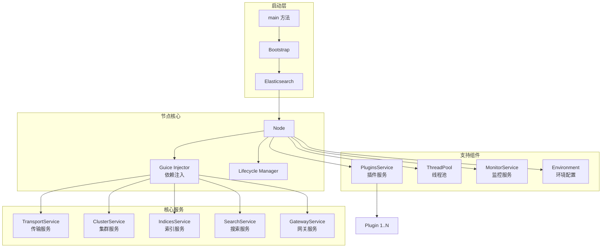

### 2.2 架构说明

#### 启动层

**main 方法**: Elasticsearch 程序入口
**Bootstrap**: 启动引导类，管理三阶段初始化
**Elasticsearch**: 主类，协调启动流程

#### 节点核心

**Node**:

- 封装所有服务和组件
- 管理节点生命周期
- 协调服务启动顺序

**Guice Injector**:

- 依赖注入容器
- 管理所有服务实例
- 解决依赖关系

**Lifecycle Manager**:

- 跟踪生命周期状态
- 状态转换控制
- 防止重复操作

---

## 3. 三阶段启动流程

### 3.1 启动流程图

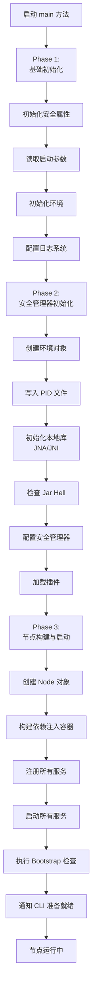

### 3.2 三阶段详解

#### Phase 1: 基础初始化

**目标**: 完成最基础的初始化，为后续阶段准备环境

**关键步骤**:

```java
private static Bootstrap initPhase1() {
    // 1. 初始化安全属性
    initSecurityProperties();

    // 2. 初始化 BootstrapInfo
    BootstrapInfo.init();

    // 3. 读取启动参数
    ServerArgs args = new ServerArgs(System.in);

    // 4. 创建环境对象（仅路径信息）
    Environment nodeEnv = new Environment(args.nodeSettings(), args.configDir());

    // 5. 配置日志系统（必须在最后）
    LogConfigurator.configure(nodeEnv, args.quiet() == false);

    return new Bootstrap(args);
}
```

**注意事项**:

- 尽可能少的操作
- 日志配置必须在最后
- 此阶段单线程执行

#### Phase 2: 安全管理器初始化

**目标**: 完成安全管理器配置之前的所有准备工作

**关键步骤**:

```java
private static void initPhase2(Bootstrap bootstrap) {
    // 1. 创建完整的环境对象（包含 SecureSettings）
    Environment nodeEnv = createEnvironment(args.configDir(), args.nodeSettings(), secrets);

    // 2. 写入 PID 文件
    initPidFile(args.pidFile());

    // 3. 设置全局异常处理器
    Thread.setDefaultUncaughtExceptionHandler(new ElasticsearchUncaughtExceptionHandler());

    // 4. 初始化本地库（JNA/JNI）
    initializeNatives(
        nodeEnv.tmpDir(),
        MEMORY_LOCK_SETTING.get(args.nodeSettings()),
        true,  // 系统调用过滤器
        CTRLHANDLER_SETTING.get(args.nodeSettings())
    );

    // 5. 检查 Jar Hell（类路径冲突）
    JarHell.checkJarHell();

    // 6. 加载插件
    PluginsLoader pluginsLoader = PluginsLoader.createPluginsLoader(nodeEnv);

    // 7. 配置安全管理器（可选）
    if (enableSecurityManager) {
        Security.setSecurityManager(new SecurityManager());
    }
}
```

**注意事项**:

- 必须在安全管理器前完成
- 加载所有本地库
- 插件预加载

#### Phase 3: 节点构建与启动

**目标**: 构建 Node 对象，启动所有服务

**关键步骤**:

```java
private static void initPhase3(Bootstrap bootstrap) {
    // 1. 创建 Node 对象
    Node node = new Node(bootstrap.environment(), bootstrap.pluginsLoader());

    // 2. 启动节点
    node.start();

    // 3. 通知 CLI 进程准备就绪
    bootstrap.sendCliMarker(BootstrapInfo.SERVER_READY_MARKER);
}
```

**Node 构造过程**:

```java
public Node(Environment environment, PluginsLoader pluginsLoader) {
    // 1. 创建依赖注入容器（Guice）
    Injector injector = createInjector(environment, pluginsLoader);

    // 2. 注册所有核心服务
    registerServices(injector);
}
```

**Node 启动过程**:

```java
public Node start() {
    // 1. 更新生命周期状态
    lifecycle.moveToStarted();

    // 2. 启动插件生命周期组件
    pluginLifecycleComponents.forEach(LifecycleComponent::start);

    // 3. 启动核心服务（按依赖顺序）
    injector.getInstance(IndicesService.class).start();
    injector.getInstance(IndicesClusterStateService.class).start();
    injector.getInstance(SnapshotsService.class).start();
    injector.getInstance(SearchService.class).start();
    injector.getInstance(ClusterService.class).start();
    injector.getInstance(TransportService.class).start();
    injector.getInstance(Coordinator.class).start();
    injector.getInstance(GatewayService.class).start();

    // 4. 启动 HTTP 服务器
    injector.getInstance(HttpServerTransport.class).start();

    // 5. 执行 Bootstrap 检查
    validateNodeBeforeAcceptingRequests();

    return this;
}
```

---

## 4. 生命周期管理

### 4.1 生命周期状态机

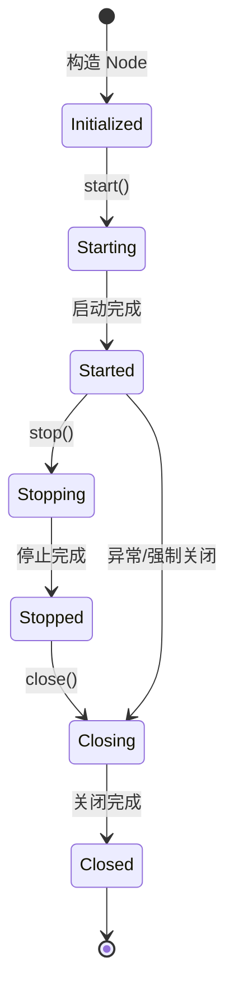

### 4.2 生命周期状态

| 状态 | 说明 | 转换方法 |
|---|---|---|
| Initialized | 节点已构造，服务已注册 | 构造函数 |
| Starting | 正在启动服务 | start() |
| Started | 所有服务已启动，可以接受请求 | start() |
| Stopping | 正在停止服务 | stop() |
| Stopped | 所有服务已停止 | stop() |
| Closing | 正在关闭资源 | close() |
| Closed | 所有资源已释放 | close() |

---

## 5. 服务启动顺序

### 5.1 启动顺序图


### 5.2 启动顺序说明

**顺序原因**:

1. **ThreadPool**: 最先启动，所有服务都依赖线程池
2. **IndicesService**: 管理索引，其他服务需要访问索引
3. **ClusterService**: 集群状态管理
4. **TransportService**: 节点间通信
5. **Coordinator**: 集群协调（依赖 TransportService）
6. **HttpServerTransport**: 最后启动，接受外部请求

---

## 6. 关键配置

### 6.1 节点配置

| 配置项 | 默认值 | 说明 |
|---|---|---|
| node.name | 随机生成 | 节点名称 |
| node.roles | [master, data, ingest] | 节点角色 |
| path.data | data/ | 数据目录 |
| path.logs | logs/ | 日志目录 |
| cluster.name | elasticsearch | 集群名称 |
| network.host | localhost | 绑定地址 |
| http.port | 9200-9300 | HTTP 端口 |
| transport.port | 9300-9400 | 传输层端口 |

### 6.2 JVM 配置

| 配置项 | 推荐值 | 说明 |
|---|---|---|
| -Xms | 50% 物理内存 | 堆内存初始大小 |
| -Xmx | 50% 物理内存 | 堆内存最大大小 |
| -XX:+UseG1GC | - | 使用 G1 垃圾回收器 |
| -Xlog:gc* | - | GC 日志 |

---

## 7. 监控与可观测

### 7.1 节点状态 API

```bash
GET /_nodes/_local

{
  "nodes": {
    "node_id": {
      "name": "node-1",
      "version": "8.10.0",
      "roles": ["master", "data", "ingest"],
      "jvm": {
        "version": "21.0.0",
        "mem": {
          "heap_used_in_bytes": 1073741824,
          "heap_max_in_bytes": 2147483648
        }
      },
      "process": {
        "open_file_descriptors": 512,
        "max_file_descriptors": 65536
      }
    }
  }
}
```

### 7.2 关键监控指标

**JVM 指标**:

- 堆内存使用率
- GC 频率和耗时
- 线程数

**系统指标**:

- CPU 使用率
- 文件描述符
- 磁盘 I/O

**Elasticsearch 指标**:

- 索引吞吐量
- 搜索延迟
- 拒绝请求数

---

## 相关文档

- [Elasticsearch-01-Server核心-API](./Elasticsearch-01-Server核心-API.md)
- [Elasticsearch-01-Server核心-数据结构](./Elasticsearch-01-Server核心-数据结构.md)
- [Elasticsearch-01-Server核心-时序图](./Elasticsearch-01-Server核心-时序图.md)

---

## API接口

本文档描述 Server 核心模块的主要 API 和接口。

---

## 1. Node API

### 1.1 Node 构造

#### 方法签名

```java
public Node(Environment environment, PluginsLoader pluginsLoader)
```

#### 参数说明

| 参数 | 类型 | 说明 |
|---|---|---|
| environment | Environment | 环境配置对象 |
| pluginsLoader | PluginsLoader | 插件加载器 |

#### 核心逻辑

```java
public Node(Environment environment, PluginsLoader pluginsLoader) {
    // 1. 准备构造上下文
    NodeConstruction construction = NodeConstruction.prepareConstruction(
        environment,
        pluginsLoader,
        new NodeServiceProvider(),
        true
    );

    // 2. 创建依赖注入容器
    this.injector = construction.injector();

    // 3. 获取核心组件
    this.environment = injector.getInstance(Environment.class);
    this.nodeEnvironment = injector.getInstance(NodeEnvironment.class);
    this.pluginsService = injector.getInstance(PluginsService.class);
    this.client = injector.getInstance(NodeClient.class);

    // 4. 收集插件生命周期组件
    this.pluginLifecycleComponents = construction.pluginLifecycleComponents();
}
```

---

### 1.2 start - 启动节点

#### 方法签名

```java
public Node start() throws NodeValidationException
```

#### 核心逻辑

```java
public Node start() throws NodeValidationException {
    // 1. 状态检查
    if (lifecycle.moveToStarted() == false) {
        return this;  // 已经启动
    }

    // 2. 启动插件组件
    pluginLifecycleComponents.forEach(LifecycleComponent::start);

    // 3. 启动核心服务（按依赖顺序）
    injector.getInstance(IndicesService.class).start();
    injector.getInstance(IndicesClusterStateService.class).start();
    injector.getInstance(SnapshotsService.class).start();
    injector.getInstance(SearchService.class).start();
    injector.getInstance(FsHealthService.class).start();
    injector.getInstance(MonitorService.class).start();

    // 4. 启动集群服务
    ClusterService clusterService = injector.getInstance(ClusterService.class);
    NodeConnectionsService nodeConnectionsService = injector.getInstance(NodeConnectionsService.class);
    nodeConnectionsService.start();
    clusterService.setNodeConnectionsService(nodeConnectionsService);

    // 5. 启动协调器
    Coordinator coordinator = injector.getInstance(Coordinator.class);
    clusterService.getMasterService().setClusterStatePublisher(coordinator);

    // 6. 启动传输服务
    TransportService transportService = injector.getInstance(TransportService.class);
    transportService.start();
    transportService.acceptIncomingRequests();

    // 7. 启动网关服务
    injector.getInstance(GatewayService.class).start();

    // 8. 启动 HTTP 服务器
    injector.getInstance(HttpServerTransport.class).start();

    // 9. 执行启动前验证
    validateNodeBeforeAcceptingRequests();

    return this;
}
```

---

### 1.3 stop - 停止节点

#### 方法签名

```java
private void stop()
```

#### 核心逻辑

```java
private void stop() {
    // 1. 状态检查
    if (lifecycle.moveToStopped() == false) {
        return;
    }

    // 2. 停止 HTTP 服务器（停止接收新请求）
    stopIfStarted(HttpServerTransport.class);

    // 3. 停止快照和仓库服务
    stopIfStarted(SnapshotsService.class);
    stopIfStarted(SnapshotShardsService.class);
    stopIfStarted(RepositoriesService.class);

    // 4. 停止索引集群状态服务
    stopIfStarted(IndicesClusterStateService.class);

    // 5. 停止协调器（停止响应集群状态更新）
    stopIfStarted(Coordinator.class);

    // 6. 停止集群服务
    stopIfStarted(ClusterService.class);
    stopIfStarted(NodeConnectionsService.class);

    // 7. 停止其他服务
    stopIfStarted(FsHealthService.class);
    stopIfStarted(MonitorService.class);
    stopIfStarted(GatewayService.class);
    stopIfStarted(SearchService.class);
    stopIfStarted(TransportService.class);

    // 8. 停止插件组件
    pluginLifecycleComponents.forEach(Node::stopIfStarted);

    // 9. 最后停止索引服务（等待资源释放）
    stopIfStarted(IndicesService.class);
}
```

---

### 1.4 close - 关闭节点

#### 方法签名

```java
@Override
public synchronized void close() throws IOException
```

#### 核心逻辑

```java
@Override
public synchronized void close() throws IOException {
    synchronized (lifecycle) {
        // 1. 如果还在运行，先停止
        if (lifecycle.started()) {
            stop();
        }

        // 2. 状态检查
        if (lifecycle.moveToClosed() == false) {
            return;
        }
    }

    // 3. 关闭所有组件（逆启动顺序）
    List<Closeable> toClose = new ArrayList<>();

    toClose.add(injector.getInstance(HttpServerTransport.class));
    toClose.add(injector.getInstance(SnapshotsService.class));
    toClose.add(injector.getInstance(IndicesClusterStateService.class));
    toClose.add(injector.getInstance(IndicesService.class));
    toClose.add(injector.getInstance(IndicesStore.class));
    toClose.add(injector.getInstance(ClusterService.class));
    toClose.add(injector.getInstance(NodeConnectionsService.class));
    toClose.add(injector.getInstance(Coordinator.class));
    toClose.add(injector.getInstance(MonitorService.class));
    toClose.add(injector.getInstance(GatewayService.class));
    toClose.add(injector.getInstance(SearchService.class));
    toClose.add(injector.getInstance(TransportService.class));

    // 4. 关闭插件
    pluginLifecycleComponents.forEach(toClose::add);
    pluginsService.filterPlugins(Plugin.class).forEach(toClose::add);

    // 5. 关闭线程池
    toClose.add(() -> injector.getInstance(ThreadPool.class).shutdown());

    // 6. 关闭节点环境
    toClose.add(injector.getInstance(NodeEnvironment.class));

    // 7. 批量关闭
    IOUtils.close(toClose);
}
```

---

## 2. Lifecycle API

### 2.1 Lifecycle 接口

```java
public interface LifecycleComponent extends Closeable {
    void start();
    void stop();
    void close() throws IOException;
    Lifecycle.State lifecycleState();
}
```

### 2.2 Lifecycle 状态管理

```java
public class Lifecycle {
    private volatile State state = State.INITIALIZED;

    public boolean moveToStarted() {
        State localState = state;
        if (localState == State.INITIALIZED || localState == State.STOPPED) {
            state = State.STARTED;
            return true;
        }
        return false;
    }

    public boolean moveToStopped() {
        State localState = state;
        if (localState == State.STARTED) {
            state = State.STOPPED;
            return true;
        }
        return false;
    }

    public boolean moveToClosed() {
        State localState = state;
        if (localState == State.CLOSED) {
            return false;
        }
        state = State.CLOSED;
        return true;
    }
}
```

---

## 3. Environment API

### 3.1 Environment 构造

```java
public Environment(Settings settings, Path configPath)
```

### 3.2 关键方法

```java
public class Environment {
    // 获取配置目录
    public Path configDir();

    // 获取数据目录
    public Path[] dataFiles();

    // 获取日志目录
    public Path logsDir();

    // 获取临时目录
    public Path tmpDir();

    // 获取节点设置
    public Settings settings();
}
```

---

## 4. NodeClient API

### 4.1 NodeClient 简介

NodeClient 是节点内部的客户端，用于执行操作。

```java
public class NodeClient extends AbstractClient {
    // 执行 Action
    @Override
    public <Request extends ActionRequest, Response extends ActionResponse>
    void doExecute(ActionType<Response> action, Request request, ActionListener<Response> listener) {
        // 查找 TransportAction
        TransportAction<Request, Response> transportAction = actions.get(action);

        // 执行操作
        transportAction.execute(null, request, listener);
    }
}
```

---

## 5. PluginsService API

### 5.1 插件加载

```java
public class PluginsService {
    public PluginsService(
        Settings settings,
        Path configPath,
        Path modulesPath,
        Path pluginsPath
    ) {
        // 1. 加载模块（内置插件）
        List<PluginBundle> moduleBundles = loadBundles(modulesPath);

        // 2. 加载插件
        List<PluginBundle> pluginBundles = loadBundles(pluginsPath);

        // 3. 初始化所有插件
        this.plugins = new ArrayList<>();
        for (PluginBundle bundle : allBundles) {
            Plugin plugin = loadPlugin(bundle);
            plugins.add(plugin);
        }
    }
}
```

### 5.2 插件扩展点

```java
public interface Plugin {
    // 创建自定义组件
    default Collection<Object> createComponents(...) {
        return Collections.emptyList();
    }

    // 注册 Action
    default List<ActionHandler<? extends ActionRequest, ? extends ActionResponse>> getActions() {
        return Collections.emptyList();
    }

    // 注册 REST Handler
    default List<RestHandler> getRestHandlers(...) {
        return Collections.emptyList();
    }

    // 自定义设置
    default List<Setting<?>> getSettings() {
        return Collections.emptyList();
    }
}
```

---

## 6. Bootstrap Checks

### 6.1 Bootstrap 检查

```java
public abstract class BootstrapCheck {
    public abstract BootstrapCheckResult check(BootstrapContext context);
}
```

### 6.2 常见检查

| 检查项 | 说明 |
|---|---|
| HeapSizeCheck | 检查堆内存大小 |
| FileDescriptorCheck | 检查文件描述符限制 |
| MaxNumberOfThreadsCheck | 检查最大线程数 |
| MaxMapCountCheck | 检查 vm.max_map_count |
| ClientJvmCheck | 检查 JVM 类型 |
| OnErrorCheck | 检查 OnError 配置 |
| OnOutOfMemoryErrorCheck | 检查 OnOutOfMemoryError 配置 |

---

## 相关文档

- [Elasticsearch-01-Server核心-概览](./Elasticsearch-01-Server核心-概览.md)
- [Elasticsearch-01-Server核心-数据结构](./Elasticsearch-01-Server核心-数据结构.md)
- [Elasticsearch-01-Server核心-时序图](./Elasticsearch-01-Server核心-时序图.md)

---

## 数据结构

本文档详细说明 Server 核心模块的数据结构。

---

## 1. Node 核心类

### 1.1 类图

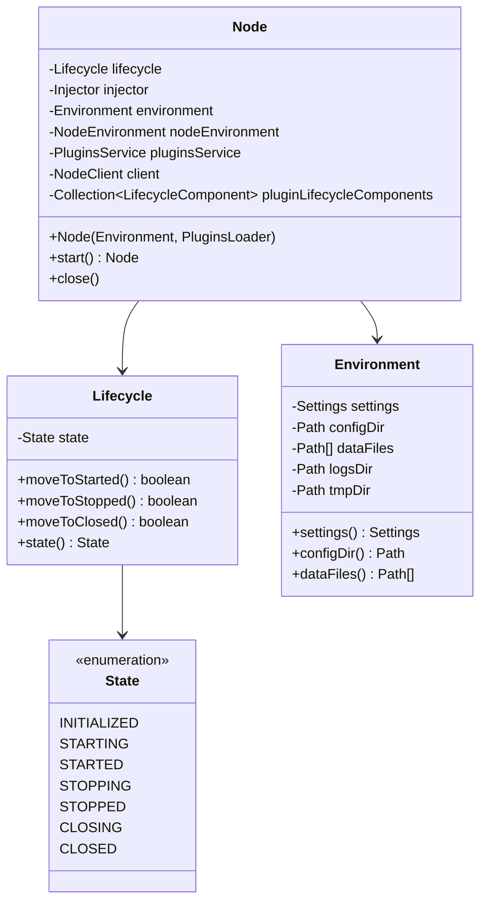

### 类说明

**Node**:

- 封装所有服务和组件
- 管理节点生命周期
- 提供统一的启动/停止/关闭接口

**Lifecycle**:

- 跟踪组件生命周期状态
- 提供状态转换方法
- 防止非法状态转换

**Environment**:

- 封装节点环境配置
- 管理路径信息
- 提供配置访问接口

---

## 2. LifecycleComponent 接口

### 2.1 类图

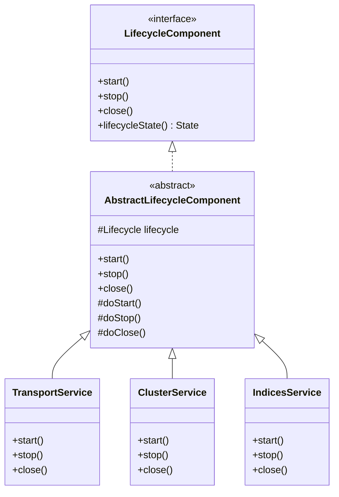

### 类说明

**LifecycleComponent**:

- 定义生命周期组件接口
- 所有需要生命周期管理的服务实现此接口

**AbstractLifecycleComponent**:

- 提供生命周期模板方法
- 管理状态转换
- 子类实现 doStart/doStop/doClose

---

## 3. Injector & Module

### 3.1 类图

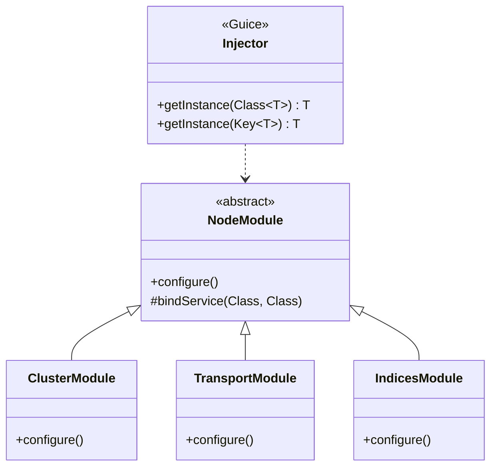

### 类说明

**Injector (Guice)**:

- Google Guice 依赖注入容器
- 管理所有服务实例
- 解决依赖关系

**NodeModule**:

- 定义服务绑定
- 配置依赖关系
- 各模块定义自己的 Module

---

## 4. PluginsService

### 4.1 类图

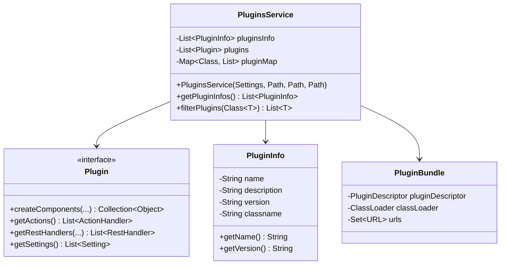

### 类说明

**PluginsService**:

- 管理所有插件
- 加载插件类
- 提供插件查询接口

**Plugin**:

- 插件接口
- 定义扩展点
- 插件通过实现接口扩展功能

**PluginInfo**:

- 插件元信息
- 从 plugin-descriptor.properties 读取
- 包含名称、版本、描述等

---

## 5. NodeEnvironment

### 5.1 类图

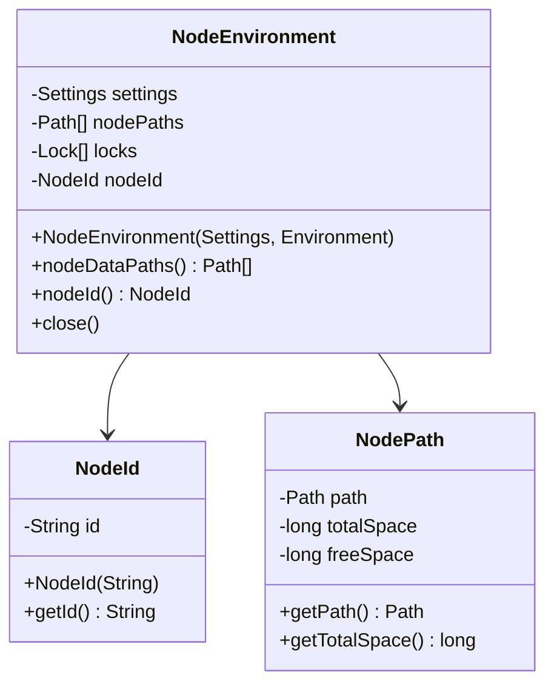

### 类说明

**NodeEnvironment**:

- 管理节点数据目录
- 加锁防止多个节点使用同一目录
- 生成或读取 NodeId

**NodeId**:

- 节点唯一标识
- 持久化到磁盘
- 重启后保持不变

---

## 6. ThreadPool

### 6.1 类图

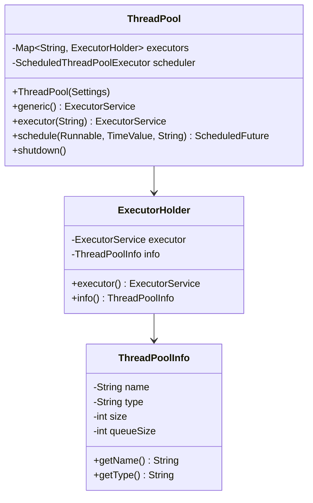

### 类说明

**ThreadPool**:

- 管理所有线程池
- 不同线程池用于不同任务类型
- 提供调度功能

**线程池类型**:

| 名称 | 类型 | 大小 | 队列 | 用途 |
|---|---|---|---|---|
| generic | cached | unbounded | - | 通用任务 |
| search | fixed | processors | 1000 | 搜索操作 |
| get | fixed | processors | 1000 | GET 操作 |
| write | fixed | processors | 10000 | 写入操作 |
| management | scaling | 5 | - | 集群管理 |
| refresh | scaling | processors/2 | - | Refresh 操作 |
| flush | scaling | processors/2 | - | Flush 操作 |

---

## 7. Settings

### 7.1 类图

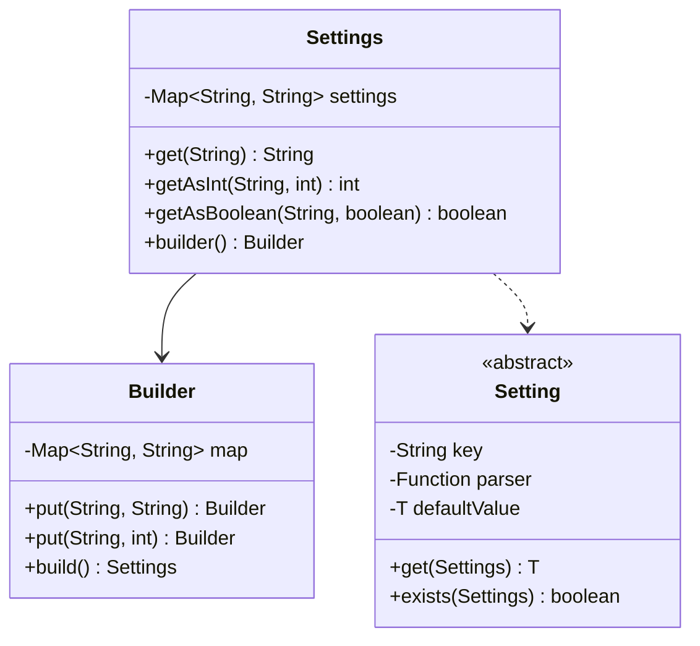

### 类说明

**Settings**:

- 不可变配置对象
- 存储所有配置项
- 提供类型安全的访问方法

**Setting**:

- 配置项定义
- 包含默认值和验证逻辑
- 类型安全

**示例**:

```java
public static final Setting<Integer> HTTP_PORT =
    Setting.intSetting("http.port", 9200, 1024, 65535, Property.NodeScope);

// 使用
int port = HTTP_PORT.get(settings);
```

---

## 相关文档

- [Elasticsearch-01-Server核心-概览](./Elasticsearch-01-Server核心-概览.md)
- [Elasticsearch-01-Server核心-API](./Elasticsearch-01-Server核心-API.md)
- [Elasticsearch-01-Server核心-时序图](./Elasticsearch-01-Server核心-时序图.md)

---

## 时序图

本文档展示 Server 核心模块的关键流程时序图。

---

## 1. 节点启动完整流程

### 1.1 三阶段启动时序图

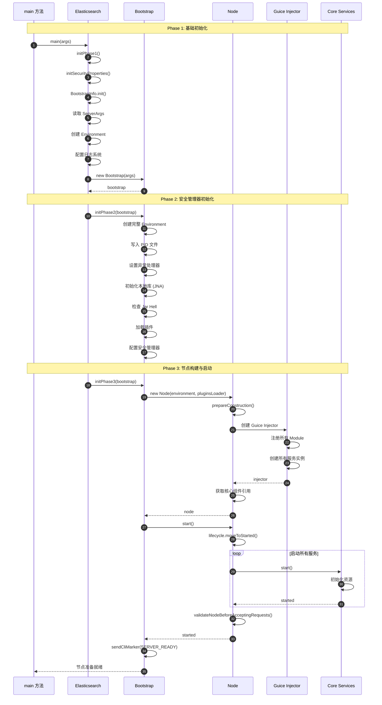

### 时序图说明

#### Phase 1: 基础初始化 (步骤 1-9)

**目标**: 完成最基础的初始化

**关键步骤**:

1. **安全属性初始化**: 配置 Java 安全属性
2. **BootstrapInfo 初始化**: 系统信息收集
3. **读取启动参数**: 从 CLI 进程读取配置
4. **创建环境对象**: 仅包含路径信息
5. **配置日志**: 必须在最后执行

**注意事项**:

- 单线程执行
- 尽量少的操作
- 日志配置必须最后

#### Phase 2: 安全管理器初始化 (步骤 10-17)

**目标**: 完成安全管理器配置前的所有准备

**关键步骤**:

1. **创建完整环境**: 包含 SecureSettings
2. **PID 文件**: 防止重复启动
3. **异常处理器**: 全局异常处理
4. **本地库初始化**: JNA/JNI 库
5. **Jar Hell 检查**: 防止类路径冲突
6. **插件加载**: 预加载所有插件
7. **安全管理器**: 可选配置

#### Phase 3: 节点构建与启动 (步骤 18-35)

**目标**: 构建并启动节点

**关键步骤**:

1. **创建 Node**: 构造节点对象
2. **Guice 容器**: 创建依赖注入容器
3. **注册服务**: 注册所有服务到容器
4. **启动服务**: 按依赖顺序启动
5. **验证节点**: 执行 Bootstrap 检查
6. **通知 CLI**: 节点准备就绪

---

## 2. 服务启动顺序

### 2.1 服务启动详细时序图


### 时序图说明

#### 启动顺序原因

**1. 插件组件 (步骤 1-3)**:

- 最先启动插件生命周期组件
- 为后续服务提供扩展功能

**2. 索引服务 (步骤 4-6)**:

- IndicesService: 管理所有索引
- IndicesClusterStateService: 监听集群状态变化

**3. 快照服务 (步骤 7-9)**:

- SnapshotsService: 快照管理
- 依赖索引服务

**4. 搜索服务 (步骤 10-12)**:

- SearchService: 执行搜索
- 初始化搜索线程池

**5. 集群服务 (步骤 13-16)**:

- ClusterService: 集群状态管理
- 启动 Master Service 和 Applier Service

**6. 传输服务 (步骤 17-21)**:

- TransportService: 节点间通信
- 绑定端口并接受连接

**7. 协调器 (步骤 22-25)**:

- Coordinator: 主节点选举和集群协调
- 依赖 TransportService

**8. 网关服务 (步骤 26-28)**:

- GatewayService: 恢复集群元数据
- 依赖所有前置服务

**9. HTTP 服务 (步骤 29-32)**:

- HttpServerTransport: REST API
- 最后启动，此时节点已准备好接受请求

---

## 3. 节点关闭流程

### 3.1 节点关闭时序图

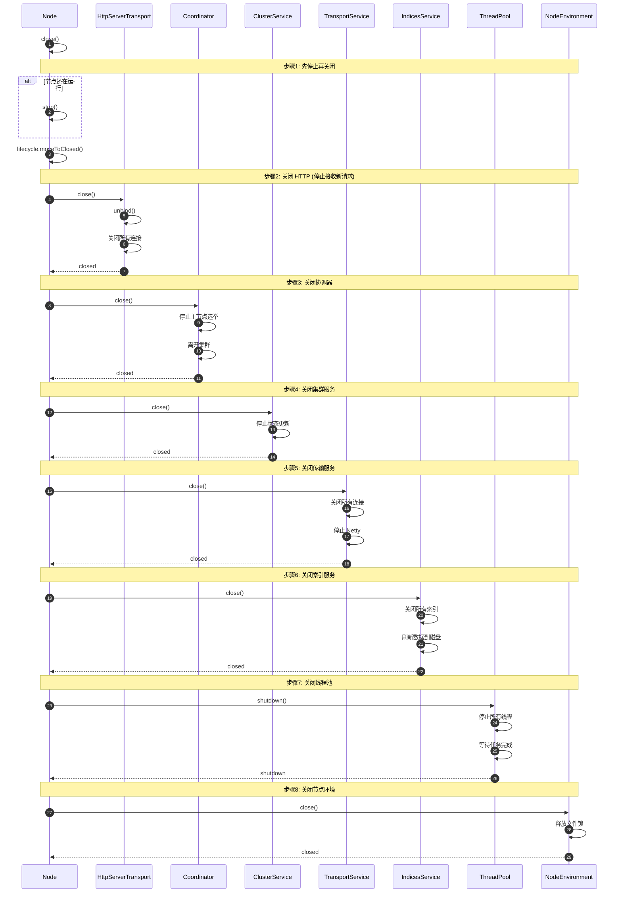

### 时序图说明

#### 关闭顺序（逆启动顺序）

**1. HTTP 服务 (步骤 1-4)**:

- 停止接收新的 HTTP 请求
- 关闭现有连接

**2. 协调器 (步骤 5-8)**:

- 停止主节点选举
- 通知其他节点离开集群

**3. 集群服务 (步骤 9-11)**:

- 停止处理集群状态更新
- 保存最后的集群状态

**4. 传输服务 (步骤 12-15)**:

- 关闭节点间连接
- 停止 Netty 服务器

**5. 索引服务 (步骤 16-19)**:

- 关闭所有索引
- Flush 数据到磁盘
- 等待所有操作完成

**6. 线程池 (步骤 20-23)**:

- 停止接收新任务
- 等待现有任务完成
- 关闭所有线程

**7. 节点环境 (步骤 24-26)**:

- 释放目录锁
- 清理临时文件

---

## 4. 插件加载流程

### 4.1 插件加载时序图

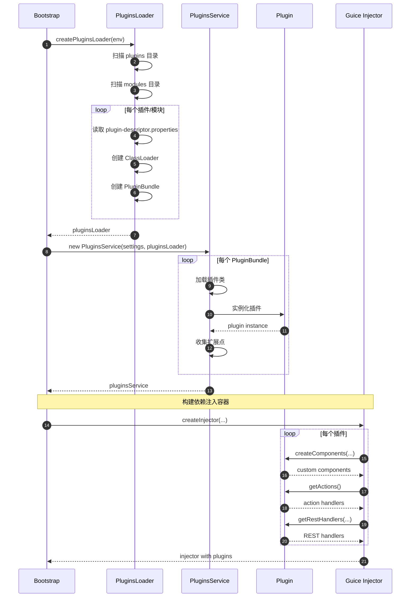

### 时序图说明

#### 插件加载步骤

**1. 扫描目录 (步骤 1-7)**:

- 扫描 `plugins/` 目录（用户插件）
- 扫描 `modules/` 目录（内置模块）
- 读取每个插件的描述文件

**2. 创建 ClassLoader (步骤 3-6)**:

- 为每个插件创建独立的 ClassLoader
- 实现插件隔离
- 避免类冲突

**3. 实例化插件 (步骤 10-14)**:

- 加载插件主类
- 调用插件构造函数
- 收集插件扩展点

**4. 注册扩展 (步骤 17-25)**:

- 创建自定义组件
- 注册 Action 处理器
- 注册 REST 处理器
- 注册自定义设置

---

## 相关文档

- [Elasticsearch-01-Server核心-概览](./Elasticsearch-01-Server核心-概览.md)
- [Elasticsearch-01-Server核心-API](./Elasticsearch-01-Server核心-API.md)
- [Elasticsearch-01-Server核心-数据结构](./Elasticsearch-01-Server核心-数据结构.md)

---
