# Elasticsearch-02-索引模块

## 模块概览

## 1. 模块职责

索引模块负责 Elasticsearch 中索引的创建、管理和文档操作,是数据写入路径的核心模块。主要职责包括:

- **索引生命周期管理**: 索引的创建、打开、关闭和删除
- **分片管理**: 管理索引的主分片和副本分片
- **文档 CRUD 操作**: 文档的创建、读取、更新和删除
- **Mapping 管理**: 管理字段映射和动态映射更新
- **版本控制**: 基于版本号和序列号的并发控制
- **数据持久化**: 通过存储引擎和 Translog 保证数据持久性

### 输入/输出

**输入**:

- 索引请求 (Index/Update/Delete/Bulk)
- 集群状态变更 (新分片分配、分片迁移)
- 恢复请求 (从副本或快照恢复)

**输出**:

- 索引操作结果 (成功/失败, 版本号, 序列号)
- 分片状态变更事件
- 统计信息 (索引速率、文档数、存储大小)

### 上下游依赖

**上游调用方**:

- Action Module (TransportIndexAction, TransportBulkAction)
- Search Module (需要读取索引数据)
- Cluster Module (集群状态变更触发分片操作)

**下游被调用方**:

- Storage Engine (InternalEngine, ReadOnlyEngine)
- Apache Lucene (文档索引和搜索)
- Translog (操作日志持久化)
- Mapper Service (文档解析和映射)

### 生命周期

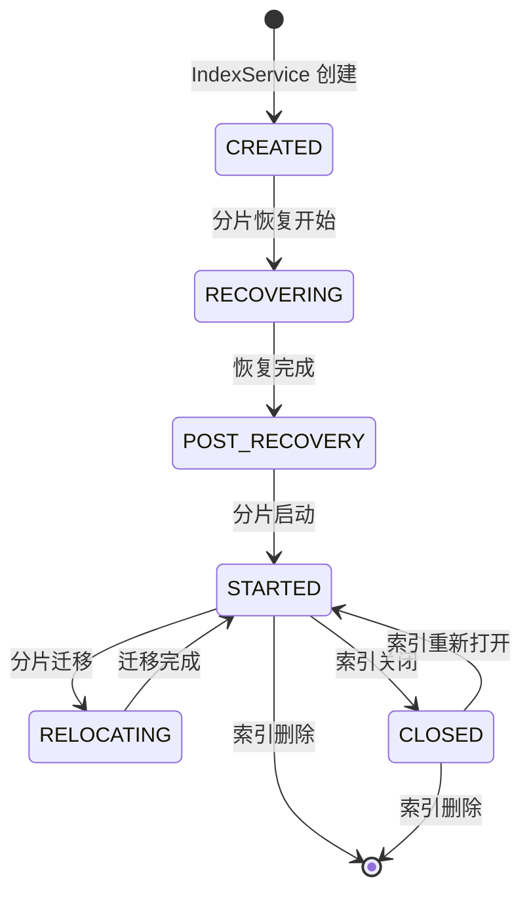
```mermaid
stateDiagram-v2
    [*] --> CREATED: IndexService 创建
    CREATED --> RECOVERING: 分片恢复开始
    RECOVERING --> POST_RECOVERY: 恢复完成
    POST_RECOVERY --> STARTED: 分片启动
    STARTED --> RELOCATING: 分片迁移
    RELOCATING --> STARTED: 迁移完成
    STARTED --> CLOSED: 索引关闭
    CLOSED --> STARTED: 索引重新打开
    STARTED --> [*]: 索引删除
    CLOSED --> [*]: 索引删除
```

**状态说明**:

- **CREATED**: IndexService 创建,尚未创建分片
- **RECOVERING**: 分片正在恢复(从副本、快照或 Translog)
- **POST_RECOVERY**: 恢复完成,执行恢复后操作
- **STARTED**: 分片已启动,可以处理读写请求
- **RELOCATING**: 分片正在迁移到其他节点
- **CLOSED**: 索引已关闭,不占用内存资源
- **删除**: 索引及其所有数据被删除

---

## 2. 模块架构图

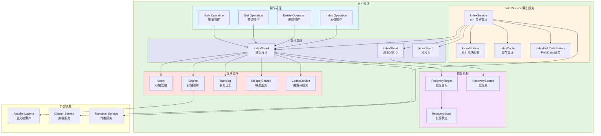
```mermaid
flowchart TB
    subgraph IndexModule["索引模块"]
        direction TB

        subgraph IndexService["IndexService 索引服务"]
            IS[IndexService<br/>索引实例管理]
            IM[IndexModule<br/>索引模块配置]
            IC[IndexCache<br/>缓存管理]
            IFD[IndexFieldDataService<br/>FieldData 服务]
        end

        subgraph Shards["分片管理"]
            Shard1[IndexShard<br/>主分片 0]
            Shard2[IndexShard<br/>副本分片 0]
            ShardN[IndexShard<br/>分片 N]
        end

        subgraph ShardComponents["分片组件"]
            Store[Store<br/>存储管理]
            Engine[Engine<br/>存储引擎]
            Translog[Translog<br/>事务日志]
            Mapper[MapperService<br/>映射服务]
            Codec[CodecService<br/>编解码服务]
        end

        subgraph Recovery["恢复机制"]
            RecTarget[RecoveryTarget<br/>恢复目标]
            RecSource[RecoverySource<br/>恢复源]
            RecState[RecoveryState<br/>恢复状态]
        end

        subgraph Operations["操作处理"]
            IndexOp[Index Operation<br/>索引操作]
            DeleteOp[Delete Operation<br/>删除操作]
            GetOp[Get Operation<br/>查询操作]
            BulkOp[Bulk Operation<br/>批量操作]
        end
    end

    subgraph External["外部依赖"]
        Lucene[Apache Lucene<br/>全文检索库]
        ClusterSvc[Cluster Service<br/>集群服务]
        TransportSvc[Transport Service<br/>传输服务]
    end

    IS --> IM
    IS --> IC
    IS --> IFD
    IS --> Shard1
    IS --> Shard2
    IS --> ShardN

    Shard1 --> Store
    Shard1 --> Engine
    Shard1 --> Translog
    Shard1 --> Mapper
    Shard1 --> Codec

    Shard1 --> RecTarget
    Shard2 --> RecSource
    RecTarget --> RecState

    IndexOp --> Shard1
    DeleteOp --> Shard1
    GetOp --> Shard1
    BulkOp --> Shard1

    Engine --> Lucene
    IS --> ClusterSvc
    Shard1 --> TransportSvc

    style IndexModule fill:#E1F5E1
    style IndexService fill:#FFF4E1
    style Shards fill:#E1E1F5
    style ShardComponents fill:#FFE1E1
    style Recovery fill:#F5E1FF
    style Operations fill:#E1F5FF
```

### 架构说明

#### 组件职责

1. **IndexService (索引服务)**
   - 管理索引级别的配置和元数据
   - 创建和管理多个 IndexShard 实例
   - 提供索引级别的缓存和 FieldData 服务
   - 协调索引级别的操作(Refresh, Flush, ForceMerge)

2. **IndexShard (索引分片)**
   - 管理单个分片的完整生命周期
   - 处理文档的 CRUD 操作
   - 管理分片级别的存储引擎(Engine)
   - 维护分片的路由信息和状态
   - 处理分片恢复和副本复制

3. **Store (存储管理)**
   - 管理 Lucene 的 Directory 和文件
   - 提供分片级别的文件锁
   - 检查和修复损坏的索引文件

4. **Engine (存储引擎)**
   - 封装 Lucene IndexWriter 和 IndexReader
   - 管理文档的索引和删除操作
   - 维护 VersionMap(文档版本映射)
   - 控制 Refresh、Flush 和 Merge 操作

5. **Translog (事务日志)**
   - 记录所有未持久化的操作
   - 保证数据持久性和故障恢复
   - 支持序列号检查点机制

#### 边界条件

1. **并发控制**
   - 同一文档的写操作通过 UID 锁串行化
   - Refresh 和 Flush 通过读写锁协调
   - 分片状态变更通过 mutex 保护

2. **资源限制**
   - IndexBuffer 默认占用 10% 堆内存
   - Translog 大小影响恢复时间,默认 512MB 触发 Flush
   - 分片大小建议控制在 10-50GB

3. **超时控制**
   - 索引操作默认超时 1 分钟
   - 分片恢复超时取决于数据量
   - Refresh 操作尽力而为,不阻塞写入

#### 异常处理与回退

1. **文档级别异常**
   - 解析错误: 返回失败,不影响其他文档
   - 版本冲突: 返回 409,客户端重试
   - Mapping 更新失败: 返回需要更新 Mapping

2. **分片级别异常**
   - 写入失败: 标记分片失败,触发重新分配
   - Translog 损坏: 分片进入失败状态,从副本恢复
   - 磁盘空间不足: 触发只读索引块

3. **索引级别异常**
   - 所有分片不可用: 索引状态为 Red
   - 部分分片不可用: 索引状态为 Yellow

#### 性能优化点

1. **批量操作**: 使用 Bulk API 减少网络往返和锁竞争
2. **Refresh 间隔**: 增大 refresh_interval 减少 Segment 生成
3. **Translog 异步**: 配置 async fsync 提升吞吐量
4. **禁用 _source**: 不需要原始文档时禁用 _source
5. **并发写入**: 增加 index_buffer_size 和 写入线程池

#### 可观测性

- **索引速率**: docs/s, 监控写入吞吐量
- **索引延迟**: ms, P99 延迟指标
- **Refresh 时间**: ms, Refresh 操作耗时
- **Merge 时间**: ms, Segment 合并耗时
- **Translog 大小**: bytes, 未 Flush 的操作日志大小
- **分片状态**: STARTED/RECOVERING/RELOCATING/FAILED

---

## 3. 核心数据流

### 3.1 文档索引流程

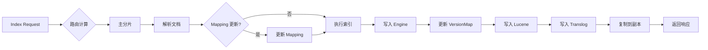
```mermaid
flowchart LR
    A[Index Request] --> B{路由计算}
    B --> C[主分片]
    C --> D[解析文档]
    D --> E{Mapping 更新?}
    E -->|是| F[更新 Mapping]
    E -->|否| G[执行索引]
    F --> G
    G --> H[写入 Engine]
    H --> I[更新 VersionMap]
    I --> J[写入 Lucene]
    J --> K[写入 Translog]
    K --> L[复制到副本]
    L --> M[返回响应]
```

### 3.2 分片恢复流程

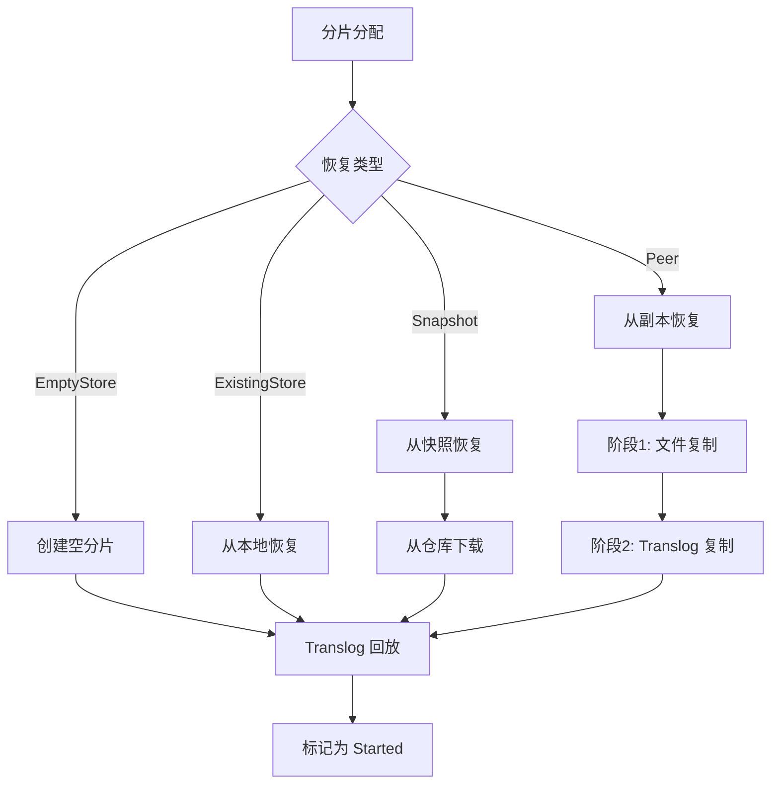
```mermaid
flowchart TB
    A[分片分配] --> B{恢复类型}
    B -->|EmptyStore| C[创建空分片]
    B -->|ExistingStore| D[从本地恢复]
    B -->|Peer| E[从副本恢复]
    B -->|Snapshot| F[从快照恢复]

    C --> G[Translog 回放]
    D --> G
    E --> H[阶段1: 文件复制]
    F --> I[从仓库下载]

    H --> J[阶段2: Translog 复制]
    I --> G
    J --> G

    G --> K[标记为 Started]
```

### 3.3 数据同步流程

主分片和副本分片之间的数据同步通过序列号机制保证:

1. **全局检查点 (Global Checkpoint)**: 所有副本已确认的最大序列号
2. **本地检查点 (Local Checkpoint)**: 当前分片已处理的最大序列号
3. **最大序列号 (Max Seq No)**: 分片已分配的最大序列号

副本同步策略:

- **同步复制**: 主分片等待多数副本确认
- **异步复制**: 主分片不等待副本,后台异步同步
- **主动同步**: 定期同步全局检查点

---

## 4. 关键类与接口

### IndexService

```java
// IndexService 管理单个索引的所有分片
public class IndexService extends AbstractIndexComponent
    implements IndicesClusterStateService.AllocatedIndex<IndexShard> {

    // 索引元数据和配置
    private final IndexSettings indexSettings;
    private final MapperService mapperService;
    private final IndexCache indexCache;
    private final IndexFieldDataService indexFieldData;

    // 分片映射 shardId -> IndexShard
    private volatile Map<Integer, IndexShard> shards;

    // 创建新分片
    public synchronized IndexShard createShard(
        ShardRouting routing,
        GlobalCheckpointSyncer globalCheckpointSyncer,
        RetentionLeaseSyncer retentionLeaseSyncer
    ) throws IOException;

    // 移除分片
    public synchronized void removeShard(int shardId, String reason);

    // 获取分片
    public IndexShard getShard(int shardId);
}
```

### IndexShard

```java
// IndexShard 表示单个分片,是索引模块的核心类
public class IndexShard extends AbstractIndexShardComponent
    implements IndicesClusterStateService.Shard {

    // 分片路由信息
    protected volatile ShardRouting shardRouting;

    // 分片状态: CREATED/RECOVERING/POST_RECOVERY/STARTED/CLOSED
    protected volatile IndexShardState state;

    // 存储引擎引用
    private final AtomicReference<Engine> currentEngine;

    // 存储管理
    private final Store store;

    // 事务日志
    private final TranslogConfig translogConfig;

    // 索引操作 - 主分片
    public Engine.IndexResult applyIndexOperationOnPrimary(
        long version,
        VersionType versionType,
        SourceToParse sourceToParse,
        long ifSeqNo,
        long ifPrimaryTerm,
        long autoGeneratedTimestamp,
        boolean isRetry
    ) throws IOException;

    // 索引操作 - 副本分片
    public Engine.IndexResult applyIndexOperationOnReplica(
        long seqNo,
        long opPrimaryTerm,
        long version,
        long autoGeneratedTimeStamp,
        boolean isRetry,
        SourceToParse sourceToParse
    ) throws IOException;

    // 删除操作
    public Engine.DeleteResult applyDeleteOperationOnPrimary(
        long version,
        String id,
        VersionType versionType,
        long ifSeqNo,
        long ifPrimaryTerm
    ) throws IOException;

    // 获取文档
    public Engine.GetResult get(Engine.Get get);

    // Refresh 操作
    public void refresh(String source);

    // Flush 操作
    public void flush(FlushRequest request);

    // 强制合并
    public void forceMerge(ForceMergeRequest request);

    // 恢复分片
    public void startRecovery(
        RecoveryState recoveryState,
        PeerRecoveryTargetService.RecoveryListener recoveryListener,
        RepositoriesService repositoriesService
    );
}
```

### Store

```java
// Store 管理分片的 Lucene Directory 和文件
public class Store extends AbstractIndexShardComponent implements Closeable, RefCounted {

    // Lucene Directory
    private final Directory directory;

    // 分片锁,防止多个进程同时访问
    private final ShardLock shardLock;

    // 获取元数据快照
    public MetadataSnapshot getMetadata(IndexCommit commit) throws IOException;

    // 验证索引完整性
    public void verify() throws IOException;

    // 检查索引
    public CheckIndex.Status checkIndex(PrintStream printStream) throws IOException;

    // 清理文件
    public void cleanupFiles(SegmentInfos segmentInfos) throws IOException;
}
```

### Engine

```java
// Engine 接口,定义存储引擎的核心操作
public interface Engine extends Closeable {

    // 索引文档
    IndexResult index(Index index) throws IOException;

    // 删除文档
    DeleteResult delete(Delete delete) throws IOException;

    // 获取文档
    GetResult get(Get get, BiFunction<String, SearcherScope, Searcher> searcherFactory);

    // Refresh,使文档可搜索
    void refresh(String source) throws EngineException;

    // Flush,持久化到磁盘
    FlushResult flush(boolean force, boolean waitIfOngoing) throws EngineException;

    // 强制合并 Segment
    void forceMerge(
        boolean flush,
        int maxNumSegments,
        boolean onlyExpungeDeletes,
        String forceMergeUUID
    ) throws IOException;

    // 获取 Searcher
    Searcher acquireSearcher(String source, SearcherScope scope);

    // 获取 Translog
    Translog getTranslog();
}
```

---

## 5. 配置与调优

### 索引级别配置

```yaml
# 分片和副本配置
index.number_of_shards: 5              # 主分片数,创建后不可修改
index.number_of_replicas: 1            # 副本数,可动态修改

# Refresh 配置
index.refresh_interval: 1s             # Refresh 间隔,默认 1s
index.max_refresh_listeners: 1000      # 最大 Refresh 监听器数量

# Translog 配置
index.translog.durability: request     # request: 每次请求 fsync, async: 异步 fsync
index.translog.sync_interval: 5s       # 异步 fsync 间隔
index.translog.flush_threshold_size: 512mb  # Translog 大小阈值,触发 Flush

# Merge 配置
index.merge.scheduler.max_thread_count: 1   # 合并线程数
index.merge.policy.max_merged_segment: 5gb  # 最大 Segment 大小

# 缓存配置
index.queries.cache.enabled: true      # 查询缓存开关
index.requests.cache.enable: true      # 请求缓存开关

# 存储配置
index.store.type: fs                   # 存储类型: fs, niofs, mmapfs
index.codec: default                   # 编解码器: default, best_compression
```

### 性能调优建议

#### 写入性能优化

1. **增大 Refresh 间隔**

```json
PUT /my-index/_settings
{
  "index.refresh_interval": "30s"
}
```

1. **使用异步 Translog**

```json
PUT /my-index/_settings
{
  "index.translog.durability": "async",
  "index.translog.sync_interval": "5s"
}
```

1. **禁用 Replica(初始加载)**

```json
PUT /my-index/_settings
{
  "index.number_of_replicas": 0
}
```

1. **增大 IndexBuffer**

```yaml
indices.memory.index_buffer_size: 20%
```

#### 查询性能优化

1. **启用查询缓存**

```json
PUT /my-index/_settings
{
  "index.queries.cache.enabled": true
}
```

1. **使用 Filter 而非 Query**

```json
{
  "query": {
    "bool": {
      "filter": [
        { "term": { "status": "published" } }
      ]
    }
  }
}
```

1. **控制 Segment 数量**

```bash
POST /my-index/_forcemerge?max_num_segments=1
```

#### 存储优化

1. **压缩编解码器**

```json
PUT /my-index/_settings
{
  "index.codec": "best_compression"
}
```

1. **禁用 _source**(不需要原始文档时)

```json
PUT /my-index
{
  "mappings": {
    "_source": {
      "enabled": false
    }
  }
}
```

---

## 6. 监控与故障排查

### 关键指标

```bash
# 索引统计
GET /_stats/indexing,search,store,merge,refresh

# 分片信息
GET /_cat/shards?v&h=index,shard,prirep,state,docs,store,node

# 索引健康
GET /_cluster/health?level=indices

# 恢复状态
GET /_cat/recovery?v&active_only=true
```

### 常见问题

#### 1. 索引速度慢
- 检查 Refresh 间隔是否过短
- 检查是否开启同步 Translog fsync
- 检查 Merge 是否跟不上写入速度
- 检查磁盘 I/O 是否饱和

#### 2. 分片不可用
- 检查节点是否下线
- 检查磁盘空间是否充足
- 检查 Translog 是否损坏
- 查看 Elasticsearch 日志

#### 3. 副本同步延迟
- 检查网络延迟
- 检查副本节点负载
- 检查 Translog 大小
- 检查全局检查点差异

---

## 相关文档

- [Elasticsearch-02-索引模块-API](./Elasticsearch-02-索引模块-API.md)
- [Elasticsearch-02-索引模块-数据结构](./Elasticsearch-02-索引模块-数据结构.md)
- [Elasticsearch-02-索引模块-时序图](./Elasticsearch-02-索引模块-时序图.md)

---

## API接口

## API 清单

索引模块对外提供以下核心 API:

| API 名称 | HTTP 方法 | 路径 | 幂等性 | 说明 |
|---|---|---|---|---|
| Index Document | POST/PUT | `/{index}/_doc/{id}` | PUT 幂等, POST 非幂等 | 索引单个文档 |
| Create Document | PUT | `/{index}/_create/{id}` | 是 | 创建文档(id 存在则失败) |
| Update Document | POST | `/{index}/_update/{id}` | 否 | 更新文档(支持部分更新) |
| Delete Document | DELETE | `/{index}/_doc/{id}` | 是 | 删除文档 |
| Get Document | GET | `/{index}/_doc/{id}` | N/A | 获取文档 |
| Bulk API | POST | `/_bulk` | 视操作而定 | 批量文档操作 |
| Multi-Get | POST | `/_mget` | N/A | 批量获取文档 |
| Reindex | POST | `/_reindex` | 否 | 重建索引 |

---

## 1. Index Document API

### 基本信息

- **名称**: Index Document
- **协议与方法**:
  - HTTP PUT `/{index}/_doc/{id}` - 指定 ID,幂等
  - HTTP POST `/{index}/_doc` - 自动生成 ID,非幂等
- **幂等性**: PUT 请求幂等(相同 ID 覆盖),POST 请求非幂等(每次生成新 ID)
- **幂等键策略**: 通过 `if_seq_no` + `if_primary_term` 实现乐观并发控制

### 请求结构体

```java
// IndexRequest - 索引文档请求
public class IndexRequest extends ReplicatedWriteRequest<IndexRequest>
    implements DocWriteRequest<IndexRequest> {

    // 文档 ID,不设置则自动生成
    private String id;

    // 路由键,用于计算文档所在分片
    // 默认使用 id 作为路由键
    private String routing;

    // 文档源内容
    private final IndexSource indexSource;

    // 操作类型: INDEX(插入或更新) 或 CREATE(仅插入)
    private OpType opType = OpType.INDEX;

    // 版本号,用于乐观并发控制
    private long version = Versions.MATCH_ANY;
    private VersionType versionType = VersionType.INTERNAL;

    // 序列号并发控制(推荐方式)
    private long ifSeqNo = UNASSIGNED_SEQ_NO;
    private long ifPrimaryTerm = UNASSIGNED_PRIMARY_TERM;

    // Ingest Pipeline
    private String pipeline;

    // 是否必须是别名
    private boolean requireAlias;

    // 自动生成时间戳(用于 ID 冲突检测)
    private long autoGeneratedTimestamp = UNSET_AUTO_GENERATED_TIMESTAMP;

    // 是否为重试请求
    private boolean isRetry = false;

    // 动态模板映射
    private Map<String, String> dynamicTemplates = Map.of();
}
```

### 请求字段表

| 字段 | 类型 | 必填 | 默认值 | 约束 | 说明 |
|---|---:|---|---|---|---|
| index | string | 是 | - | - | 索引名称 |
| id | string | 否 | auto-generate | 长度 ≤ 512 字节 | 文档 ID |
| routing | string | 否 | id | - | 路由键,决定分片分配 |
| source | object/string/bytes | 是 | - | 有效 JSON | 文档内容 |
| opType | string | 否 | index | index\|create | 操作类型 |
| version | long | 否 | - | > 0 | 文档版本号(已废弃) |
| version_type | string | 否 | internal | internal\|external\|external_gte | 版本类型(已废弃) |
| if_seq_no | long | 否 | - | ≥ 0 | 期望的序列号(用于并发控制) |
| if_primary_term | long | 否 | - | > 0 | 期望的主分片任期号 |
| pipeline | string | 否 | - | - | Ingest Pipeline 名称 |
| refresh | string | 否 | false | true\|false\|wait_for | 何时刷新使文档可见 |
| timeout | duration | 否 | 1m | - | 操作超时时间 |
| wait_for_active_shards | int\|string | 否 | 1 | - | 等待多少活跃分片 |
| require_alias | boolean | 否 | false | - | 索引名必须是别名 |

### 响应结构体

```java
// IndexResponse - 索引文档响应
public class IndexResponse extends DocWriteResponse implements StatusToXContentObject {

    // 文档 ID
    private String _id;

    // 文档版本号(每次更新递增)
    private long _version;

    // 序列号(全局唯一,单调递增)
    private long _seq_no;

    // 主分片任期号
    private long _primary_term;

    // 操作结果: created, updated, deleted, not_found, noop
    private Result result;

    // 分片副本确认信息
    private ReplicationResponse.ShardInfo _shards;
}
```

### 响应字段表

| 字段 | 类型 | 必填 | 说明 |
|---|---:|---|---|
| _index | string | 是 | 实际写入的索引名(可能是别名解析后) |
| _id | string | 是 | 文档 ID |
| _version | long | 是 | 文档版本号,每次更新递增 |
| _seq_no | long | 是 | 序列号,分片内唯一且单调递增 |
| _primary_term | long | 是 | 主分片任期号,分片迁移时递增 |
| result | string | 是 | 操作结果: created(新建) 或 updated(更新) |
| _shards.total | int | 是 | 总分片数(1 + 副本数) |
| _shards.successful | int | 是 | 成功分片数 |
| _shards.failed | int | 是 | 失败分片数 |

### 入口函数与核心代码

```java
// TransportIndexAction - 索引操作的传输层动作
// 实际委托给 TransportBulkAction 处理单个文档
public class TransportIndexAction extends TransportSingleItemBulkWriteAction<IndexRequest, DocWriteResponse> {

    public static final String NAME = "indices:data/write/index";

    @Inject
    public TransportIndexAction(
        ActionFilters actionFilters,
        TransportService transportService,
        TransportBulkAction bulkAction
    ) {
        // 将单文档请求转换为 Bulk 请求处理
        super(NAME, transportService, actionFilters, IndexRequest::new, bulkAction);
    }
}

// TransportBulkAction - 批量操作核心处理类
protected void doExecute(Task task, BulkRequest bulkRequest, ActionListener<BulkResponse> listener) {
    // 1. 解析请求,获取所有待处理的文档操作
    final long startTime = relativeTime();
    final AtomicArray<BulkItemResponse> responses = new AtomicArray<>(bulkRequest.requests.size());

    // 2. 处理 Ingest Pipeline(如果配置)
    if (clusterService.localNode().isIngestNode()) {
        processBulkIndexIngestRequest(task, bulkRequest, executorName, listener);
    } else {
        executeBulk(task, bulkRequest, startTime, listener, responses);
    }
}

private void executeBulk(
    Task task,
    BulkRequest bulkRequest,
    long startTimeNanos,
    ActionListener<BulkResponse> listener,
    AtomicArray<BulkItemResponse> responses
) {
    // 1. 创建自动索引(如果不存在且允许自动创建)
    // 2. 按分片分组请求
    final Map<ShardId, List<BulkItemRequest>> requestsByShard = new HashMap<>();

    for (int i = 0; i < bulkRequest.requests.size(); i++) {
        DocWriteRequest<?> request = bulkRequest.requests.get(i);
        // 解析索引名(可能是别名/Data Stream)
        // 计算路由,确定目标分片
        ShardId shardId = clusterService.operationRouting().indexShards(
            clusterState,
            request.index(),
            request.id(),
            request.routing()
        ).shardId();

        requestsByShard.computeIfAbsent(shardId, k -> new ArrayList<>())
            .add(new BulkItemRequest(i, request));
    }

    // 3. 并发执行所有分片的批量操作
    if (requestsByShard.isEmpty()) {
        listener.onResponse(new BulkResponse(responses.toArray(new BulkItemResponse[responses.length()]), buildTookInMillis(startTimeNanos)));
        return;
    }

    final AtomicInteger counter = new AtomicInteger(requestsByShard.size());
    for (Map.Entry<ShardId, List<BulkItemRequest>> entry : requestsByShard.entrySet()) {
        final ShardId shardId = entry.getKey();
        final List<BulkItemRequest> requests = entry.getValue();

        BulkShardRequest bulkShardRequest = new BulkShardRequest(
            shardId,
            bulkRequest.getRefreshPolicy(),
            requests.toArray(new BulkItemRequest[0])
        );

        // 执行分片级别的批量操作
        shardBulkAction.execute(bulkShardRequest, new ActionListener<BulkShardResponse>() {
            @Override
            public void onResponse(BulkShardResponse bulkShardResponse) {
                // 收集响应
                for (BulkItemResponse itemResponse : bulkShardResponse.getResponses()) {
                    responses.set(itemResponse.getItemId(), itemResponse);
                }

                // 所有分片完成后返回
                if (counter.decrementAndGet() == 0) {
                    finalizeBulkRequest(task, bulkRequest, responses, startTimeNanos, listener);
                }
            }

            @Override
            public void onFailure(Exception e) {
                // 记录分片级别失败
                for (BulkItemRequest request : requests) {
                    responses.set(request.id(), new BulkItemResponse(request.id(),
                        request.request().opType(),
                        new BulkItemResponse.Failure(request.index(), request.id(), e)));
                }

                if (counter.decrementAndGet() == 0) {
                    finalizeBulkRequest(task, bulkRequest, responses, startTimeNanos, listener);
                }
            }
        });
    }
}
```

### 分片级别处理

```java
// TransportShardBulkAction - 分片级别批量操作
protected void shardOperationOnPrimary(
    BulkShardRequest request,
    IndexShard primary,
    ActionListener<PrimaryResult<BulkShardRequest, BulkShardResponse>> listener
) {
    // 在主分片上执行批量操作
    Executor executor = threadPool.executor(ThreadPool.Names.WRITE);
    executor.execute(new AbstractRunnable() {
        @Override
        protected void doRun() {
            // 1. 获取 Engine
            final Engine.IndexingMemoryController memoryController =
                indicesService.indexingMemoryController();

            // 2. 逐个处理文档操作
            BulkItemResponse[] responses = new BulkItemResponse[request.items().length];
            for (int i = 0; i < request.items().length; i++) {
                BulkItemRequest item = request.items()[i];

                if (item.request() instanceof IndexRequest) {
                    IndexRequest indexRequest = (IndexRequest) item.request();

                    try {
                        // 调用 IndexShard 执行索引操作
                        Engine.IndexResult result = primary.applyIndexOperationOnPrimary(
                            indexRequest.version(),
                            indexRequest.versionType(),
                            new SourceToParse(
                                indexRequest.index(),
                                indexRequest.id(),
                                indexRequest.source(),
                                indexRequest.getContentType(),
                                indexRequest.routing()
                            ),
                            indexRequest.ifSeqNo(),
                            indexRequest.ifPrimaryTerm(),
                            indexRequest.getAutoGeneratedTimestamp(),
                            indexRequest.isRetry()
                        );

                        // 构建响应
                        if (result.getResultType() == Engine.Result.Type.SUCCESS) {
                            IndexResponse response = new IndexResponse(
                                primary.shardId(),
                                indexRequest.id(),
                                result.getSeqNo(),
                                result.getTerm(),
                                result.getVersion(),
                                result.isCreated()
                            );
                            responses[i] = new BulkItemResponse(i, indexRequest.opType(), response);
                        } else {
                            // 处理失败情况
                            responses[i] = new BulkItemResponse(i, indexRequest.opType(),
                                new BulkItemResponse.Failure(
                                    indexRequest.index(),
                                    indexRequest.id(),
                                    result.getFailure()
                                )
                            );
                        }
                    } catch (Exception e) {
                        responses[i] = new BulkItemResponse(i, indexRequest.opType(),
                            new BulkItemResponse.Failure(
                                indexRequest.index(),
                                indexRequest.id(),
                                e
                            )
                        );
                    }
                }
            }

            // 3. 返回主分片处理结果
            BulkShardResponse response = new BulkShardResponse(request.shardId(), responses);
            listener.onResponse(new PrimaryResult<>(request, response));
        }
    });
}
```

### 时序图(请求→响应完整路径)

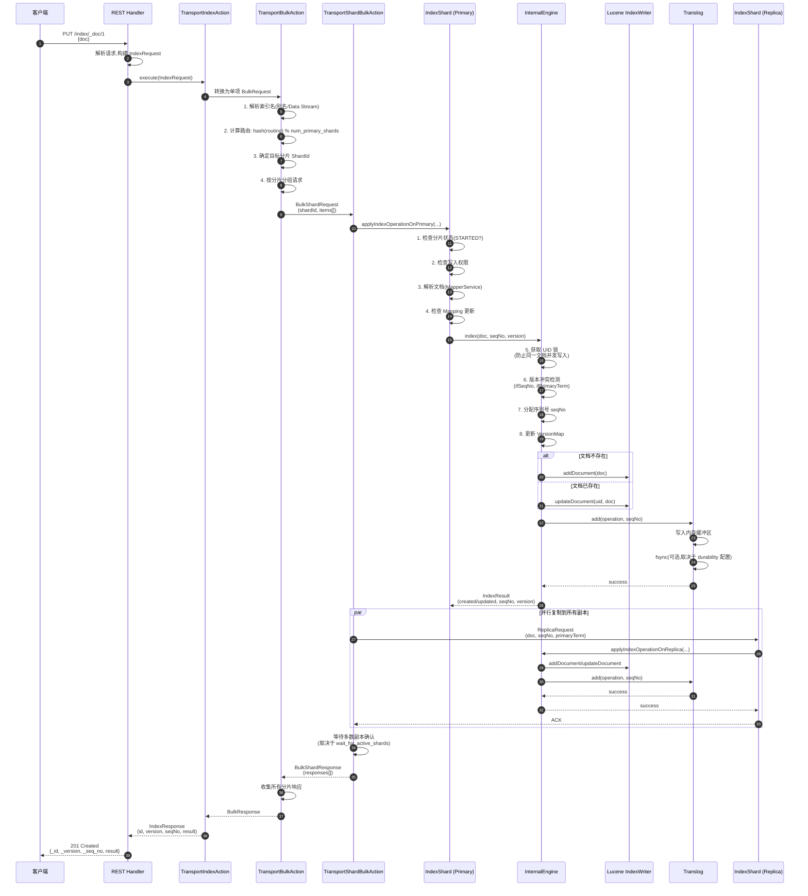
```mermaid
sequenceDiagram
    autonumber
    participant Client as 客户端
    participant REST as REST Handler
    participant TIA as TransportIndexAction
    participant TBA as TransportBulkAction
    participant TSBA as TransportShardBulkAction
    participant Shard as IndexShard (Primary)
    participant Engine as InternalEngine
    participant Lucene as Lucene IndexWriter
    participant Translog as Translog
    participant Replica as IndexShard (Replica)

    Client->>REST: PUT /index/_doc/1<br/>{doc}
    REST->>REST: 解析请求,构建 IndexRequest
    REST->>TIA: execute(IndexRequest)
    TIA->>TBA: 转换为单项 BulkRequest

    TBA->>TBA: 1. 解析索引名(别名/Data Stream)
    TBA->>TBA: 2. 计算路由: hash(routing) % num_primary_shards
    TBA->>TBA: 3. 确定目标分片 ShardId
    TBA->>TBA: 4. 按分片分组请求

    TBA->>TSBA: BulkShardRequest<br/>(shardId, items[])
    TSBA->>Shard: applyIndexOperationOnPrimary(...)

    Shard->>Shard: 1. 检查分片状态(STARTED?)
    Shard->>Shard: 2. 检查写入权限
    Shard->>Shard: 3. 解析文档(MapperService)
    Shard->>Shard: 4. 检查 Mapping 更新

    Shard->>Engine: index(doc, seqNo, version)

    Engine->>Engine: 5. 获取 UID 锁<br/>(防止同一文档并发写入)
    Engine->>Engine: 6. 版本冲突检测<br/>(ifSeqNo, ifPrimaryTerm)
    Engine->>Engine: 7. 分配序列号 seqNo
    Engine->>Engine: 8. 更新 VersionMap

    alt 文档不存在
        Engine->>Lucene: addDocument(doc)
    else 文档已存在
        Engine->>Lucene: updateDocument(uid, doc)
    end

    Engine->>Translog: add(operation, seqNo)
    Translog->>Translog: 写入内存缓冲区
    Translog->>Translog: fsync(可选,取决于 durability 配置)
    Translog-->>Engine: success

    Engine-->>Shard: IndexResult<br/>(created/updated, seqNo, version)

    par 并行复制到所有副本
        TSBA->>Replica: ReplicaRequest<br/>(doc, seqNo, primaryTerm)
        Replica->>Engine: applyIndexOperationOnReplica(...)
        Engine->>Lucene: addDocument/updateDocument
        Engine->>Translog: add(operation, seqNo)
        Translog-->>Engine: success
        Engine-->>Replica: success
        Replica-->>TSBA: ACK
    end

    TSBA->>TSBA: 等待多数副本确认<br/>(取决于 wait_for_active_shards)
    TSBA-->>TBA: BulkShardResponse<br/>(responses[])

    TBA->>TBA: 收集所有分片响应
    TBA-->>TIA: BulkResponse
    TIA-->>REST: IndexResponse<br/>(id, version, seqNo, result)
    REST-->>Client: 201 Created<br/>{_id, _version, _seq_no, result}
```

### 边界与异常

#### 异常情况处理

1. **版本冲突 (Version Conflict)**
   - **触发条件**: `if_seq_no` 或 `if_primary_term` 不匹配
   - **HTTP 状态码**: 409 Conflict
   - **返回内容**:

     ```json
     {
       "error": {
         "type": "version_conflict_engine_exception",
         "reason": "[1]: version conflict, current version [2] is different than the one provided [1]"
       },
       "status": 409
     }
```

   - **客户端处理**: 重新获取最新版本并重试

2. **文档 ID 超长**
   - **触发条件**: ID 长度 > 512 字节
   - **HTTP 状态码**: 400 Bad Request
   - **返回内容**: `"Document id cannot be longer than 512 bytes"`

3. **JSON 解析失败**
   - **触发条件**: source 不是有效 JSON
   - **HTTP 状态码**: 400 Bad Request
   - **影响范围**: 仅当前文档失败,不影响 Bulk 中其他文档

4. **主分片不可用**
   - **触发条件**: 主分片处于 RELOCATING 或 INITIALIZING 状态
   - **HTTP 状态码**: 503 Service Unavailable
   - **客户端处理**: 重试(Transport 层自动重试)

5. **磁盘空间不足**
   - **触发条件**: 磁盘使用率超过 `cluster.routing.allocation.disk.watermark.flood_stage`
   - **HTTP 状态码**: 429 Too Many Requests
   - **索引行为**: 索引被标记为只读(`index.blocks.read_only_allow_delete`)

6. **Mapping 冲突**
   - **触发条件**: 字段类型与现有 Mapping 不兼容
   - **HTTP 状态码**: 400 Bad Request
   - **返回内容**: `"mapper_parsing_exception"`

#### 重试策略

- **自动重试**: Transport 层自动重试主分片不可用、超时等临时性错误
- **重试次数**: 默认无限制,直到超时
- **退避策略**: 指数退避,初始 50ms,最大 500ms
- **幂等性**: PUT 请求幂等,可安全重试;POST 请求非幂等,重试可能产生重复文档

### 实践与最佳实践

#### 1. 乐观并发控制

使用 `if_seq_no` + `if_primary_term` 替代已废弃的 `version`:

```bash
# 1. 获取文档当前版本
GET /products/_doc/1

# Response:
# {
#   "_seq_no": 5,
#   "_primary_term": 1,
#   ...
# }

# 2. 基于获取到的版本更新
PUT /products/_doc/1?if_seq_no=5&if_primary_term=1
{
  "name": "Updated Product",
  "price": 199.99
}
```

#### 2. 批量索引优化

使用 Bulk API 而非单个 Index API:

```bash
# 批量索引(推荐)
POST /_bulk
{"index":{"_index":"products","_id":"1"}}
{"name":"Product 1","price":99.99}
{"index":{"_index":"products","_id":"2"}}
{"name":"Product 2","price":199.99}

# 单个索引(不推荐)
PUT /products/_doc/1
{"name":"Product 1","price":99.99}
PUT /products/_doc/2
{"name":"Product 2","price":199.99}
```

**性能对比**:

- 批量索引: 10,000-50,000 docs/s
- 单个索引: 1,000-5,000 docs/s

#### 3. 控制刷新策略

```bash
# 实时可见(性能最差)
PUT /products/_doc/1?refresh=true
{"name":"Product"}

# 等待刷新完成(性能较差)
PUT /products/_doc/1?refresh=wait_for
{"name":"Product"}

# 不刷新(性能最好,默认)
PUT /products/_doc/1
{"name":"Product"}
```

#### 4. 路由优化

为相关文档使用相同路由,减少搜索时需要查询的分片数:

```bash
# 将同一用户的文档路由到同一分片
PUT /orders/_doc/order1?routing=user123
{"user_id":"user123","product":"laptop"}

PUT /orders/_doc/order2?routing=user123
{"user_id":"user123","product":"mouse"}

# 搜索时指定路由,只查询一个分片
GET /orders/_search?routing=user123
{
  "query": {"term": {"user_id": "user123"}}
}
```

#### 5. 处理大文档

```bash
# 禁用 _source 存储(不需要返回原始文档时)
PUT /logs
{
  "mappings": {
    "_source": {"enabled": false}
  }
}

# 或者仅存储部分字段
PUT /logs
{
  "mappings": {
    "_source": {
      "includes": ["timestamp", "message"],
      "excludes": ["large_field"]
    }
  }
}
```

---

## 2. Bulk API

### 基本信息

- **名称**: Bulk
- **协议与方法**: HTTP POST `/_bulk` 或 `/{index}/_bulk`
- **幂等性**: 取决于每个操作类型
- **批量上限**: 建议单次请求 5-15MB,具体取决于网络和硬件

### 请求结构体

```java
// BulkRequest - 批量操作请求
public class BulkRequest extends LegacyActionRequest
    implements CompositeIndicesRequest, WriteRequest<BulkRequest> {

    // 请求列表,支持 Index/Delete/Update 操作
    final List<DocWriteRequest<?>> requests = new ArrayList<>();

    // 涉及的索引集合
    private final Set<String> indices = new HashSet<>();

    // 全局超时
    protected TimeValue timeout = BulkShardRequest.DEFAULT_TIMEOUT;

    // 等待多少活跃分片
    private ActiveShardCount waitForActiveShards = ActiveShardCount.DEFAULT;

    // 刷新策略
    private RefreshPolicy refreshPolicy = RefreshPolicy.NONE;

    // 全局 Pipeline
    private String globalPipeline;

    // 全局路由
    private String globalRouting;

    // 请求总大小(字节)
    private long sizeInBytes = 0;
}
```

### 请求格式

Bulk API 使用 NDJSON (Newline Delimited JSON) 格式:

```
action_and_meta_data\n
optional_source\n
action_and_meta_data\n
optional_source\n
...
```

#### 请求示例

```bash
POST /_bulk
{"index":{"_index":"products","_id":"1"}}
{"name":"Laptop","price":999.99,"category":"Electronics"}
{"create":{"_index":"products","_id":"2"}}
{"name":"Mouse","price":29.99,"category":"Electronics"}
{"update":{"_index":"products","_id":"1"}}
{"doc":{"price":899.99}}
{"delete":{"_index":"products","_id":"3"}}
```

### 响应结构体

```java
// BulkResponse - 批量操作响应
public class BulkResponse extends ActionResponse implements Iterable<BulkItemResponse> {

    // 每个操作的响应
    private final BulkItemResponse[] responses;

    // 总耗时(毫秒)
    private final long took;

    // 是否有失败的操作
    private final boolean hasFailures;
}

// BulkItemResponse - 单个操作的响应
public class BulkItemResponse implements Writeable {

    // 操作在请求中的位置
    private final int id;

    // 操作类型: index, create, update, delete
    private final OpType opType;

    // 成功响应
    private final DocWriteResponse response;

    // 失败响应
    private final Failure failure;

    public static class Failure {
        private final String index;
        private final String id;
        private final Exception cause;
        private final RestStatus status;
    }
}
```

### 核心处理逻辑

```java
// TransportBulkAction.BulkOperation - Bulk 操作核心处理
final class BulkOperation {

    private final BulkRequest bulkRequest;
    private final ActionListener<BulkResponse> listener;
    private final AtomicArray<BulkItemResponse> responses;
    private final long startTimeNanos;
    private final ClusterStateObserver observer;

    private BulkOperation(
        Task task,
        BulkRequest bulkRequest,
        ActionListener<BulkResponse> listener,
        AtomicArray<BulkItemResponse> responses,
        long startTimeNanos
    ) {
        this.bulkRequest = bulkRequest;
        this.listener = listener;
        this.responses = responses;
        this.startTimeNanos = startTimeNanos;
        this.observer = new ClusterStateObserver(clusterService, bulkRequest.timeout(), logger, threadPool.getThreadContext());
    }

    void run() {
        // 1. 等待集群状态可用
        final ClusterState clusterState = observer.setAndGetObservedState();
        if (handleBlockExceptions(clusterState)) {
            return;
        }

        // 2. 自动创建索引(如果配置允许)
        final Set<String> autoCreateIndices = getAutoCreateIndices(clusterState);
        if (autoCreateIndices.isEmpty()) {
            executeBulk(task, bulkRequest, startTimeNanos, listener, responses, emptyMap());
        } else {
            // 创建缺失的索引
            createMissingIndicesAndIndexData(task, bulkRequest, listener, responses, autoCreateIndices, startTimeNanos);
        }
    }

    private void executeBulk(
        Task task,
        BulkRequest bulkRequest,
        long startTimeNanos,
        ActionListener<BulkResponse> listener,
        AtomicArray<BulkItemResponse> responses,
        Map<String, IndexNotFoundException> indicesThatCannotBeCreated
    ) {
        // 1. 按目标分片分组请求
        Map<ShardId, List<BulkItemRequest>> requestsByShard = new HashMap<>();

        for (int i = 0; i < bulkRequest.requests.size(); i++) {
            DocWriteRequest<?> docWriteRequest = bulkRequest.requests.get(i);

            // 跳过已处理或无法创建索引的请求
            if (responses.get(i) != null) {
                continue;
            }

            // 解析索引(别名/Data Stream -> 实际索引)
            String concreteIndex = resolveIndexName(docWriteRequest.index(), clusterState);

            // 计算目标分片
            ShardId shardId = clusterService.operationRouting().indexShards(
                clusterState,
                concreteIndex,
                docWriteRequest.id(),
                docWriteRequest.routing()
            ).shardId();

            // 分组
            List<BulkItemRequest> shardRequests = requestsByShard.computeIfAbsent(
                shardId,
                k -> new ArrayList<>()
            );
            shardRequests.add(new BulkItemRequest(i, docWriteRequest));
        }

        // 2. 并发执行所有分片的批量操作
        if (requestsByShard.isEmpty()) {
            listener.onResponse(
                new BulkResponse(
                    responses.toArray(new BulkItemResponse[responses.length()]),
                    buildTookInMillis(startTimeNanos)
                )
            );
            return;
        }

        final AtomicInteger counter = new AtomicInteger(requestsByShard.size());
        final AtomicReference<Exception> lastException = new AtomicReference<>();

        for (Map.Entry<ShardId, List<BulkItemRequest>> entry : requestsByShard.entrySet()) {
            final ShardId shardId = entry.getKey();
            final List<BulkItemRequest> requests = entry.getValue();

            BulkShardRequest bulkShardRequest = new BulkShardRequest(
                shardId,
                bulkRequest.getRefreshPolicy(),
                requests.toArray(new BulkItemRequest[0])
            );
            bulkShardRequest.waitForActiveShards(bulkRequest.waitForActiveShards());
            bulkShardRequest.timeout(bulkRequest.timeout());

            // 执行分片级别批量操作
            shardBulkAction.execute(bulkShardRequest, new ActionListener<BulkShardResponse>() {
                @Override
                public void onResponse(BulkShardResponse bulkShardResponse) {
                    for (BulkItemResponse itemResponse : bulkShardResponse.getResponses()) {
                        responses.set(itemResponse.getItemId(), itemResponse);
                    }

                    if (counter.decrementAndGet() == 0) {
                        finalizeBulkRequest(task, bulkRequest, responses, startTimeNanos, listener);
                    }
                }

                @Override
                public void onFailure(Exception e) {
                    // 分片级别失败,标记所有请求失败
                    for (BulkItemRequest request : requests) {
                        responses.set(request.id(),
                            new BulkItemResponse(
                                request.id(),
                                request.request().opType(),
                                new BulkItemResponse.Failure(
                                    request.index(),
                                    request.id(),
                                    e
                                )
                            )
                        );
                    }
                    lastException.set(e);

                    if (counter.decrementAndGet() == 0) {
                        finalizeBulkRequest(task, bulkRequest, responses, startTimeNanos, listener);
                    }
                }
            });
        }
    }
}
```

### 时序图

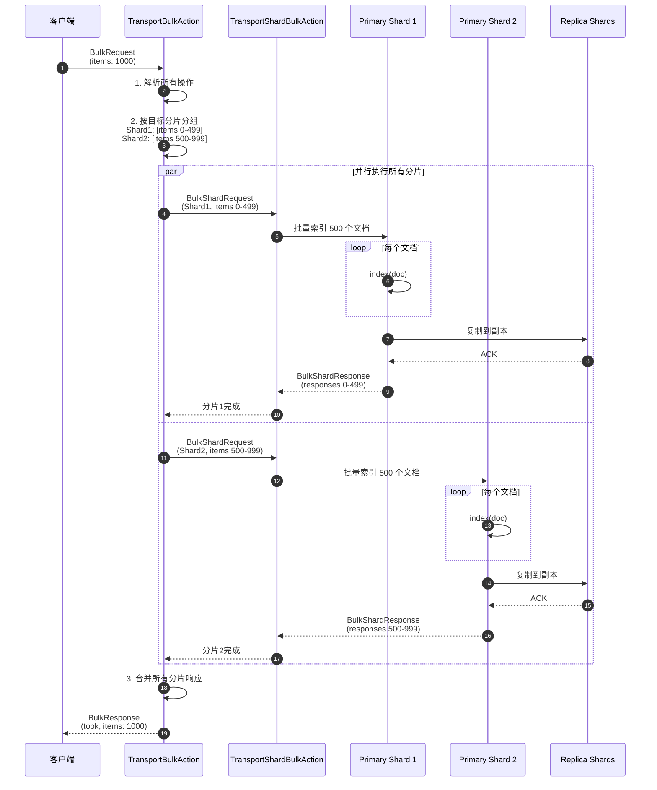
```mermaid
sequenceDiagram
    autonumber
    participant Client as 客户端
    participant TBA as TransportBulkAction
    participant TSBA as TransportShardBulkAction
    participant Shard1 as Primary Shard 1
    participant Shard2 as Primary Shard 2
    participant Replica as Replica Shards

    Client->>TBA: BulkRequest<br/>(items: 1000)

    TBA->>TBA: 1. 解析所有操作
    TBA->>TBA: 2. 按目标分片分组<br/>Shard1: [items 0-499]<br/>Shard2: [items 500-999]

    par 并行执行所有分片
        TBA->>TSBA: BulkShardRequest<br/>(Shard1, items 0-499)
        TSBA->>Shard1: 批量索引 500 个文档

        loop 每个文档
            Shard1->>Shard1: index(doc)
        end

        Shard1->>Replica: 复制到副本
        Replica-->>Shard1: ACK
        Shard1-->>TSBA: BulkShardResponse<br/>(responses 0-499)
        TSBA-->>TBA: 分片1完成
    and
        TBA->>TSBA: BulkShardRequest<br/>(Shard2, items 500-999)
        TSBA->>Shard2: 批量索引 500 个文档

        loop 每个文档
            Shard2->>Shard2: index(doc)
        end

        Shard2->>Replica: 复制到副本
        Replica-->>Shard2: ACK
        Shard2-->>TSBA: BulkShardResponse<br/>(responses 500-999)
        TSBA-->>TBA: 分片2完成
    end

    TBA->>TBA: 3. 合并所有分片响应
    TBA-->>Client: BulkResponse<br/>(took, items: 1000)
```

### 最佳实践

#### 1. 批量大小优化

```bash
# 推荐: 5-15MB 或 1000-5000 文档
POST /_bulk
{"index":{"_index":"logs"}}
{"message":"log 1"}
...  # 1000-5000 documents
{"index":{"_index":"logs"}}
{"message":"log N"}

# 避免: 过小批量(< 100 文档)
# 避免: 过大批量(> 100MB)
```

**批量大小对性能的影响**:

- 100 docs: ~5,000 docs/s
- 1,000 docs: ~15,000 docs/s
- 5,000 docs: ~30,000 docs/s
- 10,000 docs: ~35,000 docs/s (边际收益递减)

#### 2. 错误处理

```java
BulkResponse bulkResponse = client.bulk(bulkRequest, RequestOptions.DEFAULT);
if (bulkResponse.hasFailures()) {
    for (BulkItemResponse itemResponse : bulkResponse) {
        if (itemResponse.isFailed()) {
            BulkItemResponse.Failure failure = itemResponse.getFailure();

            // 根据失败类型决定是否重试
            if (isRetriable(failure.getStatus())) {
                // 重试逻辑
                retryQueue.add(itemResponse.getRequest());
            } else {
                // 记录永久失败
                logger.error("Failed to index document: {}", failure.getMessage());
            }
        }
    }
}
```

#### 3. 并发写入

```java
// 使用线程池并发发送 Bulk 请求
ExecutorService executor = Executors.newFixedThreadPool(4);
int bulkSize = 1000;
List<DocWriteRequest<?>> buffer = new ArrayList<>(bulkSize);

for (Document doc : documents) {
    buffer.add(new IndexRequest("index").source(doc.toMap()));

    if (buffer.size() >= bulkSize) {
        final List<DocWriteRequest<?>> toSend = new ArrayList<>(buffer);
        buffer.clear();

        executor.submit(() -> {
            BulkRequest bulkRequest = new BulkRequest();
            bulkRequest.add(toSend);
            client.bulk(bulkRequest, RequestOptions.DEFAULT);
        });
    }
}
```

#### 4. 使用 BulkProcessor

```java
// BulkProcessor 自动批量和重试
BulkProcessor bulkProcessor = BulkProcessor.builder(
        (request, bulkListener) ->
            client.bulkAsync(request, RequestOptions.DEFAULT, bulkListener),
        new BulkProcessor.Listener() {
            @Override
            public void beforeBulk(long executionId, BulkRequest request) {
                logger.info("Executing bulk [{}] with {} requests",
                    executionId, request.numberOfActions());
            }

            @Override
            public void afterBulk(long executionId, BulkRequest request, BulkResponse response) {
                if (response.hasFailures()) {
                    logger.warn("Bulk [{}] executed with failures", executionId);
                } else {
                    logger.info("Bulk [{}] completed in {} ms",
                        executionId, response.getTook().getMillis());
                }
            }

            @Override
            public void afterBulk(long executionId, BulkRequest request, Throwable failure) {
                logger.error("Failed to execute bulk [{}]", executionId, failure);
            }
        })
    .setBulkActions(1000)            // 每 1000 个操作刷新
    .setBulkSize(new ByteSizeValue(5, ByteSizeUnit.MB))  // 每 5MB 刷新
    .setFlushInterval(TimeValue.timeValueSeconds(5))     // 每 5s 刷新
    .setConcurrentRequests(1)        // 并发请求数
    .setBackoffPolicy(
        BackoffPolicy.exponentialBackoff(TimeValue.timeValueMillis(100), 3))
    .build();

// 添加文档
for (Document doc : documents) {
    bulkProcessor.add(new IndexRequest("index").source(doc.toMap()));
}

// 关闭并等待完成
bulkProcessor.flush();
bulkProcessor.close();
```

---

## 3. Delete Document API

### 基本信息

- **名称**: Delete Document
- **协议与方法**: HTTP DELETE `/{index}/_doc/{id}`
- **幂等性**: 是(多次删除相同文档返回相同结果)

### 请求字段表

| 字段 | 类型 | 必填 | 默认值 | 约束 | 说明 |
|---|---:|---|---|---|---|
| index | string | 是 | - | - | 索引名称 |
| id | string | 是 | - | - | 文档 ID |
| routing | string | 否 | - | - | 路由键 |
| if_seq_no | long | 否 | - | ≥ 0 | 乐观并发控制 |
| if_primary_term | long | 否 | - | > 0 | 乐观并发控制 |
| refresh | string | 否 | false | - | 刷新策略 |
| timeout | duration | 否 | 1m | - | 超时时间 |

### 响应字段表

| 字段 | 类型 | 必填 | 说明 |
|---|---:|---|---|
| _index | string | 是 | 索引名 |
| _id | string | 是 | 文档 ID |
| _version | long | 是 | 删除后的版本号 |
| _seq_no | long | 是 | 序列号 |
| _primary_term | long | 是 | 主分片任期号 |
| result | string | 是 | deleted(删除成功) 或 not_found(文档不存在) |

### 示例

```bash
# 删除文档
DELETE /products/_doc/1

# 带并发控制的删除
DELETE /products/_doc/1?if_seq_no=5&if_primary_term=1

# 响应
{
  "_index": "products",
  "_id": "1",
  "_version": 2,
  "_seq_no": 6,
  "_primary_term": 1,
  "result": "deleted",
  "_shards": {
    "total": 2,
    "successful": 2,
    "failed": 0
  }
}
```

---

## 4. Get Document API

### 基本信息

- **名称**: Get Document
- **协议与方法**: HTTP GET `/{index}/_doc/{id}`
- **幂等性**: N/A(只读操作)

### 请求字段表

| 字段 | 类型 | 必填 | 默认值 | 说明 |
|---|---:|---|---|---|
| index | string | 是 | - | 索引名称 |
| id | string | 是 | - | 文档 ID |
| routing | string | 否 | - | 路由键 |
| _source | boolean/array | 否 | true | 是否返回 _source,或指定返回的字段 |
| _source_includes | array | 否 | - | 包含的字段列表 |
| _source_excludes | array | 否 | - | 排除的字段列表 |
| stored_fields | array | 否 | - | 返回存储的字段(需配置 store:true) |
| preference | string | 否 | - | 优先查询哪个副本 |
| realtime | boolean | 否 | true | 是否实时获取(从 Translog) |

### 响应字段表

| 字段 | 类型 | 必填 | 说明 |
|---|---:|---|---|
| _index | string | 是 | 索引名 |
| _id | string | 是 | 文档 ID |
| _version | long | 是 | 文档版本号 |
| _seq_no | long | 是 | 序列号 |
| _primary_term | long | 是 | 主分片任期号 |
| found | boolean | 是 | 是否找到文档 |
| _source | object | 否 | 文档内容(found=true 时) |

### 示例

```bash
# 获取文档
GET /products/_doc/1

# 仅返回部分字段
GET /products/_doc/1?_source_includes=name,price

# 不返回 _source
GET /products/_doc/1?_source=false

# 响应
{
  "_index": "products",
  "_id": "1",
  "_version": 1,
  "_seq_no": 0,
  "_primary_term": 1,
  "found": true,
  "_source": {
    "name": "Laptop",
    "price": 999.99,
    "category": "Electronics"
  }
}
```

---

## 5. Update Document API

### 基本信息

- **名称**: Update Document
- **协议与方法**: HTTP POST `/{index}/_update/{id}`
- **幂等性**: 否(脚本更新通常不幂等)

### 请求字段表

| 字段 | 类型 | 必填 | 默认值 | 说明 |
|---|---:|---|---|---|
| index | string | 是 | - | 索引名称 |
| id | string | 是 | - | 文档 ID |
| doc | object | 否 | - | 部分文档(部分更新) |
| script | object | 否 | - | 更新脚本 |
| upsert | object | 否 | - | 文档不存在时插入 |
| doc_as_upsert | boolean | 否 | false | 将 doc 作为 upsert 内容 |
| scripted_upsert | boolean | 否 | false | 在 upsert 时执行脚本 |
| _source | boolean/array | 否 | true | 返回更新后的文档 |
| retry_on_conflict | int | 否 | 0 | 版本冲突重试次数 |

### 示例

```bash
# 部分更新
POST /products/_update/1
{
  "doc": {
    "price": 899.99
  }
}

# 脚本更新
POST /products/_update/1
{
  "script": {
    "source": "ctx._source.price *= params.discount",
    "lang": "painless",
    "params": {
      "discount": 0.9
    }
  }
}

# Upsert(不存在则插入)
POST /products/_update/1
{
  "doc": {
    "price": 999.99
  },
  "upsert": {
    "name": "New Product",
    "price": 999.99,
    "category": "Electronics"
  }
}

# 响应
{
  "_index": "products",
  "_id": "1",
  "_version": 2,
  "_seq_no": 1,
  "_primary_term": 1,
  "result": "updated",
  "_shards": {
    "total": 2,
    "successful": 2,
    "failed": 0
  }
}
```

---

## 相关文档

- [Elasticsearch-02-索引模块-概览](./Elasticsearch-02-索引模块-概览.md)
- [Elasticsearch-02-索引模块-数据结构](./Elasticsearch-02-索引模块-数据结构.md)
- [Elasticsearch-02-索引模块-时序图](./Elasticsearch-02-索引模块-时序图.md)

---

## 数据结构

## 1. 核心数据结构 UML 图

### 1.1 索引服务与分片关系

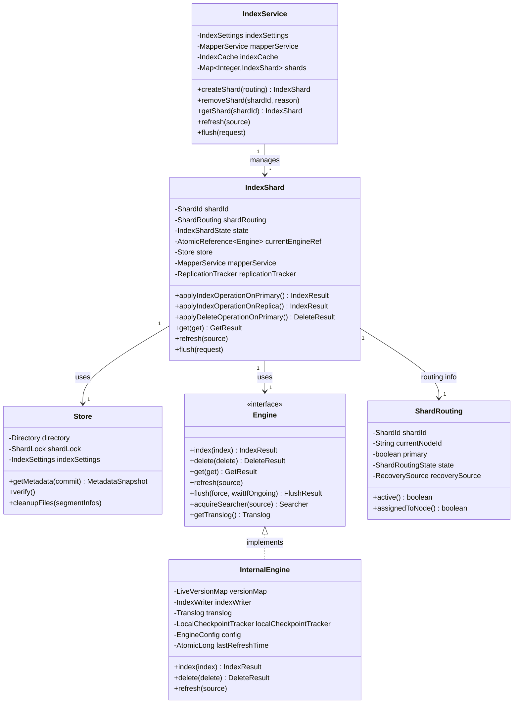
```mermaid
classDiagram
    class IndexService {
        -IndexSettings indexSettings
        -MapperService mapperService
        -IndexCache indexCache
        -Map~Integer,IndexShard~ shards
        +createShard(routing) IndexShard
        +removeShard(shardId, reason)
        +getShard(shardId) IndexShard
        +refresh(source)
        +flush(request)
    }

    class IndexShard {
        -ShardId shardId
        -ShardRouting shardRouting
        -IndexShardState state
        -AtomicReference~Engine~ currentEngineRef
        -Store store
        -MapperService mapperService
        -ReplicationTracker replicationTracker
        +applyIndexOperationOnPrimary() IndexResult
        +applyIndexOperationOnReplica() IndexResult
        +applyDeleteOperationOnPrimary() DeleteResult
        +get(get) GetResult
        +refresh(source)
        +flush(request)
    }

    class Store {
        -Directory directory
        -ShardLock shardLock
        -IndexSettings indexSettings
        +getMetadata(commit) MetadataSnapshot
        +verify()
        +cleanupFiles(segmentInfos)
    }

    class Engine {
        <<interface>>
        +index(index) IndexResult
        +delete(delete) DeleteResult
        +get(get) GetResult
        +refresh(source)
        +flush(force, waitIfOngoing) FlushResult
        +acquireSearcher(source) Searcher
        +getTranslog() Translog
    }

    class InternalEngine {
        -LiveVersionMap versionMap
        -IndexWriter indexWriter
        -Translog translog
        -LocalCheckpointTracker localCheckpointTracker
        -EngineConfig config
        -AtomicLong lastRefreshTime
        +index(index) IndexResult
        +delete(delete) DeleteResult
        +refresh(source)
    }

    class ShardRouting {
        -ShardId shardId
        -String currentNodeId
        -boolean primary
        -ShardRoutingState state
        -RecoverySource recoverySource
        +active() boolean
        +assignedToNode() boolean
    }

    IndexService "1" --> "*" IndexShard : manages
    IndexShard "1" --> "1" Store : uses
    IndexShard "1" --> "1" Engine : uses
    Engine <|.. InternalEngine : implements
    IndexShard "1" --> "1" ShardRouting : routing info
```

### 1.2 版本映射与序列号跟踪

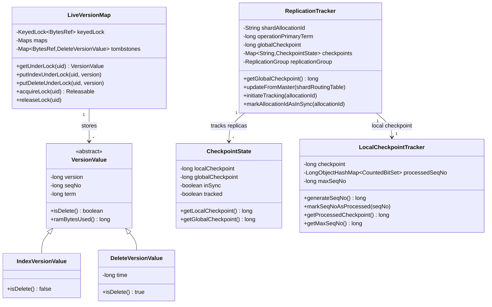
```mermaid
classDiagram
    class LiveVersionMap {
        -KeyedLock~BytesRef~ keyedLock
        -Maps maps
        -Map~BytesRef,DeleteVersionValue~ tombstones
        +getUnderLock(uid) VersionValue
        +putIndexUnderLock(uid, version)
        +putDeleteUnderLock(uid, version)
        +acquireLock(uid) Releasable
        +releaseLock(uid)
    }

    class VersionValue {
        <<abstract>>
        -long version
        -long seqNo
        -long term
        +isDelete() boolean
        +ramBytesUsed() long
    }

    class IndexVersionValue {
        +isDelete() false
    }

    class DeleteVersionValue {
        -long time
        +isDelete() true
    }

    class ReplicationTracker {
        -String shardAllocationId
        -long operationPrimaryTerm
        -long globalCheckpoint
        -Map~String,CheckpointState~ checkpoints
        -ReplicationGroup replicationGroup
        +getGlobalCheckpoint() long
        +updateFromMaster(shardRoutingTable)
        +initiateTracking(allocationId)
        +markAllocationIdAsInSync(allocationId)
    }

    class CheckpointState {
        -long localCheckpoint
        -long globalCheckpoint
        -boolean inSync
        -boolean tracked
        +getLocalCheckpoint() long
        +getGlobalCheckpoint() long
    }

    class LocalCheckpointTracker {
        -long checkpoint
        -LongObjectHashMap~CountedBitSet~ processedSeqNo
        -long maxSeqNo
        +generateSeqNo() long
        +markSeqNoAsProcessed(seqNo)
        +getProcessedCheckpoint() long
        +getMaxSeqNo() long
    }

    LiveVersionMap "1" --> "*" VersionValue : stores
    VersionValue <|-- IndexVersionValue
    VersionValue <|-- DeleteVersionValue
    ReplicationTracker "1" --> "*" CheckpointState : tracks replicas
    ReplicationTracker "1" --> "1" LocalCheckpointTracker : local checkpoint
```

### 1.3 存储引擎核心组件

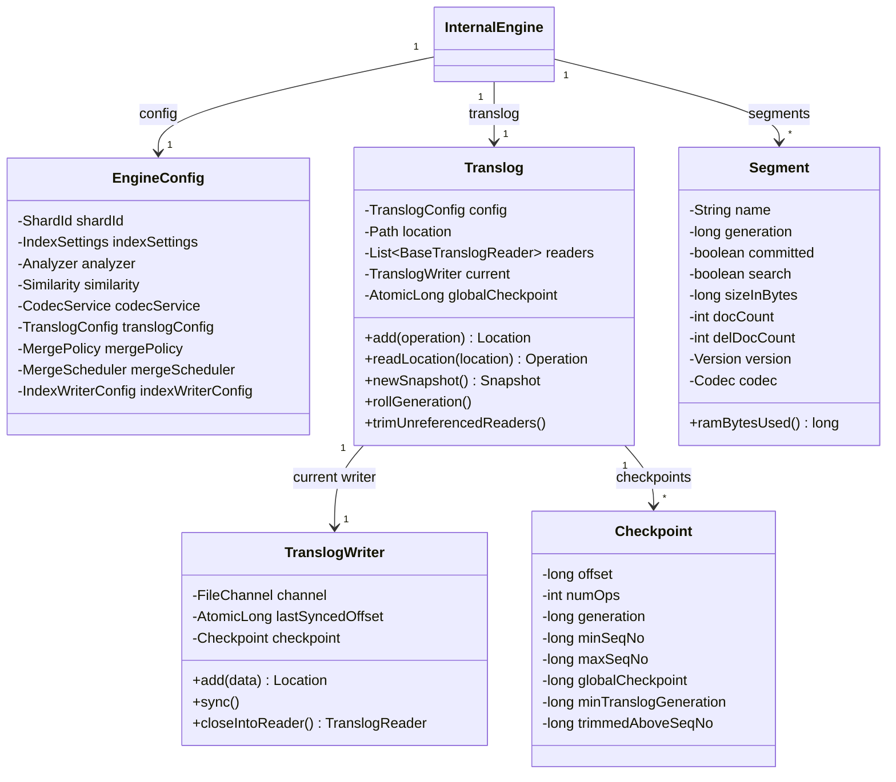
```mermaid
classDiagram
    class EngineConfig {
        -ShardId shardId
        -IndexSettings indexSettings
        -Analyzer analyzer
        -Similarity similarity
        -CodecService codecService
        -TranslogConfig translogConfig
        -MergePolicy mergePolicy
        -MergeScheduler mergeScheduler
        -IndexWriterConfig indexWriterConfig
    }

    class Translog {
        -TranslogConfig config
        -Path location
        -List~BaseTranslogReader~ readers
        -TranslogWriter current
        -AtomicLong globalCheckpoint
        +add(operation) Location
        +readLocation(location) Operation
        +newSnapshot() Snapshot
        +rollGeneration()
        +trimUnreferencedReaders()
    }

    class TranslogWriter {
        -FileChannel channel
        -AtomicLong lastSyncedOffset
        -Checkpoint checkpoint
        +add(data) Location
        +sync()
        +closeIntoReader() TranslogReader
    }

    class Checkpoint {
        -long offset
        -int numOps
        -long generation
        -long minSeqNo
        -long maxSeqNo
        -long globalCheckpoint
        -long minTranslogGeneration
        -long trimmedAboveSeqNo
    }

    class Segment {
        -String name
        -long generation
        -boolean committed
        -boolean search
        -long sizeInBytes
        -int docCount
        -int delDocCount
        -Version version
        -Codec codec
        +ramBytesUsed() long
    }

    InternalEngine "1" --> "1" EngineConfig : config
    InternalEngine "1" --> "1" Translog : translog
    Translog "1" --> "1" TranslogWriter : current writer
    Translog "1" --> "*" Checkpoint : checkpoints
    InternalEngine "1" --> "*" Segment : segments
```

---

## 2. 关键数据结构详解

### 2.1 LiveVersionMap - 版本映射表

**设计目的**:
LiveVersionMap 维护文档 ID 到版本信息的映射,用于:

- 快速版本冲突检测(无需查询 Lucene)
- 实时获取未 Refresh 的文档(从 Translog)
- 删除操作的墓碑标记

**核心字段**:

| 字段 | 类型 | 说明 |
|---|---|---|
| maps | Maps | 双缓冲映射表(current + old) |
| tombstones | Map<BytesRef, DeleteVersionValue> | 删除墓碑,Refresh 后保留 |
| keyedLock | KeyedLock<BytesRef> | 按文档 UID 加锁 |
| archive | LiveVersionMapArchive | 归档旧版本信息 |

**工作原理**:

1. **双缓冲机制**

```java
static final class Maps {
    final VersionLookup current;  // 当前写入的映射表
    final VersionLookup old;      // Refresh 前的映射表(只读)

    // 查询时同时查找 current 和 old
    VersionValue get(BytesRef uid) {
        VersionValue value = current.get(uid);
        return value != null ? value : old.get(uid);
    }
}
```

**双缓冲作用**:

- Refresh 是异步的,Refresh 期间新写入的文档需要保存在 current
- Refresh 完成前,old 保留旧映射,保证实时读取
- Refresh 完成后,old 被清空,释放内存

1. **Safe/Unsafe 模式**

```java
// Safe 模式: 所有文档都记录到 VersionMap(默认)
// Unsafe 模式: 自动生成 ID 且无重试的文档跳过 VersionMap
if (maps.isSafeAccessMode()) {
    putIndexUnderLock(uid, version);
} else {
    // 优化:跳过 VersionMap,减少内存占用
    maps.current.markAsUnsafe();
}
```

**Unsafe 模式优化**:

- 场景:日志/指标等自动生成 ID 的大量小文档
- 优势:减少 80%+ 内存占用
- 限制:无法快速检测版本冲突(需要查询 Lucene)

1. **删除墓碑 (Tombstones)**

```java
// 删除操作记录到 tombstones,Refresh 后保留
private final Map<BytesRef, DeleteVersionValue> tombstones;

void putDeleteUnderLock(BytesRef uid, DeleteVersionValue version) {
    putTombstone(uid, version);      // 添加到 tombstones
    maps.remove(uid, version);       // 从 maps 中移除
}
```

**墓碑作用**:

- 防止删除后的文档在 Refresh 前被错误读取
- 支持实时 Get API 正确返回 not_found
- 墓碑会定期清理(基于时间戳)

**内存占用估算**:

| 场景 | VersionMap 大小 | 说明 |
|---|---:|---|
| 1000万活跃文档(Safe) | ~800MB | 每个 UID + Version 约80字节 |
| 1000万活跃文档(Unsafe) | ~150MB | 仅记录需要版本控制的文档 |
| 100万删除墓碑 | ~80MB | 墓碑占用较小 |

**生命周期**:

1. **写入阶段**: 文档写入时记录到 current
2. **Refresh 阶段**: current 变为 old,创建新的空 current
3. **Refresh 完成**: old 被清空,文档进入 Lucene 索引
4. **定期清理**: 清理过期的删除墓碑

---

### 2.2 ReplicationTracker - 副本跟踪器

**设计目的**:
ReplicationTracker 跟踪分片副本的序列号进度,用于:

- 计算全局检查点(Global Checkpoint)
- 决定哪些副本是 in-sync(参与全局检查点计算)
- 管理副本的生命周期(初始化、同步、失败)

**核心字段**:

| 字段 | 类型 | 说明 |
|---|---|---|
| shardAllocationId | String | 当前分片的分配 ID |
| operationPrimaryTerm | long | 主分片任期号 |
| globalCheckpoint | long | 全局检查点(所有 in-sync 副本已确认的最大 seqNo) |
| checkpoints | Map<String, CheckpointState> | 所有副本的检查点状态 |
| replicationGroup | ReplicationGroup | 当前副本组 |
| routingTable | IndexShardRoutingTable | 路由表 |

**CheckpointState 字段**:

| 字段 | 类型 | 说明 |
|---|---|---|
| localCheckpoint | long | 该副本的本地检查点(已持久化的最大 seqNo) |
| globalCheckpoint | long | 该副本已知的全局检查点 |
| inSync | boolean | 是否参与全局检查点计算 |
| tracked | boolean | 是否跟踪该副本(是否接收复制操作) |

**全局检查点计算**:

```java
// 计算全局检查点:所有 in-sync 副本的最小 localCheckpoint
synchronized long computeGlobalCheckpoint() {
    long minLocalCheckpoint = Long.MAX_VALUE;

    for (CheckpointState state : checkpoints.values()) {
        if (state.inSync) {
            minLocalCheckpoint = Math.min(
                minLocalCheckpoint,
                state.localCheckpoint
            );
        }
    }

    // 全局检查点只能前进,不能后退
    long newGlobalCheckpoint = Math.max(
        this.globalCheckpoint,
        minLocalCheckpoint
    );

    if (newGlobalCheckpoint != this.globalCheckpoint) {
        this.globalCheckpoint = newGlobalCheckpoint;
        onGlobalCheckpointUpdated.accept(newGlobalCheckpoint);
    }

    return newGlobalCheckpoint;
}
```

**副本状态转换**:

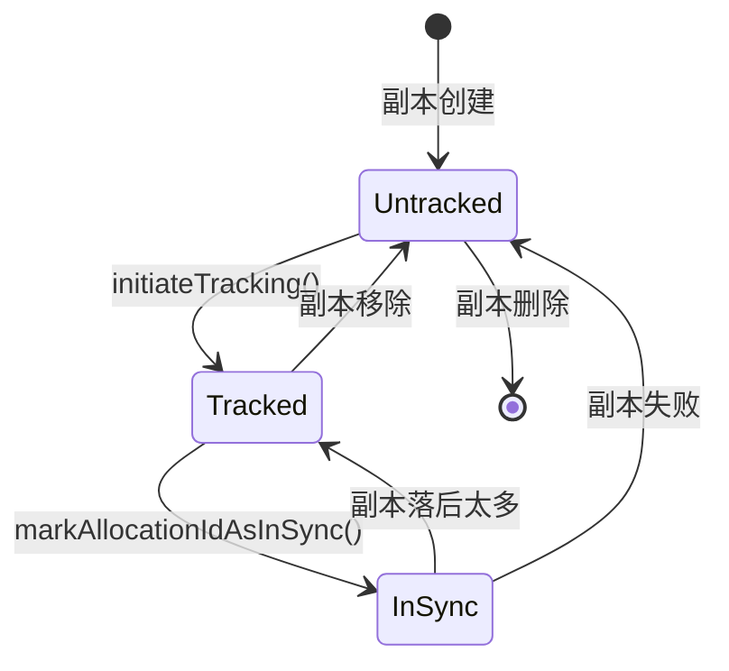
```mermaid
stateDiagram-v2
    [*] --> Untracked: 副本创建
    Untracked --> Tracked: initiateTracking()
    Tracked --> InSync: markAllocationIdAsInSync()
    InSync --> Tracked: 副本落后太多
    Tracked --> Untracked: 副本移除
    InSync --> Untracked: 副本失败
    Untracked --> [*]: 副本删除
```

**状态说明**:

1. **Untracked**: 副本不接收复制操作,不参与全局检查点计算
2. **Tracked**: 副本接收复制操作,但不参与全局检查点计算(正在恢复)
3. **InSync**: 副本完全同步,参与全局检查点计算

**使用示例**:

```java
// 主分片初始化 ReplicationTracker
ReplicationTracker tracker = new ReplicationTracker(
    shardId,
    allocationId,
    indexSettings,
    primaryTerm,
    UNASSIGNED_SEQ_NO,  // 初始全局检查点
    globalCheckpoint -> {
        // 全局检查点更新回调
    },
    () -> System.currentTimeMillis(),
    (leases, listener) -> {
        // 同步 Retention Leases
    },
    () -> safeCommitInfo,
    replicationGroup -> {
        // 副本组变更回调
    }
);

// 激活主模式
tracker.activatePrimaryMode(localCheckpoint);

// 更新路由表
tracker.updateFromMaster(
    appliedClusterStateVersion,
    inSyncAllocationIds,
    routingTable
);

// 副本开始跟踪
tracker.initiateTracking(replicaAllocationId);

// 副本恢复完成,标记为 in-sync
tracker.markAllocationIdAsInSync(replicaAllocationId, localCheckpoint);

// 更新副本的本地检查点
tracker.updateLocalCheckpoint(replicaAllocationId, newLocalCheckpoint);

// 计算并获取全局检查点
long globalCheckpoint = tracker.getGlobalCheckpoint();
```

**性能考虑**:

- 全局检查点计算是 O(N),N 为副本数量
- 主分片每次操作后都会尝试更新全局检查点
- 使用 `synchronized` 保证线程安全,性能瓶颈在副本数量较多时

---

### 2.3 LocalCheckpointTracker - 本地检查点跟踪器

**设计目的**:
LocalCheckpointTracker 跟踪当前分片已处理的序列号,用于:

- 生成新的序列号
- 计算本地检查点(所有小于等于该值的 seqNo 都已处理)
- 支持乱序处理(seqNo 可能不连续到达)

**核心字段**:

| 字段 | 类型 | 说明 |
|---|---|---|
| checkpoint | long | 当前本地检查点(已处理的最大连续 seqNo) |
| processedSeqNo | LongObjectHashMap<CountedBitSet> | 已处理的 seqNo 位图 |
| maxSeqNo | long | 已分配的最大 seqNo |
| nextSeqNo | long | 下一个要分配的 seqNo |

**工作原理**:

1. **生成序列号**

```java
synchronized long generateSeqNo() {
    return nextSeqNo++;
}
```

1. **标记序列号已处理**

```java
synchronized void markSeqNoAsProcessed(long seqNo) {
    // 更新位图
    processedSeqNo.mark(seqNo);

    // 更新 maxSeqNo
    if (seqNo > maxSeqNo) {
        maxSeqNo = seqNo;
    }

    // 更新 checkpoint(最大连续 seqNo)
    if (seqNo == checkpoint + 1) {
        // 找到下一个未处理的 seqNo
        long newCheckpoint = seqNo;
        while (processedSeqNo.contains(newCheckpoint + 1)) {
            newCheckpoint++;
        }
        checkpoint = newCheckpoint;
    }
}
```

**检查点计算示例**:

```
假设已处理的 seqNo: [0, 1, 2, 4, 5, 7]
          未处理的 seqNo: [3, 6]

checkpoint = 2  (最大连续 seqNo)
maxSeqNo = 7    (已分配的最大 seqNo)

当 seqNo=3 被处理:

- checkpoint 更新为 5 (因为 0-5 都已处理)

当 seqNo=6 被处理:

- checkpoint 更新为 7 (因为 0-7 都已处理)

```

**位图优化**:

为了节省内存,使用分段位图:

```java
// 每个 segment 跟踪 LOCAL_CHECKPOINT_ADVANCE_THRESHOLD 个 seqNo
static final int LOCAL_CHECKPOINT_ADVANCE_THRESHOLD = 2048;

// 使用 HashMap<Long, CountedBitSet> 存储
// Key: segmentId = seqNo / LOCAL_CHECKPOINT_ADVANCE_THRESHOLD
// Value: 该 segment 的位图(2048 bits = 256 bytes)
```

**内存占用**:

- 每个 segment 256 字节
- 假设平均延迟 10000 个 seqNo:
  - 需要 10000 / 2048 ≈ 5 个 segment
  - 内存占用 5 * 256 = 1.25 KB

**线程安全**:

- 所有方法都使用 `synchronized` 保证线程安全
- 主分片和副本分片各自维护独立的 LocalCheckpointTracker

---

### 2.4 Translog - 事务日志

**设计目的**:
Translog 记录所有未持久化到 Lucene 的操作,用于:

- 保证数据持久性(crash 恢复)
- 实时读取未 Refresh 的文档
- 副本恢复(Peer Recovery)

**核心字段**:

| 字段 | 类型 | 说明 |
|---|---|---|
| location | Path | Translog 文件目录 |
| current | TranslogWriter | 当前写入的 Translog 文件 |
| readers | List<BaseTranslogReader> | 历史 Translog 文件(只读) |
| globalCheckpoint | AtomicLong | 全局检查点(可安全删除小于该值的 Translog) |
| config | TranslogConfig | Translog 配置 |

**文件格式**:

```
translog-{generation}.tlog  # Translog 数据文件
translog-{generation}.ckp   # Checkpoint 文件(元数据)

例如:
translog-1.tlog  (10 MB, operations [0-1000])
translog-1.ckp
translog-2.tlog  (8 MB, operations [1001-1800])
translog-2.ckp
translog-3.tlog  (5 MB, operations [1801-2500], current)
translog-3.ckp
```

**Checkpoint 文件内容**:

| 字段 | 类型 | 说明 |
|---|---|---|
| offset | long | 当前 Translog 文件的写入偏移量 |
| numOps | int | 该 Translog 文件包含的操作数 |
| generation | long | Translog 代数 |
| minSeqNo | long | 该 Translog 文件的最小 seqNo |
| maxSeqNo | long | 该 Translog 文件的最大 seqNo |
| globalCheckpoint | long | 全局检查点 |
| minTranslogGeneration | long | 最小保留的 Translog 代数 |

**操作记录**:

```java
// 添加操作到 Translog
Location add(Operation operation) throws IOException {
    // 序列化操作
    BytesReference bytes = operation.toBytesReference();

    // 写入当前 Translog 文件
    Location location = current.add(bytes);

    // 根据配置决定是否 fsync
    if (config.getDurability() == Durability.REQUEST) {
        current.sync();  // 同步 fsync
    }

    return location;
}
```

**Durability 配置**:

| 模式 | 说明 | 性能 | 可靠性 |
|---|---|---|---|
| REQUEST | 每次请求后 fsync | 低(100-1000 ops/s) | 高(不丢数据) |
| ASYNC | 异步 fsync(默认 5s) | 高(10000+ ops/s) | 中(可能丢失 5s 数据) |

**Translog 回滚 (Rollover)**:

```java
// 触发条件(满足任一):
// 1. Translog 大小 > threshold (默认 512MB)
// 2. Translog 操作数 > MAX_OPS (默认 Integer.MAX_VALUE)
// 3. Translog 时长 > age (默认不限制)

void rollGeneration() throws IOException {
    // 1. 创建新的 Translog 文件
    TranslogWriter newWriter = createWriter(++generation);

    // 2. 关闭当前 Writer,转为 Reader
    TranslogReader reader = current.closeIntoReader();
    readers.add(reader);

    // 3. 切换到新 Writer
    current = newWriter;

    // 4. 写入新的 Checkpoint
    writeCheckpoint();
}
```

**Translog 清理**:

```java
// 删除 globalCheckpoint 之前的 Translog 文件
void trimUnreferencedReaders() throws IOException {
    long minRequiredGeneration = getMinGenerationForSeqNo(
        globalCheckpoint + 1  // 保留 globalCheckpoint 之后的
    );

    for (TranslogReader reader : readers) {
        if (reader.getGeneration() < minRequiredGeneration) {
            reader.close();
            Files.delete(reader.path());
        }
    }
}
```

**Translog 恢复**:

```java
// 从 Translog 恢复操作
void recoverFromTranslog(TranslogRecoveryRunner runner) {
    // 1. 读取所有 Translog 文件
    List<TranslogReader> allReaders = new ArrayList<>(readers);
    allReaders.add(current.newReaderFromWriter());

    // 2. 按顺序回放所有操作
    for (TranslogReader reader : allReaders) {
        Translog.Snapshot snapshot = reader.newSnapshot();

        while (true) {
            Translog.Operation op = snapshot.next();
            if (op == null) break;

            // 回放操作到 Engine
            runner.run(op);
        }
    }
}
```

**性能优化**:

1. **批量写入**: 多个操作合并后一次 fsync
2. **内存映射**: 使用 `FileChannel` 而非 `RandomAccessFile`
3. **预分配空间**: 减少文件系统碎片
4. **异步 fsync**: ASYNC 模式下异步刷盘

**监控指标**:

| 指标 | 说明 | 建议值 |
|---|---|---|
| translog.operations | Translog 操作数 | < 100000 |
| translog.size_in_bytes | Translog 大小 | < 512MB |
| translog.uncommitted_operations | 未提交操作数 | < 10000 |
| translog.uncommitted_size_in_bytes | 未提交大小 | < 100MB |

---

### 2.5 ShardRouting - 分片路由信息

**设计目的**:
ShardRouting 描述分片的分配状态和路由信息,用于:

- 确定分片所在节点
- 跟踪分片状态变化
- 决定是否可以处理请求

**核心字段**:

| 字段 | 类型 | 说明 |
|---|---|---|
| shardId | ShardId | 分片 ID(索引名 + 分片编号) |
| currentNodeId | String | 当前所在节点 ID |
| relocatingNodeId | String | 迁移目标节点 ID(迁移时) |
| primary | boolean | 是否为主分片 |
| state | ShardRoutingState | 分片状态 |
| allocationId | AllocationId | 分配 ID |
| recoverySource | RecoverySource | 恢复源类型 |
| unassignedInfo | UnassignedInfo | 未分配信息(未分配时) |

**ShardRoutingState 枚举**:

| 状态 | 说明 | 可处理请求 |
|---|---|---|
| UNASSIGNED | 未分配到节点 | 否 |
| INITIALIZING | 正在初始化(恢复中) | 否 |
| STARTED | 已启动,可处理请求 | 是 |
| RELOCATING | 正在迁移到其他节点 | 是(主分片) |

**RecoverySource 类型**:

| 类型 | 说明 | 使用场景 |
|---|---|---|
| EmptyStoreRecoverySource | 空存储恢复 | 新建分片 |
| ExistingStoreRecoverySource | 现有存储恢复 | 节点重启 |
| PeerRecoverySource | 副本恢复 | 从主分片恢复 |
| SnapshotRecoverySource | 快照恢复 | 从快照恢复 |
| LocalShardsRecoverySource | 本地分片恢复 | Shrink/Split/Clone |

**状态转换**:

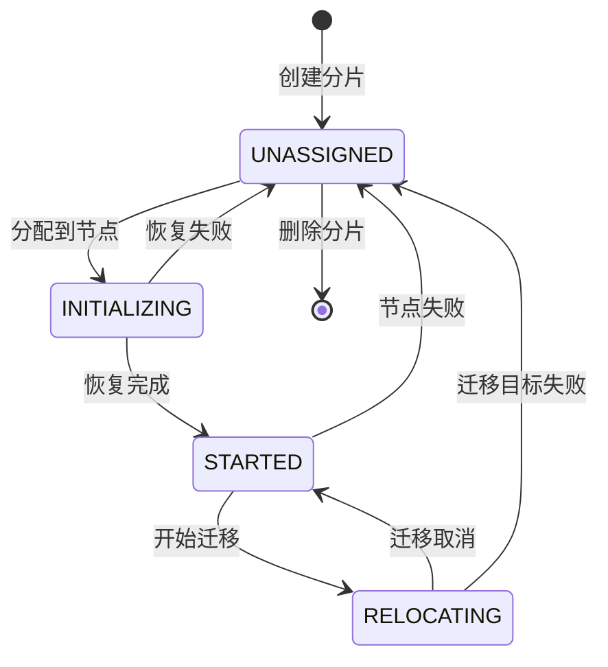
```mermaid
stateDiagram-v2
    [*] --> UNASSIGNED: 创建分片
    UNASSIGNED --> INITIALIZING: 分配到节点
    INITIALIZING --> STARTED: 恢复完成
    STARTED --> RELOCATING: 开始迁移
    RELOCATING --> STARTED: 迁移取消
    RELOCATING --> UNASSIGNED: 迁移目标失败
    STARTED --> UNASSIGNED: 节点失败
    INITIALIZING --> UNASSIGNED: 恢复失败
    UNASSIGNED --> [*]: 删除分片
```

**使用示例**:

```java
// 判断分片是否可以处理请求
boolean canHandleRequests(ShardRouting routing) {
    return routing.state() == ShardRoutingState.STARTED
        || (routing.state() == ShardRoutingState.RELOCATING && routing.primary());
}

// 判断分片是否在指定节点
boolean isOnNode(ShardRouting routing, String nodeId) {
    return routing.currentNodeId().equals(nodeId);
}

// 获取分片的恢复源
RecoverySource getRecoverySource(ShardRouting routing) {
    if (routing.primary()) {
        // 主分片的恢复源
        return routing.recoverySource();
    } else {
        // 副本分片总是从主分片恢复
        return PeerRecoverySource.INSTANCE;
    }
}
```

---

## 3. 数据结构之间的关系

### 3.1 写入路径数据流

```
IndexRequest
    ↓
IndexShard.applyIndexOperationOnPrimary()
    ↓
Engine.index()
    ↓
┌─────────────────────────┬─────────────────────────┐
│  LiveVersionMap         │  LocalCheckpointTracker │
│  - 获取 UID 锁          │  - 生成 seqNo           │
│  - 检查版本冲突         │  - 标记 seqNo 已处理    │
│  - 更新 VersionValue    │  - 更新 checkpoint      │
└─────────────────────────┴─────────────────────────┘
    ↓                             ↓
┌─────────────────────────┬─────────────────────────┐
│  Lucene IndexWriter     │  Translog               │
│  - addDocument()        │  - add(operation)       │
│  - updateDocument()     │  - sync() (可选)        │
└─────────────────────────┴─────────────────────────┘
    ↓
ReplicationTracker

  - 更新本地检查点
  - 计算全局检查点

```

### 3.2 恢复路径数据流

```
RecoverySource
    ↓
┌──────────────────┬────────────────┬──────────────────┐
│ EmptyStore       │ ExistingStore  │ Peer/Snapshot    │
│ (创建空分片)      │ (从本地恢复)    │ (从远程恢复)      │
└──────────────────┴────────────────┴──────────────────┘
    ↓                    ↓                  ↓
Store.verify()    Store.loadSegmentInfos()  复制文件/Translog
    ↓                    ↓                  ↓
Translog.recoverFromTranslog()
    ↓
Engine.recoverFromTranslog()
    ↓
ReplicationTracker.markAllocationIdAsInSync()
```

### 3.3 搜索路径数据流

```
SearchRequest
    ↓
IndexShard.get()
    ↓
Engine.get()
    ↓
┌─────────────────────────┬─────────────────────────┐
│  LiveVersionMap         │  Lucene Searcher        │
│  - 查询未 Refresh 的文档 │  - 查询已 Refresh 的文档 │
│  - 检查删除墓碑         │  - 返回 Document        │
└─────────────────────────┴─────────────────────────┘
    ↓
合并结果,返回最新版本
```

---

## 4. 内存占用估算

### 典型场景内存占用

| 场景 | VersionMap | ReplicationTracker | Translog | 总计 |
|---|---:|---:|---:|---:|
| 1000万活跃文档,3副本 | 800MB | 1KB | 512MB | ~1.3GB |
| 1亿活跃文档,3副本 | 8GB | 1KB | 512MB | ~8.5GB |
| 高吞吐写入(Unsafe) | 150MB | 1KB | 512MB | ~650MB |

### 优化建议

1. **使用 Unsafe 模式**: 自动生成 ID 且无版本控制需求
2. **减小 Translog 阈值**: 更频繁的 Flush 减少 Translog 积累
3. **增加 Refresh 间隔**: 减少 VersionMap 双缓冲内存占用
4. **及时清理墓碑**: 配置 `index.tombstone.size` 限制墓碑数量

---

## 相关文档

- [Elasticsearch-02-索引模块-概览](./Elasticsearch-02-索引模块-概览.md)
- [Elasticsearch-02-索引模块-API](./Elasticsearch-02-索引模块-API.md)
- [Elasticsearch-02-索引模块-时序图](./Elasticsearch-02-索引模块-时序图.md)

---

## 时序图

本文档提供索引模块核心流程的详细时序图,展示各组件之间的交互和数据流。

---

## 1. 文档索引完整流程

### 1.1 主分片索引操作

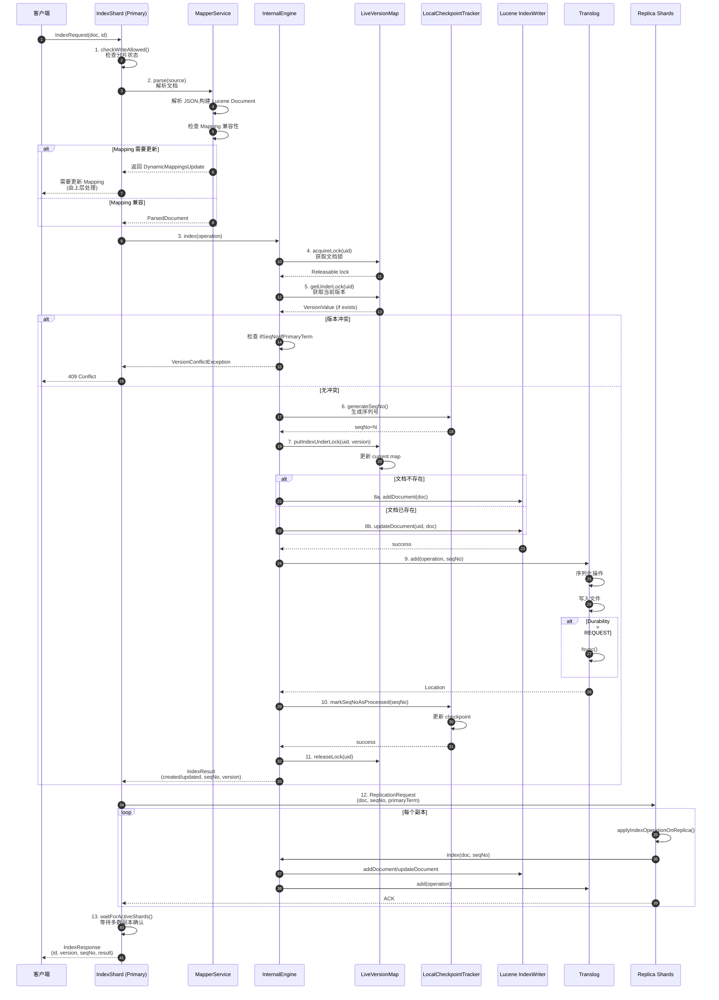
```mermaid
sequenceDiagram
    autonumber
    participant Client as 客户端
    participant Primary as IndexShard (Primary)
    participant Mapper as MapperService
    participant Engine as InternalEngine
    participant VersionMap as LiveVersionMap
    participant Checkpoint as LocalCheckpointTracker
    participant Lucene as Lucene IndexWriter
    participant Translog as Translog
    participant Replicas as Replica Shards

    Client->>Primary: IndexRequest(doc, id)

    Primary->>Primary: 1. checkWriteAllowed()<br/>检查分片状态

    Primary->>Mapper: 2. parse(source)<br/>解析文档
    Mapper->>Mapper: 解析 JSON,构建 Lucene Document
    Mapper->>Mapper: 检查 Mapping 兼容性

    alt Mapping 需要更新
        Mapper-->>Primary: 返回 DynamicMappingsUpdate
        Primary-->>Client: 需要更新 Mapping<br/>(由上层处理)
    else Mapping 兼容
        Mapper-->>Primary: ParsedDocument
    end

    Primary->>Engine: 3. index(operation)

    Engine->>VersionMap: 4. acquireLock(uid)<br/>获取文档锁
    VersionMap-->>Engine: Releasable lock

    Engine->>VersionMap: 5. getUnderLock(uid)<br/>获取当前版本
    VersionMap-->>Engine: VersionValue (if exists)

    alt 版本冲突
        Engine->>Engine: 检查 ifSeqNo/ifPrimaryTerm
        Engine-->>Primary: VersionConflictException
        Primary-->>Client: 409 Conflict
    else 无冲突
        Engine->>Checkpoint: 6. generateSeqNo()<br/>生成序列号
        Checkpoint-->>Engine: seqNo=N

        Engine->>VersionMap: 7. putIndexUnderLock(uid, version)
        VersionMap->>VersionMap: 更新 current map

        alt 文档不存在
            Engine->>Lucene: 8a. addDocument(doc)
        else 文档已存在
            Engine->>Lucene: 8b. updateDocument(uid, doc)
        end
        Lucene-->>Engine: success

        Engine->>Translog: 9. add(operation, seqNo)
        Translog->>Translog: 序列化操作
        Translog->>Translog: 写入文件

        alt Durability = REQUEST
            Translog->>Translog: fsync()
        end
        Translog-->>Engine: Location

        Engine->>Checkpoint: 10. markSeqNoAsProcessed(seqNo)
        Checkpoint->>Checkpoint: 更新 checkpoint
        Checkpoint-->>Engine: success

        Engine->>VersionMap: 11. releaseLock(uid)

        Engine-->>Primary: IndexResult<br/>(created/updated, seqNo, version)
    end

    Primary->>Replicas: 12. ReplicationRequest<br/>(doc, seqNo, primaryTerm)

    loop 每个副本
        Replicas->>Replicas: applyIndexOperationOnReplica()
        Replicas->>Engine: index(doc, seqNo)
        Engine->>Lucene: addDocument/updateDocument
        Engine->>Translog: add(operation)
        Replicas-->>Primary: ACK
    end

    Primary->>Primary: 13. waitForActiveShards()<br/>等待多数副本确认

    Primary-->>Client: IndexResponse<br/>(id, version, seqNo, result)
```

### 时序图说明

**阶段划分**:

1. **预处理阶段**(步骤 1-2): 检查分片状态,解析文档
2. **版本控制阶段**(步骤 3-7): 获取锁,检查版本,生成序列号
3. **持久化阶段**(步骤 8-10): 写入 Lucene 和 Translog,更新检查点
4. **复制阶段**(步骤 11-13): 并行复制到副本分片

**关键点**:

- **文档锁**: 使用 UID 锁防止同一文档并发写入
- **序列号**: 单调递增,保证操作顺序
- **双写**: 同时写入 Lucene 和 Translog
- **异步复制**: 主分片不等待副本,后台异步复制

**性能考虑**:

- VersionMap 查找: O(1)
- Lucene 写入: O(log N) for term dictionary
- Translog 写入: O(1) append-only
- 副本复制: 并行执行,延迟取决于最慢副本

---

## 2. 分片恢复流程

### 2.1 副本分片从主分片恢复

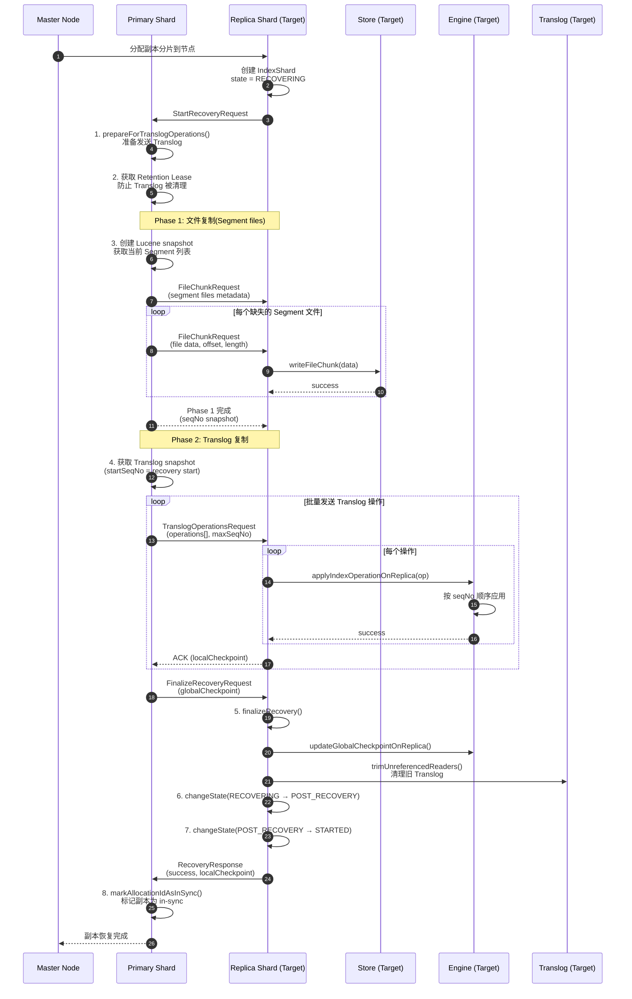
```mermaid
sequenceDiagram
    autonumber
    participant Master as Master Node
    participant Primary as Primary Shard
    participant Replica as Replica Shard (Target)
    participant Store as Store (Target)
    participant Engine as Engine (Target)
    participant Translog as Translog (Target)

    Master->>Replica: 分配副本分片到节点
    Replica->>Replica: 创建 IndexShard<br/>state = RECOVERING

    Replica->>Primary: StartRecoveryRequest
    Primary->>Primary: 1. prepareForTranslogOperations()<br/>准备发送 Translog

    Primary->>Primary: 2. 获取 Retention Lease<br/>防止 Translog 被清理

    Note over Primary,Replica: Phase 1: 文件复制(Segment files)

    Primary->>Primary: 3. 创建 Lucene snapshot<br/>获取当前 Segment 列表
    Primary->>Replica: FileChunkRequest<br/>(segment files metadata)

    loop 每个缺失的 Segment 文件
        Primary->>Replica: FileChunkRequest<br/>(file data, offset, length)
        Replica->>Store: writeFileChunk(data)
        Store-->>Replica: success
    end

    Primary-->>Replica: Phase 1 完成<br/>(seqNo snapshot)

    Note over Primary,Replica: Phase 2: Translog 复制

    Primary->>Primary: 4. 获取 Translog snapshot<br/>(startSeqNo = recovery start)

    loop 批量发送 Translog 操作
        Primary->>Replica: TranslogOperationsRequest<br/>(operations[], maxSeqNo)

        loop 每个操作
            Replica->>Engine: applyIndexOperationOnReplica(op)
            Engine->>Engine: 按 seqNo 顺序应用
            Engine-->>Replica: success
        end

        Replica-->>Primary: ACK (localCheckpoint)
    end

    Primary->>Replica: FinalizeRecoveryRequest<br/>(globalCheckpoint)

    Replica->>Replica: 5. finalizeRecovery()
    Replica->>Engine: updateGlobalCheckpointOnReplica()
    Replica->>Translog: trimUnreferencedReaders()<br/>清理旧 Translog

    Replica->>Replica: 6. changeState(RECOVERING → POST_RECOVERY)
    Replica->>Replica: 7. changeState(POST_RECOVERY → STARTED)

    Replica->>Primary: RecoveryResponse<br/>(success, localCheckpoint)

    Primary->>Primary: 8. markAllocationIdAsInSync()<br/>标记副本为 in-sync

    Primary-->>Master: 副本恢复完成
```

### 时序图说明

**恢复阶段**:

1. **Phase 1 - 文件复制**:
   - 目标: 复制 Lucene Segment 文件
   - 方式: 增量复制(仅复制缺失/变更的文件)
   - 耗时: 取决于数据量和网络带宽

2. **Phase 2 - Translog 复制**:
   - 目标: 回放 Phase 1 期间的新操作
   - 方式: 批量发送 Translog 操作(默认 512KB/批)
   - 耗时: 取决于 Translog 大小

**Retention Lease**:

- 主分片为恢复中的副本创建 Retention Lease
- 防止恢复期间所需的 Translog 被清理
- 恢复完成后释放 Lease

**状态转换**:

```
INITIALIZING → RECOVERING → POST_RECOVERY → STARTED
```

**性能优化**:

- 使用增量复制,只传输差异文件
- 并行传输多个文件
- 压缩 Translog 操作
- 批量应用 Translog 操作

---

## 3. Refresh 流程

### 3.1 Refresh 使文档可搜索

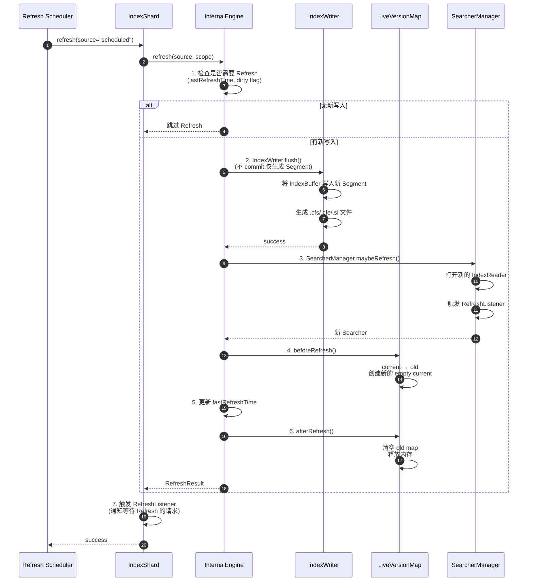
```mermaid
sequenceDiagram
    autonumber
    participant Scheduler as Refresh Scheduler
    participant Shard as IndexShard
    participant Engine as InternalEngine
    participant Lucene as IndexWriter
    participant VersionMap as LiveVersionMap
    participant Searcher as SearcherManager

    Scheduler->>Shard: refresh(source="scheduled")

    Shard->>Engine: refresh(source, scope)

    Engine->>Engine: 1. 检查是否需要 Refresh<br/>(lastRefreshTime, dirty flag)

    alt 无新写入
        Engine-->>Shard: 跳过 Refresh
    else 有新写入
        Engine->>Lucene: 2. IndexWriter.flush()<br/>(不 commit,仅生成 Segment)

        Lucene->>Lucene: 将 IndexBuffer 写入新 Segment
        Lucene->>Lucene: 生成 .cfs/.cfe/.si 文件
        Lucene-->>Engine: success

        Engine->>Searcher: 3. SearcherManager.maybeRefresh()
        Searcher->>Searcher: 打开新的 IndexReader
        Searcher->>Searcher: 触发 RefreshListener
        Searcher-->>Engine: 新 Searcher

        Engine->>VersionMap: 4. beforeRefresh()
        VersionMap->>VersionMap: current → old<br/>创建新的 empty current

        Engine->>Engine: 5. 更新 lastRefreshTime

        Engine->>VersionMap: 6. afterRefresh()
        VersionMap->>VersionMap: 清空 old map<br/>释放内存

        Engine-->>Shard: RefreshResult
    end

    Shard->>Shard: 7. 触发 RefreshListener<br/>(通知等待 Refresh 的请求)

    Shard-->>Scheduler: success
```

### 时序图说明

**Refresh 触发时机**:

1. **定时触发**: 默认 1s 一次(可配置 `index.refresh_interval`)
2. **手动触发**: 调用 `_refresh` API
3. **Flush 时触发**: Flush 操作会先执行 Refresh

**Refresh vs Flush**:

| 操作 | Refresh | Flush |
|---|---|---|
| **目的** | 使文档可搜索 | 持久化到磁盘 |
| **操作** | 生成新 Segment | Commit Segment + 清理 Translog |
| **频率** | 1s(默认) | 30min 或 Translog 满 |
| **耗时** | 快(< 100ms) | 慢(> 1s) |
| **影响** | 增加 Segment 数量 | 减少 Segment 数量(后续 Merge) |

**VersionMap 双缓冲**:

- `beforeRefresh()`: current 变为 old,创建新 current
- `afterRefresh()`: 清空 old,释放内存
- **作用**: Refresh 期间新写入的文档保存在新 current,旧文档在 old 中仍可读

**性能影响**:

- Refresh 会产生新的小 Segment
- 过多的小 Segment 会影响搜索性能
- 需要 Merge 合并小 Segment

**优化建议**:

- 写入密集型场景: 增大 `refresh_interval` 到 30s-60s
- 实时搜索需求: 保持默认 1s
- 批量导入: 设置 `refresh_interval=-1`,完成后手动 Refresh

---

## 4. Flush 流程

### 4.1 Flush 持久化数据

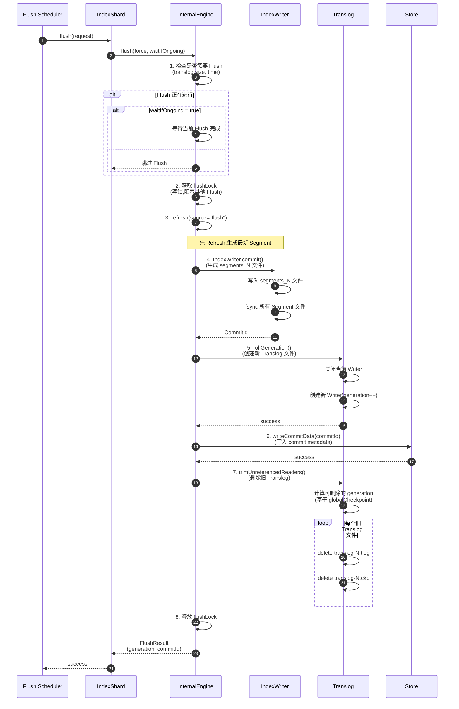
```mermaid
sequenceDiagram
    autonumber
    participant Scheduler as Flush Scheduler
    participant Shard as IndexShard
    participant Engine as InternalEngine
    participant Lucene as IndexWriter
    participant Translog as Translog
    participant Store as Store

    Scheduler->>Shard: flush(request)

    Shard->>Engine: flush(force, waitIfOngoing)

    Engine->>Engine: 1. 检查是否需要 Flush<br/>(translog size, time)

    alt Flush 正在进行
        alt waitIfOngoing = true
            Engine->>Engine: 等待当前 Flush 完成
        else
            Engine-->>Shard: 跳过 Flush
        end
    end

    Engine->>Engine: 2. 获取 flushLock<br/>(写锁,阻塞其他 Flush)

    Engine->>Engine: 3. refresh(source="flush")
    Note over Engine,Lucene: 先 Refresh,生成最新 Segment

    Engine->>Lucene: 4. IndexWriter.commit()<br/>(生成 segments_N 文件)

    Lucene->>Lucene: 写入 segments_N 文件
    Lucene->>Lucene: fsync 所有 Segment 文件
    Lucene-->>Engine: CommitId

    Engine->>Translog: 5. rollGeneration()<br/>(创建新 Translog 文件)
    Translog->>Translog: 关闭当前 Writer
    Translog->>Translog: 创建新 Writer(generation++)
    Translog-->>Engine: success

    Engine->>Store: 6. writeCommitData(commitId)<br/>(写入 commit metadata)
    Store-->>Engine: success

    Engine->>Translog: 7. trimUnreferencedReaders()<br/>(删除旧 Translog)

    Translog->>Translog: 计算可删除的 generation<br/>(基于 globalCheckpoint)

    loop 每个旧 Translog 文件
        Translog->>Translog: delete translog-N.tlog
        Translog->>Translog: delete translog-N.ckp
    end

    Engine->>Engine: 8. 释放 flushLock

    Engine-->>Shard: FlushResult<br/>(generation, commitId)

    Shard-->>Scheduler: success
```

### 时序图说明

**Flush 触发条件**:

1. **Translog 大小**: 超过 `index.translog.flush_threshold_size`(默认 512MB)
2. **Translog 时间**: 超过 `index.translog.flush_threshold_age`(默认 30min)
3. **手动触发**: 调用 `_flush` API
4. **分片关闭**: 分片关闭前必须 Flush

**Flush 流程**:

1. Refresh: 生成最新 Segment
2. Commit: 写入 segments_N,持久化所有 Segment
3. Rollover Translog: 创建新 Translog 文件
4. 清理: 删除已提交的旧 Translog

**锁机制**:

- **flushLock**: 写锁,同时只能有一个 Flush
- **refreshLock**: 读锁,Flush 期间可以 Refresh

**Translog 清理**:

- 仅删除 globalCheckpoint 之前的 Translog
- 保留最近的 Translog 用于恢复
- 定期清理(每次 Flush 后)

**性能影响**:

- Flush 涉及磁盘 I/O,较慢(1-10s)
- 阻塞写入(持有 flushLock 期间)
- 触发 Segment Merge

---

## 5. Segment Merge 流程

### 5.1 后台 Merge 小 Segment

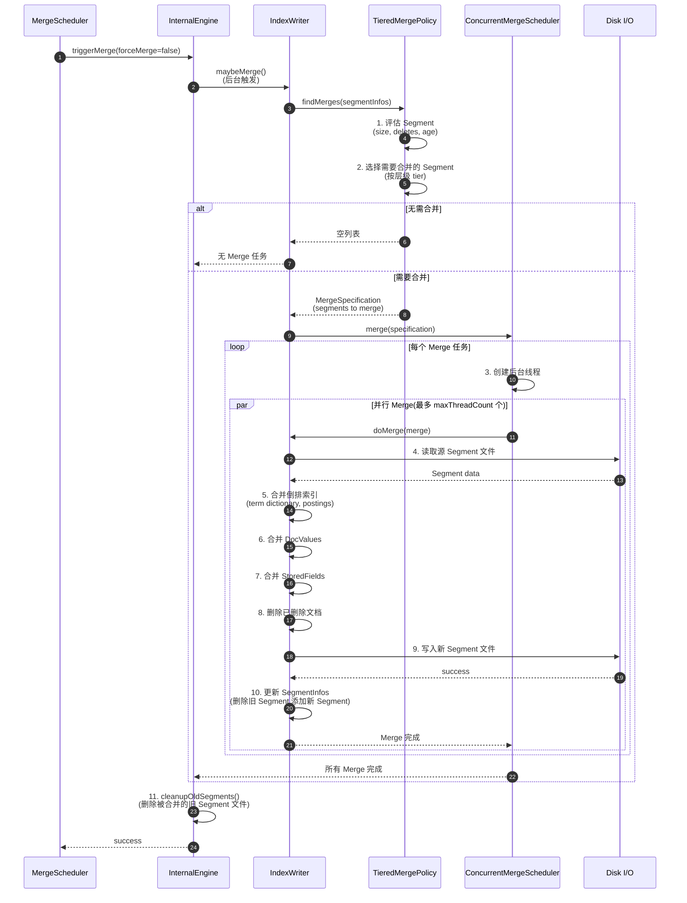
```mermaid
sequenceDiagram
    autonumber
    participant Scheduler as MergeScheduler
    participant Engine as InternalEngine
    participant Writer as IndexWriter
    participant MergePolicy as TieredMergePolicy
    participant Merger as ConcurrentMergeScheduler
    participant Disk as Disk I/O

    Scheduler->>Engine: triggerMerge(forceMerge=false)

    Engine->>Writer: maybeMerge()<br/>(后台触发)

    Writer->>MergePolicy: findMerges(segmentInfos)

    MergePolicy->>MergePolicy: 1. 评估 Segment<br/>(size, deletes, age)

    MergePolicy->>MergePolicy: 2. 选择需要合并的 Segment<br/>(按层级 tier)

    alt 无需合并
        MergePolicy-->>Writer: 空列表
        Writer-->>Engine: 无 Merge 任务
    else 需要合并
        MergePolicy-->>Writer: MergeSpecification<br/>(segments to merge)

        Writer->>Merger: merge(specification)

        loop 每个 Merge 任务
            Merger->>Merger: 3. 创建后台线程

            par 并行 Merge(最多 maxThreadCount 个)
                Merger->>Writer: doMerge(merge)

                Writer->>Disk: 4. 读取源 Segment 文件
                Disk-->>Writer: Segment data

                Writer->>Writer: 5. 合并倒排索引<br/>(term dictionary, postings)
                Writer->>Writer: 6. 合并 DocValues
                Writer->>Writer: 7. 合并 StoredFields
                Writer->>Writer: 8. 删除已删除文档

                Writer->>Disk: 9. 写入新 Segment 文件
                Disk-->>Writer: success

                Writer->>Writer: 10. 更新 SegmentInfos<br/>(删除旧 Segment,添加新 Segment)

                Writer-->>Merger: Merge 完成
            end
        end

        Merger-->>Engine: 所有 Merge 完成
    end

    Engine->>Engine: 11. cleanupOldSegments()<br/>(删除被合并的旧 Segment 文件)

    Engine-->>Scheduler: success
```

### 时序图说明

**Merge 策略 (TieredMergePolicy)**:

| 参数 | 默认值 | 说明 |
|---|---:|---|
| maxMergedSegmentMB | 5120 (5GB) | 合并后 Segment 最大大小 |
| segmentsPerTier | 10 | 每层最多 Segment 数量 |
| maxMergeAtOnce | 10 | 一次最多合并 Segment 数量 |
| floorSegmentMB | 2 | 小于该值的 Segment 优先合并 |

**Merge 触发时机**:

1. **Refresh 后**: 新 Segment 产生时评估是否需要 Merge
2. **Flush 后**: Commit 新 Segment 后评估
3. **定期检查**: 后台定时检查
4. **Force Merge**: 手动调用 `_forcemerge` API

**Merge 优先级**:

1. 小 Segment 优先合并(< 2MB)
2. 删除率高的 Segment 优先合并
3. 相邻 Segment 优先合并

**性能考虑**:

- Merge 是 I/O 密集操作
- 并发 Merge 数量: `index.merge.scheduler.max_thread_count`(默认 1)
- Merge 限流: 防止影响写入和搜索性能

**优化建议**:

- SSD: 增加 `max_thread_count` 到 2-3
- 写入密集: 增大 `maxMergedSegmentMB` 减少 Merge 频率
- 查询密集: 定期 Force Merge 到 1 个 Segment

---

## 6. 实时 Get 流程

### 6.1 Get API 获取文档

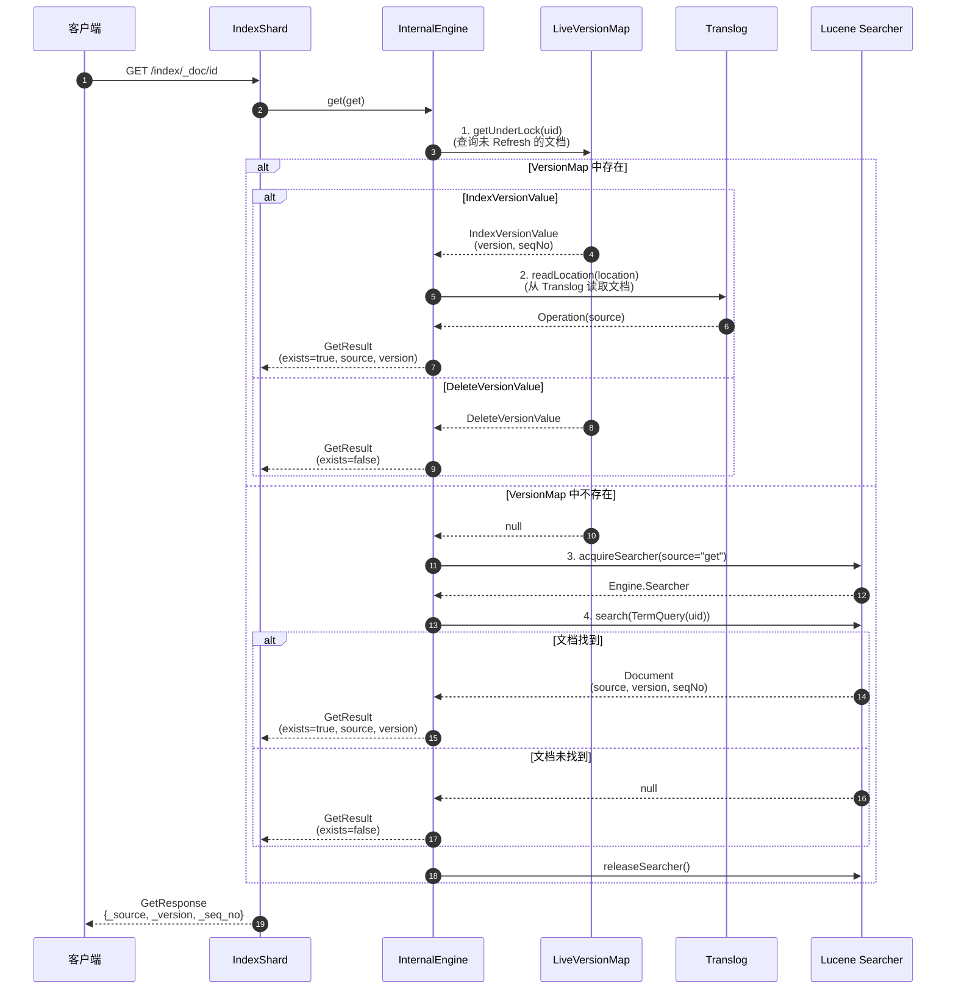
```mermaid
sequenceDiagram
    autonumber
    participant Client as 客户端
    participant Shard as IndexShard
    participant Engine as InternalEngine
    participant VersionMap as LiveVersionMap
    participant Translog as Translog
    participant Searcher as Lucene Searcher

    Client->>Shard: GET /index/_doc/id

    Shard->>Engine: get(get)

    Engine->>VersionMap: 1. getUnderLock(uid)<br/>(查询未 Refresh 的文档)

    alt VersionMap 中存在
        alt IndexVersionValue
            VersionMap-->>Engine: IndexVersionValue<br/>(version, seqNo)

            Engine->>Translog: 2. readLocation(location)<br/>(从 Translog 读取文档)
            Translog-->>Engine: Operation(source)

            Engine-->>Shard: GetResult<br/>(exists=true, source, version)
        else DeleteVersionValue
            VersionMap-->>Engine: DeleteVersionValue
            Engine-->>Shard: GetResult<br/>(exists=false)
        end
    else VersionMap 中不存在
        VersionMap-->>Engine: null

        Engine->>Searcher: 3. acquireSearcher(source="get")
        Searcher-->>Engine: Engine.Searcher

        Engine->>Searcher: 4. search(TermQuery(uid))

        alt 文档找到
            Searcher-->>Engine: Document<br/>(source, version, seqNo)
            Engine-->>Shard: GetResult<br/>(exists=true, source, version)
        else 文档未找到
            Searcher-->>Engine: null
            Engine-->>Shard: GetResult<br/>(exists=false)
        end

        Engine->>Searcher: releaseSearcher()
    end

    Shard-->>Client: GetResponse<br/>{_source, _version, _seq_no}
```

### 时序图说明

**实时读取原理**:

1. **先查 VersionMap**: 获取未 Refresh 的最新文档
2. **再查 Lucene**: 获取已 Refresh 的文档
3. **合并结果**: 返回最新版本

**VersionMap 作用**:

- 保存未 Refresh 的文档版本信息
- 通过 Translog Location 读取完整文档
- 实现近实时(NRT)读取

**性能特性**:

- VersionMap 查询: O(1)
- Translog 读取: O(1) 随机读
- Lucene 查询: O(log N) term dictionary 查找

**一致性保证**:

- Get API 保证读取最新版本(实时)
- Search API 有最多 1s 延迟(取决于 refresh_interval)

---

## 7. 版本冲突处理流程

### 7.1 乐观并发控制

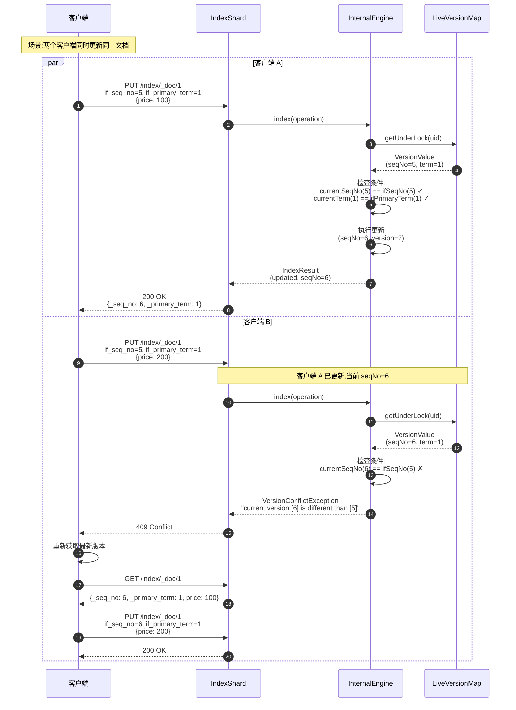
```mermaid
sequenceDiagram
    autonumber
    participant Client as 客户端
    participant Shard as IndexShard
    participant Engine as InternalEngine
    participant VersionMap as LiveVersionMap

    Note over Client: 场景:两个客户端同时更新同一文档

    par 客户端 A
        Client->>Shard: PUT /index/_doc/1<br/>if_seq_no=5, if_primary_term=1<br/>{price: 100}

        Shard->>Engine: index(operation)
        Engine->>VersionMap: getUnderLock(uid)
        VersionMap-->>Engine: VersionValue<br/>(seqNo=5, term=1)

        Engine->>Engine: 检查条件:<br/>currentSeqNo(5) == ifSeqNo(5) ✓<br/>currentTerm(1) == ifPrimaryTerm(1) ✓

        Engine->>Engine: 执行更新<br/>(seqNo=6, version=2)
        Engine-->>Shard: IndexResult<br/>(updated, seqNo=6)
        Shard-->>Client: 200 OK<br/>{_seq_no: 6, _primary_term: 1}
    and 客户端 B
        Client->>Shard: PUT /index/_doc/1<br/>if_seq_no=5, if_primary_term=1<br/>{price: 200}

        Note over Shard,VersionMap: 客户端 A 已更新,当前 seqNo=6

        Shard->>Engine: index(operation)
        Engine->>VersionMap: getUnderLock(uid)
        VersionMap-->>Engine: VersionValue<br/>(seqNo=6, term=1)

        Engine->>Engine: 检查条件:<br/>currentSeqNo(6) == ifSeqNo(5) ✗

        Engine-->>Shard: VersionConflictException<br/>"current version [6] is different than [5]"
        Shard-->>Client: 409 Conflict

        Client->>Client: 重新获取最新版本
        Client->>Shard: GET /index/_doc/1
        Shard-->>Client: {_seq_no: 6, _primary_term: 1, price: 100}

        Client->>Shard: PUT /index/_doc/1<br/>if_seq_no=6, if_primary_term=1<br/>{price: 200}
        Shard-->>Client: 200 OK
    end
```

### 时序图说明

**版本控制演进**:

| 版本 | 机制 | 说明 |
|---|---|---|
| < 6.0 | version | 基于版本号的乐观并发控制 |
| ≥ 6.0 | seq_no + primary_term | 基于序列号的乐观并发控制(推荐) |

**冲突检测条件**:

```java
if (ifSeqNo != UNASSIGNED_SEQ_NO && currentSeqNo != ifSeqNo) {
    throw VersionConflictEngineException;
}
if (ifPrimaryTerm != 0 && currentPrimaryTerm != ifPrimaryTerm) {
    throw VersionConflictEngineException;
}
```

**客户端重试策略**:

1. 捕获 409 Conflict
2. 重新获取最新版本
3. 基于最新版本重试更新
4. 限制重试次数(防止死循环)

**无版本控制的写入**:

```bash
# 不检查版本,总是成功(覆盖或创建)
PUT /index/_doc/1
{
  "field": "value"
}
```

---

## 相关文档

- [Elasticsearch-02-索引模块-概览](./Elasticsearch-02-索引模块-概览.md)
- [Elasticsearch-02-索引模块-API](./Elasticsearch-02-索引模块-API.md)
- [Elasticsearch-02-索引模块-数据结构](./Elasticsearch-02-索引模块-数据结构.md)

---
