# Elasticsearch-03-搜索模块

## 模块概览

## 1. 模块职责

搜索模块是 Elasticsearch 的核心功能模块，负责分布式搜索请求的处理。主要职责包括:

- **查询执行**: 在 Lucene 上执行用户查询
- **两阶段搜索**: Query Phase(查询阶段) + Fetch Phase(获取阶段)
- **结果聚合**: 归并多个分片的搜索结果
- **聚合计算**: 执行聚合分析(Aggregations)
- **高亮显示**: 生成搜索结果高亮片段
- **排序**: 支持多字段排序和自定义排序
- **分页**: 支持 from/size, Scroll, Search After 分页

### 输入/输出

**输入**:

- SearchRequest (查询请求)
- Query DSL (查询语句)
- Aggregations (聚合定义)
- Sort (排序规则)

**输出**:

- SearchResponse (搜索响应)
- Hits (匹配的文档列表)
- Aggregations (聚合结果)
- Took (耗时统计)

### 上下游依赖

**上游调用方**:

- Action Module (TransportSearchAction)
- REST Layer (RestSearchAction)

**下游被调用方**:

- Index Shard (读取数据)
- Apache Lucene (执行查询)
- Aggregation Module (计算聚合)

---

## 2. 搜索架构图

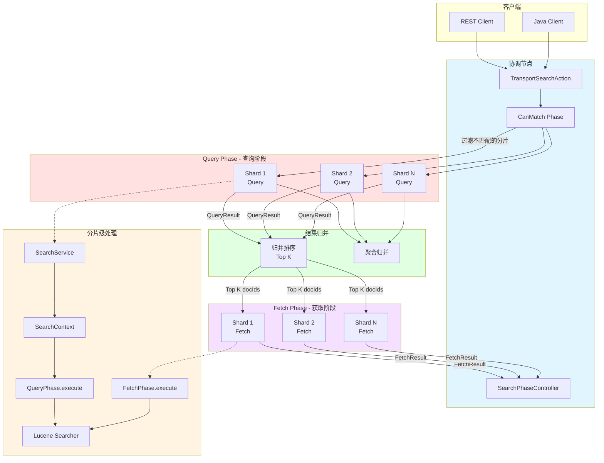

### 架构说明

#### 搜索流程

**1. CanMatch Phase (预过滤阶段)**

- 目的: 快速过滤不包含匹配文档的分片
- 方式: 检查分片的最小/最大值范围
- 优化: 减少需要查询的分片数量

**2. Query Phase (查询阶段)**

- 目的: 在每个分片上执行查询,返回 Top K 文档的 ID 和分数
- 输出: `QuerySearchResult` (docIds, scores, aggregations)
- 并发: 所有分片并行执行
- 轻量: 仅返回文档 ID 和排序值,不返回文档内容

**3. Reduce (归并阶段)**

- 目的: 归并所有分片的 QueryResult
- 操作:
  - 归并排序所有分片的 Top K
  - 选出全局 Top K
  - 归并聚合结果
- 复杂度: O(N * K * log K), N=分片数

**4. Fetch Phase (获取阶段)**

- 目的: 获取 Top K 文档的完整内容
- 输入: 全局 Top K 的 (shardId, docId)
- 输出: `FetchSearchResult` (documents, highlights)
- 并发: 所有需要的分片并行执行
- 重量: 需要读取完整文档内容

#### 两阶段设计优势

| 方面 | Query Phase | Fetch Phase |
|---|---|---|
| **网络传输** | 小(仅 docId+score) | 大(完整文档) |
| **计算开销** | 高(查询+聚合) | 低(仅读取) |
| **并发度** | 所有分片 | 仅需要的分片 |
| **优化空间** | 缓存查询结果 | 缓存文档内容 |

**为什么需要两阶段?**

- 减少网络传输: Query Phase 仅传输 docId,Fetch Phase 仅传输需要的文档
- 负载均衡: 每个副本可以处理 Query Phase,减轻主分片压力
- 提前终止: 部分查询可以在 Query Phase 提前终止

---

## 3. 核心组件

### 3.1 SearchService

**职责**: 管理搜索请求的生命周期

```java
public class SearchService extends AbstractLifecycleComponent {
    // 线程池
    private final ThreadPool threadPool;

    // 搜索上下文管理
    private final ConcurrentMapLong<ReaderContext> activeReaders;

    // Fetch 阶段处理
    private final FetchPhase fetchPhase;

    // 执行 Query Phase
    public void executeQueryPhase(
        ShardSearchRequest request,
        SearchShardTask task,
        ActionListener<SearchPhaseResult> listener
    );

    // 执行 Fetch Phase
    public void executeFetchPhase(
        ShardFetchRequest request,
        SearchShardTask task,
        ActionListener<FetchSearchResult> listener
    );

    // 创建搜索上下文
    private SearchContext createContext(
        ReaderContext reader,
        ShardSearchRequest request,
        SearchShardTask task
    );
}
```

### 3.2 SearchContext

**职责**: 封装单个分片的搜索上下文

```java
public interface SearchContext extends Releasable {
    // 查询信息
    SearchShardTarget shardTarget();
    ShardSearchRequest request();
    Query query();

    // 搜索器
    ContextIndexSearcher searcher();

    // 结果
    QuerySearchResult queryResult();
    FetchSearchResult fetchResult();

    // 聚合上下文
    SearchContextAggregations aggregations();

    // 排序
    SortAndFormats sort();

    // 分页
    int from();
    int size();

    // 超时
    TimeValue timeout();
    boolean isTimedOut();
}
```

### 3.3 QueryPhase

**职责**: 执行查询阶段

```java
public class QueryPhase {

    public static void execute(SearchContext searchContext) {
        // 1. 预处理聚合
        AggregationPhase.preProcess(searchContext);

        // 2. 构建 Collector
        List<Collector> collectors = new ArrayList<>();
        collectors.add(new TopDocsCollector());
        if (searchContext.aggregations() != null) {
            collectors.add(searchContext.aggregations().collector());
        }

        // 3. 执行搜索
        MultiCollector multiCollector = MultiCollector.wrap(collectors);
        searchContext.searcher().search(
            searchContext.query(),
            multiCollector
        );

        // 4. 后处理
        RescorePhase.execute(searchContext);  // Rescore
        SuggestPhase.execute(searchContext);  // Suggest
    }
}
```

### 3.4 FetchPhase

**职责**: 执行获取阶段

```java
public final class FetchPhase {

    public void execute(
        SearchContext context,
        int[] docIdsToLoad
    ) {
        // 1. 加载文档
        SearchHits hits = buildSearchHits(
            context,
            docIdsToLoad
        );

        // 2. 执行 SubPhases
        for (FetchSubPhase subPhase : fetchSubPhases) {
            subPhase.process(context, hits);
        }

        // 3. 设置结果
        context.fetchResult().shardResult(hits);
    }

    private SearchHits buildSearchHits(
        SearchContext context,
        int[] docIdsToLoad
    ) {
        SearchHit[] hits = new SearchHit[docIdsToLoad.length];

        for (int i = 0; i < docIdsToLoad.length; i++) {
            int docId = docIdsToLoad[i];

            // 读取文档
            Document doc = context.searcher().doc(docId);

            // 构建 SearchHit
            hits[i] = new SearchHit(docId);
            hits[i].sourceRef(doc.getSource());
            hits[i].score(scores[i]);
        }

        return new SearchHits(hits, totalHits, maxScore);
    }
}
```

---

## 4. 搜索类型

### 4.1 QUERY_THEN_FETCH (默认)

```

1. Query Phase: 所有分片并行查询,返回 Top K docIds
2. Reduce: 协调节点归并,选出全局 Top K
3. Fetch Phase: 获取 Top K 文档内容

```

**特点**:

- 默认搜索类型
- 最少网络传输
- 适用于大多数场景

### 4.2 DFS_QUERY_THEN_FETCH

```

1. DFS Phase: 收集所有分片的词频统计
2. Query Phase: 基于全局词频计算分数
3. Reduce: 归并结果
4. Fetch Phase: 获取文档

```

**特点**:

- 更准确的 TF-IDF 分数
- 额外的网络往返
- 仅用于分数精确度要求高的场景

---

## 5. 性能优化

### 5.1 查询优化

**1. 使用 Filter 代替 Query**

```json
{
  "query": {
    "bool": {
      "filter": [
        { "term": { "status": "published" } }
      ]
    }
  }
}
```

- Filter 可以缓存
- 不计算分数,更快

**2. 限制返回字段**

```json
{
  "_source": ["title", "price"],
  "size": 10
}
```

**3. 使用 CanMatch 优化**

- 自动跳过不匹配的分片
- 基于 min/max 值范围

### 5.2 分页优化

**深度分页问题**:

```json
{
  "from": 10000,
  "size": 10
}
```

- 每个分片需要返回 10010 个结果
- 协调节点需要排序 10010 * N 个结果

**解决方案**:

**1. Search After (推荐)**

```json
{
  "size": 10,
  "search_after": [1234567890, "doc#123"],
  "sort": [
    { "timestamp": "asc" },
    { "_id": "asc" }
  ]
}
```

**2. Scroll API**

```bash
# 创建 Scroll
POST /index/_search?scroll=1m
{
  "size": 1000,
  "query": { "match_all": {} }
}

# 继续 Scroll
POST /_search/scroll
{
  "scroll": "1m",
  "scroll_id": "..."
}
```

### 5.3 聚合优化

**1. 限制聚合基数**

```json
{
  "aggs": {
    "categories": {
      "terms": {
        "field": "category",
        "size": 10  // 限制返回桶数量
      }
    }
  }
}
```

**2. 使用近似聚合**

```json
{
  "aggs": {
    "unique_users": {
      "cardinality": {
        "field": "user_id",
        "precision_threshold": 1000  // 近似算法
      }
    }
  }
}
```

---

## 6. 监控指标

### 搜索性能指标

| 指标 | 说明 | 建议值 |
|---|---|---|
| search.query_total | 查询总数 | 监控趋势 |
| search.query_time_in_millis | 查询总耗时 | - |
| search.query_current | 当前查询数 | < 线程池大小 |
| search.fetch_total | Fetch 总数 | - |
| search.fetch_time_in_millis | Fetch 总耗时 | - |
| search.scroll_total | Scroll 总数 | - |
| search.open_contexts | 打开的搜索上下文数 | < 500 |

### 线程池指标

```bash
GET /_cat/thread_pool/search?v&h=node_name,name,active,queue,rejected
```

| 指标 | 说明 | 建议值 |
|---|---|---|
| active | 活跃线程数 | < size |
| queue | 队列长度 | < queue_size |
| rejected | 拒绝次数 | 0 |

---

## 7. 常见问题

### 7.1 搜索慢

**排查步骤**:

1. 检查慢查询日志
2. 使用 Profile API 分析
3. 检查分片数量
4. 检查聚合复杂度

**Profile API**:

```json
{
  "profile": true,
  "query": { ... }
}
```

### 7.2 深度分页

**问题**: `from + size > 10000`

**解决**:

1. 使用 Search After
2. 使用 Scroll (导出场景)
3. 增大 `max_result_window` (不推荐)

### 7.3 搜索上下文过多

**问题**: `Too many scroll contexts`

**解决**:

1. 及时清理 Scroll
2. 减小 Scroll 超时时间
3. 增大 `search.max_open_scroll_context`

---

## 相关文档

- [Elasticsearch-03-搜索模块-API](./Elasticsearch-03-搜索模块-API.md)
- [Elasticsearch-03-搜索模块-数据结构](./Elasticsearch-03-搜索模块-数据结构.md)
- [Elasticsearch-03-搜索模块-时序图](./Elasticsearch-03-搜索模块-时序图.md)

---

## API接口

本文档详细描述搜索模块对外提供的核心 API，包括请求/响应结构体、字段说明、入口函数与调用链、时序图以及异常处理与性能要点。

---

## 1. 标准搜索 API (Search API)

### 1.1 基本信息

- **名称**: `_search`
- **协议与方法**: HTTP GET/POST `/{index}/_search`
- **幂等性**: 是（查询操作）
- **入口 Action**: `TransportSearchAction`

### 1.2 请求结构体

```java
public class SearchRequest extends LegacyActionRequest {
    // 目标索引
    private String[] indices = Strings.EMPTY_ARRAY;

    // 搜索类型 (QUERY_THEN_FETCH, DFS_QUERY_THEN_FETCH)
    private SearchType searchType = SearchType.DEFAULT;

    // 搜索查询体
    private SearchSourceBuilder source;

    // 路由控制
    private String routing;

    // 偏好设置（_local, _primary, _replica, custom string）
    private String preference;

    // 是否使用请求缓存
    private Boolean requestCache;

    // 是否允许部分结果
    private Boolean allowPartialSearchResults;

    // Scroll 保持时间
    private TimeValue scrollKeepAlive;

    // 并发分片请求数量
    private int maxConcurrentShardRequests = 5;

    // 预过滤分片大小阈值
    private Integer preFilterShardSize = 128;

    // 批量归并大小
    private int batchedReduceSize = 512;

    // 索引选项
    private IndicesOptions indicesOptions;
}
```

#### 字段表

| 字段 | 类型 | 必填 | 默认值 | 约束 | 说明 |
|---|---|---:|---|---|---|
| indices | String[] | 否 | [] | - | 目标索引，空表示所有索引 |
| searchType | SearchType | 否 | QUERY_THEN_FETCH | QUERY_THEN_FETCH / DFS_QUERY_THEN_FETCH | 搜索类型 |
| source | SearchSourceBuilder | 是 | - | - | 查询、聚合、排序、分页等配置 |
| routing | String | 否 | null | - | 路由值，控制分片选择 |
| preference | String | 否 | null | _local/_primary/_replica/custom | 分片偏好 |
| requestCache | Boolean | 否 | null | - | 是否缓存结果 (size=0 时默认true) |
| allowPartialSearchResults | Boolean | 否 | true | - | 部分分片失败时是否返回结果 |
| scrollKeepAlive | TimeValue | 否 | null | - | Scroll 上下文保持时间 |
| maxConcurrentShardRequests | int | 否 | 5 | >0 | 并发查询分片数量 |
| preFilterShardSize | Integer | 否 | 128 | >0 | 启用 CanMatch 预过滤的阈值 |
| batchedReduceSize | int | 否 | 512 | >0 | 批量归并结果的批次大小 |

#### SearchSourceBuilder 核心字段

```java
public class SearchSourceBuilder {
    private QueryBuilder query;              // 查询条件
    private int from = 0;                     // 分页起始位置
    private int size = 10;                    // 返回结果数量
    private List<SortBuilder<?>> sorts;       // 排序规则
    private List<AggregationBuilder> aggregations; // 聚合
    private List<String> storedFields;        // 返回的 stored 字段
    private List<String> docValueFields;      // 返回的 doc_value 字段
    private FetchSourceContext fetchSource;   // _source 过滤
    private HighlightBuilder highlight;       // 高亮
    private SearchAfterBuilder searchAfter;   // search_after 分页
    private TimeValue timeout;                // 查询超时时间
    private boolean explain;                  // 是否返回评分解释
    private boolean version;                  // 是否返回版本号
    private boolean trackScores;              // 是否计算分数
    private Integer trackTotalHitsUpTo;       // 统计总数上限
    private Integer terminateAfter;           // 提前终止文档数
}
```

### 1.3 响应结构体

```java
public class SearchResponse extends ActionResponse {
    // 搜索结果
    private final SearchHits hits;

    // 聚合结果
    private final InternalAggregations aggregations;

    // 搜索建议结果
    private final Suggest suggest;

    // 性能分析结果
    private final SearchProfileResults profileResults;

    // 是否超时
    private final boolean timedOut;

    // 是否提前终止
    private final Boolean terminatedEarly;

    // 归并阶段数量
    private final int numReducePhases;

    // Scroll ID
    private final String scrollId;

    // Point-in-Time ID
    private final BytesReference pointInTimeId;

    // 分片统计
    private final int totalShards;
    private final int successfulShards;
    private final int skippedShards;
    private final ShardSearchFailure[] shardFailures;

    // 集群统计 (跨集群搜索)
    private final Clusters clusters;

    // 耗时
    private final long tookInMillis;
}
```

#### SearchHits 结构

```java
public class SearchHits {
    // 总命中数
    private final TotalHits totalHits;

    // 最大分数
    private final float maxScore;

    // 命中文档数组
    private final SearchHit[] hits;
}

public class SearchHit {
    private String id;              // 文档 ID
    private float score;            // 相关性分数
    private Map<String, Object> sourceAsMap; // _source 内容
    private String index;           // 索引名
    private long version;           // 版本号
    private long seqNo;             // 序列号
    private long primaryTerm;       // 主分片任期
    private Object[] sortValues;    // 排序值
    private Map<String, HighlightField> highlightFields; // 高亮
    private Map<String, SearchHitField> fields; // 字段
}
```

#### 字段表

| 字段 | 类型 | 必填 | 说明 |
|---|---|---:|---|
| hits | SearchHits | 是 | 搜索命中的文档 |
| aggregations | Aggregations | 否 | 聚合结果 |
| suggest | Suggest | 否 | 搜索建议 |
| profileResults | ProfileResults | 否 | 性能分析结果 (profile=true 时) |
| timedOut | boolean | 是 | 是否超时 |
| terminatedEarly | Boolean | 否 | 是否提前终止 |
| numReducePhases | int | 是 | 归并阶段数量 (分布式搜索) |
| scrollId | String | 否 | Scroll ID (scroll 请求时) |
| pointInTimeId | BytesReference | 否 | Point-in-Time ID (PIT 请求时) |
| totalShards | int | 是 | 总分片数 |
| successfulShards | int | 是 | 成功分片数 |
| skippedShards | int | 是 | 跳过分片数 (CanMatch 过滤) |
| shardFailures | ShardSearchFailure[] | 否 | 分片失败详情 |
| tookInMillis | long | 是 | 查询耗时（毫秒）|

### 1.4 入口函数与核心代码

#### TransportSearchAction 入口

```java
public class TransportSearchAction extends HandledTransportAction<SearchRequest, SearchResponse> {

    @Override
    protected void doExecute(Task task, SearchRequest searchRequest, ActionListener<SearchResponse> listener) {
        // 1. 解析和重写请求
        final long relativeStartNanos = System.nanoTime();
        final SearchTimeProvider timeProvider = new SearchTimeProvider(
            searchRequest.getOrCreateAbsoluteStartMillis(),
            relativeStartNanos,
            System::nanoTime
        );

        // 2. 解析目标索引
        final ClusterState clusterState = clusterService.state();
        final Index[] concreteIndices = indexNameExpressionResolver.concreteIndices(
            clusterState,
            searchRequest.indicesOptions(),
            searchRequest.indices()
        );

        // 3. 计算目标分片
        final Map<String, AliasFilter> aliasFilter = buildPerIndexAliasFilter(
            searchRequest,
            clusterState,
            concreteIndices,
            remoteClusterIndices
        );

        // 4. 创建搜索任务上下文
        final SearchTask searchTask = (SearchTask) task;
        final SearchShardIterator[] shardIterators = buildShardIterators(
            clusterState,
            concreteIndices,
            aliasFilter,
            searchRequest.routing(),
            searchRequest.preference()
        );

        // 5. 执行搜索
        searchAsyncAction(
            searchTask,
            searchRequest,
            shardIterators,
            timeProvider,
            listener
        ).start();
    }

    private void searchAsyncAction(
        SearchTask task,
        SearchRequest searchRequest,
        SearchShardIterator[] shardIterators,
        SearchTimeProvider timeProvider,
        ActionListener<SearchResponse> listener
    ) {
        // 创建异步搜索执行器
        SearchQueryThenFetchAsyncAction action = new SearchQueryThenFetchAsyncAction(
            task,
            searchRequest,
            shardIterators,
            timeProvider,
            searchPhaseController,
            executor,
            listener
        );
        return action;
    }
}
```

#### SearchQueryThenFetchAsyncAction 执行流程

```java
final class SearchQueryThenFetchAsyncAction extends AbstractSearchAsyncAction<SearchPhaseResult> {

    private final SearchPhaseController searchPhaseController;

    @Override
    protected void executePhaseOnShard(
        SearchShardIterator shardIt,
        SearchShardTarget shard,
        SearchActionListener<SearchPhaseResult> listener
    ) {
        // 1. CanMatch Phase - 预过滤分片
        if (shouldExecuteCanMatch(shardIt)) {
            executeCanMatch(shardIt, shard, listener);
            return;
        }

        // 2. Query Phase - 查询阶段
        executeQueryPhase(shardIt, shard, listener);
    }

    private void executeQueryPhase(
        SearchShardIterator shardIt,
        SearchShardTarget shard,
        SearchActionListener<SearchPhaseResult> listener
    ) {
        // 构建分片搜索请求
        ShardSearchRequest request = buildShardSearchRequest(shardIt, shard);

        // 发送到目标分片
        searchTransportService.sendExecuteQuery(
            shard.getConnection(),
            request,
            task,
            ActionListener.wrap(
                result -> listener.onResponse(result),
                exception -> listener.onFailure(exception)
            )
        );
    }

    @Override
    protected SearchPhase getNextPhase(SearchPhaseResults<SearchPhaseResult> results) {
        // 3. Reduce Phase - 归并查询结果
        return new ReduceQueryPhase(results) {
            @Override
            protected SearchPhase getNextPhase() {
                // 4. Fetch Phase - 获取文档内容
                return new FetchSearchPhase(reducedQueryPhase);
            }
        };
    }
}
```

### 1.5 调用链与上层函数

#### REST 层适配

```java
public class RestSearchAction extends BaseRestHandler {

    @Override
    public RestChannelConsumer prepareRequest(RestRequest request, NodeClient client) {
        // 1. 解析请求参数
        SearchRequest searchRequest = new SearchRequest();

        // 1.1 解析索引
        String[] indices = Strings.splitStringByCommaToArray(request.param("index"));
        searchRequest.indices(indices);

        // 1.2 解析 URL 参数
        searchRequest.routing(request.param("routing"));
        searchRequest.preference(request.param("preference"));
        searchRequest.searchType(SearchType.fromString(request.param("search_type")));

        // 1.3 解析请求体（query, aggs, sort等）
        request.withContentOrSourceParamParserOrNull(parser -> {
            if (parser != null) {
                searchRequest.source(SearchSourceBuilder.fromXContent(parser));
            }
        });

        // 2. 调用 TransportSearchAction
        return channel -> client.search(
            searchRequest,
            new RestToXContentListener<>(channel)
        );
    }
}
```

### 1.6 时序图

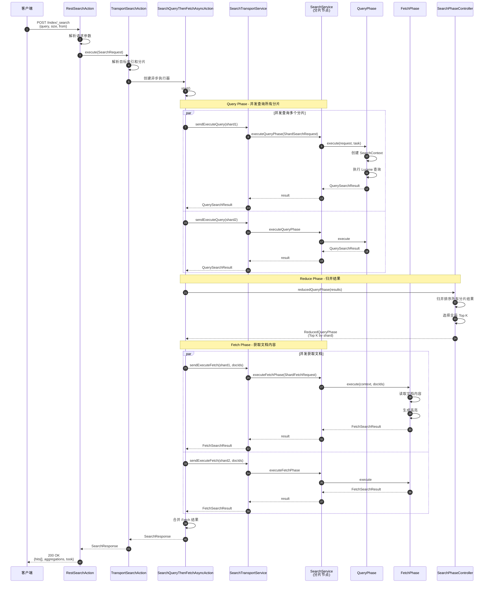

### 1.7 异常与回退

#### 分片失败处理

1. **部分失败**: `allowPartialSearchResults=true` 时返回部分结果
2. **全部失败**: 抛出 `SearchPhaseExecutionException`
3. **重试**: 自动在副本分片上重试
4. **超时**: 达到 timeout 后返回已收集的结果

#### 错误类型

| 错误 | HTTP状态码 | 说明 |
|---|---:|---|
| NoShardAvailableActionException | 503 | 无可用分片 |
| SearchPhaseExecutionException | 503 | 搜索阶段失败 |
| QueryShardException | 400 | 查询语法错误 |
| CircuitBreakingException | 429 | 断路器触发 |

### 1.8 性能要点与最佳实践

#### 性能优化

1. **减少数据传输**
   - 使用 `_source` filtering 仅返回需要的字段
   - 使用 `stored_fields` 或 `docvalue_fields`

2. **分页优化**
   - 深度分页使用 `search_after` 而非 `from/size`
   - 避免大 `from` 值 (默认 max_result_window=10000)

3. **并发控制**
   - 调整 `max_concurrent_shard_requests` (默认5)
   - 大索引增大并发，小索引减小并发

4. **预过滤**
   - 启用 `pre_filter_shard_size` (默认128)
   - 自动跳过不匹配的分片

5. **缓存利用**
   - 对于 size=0 的聚合查询启用 `request_cache`
   - Filter 查询自动缓存

#### 最佳实践

```json
// 1. 高效分页
{
  "size": 10,
  "sort": [{"timestamp": "desc"}, {"_id": "asc"}],
  "search_after": [1609459200000, "doc#10"]
}

// 2. _source 过滤
{
  "_source": ["title", "author", "publish_date"],
  "query": {"match": {"title": "elasticsearch"}}
}

// 3. 仅统计数量
{
  "size": 0,
  "track_total_hits": true,
  "query": {"match_all": {}}
}

// 4. 使用 Filter (可缓存)
{
  "query": {
    "bool": {
      "filter": [
        {"term": {"status": "published"}},
        {"range": {"date": {"gte": "2024-01-01"}}}
      ]
    }
  }
}
```

---

## 2. Scroll API

### 2.1 基本信息

- **名称**: `_search?scroll=<time>`
- **协议与方法**:
  - 初始化: POST `/{index}/_search?scroll=1m`
  - 迭代: POST `/_search/scroll`
  - 清理: DELETE `/_search/scroll`
- **幂等性**: 否（有状态）
- **入口 Action**: `TransportSearchAction`, `TransportSearchScrollAction`

### 2.2 请求结构体

#### 初始化请求

```java
// 使用 SearchRequest + scroll 参数
SearchRequest searchRequest = new SearchRequest();
searchRequest.scroll(TimeValue.timeValueMinutes(1)); // Scroll 保持时间
searchRequest.source(new SearchSourceBuilder().size(1000).query(query));
```

#### 迭代请求

```java
public class SearchScrollRequest extends ActionRequest {
    // Scroll ID（上次响应返回）
    private String scrollId;

    // Scroll 保持时间
    private TimeValue scroll;
}
```

#### 清理请求

```java
public class ClearScrollRequest extends ActionRequest {
    // 要清理的 Scroll IDs
    private List<String> scrollIds;
}
```

### 2.3 响应结构体

与标准 `SearchResponse` 相同，但额外包含 `_scroll_id` 字段。

### 2.4 核心代码

```java
public class TransportSearchScrollAction extends HandledTransportAction<SearchScrollRequest, SearchResponse> {

    @Override
    protected void doExecute(Task task, SearchScrollRequest request, ActionListener<SearchResponse> listener) {
        // 1. 解析 Scroll ID
        Scroll scroll = new Scroll(request.scroll());
        ParsedScrollId parsedScrollId = ParsedScrollId.parseScrollId(request.scrollId());

        // 2. 从每个分片获取下一批结果
        SearchScrollAsyncAction scrollAsyncAction = new SearchScrollAsyncAction(
            parsedScrollId,
            searchService,
            searchTransportService,
            searchPhaseController,
            scroll,
            task,
            listener
        );

        scrollAsyncAction.start();
    }
}
```

### 2.5 时序图

（参见 Elasticsearch-03-搜索模块-时序图.md）

### 2.6 异常与回退

- **Scroll Context 不存在**: 返回 404 (可能已超时)
- **Scroll Context 超时**: 自动清理
- **建议**: 使用完毕及时调用 `DELETE /_search/scroll`

### 2.7 最佳实践

```bash
# 1. 初始化 Scroll
POST /my_index/_search?scroll=1m
{
  "size": 1000,
  "query": {"match_all": {}}
}

# 2. 循环迭代
POST /_search/scroll
{
  "scroll": "1m",
  "scroll_id": "DXF1ZXJ5QW5kRmV0Y2gBAAAAAAAAAD..."
}

# 3. 及时清理
DELETE /_search/scroll
{
  "scroll_id": "DXF1ZXJ5QW5kRmV0Y2gBAAAAAAAAAD..."
}
```

---

## 3. Point-in-Time (PIT) API

### 3.1 基本信息

- **名称**: `_pit`
- **协议与方法**:
  - 打开: POST `/{index}/_pit?keep_alive=1m`
  - 使用: POST `/_search` (with pit.id)
  - 关闭: DELETE `/_pit`
- **幂等性**: 打开和关闭是幂等的
- **入口 Action**: `TransportOpenPointInTimeAction`, `TransportClosePointInTimeAction`

### 3.2 请求结构体

#### 打开 PIT

```java
public class OpenPointInTimeRequest extends ActionRequest {
    // 目标索引
    private String[] indices;

    // PIT 保持时间
    private TimeValue keepAlive;

    // 路由
    private String routing;

    // 偏好
    private String preference;

    // 索引选项
    private IndicesOptions indicesOptions;
}
```

#### 使用 PIT 搜索

```java
SearchRequest searchRequest = new SearchRequest();
searchRequest.source(
    new SearchSourceBuilder()
        .pointInTimeBuilder(new PointInTimeBuilder(pitId))
        .query(query)
        .size(10)
        .searchAfter(lastSortValues)
);
```

#### 关闭 PIT

```java
public class ClosePointInTimeRequest extends ActionRequest {
    // PIT ID
    private BytesReference id;
}
```

### 3.3 响应结构体

#### OpenPointInTimeResponse

```java
public class OpenPointInTimeResponse extends ActionResponse {
    // PIT ID (Base64 编码)
    private final BytesReference pointInTimeId;

    // 分片统计
    private final int totalShards;
    private final int successfulShards;
    private final int failedShards;
    private final int skippedShards;
}
```

#### 使用 PIT 的 SearchResponse

与标准 SearchResponse 相同，但包含 `pit_id` 字段。

### 3.4 核心代码

```java
public class TransportOpenPointInTimeAction extends TransportAction<OpenPointInTimeRequest, OpenPointInTimeResponse> {

    @Override
    protected void doExecute(Task task, OpenPointInTimeRequest request, ActionListener<OpenPointInTimeResponse> listener) {
        // 1. 解析目标索引和分片
        ClusterState clusterState = clusterService.state();
        ShardIterator[] shardIterators = buildShardIterators(clusterState, request);

        // 2. 在每个分片上打开 ReaderContext
        OpenPointInTimePhase openPhase = new OpenPointInTimePhase(
            task,
            searchService,
            shardIterators,
            request.keepAlive(),
            listener
        );

        openPhase.start();
    }
}
```

### 3.5 时序图

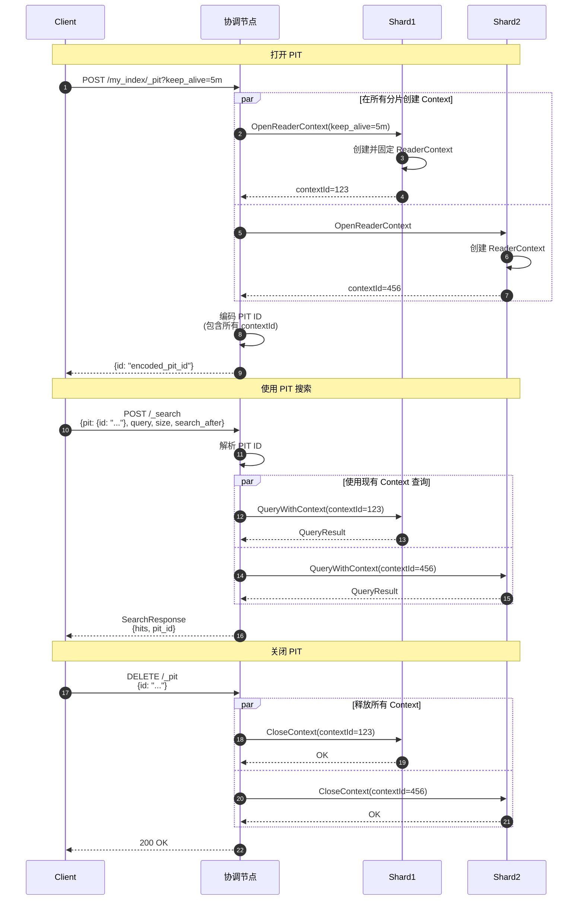

### 3.6 异常与回退

- **PIT 不存在**: 返回 404
- **PIT 超时**: 自动清理 Context
- **分片移动**: PIT ID 包含 AllocationId，分片移动后 PIT 失效

### 3.7 最佳实践

```bash
# 1. 打开 PIT (5分钟有效期)
POST /my_index/_pit?keep_alive=5m

# 返回: {"id": "encoded_pit_id"}

# 2. 使用 PIT 进行分页（第一页）
POST /_search
{
  "size": 100,
  "query": {"match_all": {}},
  "pit": {
    "id": "encoded_pit_id",
    "keep_alive": "5m"
  },
  "sort": [{"timestamp": "asc"}, {"_id": "asc"}]
}

# 3. 使用 search_after 继续分页（第二页）
POST /_search
{
  "size": 100,
  "query": {"match_all": {}},
  "pit": {
    "id": "encoded_pit_id",
    "keep_alive": "5m"
  },
  "sort": [{"timestamp": "asc"}, {"_id": "asc"}],
  "search_after": [1609459200000, "doc#100"]
}

# 4. 完成后关闭 PIT
DELETE /_pit
{
  "id": "encoded_pit_id"
}
```

**PIT vs Scroll 对比**:

| 特性 | PIT + search_after | Scroll |
|---|---|---|
| 状态 | 轻量级（仅 Reader） | 重量级（完整 Context）|
| 实时性 | 快照隔离 | 快照隔离 |
| 跳页 | 可以 | 不可以（顺序）|
| 并发 | 支持 | 不支持 |
| 超时 | 可延长 | 可延长 |
| 推荐场景 | 深度分页 | 顺序导出 |

---

## 4. Multi-Search API (msearch)

### 4.1 基本信息

- **名称**: `_msearch`
- **协议与方法**: POST `/_msearch` 或 POST `/{index}/_msearch`
- **幂等性**: 是
- **入口 Action**: `TransportMultiSearchAction`

### 4.2 请求结构体

```java
public class MultiSearchRequest extends ActionRequest {
    // 多个搜索请求
    private final List<SearchRequest> requests = new ArrayList<>();

    // 每个请求的索引覆盖（可选）
    private String[] indices;

    // 并发度
    private int maxConcurrentSearchRequests = 0;
}
```

#### 请求格式（NDJSON）

```json
{"index": "index1"}
{"query": {"match": {"field1": "value1"}}, "size": 10}
{"index": "index2"}
{"query": {"match": {"field2": "value2"}}, "from": 0, "size": 20}
```

### 4.3 响应结构体

```java
public class MultiSearchResponse extends ActionResponse {
    // 响应数组（与请求顺序对应）
    private final Item[] responses;

    public static class Item {
        // 成功响应
        private final SearchResponse response;

        // 失败异常
        private final Exception exception;

        public boolean isFailure() {
            return exception != null;
        }
    }
}
```

### 4.4 核心代码

```java
public class TransportMultiSearchAction extends HandledTransportAction<MultiSearchRequest, MultiSearchResponse> {

    @Override
    protected void doExecute(Task task, MultiSearchRequest request, ActionListener<MultiSearchResponse> listener) {
        final long startTimeInMillis = System.currentTimeMillis();
        final AtomicArray<Item> responses = new AtomicArray<>(request.requests().size());
        final CountDown counter = new CountDown(request.requests().size());

        // 并发执行每个搜索请求
        for (int i = 0; i < request.requests().size(); i++) {
            final int index = i;
            final SearchRequest searchRequest = request.requests().get(i);

            client.search(searchRequest, new ActionListener<SearchResponse>() {
                @Override
                public void onResponse(SearchResponse searchResponse) {
                    responses.set(index, new Item(searchResponse, null));
                    if (counter.countDown()) {
                        finishAndNotify(responses, listener);
                    }
                }

                @Override
                public void onFailure(Exception e) {
                    responses.set(index, new Item(null, e));
                    if (counter.countDown()) {
                        finishAndNotify(responses, listener);
                    }
                }
            });
        }
    }
}
```

### 4.5 最佳实践

```bash
POST /_msearch
{"index": "logs-2024"}
{"query": {"match": {"level": "ERROR"}}, "size": 10}
{"index": "metrics-2024"}
{"query": {"range": {"value": {"gte": 100}}}, "size": 20}
{"index": "traces-2024"}
{"aggs": {"avg_duration": {"avg": {"field": "duration"}}}, "size": 0}
```

**适用场景**:

- Dashboard 批量查询
- 多索引并行搜索
- 减少网络往返

---

## 5. Count API

### 5.1 基本信息

- **名称**: `_count`
- **协议与方法**: GET/POST `/{index}/_count`
- **幂等性**: 是
- **入口 Action**: `TransportCountAction`

### 5.2 请求结构体

```java
// 内部转换为 SearchRequest (size=0, trackTotalHitsUpTo=Integer.MAX_VALUE)
SearchRequest searchRequest = new SearchRequest(indices);
searchRequest.source(
    new SearchSourceBuilder()
        .size(0)
        .query(query)
        .trackTotalHitsUpTo(Integer.MAX_VALUE)
);
```

### 5.3 响应结构体

```json
{
  "count": 12345,
  "_shards": {
    "total": 5,
    "successful": 5,
    "skipped": 0,
    "failed": 0
  }
}
```

### 5.4 最佳实践

```bash
# 统计符合条件的文档数
POST /my_index/_count
{
  "query": {
    "range": {
      "timestamp": {
        "gte": "2024-01-01",
        "lt": "2024-02-01"
      }
    }
  }
}
```

---

## 相关文档

- [Elasticsearch-03-搜索模块-概览](./Elasticsearch-03-搜索模块-概览.md)
- [Elasticsearch-03-搜索模块-数据结构](./Elasticsearch-03-搜索模块-数据结构.md)
- [Elasticsearch-03-搜索模块-时序图](./Elasticsearch-03-搜索模块-时序图.md)

---

## 数据结构

本文档详细说明搜索模块的核心数据结构，包括 UML 类图、字段语义、版本演进等。

---

## 1. SearchContext (搜索上下文)

`SearchContext` 是搜索执行的核心上下文，封装了执行一次搜索所需的全部状态。

### 1.1 类图

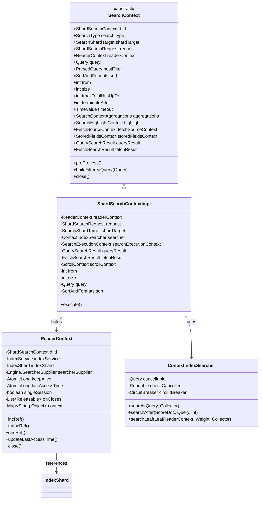

### 类说明

#### SearchContext (抽象类)

**职责**: 搜索执行的核心上下文基类

**关键字段**:

| 字段 | 类型 | 说明 |
|---|---|---|
| id | ShardSearchContextId | 上下文唯一标识符 |
| searchType | SearchType | 搜索类型 (QUERY_THEN_FETCH / DFS_QUERY_THEN_FETCH) |
| shardTarget | SearchShardTarget | 目标分片信息 (index, shard, node) |
| request | ShardSearchRequest | 分片搜索请求 |
| query | Query | Lucene 查询对象 |
| postFilter | ParsedQuery | 后置过滤器 (在聚合后执行) |
| sort | SortAndFormats | 排序规则 |
| from | int | 分页起始位置 |
| size | int | 返回结果数量 |
| trackTotalHitsUpTo | int | 统计总数的上限 (默认10000) |
| terminateAfter | int | 提前终止的文档数 (0表示不终止) |
| timeout | TimeValue | 查询超时时间 |
| aggregations | SearchContextAggregations | 聚合上下文 |
| highlight | SearchHighlightContext | 高亮上下文 |
| fetchSourceContext | FetchSourceContext | _source 过滤配置 |
| queryResult | QuerySearchResult | Query Phase 结果 |
| fetchResult | FetchSearchResult | Fetch Phase 结果 |

**生命周期**:

```
创建 → preProcess() → Query Phase → Fetch Phase → close()
```

#### ShardSearchContextImpl (实现类)

**职责**: SearchContext 的默认实现,管理单个分片的搜索执行

**核心方法**:

- `preProcess()`: 预处理,应用别名过滤器、构建查询
- `buildFilteredQuery(Query)`: 构建包含所有过滤器的查询
- `execute()`: 执行搜索

**状态管理**:

- 持有 ReaderContext 引用 (管理生命周期)
- 持有 ContextIndexSearcher (Lucene 搜索器)
- 持有 QuerySearchResult 和 FetchSearchResult

#### ReaderContext

**职责**: 管理分片的 IndexReader 生命周期和引用计数

**关键字段**:

| 字段 | 类型 | 说明 |
|---|---|---|
| id | ShardSearchContextId | Context 唯一 ID |
| indexShard | IndexShard | 所属分片 |
| searcherSupplier | Engine.SearcherSupplier | Searcher 提供者 |
| keepAlive | AtomicLong | 保持存活时间 (毫秒) |
| lastAccessTime | AtomicLong | 最后访问时间 |
| singleSession | boolean | 是否单次查询 (true: 一次性, false: Scroll/PIT) |
| refCounted | AbstractRefCounted | 引用计数器 |

**引用计数**:

```java
// 增加引用
boolean success = readerContext.tryIncRef();

// 使用
try {
    Engine.Searcher searcher = readerContext.acquireSearcher("search");
    // ... 执行搜索
} finally {
    // 减少引用
    readerContext.decRef();
}
```

**超时管理**:

- 每次访问更新 `lastAccessTime`
- 定期检查 `lastAccessTime + keepAlive < now`
- 超时后自动清理

#### ContextIndexSearcher

**职责**: 包装 Lucene IndexSearcher,添加取消和断路器支持

**关键功能**:

- **取消检查**: 定期检查任务是否被取消
- **断路器**: 防止内存过度使用
- **统计**: 记录搜索统计信息

---

## 2. SearchRequest & SearchResponse

### 2.1 类图

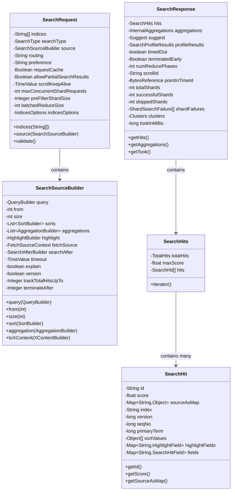

### 类说明

#### SearchRequest

**职责**: 封装搜索请求的所有参数

**字段语义**:

- `indices`: 目标索引数组,空表示所有索引
- `searchType`: QUERY_THEN_FETCH (默认) 或 DFS_QUERY_THEN_FETCH
- `source`: 查询体 (query, aggs, sort, from, size 等)
- `routing`: 路由值,控制查询哪些分片
- `preference`: 分片选择偏好 (_local, _primary, _replica, custom)
- `requestCache`: 是否缓存结果 (默认 size=0 时为 true)
- `allowPartialSearchResults`: 部分分片失败时是否返回结果 (默认 true)
- `maxConcurrentShardRequests`: 并发查询分片数 (默认5)
- `preFilterShardSize`: CanMatch 预过滤阈值 (默认128)
- `batchedReduceSize`: 批量归并大小 (默认512)

**校验规则**:

```java
public ActionRequestValidationException validate() {
    ActionRequestValidationException validationException = null;

    // 必须有 source
    if (source == null) {
        validationException = addValidationError("source is missing", validationException);
    }

    // PIT 和 Scroll 互斥
    if (pointInTimeBuilder != null && scroll != null) {
        validationException = addValidationError(
            "cannot use [point in time] with [scroll]",
            validationException
        );
    }

    return validationException;
}
```

#### SearchSourceBuilder

**职责**: 构建搜索查询体

**核心配置**:

| 配置 | 类型 | 默认值 | 说明 |
|---|---|---|---|
| query | QueryBuilder | match_all | 查询条件 |
| from | int | 0 | 分页起始 |
| size | int | 10 | 返回数量 |
| sorts | List<SortBuilder> | [] | 排序规则 |
| aggregations | List<AggregationBuilder> | [] | 聚合 |
| highlight | HighlightBuilder | null | 高亮 |
| fetchSource | FetchSourceContext | 所有字段 | _source 过滤 |
| searchAfter | SearchAfterBuilder | null | search_after 分页 |
| timeout | TimeValue | null | 查询超时 |
| explain | boolean | false | 是否返回评分解释 |
| version | boolean | false | 是否返回版本号 |
| trackTotalHitsUpTo | Integer | 10000 | 统计总数上限 |
| terminateAfter | Integer | 0 | 提前终止文档数 |

**Builder 模式**:

```java
SearchSourceBuilder source = new SearchSourceBuilder()
    .query(QueryBuilders.matchQuery("title", "elasticsearch"))
    .from(0)
    .size(10)
    .sort("timestamp", SortOrder.DESC)
    .aggregation(AggregationBuilders.terms("categories").field("category"))
    .highlighter(new HighlightBuilder().field("content"))
    .fetchSource(new String[]{"title", "author"}, null);
```

#### SearchResponse

**职责**: 封装搜索响应的所有结果

**结构层次**:

```
SearchResponse
├── SearchHits (hits)
│   ├── TotalHits (total)
│   ├── maxScore
│   └── SearchHit[] (hits[])
│       ├── _id, _index, _score
│       ├── _source
│       ├── fields
│       └── highlight
├── InternalAggregations (aggregations)
├── Suggest (suggest)
├── SearchProfileResults (profile)
└── Shard Statistics (totalShards, successfulShards, etc.)
```

**分片统计**:

- `totalShards`: 参与查询的总分片数
- `successfulShards`: 成功返回结果的分片数
- `skippedShards`: 被 CanMatch 跳过的分片数
- `shardFailures`: 失败分片的详细信息

**性能指标**:

- `tookInMillis`: 总耗时（毫秒）
- `timedOut`: 是否超时
- `terminatedEarly`: 是否提前终止
- `numReducePhases`: 归并阶段数量 (分布式搜索)

#### SearchHits

**职责**: 封装命中的文档集合

**TotalHits 结构**:

```java
public class TotalHits {
    public enum Relation {
        EQUAL_TO,      // 精确值
        GREATER_THAN_OR_EQUAL_TO  // 大于等于（达到 trackTotalHitsUpTo 限制）
    }

    public final long value;
    public final Relation relation;
}
```

**示例**:

```json
{
  "hits": {
    "total": {
      "value": 10000,
      "relation": "gte"  // 实际大于等于 10000
    },
    "max_score": 1.5,
    "hits": [...]
  }
}
```

#### SearchHit

**职责**: 单个命中文档

**核心字段**:

- `_id`: 文档 ID
- `_index`: 索引名
- `_score`: 相关性分数 (如果排序不基于分数则为 NaN)
- `_source`: 原始文档 (根据 fetchSource 配置)
- `fields`: stored_fields 或 docvalue_fields
- `highlight`: 高亮片段
- `sort`: 排序值 (用于 search_after)
- `_version`, `_seq_no`, `_primary_term`: 版本信息

---

## 3. ShardSearchRequest

### 3.1 类图

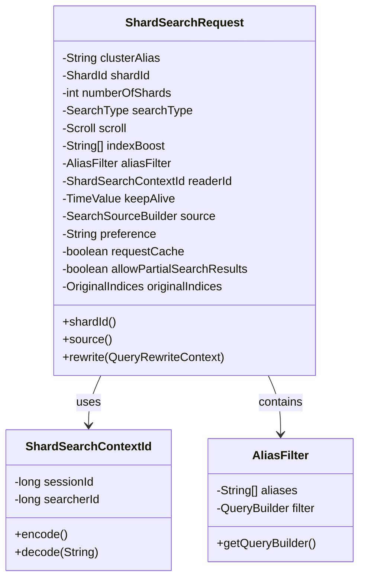

### 类说明

#### ShardSearchRequest

**职责**: 针对单个分片的搜索请求

**关键字段**:

| 字段 | 类型 | 说明 |
|---|---|---|
| shardId | ShardId | 目标分片 ID (index, shard number) |
| numberOfShards | int | 参与搜索的总分片数 (用于分数归一化) |
| source | SearchSourceBuilder | 查询体 |
| aliasFilter | AliasFilter | 别名过滤器 |
| readerId | ShardSearchContextId | ReaderContext ID (Scroll/PIT 场景) |
| keepAlive | TimeValue | Context 保持时间 |
| scroll | Scroll | Scroll 配置 |
| requestCache | boolean | 是否缓存 |

**与 SearchRequest 的关系**:

```
SearchRequest (协调节点)
    ↓
解析目标分片
    ↓
ShardSearchRequest × N (每个分片一个)
```

#### ShardSearchContextId

**职责**: 唯一标识一个 ReaderContext

**结构**:

```
ShardSearchContextId = sessionId (long) + searcherId (long)
```

**编码**: Base64 编码为字符串用于 Scroll ID 或 PIT ID

---

## 4. Search Phase Results

### 4.1 类图

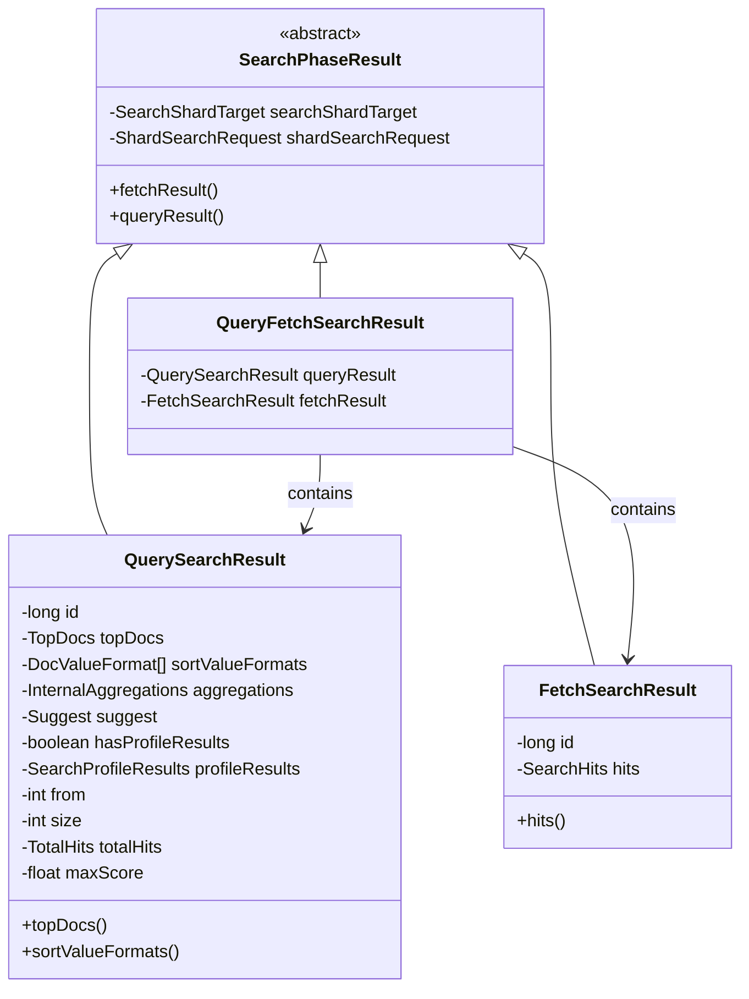

### 类说明

#### QuerySearchResult

**职责**: Query Phase 的结果

**核心内容**:

- `topDocs`: Lucene TopDocs (docId + score + sort)
- `aggregations`: 聚合结果
- `suggest`: 搜索建议
- `totalHits`: 总命中数
- `maxScore`: 最大分数

**数据大小**: 轻量级,仅包含 docId 和分数,不包含完整文档

#### FetchSearchResult

**职责**: Fetch Phase 的结果

**核心内容**:

- `hits`: SearchHits (包含完整文档)

**数据大小**: 重量级,包含完整文档内容

#### QueryFetchSearchResult

**职责**: 单分片场景的优化结果 (Query + Fetch 合并)

**适用场景**:

- 只查询一个分片
- 减少网络往返
- 直接返回完整文档

---

## 5. ScrollContext

### 5.1 类图

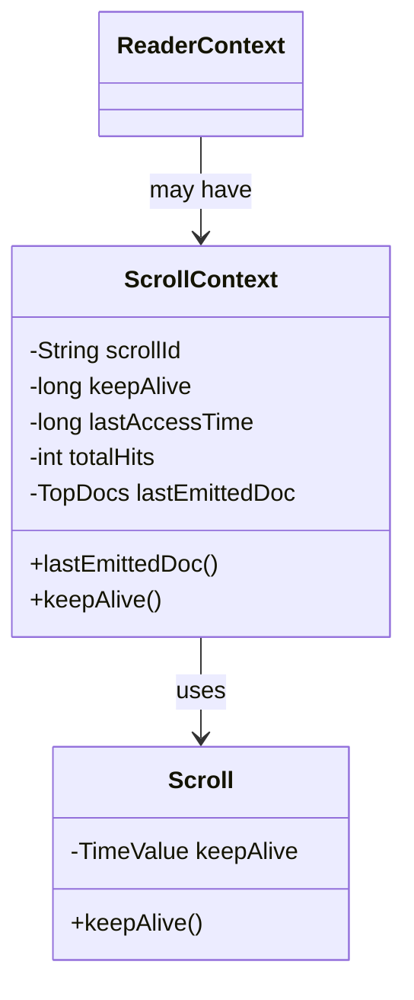

### 类说明

#### ScrollContext

**职责**: 管理 Scroll 搜索的状态

**关键字段**:

- `scrollId`: Scroll 唯一标识符
- `keepAlive`: 保持时间
- `lastAccessTime`: 最后访问时间
- `totalHits`: 总命中数 (第一次查询确定)
- `lastEmittedDoc`: 最后返回的文档 (用于下一次迭代)

**生命周期**:

```
创建 (初始查询) → 迭代 (多次) → 超时/手动清理 → 释放
```

**状态管理**:

```java
// 创建
ScrollContext scrollContext = new ScrollContext();
scrollContext.keepAlive = TimeValue.timeValueMinutes(1);
readerContext.scrollContext(scrollContext);

// 迭代
TopDocs nextBatch = searcher.searchAfter(
    scrollContext.lastEmittedDoc(),
    query,
    size
);
scrollContext.lastEmittedDoc(nextBatch.scoreDocs[nextBatch.scoreDocs.length - 1]);

// 清理
readerContext.close();
```

---

## 6. AggregatedDfs

### 6.1 类图

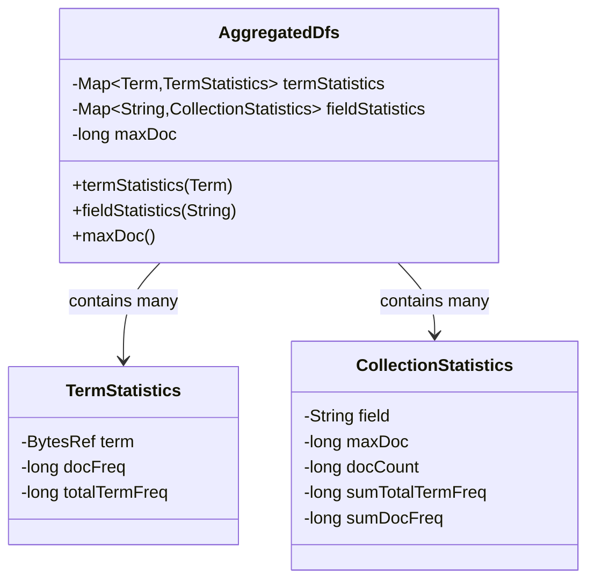

### 类说明

#### AggregatedDfs

**职责**: DFS Phase 收集的全局词频统计

**关键字段**:

- `termStatistics`: 每个词的统计信息 (docFreq, totalTermFreq)
- `fieldStatistics`: 每个字段的统计信息 (maxDoc, docCount, sumTotalTermFreq)
- `maxDoc`: 全局最大文档数

**使用场景**:

```
DFS_QUERY_THEN_FETCH 模式:

1. DFS Phase: 收集所有分片的词频统计
2. 归并: 计算全局 IDF
3. Query Phase: 使用全局 IDF 计算分数

```

**IDF 计算**:

```java
// 本地 IDF (每个分片独立计算)
idf = log((maxDoc - docFreq + 0.5) / (docFreq + 0.5) + 1)

// 全局 IDF (使用 AggregatedDfs)
idf = log((globalMaxDoc - globalDocFreq + 0.5) / (globalDocFreq + 0.5) + 1)
```

---

## 7. 数据结构关系总览

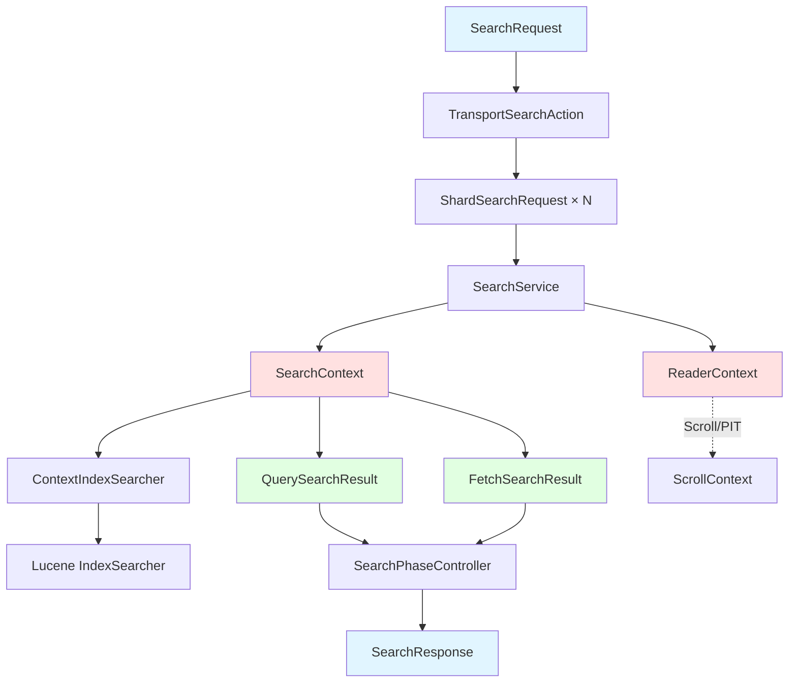

---

## 8. 字段映射与版本演进

### 8.1 SearchRequest 版本演进

| 版本 | 变更 | 说明 |
|---|---|---|
| 7.x | 引入 `track_total_hits` | 控制统计总数的上限 |
| 7.10 | 引入 `Point-in-Time` API | 替代部分 Scroll 场景 |
| 8.x | 移除 `types` | 移除多类型支持 |
| 8.x | 默认 `track_total_hits=10000` | 性能优化 |

### 8.2 ReaderContext 版本演进

| 版本 | 变更 | 说明 |
|---|---|---|
| 早期 | 仅支持 Scroll | 有状态搜索 |
| 7.10+ | 支持 PIT | 轻量级快照 |
| 当前 | `singleSession` 标志 | 区分一次性查询和多次查询 |

---

## 相关文档

- [Elasticsearch-03-搜索模块-概览](./Elasticsearch-03-搜索模块-概览.md)
- [Elasticsearch-03-搜索模块-API](./Elasticsearch-03-搜索模块-API.md)
- [Elasticsearch-03-搜索模块-时序图](./Elasticsearch-03-搜索模块-时序图.md)

---

## 时序图

本文档展示搜索模块核心流程的详细时序图，帮助理解分布式搜索的各个阶段。

---

## 1. 标准搜索流程 (QUERY_THEN_FETCH)

### 1.1 完整搜索时序图

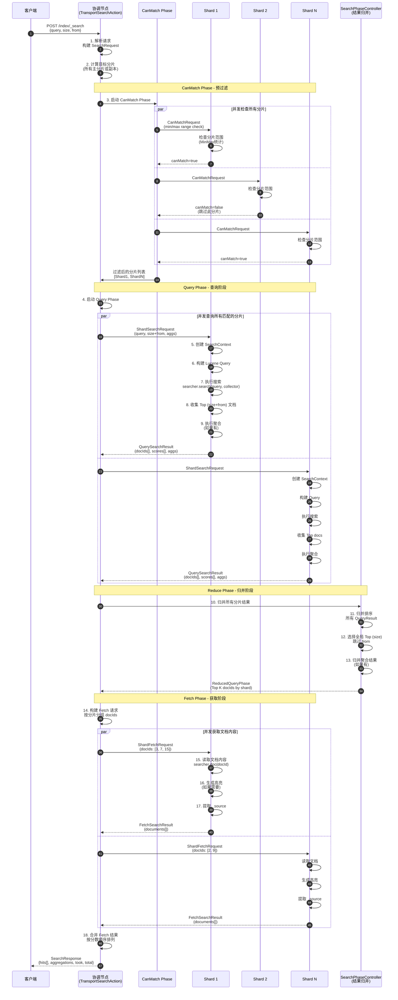

### 时序图说明

#### 阶段划分

**1. CanMatch Phase (预过滤)**

- **目的**: 快速过滤掉不包含匹配文档的分片
- **方法**: 检查分片的 min/max 值范围
- **优化**: 可以减少 50%+ 的分片查询
- **适用**: 带范围过滤的查询 (range, date_range)

**2. Query Phase (查询阶段)**

- **目的**: 获取每个分片的 Top K 文档 ID 和分数
- **输出**: 轻量级结果 (docId + score + sort values)
- **并发**: 所有分片并行执行
- **内存**: 每个分片保留 size+from 个结果

**3. Reduce Phase (归并阶段)**

- **目的**: 合并所有分片的结果，选出全局 Top K
- **算法**: 归并排序 (O(N*K*log K))
- **聚合**: 合并聚合结果
- **输出**: 全局 Top size 的 (shardId, docId)

**4. Fetch Phase (获取阶段)**

- **目的**: 获取完整文档内容
- **输入**: 全局 Top K 的 (shardId, docId)
- **并发**: 按需分片并行获取
- **开销**: 网络传输 + 文档读取

#### 性能特点

| 阶段 | 网络传输 | CPU | I/O | 可优化 |
|---|---|---|---|---|
| CanMatch | 很小 | 低 | 无 | - |
| Query | 小 | 高 | 低 | 缓存、并行 |
| Reduce | 中 | 中 | 无 | 减少分片数 |
| Fetch | 大 | 低 | 高 | 仅返回必要字段 |

#### 关键优化点

1. **CanMatch 优化**
   - 跳过不匹配的分片
   - 特别适合时间范围查询

2. **Query Phase 优化**
   - 使用 Filter 而非 Query (可缓存)
   - 减小 size + from 的值
   - 限制聚合基数

3. **Fetch Phase 优化**
   - 仅返回需要的字段 (_source filtering)
   - 禁用 _source (仅需 docId)
   - 使用 stored_fields

---

## 2. DFS_QUERY_THEN_FETCH 流程

### 2.1 DFS 阶段时序图

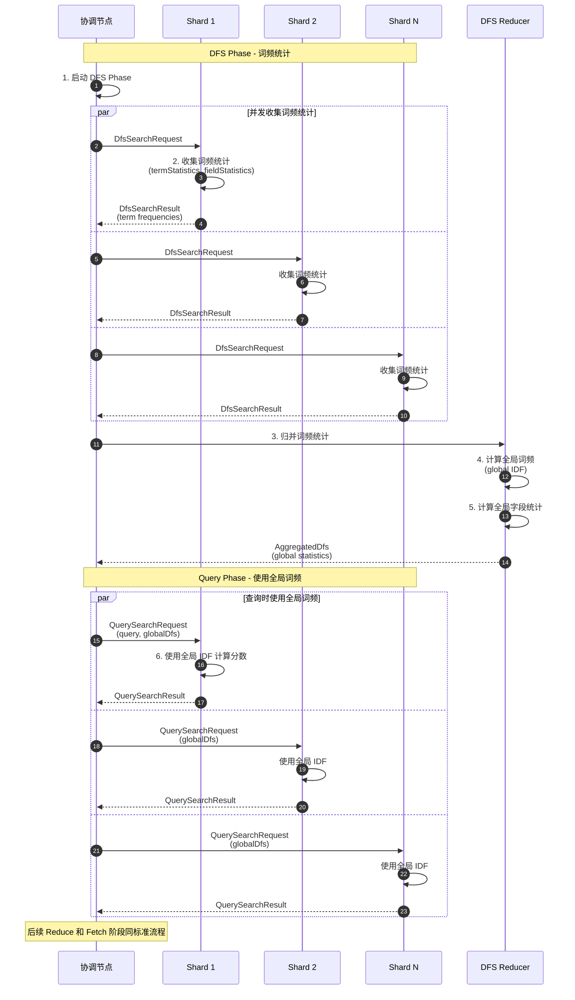

### 时序图说明

**DFS (Distributed Frequency Search) 阶段**:

**目的**: 获取更准确的 TF-IDF 分数

**工作原理**:

1. 收集所有分片的词频统计
2. 计算全局 IDF (Inverse Document Frequency)
3. Query Phase 使用全局 IDF 计算分数

**何时使用**:

- 数据分布不均匀
- 分数准确度要求高
- 可以接受额外的网络开销

**性能开销**:

- 额外的网络往返 (1次)
- 额外的计算 (统计归并)
- 总耗时增加 20-50%

**适用场景**:

```json
{
  "query": {
    "match": {
      "title": "rare term"  // 罕见词在不同分片分布不均
    }
  }
}
```

---

## 3. Scroll API 流程

### 3.1 Scroll 搜索时序图

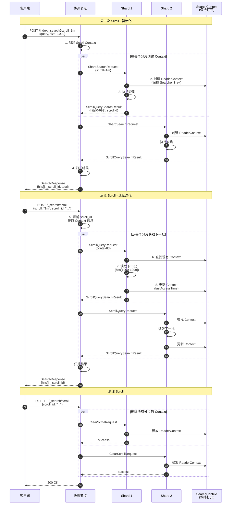

### 时序图说明

**Scroll 特点**:

1. **状态保持**: 在分片上保持 SearchContext
2. **快照隔离**: 查询时的快照，不受后续写入影响
3. **顺序读取**: 按文档 ID 顺序读取
4. **适合导出**: 遍历大量数据

**Scroll Context 生命周期**:

```
创建 → 使用 (多次) → 超时/手动清理 → 释放
```

**超时机制**:

- 每次 Scroll 请求重置超时时间
- 超时后自动清理 Context
- 默认超时时间可配置 (如 1m, 5m)

**内存占用**:

- 每个 Scroll Context 占用内存
- 保持 Lucene Searcher 打开
- 建议及时清理不用的 Scroll

**最佳实践**:

```bash
# 1. 创建 Scroll
POST /index/_search?scroll=1m
{
  "size": 1000,
  "query": { "match_all": {} }
}

# 2. 循环获取
while (hits.length > 0) {
  POST /_search/scroll
  {
    "scroll": "1m",
    "scroll_id": "..."
  }
}

# 3. 及时清理
DELETE /_search/scroll
{
  "scroll_id": "..."
}
```

---

## 4. Search After 流程

### 4.1 Search After 时序图

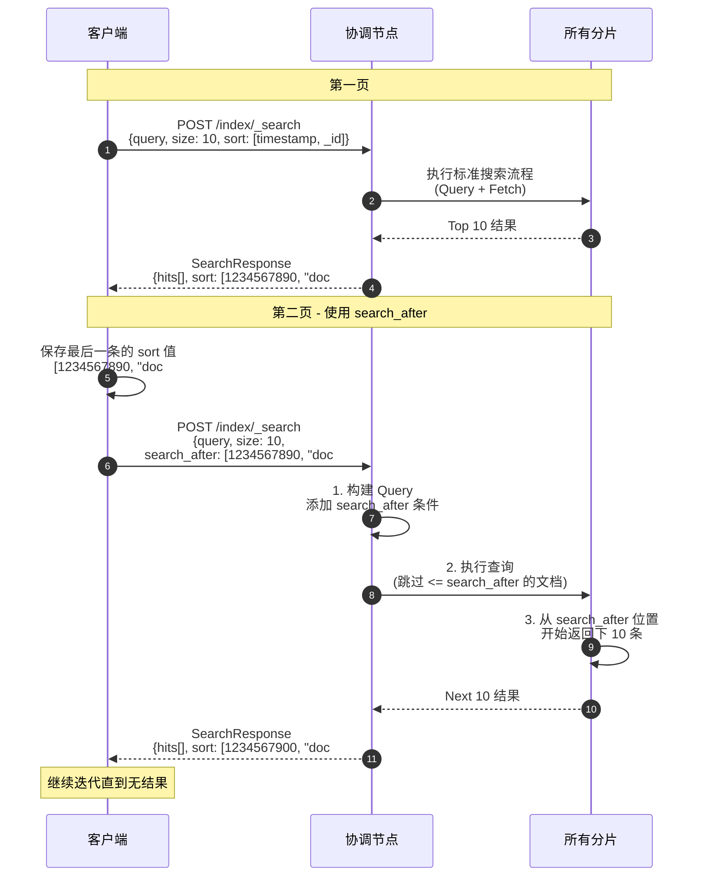

### 时序图说明

**Search After 优势**:

1. **无状态**: 不需要在服务端保持 Context
2. **实时**: 可以看到最新写入的数据
3. **深度分页**: 不受 max_result_window 限制
4. **高效**: 每个分片只需返回 size 个结果

**与 from/size 对比**:

| 方式 | 状态 | 实时 | 深度分页 | 性能 |
|---|---|---|---|---|
| from/size | 无状态 | 实时 | 受限(10000) | 差 |
| scroll | 有状态 | 快照 | 无限制 | 好 |
| search_after | 无状态 | 实时 | 无限制 | 最好 |

**使用要求**:

- 必须指定 sort
- sort 必须包含唯一字段 (如 _id)
- 不能随机跳页 (只能顺序翻页)

**适用场景**:

- 实时分页
- 深度分页
- 数据导出 (替代 Scroll)

---

## 5. 聚合执行流程

### 5.1 Terms 聚合时序图

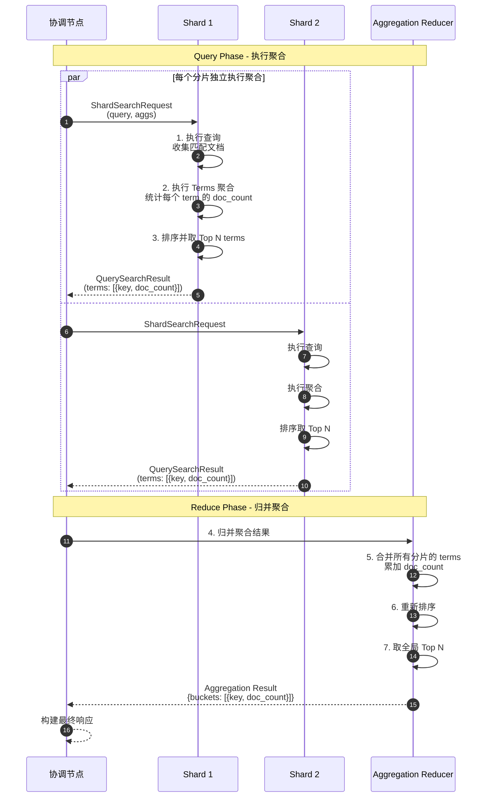

### 时序图说明

**聚合类型**:

1. **Bucket Aggregations (桶聚合)**
   - Terms: 按词项分组
   - Date Histogram: 按时间分组
   - Range: 按范围分组

2. **Metric Aggregations (指标聚合)**
   - Sum, Avg, Min, Max
   - Cardinality (基数统计)
   - Percentiles (百分位)

3. **Pipeline Aggregations (管道聚合)**
   - Derivative (导数)
   - Moving Average (移动平均)

**Terms 聚合归并**:

```
分片1: [A:100, B:50, C:30]
分片2: [A:80, D:60, B:40]
分片3: [A:120, C:70, E:50]

归并后: [A:300, C:100, D:60, B:90, E:50]
Top 3: [A:300, C:100, D:60]
```

**精度问题**:

由于每个分片只返回 Top N，可能丢失全局 Top N 中的某些项：

- 使用 `size` 参数控制返回桶数量
- 使用 `shard_size` 参数(> size)提高精度
- 基数很高时考虑使用 Composite Aggregation

---

## 相关文档

- [Elasticsearch-03-搜索模块-概览](./Elasticsearch-03-搜索模块-概览.md)
- [Elasticsearch-03-搜索模块-API](./Elasticsearch-03-搜索模块-API.md)
- [Elasticsearch-03-搜索模块-数据结构](./Elasticsearch-03-搜索模块-数据结构.md)

---
