# Elasticsearch-04-集群模块

## 模块概览

本文档提供集群模块的全面概览,包括模块职责、架构设计、核心组件、主节点选举机制、集群状态管理等内容。

---

## 1. 模块职责

集群模块是 Elasticsearch 实现分布式协调的核心,负责以下关键功能:

### 1.1 核心职责

1. **节点发现与加入**
   - 自动发现集群中的其他节点
   - 新节点加入集群的握手与验证
   - 节点离开/失联的检测

2. **主节点选举**
   - 基于 Raft 协议的 Leader 选举
   - 主节点故障时的自动切换
   - 脑裂防护 (Split-brain Protection)

3. **集群状态管理**
   - 维护全局集群状态 (Cluster State)
   - 集群状态的增量更新与发布
   - 集群状态的版本控制与持久化

4. **分片分配与路由**
   - 决定分片在哪些节点上分配
   - 分片重平衡 (Rebalancing)
   - 分片路由表管理

5. **集群级别协调**
   - 集群设置管理
   - 集群范围的元数据操作 (索引创建/删除、模板管理)
   - 集群健康监控

### 1.2 输入与输出

**输入**:

- 节点加入/离开事件
- 集群状态变更请求 (索引操作、设置更新等)
- 分片状态报告 (来自 Data 节点)

**输出**:

- 最新的集群状态 (分发到所有节点)
- 分片分配决策
- 集群健康状态
- 主节点选举结果

### 1.3 依赖关系

**上游依赖**:

- Transport Layer: 节点间通信
- Discovery Module: 节点发现
- Allocation Service: 分片分配策略

**下游依赖者**:

- Index Module: 依赖集群状态获取分片路由
- Search Module: 依赖集群状态查找分片位置
- Gateway Module: 从持久化存储恢复集群状态

---

## 2. 模块架构

### 2.1 整体架构图

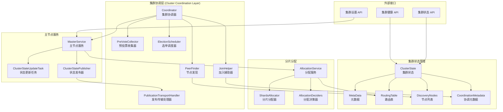

### 2.2 架构说明

#### 层次划分

**1. 协调层 (Coordination Layer)**

- **职责**: 实现 Raft 协议,管理主节点选举和节点加入
- **核心组件**: Coordinator, PeerFinder, JoinHelper
- **关键特性**: 容错性、一致性保证

**2. 状态管理层 (State Management Layer)**

- **职责**: 维护和分发集群状态
- **核心组件**: ClusterState, MasterService, ClusterStatePublisher
- **关键特性**: 版本控制、增量更新

**3. 分片分配层 (Allocation Layer)**

- **职责**: 决定分片在节点上的分配
- **核心组件**: AllocationService, ShardsAllocator, AllocationDeciders
- **关键特性**: 负载均衡、约束满足

**4. API 层 (API Layer)**

- **职责**: 提供集群管理的 REST/Transport API
- **核心组件**: TransportClusterHealthAction, TransportClusterStateAction
- **关键特性**: 幂等性、权限控制

#### 边界条件

- **并发**: 集群状态更新在 Master 节点上串行化执行
- **超时**:
  - 选举超时 (election timeout): 默认 30s
  - 状态发布超时 (publish timeout): 默认 30s
  - 加入超时 (join timeout): 默认 60s
- **幂等**: 集群状态更新使用版本号保证幂等性
- **顺序**: 集群状态版本号严格递增

#### 异常处理

- **主节点失联**: 触发新的主节点选举
- **网络分区**: 少数派停止服务,多数派继续运行
- **脑裂防护**: 基于 quorum (多数派) 机制
- **状态发布失败**: 重试,达到阈值后节点离开集群

#### 性能要点

- **状态发布**: 增量式,仅发送变更的 diff
- **批量更新**: 多个任务合并为一次状态发布
- **压缩**: 状态发布时使用压缩
- **分片数量**: 单集群建议不超过 10 万个分片

---

## 3. 核心组件详解

### 3.1 Coordinator (集群协调器)

#### 职责

Coordinator 是集群协调的中心组件,实现 Raft 协议的核心逻辑。

#### 核心方法

```java
public class Coordinator extends AbstractLifecycleComponent implements ClusterStatePublisher {
    // 模式: CANDIDATE（候选者）, LEADER（主节点）, FOLLOWER（跟随者）
    private Mode mode = Mode.CANDIDATE;

    // 当前任期
    private long currentTerm = 0;

    // 协调状态
    private final SetOnce<CoordinationState> coordinationState = new SetOnce<>();

    // 启动选举
    private void startElection() {
        synchronized (mutex) {
            if (mode == Mode.CANDIDATE) {
                final long electionTerm = getTermForNewElection();
                broadcastStartJoinRequest(getLocalNode(), electionTerm, getDiscoveredNodes());
            }
        }
    }

    // 成为候选者
    void becomeCandidate(String method) {
        mode = Mode.CANDIDATE;
        peerFinder.activate(coordinationState.get().getLastAcceptedState().nodes());
        preVoteCollector.update(getPreVoteResponse(), null);
    }

    // 成为主节点
    private void becomeLeader() {
        mode = Mode.LEADER;
        peerFinder.deactivate(getLocalNode());
        clusterFormationFailureHelper.stop();

        // 启动心跳和健康检查
        leaderHeartbeatService.start(coordinationState.get(), this::publishClusterState);
        followersChecker.updateFastResponseState(getCurrentTerm(), mode);
        lagDetector.startLagDetector(getCurrentTerm());
    }

    // 成为跟随者
    private void becomeFollower(DiscoveryNode leaderNode) {
        mode = Mode.FOLLOWER;
        peerFinder.deactivate(leaderNode);

        // 启动主节点健康检查
        leaderChecker.updateLeader(leaderNode);
    }
}
```

#### 状态机

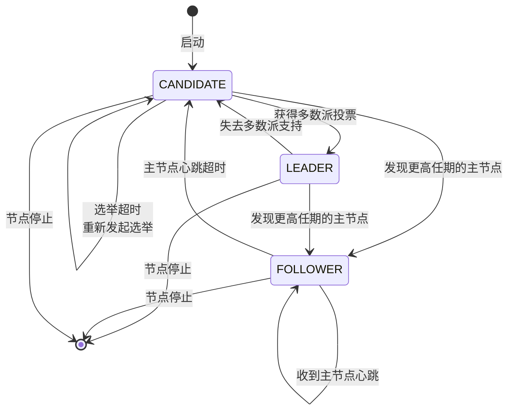

### 3.2 ClusterState (集群状态)

#### 结构

```java
public class ClusterState implements Diffable<ClusterState> {
    // 版本号（严格递增）
    private final long version;

    // 集群 UUID
    private final String stateUUID;

    // 路由表（分片分配）
    private final RoutingTable routingTable;

    // 节点信息
    private final DiscoveryNodes nodes;

    // 元数据（索引、模板、设置等）
    private final Metadata metadata;

    // 集群范围的阻塞
    private final ClusterBlocks blocks;

    // 协调元数据（任期、投票配置等）
    private final CoordinationMetadata coordinationMetadata;
}
```

#### 关键字段

| 字段 | 类型 | 说明 |
|---|---|---|
| version | long | 集群状态版本号,每次更新递增 |
| stateUUID | String | 状态唯一标识符 |
| routingTable | RoutingTable | 所有索引的分片路由信息 |
| nodes | DiscoveryNodes | 集群中的所有节点 |
| metadata | Metadata | 索引元数据、映射、设置、模板 |
| blocks | ClusterBlocks | 集群级和索引级的操作阻塞 |
| coordinationMetadata | CoordinationMetadata | Raft 协调相关元数据 |

#### 更新机制

```java
// 集群状态更新流程
public ClusterState execute(ClusterState currentState) {
    // 1. 基于当前状态创建 Builder
    ClusterState.Builder builder = ClusterState.builder(currentState);

    // 2. 应用变更
    builder.incrementVersion();
    builder.metadata(newMetadata);
    builder.routingTable(newRoutingTable);

    // 3. 构建新状态
    return builder.build();
}
```

### 3.3 MasterService (主节点服务)

#### 职责

MasterService 是主节点上的核心服务,负责:

- 接收集群状态更新任务
- 串行化执行任务
- 发布新的集群状态

#### 任务队列

```java
public class MasterService extends AbstractLifecycleComponent {
    // 任务队列（按优先级）
    private final PrioritizedEsThreadPoolExecutor threadPoolExecutor;

    // 提交集群状态更新任务
    public <T> void submitStateUpdateTask(
        String source,
        T task,
        ClusterStateTaskConfig config,
        ClusterStateTaskExecutor<T> executor,
        ClusterStateTaskListener listener
    ) {
        // 1. 包装为任务
        TaskInputs taskInputs = new TaskInputs(task, source, listener);

        // 2. 加入队列
        threadPoolExecutor.execute(
            taskInputs,
            config.getThreadPool(),
            batchExecutionContext -> {
                // 3. 批量执行任务
                executeTasks(batchExecutionContext, executor);
            }
        );
    }

    // 批量执行任务
    private <T> void executeTasks(
        BatchExecutionContext<T> context,
        ClusterStateTaskExecutor<T> executor
    ) {
        ClusterState previousState = clusterService.state();

        // 1. 执行任务获取新状态
        ClusterTasksResult<T> result = executor.execute(previousState, context.tasks);
        ClusterState newState = result.resultingState;

        // 2. 发布新状态
        if (newState != previousState) {
            publishClusterState(newState, context);
        }

        // 3. 通知任务结果
        notifyListeners(context, result);
    }
}
```

#### 任务优先级

| 优先级 | 用途 | 示例 |
|---|---|---|
| IMMEDIATE | 紧急任务 | 节点离开 |
| URGENT | 高优先级任务 | 分片失败 |
| HIGH | 高优先级 | 分片分配 |
| NORMAL | 正常任务 | 索引创建 |
| LOW | 低优先级 | 设置更新 |
| LANGUID | 最低优先级 | 统计更新 |

### 3.4 AllocationService (分片分配服务)

#### 职责

决定每个分片应该在哪个节点上分配,实现负载均衡。

#### 分配流程

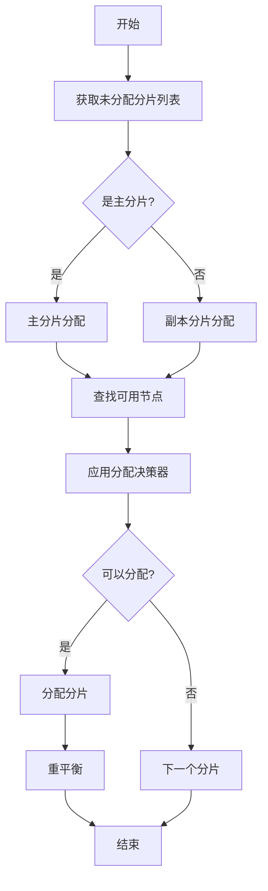

#### 分配决策器

```java
// 分配决策器接口
public interface AllocationDecider {
    Decision canAllocate(ShardRouting shardRouting, RoutingNode node, RoutingAllocation allocation);
    Decision canRemain(ShardRouting shardRouting, RoutingNode node, RoutingAllocation allocation);
    Decision canRebalance(ShardRouting shardRouting, RoutingAllocation allocation);
}

// 内置决策器示例
public class DiskThresholdDecider extends AllocationDecider {
    @Override
    public Decision canAllocate(ShardRouting shardRouting, RoutingNode node, RoutingAllocation allocation) {
        // 检查磁盘使用率
        if (diskUsagePercentage > highWatermark) {
            return Decision.NO;  // 磁盘不足,不允许分配
        }
        return Decision.YES;
    }
}
```

#### 常用决策器

| 决策器 | 作用 |
|---|---|
| SameShardAllocationDecider | 同一分片的主副本不能在同一节点 |
| FilterAllocationDecider | 根据节点属性过滤 (rack awareness) |
| DiskThresholdDecider | 检查磁盘空间 |
| ShardsLimitAllocationDecider | 限制每个节点的分片数量 |
| AwarenessAllocationDecider | 机架/可用区感知 |
| ThrottlingAllocationDecider | 限流,避免同时移动过多分片 |

---

## 4. 主节点选举流程

### 4.1 选举时序图

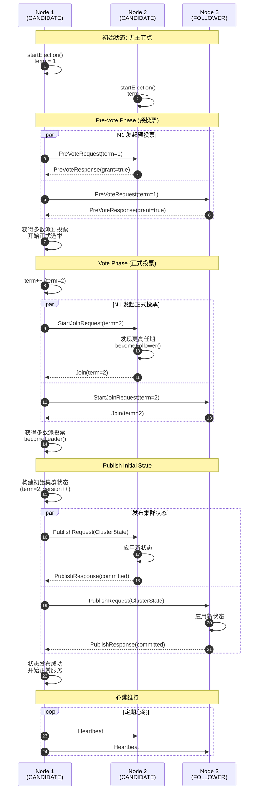

### 4.2 选举触发条件

1. **节点启动**: 初次启动时进入 CANDIDATE 模式
2. **主节点心跳超时**: Follower 检测到主节点失联
3. **网络分区恢复**: 分区节点重新加入
4. **手动触发**: 管理员操作

### 4.3 选举算法 (基于 Raft)

#### 关键概念

- **Term (任期)**: 逻辑时钟,每次选举递增
- **Quorum (多数派)**: 超过半数节点的集合
- **Pre-Vote**: 预投票阶段,避免网络分区导致的无限选举

#### 选举步骤

```java
// 1. Pre-Vote Phase (预投票)
if (mode == Mode.CANDIDATE && receivedPreVotesFrom.size() >= quorum) {
    // 获得多数派预投票,开始正式选举
    currentTerm++;
    broadcastStartJoinRequest(localNode, currentTerm, discoveredNodes);
}

// 2. Vote Phase (正式投票)
if (receivedJoinsFrom.size() >= quorum) {
    // 获得多数派投票,成为主节点
    becomeLeader();
}

// 3. Publish Initial State
ClusterState initialState = ClusterState.builder(lastAcceptedState)
    .incrementVersion()
    .nodes(DiscoveryNodes.builder().masterNodeId(localNode.getId()))
    .build();
publishClusterState(initialState);
```

### 4.4 脑裂防护

**问题**: 网络分区导致多个主节点

**解决方案**:

1. **Quorum 机制**: 只有获得多数派投票才能成为主节点
2. **Voting Configuration**: 明确定义有投票权的节点集合
3. **最小主节点数**: `discovery.zen.minimum_master_nodes` (已弃用,Raft 自动管理)

**示例场景**:

```
集群: 3个节点 [N1, N2, N3]
网络分区: [N1] | [N2, N3]

N1: 无法获得多数派 (1/3),停止服务
N2, N3: 可以获得多数派 (2/3),选出新主节点
```

---

## 5. 集群状态发布流程

### 5.1 发布时序图

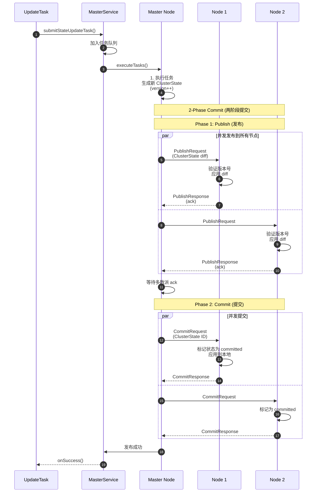

### 5.2 增量发布 (Diff)

为了减少网络传输,集群状态采用增量发布:

```java
// 计算 diff
ClusterState oldState = currentState;
ClusterState newState = updatedState;

ClusterState.Diff diff = newState.diff(oldState);

// 发送 diff 而非完整状态
publishRequest.setDiff(diff);

// 接收方应用 diff
ClusterState appliedState = diff.apply(localState);
```

**Diff 内容**:

- 版本号
- 变更的索引元数据
- 变更的分片路由
- 变更的节点列表
- 变更的设置

---

## 6. 配置与可观测

### 6.1 关键配置

| 配置项 | 默认值 | 说明 |
|---|---|---|
| cluster.name | elasticsearch | 集群名称 |
| node.master | true | 是否可以成为主节点 |
| node.data | true | 是否是数据节点 |
| discovery.seed_hosts | [] | 种子节点列表 |
| cluster.initial_master_nodes | [] | 初始主节点候选列表 (首次启动) |
| cluster.publish.timeout | 30s | 状态发布超时 |
| cluster.join.timeout | 60s | 加入集群超时 |
| cluster.election.duration | 500ms | 选举周期 |
| cluster.follower_lag.timeout | 90s | Follower 延迟超时 |

### 6.2 监控指标

#### 集群健康

```bash
GET /_cluster/health

{
  "status": "green",  // green / yellow / red
  "number_of_nodes": 3,
  "number_of_data_nodes": 3,
  "active_primary_shards": 10,
  "active_shards": 20,
  "relocating_shards": 0,
  "initializing_shards": 0,
  "unassigned_shards": 0
}
```

#### 集群统计

```bash
GET /_cluster/stats

{
  "nodes": {
    "count": {
      "total": 3,
      "master": 3,
      "data": 3
    }
  },
  "indices": {
    "count": 5,
    "shards": {
      "total": 20,
      "primaries": 10
    }
  }
}
```

---

## 相关文档

- [Elasticsearch-04-集群模块-API](./Elasticsearch-04-集群模块-API.md)
- [Elasticsearch-04-集群模块-数据结构](./Elasticsearch-04-集群模块-数据结构.md)
- [Elasticsearch-04-集群模块-时序图](./Elasticsearch-04-集群模块-时序图.md)

---

## API接口

本文档详细描述集群模块对外提供的核心 API，包括请求/响应结构体、字段说明、入口函数与调用链、时序图以及异常处理与性能要点。

---

## 1. Cluster Health API (集群健康)

### 1.1 基本信息

- **名称**: `_cluster/health`
- **协议与方法**: GET `/_cluster/health` 或 GET `/_cluster/health/{index}`
- **幂等性**: 是（查询操作）
- **入口 Action**: `TransportClusterHealthAction`

### 1.2 请求结构体

```java
public class ClusterHealthRequest extends MasterNodeReadRequest<ClusterHealthRequest> {
    // 目标索引（可选，空表示整个集群）
    private String[] indices;

    // 索引选项
    private IndicesOptions indicesOptions = IndicesOptions.lenientExpandHidden();

    // 超时时间
    private TimeValue timeout = TimeValue.timeValueSeconds(30);

    // 等待集群达到指定状态
    private ClusterHealthStatus waitForStatus;

    // 等待无正在重新分配的分片
    private boolean waitForNoRelocatingShards = false;

    // 等待无正在初始化的分片
    private boolean waitForNoInitializingShards = false;

    // 等待指定数量的活跃分片
    private ActiveShardCount waitForActiveShards = ActiveShardCount.NONE;

    // 等待指定数量的节点
    private String waitForNodes = "";

    // 等待指定优先级的事件完成
    private Priority waitForEvents = null;
}
```

#### 字段表

| 字段 | 类型 | 必填 | 默认值 | 约束 | 说明 |
|---|---|---:|---|---|---|
| indices | String[] | 否 | [] | - | 目标索引，空表示整个集群 |
| timeout | TimeValue | 否 | 30s | >0 | 请求超时时间 |
| waitForStatus | ClusterHealthStatus | 否 | null | GREEN/YELLOW/RED | 等待集群达到指定状态 |
| waitForNoRelocatingShards | boolean | 否 | false | - | 等待无正在重新分配的分片 |
| waitForNoInitializingShards | boolean | 否 | false | - | 等待无正在初始化的分片 |
| waitForActiveShards | ActiveShardCount | 否 | NONE | all/数字 | 等待活跃分片数量 |
| waitForNodes | String | 否 | "" | - | 等待节点数量（如 ">=3"） |
| waitForEvents | Priority | 否 | null | IMMEDIATE/URGENT/HIGH/NORMAL/LOW/LANGUID | 等待事件优先级 |

### 1.3 响应结构体

```java
public class ClusterHealthResponse extends ActionResponse {
    // 集群名称
    private String clusterName;

    // 集群健康状态
    private ClusterHealthStatus status;

    // 是否超时
    private boolean timedOut;

    // 节点数量
    private int numberOfNodes;
    private int numberOfDataNodes;

    // 分片统计
    private int activePrimaryShards;
    private int activeShards;
    private int relocatingShards;
    private int initializingShards;
    private int unassignedShards;
    private int delayedUnassignedShards;

    // 待处理任务数量
    private int numberOfPendingTasks;
    private int numberOfInFlightFetch;

    // 活跃分片百分比
    private double activeShardsPercent;

    // 最长任务等待时间
    private TimeValue taskMaxWaitingTime;

    // 索引级别的健康状态（如果请求了特定索引）
    private Map<String, ClusterIndexHealth> indices;
}
```

#### ClusterHealthStatus 枚举

| 状态 | 值 | 说明 |
|---|---:|---|
| GREEN | 0 | 所有主分片和副本分片都已分配 |
| YELLOW | 1 | 所有主分片已分配，但部分副本分片未分配 |
| RED | 2 | 部分主分片未分配 |

#### 字段表

| 字段 | 类型 | 必填 | 说明 |
|---|---|---:|---|
| clusterName | String | 是 | 集群名称 |
| status | ClusterHealthStatus | 是 | 集群健康状态 (GREEN/YELLOW/RED) |
| timedOut | boolean | 是 | 是否超时 |
| numberOfNodes | int | 是 | 节点总数 |
| numberOfDataNodes | int | 是 | 数据节点数量 |
| activePrimaryShards | int | 是 | 活跃主分片数量 |
| activeShards | int | 是 | 活跃分片总数（主+副本）|
| relocatingShards | int | 是 | 正在重新分配的分片数量 |
| initializingShards | int | 是 | 正在初始化的分片数量 |
| unassignedShards | int | 是 | 未分配的分片数量 |
| delayedUnassignedShards | int | 是 | 延迟分配的分片数量 |
| numberOfPendingTasks | int | 是 | 待处理的集群任务数量 |
| activeShardsPercent | double | 是 | 活跃分片百分比 |
| taskMaxWaitingTime | TimeValue | 否 | 最长任务等待时间 |
| indices | Map<String, ClusterIndexHealth> | 否 | 索引级别的健康信息 |

### 1.4 入口函数与核心代码

#### TransportClusterHealthAction 入口

```java
public class TransportClusterHealthAction extends TransportMasterNodeReadAction<
    ClusterHealthRequest,
    ClusterHealthResponse
> {

    @Override
    protected void masterOperation(
        Task task,
        ClusterHealthRequest request,
        ClusterState state,
        ActionListener<ClusterHealthResponse> listener
    ) {
        // 1. 检查是否需要等待状态变更
        if (request.waitForStatus() != null || request.waitForActiveShards() != ActiveShardCount.NONE) {
            waitForState(request, state, listener);
        } else {
            // 2. 直接返回当前健康状态
            ClusterHealthResponse response = getHealth(request, state);
            listener.onResponse(response);
        }
    }

    private void waitForState(
        ClusterHealthRequest request,
        ClusterState state,
        ActionListener<ClusterHealthResponse> listener
    ) {
        // 创建观察者等待状态变更
        ClusterStateObserver observer = new ClusterStateObserver(
            state,
            clusterService,
            request.timeout(),
            logger
        );

        // 定义等待谓词
        Predicate<ClusterState> predicate = newState -> {
            ClusterHealthResponse health = getHealth(request, newState);
            return validateRequest(request, health);
        };

        // 等待状态满足条件
        observer.waitForNextChange(
            new ClusterStateObserver.Listener() {
                @Override
                public void onNewClusterState(ClusterState newState) {
                    listener.onResponse(getHealth(request, newState));
                }

                @Override
                public void onTimeout(TimeValue timeout) {
                    listener.onResponse(getHealth(request, observer.setAndGetObservedState()));
                }
            },
            predicate
        );
    }

    private ClusterHealthResponse getHealth(ClusterHealthRequest request, ClusterState clusterState) {
        // 1. 解析目标索引
        String[] concreteIndices = indexNameExpressionResolver.concreteIndexNames(
            clusterState,
            request.indicesOptions(),
            request.indices()
        );

        // 2. 计算集群健康状态
        ClusterHealthResponse response = new ClusterHealthResponse();
        response.setClusterName(clusterState.getClusterName().value());
        response.setNumberOfNodes(clusterState.nodes().getSize());
        response.setNumberOfDataNodes(clusterState.nodes().getDataNodes().size());

        // 3. 计算分片统计
        int activePrimaryShards = 0;
        int activeShards = 0;
        int relocatingShards = 0;
        int initializingShards = 0;
        int unassignedShards = 0;

        for (IndexRoutingTable indexRoutingTable : clusterState.routingTable()) {
            for (IndexShardRoutingTable shardRoutingTable : indexRoutingTable) {
                for (ShardRouting shardRouting : shardRoutingTable) {
                    if (shardRouting.active()) {
                        activeShards++;
                        if (shardRouting.primary()) {
                            activePrimaryShards++;
                        }
                    }
                    if (shardRouting.relocating()) {
                        relocatingShards++;
                    }
                    if (shardRouting.initializing()) {
                        initializingShards++;
                    }
                    if (shardRouting.unassigned()) {
                        unassignedShards++;
                    }
                }
            }
        }

        response.setActivePrimaryShards(activePrimaryShards);
        response.setActiveShards(activeShards);
        response.setRelocatingShards(relocatingShards);
        response.setInitializingShards(initializingShards);
        response.setUnassignedShards(unassignedShards);

        // 4. 计算健康状态
        ClusterHealthStatus status = ClusterHealthStatus.GREEN;
        if (unassignedShards > 0) {
            status = ClusterHealthStatus.YELLOW;
        }
        if (activePrimaryShards < clusterState.metadata().getTotalNumberOfShards()) {
            status = ClusterHealthStatus.RED;
        }
        response.setStatus(status);

        return response;
    }
}
```

### 1.5 时序图

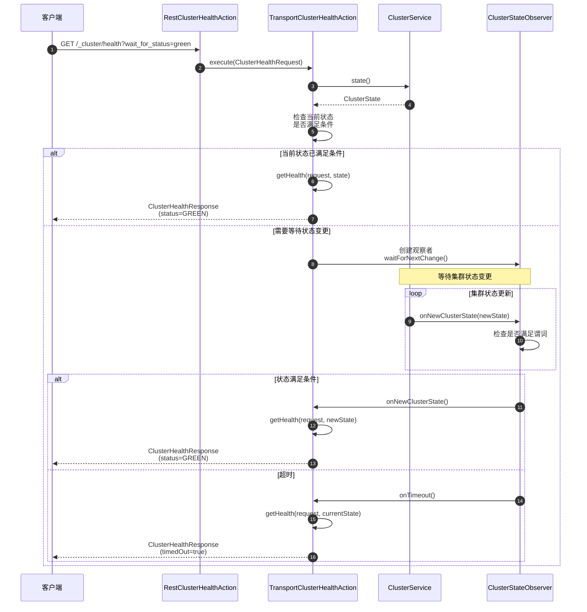

### 1.6 异常与回退

| 错误 | HTTP状态码 | 说明 |
|---|---:|---|
| ClusterBlockException | 503 | 集群被阻塞（极少发生，health API 通常允许） |
| TimeoutException | 408 | 等待超时（timedOut=true）|

### 1.7 性能要点与最佳实践

#### 性能优化

1. **避免频繁查询**: 使用 ClusterStateObserver 机制,减少轮询
2. **指定索引**: 仅查询特定索引的健康状态
3. **合理超时**: 默认 30s,根据需求调整

#### 最佳实践

```bash
# 1. 查询整个集群健康
GET /_cluster/health

# 2. 等待集群变为 green 状态（最多等待 30s）
GET /_cluster/health?wait_for_status=green&timeout=30s

# 3. 查询特定索引的健康
GET /_cluster/health/my_index

# 4. 等待所有分片活跃
GET /_cluster/health?wait_for_active_shards=all

# 5. 等待至少 3 个节点
GET /_cluster/health?wait_for_nodes=>=3
```

---

## 2. Cluster State API (集群状态)

### 2.1 基本信息

- **名称**: `_cluster/state`
- **协议与方法**: GET `/_cluster/state` 或 GET `/_cluster/state/{metrics}/{indices}`
- **幂等性**: 是（查询操作）
- **入口 Action**: `TransportClusterStateAction`

### 2.2 请求结构体

```java
public class ClusterStateRequest extends LocalClusterStateRequest {
    // 是否包含路由表
    private boolean routingTable = true;

    // 是否包含节点信息
    private boolean nodes = true;

    // 是否包含元数据
    private boolean metadata = true;

    // 是否包含阻塞信息
    private boolean blocks = true;

    // 是否包含自定义元数据
    private boolean customs = true;

    // 等待指定版本的元数据
    private Long waitForMetadataVersion;

    // 等待超时时间
    private TimeValue waitForTimeout = TimeValue.timeValueMinutes(1);

    // 目标索引
    private String[] indices = Strings.EMPTY_ARRAY;

    // 索引选项
    private IndicesOptions indicesOptions = IndicesOptions.lenientExpandOpen();
}
```

#### 字段表

| 字段 | 类型 | 必填 | 默认值 | 说明 |
|---|---|---:|---|---|
| routingTable | boolean | 否 | true | 是否包含路由表 |
| nodes | boolean | 否 | true | 是否包含节点信息 |
| metadata | boolean | 否 | true | 是否包含元数据 |
| blocks | boolean | 否 | true | 是否包含阻塞信息 |
| customs | boolean | 否 | true | 是否包含自定义元数据 |
| waitForMetadataVersion | Long | 否 | null | 等待指定元数据版本 |
| indices | String[] | 否 | [] | 目标索引 |

### 2.3 响应结构体

```java
public class ClusterStateResponse extends ActionResponse {
    // 集群名称
    private ClusterName clusterName;

    // 集群状态
    private ClusterState state;

    // 是否等待超时
    private boolean waitForTimedOut;
}
```

**ClusterState 结构**（参见数据结构文档）:

- version: 集群状态版本号
- metadata: 索引元数据、映射、设置、模板
- routingTable: 分片路由表
- nodes: 节点列表
- blocks: 集群和索引级别的阻塞
- coordinationMetadata: 协调元数据（任期、投票配置）

### 2.4 核心代码

```java
public class TransportClusterStateAction extends TransportLocalClusterStateAction<
    ClusterStateRequest,
    ClusterStateResponse
> {

    @Override
    protected void localClusterStateOperation(
        Task task,
        ClusterStateRequest request,
        ClusterState state,
        ActionListener<ClusterStateResponse> listener
    ) {
        // 1. 检查是否需要等待版本
        if (request.waitForMetadataVersion() != null) {
            waitForMetadataVersion(request, state, listener);
        } else {
            // 2. 直接返回当前状态
            ClusterState filteredState = filterState(request, state);
            listener.onResponse(new ClusterStateResponse(
                state.getClusterName(),
                filteredState,
                false
            ));
        }
    }

    private ClusterState filterState(ClusterStateRequest request, ClusterState state) {
        ClusterState.Builder builder = ClusterState.builder(state.getClusterName());

        // 根据请求过滤集群状态
        if (request.nodes()) {
            builder.nodes(state.nodes());
        }
        if (request.routingTable()) {
            if (request.indices().length > 0) {
                // 仅包含指定索引的路由
                RoutingTable.Builder routingTableBuilder = RoutingTable.builder();
                for (String index : request.indices()) {
                    IndexRoutingTable indexRoutingTable = state.routingTable().index(index);
                    if (indexRoutingTable != null) {
                        routingTableBuilder.add(indexRoutingTable);
                    }
                }
                builder.routingTable(routingTableBuilder.build());
            } else {
                builder.routingTable(state.routingTable());
            }
        }
        if (request.metadata()) {
            builder.metadata(state.metadata());
        }
        if (request.blocks()) {
            builder.blocks(state.blocks());
        }
        if (request.customs()) {
            builder.customs(state.customs());
        }

        builder.version(state.version());
        builder.stateUUID(state.stateUUID());

        return builder.build();
    }
}
```

### 2.5 最佳实践

```bash
# 1. 获取完整集群状态
GET /_cluster/state

# 2. 仅获取元数据
GET /_cluster/state/metadata

# 3. 仅获取特定索引的路由表
GET /_cluster/state/routing_table/my_index

# 4. 获取多个指标
GET /_cluster/state/metadata,routing_table

# 5. 等待元数据版本达到指定值
GET /_cluster/state?wait_for_metadata_version=123&wait_for_timeout=30s
```

---

## 3. Cluster Stats API (集群统计)

### 3.1 基本信息

- **名称**: `_cluster/stats`
- **协议与方法**: GET `/_cluster/stats` 或 GET `/_cluster/stats/nodes/{node_id}`
- **幂等性**: 是（查询操作）
- **入口 Action**: `TransportClusterStatsAction`

### 3.2 请求结构体

```java
public class ClusterStatsRequest extends BaseNodesRequest<ClusterStatsRequest> {
    // 目标节点 ID
    private String[] nodesIds;

    public ClusterStatsRequest(String... nodesIds) {
        super(nodesIds);
        this.nodesIds = nodesIds;
    }
}
```

### 3.3 响应结构体

```java
public class ClusterStatsResponse extends BaseNodesResponse<ClusterStatsNodeResponse> {
    // 时间戳
    private long timestamp;

    // 集群UUID
    private ClusterHealthStatus status;

    // 节点统计
    private ClusterStatsNodes nodesStats;

    // 索引统计
    private ClusterStatsIndices indicesStats;
}
```

#### ClusterStatsNodes 结构

```java
public class ClusterStatsNodes {
    // 节点数量统计
    private Counts count;

    // 版本信息
    private Set<Version> versions;

    // 操作系统统计
    private OsStats os;

    // 进程统计
    private ProcessStats process;

    // JVM 统计
    private JvmStats jvm;

    // 文件系统统计
    private FsInfo.Path fs;

    // 插件信息
    private List<PluginInfo> plugins;

    // 网络类型
    private NetworkTypes networkTypes;

    // 发现类型
    private DiscoveryTypes discoveryTypes;
}
```

#### ClusterStatsIndices 结构

```java
public class ClusterStatsIndices {
    // 索引数量
    private int indexCount;

    // 分片统计
    private ShardStats shards;

    // 文档统计
    private DocsStats docs;

    // 存储统计
    private StoreStats store;

    // 字段数据统计
    private FieldDataStats fieldData;

    // 查询缓存统计
    private QueryCacheStats queryCache;

    // 完成建议统计
    private CompletionStats completion;

    // 段统计
    private SegmentsStats segments;
}
```

### 3.4 核心代码

```java
public class TransportClusterStatsAction extends TransportNodesAction<
    ClusterStatsRequest,
    ClusterStatsResponse,
    ClusterStatsNodeRequest,
    ClusterStatsNodeResponse
> {

    @Override
    protected ClusterStatsResponse newResponse(
        ClusterStatsRequest request,
        List<ClusterStatsNodeResponse> responses,
        List<FailedNodeException> failures
    ) {
        // 1. 聚合所有节点的统计信息
        ClusterStatsNodes nodesStats = new ClusterStatsNodes(responses);
        ClusterStatsIndices indicesStats = new ClusterStatsIndices(responses, mappingStatsCache, analysisStatsCache);

        // 2. 计算集群健康状态
        ClusterState state = clusterService.state();
        ClusterHealthStatus status = getHealthStatus(state);

        // 3. 构建响应
        return new ClusterStatsResponse(
            System.currentTimeMillis(),
            state.metadata().clusterUUID(),
            state.getClusterName(),
            responses,
            failures,
            nodesStats,
            indicesStats,
            status
        );
    }

    @Override
    protected ClusterStatsNodeResponse nodeOperation(ClusterStatsNodeRequest request, Task task) {
        // 收集当前节点的统计信息
        NodeInfo nodeInfo = nodeService.info(
            true, true, false, true, false,
            true, false, true, false, false, false
        );

        NodeStats nodeStats = nodeService.stats(
            CommonStatsFlags.ALL,
            false, false, false, false,
            true, false, false, false, false, false, false, false
        );

        // 收集分片统计
        List<ShardStats> shardsStats = new ArrayList<>();
        for (IndexService indexService : indicesService) {
            for (IndexShard indexShard : indexService) {
                if (indexShard.routingEntry() != null && indexShard.routingEntry().active()) {
                    shardsStats.add(new ShardStats(
                        indexShard.routingEntry(),
                        indexShard.shardPath(),
                        indexShard.stats(),
                        indexShard.commitStats(),
                        indexShard.seqNoStats(),
                        indexShard.getRetentionLeaseStats()
                    ));
                }
            }
        }

        return new ClusterStatsNodeResponse(
            nodeInfo.getNode(),
            clusterService.state().metadata().clusterUUID(),
            nodeInfo,
            nodeStats,
            shardsStats.toArray(new ShardStats[0])
        );
    }
}
```

### 3.5 最佳实践

```bash
# 1. 获取整个集群的统计信息
GET /_cluster/stats

# 2. 获取特定节点的统计信息
GET /_cluster/stats/nodes/node1,node2
```

---

## 4. Cluster Update Settings API (集群设置)

### 4.1 基本信息

- **名称**: `_cluster/settings`
- **协议与方法**:
  - GET `/_cluster/settings` (查询)
  - PUT `/_cluster/settings` (更新)
- **幂等性**: GET 是，PUT 否
- **入口 Action**: `TransportClusterGetSettingsAction`, `TransportClusterUpdateSettingsAction`

### 4.2 请求结构体

```java
public class ClusterUpdateSettingsRequest extends AcknowledgedRequest<ClusterUpdateSettingsRequest> {
    // 瞬态设置（重启后丢失）
    private Settings transientSettings = Settings.EMPTY;

    // 持久化设置（重启后保留）
    private Settings persistentSettings = Settings.EMPTY;
}
```

### 4.3 响应结构体

```java
public class ClusterUpdateSettingsResponse extends AcknowledgedResponse {
    // 是否确认
    private boolean acknowledged;

    // 更新后的瞬态设置
    private Settings transientSettings;

    // 更新后的持久化设置
    private Settings persistentSettings;
}
```

### 4.4 核心代码

```java
public class TransportClusterUpdateSettingsAction extends TransportMasterNodeAction<
    ClusterUpdateSettingsRequest,
    ClusterUpdateSettingsResponse
> {

    @Override
    protected void masterOperation(
        Task task,
        ClusterUpdateSettingsRequest request,
        ClusterState state,
        ActionListener<ClusterUpdateSettingsResponse> listener
    ) {
        // 提交集群状态更新任务
        clusterService.submitUnbatchedStateUpdateTask("cluster_update_settings", new AckedClusterStateUpdateTask(request, listener) {
            @Override
            public ClusterState execute(ClusterState currentState) {
                // 1. 验证设置
                Settings.Builder transientSettings = Settings.builder().put(currentState.metadata().transientSettings());
                Settings.Builder persistentSettings = Settings.builder().put(currentState.metadata().persistentSettings());

                // 2. 应用新设置
                transientSettings.put(request.transientSettings());
                persistentSettings.put(request.persistentSettings());

                // 3. 构建新的元数据
                Metadata.Builder metadataBuilder = Metadata.builder(currentState.metadata())
                    .transientSettings(transientSettings.build())
                    .persistentSettings(persistentSettings.build());

                // 4. 构建新的集群状态
                return ClusterState.builder(currentState)
                    .metadata(metadataBuilder)
                    .build();
            }

            @Override
            public void onAllNodesAcked() {
                listener.onResponse(new ClusterUpdateSettingsResponse(
                    true,
                    transientSettings.build(),
                    persistentSettings.build()
                ));
            }
        });
    }
}
```

### 4.5 最佳实践

```bash
# 1. 查询集群设置
GET /_cluster/settings?include_defaults=true

# 2. 更新瞬态设置（重启后丢失）
PUT /_cluster/settings
{
  "transient": {
    "indices.recovery.max_bytes_per_sec": "50mb"
  }
}

# 3. 更新持久化设置（重启后保留）
PUT /_cluster/settings
{
  "persistent": {
    "cluster.routing.allocation.enable": "all"
  }
}

# 4. 重置设置为默认值
PUT /_cluster/settings
{
  "persistent": {
    "indices.recovery.max_bytes_per_sec": null
  }
}
```

#### 常用设置

| 设置 | 说明 | 默认值 |
|---|---|---|
| cluster.routing.allocation.enable | 分片分配开关 | all |
| cluster.routing.rebalance.enable | 分片重平衡开关 | all |
| indices.recovery.max_bytes_per_sec | 恢复速率限制 | 40mb |
| cluster.routing.allocation.disk.threshold_enabled | 磁盘阈值检查 | true |
| cluster.routing.allocation.disk.watermark.low | 低水位线 | 85% |
| cluster.routing.allocation.disk.watermark.high | 高水位线 | 90% |

---

## 5. Cluster Reroute API (分片重新路由)

### 5.1 基本信息

- **名称**: `_cluster/reroute`
- **协议与方法**: POST `/_cluster/reroute`
- **幂等性**: 否（可能触发分片移动）
- **入口 Action**: `TransportClusterRerouteAction`

### 5.2 请求结构体

```java
public class ClusterRerouteRequest extends AcknowledgedRequest<ClusterRerouteRequest> {
    // 重路由命令列表
    private List<AllocationCommand> commands = new ArrayList<>();

    // 是否返回解释信息
    private boolean explain = false;

    // 是否重试失败的分片
    private boolean retryFailed = false;

    // 是否立即执行
    private boolean dryRun = false;
}
```

#### AllocationCommand 类型

```java
// 移动分片命令
public class MoveAllocationCommand extends AllocationCommand {
    private String index;
    private int shardId;
    private String fromNode;
    private String toNode;
}

// 取消分片分配命令
public class CancelAllocationCommand extends AllocationCommand {
    private String index;
    private int shardId;
    private String node;
    private boolean allowPrimary;
}

// 分配副本分片命令
public class AllocateReplicaAllocationCommand extends AllocationCommand {
    private String index;
    private int shardId;
    private String node;
}

// 分配空主分片命令（数据丢失）
public class AllocateEmptyPrimaryAllocationCommand extends AllocationCommand {
    private String index;
    private int shardId;
    private String node;
    private boolean acceptDataLoss;
}

// 分配陈旧主分片命令（数据可能过期）
public class AllocateStalePrimaryAllocationCommand extends AllocationCommand {
    private String index;
    private int shardId;
    private String node;
    private boolean acceptDataLoss;
}
```

### 5.3 响应结构体

```java
public class ClusterRerouteResponse extends AcknowledgedResponse {
    // 是否确认
    private boolean acknowledged;

    // 重路由后的集群状态
    private ClusterState state;

    // 解释信息（如果 explain=true）
    private RoutingExplanations explanations;
}
```

### 5.4 核心代码

```java
public class TransportClusterRerouteAction extends TransportMasterNodeAction<
    ClusterRerouteRequest,
    ClusterRerouteResponse
> {

    @Override
    protected void masterOperation(
        Task task,
        ClusterRerouteRequest request,
        ClusterState state,
        ActionListener<ClusterRerouteResponse> listener
    ) {
        clusterService.submitUnbatchedStateUpdateTask("cluster_reroute", new ClusterStateUpdateTask() {
            @Override
            public ClusterState execute(ClusterState currentState) {
                // 1. 执行重路由命令
                AllocationCommands commands = new AllocationCommands(request.getCommands());
                RoutingAllocation allocation = new RoutingAllocation(
                    allocationDeciders,
                    currentState,
                    clusterInfoService.getClusterInfo(),
                    snapshotInfoService.snapshotShardSizes(),
                    System.nanoTime()
                );

                // 2. 应用命令
                for (AllocationCommand command : commands.commands()) {
                    command.execute(allocation);
                }

                // 3. 重新分配未分配的分片
                if (request.isRetryFailed()) {
                    allocationService.reroute(currentState, "retry_failed");
                }

                // 4. 构建新的集群状态
                return allocationService.applyChanges(currentState, allocation);
            }
        });
    }
}
```

### 5.5 最佳实践

```bash
# 1. 移动分片
POST /_cluster/reroute
{
  "commands": [
    {
      "move": {
        "index": "my_index",
        "shard": 0,
        "from_node": "node1",
        "to_node": "node2"
      }
    }
  ]
}

# 2. 取消分片分配
POST /_cluster/reroute
{
  "commands": [
    {
      "cancel": {
        "index": "my_index",
        "shard": 0,
        "node": "node1"
      }
    }
  ]
}

# 3. 手动分配副本分片
POST /_cluster/reroute
{
  "commands": [
    {
      "allocate_replica": {
        "index": "my_index",
        "shard": 0,
        "node": "node2"
      }
    }
  ]
}

# 4. Dry-run 模式（仅查看影响，不实际执行）
POST /_cluster/reroute?dry_run=true
{
  "commands": [...]
}

# 5. 重试所有失败的分片
POST /_cluster/reroute?retry_failed=true
```

---

## 相关文档

- [Elasticsearch-04-集群模块-概览](./Elasticsearch-04-集群模块-概览.md)
- [Elasticsearch-04-集群模块-数据结构](./Elasticsearch-04-集群模块-数据结构.md)
- [Elasticsearch-04-集群模块-时序图](./Elasticsearch-04-集群模块-时序图.md)

---

## 数据结构

本文档详细说明集群模块的核心数据结构，包括 UML 类图、字段语义、版本演进等。

---

## 1. ClusterState (集群状态)

`ClusterState` 是 Elasticsearch 中最重要的数据结构之一，代表整个集群在某一时刻的完整状态。

### 1.1 类图

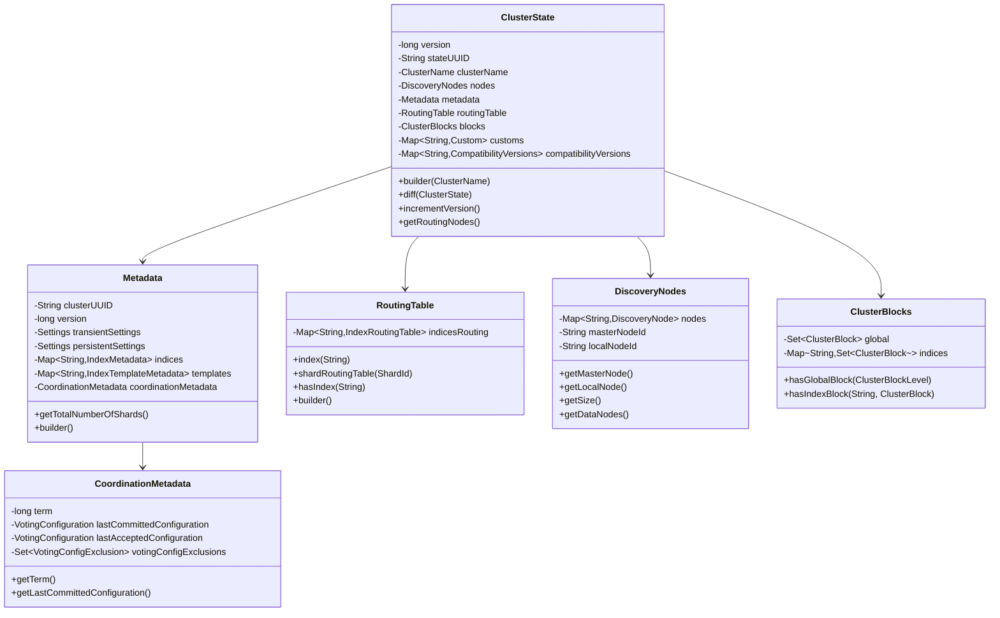

### 类说明

#### ClusterState

**职责**: 表示集群在某一时刻的完整状态

**关键字段**:

| 字段 | 类型 | 说明 |
|---|---|---|
| version | long | 状态版本号,严格递增,唯一标识已提交的状态 |
| stateUUID | String | 状态唯一标识符(即使未提交也唯一) |
| clusterName | ClusterName | 集群名称 |
| nodes | DiscoveryNodes | 集群中的所有节点 |
| metadata | Metadata | 索引元数据、设置、模板等 |
| routingTable | RoutingTable | 分片路由表 |
| blocks | ClusterBlocks | 集群和索引级别的操作阻塞 |
| customs | Map<String, Custom> | 自定义扩展数据 |
| compatibilityVersions | Map<String, CompatibilityVersions> | 节点兼容性版本信息 |

**不变性**: ClusterState 在概念上是不可变的,每次更新生成新实例

**生命周期**:

```
创建 → 主节点更新 → 发布到所有节点 → 应用到本地 → 过时
```

**版本控制**:

- 版本号严格递增
- 跳过的版本号表示该状态未提交
- 用于幂等性和并发控制

**Builder 模式**:

```java
ClusterState newState = ClusterState.builder(oldState)
    .incrementVersion()
    .metadata(newMetadata)
    .routingTable(newRoutingTable)
    .build();
```

#### Metadata (元数据)

**职责**: 存储集群级和索引级的元数据

**关键字段**:

| 字段 | 类型 | 说明 |
|---|---|---|
| clusterUUID | String | 集群唯一标识符 |
| version | long | 元数据版本号 |
| transientSettings | Settings | 瞬态设置(重启后丢失) |
| persistentSettings | Settings | 持久化设置(重启后保留) |
| indices | Map<String, IndexMetadata> | 所有索引的元数据 |
| templates | Map<String, IndexTemplateMetadata> | 索引模板 |
| coordinationMetadata | CoordinationMetadata | 协调元数据(Raft) |

**持久化**: Metadata 会持久化到磁盘,集群重启后恢复

**IndexMetadata 结构**:

```java
public class IndexMetadata {
    private Index index;  // 索引名和UUID
    private long version; // 版本号
    private int numberOfShards;    // 主分片数
    private int numberOfReplicas;  // 副本数
    private State state;  // OPEN / CLOSE
    private Settings settings;  // 索引设置
    private Map<String, MappingMetadata> mappings;  // 映射
    private Map<String, AliasMetadata> aliases;  // 别名
    private long creationDate;  // 创建时间戳
}
```

#### RoutingTable (路由表)

**职责**: 维护所有分片的路由信息

**结构层次**:

```
RoutingTable
└── IndexRoutingTable (每个索引)
    └── IndexShardRoutingTable (每个分片)
        └── ShardRouting (每个分片副本)
```

**ShardRouting 状态**:

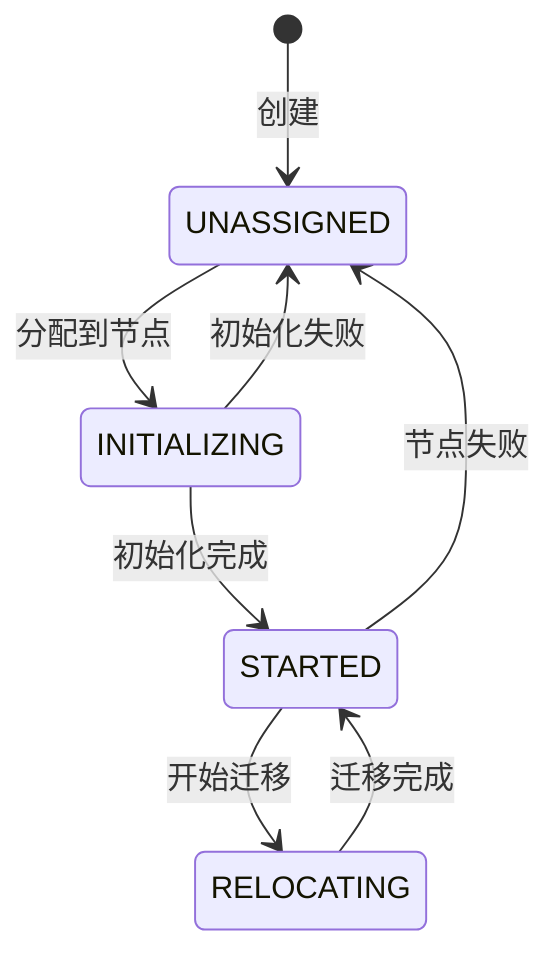

**ShardRouting 关键字段**:

```java
public class ShardRouting {
    private ShardId shardId;           // 分片 ID
    private String currentNodeId;      // 当前节点
    private String relocatingNodeId;   // 迁移目标节点
    private boolean primary;           // 是否主分片
    private ShardRoutingState state;   // 状态
    private AllocationId allocationId; // 分配 ID
    private long expectedShardSize;    // 预期大小
}
```

#### DiscoveryNodes (节点列表)

**职责**: 维护集群中的所有节点信息

**关键字段**:

| 字段 | 类型 | 说明 |
|---|---|---|
| nodes | Map<String, DiscoveryNode> | 所有节点 (nodeId → DiscoveryNode) |
| masterNodeId | String | 主节点 ID |
| localNodeId | String | 本地节点 ID |

**DiscoveryNode 结构**:

```java
public class DiscoveryNode {
    private String name;        // 节点名称
    private String id;          // 节点 ID (UUID)
    private String ephemeralId; // 临时 ID (重启后变化)
    private String hostName;    // 主机名
    private String hostAddress; // IP 地址
    private TransportAddress address;  // 传输地址
    private Map<String, String> attributes;  // 节点属性
    private Set<DiscoveryNodeRole> roles;  // 节点角色
    private Version version;  // 节点版本
}
```

**节点角色**:

- `master`: 可以成为主节点
- `data`: 数据节点
- `data_content`: 内容数据节点
- `data_hot`: 热数据节点
- `data_warm`: 温数据节点
- `data_cold`: 冷数据节点
- `data_frozen`: 冻结数据节点
- `ingest`: 摄取节点
- `ml`: 机器学习节点
- `remote_cluster_client`: 远程集群客户端
- `transform`: 转换节点

#### ClusterBlocks (集群阻塞)

**职责**: 管理集群和索引级别的操作阻塞

**阻塞级别**:

```java
public enum ClusterBlockLevel {
    READ,        // 读操作
    WRITE,       // 写操作
    METADATA_READ,   // 元数据读
    METADATA_WRITE   // 元数据写
}
```

**内置阻塞**:

- `NO_MASTER_BLOCK`: 无主节点阻塞
- `INDEX_READ_ONLY_BLOCK`: 索引只读
- `INDEX_READ_ONLY_ALLOW_DELETE_BLOCK`: 只读且允许删除
- `INDEX_CLOSED_BLOCK`: 索引已关闭

#### CoordinationMetadata (协调元数据)

**职责**: 存储 Raft 协议相关的元数据

**关键字段**:

| 字段 | 类型 | 说明 |
|---|---|---|
| term | long | 当前任期号 |
| lastCommittedConfiguration | VotingConfiguration | 最后提交的投票配置 |
| lastAcceptedConfiguration | VotingConfiguration | 最后接受的投票配置 |
| votingConfigExclusions | Set<VotingConfigExclusion> | 投票配置排除列表 |

**VotingConfiguration**:

```java
public class VotingConfiguration {
    private Set<String> nodeIds;  // 有投票权的节点 ID 集合

    public boolean hasQuorum(Collection<String> votes) {
        return votes.size() >= (nodeIds.size() / 2 + 1);
    }
}
```

---

## 2. Coordinator State Machine

### 2.1 类图

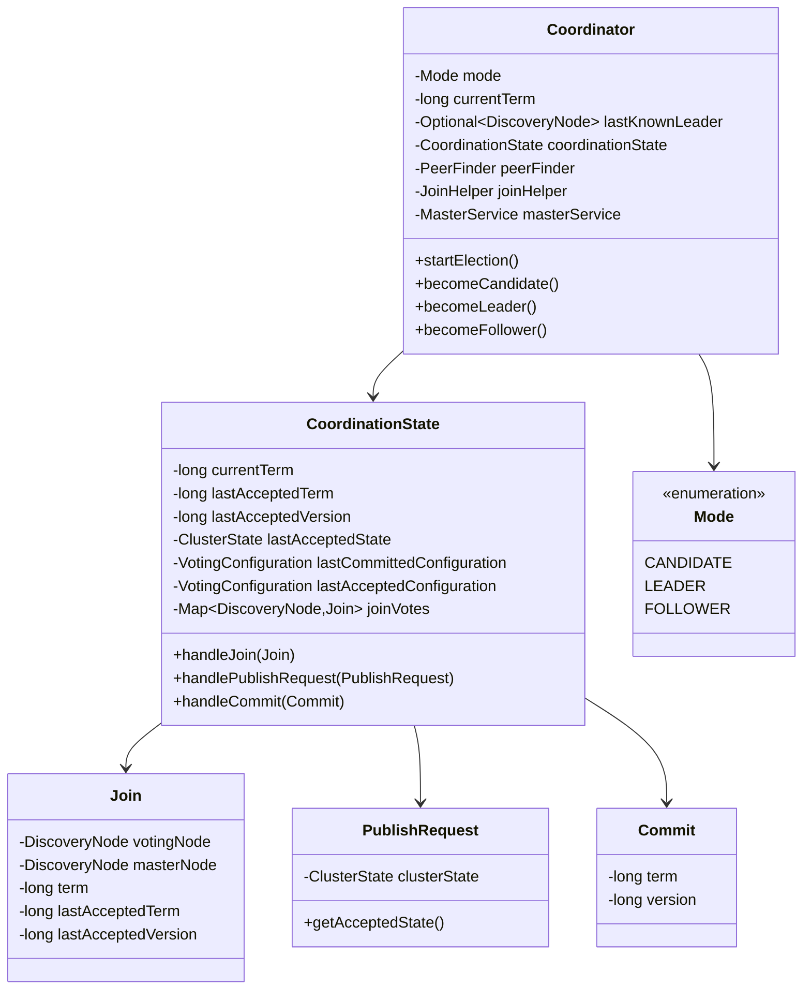

### 类说明

#### Coordinator

**职责**: 实现 Raft 协议的核心状态机

**模式 (Mode)**:

- `CANDIDATE`: 候选者,正在参与选举
- `LEADER`: 主节点,负责协调集群
- `FOLLOWER`: 跟随者,接受主节点的指令

**状态转换触发条件**:

```java
// 成为候选者
void becomeCandidate(String method) {
    mode = Mode.CANDIDATE;
    peerFinder.activate();
    preVoteCollector.update();
}

// 成为主节点
void becomeLeader() {
    mode = Mode.LEADER;
    leaderHeartbeatService.start();
    followersChecker.updateFastResponseState();
}

// 成为跟随者
void becomeFollower(DiscoveryNode leaderNode) {
    mode = Mode.FOLLOWER;
    leaderChecker.updateLeader(leaderNode);
}
```

#### CoordinationState

**职责**: 管理 Raft 协议的状态

**关键方法**:

```java
// 处理加入请求
public boolean handleJoin(Join join) {
    if (join.term() < currentTerm) {
        return false;  // 拒绝旧任期的投票
    }
    if (join.term() > currentTerm) {
        currentTerm = join.term();
        joinVotes.clear();
    }
    joinVotes.put(join.votingNode(), join);

    // 检查是否获得多数派
    return joinVotes.size() >= lastCommittedConfiguration.getQuorum();
}

// 处理发布请求
public PublishResponse handlePublishRequest(PublishRequest request) {
    ClusterState newState = request.getAcceptedState();

    // 验证任期和版本
    if (newState.term() < currentTerm) {
        return PublishResponse.reject();
    }

    // 接受新状态
    lastAcceptedState = newState;
    lastAcceptedTerm = newState.term();
    lastAcceptedVersion = newState.version();

    return PublishResponse.accept();
}

// 处理提交
public void handleCommit(Commit commit) {
    if (commit.term() == lastAcceptedTerm && commit.version() == lastAcceptedVersion) {
        // 提交状态
        lastCommittedConfiguration = lastAcceptedConfiguration;
        applyCommittedState(lastAcceptedState);
    }
}
```

---

## 3. Allocation Decision (分配决策)

### 3.1 类图

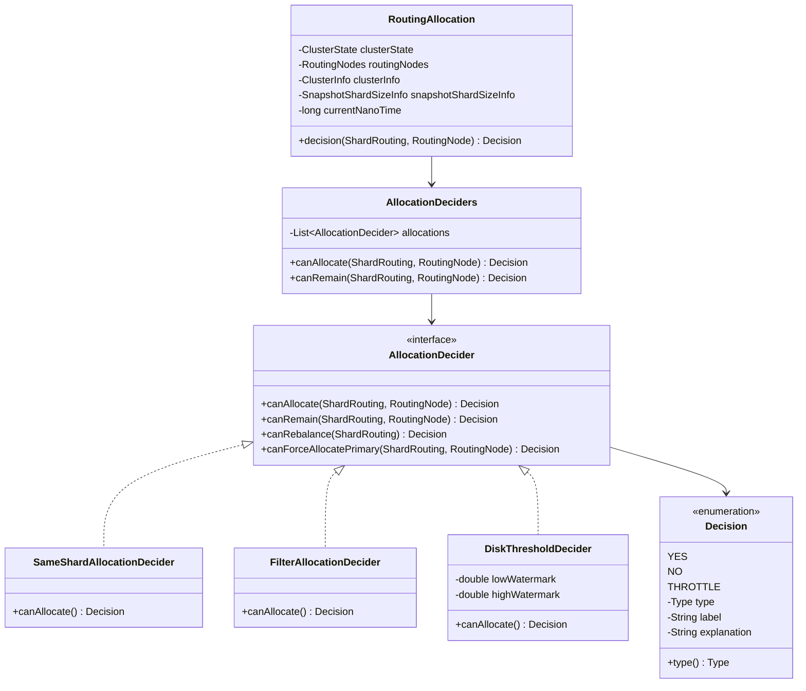

### 类说明

#### AllocationDecider

**职责**: 决定分片是否可以分配到某个节点

**决策类型**:

```java
public enum Type {
    YES,      // 允许
    NO,       // 禁止
    THROTTLE  // 限流(稍后重试)
}
```

**决策方法**:

- `canAllocate`: 分片是否可以分配到节点
- `canRemain`: 分片是否可以留在节点上
- `canRebalance`: 分片是否可以重平衡
- `canForceAllocatePrimary`: 是否可以强制分配主分片

#### 常用决策器

**1. SameShardAllocationDecider**

```java
// 同一分片的主副本不能在同一节点
@Override
public Decision canAllocate(ShardRouting shardRouting, RoutingNode node, RoutingAllocation allocation) {
    for (ShardRouting assignedShard : node) {
        if (assignedShard.shardId().equals(shardRouting.shardId())) {
            return Decision.NO;  // 同一节点已有该分片
        }
    }
    return Decision.YES;
}
```

**2. FilterAllocationDecider**

```java
// 根据节点属性过滤
@Override
public Decision canAllocate(ShardRouting shardRouting, RoutingNode node, RoutingAllocation allocation) {
    IndexMetadata indexMetadata = allocation.metadata().getIndexSafe(shardRouting.index());
    Settings indexSettings = indexMetadata.getSettings();

    // 检查 index.routing.allocation.require.* 设置
    Map<String, String> requiredFilters = indexSettings.getByPrefix("index.routing.allocation.require.");
    for (Map.Entry<String, String> entry : requiredFilters.entrySet()) {
        String attributeValue = node.node().getAttributes().get(entry.getKey());
        if (!entry.getValue().equals(attributeValue)) {
            return Decision.NO;  // 节点不满足要求的属性
        }
    }

    return Decision.YES;
}
```

**3. DiskThresholdDecider**

```java
// 检查磁盘使用率
@Override
public Decision canAllocate(ShardRouting shardRouting, RoutingNode node, RoutingAllocation allocation) {
    ClusterInfo clusterInfo = allocation.clusterInfo();
    DiskUsage usage = clusterInfo.getNodeMostAvailableDiskUsages().get(node.nodeId());

    double usedPercentage = usage.getUsedDiskAsPercentage();

    if (usedPercentage > highWatermark) {
        return Decision.NO;  // 超过高水位线
    }
    if (usedPercentage > lowWatermark) {
        return Decision.THROTTLE;  // 接近低水位线,限流
    }

    return Decision.YES;
}
```

---

## 4. Cluster Task (集群任务)

### 4.1 类图

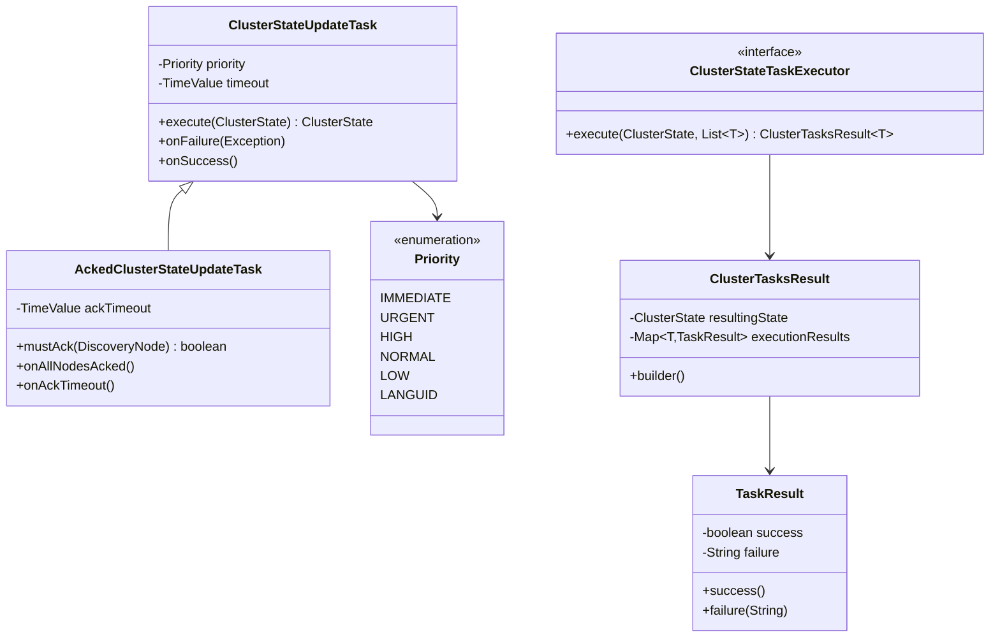

### 类说明

#### ClusterStateTaskExecutor

**职责**: 批量执行集群状态更新任务

**执行流程**:

```java
public interface ClusterStateTaskExecutor<T> {
    ClusterTasksResult<T> execute(ClusterState currentState, List<T> tasks) throws Exception;
}

// 示例实现
public class CreateIndexExecutor implements ClusterStateTaskExecutor<CreateIndexTask> {
    @Override
    public ClusterTasksResult<CreateIndexTask> execute(ClusterState currentState, List<CreateIndexTask> tasks) {
        ClusterState.Builder builder = ClusterState.builder(currentState);
        ClusterTasksResult.Builder<CreateIndexTask> resultBuilder = ClusterTasksResult.builder();

        for (CreateIndexTask task : tasks) {
            try {
                // 创建索引元数据
                IndexMetadata indexMetadata = buildIndexMetadata(task);
                builder.metadata(Metadata.builder(currentState.metadata()).put(indexMetadata, true));
                resultBuilder.success(task);
            } catch (Exception e) {
                resultBuilder.failure(task, e);
            }
        }

        return resultBuilder.build(builder.build());
    }
}
```

#### ClusterStateUpdateTask

**职责**: 单个集群状态更新任务

**优先级**:
| 优先级 | 用途 |
|---|---|
| IMMEDIATE | 紧急任务（节点离开）|
| URGENT | 高优先级（分片失败）|
| HIGH | 高优先级（分片分配）|
| NORMAL | 正常任务（索引创建）|
| LOW | 低优先级（设置更新）|
| LANGUID | 最低优先级（统计更新）|

**超时机制**:

```java
public abstract class ClusterStateUpdateTask {
    private final TimeValue timeout;

    public void onFailure(Exception e) {
        if (e instanceof ProcessClusterEventTimeoutException) {
            // 任务超时
        }
    }
}
```

#### AckedClusterStateUpdateTask

**职责**: 需要确认的集群状态更新任务

**确认流程**:

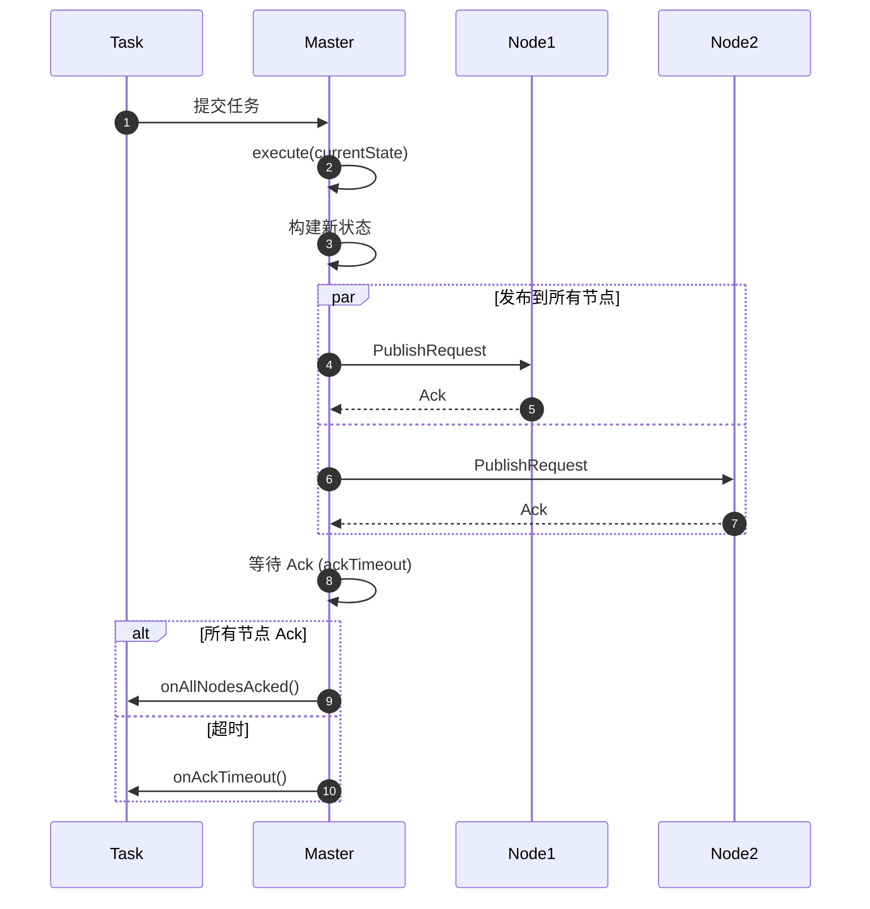

---

## 5. 数据结构关系总览

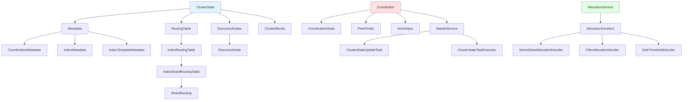

---

## 相关文档

- [Elasticsearch-04-集群模块-概览](./Elasticsearch-04-集群模块-概览.md)
- [Elasticsearch-04-集群模块-API](./Elasticsearch-04-集群模块-API.md)
- [Elasticsearch-04-集群模块-时序图](./Elasticsearch-04-集群模块-时序图.md)

---

## 时序图

本文档展示集群模块核心流程的详细时序图，帮助理解分布式协调、主节点选举、集群状态发布等关键机制。

---

## 1. 主节点选举流程 (Raft)

### 1.1 完整选举时序图

```mermaid
sequenceDiagram
    autonumber
    participant N1 as Node 1<br/>(CANDIDATE)
    participant N2 as Node 2<br/>(FOLLOWER)
    participant N3 as Node 3<br/>(FOLLOWER)

    Note over N1,N3: 触发选举：心跳超时或节点启动

    N1->>N1: becomeCandidate()<br/>term = 1
    N1->>N1: ElectionScheduler 触发

    Note over N1,N3: Phase 1: Pre-Vote (预投票)

    N1->>N1: PreVoteCollector.start()

    par 并发发送预投票请求
        N1->>N2: PreVoteRequest<br/>(term=1, lastAcceptedTerm=0, lastAcceptedVersion=0)
        N2->>N2: 检查条件:<br/>1. term >= currentTerm<br/>2. lastAccepted >= own
        N2-->>N1: PreVoteResponse(granted=true)
    and
        N1->>N3: PreVoteRequest<br/>(term=1)
        N3->>N3: 检查条件
        N3-->>N1: PreVoteResponse(granted=true)
    end

    N1->>N1: 收集到 quorum (2/3)<br/>preVote 成功

    Note over N1,N3: Phase 2: Start Join (正式投票)

    N1->>N1: currentTerm++<br/>term = 2
    N1->>N1: JoinHelper.new CandidateJoinAccumulator()

    par 并发广播选举请求
        N1->>N2: StartJoinRequest<br/>(sourceNode=N1, term=2)
        N2->>N2: 检查 term (2 > 1)<br/>becomeFollower()
        N2->>N2: 构建 Join
        N2->>N1: Join(votingNode=N2, masterNode=N1, term=2)
        N1->>N1: joinAccumulator.addJoin(N2)
    and
        N1->>N3: StartJoinRequest<br/>(term=2)
        N3->>N3: becomeFollower()
        N3->>N3: 构建 Join
        N3->>N1: Join(votingNode=N3, term=2)
        N1->>N1: joinAccumulator.addJoin(N3)
    end

    N1->>N1: 检查 joinVotes.size() >= quorum<br/>2 votes >= 2 (quorum of 3)
    N1->>N1: becomeLeader()<br/>mode = LEADER

    Note over N1,N3: Phase 3: Publish Initial State

    N1->>N1: CoordinationState.handleStartJoin()<br/>更新 lastCommittedConfiguration

    N1->>N1: 构建初始集群状态:<br/>version++, masterNodeId=N1

    par 发布集群状态 (2-Phase Commit)
        N1->>N2: PublishRequest<br/>(ClusterState)
        N2->>N2: CoordinationState.handlePublishRequest()<br/>验证 term 和 version
        N2->>N2: 应用状态到本地
        N2-->>N1: PublishResponse(committed=false)
    and
        N1->>N3: PublishRequest<br/>(ClusterState)
        N3->>N3: handlePublishRequest()
        N3->>N3: 应用状态
        N3-->>N1: PublishResponse(committed=false)
    end

    N1->>N1: 等待 quorum ack (2/3)
    N1->>N1: 状态已提交

    par 发送 Commit 消息
        N1->>N2: Commit(term=2, version=N)
        N2->>N2: CoordinationState.handleCommit()<br/>标记状态为 committed
        N2->>N2: applyCommittedState()
    and
        N1->>N3: Commit(term=2, version=N)
        N3->>N3: handleCommit()
        N3->>N3: applyCommittedState()
    end

    Note over N1,N3: 选举完成，开始正常服务

    N1->>N1: LeaderHeartbeatService.start()

    loop 定期心跳
        N1->>N2: Heartbeat (PublishRequest with no-op state)
        N1->>N3: Heartbeat
    end
```

### 时序图说明

#### 阶段划分

**1. Pre-Vote Phase (预投票)**

- **目的**: 避免不必要的选举，减少集群扰动
- **条件**: 候选者的 lastAcceptedState 不能落后于多数派
- **机制**: 不增加 term，仅检查是否有可能获胜

**2. Start Join Phase (正式投票)**

- **目的**: 获得多数派的正式投票
- **条件**: term 必须大于等于当前 term
- **机制**: 增加 term，收集 Join 消息

**3. Publish Initial State (发布初始状态)**

- **目的**: 将新主节点的状态同步到所有节点
- **机制**: 两阶段提交 (2PC)
  - Phase 1: Publish - 发布状态，等待 ack
  - Phase 2: Commit - 提交状态，使其生效

#### 关键概念

**Quorum (多数派)**:

```
quorum = ⌊N/2⌋ + 1
例如：3个节点 → quorum = 2
     5个节点 → quorum = 3
```

**Term (任期)**:

- 逻辑时钟，每次选举递增
- 用于区分不同的选举轮次
- 拒绝旧任期的请求

**Join Message**:

```java
public class Join {
    DiscoveryNode votingNode;     // 投票节点
    DiscoveryNode masterNode;     // 候选主节点
    long term;                    // 任期
    long lastAcceptedTerm;        // 最后接受的任期
    long lastAcceptedVersion;     // 最后接受的版本
}
```

---

## 2. 集群状态发布流程 (2-Phase Commit)

### 2.1 状态更新与发布时序图

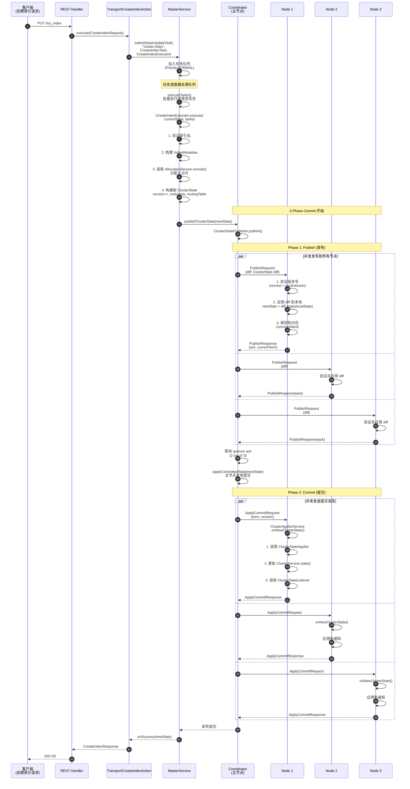

### 时序图说明

#### 两阶段提交 (2PC)

**Phase 1: Publish (发布)**

- **目的**: 将新状态发送到所有节点，但不立即生效
- **操作**:
  1. 计算 diff (oldState → newState)
  2. 发送 PublishRequest 到所有节点
  3. 节点验证并应用 diff，保存为 uncommitted
  4. 节点返回 ack
- **等待**: 等待 quorum (多数派) 的 ack

**Phase 2: Commit (提交)**

- **目的**: 通知所有节点提交新状态，使其生效
- **操作**:
  1. 主节点本地提交状态
  2. 发送 ApplyCommitRequest 到所有节点
  3. 节点标记状态为 committed
  4. 节点应用状态 (调用 listeners)
- **异步**: 不需要等待所有节点的响应

#### 增量发布 (Diff)

**Diff 内容**:

```java
public class ClusterStateDiff implements Diff<ClusterState> {
    private long toVersion;
    private String toUUID;
    private Diff<RoutingTable> routingTableDiff;
    private Diff<DiscoveryNodes> nodesDiff;
    private Diff<Metadata> metadataDiff;
    private Diff<ClusterBlocks> blocksDiff;
}
```

**优化效果**:

- 完整状态大小: 数MB (大型集群)
- Diff 大小: 数KB ~ 数十KB
- 网络传输减少: 90%+

#### 失败处理

**Publish 失败**:

- 少数节点失败: 继续 (已获得 quorum)
- 多数节点失败: 回滚，重试

**Commit 失败**:

- 节点未收到 Commit: 主节点重新发送
- 节点永久失败: 从集群中移除

---

## 3. 节点加入集群流程

### 3.1 节点发现与加入时序图

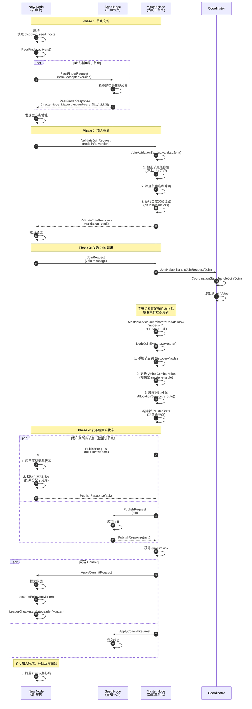

### 时序图说明

#### 节点发现机制

**1. Seed Hosts (种子节点)**

```yaml
discovery.seed_hosts:

  - 192.168.1.10:9300
  - 192.168.1.11:9300
  - 192.168.1.12:9300

```

**2. PeerFinder**

- 定期向种子节点发送 PeerFinderRequest
- 获取当前主节点和已知节点列表
- 自动更新连接池

#### 加入验证

**内置验证**:

1. 版本兼容性 (major version 必须匹配)
2. 许可证兼容性 (OSS / Basic / Gold / Platinum)
3. 节点名称唯一性
4. 集群名称一致性

**自定义验证**:

```java
public interface BiConsumer<DiscoveryNode, ClusterState> {
    void accept(DiscoveryNode joiningNode, ClusterState currentState);
}

// 示例
onJoinValidators.add((joiningNode, state) -> {
    if (joiningNode.getVersion().before(state.nodes().getMinNodeVersion())) {
        throw new IllegalStateException("Node version too old");
    }
});
```

#### 分片分配

**新节点加入后的分配策略**:

1. 重平衡副本分片到新节点
2. 优先分配未分配的分片
3. 考虑磁盘使用率和负载均衡

---

## 4. 分片分配流程

### 4.1 分片分配时序图

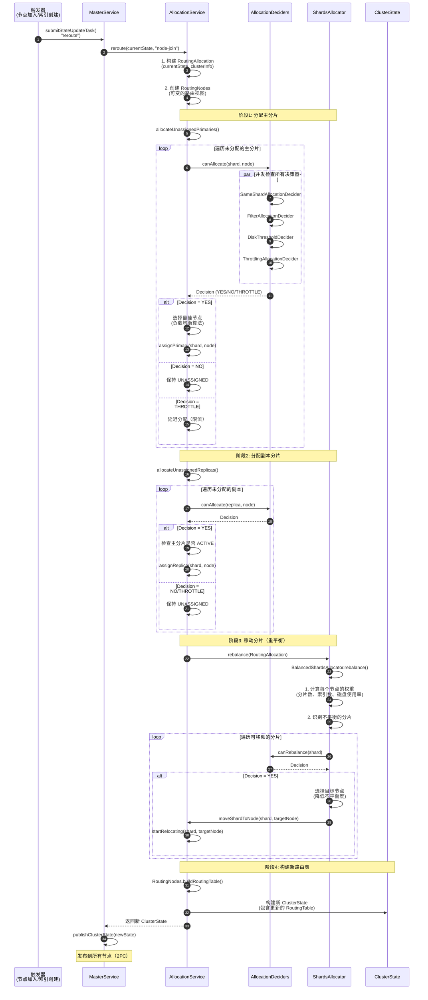

### 时序图说明

#### 分配阶段

**1. Primary Allocation (主分片分配)**

- **优先级**: 最高（主分片必须先分配）
- **策略**:
  - 恢复已存在的主分片（从磁盘）
  - 创建新的主分片（新索引）
  - 从快照恢复主分片
- **约束**: 主分片只能有一个

**2. Replica Allocation (副本分配)**

- **优先级**: 次高
- **策略**:
  - 主分片 ACTIVE 后才分配副本
  - 副本不能与主分片在同一节点
- **约束**: 副本数可配置

**3. Rebalance (重平衡)**

- **优先级**: 最低
- **策略**:
  - 平衡每个节点的分片数
  - 平衡每个索引的分片分布
  - 考虑磁盘使用率
- **限流**: 避免同时移动过多分片

#### 决策器优先级

| 决策器 | 优先级 | 作用 |
|---|---|---|
| SameShardAllocationDecider | 高 | 主副本不能在同一节点 |
| FilterAllocationDecider | 高 | 节点属性过滤 |
| DiskThresholdDecider | 高 | 磁盘空间检查 |
| ThrottlingAllocationDecider | 中 | 限流 |
| AwarenessAllocationDecider | 中 | 机架感知 |
| ShardsLimitAllocationDecider | 低 | 分片数量限制 |

#### 重平衡算法

**权重计算**:

```
nodeWeight = α × shardCount + β × indexCount + γ × diskUsage

α, β, γ 为权重系数
```

**不平衡度**:

```
imbalance = max(nodeWeight) - min(nodeWeight)
```

**目标**: 最小化 imbalance

---

## 相关文档

- [Elasticsearch-04-集群模块-概览](./Elasticsearch-04-集群模块-概览.md)
- [Elasticsearch-04-集群模块-API](./Elasticsearch-04-集群模块-API.md)
- [Elasticsearch-04-集群模块-数据结构](./Elasticsearch-04-集群模块-数据结构.md)

---
