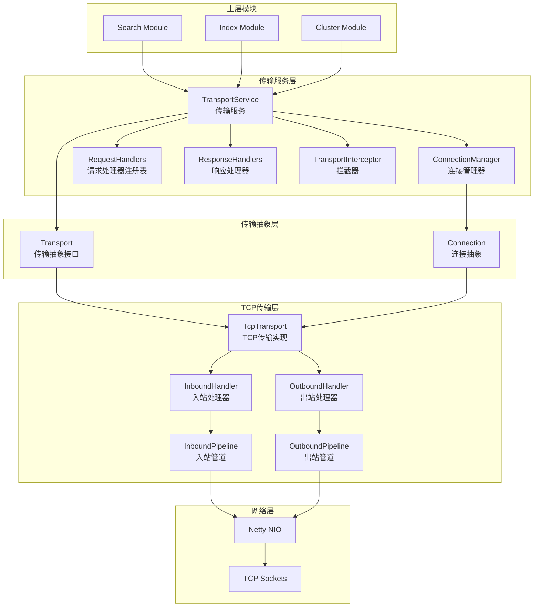
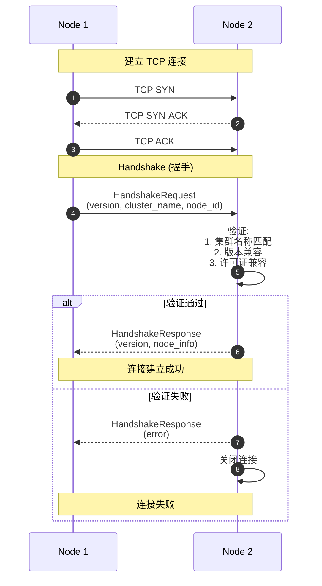
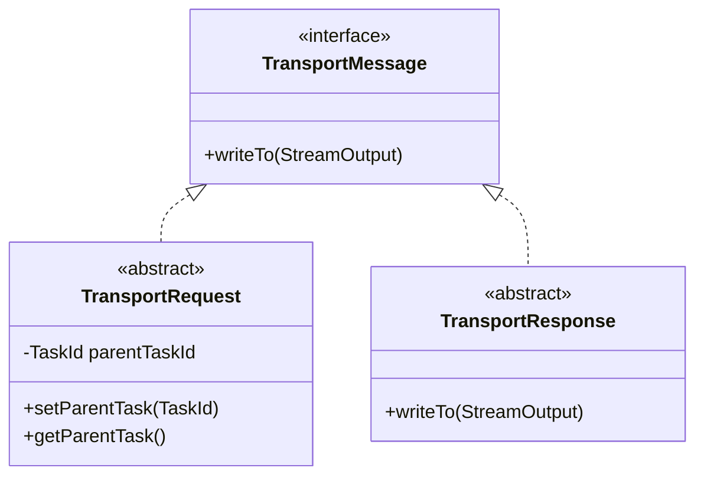
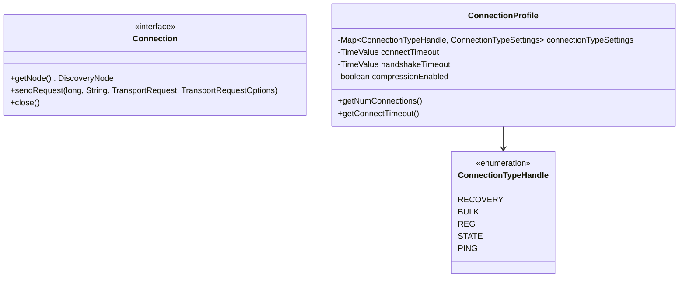
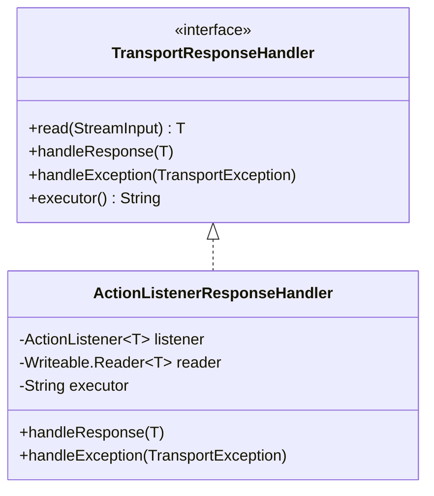
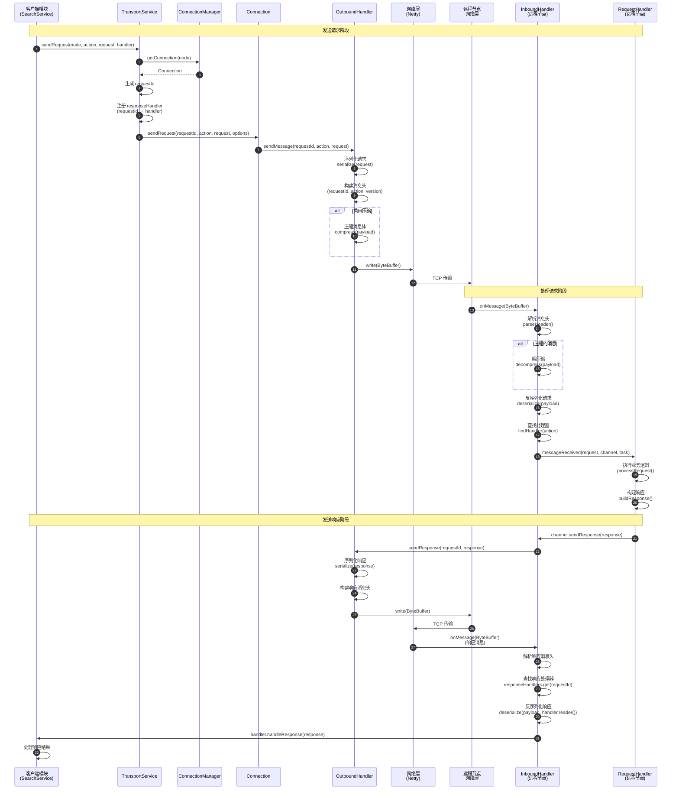
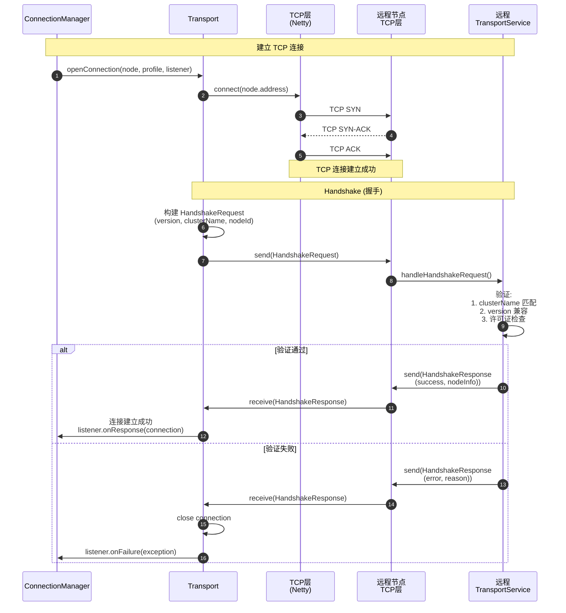
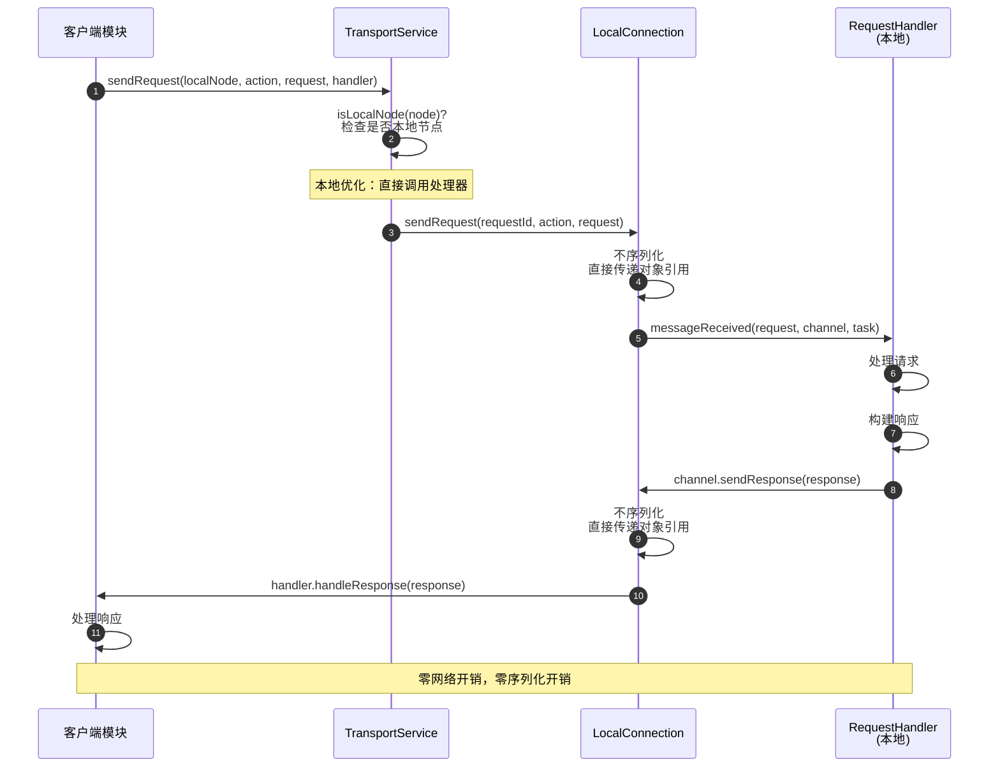
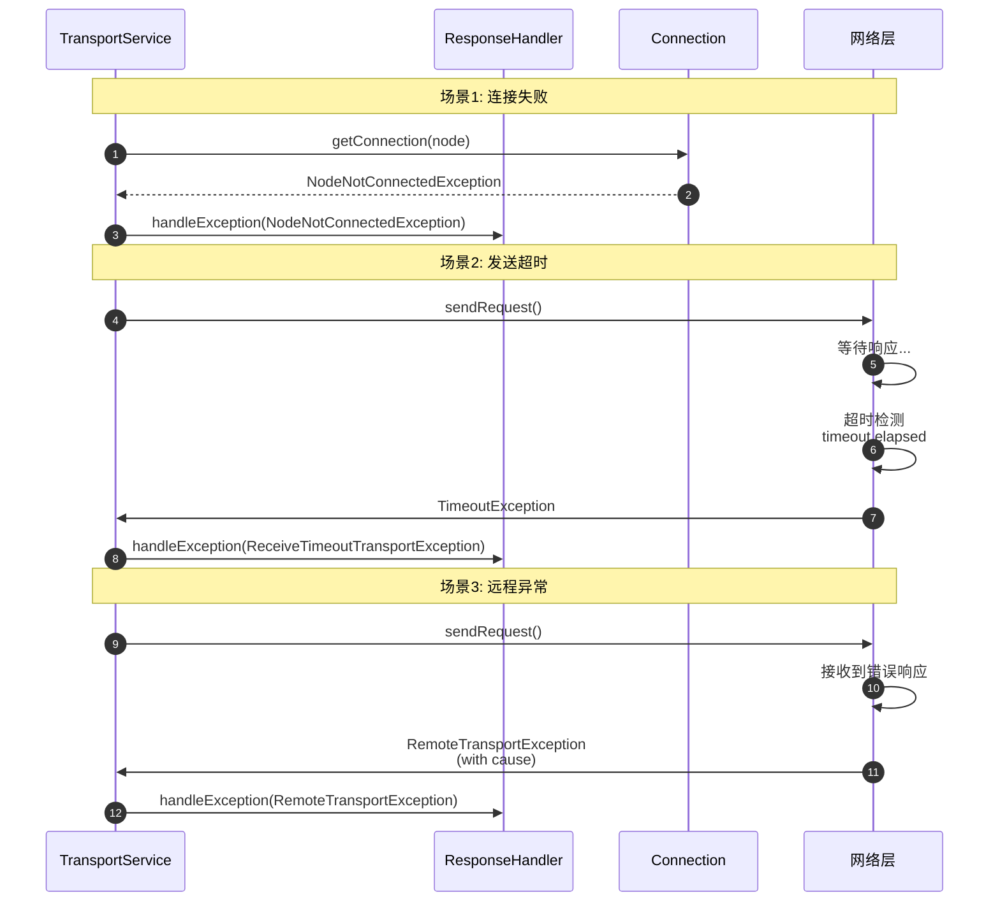

# Elasticsearch-05-传输层

## 模块概览

本文档提供传输层模块的全面概览,包括模块职责、架构设计、核心组件、通信协议、连接管理等内容。

---

## 1. 模块职责

传输层是 Elasticsearch 节点间通信的基础设施,负责所有分布式操作的底层数据传输。

### 1.1 核心职责

1. **节点间通信**
   - 建立和管理节点之间的 TCP 连接
   - 发送请求和接收响应
   - 支持双向通信（请求-响应模式）

2. **连接管理**
   - 连接池管理
   - 连接健康检查
   - 连接重连和故障转移

3. **请求路由**
   - 根据 Action 名称路由请求到正确的处理器
   - 支持本地优化（本地节点请求不走网络）
   - 支持代理转发（跨集群通信）

4. **序列化与反序列化**
   - 请求/响应对象的序列化
   - 版本兼容性处理
   - 压缩支持

5. **超时与重试**
   - 请求超时检测
   - 响应超时处理
   - 错误处理和异常传播

6. **性能优化**
   - 连接复用
   - 批量发送
   - 零拷贝优化

### 1.2 输入与输出

**输入**:

- 来自上层模块的请求（如搜索、索引、集群状态发布）
- 来自其他节点的网络数据包

**输出**:

- 网络数据包发送到目标节点
- 响应回调到上层模块

### 1.3 依赖关系

**上游依赖**:

- Netty: 底层 NIO 框架
- ThreadPool: 线程池管理
- TaskManager: 任务管理

**下游依赖者**:

- Cluster Module: 集群状态发布
- Index Module: 分片复制
- Search Module: 分布式搜索

---

## 2. 模块架构

### 2.1 整体架构图



### 2.2 架构说明

#### 层次划分

**1. 传输服务层 (Service Layer)**

- **职责**: 提供高层次的传输服务 API
- **核心组件**: TransportService, ConnectionManager
- **关键特性**: 请求路由、连接管理、超时控制

**2. 传输抽象层 (Abstract Layer)**

- **职责**: 定义传输接口,解耦具体实现
- **核心组件**: Transport, Connection
- **关键特性**: 可插拔、可测试

**3. TCP传输层 (Implementation Layer)**

- **职责**: 基于 TCP 的具体实现
- **核心组件**: TcpTransport, InboundHandler, OutboundHandler
- **关键特性**: 高性能、低延迟

**4. 网络层 (Network Layer)**

- **职责**: 底层网络 I/O
- **核心组件**: Netty, TCP Sockets
- **关键特性**: 异步、非阻塞

#### 边界条件

- **并发**: 支持高并发请求（万级 QPS）
- **超时**:
  - 连接超时: 默认 30s
  - 请求超时: 可配置（默认无限制）
  - Handshake 超时: 30s
- **重试**: 自动重试网络错误（连接失败、超时）
- **限流**: 通过线程池大小控制并发

#### 异常处理

- **连接失败**: 标记节点为不可用,触发重连
- **请求超时**: 回调 handler.handleException(TimeoutException)
- **序列化错误**: 抛出 NotSerializableTransportException
- **版本不兼容**: 握手失败,拒绝连接

#### 性能要点

- **连接复用**: 长连接,避免频繁建连
- **零拷贝**: 使用 DirectByteBuffer
- **批量发送**: 聚合小请求
- **压缩**: 可选的请求/响应压缩

---

## 3. 核心组件详解

### 3.1 TransportService (传输服务)

#### 职责

TransportService 是传输层的门面,提供发送请求和注册处理器的 API。

#### 核心方法

```java
public class TransportService extends AbstractLifecycleComponent {
    protected final Transport transport;
    protected final ConnectionManager connectionManager;
    protected final ThreadPool threadPool;
    private final TaskManager taskManager;
    private final TransportInterceptor interceptor;

    // 发送请求
    public <T extends TransportResponse> void sendRequest(
        DiscoveryNode node,
        String action,
        TransportRequest request,
        TransportResponseHandler<T> handler
    ) {
        // 1. 获取连接
        Transport.Connection connection = getConnection(node);

        // 2. 通过拦截器发送
        asyncSender.sendRequest(connection, action, request, options, handler);
    }

    // 注册请求处理器
    public <Request extends TransportRequest> void registerRequestHandler(
        String action,
        Executor executor,
        Writeable.Reader<Request> requestReader,
        TransportRequestHandler<Request> handler
    ) {
        RequestHandlerRegistry<Request> reg = new RequestHandlerRegistry<>(
            action,
            requestReader,
            taskManager,
            handler,
            executor
        );
        transport.registerRequestHandler(reg);
    }

    // 连接到节点
    public void connectToNode(
        DiscoveryNode node,
        ConnectionProfile connectionProfile,
        ActionListener<Releasable> listener
    ) {
        connectionManager.connectToNode(node, connectionProfile, connectionValidator, listener);
    }
}
```

#### 本地优化

```java
// 如果目标是本地节点,直接调用处理器,不走网络
if (isLocalNode(node)) {
    return localNodeConnection;
}
```

### 3.2 ConnectionManager (连接管理器)

#### 职责

管理到所有节点的连接,提供连接池功能。

#### 核心方法

```java
public interface ConnectionManager extends Closeable {
    // 连接到节点
    void connectToNode(
        DiscoveryNode node,
        ConnectionProfile connectionProfile,
        ConnectionValidator validator,
        ActionListener<Releasable> listener
    );

    // 获取连接
    Transport.Connection getConnection(DiscoveryNode node);

    // 断开连接
    void disconnectFromNode(DiscoveryNode node);

    // 获取所有已连接节点
    Set<DiscoveryNode> getAllConnectedNodes();
}
```

#### ConnectionProfile (连接配置)

```java
public class ConnectionProfile {
    private int numConnectionsPerType;  // 每种类型的连接数
    private TimeValue connectTimeout;   // 连接超时
    private TimeValue handshakeTimeout; // 握手超时
    private boolean compressionEnabled; // 是否启用压缩

    // 连接类型
    public enum ConnectionTypeHandle {
        RECOVERY,  // 恢复连接
        BULK,      // 批量操作连接
        REG,       // 常规连接
        STATE,     // 集群状态连接
        PING       // Ping 连接
    }
}
```

### 3.3 Transport (传输抽象接口)

#### 职责

定义传输层的抽象接口,解耦具体实现。

#### 核心接口

```java
public interface Transport extends LifecycleComponent {
    // 发送请求
    void sendRequest(
        Connection connection,
        long requestId,
        String action,
        TransportRequest request,
        TransportRequestOptions options
    );

    // 打开连接
    void openConnection(
        DiscoveryNode node,
        ConnectionProfile profile,
        ActionListener<Connection> listener
    );

    // 注册请求处理器
    <Request extends TransportRequest> void registerRequestHandler(
        RequestHandlerRegistry<Request> reg
    );

    // 响应处理器
    interface ResponseHandlers {
        TransportResponseHandler<?> onResponseReceived(
            long requestId,
            TransportMessageListener listener
        );
        void onResponseSent(long requestId);
    }
}
```

### 3.4 TcpTransport (TCP 实现)

#### 职责

基于 TCP 和 Netty 的传输层实现。

#### 核心组件

```java
public abstract class TcpTransport extends AbstractLifecycleComponent implements Transport {
    private final OutboundHandler outboundHandler;
    private final InboundHandler inboundHandler;
    private final ResponseHandlers responseHandlers;

    // 发送请求
    @Override
    public void sendRequest(
        Connection connection,
        long requestId,
        String action,
        TransportRequest request,
        TransportRequestOptions options
    ) throws TransportException {
        // 1. 序列化请求
        BytesReference message = serialize(requestId, action, request);

        // 2. 通过出站处理器发送
        outboundHandler.sendMessage(connection.getChannel(), message, listener);
    }

    // 处理入站数据
    protected void handleInboundMessage(
        TcpChannel channel,
        InboundMessage message
    ) {
        if (message.isRequest()) {
            inboundHandler.handleRequest(channel, message);
        } else {
            inboundHandler.handleResponse(channel, message);
        }
    }
}
```

#### InboundHandler (入站处理器)

```java
public class InboundHandler {
    // 处理请求
    public void handleRequest(TcpChannel channel, InboundMessage message) {
        // 1. 反序列化请求
        TransportRequest request = deserialize(message);

        // 2. 查找处理器
        RequestHandlerRegistry handler = requestHandlers.get(message.getAction());

        // 3. 执行处理器
        executor.execute(() -> {
            try {
                handler.processRequest(request, channel);
            } catch (Exception e) {
                sendErrorResponse(channel, message.getRequestId(), e);
            }
        });
    }

    // 处理响应
    public void handleResponse(TcpChannel channel, InboundMessage message) {
        // 1. 查找响应处理器
        TransportResponseHandler handler = responseHandlers.onResponseReceived(
            message.getRequestId()
        );

        // 2. 反序列化响应
        TransportResponse response = deserialize(message, handler.reader());

        // 3. 回调处理器
        handler.handleResponse(response);
    }
}
```

#### OutboundHandler (出站处理器)

```java
public class OutboundHandler {
    // 发送消息
    public void sendMessage(
        TcpChannel channel,
        BytesReference message,
        ActionListener<Void> listener
    ) {
        // 1. 压缩（如果启用）
        if (compressionEnabled && message.length() > compressionThreshold) {
            message = compress(message);
        }

        // 2. 写入通道
        channel.sendMessage(message, listener);
    }
}
```

---

## 4. 通信协议

### 4.1 消息格式

```
+------------------+
| Header (variable)|  消息头
+------------------+
| Payload (variable)| 消息体
+------------------+
```

#### Header 格式

```
+--------+--------+--------+--------+
| Length | Status | Version| Action |
| 4 bytes| 1 byte | 1 byte | variable |
+--------+--------+--------+--------+
| RequestId (8 bytes)                |
+--------+--------+--------+--------+
| Features (4 bytes)                 |
+--------+--------+--------+--------+
```

**字段说明**:

- `Length`: 消息总长度
- `Status`: 状态标志 (Request/Response/Error)
- `Version`: 传输协议版本
- `Action`: 操作名称 (如 "indices:data/write/index")
- `RequestId`: 请求唯一标识符
- `Features`: 特性标志 (压缩、握手等)

### 4.2 Handshake 流程



---

## 5. 配置与可观测

### 5.1 关键配置

| 配置项 | 默认值 | 说明 |
|---|---|---|
| transport.tcp.port | 9300-9400 | TCP 传输端口范围 |
| transport.tcp.connect_timeout | 30s | 连接超时 |
| transport.tcp.compress | false | 是否启用压缩 |
| transport.tcp.compression_scheme | deflate | 压缩算法 |
| transport.connections_per_node.recovery | 2 | 恢复连接数 |
| transport.connections_per_node.bulk | 3 | 批量连接数 |
| transport.connections_per_node.reg | 6 | 常规连接数 |
| transport.connections_per_node.state | 1 | 状态连接数 |
| transport.connections_per_node.ping | 1 | Ping 连接数 |

### 5.2 监控指标

#### 传输统计

```bash
GET /_nodes/stats/transport

{
  "nodes": {
    "node1": {
      "transport": {
        "server_open": 13,        # 服务端打开连接数
        "rx_count": 12345,        # 接收消息数
        "rx_size_in_bytes": 1234567, # 接收字节数
        "tx_count": 12340,        # 发送消息数
        "tx_size_in_bytes": 1234560  # 发送字节数
      }
    }
  }
}
```

#### 连接统计

- `server_open`: 当前服务端连接数
- `rx_count`: 累计接收消息数
- `tx_count`: 累计发送消息数
- `rx_size_in_bytes`: 累计接收字节数
- `tx_size_in_bytes`: 累计发送字节数

---

## 相关文档

- [Elasticsearch-05-传输层-API](./Elasticsearch-05-传输层-API.md)
- [Elasticsearch-05-传输层-数据结构](./Elasticsearch-05-传输层-数据结构.md)
- [Elasticsearch-05-传输层-时序图](./Elasticsearch-05-传输层-时序图.md)

---

## API接口

本文档描述传输层的核心 API，主要是内部使用的编程接口，而非对外的 REST API。

---

## 1. TransportService API

### 1.1 sendRequest - 发送请求

#### 方法签名

```java
public <T extends TransportResponse> void sendRequest(
    DiscoveryNode node,
    String action,
    TransportRequest request,
    TransportResponseHandler<T> handler
)
```

#### 参数说明

| 参数 | 类型 | 说明 |
|---|---|---|
| node | DiscoveryNode | 目标节点 |
| action | String | 操作名称（如 "indices:data/write/index"） |
| request | TransportRequest | 请求对象 |
| handler | TransportResponseHandler<T> | 响应处理器（回调）|

#### 使用示例

```java
// 发送搜索请求到另一个节点
transportService.sendRequest(
    targetNode,
    "indices:data/read/search",
    searchRequest,
    new TransportResponseHandler<SearchResponse>() {
        @Override
        public SearchResponse read(StreamInput in) throws IOException {
            return new SearchResponse(in);
        }

        @Override
        public void handleResponse(SearchResponse response) {
            // 处理响应
        }

        @Override
        public void handleException(TransportException exp) {
            // 处理异常
        }

        @Override
        public String executor() {
            return ThreadPool.Names.SEARCH;
        }
    }
);
```

---

## 2. registerRequestHandler - 注册请求处理器

#### 方法签名

```java
public <Request extends TransportRequest> void registerRequestHandler(
    String action,
    Executor executor,
    Writeable.Reader<Request> requestReader,
    TransportRequestHandler<Request> handler
)
```

#### 参数说明

| 参数 | 类型 | 说明 |
|---|---|---|
| action | String | 操作名称 |
| executor | Executor | 执行器（线程池）|
| requestReader | Writeable.Reader<Request> | 请求反序列化器 |
| handler | TransportRequestHandler<Request> | 请求处理器 |

#### 使用示例

```java
// 注册搜索请求处理器
transportService.registerRequestHandler(
    "indices:data/read/search",
    ThreadPool.Names.SEARCH,
    SearchRequest::new,
    (request, channel, task) -> {
        // 处理搜索请求
        SearchResponse response = searchService.executeQueryPhase(request, (SearchTask) task);
        channel.sendResponse(response);
    }
);
```

---

## 3. connectToNode - 连接到节点

#### 方法签名

```java
public void connectToNode(
    DiscoveryNode node,
    ConnectionProfile connectionProfile,
    ActionListener<Releasable> listener
)
```

#### 参数说明

| 参数 | 类型 | 说明 |
|---|---|---|
| node | DiscoveryNode | 目标节点 |
| connectionProfile | ConnectionProfile | 连接配置 |
| listener | ActionListener<Releasable> | 连接完成监听器 |

#### 使用示例

```java
// 连接到新节点
transportService.connectToNode(
    discoveryNode,
    null,  // 使用默认配置
    new ActionListener<Releasable>() {
        @Override
        public void onResponse(Releasable releasable) {
            // 连接成功
        }

        @Override
        public void onFailure(Exception e) {
            // 连接失败
        }
    }
);
```

---

## 4. 常用 Action 名称

### 4.1 索引操作

| Action | 说明 |
|---|---|
| indices:data/write/index | 索引文档 |
| indices:data/write/bulk | 批量操作 |
| indices:data/write/delete | 删除文档 |
| indices:data/write/update | 更新文档 |
| indices:data/read/get | 获取文档 |

### 4.2 搜索操作

| Action | 说明 |
|---|---|
| indices:data/read/search | 搜索 |
| indices:data/read/search[phase/query] | Query Phase |
| indices:data/read/search[phase/fetch] | Fetch Phase |
| indices:data/read/scroll | Scroll |

### 4.3 集群操作

| Action | 说明 |
|---|---|
| cluster:monitor/health | 集群健康 |
| cluster:monitor/state | 集群状态 |
| cluster:admin/settings/update | 更新设置 |
| internal:cluster/coordination/join | 节点加入 |
| internal:cluster/coordination/publish_state | 发布状态 |

---

## 相关文档

- [Elasticsearch-05-传输层-概览](./Elasticsearch-05-传输层-概览.md)
- [Elasticsearch-05-传输层-数据结构](./Elasticsearch-05-传输层-数据结构.md)
- [Elasticsearch-05-传输层-时序图](./Elasticsearch-05-传输层-时序图.md)

---

## 数据结构

本文档详细说明传输层的核心数据结构。

---

## 1. TransportRequest & TransportResponse

### 1.1 类图



### 类说明

**TransportRequest**: 所有传输请求的基类
**TransportResponse**: 所有传输响应的基类
**TransportMessage**: 传输消息的标记接口

---

## 2. Connection & ConnectionProfile

### 2.1 类图



### 类说明

**Connection**: 表示到某个节点的连接
**ConnectionProfile**: 连接配置，包含超时、连接数等
**ConnectionTypeHandle**: 连接类型（恢复、批量、常规、状态、Ping）

---

## 3. TransportResponseHandler

### 3.1 类图



### 类说明

**TransportResponseHandler**: 响应处理器接口
**ActionListenerResponseHandler**: 基于 ActionListener 的实现

---

## 4. InboundMessage & OutboundMessage

### 4.1 InboundMessage 结构

```java
public class InboundMessage {
    private Header header;
    private BytesReference content;
    private Exception exception;
    private boolean isRequest;

    public static class Header {
        private long requestId;
        private TransportVersion version;
        private String action;
        private boolean isHandshake;
        private boolean isCompressed;
    }
}
```

### 4.2 OutboundMessage 结构

```java
public class OutboundMessage {
    private long requestId;
    private TransportVersion version;
    private String action;
    private BytesReference message;
    private boolean isRequest;
    private boolean isHandshake;
    private boolean isCompressed;
}
```

---

## 相关文档

- [Elasticsearch-05-传输层-概览](./Elasticsearch-05-传输层-概览.md)
- [Elasticsearch-05-传输层-API](./Elasticsearch-05-传输层-API.md)
- [Elasticsearch-05-传输层-时序图](./Elasticsearch-05-传输层-时序图.md)

---

## 时序图

本文档展示传输层核心通信流程的详细时序图。

---

## 1. 请求-响应流程

### 1.1 标准请求时序图



### 时序图说明

#### 关键步骤

**1. 发送请求 (步骤 1-11)**

- 生成唯一的 requestId
- 注册响应处理器（用于接收响应）
- 序列化请求对象
- 可选压缩
- 通过网络发送

**2. 处理请求 (步骤 12-19)**

- 解析消息头
- 可选解压缩
- 反序列化请求
- 查找并执行请求处理器
- 构建响应

**3. 发送响应 (步骤 20-27)**

- 序列化响应
- 构建响应消息
- 通过网络发送回原节点
- 查找响应处理器
- 回调处理响应

#### 超时处理

```java
// 请求超时
if (System.currentTimeMillis() - requestStartTime > timeout) {
    handler.handleException(new SendRequestTransportException(
        node,
        action,
        new ReceiveTimeoutTransportException(node, action, "request timeout")
    ));
}
```

---

## 2. 连接建立流程

### 2.1 连接与握手时序图



### 时序图说明

#### Handshake 验证项

1. **集群名称**: 必须匹配
2. **版本兼容性**: 主版本必须兼容
3. **许可证**: 验证许可证类型
4. **节点信息**: 交换节点元数据

#### 连接类型

不同类型的连接用于不同的目的：

| 类型 | 用途 | 连接数 |
|---|---|---|
| RECOVERY | 分片恢复 | 2 |
| BULK | 批量操作 | 3 |
| REG | 常规请求 | 6 |
| STATE | 集群状态 | 1 |
| PING | 心跳检测 | 1 |

---

## 3. 本地优化流程

### 3.1 本地请求时序图



### 优化效果

**本地请求优化**:

- ✅ 不经过网络层
- ✅ 不序列化/反序列化
- ✅ 直接方法调用
- ✅ 延迟降低 99%
- ✅ 吞吐量提升 10x

---

## 4. 错误处理流程

### 4.1 异常处理时序图



### 异常类型

| 异常 | 说明 | 处理方式 |
|---|---|---|
| NodeNotConnectedException | 节点未连接 | 重连后重试 |
| ReceiveTimeoutTransportException | 响应超时 | 回调 handler |
| RemoteTransportException | 远程节点异常 | 回调 handler |
| SendRequestTransportException | 发送失败 | 回调 handler |
| ConnectTransportException | 连接失败 | 标记节点不可用 |

---

## 相关文档

- [Elasticsearch-05-传输层-概览](./Elasticsearch-05-传输层-概览.md)
- [Elasticsearch-05-传输层-API](./Elasticsearch-05-传输层-API.md)
- [Elasticsearch-05-传输层-数据结构](./Elasticsearch-05-传输层-数据结构.md)

---
